# Microsoft Fabric Chat with your Data in a Day 实验室 1

## 目录

- 文档结构
- 应用场景/问题陈述
- 简介
  - 任务 1：在虚拟环境下工作
  - 任务 2：评估您的数据的 AI 就绪情况
  - 任务 3：在 Power BI Copilot 中编写提示

# 文档结构

本实验室包含用户需要遵循的步骤以及可提供直观协助的关联屏幕截图。在每个屏幕截图中，以橙色框突出显示的部分指出了用户应注意的区域。

# 应用场景/问题陈述

您的组织刚刚参加完 Microsoft 会议回来，在会上他们听到并看到了由 Copilot 提供支持的 Chat with your Data 体验如何显著加快获得见解的时间。这些演示展示了自然语言查询如何解锁强大的分析功能，前提是基础语义模型结构良好并针对 AI 进行了优化。

**当前目标**

您需要评估 Power BI Desktop 中的现有语义模型。您的目标是测试它在 Copilot 体验中的表现，并确定需要改进的方面。

使用 Copilot 界面中内置的 PBI Desktop 探索语义模型

识别 Copilot 难以解释意图的阻碍点

推荐和实施增强功能以提高 Copilot 的理解

记录您的发现并准备模型以供更广泛的组织使用

# 简介

在讲师演示中，您了解了 Chat with your Data 体验的执行情况，在本实验室中，您将了解为 AI 准备数据模型的必要性。本实验室将展示各种用户请求以及 Copilot 如何响应这些请求。您还将了解如何验证这些回复的准确度和正确性。在未来的实验室中，您将学习如何应用最佳做法并使用准备数据工具来增强和改进 Copilot 体验！

## 任务 1：在虚拟环境下工作

1. 虚拟环境体验非常出色，可为您提供可用空间来使用 Chat with your Data 体验！让我们看几个关键领域和要点。

   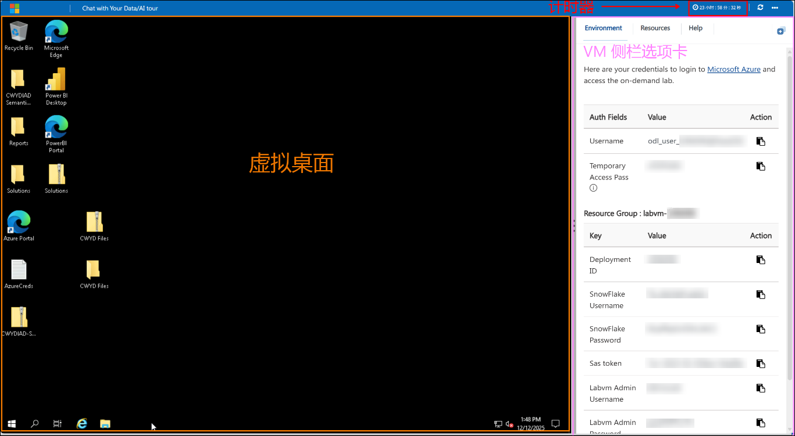

2. 让我们看几个关键领域：
   - 虚拟桌面就像一台功能齐全的计算机，可供您在浏览器中使用！

   - 您可以在 VM 侧栏选项卡中访问实验室文档、凭据等。

   - 计时器显示您使用虚拟机的剩余时间。

   **ℹ️ 重要提示**

3. 在整个课堂实验室中，这些**重要提示**框将详细介绍有价值的信息。尽量不要跳过它们！例如，如果未看到 VM 侧栏选项卡，请确保将其完全展开，如下图所示。

   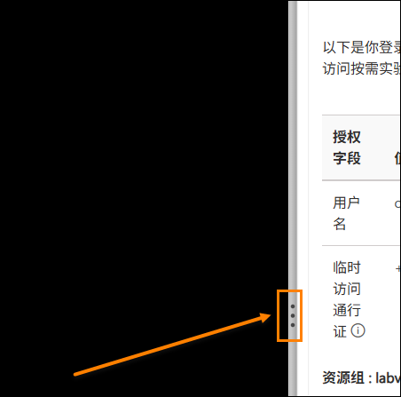

4. 您可以使用侧栏选项卡底部的页码轻松导航实验室。

   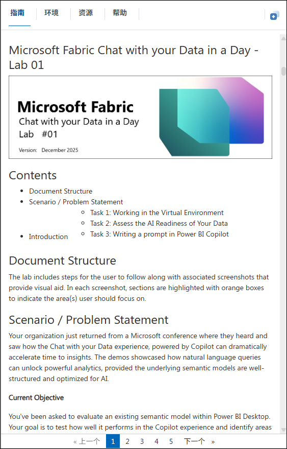

5. 在课堂上，您可以完全在虚拟机内工作。但是，一些与会者更喜欢使用 Incognito 浏览器并使用授予他们的虚拟机凭据登录到 Power BI Desktop。这是完全可行的！

## 任务 2：评估您的数据的 AI 就绪情况

1. 现在，您已经了解了虚拟机的主要方面，请继续了解转到 Power BI 门户按钮以启动
   Power BI 服务。

   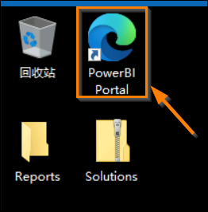

2. 使用凭据页面上和文档中列出的凭据，在“电子邮件访问”区域中提供电子邮件。
   - **用户名/电子邮件：** <inject key="AzureAdUserEmail"></inject>

     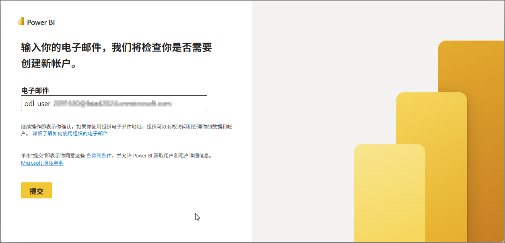

3. 然后，通过相同凭据使用 Microsoft **登录**框并单击**下一步**。

   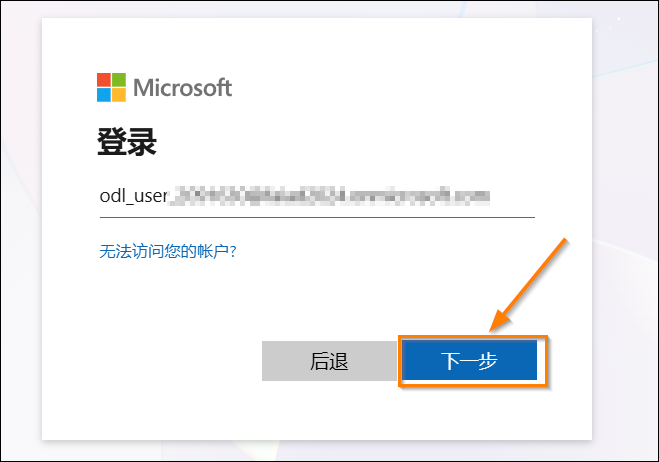

4. 从凭据页面或您的实验室文档中输入提供的**临时访问密码**，然后按**登录**。（可选）选择“是”以保持登录状态。
   - **密码：** <inject key="AzureAdUserPassword"></inject>

     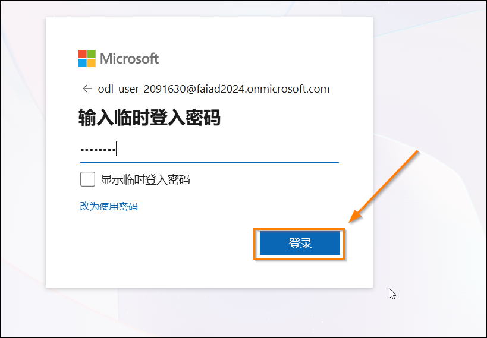

5. 我们将首先导航到左侧菜单上的**工作区**区域。

   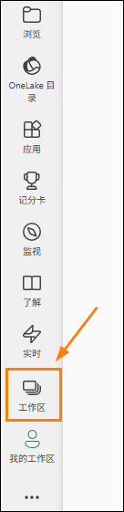

6. 现在，我们将通过选择“新建工作区”按钮来创建一个**新工作区**。

   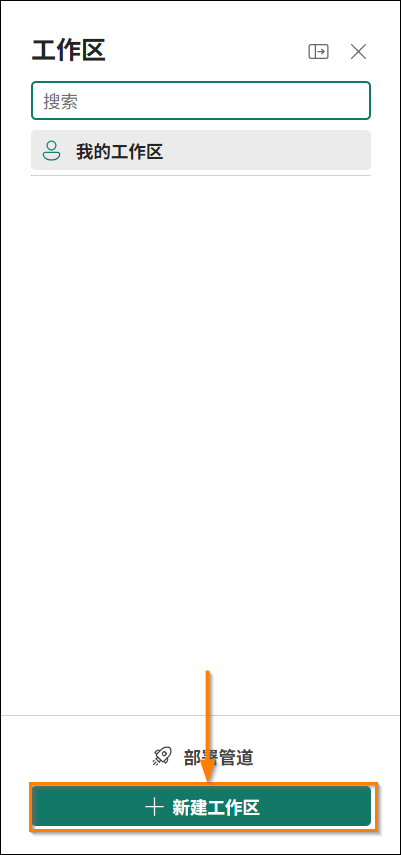

7. 接下来，将工作区命名为：**Fabrikam*Lab*<inject key="DeploymentID" enableCopy="false"></inject>**.

   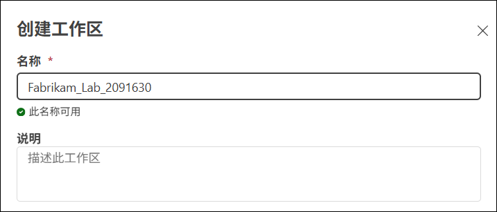

8. 您的 7 位数代码是您为课堂分配的用户名的一部分。请使用此代码！请参阅下面的屏幕截图。

   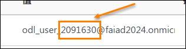

9. 例如，John A. Smith 将是：**Fabrikam*Lab*<inject key="DeploymentID" enableCopy="false"></inject>**

   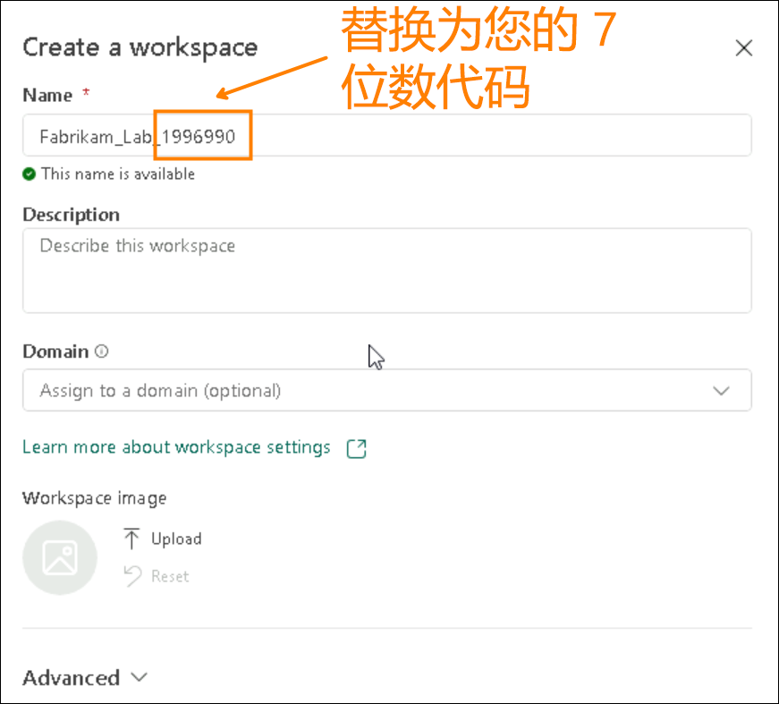

10. 接下来，您需要向您的工作区分配 Fabric 容量。

11. 单击**高级**以展开设置工作区时的高级选项。

    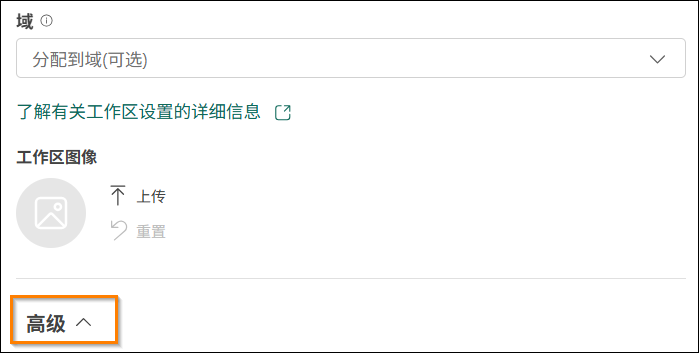

12. 确保已选择 **Fabric 容量**。再向下滚动一部分，然后从下拉菜单中**随机**选择一个容量！

    **ℹ️ 重要提示**

13. 用于此课堂的 Fabric 环境将经常更新，因此您可能不具有以下屏幕截图中列出的相同容量。只需选择任何可用容量即可！

    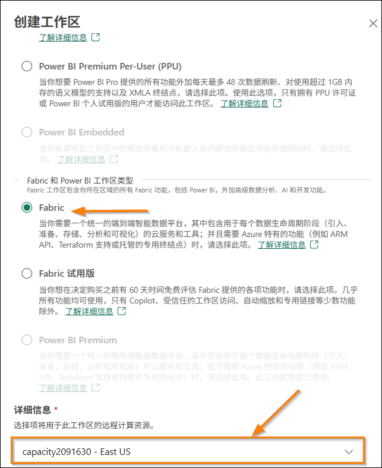

14. 单击**应用**。

    

    太棒了！我们将使用 Fabric 容量工作区来探索 Chat with your Data 所提供的所有最佳功能！

15. 从课堂文件中打开名为 **CDIAD – Lab 01 – Start** 的文件，以开始探索 Chat with your Data 体验。

    

16. 在 Power BI Desktop 文件中输入您的电子邮件地址 **<inject key="AzureAdUserEmail"></inject>**, 然后按“继续”以使用您的凭据登录：

    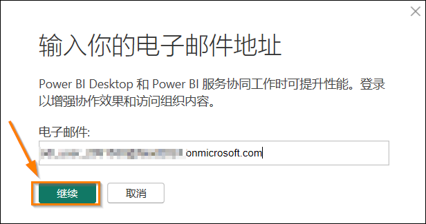

17. 此外，使用相同的 **用户名：<inject key="AzureAdUserEmail"></inject>** 和 **临时访问密码：<inject key="AzureAdUserPassword"></inject>** 通过 Microsoft 登录窗口登录。

    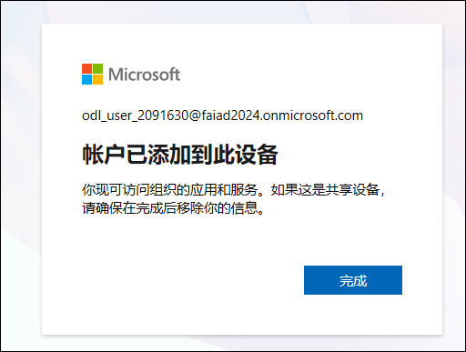

18. 打开初始 PBIX 文件后，继续转到 Copilot 按钮并选择它以打开 Copilot 体验。

    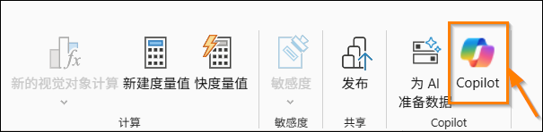

19. 如果您已登录，系统将打开一个名为“连接到支持 Copilot 的工作区”的**新窗口**。单击**选择工作区** 选项，然后选择您刚才创建的工作区。

    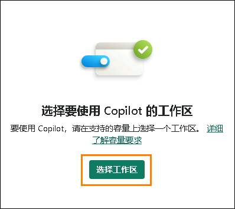

    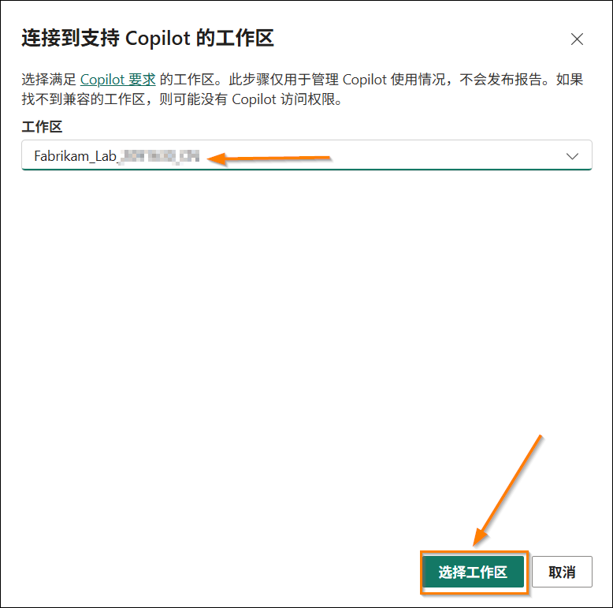

20. 如果您在下一个屏幕上收到提示，请单击**开始**。

    

21. 欢迎使用 Power BI 中的 Copilot 体验！在此启动屏幕上，您将在顶部 **(1)** 收到一些提示想法，然后您可以在底部的部分中编写您的请求 **(2)**.

    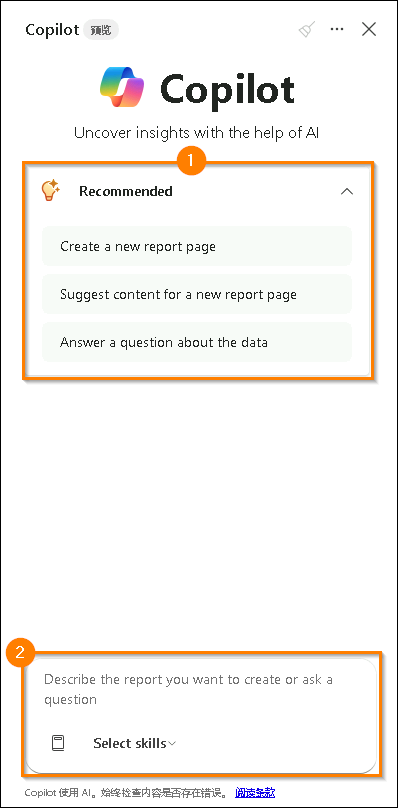

## 任务 3：在 Power BI Copilot 中编写提示

在本部分中，您将编写各种提示并探索 Power BI Copilot 体验返回的结果。

1. 单击提示并编写以下内容：**Show total purchases by employee**。然后单击 **Enter**。

   

   **可能的选项：**

   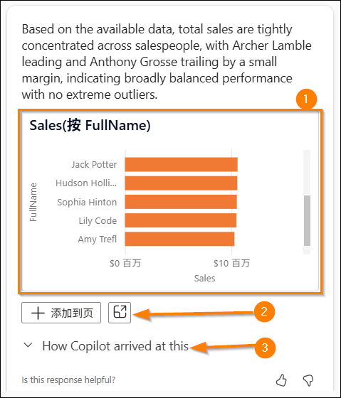

   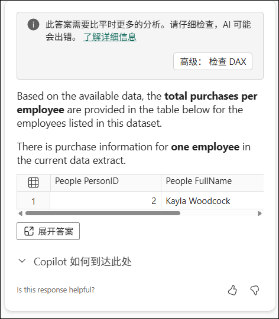

   **ℹ️ 重要提示**

   由于许多因素，AI 返回不确定的结果。如本课堂前面所述，您的结果可能有所不同，并且可能与实验室不一致。请注意，这些未做好准备的 AI 数据针对完全相同的问题会产生不同的结果。请继续并尽可能探索所显示的功能和特性！

   您甚至可能会被问到如下所示的跟进问题：

   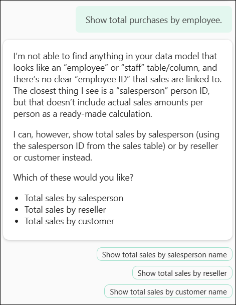

   如果需要，请选择诸如 **Show total purchases by employee** 或 **continue prompting** 的最贴切问题。

2. 现在返回了很多信息。让我们来深入了解本部分。
   1. **(1)** 比较总采购和员工的可视化。

   2. **(2)** **添加到页面** 或 **弹出** 并 **展开** 视觉对象的区域。

   3. **(3)** _HCAAT：_ Copilot 如何找到此答案。

      

3. 单击 _HCAAT_：**Copilot 如何找到此答案**按钮，以查看 Copilot 答案背后的逻辑。

   **可能的选项：**

   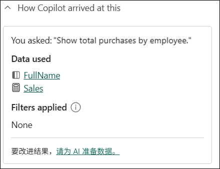

   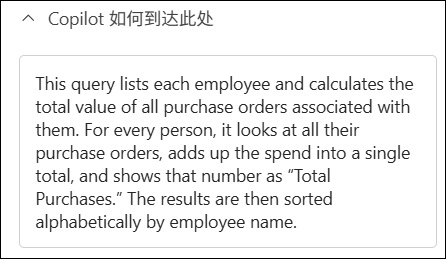

4. 将鼠标悬停在 **_FullName_**、**_Sales_**，甚至 **_IsSalesperson_** 上，以查看 Copilot 在回答问题时使用的**字段**和**主表**。

   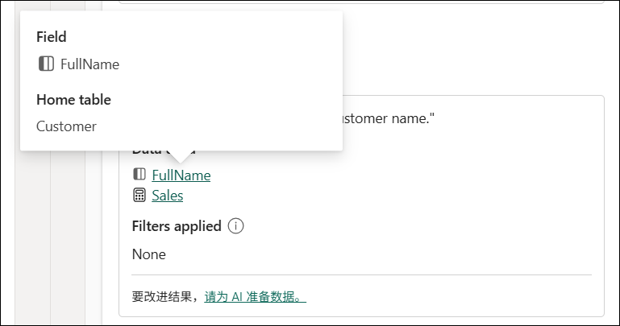

   不幸的是，此结果不正确。我们要求的是总采购，但收到的是**总销售**！另一个 DAX 查询仅查看了一名员工。似乎这些数据需要做好准备！可以这样想，尚未为 Copilot 做好准备的数据就像一名第一天上班的新手数据分析师，而已为 Copilot 做好准备的数据就像向您的特定组织中具有多年分析经验的熟练数据分析师提出问题。

   在为 Copilot 准备数据时，需要考虑两个主要事项。

   首先，我们可以编写一个更好的提示以提供更多的特异性，这肯定会有所帮助。但是，许多用户不知道如何编写有效的提示，他们也可能对数据不够了解，无法具体说明。

   **ℹ️ 重要提示**

   Copilot 的回复取决于您提问的方式。清晰、具体的提示可产生更准确的见解和更快的解决方案。处理数据时，尽量包含上下文、预期结果以及任何相关的筛选器或列。您的提示越好，获得的回复就越好！

   其次，作为数据分析师，我们可以为 Copilot 准备数据并预测这些类型的请求，从而使 Copilot 回复更加准确。本课堂的目的是教授您所有可用的最佳做法和工具，以改善 Chat with your Data 体验。

5. 让我们再试一次，但要提供更具体的提示，在 Copilot 提示中，键入：**Show total purchases from the PO table by employee**。

   

6. 您将注意到，创建的视觉对象中只有一个名为“Kayla Woodcock”的员工。这是正确的！Kayla 是唯一进行采购的员工。因此，通过更具体的提示，我们可以获得更好的回复。
   此外，如果我们从一开始就使用名为“总采购”的度量值来准备语义模型，我们就可以避免这种情况！

   **可能的选项：**

   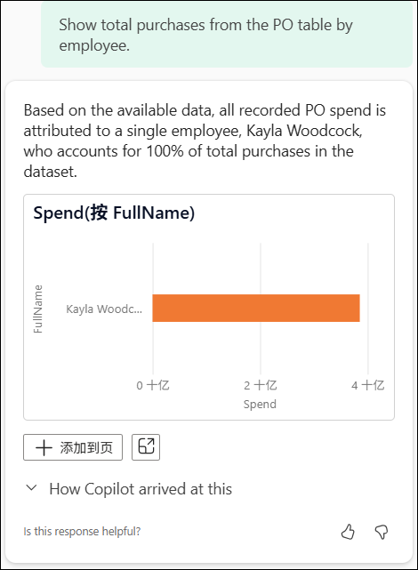

   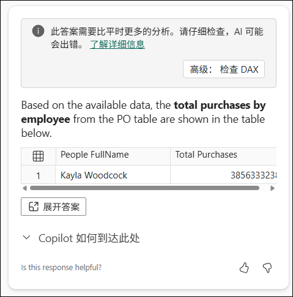

7. 始终验证结果以及 Copilot 找到答案的方式非常重要。单击 **HCAAT**，Copilot
   如何找到此答案。

   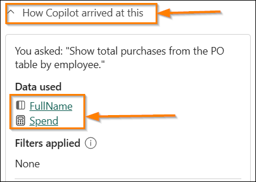

   **如果** Copilot 提供 DAX 查询，请尝试按**检查 DAX**。

   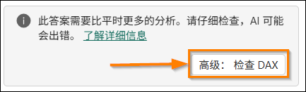

8. 我们可以看到 Copilot 使用了“People”表中的“FullName”列，还使用了“Spend”度量值。甚至我们的 DAX 查询也是如此。Spend 度量值的名称可能更好，可以改善 Copilot 体验。

   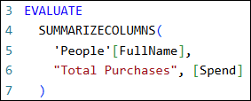

9. 在这种情况下，Spend 是什么意思？和 Purchases 是一回事吗？我们可能仍然从 Copilot 收到不正确的回复。接下来，让我们请求 Copilot 向我们解释 Spend 的计算方式！

10. 在 Copilot 提示中键入：**How is the measure Spend calculated**

    **可能的选项：**

    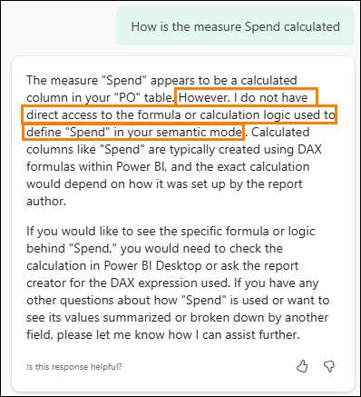

    

11. Copilot 在对计算可能执行的操作进行一般性解释方面做得很好。但您可能会在本定义中看到诸如“一般”或“通常”之类的术语，因为这是一种概括。您可能还会注意到，Copilot 明确告诉您，它无权访问确切的公式或计算逻辑，因此无法为您提供具体答案。

    在另一张图中，Copilot 已经能够成功抓取实际的度量值、对其进行解释，并提供与当前筛选器上下文中的支出关联的答案！

    **ℹ️ 重要提示**

    在未来的实验室中，您将了解如何为 Copilot 提供回答这些问题所需的其他业务上下文，并让用户对 Copilot 的回复更有信心！

12. 现在，让我们进一步展开并创建一个视觉对象来演示 Copilot 将如何根据数据模型和报表中的变化进行调整。

13. 在 Copilot 提示中键入：**Create a new report page with a bar chart visual for sales and product tag**.

    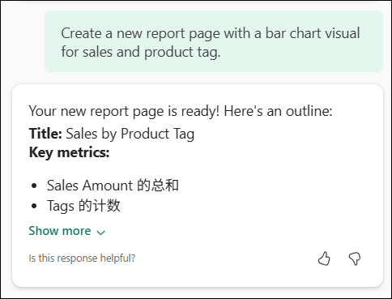

    您可能需要继续提示 Copilot，如下所示：

    

    尽量匹配**总销售**和**产品标记**元素。

    请注意，Copilot 已在一个全新的报表页面上制作了视觉对象！

    **可能的选项：**

    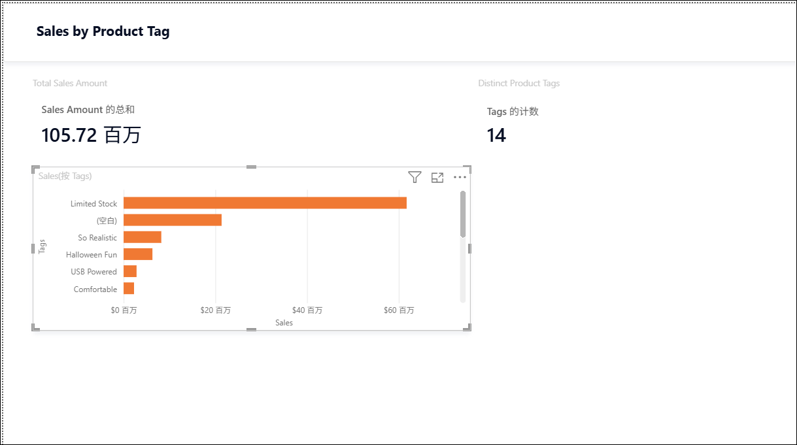

    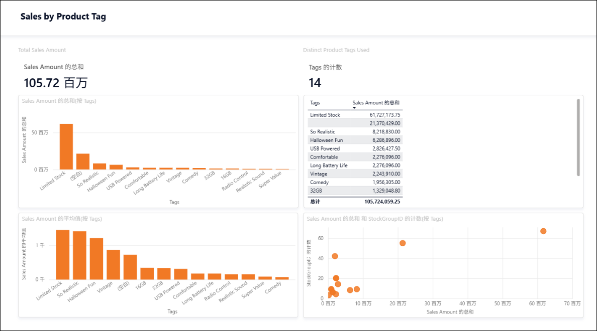

14. 选择 Copilot 创建的条形图视觉对象，然后转到模型**视图**。请注意，它包含一个用于规避数据模型的筛选器！这真是太棒了，因为“产品标记”和“总销售”在我们当前的数据模型中通常不起作用。

    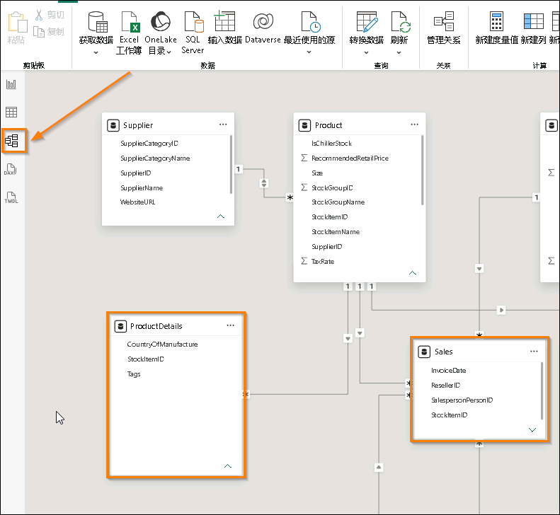

15. 这可能是重复计算某些值，因此让我们将其删除。返回到报表视图，确保仍处于单击状态的图形上。

    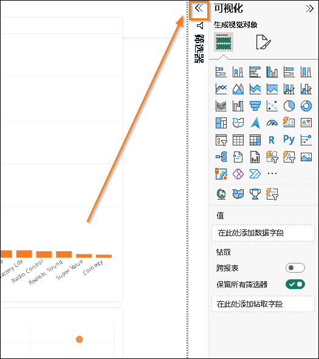

16. 在右侧，转到“此视觉对象上的筛选器”下的**筛选器**选项卡，以从条形图的轴中删除“包含产品的产品详细信息”。

    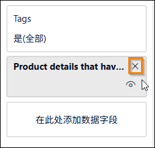

17. 请注意，这些值均相同，均为 **\$105,724,059**，这可以通过将鼠标悬停在 Copilot 创建的视觉对象中的数据条上来显示。这是语义模型中关系不正确的明显迹象。

    

18. 由于语义模型设计，上面 Copilot 返回的回复不正确。Copilot 能够制作一个筛选器来根据我们的请求进行调整！这说明了为什么拥有为 AI 做好准备的数据模型非常重要。在未来的实验室中，我们将研究这些表和关系，以及如何改进它们以改善 Copilot 体验！

19. 该视觉对象非常清楚地表明 Copilot 回复存在问题。查看此数据的另一种方法是向 Copilot 提出问题并查看回复。在 Copilot 提示中键入：**Show total sales by product tag**。

    

20. Copilot 在回复中明确告知您，销售额**没有差异**。每当您在 Copilot 中看到此措辞时，都表明某些内容可能不正确。

    

21. 让我们从 Copilot 中提出另一个问题：**Show total sales by State**。

    

    您可能会得到多个回复，_您的结果会有所不同！_ 一种可能的回复如下：

    **可能的选项：**

    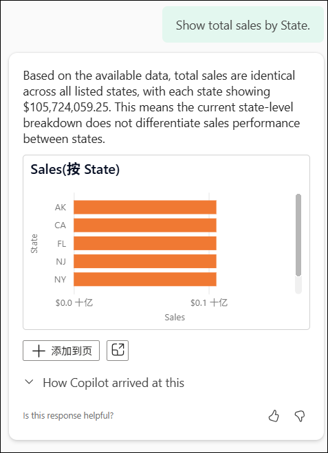

    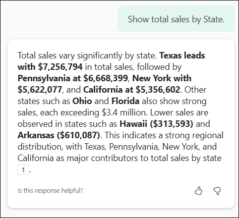

22. 本回复并不完全正确。同样，是否存在数据模型错误？可能是数据模型还是我们语言的模糊性？选择 _HCAAT_：Copilot 如何找到此答案，并将鼠标悬停在使用的 **State** 和 **Sales** 数据. **Sales** 是通过“Sales”表中的显式度量值准确收集的，但我们的 **_State_** 字段来自“Customer”表！

    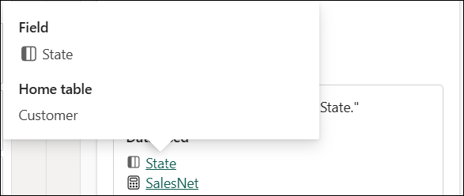

23. 转到模型视图 并查看将 Customer 链接到 Sales 的数据模型关系。这完美地解释了我们不正确的可视化！现在，我们可以看到，我们的语言和数据模型必须保持一致。

    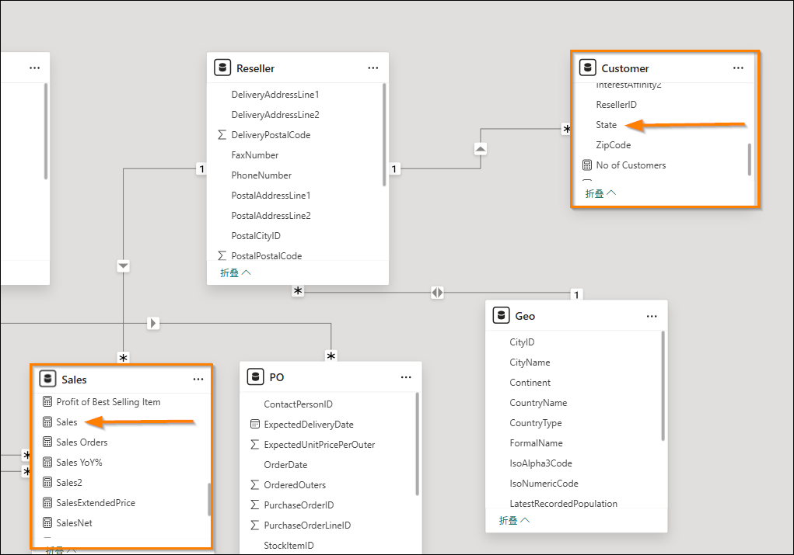

    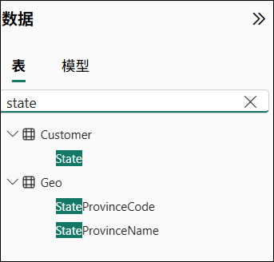

    在此应用场景中，我们有多个具有 State 变化的表，我们也有多个销售度量值。这可能导致不一致的回复，甚至产生误导性的结果。在后面的实验室中，您将学习不同的技术来帮助 Copilot 回答这些类型的用户请求！

24. 让我们尝试另一个提示：**Sales by State**。

    

25. 在下面的屏幕截图中，您可以看到德克萨斯州的最高销售额为 **461,457 美元或 2 百万美元**。这些答案是通过引用报表中的视觉对象生成的，其中一个视觉对象实际上具有筛选器！如果结果与下面的屏幕截图相同，请单击引用，这将带您进入要引用的页面和视觉对象。

    **可能的选项：**

    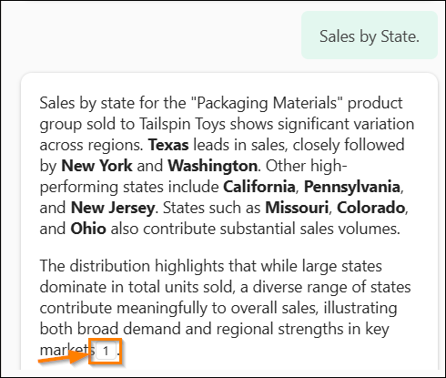

    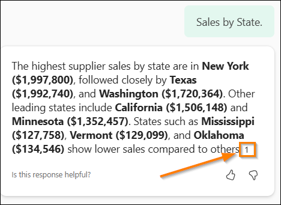

26. 现在，导航到位于底部功能区中的销售额最高产品选项卡。

    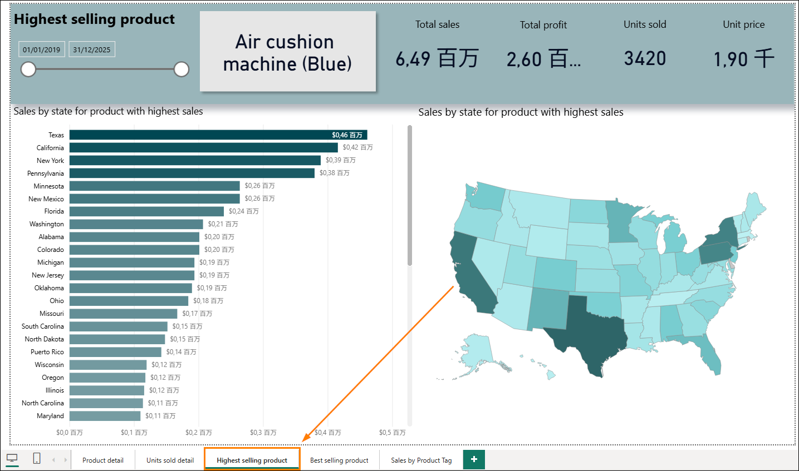

27. 乍一看，答案似乎很准确，但请看一下应用于可视化的一些潜在筛选器。展开筛选器窗格（如果尚未展开）：

    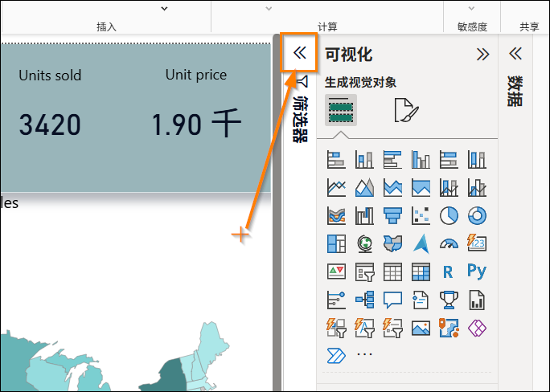

28. 视觉对象上存在可能导致 Copilot 回复发生变化的筛选器。展开筛选器，以查看**此视觉对象仅显示最畅销产品的销售额**。（确保您已单击进入地图视觉对象）

    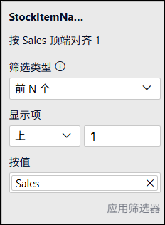

    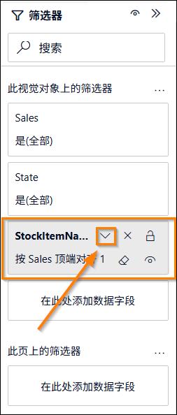

    **ℹ️ 重要提示**

    筛选器可以存在于视觉对象、页面、报表，甚至切片器级别上。Copilot 有时可以通过具有筛选器的视觉对象生成回复，但不会通知最终用户正在应用筛选器！在本课程的后面部分，我们将讨论如何添加 AI 指令来帮助处理这些类型的回复。

29. 删除此筛选器，注意引用视觉对象的值发生了巨大变化。

    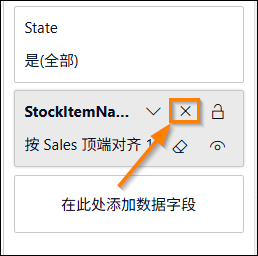

30. 德克萨斯州现在有 **7,256,794** 美元。与其他一些选项截然不同？仔细观察，您会发现一个视觉对象使用了 **Sales** 度量值，另一个视觉对象使用了 **Supplier Sales**。这就是为什么我们更需要为 AI 准备数据的原因。

    

    

31. 我想知道如果我们再次询问相同的问题会发生什么？再次向 Copilot 询问 **Sales by State**。

    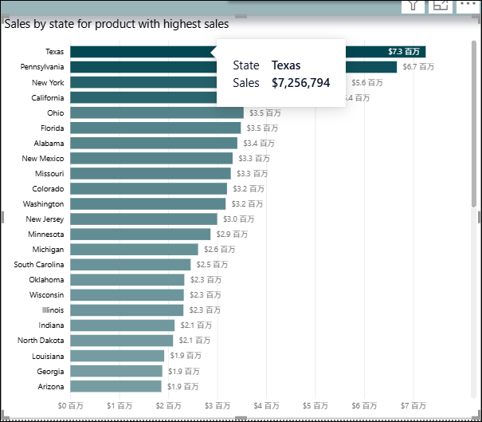

    

32. 如果没有筛选器，我们在同一引用中会有一组完全不同的值。在为 AI 准备数据的流程中，这是要注意的一个重要方面。

    

33. 如果回复返回多个引用，该怎么办？向 Copilot 提出此新问题：**Show the top selling product**。

    

34. 选择引用并检查是否存在任何无关筛选器。

    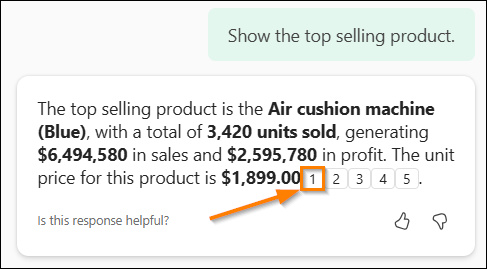
    

35. 从“Reseller”表中针对 **ResellerCompany** 向页面添加一个筛选器。

    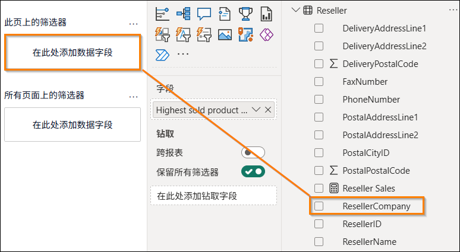

36. 仅选择 TailSpin Toys 并观察值已更改。

    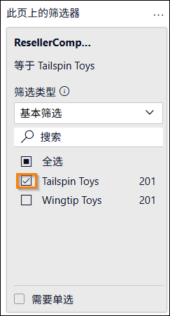

37. 现在，我们将再次提出问题：**Show the top selling product**。

    

38. 产品可能保持不变，但我们的数字却大不相同，此示例显示了未做好准备的语义模型可能提供不一致和不正确的结果。

    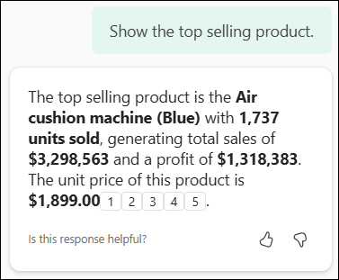

39. 我们可以在此处使用 Copilot 并应该审查的另一个领域是 Data Analysis Expressions (DAX) 语言的集成。尝试提出一个涉及计算的问题，如下所示：**Calculate the percent of total sales in the Southeast to the United States**。

    

40. 在我们的回复中，您会注意到 Copilot 认识到该答案需要进行的分析比平时多。让我们知道这一点很有用，以便根据需要进一步验证计算。

    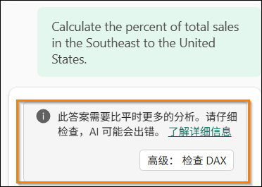

41. 在我们的案例中，此特定计算需要 Copilot 编写 DAX。在此处，我们可以通过两种方式检查使用的 DAX。首先是**高级：检查 DAX**，然后是**展开答案**区域。

    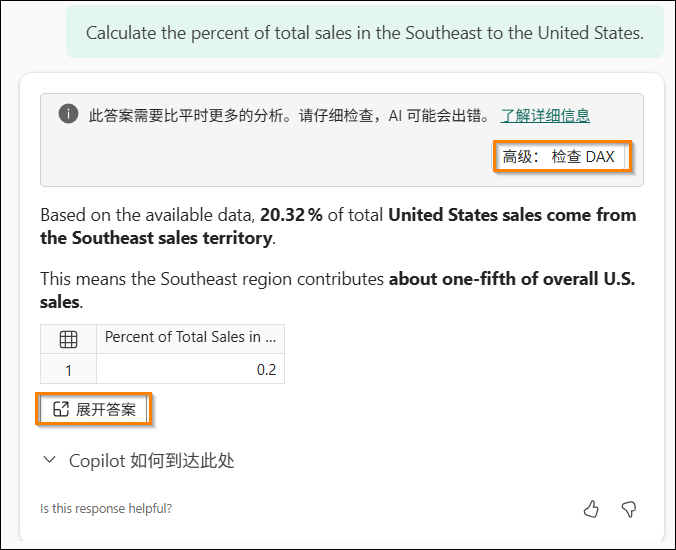

42. 您想要确保查看 **DAX 查询**选项卡，以查看用于生成答案的 DAX。查询与要遵循的逻辑的说明一起列出。我们需要提出两个问题。(1) DAX 看起来正确吗？(2) 东南地区是否真的只有 **20.32%**?

    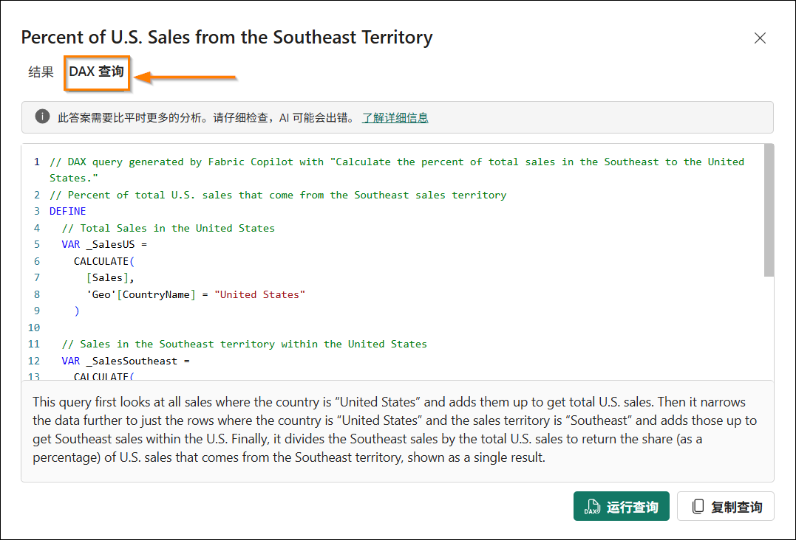

43. 每次 Copilot 生成 DAX 时，通常都会非常不同且不一致。您的 DAX 可能与此部分中的屏幕截图相似，也可能不同！在此代码中，DAX 从 **Geo** 表中提取州（有效），但它本可以很容易地从 **Customer** 表中获取位置信息。如果从“Customer”表中获取数据，结果可能只有 3-4%。

    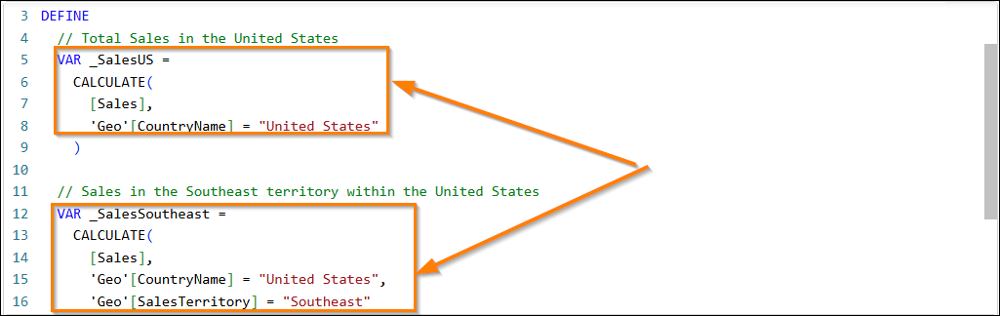

44. 现在，我们可以通过什么方式解决此问题？这是我们稍后在实验室中**为 AI 准备数据**时要使用的最佳方法。目前，我们可以保证获得更好回复的一种方法是编写更好的提示。您可能已经从**Geo** 表中获得了结果，但这仍然是第二种最佳确认方法。

45. 使用此提示再次提出问题：**Calculate the percent of total sales in the Southeast to the United States from the Geo table**。

    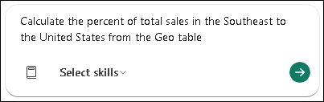

46. 这次的结果很可能是相似的。我们还可以检查与回复关联的 DAX。

    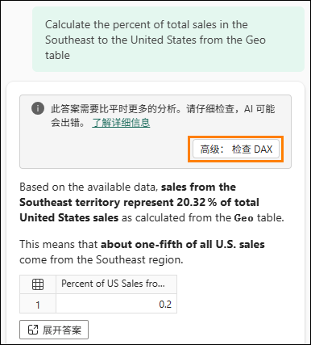

    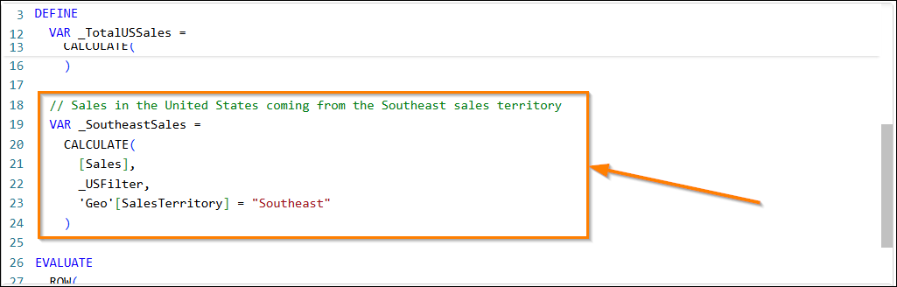

47. 非常棒！通过深思熟虑的提示，可以调整模型中的失误。但对于最终用户，我们希望打造一种允许更常规提示的体验。

48. 在本 PBIX 文件中，存在一些数据建模问题。更具体地说，有两个雪花型维度。Copilot 通过应用筛选器和其他更改来完善您的答案，从而很好地处理了这些问题！但是，在审查模型和业务要求后，我们决定这两个维度（Supplier 和 Geo）不必作为单独的表。这两个表将合并到模型中的其他表中，以便更接近星型架构。正确建模后，这将提高性能，使模型更易于理解，并改善 Copilot 体验。在本模块结束时，您将使用 **CDIAD – Lab 02– Start**。
    - **Supplier：** 将 Supplier 表中的列添加到 Product 表中。

    - **Geo：** 将 Geo 表中的列添加到 Reseller 表中。

**ℹ️ 重要提示**

有时需要创建筛选其他维度的维度，本质上是创建 Snowflake。但是，如果满足业务要求，则应尽可能简化语义模型。随着新业务要求的添加和新表的引入，数据模型将不可避免地变得更加复杂。请务必始终花时间优化数据模型！

⭐Power BI 在星型架构上效果最好，有关星型架构的完整讨论不在本课程的范围内。 有关详细信息，请参阅此 Microsoft Learn 链接：

[**https://learn.microsoft.com/en-us/power-bi/guidance/star-schema**](https://learn.microsoft.com/en-us/power-bi/guidance/star-schema)

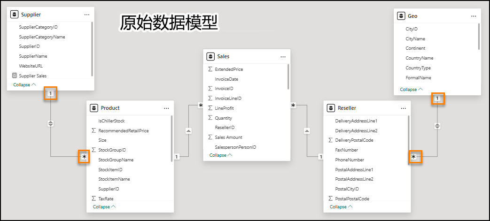

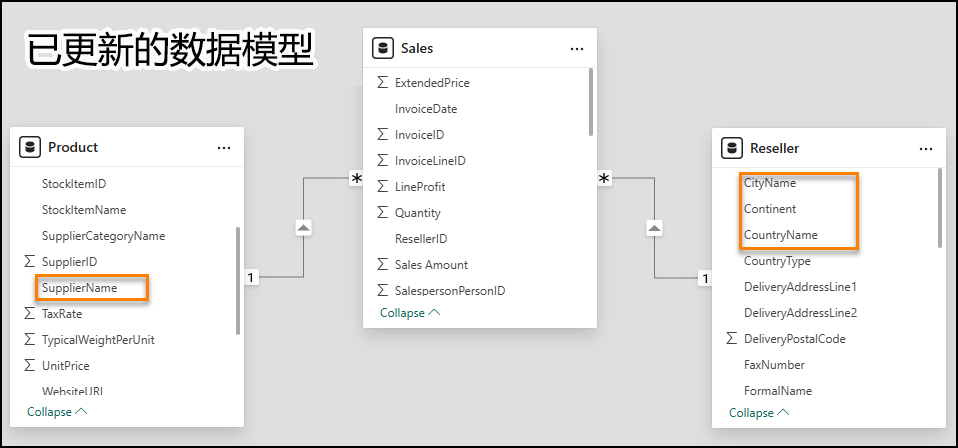

以下更多参考资源可帮助您进行与 Microsoft Fabric 相关的后续步骤。

- 访问主 [Microsoft Fabric 文档](https://learn.microsoft.com/en-us/fabric/)中的所有信息

- 通过[引导式教程](https://aka.ms/Fabric-GuidedTour)探索 Fabric

- 注册 [Microsoft Fabric 免费试用版](https://aka.ms/try-fabric)

- 访问 [Microsoft Fabric 网站](https://aka.ms/microsoft-fabric)

- 通过探索 [Fabric 学习模块](https://aka.ms/learn-fabric)学习新技能

- 阅读[有关 Fabric 入门指南的免费电子书](https://aka.ms/fabric-get-started-ebook)

- 加入 [Fabric 社区以](https://aka.ms/fabric-community)发布问题、共享反馈并向他人学习

阅读更多与 Copilot 相关的深入技术文档：

- [适用于 Power BI 的 Copilot 概述 - Power BI | Microsoft Learn](https://learn.microsoft.com/en-us/power-bi/create-reports/copilot-introduction)

- [Power BI 中的独立 Copilot 体验（预览版）- Power BI | Microsoft Learn](https://learn.microsoft.com/en-us/power-bi/create-reports/copilot-chat-with-data-standalone)

- [Microsoft Fabric Copilot 管理设置 | Microsoft Learn](https://learn.microsoft.com/en-us/fabric/admin/service-admin-portal-copilot)

- [Fabric 数据代理创建（预览版）- 了解如何创建 Fabric 数据代理 | Microsoft Learn](https://learn.microsoft.com/en-us/fabric/data-science/concept-data-agent)

- [配置数据代理的最佳做法 - Microsoft Fabric | Microsoft Learn](https://learn.microsoft.com/en-us/fabric/data-science/data-agent-configuration-best-practices)

- [适用于 Microsoft Fabric 和 Power BI 的 Copilot：常见问题解答 - Microsoft Fabric | Microsoft Learn](https://learn.microsoft.com/en-us/fabric/fundamentals/copilot-faq-fabric)

© 2026 Microsoft Corporation。保留所有权利。

使用本演示/实验室即表示您同意以下条款：

本演示/实验室中的技术/功能由 Microsoft Corporation 出于获取反馈和提供学习体验的目的提供。只能将本演示/实验用于评估这些技术特性和功能以及向 Microsoft 提供反馈。不得用于任何其他用途。不得对此演示/实验或其任何部分进行修改、复制、分发、 传送、显示、执行、复制、公布、许可、转让、销售或基于以上内容创建衍生作品。

严禁将本演示/实验（或其任何部分）复制到任何其他服务器或位置以便进一步复 制或再分发。

本演示/实验室出于上述目的，在不涉及复杂设置或安装操作的模拟环境中提供特定软件技术/产品特性和功能，包括潜在的新功能和概念。本演示/实验室中展示的技术/概念可能不是完整的功能，可能会以不同于最终版本的工作方式工作。我们也可能不会发布此类功能或概念的最终版本。在物理环境中使用此类特性和功能的体验可能也有所不同。

**反馈。** 如果您针对本演示/实验室中所述的技术特性、功能和/或概念向 Microsoft 提供反馈，则意味着您向 Microsoft 无偿提供以任何方式、出于任何目的使用和分享您的反馈并将其商业化的权利。您同样无偿为第三方提供其产品、技术和服务使用或配合使用包含此反馈的 Microsoft 软件或服务的任何特定部分所需的任何专利权。如果根据某项许可的规定，Microsoft 由于在其软件或文档中包含了您的反馈需要向第三方授予该软件或文档的许可，请不要提供这样的反馈。这些权利在本协议终止后继续有效。

对于本演示/实验室，MICROSOFT CORPORATION 不提供任何明示、暗示或法定的保证和条件，包括有关适销性、针对特定目的的适用性、所有权和不侵权的所有保证和条件。对于使用本演示/实验产生的结果或输出内容的准确性，或者出于任何目的包含本演示/实验中的信息的适用性，Microsoft 不做任何保证或陈述。

**免责声明**

本演示/实验仅包含 Microsoft Power BI 的部分新功能和增强功能。在产品的后续版本中，部分功能可能有所更改。在本演示/实验中，可了解部分新功能，但并非全部新功能。
