# Microsoft Fabric Chat with your Data in a Day 实验室 2

## 目录

- 文档结构
- 应用场景/问题陈述
- 简介
  - 任务 1：双向筛选/星型架构
  - 任务 2：重命名列、表、度量值
  - 任务 3：描述
  - 任务 4：数据类别
  - 任务 5：汇总
  - 任务 6：按列排序属性
  - 任务 7：语言架构：同义词

# 文档结构

本实验室包含用户需要遵循的步骤以及可提供直观协助的关联屏幕截图。在每个屏幕截图中，以橙色框突出显示的部分指出了用户应注意的区域。

# 应用场景/问题陈述

贵公司已完成其初始测试和 Copilot 就绪情况测试阶段。人们发现，当前模型尚未准备好用于独立 Copilot 体验，需要在 Power BI Desktop 中实施普遍接受的最佳做法。为了确保 Copilot 能够提供有意义的答案，必须深思熟虑地设计和优化基础语义模型。

您的语义模型当前面临以下挑战：

- 表和列名称可能很隐晦，难以破译。

- 表、列和度量值上的描述不存在。

- 数据类别未得到充分利用，限制了 Copilot 的上下文理解。

- 排序逻辑和默认汇总可能不反映用户的期望。

- 未对关系和语言架构进行配置或优化以支持最佳 Copilot 体验。

# 简介

这些差距可能会导致用户与 Copilot 交互时出现混淆、回复不准确、产生误导的视觉对象或错过见解。在本实验室中，您将学习如何使用有关命名、分类、汇总、数据建模和语言架构的最佳做法来优化语义模型。

## 任务 1：双向筛选/星型架构

1. 从课堂文件中打开名为 **CDIAD – Lab 02– Start** 的文件，以开始为 AI 准备您的数据。

   

2. 在上一个实验室中提出的一个问题是：**Create a new report page with a visual for sales and product tag**。这创建了 Copilot 的回复，其中显示了重复的数据（下面的屏幕截图）。通常，当您看到所有数据点的相同结果时，这说明数据模型中存在关系问题。

   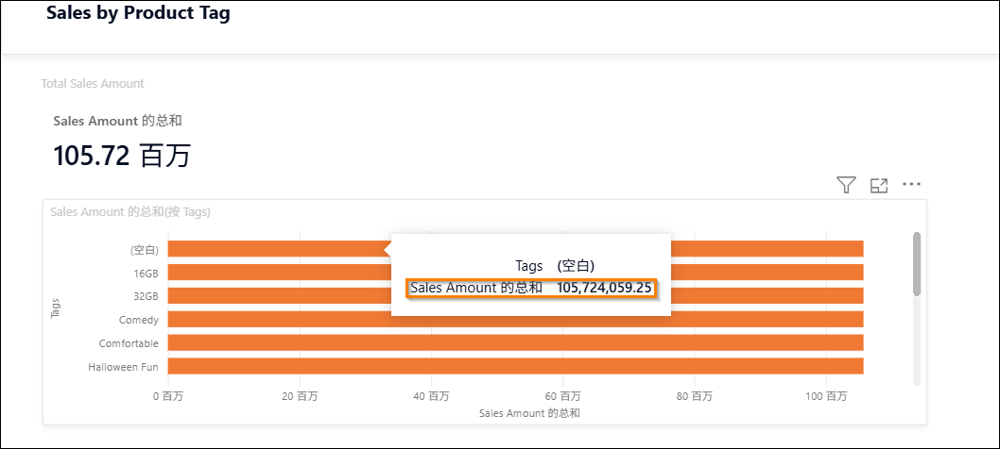

3. 以下是“Product Details”表中的“Tag”与“Sales”表中的“Sales”度量值的关系的屏幕截图：

   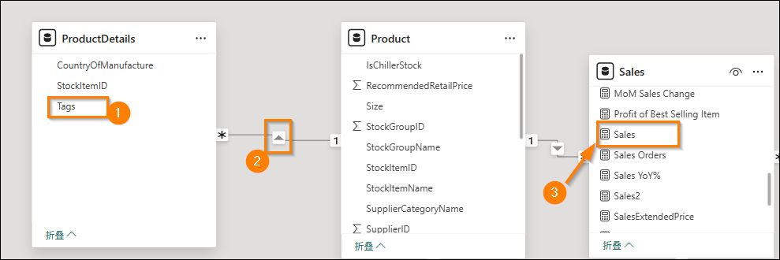

4. 当我们要求 Copilot 返回“按 Tags 划分的 Sales”时，它会生成一个包含重复数据的报表。发生这种情况是因为“Product Details”表上的“Tags ”列无法筛选“Product”表。“Product”和“Product Details”之间的筛选方向为单向，即从“Product”到“Product Details”表 。有两种方法可能会解决此问题。
   - 首先，我们可以创建一个 DAX 度量值来计算总销售额，同时从“Tags”表中添加必要的筛选器。本选项使数据模型保持简单，但需要为每个业务需求创建新度量值，并且可能会变得繁琐。

   - 第二个方法就是我们将在此处实施的方法，我们可以允许筛选器在两个方向上进行操作。通过更新“Product”和“Product Details”之间的关系，标记列将能够筛选到 Sales 表，并且 Copilot 可以生成正确的回复。

5. 让我们更新数据模型中的关系。_请参阅下面的屏幕截图：_
   1. 单击左侧导航窗格中的模型视图。

   2. 选择“Product”和“Product Details”之间的关系。

   3. 在属性窗格中，将交叉筛选器方向从单向更改为双向。

      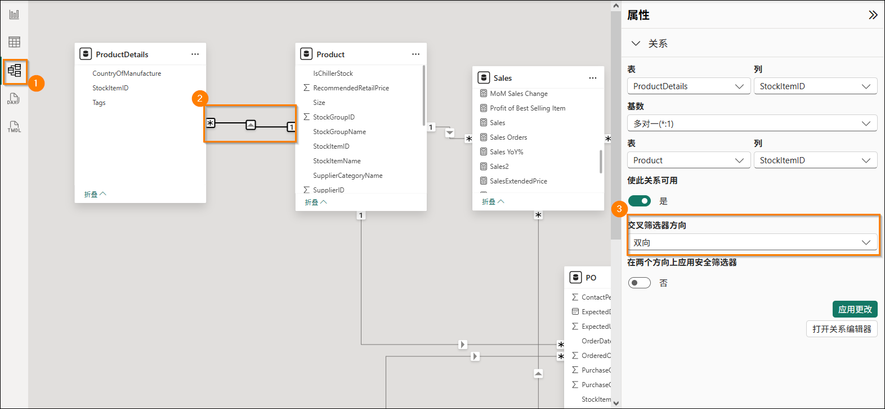

   **ℹ️ 重要提示**

   最佳做法是，您应尽可能避免打开双向筛选。在某些情况下，这可能会导致结果出现歧义以及性能问题。如本部分所述，一种替代方法是创建 DAX 度量值，手动强制筛选该特定度量值。还有其他替代方法，本课程将不讨论这些替代方法。

6. 现在我们可以再次在**报表视图**中提出问题并注意增强的结果！再次打开 Copilot Power BI 聊天体验并提出以下问题：**Show total sales by product tag**。

   

   如果系统要求您进行阐释，请要求提供 **Sales 度量值**。

   

7. **正确结果：**

   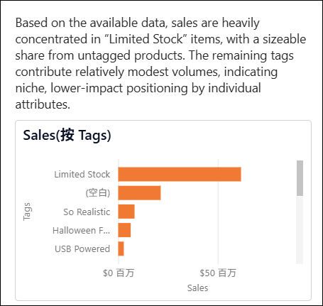

   如果获得不同的视觉对象，请重新提示，并要求提供 **条形图**.

   

   以前的结果：

   

   数据建模一直是 Power BI 中最为关键（甚至可以说是最重要的）的方面之一。通过定义明确且经过深思熟虑的数据模型，Copilot 可以更轻松、更高效地生成报表、编写 DAX、实现安全性并提供支持。

## 任务 2：重命名列、表、度量值

1. 在之前的实验室中，我们遇到了有关 Copilot 使用列、表甚至度量值的问题，这些问题是我们没有预料到的。在我们不断增长的数据模型中，这些挑战是可以预料的，为了更好地为 AI 准备数据，我们需要进行命名调整。

2. 让我们先来适当地重命名这些表。单击 **PO** 表，然后选择**重命名**。将 **PO** 表调整到 **Purchase Orders**。

   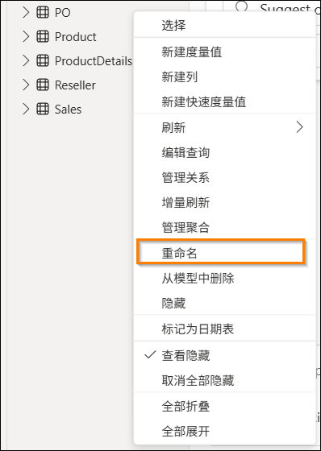

   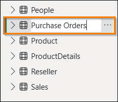

3. 接下来，我们将使用相同的流程重命名列。首先展开 **Reseller** 表。

   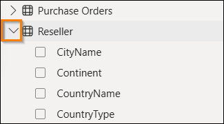

4. 接下来，双击或右键单击 **[SPName]** 列，并将其重命名为 **State**。

   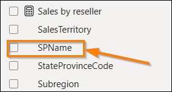

   

5. 继续进行如下重命名更改：

   将 **‘Reseller’ [CountryName]** 重命名为 **Country**

   在 **Sales** 表中，将度量值 **MoM Sales Change** 重命名为 **Month over Month Sales Change**

   在 **Sales** 表中，将度量值 **Sales YoY%** 重命名为 **Sales Year over Year %**

   在 **Purchase Orders** 表中，将度量值 **Spend** 重命名为 **Total Purchases**

   **ℹ️ 重要提示**

   表和列的清晰描述性名称有很大的不同。Copilot 根据模型的结构解释您的提示 - 命名越直观，它就越能生成准确的 DAX、视觉对象和见解。谨慎地重命名以提高 Copilot 的理解和您自己的工作效率。

## 任务 3：描述

1. 现在，让我们通过添加描述来进一步准备数据模型。描述可以添加到模型视图中的表、列和度量值。这些描述将帮助 Copilot 回答用户请求。表描述就像 Copilot 的后台通行证，为其提供生成准确、相关的见解摘要（甚至是 DAX 度量值）所需的上下文。首先，让我们从**模型视图**开始。

2. 选择 **Purchase Orders** 表。在**属性**区域中，您将找到**描述**区域，我们将在此处创建描述以帮助 Copilot。以下是一些最佳做法提示：

   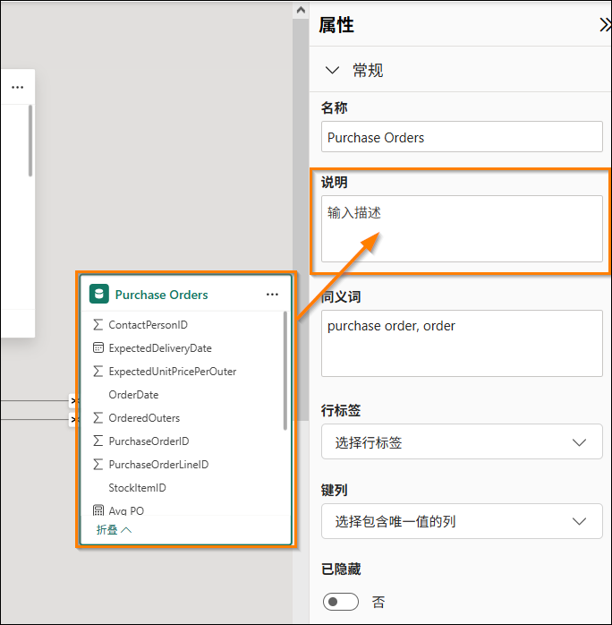

   ### 表描述的最佳做法

   **从目的开始：** 表在业务术语中代表什么？

   **包括业务上下文：** 说明表如何支持报告或决策。

   **提及粒度：** 是事务性、每日性、聚合性等？

   **突出显示关键列：** 尤其是关系或计算中使用的列。

   **描述常见用例：** 该表支持哪些类型的问题或视觉对象。

   **注释关系：** 提及它如何连接到模型中的其他表。

   **ℹ️ 重要提示**

   **精心编写的描述可帮助 Copilot 了解数据的用途和上下文。** 使用描述来阐明表或列所代表的内容，尤其是当仅使用名称还不够时。Copilot 使用这些提示生成更相关的答案、DAX 和视觉对象。将描述视为引导 Copilot 和您的用户获得更好见解的机会。

3. 将这个广泛而准确的描述放到字段中：

   _This Purchase Orders table captures individual line items from purchase orders submitted within the organization. Each row represents a specific product ordered, including the quantity requested, the date of the order, and the employee who initiated the request.It supports analysis of procurement trends, supplier demand, and employee purchasing behavior.Key columns include ProductID, QuantityOrdered, OrderDate, and EmployeeID.This table links to Products, Employees, and PurchaseOrders tables to enable detailed reporting across procurement workflows._

   这将极大地帮助 Copilot 做出更好的回复，特别是涉及到 **Purchase Orders** 表的情况。让我们来继续为某些列生成更好的描述。从 **Purchase Orders** 表中选择 **Order Date** 列，然后添加相似的描述：

   ### 语义模型中列描述的最佳做法

   **从业务含义开始：** 描述列在业务术语中代表什么。

   **阐明单位、格式或比例：** 如果是数字、基于日期或分类，请解释其结构方式。

   **提及常见用例：** 帮助 Copilot 了解本列在分析或报告中的常用方式。示例：收入 – 每笔交易的总销售额；用于盈利能力和趋势分析

   **避免冗余：** 不要重复列名称中显而易见的内容，除非它可增加清晰度。相反，使用上下文来扩充它。例如，对于 EmployeeID，您可以添加以下描述：Unique identifier for the employee who submitted the order。

   **使用一致的语气：** 在整个模型中保持描述简洁、信息丰富且一致。把它想象成为一个充满好奇的分析师编写工具提示。

4. 选择 **Purchase Orders** 表，然后单击 **OrderDate**。输入以下描述：**The calendar date when the purchase order was submitted by an employee.**

   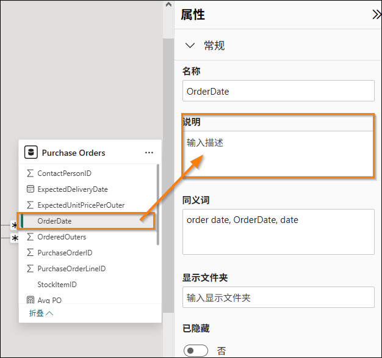

5. 既然我们已经调整了表和列的**描述**，现在让我们向度量值添加描述。但是，这一次我们将利用 Copilot 来帮助创建描述。首先选择 **Purchase Orders** 度量值。从那里，我们将选择**使用 Copilot 创建**。

   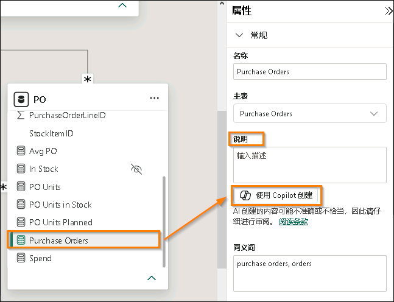

6. 请注意，Copilot 构建的描述已可供审查。此答案可能会有所不同，但会很好地帮助验证和详细说明我们的描述。您可以按**重试**，但在准备就绪后选择**保留**。

   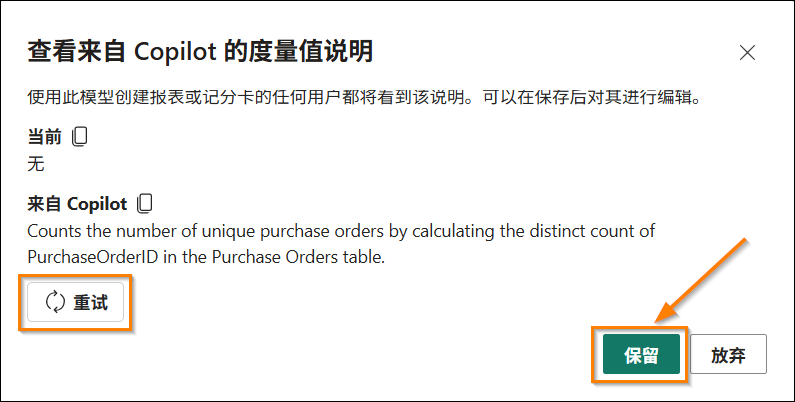

   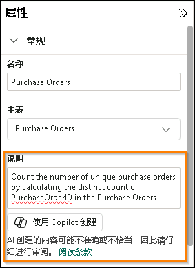

   在本部分中，您了解了如何向表、列和度量值添加描述。在实际语义模型中，您可以将此处所做的工作扩展到其余表以及任何适用的列和度量值。现在，您已显著增强了 Copilot 处理数据的能力，并增强了所有未来的回复。

## 任务 4：数据类别

向 Power BI 中的列添加数据类别对 Copilot 来说非常重要，尤其是当您使用包含地理、Web 或图像数据的语义模型时。这些类别的作用类似于元数据标记，可帮助 Copilot（和视觉对象）解释列的用途，而不仅仅是其名称或数据类型。

1. 导航到**表视图**并选择“Reseller”表。首先，从**Reseller** 表中选择 **State** 列。

   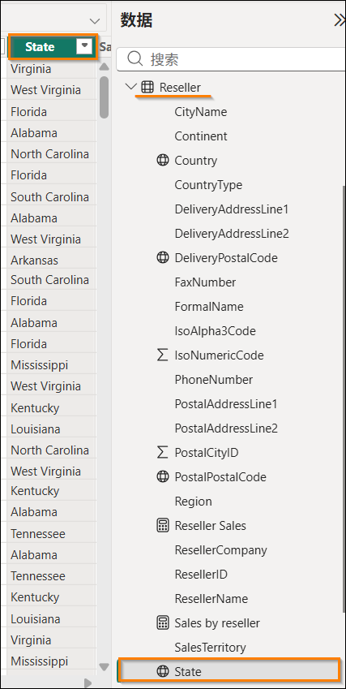

2. 选中 **State** 列后，您将看到 Power BI 报表顶部会显示一个名为**列工具**的新功能区菜单。单击“列工具”。让我们先更改**数据类别**。

   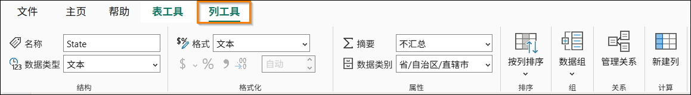

3. 展开**数据类别**区域并将数据类别从未分类更改为**省/自治区/直辖市**。

   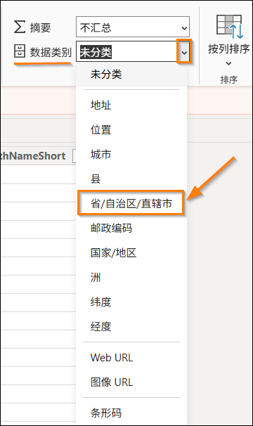

   **ℹ️ 重要提示**

   **设置数据类别有助于 Copilot 了解如何处理您的数据。** 无论是地理位置、URL 还是图像，分配正确的类别都会为 Copilot 提供上下文，从而生成更智能的视觉对象、筛选器和见解。例如，将列标记为“City”后，Copilot 就可以立即对其进行映射。这只是一个小步骤，却可以释放巨大的价值。

   继续为下面的其余列添加数据类别：

   | **表名称** | **列名称**         | **数据类别** |
   | ---------- | ------------------ | ------------ |
   | Reseller   | Country            | 国家/地区    |
   | Reseller   | DeliveryPostalCode | 邮政编码     |
   | Reseller   | PostalPostalCode   | 邮政编码     |
   | Reseller   | Website URL        | Web URL      |

## 任务 5：汇总

在本部分中，我们将了解 Power BI 中的默认汇总以及它如何影响 Copilot 回复。这不是 Power BI 的新增功能，而是 Copilot 至关重要的功能。

1. 从**报表视图**中打开 Copilot 并编写以下提示：**What is customer age by state?**

   

   

2. 查看结果并注意可能会出现异常结果。将鼠标悬停在 **WA**、**NY** 或其他州的数据条上，您将看到正在返回 Age 的总和！您可能在此处看到的是平均值，但由于 Age 列上存在默认的总和汇总，因此 Copilot 会执行汇总。

   Copilot 也可能会要求进行阐释，如下图所示。无论如何，我们可以通过调整**汇总**来获得平均值，并避免额外的问题。

   

   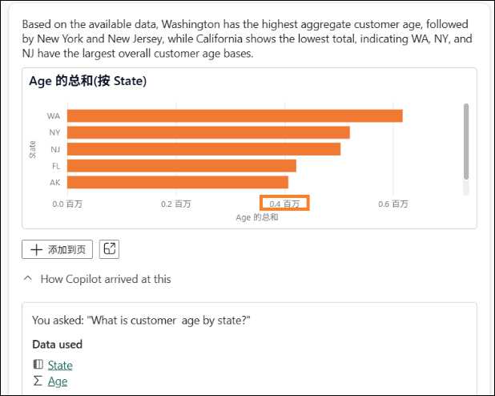

3. 通过将鼠标悬停在 Age 上，您可以验证并确认 Copilot 对该列执行了求和。

   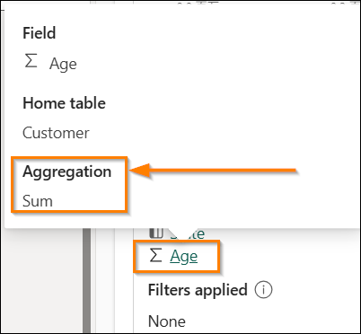

   **ℹ️ 重要提示**

   **默认汇总告诉 Copilot 如何在视觉对象和计算中处理您的列。** 无论是“不汇总”、“求和”还是“平均值”，正确进行此设置都有助于 Copilot 生成更准确的图表和 DAX。例如， 将 ID 或名称标记为“不汇总”以避免产生误导的总计。这是引导 Copilot 获得有意义的见解的快速方法。

   我们可以通过专门询问平均年龄来编写更好的提示，这将起作用。但是，更好的选择是在可能的情况下改进数据模型，因此，我们将调整**默认汇总**属性。

4. 在 Copilot 提示中，键入：**What is customer age average by state**。

   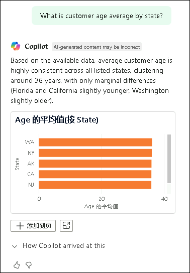

5. 让我们来调整**默认汇总**。从“Customer”表中选择**Age** 列以显示列工具。找到**汇总**区域并将“Age”调整为**平均值**。

   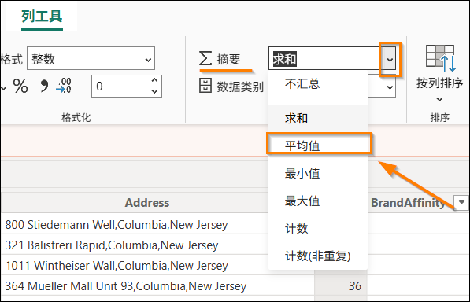

6. 使用 Copilot 对话助手，让我们再提出一个问题：**What is customer age by state?**

   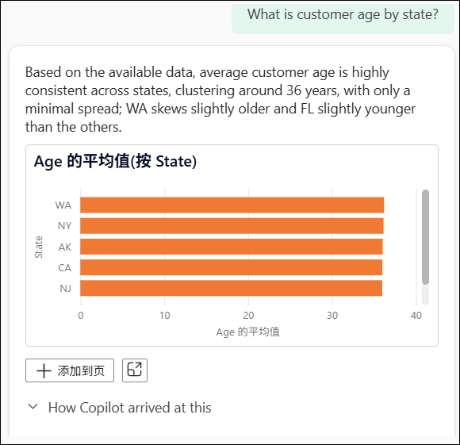

   非常棒！这是预期结果，允许用户更随意地提出问题，并允许用户问题出现预期的变化。对于是数值列但不应汇总的列，关闭默认汇总也同样重要。例如，不应汇总“Year”、“Quarter”和“Month”数字之类的列！

## 任务 6：按列排序属性

1. “按列排序”属性（例如默认汇总）不是 Power BI 的新功能，但正确设置此属性可以帮助 Copilot 按与您预期看到的内容一致的顺序返回结果。例如，如果您返回按月划分的销售额，它在默认情况下会按销售最高的月份到销售最低的月份对视觉对象进行排序。让我们对此测试一下！

2. 如果您尚未重置 Copilot 对话助手，请通过按清除聊天区域进行重置。

   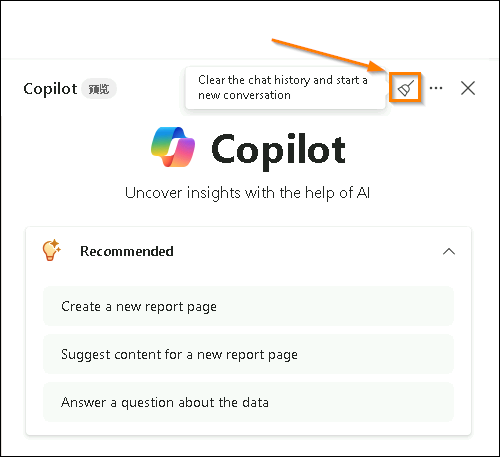

3. 现在键入以下提示：**Show total sales by month as a column chart**。

   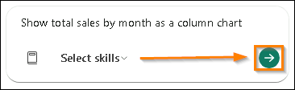

4. 结果是正确的，但以不适用于公历（一月、二月、三月......十二月）中我们的典型视图的方式进行排序。结果会按字母顺序返回，或者在本例中，按从最高销售额到最低销售额的顺序排序。

   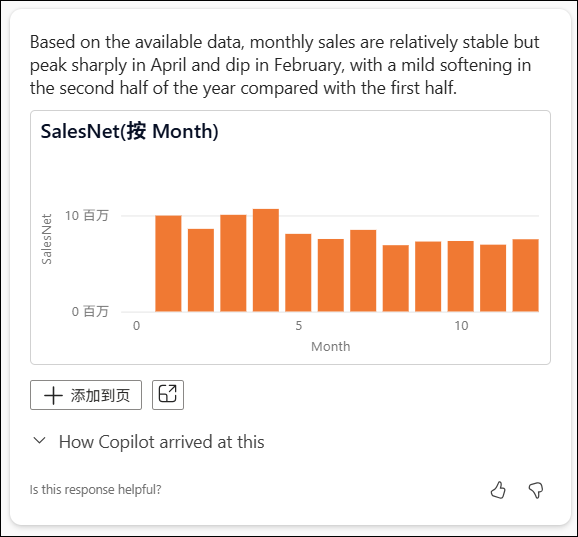

   **ℹ️ 重要提示**

   **使用“按列排序”来控制 Copilot 呈现数据的方式。** 此设置可帮助 Copilot 显示数据， 以便月份或自定义标签等类别按预期顺序显示在视觉对象和摘要中。例如，按 “Month Number”对“Month Name”进行排序有助于 Copilot 生成基于时间的准确图表。这是一个简单的修复程序，可防止出现混淆结果。

5. 我们需要从**列工具**区域中的**按列排序**区域调整**MonthName** 列的排序方式。从 **Date** 表中选择“MonthName”列。

6. 展开“按列排序”并将排序调整为“按 Month”：

   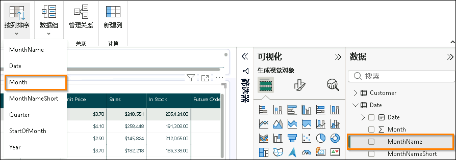

7. 向 Copilot 对话助手提出相同问题：**Show total sales by month**，现在您可以按预期获得结果。

   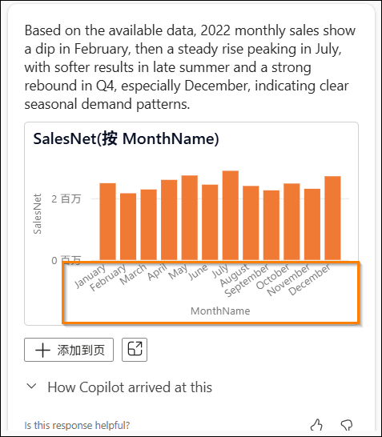

## 任务 7：语言架构：同义词

**语言架构**是释放 Copilot 作为自然语言分析合作伙伴的全部潜力的关键。可以将其视为向 Copilot 提供数据模型的翻译指南。没有它，Copilot 就只是猜测；有了它，Copilot 会变得更加流利和熟悉您的数据。

**什么是语言架构？**

语言架构是将语义模型映射到自然语言的元数据。它帮助 Copilot 了解：

- 您的表和列的含义

- 它们与业务概念的关系

- 用户在与数据交互时可能会使用哪些同义词、短语和问题类型

例如，Copilot 不仅读取列名称，还了解：

- “收入”= TotalSales

- “已下达订单”= PurchaseOrderCount

- “员工绩效”= SalesByEmployee

这意味着 Copilot 可以回答如下问题：

- “哪个地区上个季度的收入最高？”

- “按销量向我显示表现最佳的员工”

如果没有语言架构，Copilot 可能会误解含糊不清的术语或建议不相关的视觉对象。有了它，您将实现：

- 更好的 DAX 建议

- 更智能的视觉对象建议

- 更准确的摘要和见解

**支持同义词和自然语言**

您可以定义如下同义词：

- “PO”=“采购订单”

- “Rep”=“销售代表”

- “Qty”=“已订购数量”

1. 让我们看一下**语言架构**界面。首先选择**模型视图**，或者如果您正在使用报表视图，则选择“建模”功能区。然后导航到**问答设置**区域。

   

2. 有一个令人印象深刻的菜单，可帮助 Copilot 数据模型使用的问答更好地理解用户。主菜单有很多可以开始的区域。

   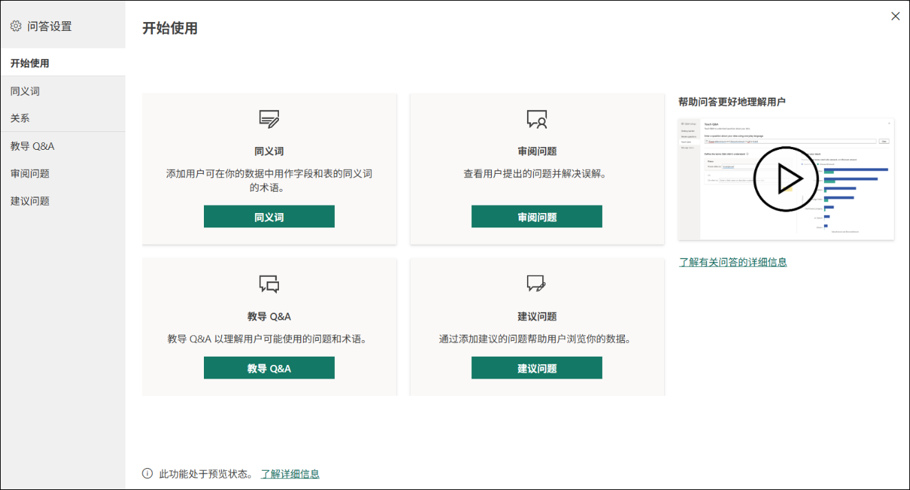

3. 让我们导航到第一个菜单，即同义词菜单。

   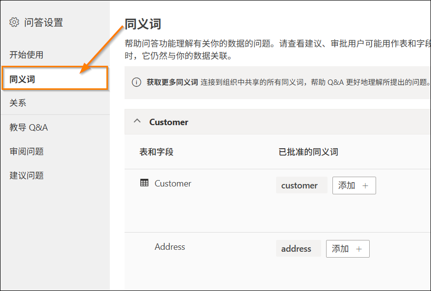

4. 更精确的同义词将帮助 Copilot 了解用户表述其问题的不同方式。您还可以调整正在导航的表以转到正确的列。按 V 形图标。

   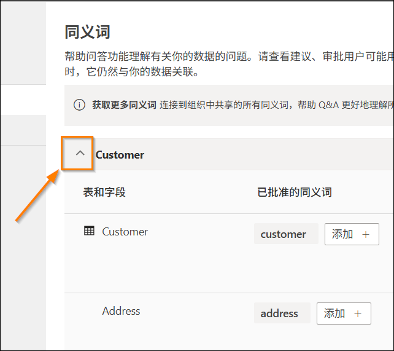

   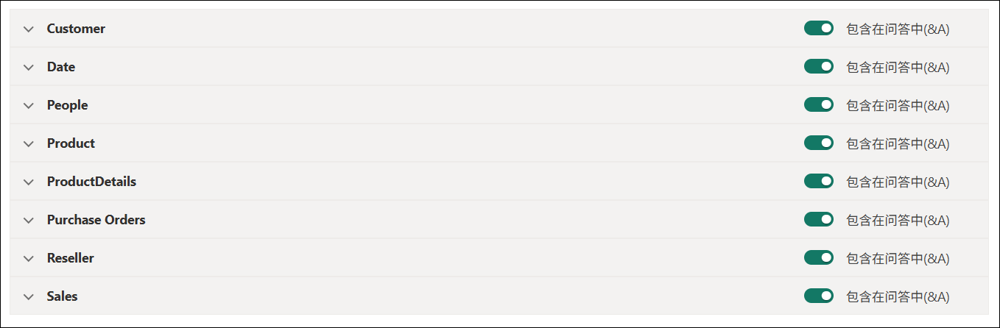

5. 让我们帮助 Copilot 将 **Reseller** 同义词调整得更具体一些。确保 **Reseller** 表已展开，并且您可以查看当前与 **ResellerID** 列和建议关联的所有同义词。

6. 在 Fabrikam 内部，经销商通常称为 ***Fabrikam 好友***和........让我们将这些内容添加为同义词，以允许员工使用我们自己的 Fabrikam 术语提出问题。在**购物者**上选择**添加**并输入同义词。

   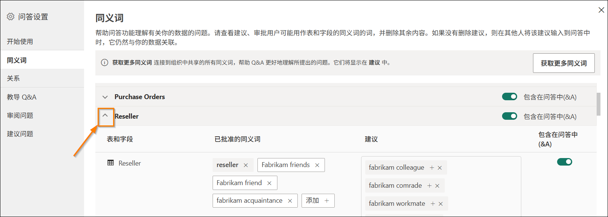

7. 使用“添加 +”按钮添加 **Fabrikam 好友**.

   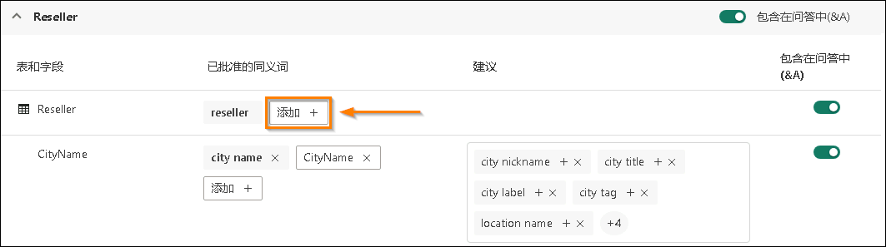

   

8. 您会注意到，Copilot 将评估添加的内容，并相应地动态添加其他建议。

   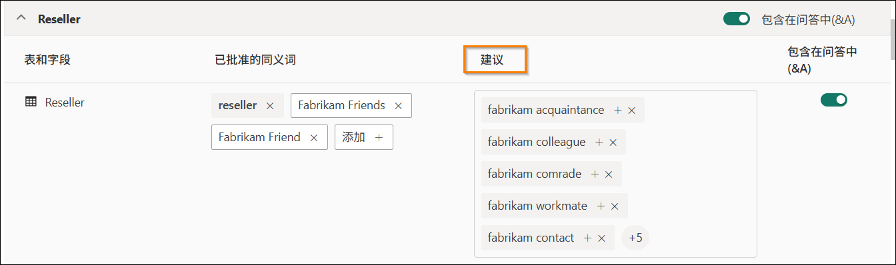

9. 现在，让我们使用其中一项建议为“Reseller”表添加另一个同义词。单击您选择的建议，例如 **_Fabrikam Acquaintance_**.

   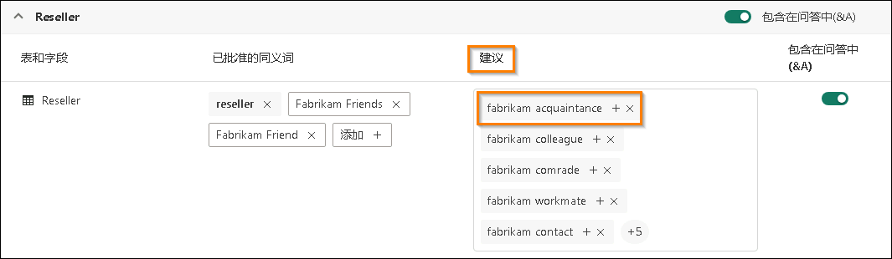

   添加同义词的流程是一个非常复杂的流程，会随着时间的推移而改进。请随意浏览其他表和列，并在您的 Power BI Desktop 文件中添加其他同义词！

10. 太棒了！现在，让我们来看一下**关系**。在“问答设置”菜单中导航。

    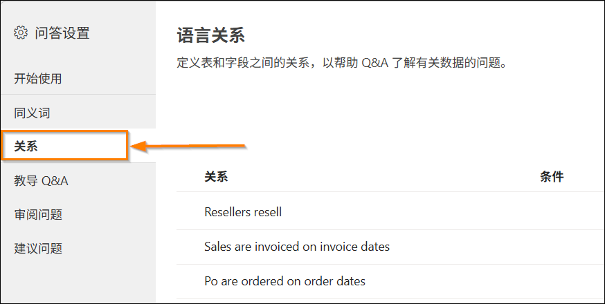

    语言关系定义表和字段之间的关系，以帮助“问答”了解有关您的数据的问题。这与表在数据模型中的连接方式相似，但它们采用 Copilot 在语言上可以理解的方式进行表达。

    例如，可以使用关系来解决不确定性。如果您的模型在多个表中有多个日期字段，则您可以在这些日期上添加关系，帮助 Copilot 根据上下文和表连接确定要使用哪一个。

    若要添加新关系，请首先单击“+ 新关系”框，如下面的屏幕截图所示。

    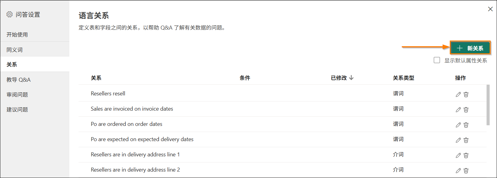

11. 从这里，您可以创建许多不同的语言关系。当前选项包括谓词、形容词、名词、介词、名称和关联。请参阅下面包含示例的可用选项的屏幕截图：

    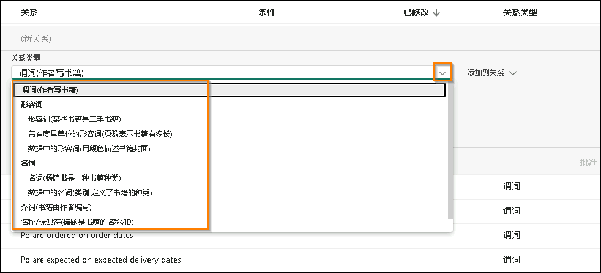

12. 在本实验室中，您不会在模型中创建任何关系。与添加同义词类似，这是一个复杂的流程，需要更新和维护，因为您将更深入地了解用户如何使用 Copilot 查询他们的数据，以及如何使用语言架构来改善体验！

    **ℹ️ 重要提示**

    **语言架构中的关系定义 Copilot 在回复自然语言时如何理解表之间的连接。** 它们决定了如何解读“按产品类别划分的销售额”或“按区域划分的订单”等问题。如果没有清晰的关系，Copilot 可能难以在表之间关联概念。正确定义关系可确保对话更流畅、 更直观。

13. 现在，我们可以浏览问答设置的其余元素。让我们看一下**教导 Q&A**，选择该部分。

    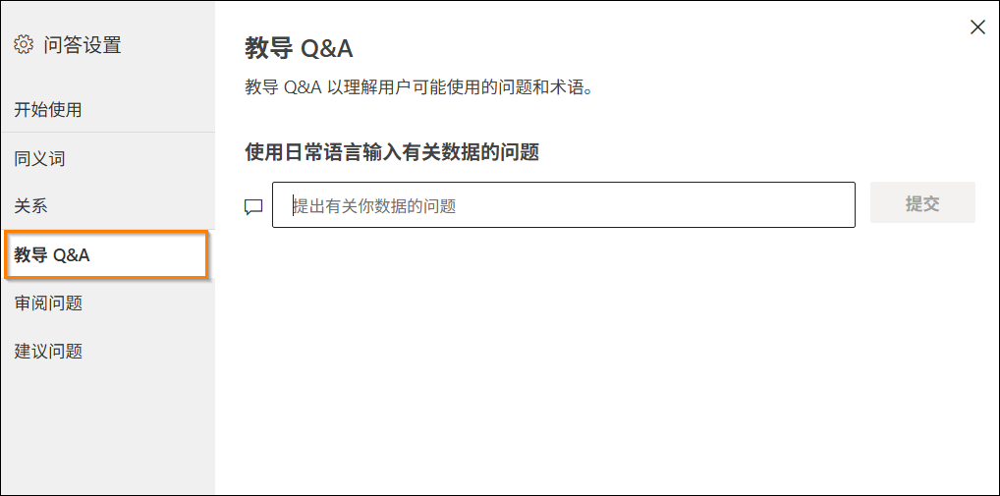

14. 在这里，我们可以教导 Q&A 理解用户可能使用的问题和术语。

    尝试询问问答：**How many sales happen in january?**

    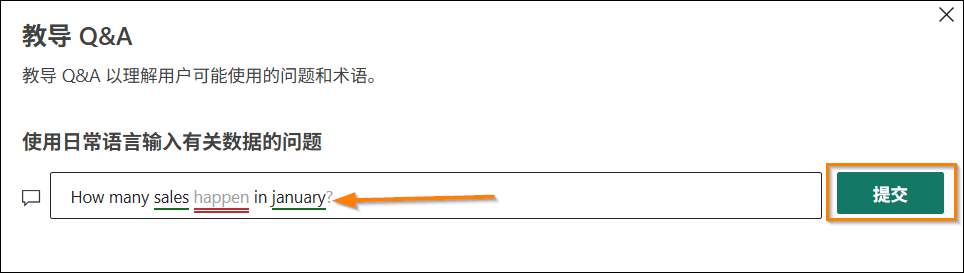

    您会看到，Copilot 将“happen”作为一个已知术语列出。这将允许您进一步调整以适应如下问题。

    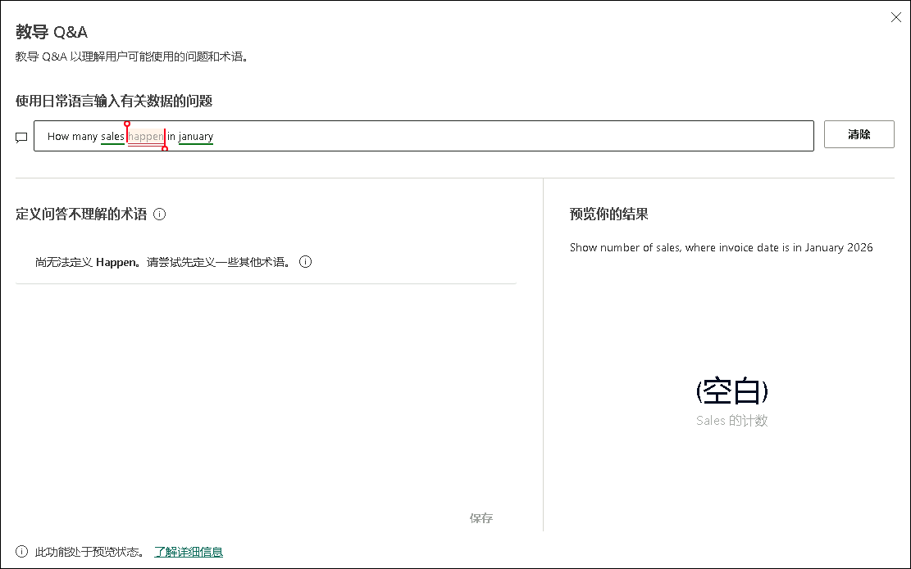

15. 您可以再次尝试另一个提示，例如“What is the total sales for january 2022?”，然后收到结果！这是一个很好的测试区域。

    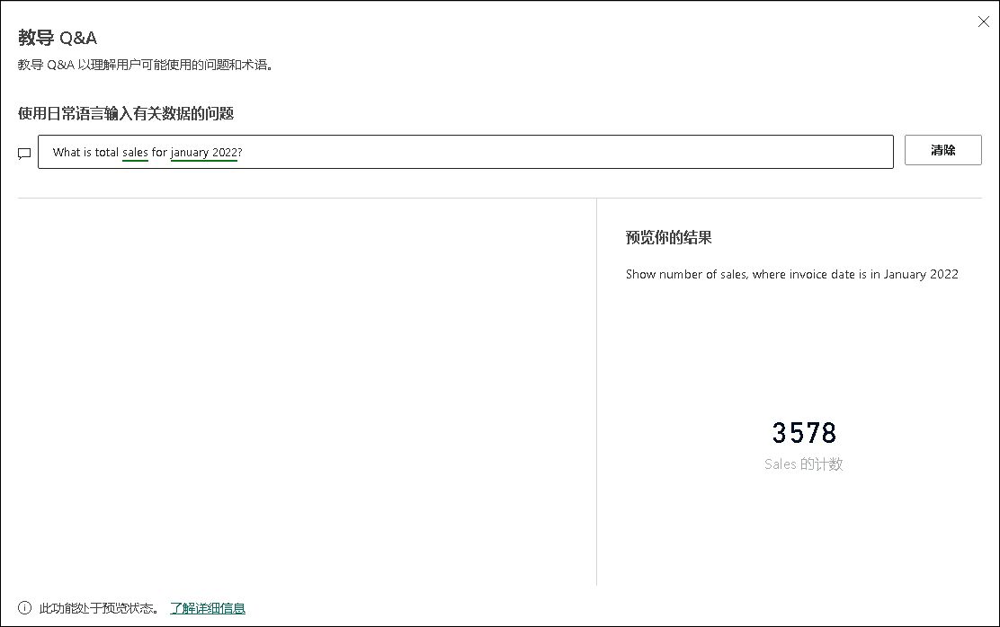

16. 您还可以通过提出以下问题看到同义词和关系在运行时的影响：**What is sales by Fabrikam Friends?**

    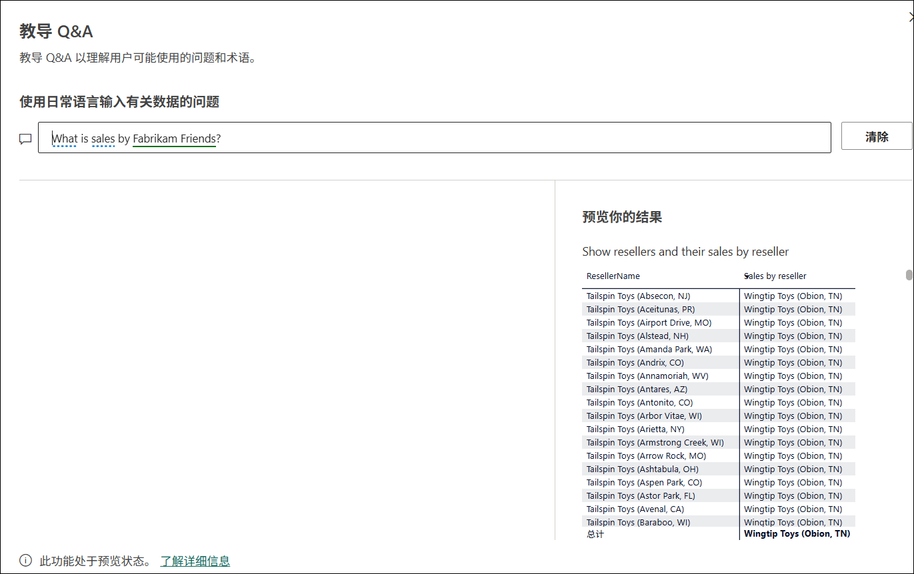

17. 接下来，导航到**审阅问题**。在这里，可以调整用户在租户内提出的问题，以供在将来解决。

    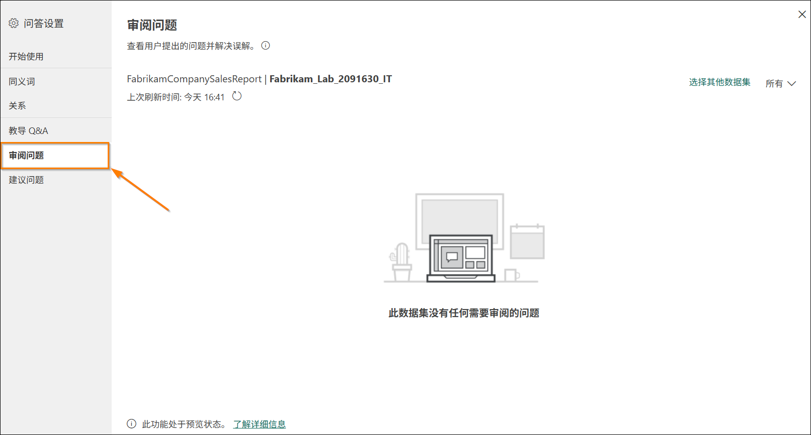

18. 最后，导航到**建议问题**。在这里，您可以通过添加建议问题来帮助用户探索数据。

    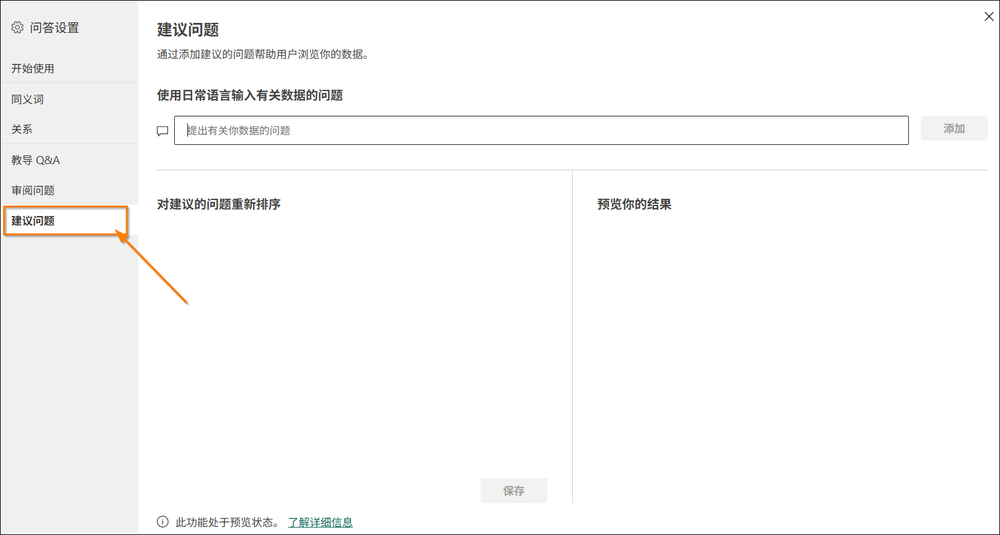

19. 我们希望为用户提供相关帮助，因此让我们选中“提出有关数据的问题”框并添加一个建议：**What is total sales by State?** 然后，您可以按“提交”以查看预览！

    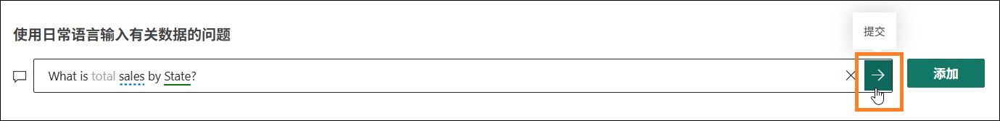

    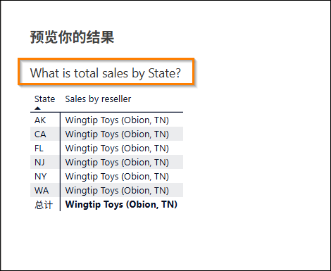

20. 通过单击**添加**保存建议。

    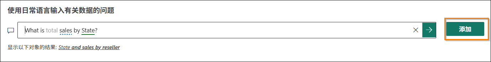

21. **保存**您的结果后，您便完成了实验室 2。

    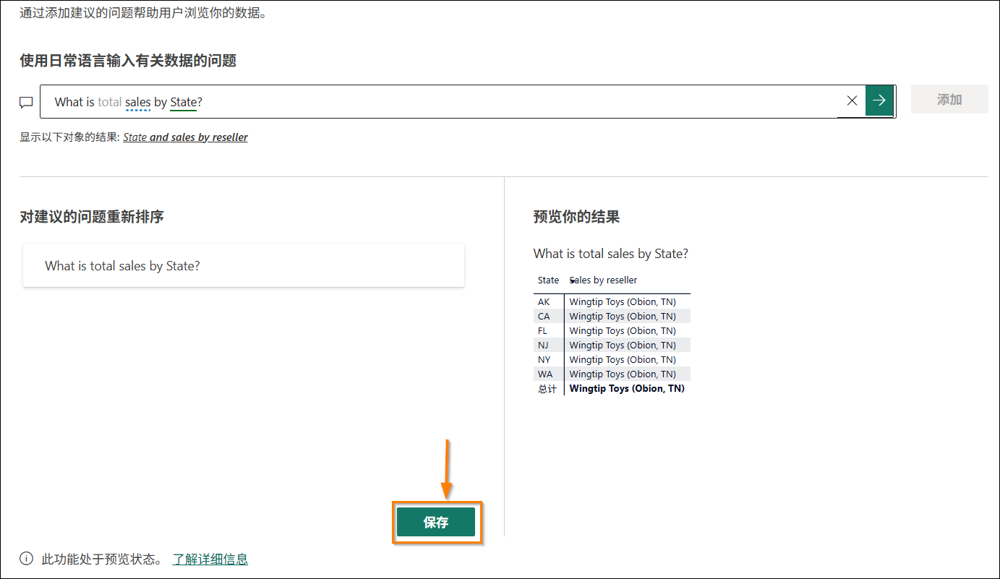

    在本实验室中，您了解了数据建模的最佳做法，以提高 Copilot 对 Power BI 语义模型的自然语言回复的性能和准确度。

以下更多参考资源可帮助您进行与 Microsoft Fabric 相关的后续步骤。

- 访问主 [Microsoft Fabric 文档](https://learn.microsoft.com/en-us/fabric/)中的所有信息

- 通过[引导式教程](https://aka.ms/Fabric-GuidedTour)探索 Fabric

- 注册 [Microsoft Fabric 免费试用版](https://aka.ms/try-fabric)

- 访问 [Microsoft Fabric 网站](https://aka.ms/microsoft-fabric)

- 通过探索 [Fabric 学习模块](https://aka.ms/learn-fabric)学习新技能

- 阅读[有关 Fabric 入门指南的免费电子书](https://aka.ms/fabric-get-started-ebook)

- 加入 [Fabric 社区以](https://aka.ms/fabric-community)发布问题、共享反馈并向他人学习

阅读更多与 Copilot 相关的深入技术文档：

- [适用于 Power BI 的 Copilot 概述 - Power BI | Microsoft Learn](https://learn.microsoft.com/en-us/power-bi/create-reports/copilot-introduction)

- [Power BI 中的独立 Copilot 体验（预览版）- Power BI | Microsoft Learn](https://learn.microsoft.com/en-us/power-bi/create-reports/copilot-chat-with-data-standalone)

- [Microsoft Fabric Copilot 管理设置 | Microsoft Learn](https://learn.microsoft.com/en-us/fabric/admin/service-admin-portal-copilot)

- [Fabric 数据代理创建（预览版）- 了解如何创建 Fabric 数据代理 | Microsoft Learn](https://learn.microsoft.com/en-us/fabric/data-science/concept-data-agent)

- [配置数据代理的最佳做法 - Microsoft Fabric | Microsoft Learn](https://learn.microsoft.com/en-us/fabric/data-science/data-agent-configuration-best-practices)

- [适用于 Microsoft Fabric 和 Power BI 的 Copilot：常见问题解答 - Microsoft Fabric | Microsoft Learn](https://learn.microsoft.com/en-us/fabric/fundamentals/copilot-faq-fabric)

© 2026 Microsoft Corporation。保留所有权利。

使用本演示/实验室即表示您同意以下条款：

本演示/实验室中的技术/功能由 Microsoft Corporation 出于获取反馈和提供学习体验的目的提供。只能将本演示/实验用于评估这些技术特性和功能以及向 Microsoft 提供反馈。不得用于任何其他用途。不得对此演示/实验或其任何部分进行修改、复制、分发、 传送、显示、执行、复制、公布、许可、转让、销售或基于以上内容创建衍生作品。

严禁将本演示/实验（或其任何部分）复制到任何其他服务器或位置以便进一步复制或再分发。

本演示/实验室出于上述目的，在不涉及复杂设置或安装操作的模拟环境中提供特定软件技术/产品特性和功能，包括潜在的新功能和概念。本演示/实验室中展示的技术/概念可能不是完整的功能，可能会以不同于最终版本的工作方式工作。我们也可能不会发布此类功能或概念的最终版本。在物理环境中使用此类特性和功能的体验可能也有所不同。

**反馈**。如果您针对本演示/实验室中所述的技术特性、功能和/或概念向 Microsoft 提供反馈，则意味着您向 Microsoft 无偿提供以任何方式、出于任何目的使用和分享您的反馈并将其商业化的权利。您同样无偿为第三方提供其产品、技术和服务使用或配合使用包含此反馈的 Microsoft 软件或服务的任何特定部分所需的任何专利权。如果根据某项许可的规定，Microsoft 由于在其软件或文档中包含了您的反馈需要向第三方授予该软件或文档的许可，请不要提供这样的反馈。这些权利在本协议终止后继续有效。

对于本演示/实验室，MICROSOFT CORPORATION 不提供任何明示、暗示或法定的保证和条件，包括有关适销性、针对特定目的的适用性、所有权和不侵权的所有保证和条件。对于使用本演示/实验产生的结果或输出内容的准确性，或者出于任何目的包含本演示/实验中的信息的适用性，Microsoft 不做任何保证或陈述。

**免责声明**

本演示/实验仅包含 Microsoft Power BI 的部分新功能和增强功能。在产品的后续版本中，部分功能可能有所更改。在本演示/实验中，可了解部分新功能，但并非全部新功能。
