# Microsoft Fabric Chat with your Data in a Day 实验室 3

## 目录

- 文档结构
- 应用场景/问题陈述
- 简介
- 为 Copilot 准备数据
  - 任务 1：简化数据架构
  - 任务 2：添加 AI 指令
  - 任务 3：创建已验证的回答
  - 任务 4：自己尝试
- 结论
- 参考

# 文档结构

本实验室包含用户需要遵循的步骤以及可提供直观协助的关联屏幕截图。在每个屏幕截图中，以橙色框突出显示的部分指出了用户应注意的区域。

# 应用场景/问题陈述

您最近启用了 Microsoft Fabric 中的 Copilot，以帮助用户更直观地与数据交互。但是，早期使用情况表明，Copilot 有时会返回不准确或令人困惑的答案。这些问题源于过于复杂的数据模型、模棱两可的术语以及语义层内不明确的定义。

为了改进 Copilot 的理解和结果，您已经了解了可以使用 Power BI 中的“为 AI 准备数据”功能来准备数据模型。这包括简化架构、添加 AI 指令以及创建已验证的回答，以指导 Copilot 获得更准确和上下文感知的回复。

**当前挑战**

- 减少因度量值和术语不明确而导致的 Copilot 回复模棱两可。

- 确保 Copilot 了解特定于业务的定义（例如，最畅销与销售额最高）。

- 为常见问题提供已验证的回答，以提高一致性和可靠性。

- 限制 Copilot 对不必要或误导性数据元素的访问。

# 简介

到目前为止，您已经了解了如何评估语义模型的 Copilot 就绪情况以及语义模型的最佳做法。现在，您将执行下一个步骤，准备这些模型以与 Copilot 一起使用。在本实验室中，您将使用“为 AI 准备数据”功能来简化架构、添加 AI 指令并创建已验证的回答，所有这些都有助于 Copilot 提供更准确且与业务相关的见解。

在本实验室结束时，您将了解到：

- 如何简化数据架构以指导 Copilot 的行为

- 如何添加 AI 指令以阐明业务术语

- 如何创建已验证的回答以提高 Copilot 的准确度

# 为 Copilot 准备数据

在本部分中，您将准备一个数据模型以与 Copilot 一起使用。这是必要的，因为 Copilot 有时会给出错误或令人困惑的答案，原因是数据模型中包含额外的度量值、不明确的定义或模棱两可的术语。因此，我们在 Power BI 的“主页”功能区中具有**为 AI 准备数据**按钮。

## 任务 1：简化数据架构

1. 从课堂文件中，打开名为 **CDIAD – Lab 03 - Start** 的 PBIX 文件。

    

2. 单击**主页**功能区上的 Copilot 按钮。

    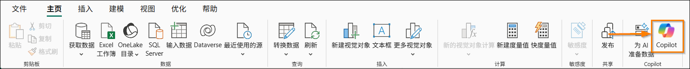

3. 询问 Copilot **What reseller has the highest sales?**按** Enter** 键或单击**箭头。**

    

4. 下面的屏幕截图显示了结果。这些不是我们预期的结果。Copilot 使用了度量值 [Reseller Sales]，但是，我们希望 Copilot 使用 [Sales by Reseller]。

    **可能的选项：**

    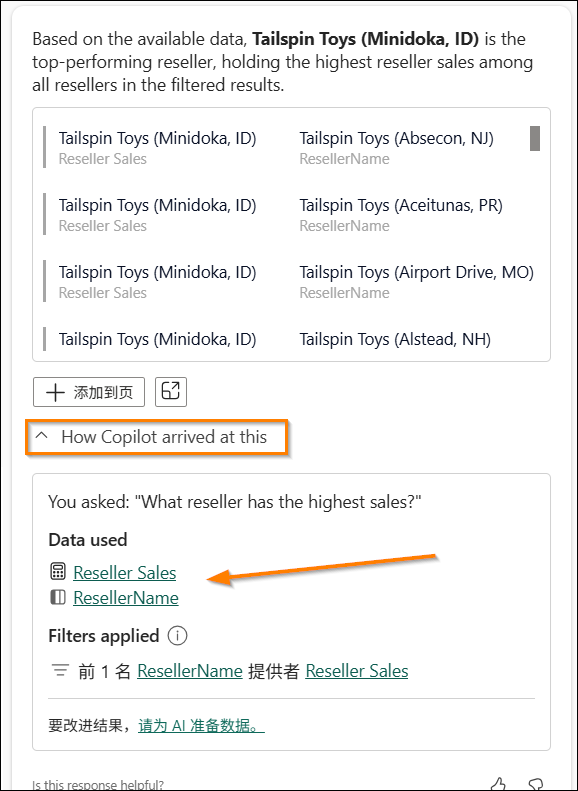

    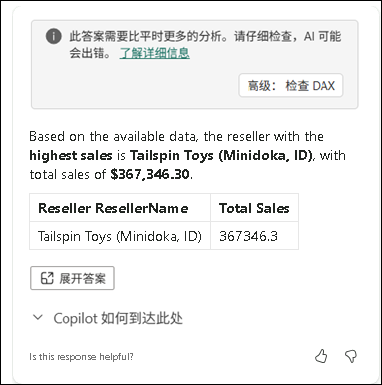

    

    这也突出显示更多隐藏的筛选器！我们稍后将针对这些筛选器进行调整。

5. 我们将利用 Power BI Desktop 中的“为 AI 准备数据”功能来从 Copilot 隐藏度量值 [Reseller Sales]。在“主页”功能区中，选择**为 AI 准备数据**。

    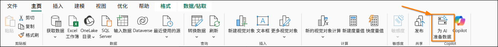

6. **入门**页面中将打开新的窗口。

    

7. 单击**简化数据架构**。

    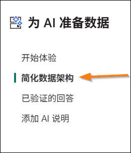

8. 通过单击 **>** 图标展开 **Resellers** 表。“Reseller Sales”度量值可能会使用 Copilot 产生模棱两可的结果，您将从架构中删除它，以便 Copilot 不会在分析期间包含它！从 Copilot 中排除此度量值将使结果更加一致。单击复选框以取消选择度量值 **Reseller Sales**，然后单击“**应用**”。*请参阅下面的屏幕截图。*

    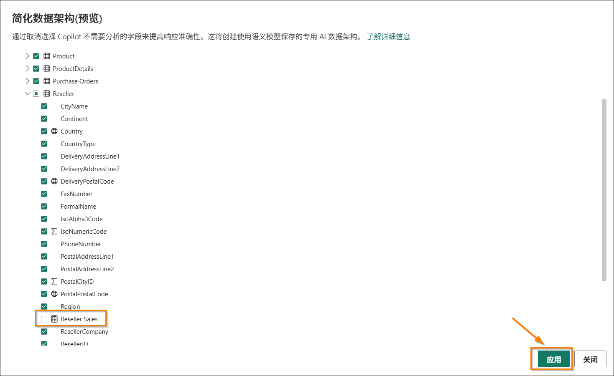

9. 单击**关闭**。

    

    **ℹ️ 重要提示**

    最佳做法是，对表、列和度量值的名称进行详细描述。这将有助于 Copilot 在回答问题时创建更加一致和准确的结果。例如，在此模型中，有两个度量值，分别名为 [Reseller Sales] 和 [Sales by Reseller]。这会让 Copilot 感到困惑，并可能导致答案不一致。在本实验室中，我们从架构中删除了此度量值，在其他应用场景中，您可能希望重命名该度量值！

10. 单击**主页**功能区上的 Copilot 按钮以关闭并重新打开 Copilot。

    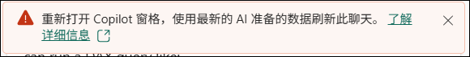

    

11. 询问 Copilot **What reseller has the highest sales?**按** Enter** 键或单击**箭头。**

    

12. 从 Copilot 获得回复后，单击 **Copilot 如何找到此答案**部分。

    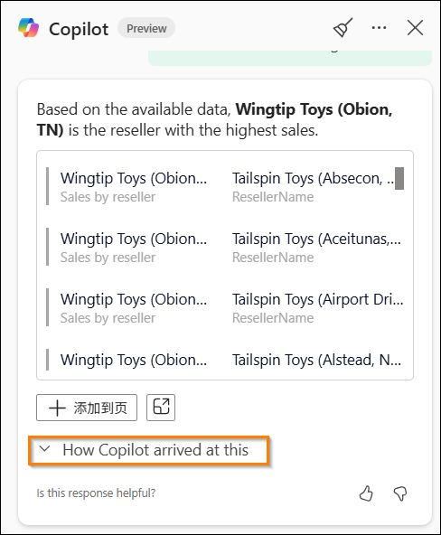

13. 此时您应该会看到，用于查找此答案的度量值是 **Sales by reseller，甚至是 SalesNet**！太棒了，Copilot 已经过训练，可以避免这种可能但不想要的度量值。由于 Copilot 的不确定性，您可能会在此处看到不同的结果。在这里，您可以继续为 AI 准备数据，以打造更加一致的体验！

    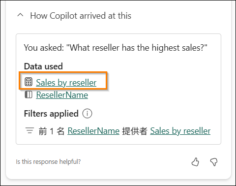

    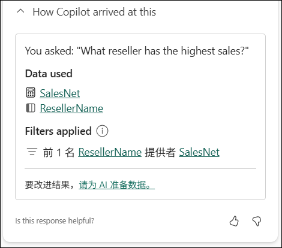

14. 作为最佳做法，隐藏可能使 Copilot 感到困惑的表、列和度量值是一个好想法。

    **ℹ️ 重要提示**

    在非常特定的筛选器上下文中创建用于非常具体的用途的帮助程序度量值或一次性度量值，这种情况在 Power BI 中很常见。如果您知道有很多度量值要从 Copilot 中隐藏，则创建一个专门用于存储要隐藏的度量值的表可能很值得。这将使更新架构的流程更加简单。此时，不支持隐藏度量值文件夹。

15. 我们还遇到过以下情况：返回了“Customer”表中的“State”，而不是“Reseller”表中的“State”。“Customer”表不应在此情况下使用，而是仅在非常特定的应用场景中使用。由于此表可能会使 Copilot 感到困惑，因此我们将隐藏它。

16. 单击“主页”功能区中的**为 AI 准备数据**。

17. 从左侧导航栏中选择**简化数据架构**。

18. 取消选择“Customer”。取消选中“Customer”表后，对于您需要生成的任何报表、视觉对象或 DAX 计算，该表仍将存在于您的语义模型中。但是，在分析期间，Copilot 会忽略它。确保**应用**并**关闭**。

    

    

## 任务 2：添加 AI 指令

添加 AI 指令是为 AI 准备数据的一个非常重要的步骤。通过添加定义明确的 AI 指令，您可以将业务上下文、术语和分析优先级直接嵌入到模型中，从而帮助 Copilot 更深入地了解您的语义模型。这使得 Copilot 在生成见解、回答问题或生成视觉对象时更智能、更快速且更符合您的意图。

在本实验室中，您将使用 AI 指令来帮助定义当 Copilot 被问及最畅销商品时返回的结果。

1. 打开 Copilot 并提出以下问题：**What are the top 5 best-selling products**.

    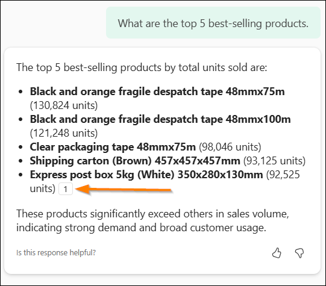

2. 如果得到与上面相同的结果，请单击引用以打开这些结果源于的视觉对象。

    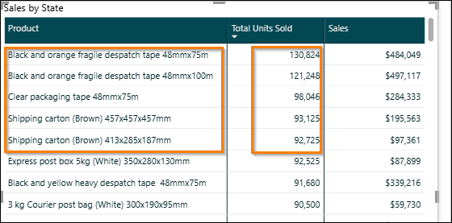

3. 此结果看起来是正确的，而且很可能是正确的。但是，是什么决定了*最畅销*产品与最热销产品？是数量、销售金额、最高利润率还是其他一些标准？

4. 目前，我们希望 Copilot 要求提供清晰信息，以便将预期和正确的结果返回给我们的最终用户。再次单击**为 AI 准备数据**按钮。

    

5. 导航到**添加 AI 指令**。

    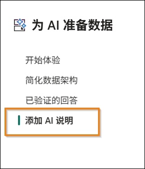

6. 为 Copilot 添加指令，以向用户阐明每次用户要求**销售额最高、最热销或最畅销**时他们想要的定义。

7. 键入：

    ***If asked about "highest" or ”most” or "best-selling" product, first clarify if the user wants product by unit sold or product by total sales value.***

    依次单击**应用**和**关闭**。

    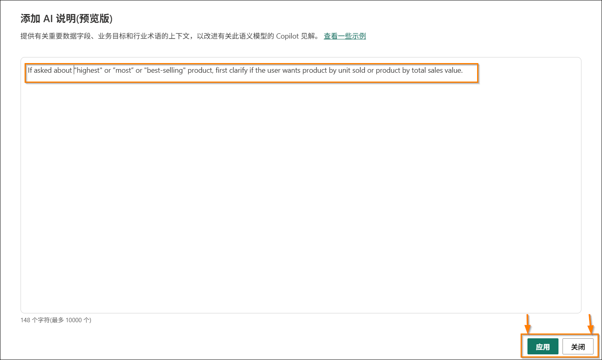

8. 打开“Copilot”窗格。如果 Copilot 已打开，请将其关闭并重新打开。这将确保您所做的更改已应用！

    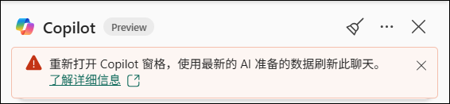

9. 询问 Copilot **What’s our best-selling product**?

    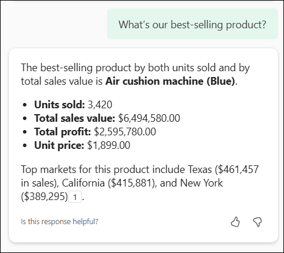

10. 由于我们向 Copilot 提供了指令，以向最终用户阐明他们所说的最畅销的含义，因此我们将在此处看到两个选项。系统还会提示您一个需要阐明的问题或提供其他信息。

11. 在提示中键入 **units sold**，然后点击 Enter 键。Copilot 现在将为您提供更具体的答案。

    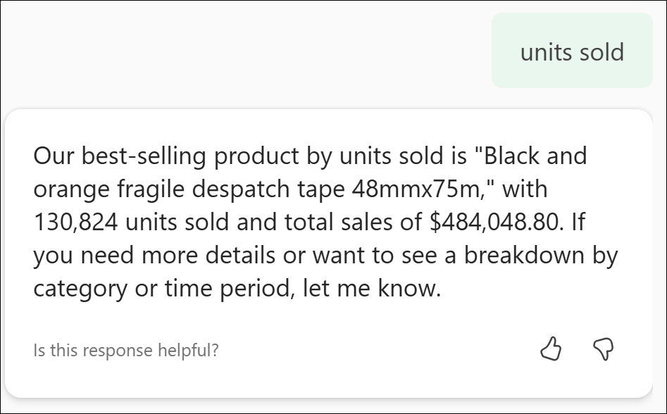

12. 让我们假设，我们肯定组织中的每个用户都知道最畅销和销售额最高之间的区别。在这种情况下，我们只需使用 AI 指令向 Copilot 提供定义。

13. 重新打开**为 AI 准备数据**对话框，导航到“添加 AI 指令”，然后将当前指令替换为以下内容：

    - **Best-selling = most units sold**

    - **Highest selling = total sales value**

        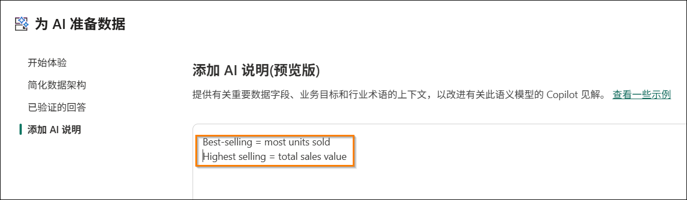

14. 依次单击“应用”和“关闭”。

15. 关闭并重新打开 Copilot。键入 **What’s our best-selling product**?在提示中，点击 Enter 键。

    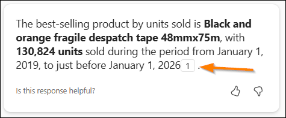

    Copilot 现在找到我们期望的答案，并且可以区分**最畅销**和**销售额最高**。正如我们在本部分开头所提到的。您提供的 AI 指令定义越明确，Copilot 就越能理解！

    **ℹ️ 重要提示**

    **在 Power BI Desktop 中测试 AI 指令的速度更快，因为没有发布延迟。** 因此，建议在发布到服务之前在本地测试和优化指令。发布会导致延迟，如果未立即反映更改，有时会导致困惑。桌面提供一个更具响应性的环境以供迭代和调试。

16. 如果您收到与上面相同的答案，请单击引用以查看结果的来源。

    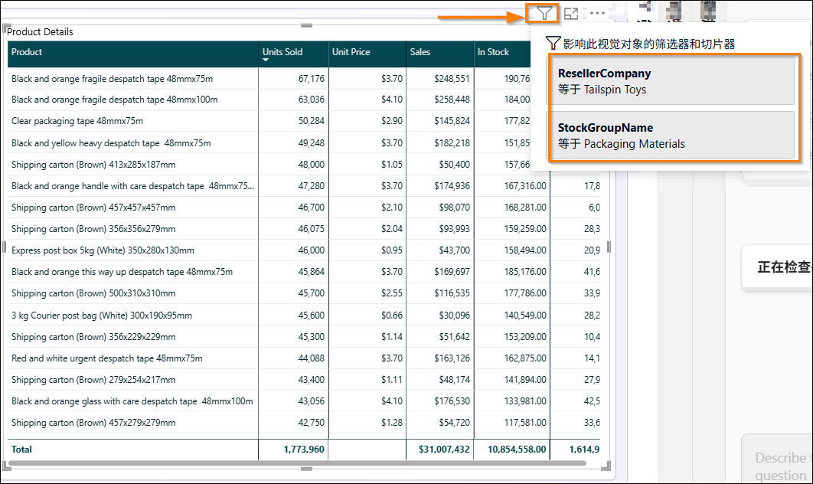

17. 结果可能会有所不同，但请注意返回的结果如何来自现有视觉对象，仔细检查后，您会发现该视觉对象实际上已经过筛选。这意味着我们从 Copilot 收到的回复具有误导性。具体来说，我们从未在请求中要求任何筛选器，Copilot 也没有指明我们的结果已经过筛选。

18. 返回到“为 AI 准备数据”并导航到 **AI 指令**。添加以下指令：

    **If you use an existing report visual to answer a user request, always let the user know about any existing filters on the visual.**

    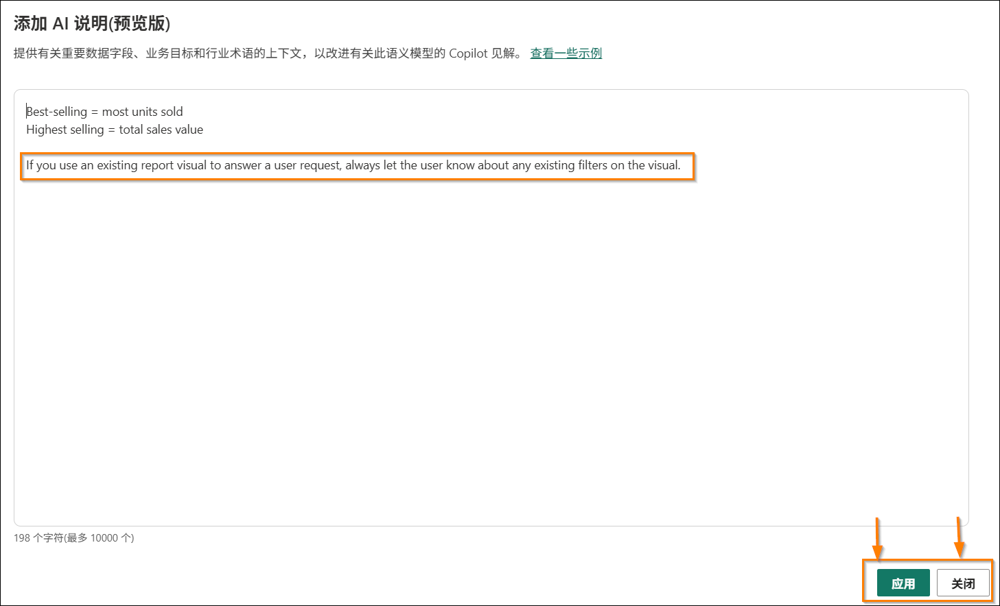

19. 再次询问 Copilot：**What’s our best-selling product?**

    

20. 请注意，这次我们返回了 1 个不同的引用视觉对象，并且 Copilot 正确地识别出这些视觉对象在 ResellerCompany 上针对 Tailspin Toys 应用了筛选器。

    

    **ℹ️ 重要提示**

    请务必记住，AI 指令是一项仍处于预览版状态的功能，并且会快速变化。继续探索不同的指令，了解哪些有效，哪些无效！

21. 当我们向最终用户推出独立 Copilot 体验时，我们希望建立信任，其中一种方法是确保 Copilot 不会无端猜测。我们可以添加的一条指令是告诉 Copilot，如果它不理解所问的内容，永远不要无端猜测。

22. 打开**为** **AI** 准**备数据**并添加以下指令，然后依次单击应用和关闭。

    - **Best-selling = most units sold**

    - **Highest selling = total sales value**

    **If you use an existing report visual to answer a user request, always let the user know about any existing filters on the visual.**

    ***If you do not understand what is being asked, do NOT guess, instead ask for clarification.***

    - Copilot 现在更有可能要求阐明问题。

    - 这是 Copilot 不确定时 AI 指令的实际应用！

        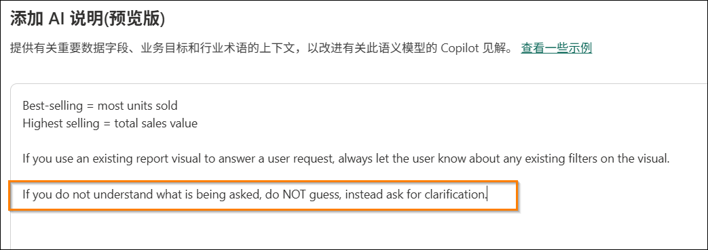

23. 再次打开 Copilot 并提出以下令人困惑的问题：**Total sales by something what is that?**

    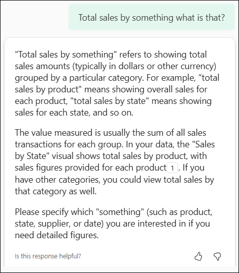

24. 在本示例中，如上面的屏幕截图所示，Copilot 不确定您希望如何查看总销售额，因此它要求您阐明您要查找的内容！

25. 我们可以添加的另一种指令是报表视觉对象指导。例如，如果您希望在折线图上始终看到日期，或者您始终希望 Copilot 在查看按国家/地区划分的销售额时返回矩阵，则可以添加这些指令。

26. 如果不添加 AI 指令，则无法保证 Copilot 将返回什么视觉对象。例如，如果我们要求：**Show total sales measure by year.** 我当前收到一张折线图：

    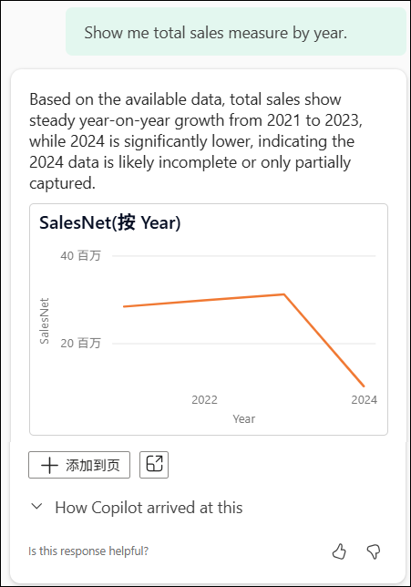

27. 现在，让我们添加一条 AI 指令，看看会发生什么！打开**为 AI 准备数据**并添加以下指令：

    **## Visual Guidance**

    **ℹ️ 重要提示**

    编写 AI 指令时，“##”是一种 Markdown 语言格式，不是必需的，但对于 Copilot 和 Fabric 数据代理的组织来说，这是一种很好的做法。

    ***When showing the total sales measure by year always use a column chart.***

    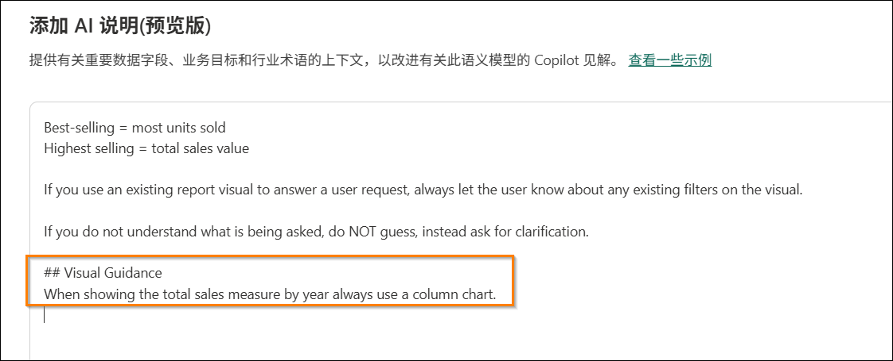

28. 再次打开 Copilot 并提出以下问题：**Show total sales measure by year.**

    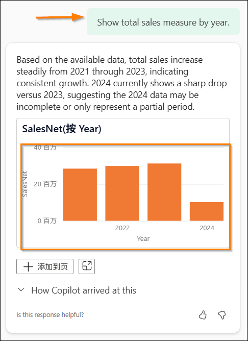

    Copilot 可能会编写 DAX 以找到答案并显示为表。请记住，您始终可以提示：**Can you make this into a column chart?** 或者改写 **AI 指令**。

    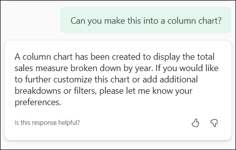

29. 让我们再看一个示例，这次是度量值定义。返回到 Copilot 对话助手窗口并提出以下问题：**How many purchase orders do we have?**

    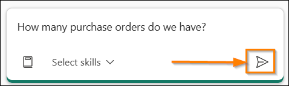

30. 请注意，结果是正确的，如果我们展开 **Copilot** **如何找到此答案**区域，我们甚至会发现它使用的是显式度量值！您是否记得，我们为此确切度量值创建了一个 Copilot 辅助描述。但是，让我们请求阐明 DAX 的计算方式。

    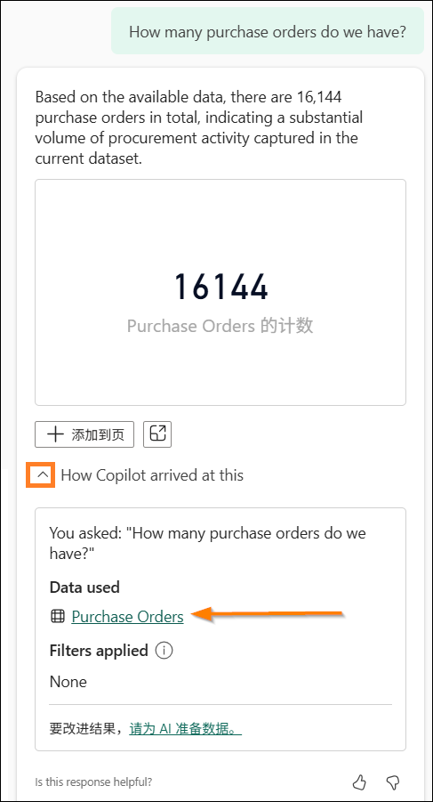

31. 提出问题：**Can you explain the DAX used?**

    

32. 我们的回复非常有趣，因为它指出了 Copilot 在直接访问我们的确切 DAX 公式方面的局限性。答案使用“可能”、“如果”、“通常”和“潜在”等词语，其本身在本质上是高度*生成式*的。借助 TMDL 视图和 AI 指令，这***有时***可以得到解决！

    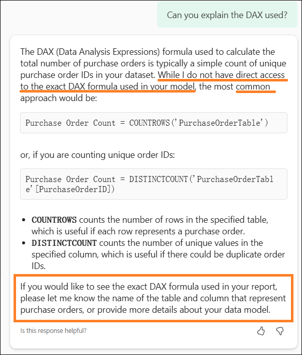

33. 在左侧导航窗格上，选择 **TMDL** 视图 。

34. 在屏幕底部，通过按“+”按钮创建一个脚本。

    

35. 我们将提取一个度量值来帮助用户阐明我们数据模型中的 DAX。将 **Purchase Orders** 度量值拖动到脚本中。

    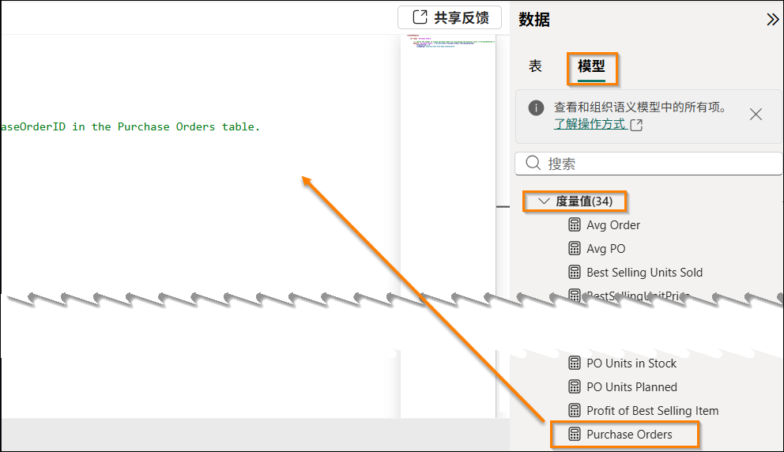

36. 生成的 TMDL 脚本是要添加到我们的 AI 指令中的重要资源！我们也可以看到此视图中表示的描述。我们现在想要复制度量值描述和度量值本身，如下所示：

    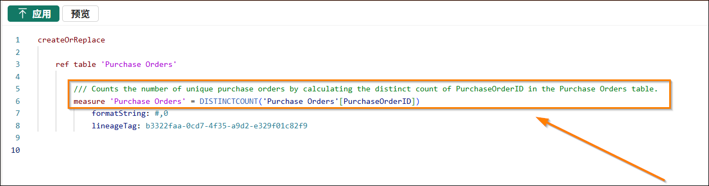

37. 现在返回到报表视图中的**为 AI 准备数据**，并将 TMDL 描述和度量值详细信息添加到**添加 AI 指令**视图中，如下所示。然后按**应用**。

    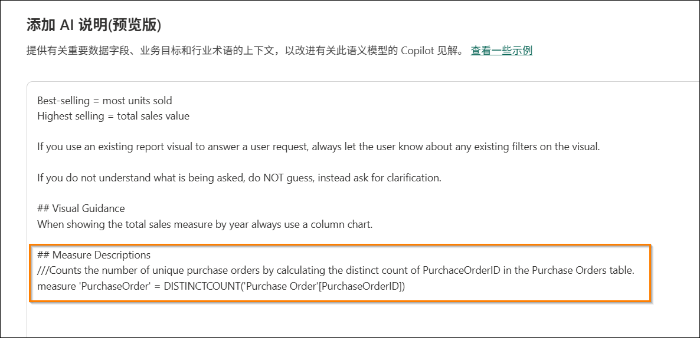

38. 重新打开 Copilot 窗格以刷新指令，并提出与之前相同的问题：**How many purchase orders do we have?**

    

39. 到目前还好。这是我们预期的行为，但下一个问题是我们一直所期望的。

    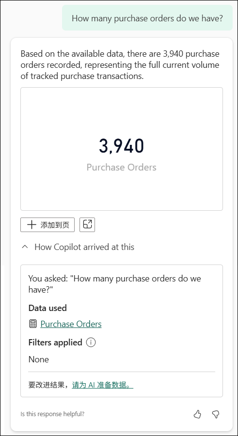

40. 现在请求阐明：**Can you explain the DAX used in the Purchase Orders measure?**

    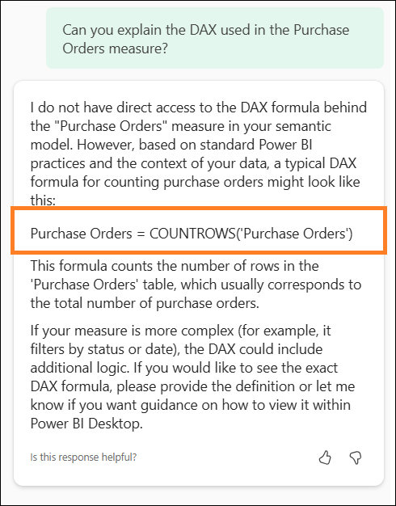

41. 不幸的是，Copilot 仍在猜测，尽管实际的 DAX 代码本身是正确的。将 DAX 代码添加到 AI 指令有时起作用，但此时仍处于预览版状态，出现不一致！

42. 在实验室的前面部分，我们要求提供东南亚的总销售额。Copilot 没有使用“Reseller”表中的“Sales Territory”列，而是假设哪些州表示东南亚地区。在本部分中，我们将添加一条 AI 指令，以确保 Copilot 在被问及区域时使用“Sales Territory”！

43. 打开**为 AI 准备数据**并添加以下指令：

    **If a user asks about region or territory related data, for example Southeast, use the Sales Territory column from the Reseller table.**

    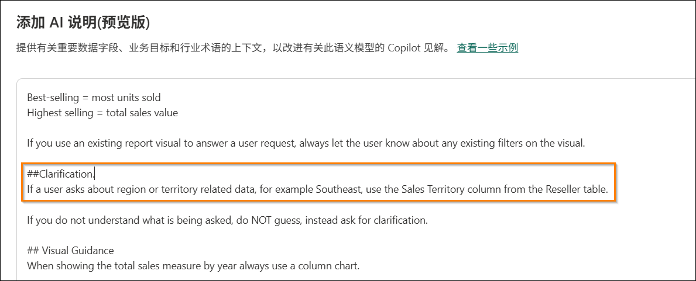

44. 打开 Copilot 并编写以下提示：**Show total sales for the Southeast。**

    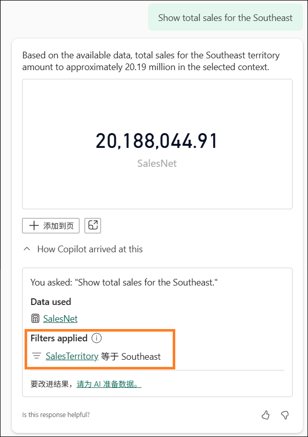

45. 在上一部分中，我们从数据架构中删除了“Customer”表。

    在本组织中，客户已明确定义为购买并分销我们产品的经销商。从这些经销商处购买产品的最终消费者不会归类为客户。我们需要区分这一点，以便 Copilot 在被问及客户时返回经销商。

46. 打开“为 AI 准备数据”并输入以下内容：

    **Customers = Resellers**

    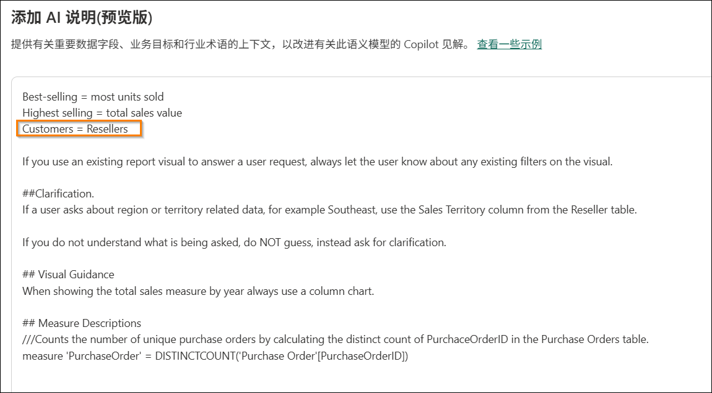

47. 在 Copilot 提示中询问：**What customer sold the most products in 2021?**

    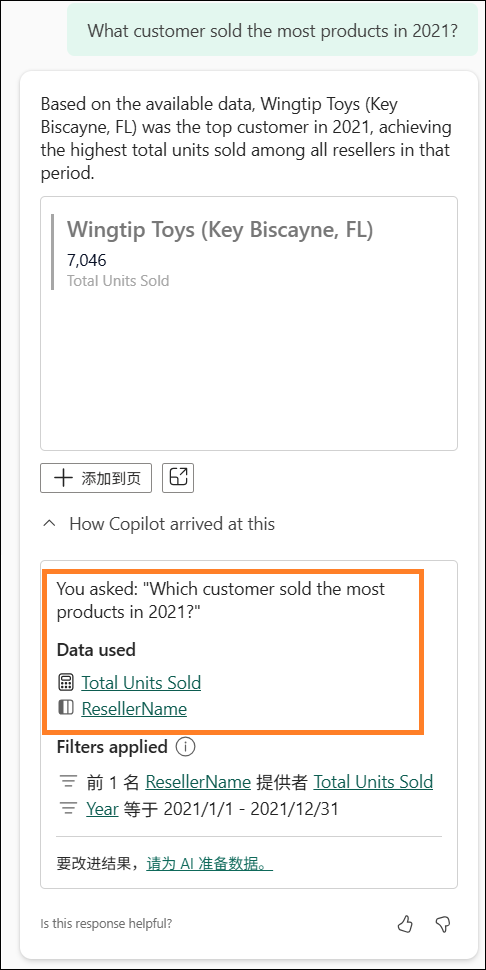

    这也显示在创建的 DAX 计算中！

    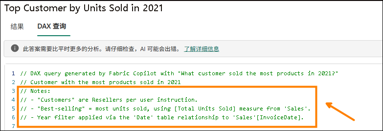

    请注意，Copilot 已收到正确的指令，并且正在使用“Reseller”表示“Customer”。

## 任务 3：创建已验证的回答

**ℹ️ 重要提示**

已验证的回答将与您设置为任何语义相似内容的短语相匹配。因此，您不需要设置用户可能询问的短语的每个可能变体。相反，应设置任何类似内容可能为用户触发的清晰的不同触发短语。

让我们通过添加已验证的回答，将数据准备提升到新的水平。已验证的回答允许模型作者选择视觉对象并选择短语，当用户提出问题时，该视觉对象将显示为已验证的回答。已验证的回答还可以帮助 Copilot 了解有关模型的背景信息并提供更准确的答案，即使提示未返回经过验证的确切答案。

1. 对于第一个示例，您将为 **Top state for sales** 创建一个已验证的回答。

2. 当前，如果您询问 Copilot，**What state has the most sales?** 它并不总是按照您预期的方式解释问题。这是因为“sales”一词在模型和报表中以多种方式引用。

3. 在本示例中，您将确保 Copilot 始终返回预期回复。

4. 这次，我们**不会**从“为 AI 准备数据”对话框开始。如果您在“为 AI 准备数据”对话框中打开“已验证的回答”选项卡，您将看到没有任何可用信息。

    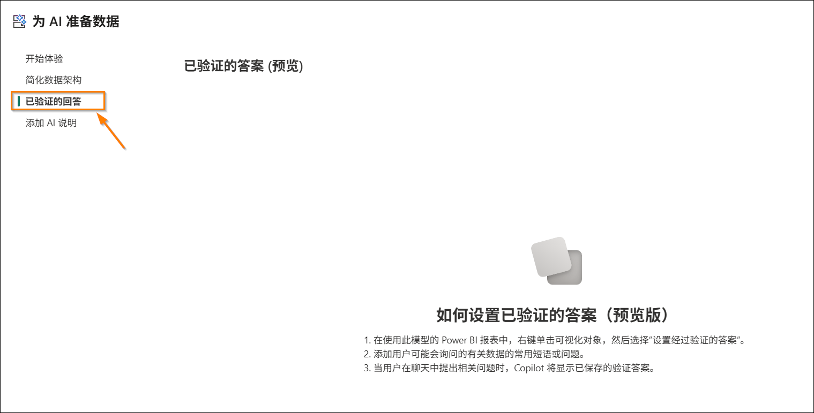

5. 相反，您将从报表上的视觉对象开始。

6. 关闭“为 AI 准备数据”窗口，然后导航到**产品详细信息**页面。

    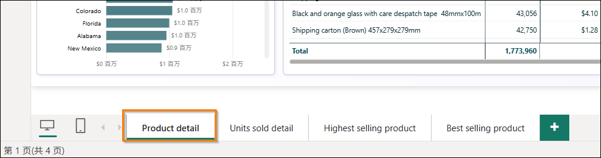

7. 单击进入“按州划分的销售额”的条形图，然后单击右上角的省略号 (**…**)。

    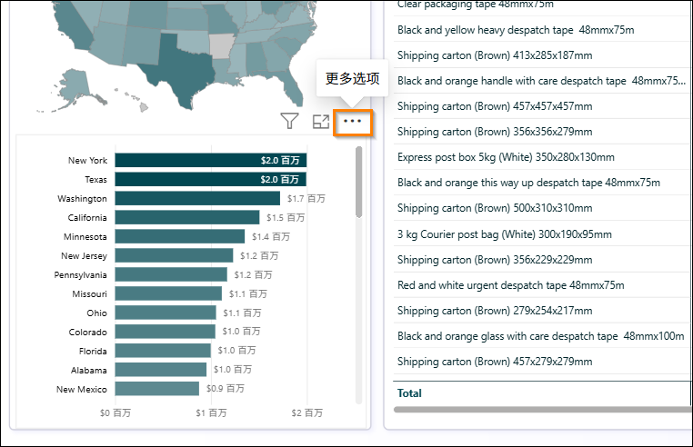

8. 从下拉列表中选择**设置验证的答案**。

    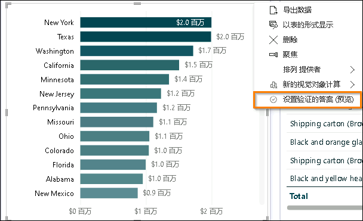

9. 您可以通过选择 Copilot 建议或键入您自己的自定义短语来设置短语。

10. 在“输入短语”框中，键入：**State with the highest sales**，然后**单击“添加”。** *请参阅下面的屏幕截图。*

    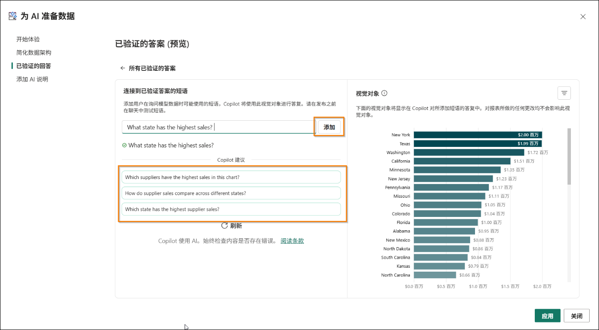

11. 依次单击“应用”和“关闭”。

    

12. 关闭并重新打开 Copilot 窗格。

13. 询问 Copilot：**What state has the highest sales?**

    

14. 获取针对问题返回的经过验证的正确答案。

    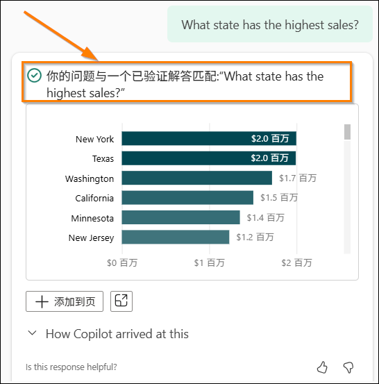

15. 误报该怎么办？让我们尝试一个不应使用已验证的回答的问题，看看会发生什么情况。在 Copilot 中，键入以下提示：**What state is selling the most of the highest selling product?**

    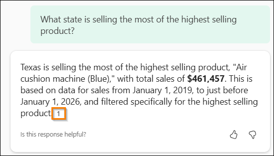

16. 太棒了！该回复指向我们报表中的不同视觉对象。更具体地说，它指向向下筛选到最热销产品的视觉对象。另请注意，回复遵循之前的 AI 指令，并告知我们对返回的视觉对象应用了筛选器！

17. 让我们再添加一个已验证的回答！这次我们想要展示**最畅销产品。**

18. 单击“最畅销产品”的报表页面。

    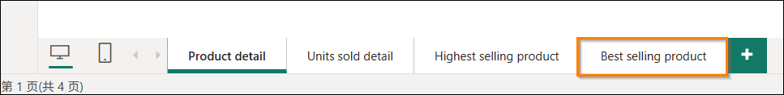

19. 接下来，在顶部找到卡片视觉对象，单击省略号 **(…)**，然后选择**设置已验证的回答**。

    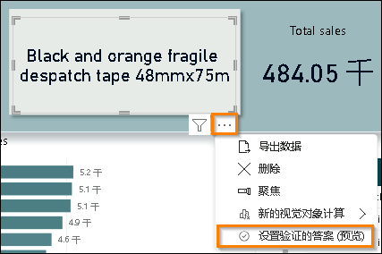

20. 在实验室的前面部分，我们添加了 AI 指令，以便让 AI 知道最畅销是指总销量，销售额最高是指总销售价值。我们希望确保已验证的回答短语与 AI 指令正确匹配。

21. 这次您将添加两个短语，它们可能会也可能不会显示在 Copilot 建议中。首先，添加短语 **Which Product has sold the most units?** 然后单击“添加”。

    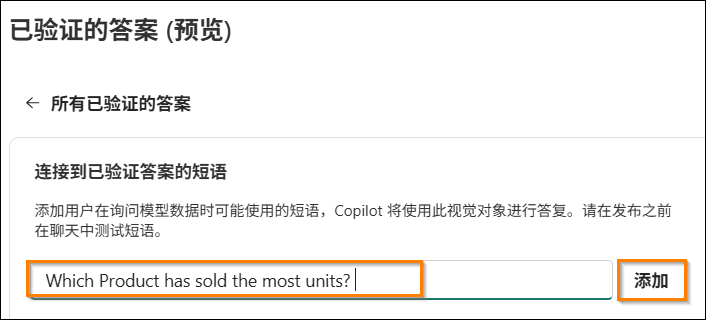

22. 单击“应用”。

    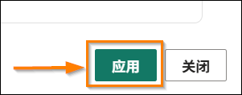

23. 单击 **Copilot 建议**旁边的 + 图标以添加其他短语。添加短语 **What is the best-selling product?** 或类似内容，然后单击“添加”。

    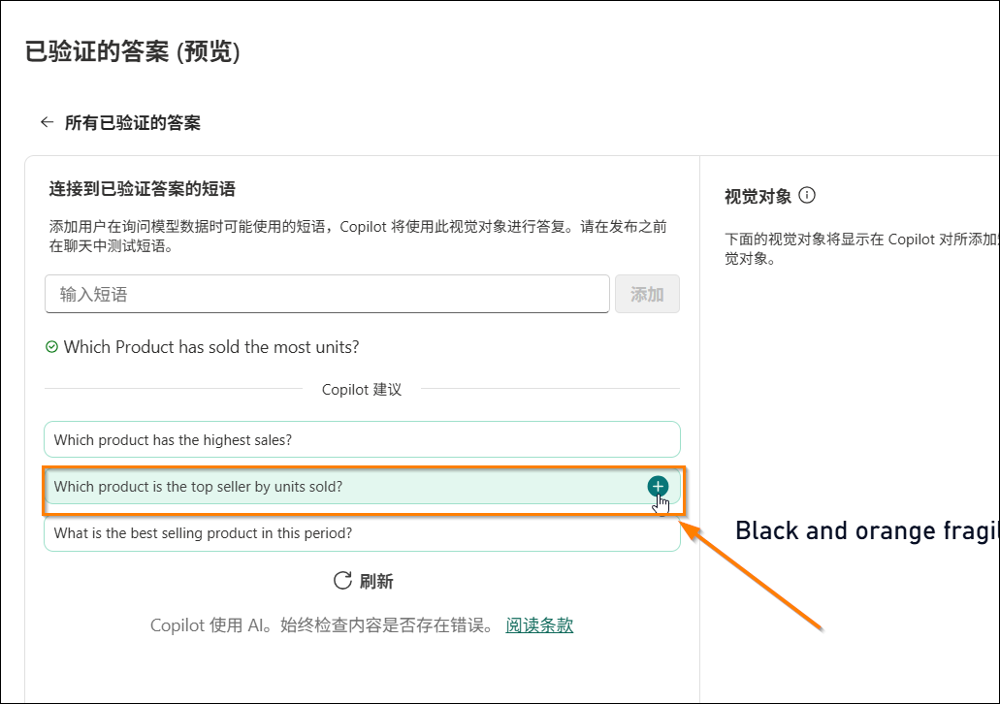

24. 现在，这两个短语都已连接到报表视觉对象，如以下屏幕截图所示！

    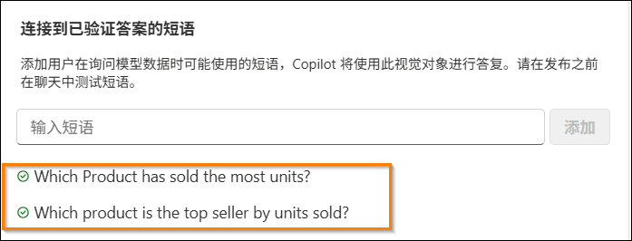

25. 依次单击“应用”和“关闭”。

26. 恭喜！在本部分中，您已经了解了如何将已验证的回答添加到报表视觉对象。您还了解到，可以添加多个短语来将用户问题连接到单个报表视觉对象！

## 任务 4：自己尝试

如果实验室时间允许，请继续探索您在本实验室中了解到的**为 AI 准备数据**功能。

1. 首先，向 Copilot 提出一个您想要了解的问题。如果结果不符合您的要求或预期。想一想如何通过仅使用数据架构、已验证的回答或 AI 指令来确保获得想要的结果！

## 结论

恭喜！您已完成本实验室的“为 AI 准备数据”部分！

# 参考

Chat With Your Data in a Day (CDIAD) 向您介绍了在 Fabric 工作区中使用独立 Copilot 时的一些关键功能。

在服务菜单中，“帮助 (?)”部分包含指向一些有用资源的链接。请注意，您看到的视图取决于您当前的体验，因此您的选项可能与下面的屏幕截图有所不同。

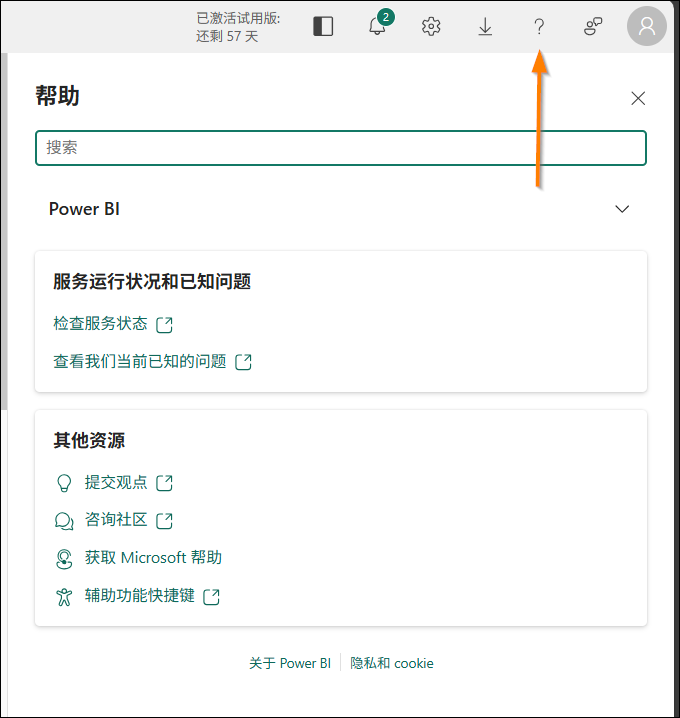

以下更多参考资源可帮助您进行与 Microsoft Fabric 相关的后续步骤。

- 访问主 [Microsoft Fabric 文档](https://learn.microsoft.com/en-us/fabric/)中的所有信息

- 通过[引导式教程](https://aka.ms/Fabric-GuidedTour)探索 Fabric

- 注册 [Microsoft Fabric 免费试用版](https://aka.ms/try-fabric)

- 访问 [Microsoft Fabric 网站](https://aka.ms/microsoft-fabric)

- 通过探索 [Fabric 学习模块](https://aka.ms/learn-fabric)学习新技能

- 阅读[有关 Fabric 入门指南的免费电子书](https://aka.ms/fabric-get-started-ebook)

- 加入 [Fabric 社区以](https://aka.ms/fabric-community)发布问题、共享反馈并向他人学习

阅读更多与 Copilot 相关的深入技术文档：

- [适用于 Power BI 的 Copilot 概述 - Power BI | Microsoft Learn](https://learn.microsoft.com/en-us/power-bi/create-reports/copilot-introduction)

- [Power BI 中的独立 Copilot 体验（预览版）- Power BI | Microsoft Learn](https://learn.microsoft.com/en-us/power-bi/create-reports/copilot-chat-with-data-standalone)

- [Microsoft Fabric Copilot 管理设置 | Microsoft Learn](https://learn.microsoft.com/en-us/fabric/admin/service-admin-portal-copilot)

- [Fabric 数据代理创建（预览版）- 了解如何创建 Fabric 数据代理 | Microsoft Learn](https://learn.microsoft.com/en-us/fabric/data-science/concept-data-agent)

- [配置数据代理的最佳做法 - Microsoft Fabric | Microsoft Learn](https://learn.microsoft.com/en-us/fabric/data-science/data-agent-configuration-best-practices)

- [适用于 Microsoft Fabric 和 Power BI 的 Copilot：常见问题解答 - Microsoft Fabric | Microsoft Learn](https://learn.microsoft.com/en-us/fabric/fundamentals/copilot-faq-fabric)

© 2026 Microsoft Corporation。保留所有权利。

使用本演示/实验室即表示您同意以下条款：

本演示/实验室中的技术/功能由 Microsoft Corporation 出于获取反馈和提供学习体验的目的提供。只能将本演示/实验用于评估这些技术特性和功能以及向 Microsoft 提供反馈。不得用于任何其他用途。不得对此演示/实验或其任何部分进行修改、复制、分发、 传送、显示、执行、复制、公布、许可、转让、销售或基于以上内容创建衍生作品。

严禁将本演示/实验（或其任何部分）复制到任何其他服务器或位置以便进一步复制或再分发。

本演示/实验室出于上述目的，在不涉及复杂设置或安装操作的模拟环境中提供特定软件技术/产品特性和功能，包括潜在的新功能和概念。本演示/实验室中展示的技术/概念可能不是完整的功能，可能会以不同于最终版本的工作方式工作。我们也可能不会发布此类功能或概念的最终版本。在物理环境中使用此类特性和功能的体验可能也有所不同。

**反馈**。如果您针对本演示/实验室中所述的技术特性、功能和/或概念向 Microsoft 提供反馈，则意味着您向 Microsoft 无偿提供以任何方式、出于任何目的使用和分享您的反馈并将其商业化的权利。您同样无偿为第三方提供其产品、技术和服务使用或配合使用包含此反馈的 Microsoft 软件或服务的任何特定部分所需的任何专利权。如果根据某项许可的规定，Microsoft 由于在其软件或文档中包含了您的反馈需要向第三方授予该软件或文档的许可，请不要提供这样的反馈。这些权利在本协议终止后继续有效。

对于本演示/实验室，MICROSOFT CORPORATION 不提供任何明示、暗示或法定的保证和条件，包括有关适销性、针对特定目的的适用性、所有权和不侵权的所有保证和条件。对于使用本演示/实验产生的结果或输出内容的准确性，或者出于任何目的包含本演示/实验中的信息的适用性，Microsoft 不做任何保证或陈述。

**免责声明**

本演示/实验仅包含 Microsoft Power BI 的部分新功能和增强功能。在产品的后续版本中，部分功能可能有所更改。在本演示/实验中，可了解部分新功能，但并非全部新功能。
