# Microsoft Fabric Chat with your Data in a Day 实验室 4

## 目录

- 文档结构
- 应用场景/问题陈述
- 简介
- 独立 Copilot 体验
- 设置：用于后续实验室的工作区设置
  - 任务 1：探索独立 Copilot 体验
  - 任务 2：在独立 Copilot 中编写提示
  - 任务 3：探索“在报表中查看”功能
  - 任务 4：探索
  - 任务 5：已验证的回答
  - 任务 6：Copilot 如何找到此答案 (HCAAT)
  - 任务 7：Copilot 生成的 DAX 查询中的数据答案
  - 任务 8：Copilot 中的上下文切换
  - 任务 9：Copilot 从语义模型中构建视觉对象
  - 任务 10：常规 Copilot 体验
- 参考

# 文档结构

本实验室包含用户需要遵循的步骤以及可提供直观协助的关联屏幕截图。在每个屏幕截图中，以橙色框突出显示的部分指出了用户应注意的区域。

# 应用场景/问题陈述

恭喜，您已完成前面的学习。现在，您已经了解了如何在数据模型中实施公认的最佳做法，以及如何使用“为 AI 准备数据”功能。现在可以探索 Microsoft Fabric 中的独立 Copilot 体验。

您的组织与许多其他组织一样，在数十个工作区中拥有数百个报表和语义模型。对于最终用户来说，找到正确的报表或数据一直具有挑战性。您希望利用独立 Copilot 体验来提高用户采用率，并更快地在整个组织中获取见解。

**当前挑战**

- **片段发现体验：** 用户很难在整个 Fabric 环境中找到正确的数据、报表、应用和数据代理。

- **采用率低**：大量的报表和所需的培训会造成阻碍，使其难以获得用户的支持和采用。

- **决策延迟：** 由于导航障碍和有限的自助服务功能，获得见解的时间仍然很慢。

# 简介

在之前的实验室中，您已经了解了如何准备语义模型以优化 AI 体验。在本实验室中，您将利用所有这些努力，探索 Microsoft Fabric 中的 Copilot 如何帮助您加快在组织内获得见解的时间。

# 独立 Copilot 体验

在本部分中，您将探索 Fabric 中的独立 Copilot 体验，并发现可以使用您的数据聊天的所有酷炫方式。在本实验室结束时，您将更好地理解如何利用独立 Copilot 体验来加快获得见解的时间，更具体地说，您将学习：

- 如何充分利用独立 Copilot 体验

- 如何理解返回的报表、视觉对象和数据回复。

- 如何验证“Copilot 如何找到此答案 (HCAAT)”

- 如何创建和修改可共享的探索。

- 如何利用“为 AI 准备数据”中的功能，例如已验证的回答

- 如何识别阻碍回复

- 如何利用常规 Copilot 体验

**ℹ️ 重要提示**

这些实验室中重点介绍的独立 Copilot 体验不保留聊天历史记录。如果您单击退出 Copilot 体验，您的对话将丢失。这与 M365 Copilot 对话助手体验不同。

## 设置：用于后续实验室的工作区设置

在本实验室和后续实验室中，您将需要自己的工作区才能在 Fabric 中编辑和保存项目。在此设置部分中，您将创建一个工作区并向该工作区分配 Fabric 容量，以便您可以在不影响其他实验室参与者的情况下执行特定任务。

1. 在虚拟机中打开 Web 浏览器并导航到 https://fabric.microsoft.com/

2. 使用研讨会中提供给您的凭据登录到 Fabric。

3. 从左侧导航窗格中选择**工作区**。

   

4. 在“工作区”窗格中，单击 **Fabrikam*Lab*<inject key="DeploymentID" enableCopy="false"/>** 工作区.

   

   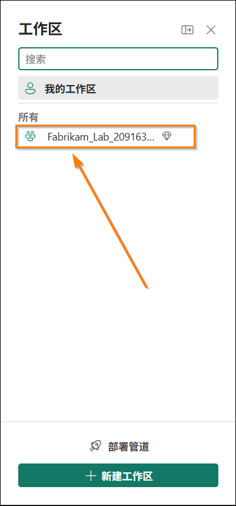

5. 我们现在需要确保您的个人许可证可以发布到启用了 Fabric 的工作区。选择右上角的用户图标，然后单击**免费试用**。

   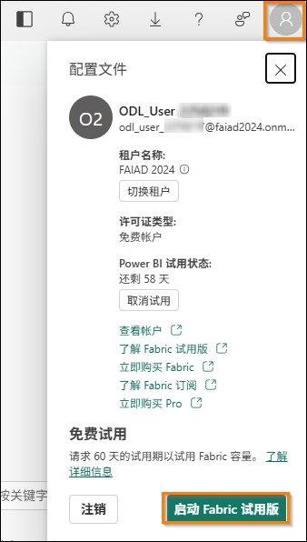

6. 只需单击**激活**，即可启用发布到工作区。

   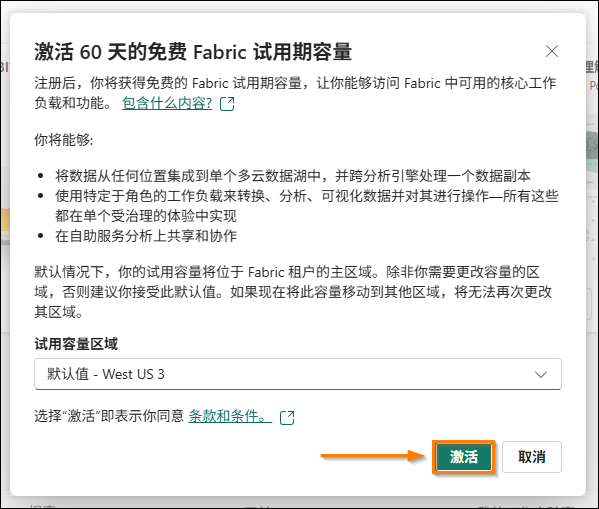

   单击**确定**。

   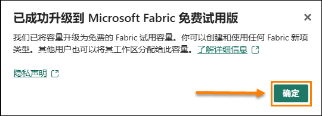

7. 接下来，您将需要从课堂文件中**发布**已完成的 PBIX。

8. 从课堂文件中，打开名为 **Fabrikam Company Sales Report.pbix** 的文件。

   

9. 打开后，请确保您已登录到为 CDIAD 研讨会分配的用户帐户。

10. 单击“发布”，找到您刚刚创建的 **Fabrikam*lab*<inject key="DeploymentID" enableCopy="false"/>** 工作区。

    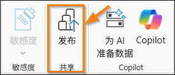

    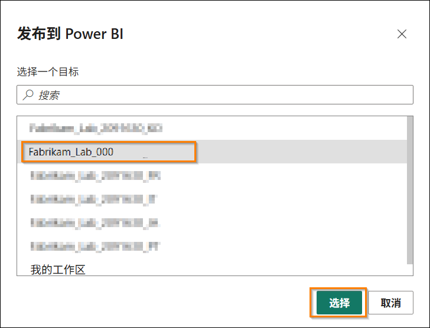

## 任务 1：探索独立 Copilot 体验

1. 从左侧导航窗格中选择 Copilot。

   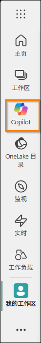

2. 如果您在下一个屏幕上收到提示，请单击 **开始**. Copilot 将根据用户有权访问的 **Copilot 容量** 选择一个工作区。本选择将取决于工作区是否具有可用的 **容量单位 (CU)**. 如果系统将用户分配到 **Fabric 容量配置 (FCC)**, 则将改用该容量。

3. 欢迎使用独立 Copilot 体验！在此启动屏幕上，您将在底部看到一个可供编写请求的部分 (1) 以及在底部收到一些提示想法 (2)。

   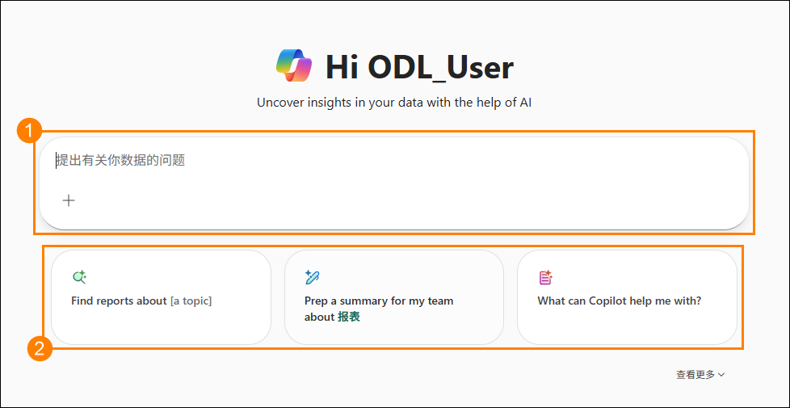

## 任务 2：在独立 Copilot 中编写提示

在本部分中，您将编写各种提示并探索 Copilot 体验返回的结果。

1. 单击提示并编写以下内容：**Find reports about Fabrikam’s sales trends for the year.** 然后单击 **Enter**。

   **ℹ️ 重要提示**

   

   由于许多因素，AI 返回不确定的结果。如本课堂前面所述，您的结果可能有所不同，并且可能与实验室不一致。请继续并尽可能探索所显示的功能和特性！

   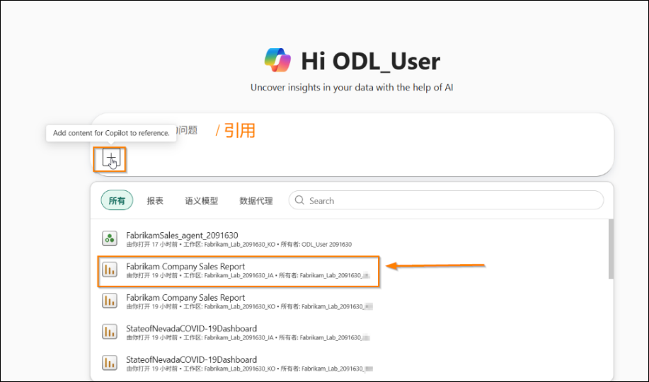

   您可以轻松使用 / 来引用文件，也可以使用 +。这可能很有帮助，因为 Copilot 需要一些时间才能完全内部化已发布的内容。

   如果您没有获得要展示的正确报表，这是因为我们通常需要检查以下几点：
   1. **–** 在 Power BI 服务设置中，选择 Fabric 管理门户我们希望确保已检查与 Copilot 相关的设置。其中一项设置**是仅在 Power BI 体验中的独立 Copilot 中显示批准的项目**。选择此功能后，将仅显示已批准用于 Copilot 的项目，除非手动附加/引用它。默认情况下，此功能已在我们的租户中启用。

      

   2. – 或者，我们可以通过在工作区中选择模型来批准 Copilot 的语义模型。

      

   3. – 选择“**为 AI 准备数据**”后，您将打开“为 AI 准备数据”窗口。

      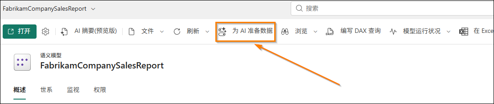

      若要在没有手动引用的情况下进行搜索，我们将需要打开大型模型存储。

      

      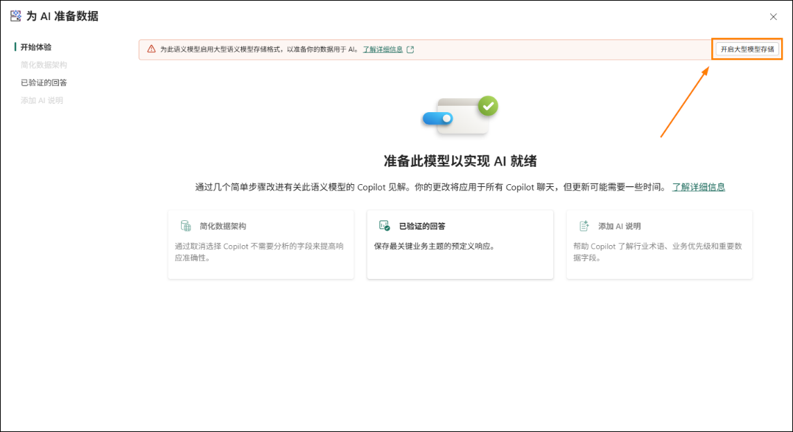

      从此处，您可以查看和调整“为 AI 准备数据”工作。

2. 单击搜索结果中返回的报表 **Fabrikam Company Sales Report**。这将在您的 Web 浏览器中打开一个新选项卡，直接将您转到该报表。

   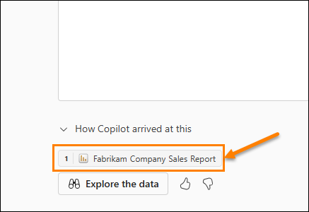

3. 花时间**探索**此报表并自行熟悉它！

   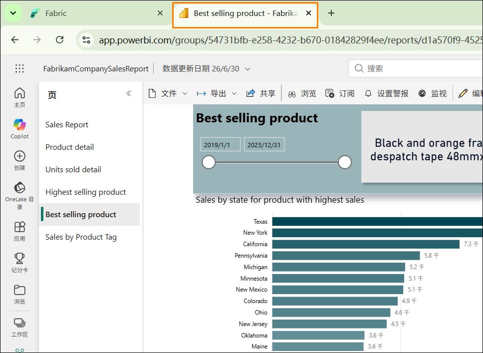

4. 探索完报表后。单击浏览器选项卡上的 (x) 以关闭此选项卡并返回到您的 Copilot 体验。

5. 单击页面底部预先生成的提示或在提示中输入：**Give me an overview of 1. Fabrikam Company Sales**：

   

6. 告诉 Copilot 向您提供报表概述将提供以下信息，如下面的屏幕截图所示。**提醒：您的屏幕和结果会略有不同！！**
   1. Copilot 将从提供概述的现有报表中返回报表视觉对象。

   2. Copilot 将为返回的每个视觉对象提供叙述性描述。

## 任务 3：探索“在报表中查看”功能

Copilot 可以根据提出的问题和基础数据的准备情况返回各种类型的回复。在本部分中，您将探索**在报表中查看**功能。每当 Copilot 使用报表中的现有视觉对象回答您的问题时，都会返回此功能。

1. 接下来，您将查看**在报表中查看**选项，此选项将打开当前报表并突出显示指定的视觉对象。

2. 在显示的任何可视化中，单击**在报表中查看**，这将在 Web 浏览器中打开一个新选项卡。_请参阅下面的屏幕截图_。

   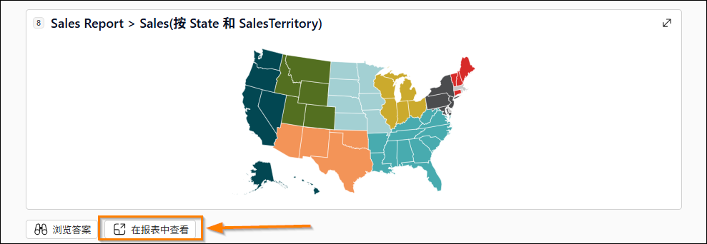

3. 在新的报表页面中，您将看到原始报表中 Copilot 选择的视觉对象。您还会注意到，其他视觉对象已暂时灰显，这是因为您选择的视觉对象已**突出显示**。单击报表中的任意位置以激活报表并进行探索！完成探索后，在 Web 浏览器中关闭此选项卡，然后返回到独立 Copilot 体验。

   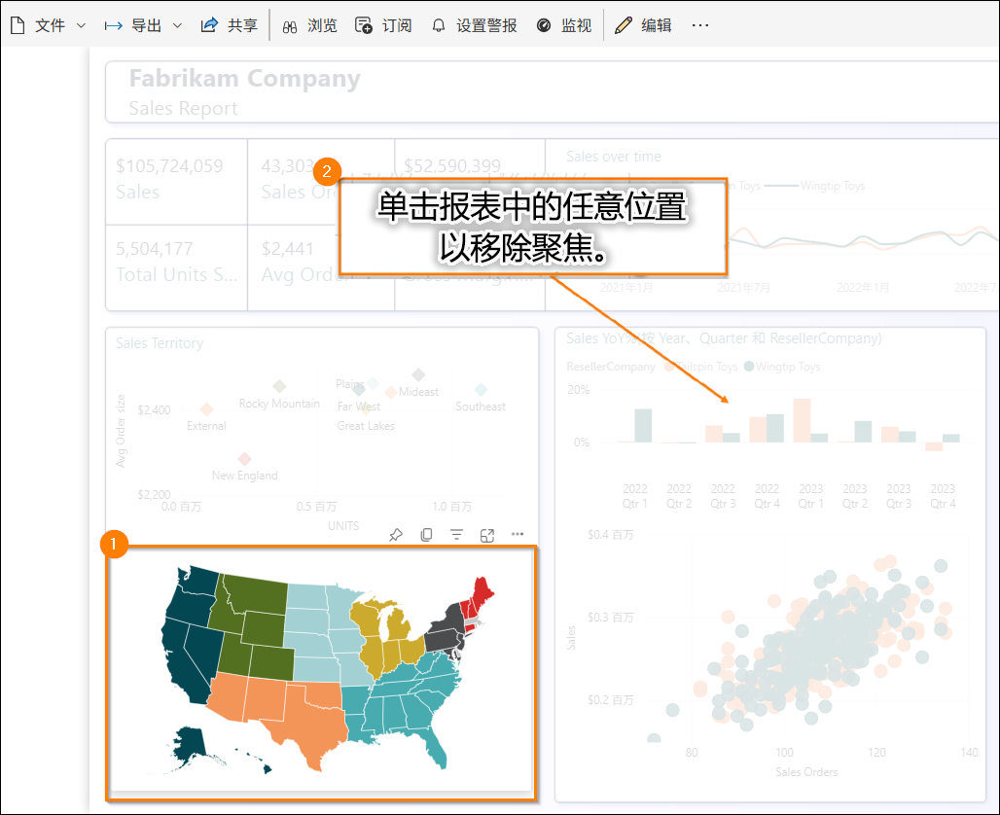

## 任务 4：探索

Copilot 体验呈现的另一项功能是**探索答案**功能。这种探索答案功能是继续完善 Copilot 体验的绝佳方式。在本部分中，您将学习如何使用、编辑、保存和共享探索！

**ℹ️ 注意**

探索主要用作临时分析报表上的现有数据和视觉对象的工具。虽然可以保存探索，但它们通常会在完成临时分析后关闭。

1. 您现在应该返回到独立 Copilot 体验中。单击 Copilot 中任何可视化下方的**探索答案**，对于本示例，您选择哪一个并不重要。

   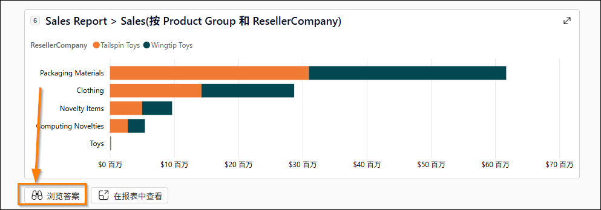

2. 现在，单击此按钮将打开一个新屏幕。让我们浏览**探索**！
   - (1) 将探索另存为报表或探索。

   - (2) 在新的浏览器选项卡中打开。

   - (3) 共享

   - (4) 以矩阵格式查看

   - (5) 更改可视化类型

   - (6) 更改视觉对象的列/度量值

   - (7) 展开/折叠视图

     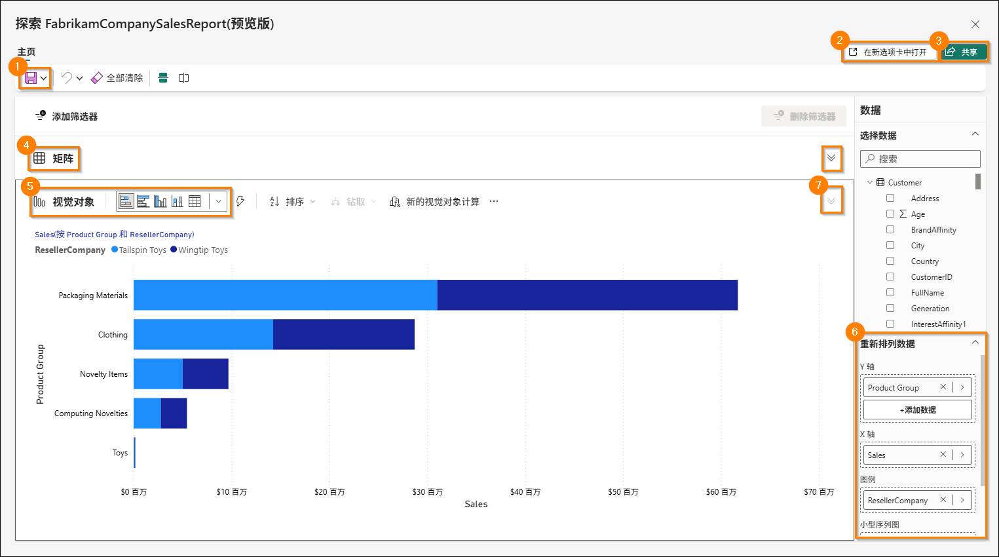

3. 单击“保存”按钮旁边的下拉图标，这将提供一些选项：
   - 首先，您可以将其另存为探索，这是工作区中的一种对象类型。

   - 接下来，您可以保存副本。如果之前已保存探索，则会显示本选项。

   - 最后，您可以将其另存为报表。

     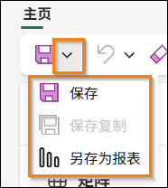

4. 如果您在本实验室的前面部分完成了该设置，现在可以保存此探索。从下拉列表中选择“保存”。您现在将收到一个**保存此探索**的弹出窗口，选择您在设置期间创建的工作区，然后点击**保存**。

   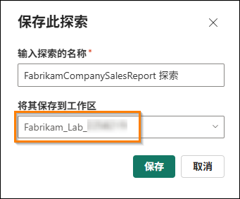

5. 在下面的屏幕截图中，您可以看到探索在保存后将如何显示在您的工作区中的一个**示例**：

   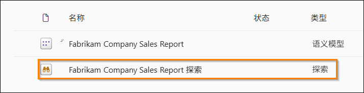

6. 您还可以与他人共享探索，仅当您先将探索保存到工作区时才能共享！

7. 返回到您的工作区，找到探索并单击“共享”图标。您将收到一个弹出窗口，允许您通过链接、电子邮件或 Teams 共享此探索！注意：**我们不会在本研讨会中共享探索，请关闭此框并继续执行下一步！**

   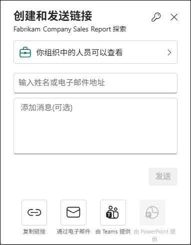

8. 请花些时间打开探索并探索其他功能！
   - 更改视觉对象类型

   - 更改所显示的列和度量值

9. 完成探索后，单击右上角的 **X** 以关闭探索。

   

## 任务 5：已验证的回答

在本课程的前面部分，您已花时间为 AI 准备数据模型。为 AI 准备数据的一部分是创建已验证的回答。已验证的回答可确保在 Copilot 中提出问题时返回某些可视化。这可为最终用户提供更加精心策划和一致的体验，同时还可确保报表的准确度、一致性和可信度！

1. 在接下来的课程中，您还将了解如何通过添加项目来获得更好的见解，从而进一步改进提示体验。通过显式附加项目，Copilot 可以缩小工作范围，从而提供更清晰、更简洁的结果。您目前可以将三个项目附加到提示，第四个项目即将推出：
   - 报表

   - 语义模型

   - 数据代理

   - 应用（即将推出）

2. 单击提示左下角的 **+ 添加内容以供 Copilot 引用**。

   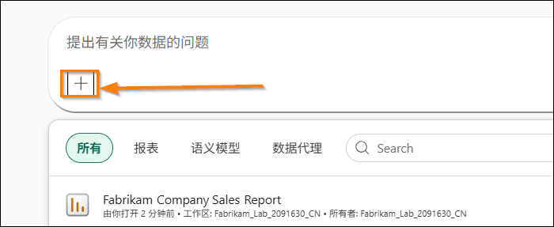

3. 从列出的选项中选择**报表**。然后选择**Fabrikam Company Sales Report**。单击**确认**。

   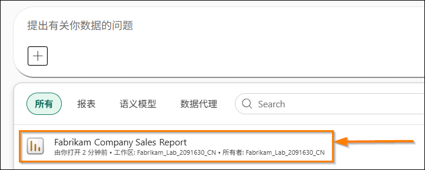

4. 现在，此报表在您的 Copilot 提示中显示为已链接！接下来，通过键入 **What is our best selling product?** 来完成提示

   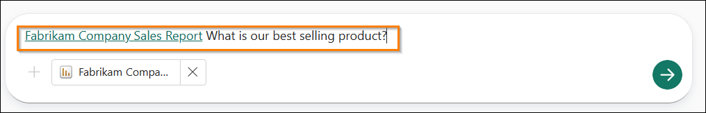

5. 您应该会根据此提示收到以下回复。如果在回复中使用了已验证的回答，则答案上方将显示一条通知。_请参阅下面的屏幕截图_。

6. 系统还会向您提供查看报表和探索数据的选项。

   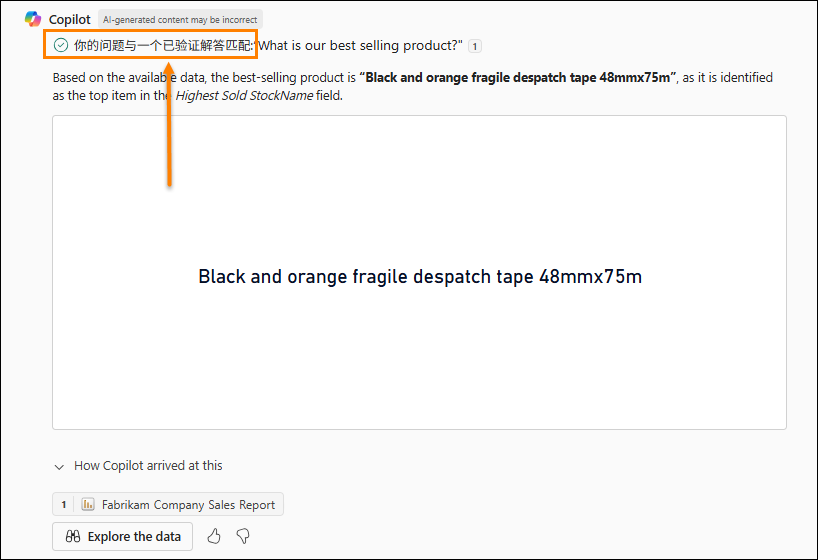

## 任务 6：Copilot 如何找到此答案 (HCAAT)

有时，Copilot 不仅提供答案，还解释如何找到了此答案。这简单介绍了生成回复的逻辑、筛选器、度量值等内容。更具体地说，这称为 HCAAT 或 Copilot 如何找到此答案。这些见解不仅有用，还使您能够验证结果、建立对输出的信任并加深对基础模型的理解。当这种情况发生时，它可能非常富有见解，并提供一种验证结果的方法。

1. 在已验证的回答下方，单击 **Copilot 如何找到此答案**。

2. 您将看到所提出的问题、用于回答问题的数据以及应用的任何筛选器。

   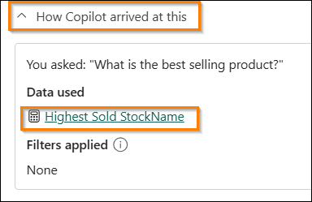

3. HCAAT 可以根据其获得结果的方式返回不同的结果。让我们再看一个示例。

4. 在 Copilot 提示中，附加 **Fabrikam Company Sales Report**，然后键入以下内容：**return all customers that make up the top 1% of total sales**。

   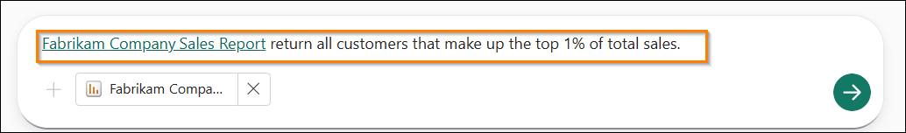

5. 让我们查看结果。
   - (1) 首先，我们得到的回复是，该答案需要进行的分析比平时多。这是 Copilot 生成的 DAX 结果。确保检查代码！它还可能显示数据未完全批准，因为它是 DAX 生成的。

     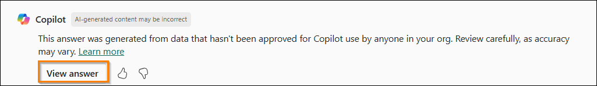

   - (2) 显示结果的表。结果看起来没问题。请注意，虽然我们请求的是“Customers”，但我们得到的是“Resellers”。这是因为当我们为 AI 准备数据时，我们删除了“Customer” 表，并使用了 “Reseller” 的同义词。

   - (3) Copilot 如何找到此答案

   - (4) Fabrikam 销售报表

   - (5) Copilot 生成的用于找到此答案的 DAX 查询

     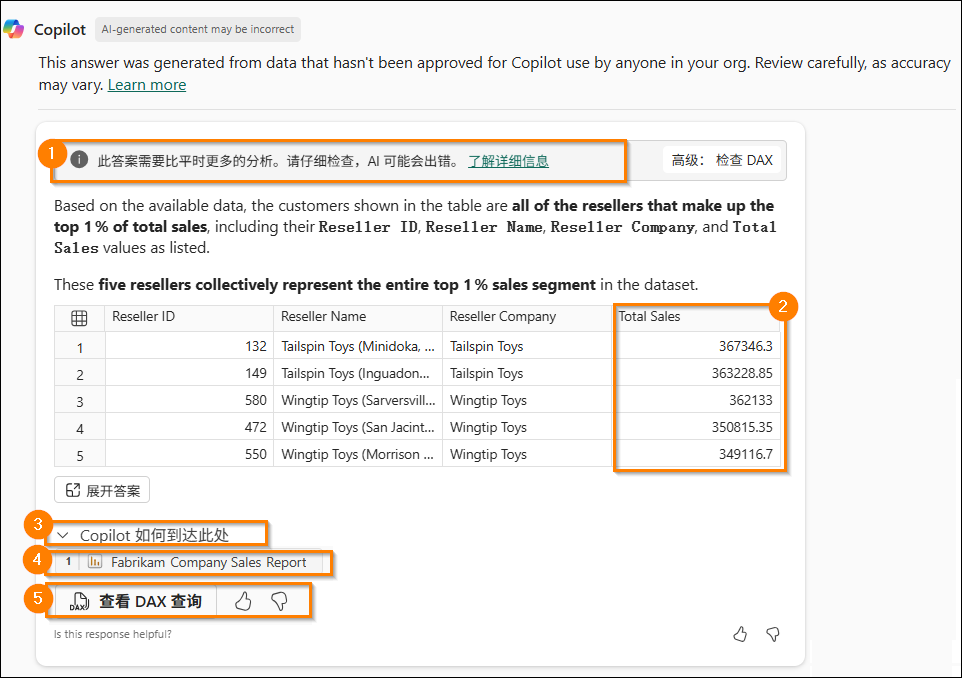

6. 首先，让我们探索 HCAAT。单击 **Copilot 如何找到此答案**以展开描述。

7. 这次我们得到的结果与以前大不相同。您将收到一个叙述性描述，用于解释 Copilot 如何找到此回复。

   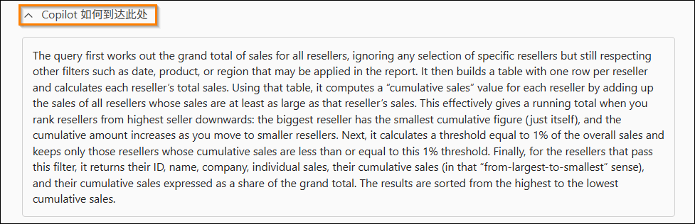

   在本部分中，您了解到 Copilot 有时会共享它找到此特定答案的方式。Copilot 共享或显示此信息的方式可能会因 Copilot 用于返回回复的流程而异！

## 任务 7：Copilot 生成的 DAX 查询中的数据答案

在前面的示例中，Copilot 通过查看语义模型中的基础数据生成了 DAX 查询。此外，Copilot 还警告您检查结果的准确度！让我们进一步深入了解回复。

1. 查看上面屏幕截图中的结果，您可以看到每个客户的总销售额是重复的（请记住，我们创建了一个同义词，即 Resellername = Customers）。这通常表明作为我们得到的回复一部分的表之间不存在有效关系。

2. 单击**查看 DAX 查询**。

   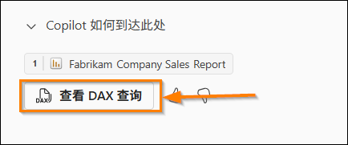

3. 这将提供一个弹出对话框，其中显示生成的 DAX 查询以及有关解决方案如何找到此答案的内联注释。在底部附近，您将看到 Copilot 如何找到此结果的描述。最后，在弹出窗口底部，您有两个可执行的选项。
   - 运行查询 - 这将获取当前的 DAX 并在 DAX 查询视图中打开它

   - 复制查询 - 本选项会将 DAX 复制到剪贴板

     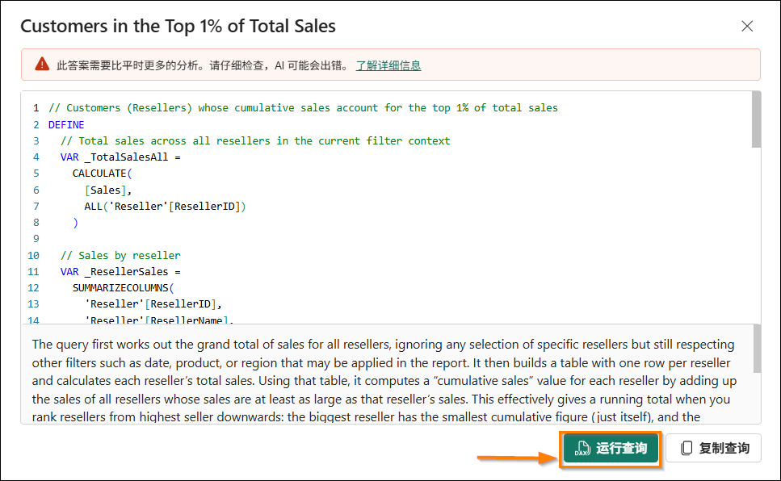

4. 单击**运行查询**。Web 浏览器中将打开一个新选项卡，显示 Fabrikam 公司语义模型上的 DAX 查询视图。

   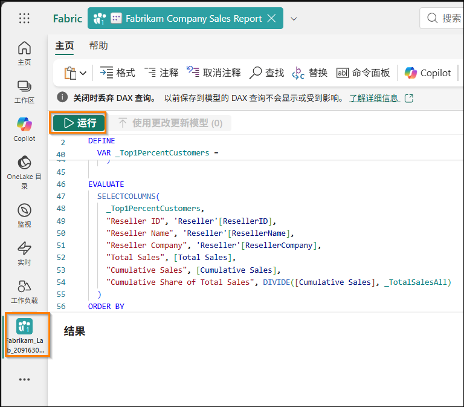

5. 单击**运行**以在 DAX 查询视图中查看结果。此处的结果与从 Copilot 获得的结果相同。如果您熟悉 DAX 语言，则可以修改 DAX 表达式以进一步优化结果。

   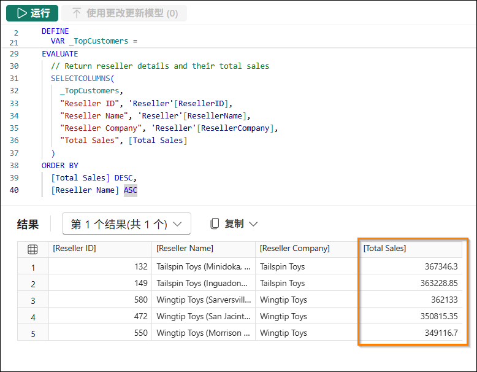

6. 这似乎是 Copilot 的一个出色回复，我们所有的准备工作都得到了回报。如果我打开备份 Power BI Desktop 并生成快速视觉对象，我可以快速验证 Copilot 的回复是否正确！

   

7. 此处需要指出的另一点是，您还有权查看模型视图。您可以在此处验证语义模型中的表和关系。

   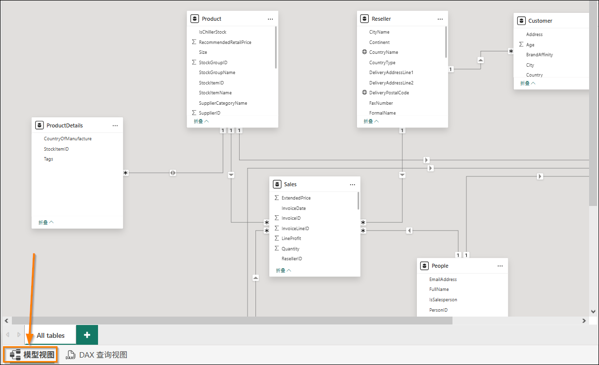

   在本实验室中，您了解到可以查看 Copilot 生成的 DAX，可以启动 DAX 查询视图并修改现有代码，甚至可以进入模型视图并验证关系。

**ℹ️ 重要提示**

Chat with your Data 体验是一个非常有用的工具，可显著缩短世界各地的公司获得见解的时间。但是，这些结果也可能不正确或具有误导性。正如我们在本实验室中看到的那样，停止并验证结果非常重要！

## 任务 8：Copilot 中的上下文切换

在本研讨会中，到目前为止，您的注意力只集中在 Fabrikam Company Sales 数据上。但是，我们的组织在许多工作区中有许多不同的报表，独立 Copilot 体验将引用它有权访问的所有报表。

1. 导航到您的课堂文件并打开 **State of Nevada COVID-19 Dashboard**。

   

2. 将这份完成的完整报表发布到您的 **Fabrikam_lab_0000000**。

   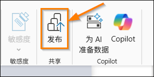

   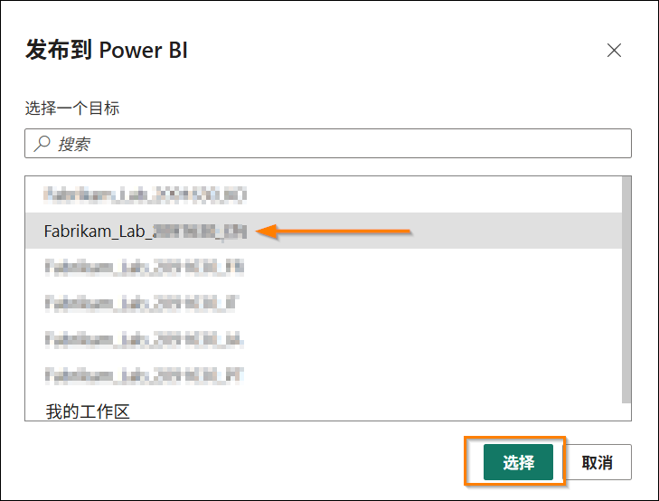

3. 现在，您将能够在独立 Copilot 体验中查询此语义模型和报表。在 Copilot 提示中，键入以下内容：**How many confirmed cases have there been?** 如果未立即包含，**请确保**使用 **+** 按 **钮** **(1)**、**语义模型** **(2)** 和 **StateofNevadaCOVID-19Dashboard (3)**. 我们特意提供了一个非常通用的提示，Copilot 能够根据报表的内容确定您的需求！请记住，在提供的报表下方，Copilot 会让您知道它匹配的条件。

   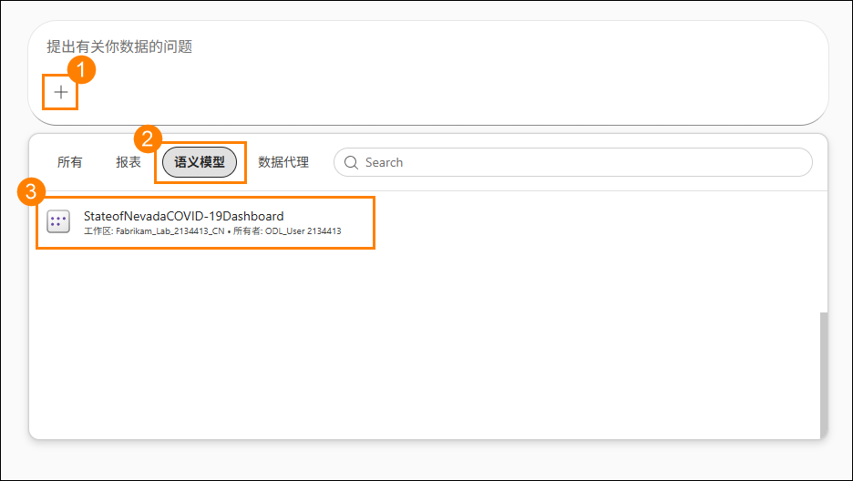

4. 非常棒！Copilot 现在通过返回基础报表中的视觉对象来回答我们的问题。请记住，您可以从 Copilot 获得多个不同的显示输出。

   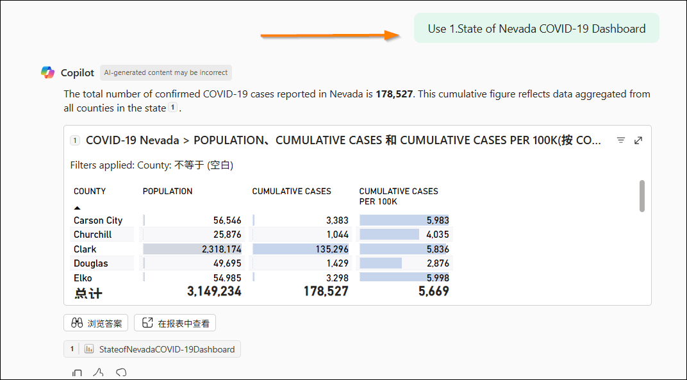

   或者

   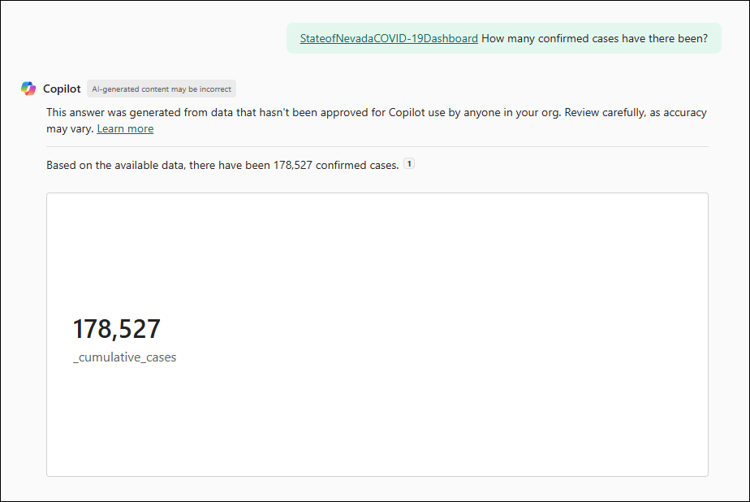

5. 在提示类型中提出另一个数据问题：**How many deaths were there in Carson City in 2019?**

   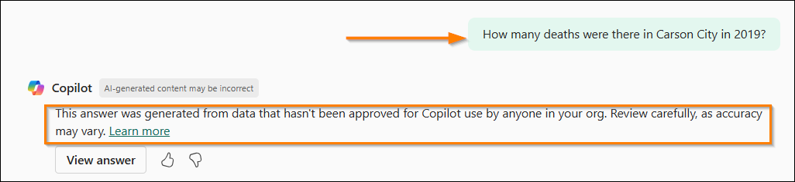

6. 这次，Copilot 没有找到可以返回的现有视觉对象，因此，Copilot 根据报表的基础数据生成了一个答案。发生这种情况时，在未标记为“已为 AI 做好准备”的模型上，您将收到一条**阻碍回复**。

   **ℹ️ 重要提示**

   阻碍回复是系统生成的警告或限制，当 Copilot 遇到未做好准备或描述不当的数据模型时会显示该警告或限制。Copilot 本质上是在说，我可以尝试提供可用信息，但是，结果应该进行验证！

   为了减少来自 Copilot 的阻碍回复，请确保为 AI 准备语义模型，然后在发布后将语义模型标记为“已为 AI 做好准备”。请参阅实验室文件中提供的“租户设置”指导文档。

## 任务 9：Copilot 从语义模型中构建视觉对象

在之前的实验室中，您观察到 Copilot 返回可视化来回答特定问题。这些可视化是我们的报表中已存在的视觉对象。在本部分中，您将看到 Copilot 如何从语义模型中构建可视化来回答请求。

1. 如果您尚未使用 Copilot，请导航回 Fabric 中的 Copilot。

2. 在您的提示中，附加 **Fabrikam Company Sales Report**，然后键入以下内容：**Show me units sold over time**。

   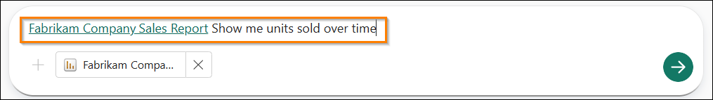

3. 返回的可视化不是报表中以前存在的视觉对象。这是 Copilot 基于语义模型创建的可视化！事实上，与直接来自报表的视觉对象不同，Copilot 生成的此答案随附 HCAAT 解释 _Copilot 如何找到此答案_。

   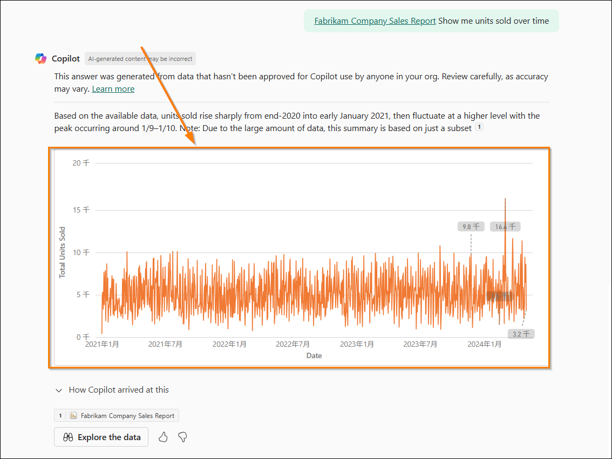

4. 让我们探索结果，单击 **Copilot 如何找到此答案**。

   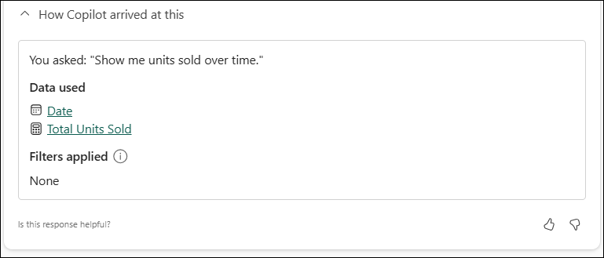

## 任务 10：常规 Copilot 体验

在本实验室中，您已经了解了如何利用 Microsoft Fabric 中的独立 Copilot 体验来探索现有报表和语义模型。但是，您还可以利用常规 Copilot 体验。在本实验室中，我们将利用 Copilot 针对我们的发现构建一封电子邮件！

1. 在 Copilot 提示中，键入 **Take the conversation so far and turn it into an email to share with the team**.

   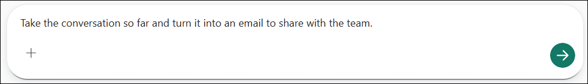

2. 结果非常酷！提醒一下，您的回复看起来与屏幕截图大不相同。同样重要的是要记住，回复基于您当前与 Copilot 的已打开聊天，如果您清除了聊天或对话历史记录很少，这将会影响最终结果。

   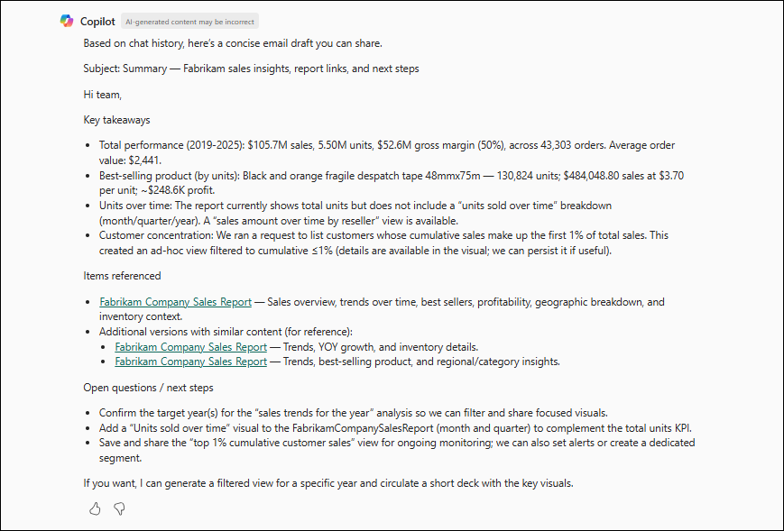

3. 这很好，但如果我们在电子邮件中有一些可视化和链接，那就更好了。在 Copilot 提示中，要求 Copilot **Add visuals and links to the email**。

   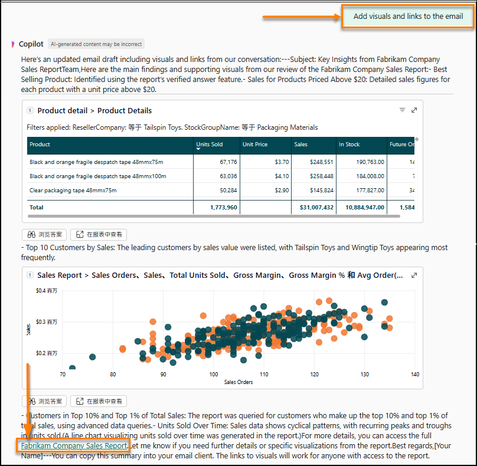

# 参考

Chat With Your Data in a Day (CDIAD) 向您介绍了在 Fabric 工作区中使用独立 Copilot 时的一些关键功能。

在服务菜单中，“帮助 (?)”部分包含指向一些有用资源的链接。请注意，您看到的视图取决于您当前的体验，因此您的选项可能与下面的屏幕截图有所不同。

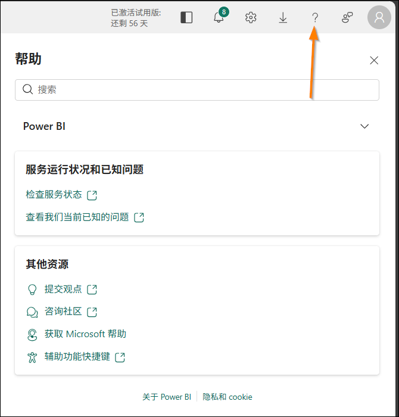

以下更多参考资源可帮助您进行与 Microsoft Fabric 相关的后续步骤。

- 访问主 [Microsoft Fabric 文档](https://learn.microsoft.com/en-us/fabric/)中的所有信息

- 通过[引导式教程](https://aka.ms/Fabric-GuidedTour)探索 Fabric

- 注册 [Microsoft Fabric 免费试用版](https://aka.ms/try-fabric)

- 访问 [Microsoft Fabric 网站](https://aka.ms/microsoft-fabric)

- 通过探索 [Fabric 学习模块](https://aka.ms/learn-fabric)学习新技能

- 阅读[有关 Fabric 入门指南的免费电子书](https://aka.ms/fabric-get-started-ebook)

- 加入 [Fabric 社区以](https://aka.ms/fabric-community)发布问题、共享反馈并向他人学习

阅读更多与 Copilot 相关的深入技术文档：

- [适用于 Power BI 的 Copilot 概述 - Power BI | Microsoft Learn](https://learn.microsoft.com/en-us/power-bi/create-reports/copilot-introduction)

- [Power BI 中的独立 Copilot 体验（预览版）- Power BI | Microsoft Learn](https://learn.microsoft.com/en-us/power-bi/create-reports/copilot-chat-with-data-standalone)

- [Microsoft Fabric Copilot 管理设置 | Microsoft Learn](https://learn.microsoft.com/en-us/fabric/admin/service-admin-portal-copilot)

- [Fabric 数据代理创建（预览版）- 了解如何创建 Fabric 数据代理 | Microsoft Learn](https://learn.microsoft.com/en-us/fabric/data-science/concept-data-agent)

- [配置数据代理的最佳做法 - Microsoft Fabric | Microsoft Learn](https://learn.microsoft.com/en-us/fabric/data-science/data-agent-configuration-best-practices)

- [适用于 Microsoft Fabric 和 Power BI 的 Copilot：常见问题解答 - Microsoft Fabric | Microsoft Learn](https://learn.microsoft.com/en-us/fabric/fundamentals/copilot-faq-fabric)

© 2026 Microsoft Corporation。保留所有权利。

使用本演示/实验室即表示您同意以下条款：

本演示/实验室中的技术/功能由 Microsoft Corporation 出于获取反馈和提供学习体验的目的提供。只能将本演示/实验用于评估这些技术特性和功能以及向 Microsoft 提供反馈。不得用于任何其他用途。不得对此演示/实验或其任何部分进行修改、复制、分发、传送、显示、执行、复制、公布、许可、转让、销售或基于以上内容创建衍生作品。

严禁将本演示/实验（或其任何部分）复制到任何其他服务器或位置以便进一步复制或再分发。

本演示/实验室出于上述目的，在不涉及复杂设置或安装操作的模拟环境中 提供特定软件技术/产品特性和功能，包括潜在的新功能 和概念。本演示/实验室中展示的技术/概念可能不是 完整的功能，可能会以不同于最终版本的工作方式工作。我们也 可能不会发布此类功能或概念的最终版本。在物理环境中使用此类特性和功能的体验可能也有所不同。

**反馈。** 如果您针对本演示/实验室中所述的技术特性、功能和/或概念向 Microsoft 提供反馈，则意味着您向 Microsoft 无偿提供以任何方式、出于任何目的使用和分享您的反馈并将其商业化的权利。您同样无偿为第三方提供其产品、技术和服务使用或配合使用包含此反馈的 Microsoft 软件或服务的任何特定部分所需的任何专利权。如果根据某项许可的规定，Microsoft 由于在其软件或文档中包含了您的反馈需要向第三方授予该软件或文档的许可，请不要提供这样的反馈。这些权利在本协议终止后继续有效。

对于本演示/实验室，MICROSOFT CORPORATION 不提供任何明示、暗示 或法定的保证和条件，包括有关适销性、针对特定目的的适用性、所有权和不侵权的所有 保证和条件。对于使用本演示/实验产生的结果或输出内容的准确性，或者出于任何目的包含本演示/实验中的信息的适用性，Microsoft 不做任何保证或陈述。

**免责声明**

本演示/实验仅包含 Microsoft Power BI 的部分新功能和增强功能。在产品的后续版本中，部分功能可能有所更改。在本演示/实验中，可了解部分新功能，但并非全部新功能。
