# Microsoft Fabric Chat with your Data in a Day 实验室 5

## 目录

- 文档结构
- 应用场景/问题陈述
- 简介
- 实施 Fabric 数据代理
- 先决条件
  - 任务 1：创建数据代理
  - 任务 2：添加数据源
  - 任务 3：向数据代理提出问题
  - 任务 4：添加 AI 指令
  - 任务 5：添加其他数据源
  - 任务 6：创建问题示例
  - 任务 7：发布和共享数据代理
  - 任务 8：从 Copilot 中使用数据代理
- 参考

# 文档结构

本实验室包含用户需要遵循的步骤以及可提供直观协助的关联屏幕截图。在每个屏幕截图中，以橙色框突出显示的部分指出了用户应注意的区域。

# 应用场景/问题陈述

独立 Copilot 体验取得了巨大成功，可使您的整个组织加快获得见解的时间并提高整体采用率！

但是，Copilot 体验不是高度可自定义的，现在您的最终用户需要更加精心策划的体验，这样他们可以将问题集中在非常具体的业务领域，而无需通过不相关的报表和语义模型进行解读。您的任务是创建一个数据代理，该代理仅连接到与 Fabrikam Company Sales Report 数据相关的数据。您还需要向数据代理添加一些独立 Copilot 体验无法使用的其他数据，以回答您的团队想要询问的有关产品提前期的更具体问题。

# 简介

您已经了解了 Copilot 独立体验，它非常适合探索所有工作区中的所有数据。但是，使用数据代理可以为使用特定数据聊天提供更加精心策划的体验。数据代理可以连接到特定数据源， 甚至连接到数据源中的特定表。Copilot 是 Fabric 内部的 AI 助手，可提高工作效率和智能，而数据代理则支持数据连接。

在本实验室结束时，您将了解到如何：

- 创建数据代理

- 将数据源添加到智能体

- 询问有关智能体的问题

- 为要使用的智能体添加 AI 指令

- 替换数据源

- 添加其他数据源

- 创建问题示例

- 发布和共享智能体

- 使用独立 Copilot 中的数据代理

# 实施 Fabric 数据代理

在本部分中，您将了解如何创建数据代理。智能体可以通过生成结构化查询（SQL、DAX、KQL）来检索数据，以回答涉及事实、总计、排名或筛选器的问题。在进行编写时，Fabrick 数据代理当前是 Microsoft Fabric 中的一项预览功能，不建议用于生产工作负荷。您可以在此处详细了解 Fabric 数据代理的工作原理：

[Fabric 数据代理创建（预览版）- 了解如何创建 Fabric 数据代理 | Microsoft Learn](https://learn.microsoft.com/en-us/fabric/data-science/concept-data-agent)

Microsoft Fabric 数据代理让用户可以使用简单的英语与企业数据进行交互，无需使用 SQL、DAX 或 KQL。它们提供带有调试工具的聊天界面，并连接到 Power BI 语义模型、KQL 数据库、湖屋和仓库等源。数据代理可以在 Microsoft Fabric 的内部和外部访问，并且可以集成到 Microsoft Teams、Copilot Studio、Azure AI Foundry 和自定义应用中。也可以从 Fabric 中的独立 Copilot 体验中发现数据代理！

## 先决条件

若要使用 Fabric 数据代理，有许多必须启用或配置的租户设置，请参阅课堂实验室中的 **租户设置指导文档** ：

- 需要管理员访问权限

- 启用 Copilot 和 Azure OpenAI 设置

- 启用 Fabric 数据代理创建和共享

- 为 Power BI 语义模型启用 XMLA 终结点

## 任务 1：创建数据代理

1. 在虚拟机中打开 Web 浏览器，转到 https://fabric.microsoft.com 并导航到名为 **Fabrikam*Lab*<inject key="DeploymentID" enableCopy="false"></inject>** 的工作区.

   _（**重要提示**：使用您在本课程前面部分创建的工作区）_

   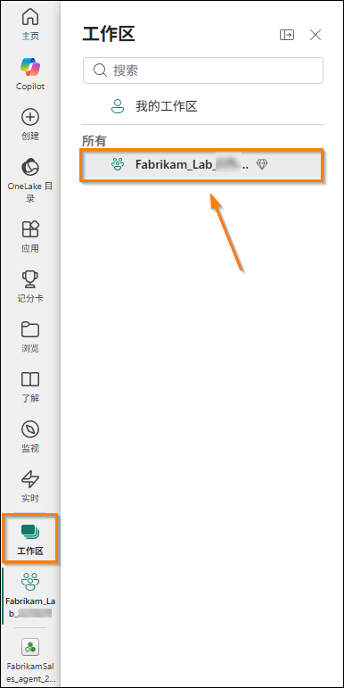

2. 单击 **新建项**：

   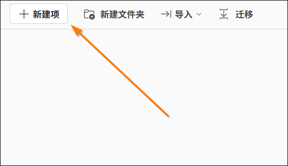

3. 在打开的搜索栏中，键入代理，然后选择 **数据代理(预览)**.

   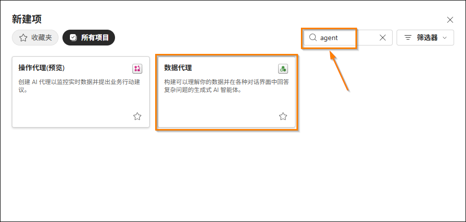

4. 将您的智能体命名为 **FabrikamSales*agent*<inject key="DeploymentID" enableCopy="false"/>。**

5. 请记住，用户代码位于您的用户名中，如下所示：

   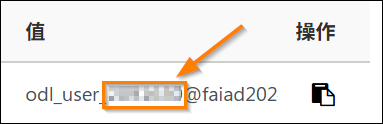

6. 单击**创建。**

   

## 任务 2：添加数据源

1. 创建数据代理后，下一步是添加数据源！

2. 在资源管理器窗格中，单击按钮 **+ 数据源**。或者，您可以单击屏幕中间显示的**添加数据源**按钮。

   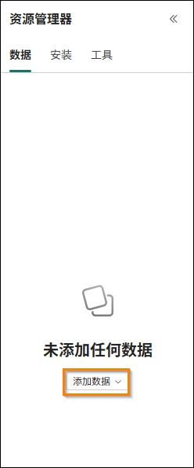

   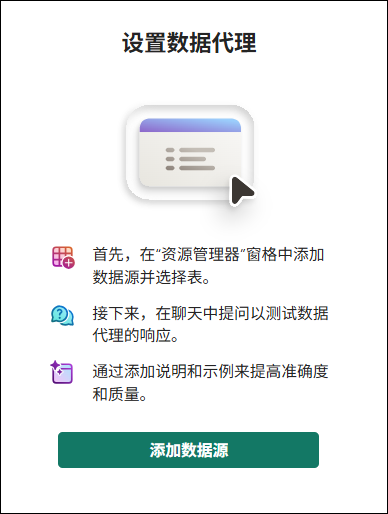

3. 从列表中选择 **Fabrikam Company Sales Report** 语义模型，然后单击**添加**。

   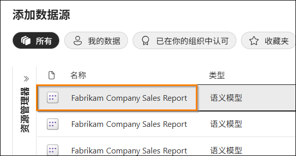

4. 请注意，尚未选择任何表，在至少选择一个数据源之前，数据代理无法回答问题。单击**资源管理器**窗格中 **Fabrikam Company Sales Report** 旁边的 **>**. 选择以下屏幕截图中显示的表。

   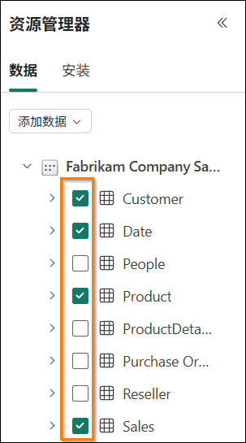

## 任务 3：向数据代理提出问题

1. 现在您的智能体已连接到数据源，让我们开始向数据代理编写一些提示。

2. 键入以下命令：**Show me sales by country**。

   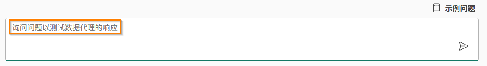

3. 智能体可能需要几秒钟才能回复答案。请注意智能体返回的内容：

   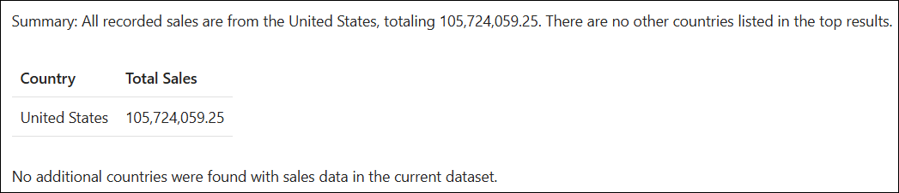

4. 单击已完成步骤的下拉列表以显示智能体所执行的操作，然后单击下一个下拉列表以显示详细信息。

   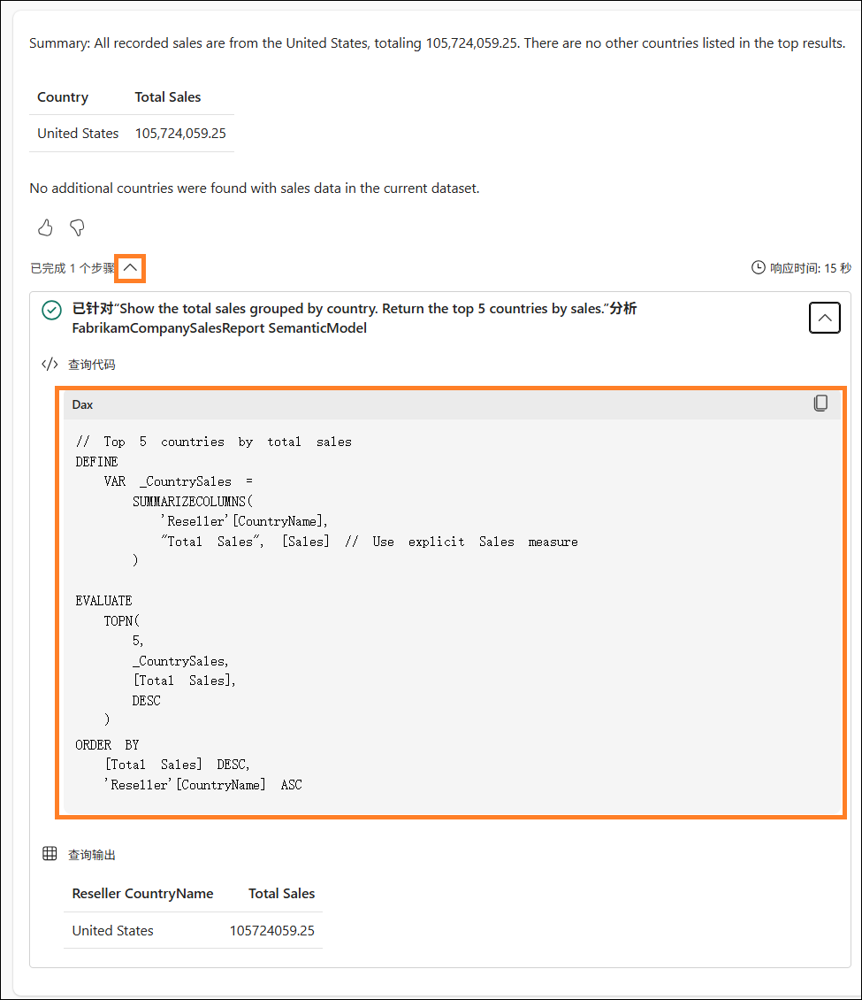

   **ℹ️ 重要提示**

   开发 Fabric 数据代理时，请务必花时间验证结果，以确保准确度和一致性。现在您获得了结果，我们将返回到语义模型并在那里验证结果！

5. 导航到下载的课堂文件，然后打开 **Fabrikam Company Sales Report.pbix** 文件。

   

6. 单击报表底部以打开新的报表页面。

   

7. 接下来，您将生成一个基本视觉对象，以验证数据代理返回的结果。

8. 在此新的报表页面上添加表视觉对象。

   

   

9. 生成的表应如下所示：

   

10. 请注意，总销售额与上面数据代理的查询输出相同。这可验证智能体查询是否返回了正确的输出。

## 任务 4：添加 AI 指令

可以向 Fabric 数据代理添加 AI 指令，以提高准确度和一致性。可以在数据代理内的两个单独位置中添加 AI 指令。

首先，可以向智能体本身添加 AI 指令，这些指令具体称为**智能体指令**，可帮助智能体确定用于某些问题的数据源、要使用的语气、优先考虑的数据类型，以及影响智能体如何响应用户的其他类似行为或上下文偏好。

第二种类型的 AI 指令是**数据源指令**；借助数据源指令，您可以添加指令以帮助数据代理了解数据源数据以及如何最有效地使用这些数据。目前语义模型不支持**数据源指令**，我们将在稍后了解此功能！

1. 让我们从 Fabric 浏览器界面**中的智能体指令**开始。我们希望向数据代理提供的每个答案添加摘要。因此，我们可以告诉智能体，我们想要为每个答案添加一个简明扼要的摘要！

2. 在“主页”选项卡上选择“AI 指令”。

   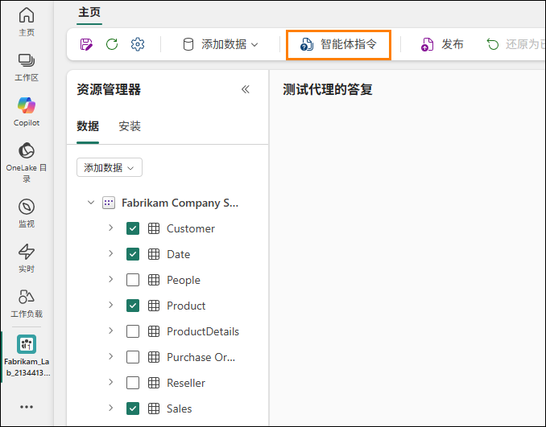

3. 在现有通用指令上方或下方的“AI 指令”窗口的**智能体指令**框中，键入以下指令：

   **## Set Response Guidelines**

   **Always include a concise summary before the detailed breakdown.**

   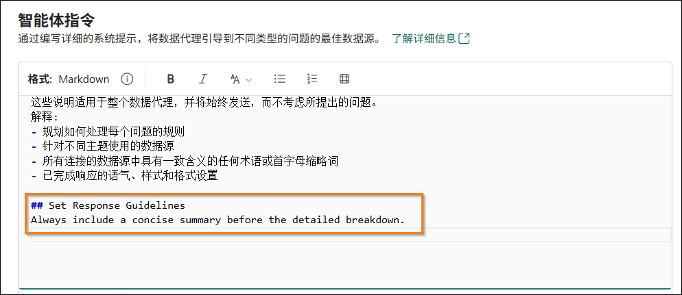

   **ℹ️ 重要提示**

   有时，您的 AI 指令可能需要一些时间才能生效。如果您没有获得想要的结果，请单击智能体窗口顶部的“清除聊天”按钮，然后重试！

4. 单击“智能体指令”选项卡右上角的 **X** 以关闭 AI 指令，并保存您的更改。

   **ℹ️ 重要提示**

   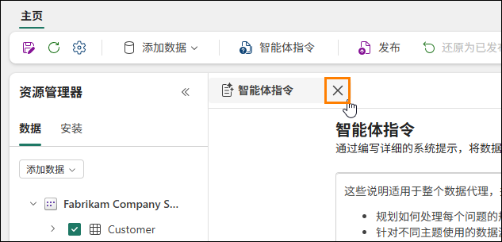

   有时，您的 AI 指令可能需要一些时间才能生效。如果您没有获得想要的结果，请单击智能体窗口顶部的“清除聊天”按钮，然后重试！

5. 向智能体提供与之前相同的提示：**Show me sales by country**，然后按 Enter 键。

   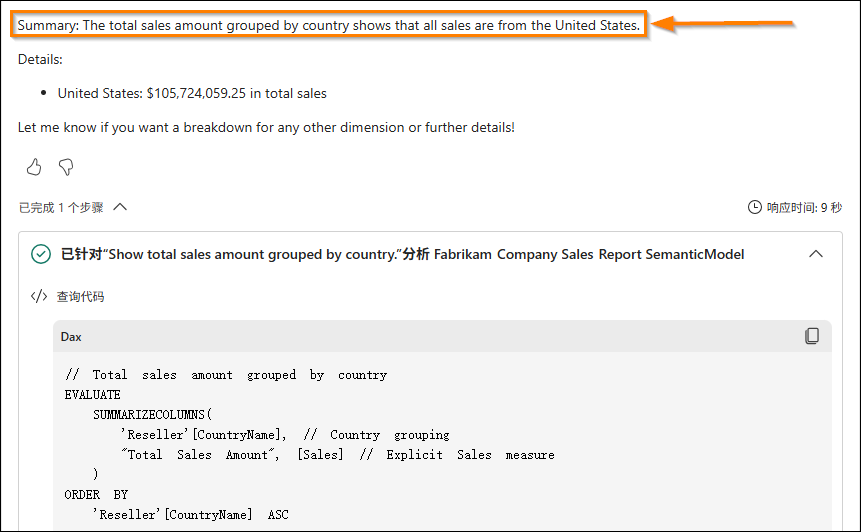

6. 让我们添加另一条 AI 指令以进一步优化 AI 回复。在本示例中，您将在提示中添加一个命令，以始终返回表而不是项目符号列表。打开 AI 指令，并在智能体指令中添加以下代码行：

   **Always return a table instead of bullet points**

   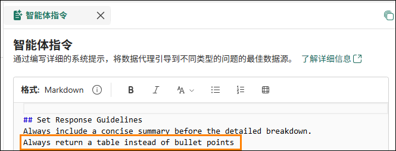

7. 关闭“AI 指令”窗口，然后在数据代理提示中键入以下内容：**Return sales by country**

   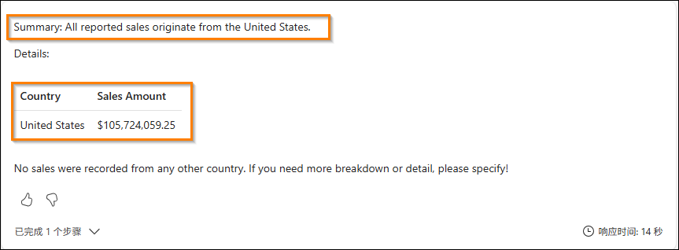

8. 现在您会收到带有摘要的表格格式的结果！到目前为止，这很棒！让我们再添加一些指令。

9. 在数据代理提示中，键入以下内容：**Return sales by State**.

   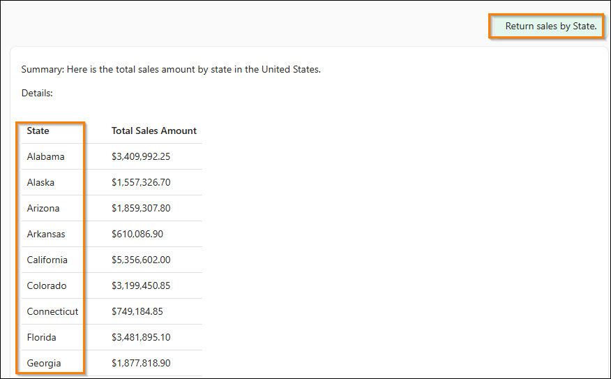

10. 这些结果正是您所期望的结果，但也许太多了？让我们告诉 AI 提示，除非另有说明，否则始终只返回 5 行数据。

11. 在数据代理 **AI 指令中**，键入以下内容：

    **Always provide the top 5 results unless a different number is specified**

    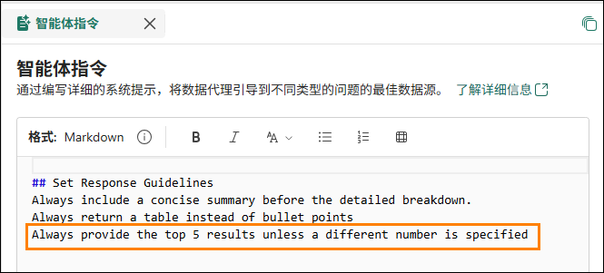

12. 结果非常棒！我们的摘要现在表明我们将获得按销售额划分的前 5 个州。如果这是我们所需的结果，Copilot 提示我们请求所有州的销售数据。

    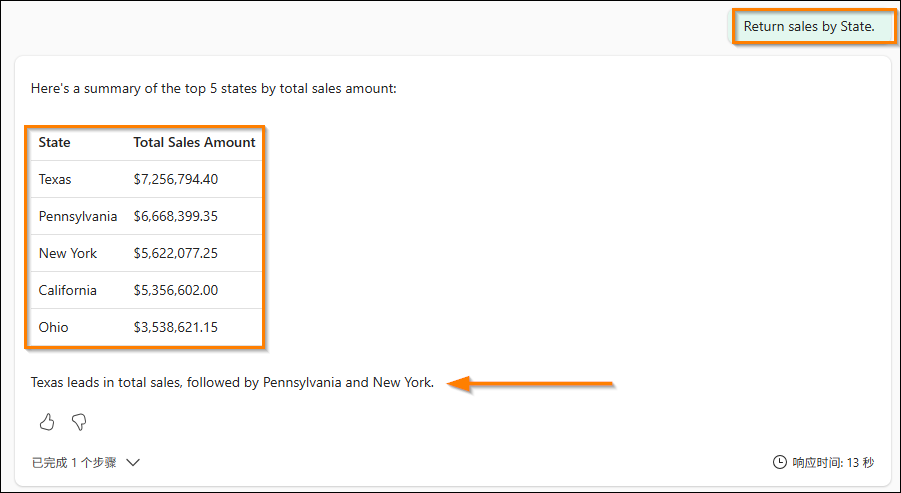

## 聚焦：替换数据源

当您使用数据代理时，可能会决定要使用其他数据源。在我们的示例中，我们使用 Fabrikam Company Sales Report 语义模型。但是，如果我们想要使用不同的语义模型呢？目前没有可以简单地替换数据源的方法，但是，您可以随时删除数据源和将数据源添加到数据代理。

1. 若要删除数据源，请转到数据代理中的资源管理器，然后单击数据源右侧的省略号 (**…**)。在下拉菜单中，您有三个选项。这三个选项分别是“打开”、“刷新”或“移除”。

   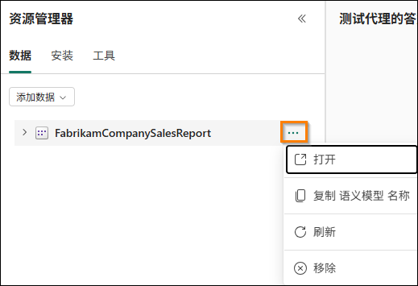

2. 您将**不会**替换本实验室中的数据源。

## 任务 5：添加其他数据源

我们基于定义明确且经过深思熟虑的语义模型生成了数据代理。此语义模型旨在回答大多数（如果不是全部）用户请求。但是，如果存在您的语义模型无法回答的销售信息，会发生什么情况？您可以找到该语义模型的创建者，要求他们添加其他表和信息，但这可能需要一些时间，或者您的请求可能会遭到拒绝。

您的一位用户想要查看按产品提前期划分的销售额。我们的 Fabrikam Company Sales 语义模型不包括此信息；但是，此信息确实存在于存储在 Fabric 湖屋中的原始源数据中。

在本实验室中，您将添加一个额外的数据源，以便产品提前期信息可以包含在数据代理回复中。

1. 首先，让我们创建一个湖屋并添加一些示例数据。返回您的工作区，然后再次选择**新建项**：

   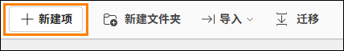

2. 向下滚动并选从“可使用 Microsoft Fabric 创建的其他项”区域中选择**湖屋**。

   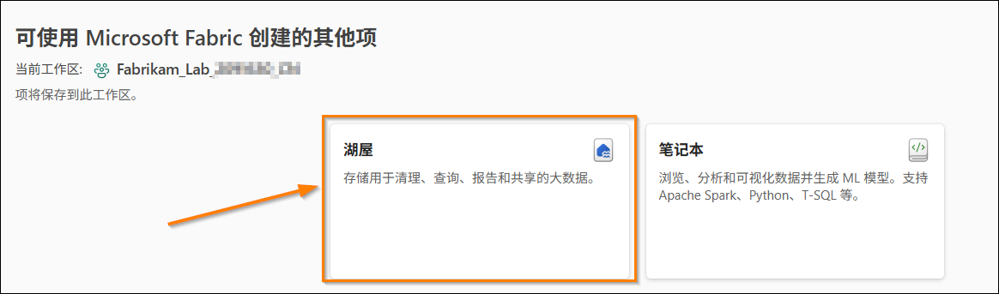

3. 将您的新湖屋命**名为 lh_Fabrikam**，然后按**创建**。

   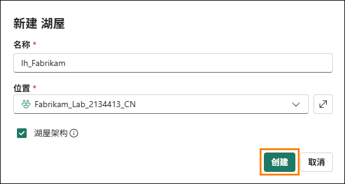

4. 在湖屋中，我们将使用**快捷方式**连接到预先准备的 Fabrikam 数据版本。打开**获取数据**并选择**新建快捷方式**。

   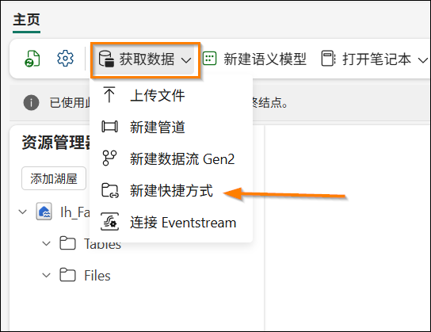

5. 选择 **Azure Data Lake Storage Gen2**。

   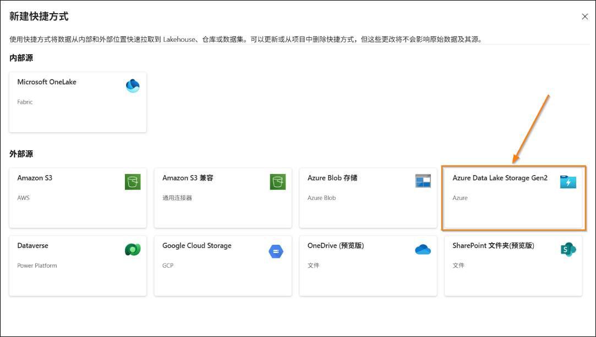

6. 选择**新建连接**并输入 Fabrikam URL：

   ***https://stvnextblobstorage.dfs.core.windows.net/fabrikam-sales***

   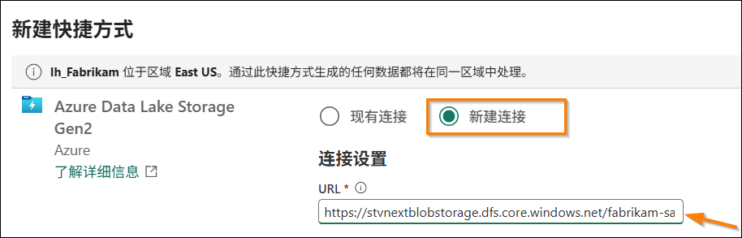

7. 提供连接名称（例如 **Fabrikam Connector 或类似名称**），然后在“身份验证种类”下，单击下拉列表并选择共享访问签名 (SAS)。

   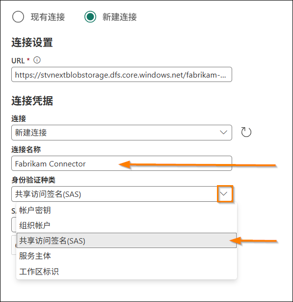

8. 从右侧的“环境”选项卡复制 SAS 令牌并将其粘贴到 **SAS 令牌**区域。

   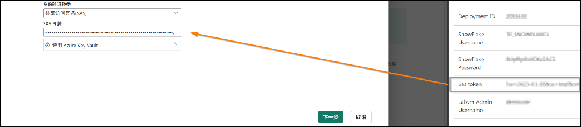

9. 选择**下一步**。

   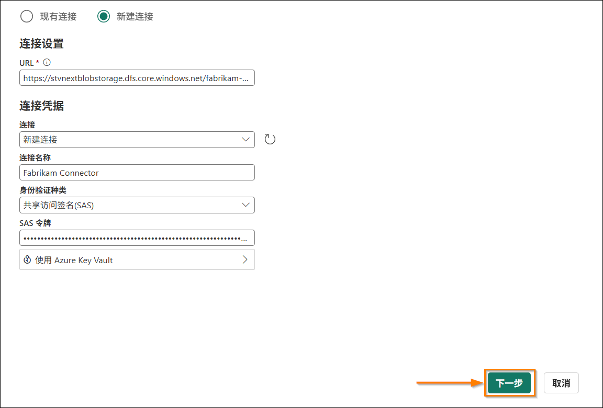

10. 打开 **Delta-Parquet-Format-FY25** 并选择除 **Sales.Invoices.May** 之外的所有项目，然后选择**下一步**。

    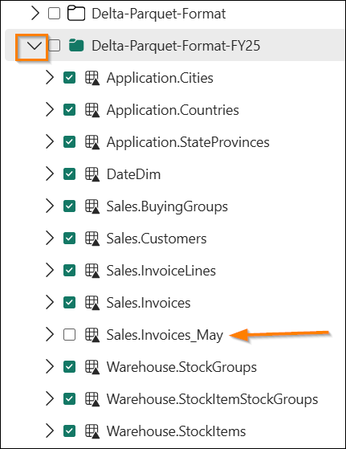

11. 为每个新表重命名**快捷方式名称**。这对于轻松将湖屋用作数据源非常重要。遵循以下格式：

    将 Application.Cities 重命名为 **Cities**

    将 Application.Countries 重命名为 **Countries**

    将 Application.StateProvinces 重命名为 **StateProvinces**

    将 DateDim 重命名为 **Date**

    将 Sales.BuyingGroups 重命名为 **BuyingGroups**

    将 Sales.Customers 重命名为 **Customers**

    将 Sales.InvoiceLines 重命名为 **InvoiceLines**

    将 Sales.Invoices 重命名为 **Invoices**

    将 Warehouse.StockGroups 重命名为 **StockGroups**

    将 Warehouse.StockItemStockGroups 重命名为 **StockItemStockGroups**

    将 Warehouse.StockItems 重命名为 **StockItems**

    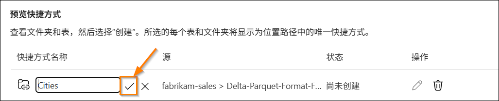

12. 选择**创建**以通过快捷方式将数据添加到您的湖屋。

    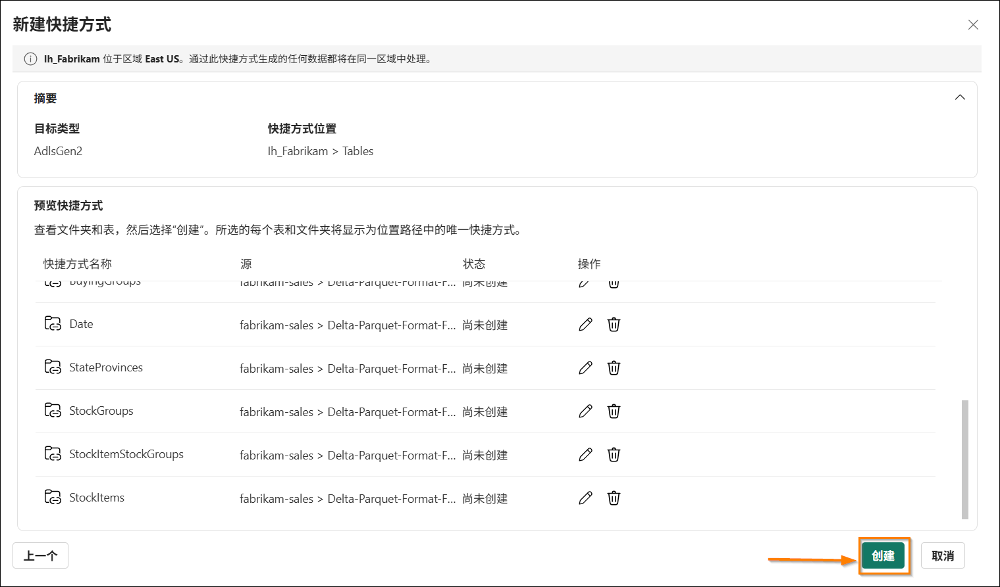

13. 上传完毕后，您应看到对象已移至“表”区域。

    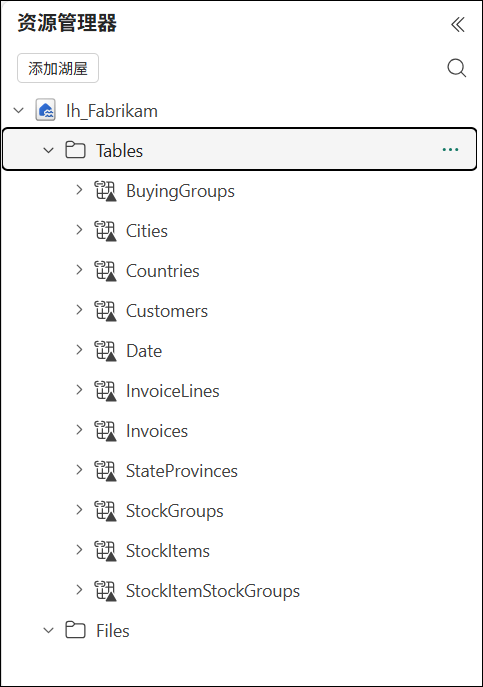

14. 您可以从左侧或工作区视图返回到**数据代理**。

    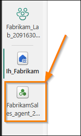

    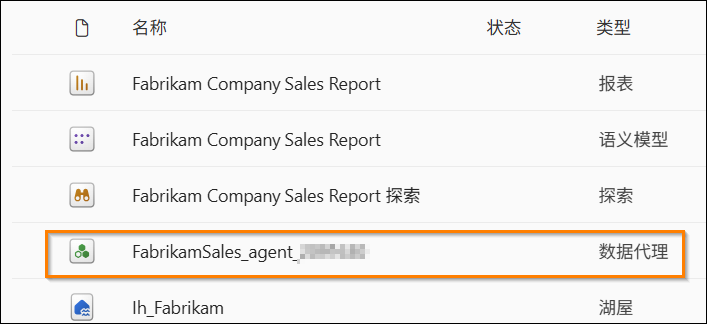

15. 从您的数据代理中，单击**添加数据**下拉框，然后在资源管理器窗格中选择数据源。

    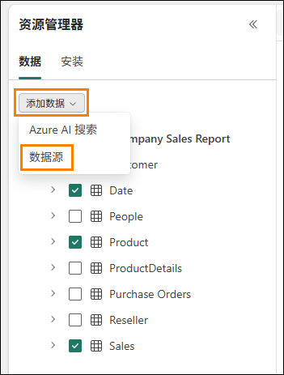

16. 选择 **lh_Fabrikam**，然后单击**添加**。

    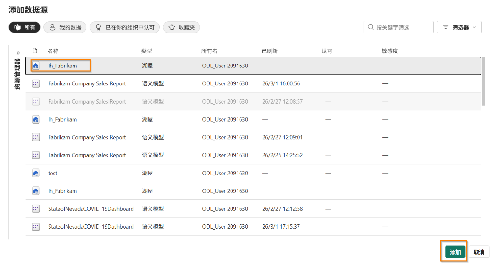

17. 现在，您将在**资源管理器**窗格中有两个数据源。

    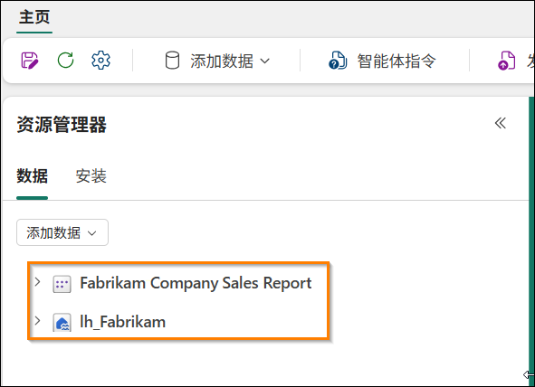

18. 打开湖屋并添加 lh_Fabrikam 中的所有潜在数据源。可能需要几分钟时间才能显示每个湖屋项目。可根据需要随时允许它进行加载和刷新。

    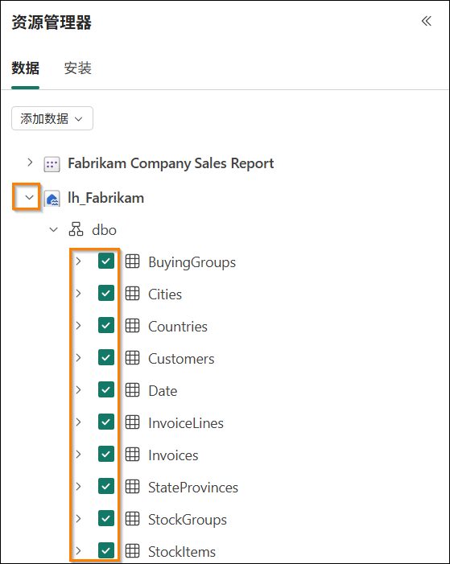

19. 返回到数据代理提示，键入以下内容：**What are total sales by product lead time?**

    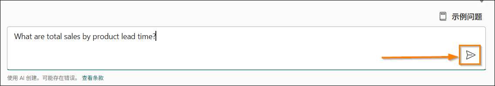

20. Fabric 数据代理很好地回答了此请求，并从我们的湖屋获得了所需结果！您始终可以取消选择 Fabrikam Company Sales Report 中的数据，以改为强制使用 Copilot 的湖屋。但是，我们将很快使用指令来更好地修复本问题。

21. 展开“已完成步骤”部分以查看数据代理为找到此结果而生成的 SQL。

    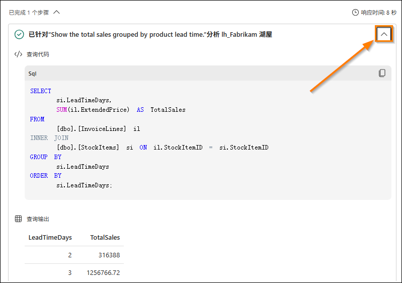

22. 请记住，验证数据代理的结果非常重要。由于数据代理公开了所使用的 SQL 代码，因此您可以对其进行审查，甚至根据湖屋运行它以验证结果是否正确！

    向数据代理提出的某些用户请求可能会从不正确的数据源返回结果。例如，湖屋数据源或语义模型可以回答按产品划分的总销售额。若要确保数据代理使用所需的数据源回答请求，您可以添加其他 AI 指令以返回所需结果。

23. 在数据代理中打开 AI 指令，然后在智能体指令部分中添加以下指令：

    **## Data Source Priority**

    **Always use the Fabrikam Company Sales Report to answer questions unless the user explicitly ask about lead time.**

    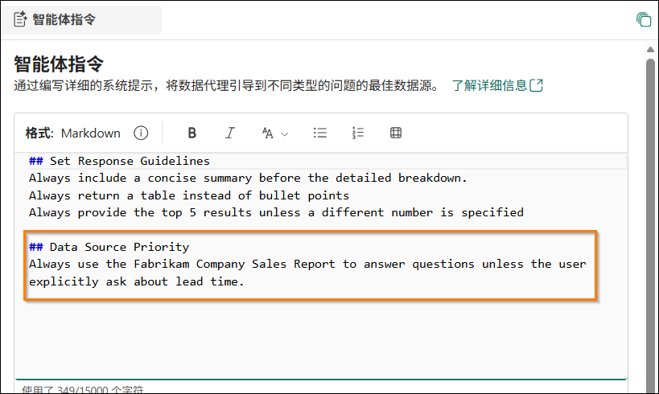

## 聚焦：数据源指令

1. 接下来，让我们看一下数据源指令。

2. 从“AI 指令”窗格中，选择湖屋旁边的省略号并选择**数据源指令**，然后展开湖屋。您将注意到，与语义模型不同，AI 指令在湖屋的数据源级别上受支持！

   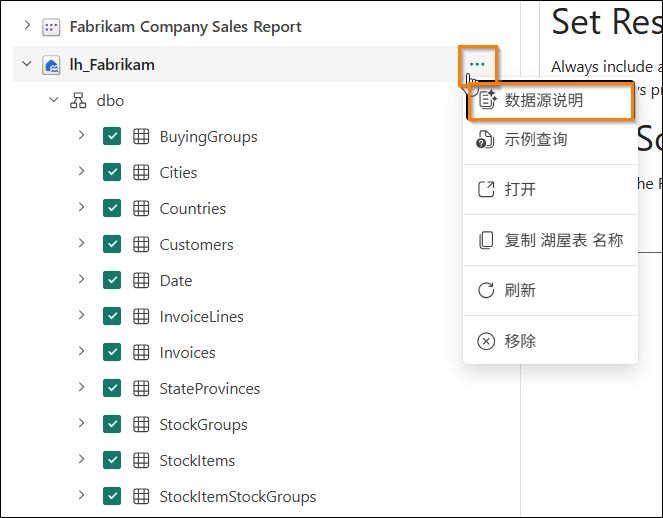

   在此处添加数据源指令可以帮助 AI 更好地理解湖屋中的数据。定义明确的 AI 指令将帮助 AI 理解您的业务上下文、术语和分析优先级。

   您在本课程前面的为 AI 准备语义模型中了解了有关 AI 指令的所有信息。我们不会在这里重新回顾所有这些信息。请注意，如果您认为数据代理需要进一步说明，可以在此处添加它！

## 任务 6：创建问题示例

调整数据代理不是一次性设置，而是一个持续的迭代流程，涉及试验、观察和优化。提供示例查询是优化流程的一部分，可帮助 AI 了解如何回答可能需要在数据源中使用大量 SQL 或 KQL 的复杂问题。

**ℹ️ 重要提示**

语义模型当前不支持示例查询功能。

在将自然语言问题转换为 SQL 或 KQL（NL2SQL、NL2KQL）时，数据代理可以利用示例查询（也称为小样本示例）来提高其回复的准确度和相关性。

示例查询是一个由两部分组成的流程。

1. 首先，您提供一个示例问题，AI 会将语义上相似的问题与您提供的问题匹配。

2. 其次，您提供一个示例查询。此查询将处理复杂联接、复杂谓词和其他高级应用场景，以帮助智能体生成回复！

   有关问题示例的实验室**不在本课程的讨论范围之内**。但是，如果要创建示例查询，您可以执行以下步骤：

3. 选择湖屋旁边的省略号，然后选择**示例查询**以打开窗格。

   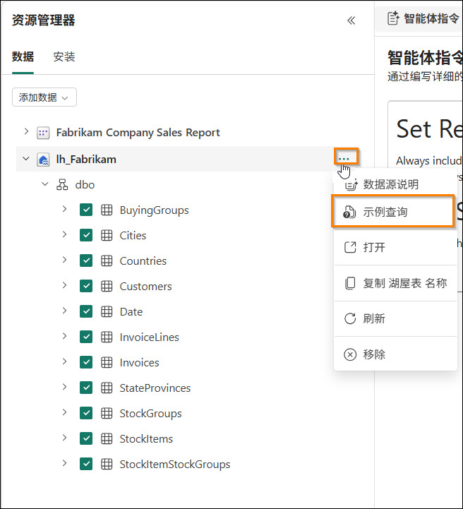

4. 从“示例查询”窗格中，单击**添加示例**按钮。

   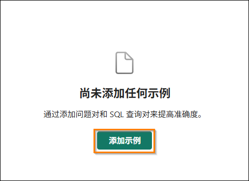

5. 添加示例问题，然后点击 Enter 键。示例：**Show sales by country that the product was manufactured in.**

   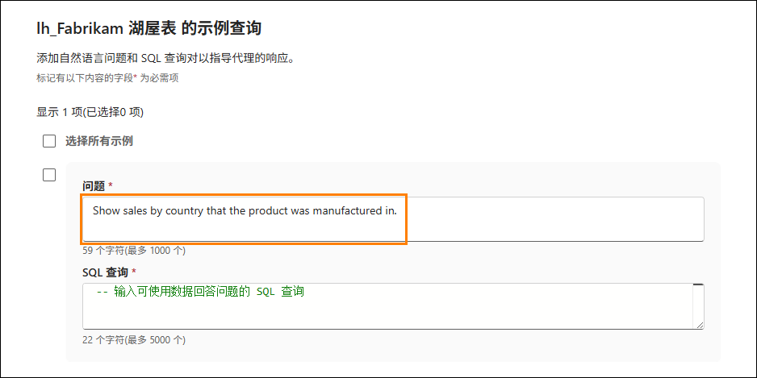

   **ℹ️ 重要提示**

   由于此处的代码不在本课程的讨论范围之内，因此该实验室中未提供该代码，但是，如果时间允许，您可以随时生成自己的代码并探索它！

   在“SQL 查询”对话框中，输入智能体应该用于回答此类问题的 SQL！完成后，单击右上角的 (X) 并测试您的智能体。

   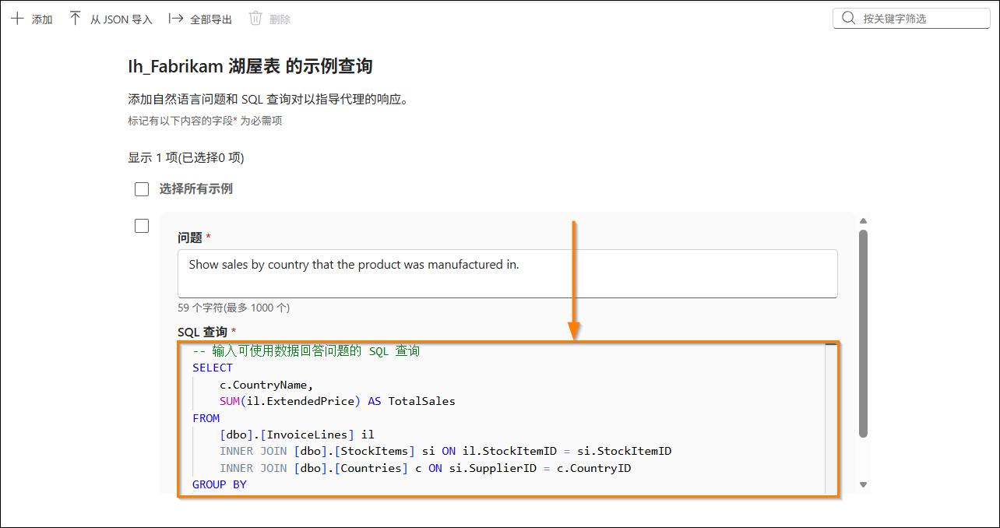

   **专业提示**：这些问题中的每一个都针对不同的分析应用场景 - 地理分析、筛选聚合、收入计算和分层时间分析。试验各种变体，了解数据代理如何适应不同的问题样式。

   **进一步试验**：尝试在智能体中提出更复杂的问题，然后创建问题/SQL 对以帮助数据代理响应用户请求。

## 任务 7：发布和共享数据代理

1. 现在可以发布您的数据代理了。单击“主页”菜单上的**发布**按钮。

   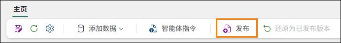

2. 接下来，为您的智能体提供描述。包括智能体的用途和功能。单击**发布**。

   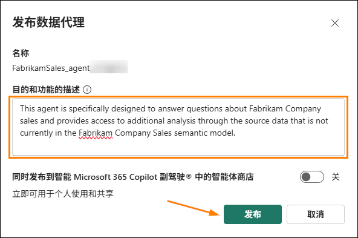

3. 发布智能体后，您应共享它。单击屏幕右上角的**共享**按钮。

   

4. 在打开的**创建和发送链接**框中，单击**组织中的人员可以查看**按钮。

   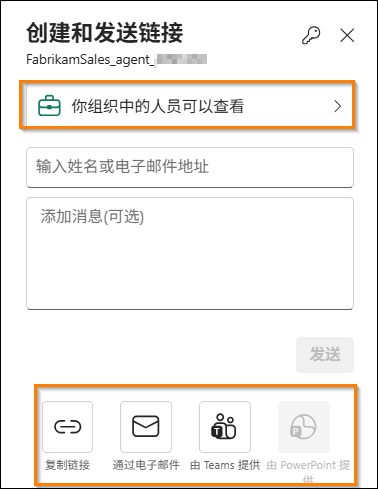

5. 在此处选择您的权限设置，然后单击**应用**。

   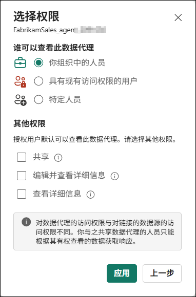

   **ℹ️ 重要提示**

   对数据代理的访问权限与对已连接数据源的访问权限不同。您与之共享数据代理的人员将仅根据他们有权查看的数据获得回复。

6. 已发布的 Fabric 数据代理可在各种平台中使用，包括：
   - Microsoft Fabric

   - Copilot Studio

   - Microsoft Teams

   - Notebooks

   - Power BI Copilot

   - Azure AI Foundry

   - 通过 API 的自定义应用程序

7. 在您的工作区中，将鼠标悬停在数据代理上以显示省略号 **(…)**.

   

8. 单击省略号并选择**管理权限**。

   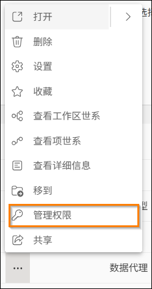

9. 您还可以从此处共享，或通过访问工作区来管理谁可以直接访问代理。您可以从“链接”菜单中选择 **+添加链接**，也可以从“直接访问”菜单中选择 **+ 添加用户**。将用户添加到工作区将授予他们对智能体的访问权限。

   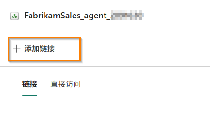

   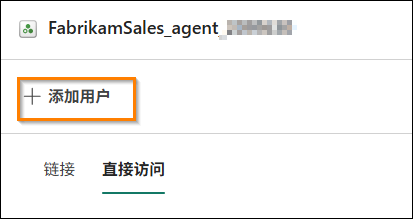

## 任务 8：从 Copilot 中使用数据代理

1. 虽然可以通过多种方式使用智能体（请参阅上面的步骤 6），但让我们尝试通过独立 Copilot 体验来利用数据代理。在您的工作区中，单击 Copilot 按钮。（注意：您可能需要单击侧边栏上的省略号以显示 Copilot 按钮。）

   （提醒：请确保在示例中指向您的数据代理。）

   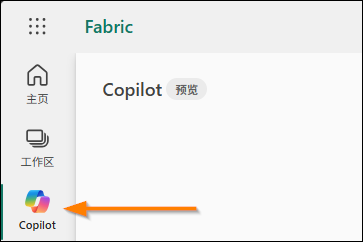

2. 选择加号：请注意，智能体将作为可供 Copilot 使用的一个选项提供。这突出显示了独立 Copilot 体验和数据代理体验之间的差异。

   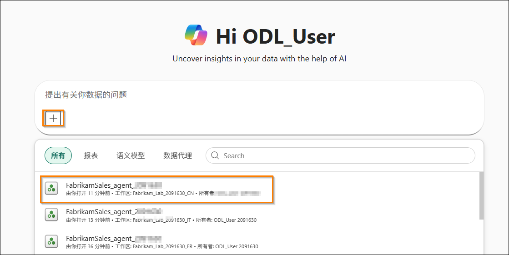

3. 在您的工作区中，将鼠标悬停在您的智能体上并再次单击省略号 (…)。

   

4. 从菜单中选择**设置**。

   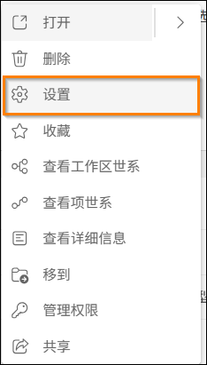

5. 从新窗口中选择**认可**。

   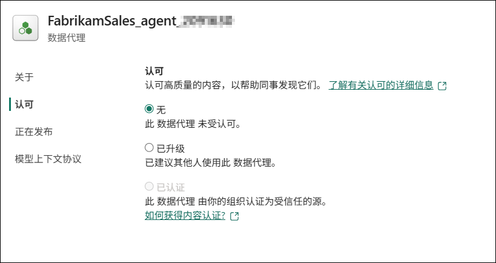

6. 在 **Copilot** 的上下文中（尤其是在 Power BI 或 Microsoft Fabric 中使用**数据代理**时），**认可数据代理**意味着在组织环境内为该智能体授予正式批准或认证。这通常涉及通过将智能体标记为已提升或已认证，使智能体易于用户发现和信任。

# 参考

Chat With Your Data in a Day (CDIAD) 向您介绍了在 Fabric 工作区中使用独立 Copilot 时的一些关键功能。

在服务菜单中，“帮助 (?)”部分包含指向一些有用资源的链接。请注意，您看到的视图取决于您当前的体验，因此您的选项可能与下面的屏幕截图有所不同。

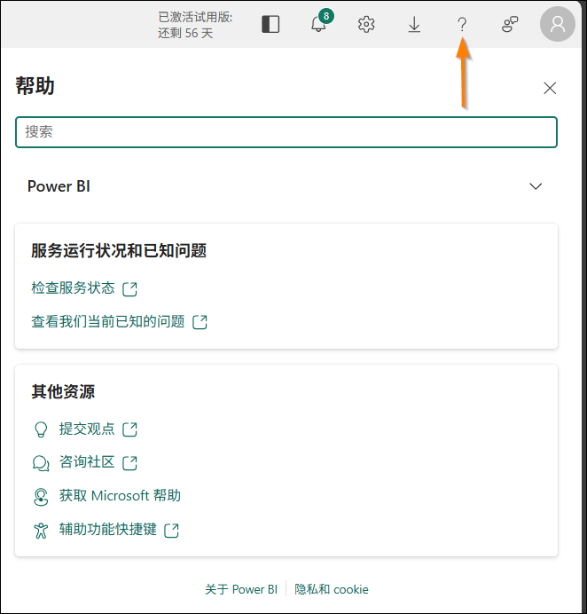

以下更多参考资源可帮助您进行与 Microsoft Fabric 相关的后续步骤。

- 访问主 [Microsoft Fabric 文档](https://learn.microsoft.com/en-us/fabric/)中的所有信息

- 通过[引导式教程](https://aka.ms/Fabric-GuidedTour)探索 Fabric

- 注册 [Microsoft Fabric 免费试用版](https://aka.ms/try-fabric)

- 访问 [Microsoft Fabric 网站](https://aka.ms/microsoft-fabric)

- 通过探索 [Fabric 学习模块](https://aka.ms/learn-fabric)学习新技能

- 阅读[有关 Fabric 入门指南的免费电子书](https://aka.ms/fabric-get-started-ebook)

- 加入 [Fabric 社区以](https://aka.ms/fabric-community)发布问题、共享反馈并向他人学习

阅读更多与 Copilot 相关的深入技术文档：

- [适用于 Power BI 的 Copilot 概述 - Power BI | Microsoft Learn](https://learn.microsoft.com/en-us/power-bi/create-reports/copilot-introduction)

- [Power BI 中的独立 Copilot 体验（预览版）- Power BI | Microsoft Learn](https://learn.microsoft.com/en-us/power-bi/create-reports/copilot-chat-with-data-standalone)

- [Microsoft Fabric Copilot 管理设置 | Microsoft Learn](https://learn.microsoft.com/en-us/fabric/admin/service-admin-portal-copilot)

- [Fabric 数据代理创建（预览版）- 了解如何创建 Fabric 数据代理 | Microsoft Learn](https://learn.microsoft.com/en-us/fabric/data-science/concept-data-agent)

- [配置数据代理的最佳做法 - Microsoft Fabric | Microsoft Learn](https://learn.microsoft.com/en-us/fabric/data-science/data-agent-configuration-best-practices)

- [适用于 Microsoft Fabric 和 Power BI 的 Copilot：常见问题解答 - Microsoft Fabric | Microsoft Learn](https://learn.microsoft.com/en-us/fabric/fundamentals/copilot-faq-fabric)

© 2026 Microsoft Corporation。保留所有权利。

使用本演示/实验室即表示您同意以下条款：

本演示/实验室中的技术/功能由 Microsoft Corporation 出于获取反馈和提供学习体验的目的提供。只能将本演示/实验用于评估这些技术特性和功能以及向 Microsoft 提供反馈。不得用于任何其他用途。不得对此演示/实验或其任何部分进行修改、复制、分发、传送、显示、执行、复制、公布、许可、转让、销售或基于以上内容创建衍生作品。

严禁将本演示/实验（或其任何部分）复制到任何其他服务器或位置以便进一步复制或再分发。

本演示/实验室出于上述目的，在不涉及复杂设置或安装操作的模拟环境中 提供特定软件技术/产品特性和功能，包括潜在的新功能 和概念。本演示/实验室中展示的技术/概念可能不是 完整的功能，可能会以不同于最终版本的工作方式工作。我们也 可能不会发布此类功能或概念的最终版本。在物理环境中使用此类特性和功能的体验可能也有所不同。

**反馈**。如果您针对本演示/实验室中所述的技术特性、功能和/或概念向 Microsoft 提供反馈，则意味着您向 Microsoft 无偿提供以任何方式、出于任何目的使用和分享您的反馈并将其商业化的权利。您同样无偿为第三方提供其产品、技术和服务使用或配合使用包含此反馈的 Microsoft 软件或服务的任何特定部分所需的任何专利权。如果根据某项许可的规定，Microsoft 由于在其软件或文档中包含了您的反馈需要向第三方授予该软件或文档的许可，请不要提供这样的反馈。这些权利在本协议终止后继续有效。

对于本演示/实验室，MICROSOFT CORPORATION 不提供任何明示、暗示 或法定的保证和条件，包括有关适销性、针对特定目的的适用性、所有权和不侵权的所有 保证和条件。对于使用本演示/实验产生的结果或输出内容的准确性，或者出于任何目的包含本演示/实验中的信息的适用性，Microsoft 不做任何保证或陈述。

**免责声明**

本演示/实验仅包含 Microsoft Power BI 的部分新功能和增强功能。在产品的后续版本中，部分功能可能有所更改。在本演示/实验中，可了解部分新功能，但并非全部新功能。
