# Microsoft Fabric Chat with your Data in a Day - Lab 1

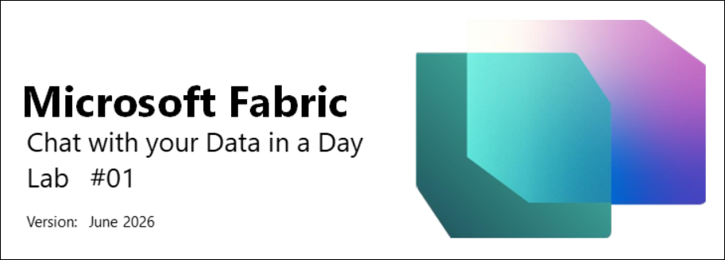

## Contents

- Document Structure
- Scenario / Problem Statement
- Introduction
  - Task 1: Working in the Virtual Environment
  - Task 2: Assess the AI Readiness of Your Data
  - Task 3: Writing a prompt in Power BI Copilot

# Document Structure

The lab includes steps for the user to follow along with associated screenshots that provide visual aid. In each screenshot, sections are highlighted with orange boxes to indicate the area(s) user should focus on.

# Scenario / Problem Statement

Your organization just returned from a Microsoft conference where they heard and saw how the Chat with your Data experience, powered by Copilot can dramatically accelerate time to insights. The demos showcased how natural language queries can unlock powerful analytics, provided the underlying semantic models are well-structured and optimized for AI.

**Current Objective**

You’ve been asked to evaluate an existing semantic model within Power BI Desktop. Your goal is to test how well it performs in the Copilot experience and identify areas for improvement.

Explore the semantic model using PBI Desktop built in Copilot’s interface

Identify friction points where Copilot struggles to interpret intent

Recommend and implement enhancements to improve Copilot’s understanding

Document your findings and prepare the model for broader organizational use

# Introduction

In the instructor demo, you saw how well the Chat with your data experience can perform, in this lab, you will see how necessary it is to prep data models for AI. This lab will show various user requests and how Copilot responds to those requests. You will also see how to validate those responses for accuracy and correctness. In future labs, you will learn how to apply best practices and use prep for your data tooling to enhance and improve the Copilot experience!

## Task 1: Working in the Virtual Environment

1. The virtual environment experience is phenomenal for providing you with an available space to work with the Chat with Your Data Experience! Let’s look at a few key areas and points.

2. Let’s look at a few key areas:

    - The virtual desktop acts as a fully functional computer for you to use in browser!

    - The VM Side-Tab is where you can access the Lab documents, Credentials, and more.

    - The Timer shows how much remaining time you have to use the Virtual Machine.

    **ℹ️ Important**

1. Throughout the class labs these **Important** boxes will detail valuable information. Try no to skip them! For example, IF you do not see your VM Side-Tab make sure to expand it fully, as shown in the image below.

    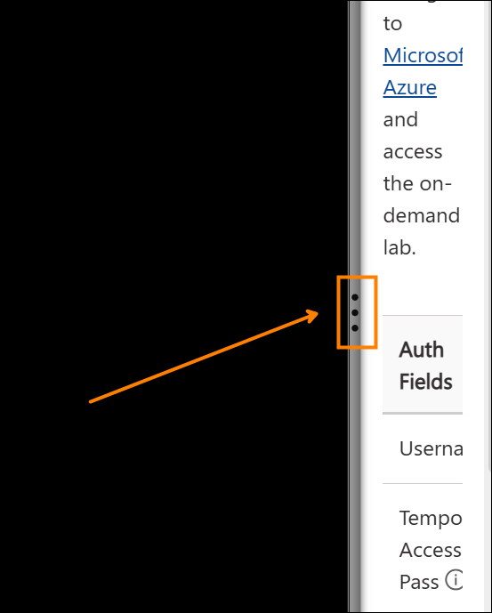

3. You can easily navigate the labs by using the page number at the bottom of the Side-Tab.

    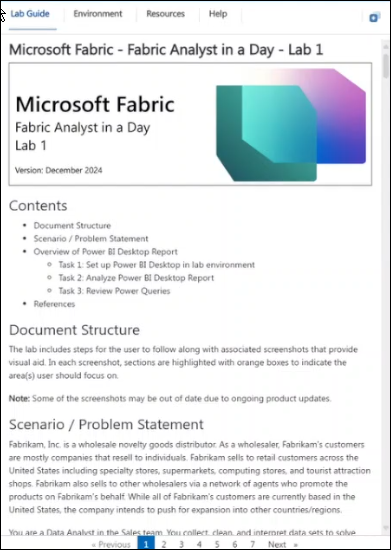

4. In class, you can work fully inside the Virtual Machine. However, some attendees prefer to work with an Incognito Browser and logging in to the Power Bi Desktop under the Virtual Machine credentials they are granted. That is perfectly acceptable!

## Task 2: Assess the AI Readiness of Your Data

1. Now that you have seen the major areas of the Virtual Machine, proceed to the **Power BI Portal** button to launch the Power BI Service.

    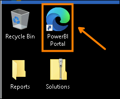

2. Using the credentials listed on the credentials page and in your document, provide the email in the Email Access area.

    - **Username/Email:** <inject key="AzureAdUserEmail"></inject> 

        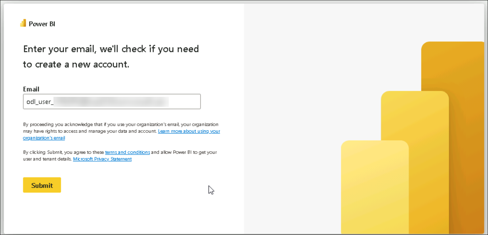

3. Then use the Microsoft **Sign in** box with the same credentials and click **Next**.

    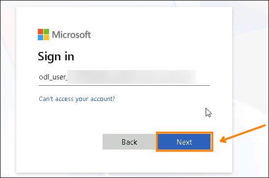

4. Enter the provided **Temporary Access Pass** from the credentials page or your lab document and press **Sign in**. Optionally, select **Yes** on the **Stay signed in** prompt to remain signed in.

    - **Password:** <inject key="AzureAdUserPassword"></inject> 

        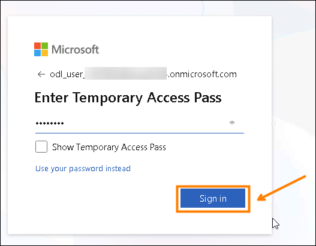

5. We will first navigate to the **Workspaces** area on the left-hand side menu.

    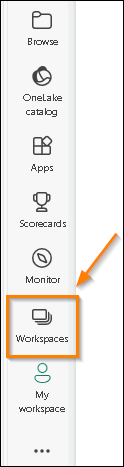

6. We will now create a **New Workspace** by selecting the New Workspace button.

    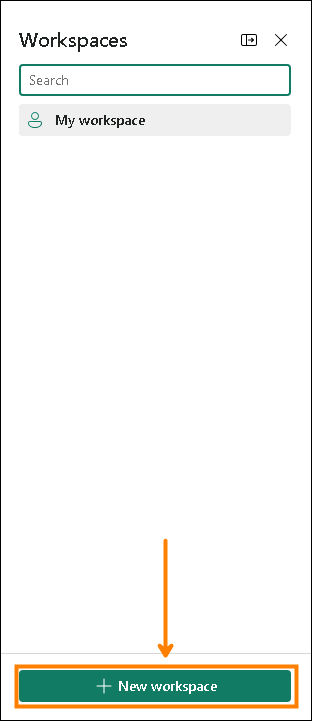

2. Next, name your workspace: **Fabrikam_Lab_<inject key="DeploymentID" enableCopy="false"></inject>**

    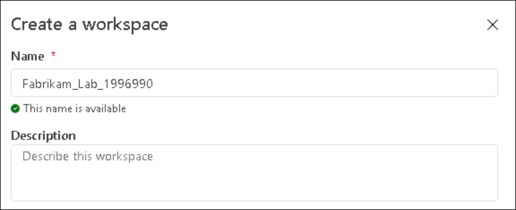

3. Your 7-digit code is part of the username you were assigned for the class. Please use this! See screenshot below.

    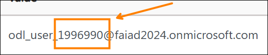

4. For example, John A. Smith would be: **Fabrikam_Lab_<inject key="DeploymentID" enableCopy="false"></inject>**

    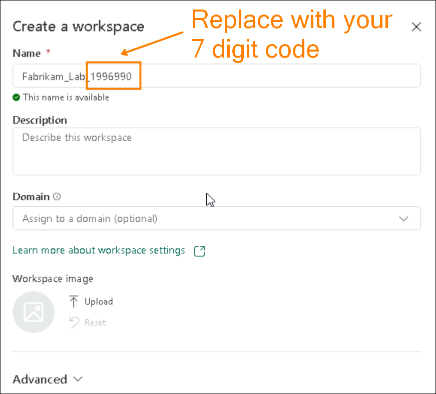

5. Next, you need to assign a Fabric capacity to your workspace.

6. Click **Advanced** to expand the advanced options when setting up a workspace.

    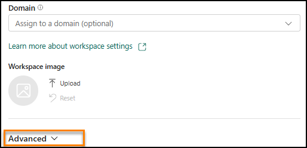

7. Make sure that **Fabric Capacity** is selected. Scroll down a little further and select, **at random**, a capacity from the drop-down menu!

    **ℹ️ Important**

8. The fabric environment used for this class will be updated often so you MAY NOT have the same capacities listed in the screenshot below. Just choose any available capacity!

    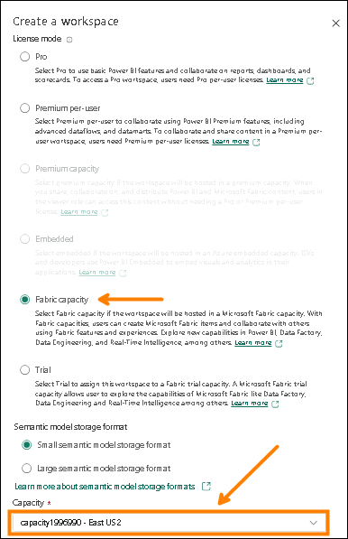

9. Click **Apply**.

    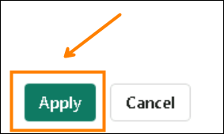

    Great! We will be using the Fabric Capacity Workspace to explore all the best that Chat with Your Data has to offer!

1. Open the file named **CWYDIAD – Lab 01 – Start (2)** from your **Reports (1)** File on the VM desktop to begin exploring the chat with your data experience.

    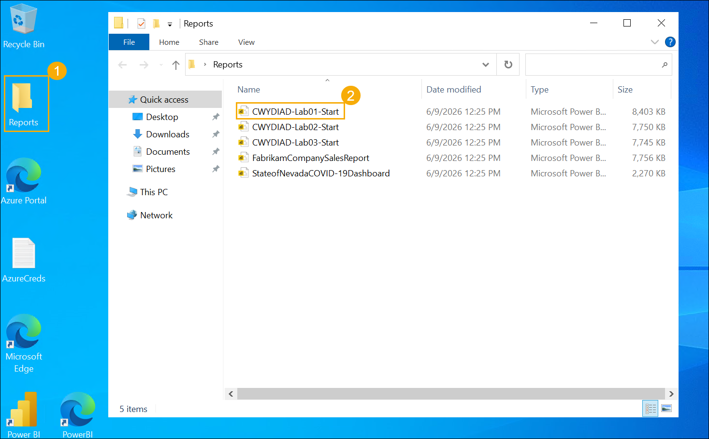

    

8. Enter your email address **<inject key="AzureAdUserEmail"></inject>** into the Power BI Desktop file and press continue to log in using your credentials:

    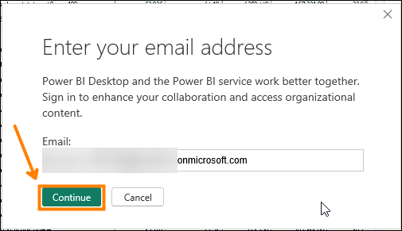

9. Additionally, log in via the Microsoft login window using the same **Username: <inject key="AzureAdUserEmail"></inject>** and **Temporary Access Pass: <inject key="AzureAdUserPassword"></inject>**. Click on **Yes** on the Signed in to all apps and websites on this device, then click on **Done** 

    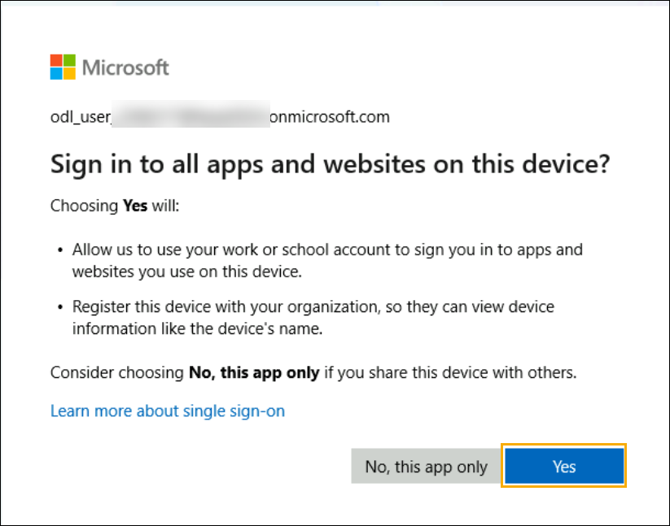

    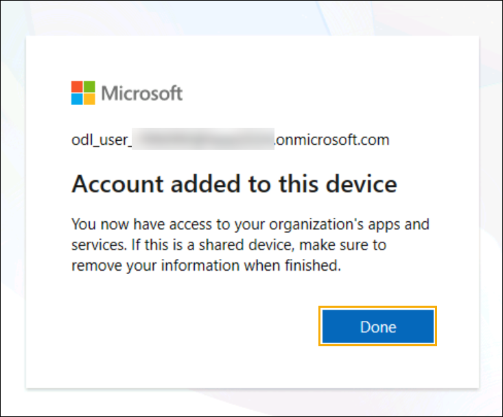

10. With the starting PBIX file open, proceed to the Copilot button and select it to open the Copilot experience.

    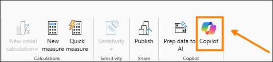

11. If you are already logged in, a new window opens for **Connect to a workspace that supports Copilot.** Click the **Select a Workspace** option and select the workspace you just created.

    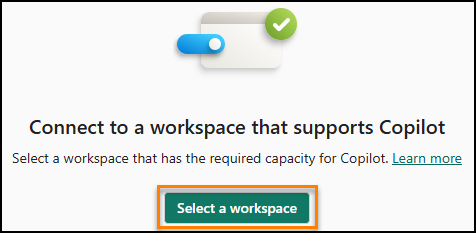

    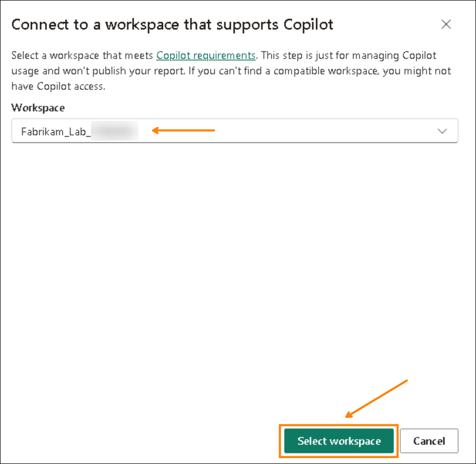

12. If you receive a prompt on the next screen, Click on **Get started**.

    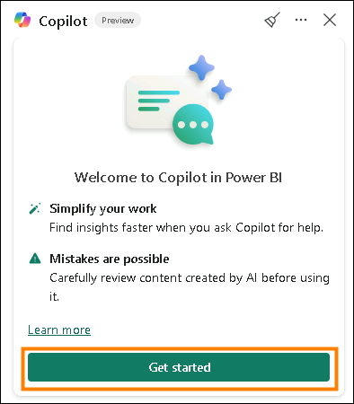

13. Welcome to the Copilot experience in Power BI! On this startup screen you will receive some prompt ideas across the top **(1)** and then a section at the bottom where you can write out your request **(2)**.

    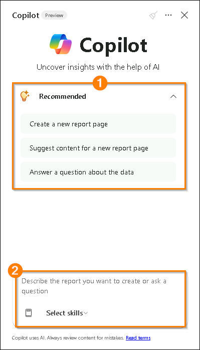

## Task 3: Writing a prompt in Power BI Copilot

In this section, you will write various prompts and explore the results returned by the Power BI Copilot experience.

1. Click in the prompt and write out the following: **Show total purchases by employee**. Then click **Enter**.

    

    **Potential Options:**

    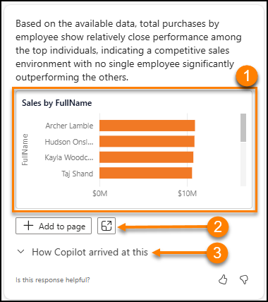

    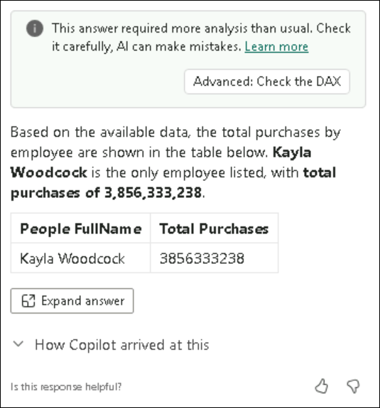

    **ℹ️ Important**

    AI returns non-deterministic results due to many factors. As discussed previously in this class, your results may vary and may not be identical to the labs. Note above that this unprepped for AI data will have varied results on the exact same question. Please proceed and explore the capabilities and features being displayed to the best of your ability!

    You may even get asked follow-up questions like the one listed below:
    
    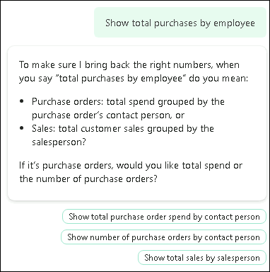

    If needed, Choose the most like **Show total purchases by employee** or **continue prompting.**

2. A lot of information is now returned. Let’s explore this section in depth.

    1. **(1)** A visualization comparing the Total Purchases and Employees.

    2. **(2)** Areas to **Add to page** or to **pop-out and** **expand** the visual.

    3. **(3)** *HCAAT:* How Copilot arrived at this.

        

3. Click on the *HCAAT*: **How Copilot arrived at this** button to see the logic behind the Copilot answer.

    **Potential Options:**

    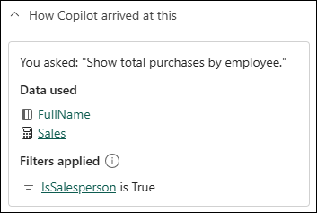

    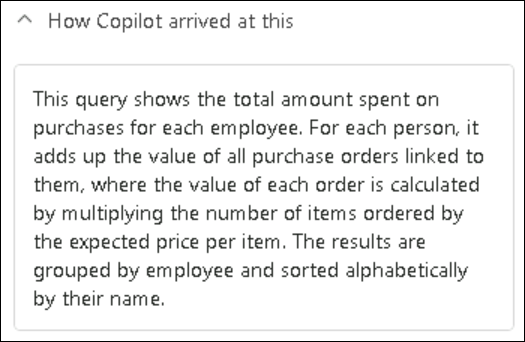

4. Hover over the ***FullName***,***Sales***, and even ***IsSalesperson*** to see both the **Field** and **Home Table** for what Copilot has used in the answering of the question.

    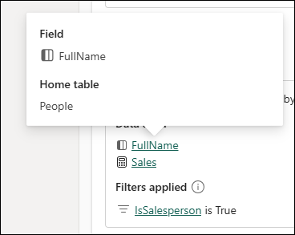

    Unfortunately, this is an incorrect result. We asked for Total Purchases and received **Total Sales** instead! The other DAX Query only looked at a single employee. Looks like this data need preparation! Think about it this way, data that has not been prepped for Copilot is like a brand new, first day on the job, data analyst and data that has been prepped for Copilot is like asking a question to a seasoned analyzed with many years experience in YOUR specific organiztion.

    There are two main things to think about here when prepping data for Copilot.

    First, we can write a better prompt that provides more specificity, this will definitely help. However, many users won’t know how to write effective prompts and they also may not know the data well enough to be specific.

    Secondly, as data analysts, we can prepare the data for Copilot and anticipate these types of requests making the Copilot responses more accurate. The object of this class is to teach you all the best practices and tooling available to improve the Chat with your Data experience.

    **ℹ️ Important**

    Copilot's responses are shaped by how you ask your questions. Clear, specific prompts lead to more accurate insights and faster solutions. When working with your data, try to include context, desired outcomes, and any relevant filters or columns. The better your prompt, the better your response!

5. Let’s try this again, but with a more specific prompt, in the Copilot Prompt type: **Show total purchases from the PO table by employee.**

    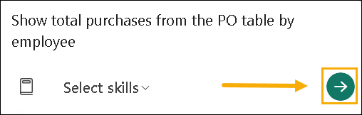

6. You will notice that the visual created only has one Employee named “Kayla Woodcock”. This is correct! Kayla is the only employee who makes purchases. So by being more specific we can achieve better responses. In addition, if we had prepped our semantic model with a measure named Total Purchases from the beginning we could have avoided this scenario!

    **Potential Options:**

    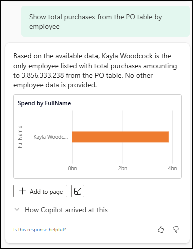

    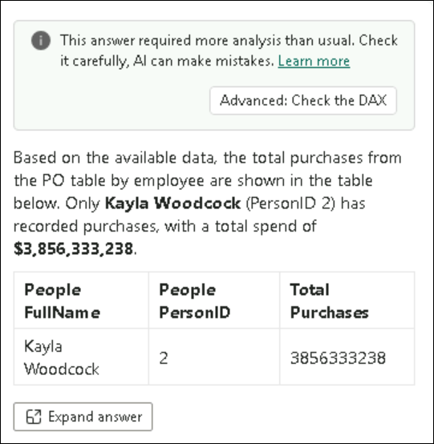

7. It’s very important to always validate the results and how Copilot arrived at the answer. Click on the **HCAAT**, How Copilot arrived at this.

    

    **If** Copilot provides a DAX query try pressing **Check the DAX**.

    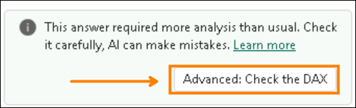

8. We can see Copilot is using the FullName column from our People table and it is also using the Spend measure. Even our DAX query is doing the same. The spend measure could probably be named better to improve the Copilot experience.

    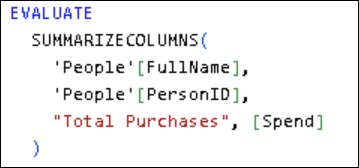

9. What does Spend mean here in this context? Is it the same thing as Purchases? It’s possible we are still getting the incorrect response from Copilot. Let’s go ahead and ask Copilot to explain to us how Spend is calculated!

10. In your Copilot prompt type: **How is the measure Spend calculated**

    **Potential Options:**

    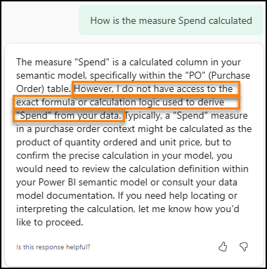

    

11. Copilot does a great job of giving a general explanation of what the calculation is probably doing. But you may see terms in this definition like “Typically” or “Usually” because this is a generalization. You may also notice that Copilot explicitly tells you that it does not have access to the exact formula or calculation logic and therefore cannot give you a specific answer.

    In the other image, Copilot has been able to successfully grab the actual Measure, explain it, and provide the answer associated with spend within the current filter context!

    **ℹ️ Important**

    In a future lab, you will learn how to give Copilot additional business context necessary to answer these questions and give the user more confidence in the Copilot response!

12. Now let us expand further and create a visual to demonstrate how Copilot will adjust to changes in the data model and the report.

13. In your Copilot prompt type: **Create a new report page with a bar chart visual for sales and product tag.**

    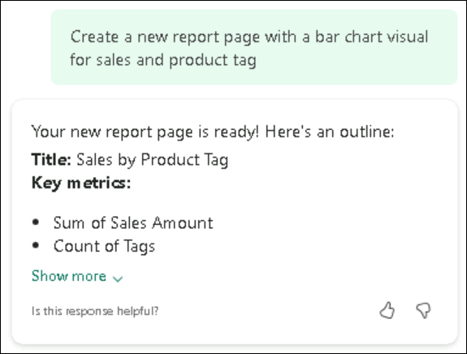

    You may need to continue prompting Copilot as shown here:
    
    

    Do your best to match the **Total Sales** and **Product Tag** elements.

    Notice Copilot has crafted the visual on a brand new report page! **Potential Options:**

    

    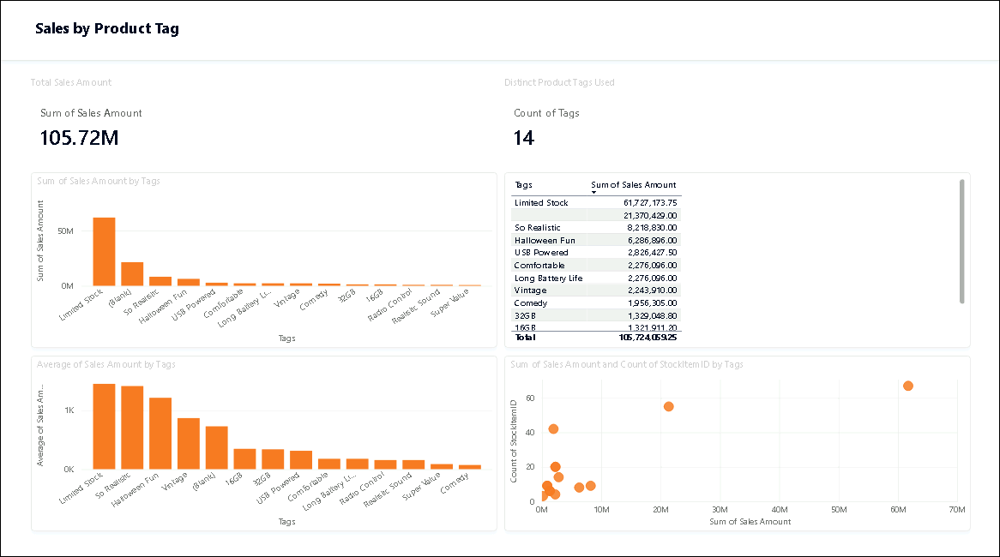

14. Select the bar chart visual that Copilot created and go into the **Model View**. Notice that it included a filter to circumvent our data model! This is amazing because the Product Tag and Total Sales would not typically work in our current data model.

    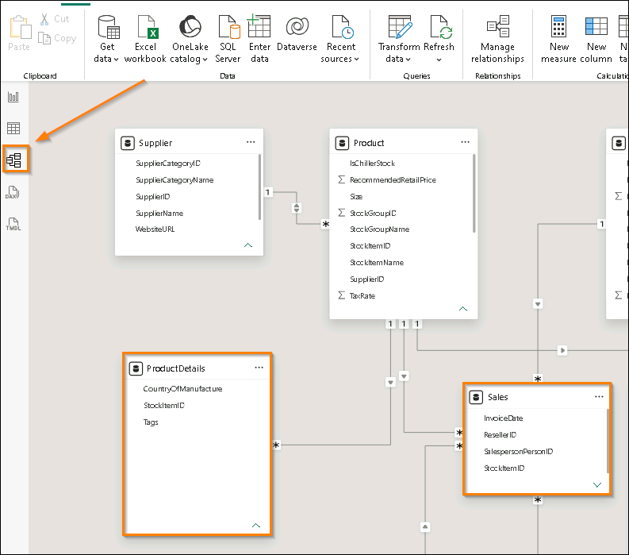

15. This could be double counting some values so let’s remove it. Go back to the **Report View** make sure you are still clicked on your graph.

    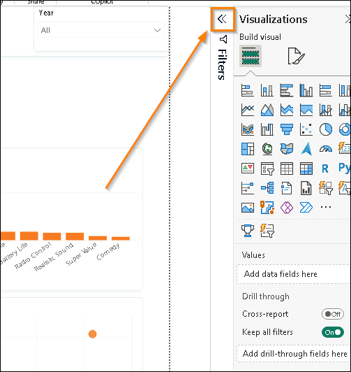

16. On the right go to the **Filters tab** under the “Filter on this visual”remove “Product Details that have Products” from the bar chart’s axis.

    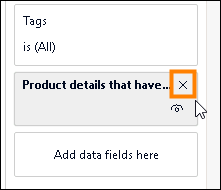

17. Notice that the values are all the same at **\$105,724,059** this can be shown by hovering over the data bars in the visual that Copilot created. This is a tell-tale sign of incorrect relationships in the semantic model.

    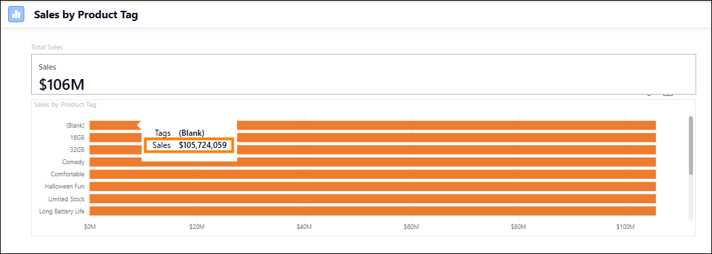

18. The response returned by Copilot above was incorrect because of the semantic model design. Copilot was able to craft a filter to adjust to match our request! This shows the nature of why it is important to have a data model that is prepped for AI. In a future lab, we will take a look at the tables and relationships and how that can be improved to improve the Copilot experience!

19. The visual makes it very clear there is an issue with the Copilot response. Another way to see this data would be to ask a question of Copilot and view the response. In your Copilot prompt type: **Show total sales by product tag**.

    

20. Copilot explicitly let’s you know, in the response, that there is **no variation** in sales. Whenever you see this wording in Copilot, it’s an indication that something might not be correct.

    

21. Let’s ask another question from Copilot: **Show total sales by State**.

    

    There are multiple responses you might get, *your results might vary!* One possible response are these:

    **Potential Options:**

    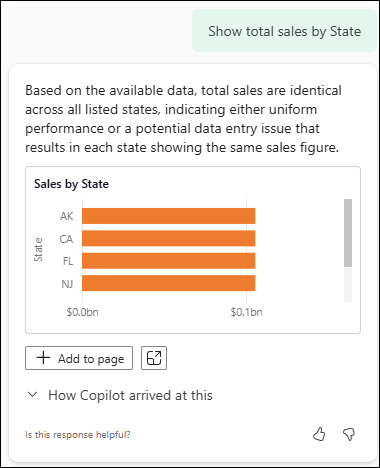

    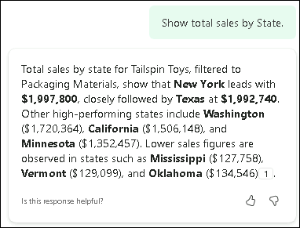

22. This response is not exactly correct. Again, a data model error is present? Could it be the data model OR the vagueness of our language. Select *HCAAT*: How Copilot arroved at this and hover over the ***State*** and ***Sales*** Data used. ***Sales*** is accurately being collected via our explicit measure in the Sales table, but our ***State*** field is from the Customer table!

    

23. Head over to the **Model View** and review the data model relationships linking Customer to Sales. This perfectly explains our incorrect visualization! Now we can see that our language and the data model must align together.

    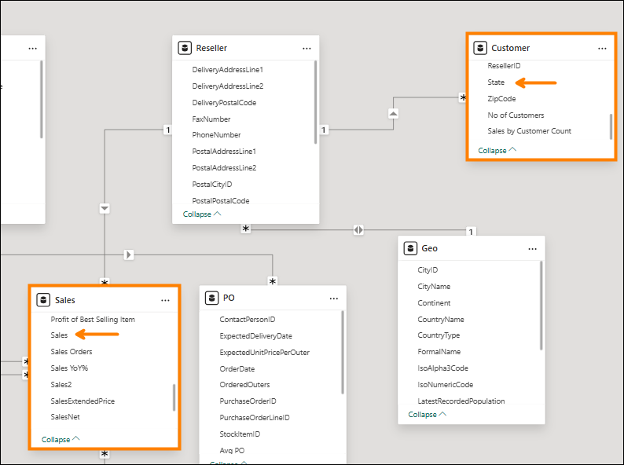

    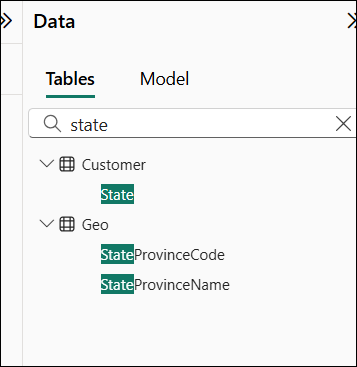

    In this scenario, we have multiple tables that have a variation of State, we also have multiple sales measures. This can result in inconsistent responses and even misleading results. In later labs, you will learn the different techniques to help Copilot answer these types of user requests!

24. Now go to **Report view** and try another prompt: **Sales by State**.

    

25. In the screenshots below, you can see that the state of Texas has the most sales with **\$461,457 or \$2 million**. These answers were generated by referencing visuals in the report, one visual actually has a filter on it! If your results are the same as the below screenshot, click on the reference, this will take you to the page and visual being referenced.

    **Potential Options:**

    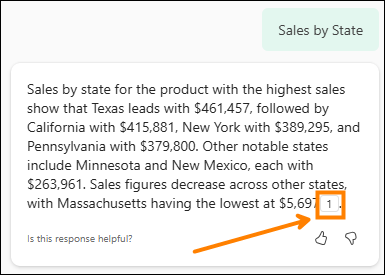

    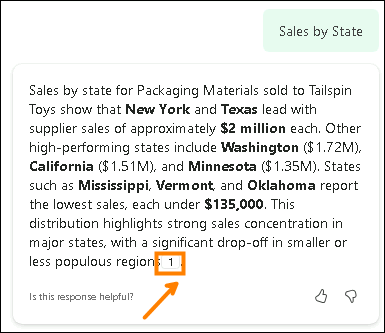

26. Now, navigate to the highest selling product tab that is in the bottom ribbon.

    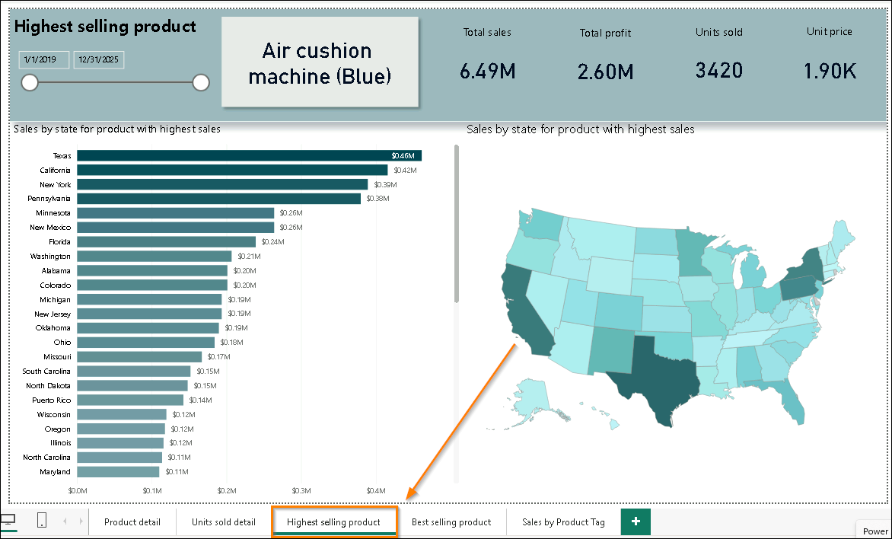

27. At first glance the answers may appear accurate but take a look at some of the potential Filters applied to the visualizations. If not already, expand your filter pane:

    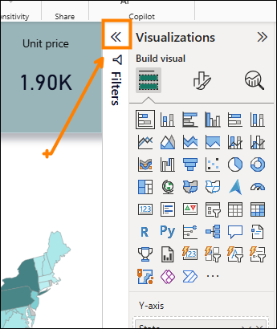

26. A filter is present on the visual which could be causing a change in Copilot’s responses. Expand the Filter to see that **this visual only shows sales for the best selling product**. (Make sure you have clicked into the map visual)

    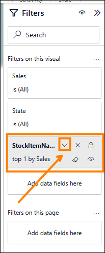

    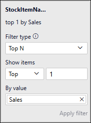

    **ℹ️ Important**

    Filters can exist at the visual, page, report, and even slicer levels. Copilot can sometimes generate a response from a visual that has a filter on it but not notify the end user that there is a filter being applied! Later in this course we will discuss how you can add AI Instructions to help with these types of responses.

27. Remove this filter and notice how the values of the reference visual drastically change.

    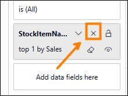

28. Texas now has **\$7,256,794**. Drastically different than some of the other options? Well looking closely, you will see one visual was using the **Sales** Measure and the other the **Supplier Sales**. This is even more reason why we need to prepare our data for AI.

    

    

29. I wonder what will happen if we ask the same question again? Ask Copilot once more **Sales by State**.

    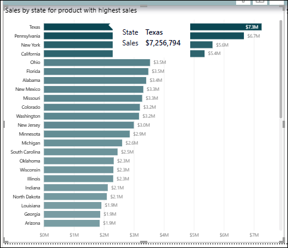

    

30. Without the filter, we have a completely different set of values in the same reference. This is an important aspect to note in the process of preparing your data for AI.

    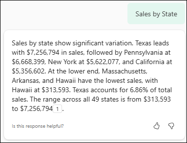

31. What about a response that returns multiple references? Ask Copilot this new question: **Show the top selling product**.

    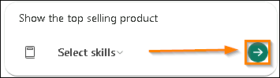

32. Select the reference and check for any extraneous filters that could be present.

    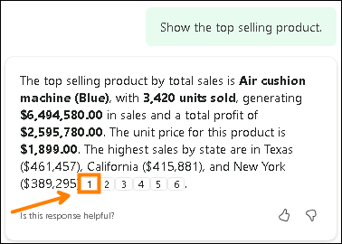
    
    

33. Add a filter to the page from the Reseller table for **ResellerCompany**.

    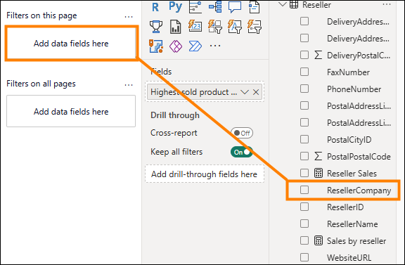

34. Select only TailSpin Toys and observe the values have changed.

    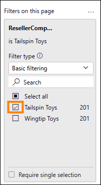

35. Now we will ask the question again: **Show the top selling product**.

    

36. The product may remain the same but our numbers are vastly different, this example shows where unprepped semantic models can provide inconsistent and incorrect results.

    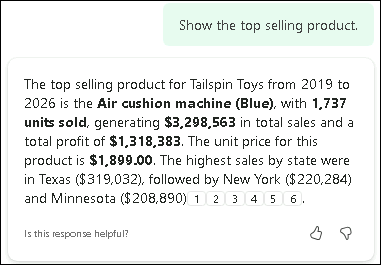

37. Another area in which we can enjoy Copilot here and should review is the integration of Data Analysis eXpression (DAX) language. Try by asking a question involving a calculation like the one here: **Calculate the percent of total sales in the Southeast to the United States**.

    

38. In our response you will notice that Copilot recognizes the answer will require more analysis than usual. This is great to let us know to further validate the calculation as needed.

    

39. In our case, this specific calculation required Copilot writing DAX. Here we can check on the DAX used in two ways. First, the **Advanced: Check the DAX** and the **Expand Answer** area .

    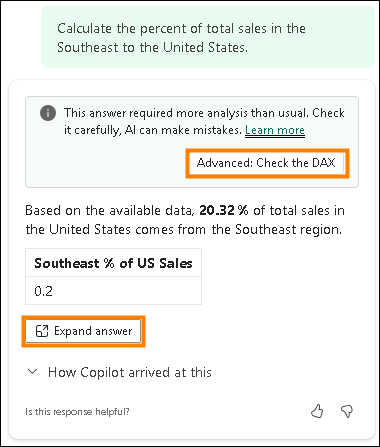

40. You want to ensure that you are viewing the **DAX Query** tab to view the DAX utilized to craft the answer. The query is listed along with a explanation of the logic to follow. We need to ask two questions. (1) Does the DAX look right here? (2) Was the Southeast region really just **20.32%**?

    

41. Each time Copilot generates DAX, it will often times be very different and inconsistent. Your DAX may or may not look like the screenshots in this section! In this code, the DAX is pulling the state from the **Geo** table which works but it could have easily grabbed the location information from the **Customer** table. If it had grabbed from the Customer table are results would have been just 3-4%.

    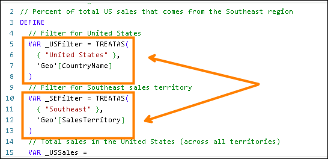

42. Now in what ways can we solve this problem? The best method we will utilize later in our labs when we **Prep the Data for AI**. For now, one way we can guarantee a better response is by writing a better prompt. You may have already gotten results from the **Geo** table, but still this is the second best way to confirm.

43. Ask the question again using this prompt: **Calculate the percent of total sales in the Southeast to the United States from the Geo table**.

    

44. The results this time are likely similar. We also can check the DAX associated with the response.

    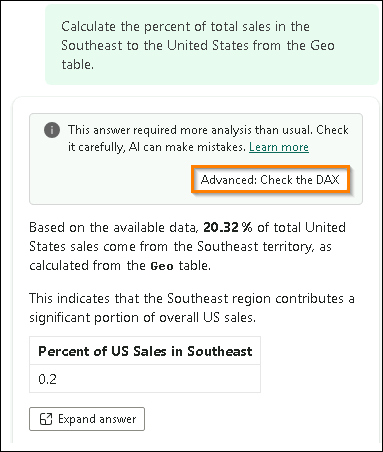

    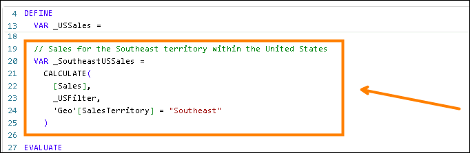

45. Perfect! With thoughtful prompting, lapses in the model can be adjusted. But for our end users we want to craft an experience that can allow for more general prompting.

46. In this PBIX file, there are some data modeling concerns. More specifically, there are two snowflake dimensions. Copilot handles these quite well by applying filters and other changes to perfect your answers! However, after reviewing the model and business requirements, we have decided that these two dimensions (Supplier and Geo) are not necessary as individual tables. These two tables will be consolidated into other tables in the model in order to get closer to a Star Schema. When modeled correctly this will improve performance, make the model easier to understand, and improve the Copilot experience. At the end of this module, you will be using **CDIAD – Lab 02– Start.**

    - **Supplier:** Columns in the supplier table were added into the Product table.

    - **Geo:** Columns in the Geo table were added into the Reseller table.

    **ℹ️ Important**

    Sometimes it is necessary to create dimensions that filter other dimensions, essentially creating a snowflake. However, whenever possible the semantic model should be simplified if business requirements are met. As new business requirements are added and new tables are brought in, the data model will inevitably become more complex. It’s important to always take time to keep the data model optimized!

    ⭐Power BI works best on a Star Schema, a full discussion on Star Schema is outside the scope of this class. Please see this Microsoft Learn Link for more information:

    [**https://learn.microsoft.com/en-us/power-bi/guidance/star-schema**](https://learn.microsoft.com/en-us/power-bi/guidance/star-schema)

    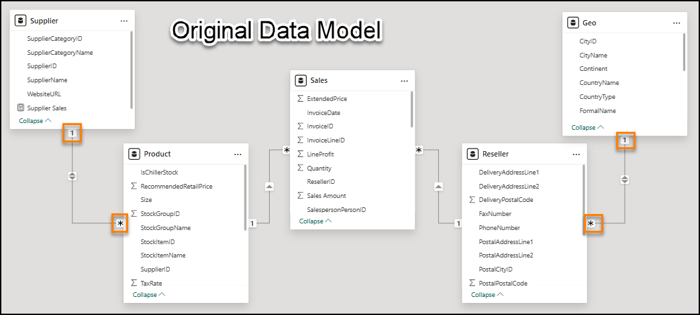

    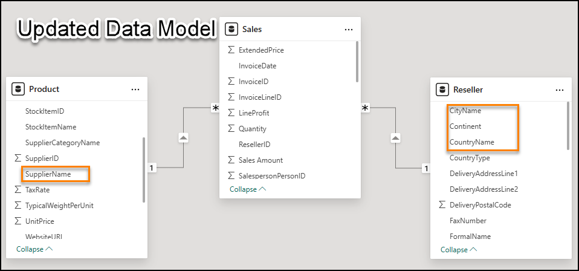

    Here are a few more resources that will help you with your next steps with Microsoft Fabric.

    - Access all the information in the main [Microsoft Fabric Documentation](https://learn.microsoft.com/en-us/fabric/)

    - Explore Fabric through the [Guided Tour](https://aka.ms/Fabric-GuidedTour)

    - Sign up for the [Microsoft Fabric free trial](https://aka.ms/try-fabric)

    - Visit the [Microsoft Fabric website](https://aka.ms/microsoft-fabric)

    - Learn new skills by exploring the [Fabric Learning modules](https://aka.ms/learn-fabric)

    - Read the [free e-book on getting started with Fabric](https://aka.ms/fabric-get-started-ebook)

    - Join the [Fabric community](https://aka.ms/fabric-community) to post your questions, share your feedback, and learn from others

    Read the more in-depth Copilot-relevant technical documentation:

    - [Copilot for Power BI Overview - Power BI | Microsoft Learn](https://learn.microsoft.com/en-us/power-bi/create-reports/copilot-introduction)

    - [Standalone Copilot Experience in Power BI (Preview) – Power BI | Microsoft Learn](https://learn.microsoft.com/en-us/power-bi/create-reports/copilot-chat-with-data-standalone)

    - [Microsoft Fabric Copilot admin settings | Microsoft Learn](https://learn.microsoft.com/en-us/fabric/admin/service-admin-portal-copilot)

    - [Fabric data agent creation (preview) - Learn how to create a Fabric data agent | Microsoft Learn](https://learn.microsoft.com/en-us/fabric/data-science/concept-data-agent)

    - [Best practices for configuring your data agent - Microsoft Fabric | Microsoft Learn](https://learn.microsoft.com/en-us/fabric/data-science/data-agent-configuration-best-practices)

    - [Copilot for Microsoft Fabric and Power BI: FAQ - Microsoft Fabric | Microsoft Learn](https://learn.microsoft.com/en-us/fabric/fundamentals/copilot-faq-fabric)

    © 2026 Microsoft Corporation. All rights reserved.

    By using this demo/lab, you agree to the following terms:

    The technology/functionality described in this demo/lab is provided by Microsoft Corporation for purposes of obtaining your feedback and to provide you with a learning experience. You may only use the demo/lab to evaluate such technology features and functionality and provide feedback to Microsoft. You may not use it for any other purpose. You may not modify, copy, distribute, transmit, display, perform, reproduce, publish, license, create derivative works from, transfer, or sell this demo/lab or any portion thereof.

    COPYING OR REPRODUCTION OF THE DEMO/LAB (OR ANY PORTION OF IT) TO ANY OTHER SERVER OR LOCATION FOR FURTHER REPRODUCTION OR REDISTRIBUTION IS EXPRESSLY PROHIBITED.

    THIS DEMO/LAB PROVIDES CERTAIN SOFTWARE TECHNOLOGY/PRODUCT FEATURES AND FUNCTIONALITY, INCLUDING POTENTIAL NEW FEATURES AND CONCEPTS, IN A SIMULATED ENVIRONMENT WITHOUT COMPLEX SET-UP OR INSTALLATION FOR THE PURPOSE DESCRIBED ABOVE. THE TECHNOLOGY/CONCEPTS REPRESENTED IN THIS DEMO/LAB MAY NOT REPRESENT FULL FEATURE FUNCTIONALITY AND MAY NOT WORK THE WAY A FINAL VERSION MAY WORK. WE ALSO MAY NOT RELEASE A FINAL VERSION OF SUCH FEATURES OR CONCEPTS. YOUR EXPERIENCE WITH USING SUCH FEATURES AND FUNCITONALITY IN A PHYSICAL ENVIRONMENT MAY ALSO BE DIFFERENT.

    **FEEDBACK**. If you give feedback about the technology features, functionality and/or concepts described in this demo/lab to Microsoft, you give to Microsoft, without charge, the right to use, share and commercialize your feedback in any way and for any purpose. You also give to third parties, without charge, any patent rights needed for their products, technologies and services to use or interface with any specific parts of a Microsoft software or service that includes the feedback. You will not give feedback that is subject to a license that requires Microsoft to license its software or documentation to third parties because we include your feedback in them. These rights survive this agreement.

    MICROSOFT CORPORATION HEREBY DISCLAIMS ALL WARRANTIES AND CONDITIONS WITH REGARD TO THE DEMO/LAB, INCLUDING ALL WARRANTIES AND CONDITIONS OF MERCHANTABILITY, WHETHER EXPRESS, IMPLIED OR STATUTORY, FITNESS FOR A PARTICULAR PURPOSE, TITLE AND NON-INFRINGEMENT. MICROSOFT DOES NOT MAKE ANY ASSURANCES OR REPRESENTATIONS WITH REGARD TO THE ACCURACY OF THE RESULTS, OUTPUT THAT DERIVES FROM USE OF DEMO/ LAB, OR SUITABILITY OF THE INFORMATION CONTAINED IN THE DEMO/LAB FOR ANY PURPOSE.

    **DISCLAIMER**

    This demo/lab contains only a portion of new features and enhancements in Microsoft Power BI. Some of the features might change in future releases of the product. In this demo/lab, you will learn about some, but not all, new features.
