# Microsoft Fabric Chat with your Data in a Day - Lab 2

## Contents

- Document Structure
- Scenario / Problem Statement
- Introduction
  - Task 1: Bidirectional Filtering / Star Schema
  - Task 2: Renaming Columns, Tables, Measures
  - Task 3: Descriptions
  - Task 4: Data Categories
  - Task 5: Summarization
  - Task 6: Sort by Column Property
  - Task 7: Linguistic Schema: Synonyms

# Document Structure

The lab includes steps for the user to follow along with associated screenshots that provide visual aid. In each screenshot, sections are highlighted with orange boxes to indicate the area(s) user should focus on.

# Scenario / Problem Statement

Your company has completed its initial testing and Copilot readiness testing phase. It’s been discovered that the current model is not yet ready for the Standalone Copilot experience and generally accepted best practices will need to be implemented in Power BI Desktop. To ensure that Copilot can deliver meaningful answers, the underlying semantic model must be thoughtfully designed and optimized.

Your semantic model faces the current challenges:

- Table and column names may be cryptic and hard to decipher.

- Descriptions on tables, columns, and measures do not exist.

- Data Categories are underutilized, limiting Copilot’s contextual understanding.

- Sorting logic and default summarizations may not reflect user expectations.

- Relationships and linguistic schema are not configured or optimized to support an optimal Copilot experience.

# Introduction

These gaps can lead to confusion, inaccurate responses, misleading visuals, or missed insights when users interact with Copilot. In this lab, you will learn how to refine the semantic model using best practices for naming, categorization, summarization, data modeling and the linguistic schema.

## Task 1: Bidirectional Filtering / Star Schema

1. Open the file names **CDIAD – Lab 02– Start** from your class files to begin preparing your data for AI.

    

2. One question asked in the previous lab was: **Create a new report page with a visual for sales and product tag**. This created a response from Copilot that showed duplicated data (Screenshot below). Usually when you see the same result for all data points it is an indication that there is a relationship issue in the data model.

    

3. Below is a screenshot of the relationship from Tag in the Product Details table to the Sales measure in the Sales table:

    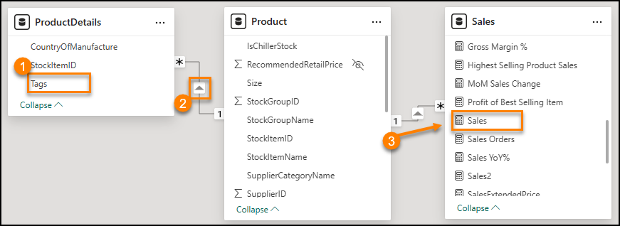

4. When we ask Copilot to return Sales by Tags it generates a report that has duplicated data. This happens because the column Tags on the Product Details table is unable to filter the product table. The filter direction between Product and Product Details is single and from the Product to the Product Details table . There are two ways to potentially solve this issue.

    - First, we could create a DAX measure that calculates the total sales while adding the necessary filter from the Tags table. This option keeps the data model simple, but a new measure needs to be created for every business need and could become tedious.

    - Second, and the one we will implement here, we can allow the filter to proceed in both directions. By updating the relationship between Product and Product Details, the tag column would then be able to filter through to the Sales table and Copilot can generate the correct response.

5. Let’s update the relationship in the data model. *See screenshot below:*

    1. Click on the **Model view** in the left navigation pane.

    2. Select the **relationship** between Product and Product Details.

    3. In the **properties** pane, change the cross-filter direction from single to **both** and click on **Apply changes**.

        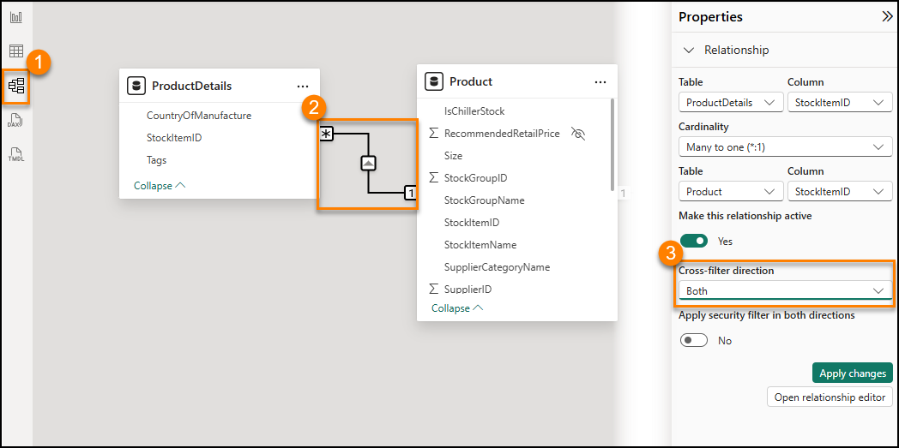

        **ℹ️ Important**

        As a best practice you should avoid turning on filtering in both directions when possible. In some situations this can cause ambiguity in the results as well as performance problems. As mentioned in this section one alternative is to create DAX measures that manually force the filtering for that specific measure. There are other alternatives as well, which will not be discussed in this course.

6. Now we can ask the question in the **Report View** again, and notice the enhanced results! Open the Copilot Power BI chat experience again and ask the following question: **Show total sales by product tag**.

    

    If you get asked for clarification, ask for the **Sales Measure**.

    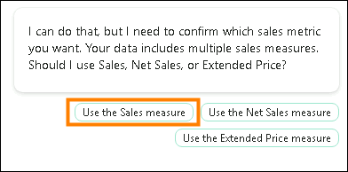

7. Correct Results:

    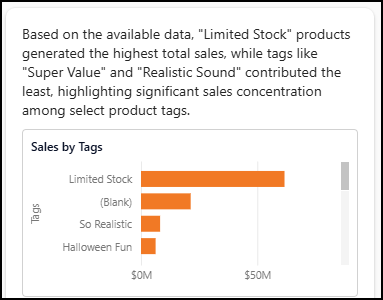

    *If you get a different visual, re-prompt and ask for a **Bar Chart***.

    

    Previous Results:

    

    Data modeling has always been one of the most, if not the most important aspect of Power BI. A well defined and well thought out data model makes building reports, writing dax, implementing security, and support for Copilot easier and more effective.

## Task 2: Renaming Columns, Tables, Measures

1. Throughout our previous lab we encountered problems regarding Copilot using columns, tables, and even measures that we did not anticipate. These challenges are to be expected in our growing data models and to better prepare our data for AI we need to make naming adjustments.

2. Let’s begin by renaming the tables appropriately. Right click on the **PO** Table and then select **Rename**. Adjust the **PO table** to **Purchase Orders**.

    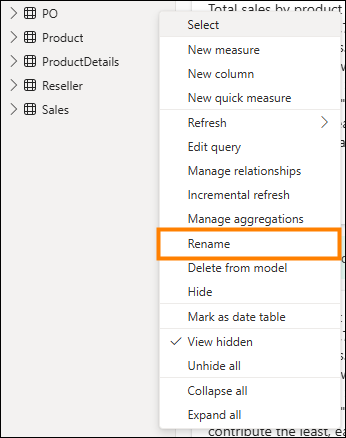

    

3. Next up we are going to rename the columns using the same process. Begin with expanding the **‘Reseller’** table.

    

4. Next double-click or right-click the **[SPName]** column and rename it to **State.**

    

    

5. Continue with your renaming changes as follows:

    Rename **‘Reseller’[CountryName]** to **Country**

    In the **Sales** table, rename the Measure **MoM Sales Change** to **Month over Month Sales Change**

    In the **Sales** Table, rename the Measure **Sales YoY%** to **Sales Year over Year %**

    In the **Purchase Orders** table, rename the Measure **Spend** to **Total Purchases**

    **ℹ️ Important**

    Clear, descriptive names for tables and columns make a big difference. Copilot interprets your prompts based on your model’s structure — the more intuitive the naming, the better it can generate accurate DAX, visuals, and insights. Rename thoughtfully to improve Copilot’s understanding and your own productivity.

## Task 3: Descriptions

1. Let’s now prepare the data model even further by adding Descriptions. Descriptions can be added to Tables, Columns, and Measures in the Model View. These descriptions will help Copilot when answering user requests. Table descriptions act like a backstage pass for Copilot, giving it the context it needs to generate accurate, relevant insights summaries, and even DAX measures. To start, let’s begin in the **Model view**.

2. Select the **Purchase Orders** table. In the **Properties** area, you will find the **Description** area where we will create our description to help Copilot. Here are some best practice tips:

    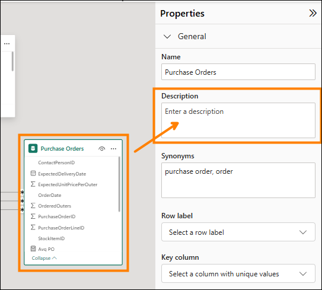

    ### Best Practices for Table Descriptions

    **Start with purpose:** What does the table represent in business terms?

    **Include Business Context:** Explain how the table supports reporting or decision-making.

    **Mention granularity:** Is it transactional, daily, aggregated, etc.?

    **Highlight key columns:** Especially those used in relationships or calculations.

    **Describe common use cases:** What kinds of questions or visuals this table supports.

    **ℹ️ Important**

    **Well-written descriptions help Copilot understand your data’s purpose and context.** Use descriptions to clarify what a table or column represents, especially when names alone aren’t enough. Copilot uses these cues to generate more relevant answers, DAX, and visuals. Think of descriptions as your chance to guide Copilot — and your users — toward better insights.

    **Note relationships:** Mention how it connects to other tables in the model.

3. Place this extensive but accurate description into the field:

    *This Purchase Orders table captures individual line items from purchase orders submitted within the organization. Each row represents a specific product ordered, including the quantity requested, the date of the order, and the employee who initiated the request. It supports analysis of procurement trends, supplier demand, and employee purchasing behavior. Key columns include ProductID, QuantityOrdered, OrderDate, and EmployeeID. This table links to Products, Employees, and PurchaseOrders tables to enable detailed reporting across procurement workflows.*

    This will greatly help Copilot craft better responses, especially, concerning the **Purchase Orders** table. Let’s continue by building better descriptions for some Columns. Select the **Order Date** column from the **Purchase Orders** table and add a similar description:

    ### Best Practices for Column Descriptions in Semantic Models

    **Start with the Business Meaning:** Describe what the column represents in business terms.

    **Clarify Units, Format, or Scale:** If it’s numeric, date-based, or categorical, explain how it’s structured.

    **Mention Common Use Cases:** Help Copilot understand how this column is typically used in analysis or reporting. Example: Revenue – Total sales amount for each transaction; used in profitability and trend analysis

    **Avoid Redundancy:** Don’t repeat what’s obvious from the column name unless it adds clarity. Instead, enrich it with context. For example for the EmployeeID you could add the following description: Unique identifier for the employee who submitted the order.

    **Use a Consistent Tone:** Keep descriptions concise, informative, and consistent across the model. Think of it like writing tooltips for a curious analyst.

4. Select the **Purchase Orders** table and then click on **OrderDate**. Enter the following description: **The calendar date when the purchase order was submitted by an employee.**

    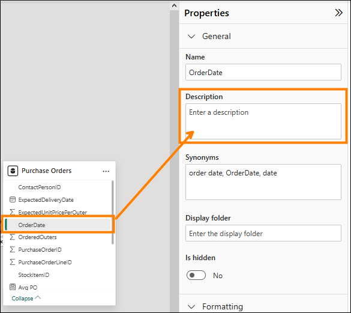

5. Now that we have adjusted both Table and Column **Descriptions**, let’s now add a description to a Measure. This time around however, we are going to utilize Copilot to help create the Description. Start by selecting the **Purchase Orders** Measure. From there we are going to select **Create with Copilot**.

    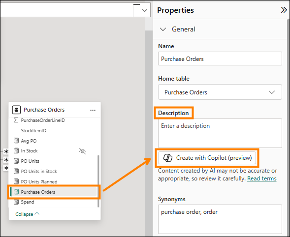

6. Notice the Copilot crafted description is ready for review. This answer may vary but will work out well to help verify and detail our description. You can press **Try Again** but when ready select **Keep it**.

    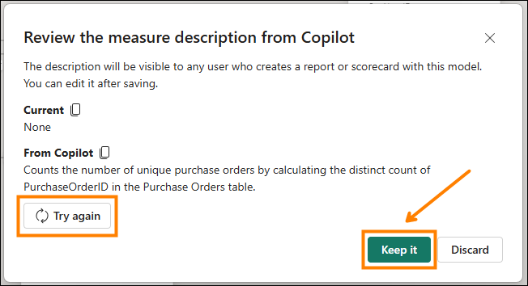

    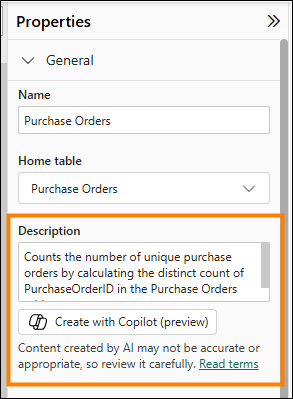

    In this section you learned how to add descriptions to tables, columns, and measures. In a real semantic model, you would expand on what we have done here to the rest of your tables and any applicable columns and measures. You have now greatly enhanced Copilot’s ability to work with the data and enhance all future responses.

## Task 4: Data Categories

Adding data categories to columns in Power BI is important for Copilot, especially when you're working with semantic models that include geographic, web, or image data. These categories act like metadata tags that help Copilot (and visuals) interpret the column’s purpose beyond just its name or data type.

1. Navigate to the **Table view** in the left pane and select the `Reseller` table. Start by selecting the **State** column from the **Reseller** table.

    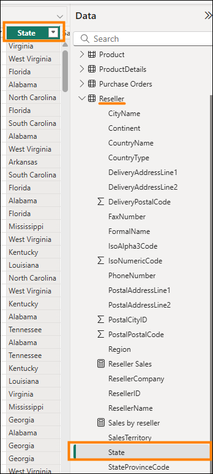

2. When you have the **State** column selected you will see a new ribbon menu has appeared across the top of your Power BI report called **Column Tools**. Click on Column tools. Let’s start by changing the **Data Category**.

    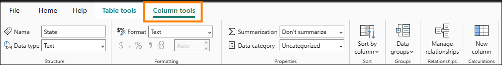

3. Expand the **Data Category** area and change the Data category from Uncategorized to **State or Province**.

    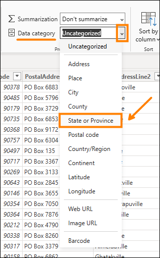

4. Continue adding Data Categories for the remaining Columns below:

    | **Table Name** | **Column Name** | **Data Category** |
    |----------------|--------------------|-------------------|
    | Reseller | Country | Country/Region |
    | Reseller | DeliveryPostalCode | Postal code |
    | Reseller | PostalPostalCode | Postal code |
    | Reseller | Website URL | Web URL |

    **ℹ️ Important**

    **Setting data categories helps Copilot understand how to treat your data.** Whether it’s geography, URLs, or images, assigning the right category gives Copilot context to generate smarter visuals, filters, and insights. For example, tagging a column as “City” lets Copilot map it instantly. It’s a small step that unlocks big value.

## Task 5: Summarization

In this section we will learn about default summarization in Power BI and how it can affect Copilot responses. This is not a new addition to Power BI but a crucial one for Copilot.

1. Open Copilot, from the **Report View** and write the following prompt: **What is customer age by state?**

    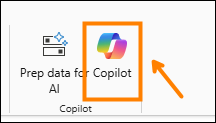

    

2. View the results and notice that there may be an odd result occurring. Hover over the **WA, NY**, or others States’s data bars and you will see the **Sum of Age** is being returned! You would probably expect to see the average here, but because there is a default summarization of SUM on the age column, Copilot performs a summarization.

    Copilot may also ask for clarification like the image below. Regardless, we can get Average every time be adjusting the **Summarization** and avoid additional questioning.

    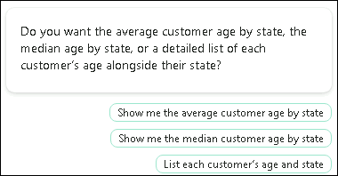

    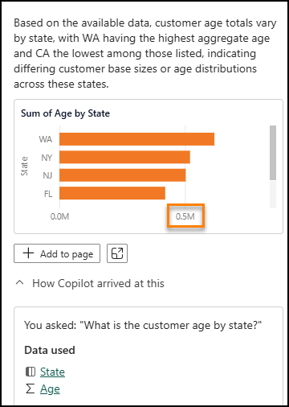

3. By hovering over the age, you can verify and confirm that Copilot performed a SUM on the column.

    

4. We could write a better prompt by asking specifically for the average age, and this would work. However, the better option is to improve the data model where possible, therefore, we will adjust the **Default Summarization** property.

    **ℹ️ Important**

    **Default summarization tells Copilot how to treat your columns in visuals and calculations.** Whether it’s “Don’t summarize,” “Sum,” or “Average,” setting this correctly helps Copilot generate more accurate charts and DAX. For example, mark IDs or names as “Don’t summarize” to avoid misleading totals. It’s a quick way to guide Copilot toward meaningful insights.

5. In your Copilot prompt, type: **What is customer age average by state**.

    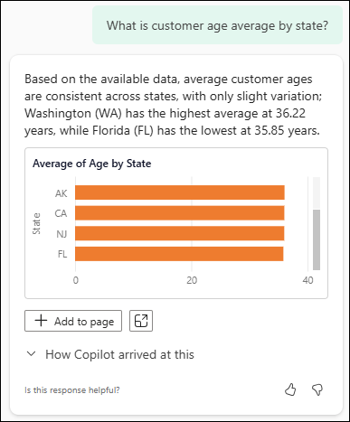

6. Let’s adjust the **Default Summarization**. Select the **Age** column from the `Customer` table to show Column Tools. Find the **Summarization** area and adjust Age to **Average**.

    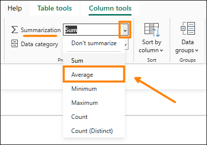

7. Using the Copilot chat let’s ask the question again: **What is customer age by state?**

    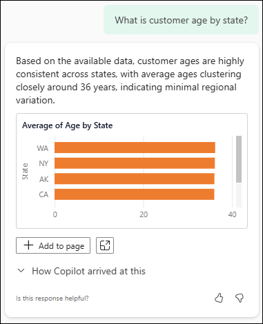

    Perfect! This is the intended result and will allow users to ask their questions more casually and allow for expected variations in user’s questions. It is equally important to turn off the default summarization on columns that are numeric but should not be summarized. Columns like Year, Quarter, and Month number for example should not be summarized!

## Task 6: Sort by Column Property

1. The Sort by Column property, like default summarization, is not new to Power BI, but properly setting this property can help Copilot return the results in an order that might align with what you would expect to see. For Example, if you return sales by month, it sorts the visual by default by the highest selling month to the lowest selling month. Let’s put this to the test!

2. Reset your Copilot chat if you haven’t already by pressing the **Clear Chat** area.

    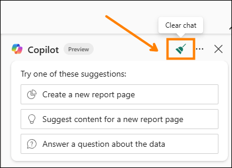

3. Now type the following prompt: **Show total sales by month as a column chart**.

    

4. The results are correct, but sorted in a way that is not conducive to our typical view in the Gregorian Calendar (January, February, March…December). The results return as either alphabetized, or in this case, sorted by the highest sales to the lowest sales.

    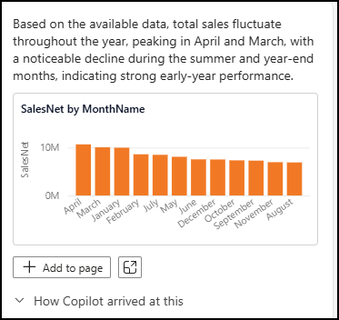

    **ℹ️ Important**

    **Use “Sort by Column” to control how Copilot presents your data.** This setting helps Copilot with displaying the data so that categories like months or custom labels appear in the expected order in visuals and summaries. For example, sorting “Month Name” by “Month Number” helps Copilot build accurate time-based charts. It’s a simple fix that prevents confusing results.

5. We will need to adjust how the **MonthName** column is sorting from the **Sort by Column** area in the **Column Tools** area. Select the **MonthName** Column from the `Date` Table.

6. Expand Sort by Column and adjust the sorting to be by Month:

    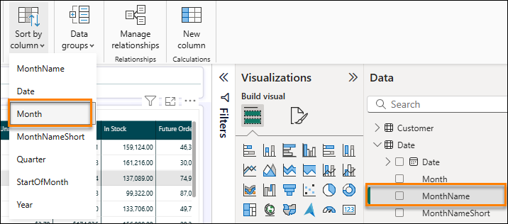

7. Ask Copilot chat the same question: **Show total sales by month** and now you get the results, as expected.

    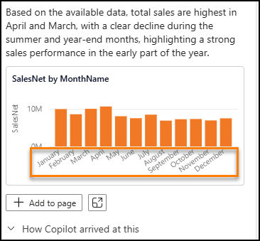

## Task 7: Linguistic Schema: Synonyms

The **linguistic schema** is the key to unlocking Copilot’s full potential as a natural language analytics partner. Think of it as giving Copilot a translator’s guide to your data model. Without it, Copilot is guessing; with it, Copilot becomes much more fluent and familiar with your data.

**What Is the Linguistic Schema?**

The linguistic schema is metadata that maps your semantic model to natural language. It helps Copilot understand:

- What your tables and columns mean

- How they relate to business concepts

- Which synonyms, phrases, and types of questions users might use when interacting with the data

As an example, Instead of just reading column names, Copilot understands that:

- “Revenue” = TotalSales

- “Orders placed” = PurchaseOrderCount

- “Employee performance” = SalesByEmployee

This means Copilot can answer questions like:

- “Which region had the highest revenue last quarter?”

- “Show me top-performing employees by sales volume”

Without a linguistic schema, Copilot might misinterpret vague terms or suggest irrelevant visuals. With it, you get:

- Better DAX suggestions

- Smarter visual recommendations

- More accurate summaries and insights

**Supports Synonyms and Natural Language**

You can define synonyms like:

- “PO” = “Purchase Order”

- “Rep” = “Sales Representative”

- “Qty” = “Quantity Ordered”

1. Let’s take a look at the **Linguistic Schema** interface. Start by selecting the **Model View** or if you’re in the report view, the modeling ribbon. Then navigate to the **Q & A setup** area.

    

2. There is an impressive menu to help the Q&A used by your Copilot data model understand people better. The main menu has plenty of areas to get started.

    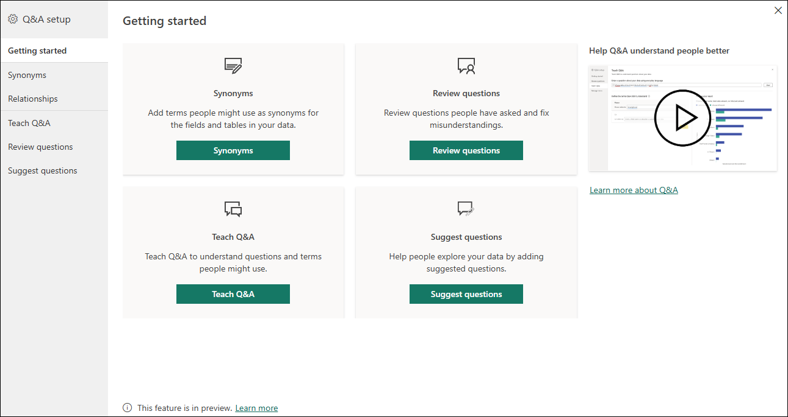

3. Let’s navigate to the first menu, the synonym menu.

    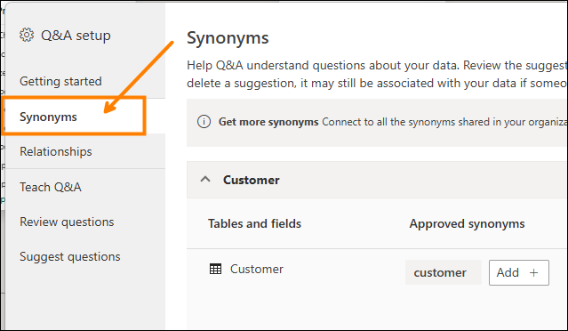

4. More precise synonyms will help Copilot understand different ways user might phrase their questions. You can also adjust what table you are navigating to get to the correct column. By pressing the chevron icon.

    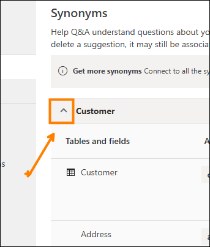

    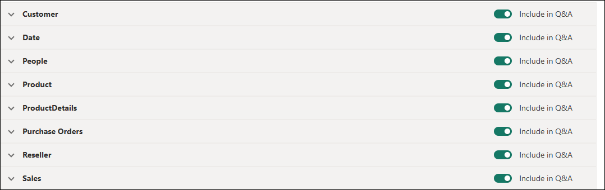

5. Let’s help Copilot out by adjusting the **Reseller** synonyms to be more specific. Make sure the **Reseller** table is expanded and you can see all current synonyms associated with the **ResellerID** column and Suggestions.

6. Within Fabrikam, Resellers are often referred to as ***Fabrikam Friends*** and……..Let’s add those as synonyms to allow our employees to ask questions in our own Fabrikam lingo. Select **Add** on the **shopper** and input the synonym.

    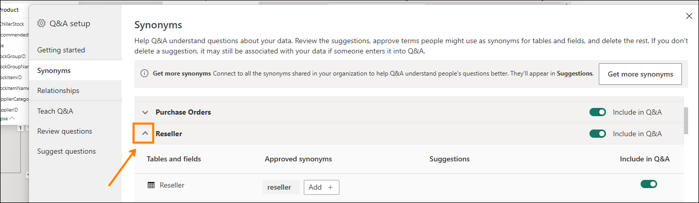

7. Add ***Fabrikam Friends*** using the Add + button.

    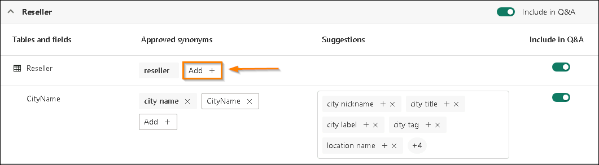

    

8. You will notice Copilot will assess the addition and appropriately add other Suggestions dynamically.

    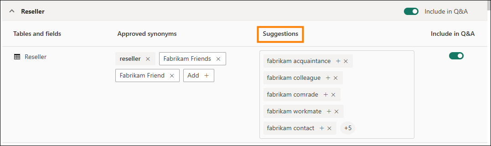

9. Let’s now add another Synonym for the Reseller Table by using one of the suggestions. Click on a Suggestion of your choice like ***Fabrikam Acquaintance***.

    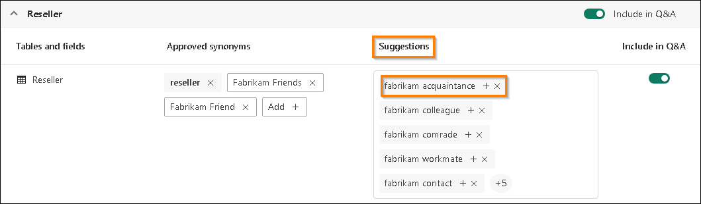

    The process of adding synonyms is a very involved process which is improved over time. Feel free to explore other tables and columns and add additional synonyms in your Power BI Desktop file!

10. Great! Let’s now look at **Relationships**. Navigate in the Q&A setup menu.

    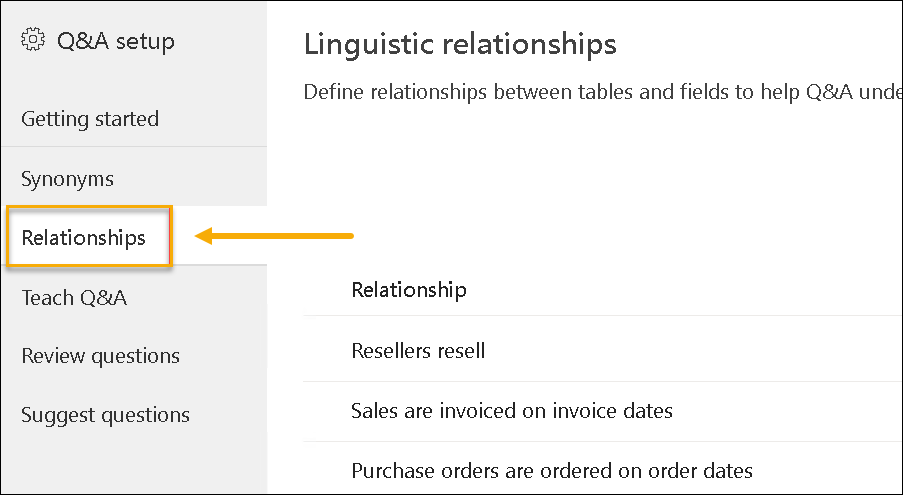

    Linguistic Relationships define relationships between tables and fields to help Q&A understand questions about your data. It’s similar to how tables are connected in your data model, but they are expressed in a way that Copilot can understand linguistically.

    For example, relationships can be used to resolve ambiguity. If you’re model has multiple date fields across multiple tables, you can add relationships on the dates that will help Copilot figure which one to use based on context and table connections.

    To add new relationships, you begin by clicking on the + New relationship box as seen in the screenshot below.

    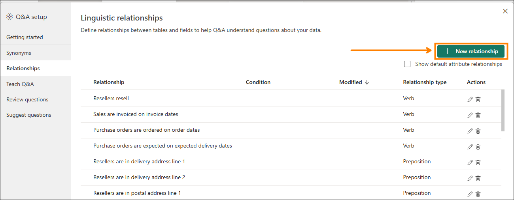

11. From here, you can create many different linguistic relationships. Current options include Verbs, Adjectives, Nouns, prepositions, Names, and Association. See screenshot of options available below with examples:

    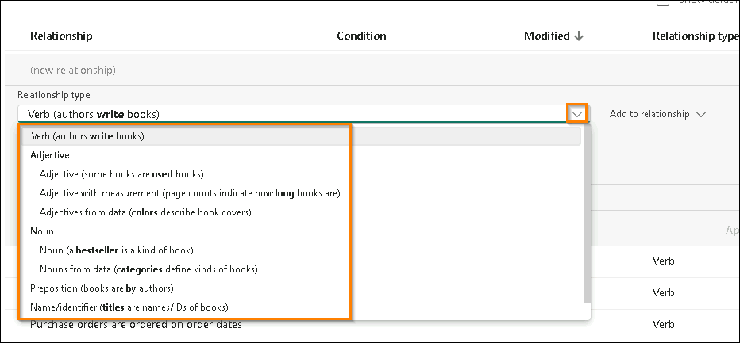

12. For this lab, you won’t be creating any relationships in the model. Similar to adding synonyms this is an involved process that will require updating and maintenance as more is learned about how users query they data with Copilot and how the Linguistic schema can be used to improve that experience!

    **ℹ️ Important**

    **Relationships in the linguistic schema define how Copilot understands connections between tables when responding to natural language.** They shape how questions like “sales by product category” or “orders by region” are interpreted. Without clear relationships, Copilot may struggle to link concepts across tables. Defining them properly ensures smoother, more intuitive conversations.

13. We can now tour the remaining elements to the Q&A setup. Let’s check out **Teach Q&A** select the section.

    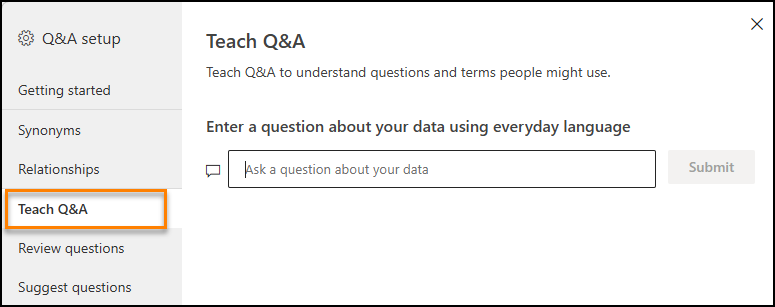

14. Here we can teach Q&A to understand questions and terms people might use.

    Try asking Q&A: **How many sales happen in january?**

    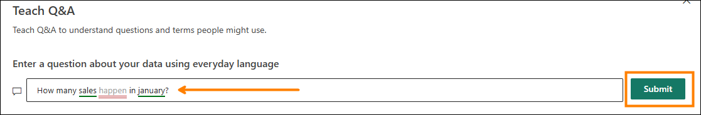

    You will see that Copilot is listing “happen” as a unknown term. This will allow you to adjust further to accommodate questions like these.

    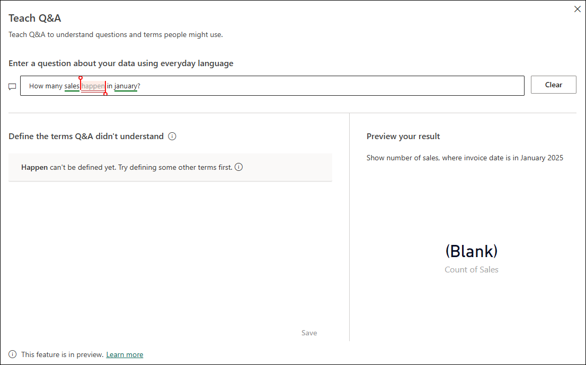

15. You can try again with another prompt like, **“What is the total sales for january 2022?”** and receive results! This becomes a great testing area.

    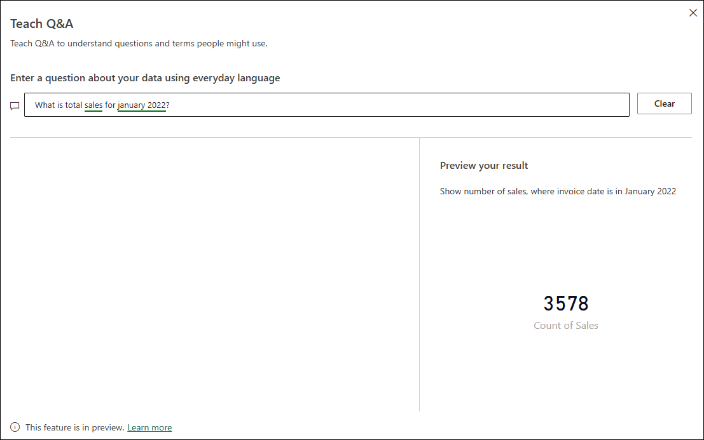

16. You can also see the effect of the Synonyms and Relationships at work by asking **What is sales by Fabrikam Friends?**

    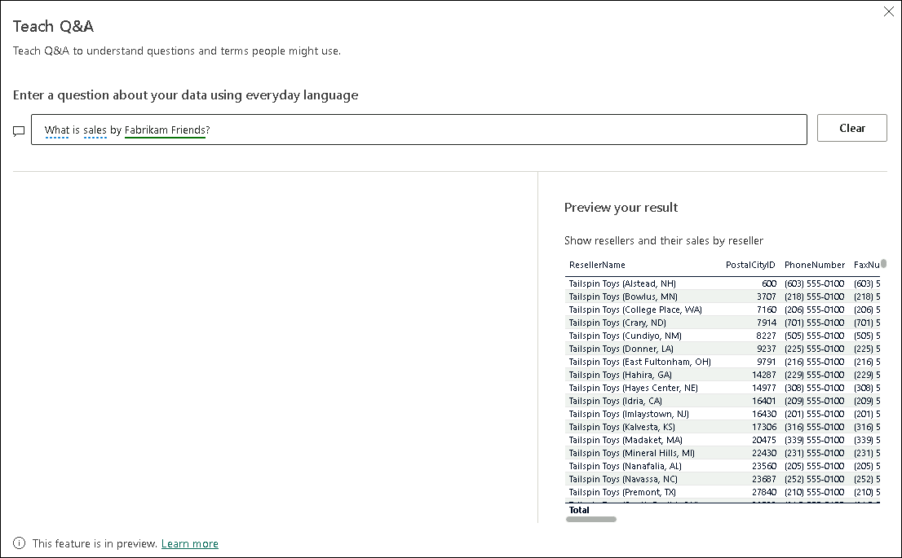

17. Next, navigate to **Review Questions**. Here questions people have asked within the tenant can be adjusted for future fixing.

    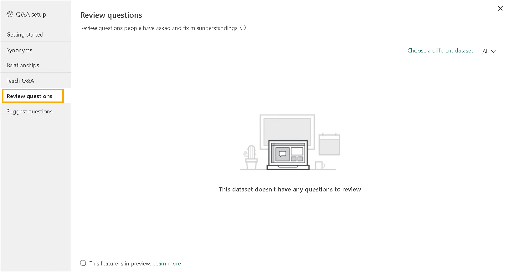

18. Finally, navigate to **Suggest questions**. Here you can help people explore the data by adding suggest questions.

    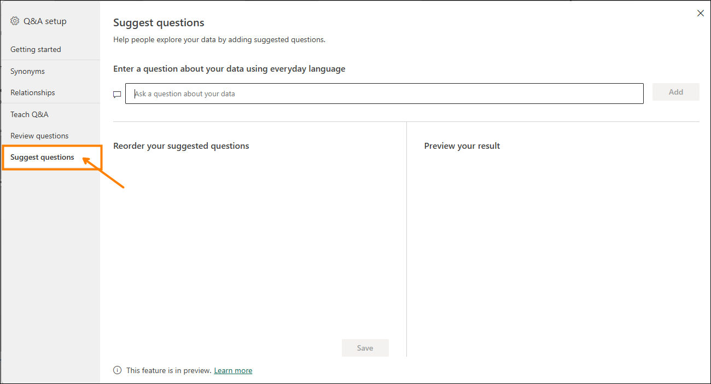

19. We want to assist users with this so let’s select the Ask question about your data box and add one suggestion: **What is total sales by State?** You can then press submit to see a preview!

    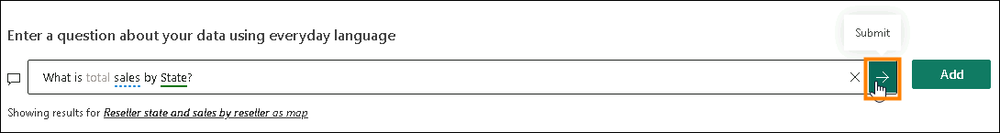

    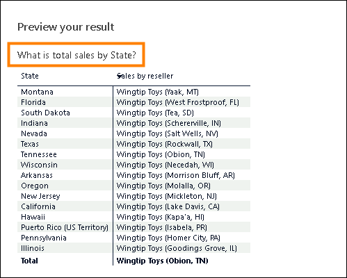

20. Save the suggestion by clicking **Add.**

    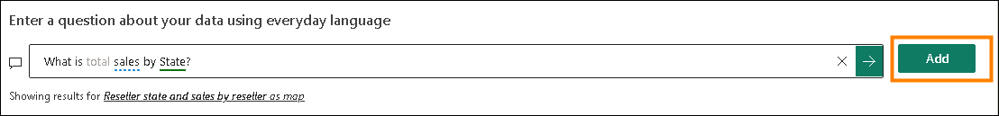

21. **Save** your results and you can completed lab 2.

    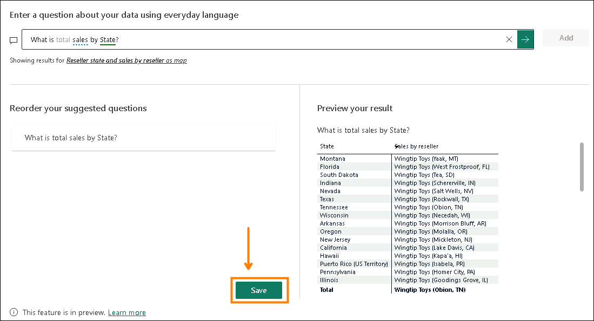

    In this lab, you learned about best practices for data modeling to enhance the performance and accuracy of Copilot’s natural language responses for Power BI semantic models.

    Here are a few more resources that will help you with your next steps with Microsoft Fabric.

    - Access all the information in the main [Microsoft Fabric Documentation](https://learn.microsoft.com/en-us/fabric/)

    - Explore Fabric through the [Guided Tour](https://aka.ms/Fabric-GuidedTour)

    - Sign up for the [Microsoft Fabric free trial](https://aka.ms/try-fabric)

    - Visit the [Microsoft Fabric website](https://aka.ms/microsoft-fabric)

    - Learn new skills by exploring the [Fabric Learning modules](https://aka.ms/learn-fabric)

    - Read the [free e-book on getting started with Fabric](https://aka.ms/fabric-get-started-ebook)

    - Join the [Fabric community](https://aka.ms/fabric-community) to post your questions, share your feedback, and learn from others

    Read the more in-depth Copilot-relevant technical documentation:

    - [Copilot for Power BI Overview - Power BI | Microsoft Learn](https://learn.microsoft.com/en-us/power-bi/create-reports/copilot-introduction)

    - [Standalone Copilot Experience in Power BI (Preview) – Power BI | Microsoft Learn](https://learn.microsoft.com/en-us/power-bi/create-reports/copilot-chat-with-data-standalone)

    - [Microsoft Fabric Copilot admin settings | Microsoft Learn](https://learn.microsoft.com/en-us/fabric/admin/service-admin-portal-copilot)

    - [Fabric data agent creation (preview) - Learn how to create a Fabric data agent | Microsoft Learn](https://learn.microsoft.com/en-us/fabric/data-science/concept-data-agent)

    - [Best practices for configuring your data agent - Microsoft Fabric | Microsoft Learn](https://learn.microsoft.com/en-us/fabric/data-science/data-agent-configuration-best-practices)

    - [Copilot for Microsoft Fabric and Power BI: FAQ - Microsoft Fabric | Microsoft Learn](https://learn.microsoft.com/en-us/fabric/fundamentals/copilot-faq-fabric)

    © 2026 Microsoft Corporation. All rights reserved.

    By using this demo/lab, you agree to the following terms:

    The technology/functionality described in this demo/lab is provided by Microsoft Corporation for purposes of obtaining your feedback and to provide you with a learning experience. You may only use the demo/lab to evaluate such technology features and functionality and provide feedback to Microsoft. You may not use it for any other purpose. You may not modify, copy, distribute, transmit, display, perform, reproduce, publish, license, create derivative works from, transfer, or sell this demo/lab or any portion thereof.

    COPYING OR REPRODUCTION OF THE DEMO/LAB (OR ANY PORTION OF IT) TO ANY OTHER SERVER OR LOCATION FOR FURTHER REPRODUCTION OR REDISTRIBUTION IS EXPRESSLY PROHIBITED.

    THIS DEMO/LAB PROVIDES CERTAIN SOFTWARE TECHNOLOGY/PRODUCT FEATURES AND FUNCTIONALITY, INCLUDING POTENTIAL NEW FEATURES AND CONCEPTS, IN A SIMULATED ENVIRONMENT WITHOUT COMPLEX SET-UP OR INSTALLATION FOR THE PURPOSE DESCRIBED ABOVE. THE TECHNOLOGY/CONCEPTS REPRESENTED IN THIS DEMO/LAB MAY NOT REPRESENT FULL FEATURE FUNCTIONALITY AND MAY NOT WORK THE WAY A FINAL VERSION MAY WORK. WE ALSO MAY NOT RELEASE A FINAL VERSION OF SUCH FEATURES OR CONCEPTS. YOUR EXPERIENCE WITH USING SUCH FEATURES AND FUNCITONALITY IN A PHYSICAL ENVIRONMENT MAY ALSO BE DIFFERENT.

    **FEEDBACK**. If you give feedback about the technology features, functionality and/or concepts described in this demo/lab to Microsoft, you give to Microsoft, without charge, the right to use, share and commercialize your feedback in any way and for any purpose. You also give to third parties, without charge, any patent rights needed for their products, technologies and services to use or interface with any specific parts of a Microsoft software or service that includes the feedback. You will not give feedback that is subject to a license that requires Microsoft to license its software or documentation to third parties because we include your feedback in them. These rights survive this agreement.

    MICROSOFT CORPORATION HEREBY DISCLAIMS ALL WARRANTIES AND CONDITIONS WITH REGARD TO THE DEMO/LAB, INCLUDING ALL WARRANTIES AND CONDITIONS OF MERCHANTABILITY, WHETHER EXPRESS, IMPLIED OR STATUTORY, FITNESS FOR A PARTICULAR PURPOSE, TITLE AND NON-INFRINGEMENT. MICROSOFT DOES NOT MAKE ANY ASSURANCES OR REPRESENTATIONS WITH REGARD TO THE ACCURACY OF THE RESULTS, OUTPUT THAT DERIVES FROM USE OF DEMO/ LAB, OR SUITABILITY OF THE INFORMATION CONTAINED IN THE DEMO/LAB FOR ANY PURPOSE.

    **DISCLAIMER**

    This demo/lab contains only a portion of new features and enhancements in Microsoft Power BI. Some of the features might change in future releases of the product. In this demo/lab, you will learn about some, but not all, new features.
