# Microsoft Fabric Chat with your Data in a Day - Lab 3

## Contents

- Document Structure
- Scenario / Problem Statement
- Introduction
- Prepare data for Copilot
  - Task 1: Simplify the data schema
  - Task 2: Add AI Instructions
  - Task 3: Create verified answers
  - Task 4: Try it yourself
- Conclusion
- References

# Document Structure

The lab includes steps for the user to follow along with associated screenshots that provide visual aid. In each screenshot, sections are highlighted with orange boxes to indicate the area(s) user should focus on.

# Scenario / Problem Statement

You’ve recently enabled Copilot in Microsoft Fabric to help users interact with data more intuitively. However, early usage has revealed that Copilot sometimes returns inaccurate or confusing answers. These issues stem from overly complex data models, ambiguous terminology, and unclear definitions within the semantic layer.

To improve Copilot’s understanding and results, you’ve learned that you can prepare your data model using the Prep data for AI feature in Power BI. This includes simplifying the schema, adding AI instructions, and creating verified answers to guide Copilot toward more accurate and context-aware responses.

**Current Challenges**

- Reduce ambiguity in Copilot responses caused by unclear measures and terminology.

- Ensure Copilot understands business-specific definitions (e.g., best-selling vs. highest selling).

- Provide verified answers to common questions to improve consistency and reliability.

- Limit Copilot’s access to unnecessary or misleading data elements.

# Introduction

So far, you’ve learned how to assess a semantic model for Copilot readiness as well as best practices for the semantic model. Now, you’ll take the next step by preparing those models for use with Copilot. In this lab, you’ll use the Prep data for AI feature to simplify your schema, add AI instructions, and create verified answers—all of which help Copilot deliver more accurate and business-relevant insights.

By the end of this lab, you will have learned:

- How to simplify a data schema to guide Copilot’s behavior

- How to add AI instructions to clarify business terminology

- How to create verified answers to improve Copilot’s accuracy

# Prepare data for Copilot

In this section, you will prepare a data model for use with Copilot. This is necessary because Copilot sometimes gives wrong or confusing answers because the data model contains extra measures, unclear definitions, or ambiguous terminology. Therefore, we have the **Prep data for AI** button on the Home ribbon in Power BI.

## Task 1: Simplify the data schema

1. From your class files, open the PBIX file named **CDIAD – Lab 03 - Start**.

    

2. Click the Copilot button on the **Home** ribbon.

    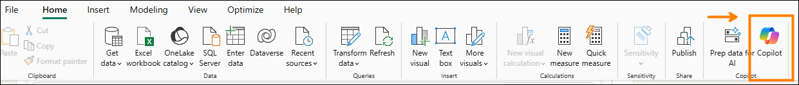

3. Ask Copilot **What reseller has the highest sales?** Press **Enter** or click the **arrow.**

    

4. You can see the results in the screenshot below. These are not the results we expected. Copilot used the measure [Reseller Sales], however, we want Copilot to use [Sales by Reseller].

    **Potential Options:**

    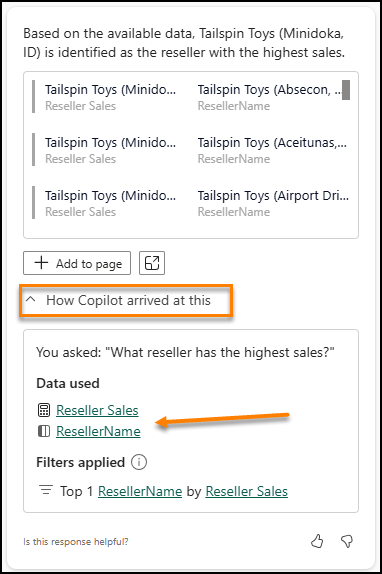

    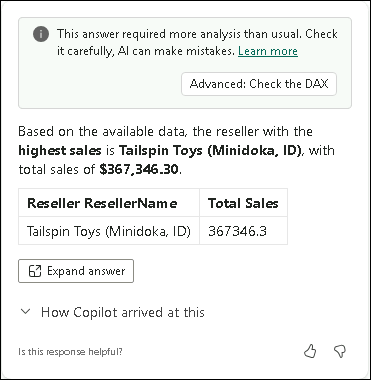

    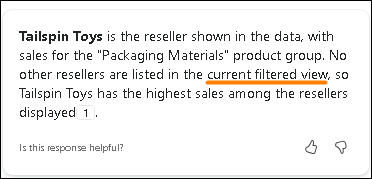

    This also highlights more hidden filters! We will adjust for these later.

5. We will leverage the Prep data for AI feature in Power BI Desktop to hide the measure [Reseller Sales] from Copilot. In the Home ribbon, select **Prep data for AI**.

    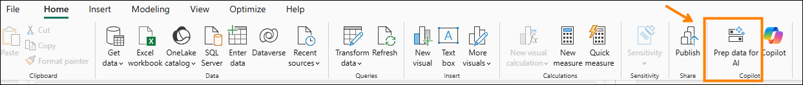

6. The new window opens to the **Get started** page.

    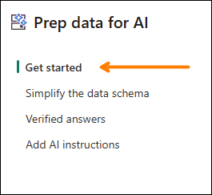

7. Click on **Simplify the data schema**.

    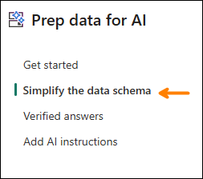

8. Expand the **Resellers** table by clicking on the **>** icon. The Reseller Sales measure can create ambiguous results with Copilot, you will remove it from the schema so that Copilot will not include it during analysis! Excluding this measure from Copilot will create better consistency in your results. Click the check box to deselect the measure **Reseller Sales (1)**, then click **OK (2)**. *See screenshot below.*

    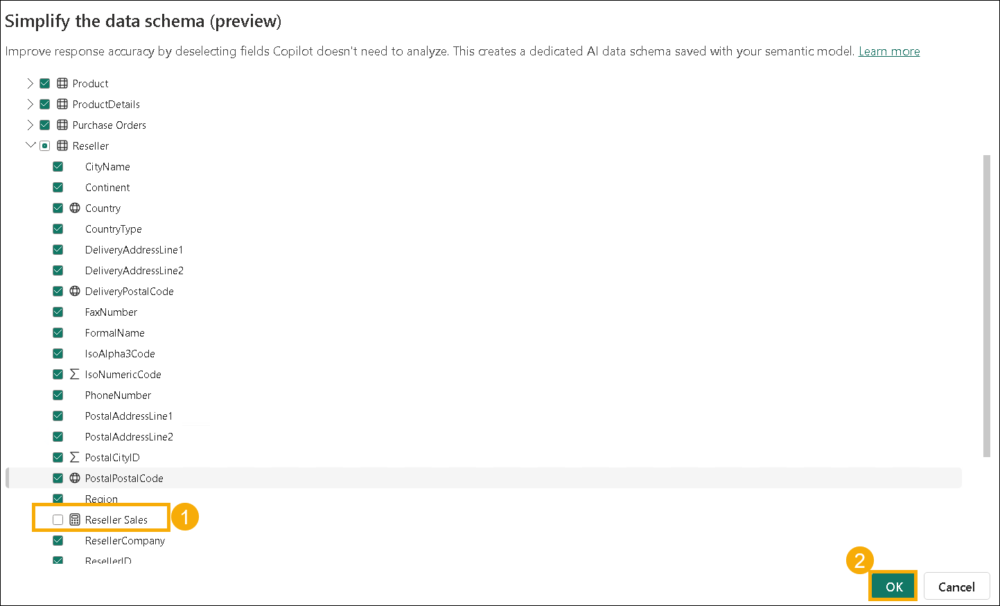

    **ℹ️ Important**

    As a best practice, be very descriptive with the names of your tables, columns, and measures. This will help Copilot to create more consistent and accurate results when answering questions. For example, in this model we have a measure named [Reseller Sales] and another measure named [Sales by Reseller]. This is confusing for Copilot and will result in answers that may be inconsistent. For this lab, we removed this measure from the schema, in other scenarios you may wish to rename the measure!

10. Click the Copilot button on the **Home** ribbon to close and reopen Copilot.

    

    

11. Ask Copilot **What reseller has the highest sales?** Press **Enter** or click the **arrow.**

    

12. After getting a response from Copilot, click on **How Copilot arrived at this** section.

    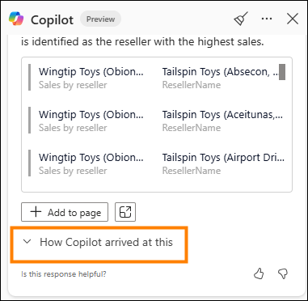

13. This time you should see that the measure used to find this answer was the **Sales by reseller or even SalesNet!** That is perfect, Copilot has been trained to avoid that likely but not wanted Measure. You may see a different result here due to the non-deterministic nature of Copilot. This is where you can continue to prep your data for AI to create a more consistent experience!

    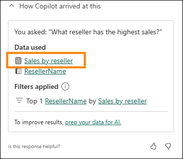

    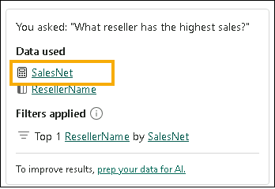

7. As a best practice, it’s a good idea to hide tables, columns and measures that may confuse Copilot.

    **ℹ️ Important**

    It’s common in Power BI to create helper measures or one-off measures that are used for very specific purposes within a very specific filter context. If you know that you have many measures that you will want to hide from Copilot, then it might be worth creating a table specifically for storing measures that you want to hide. This will make the process of updating the schema much simpler. At this time, hiding a measure folder is not supported.

8. We have also run into instances where the State from the customer table has returned instead of the State from the Reseller table. The customer table should not be used in this context and is only there for very specific scenarios. Since this table can cause confusion for Copilot, we are going to hide it.

9. Click on **Prep data for AI** from your home ribbon.

10. Select **Simplify the Data Schema** from the left navigation bar.

11. Deselect **Customer**. By unchecking the Customer table, the table will still exist in your semantic model for any reports, visuals, or DAX calculations you need to build. However, it will be ignored by Copilot during analysis. Make sure to click on **OK**.

    

    

## Task 2: Add AI Instructions

Adding AI Instructions is a very important step in prepping your data for AI. By adding well defined AI instructions, you help Copilot understand your semantic model more deeply by embedding business context, terminology, and analytical priorities directly into the model. This makes Copilot smarter, faster and more aligned with your intent when generating insights, answering questions, or building visuals.

In this lab, you will use AI Instructions to help define what is returned when Copilot is asked about best-selling items.

1. Open Copilot and ask the following question: **What are the top 5 best-selling products.**

    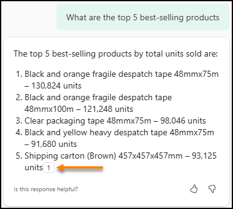

2. If you got the same result as above, click the reference to open up the visual that these results came from.

    

3. This result looks correct, and it very well may be correct. However, what determines a “*best selling*” product versus a top selling product? Is it quantity, amount sold, highest profit margin, or some other criteria?

4. For now, we want Copilot to ask for clarity so that the expected and correct results are returned to our end users. Click the **Prep data for AI** button again.

    

5. Navigate to **Add AI Instructions**.

    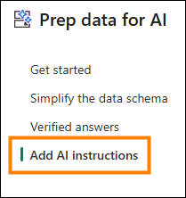

6. Add an instruction for Copilot to clarify with the user what definition they intend each time they ask for **highest, most or best-selling**.

7. Type:
    ***If asked about "highest" or” most” or "best-selling" product, first clarify if the user wants product by unit sold or product by total sales value.*(1)** Then click **OK (2)**.

    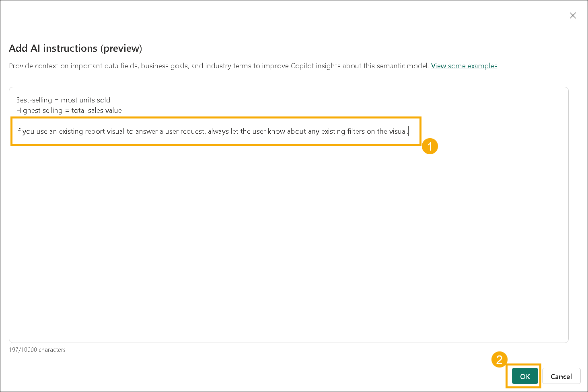

8. Open the Copilot pane. If it was already open, close Copilot and Reopen it. This will ensure the changes you have made have been applied!

    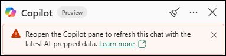

9. Ask Copilot **What’s our best-selling product**?

    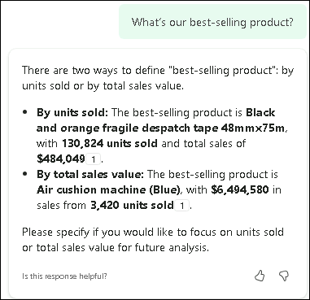

10. Because we provided Copilot with instructions to clarify with the end user what they mean by best-selling, we will see two options here. You can also be prompted with a question to clarify or additional information.

11. Type **units sold** into the prompt and hit enter. Copilot will now provide you with a more specific answer.

    

12. Let’s imagine we are positive that every user in the organization knows the distinction between **best-selling** & **highest selling**. In that case, we can simply provide definitions to Copilot using AI Instructions.

13. Reopen the **Prep data for AI** dialog, navigate to Add AI instructions, and replace the current instructions with the following:

    - **Best-selling = most units sold**

    - **Highest selling = total sales value**

    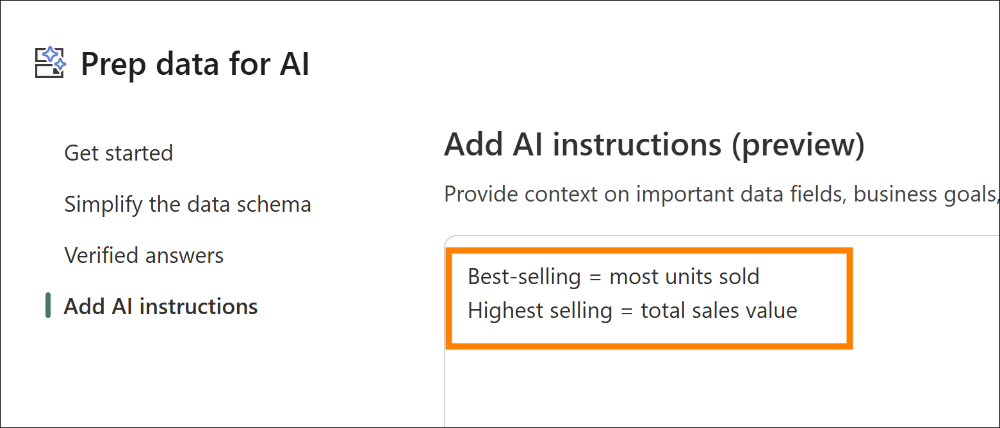

14. Click **Apply** & then **close**.

15. Close & reopen Copilot. Type **What’s our best-selling product**? in the prompt and hit enter.

    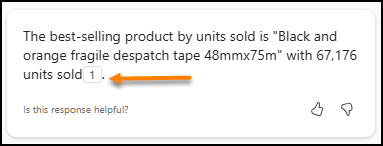

    Copilot now arrives at the answer we expect and can distinguish between **best-selling** and **highest selling**. As we mentioned at the beginning of this section. The more well-defined AI instructions you provide, the better Copilot will be!

    **ℹ️ Important**

    **Testing AI instructions will be faster in Power BI Desktop because there is no publishing delay.** For this reason, it's recommended to test and refine your instructions locally before publishing to the Service. Publishing introduces a delay and can sometimes cause confusion if changes aren't immediately reflected. Desktop offers a more responsive environment for iteration and debugging.

16. If you received the same answer as above, click on the reference to see where the results came from.

    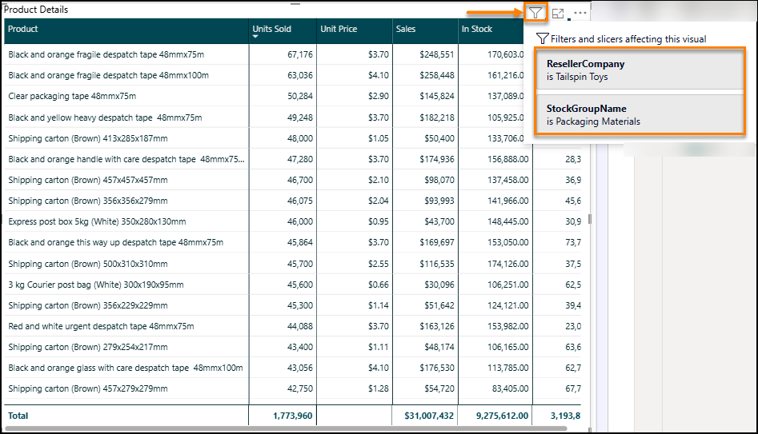

17. Your results may vary but notice how the results returned are coming from an existing visual, upon closer inspection, you will notice that this visual is actually filtered. This means that we have received a misleading response from Copilot. Specifically, we never asked for any filters in our request and Copilot did not specify that our result was filtered.

18. Go back into **Prep Data for AI** and navigate to the **AI Instructions**. Add the following instruction: *See screenshot below.*

    **If you use an existing report visual to answer a user request, always let the user know about any existing filters on the visual.**

    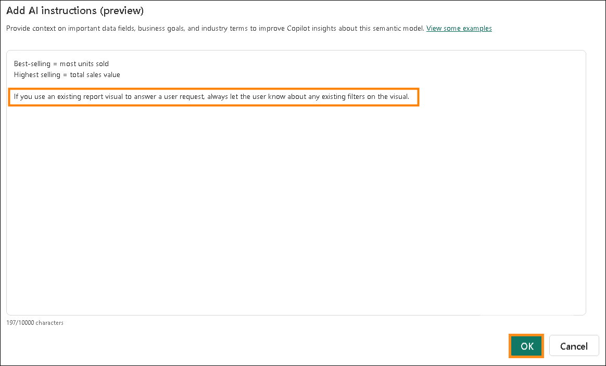

19. Close & reopen Copilot. Ask Copilot again: **What’s our best-selling product?**

    

20. Notice this time, we returned 1 different referenced visuals and Copilot correctly identified that the visuals had a filter on ResellerCompany for Tailspin Toys.

    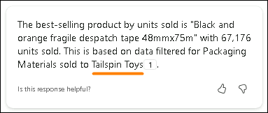

    **ℹ️ Important**

    It’s important to remember that the AI Instructions is a feature that is still in preview and changing quickly. Continue to explore different instructions and see what works and what doesn’t work!

21. As we roll out the Standalone Copilot experience to our end users, we want to build trust and one way to do that is to make sure that Copilot does not guess. One instruction we can add is to tell Copilot to never guess if it doesn’t know understand what is being asked.

22. Open up the **Prep data for AI** and add the following instructions then apply and close.

    - **Best-selling = most units sold**

    - **Highest selling = total sales value**

    **If you use an existing report visual to answer a user request, always let the user know about any existing filters on the visual.**

    **If you do not understand what is being asked, do NOT guess, instead ask for clarification.**

    - Copilot will now be more likely to ask clarifying questions.

    - Here is that AI instruction in action when Copilot is unsure!

    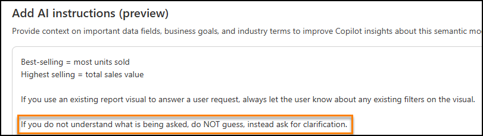

23. Open up Copilot again and ask the following confusing question: **Total sales by something what is that?**

    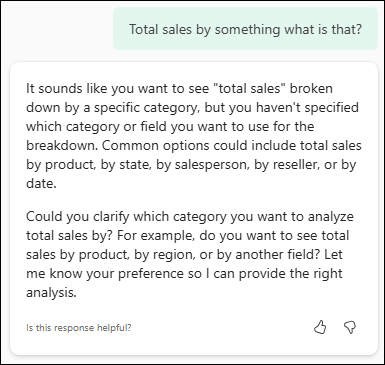

24. In this example, as seen in the screenshot above, Copilot is unsure of how you want to see total sales, therefore it asks you to clarify what you are looking for!

25. Another type of instruction we can add is report visual guidance. For example, if you want to see date always on a line chart, or you always want Copilot to return a matrix when looking at sales by country, then you can add these instructions.

26. Without adding AI Instructions then there is no guarantee what visual Copilot will return. For example, if we ask: **Show total sales measure by year**. we currently receive a line chart:

    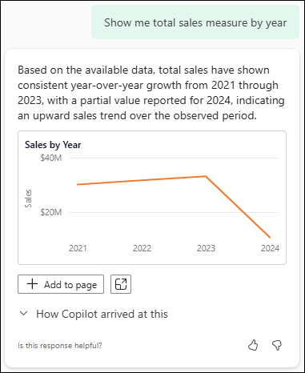

27. Now let’s add an AI Instruction and see what happens! Open up **Prep data for AI** and add the following instruction:

    **## Visual Guidance**

    **When showing the total sales measure by year always use a column chart.**

    **ℹ️ Important**

    When writing AI Instructions, the “##” is a Markdown language format not needed but a good practice for both Copilot and the Fabric Data Agent’s organization.

    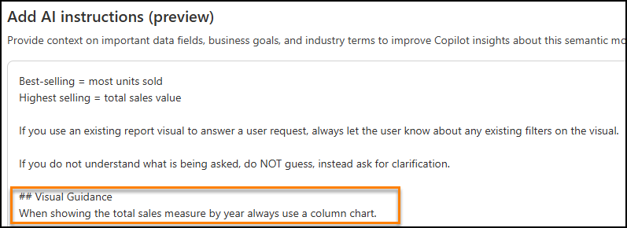

28. Open up Copilot again and ask the following question: **Show total sales measure by year.**

    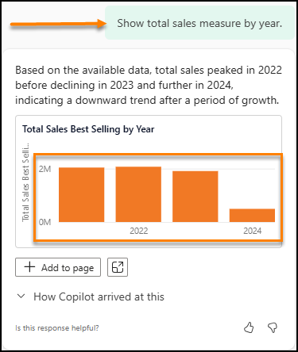

    Copilot may write DAX to arrive at the answer and display as a table. Remember, you can always prompt: **Can you make this into a column chart?** Or reword the **AI Instructions**.
    
    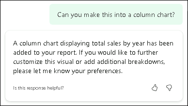

29. Let’s take a look at another example, this time measure definition. Return to the Copilot chat window and ask the following question: **How many purchase orders do we have?**

    

30. Notice the results are correct and if we expand the **How Copilot** **arrived at this** area, we even see it is using the explicit measure! If you remember, we created a Copilot assisted description for this exact Measure. But let’s ask for clarification on how the DAX is being calculated.

    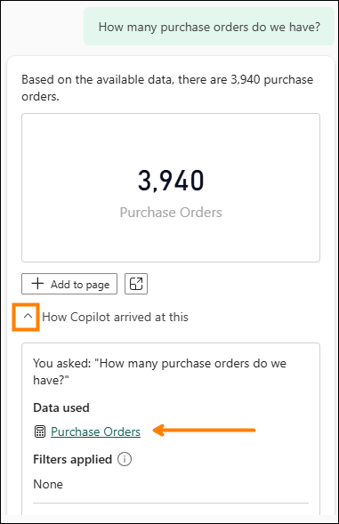

31. Ask the question: **Can you explain the DAX used?**

    

32. Our response is extremely interesting as it notes the limitation of Copilot to directly access our exact DAX formulas. The answer itself is highly *generative* in nature using works like “likely”, “if”, “typically” and “potentially”. This can ***sometimes*** be solved with the help of our TMDL view and AI Instructions!

    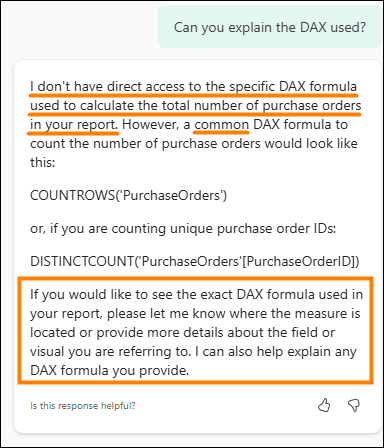

33. On your left navigation pane, select the **TMDL** view .

34. From the bottom of the screen, create a Script by pressing the “**+**” button.

    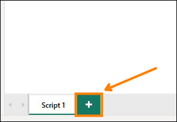

35. We are going to pull over a single Measure to help users get clarification on the DAX in our data model. Drag the **Purchase Orders** Measure into the Script.

    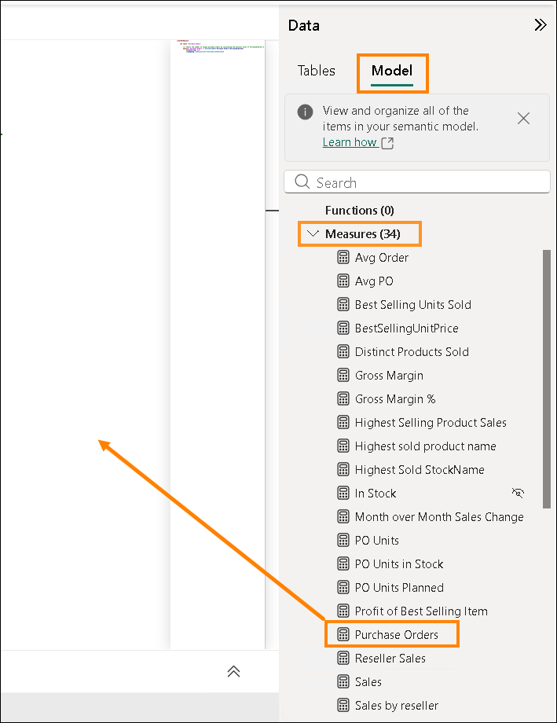

36. The resulting TMDL script is a great resource to add to our AI Instructions! We can see our description represented in this view as well. We now want to **copy** the measure description and the measure itself as shown:

    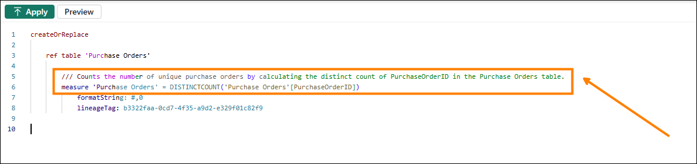

37. Now return to **Prep data for AI** at the **Report View** and add the TMDL description and measure details into the **Add AI Instructions** view as shown below. Then press **Apply**.

    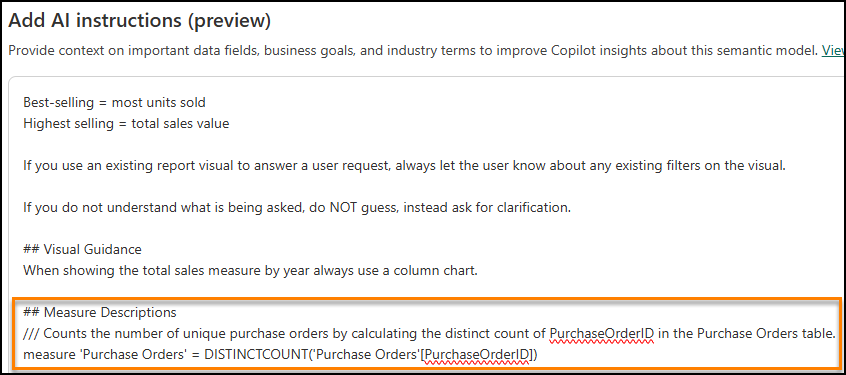

38. Reopen the Copilot pane to refresh the instructions and ask the same question as before: **How many purchase orders do we have?**

    

39. So far so good. This is the behavior we would expect but the moment we have been waiting for is our next question.

    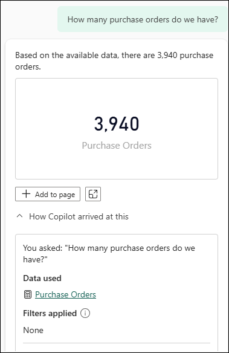

40. Now ask for clarification: **Can you explain the DAX used in the Purchase Orders measure?**

    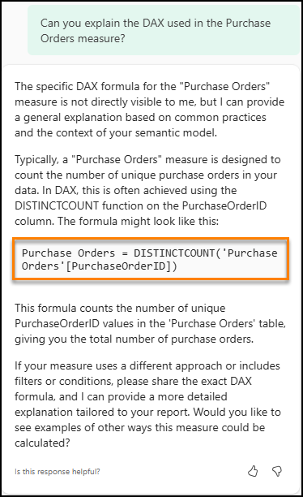

41. Unfortunately, Copilot is still guessing, although correctly at what the actual DAX code is. Add the DAX code into AI Instructions can work on occasion, but at this time, while still in preview, it is inconsistent!

42. Earlier in the labs, we asked for Total Sales for the Southeast. Copilot didn’t use the Sales Territory column in our Reseller table, instead, Copilot assumed which States represented the Southeast territory. In this section, we will add an AI Instruction to ensure that Copilot uses Sales Territory when asked about regions!

43. Open up **Prep data for AI** and add the following instruction:

    **## Clarifications**
    
    **If a user asks about region or territory related data, for example Southeast, use the Sales Territory column from the Reseller table.**

    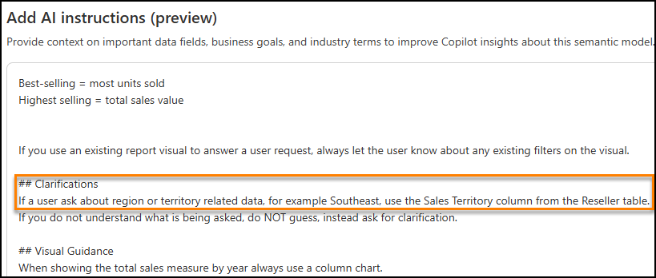

44. Open up Copilot and write the following prompt: **Show total sales for the Southeast.**

    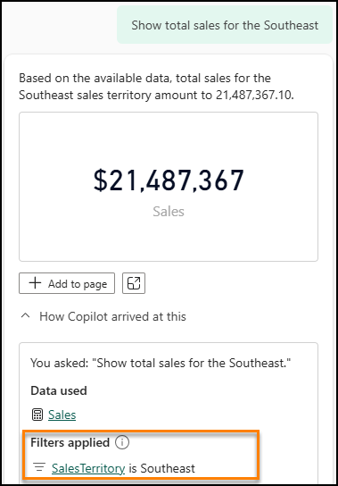

45. In the previous section, we removed the Customer table from the data schema.

    Within this organization, customers are defined specifically as resellers who purchase and then distribute our products. The end consumers purchasing from those resellers are not classified as customers. We need to make this distinct so that Copilot will return Resellers when asked about Customers.

46. Open up **Prep data for AI** and enter the following:

    **Customers = Resellers**

    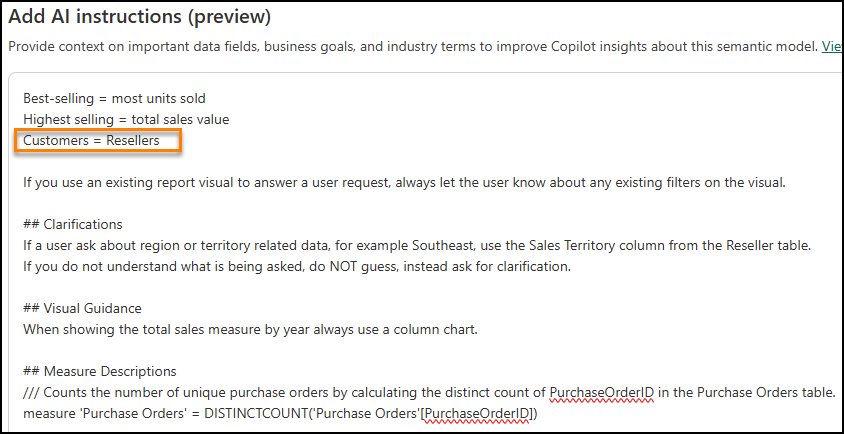

47. Open up Copilot and write the following prompt: **What customer sold the most products in 2021?**

    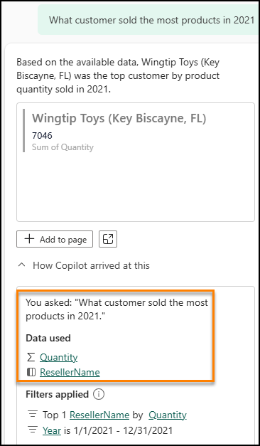

    This is also shown in the created DAX Calculation!

    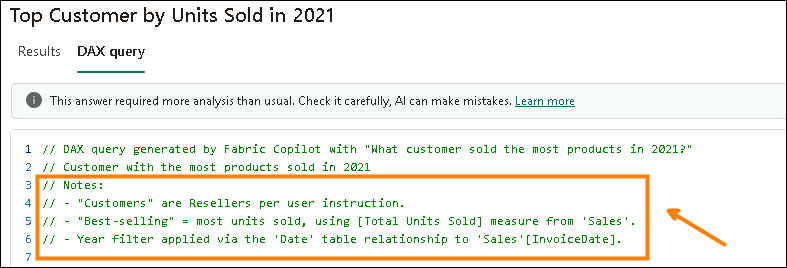

    Note that Copilot has correctly been instructed and is using Reseller to represent Customer.

## Task 3: Create verified answers

Let’s take our data preparation to the next level by adding verified answers. Verified answers allow the model author to select a visual and choose phrases, that when a user asks, will display that visual as a verified answer. Verified answers also help Copilot to learn context about your model and give more accurate answers even if the prompt doesn’t return an exact verified answer.

**ℹ️ Important**

Verified answers will match the phrase that you set to anything identified as semantically similar. For this reason, you do not need to set every possible variation of what phrase a user might ask. Instead set clear distinct trigger phrases that anything similar might trigger for the user.

1. For your first example, you will create a verified answer for **Top state for sales**.

2. Currently, if you ask Copilot, **What state has the most sales?** It doesn’t always interpret the question the way you intend. That’s because the word “sales” is referenced in several ways within the model and the report.

3. In this example, you will ensure that Copilot always returns the expected response.

4. This time we will **not** be starting in the prep data for AI dialog. If you open the verified answers tab in the Prep data for AI dialog, you’ll see that there is nothing available.

5. Instead, you will start with the visuals on your report.

6. Close the Prep data for AI window and navigate to the **Product detail** page.

    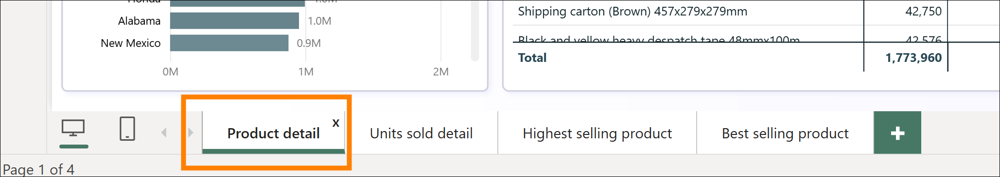

7. Click into the bar chart for sales by state and click the **ellipsis** (**…**) found in the top right corner.

    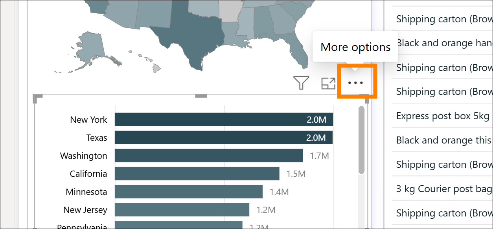

8. Choose **Set up a verified answer (preview)** from the drop down.

    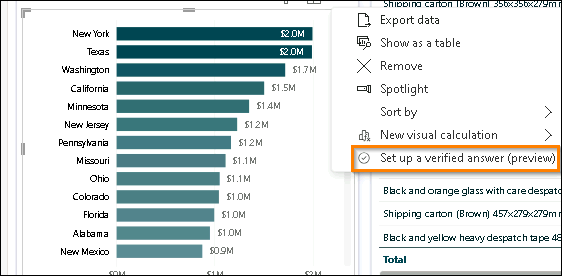

9. You can set a phrase by either selecting a Copilot suggestion, or by typing in your own custom phrase.

10. In the Enter a phrase box type: **State with the highest sales** and **click Add.** *See screenshot below.*

    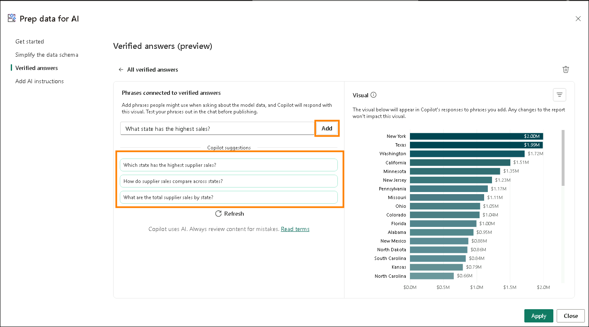

11. Click on **OK**.

    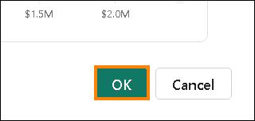

12. Close and reopen the Copilot pane.

13. Ask Copilot: **What state has the highest sales?**

    

14. Get a correct verified answer returned for the question.

    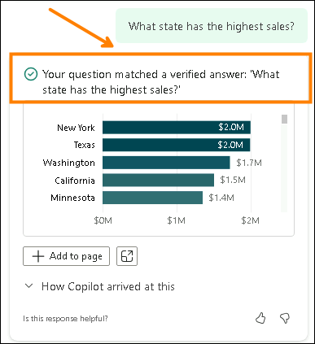

15. What about false positives? Let’s try a question that should NOT use our verified answer and see what happens. In Copilot, type in the following prompt **What state is selling the most of the highest selling product?**

    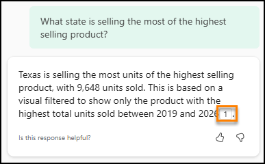

16. This is perfect! The response pointing out a different visual in our report. More specifically, it’s pointing to a visual that is filtered down to the top selling product. Also notice, the response is respecting our AI instruction from earlier and informing us of filters that are applied on the visual returned!

17. Let’s add another verified answer! This time we want to show **The best selling product.**

18. Click on **Best Selling Product** page.

    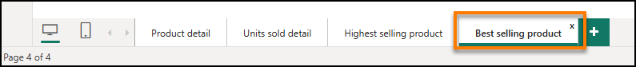

19. Next, find the card visual at the top, click the ellipsis **(…)** and select **Set up a verified answer (preview)**.

    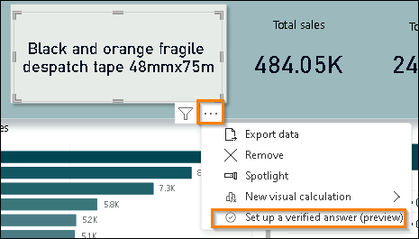

20. Earlier in the lab, we added AI Instructions to let the AI know that best selling is total units and highest selling is total sales value. We want to make sure that our verified answer phrases are correctly aligned with our AI instructions.

21. This time you will add two phrases, they may or may not show up in the Copilot suggestions. First, add a phrase for **Which Product has sold the most units?** Then click Add.

    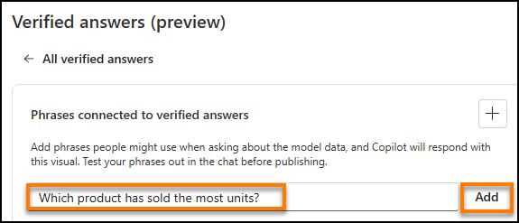

22. Click Apply.

    

23. Click the + icon next to the **Copilot Suggestions** to add an additional phrase. Add the phrase **What is the best-selling product?** Or **similar** then click Add.

    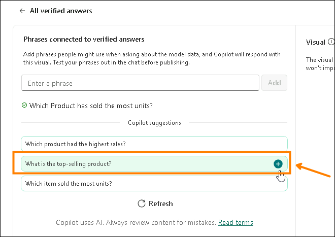

24. You now have both phrases connected to your report visual as seen in the screenshot below!

    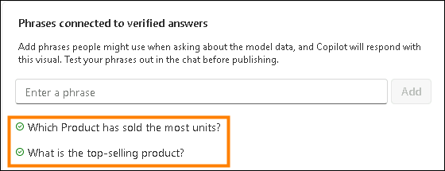

25. Click Apply and Close.

26. Congratulations! In this section you learned how to add verified answers to your report visuals. You also learned that you could add more than one phrase to connect user questions to an individual report visual!

## Task 4: Try it yourself

If lab time permits, continue to explore the **Prep Data for AI** features that you learned about in this lab.

1. Start by asking a question about Copilot that you would like to know. If the results are not what you wanted or expected. Think about how you can ensure the result you want by using simply the data schema, verified answers, or AI Instructions!

## Conclusion

Congratulations! You’ve completed the prep data for AI section of the lab!

# References

Chat With Your Data in a Day (CDIAD) introduces you to some of the key features when using standalone Copilot in a Fabric workspace.

In the menu of the service, the Help (?) section has links to some great resources. Keep in mind the view that you see is dependent upon what experience you are currently in and therefore your options may look different than the screenshot below.

Here are a few more resources that will help you with your next steps with Microsoft Fabric.

- Access all the information in the main [Microsoft Fabric Documentation](https://learn.microsoft.com/en-us/fabric/)

- Explore Fabric through the [Guided Tour](https://aka.ms/Fabric-GuidedTour)

- Sign up for the [Microsoft Fabric free trial](https://aka.ms/try-fabric)

- Visit the [Microsoft Fabric website](https://aka.ms/microsoft-fabric)

- Learn new skills by exploring the [Fabric Learning modules](https://aka.ms/learn-fabric)

- Read the [free e-book on getting started with Fabric](https://aka.ms/fabric-get-started-ebook)

- Join the [Fabric community](https://aka.ms/fabric-community) to post your questions, share your feedback, and learn from others

Read the more in-depth Copilot-relevant technical documentation:

- [Copilot for Power BI Overview - Power BI | Microsoft Learn](https://learn.microsoft.com/en-us/power-bi/create-reports/copilot-introduction)

- [Standalone Copilot Experience in Power BI (Preview) – Power BI | Microsoft Learn](https://learn.microsoft.com/en-us/power-bi/create-reports/copilot-chat-with-data-standalone)

- [Microsoft Fabric Copilot admin settings | Microsoft Learn](https://learn.microsoft.com/en-us/fabric/admin/service-admin-portal-copilot)

- [Fabric data agent creation (preview) - Learn how to create a Fabric data agent | Microsoft Learn](https://learn.microsoft.com/en-us/fabric/data-science/concept-data-agent)

- [Best practices for configuring your data agent - Microsoft Fabric | Microsoft Learn](https://learn.microsoft.com/en-us/fabric/data-science/data-agent-configuration-best-practices)

- [Copilot for Microsoft Fabric and Power BI: FAQ - Microsoft Fabric | Microsoft Learn](https://learn.microsoft.com/en-us/fabric/fundamentals/copilot-faq-fabric)

© 2026 Microsoft Corporation. All rights reserved.

By using this demo/lab, you agree to the following terms:

The technology/functionality described in this demo/lab is provided by Microsoft Corporation for purposes of obtaining your feedback and to provide you with a learning experience. You may only use the demo/lab to evaluate such technology features and functionality and provide feedback to Microsoft. You may not use it for any other purpose. You may not modify, copy, distribute, transmit, display, perform, reproduce, publish, license, create derivative works from, transfer, or sell this demo/lab or any portion thereof.

COPYING OR REPRODUCTION OF THE DEMO/LAB (OR ANY PORTION OF IT) TO ANY OTHER SERVER OR LOCATION FOR FURTHER REPRODUCTION OR REDISTRIBUTION IS EXPRESSLY PROHIBITED.

THIS DEMO/LAB PROVIDES CERTAIN SOFTWARE TECHNOLOGY/PRODUCT FEATURES AND FUNCTIONALITY, INCLUDING POTENTIAL NEW FEATURES AND CONCEPTS, IN A SIMULATED ENVIRONMENT WITHOUT COMPLEX SET-UP OR INSTALLATION FOR THE PURPOSE DESCRIBED ABOVE. THE TECHNOLOGY/CONCEPTS REPRESENTED IN THIS DEMO/LAB MAY NOT REPRESENT FULL FEATURE FUNCTIONALITY AND MAY NOT WORK THE WAY A FINAL VERSION MAY WORK. WE ALSO MAY NOT RELEASE A FINAL VERSION OF SUCH FEATURES OR CONCEPTS. YOUR EXPERIENCE WITH USING SUCH FEATURES AND FUNCITONALITY IN A PHYSICAL ENVIRONMENT MAY ALSO BE DIFFERENT.

**FEEDBACK**. If you give feedback about the technology features, functionality and/or concepts described in this demo/lab to Microsoft, you give to Microsoft, without charge, the right to use, share and commercialize your feedback in any way and for any purpose. You also give to third parties, without charge, any patent rights needed for their products, technologies and services to use or interface with any specific parts of a Microsoft software or service that includes the feedback. You will not give feedback that is subject to a license that requires Microsoft to license its software or documentation to third parties because we include your feedback in them. These rights survive this agreement.

MICROSOFT CORPORATION HEREBY DISCLAIMS ALL WARRANTIES AND CONDITIONS WITH REGARD TO THE DEMO/LAB, INCLUDING ALL WARRANTIES AND CONDITIONS OF MERCHANTABILITY, WHETHER EXPRESS, IMPLIED OR STATUTORY, FITNESS FOR A PARTICULAR PURPOSE, TITLE AND NON-INFRINGEMENT. MICROSOFT DOES NOT MAKE ANY ASSURANCES OR REPRESENTATIONS WITH REGARD TO THE ACCURACY OF THE RESULTS, OUTPUT THAT DERIVES FROM USE OF DEMO/ LAB, OR SUITABILITY OF THE INFORMATION CONTAINED IN THE DEMO/LAB FOR ANY PURPOSE.

**DISCLAIMER**

This demo/lab contains only a portion of new features and enhancements in Microsoft Power BI. Some of the features might change in future releases of the product. In this demo/lab, you will learn about some, but not all, new features.
