# Microsoft Fabric Chat with your Data in a Day - Lab 4

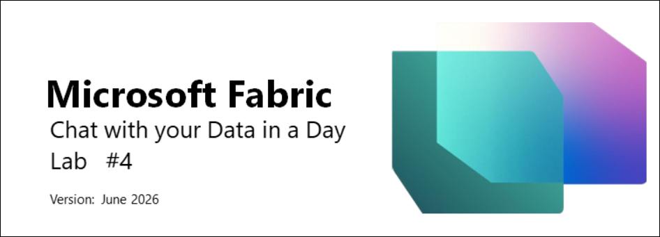

## Contents

- Document Structure
- Scenario / Problem Statement
- Introduction
- Standalone Copilot Experience
- Setup: Workspace setup for later labs
  - Task 1: Exploring the standalone Copilot experience
  - Task 2: Writing a prompt in Standalone Copilot
  - Task 3: Exploring the view in report capability
  - Task 4: Explorations
  - Task 5: Verified Answers
  - Task 6: How Copilot arrived at this (HCAAT)
  - Task 7: A data answer from a DAX Query generated by Copilot
  - Task 8: Context switching in Copilot
  - Task 9: Copilot construction of a visual from the Semantic Model
  - Task 10: General Copilot experience
- References

# Document Structure

The lab includes steps for the user to follow along with associated screenshots that provide visual aid. In each screenshot, sections are highlighted with orange boxes to indicate the area(s) user should focus on.

# Scenario / Problem Statement

Congratulations on making this far. You now know how to implement generally accepted best practices in your data model and how to use the Prep your data for AI functionality. Now it’s time to explore the Standalone Copilot experience within Microsoft Fabric.

Your organization, like many others, has hundreds of reports and semantic models across dozens of workspaces. Finding the right report or data has been challenging for the end users. You want to leverage the Standalone Copilot experience to increase user adoption and gain faster time to insights across the organization.

**Current Challenges**

- **Fragment discover experience:** Users struggle to find the correct data, reports, apps, and data agents across the Fabric environment.

- **Low Adoption**: The volume of reports and required training creates friction, making it hard to drive user buy-in and adoption.

- **Delayed decision making:** Time to insights remains slow due to navigation hurdles and limited self-service capabilities.

# Introduction

In previous labs, you’ve learned how to prepare your semantic model for optimizing the AI Experience. In this lab you will take advantage of all that hard work and explore how Copilot in Microsoft Fabric can help accelerate time to insights within your organization.

# Standalone Copilot Experience

In this section, you will explore the Standalone Copilot experience in Fabric and discover all the cool ways that you can chat with your data. By the end of this lab will have a much better understanding of how you can leverage the standalone Copilot experience to get faster time to insights, more specifically, you will learn:

- How to make the most of the standalone Copilot experience

- How to understand the reports, visuals, and data responses returned.

- How to validate “how Copilot arrived at this (HCAAT)”

- How to create and modify explorations, which can be shared.

- How to leverage features from Prep Data for AI, like verified answers

- How to identify friction responses

- How to leverage the general Copilot experience

**ℹ️ Important**

The standalone Copilot experience highlighted in these labs does NOT keep a chat history. If you click away from the Copilot experience, your conversation will be lost. This differs from the M365 Copilot Chat experience.

## Setup: Workspace setup for later labs

In this lab and later labs, you will need your own workspace in order to edit and save items in Fabric. In this setup section, you will create a workspace and assign a Fabric Capacity to that workspace so you can perform specific tasks without impacting other lab attendees.

1. Open up a web browser in the Virtual Machine and navigate to Fabric portal using below link

    ```
     https://fabric.microsoft.com/
     ```

2. If prompted, login to Fabric using the credentials provided to you in the workshop.

    - **Username/Email:** <inject key="AzureAdUserEmail"></inject>

    - **Password:** <inject key="AzureAdUserPassword"></inject> 

3. Select **Workspaces** from the left navigation pane.

    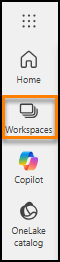

4. At the Workspaces pane, click your **Fabrikam_Lab_<inject key="DeploymentID" enableCopy="false"/>** Workspace.

    

    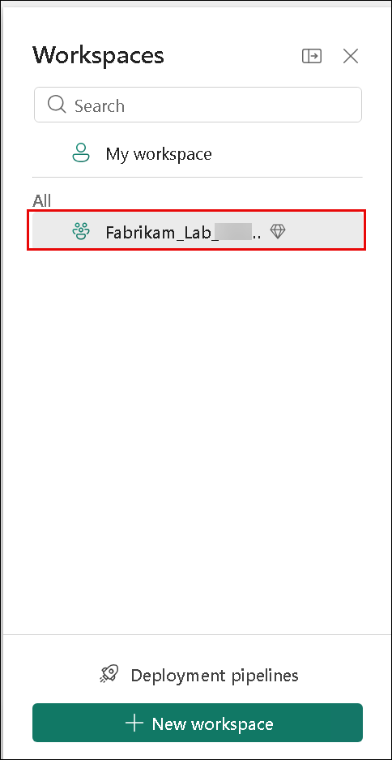

5. We now need to ensure your individual license can publish to the Fabric enabled Workspace. Select the **person (1)** icon in the top right corner and click **Free Trial (2)** dropdown and select **Fabric and Power BI (3)**

    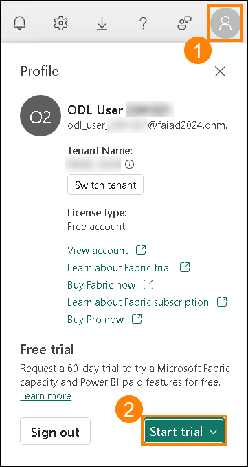

    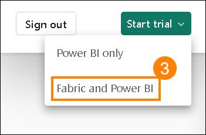

6. Simply click **Activate** to enable publishing to the Workspace.
    
    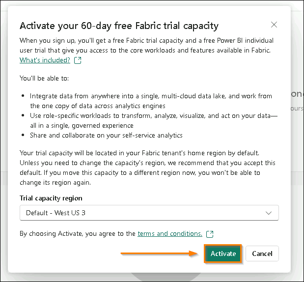
    
    Click **Okay**.
    
    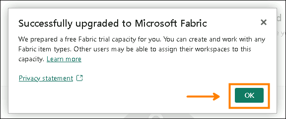

7. Next, you will need to **publish** the completed PBIX from your class files.

8. From your class files open up the file named **Fabrikam Company Sales Report.pbix**.

    

9. Once opened, make sure you are logged into your assigned user account for the CDIAD Workshop.

10. Click Publish, find the workspace you just created **Fabrikam_Lab_<inject key="DeploymentID" enableCopy="false"/>**.
Click **Got it** on next popup.

    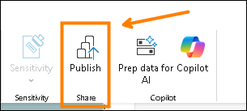

    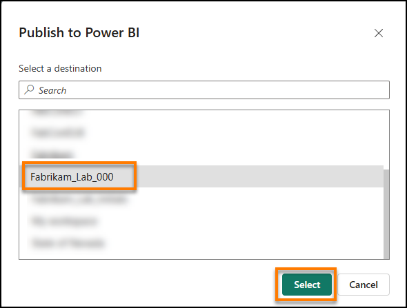

    >**Note:** If prompted to save changes , Click **Save**

    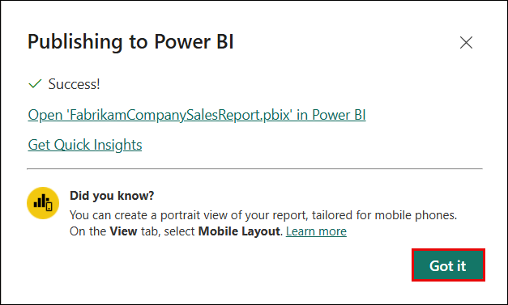

## Task 1: Exploring the standalone Copilot experience

1. Open the web browser and select Copilot from the left navigation pane.

    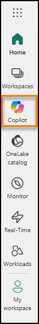

2. If you receive a prompt on the next screen, Click on **Get started**. Copilot will select a workspace based on a **Copilot capacity** that the user has access to. This selection will depend on whether the workspace has available **Capacity Units (CU)**. If the user is assigned to a **Fabric Capacity Configuration (FCC)**, then that capacity will be used instead.

3. Welcome to the Standalone Copilot experience! On this startup screen you will see a section at the bottom where you can write out your request **(1)** receive some prompt ideas across the bottom **(2)**.

    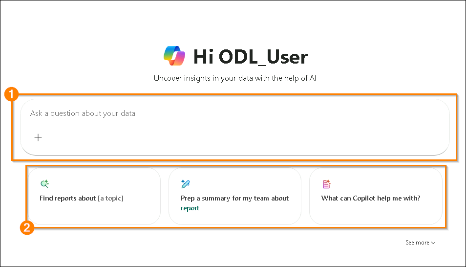

## Task 2: Writing a prompt in Standalone Copilot

In this section, you will write various prompts and explore the results returned by the Copilot experience.

1. Click into the prompt and write out the following: **Find reports about Fabrikam’s sales trends for the year**. Then click **Enter**.

    

    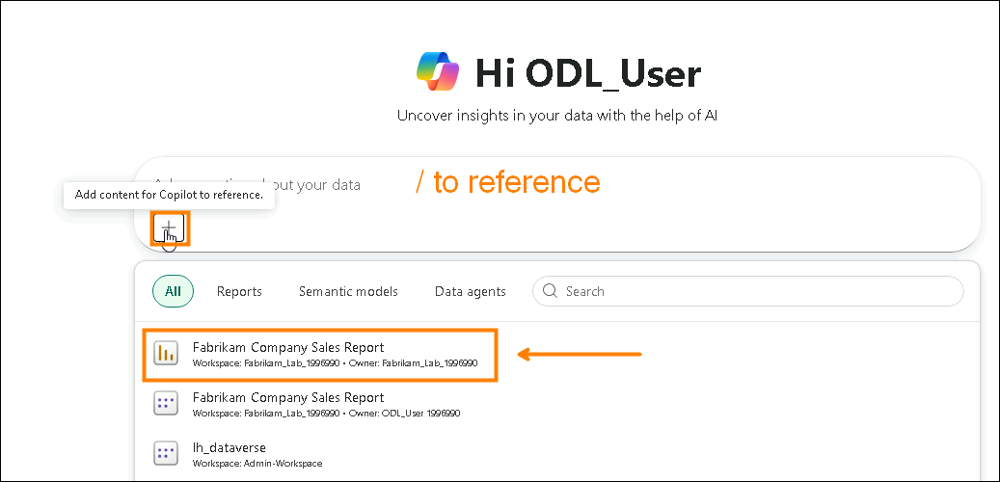
    
    <strong>ℹ️ Important</strong>

    AI returns non-deterministic results due to many factors. As discussed previously in this class, your results may vary and may not be identical to the labs. Please proceed and explore the capabilities and features being displayed to the best of your ability!

    You can easily use the **/** to reference the file or the **+**. This can be helpful as it will take some time for Copilot to internalize the published content completely.

    **If you do not** get the correct Report to showcase, this is because we need to generally check few things:

    1. Within the Power BI service setting, select Fabric Admin Portal, we want to ensure that we have checked our Copilot related settings. One of these is **Only show approved items in the standalone Copilot in Power BI experience.** By selecting this feature, only items approved for Copilot will be shown unless it is manually attached/ referenced. This is already enabled by default in our tenant.

        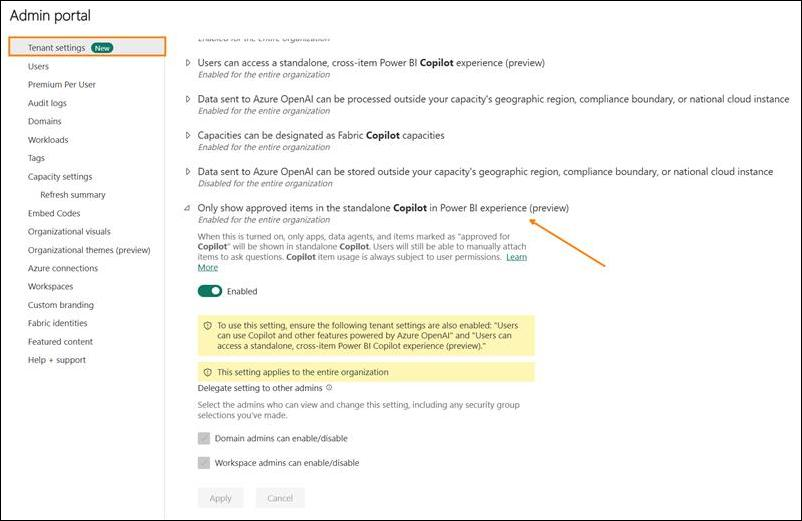

    2. Optionally, we can approve the Semantic model for Copilot by selecting the model in our workspace.

        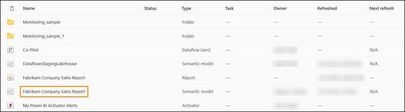

    3. By selecting **Prep data for AI** you will open up the Prep data for AI window.

        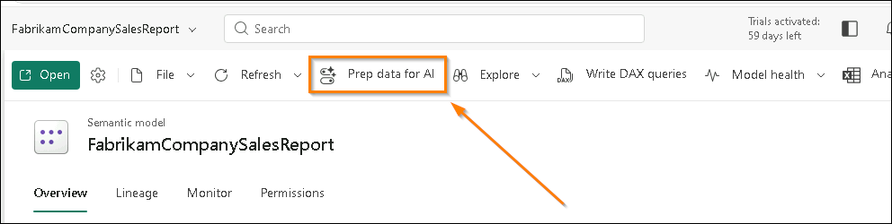

        To be searchable without a manual reference, we will need to turn on large model storage.
      
        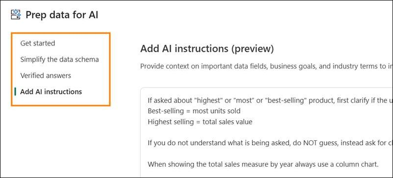

        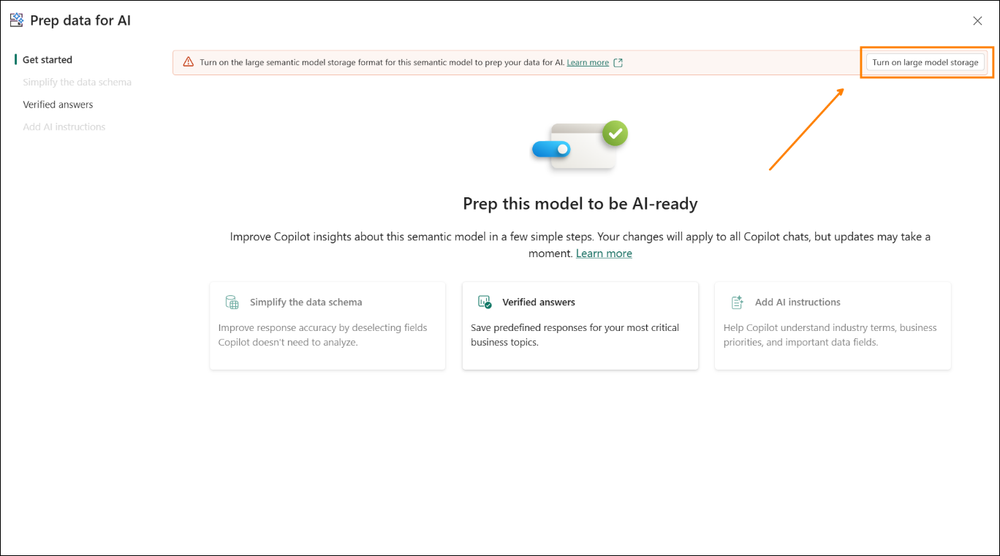

        From here, you can see and adjust your Prep data for AI work.

2. Click on the report returned in your search results, **Fabrikam Company Sales Report**. This will open a new tab in your web browser, taking you directly to that report.

    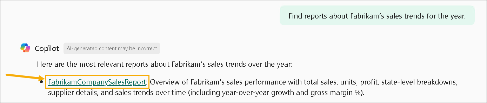

    

    > Note: If you encounter the **"Move this dataset to its original region"** error, switch to the Fabric portal by selecting it from the bottom-left corner of the navigation pane, and then continue with the lab.

    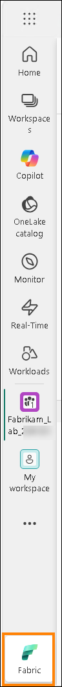 

3. Take a moment to **explore** this report and familiarize yourself with it!

    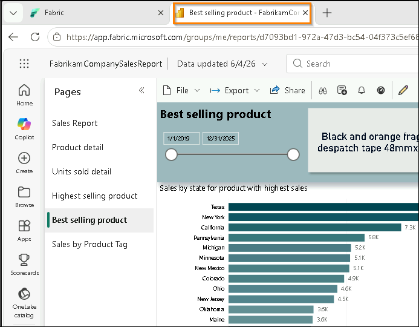

4. Once you’re done exploring the report. Click the (x) on the browser tab to close this tab and go back to your Copilot experience.

5. Click on the pre-generated prompt at the bottom of the page or enter the prompt: **Give me an overview of 1. Fabrikam Company Sales**:

    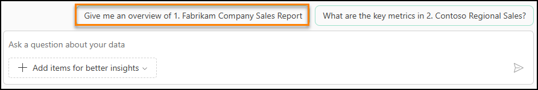

6. Telling Copilot to give you an overview of the report will provide the following information, as seen in the screenshot below. **Reminder: Your screen and results will have slight differences!!**

    1. Copilot will return report visuals from the existing report providing an overview.

    2. Copilot will provide a narrative description on each visual returned.

        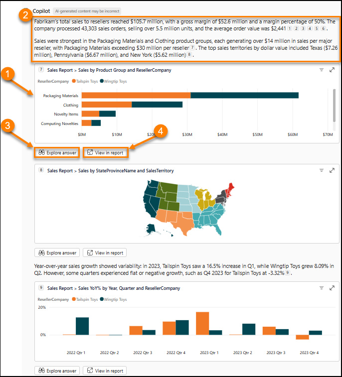

## Task 3: Exploring the view in report capability

Copilot can return various types of responses depending upon the questions asked and the preparedness of the underlying data. In this section, you will explore the **View in report** feature. This feature is returned whenever Copilot uses an existing visual from a report to answer your question.

1. Next, you are going to take a look at the option to **View in report**, this option will open up the current report with the specified visual spotlighted.

2. From any of the visualizations presented, click on **View in report**, this will open a new tab in your web browser. *See screenshot below*.

    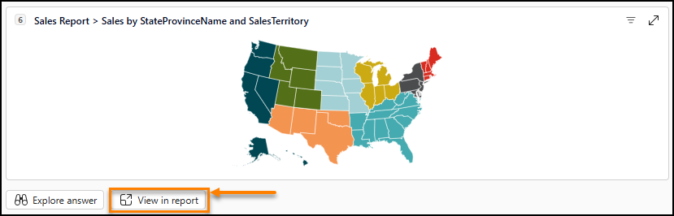

3. In the new report page, you will see the Copilot selected visual within the original report. You will also notice that the other visuals have been temporarily greyed out, this is because the visual you selected has been **spotlighted**. Click anywhere in the report to activate the report and explore! Once you’re done exploring, close this tab in your web browser and go back to the Standalone Copilot experience.

    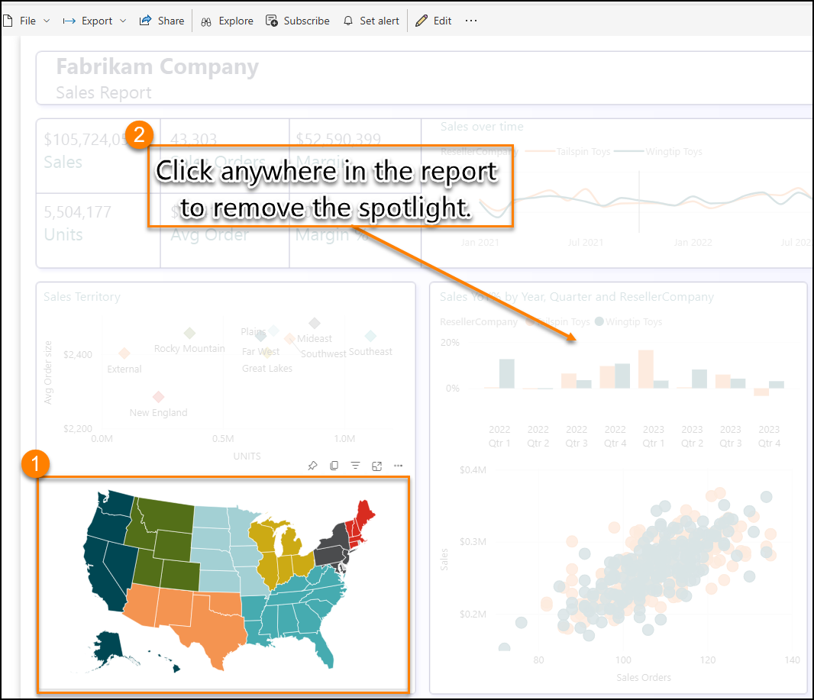

## Task 4: Explorations

Another feature presented by the Copilot experience is the ability to **Explore answer**. This ability to explore an answer is an awesome way to continue to refine your Copilot experience. In this section, you will learn how to use explorations, edit them, save and share them!

**ℹ️ Note**

Explorations are used primarily as tools for ad-hoc analysis of existing data and visuals on reports. Although explorations can be saved, they will often simply be closed after the ad-hoc analysis has been completed.

1. You should now be back in your Standalone Copilot experience. Click on **Explore answer** below any of the visualizations in Copilot, which one you choose does not matter for this example.

    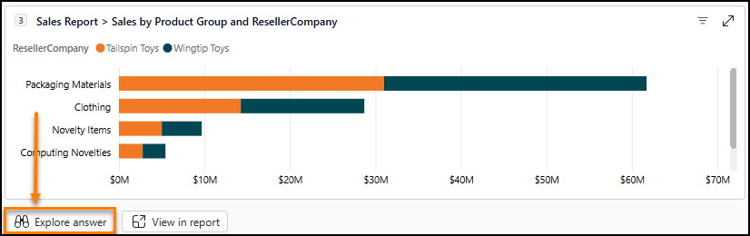

2. Clicking this button has now opened a new screen. Let’s explore **explorations!**

    - (1) Save the exploration as a report or as an exploration.

    - (2) Open in a new browser tab.

    - (3) Share

    - (4) View in Matrix format

    - (5) Change the visualization type

    - (6) Change the columns/measures of the visual

    - (7) Expand/Collapse view

        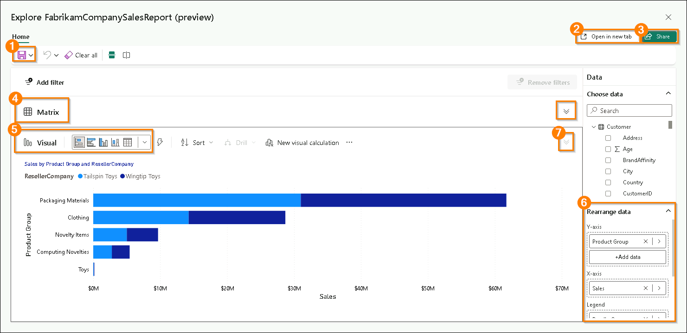

3. Click on the drop-down icon next to the Save button, this will provide a few options:

    - First, you can save this as an exploration, this is an object type in your workspace.

    - Next, you can save a copy. This option appears if the exploration has been previously saved.

    - Lastly, you can save this as a report.

        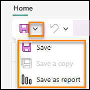

4. If you completed the setup earlier in this lab, you can now save this exploration. Select **Save** from the drop down. You will now receive a pop up for **Save this exploration**, choose the workspace you created during the setup and hit **Save**.

    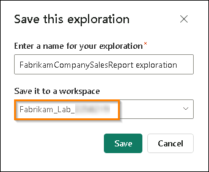

5. In the screenshot below, you can see an **example** of how explorations will appear in your workspace after being saved:

    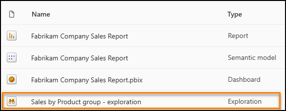

6. You can also share your exploration with others, you can only share your exploration if you first save it to a workspace!

7. Back in your workspace, find the exploration and click on the share icon. You will receive a pop up that lets you share this exploration by link, email or teams! Note. **We are not sharing explorations in this workshop, please close this box and proceed to the next step!**

    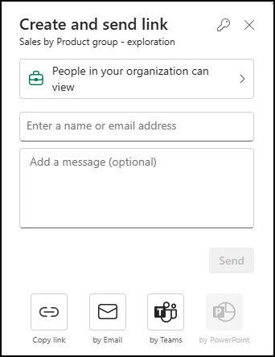

8. Take some time to open the exploration and explore other features!

    - Change the visual type

    - Change the columns and measures being displayed

9. Once you’re done exploring, click the **X** in the top right corner to close out your exploration.

    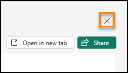

## Task 5: Verified Answers

Earlier in the class, you spent time prepping your data model for AI. Part of preparing your data for AI is creating verified answers. Verified answers ensure that certain visualizations are returned when questions are asked in Copilot. This provides a more curated and consistent experience for the end user while also ensuring accuracy, consistency and trust across the reports!

1. For this next session, you will also learn how you can further improve the prompt experience by adding items for better insights. By explicitly attaching an item, Copilot can narrow down the scope of work providing much clearer and concise results. You can currently attach three items to the prompt with a fourth coming soon:

    - Reports

    - Semantic Models

    - Data Agents

    - Apps (coming soon)

2. Click on **+ Add content for Copilot to reference**, found in the bottom left corner of the prompt.

    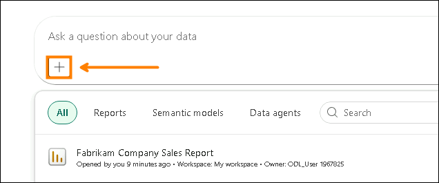

3. Select **Reports** from the listed options. Then select **Fabrikam Company Sales Report**. Click **Confirm**.

    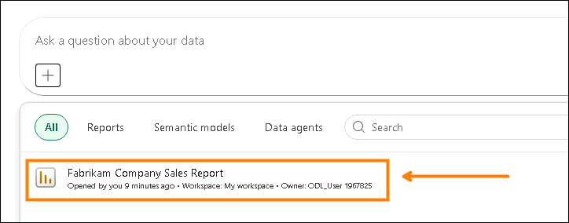

4. This report now shows up as linked in your Copilot prompt! Next, complete the prompt by typing **What is our best selling product?**

    

5. You should receive the following from this prompt. If a verified answer was used in the response, a notification will appear above the answer. *See screenshot below*.

6. You will also be provided with an option to view the report and explore the data.

    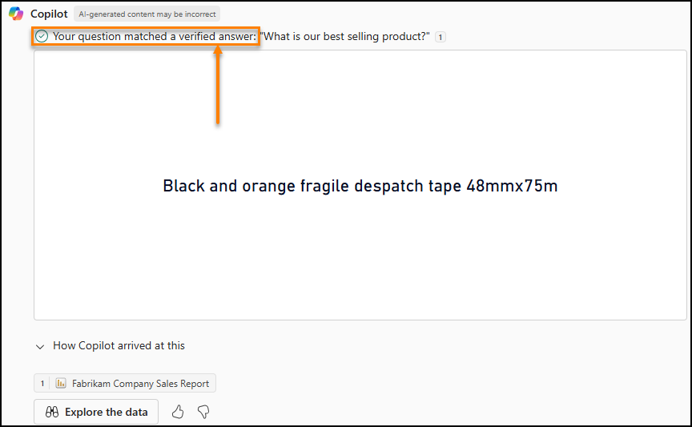

## Task 6: How Copilot arrived at this (HCAAT)

Sometimes Copilot doesn’t just deliver an answer, it explains how it got there. This provides a behind the scenes glimpse into the logic, filters, measures and more that shaped the response. More specifically, this is known as HCAAT or How Copilot arrived at this. These insights are more than just helpful, they empower you to validate results, build trust in the output and deepen your understanding of the underlying model. When this happens, it can be very insightful and offer a way to validate the results.

1. Below your verified answer, click **How Copilot arrived at this**.

2. You will see the question you asked, the data used to answer the question and any filters that were applied.

    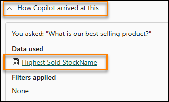

3. HCAAT can return different results based on how it arrived at the results. Let’s take a look at another example.

4. In the Copilot prompt, attach the **Fabrikam Company Sales Report** and then type out the following: **return all customers that make up the top 1% of total sales.**

    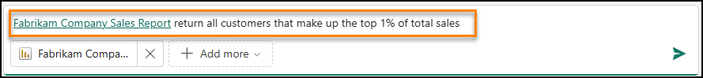

5. Let’s review the results.

    - (1) First, we get a response that the answer required more analysis than usual. This is a DAX generated result from Copilot. Make sure to check the code! It may also show the data is not fully approved since it is DAX generated.

        

    - (2) The table displaying the results. The results look great. Notice that even though we asked for Customers we are getting Resellers. This is because when we prepped our data for AI, we removed the Customer table, and we used a synonym for Reseller.

    - (3) How Copilot arrived at this

    - (4) The Fabrikam Sales Report

    - (5) The DAX Query that was generated by Copilot to arrive at the results

        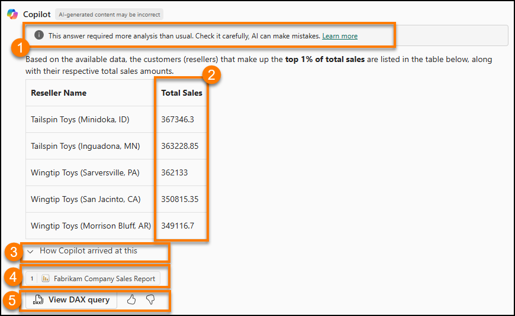

10. First, let’s explore HCAAT. Click on **How Copilot arrived at this** to expand the description.

11. This time the result we get is much different than before. You will receive a narrative description explaining how Copilot arrived at this response.

    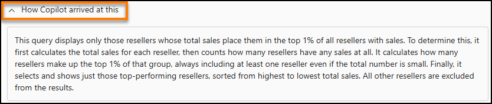

    In this section you learned that Copilot will sometimes share how it arrived at a specific answer. The way that Copilot shares or displays this information can vary based on process that Copilot used to return the response!

## Task 7: A data answer from a DAX Query generated by Copilot

In the previous example, Copilot generated a DAX Query by looking at the underlying data in the Semantic model. Furthermore, Copilot warned you to check the results for accuracy! Let’s dive further into the response.

1. Looking at the results in the screenshot above, you can see that total sales are repeated for each customer (remember that we created a synonym making Resellername = Customers). This is usually an indication that there is not a valid relationship between the tables that are part of the response we are getting.

2. Click on **View DAX Query**.

    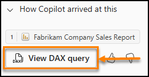

3. This will provide a popup dialog box that shows the generated DAX Query along with inline comments of how the solution arrived at this answer. Near the bottom you will see the description of how Copilot arrived at this result. Finally, at the bottom of the popup you have two options you can perform.

    - Run Query – This will take the current DAX and open it up in the DAX Query View

    - Copy Query – This option will copy the DAX to your clipboard

        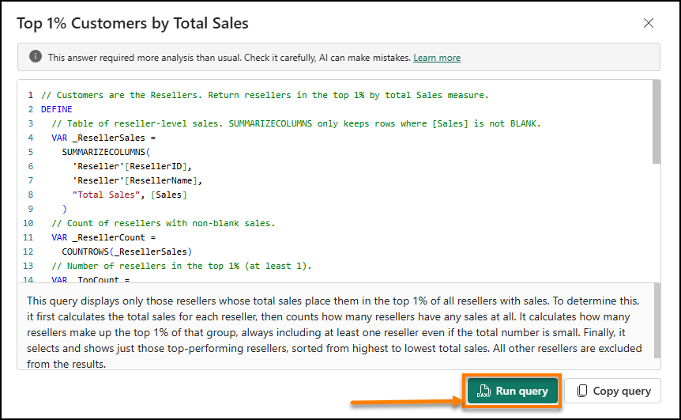

4. Click **Run query**. A new tab will open in your web browser to the DAX Query view on your Fabrikam Company Semantic Model.

    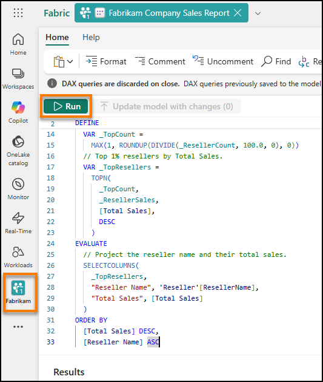

5. Click **Run** to see the results here in the DAX Query View. The results here are the same results we received from Copilot. If you are familiar with DAX language, you could modify the DAX expression to refine your results further.

    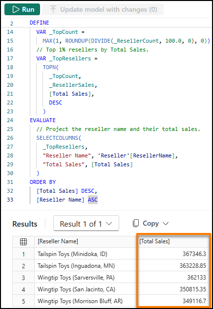

6. This appears to be a great response by Copilot, and all our Prep has paid off. If I open back up Power BI desktop and build a quick visual, I can quickly verify the response from Copilot is correct!

    

7. The other thing to point out here is that you also have access to see the model view. From here you can validate the tables and relationships in the semantic model.

    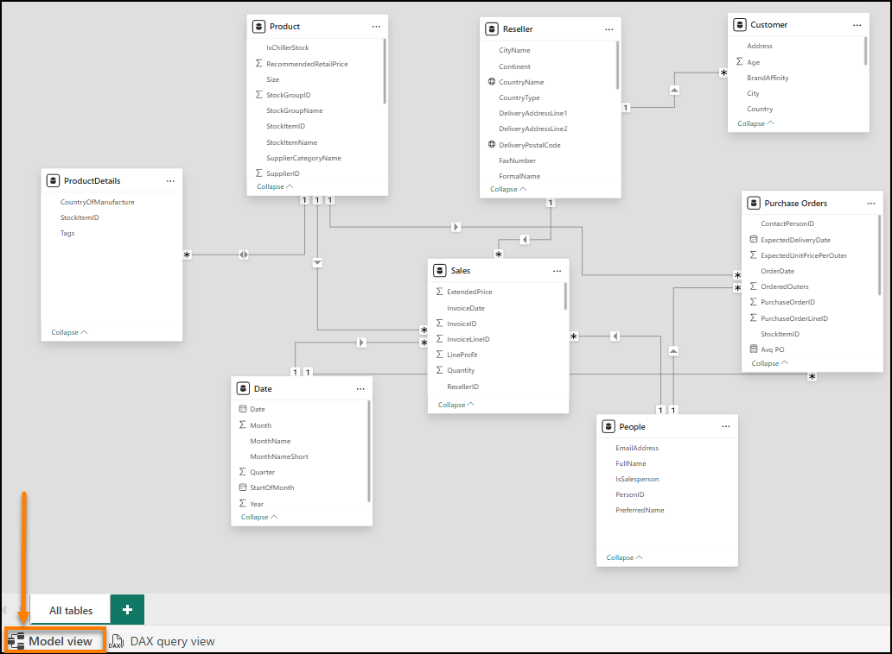

    In this lab you learned that you could view the DAX generated by Copilot, you could launch the DAX Query view and modify the existing code and even go into the model view and verify the relationships.

    **ℹ️ Important**

    The chat with your data experience in an extremely useful tool that will significantly improve the time to insights for corporations around the world. However, these results can also be incorrect or misleading. It’s very important to stop and validate the results as we saw in this lab!

## Task 8: Context switching in Copilot

So far in this workshop your focus has been solely on the Fabrikam Company Sales data. However, our organization has many different reports across many workspaces, and the Standalone Copilot experience will reference all the reports that it has access to.

1. Navigate to your class files and open up the **State of Nevada COVID-19Dashboard.**

    

2. Publish this fully finished report to your **Fabrikam_lab_<inject key="DeploymentID" enableCopy="false"/>**

    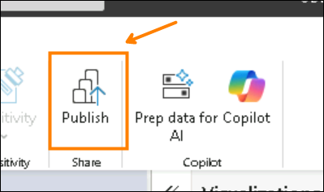

    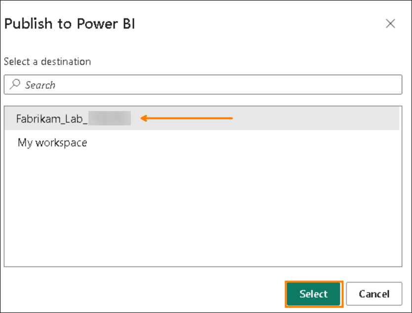

3. You will now be able to query this semantic model and report in the Standalone Copilot Experience. In your Copilot prompt, type the following: **How many confirmed cases have there been?** Make sure to use **the + button (1), semantic model (2),** and **StateofNevadaCOVID-19Dashboard (3)** if it is not immediately included. We purposefully provided a very generic prompt, and Copilot was able to figure out what you wanted based on the contents of the report! Remember, beneath the report provided, Copilot lets you know the criteria that it matches on.

    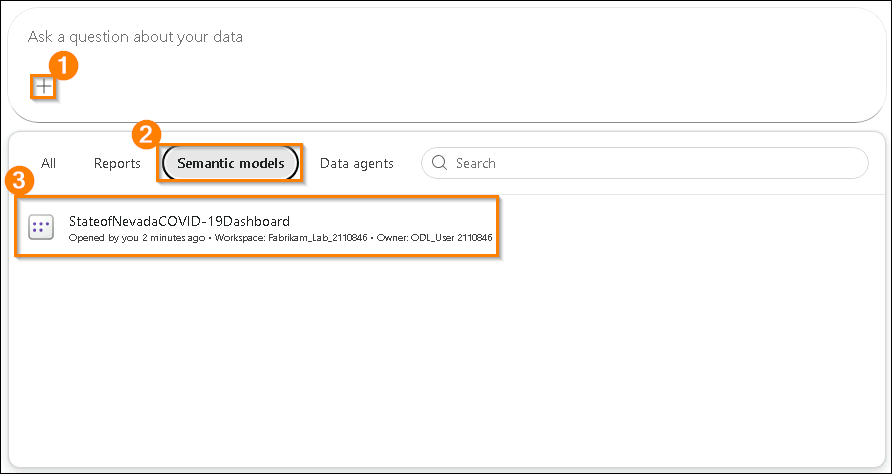

4. Perfect! Copilot now answers our questions by returning a visual from the underlying report. Remember that you can get multiple different display outputs from Copilot.

    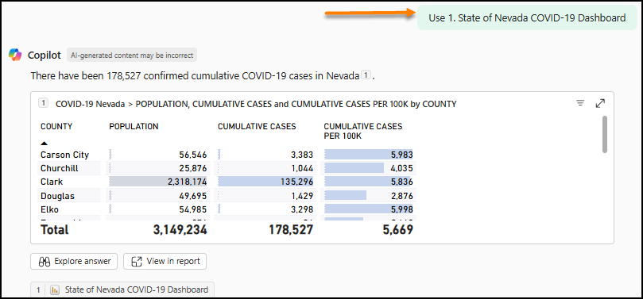

    OR

    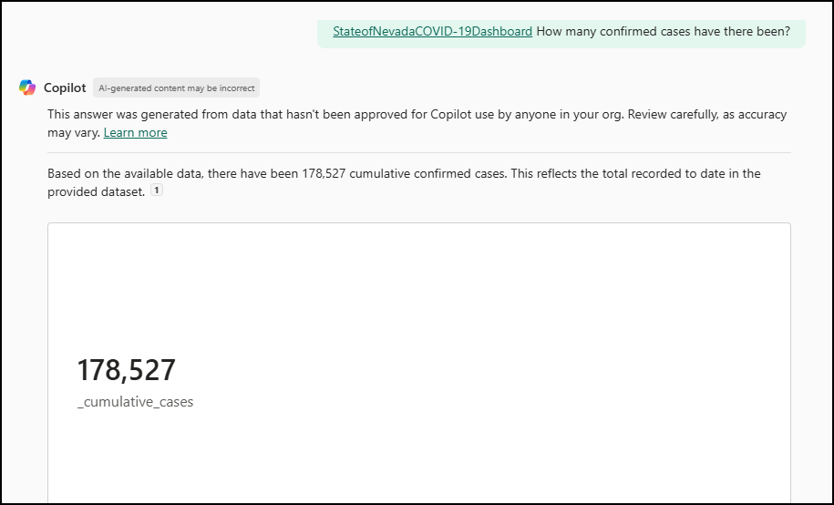

5. Ask another question of the data, in the prompt type: **How many deaths were there in Carson City in 2019?**

    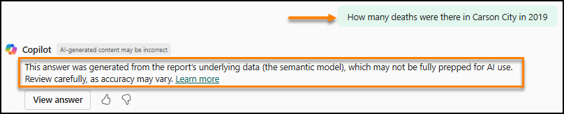

6. This time Copilot did not find an existing visual that it could return and as a result, Copilot generated an answer from the report’s underlying data. When this happens, on a model that is not marked as Prepped for AI, you receive a **friction response**.

    **ℹ️ Important**

    A friction response is a system -generated warning or limitation that appears when Copilot encounters an unprepared or poorly described data model. Copilot is essentially saying, I can try to help with the information available, however, the results should be validated!

    To reduce friction responses from Copilot, make sure to Prep your semantic models for AI and then mark the semantic model as Prepped for AI after publishing. See the Tenant Settings guidance document provided in your lab files.

## Task 9: Copilot construction of a visual from the Semantic Model

In previous labs, you observed Copilot returning visualizations to answer specific questions. These visualizations were visuals that already existed within our reports. In this section, you will see how Copilot can also construct visualizations from the semantic model to answer requests.

1. If you’re not in Copilot already, navigate back to Copilot in Fabric.

2. In your prompt, attach your **Fabrikam Company Sales Report** and then type the following: **Show me units sold over time**.

    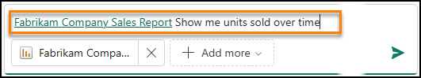

3. The visualization returned is not a visual that previously existed within the report. This is a visualization that was created by Copilot based on the Semantic model! In fact, unlike visuals that come from a report directly, this answer generated by Copilot comes with a HCAAT explanation, *How Copilot arrived at this*.

    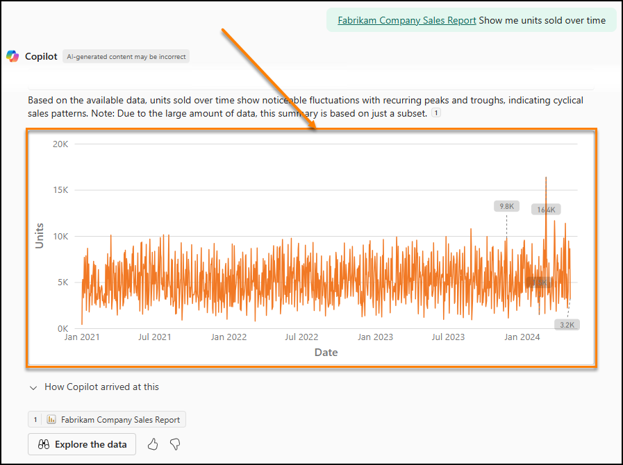

4. Let’s explore the results, click on **How Copilot arrived at this**.

    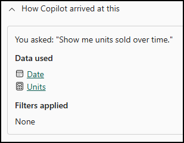

## Task 10: General Copilot experience

In this lab, you learned about how to leverage the Standalone Copilot experience in Microsoft Fabric to explore your existing reports and semantic models. However, you can also leverage the general Copilot experience. In this lab, we will leverage Copilot to construct an email on our findings!

1. In your Copilot prompt, type **Take the conversation so far and turn it into an email to share with the team**.

    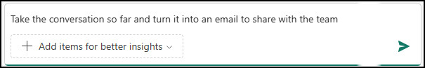

2. The results are pretty cool! As a reminder, your response will look vastly different than the screenshot. It’s also important to remember that the response is based on your current open chat with Copilot, if you cleared the chat or have very little conversation history then that will impact the final results.

    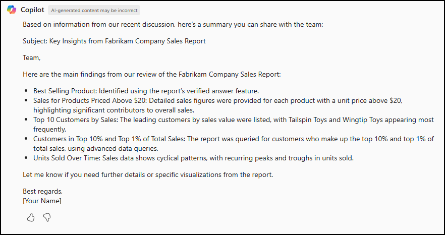

3. This is good, but it would be a lot better if we had some visualizations and links in the email. In your Copilot prompt, ask Copilot to **Add visuals and links to the email**.

    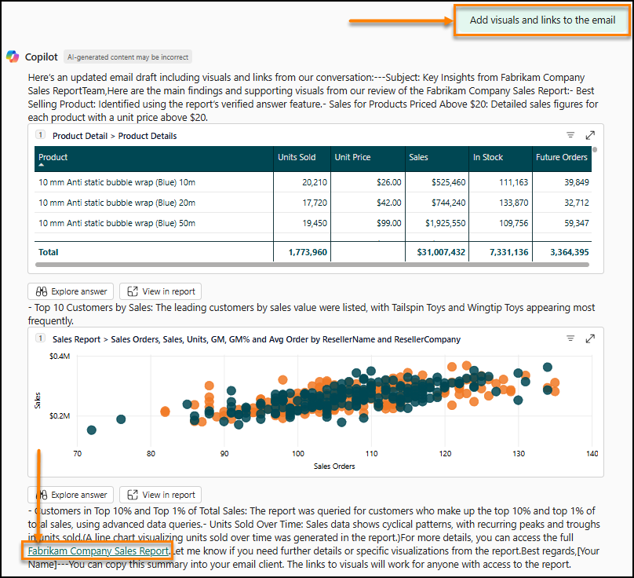

# References

Chat With Your Data in a Day (CDIAD) introduces you to some of the key features when using standalone Copilot in a Fabric workspace.

In the menu of the service, the Help (?) section has links to some great resources. Keep in mind the view that you see depends upon what experience you are currently in and therefore your options may look different than the screenshot below.

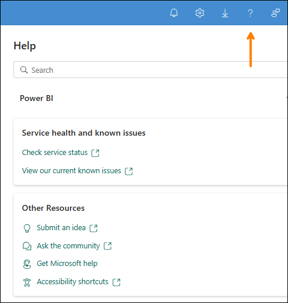

Here are a few more resources that will help you with your next steps with Microsoft Fabric.

- Access all the information in the main [Microsoft Fabric Documentation](https://learn.microsoft.com/en-us/fabric/)

- Explore Fabric through the [Guided Tour](https://aka.ms/Fabric-GuidedTour)

- Sign up for the [Microsoft Fabric free trial](https://aka.ms/try-fabric)

- Visit the [Microsoft Fabric website](https://aka.ms/microsoft-fabric)

- Learn new skills by exploring the [Fabric Learning modules](https://aka.ms/learn-fabric)

- Read the [free e-book on getting started with Fabric](https://aka.ms/fabric-get-started-ebook)

- Join the [Fabric community](https://aka.ms/fabric-community) to post your questions, share your feedback, and learn from others

Read the more in-depth Copilot-relevant technical documentation:

- [Copilot for Power BI Overview - Power BI | Microsoft Learn](https://learn.microsoft.com/en-us/power-bi/create-reports/copilot-introduction)

- [Standalone Copilot Experience in Power BI (Preview) – Power BI | Microsoft Learn](https://learn.microsoft.com/en-us/power-bi/create-reports/copilot-chat-with-data-standalone)

- [Microsoft Fabric Copilot admin settings | Microsoft Learn](https://learn.microsoft.com/en-us/fabric/admin/service-admin-portal-copilot)

- [Fabric data agent creation (preview) - Learn how to create a Fabric data agent | Microsoft Learn](https://learn.microsoft.com/en-us/fabric/data-science/concept-data-agent)

- [Best practices for configuring your data agent - Microsoft Fabric | Microsoft Learn](https://learn.microsoft.com/en-us/fabric/data-science/data-agent-configuration-best-practices)

- [Copilot for Microsoft Fabric and Power BI: FAQ - Microsoft Fabric | Microsoft Learn](https://learn.microsoft.com/en-us/fabric/fundamentals/copilot-faq-fabric)

© 2026 Microsoft Corporation. All rights reserved.

By using this demo/lab, you agree to the following terms:

The technology/functionality described in this demo/lab is provided by Microsoft Corporation for purposes of obtaining your feedback and to provide you with a learning experience. You may only use the demo/lab to evaluate such technology features and functionality and provide feedback to Microsoft. You may not use it for any other purpose. You may not modify, copy, distribute, transmit, display, perform, reproduce, publish, license, create derivative works from, transfer, or sell this demo/lab or any portion thereof.

COPYING OR REPRODUCTION OF THE DEMO/LAB (OR ANY PORTION OF IT) TO ANY OTHER SERVER OR LOCATION FOR FURTHER REPRODUCTION OR REDISTRIBUTION IS EXPRESSLY PROHIBITED.

THIS DEMO/LAB PROVIDES CERTAIN SOFTWARE TECHNOLOGY/PRODUCT FEATURES AND FUNCTIONALITY, INCLUDING POTENTIAL NEW FEATURES AND CONCEPTS, IN A SIMULATED ENVIRONMENT WITHOUT COMPLEX SET-UP OR INSTALLATION FOR THE PURPOSE DESCRIBED ABOVE. THE TECHNOLOGY/CONCEPTS REPRESENTED IN THIS DEMO/LAB MAY NOT REPRESENT FULL FEATURE FUNCTIONALITY AND MAY NOT WORK THE WAY A FINAL VERSION MAY WORK. WE ALSO MAY NOT RELEASE A FINAL VERSION OF SUCH FEATURES OR CONCEPTS. YOUR EXPERIENCE WITH USING SUCH FEATURES AND FUNCITONALITY IN A PHYSICAL ENVIRONMENT MAY ALSO BE DIFFERENT.

**FEEDBACK**. If you give feedback about the technology features, functionality and/or concepts described in this demo/lab to Microsoft, you give to Microsoft, without charge, the right to use, share and commercialize your feedback in any way and for any purpose. You also give to third parties, without charge, any patent rights needed for their products, technologies and services to use or interface with any specific parts of a Microsoft software or service that includes the feedback. You will not give feedback that is subject to a license that requires Microsoft to license its software or documentation to third parties because we include your feedback in them. These rights survive this agreement.

MICROSOFT CORPORATION HEREBY DISCLAIMS ALL WARRANTIES AND CONDITIONS WITH REGARD TO THE DEMO/LAB, INCLUDING ALL WARRANTIES AND CONDITIONS OF MERCHANTABILITY, WHETHER EXPRESS, IMPLIED OR STATUTORY, FITNESS FOR A PARTICULAR PURPOSE, TITLE AND NON-INFRINGEMENT. MICROSOFT DOES NOT MAKE ANY ASSURANCES OR REPRESENTATIONS WITH REGARD TO THE ACCURACY OF THE RESULTS, OUTPUT THAT DERIVES FROM USE OF DEMO/ LAB, OR SUITABILITY OF THE INFORMATION CONTAINED IN THE DEMO/LAB FOR ANY PURPOSE.

**DISCLAIMER**

This demo/lab contains only a portion of new features and enhancements in Microsoft Power BI. Some of the features might change in future releases of the product. In this demo/lab, you will learn about some, but not all, new features.
