# Microsoft Fabric Chat with your Data in a Day - Lab 5

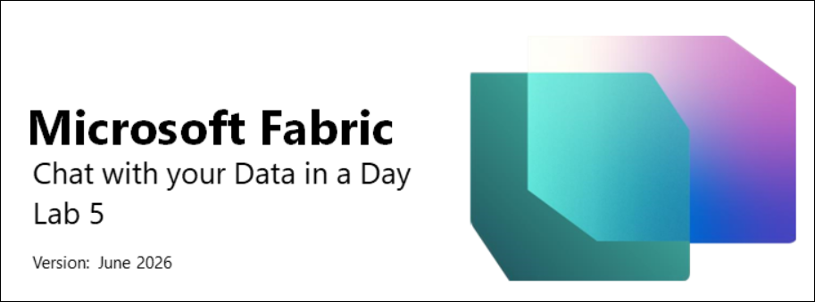

## Contents

- Document Structure
- Scenario / Problem Statement
- Introduction
- Implement Fabric Data Agents
- Prerequisites
  - Task 1: Create your Data Agent
  - Task 2: Add Data Sources
  - Task 3: Ask Questions of the Data Agent
  - Task 4: Add AI Instructions
  - Spotlight: Replacing a Data Source
  - Task 5: Adding additional Data Sources
  - Spotlight: Data source instructions
  - Task 6: Create Question Examples
  - Task 7: Publish and Share your Data Agent
  - Task 8: Consuming a Data Agent from Copilot
- References

# Document Structure

The lab includes steps for the user to follow along with associated screenshots that provide visual aid. In each screenshot, sections are highlighted with orange boxes to indicate the area(s) user should focus on.

# Scenario / Problem Statement

The standalone Copilot experience has been a huge success, providing your entire organization with faster time to insights and increasing overall adoption!

However, the Copilot experience is not highly customizable and now you have end users who want more curated experiences where they can focus their questions on very specific areas of the business, without the need to decipher through unrelated reports and semantic models. You have been tasked with creating a Data Agent that is connected to only data related to Fabrikam Company Sales report data. You also need to add some additional data into the data agent that isn’t available to the Standalone Copilot experience to answer more specific questions that your team wants to ask around product lead time.

# Introduction

You have learned about the Copilot standalone experience, which is excellent for exploring all your data in all your workspaces. However, using Data Agents can provide a more curated experience for chatting with specific data. Data Agents can connect to specific data sources or even specific tables within data sources. While Copilot is an AI assistant inside Fabric that enables productivity and intelligence, Data Agents enable data connectivity.

By the end of this lab, you will have learned how to:

- Create a Data Agent

- Add data sources to your agent

- Ask questions of your agent

- Add AI Instructions for your agent to use

- Replace a data source

- Add additional data sources

- Create question examples

- Publish and share your agent

- Consume Data Agent from Standalone Copilot

# Implement Fabric Data Agents

In this section, you’ll learn how to create a Data Agent. The agent can retrieve data by generating structured queries (SQL, DAX, KQL) to answer questions involving facts, totals, rankings, or filters. At the time of this writing Fabrick Data Agents are currenting a preview feature in Microsoft Fabric and not recommended for production workloads. You can read more on how the Fabric Data Agent works here:

[Fabric data agent creation (preview) - Learn how to create a Fabric data agent | Microsoft Learn](https://learn.microsoft.com/en-us/fabric/data-science/concept-data-agent)

Microsoft Fabric data agents let users interact with enterprise data in plain English, removing the need for SQL, DAX, or KQL. They provide a chat interface with debugging tools, connect to sources like Power BI semantic models, KQL databases, Lakehouses, and Warehouses. Data Agents can be accessed in and outside of Microsoft Fabric, they can be integrated into Microsoft Teams, Copilot Studio, Azure AI Foundry, and custom apps. Data Agents are also discoverable from the Standalone Copilot experience in Fabric!

## Prerequisites

To use Fabric Data Agents, there are many tenant settings that must be enabled or configured, please see the **Tenant Settings Guidance document** located in your class labs:

- Admin Access is required

- Enable Copilot and Azure OpenAI settings

- Enable Fabric Data Agent creation and sharing

- Enable XMLA endpoints for Power BI Semantic Models

## Task 1: Create your Data Agent

1. Open up a new tab in the browser, navigate to Fabric portal using below link  navigate to the Workspace named **Fabrikam_Lab_<inject key="DeploymentID" enableCopy="false"></inject>**

    ```
     https://fabric.microsoft.com/
     ```

    *(**Important**: Use the workspace you created earlier in this class)*

    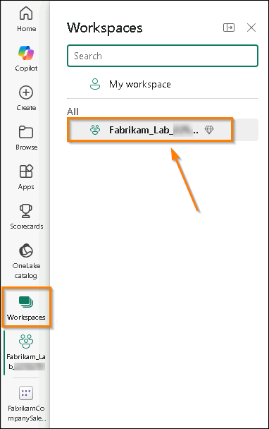

2. Click on **New item**:

    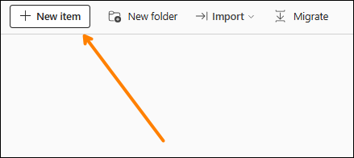

3. In the search bar that opens, type in **Agent**, and select **Data agent (preview).**

    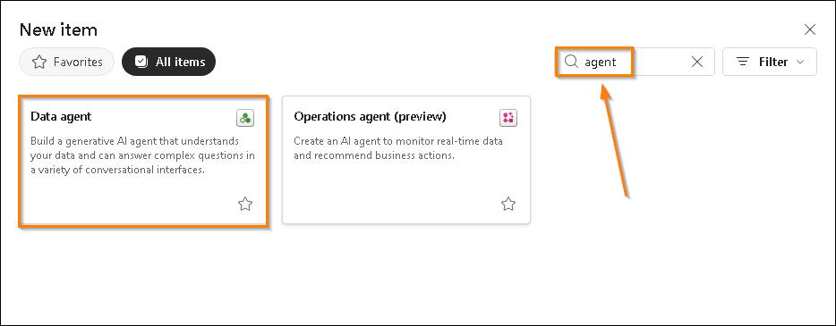

4. Give your agent a name, **FabrikamSales_agent_<inject key="DeploymentID" enableCopy="false"/>**

5. Remember, your usercode is found in your username as seen below:

    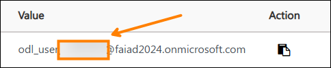

6. Click **Create.**

    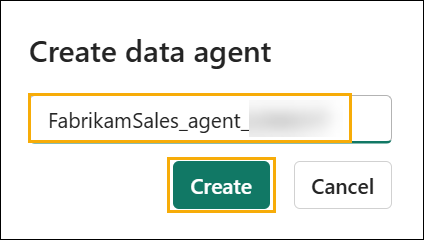

## Task 2: Add Data Sources

1. Once you’ve created a Data Agent, the next step is to add your data sources!

2. From the explorer pane, click the button **Add Data (1)**. Alternatively, you could click **Data source (2)** button shown in the middle of the screen.

    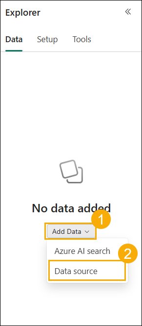

    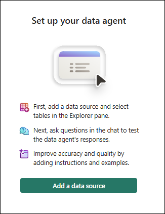

3. Choose the **Fabrikam Company Sales Report** semantic model from the list, then click **Add**.

    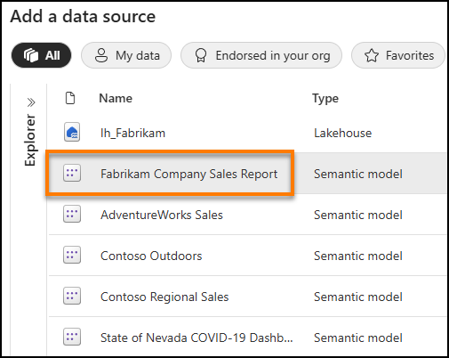

4. Notice that no tables have been selected yet, and the data agent can’t answer questions until at least one data source is selected. Click the **>** next to the **Fabrikam Company Sales Report** in the **Explorer** pane. Select the tables shown in the screenshot below.

    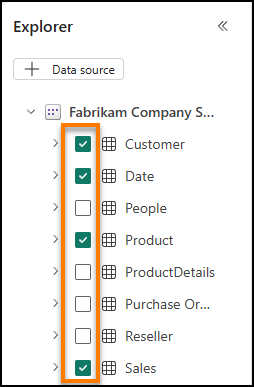

## Task 3: Ask Questions of the Data Agent

1. Now that your agent is connected to a data source, let’s start writing some prompts to the data agent.

2. Type the following command: **Show me sales by country.**

    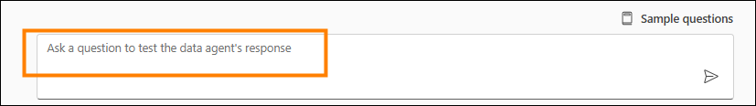

3. The agent may take several seconds to respond with an answer. Notice what the agent returned:

    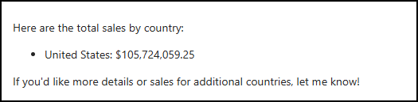

4. Click the dropdown for the completed step to show what the agent did, and then the next dropdown to reveal the details.

    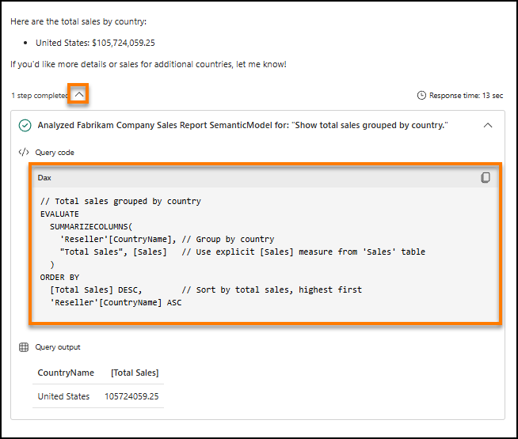

    **ℹ️ Important**

    When developing a Fabric Data Agent, it’s important to take time to validate the results to ensure accuracy and consistency. Now that you have results, we will go back to the semantic model and validate the results there!

5. Navigate to your downloaded class files and open up the **Fabrikam Company Sales Report.pbix** file.

    

6. Click at the bottom of the report to open a new report page.

    

7. Next, you are going to build a basic visual to validate the results that data agent returned.

8. Add a table visual on this new report page.

    

    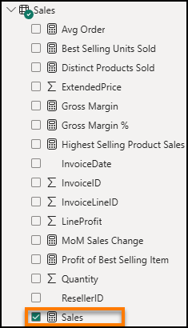

9. In the Visualizations pane, select the **Table visual**, as shown below.

    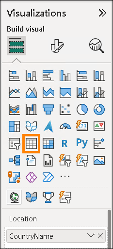

9. The resulting table should look like this:

    

10. Notice the total sales amount is the same as the query output from the Data Agent above. This validates that the agent query returned the correct output.

## Task 4: Add AI Instructions

AI instructions can be added to the Fabric Data Agent to improve accuracy and consistency. AI Instructions can be added in two separate locations within the Data Agent.

First, AI instructions can be added to the agent itself, these are known specifically as **Agent instructions** and help the Agent to identify which data sources to use for certain questions, what tone to use, what kind of data to prioritize, and other similar behavioral or contextual preferences that shape how the agent responds to users.

The second type of AI instruction is **data source instructions**; with data source instructions you can add instructions to help the data agent understand the data source data and how to use it most effectively. Currently data source instructions are not supported by semantic models, we will look at this feature in a later date!

1. Let’s start with **Agent instructions** back in the fabric browser interface. We want to add a summary to every answer provided by the data agent. Therefore, we can tell the agent we want to add a concise summary added for each answer!

2. Select AI Instructions on the home tab.

    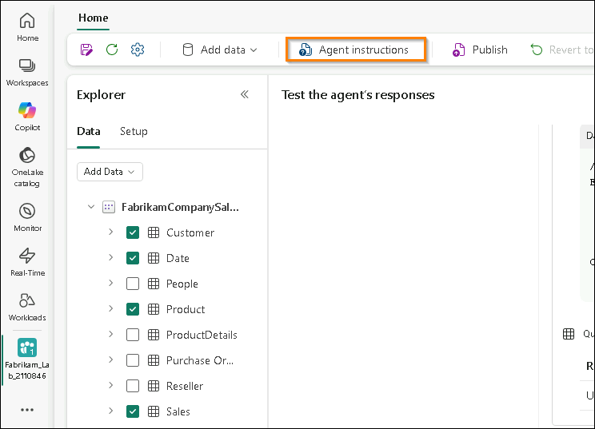

3. In the **Agent instructions** box of the AI instructions window above or below the existing generic instructions, type the following directions:

    **## Set Response Guidelines**

    **Always include a concise summary before the detailed breakdown.**

    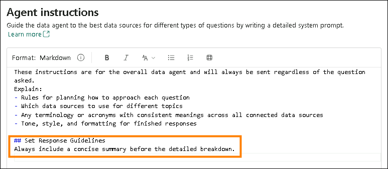

    **ℹ️ Important**

    When writing Agent Instructions, the “##” is a Markdown language format not needed but a good practice for the Fabric Data Agent’s organization.

4. Click the **X** in the top right corner of the “Agent Instructions” tab to close the AI instructions and save your changes.

    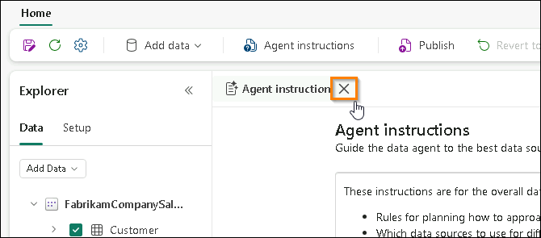

    **ℹ️ Important**

    On occasion, it may take time for your AI instructions to take effect. If you don’t get the desired results, click the clear chat button at the top of your agent window and try again!

5. Give the agent the same prompt as previously provided: **Show me sales by country** and press Enter.

    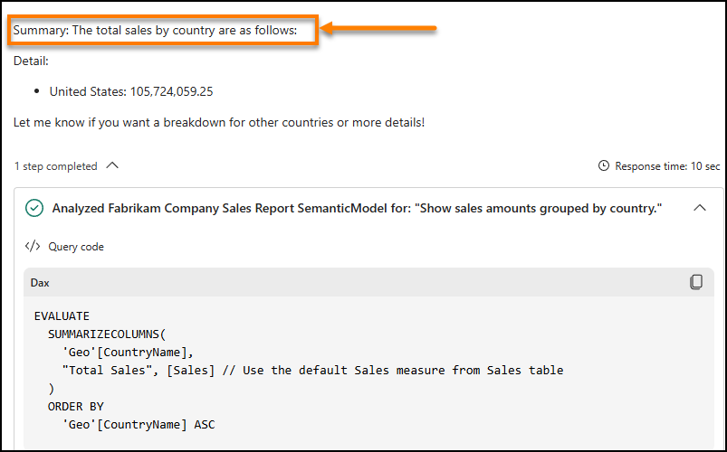

6. Let’s add another AI instruction to further refine the AI response. In this example, you will add a command in the prompt to always return a table instead of a bulleted list. Open up the AI instructions and in the Agent Instructions add the following line of code:

    **Always return a table instead of bullet points**

    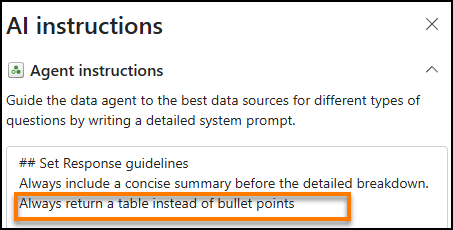

7. Close the AI instructions window and type the following in your data agent prompt: **Return sales by country**

    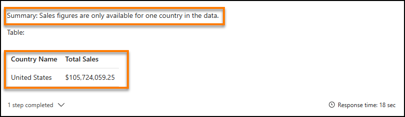

8. Now you receive the results in tabular format with a summary! So far this is great! Let’s add some more instructions.

9. In your data agent prompt, type the following: **Return sales by State**.

    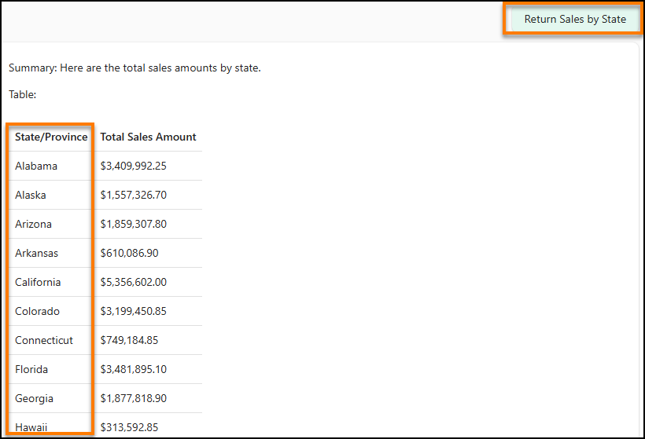

10. These results are exactly what you should expect, but maybe it’s too much? Let’s tell the AI prompt to always return only 5 rows of data unless otherwise specified.

11. In your data agent **AI Instructions**, type the following:

    **Always provide the top 5 results unless a different number is specified**

    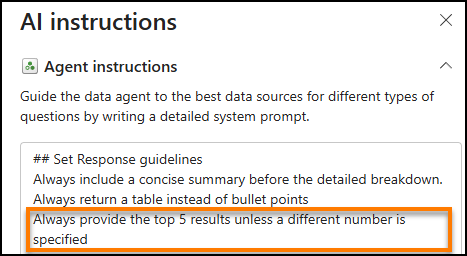

1. Close the AI instructions window and type the following in your data agent prompt: **Return sales by State**.

12. The results are perfect! Our summary now clarifies we are getting the top 5 states by sales. And Copilot prompts us to ask for sales data for all states if that’s what we want.

    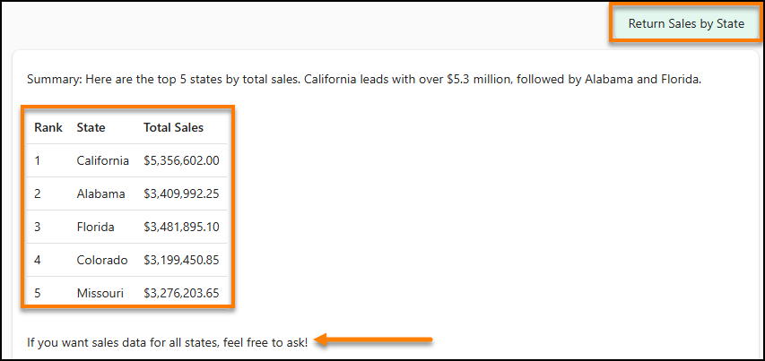

## Spotlight: Replacing a Data Source

When you’re working with data agents, you may decide you want to use a different data source. In our example, we are using the Fabrikam Company Sales Report semantic model. But what if we wanted to use a different semantic model? There isn’t currently a way to simply replace a data source, however, you can remove and add data sources to your data agent at any time.

1. To remove a data source, go to the explorer within your data agent and click the ellipsis (**…**) to the right of the data source. From the drop-down menu you have three options. Your three options are Open, Refresh, or Remove.

    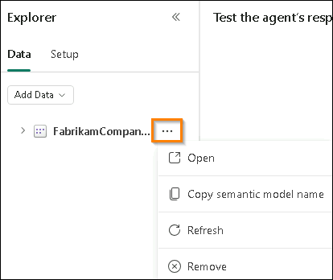

2. You will **NOT** be replacing the data source in this lab.

## Task 5: Adding additional Data Sources

We have built our data agent on a well-defined and thought-out semantic model. This semantic model has been designed to answer most, if not all user requests. However, what happens if there is sales information that your semantic model can’t answer? You could find the creator of that semantic model and ask them to add additional tables and information, but that could take time, or your request may be denied.

You have a user who wants to look at sales by product lead time. Our Fabrikam Company Sales semantic model does not include this information; however, this information does exist in the original source data stored in your Fabric Lakehouse.

In this lab, you are going to add an additional data source, so that the product lead time information can be included in your data agent responses.

1. Let’s start by creating a Lakehouse and adding some sample data. Return back you your Workspace and select **+ New Item** once again:

    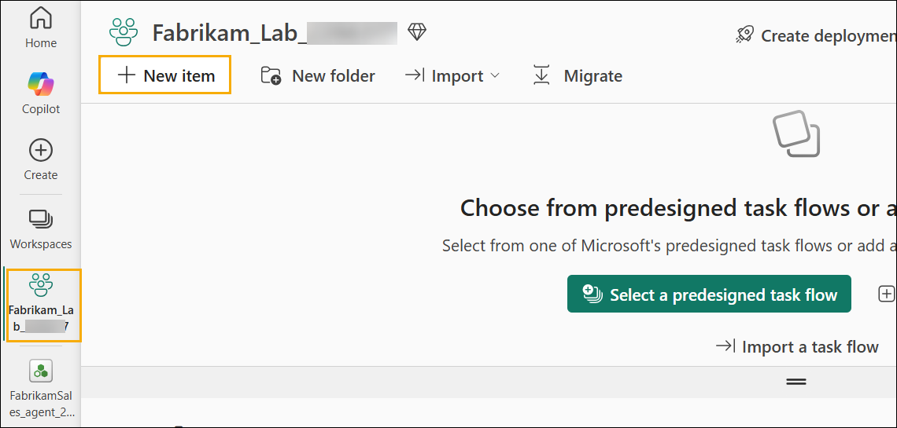

2. Search and select the **Lakehouse** from the Other items you can create with Microsoft Fabric area.

    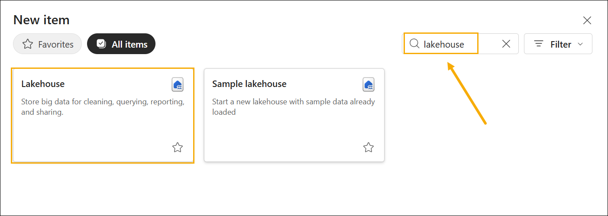

3. Name your new Lakehouse: **lh_Fabrikam** and then press **Create**.

    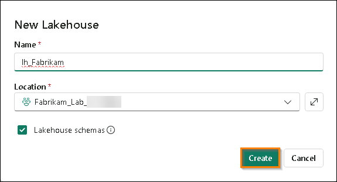

4. In our Lakehouse we are going to use a **Shortcut** to connect to a pre-prepared version of the Fabrikam data. Open up **Get Data** and select **New table shortcut**.

    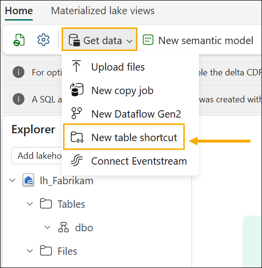

5. Select **Azure Data Lake Storage Gen2**.

    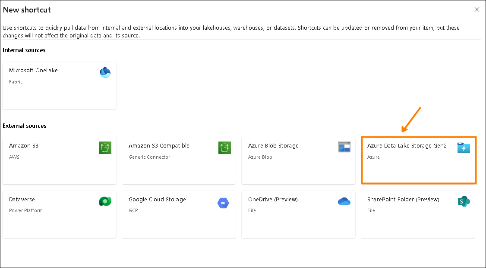

6. Select **New connection** and enter in the Fabrikam URL:

    ***https://stvnextblobstorage.dfs.core.windows.net/fabrikam-sales***

    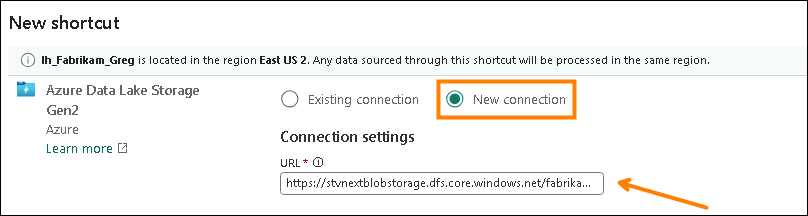

7. Provide a connection name like **Fabrikam Connector or similar** and under Authentication kind, click the dropdown and select Shared Access Signature (SAS).

    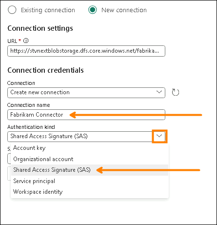

8. Copy the SAS Token from your Environment tab on the right-hand side and past into the **SAS token** area.

    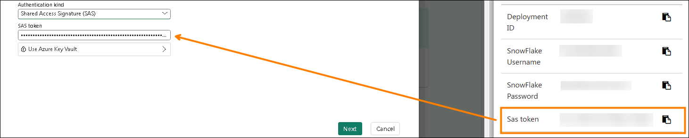

9. Select **Next**.

    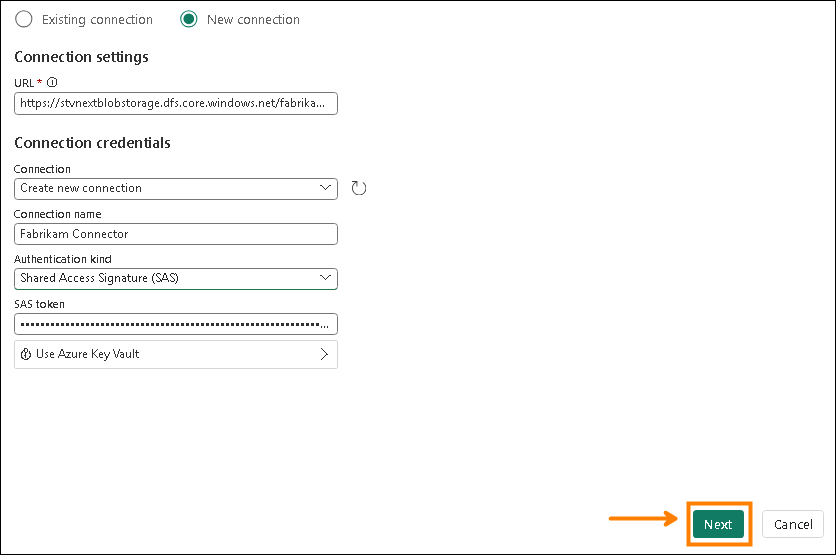

10. Expand the **Delta-Parquet-Format-FY25** and select all items except **Sales.Invoices.May** then Select **Next**.

    

11. Rename the **Shortcut Name** for each of the new tables. This is important to easily use the lakehouse as a data source. Follow the format below:

    - Application.Cities to **Cities**

    - Application.Countries to **Countries**

    - Application.StateProvinces to **StateProvinces**

    - DateDim to **Date**

    - Sales.BuyingGroups to **BuyingGroups**

    - Sales.Customers to **Customers**

    - Sales.InvoiceLines to **InvoiceLines**

    - Sales.Invoices to **Invoices**

    - Warehouse.StockGroups to **StockGroups**

    - Warehouse.StockItemStockGroups to **StockItemStockGroups**

    - Warehouse.StockItems to **StockItems**

      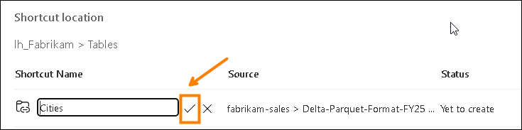

12. Select **Create** to add the data through a Shortcut to your Lakehouse.

    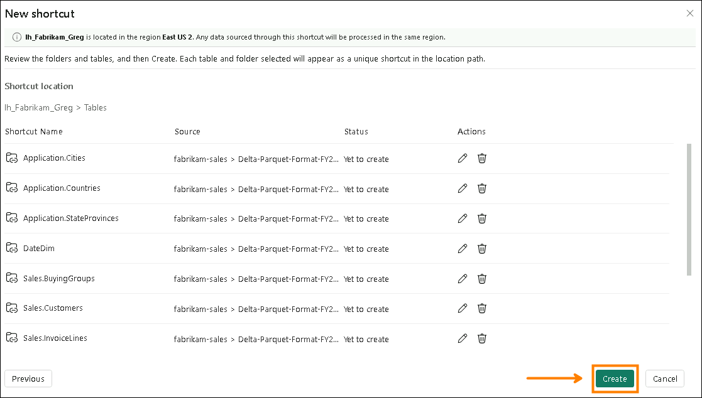

13. When the upload is finished, you should see the objects have been moved to the Table area.

    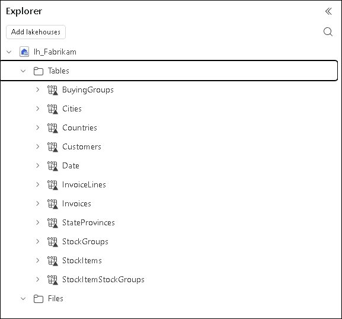

14. You may return to the **Data Agent** from the left-hand side or the Workspace view.

    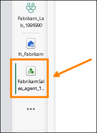

    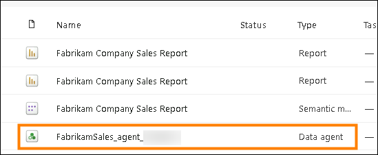

15. From your data agent, click the **Add Data** drop down box and select **Data source** in the explorer pane.

    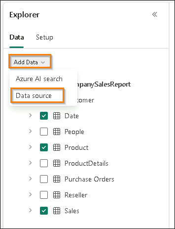

16. Select **lh_Fabrikam** and then click **Add**.

    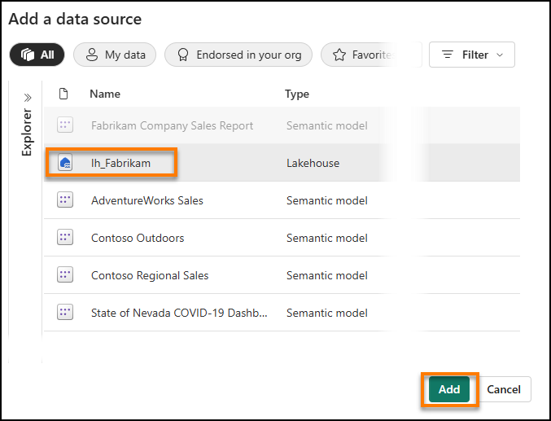

17. You will now have two data sources in the **Explorer** pane.

    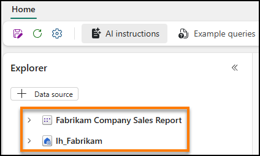

18. Open the Lakehouse and add in all potential data sources from the lh_Fabrikam. It may take a few minutes for every Lakehouse item to show. Feel free to allow it the chance to load in and refresh as needed.

    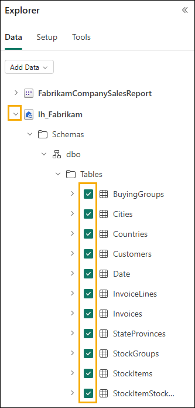

19. Back in your data agent prompt, type the following: **What are total sales by product lead time?**

    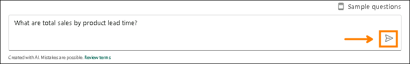

20. Fabric data agents answered this request perfectly and got the desired results from our Lakehouse! You can always deselect the data from the Fabrikam Company Sales Report to force the use of the Lakehouse by Copilot instead. However, we will use instructions to better fix this soon.

21. Expand the completed steps section to review the SQL that was generated by data agents to arrive at this result.

    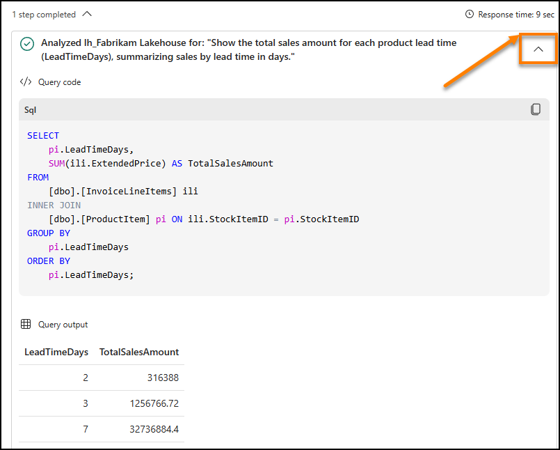

22. Remember, it’s important to validate the results of Data Agent. Because Data Agents expose the SQL Code that was used you can review it and even run it against the lakehouse to verify the results are correct!

    It is possible that certain user requests to the data agent may return results from the incorrect data source. For example, total sales by product could be answered by the lakehouse data source or the semantic model. To ensure the Data Agent answers the request using the desired data source, you can add additional AI instructions to return desired results.

23. Open up the AI instructions in your data agent and in the Agent Instructions section add the following instruction:

    **## Data Source Priority**

    **Always use the Fabrikam Company Sales Report to answer questions unless the user explicitly ask about lead time.**

    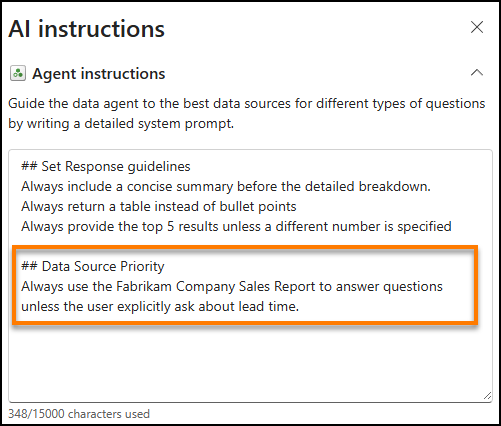

## Spotlight: Data source instructions

1. Next, let’s take a look at data source instructions.

2. From the AI instructions pane, select the ellipsis next to your **Lakehouse** and select **Data source instructions** and expand the Lakehouse. You will notice, unlike semantic models, AI instructions are supported at the data source level for Lakehouses!

    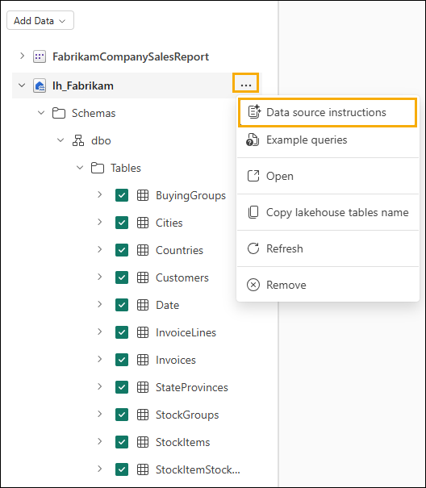

    Adding data source instructions here can help AI understand the data in your lakehouse better. Well defined AI instructions will help the AI to understand your business context, terminology and analytical priorities.

    You learned all about AI instructions earlier in this class, when prepping your semantic model for AI. We won’t revisit all that information here. Just be aware, if you feel that the Data Agent needs further clarification, this is where you would add it!

## Task 6: Create Question Examples

Tuning a data agent is not a one-time setup—it’s an ongoing, iterative process that involves experimentation, observation, and refinement. Part of the refinement process is providing example queries that can help the AI understand how to answer complex questions that may require a lot of SQL or KQL in the data source.

Data Agents can leverage example queries, also known as few-shot examples, to improve the accuracy and relevance of their responses when converting the natural language questions into SQL or KQL (NL2SQL, NL2KQL).

**ℹ️ Important**

The example queries feature is currently not supported for semantic models.

Example queries are a two-part process.

1. First, you provide an example question, the AI will match semantically similar questions to the question you provide.

2. Second, you provide an example query. This query would handle the complex joins, complex predicates, and other advanced scenarios to assist the agent when forming a response!

    A lab on question examples **is outside the scope of this class**. However, if you wanted to create an example query, you could by performing the following steps:

3. Select the ellipsis next to the **Lakehouse** and Select **Example queries** to open the pane.

    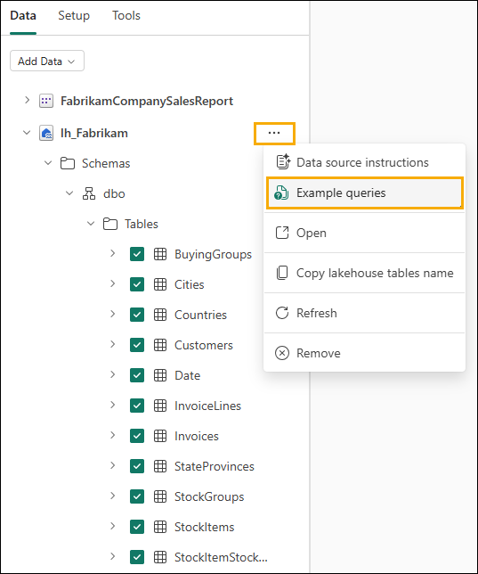

4. From the example queries pane, click the **Add Example** button.

    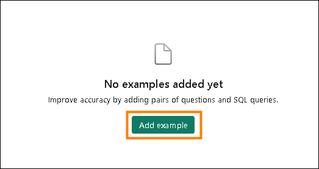

5. Add an example question and then hit enter. Example: **Show sales by country that the product was manufactured in.**

    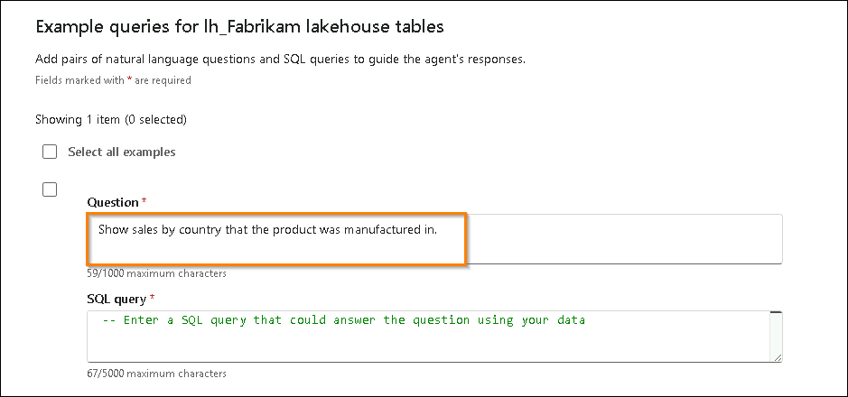

6. In the SQL Query dialog box, enter the SQL that the agent should use to answer this type of question! Once complete, click the (X) in the top right corner and test your agent.

    **ℹ️ Important**

    The code here is not provided in the lab since it is outside the scope of this class, however, you can feel free to generate your own code and explore it if time permits!

    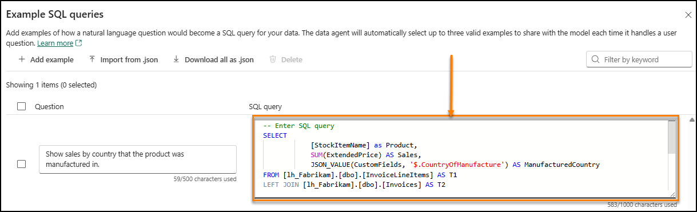

    **Pro tip**: Each of these questions targets different analytical scenarios - geographic analysis, filtered aggregations, revenue calculations, and hierarchical time analysis. Experiment with variations to see how the data agent adapts to different question styles.

    **Experiment further**: Try asking questions in the agent that are more complex and then creating question / SQL pairs that help the data agent respond to user requests.

## Task 7: Publish and Share your Data Agent

1. It is time to publish your data agent. Click the **Publish** button on the Home menu.

    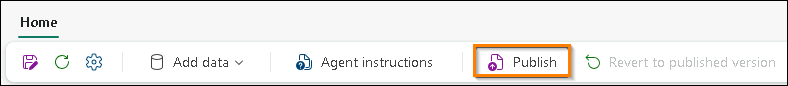

2. Next, give your agent a description. Include the purpose and capabilities of the agent. Click **Publish**.

    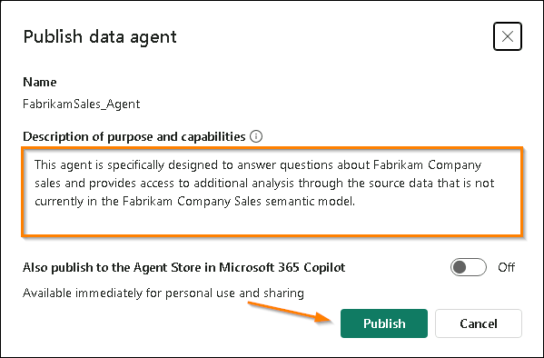

3. After you publish your agent, you should share it. Click the **Share** button in the top right corner of your screen.

    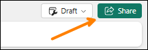

4. In the **Grant people access** section, enter the email address of a user from your organization. Review and configure the appropriate permission settings, then select **Grant** to provide the user with access to the data agent.

    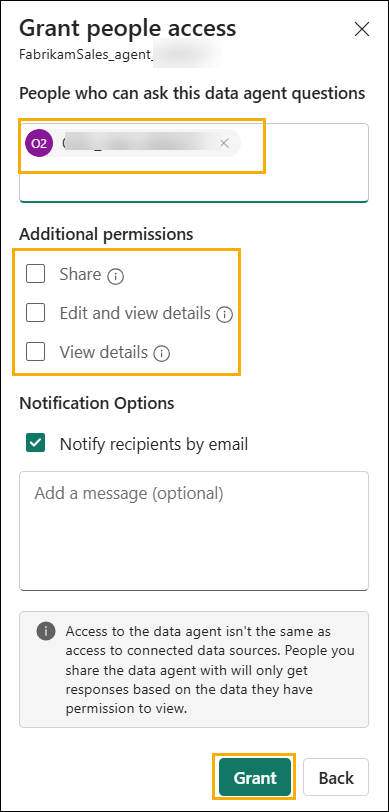
    
    **ℹ️ Important**

    Access to the data agent isn't the same as access to connected data sources. People you share the data agent with will only get responses based on the data they have permission to view.

6. The published Fabric data agent can be consumed in various platforms, including:

    - Microsoft Fabric

    - Copilot Studio

    - Microsoft Teams

    - Notebooks

    - Power BI Copilot

    - Azure AI Foundry

    - Custom applications via API

7. In your workspace, hover over your data agent to reveal the ellipsis **(…)**.

    

8. Click the ellipsis and select **Manage permissions**.

    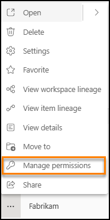

9. You can also share from here or manage who has direct access to the agent via their access to the workspace. You can choose either **+ Add link** from the Links menu, or **+ Add user** from the Direct access menu. Adding users to the workspace will give them access to the agent.

    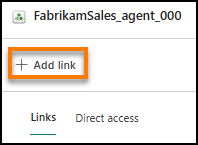

    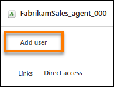

## Task 8: Consuming a Data Agent from Copilot

1. While the agent can be consumed in many ways (see Step 6 above), let’s try to leverage our data agent through the Standalone Copilot experience. In your workspace, click the Copilot button. (NOTE: You may need to click the ellipsis on the sidebar to reveal the Copilot button.)

    (Reminder: Make sure to point to your data agent in the example.)

    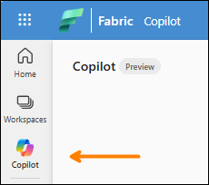

2. Select the plus sign: Notice that your agent is offered as an option for Copilot to use. This highlights the difference between the standalone Copilot and the Data Agent experiences.

    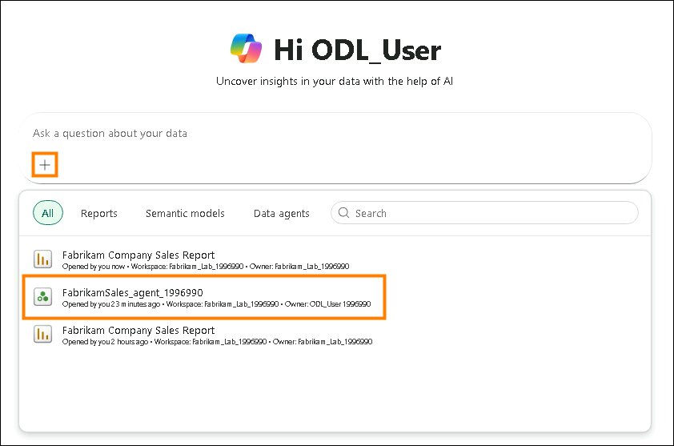

3. In your workspace, hover over your agent click on the ellipsis (…) again.

    

4. Choose **Settings** from the menu.

    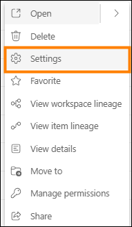

5. Choose **Endorsement** from the new window.

    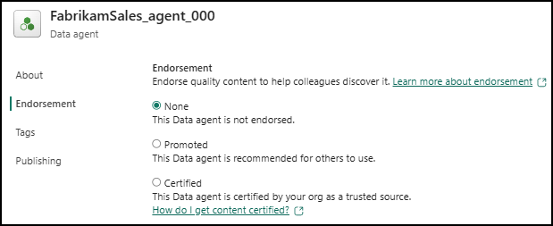

6. In the context of **Copilot**—especially when working with **data agents** in Power BI or Microsoft Fabric—**to "endorse a data agent"** means granting formal approval or certification for that agent within an organization’s environment. This typically involves making the agent easily discoverable and trustable for users by marking it as promoted or certified.

# References

Chat With Your Data in a Day (CDIAD) introduces you to some of the key features when using standalone Copilot in a Fabric workspace.

In the menu of the service, the Help (?) section has links to some great resources. Keep in mind the view that you see is dependent upon what experience you are currently in and therefore your options may look different than the screenshot below.


Here are a few more resources that will help you with your next steps with Microsoft Fabric.

- Access all the information in the main [Microsoft Fabric Documentation](https://learn.microsoft.com/en-us/fabric/)

- Explore Fabric through the [Guided Tour](https://aka.ms/Fabric-GuidedTour)

- Sign up for the [Microsoft Fabric free trial](https://aka.ms/try-fabric)

- Visit the [Microsoft Fabric website](https://aka.ms/microsoft-fabric)

- Learn new skills by exploring the [Fabric Learning modules](https://aka.ms/learn-fabric)

- Read the [free e-book on getting started with Fabric](https://aka.ms/fabric-get-started-ebook)

- Join the [Fabric community](https://aka.ms/fabric-community) to post your questions, share your feedback, and learn from others

Read the more in-depth Copilot-relevant technical documentation:

- [Copilot for Power BI Overview - Power BI | Microsoft Learn](https://learn.microsoft.com/en-us/power-bi/create-reports/copilot-introduction)

- [Standalone Copilot Experience in Power BI (Preview) – Power BI | Microsoft Learn](https://learn.microsoft.com/en-us/power-bi/create-reports/copilot-chat-with-data-standalone)

- [Microsoft Fabric Copilot admin settings | Microsoft Learn](https://learn.microsoft.com/en-us/fabric/admin/service-admin-portal-copilot)

- [Fabric data agent creation (preview) - Learn how to create a Fabric data agent | Microsoft Learn](https://learn.microsoft.com/en-us/fabric/data-science/concept-data-agent)

- [Best practices for configuring your data agent - Microsoft Fabric | Microsoft Learn](https://learn.microsoft.com/en-us/fabric/data-science/data-agent-configuration-best-practices)

- [Copilot for Microsoft Fabric and Power BI: FAQ - Microsoft Fabric | Microsoft Learn](https://learn.microsoft.com/en-us/fabric/fundamentals/copilot-faq-fabric)

© 2026 Microsoft Corporation. All rights reserved.

By using this demo/lab, you agree to the following terms:

The technology/functionality described in this demo/lab is provided by Microsoft Corporation for purposes of obtaining your feedback and to provide you with a learning experience. You may only use the demo/lab to evaluate such technology features and functionality and provide feedback to Microsoft. You may not use it for any other purpose. You may not modify, copy, distribute, transmit, display, perform, reproduce, publish, license, create derivative works from, transfer, or sell this demo/lab or any portion thereof.

COPYING OR REPRODUCTION OF THE DEMO/LAB (OR ANY PORTION OF IT) TO ANY OTHER SERVER OR LOCATION FOR FURTHER REPRODUCTION OR REDISTRIBUTION IS EXPRESSLY PROHIBITED.

THIS DEMO/LAB PROVIDES CERTAIN SOFTWARE TECHNOLOGY/PRODUCT FEATURES AND FUNCTIONALITY, INCLUDING POTENTIAL NEW FEATURES AND CONCEPTS, IN A SIMULATED ENVIRONMENT WITHOUT COMPLEX SET-UP OR INSTALLATION FOR THE PURPOSE DESCRIBED ABOVE. THE TECHNOLOGY/CONCEPTS REPRESENTED IN THIS DEMO/LAB MAY NOT REPRESENT FULL FEATURE FUNCTIONALITY AND MAY NOT WORK THE WAY A FINAL VERSION MAY WORK. WE ALSO MAY NOT RELEASE A FINAL VERSION OF SUCH FEATURES OR CONCEPTS. YOUR EXPERIENCE WITH USING SUCH FEATURES AND FUNCITONALITY IN A PHYSICAL ENVIRONMENT MAY ALSO BE DIFFERENT.

**FEEDBACK**. If you give feedback about the technology features, functionality and/or concepts described in this demo/lab to Microsoft, you give to Microsoft, without charge, the right to use, share and commercialize your feedback in any way and for any purpose. You also give to third parties, without charge, any patent rights needed for their products, technologies and services to use or interface with any specific parts of a Microsoft software or service that includes the feedback. You will not give feedback that is subject to a license that requires Microsoft to license its software or documentation to third parties because we include your feedback in them. These rights survive this agreement.

MICROSOFT CORPORATION HEREBY DISCLAIMS ALL WARRANTIES AND CONDITIONS WITH REGARD TO THE DEMO/LAB, INCLUDING ALL WARRANTIES AND CONDITIONS OF MERCHANTABILITY, WHETHER EXPRESS, IMPLIED OR STATUTORY, FITNESS FOR A PARTICULAR PURPOSE, TITLE AND NON-INFRINGEMENT. MICROSOFT DOES NOT MAKE ANY ASSURANCES OR REPRESENTATIONS WITH REGARD TO THE ACCURACY OF THE RESULTS, OUTPUT THAT DERIVES FROM USE OF DEMO/ LAB, OR SUITABILITY OF THE INFORMATION CONTAINED IN THE DEMO/LAB FOR ANY PURPOSE.

**DISCLAIMER**

This demo/lab contains only a portion of new features and enhancements in Microsoft Power BI. Some of the features might change in future releases of the product. In this demo/lab, you will learn about some, but not all, new features.
