# Microsoft Fabric Chat with your Data in a Day - Labo 1

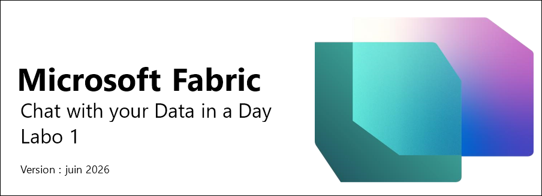

## Sommaire

- Structure du document
- Scénario/Énoncé du problème
- Introduction
  - Tâche 1 : Travailler dans l’environnement virtuel
  - Tâche 2 : Évaluer la préparation de vos données pour l’IA
  - Tâche 3 : Rédiger une requête dans Power BI Copilot

# Structure du document

Le labo comprend des étapes à suivre par l’utilisateur, ainsi que des captures d’écran associées qui fournissent une aide visuelle. Dans chaque capture d’écran, des sections sont mises en évidence avec des encadrés orange afin de souligner la ou les zones sur laquelle/lesquelles l’utilisateur doit se concentrer.

# Scénario/Énoncé du problème

Votre organisation revient tout juste d’une conférence Microsoft au cours de laquelle elle a découvert comment l’expérience Chat with your Data, avec Copilot, peut considérablement accélérer l’accès à des informations stratégiques. Les démos ont mis en évidence la puissance de l’analyse en langage naturel, rendue possible par des modèles sémantiques correctement structurés et optimisés pour l’IA.

**Objectif actuel**

Il vous a été demandé d’évaluer un modèle sémantique existant dans Power BI Desktop. Votre objectif est de tester ses performances dans l’expérience Copilot et d’identifier les axes d’amélioration.

Explorer le modèle sémantique à l’aide de l’interface Copilot intégrée à PBI Desktop

Identifier les points de friction où Copilot a du mal à interpréter l’intention

Recommander et mettre en œuvre des améliorations afin d’optimiser la compréhension de Copilot

Documenter vos conclusions et préparer le modèle pour une utilisation élargie au sein de l’organisation

# Introduction

Lors de la démonstration du formateur, vous avez vu les performances de l’expérience Chat with your Data ; dans ce labo, vous constaterez à quel point il est nécessaire de préparer les modèles de données pour l’IA. Ce labo présente différentes requêtes utilisateurs et la manière dont Copilot y répond. Vous verrez également comment valider ces réponses en termes de précision et de justesse. Dans les labos suivants, vous apprendrez à appliquer les bonnes pratiques et à préparer vos outils de données afin d’améliorer l’expérience Copilot.

## Tâche 1 : Travailler dans l’environnement virtuel

1. L’environnement virtuel offre une expérience remarquable en vous fournissant un espace prêt à l’emploi pour travailler avec l’expérience Chat with Your Data. Examinons quelques zones et points clés.

   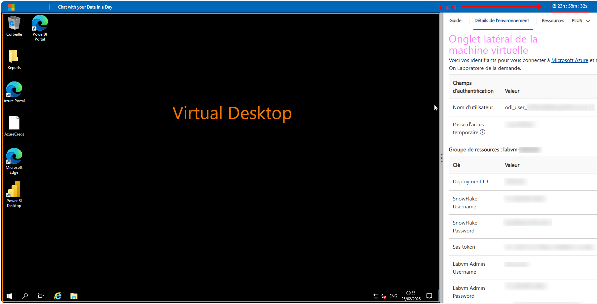

2. Examinons quelques zones clés :
   - Le bureau virtuel agit comme un ordinateur entièrement fonctionnel utilisable directement dans le navigateur.

   - L’onglet latéral de la machine virtuelle permet d’accéder aux documents du labo, aux identifiants et à d’autres ressources.

   - Le minuteur indique le temps restant d’utilisation de la machine virtuelle.

   **ℹ️ Important**

3. Tout au long des labos de cette classe, ces encadrés **Important** contiendront des informations précieuses. Essayez de ne pas les ignorer. Par exemple, si vous ne voyez pas l’onglet latéral de la machine virtuelle, assurez-vous de le développer entièrement, comme indiqué dans l’image ci-dessous.

   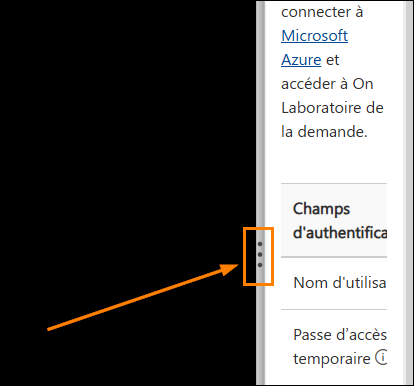

4. Vous pouvez naviguer facilement dans les labos à l’aide du numéro de page situé en bas de l’onglet latéral.

   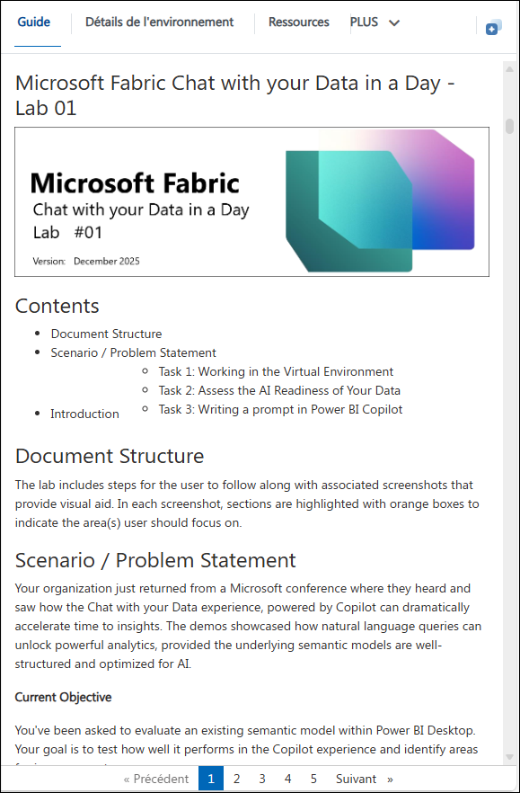

5. Durant cette classe, vous pouvez travailler entièrement dans la machine virtuelle. Cependant, certains participants préfèrent utiliser un navigateur en mode navigation privée et se connecter à Power BI Desktop avec les identifiants de la machine virtuelle qui leur sont fournis. Cela est tout à fait acceptable.

## Tâche 2 : Évaluer la préparation de vos données pour l’IA

1. Maintenant que vous avez découvert les principales zones de la machine virtuelle, cliquez sur le bouton du portail Power BI pour lancer le service Power BI.

   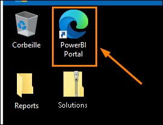

2. À l’aide des identifiants figurant sur la page des identifiants et dans votre document, renseignez l’adresse e-mail dans le champ d’accès e-mail.
   - **Nom d'utilisateur/Adresse e-mail :** <inject key="AzureAdUserEmail"></inject>

     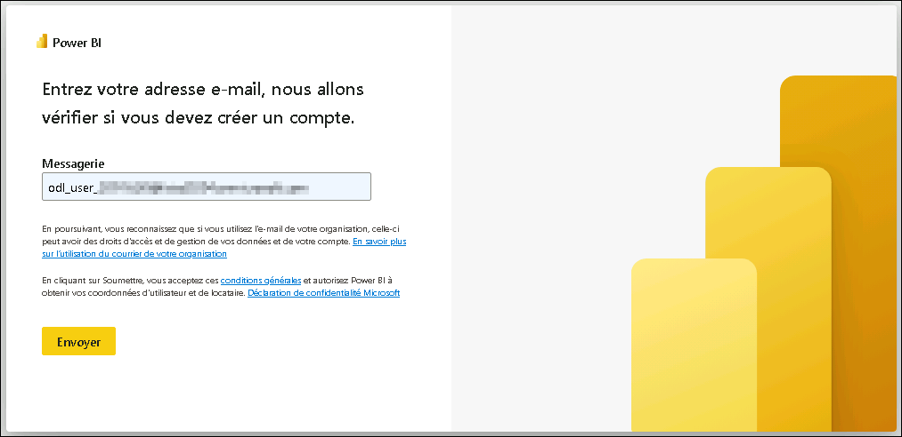

3. Utilisez ensuite la fenêtre de **connexion** Microsoft avec les mêmes identifiants, puis cliquez sur **Suivant**.

   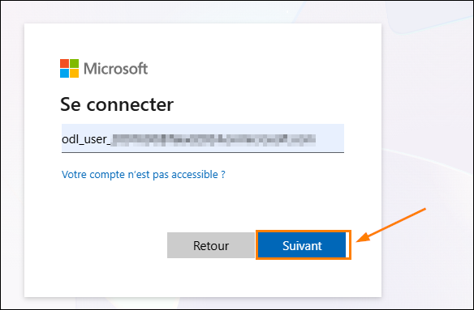

4. Saisissez le **mot de passe d’accès temporaire** fourni sur la page des identifiants ou dans le document du labo, puis cliquez sur **Se connecter**. Vous pouvez également sélectionner Oui pour rester connecté.
   - **Mot de passe:** **<inject key="AzureAdUserPassword"></inject>**

     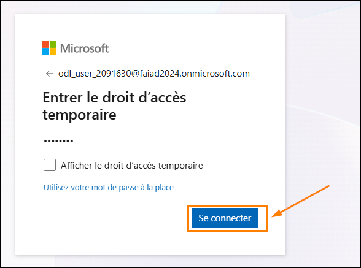

5. Nous allons d’abord accéder à la section **Espaces de travail** dans le menu situé à gauche.

   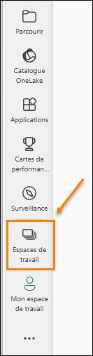

6. Nous allons maintenant créer un **nouvel espace de travail** en sélectionnant le bouton Nouvel espace de travail.

   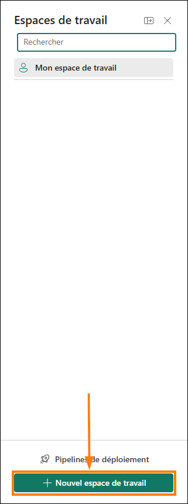

7. Ensuite, nommez votre espace de travail comme suit : **Fabrikam*Lab*<inject key="DeploymentID" enableCopy="false"></inject>\_FR**

   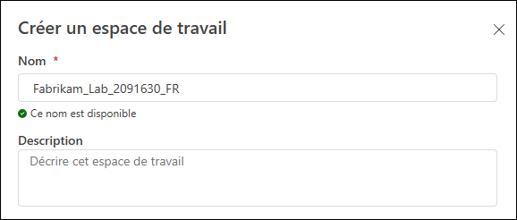

8. Votre code à sept chiffres fait partie du nom d’utilisateur qui vous a été attribué pour la classe. Veuillez l’utiliser. Voir la capture d’écran suivante.

   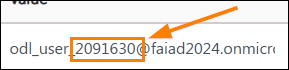

9. Par exemple, John A. Smith aurait : **Fabrikam*Lab*<inject key="DeploymentID" enableCopy="false"></inject>\_FR**

   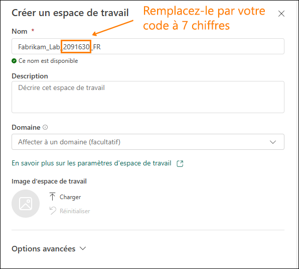

10. Ensuite, vous devez affecter une capacité Fabric à votre espace de travail.

11. Cliquez sur **Avancé** pour afficher les options avancées lors de la configuration de l’espace de travail.

    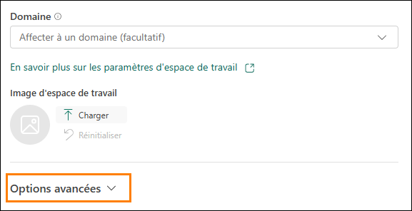

12. Assurez-vous que la **capacité Fabric** est sélectionnée. Faites défiler légèrement vers le bas et sélectionnez **au hasard** une capacité dans la liste déroulante.

    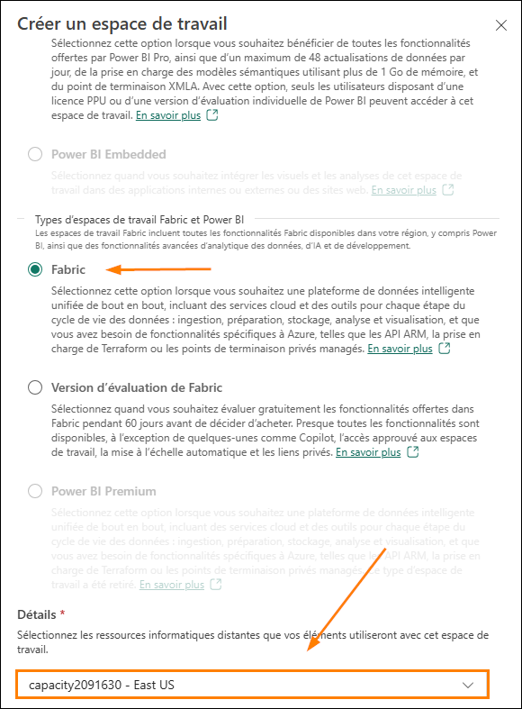

13. Cliquez sur **Appliquer**.

    

    Parfait ! Nous utiliserons l’espace de travail avec capacité Fabric pour explorer tout ce que l’expérience Chat with your Data a de mieux à offrir.

14. Ouvrez le fichier nommé **CDIAD – Lab 01 – Start** à partir des fichiers de la classe pour commencer à explorer l’expérience Chat with your Data.

    

15. Saisissez votre adresse e-mail **<inject key="AzureAdUserEmail"></inject>** dans le fichier Power BI Desktop et cliquez sur Continuer pour vous connecter à l’aide de vos identifiants :

    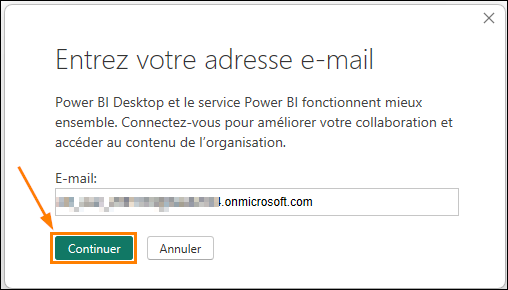

16. Connectez-vous également via la fenêtre de connexion Microsoft en utilisant le même nom d’utilisateur **<inject key="AzureAdUserEmail"></inject>** et le même mot de passe d’accès temporaire **<inject key="AzureAdUserPassword"></inject>**.

    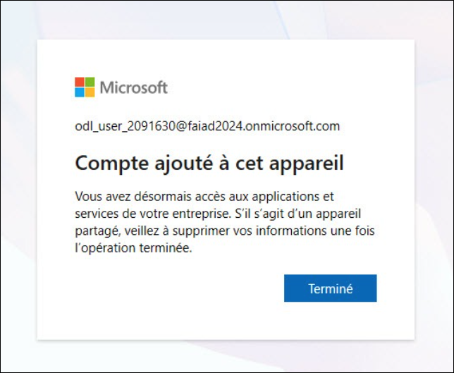

17. Une fois le fichier PBIX de départ ouvert, cliquez sur le bouton Copilot pour ouvrir l’expérience Copilot.

    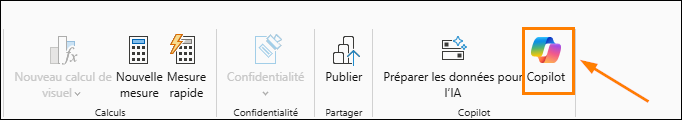

18. Si vous êtes déjà connecté, une nouvelle fenêtre s’ouvre pour vous permettre de vous **connecter à un espace de travail prenant en charge Copilot.** Cliquez sur l’option **Sélectionner un espace de travail** et choisissez l’espace de travail que vous venez de créer.

    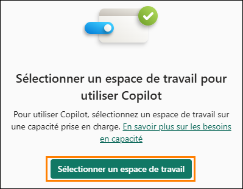

    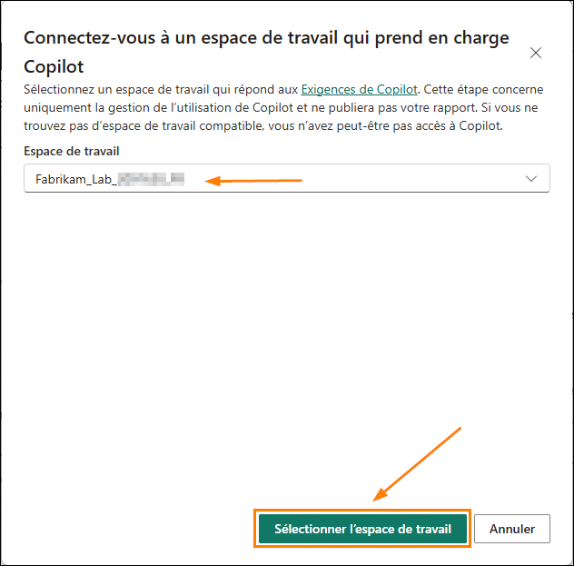

19. Si une invite s’affiche à l’écran suivant, cliquez sur **Démarrer**.

    

20. Bienvenue dans l’expérience Copilot dans Power BI ! Sur cet écran de démarrage, vous verrez des idées d’invites en haut de l’écran **(1)**, ainsi qu’une zone en bas dans laquelle vous pouvez saisir votre requête **(2)**.

    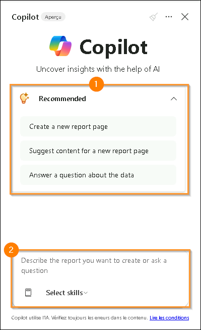

## Tâche 3 : Rédiger une requête dans Power BI Copilot

Dans cette section, vous allez rédiger différentes invites et explorer les résultats renvoyés par l’expérience Power BI Copilot.

1. Cliquez dans la zone d’invite et saisissez ce qui suit : **Show total purchases by employee**. Cliquez ensuite sur **Entrée**.

   

   **Options possibles :**

   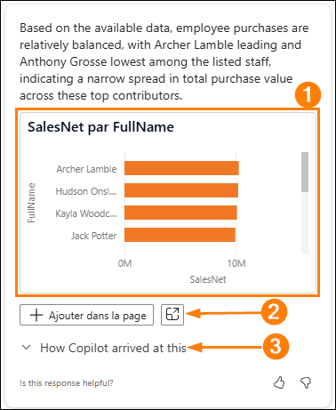

   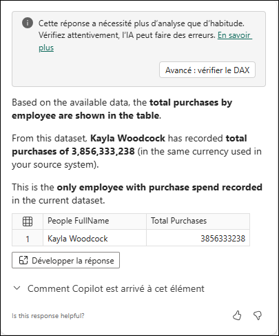

   **ℹ️ Important**

   L’IA renvoie des résultats non déterministes en raison de nombreux facteurs. Comme indiqué précédemment dans cette classe, vos résultats peuvent varier et ne pas être identiques à ceux du labo. Notez que ces données non préparées pour l’IA peuvent produire des résultats différents pour une même question. Poursuivez et explorez les capacités et fonctionnalités affichées du mieux possible.

   Il se peut même que l’on vous pose des questions de suivi comme celle ci-après :

   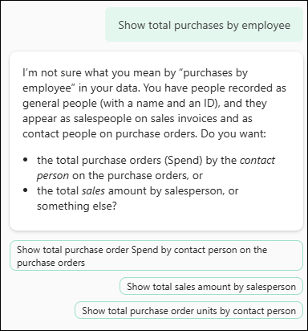

   Si nécessaire, choisissez l’option la plus proche de **Show total purchases by employee** ou **continuez à affiner la requête.**

2. De nombreuses informations sont maintenant affichées. Explorons cette section en détail.
   1. **(1)** Une visualisation comparant Total Purchases et Employees.

   2. **(2)** Des zones permettant d’**ajouter le visuel à la page** ou de l’**ouvrir dans une fenêtre** **agrandie**.

   3. **(3)** _HCAAT :_ Comment Copilot est arrivé à ce résultat.

      

3. Cliquez sur le bouton _HCAAT_ : **Comment Copilot est arrivé à ce résultat** afin de voir la logique utilisée par Copilot pour répondre.

   **Options possibles :**

   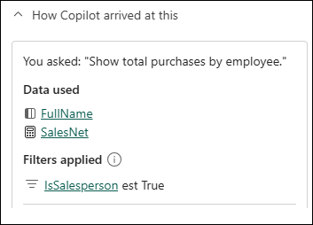

   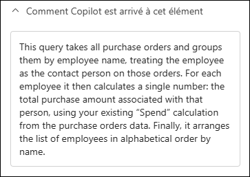

4. Survolez **_FullName_**, **_Sales_** et même **_IsSalesperson_** afin de voir à la fois le **champ** et la **table source** utilisés par Copilot pour répondre à la question.

   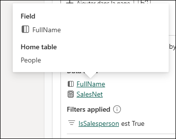

   Malheureusement, ce résultat est incorrect. Nous avons demandé le total des achats et avons reçu le **total des ventes** à la place. L’autre requête DAX ne prenait en compte qu’un seul employé. Il semble que ces données nécessitent une préparation. Voyez cela de la manière suivante : des données non préparées pour Copilot, c’est comme un analyste de données lors de son tout premier jour de travail ; des données préparées pour Copilot, c’est comme poser une question à un analyste expérimenté ayant de nombreuses années de connaissance de votre organisation. Il y a deux points principaux à prendre en compte lors de la préparation des données pour Copilot.

   Premièrement, nous pouvons rédiger une invite plus précise, ce qui contribuera clairement à améliorer le résultat. Cependant, de nombreux utilisateurs ne sauront pas comment rédiger des invites efficaces et ne connaîtront pas suffisamment les données pour être précis.

   Deuxièmement, en tant qu’analystes de données, nous pouvons préparer les données pour Copilot et anticiper ce type de demandes afin de rendre les réponses plus précises. L’objectif de cette classe est de vous enseigner les bonnes pratiques et les outils disponibles pour améliorer l’expérience Chat with your Data.

   **ℹ️ Important**

   Les réponses de Copilot dépendent fortement de la manière dont les questions sont formulées. Des invites claires et précises produisent des analyses plus exactes et des solutions plus rapides. Lorsque vous interrogez vos données, essayez d’inclure le contexte, le résultat attendu ainsi que les filtres ou colonnes pertinents. Plus votre invite est précise, meilleure sera la réponse.

5. Essayons à nouveau, mais avec une invite plus spécifique. Dans la zone d’invite Copilot, saisissez : **Show total purchases from the PO table by employee.**

   

6. Vous remarquerez que le visuel créé ne comporte qu’un seul employé nommé « Kayla Woodcock ». C’est correct. Kayla est la seule employée qui effectue des achats. En étant plus précis, nous obtenons donc de meilleures réponses. De plus, si nous avions préparé notre modèle sémantique dès le départ avec une mesure nommée Total Purchases, nous aurions pu éviter cette situation.

   **Options possibles :**

   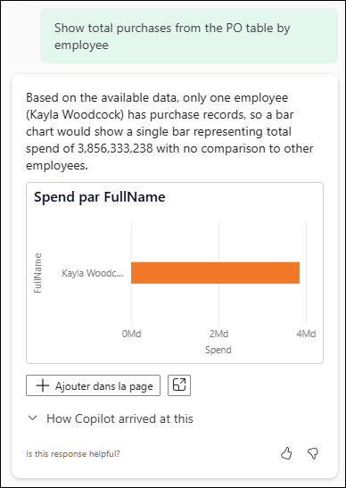

   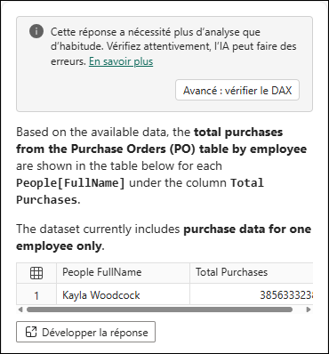

7. Il est très important de toujours valider les résultats et la manière dont Copilot est arrivé à la réponse. Cliquez sur **HCAAT** : Comment Copilot est arrivé à ce résultat.

   

   **Si** Copilot fournit une requête DAX, essayez de cliquer sur **Vérifier le DAX**.

   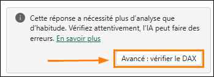

8. Nous pouvons voir que Copilot utilise la colonne FullName de la table People ainsi que la mesure Spend. Notre requête DAX fait exactement la même chose. La mesure Spend pourrait probablement être mieux nommée afin d’améliorer l’expérience Copilot.

   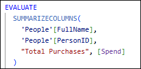

9. Que signifie Spend dans ce contexte ? Correspond-t-il réellement aux achats ? Il est possible que nous obtenions encore une réponse incorrecte. Demandons donc à Copilot d’expliquer comment la mesure Spend est calculée.

10. Dans la zone d’invite Copilot, saisissez : **How is the measure Spend calculated**

    **Options possibles :**

    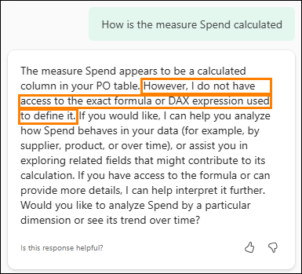

    

11. Copilot fournit une bonne explication générale de ce que fait probablement le calcul. Vous pouvez toutefois remarquer l’utilisation de termes comme « généralement » ou « habituellement », car il s’agit d’une généralisation. Vous constaterez également que Copilot indique explicitement qu’il n’a pas accès à la formule exacte ou à la logique de calcul et qu’il ne peut donc pas donner de réponse précise.

    Dans l’autre image, Copilot a réussi à récupérer la mesure réelle, à l’expliquer et à fournir la valeur associée à Spend dans le contexte de filtre actuel.

    **ℹ️ Important**

    Dans un futur labo, vous apprendrez comment fournir à Copilot un contexte métier supplémentaire afin qu’il puisse répondre à ces questions et renforcer la confiance des utilisateurs dans les réponses de Copilot.

12. Allons maintenant plus loin et créons un visuel pour démontrer comment Copilot s’adapte aux modifications du modèle de données et du rapport.

13. Dans la zone d’invite Copilot, saisissez : **Create a new report page with a bar chart visual for sales and product tag.**

    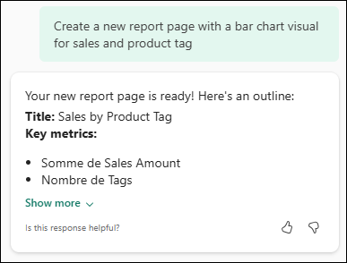

    Il peut être nécessaire de continuer à guider Copilot comme indiqué ici :

    

    Faites de votre mieux pour faire correspondre les éléments **Total Sales** et **Product Tag**.

    Remarquez que Copilot a créé le visuel sur une toute nouvelle page de rapport.

    **Options possibles :**

    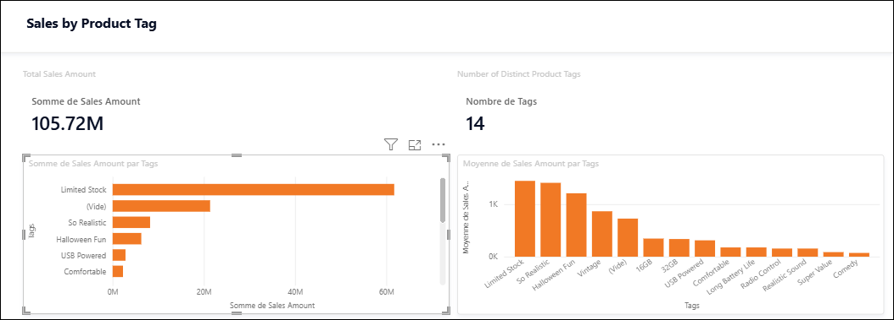

    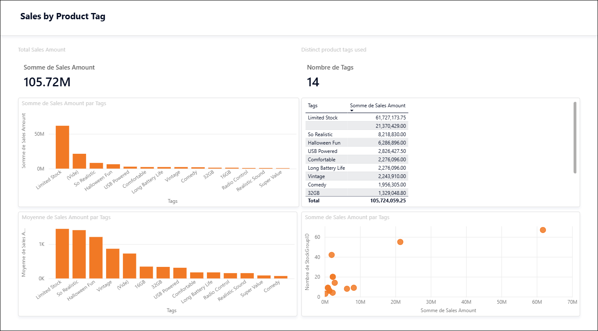

14. Sélectionnez le visuel de graphique à barres créé par Copilot et accédez à la **vue Modèle**. Vous remarquerez qu’il a inclus un filtre pour contourner notre modèle de données. Cela est remarquable, car Product Tag et Total Sales ne fonctionneraient normalement pas ensemble dans notre modèle actuel.

    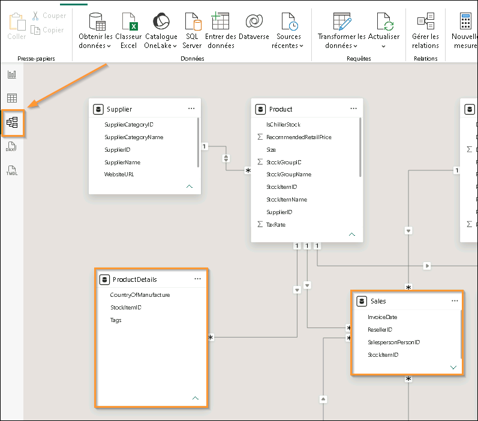

15. Cela peut entraîner un double comptage de certaines valeurs ; supprimons donc ce filtre. Revenez à la **vue Rapport** et assurez-vous que votre graphique est toujours sélectionné.

    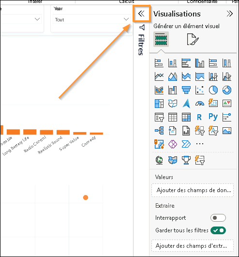

16. À droite, accédez à l’**onglet Filtres** et sous « Filtrer sur ce visuel », supprimez « Détails du produit contenant des produits » de l’axe du graphique à barres.

    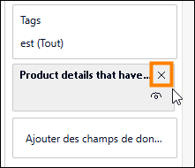

17. Notez que les valeurs sont toutes identiques, à savoir **105 724 059 \$**, ce qui est visible en survolant les barres du graphique que Copilot a créé. C’est un signe révélateur de relations incorrectes dans le modèle sémantique.

    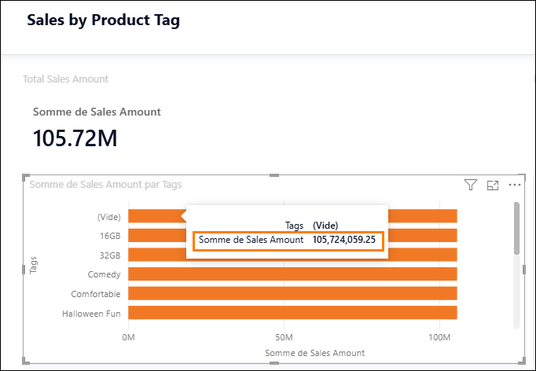

18. La réponse fournie par Copilot ci-dessus est incorrecte en raison de la conception du modèle sémantique. Copilot a néanmoins été capable de créer un filtre pour répondre à notre demande. Cela montre bien l’importance de disposer d’un modèle de données préparé pour l’IA. Dans un futur labo, nous examinerons les tables et les relations afin de les améliorer et d’optimiser l’expérience Copilot.

19. Le visuel met très clairement en évidence un problème dans la réponse de Copilot. Une autre manière d’examiner ces données consiste à poser une nouvelle question à Copilot et à analyser la réponse. Dans la zone d’invite de Copilot, saisissez : **Show total sales by product tag**.

    

20. Copilot indique explicitement dans sa réponse qu’il n’y a **aucune variation** dans les ventes. Lorsque vous voyez ce type de formulation dans Copilot, cela indique généralement qu’un élément n’est pas correct.

    

21. Essayons de poser autre question à Copilot : **Show total sales by State**.

    

    Il existe plusieurs réponses possibles et vos _résultats varieront probablement_. Voici une réponse possible :

    **Options possibles :**

    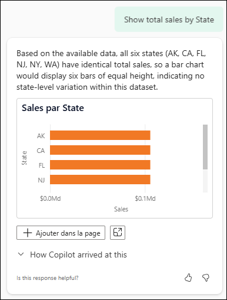

    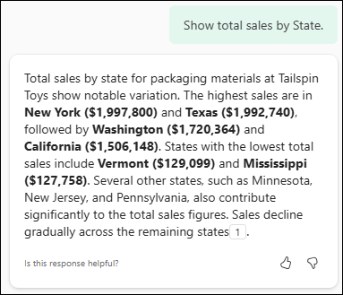

22. Cette réponse n’est pas tout à fait correcte. Un problème de modèle de données est à nouveau présent. S’agit-il du modèle de données ou du manque de précision dans notre formulation ? Sélectionnez _HCAAT_ : Comment Copilot est arrivé à ce résultat et survolez les champs des données **_State_** et **_Sales_** utilisées. Les données **_Sales_** sont correctement calculées à partir de la mesure explicite de la table Sales, mais le champ **_State_** provient de la table Customer.

    

23. Accédez à la vue Modèle et examinez les relations reliant Customer à Sales. Cela explique parfaitement pourquoi la visualisation est incorrecte. Nous constatons ici que le langage et le modèle de données doivent être alignés.

    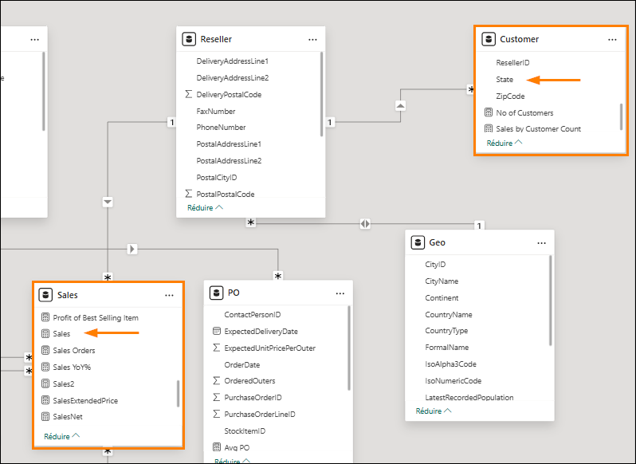

    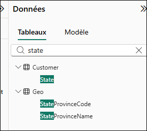

    Dans ce scénario, plusieurs tables contiennent des variantes de State, et nous avons également plusieurs mesures de vente. Cela peut produire des réponses incohérentes, voire trompeuses. Dans les labos suivants, vous apprendrez différentes techniques pour aider Copilot à répondre correctement à ce type de demandes.

24. Essayons une autre invite : **Sales by State**.

    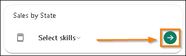

25. Dans les captures d’écran ci-dessous, vous pouvez voir que l’État du Texas affiche le plus de ventes, avec **461 457 \$ ou 2 millions \$**. Ces réponses ont été générées à partir de visuels présents dans le rapport, dont un comporte un filtre. Si vos résultats correspondent à la capture d’écran ci-dessous, cliquez sur la référence afin d’accéder à la page et au visuel correspondants.

    **Options possibles :**

    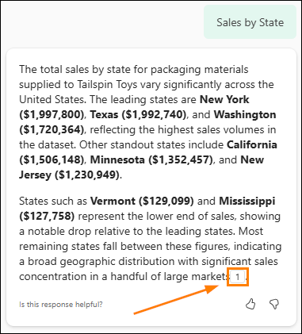

    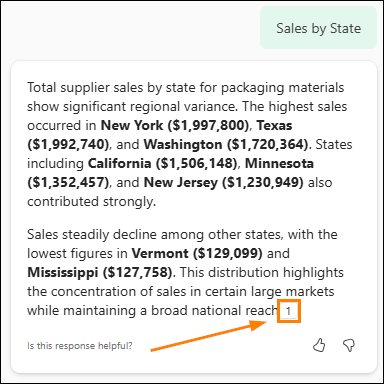

26. Maintenant, accédez à l’onglet du produit le plus vendu situé dans le ruban inférieur.

    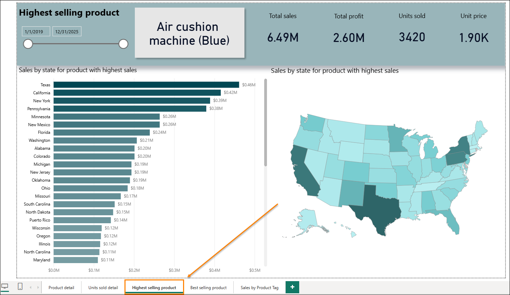

27. À première vue, les réponses peuvent sembler exactes, mais examinez attentivement les filtres potentiellement appliqués aux visuels. Si vous ne l’avez pas déjà fait, développez votre volet Filtre :

    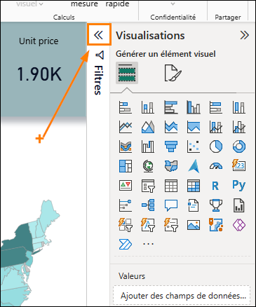

28. Un filtre est appliqué à ce visuel, ce qui peut influencer la réponse de Copilot. Développez le filtre et vous constaterez que **ce visuel n’affiche que les ventes du produit le plus vendu**. (Veillez à cliquer sur le visuel de carte)

    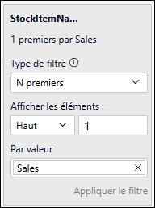

    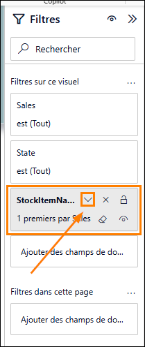

    **ℹ️ Important**

    Les filtres peuvent exister au niveau du visuel, de la page, du rapport ou même des segments. Copilot peut parfois générer une réponse à partir d’un visuel filtré sans avertir l’utilisateur final qu’un filtre est appliqué. Plus tard dans ce cours, nous verrons comment ajouter des instructions pour l’IA afin de gérer ce type de situation.

29. Supprimez ce filtre et observez à quel point les valeurs du visuel de référence changent de manière significative.

    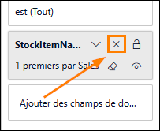

30. Le Texas affiche maintenant **7 256 794 \$**. Une différence considérable par rapport aux autres options. En regardant de plus près, vous constaterez qu’un visuel utilisait la mesure **Sales** et l’autre la mesure **Supplier Sales**. C’est une raison supplémentaire de préparer les données pour l’IA.

    

    

31. Que se passe-t-il si nous posons à nouveau la même question ? Interrogez Copilot une nouvelle fois : **Sales by State**.

    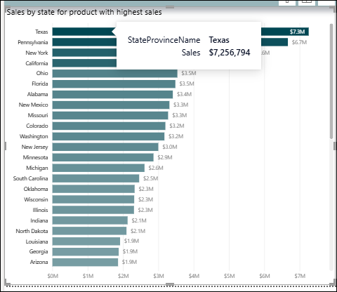

    

32. Sans le filtre, nous obtenons un ensemble de valeurs totalement différent pour la même référence. Il s’agit d’un point clé à prendre en compte lors de la préparation des données pour l’IA.

    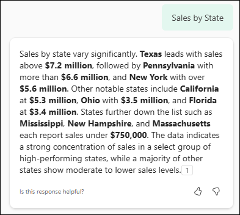

33. Qu’en est-il d’une réponse contenant plusieurs références ? Posez cette nouvelle question à Copilot : **Show the top selling product**.

    

34. Sélectionnez la référence et vérifiez la présence de filtres superflus.

    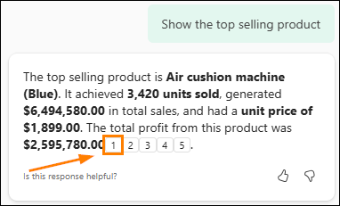

    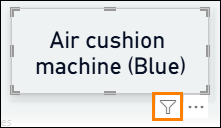

35. Ajoutez un filtre à la page à partir de la table Reseller pour **ResellerCompany**.

    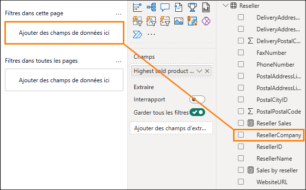

36. Sélectionnez uniquement TailSpin Toys et observez le changement des valeurs.

    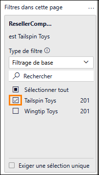

37. Posez à nouveau la question : **Show the top selling product**.

    

38. Le produit peut rester identique, mais les chiffres sont très différents. Cet exemple montre comment des modèles sémantiques non préparés peuvent produire des résultats incohérents et incorrects.

    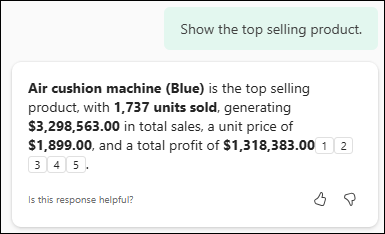

39. Un autre domaine intéressant à explorer avec Copilot est l’intégration du langage Data Analysis Expressions (DAX). Essayez de poser une question impliquant un calcul, comme par exemple : **Calculate the percent of total sales in the Southeast to the United States**.

    

40. Dans la réponse, vous remarquerez que Copilot reconnaît que cette question nécessite davantage d’analyse que d’habitude. Cela nous indique qu’il est nécessaire de valider le calcul.

    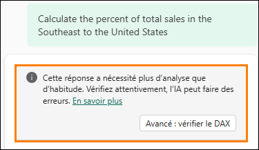

41. Dans ce cas précis, Copilot doit écrire du DAX. Nous pouvons examiner le DAX utilisé de deux manières : via l’option **Avancé : Vérifier le DAX** et via la zone **Développer la réponse**.

    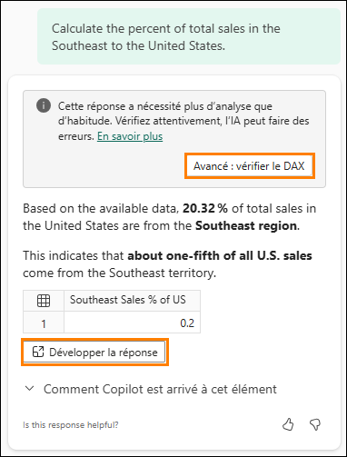

42. Assurez-vous de consulter l’onglet **Requête DAX** afin de voir le DAX utilisé pour produire la réponse. La requête est affichée avec une explication de la logique suivie. Deux questions doivent alors être posées : (1) La requête DAX est-elle correcte ? (2) La région Sud-Est représente-t-elle réellement**20,32 %** ?

    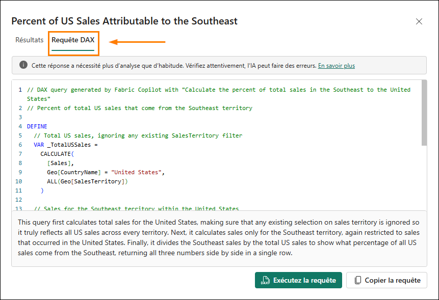

43. Chaque fois que Copilot génère du DAX, celui-ci peut être très différent et incohérent. Votre DAX peut ne pas correspondre aux captures d’écran de cette section. Dans ce code, DAX récupère l’État à partir de la table **Geo**, ce qui fonctionne, mais il aurait tout aussi bien pu utiliser la table **Customer**. S’il avait récupéré les données dans la table Customer, le résultat aurait été de seulement 3 à 4 %.

    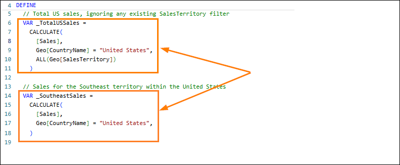

44. Comment résoudre ce problème ? La meilleure méthode sera abordée plus tard dans les labos, lors de la **préparation des données pour l’IA**. Pour l’instant, une façon de garantir une meilleure réponse consiste à rédiger une invite plus précise. Vous avez peut-être déjà obtenu des résultats à partir de la table **Geo**, mais cela reste néanmoins la deuxième meilleure façon de confirmer.

45. Posez à nouveau la question en utilisant cette invite : **Calculate the percent of total sales in the Southeast to the United States from the Geo table**.

    

46. Les résultats sont cette fois probablement similaires. Vous pouvez également consulter le DAX associé à la réponse.

    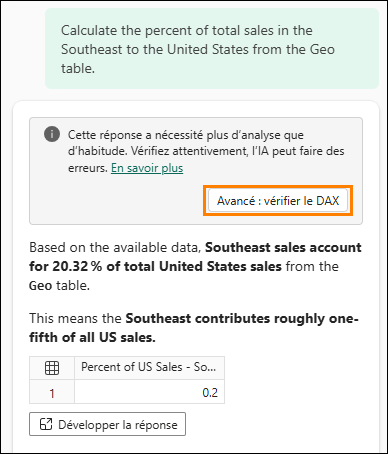

    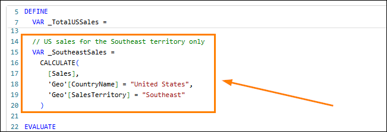

47. Parfait. Avec des invites bien réfléchies, les lacunes du modèle peuvent être compensées. Cependant, pour les utilisateurs finaux, nous souhaitons proposer une expérience permettant des requêtes plus générales.

48. Dans ce fichier PBIX, certaines préoccupations liées à la modélisation des données existent. Plus précisément, deux dimensions Snowflake sont présentes. Copilot gère relativement bien ces structures en appliquant des filtres et d’autres ajustements afin de fournir des réponses correctes. Toutefois, après examen du modèle et des besoins métier, nous avons décidé que ces deux dimensions (Supplier et Geo) ne sont pas nécessaires en tant que tables distinctes. Ces deux tables seront fusionnées avec d’autres tables du modèle afin de se rapprocher d’un schéma en étoile. À la fin de ce module, vous réaliserez le labo **CDIAD – Lab 02– Start**.
    - **Supplier :** les colonnes de la table Supplier ont été ajoutées à la table Product.

    - **Geo :** les colonnes de la table Geo ont été ajoutées à la table Reseller.

**ℹ️ Important**

Il est parfois nécessaire de créer des dimensions qui filtrent d’autres dimensions, ce qui conduit à une structure en flocon. Toutefois, lorsque cela est possible, le modèle sémantique doit être simplifié si les exigences métier le permettent. À mesure que de nouveaux besoins métier apparaissent et que de nouvelles tables sont intégrées, le modèle de données devient inévitablement plus complexe. Il est essentiel de prendre régulièrement le temps d’optimiser le modèle de données.

⭐Power BI fonctionne de manière optimale avec un schéma en étoile. Une discussion complète sur le schéma en étoile dépasse le cadre de cette classe. Veuillez consulter le lien Microsoft Learn suivant pour plus d’informations :

[**https://learn.microsoft.com/en-us/power-bi/guidance/star-schema**](https://learn.microsoft.com/en-us/power-bi/guidance/star-schema)

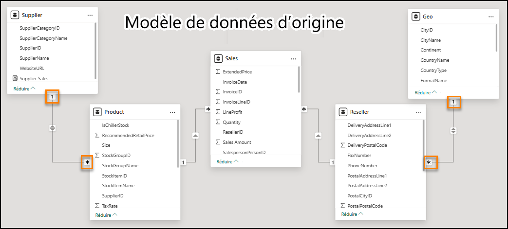

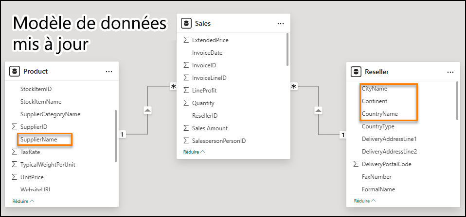

Voici quelques autres ressources qui vous aideront lors de vos prochaines étapes avec Microsoft Fabric :

- Accédez à toutes les informations dans la [Documentation Microsoft Fabric de base](https://learn.microsoft.com/en-us/fabric/)

- Explorez Fabric grâce à la [visite guidée](https://aka.ms/Fabric-GuidedTour)

- Inscrivez-vous pour bénéficier d’un [essai gratuit de Microsoft Fabric](https://aka.ms/try-fabric)

- Rendez-vous sur le [site web Microsoft Fabric](https://aka.ms/microsoft-fabric)

- Acquérez de nouvelles compétences en explorant les [modules d’apprentissage Fabric](https://aka.ms/learn-fabric)

- Lisez l’[e-book gratuit sur la prise en main de Fabric](https://aka.ms/fabric-get-started-ebook)

- Rejoignez la [communauté Fabric](https://aka.ms/fabric-community) pour publier vos questions, partager vos commentaires et apprendre des autres utilisateurs

Lisez la documentation technique détaillée relative à Copilot :

- [Vue d’ensemble de Copilot pour Power BI - Power BI | Microsoft Learn](https://learn.microsoft.com/en-us/power-bi/create-reports/copilot-introduction)

- [Expérience Copilot autonome dans Power BI (version préliminaire) – Power BI | Microsoft Learn](https://learn.microsoft.com/en-us/power-bi/create-reports/copilot-chat-with-data-standalone)

- [Microsoft FabricParamètres administrateur de Copilot | Microsoft Learn](https://learn.microsoft.com/en-us/fabric/admin/service-admin-portal-copilot)

- [Création d’un assistant de données Fabric (version préliminaire) : découvrez comment créer un assistant de données Fabric | Microsoft Learn](https://learn.microsoft.com/en-us/fabric/data-science/concept-data-agent)

- [Bonnes pratiques relatives à la configuration de votre assistant de données - Microsoft Fabric | Microsoft Learn](https://learn.microsoft.com/en-us/fabric/data-science/data-agent-configuration-best-practices)

- [Copilot pour Microsoft Fabric et Power BI : FAQ - Microsoft Fabric | Microsoft Learn](https://learn.microsoft.com/en-us/fabric/fundamentals/copilot-faq-fabric)

© 2026 Microsoft Corporation. Tous droits réservés.

En effectuant cette démonstration/ce labo, vous acceptez les conditions suivantes :

La technologie/fonctionnalité décrite dans cette démonstration/ce labo est fournie par Microsoft Corporation en vue d’obtenir vos commentaires et de vous fournir une expérience d’apprentissage. Vous pouvez utiliser cette démonstration/ce labo uniquement pour évaluer ces technologies et fonctionnalités, et pour fournir des commentaires à Microsoft. Vous ne pouvez pas l’utiliser à d’autres fins. Vous ne pouvez pas modifier, copier, distribuer, transmettre, afficher, effectuer, reproduire, publier, accorder une licence, créer des œuvres dérivées, transférer ou vendre tout ou une partie de cette démonstration/ce labo.

LA COPIE OU LA REPRODUCTION DE CETTE DÉMONSTRATION/CE LABO (OU DE TOUTE PARTIE DE CEUX-CI) SUR TOUT AUTRE SERVEUR OU AUTRE EMPLACEMENT EN VUE D’UNE AUTRE REPRODUCTION OU REDISTRIBUTION EST EXPRESSÉMENT INTERDITE.

CETTE DÉMONSTRATION/CE LABO FOURNIT CERTAINES FONCTIONNALITÉS DE PRODUIT/TECHNOLOGIES LOGICIELLES, NOTAMMENT D’ÉVENTUELS NOUVEAUX CONCEPTS ET FONCTIONNALITÉS, DANS UN ENVIRONNEMENT SIMULÉ SANS CONFIGURATION NI INSTALLATION COMPLEXES AUX FINS DÉCRITES CI-DESSUS. LES TECHNOLOGIES/CONCEPTS REPRÉSENTÉS DANS CETTE DÉMONSTRATION/CE LABO PEUVENT NE PAS REPRÉSENTER LES FONCTIONNALITÉS COMPLÈTES ET PEUVENT NE PAS FONCTIONNER DE LA MÊME MANIÈRE QUE DANS UNE VERSION FINALE. IL EST ÉGALEMENT POSSIBLE QUE NOUS NE PUBLIIONS PAS DE VERSION FINALE DE CES FONCTIONNALITÉS OU CONCEPTS. VOTRE EXPÉRIENCE D’UTILISATION DE CES FONCTIONNALITÉS DANS UN ENVIRONNEMENT PHYSIQUE PEUT ÉGALEMENT ÊTRE DIFFÉRENTE.

**COMMENTAIRES.** Si vous envoyez des commentaires sur les fonctionnalités, technologies et/ou concepts décrit(e)s dans ces labos/cette démonstration à Microsoft, vous accordez à Microsoft, sans frais, le droit d’utiliser, de partager et de commercialiser vos commentaires de quelque manière et à quelque fin que ce soit. Vous accordez également à des tiers, sans frais, les droits de brevet nécessaires pour leurs produits, technologies et services en vue de l’utilisation ou de l’interface avec des parties spécifiques d’un logiciel ou d’un service Microsoft incluant les commentaires. Vous n’enverrez pas de commentaires soumis à une licence exigeant que Microsoft accorde une licence pour son logiciel ou sa documentation à des tiers du fait que nous y incluons vos commentaires. Ces droits survivent à ce contrat.

MICROSOFT CORPORATION DÉCLINE TOUTES LES GARANTIES ET CONDITIONS EN CE QUI CONCERNE CETTE DÉMONSTRATION/CE LABO, Y COMPRIS TOUTES LES GARANTIES ET CONDITIONS DE QUALITÉ MARCHANDE, QU’ELLES SOIENT EXPLICITES, IMPLICITES OU LÉGALES, D’ADÉQUATION À UN USAGE PARTICULIER, DE TITRE ET D’ABSENCE DE CONTREFAÇON. MICROSOFT N’OFFRE AUCUNE GARANTIE OU REPRÉSENTATION EN CE QUI CONCERNE LA PRÉCISION DES RÉSULTATS, LA CONSÉQUENCE QUI DÉCOULE DE L’UTILISATION DE CETTE DÉMONSTRATION/CE LABO, OU L’ADÉQUATION DES INFORMATIONS CONTENUES DANS CETTE DÉMONSTRATION/CE LABO À QUELQUE FIN QUE CE SOIT.

**CLAUSE D’EXCLUSION DE RESPONSABILITÉ**

Cette démonstration/Ce labo comporte seulement une partie des nouvelles fonctionnalités et améliorations disponibles dans Microsoft Power BI. Certaines fonctionnalités sont susceptibles de changer dans les versions ultérieures du produit. Dans ce labo/cette démonstration, vous allez découvrir comment utiliser certaines nouvelles fonctionnalités, mais pas toutes.
