# Microsoft Fabric Chat with your Data in a Day - Labo 2

## Sommaire

- Structure du document
- Scénario/Énoncé du problème
- Introduction
  - Tâche 1 : Filtrage bidirectionnel / schéma en étoile
  - Tâche 2 : Renommage des colonnes, tables et mesures
  - Tâche 3 : Descriptions
  - Tâche 4 : Catégories de données
  - Tâche 5 : Agrégation
  - Tâche 6 : Trier par propriété de colonne
  - Tâche 7 : Schéma linguistique : synonymes

# Structure du document

Le labo comprend des étapes à suivre par l’utilisateur, ainsi que des captures d’écran associées qui fournissent une aide visuelle. Dans chaque capture d’écran, des sections sont mises en évidence avec des encadrés orange afin de souligner la ou les zones sur laquelle/lesquelles l’utilisateur doit se concentrer.

# Scénario/Énoncé du problème

Votre entreprise a terminé sa phase initiale de tests ainsi que la phase de tests de préparation à Copilot. Il a été constaté que le modèle actuel n’est pas encore prêt pour l’expérience Copilot autonome et que des bonnes pratiques généralement admises doivent être mises en œuvre dans Power BI Desktop. Afin que Copilot puisse fournir des réponses pertinentes, le modèle sémantique sous-jacent doit être soigneusement conçu et optimisé.

Votre modèle sémantique présente actuellement les défis suivants :

- Les noms des tables et des colonnes peuvent être cryptiques et difficiles à interpréter.

- Aucune description n’est définie pour les tables, les colonnes et les mesures.

- Les catégories de données sont sous-utilisées, ce qui limite la compréhension contextuelle de Copilot.

- La logique de tri et les agrégations par défaut peuvent ne pas correspondre aux attentes des utilisateurs.

- Les relations et le schéma linguistique ne sont pas configurés ou optimisés pour offrir une expérience Copilot optimale.

# Introduction

Ces lacunes peuvent entraîner de la confusion, des réponses inexactes, des visuels trompeurs ou des insights manqués lorsque les utilisateurs interagissent avec Copilot. Dans ce labo, vous apprendrez à affiner le modèle sémantique en appliquant les bonnes pratiques de nommage, de catégorisation, de synthèse, de modélisation des données et de schéma linguistique.

## Tâche 1 : Filtrage bidirectionnel / schéma en étoile

1. Ouvrez le fichier nommé **CDIAD – Lab 02– Start** dans vos fichiers de classe afin de commencer à préparer vos données pour l’IA.

    

2. Une question posée lors du labo précédent était : **Create a new report page with a visual for sales and product tag**. Cela a généré une réponse de Copilot affichant des données dupliquées (voir la capture d’écran ci-dessous). En général, lorsque vous observez le même résultat pour tous les points de données, cela indique un problème de relation dans le modèle de données.

    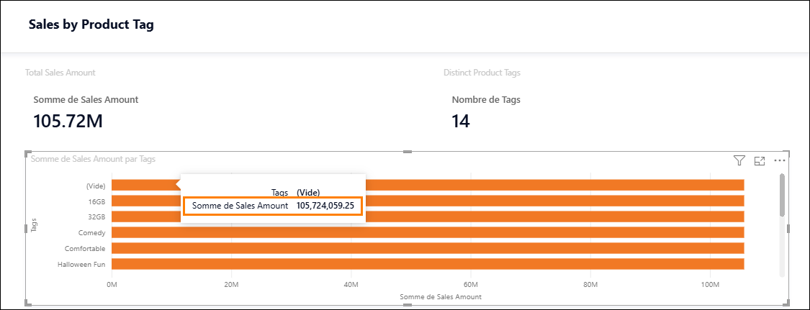

3. Vous trouverez ci-dessous une capture d’écran de la relation entre Tag dans la table Product Details et la mesure Sales dans la table Sales :

    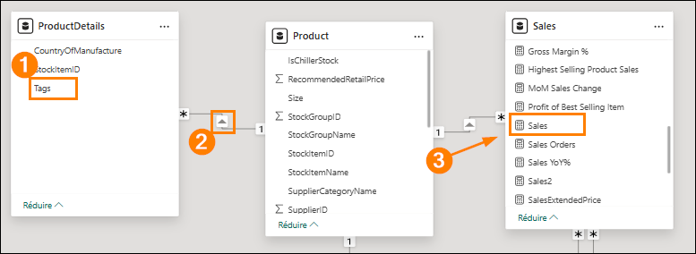

4. Lorsque nous demandons à Copilot d’afficher les Sales par Tags, le rapport généré présente des données dupliquées. Cela se produit parce que la colonne Tags de la table Product Details ne peut pas filtrer la table Product. La direction du filtre entre Product et Product Details est unidirectionnelle, de la table Product vers la table Product Details . Il existe deux approches pour résoudre ce problème.

    - La première consiste à créer une mesure DAX qui calcule le total des ventes en appliquant explicitement le filtre nécessaire provenant de la table Tags. Cette approche permet de conserver un modèle simple, mais nécessite la création d’une nouvelle mesure pour chaque besoin métier, ce qui peut devenir fastidieux.

    - La seconde approche, celle que nous allons mettre en œuvre ici, consiste à autoriser le filtrage dans les deux directions. En mettant à jour la relation entre Product et Product Details, la colonne Tags pourra filtrer jusqu’à la table Sales, et Copilot pourra générer une réponse correcte.

5. Mettons donc à jour la relation dans le modèle de données. *Voir la capture d’écran suivante :*

    1. Cliquez sur la vue Modèle dans le volet de navigation gauche.

    2. Sélectionnez la relation entre Product et Product Details.

    3. Dans le volet Propriétés, modifiez la direction du filtrage croisé de Unique à Les deux.

        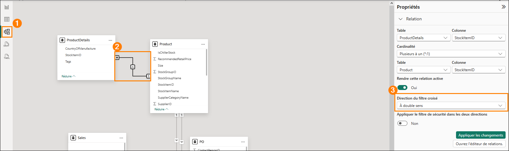

    **ℹ️ Important**

    En tant que bonne pratique, vous devez éviter autant que possible d’activer le filtrage bidirectionnel. Dans certains cas, cela peut entraîner des ambiguïtés dans les résultats ainsi que des problèmes de performances. Comme indiqué précédemment, une alternative consiste à créer des mesures DAX qui forcent manuellement le filtrage pour un besoin spécifique. D’autres alternatives existent, mais ne sont pas abordées dans ce cours.

6. Nous pouvons maintenant poser à nouveau la question dans la **vue Rapport** et constater la qualité améliorée des résultats ! Ouvrez à nouveau l’expérience de conversation instantanée Copilot dans Power BI et posez la question suivante : **Show total sales by product tag**.

    

    En cas de demande de clarification, précisez la **mesure Sales** à utiliser.

    

7. Résultats corrects :

    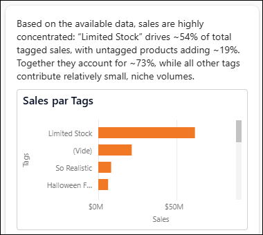

    *Si un autre visuel est généré, reformulez la demande en précisant que vous souhaitez un **graphique à barres***.

    

    Résultats précédents :

    

    La modélisation des données a toujours été l’un des aspects les plus importants, sinon le plus important, de Power BI. Un modèle de données bien défini et réfléchi facilite la création de rapports, l’écriture de DAX, la mise en œuvre de la sécurité et l’efficacité de Copilot.

## Tâche 2 : Renommage des colonnes, tables et mesures

1. Lors du labo précédent, nous avons rencontré des situations où Copilot utilisait des colonnes, des tables ou des mesures inattendues. Ces difficultés sont à prévoir dans des modèles de données en pleine croissance et, afin de mieux préparer nos données pour l’IA, nous devons procéder à des ajustements de nommage.

2. Commençons par renommer les tables de manière appropriée. Cliquez sur la table **PO**, puis sélectionnez **Renommer**. Modifiez le nom de la **table PO** en **Purchase Orders**.

    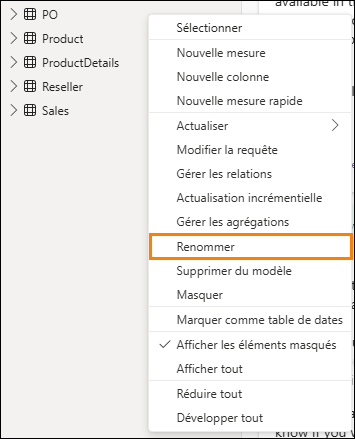

    

3. Ensuite, renommez les colonnes en suivant la même méthode. Commencez par développer la table **Reseller**.

    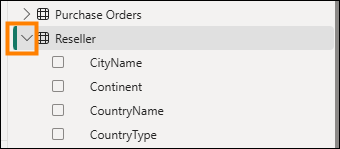

4. Double-cliquez ou cliquez avec le bouton droit sur la colonne **[SPName]** et renommez-la en **State**.

    

    

5. Poursuivez les renommages comme suit :

    renommez **Reseller[CountryName]** en **Country**

    Dans la table **Sales**, renommez la mesure **MoM Sales Change** en **Month over Month Sales Change**

    Dans la table **Sales**, renommez la mesure **Sales YoY%** en **Sales Year over Year %**

    Dans la table **Purchase Orders** renommez la mesure **Spend** en **Total Purchases**

    **ℹ️ Important**

    Des noms clairs et descriptifs pour les tables et les colonnes font une grande différence. Copilot interprète vos invites en fonction de la structure du modèle. Plus le nommage est intuitif, plus Copilot peut générer des mesures DAX, des visuels et des insights précis. Renommez de manière réfléchie pour améliorer la compréhension de Copilot et votre propre productivité.

## Tâche 3 : Descriptions

1. Poursuivons la préparation du modèle en ajoutant des descriptions. Les descriptions peuvent être définies pour les tables, les colonnes et les mesures dans la vue Modèle. Elles aident Copilot à mieux comprendre le contexte lors des requêtes utilisateur. Les descriptions de table agissent comme un accès privilégié pour Copilot, lui fournissant le contexte nécessaire pour générer des informations précises et pertinentes, des résumés, et même des mesures DAX. Pour commencer, restons dans la **vue Modèle**.

2. Sélectionnez la table **Purchase Orders**. Dans la zone **Propriétés**, vous trouverez le champ **Description** où nous allons créer une description pour aider Copilot. Voici quelques bonnes pratiques :

    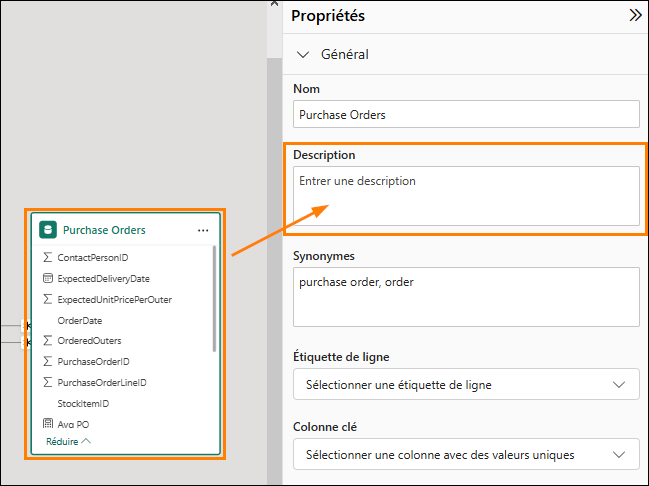

    ### Bonnes pratiques pour les descriptions de table

    **Commencez par l’objectif** : que représente la table en termes métier ?

    **Ajoutez le contexte métier :** expliquez comment la table soutient le reporting ou la prise de décision.

    **Mentionnez la granularité :** est-elle transactionnelle, quotidienne, agrégée, etc. ?

    **Mettez en avant les colonnes clés :** surtout celles utilisées dans les relations ou les calculs.

    **Décrivez les cas d’utilisation courants :** quels types de questions ou de visuels cette table prend en charge.

    **Mentionnez les relations :** indiquez comment la table se connecte aux autres tables du modèle.

    **ℹ️ Important**

    **Des descriptions bien rédigées aident Copilot à comprendre la finalité et le contexte de vos données.** Utilisez les descriptions pour clarifier ce que représente une table ou une colonne, en particulier lorsque les noms ne suffisent pas. Copilot s’appuie sur ces indices pour générer des réponses, du DAX et des visuels plus pertinents. Considérez les descriptions comme une occasion de guider Copilot, ainsi que vos utilisateurs, vers des informations de plus haute qualité.

3. Insérez cette description détaillée mais précise dans le champ :

    *This Purchase Orders table captures individual line items from purchase orders submitted within the organization. Each row represents a specific product ordered, including the quantity requested, the date of the order, and the employee who initiated the request. It supports analysis of procurement trends, supplier demand, and employee purchasing behavior. Key columns include ProductID, QuantityOrdered, OrderDate, and EmployeeID. This table links to Products, Employees, and PurchaseOrders tables to enable detailed reporting across procurement workflows.*

    Cela aidera grandement Copilot à formuler de meilleures réponses, en particulier en ce qui concerne la table **Purchase Orders**. Poursuivons en créant de meilleures descriptions pour certaines colonnes. Sélectionnez la colonne **Order Date** dans la table **Purchase Orders** et ajoutez une description similaire :

    ### Bonnes pratiques pour les descriptions de colonne dans les modèles sémantiques

    **Commencez par le sens métier :** décrivez ce que représente la colonne en termes métier.

    **Précisez les unités, le format ou l’échelle :** s’il s’agit d’une valeur numérique, d’une date ou d’une catégorie, expliquez comment elle est structurée.

    **Mentionnez les cas d’utilisation courants :** aidez Copilot à comprendre comment cette colonne est généralement utilisée dans les analyses ou les rapports. Exemple : Chiffre d’affaires : montant total des ventes pour chaque transaction ; utilisé pour l’analyse de la rentabilité et des tendances

    **Évitez les redondances :** ne répétez pas ce qui est évident compte tenu du nom de colonne, sauf si cela apporte de la clarté. Enrichissez plutôt avec du contexte. Par exemple, pour EmployeeID, vous pourriez ajouter la description suivante : Unique identifier for the employee who submitted the order.

    **Utilisez un ton cohérent :** gardez des descriptions concises, informatives et cohérentes dans tout le modèle. Voyez cela comme des info-bulles destinées à un analyste curieux.

4. Sélectionnez la table **Purchase Orders**, puis cliquez sur **OrderDate**. Saisissez la description suivante :

    **The calendar date when the purchase order was submitted by an employee.**

    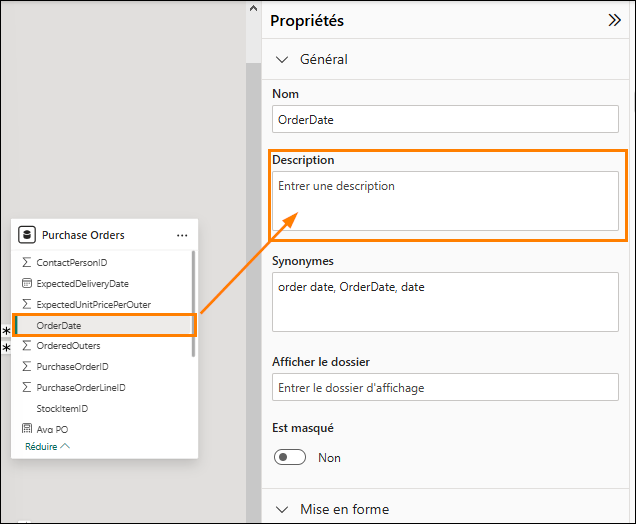

5. Maintenant que nous avons ajusté les **descriptions** de table et de colonne, ajoutons une description à une mesure. Cette fois-ci, nous allons utiliser Copilot pour nous aider à créer la description. Commencez par sélectionner la mesure **Purchase Orders**. Ensuite, sélectionnez **Créer avec Copilot**.

    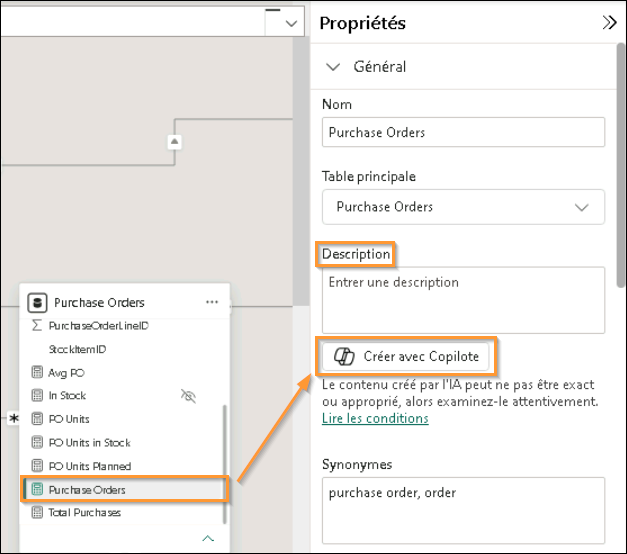

6. Notez que la description générée par Copilot est prête à être examinée. Cette réponse peut varier, mais elle devrait convenir pour vérifier et détailler notre description. Vous pouvez appuyer sur **Réessayer**, mais lorsque vous êtes prêt, sélectionnez **Conserver**.

    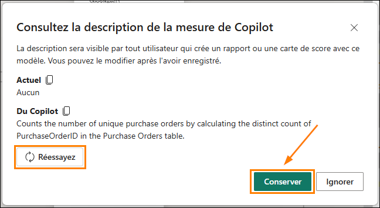

    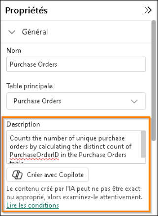

    Dans cette section, vous avez appris à ajouter des descriptions aux tables, aux colonnes et aux mesures. Dans un modèle sémantique réel, vous étendriez ce que nous avons fait ici à l’ensemble de vos tables ainsi qu’à toutes les colonnes et mesures pertinentes. Vous avez maintenant considérablement amélioré la capacité de Copilot à travailler avec les données et à enrichir toutes ses réponses futures.

## Tâche 4 : Catégories de données

L’attribution de catégories de données aux colonnes dans Power BI est essentielle pour Copilot, notamment dans les modèles sémantiques intégrant des données géographiques, web ou des images. Ces catégories agissent comme des balises de métadonnées qui aident Copilot (ainsi que les visuels) à interpréter la finalité de la colonne, au-delà de son simple nom ou de son type de données.

1. Accédez à la **vue Table** et sélectionnez la table Reseller. Commencez par sélectionner la colonne **State** dans la table **Reseller**.

    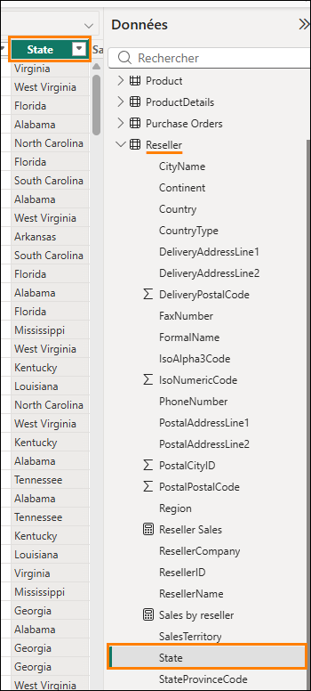

2. Lorsque vous avez sélectionné la colonne **State**, un nouveau menu du ruban apparaît en haut de votre rapport Power BI, intitulé **Outils de colonne**. Cliquez sur Outils de colonne. Commençons par modifier la **catégorie de données**.

    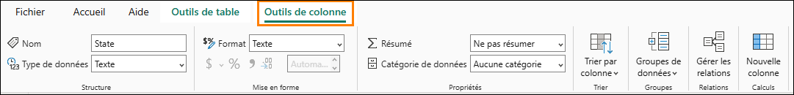

3. Développez la section **Catégorie de données** et remplacez la catégorie Non classé par **État ou province**.

    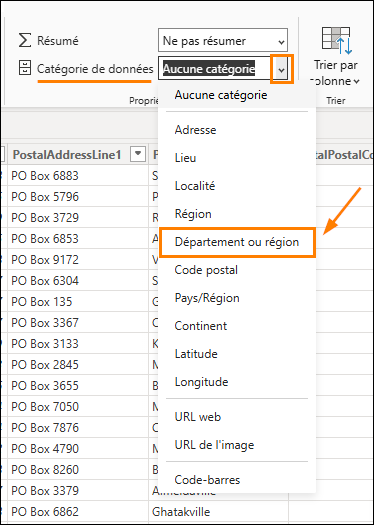

4. Continuez d’ajouter des catégories de données pour les colonnes restantes ci-dessous :

    | **Nom de la table** | **Nom de la colonne** | **Catégorie de données** |
    |---------------------|-----------------------|--------------------------|
    | Reseller | Country | Pays/région |
    | Reseller | DeliveryPostalCode | Code postal |
    | Reseller | PostalPostalCode | Code postal |
    | Reseller | Website URL | URL web |

    **ℹ️ Important**

    **Définir les catégories de données aide Copilot à comprendre comment traiter vos données.** Qu’il s’agisse de données géographiques, d’URL ou d’images, l’attribution de la catégorie appropriée fournit à Copilot le contexte nécessaire pour générer des visuels, des filtres et des analyses plus pertinents. Par exemple, baliser une colonne en tant que « City » permet à Copilot de la cartographier instantanément. C’est une petite étape qui apporte une grande valeur.

## Tâche 5 : Agrégation

Dans cette section, nous allons apprendre comment l’agrégation par défaut dans Power BI peut affecter les réponses de Copilot. Il ne s’agit pas d’une nouveauté dans Power BI, mais c’est un point crucial pour Copilot.

1. Ouvrez Copilot, depuis la **vue Rapport**, et saisissez l’invite suivante : **What is customer age by state?**

    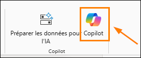

    

2. Consultez les résultats et constatez qu’un résultat inattendu peut apparaître. Placez le pointeur sur les barres de données correspondant à WA, NY ou à d’autres États : vous constaterez que la somme de Age est renvoyée ! Vous vous attendriez probablement à voir la moyenne ici, mais comme la colonne Age utilise par défaut une agrégation de type Somme, Copilot effectue cette agrégation.

    Copilot peut également demander une clarification comme sur l’image ci-dessous. Quoi qu’il en soit, nous pouvons obtenir systématiquement la moyenne en modifiant le mode de synthèse, ce qui évite d’avoir à poser des questions supplémentaires.

    

    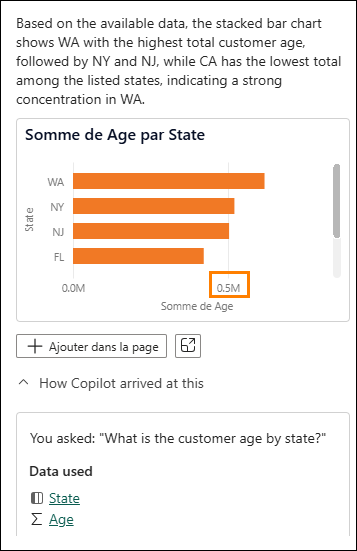

3. En survolant Age, vous pouvez vérifier que Copilot a appliqué une agrégation de type somme sur cette colonne.

    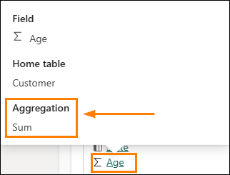

4. Nous pourrions écrire une invite plus précise en demandant explicitement l’âge moyen, et cela fonctionnerait. Cependant, la meilleure option consiste à améliorer le modèle de données lorsque cela est possible ; nous allons donc ajuster la propriété **Agrégation par défaut**.

    **ℹ️ Important**

    **L’agrégation par défaut indique à Copilot comment traiter vos colonnes dans les visuels et les calculs.** Qu’il s’agisse de Ne pas agréger, Somme ou Moyenne, un paramétrage correct aide Copilot à générer des graphiques et du DAX plus précis. Par exemple, définissez les identifiants ou les noms sur « Ne pas agréger » afin d’éviter des totaux trompeurs. C’est un moyen rapide d’orienter Copilot vers des analyses pertinentes.

5. Dans votre requête Copilot, saisissez : **What is customer age average by state.**

    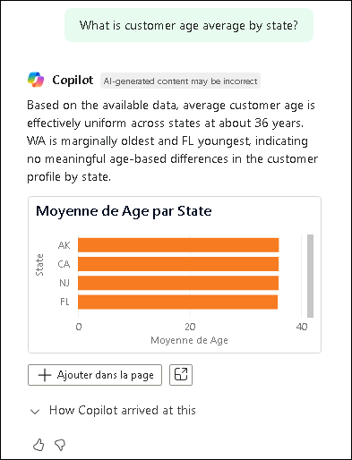

6. Ajustons la propriété **Agrégation par défaut**. Sélectionnez la colonne **Age** dans la table Customer pour afficher Outils de colonne. Recherchez la section **Agrégation** et définissez Age sur **Moyenne**.

    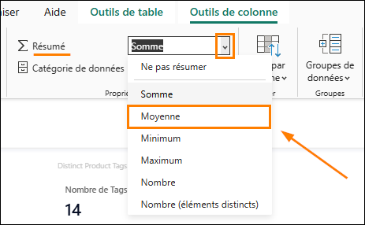

7. Dans la conversation instantanée Copilot, posons à nouveau la question : **What is customer age by state?**

    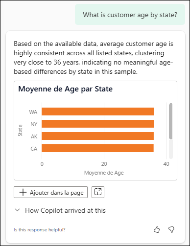

    Parfait ! Il s’agit du résultat attendu ; cela permettra aux utilisateurs de poser leurs questions de manière plus naturelle et de prendre en charge les variations normales dans la formulation de leurs requêtes. Il est tout aussi important de désactiver l’agrégation par défaut sur les colonnes numériques qui ne doivent pas être agrégées. Les colonnes telles que Année, Trimestre et Numéro de mois, par exemple, ne doivent pas être agrégées.

## Tâche 6 : Trier par propriété de colonne

1. La propriété Trier par colonne, comme l’agrégation par défaut, n’est pas nouvelle dans Power BI, mais un paramétrage correct peut aider Copilot à renvoyer des résultats dans un ordre conforme à ce que vous attendez. Par exemple, si vous affichez les ventes par mois, le visuel est, par défaut, trié du mois ayant les ventes les plus élevées vers celui ayant les ventes les plus faibles. Testons cela.

2. Réinitialisez votre Copilot Chat si vous ne l’avez pas déjà fait en appuyant sur la zone **Effacer la conversation instantanée**.

    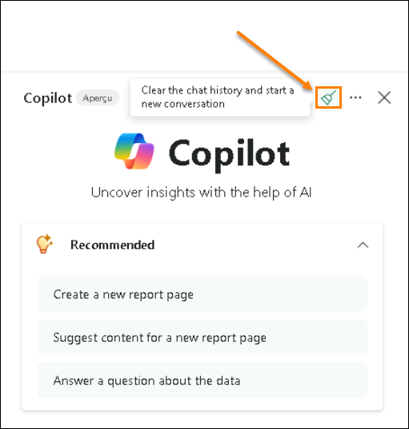

3. Saisissez maintenant la requête suivante : **Show total sales by month as a column chart.**

    

4. Les résultats sont corrects, mais le tri ne correspond pas à l’ordre habituel des mois du calendrier grégorien (janvier, février, mars… décembre). Les résultats sont renvoyés soit par ordre alphabétique, soit, comme ici, triés des ventes les plus élevées aux ventes les plus faibles.

    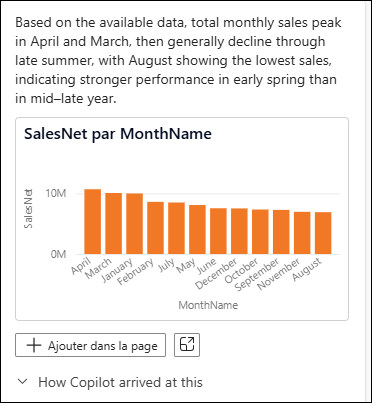

    **ℹ️ Important**

    **Utilisez « Trier par colonne » pour contrôler la manière dont Copilot présente vos données.** Ce paramètre aide Copilot à afficher les données de sorte que des catégories comme les mois ou des libellés personnalisés apparaissent dans l’ordre attendu dans les visuels et les résumés. Par exemple, trier « Nom de mois » par « Numéro de mois » aide Copilot à créer des graphiques temporels précis. C’est un ajustement simple qui permet d’éviter des résultats déroutants.

5. Nous devons ajuster le mode de tri de la colonne **MonthName** à partir de la section **Trier par colonne** dans **Outils de colonne**. Sélectionnez la colonne MonthName dans la table **Date**.

6. Développez Trier par colonne et définissez le tri sur Month :

    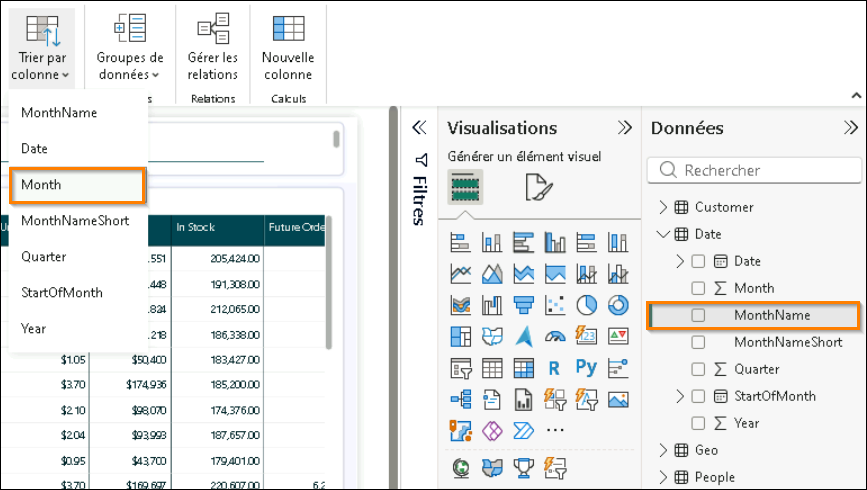

7. Demandez à nouveau à Copilot Chat : **Show total sales by month**, et vous obtenez désormais les résultats attendus.

    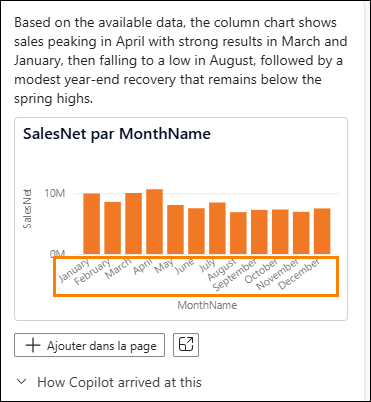

## Tâche 7 : Schéma linguistique : synonymes

Le **schéma linguistique** est un élément clé qui permet d’exploiter tout le potentiel de Copilot en tant que partenaire d’analytique en langage naturel. Considérez-le comme un guide de traduction pour votre modèle de données. Sans lui, Copilot devine ; avec lui, Copilot maîtrise beaucoup mieux vos données.

**Qu’est-ce que le schéma linguistique ?**

Le schéma linguistique est un ensemble de métadonnées qui relie votre modèle sémantique au langage naturel. Il aide Copilot à comprendre :

- ce que signifient vos tables et colonnes ;

- comment elles se rapportent à des concepts métier ; et

- quels synonymes, expressions et types de questions les utilisateurs peuvent employer lorsqu’ils interagissent avec les données.

Par exemple, au lieu de simplement lire les noms de colonnes, Copilot comprend que :

- « Chiffre d’affaires » = TotalSales

- « Commandes passées » = PurchaseOrderCount

- « Performances des employés » = SalesByEmployee

Cela signifie que Copilot peut répondre à des questions comme :

- « Which region had the highest revenue last quarter? »

- « Show me top-performing employees by sales volume »

Sans schéma linguistique, Copilot peut mal interpréter des termes vagues ou suggérer des visuels non pertinents. Avec lui, vous obtenez :

- de meilleures suggestions DAX ;

- des recommandations de visuels plus pertinentes ; et

- des résumés et insights plus précis

**Prise en charge des synonymes et du langage naturel**

Vous pouvez définir des synonymes comme :

- « PO » = « Purchase Order »

- « Rép » = « Représentant commercial »

- « Qté » = « Quantité commandée »

1. Observons maintenant l’interface du **schéma linguistique**. Commencez par sélectionner la **vue Modèle** ou, si vous êtes dans la vue Rapport, le ruban Modélisation. Accédez ensuite à la section **Configuration des Q/R**.

    

2. Il existe un menu riche et puissant pour aider la fonctionnalité Q/R de votre modèle de données Copilot à mieux comprendre les utilisateurs. Le menu principal comporte de nombreuses sections pour démarrer.

    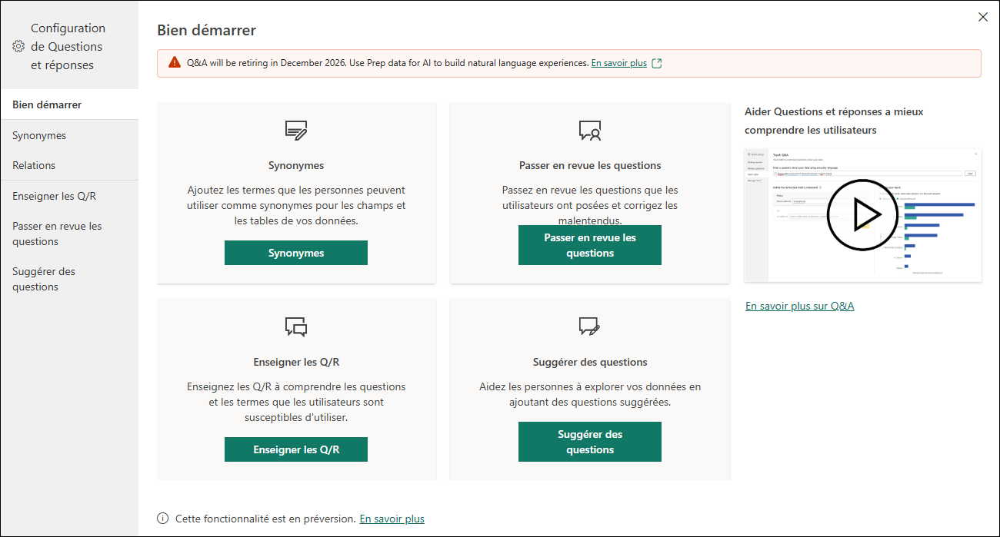

3. Accédons à la première section, le menu Synonymes.

    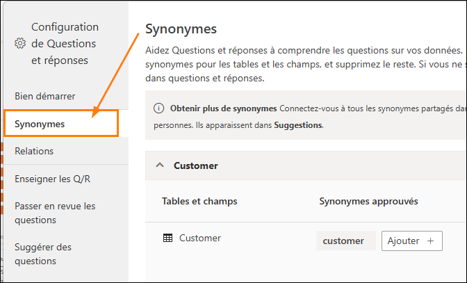

4. Des synonymes plus précis aideront Copilot à comprendre les différentes façons dont les utilisateurs peuvent formuler leurs questions. Vous pouvez aussi changer de table pour atteindre la bonne colonne en appuyant sur l’icône en chevron.

    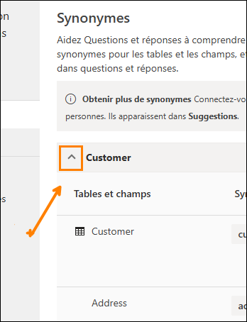

    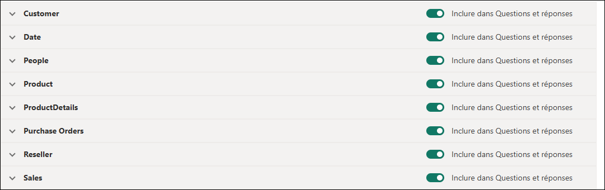

5. Aidons Copilot en rendant les synonymes de **Reseller** plus spécifiques. Assurez-vous que la table **Reseller** est développée et que vous pouvez voir tous les synonymes actuels associés à la colonne **ResellerID** ainsi que les Suggestions.

6. Chez Fabrikam, les revendeurs sont souvent appelés ***Fabrikam Friends*** et…….. Ajoutons-les comme synonymes afin que les employés puissent poser des questions en utilisant notre jargon Fabrikam. Sélectionnez **Ajouter** sur **acheteur** et saisissez le synonyme.

    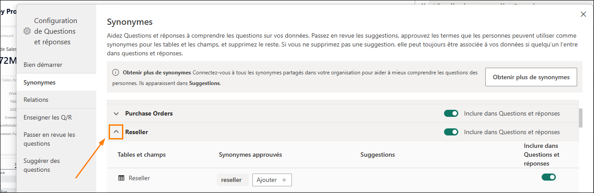

7. Ajoutez ***Fabrikam Friends*** à l’aide du bouton Ajouter +.

    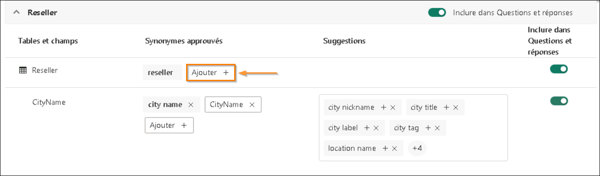

    

8. Vous remarquerez que Copilot évalue l’ajout et propose automatiquement d’autres suggestions pertinentes.

    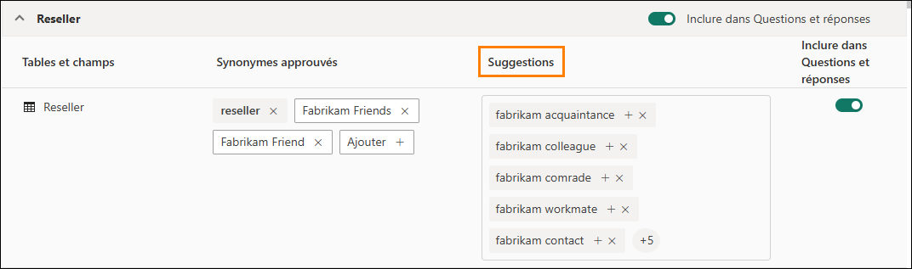

9. Ajoutons maintenant un autre synonyme pour la table Reseller en utilisant l’une des suggestions. Cliquez sur une suggestion de votre choix, comme ***Fabrikam Acquaintance***.

    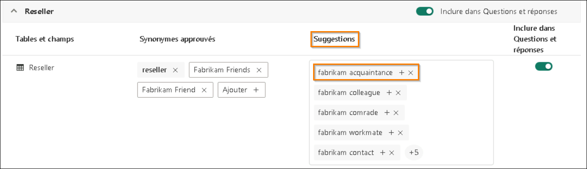

    Le processus d’ajout de synonymes est un mécanisme évolutif qui s’améliore au fil du temps. N’hésitez pas à explorer d’autres tables et colonnes et à ajouter des synonymes supplémentaires dans votre fichier Power BI Desktop.

10. Parfait ! Examinons à présent les **Relations**. Accédez-y dans le menu de configuration des Q/R.

    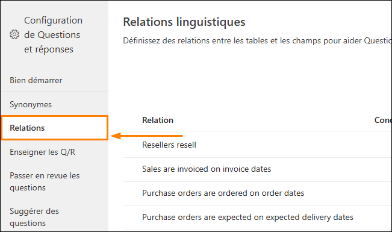

    Les relations linguistiques définissent des relations entre les tables et les champs afin d’aider la fonctionnalité de Q/R à comprendre les questions portant sur vos données. Elles sont similaires aux relations du modèle de données, mais exprimées d’une manière que Copilot peut comprendre sur le plan linguistique.

    Par exemple, les relations peuvent servir à clarifier des ambiguïtés. Si votre modèle comporte plusieurs champs de date répartis sur différentes tables, vous pouvez créer des relations entre ces dates afin d’aider Copilot à déterminer laquelle utiliser en fonction du contexte et des connexions entre les tables.

    Pour ajouter de nouvelles relations, commencez par cliquer sur + Nouvelle relation, comme indiqué dans la capture d’écran ci-dessous.

    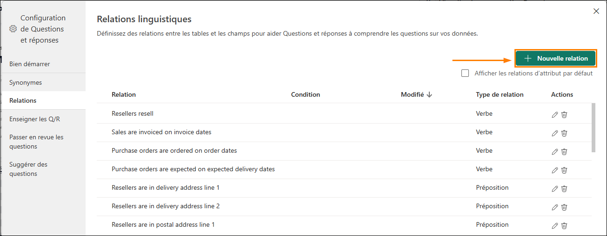

11. À partir de là, vous pouvez créer de nombreuses relations linguistiques différentes. Les options actuelles incluent les verbes, les adjectifs, les noms, les prépositions, les noms propres et les associations. Voir la capture d’écran des options disponibles ci-dessous avec des exemples :

    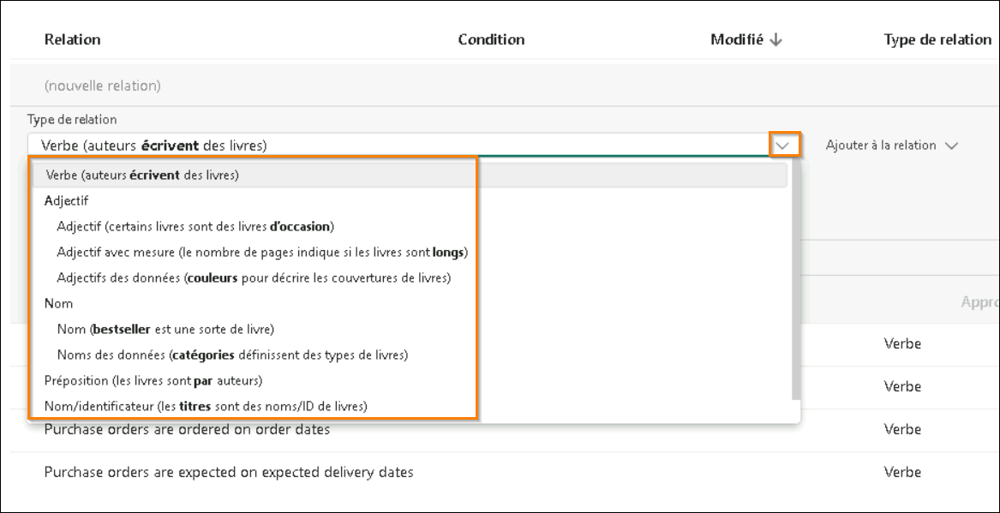

12. Dans ce labo, vous ne créerez aucune relation dans le modèle. Comme pour l’ajout de synonymes, il s’agit d’un processus évolutif qui nécessite des mises à jour et de la maintenance à mesure que l’on comprend mieux la manière dont les utilisateurs interrogent les données avec Copilot et comment le schéma linguistique peut être exploité pour améliorer cette expérience.

    **ℹ️ Important**

    **Les relations dans le schéma linguistique définissent la manière dont Copilot comprend les liens entre les tables lorsqu’il répond en langage naturel.** Elles influencent l’interprétation de questions comme « sales by product category » ou « orders by region ». Sans relations claires, Copilot peut avoir du mal à relier des concepts entre les tables. Les définir correctement assure des conversations plus fluides et plus intuitives.

13. Nous pouvons maintenant passer en revue les autres éléments de la configuration des questions-réponses. Explorons la section **Enseigner les Q/R** et sélectionnons-la.

    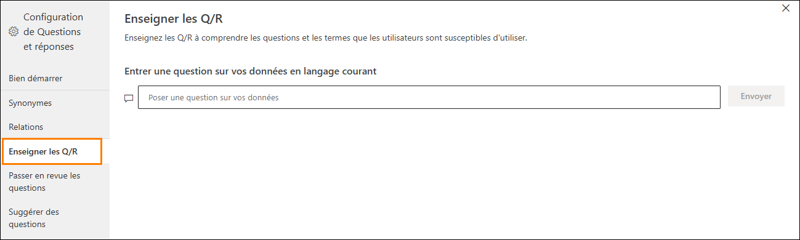

14. Ici, nous pouvons enseigner les Q/R, afin que le système comprenne les questions et les expressions que les utilisateurs pourraient employer.

    Demandez à Q/R : **How many sales happen in january?**

    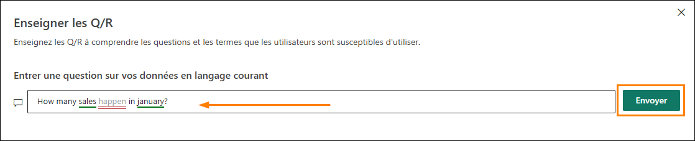

    Vous verrez que Copilot répertorie désormais « happen » comme un terme reconnu ! Cela vous permettra d’affiner la configuration pour mieux répondre à ce type de questions.

    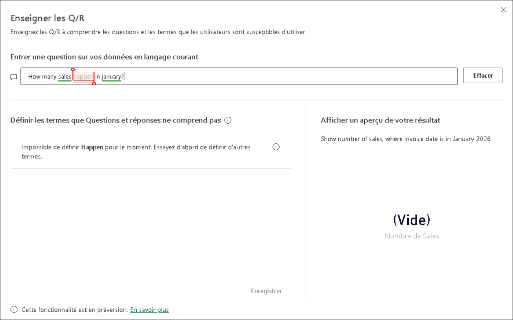

15. Vous pouvez réessayer avec une autre requête, par exemple : « What is the total sales for january 2022? », et obtenir les résultats correspondants. Cela devient un excellent espace de test.

    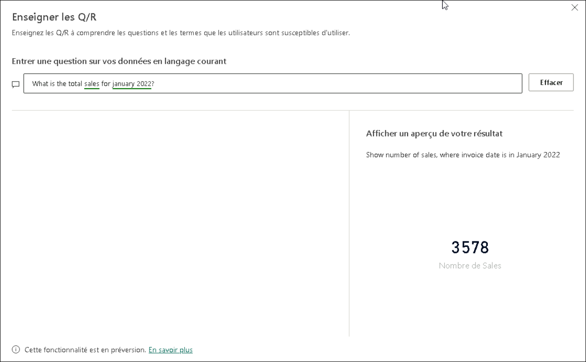

16. Vous pouvez également observer l’effet des synonymes et des relations en action : **What is sales by Fabrikam Friends?**

    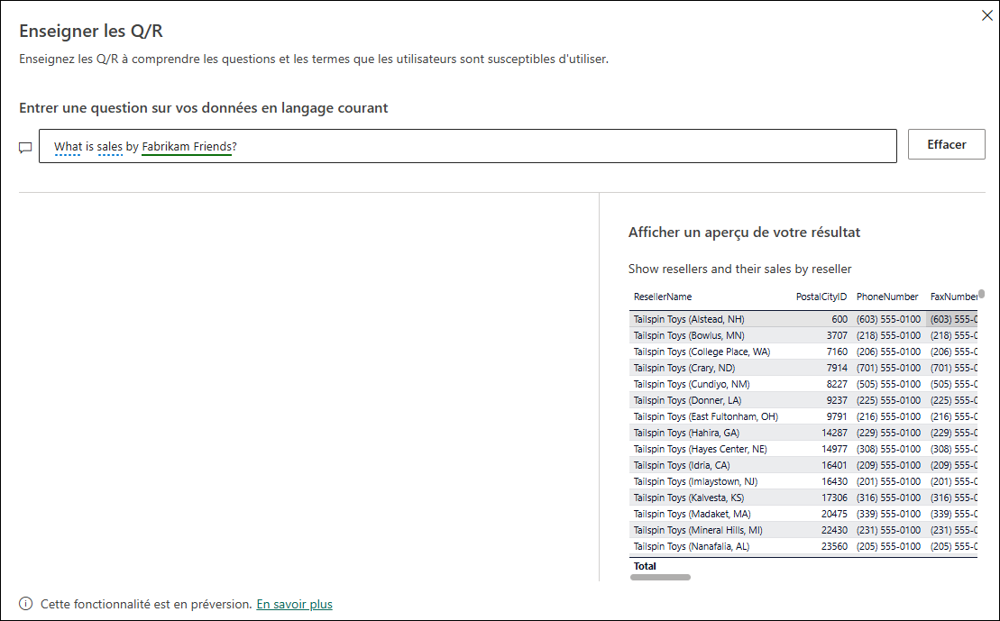

17. Ensuite, accédez à la section **Passer en revue les questions**. Les questions posées par les utilisateurs au sein de l’abonné peuvent être analysées et ajustées afin d’améliorer l’expérience à l’avenir.

    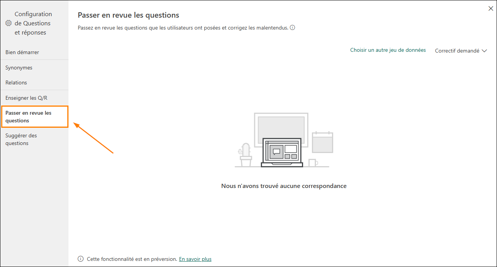

18. Enfin, accédez à **Suggérer des questions**. Ici, vous pouvez aider les utilisateurs à explorer les données en ajoutant des questions suggérées.

    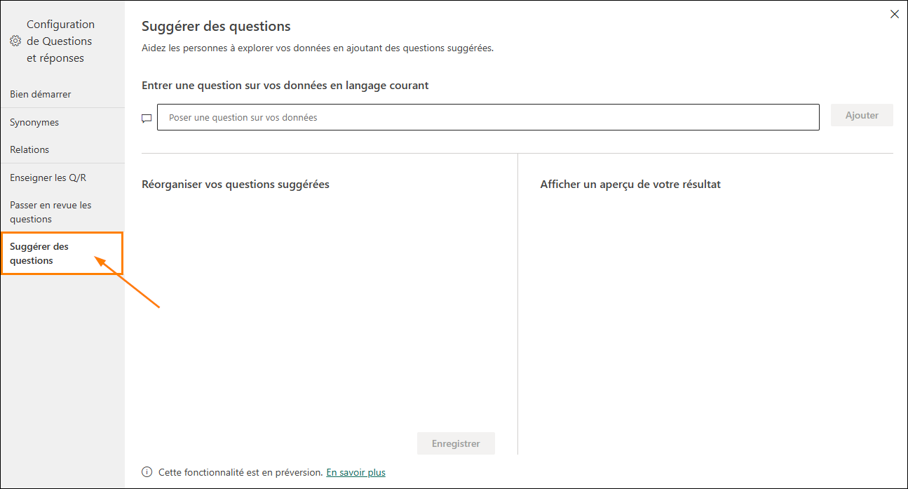

19. Pour les accompagner, sélectionnons la zone Posez une question sur vos données et ajoutons une suggestion : **What is total sales by State?** Vous pouvez ensuite appuyer sur Envoyer et voir un aperçu.

    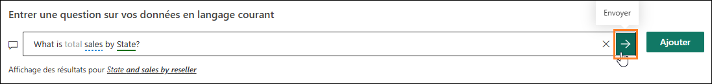

    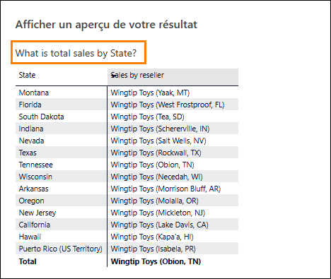

20. Cliquez sur **Ajouter** pour enregistrer la suggestion.

    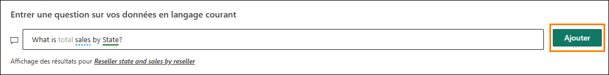

21. **Enregistrez** vos résultats, et vous avez terminé le labo 2.

    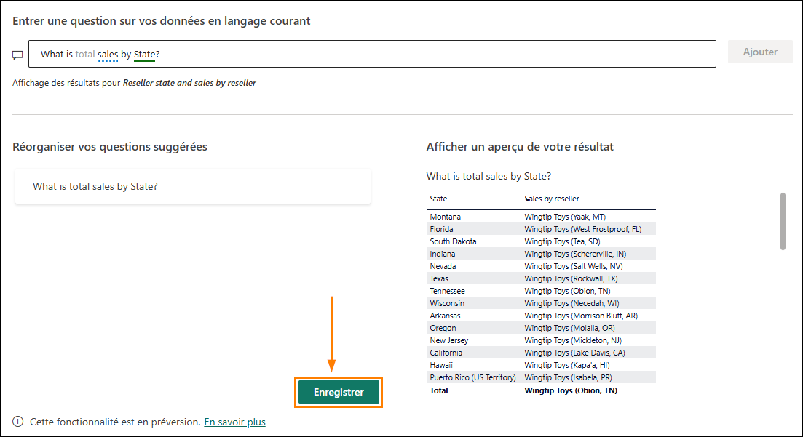

    Dans ce labo, vous avez découvert les bonnes pratiques de modélisation des données afin d’améliorer les performances et la précision des réponses en langage naturel de Copilot pour les modèles sémantiques Power BI.

    Voici quelques autres ressources qui vous aideront lors de vos prochaines étapes avec Microsoft Fabric :

    - Accédez à toutes les informations dans la [Documentation Microsoft Fabric de base](https://learn.microsoft.com/en-us/fabric/)

    - Explorez Fabric grâce à la [visite guidée](https://aka.ms/Fabric-GuidedTour)

    - Inscrivez-vous pour bénéficier d’un [essai gratuit de Microsoft Fabric](https://aka.ms/try-fabric)

    - Rendez-vous sur le [site web Microsoft Fabric](https://aka.ms/microsoft-fabric)

    - Acquérez de nouvelles compétences en explorant les [modules d’apprentissage Fabric](https://aka.ms/learn-fabric)

    - Lisez l’[e-book gratuit sur la prise en main de Fabric](https://aka.ms/fabric-get-started-ebook)

    - Rejoignez la [communauté Fabric](https://aka.ms/fabric-community) pour publier vos questions, partager vos commentaires et apprendre des autres utilisateurs

    Lisez la documentation technique détaillée relative à Copilot :

    - [Vue d’ensemble de Copilot pour Power BI - Power BI | Microsoft Learn](https://learn.microsoft.com/en-us/power-bi/create-reports/copilot-introduction)

    - [Expérience Copilot autonome dans Power BI (version préliminaire) – Power BI | Microsoft Learn](https://learn.microsoft.com/en-us/power-bi/create-reports/copilot-chat-with-data-standalone)

    - [Microsoft FabricParamètres administrateur de Copilot | Microsoft Learn](https://learn.microsoft.com/en-us/fabric/admin/service-admin-portal-copilot)

    - [Création d’un assistant de données Fabric (version préliminaire) : découvrez comment créer un assistant de données Fabric | Microsoft Learn](https://learn.microsoft.com/en-us/fabric/data-science/concept-data-agent)

    - [Bonnes pratiques relatives à la configuration de votre assistant de données - Microsoft Fabric | Microsoft Learn](https://learn.microsoft.com/en-us/fabric/data-science/data-agent-configuration-best-practices)

    - [Copilot pour Microsoft Fabric et Power BI : FAQ - Microsoft Fabric | Microsoft Learn](https://learn.microsoft.com/en-us/fabric/fundamentals/copilot-faq-fabric)

    © 2026 Microsoft Corporation. Tous droits réservés.

    En effectuant cette démonstration/ce labo, vous acceptez les conditions suivantes :

    La technologie/fonctionnalité décrite dans cette démonstration/ce labo est fournie par Microsoft Corporation en vue d’obtenir vos commentaires et de vous fournir une expérience d’apprentissage. Vous pouvez utiliser cette démonstration/ce labo uniquement pour évaluer ces technologies et fonctionnalités, et pour fournir des commentaires à Microsoft. Vous ne pouvez pas l’utiliser à d’autres fins. Vous ne pouvez pas modifier, copier, distribuer, transmettre, afficher, effectuer, reproduire, publier, accorder une licence, créer des œuvres dérivées, transférer ou vendre tout ou une partie de cette démonstration/ce labo.

    LA COPIE OU LA REPRODUCTION DE CETTE DÉMONSTRATION/CE LABO (OU DE TOUTE PARTIE DE CEUX-CI) SUR TOUT AUTRE SERVEUR OU AUTRE EMPLACEMENT EN VUE D’UNE AUTRE REPRODUCTION OU REDISTRIBUTION EST EXPRESSÉMENT INTERDITE.

    CETTE DÉMONSTRATION/CE LABO FOURNIT CERTAINES FONCTIONNALITÉS DE PRODUIT/TECHNOLOGIES LOGICIELLES, NOTAMMENT D’ÉVENTUELS NOUVEAUX CONCEPTS ET FONCTIONNALITÉS, DANS UN ENVIRONNEMENT SIMULÉ SANS CONFIGURATION NI INSTALLATION COMPLEXES AUX FINS DÉCRITES CI-DESSUS. LES TECHNOLOGIES/CONCEPTS REPRÉSENTÉS DANS CETTE DÉMONSTRATION/CE LABO PEUVENT NE PAS REPRÉSENTER LES FONCTIONNALITÉS COMPLÈTES ET PEUVENT NE PAS FONCTIONNER DE LA MÊME MANIÈRE QUE DANS UNE VERSION FINALE. IL EST ÉGALEMENT POSSIBLE QUE NOUS NE PUBLIIONS PAS DE VERSION FINALE DE CES FONCTIONNALITÉS OU CONCEPTS. VOTRE EXPÉRIENCE D’UTILISATION DE CES FONCTIONNALITÉS DANS UN ENVIRONNEMENT PHYSIQUE PEUT ÉGALEMENT ÊTRE DIFFÉRENTE.

    **COMMENTAIRES.** Si vous envoyez des commentaires sur les fonctionnalités, technologies et/ou concepts décrit(e)s dans ces labos/cette démonstration à Microsoft, vous accordez à Microsoft, sans frais, le droit d’utiliser, de partager et de commercialiser vos commentaires de quelque manière et à quelque fin que ce soit. Vous accordez également à des tiers, sans frais, les droits de brevet nécessaires pour leurs produits, technologies et services en vue de l’utilisation ou de l’interface avec des parties spécifiques d’un logiciel ou d’un service Microsoft incluant les commentaires. Vous n’enverrez pas de commentaires soumis à une licence exigeant que Microsoft accorde une licence pour son logiciel ou sa documentation à des tiers du fait que nous y incluons vos commentaires. Ces droits survivent à ce contrat.

    MICROSOFT CORPORATION DÉCLINE TOUTES LES GARANTIES ET CONDITIONS EN CE QUI CONCERNE CETTE DÉMONSTRATION/CE LABO, Y COMPRIS TOUTES LES GARANTIES ET CONDITIONS DE QUALITÉ MARCHANDE, QU’ELLES SOIENT EXPLICITES, IMPLICITES OU LÉGALES, D’ADÉQUATION À UN USAGE PARTICULIER, DE TITRE ET D’ABSENCE DE CONTREFAÇON. MICROSOFT N’OFFRE AUCUNE GARANTIE OU REPRÉSENTATION EN CE QUI CONCERNE LA PRÉCISION DES RÉSULTATS, LA CONSÉQUENCE QUI DÉCOULE DE L’UTILISATION DE CETTE DÉMONSTRATION/CE LABO, OU L’ADÉQUATION DES INFORMATIONS CONTENUES DANS CETTE DÉMONSTRATION/CE LABO À QUELQUE FIN QUE CE SOIT.

    **CLAUSE D’EXCLUSION DE RESPONSABILITÉ**

    Cette démonstration/Ce labo comporte seulement une partie des nouvelles fonctionnalités et améliorations disponibles dans Microsoft Power BI. Certaines fonctionnalités sont susceptibles de changer dans les versions ultérieures du produit. Dans ce labo/cette démonstration, vous allez découvrir comment utiliser certaines nouvelles fonctionnalités, mais pas toutes.
