# Microsoft Fabric Chat with your Data in a Day - Labo 3

## Sommaire

- Structure du document
- Scénario/Énoncé du problème
- Introduction
- Préparer les données pour Copilot
  - Tâche 1 : Simplifier le schéma des données
  - Tâche 2 : Ajouter des instructions pour l’IA
  - Tâche 3 : Créer des réponses vérifiées
  - Tâche 4 : À vous de jouer
- Conclusion
- Références

# Structure du document

Le labo comprend des étapes à suivre par l’utilisateur, ainsi que des captures d’écran associées qui fournissent une aide visuelle. Dans chaque capture d’écran, des sections sont mises en évidence avec des encadrés orange afin de souligner la ou les zones sur laquelle/lesquelles l’utilisateur doit se concentrer.

# Scénario/Énoncé du problème

Vous avez récemment activé Copilot dans Microsoft Fabric afin d’aider les utilisateurs à interagir avec les données de manière plus intuitive. Cependant, les premiers retours d’utilisation ont mis en évidence que Copilot fournit parfois des réponses inexactes ou déroutantes. Ces problèmes découlent de modèles de données excessivement complexes, d’une terminologie ambiguë et de définitions peu claires au sein de la couche sémantique.

Afin d’améliorer la compréhension et les résultats de Copilot, vous avez appris que vous pouvez préparer votre modèle de données à l’aide de la fonctionnalité Préparer les données pour l’IA dans Power BI. Cela inclut la simplification du schéma, l’ajout d’instructions pour l’IA et la création de réponses vérifiées afin d’orienter Copilot vers des réponses plus précises et mieux contextualisées.

**Défis actuels**

- Réduire l’ambiguïté des réponses de Copilot causée par des mesures et une terminologie peu claires.

- Veiller à ce que Copilot comprenne les définitions spécifiques au métier (par exemple, la distinction entre meilleures ventes et ventes les plus élevées).

- Fournir des réponses vérifiées aux questions courantes afin d’améliorer la cohérence et la fiabilité.

- Limiter l’accès de Copilot aux éléments de données inutiles ou trompeurs.

# Introduction

Jusqu’à présent, vous avez appris à évaluer l’état de préparation d’un modèle sémantique pour Copilot, ainsi que les bonnes pratiques associées au modèle sémantique. Vous allez maintenant passer à l’étape suivante en préparant ces modèles pour une utilisation avec Copilot. Dans ce labo, vous utiliserez la fonctionnalité Préparer les données pour l’IA afin de simplifier votre schéma, d’ajouter des instructions pour l’IA et de créer des réponses vérifiées, autant d’éléments qui aident Copilot à fournir des analyses plus précises et pertinentes pour le métier.

À la fin de ce labo, vous saurez :

- Simplifier un schéma des données afin d’orienter le comportement de Copilot

- Ajouter des instructions pour l’IA afin de clarifier la terminologie métier

- Créer des réponses vérifiées afin de renforcer la précision de Copilot

# Préparer les données pour Copilot

Dans cette section, vous allez préparer un modèle de données en vue de son utilisation avec Copilot. Cette étape est nécessaire, car Copilot peut fournir des réponses erronées ou déroutantes lorsque le modèle de données comporte des mesures inutiles, des définitions imprécises ou une terminologie ambiguë. C’est pourquoi le bouton **Préparer les données pour l’IA** est disponible dans l’onglet Accueil du ruban Power BI.

## Tâche 1 : Simplifier le schéma des données

1. Ouvrez le fichier PBIX nommé **CDIAD – Lab 03 - Start** dans vos fichiers de classe.

    

2. Cliquez sur le bouton Copilot, sur le ruban **Accueil**.

    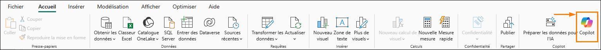

3. Demandez à Copilot : **What reseller has the highest sales?** Appuyez sur **Entrée** ou cliquez sur la **flèche.**

    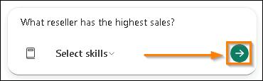

4. Vous pouvez voir les résultats dans la capture d’écran ci-dessous. Ces résultats ne sont pas ceux que nous attendions. Copilot a utilisé la mesure [Reseller Sales], alors que nous voulons qu’il utilise [Sales by Reseller].

    **Options possibles :**

    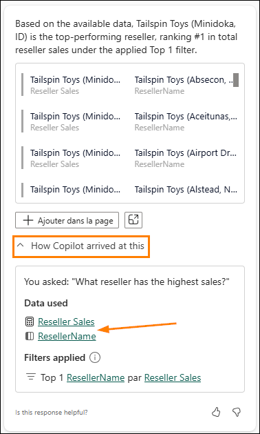

    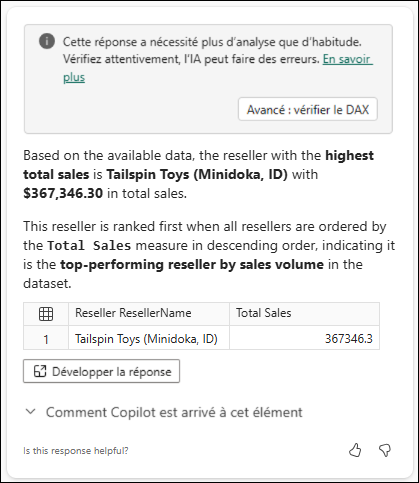

    

    Cela met aussi en évidence d’autres filtres masqués ; nous les ajusterons plus tard.

5. Nous allons utiliser la fonctionnalité Préparer les données pour l’IA dans Power BI Desktop afin de masquer la mesure [Reseller Sales] pour Copilot. Dans le ruban Accueil, sélectionnez **Préparer les données pour l’IA**.

    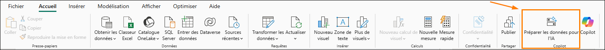

6. La nouvelle fenêtre s’ouvre sur la page **Démarrer**.

    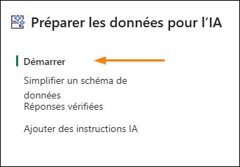

7. Cliquez sur **Simplifier le schéma des données**.

    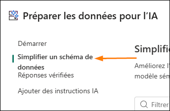

8. Développez la table **Resellers** en cliquant sur l’icône **>**. La mesure Reseller Sales peut générer des résultats ambigus avec Copilot ; vous allez donc la supprimer du schéma afin que Copilot ne l’inclue pas lors de l’analyse. L’exclusion de cette mesure de Copilot permettra d’obtenir des résultats plus cohérents. Décochez la case pour désélectionner la mesure Reseller Sales, puis cliquez sur **Appliquer**. *Voir la capture d’écran suivante.*

    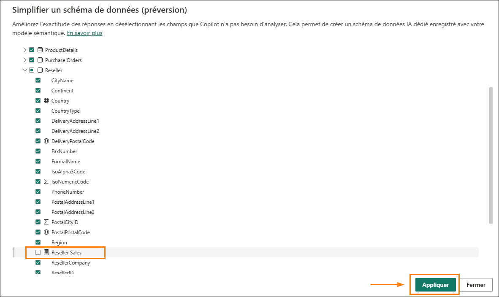

9. Cliquez sur **Fermer**.

    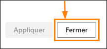

    **ℹ️ Important**

    En tant que bonne pratique, utilisez des noms très explicites pour vos tables, colonnes et mesures. Cela aidera Copilot à produire des résultats plus cohérents et plus précis lorsqu’il répond aux questions. Par exemple, dans ce modèle, nous avons une mesure nommée [Reseller Sales] et une autre nommée [Sales by Reseller]. Cette situation est source de confusion pour Copilot et peut conduire à des réponses incohérentes. Dans ce labo, nous avons supprimé cette mesure du schéma ; dans d’autres scénarios, vous pourriez préférer renommer la mesure.

10. Cliquez sur le bouton Copilot dans le ruban **Accueil** afin de fermer, puis de rouvrir Copilot.

    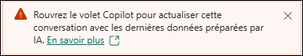

    

11. Demandez à Copilot : **What reseller has the highest sales?** Appuyez sur **Entrée** ou cliquez sur la **flèche.**

    

12. Après avoir obtenu une réponse de Copilot, cliquez sur la section **Comment Copilot est arrivé à ce résultat**.

    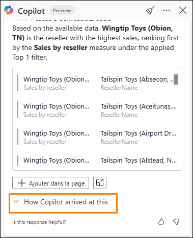

13. Cette fois-ci, vous devriez constater que la mesure utilisée pour obtenir cette réponse est **Sales by Reseller, voire SalesNet**. C’est parfait : Copilot a été entraîné à éviter la mesure probable mais non souhaitée. Il est possible que vous constatiez un résultat différent ici en raison de la nature non déterministe de Copilot. C’est précisément là que vous pouvez continuer à préparer vos données pour l’IA afin de créer une expérience plus cohérente.

    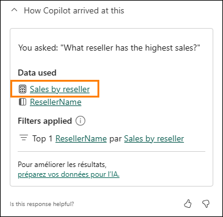

    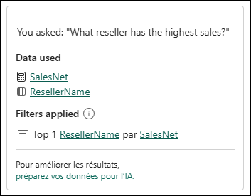

14. En tant que bonne pratique, il est recommandé de masquer les tables, colonnes et mesures susceptibles de prêter à confusion pour Copilot.

    **ℹ️ Important**

    Il est courant dans Power BI de créer des mesures d’assistance ou des mesures ponctuelles utilisées pour des besoins très spécifiques, dans un contexte de filtres bien précis. Si vous savez que vous disposez de nombreuses mesures que vous souhaitez masquer pour Copilot, il peut être judicieux de créer une table dédiée au stockage des mesures que vous voulez masquer. Cela rendra le processus de mise à jour du schéma beaucoup plus simple. À ce stade, le masquage d’un dossier de mesures n’est pas pris en charge.

15. Nous avons également rencontré des cas où la valeur State issue de la table Customer était renvoyée à la place de la valeur State issue de la table Reseller. Or, la table Customer ne doit pas être utilisée dans ce contexte et n’existe que pour des scénarios très spécifiques. Étant donné que cette table peut prêter à confusion pour Copilot, nous allons la masquer.

16. Cliquez sur **Préparer les données pour l’IA** dans votre ruban Accueil.

17. Cliquez sur **Simplifier le schéma des données** dans la barre de navigation gauche.

18. Désélectionnez Customer. En décochant la table Customer, celle-ci continuera d’exister dans votre modèle sémantique pour tous les rapports, visuels ou calculs DAX que vous devez créer. En revanche, elle sera ignorée par Copilot lors de l’analyse. Veillez à cliquer sur **Appliquer**, puis sur **Fermer**.

    

    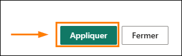

## Tâche 2 : Ajouter des instructions pour l’IA

L’ajout d’instructions pour l’IA constitue une étape très importante dans la préparation de vos données pour l’IA. En ajoutant des instructions pour l’IA clairement définies, vous aidez Copilot à mieux comprendre votre modèle sémantique en intégrant directement dans le modèle le contexte métier, la terminologie et les priorités d’analyse. Cela rend Copilot plus intelligent, plus rapide et davantage aligné avec vos intentions lorsqu’il génère des analyses, répond à des questions ou crée des visuels.

Dans ce labo, vous utiliserez des instructions pour l’IA afin de définir ce qui doit être renvoyé lorsque Copilot est interrogé sur les articles les plus vendus.

1. Ouvrez Copilot et posez la question suivante : **What are the top 5 best-selling products.**

    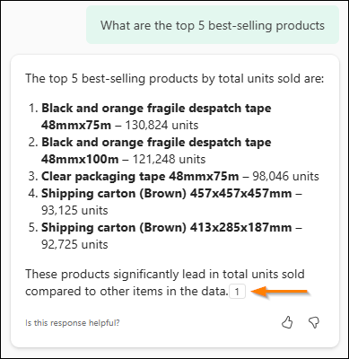

2. Si vous obtenez le même résultat que ci-dessus, cliquez sur la référence pour ouvrir le visuel dont proviennent ces résultats.

    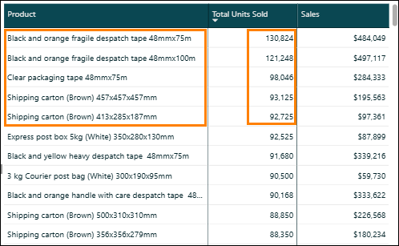

3. Ce résultat semble correct, et il peut tout à fait l’être. Toutefois, qu’est-ce qui définit un produit « *best selling* » par rapport à un produit « top selling » ? S’agit-il de la quantité vendue, du chiffre d’affaires, de la marge bénéficiaire la plus élevée ou d’un autre critère ?

4. Pour l’instant, nous souhaitons que Copilot demande des précisions afin que des résultats attendus et corrects soient renvoyés à nos utilisateurs finaux. Cliquez de nouveau sur le bouton **Préparer les données pour l’IA**.

    

5. Accédez à la section **Ajouter des instructions pour l’IA**.

    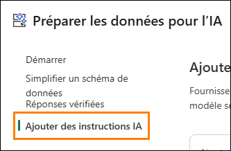

6. Ajoutez une instruction pour Copilot afin qu’il demande à l’utilisateur de préciser la définition attendue chaque fois qu’il pose une question sur les notions de **highest, most ou best-selling**.

7. Saisissez :

    ***If asked about "highest" or ”most” or "best-selling" product, first clarify if the user wants product by unit sold or product by total sales value.***

    Cliquez ensuite sur **Appliquer**, puis sur **Fermer**.

    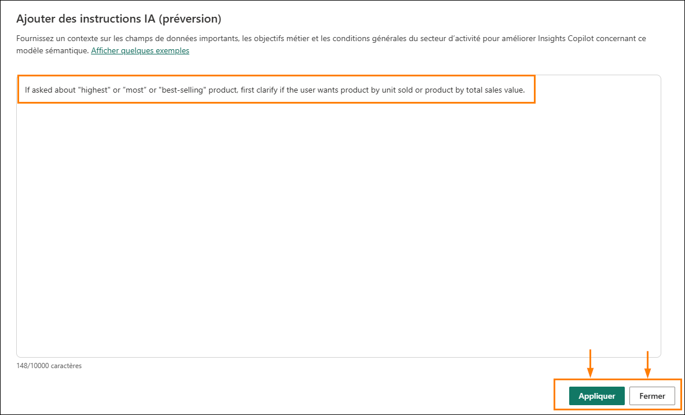

8. Ouvrez le volet Copilot. S’il est déjà ouvert, fermez Copilot, puis rouvrez-le. Cela garantira que les modifications que vous avez apportées ont bien été appliquées.

    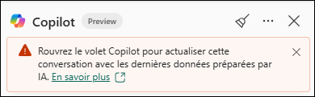

9. Demandez à Copilot : **What’s our best-selling product**?

    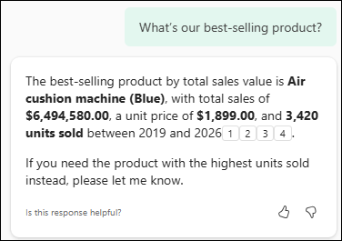

10. Étant donné que nous avons fourni à Copilot des instructions afin qu’il demande à l’utilisateur final de préciser ce qu’il entend par best-selling, deux options s’affichent ici. Copilot peut également vous poser une question afin de demander une clarification ou des informations supplémentaires.

11. Saisissez **units sold** dans l’invite et appuyez sur Entrée. Copilot vous fournira alors une réponse plus précise.

    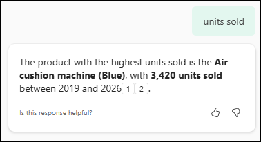

12. Supposons que tous les utilisateurs de l’organisation maîtrisent la distinction entre best-selling et highest selling. Dans ce cas, il suffit de fournir ces définitions à Copilot via les instructions pour l’IA.

13. Rouvrez la boîte de dialogue **Préparer les données pour l’IA**, accédez à Ajouter des instructions pour l’IA et remplacez les instructions actuelles par les suivantes :

    - **Best-selling = most units sold**

    - **Highest selling = total sales value**

        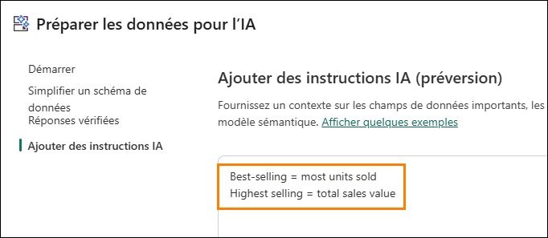

14. Cliquez sur Appliquer, puis sur Fermer.

15. Fermez et rouvrez Copilot. Saisissez : **What’s our best-selling product**? dans l’invite et appuyez sur Entrée.

    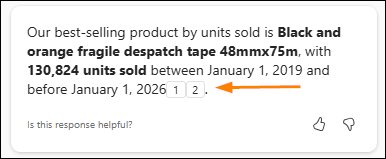

    Copilot parvient désormais à la réponse attendue et est capable de faire la distinction entre **best-selling** et **highest selling**, comme nous l’avons mentionné au début de cette section. Plus les instructions pour l’IA sont clairement définies, plus Copilot sera performant.

    **ℹ️ Important**

    **Tester les instructions pour l’IA est plus rapide dans Power BI Desktop, car il n’y a pas de délai de publication.** Pour cette raison, il est recommandé de tester et d’affiner vos instructions localement avant de les publier dans le service. La publication introduit un délai et peut parfois prêter à confusion si les modifications ne sont pas immédiatement prises en compte. Power BI Desktop offre un environnement plus réactif pour l’itération et le débogage.

16. Si la réponse obtenue est identique à celle ci-dessus, cliquez sur la référence pour afficher l’origine des résultats.

    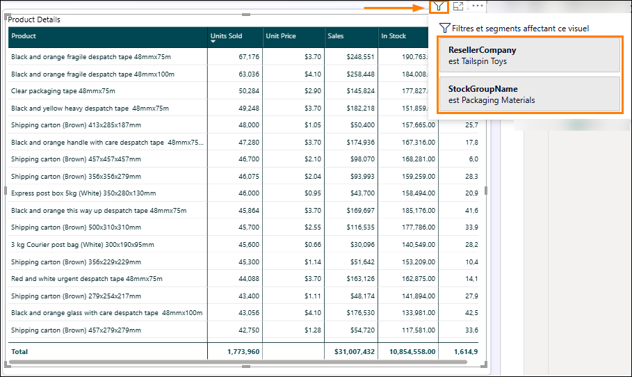

17. Vos résultats peuvent varier, mais notez que les résultats renvoyés proviennent d’un visuel existant. En y regardant de plus près, vous constaterez que ce visuel est en réalité filtré. Cela signifie que nous avons obtenu une réponse trompeuse de la part de Copilot. En effet, nous n’avons jamais demandé l’application de filtres dans notre requête, et Copilot n’a pas précisé que le résultat était filtré.

18. Retournez dans Préparer les données pour l’IA et accédez à **Ajouter des instructions pour l’IA**. Ajoutez l’instruction suivante :

    **If you use an existing report visual to answer a user request, always let the user know about any existing filters on the visual.**

    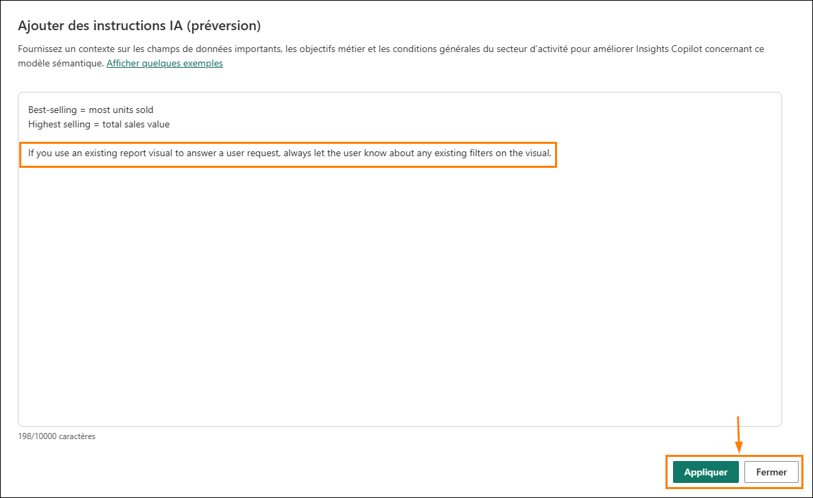

19. Demandez à nouveau à Copilot : **What’s our best-selling product?**

    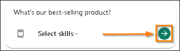

20. Notez que, cette fois-ci, un visuel référencé différent a été renvoyé, et Copilot a correctement identifié la présence d’un filtre sur ResellerCompany pour Tailspin Toys.

    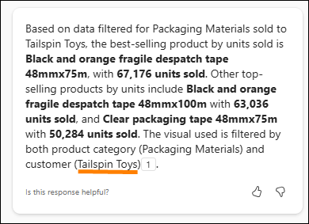

    **ℹ️ Important**

    Il est important de garder à l’esprit que la fonctionnalité Instructions pour l’IA est encore en version préliminaire et évolue rapidement. Continuez à explorer différentes instructions afin d’identifier ce qui fonctionne et ce qui ne fonctionne pas.

21. Lors du déploiement de l’expérience Copilot autonome auprès des utilisateurs finaux, il est essentiel d’instaurer la confiance. L’un des moyens d’y parvenir consiste à veiller à ce que Copilot ne fasse pas de suppositions. Une instruction que nous pouvons ajouter consiste à demander à Copilot de ne jamais deviner lorsqu’il ne comprend pas ce qui lui est demandé.

22. Ouvrez **Préparer les données pour l’IA** et ajoutez les instructions suivantes, puis cliquez sur Appliquer et sur Fermer.

    - **Best-selling = most units sold**

    - **Highest selling = total sales value**

    **If you use an existing report visual to answer a user request, always let the user know about any existing filters on the visual.**

    ***If you do not understand what is being asked, do NOT guess, instead ask for clarification.***

    - Copilot sera désormais plus enclin à poser des questions de clarification.

    - Voici comment cette instruction pour l’IA s’applique lorsque Copilot a un doute.

        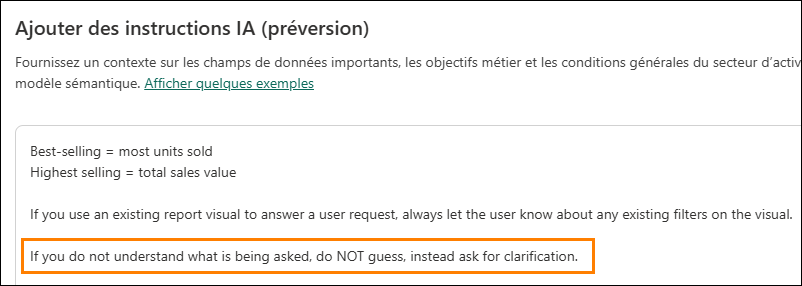

23. Rouvrez Copilot et posez la question ambiguë suivante : **Total sales by something what is that?**

    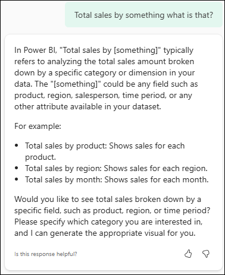

24. Dans cet exemple, comme illustré dans la capture d’écran ci-dessus, Copilot ne sait pas exactement comment vous souhaitez voir les ventes totales et vous demande donc de clarifier votre demande.

25. Un autre type d’instruction possible concerne les visuels de rapport. Par exemple, vous pouvez demander à Copilot d’afficher systématiquement les dates dans un graphique en courbes ou de renvoyer une matrice pour l’analyse des ventes par pays, puis vous pouvez ajouter ces instructions.

26. Sans ajouter d’instructions pour l’IA, il n’y a aucune garantie quant au visuel que Copilot renverra. Par exemple, si nous posons la question suivante : **Show total sales measure by year**. J’obtiens actuellement un graphique en courbes :

    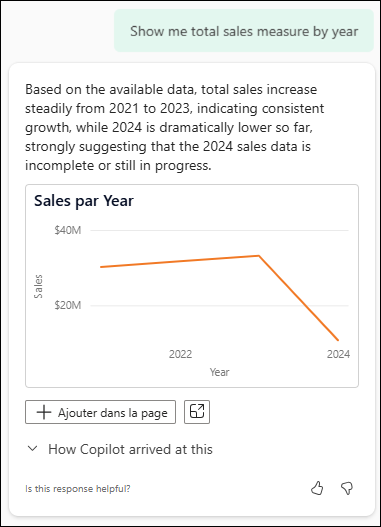

27. Ajoutons maintenant une instruction pour l’IA et voyons ce qu’il se passe. Ouvrez **Préparer les données pour l’IA** et ajoutez l’instruction suivante :

    **## Visual Guidance**

    ***When showing the total sales measure by year always use a column chart.***

    **ℹ️ Important**

    Lors de la rédaction des instructions pour l’IA, le « ## » est un format du langage Markdown, non obligatoire, mais recommandé pour une meilleure organisation, tant pour Copilot que pour l’assistant de données Fabric.

    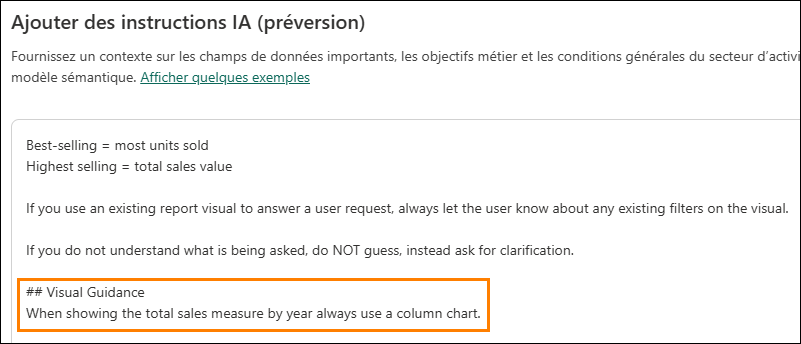

28. Rouvrez Copilot et posez la question suivante : **Show total sales measure by year.**

    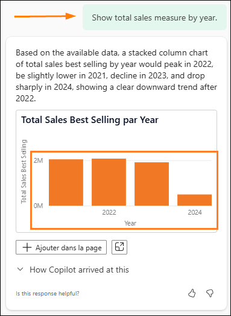

    Copilot peut écrire du DAX pour parvenir à la réponse et l’afficher sous forme de table. N’oubliez pas que vous pouvez toujours lui demander : **Can you make this into a column chart?** Ou bien, reformulez les **instructions pour l’IA**.

    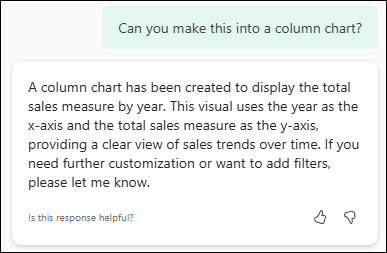

29. Examinons un autre exemple, cette fois-ci lié à la définition des mesures. Revenez à la fenêtre de discussion Copilot et posez la question suivante : **How many purchase orders do we have?**

    

30. Notez que les résultats sont corrects et que, si nous développons la section **Comment Copilot** **est arrivé à ce résultat**, nous constatons même qu’il utilise la mesure explicite ! Comme vous vous en souvenez, nous avons créé une description assistée par Copilot pour cette mesure précise. Mais demandons maintenant des précisions sur la manière dont le DAX est calculé.

    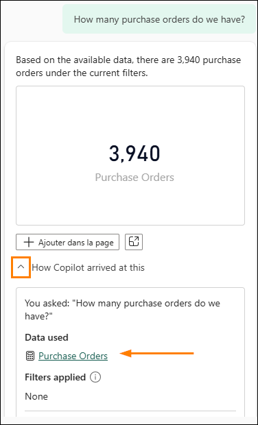

31. Posez la question suivante : **Can you explain the DAX used?**

    

32. Cette réponse est extrêmement intéressante, car elle met en évidence la limitation de Copilot à accéder directement à nos formules DAX exactes. La réponse elle-même est de nature fortement *générative*, utilisant des termes tels que « probablement », « si », « généralement » et « potentiellement ». Cela peut ***parfois*** être résolu à l’aide de notre vue TMDL et des instructions pour l’IA.

    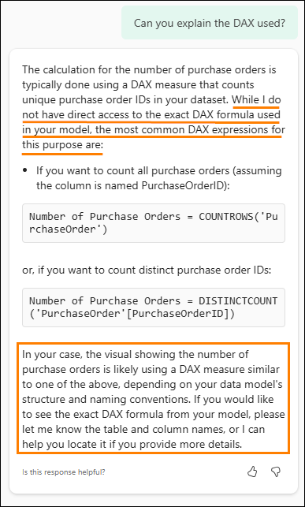

33. Dans votre volet de navigation à gauche, sélectionnez la vue **TMDL**.

34. En bas de l’écran, créez un script en cliquant sur le bouton « + ».

    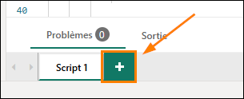

35. Nous allons importer une seule mesure afin d’aider les utilisateurs à obtenir des précisions sur le DAX de notre modèle de données. Faites glisser la mesure **Purchase Orders** dans le script.

    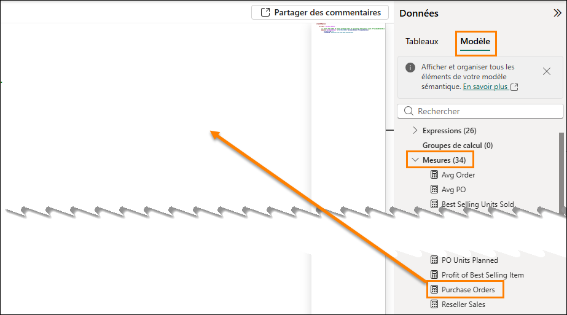

36. Le script TMDL obtenu constitue une excellente ressource à ajouter à nos instructions pour l’IA. Nous pouvons également voir notre description représentée dans cette vue. Nous souhaitons maintenant copier la description de la mesure ainsi que la mesure elle-même, comme illustré ci-dessous :

    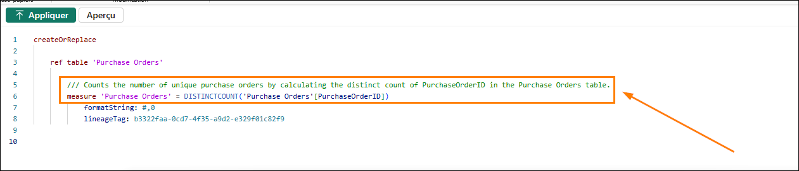

37. Revenez maintenant à **Préparer les données pour l’IA** dans la vue Rapport et ajoutez la description TMDL ainsi que les détails de la mesure dans la vue **Ajouter des instructions pour l’IA**, comme illustré ci-dessous. Cliquez ensuite sur **Appliquer**.

    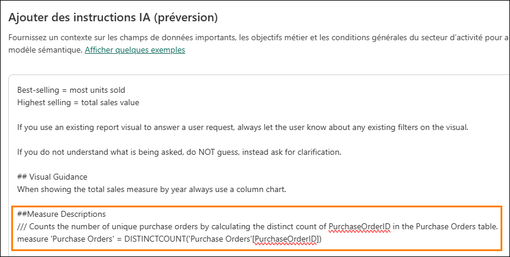

38. Rouvrez le volet Copilot afin d’actualiser les instructions, puis posez la même question que précédemment : **How many purchase orders do we have?**

    

39. Jusqu’ici, tout va bien. C’est le comportement attendu ; toutefois, le moment clé arrive avec la question suivante.

    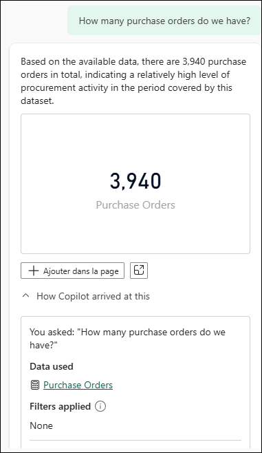

40. Demandez maintenant des précisions : **Can you explain the DAX used in the Purchase Orders measure?**

    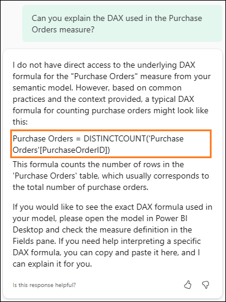

41. Malheureusement, Copilot continue de faire des suppositions, bien qu’il parvienne à deviner correctement le code DAX réel. L’ajout du code DAX dans les instructions pour l’IA peut fonctionner dans certains cas, mais à ce stade, tant que la fonctionnalité est encore en version préliminaire, le comportement reste incohérent.

42. Plus tôt dans les labos, nous avons demandé le total des ventes pour la région Sud-Est. Copilot n’a pas utilisé la colonne Sales Territory de notre table Reseller ; à la place, il a supposé quels États représentaient le territoire du Sud-Est. Dans cette section, nous allons ajouter une instruction pour l’IA afin de nous assurer que Copilot utilise Sales Territory lorsqu’il est interrogé sur les régions.

43. Ouvrez **Préparer les données pour l’IA** et ajoutez l’instruction suivante :

    **If a user asks about region or territory related data, for example Southeast, use the Sales Territory column from the Reseller table.**

    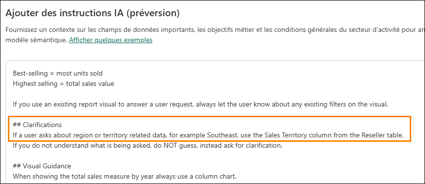

44. Ouvrez Copilot et saisissez la requête suivante : **Show total sales for the Southeast**.

    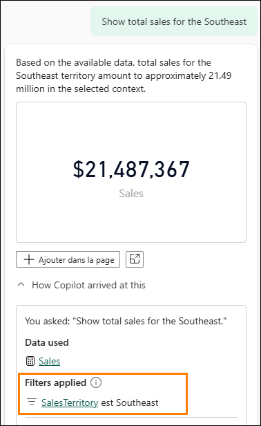

45. Dans la section précédente, nous avons supprimé la table Customer du schéma des données.

    Au sein de cette organisation, les Customers sont définis spécifiquement comme des Resellers qui achètent, puis distribuent nos produits. Les consommateurs finaux qui achètent auprès de ces Resellers ne sont pas considérés comme des Customers. Il est nécessaire de clarifier cette distinction afin que Copilot renvoie les Resellers lorsqu’il est interrogé sur les Customers.

46. Ouvrez Préparer les données pour l’IA et saisissez ce qui suit :

    **Customers = Resellers**

    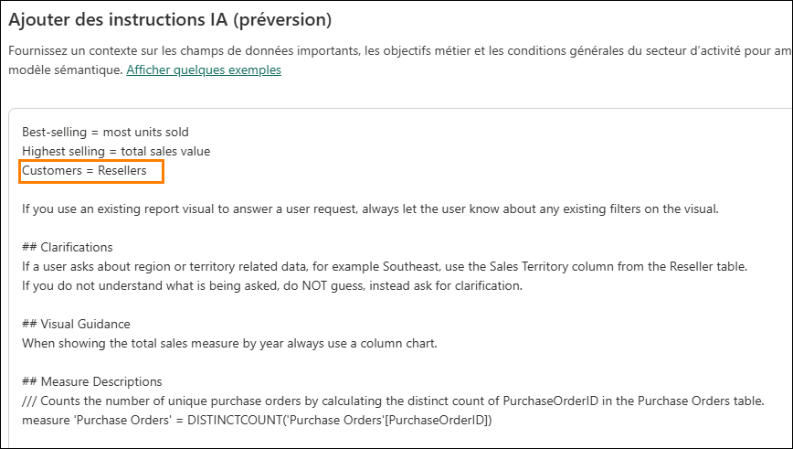

47. Dans l’invite Copilot, demandez : **What customer sold the most products in 2021?**

    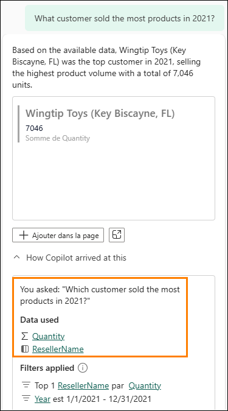

    Cela est également visible dans le calcul DAX créé.

    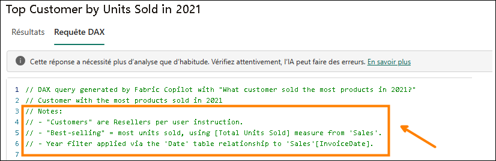

    Notez que Copilot a été correctement instruit et utilise Reseller pour représenter Customer.

## Tâche 3 : Créer des réponses vérifiées

Passons à l’étape suivante de la préparation des données en ajoutant des réponses vérifiées. Les réponses vérifiées permettent à l’auteur du modèle de sélectionner un visuel et de définir des formulations qui, lorsqu’un utilisateur les utilise, affichent ce visuel en tant que réponse vérifiée. Les réponses vérifiées aident également Copilot à mieux comprendre le contexte de votre modèle et à fournir des réponses plus précises, même lorsque l’invite ne correspond pas exactement à une réponse vérifiée.

**ℹ️ Important**

Les réponses vérifiées associent la formulation que vous définissez à toute requête identifiée comme sémantiquement similaire. Pour cette raison, il n’est pas nécessaire de définir toutes les variations possibles qu’un utilisateur pourrait formuler. Il est préférable de définir des phrases déclencheur claires et distinctes, auxquelles toute formulation similaire pourra être rattachée.

1. Pour votre premier exemple, vous allez créer une réponse vérifiée pour **Top state for sales**.

2. Actuellement, si vous demandez à Copilot : **What state has the most sales?** Il n’interprète pas toujours la question comme vous le souhaitez. Cela s’explique par le fait que le terme « sales » est utilisé de plusieurs manières différentes au sein du modèle et du rapport.

3. Dans cet exemple, vous allez vous assurer que Copilot renvoie systématiquement la réponse attendue.

4. Cette fois-ci, nous n’allons **pas** commencer dans la boîte de dialogue Préparer les données pour l’IA. Si vous ouvrez l’onglet Réponses vérifiées dans la boîte de dialogue Préparer les données pour l’IA, vous constaterez qu’**aucune** réponse n’est disponible.

    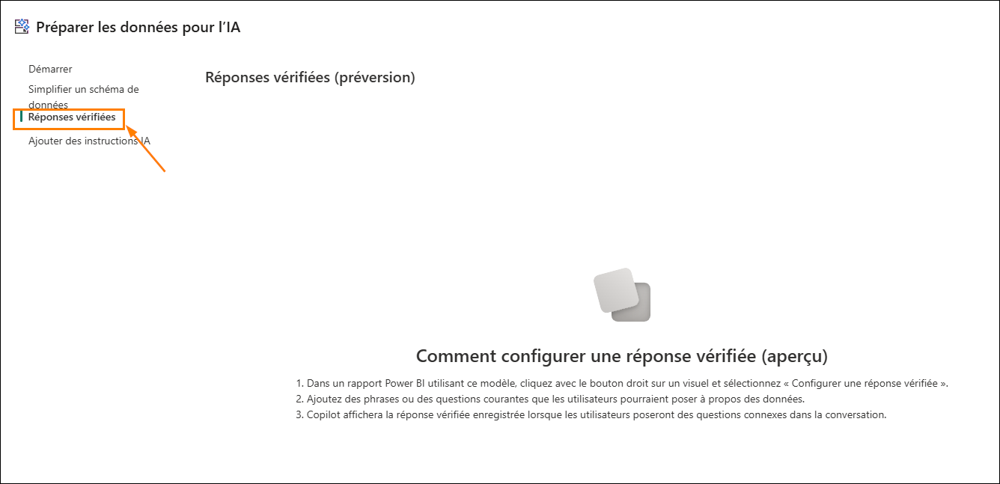

5. Commencez plutôt par les visuels de votre rapport.

6. Fermez la fenêtre Préparer les données pour l’IA et accédez à la page **Détails du produit**.

    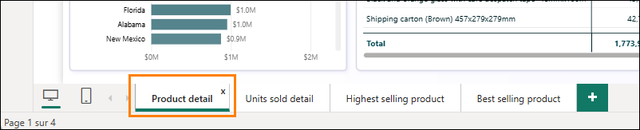

7. Cliquez sur le graphique en barres des ventes par État, puis cliquez sur les points de suspension (**...)** situés dans le coin supérieur droit.

    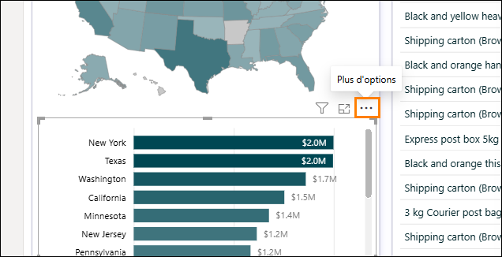

8. Sélectionnez **Configurer une réponse vérifiée** dans le menu déroulant.

    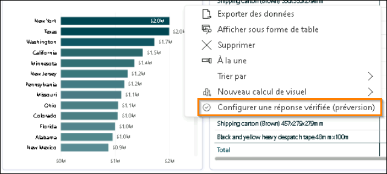

9. Vous pouvez définir une phrase soit en sélectionnant une suggestion de Copilot, soit en saisissant votre propre phrase personnalisée.

10. Dans le champ Saisir une phrase, saisissez **State with the highest sales**, puis **cliquez sur Ajouter.** *Voir la capture d’écran suivante.*

    

11. Cliquez sur Appliquer, puis sur Fermer.

    

12. Fermez et rouvrez le volet Copilot.

13. Demandez à Copilot : **What state has the highest sales?**

    

14. Vérifiez qu’une réponse vérifiée correcte est renvoyée pour la question.

    

15. Qu’en est-il des faux positifs ? Essayons une question qui ne devrait PAS utiliser notre réponse vérifiée et voyons ce qu’il se passe. Dans Copilot, saisissez l’invite suivante : **What state is selling the most of the highest selling product?**

    

16. C’est parfait ! La réponse pointe vers un visuel différent dans notre rapport. Plus précisément, elle renvoie vers un visuel filtré sur le produit le plus vendu. Notez également que la réponse respecte l’instruction pour l’IA définie précédemment et nous informe des filtres appliqués au visuel renvoyé.

17. Ajoutons une autre réponse vérifiée. Cette fois-ci, nous souhaitons afficher **le produit le plus vendu.**

18. Cliquez sur la page du rapport Produit le plus vendu.

    

19. Ensuite, repérez le visuel de type Carte en haut de la page, cliquez sur les points de suspension **(…)**, puis sélectionnez **Configurer une réponse vérifiée**.

    

20. Plus tôt dans le labo, nous avons ajouté des instructions pour l’IA afin de lui indiquer que best selling correspond au total des unités, et que highest selling correspond à la valeur totale des ventes. Nous voulons nous assurer que les phrases de réponses vérifiées sont correctement alignées avec nos instructions pour l’IA.

21. Cette fois-ci, vous allez ajouter deux phrases ; elles peuvent apparaître ou non dans les suggestions de Copilot. Commencez par ajouter la phrase **Which Product has sold the most units?** Cliquez ensuite sur Ajouter.

    

22. Cliquez sur Appliquer.

    

23. Cliquez sur l’icône + à côté de **Suggestions Copilot** pour ajouter une phrase supplémentaire. Ajoutez la phrase **What is the best-selling product?** ou une formulation similaire, puis cliquez sur Ajouter.

    

24. Vous disposez désormais des deux phrases associées à votre visuel de rapport, comme illustré dans la capture d’écran ci-dessous.

    

25. Cliquez sur Appliquer, puis Fermer.

26. Félicitations ! Dans cette section, vous avez appris à ajouter des réponses vérifiées à vos visuels de rapport. Vous avez également appris que vous pouvez ajouter plusieurs phrases afin de relier les questions des utilisateurs à un visuel de rapport spécifique.

## Tâche 4 : À vous de jouer

Si le temps imparti pour le labo le permet, continuez à explorer les fonctionnalités **Préparer les données pour l’IA** que vous avez découvertes dans ce labo.

1. Commencez par poser une question sur Copilot pour laquelle vous souhaitez obtenir une réponse. Si les résultats ne correspondent pas à ce que vous souhaitiez ou attendiez, réfléchissez à la manière dont vous pouvez garantir le résultat souhaité en utilisant simplement le schéma des données, les réponses vérifiées ou les instructions pour l’IA.

## Conclusion

Félicitations ! Vous venez de terminer le labo Préparer les données pour l’IA !

# Références

Chat With Your Data in a Day (CDIAD) vous présente certaines des fonctionnalités clés lors de l’utilisation de Copilot autonome dans un espace de travail Fabric.

Dans le menu du service, la section Aide (?) comporte des liens vers d’excellentes ressources. Gardez à l’esprit que la vue que vous voyez dépend de l’expérience dans laquelle vous vous trouvez actuellement et que vos options peuvent donc différer de celles présentées dans la capture d’écran ci-dessous.

Voici quelques autres ressources qui vous aideront lors de vos prochaines étapes avec Microsoft Fabric :

- Accédez à toutes les informations dans la [Documentation Microsoft Fabric de base](https://learn.microsoft.com/en-us/fabric/)

- Explorez Fabric grâce à la [visite guidée](https://aka.ms/Fabric-GuidedTour)

- Inscrivez-vous pour bénéficier d’un [essai gratuit de Microsoft Fabric](https://aka.ms/try-fabric)

- Rendez-vous sur le [site web Microsoft Fabric](https://aka.ms/microsoft-fabric)

- Acquérez de nouvelles compétences en explorant les [modules d’apprentissage Fabric](https://aka.ms/learn-fabric)

- Lisez l’[e-book gratuit sur la prise en main de Fabric](https://aka.ms/fabric-get-started-ebook)

- Rejoignez la [communauté Fabric](https://aka.ms/fabric-community) pour publier vos questions, partager vos commentaires et apprendre des autres utilisateurs

Lisez la documentation technique détaillée relative à Copilot :

- [Vue d’ensemble de Copilot pour Power BI - Power BI | Microsoft Learn](https://learn.microsoft.com/en-us/power-bi/create-reports/copilot-introduction)

- [Expérience Copilot autonome dans Power BI (version préliminaire) – Power BI |sMicrosoft Learn](https://learn.microsoft.com/en-us/power-bi/create-reports/copilot-chat-with-data-standalone)

- [Microsoft FabricParamètres administrateur de Copilot | Microsoft Learn](https://learn.microsoft.com/en-us/fabric/admin/service-admin-portal-copilot)

- [Création d’un assistant de données Fabric (version préliminaire) : découvrez comment créer un assistant de données Fabric | Microsoft Learn](https://learn.microsoft.com/en-us/fabric/data-science/concept-data-agent)

- [Bonnes pratiques relatives à la configuration de votre assistant de données – Microsoft Fabric | Microsoft Learn](https://learn.microsoft.com/en-us/fabric/data-science/data-agent-configuration-best-practices)

- [Copilot pour Microsoft Fabric et Power BI : FAQ - Microsoft Fabric | Microsoft Learn](https://learn.microsoft.com/en-us/fabric/fundamentals/copilot-faq-fabric)

© 2026 Microsoft Corporation. Tous droits réservés.

En effectuant cette démonstration/ce labo, vous acceptez les conditions suivantes :

La technologie/fonctionnalité décrite dans cette démonstration/ce labo est fournie par Microsoft Corporation en vue d’obtenir vos commentaires et de vous fournir une expérience d’apprentissage. Vous pouvez utiliser cette démonstration/ce labo uniquement pour évaluer ces technologies et fonctionnalités, et pour fournir des commentaires à Microsoft. Vous ne pouvez pas l’utiliser à d’autres fins. Vous ne pouvez pas modifier, copier, distribuer, transmettre, afficher, effectuer, reproduire, publier, accorder une licence, créer des œuvres dérivées, transférer ou vendre tout ou une partie de cette démonstration/ce labo.

LA COPIE OU LA REPRODUCTION DE CETTE DÉMONSTRATION/CE LABO (OU DE TOUTE PARTIE DE CEUX-CI) SUR TOUT AUTRE SERVEUR OU AUTRE EMPLACEMENT EN VUE D’UNE AUTRE REPRODUCTION OU REDISTRIBUTION EST EXPRESSÉMENT INTERDITE.

CETTE DÉMONSTRATION/CE LABO FOURNIT CERTAINES FONCTIONNALITÉS DE PRODUIT/TECHNOLOGIES LOGICIELLES, NOTAMMENT D’ÉVENTUELS NOUVEAUX CONCEPTS ET FONCTIONNALITÉS, DANS UN ENVIRONNEMENT SIMULÉ SANS CONFIGURATION NI INSTALLATION COMPLEXES AUX FINS DÉCRITES CI-DESSUS. LES TECHNOLOGIES/CONCEPTS REPRÉSENTÉS DANS CETTE DÉMONSTRATION/CE LABO PEUVENT NE PAS REPRÉSENTER LES FONCTIONNALITÉS COMPLÈTES ET PEUVENT NE PAS FONCTIONNER DE LA MÊME MANIÈRE QUE DANS UNE VERSION FINALE. IL EST ÉGALEMENT POSSIBLE QUE NOUS NE PUBLIIONS PAS DE VERSION FINALE DE CES FONCTIONNALITÉS OU CONCEPTS. VOTRE EXPÉRIENCE D’UTILISATION DE CES FONCTIONNALITÉS DANS UN ENVIRONNEMENT PHYSIQUE PEUT ÉGALEMENT ÊTRE DIFFÉRENTE.

**COMMENTAIRES.** Si vous envoyez des commentaires sur les fonctionnalités, technologies et/ou concepts décrit(e)s dans ces labos/cette démonstration à Microsoft, vous accordez à Microsoft, sans frais, le droit d’utiliser, de partager et de commercialiser vos commentaires de quelque manière et à quelque fin que ce soit. Vous accordez également à des tiers, sans frais, les droits de brevet nécessaires pour leurs produits, technologies et services en vue de l’utilisation ou de l’interface avec des parties spécifiques d’un logiciel ou d’un service Microsoft incluant les commentaires. Vous n’enverrez pas de commentaires soumis à une licence exigeant que Microsoft accorde une licence pour son logiciel ou sa documentation à des tiers du fait que nous y incluons vos commentaires. Ces droits survivent à ce contrat.

MICROSOFT CORPORATION DÉCLINE TOUTES LES GARANTIES ET CONDITIONS EN CE QUI CONCERNE

CETTE DÉMONSTRATION/CE LABO, Y COMPRIS TOUTES LES GARANTIES ET CONDITIONS DE QUALITÉ MARCHANDE, QU’ELLES SOIENT EXPLICITES, IMPLICITES OU LÉGALES, D’ADÉQUATION À UN USAGE PARTICULIER, DE TITRE ET D’ABSENCE DE CONTREFAÇON. MICROSOFT N’OFFRE AUCUNE GARANTIE OU REPRÉSENTATION EN CE QUI CONCERNE LA PRÉCISION DES RÉSULTATS, LA CONSÉQUENCE QUI DÉCOULE DE L’UTILISATION DE CETTE DÉMONSTRATION/CE LABO, OU L’ADÉQUATION DES INFORMATIONS CONTENUES DANS CETTE DÉMONSTRATION/CE LABO À QUELQUE FIN QUE CE SOIT.

**CLAUSE D’EXCLUSION DE RESPONSABILITÉ**

Cette démonstration/Ce labo comporte seulement une partie des nouvelles fonctionnalités et améliorations disponibles dans Microsoft Power BI. Certaines fonctionnalités sont susceptibles de changer dans les versions ultérieures du produit. Dans ce labo/cette démonstration, vous allez découvrir comment utiliser certaines nouvelles fonctionnalités, mais pas toutes.
