# Microsoft Fabric Chat with your Data in a Day - Labo 4

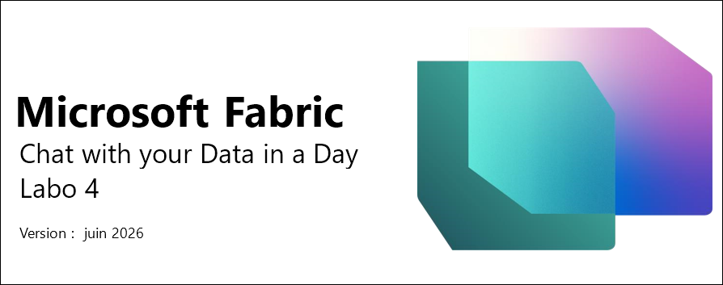

## Sommaire

- Structure du document
- Scénario/Énoncé du problème
- Introduction
- Expérience Copilot autonome
- Configuration : Configuration de l’espace de travail pour les labos ultérieurs
  - Tâche 1 : Découverte de l’expérience Copilot autonome
  - Tâche 2 : Rédiger une invite dans l’expérience Copilot autonome
  - Tâche 3 : Explorer la fonctionnalité Voir dans le rapport
  - Tâche 4 : Explorations
  - Tâche 5 : Réponses vérifiées
  - Tâche 6 : Comment Copilot est arrivé à ce résultat (HCAAT)
  - Tâche 7 : Une réponse de données issue d’une requête DAX générée par Copilot
  - Tâche 8 : Changement de contexte dans Copilot
  - Tâche 9 : Construction d’un visuel par Copilot à partir du modèle sémantique
  - Tâche 10 : Expérience générale Copilot
- Références

# Structure du document

Le labo comprend des étapes à suivre par l’utilisateur, ainsi que des captures d’écran associées qui fournissent une aide visuelle. Dans chaque capture d’écran, des sections sont mises en évidence avec des encadrés orange afin de souligner la ou les zones sur laquelle/lesquelles l’utilisateur doit se concentrer.

# Scénario/Énoncé du problème

Félicitations d’être arrivé jusqu’ici. Vous savez désormais comment mettre en œuvre les bonnes pratiques généralement reconnues dans votre modèle de données et comment utiliser la fonctionnalité Préparer vos données pour l’IA. Il est désormais temps d’explorer l’expérience Copilot autonome au sein de Microsoft Fabric.

Votre organisation, comme beaucoup d’autres, dispose de centaines de rapports et de modèles sémantiques répartis sur des dizaines d’espaces de travail. Trouver le bon rapport ou les bonnes données est devenu un défi pour les utilisateurs finaux. Vous souhaitez tirer parti de l’expérience Copilot autonome pour favoriser l’adoption par les utilisateurs et accélérer l’accès aux insights à l’échelle de l’organisation.

**Défis actuels**

- **Expérience de découverte fragmentée :** les utilisateurs ont du mal à trouver les données, rapports, applications et assistants de données appropriés dans l’environnement Fabric.

- **Faible adoption** : le volume de rapports et la formation requise créent des frictions, rendant difficile l’adhésion des utilisateurs et leur adoption.

- **Prise de décision retardée :** le délai d’accès aux insights reste lent en raison d’obstacles liés à la navigation et de capacités limitées en libre-service.

# Introduction

Dans les labos précédents, vous avez appris à préparer votre modèle sémantique afin d’optimiser l’expérience IA. Dans ce labo, vous allez tirer parti de tout ce travail et découvrir comment Copilot dans Microsoft Fabric peut aider à accélérer l’accès aux insights au sein de votre organisation.

# Expérience Copilot autonome

Dans cette section, vous allez explorer l’expérience Copilot autonome dans Fabric et découvrir toutes les possibilités offertes pour interagir avec vos données. À la fin de ce labo, vous aurez une bien meilleure compréhension de la manière dont vous pouvez exploiter l’expérience Copilot autonome pour accélérer l’accès aux insights. Plus précisément, vous apprendrez à :

- Tirer le meilleur parti de l’expérience Copilot autonome

- Interpréter les rapports, les visuels et les réponses de données fournis

- Valider « Comment Copilot est arrivé à ce résultat (HCAAT) »

- Créer et modifier des explorations qui peuvent être partagées

- Tirer parti des fonctionnalités Préparer les données pour l’IA, comme les réponses vérifiées

- Identifier les réponses sources de friction

- Tirer parti de l’expérience Copilot en général

**ℹ️ Important**

L’expérience Copilot autonome présentée dans ces labos ne conserve PAS l’historique des conversations. Si vous quittez l’expérience Copilot, votre conversation sera perdue. Cela diffère de l’expérience M365 Copilot Chat.

## Configuration : Configuration de l’espace de travail pour les labos ultérieurs

Dans ce labo et les suivants, vous aurez besoin de votre propre espace de travail afin de pouvoir modifier et enregistrer des éléments dans Fabric. Dans cette section de configuration, vous allez créer un espace de travail et lui attribuer une capacité Fabric afin de pouvoir effectuer des tâches spécifiques sans que cela n’ait d’impact sur les autres participants au labo.

1. Ouvrez un navigateur web dans Machine virtuelle et accédez à [https://fabric.microsoft.com/](https://app.fabric.microsoft.com/?noSignUpCheck=1)

2. Connectez-vous à Fabric à l’aide des informations d’identification fournies durant l’atelier.

3. Cliquez sur **Espaces de travail** dans le volet de navigation de gauche.

   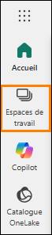

4. Dans le volet Espaces de travail, cliquez sur l’espace de travail **Fabrikam*Lab*<inject key="DeploymentID" enableCopy="false"></inject>\_FR**.

   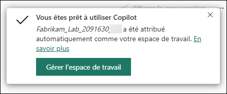

   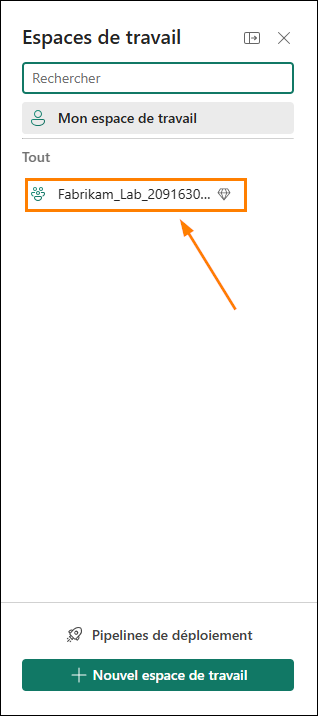

5. Nous devons maintenant nous assurer que votre licence individuelle peut publier dans l’espace de travail avec Fabric activé. Sélectionnez l’icône de personne en haut à droite, puis cliquez sur **Essai gratuit**.

   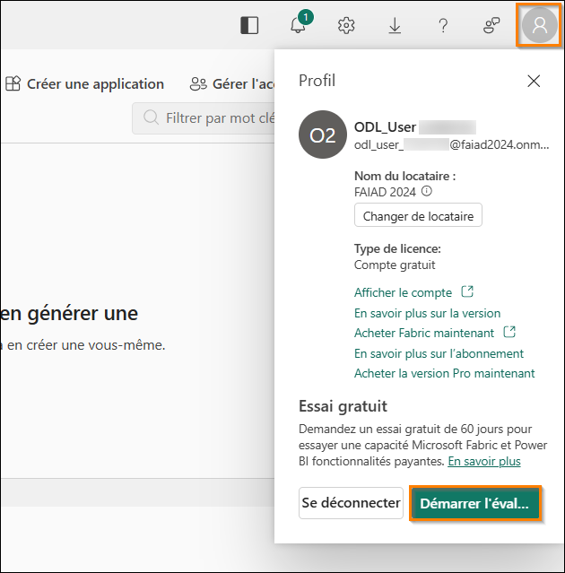

6. Cliquez simplement sur **Activer** pour activer la publication dans l’espace de travail.

   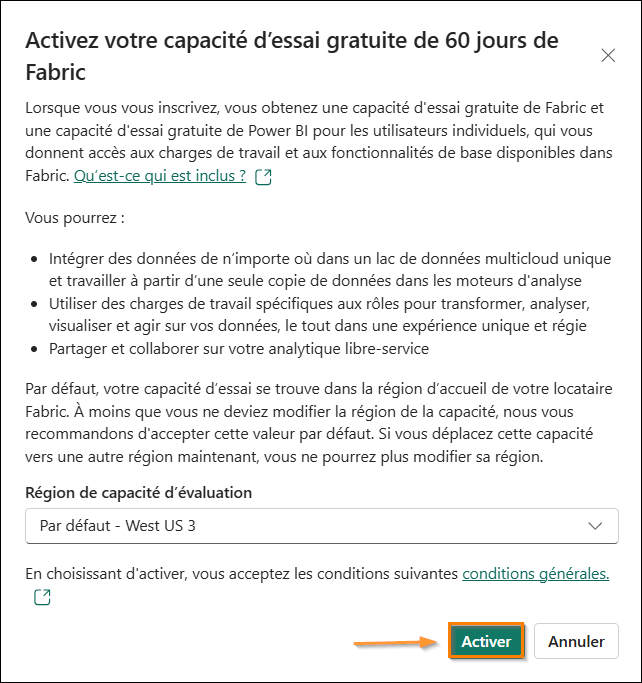

   Cliquez sur **OK**.

   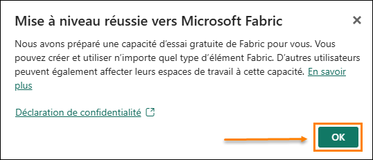

7. Ensuite, vous devrez **publier** le fichier PBIX finalisé, qui se trouve parmi les fichiers de votre classe.

8. Accédez à vos fichiers de classe et ouvrez le fichier nommé **Fabrikam Company Sales Report.pbix**.

   

9. Une fois que vous l’avez ouvert, vérifiez que vous êtes bien connecté au compte d’utilisateur qui vous a été attribué pour l’atelier CDIAD.

10. Cliquez sur Publier, recherchez l’espace de travail que vous venez de créer **Fabrikam*Lab*<inject key="DeploymentID" enableCopy="false"></inject>\_FR**

    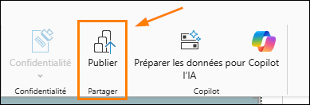

    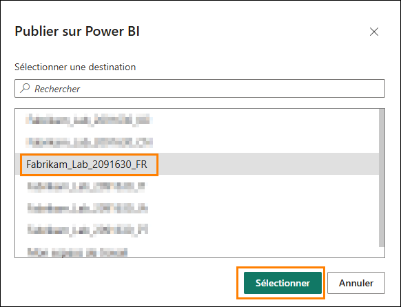

## Tâche 1 : Découverte de l’expérience Copilot autonome

1. Sélectionnez Copilot dans le volet de navigation gauche.

   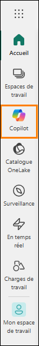

2. Si une invite s’affiche à l’écran suivant, cliquez sur **Démarrer**. Copilot sélectionnera un espace de travail en fonction d’une **capacité Copilot** à laquelle l’utilisateur a accès. Cette sélection dépendra de la disponibilité des **unités de capacité (CU)** dans l’espace de travail. Si l’utilisateur est affecté à une **configuration de capacité Fabric (FCC)**, cette capacité sera utilisée à la place.

3. Bienvenue dans l’expérience Copilot autonome ! Sur cet écran de démarrage, vous verrez une section en bas où vous pouvez saisir votre requête **(1)** ainsi que des suggestions de requête affichées en bas de l’écran **(2)**.

   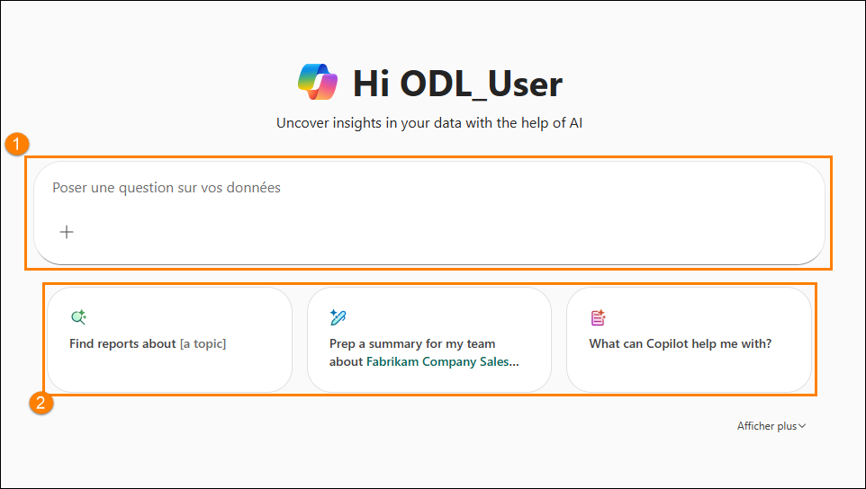

## Tâche 2 : Rédiger une invite dans l’expérience Copilot autonome

Dans cette section, vous allez rédiger différentes invites et explorer les résultats renvoyés par l’expérience Copilot.

1. Cliquez dans la requête et écrivez ce qui suit : **Find reports about Fabrikam’s sales trends for the year**. Cliquez ensuite sur **Entrée**.

   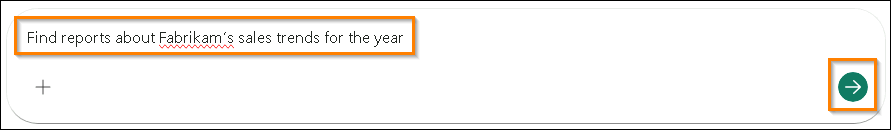

   **ℹ️ Important**

   L’IA renvoie des résultats non déterministes en raison de nombreux facteurs. Comme indiqué précédemment dans cette classe, vos résultats peuvent varier et ne pas être identiques à ceux du labo. Poursuivez et explorez les capacités et fonctionnalités affichées du mieux possible.

   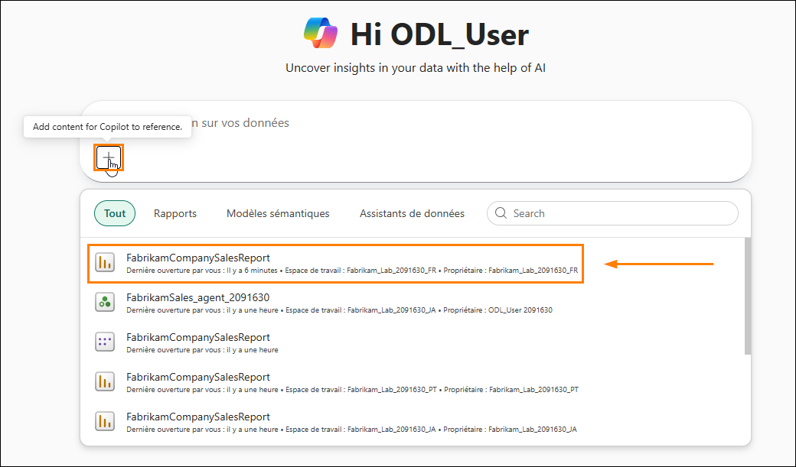

   Vous pouvez facilement utiliser la barre oblique / pour référencer le fichier ou le signe **+**. Cela peut être utile, car Copilot peut mettre un certain temps à intégrer complètement le contenu publié.

   **Si le bon rapport** ne vous est pas présenté, c’est généralement parce que nous devons vérifier quelques éléments :
   1. Dans le paramètre de service Power BI, sélectionnez le portail d’administration Fabric ; nous voulons nous assurer que les paramètres liés à Copilot ont bien été vérifiés. L’un de ces paramètres est **Afficher uniquement les éléments approuvés dans l’expérience Copilot autonome dans Power BI**. En sélectionnant cette fonctionnalité, seuls les éléments approuvés pour Copilot seront affichés, sauf s’ils sont ajoutés ou référencés manuellement. Cette option est déjà activée par défaut dans notre locataire.

      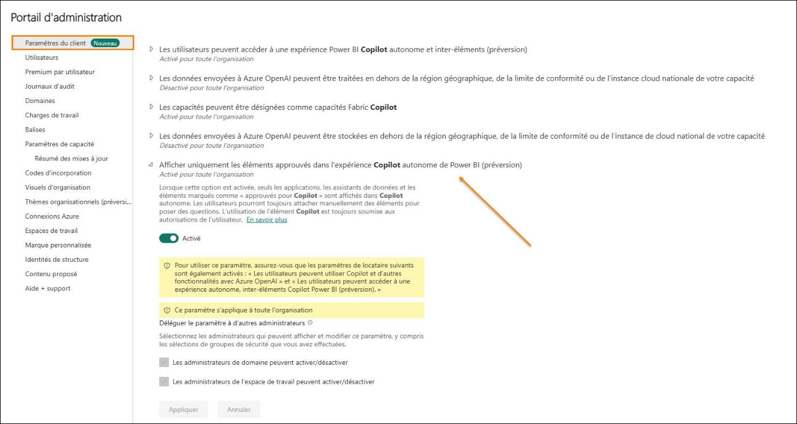

   2. En option, nous pouvons approuver le modèle sémantique pour Copilot en sélectionnant le modèle dans notre espace de travail.

      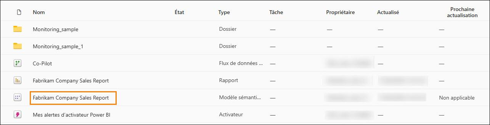

   3. Sélectionnez **Préparer les données pour l’IA**: la fenêtre Préparer les données pour l’IA s’affiche.

      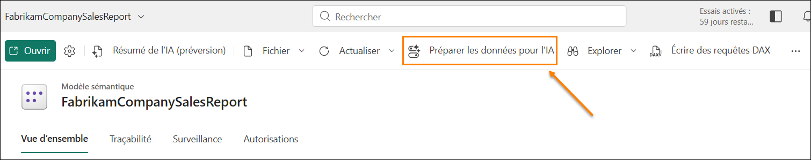

      Pour qu’il soit accessible à la recherche sans référence manuelle, le stockage de modèles volumineux devra être activé.

      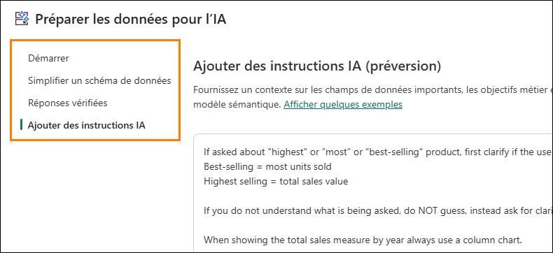

      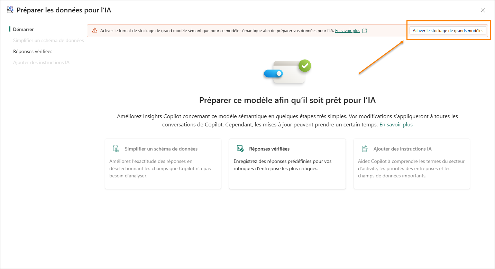

      À partir d’ici, vous pouvez consulter et ajuster votre configuration Préparer les données pour l’IA.

2. Cliquez sur le rapport affiché dans vos résultats de recherche, à savoir **Fabrikam Company Sales Report**. Un nouvel onglet s’ouvre alors dans votre navigateur Web et vous redirige directement vers ce rapport.

   

3. Prenez le temps d’**explorer** ce rapport et de vous familiariser avec lui.

   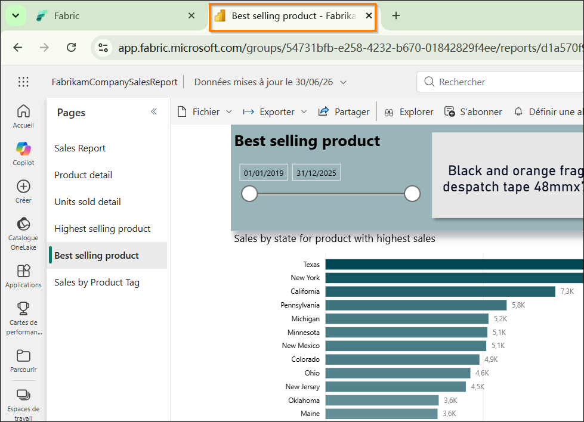

4. Une fois que vous avez terminé d’explorer le rapport, cliquez sur le (x) de l’onglet du navigateur pour le fermer et revenir à votre expérience Copilot.

5. Cliquez sur l’invite pré-générée en bas de la page ou saisissez l’invite suivante : **Give me an overview of 1. Fabrikam Company Sales** :

   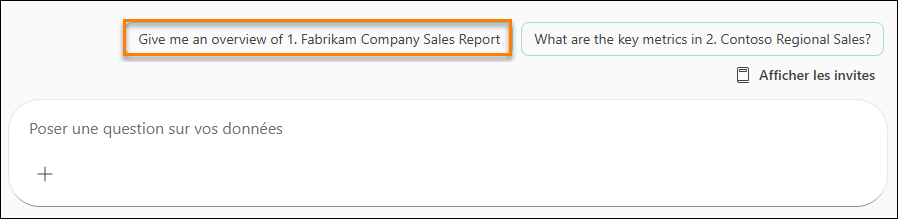

6. Demander à Copilot de vous fournir une vue d’ensemble du rapport vous donnera les informations suivantes, comme illustré dans la capture d’écran ci-dessous. **Rappel : votre écran et vos résultats peuvent différer légèrement.**
   1. Copilot renverra des visuels du rapport existant afin de fournir une vue d’ensemble.

   2. Copilot fournira une description narrative pour chaque visuel renvoyé.

      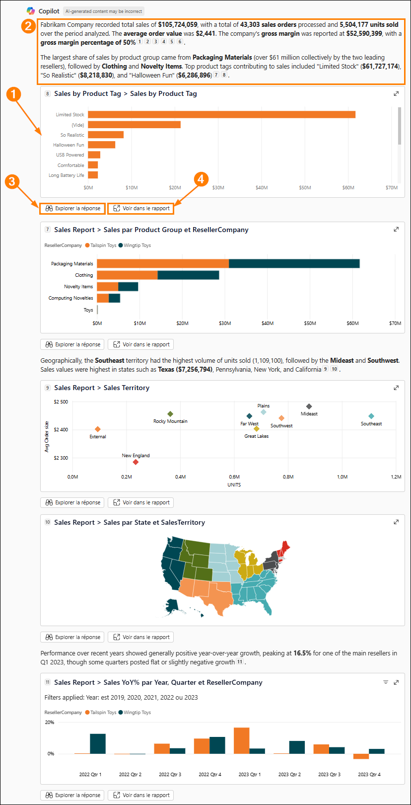

## Tâche 3 : Explorer la fonctionnalité Voir dans le rapport

Copilot peut renvoyer différents types de réponses en fonction des questions posées et du niveau de préparation des données sous-jacentes. Dans cette section, vous allez explorer la fonctionnalité **Voir dans le rapport**. Cette fonctionnalité s’affiche chaque fois que Copilot utilise un visuel existant d’un rapport pour répondre à votre question.

1. Ensuite, vous allez examiner l’option **Voir dans le rapport**. Cette option ouvrira le rapport actuel en mettant en évidence le visuel spécifié.

2. À partir de l’un des visuels présentés, cliquez sur **Voir dans le rapport**. Cela ouvrira un nouvel onglet dans votre navigateur web. _Voir la capture d’écran suivante_.

   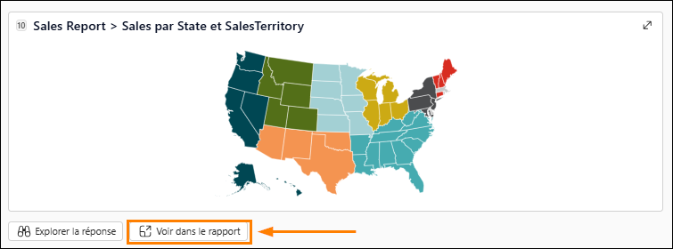

3. Dans la nouvelle page du rapport, vous verrez le visuel sélectionné par Copilot au sein du rapport d’origine. Vous remarquerez également que les autres visuels sont temporairement grisés, car le visuel que vous avez sélectionné a été **mis en évidence**. Cliquez n’importe où dans le rapport pour l’activer et l’explorer. Une fois votre exploration terminée, fermez cet onglet de votre navigateur et revenez à l’expérience Copilot autonome.

   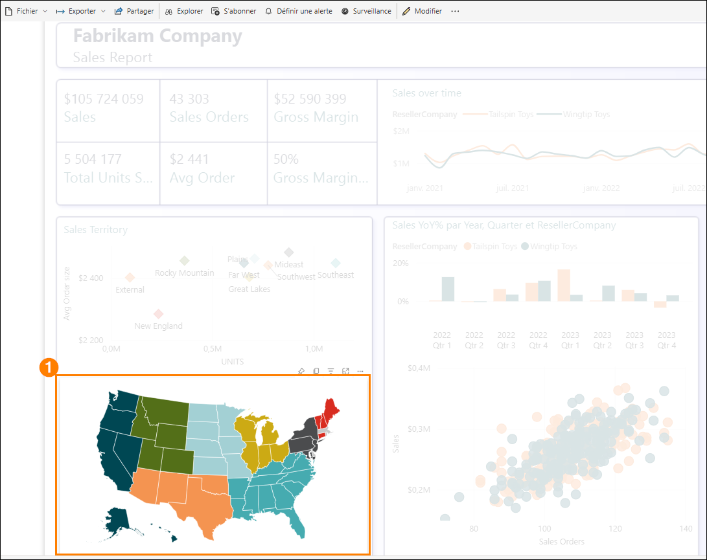

## Tâche 4 : Explorations

Une autre fonctionnalité proposée par l’expérience Copilot est la possibilité d’**Explorer la réponse**. Cette capacité à explorer une réponse est un excellent moyen d’affiner davantage votre expérience Copilot. Dans cette section, vous apprendrez à utiliser les explorations, à les modifier, à les enregistrer et à les partager.

**ℹ️ Note**

Les explorations sont principalement utilisées comme des outils d’analyse ad hoc des données et des visuels existants dans les rapports. Bien que les explorations puissent être enregistrées, elles sont le plus souvent simplement fermées une fois l’analyse ad hoc terminée.

1. Vous devriez maintenant être de retour dans votre expérience Copilot autonome. Cliquez sur **Explorer la réponse** sous l’un des visuels présentés par Copilot ; peu importe lequel vous choisissez pour cet exemple.

   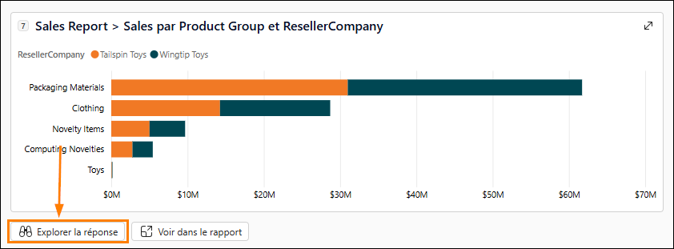

2. Cliquez sur ce bouton pour ouvrir un nouvel écran. Explorons les **explorations !**
   - (1) Enregistrer l’exploration en tant que rapport ou en tant qu’exploration.

   - (2) Ouvrir dans un nouvel onglet du navigateur.

   - (3) Partager

   - (4) Afficher au format matrice

   - (5) Modifier le type de visualisation

   - (6) Modifier les colonnes ou les mesures du visuel

   - (7) Développer ou réduire la vue

     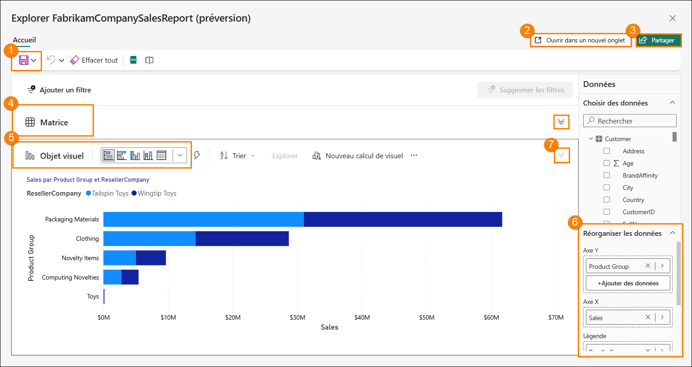

3. Cliquez sur l’icône de menu déroulant à côté du bouton Enregistrer ; plusieurs options s’afficheront alors :
   - Tout d’abord, vous pouvez enregistrer cet élément en tant qu’exploration ; il s’agit d’un type d’objet dans votre espace de travail.

   - Ensuite, vous pouvez enregistrer une copie. Cette option apparaît si l’exploration a déjà été enregistrée.

   - Enfin, vous pouvez enregistrer cet élément en tant que rapport.

     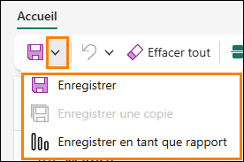

4. Si vous avez terminé la configuration plus tôt dans ce labo, vous pouvez désormais enregistrer cette exploration. Sélectionnez Enregistrer dans le menu déroulant. Une fenêtre contextuelle **Enregistrer cette exploration** s’affichera ; choisissez l’espace de travail que vous avez créé lors de la configuration, puis cliquez sur **Enregistrer**.

   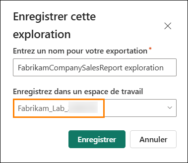

5. Dans la capture d’écran ci-dessous, vous pouvez voir un **exemple** de la manière dont une exploration apparaîtra dans votre espace de travail après l’avoir enregistrée :

   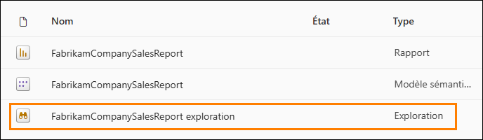

6. Vous pouvez également partager votre exploration avec d’autres utilisateurs ; toutefois, vous ne pouvez la partager que si vous l’avez d’abord enregistrée dans un espace de travail.

7. De retour dans votre espace de travail, recherchez l’exploration et cliquez sur l’icône de partage. Une fenêtre contextuelle s’affichera et vous permettra de partager cette exploration par lien, par e-mail ou via Teams. Remarque : **nous ne partageons pas les explorations dans le cadre de cet atelier ; veuillez fermer cette fenêtre et passer à l’étape suivante.**

   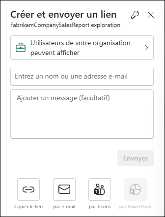

8. Prenez le temps d’ouvrir l’exploration et de découvrir d’autres fonctionnalités.
   - Modifiez le type de visuel

   - Modifiez les colonnes et les mesures affichées

9. Une fois que vous avez terminé d’explorer les fonctionnalités, cliquez sur le **X** dans le coin supérieur droit pour fermer votre exploration.

   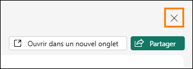

## Tâche 5 : Réponses vérifiées

Plus tôt dans ce cours, vous avez consacré du temps à la préparation de votre modèle de données pour l’IA. Une partie de cette préparation consiste à créer des réponses vérifiées. Les réponses vérifiées garantissent que certains visuels sont renvoyés lorsque des questions sont posées dans Copilot. Cela permet d’offrir une expérience plus maîtrisée et cohérente pour l’utilisateur final, tout en assurant l’exactitude, la cohérence et la confiance à travers les rapports.

1. Dans la prochaine session, vous apprendrez également comment améliorer davantage l’expérience des invites en ajoutant des éléments pour obtenir de meilleurs insights. En joignant explicitement un élément, Copilot peut réduire le périmètre d’analyse et fournir des résultats beaucoup plus clairs et concis. Actuellement, vous pouvez joindre trois éléments à une invite, un quatrième étant prévu prochainement :
   - Rapports

   - Modèles sémantiques

   - Assistant de données

   - Applications (bientôt disponible)

2. Cliquez sur **+ Ajouter du contenu à référencer par Copilot**, situé dans le coin inférieur gauche de l’invite.

   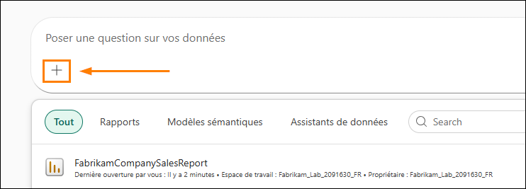

3. Sélectionnez **Rapports** parmi les options disponibles. Sélectionnez ensuite **Fabrikam Company Sales Report**. Cliquez sur **Confirmer**.

   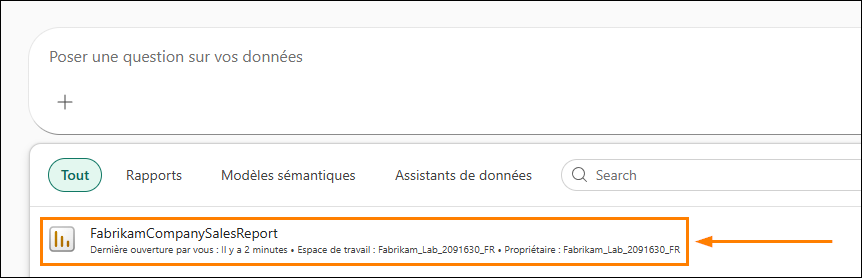

4. Ce rapport apparaît désormais comme lié dans votre invite Copilot. Ensuite, complétez l’invite en saisissant : **What is our best selling product?**

   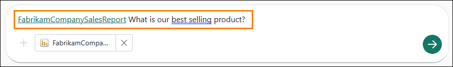

5. Vous devriez obtenir le résultat suivant à partir de cette invite. Si une réponse vérifiée a été utilisée dans la réponse, une notification s’affichera au-dessus de celle-ci. _Voir la capture d’écran suivante_.

6. Une option vous sera également proposée pour afficher le rapport et explorer les données.

   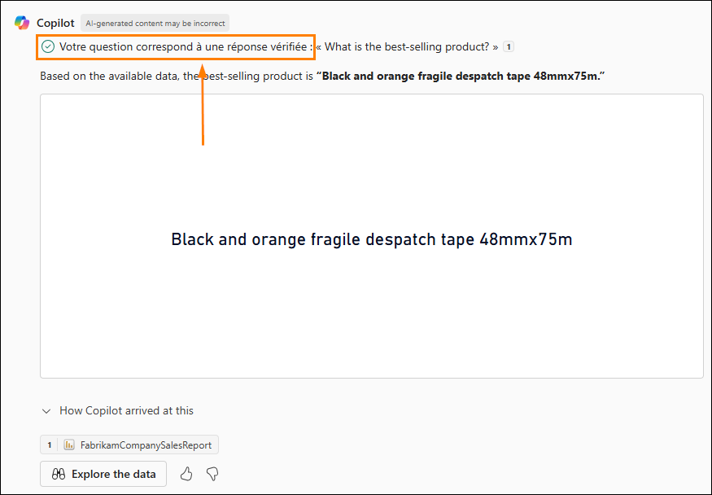

## Tâche 6 : Comment Copilot est arrivé à ce résultat (HCAAT)

Parfois, Copilot ne se contente pas de fournir une réponse : il explique également comment il y est parvenu. Cela offre un aperçu des coulisses de la logique, des filtres, des mesures et de bien d’autres éléments qui ont façonné la réponse. Plus précisément, cela est connu sous le nom de HCAAT, ou Comment Copilot est arrivé à ce résultat. Ces informations sont bien plus qu’utiles : elles vous permettent de valider les résultats, de renforcer la confiance dans les réponses produites et d’approfondir votre compréhension du modèle sous-jacent. Lorsque cela se produit, cela est très instructif et constitue un excellent moyen de vérifier la pertinence des résultats.

1. Sous votre réponse vérifiée, cliquez sur **Comment Copilot est arrivé à ce résultat**.

2. Vous verrez la question que vous avez posée, les données utilisées pour y répondre ainsi que les filtres qui ont été appliqués.

   

3. HCAAT peut renvoyer des résultats différents en fonction de la manière dont Copilot est arrivé au résultat. Examinons un autre exemple.

4. Dans l’invite Copilot, joignez le fichier **Fabrikam Company Sales Report**, puis saisissez ce qui suit : **return all customers that make up the top 1% of total sales.**

   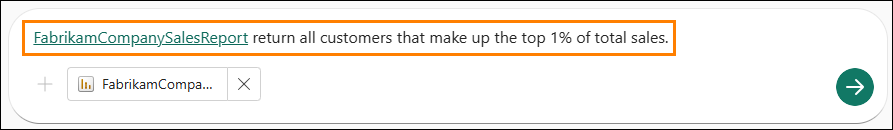

5. Examinons les résultats.
   - (1) Tout d’abord, nous obtenons une réponse indiquant que la question a nécessité plus d’analyse que d’habitude. Il s’agit d’un résultat généré par Copilot à l’aide de DAX. Assurez-vous de vérifier le code. Il est possible qu’il soit précisé que les données ne sont pas entièrement approuvées, car le résultat est généré en DAX.

     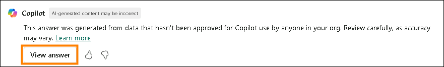

   - (2) La table affichant les résultats. Les résultats sont très bons. Notez que, même si nous avons demandé des clients, nous obtenons des revendeurs. Cela s’explique par le fait que, lors de la préparation des données pour l’IA, nous avons supprimé la table Customer et utilisé un synonyme pour Reseller.

   - (3) Comment Copilot est arrivé à ce résultat

   - (4) Le fichier Fabrikam Sales Report

   - (5) La requête DAX générée par Copilot pour parvenir aux résultats

     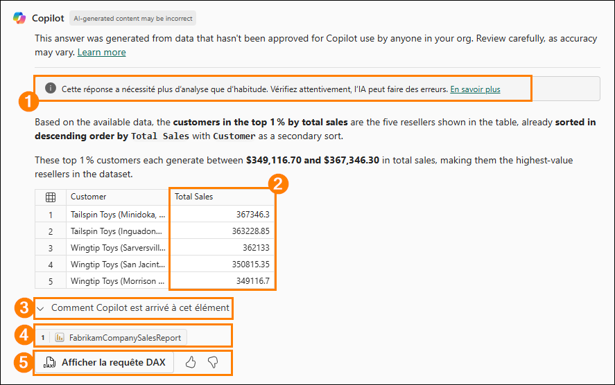

6. Commençons par explorer HCAAT. Cliquez sur **Comment Copilot est arrivé à ce résultat** pour développer la description.

7. Cette fois-ci, le résultat obtenu est très différent du précédent. Vous allez recevoir une description narrative expliquant comment Copilot est arrivé à cette réponse.

   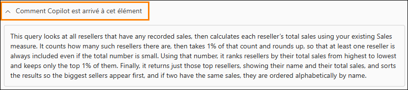

   Dans cette section, vous avez appris que Copilot partage parfois la manière dont il est arrivé à une réponse donnée. La façon dont Copilot présente ou affiche ces informations peut varier en fonction du processus qu’il a utilisé pour produire la réponse.

## Tâche 7 : Une réponse de données issue d’une requête DAX générée par Copilot

Dans l’exemple précédent, Copilot a généré une requête DAX en s’appuyant sur les données sous-jacentes du modèle sémantique. De plus, Copilot vous a averti de vérifier l’exactitude des résultats. Examinons plus en détail la réponse.

1. En observant les résultats dans la capture d’écran ci-dessus, vous pouvez constater que le total des ventes est répété pour chaque client (n’oubliez pas que nous avons créé un synonyme faisant correspondre Resellername à Customers). Cela indique généralement qu’il n’existe pas de relation valide entre les tables qui font partie de la réponse obtenue.

2. Cliquez sur **Afficher la requête DAX**.

   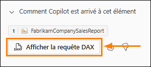

3. Cela ouvrira une fenêtre contextuelle affichant la requête DAX générée, accompagnée de commentaires intégrés expliquant comment la solution est parvenue à cette réponse. Vers le bas de la fenêtre, vous verrez la description de la manière dont Copilot est arrivé à ce résultat. Enfin, tout en bas de la fenêtre contextuelle, deux options s’offrent à vous.
   - Exécuter la requête : cette option ouvrira la requête DAX actuelle dans la vue Requête DAX

   - Copier la requête : cette option copiera la requête DAX dans votre presse-papiers

     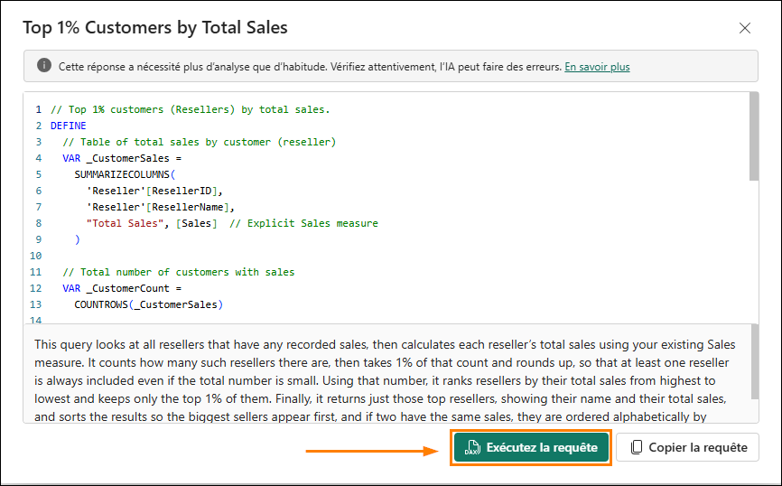

4. Cliquez sur **Exécuter la requête**. Un nouvel onglet s’ouvrira dans votre navigateur web, affichant la vue Requête DAX de votre modèle sémantique Fabrikam Company.

   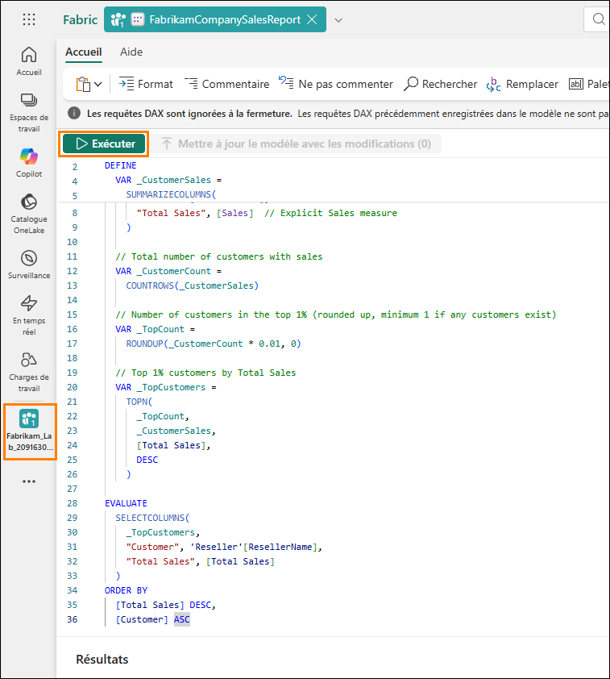

5. Cliquez sur **Exécuter** pour afficher les résultats dans la vue Requête DAX. Les résultats affichés ici sont identiques à ceux que nous avons reçus via Copilot. Si vous êtes familier avec le langage DAX, vous pouvez modifier l’expression DAX afin d’affiner davantage les résultats.

   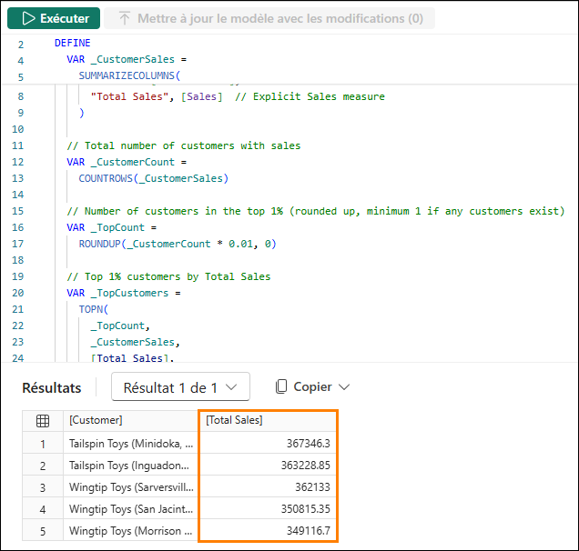

6. Cela semble être une excellente réponse de la part de Copilot, et toute notre préparation a porté ses fruits. Si je rouvre Power BI et crée rapidement un visuel, je peux vérifier très facilement que la réponse de Copilot est correcte !

   

7. Un autre point important à souligner est que vous avez également accès à la vue Modèle. À partir de celle-ci, vous pouvez valider les tables et les relations dans le modèle sémantique.

   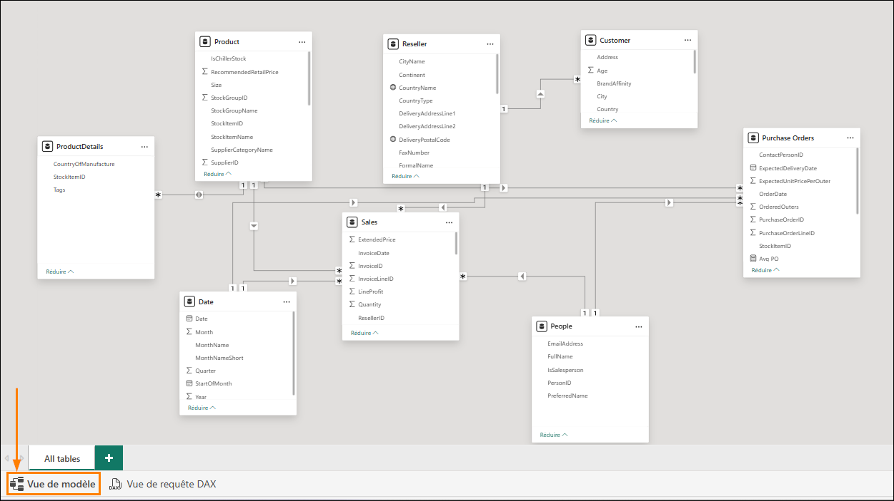

   Dans ce labo, vous avez appris que vous pouviez consulter le DAX généré par Copilot, ouvrir la vue Requête DAX et modifier le code existant, et même accéder à la vue Modèle afin de vérifier les relations.

   **ℹ️ Important**

   L’expérience Chat with your Data est un outil extrêmement puissant qui peut grandement accélérer l’accès à des informations stratégiques clés pour les entreprises du monde entier. Toutefois, ces résultats peuvent également être incorrects ou trompeurs. Il est donc essentiel de prendre le temps de valider les résultats, comme nous l’avons vu dans ce labo.

## Tâche 8 : Changement de contexte dans Copilot

Jusqu’à présent, dans cet atelier, vous vous êtes concentré uniquement sur les données de ventes de la société Fabrikam. Cependant, notre organisation dispose de nombreux rapports répartis sur de multiples espaces de travail, et l’expérience Copilot autonome fera référence à l’ensemble des rapports auxquels elle a accès.

1. Accédez à vos fichiers de classe et ouvrez **State of Nevada COVID-19 Dashboard.**

   

2. Publiez ce rapport entièrement finalisé dans votre espace de travail **Fabrikam_lab_0000000.**

   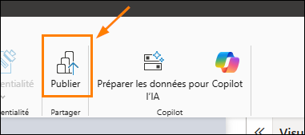

   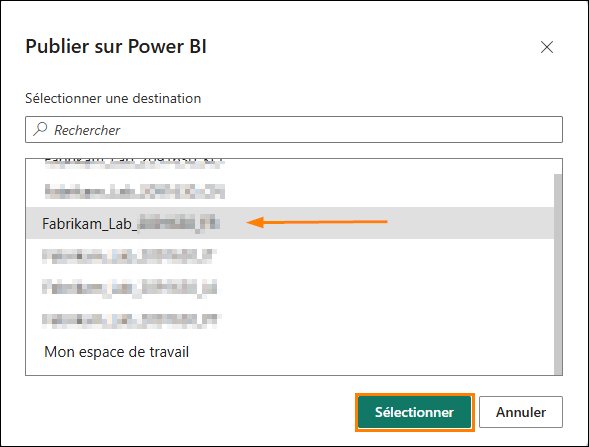

3. Vous pouvez maintenant interroger ce modèle sémantique et ce rapport dans l’expérience Copilot autonome. Dans l’invite Copilot, saisissez le texte suivant : **How many confirmed cases have there been?** Assurez-vous d’utiliser le **bouton + (1) ou le modèle sémantique (2) et StateofNevadaCOVID-19Dashboard (3)** s’il n’est pas inclus automatiquement. Nous avons volontairement fourni une invite très générique, et Copilot a été capable de comprendre votre intention en se basant sur le contenu du rapport. Rappelez-vous que, sous le rapport renvoyé, Copilot indique les critères sur lesquels il s’est appuyé pour établir la correspondance.

   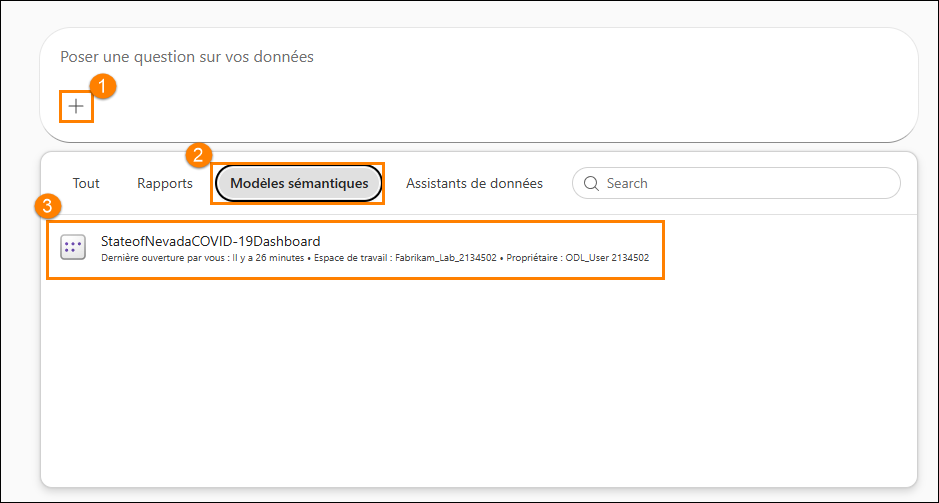

4. Parfait ! Copilot répond désormais à nos questions en renvoyant un visuel issu du rapport sous-jacent. N’oubliez pas que vous pouvez obtenir plusieurs types d’affichage différents avec Copilot.

   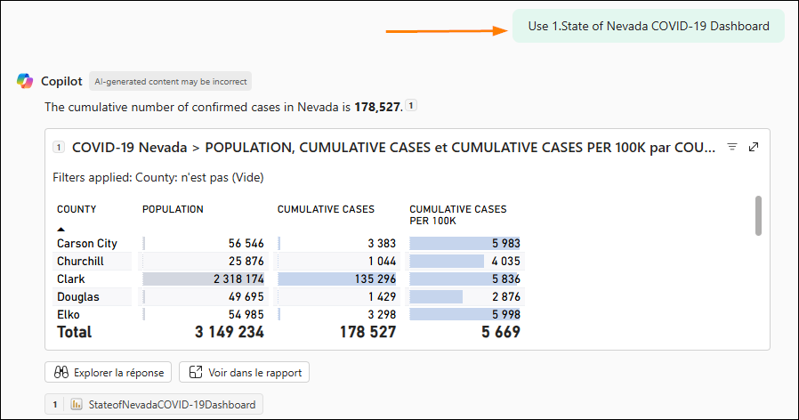

   OU

   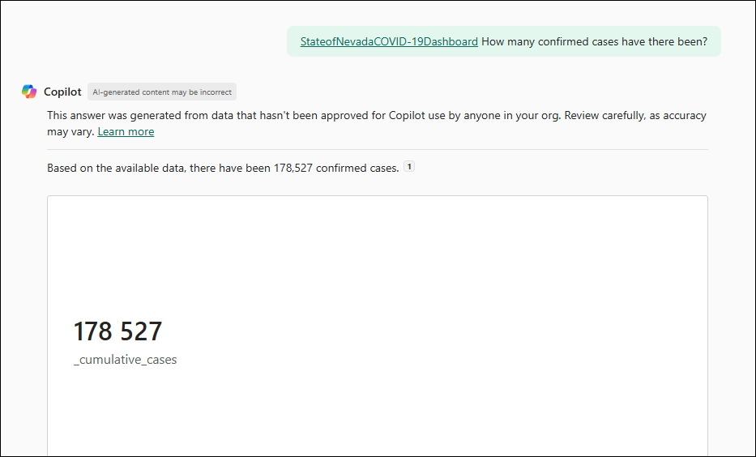

5. Posez une autre question sur les données, en saisissant l’invite suivante : **How many deaths were there in Carson City in 2019?**

   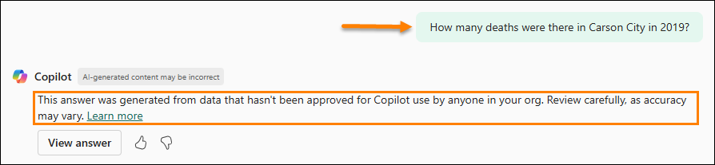

6. Cette fois, Copilot n’a pas trouvé de visuel existant qu’il pouvait renvoyer et, par conséquent, il a généré une réponse à partir des données sous-jacentes du rapport. Lorsque cela se produit sur un modèle qui n’est pas marqué comme Préparé pour l’IA, vous recevez une **réponse de friction**.

   **ℹ️ Important**

   Une réponse de friction est un avertissement ou une limitation générée par le système qui apparaît lorsque Copilot rencontre un modèle de données non préparé ou insuffisamment décrit. Copilot indique en substance : je peux essayer d’aider avec les informations disponibles, mais les résultats doivent être validés.

   Pour réduire les réponses de friction de Copilot, assurez-vous de préparer vos modèles sémantiques pour l’IA, puis de marquer le modèle sémantique comme Préparé pour l’IA après sa publication. Consultez le document d’aide sur les paramètres due l’abonné fourni dans les fichiers de votre labo.

## Tâche 9 : Construction d’un visuel par Copilot à partir du modèle sémantique

Dans les labos précédents, vous avez observé que Copilot renvoyait des visuels pour répondre à des questions spécifiques. Ces visuels existaient déjà dans nos rapports. Dans cette section, vous allez voir comment Copilot peut également construire des visualisations à partir du modèle sémantique afin de répondre aux demandes.

1. Si vous n’êtes pas déjà dans Copilot, revenez à Copilot dans Fabric.

2. Dans votre invite, joignez votre rapport **Fabrikam Company Sales Report**, puis saisissez l’invite suivante : **Show me units sold over time**.

   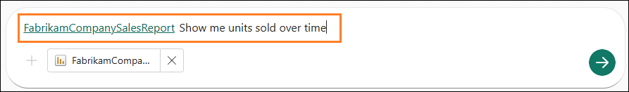

3. La visualisation renvoyée n’est pas un visuel qui existait auparavant dans le rapport. Il s’agit d’une visualisation créée par Copilot à partir du modèle sémantique. En effet, contrairement aux visuels issus directement d’un rapport, cette réponse générée par Copilot est accompagnée d’une explication HCAAT _Comment Copilot est arrivé à ce résultat_.

   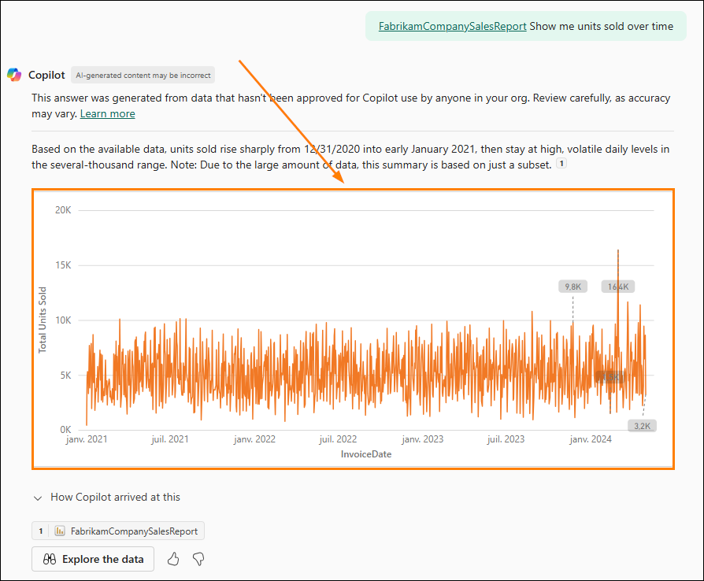

4. Explorons les résultats, cliquez sur **Comment Copilot est arrivé à ce résultat**.

   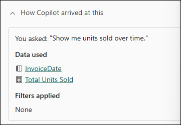

## Tâche 10 : Expérience générale Copilot

Dans ce labo, vous avez appris à exploiter l’expérience Copilot autonome dans Microsoft Fabric pour explorer vos rapports et modèles sémantiques existants. Cependant, vous pouvez également tirer parti de l’expérience Copilot générale. Dans ce labo, nous allons utiliser Copilot pour rédiger un e-mail présentant nos conclusions.

1. Dans votre invite Copilot, saisissez **Take the conversation so far and turn it into an email to share with the team**.

   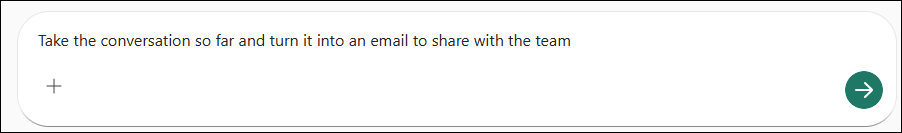

2. Les résultats sont plutôt impressionnants. Pour rappel, votre réponse peut être très différente de celle présentée dans la capture d’écran. Il est également important de se rappeler que la réponse dépend de la conversation actuellement ouverte avec Copilot : si vous avez effacé la conversation ou s’il y a peu d’historique d’échanges, cela aura un impact sur le résultat final.

   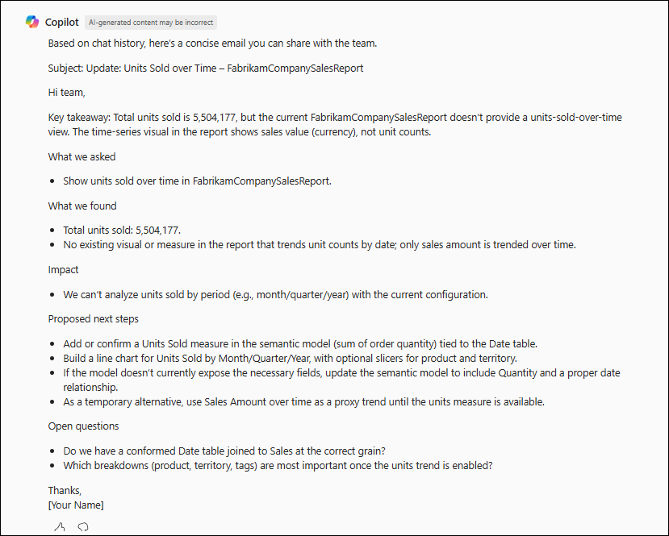

3. C’est bien, mais ce serait encore mieux si nous avions des visuels et des liens dans l’e-mail. Dans votre requête Copilot, demandez à Copilot : **Add visuals and links to the email.**

   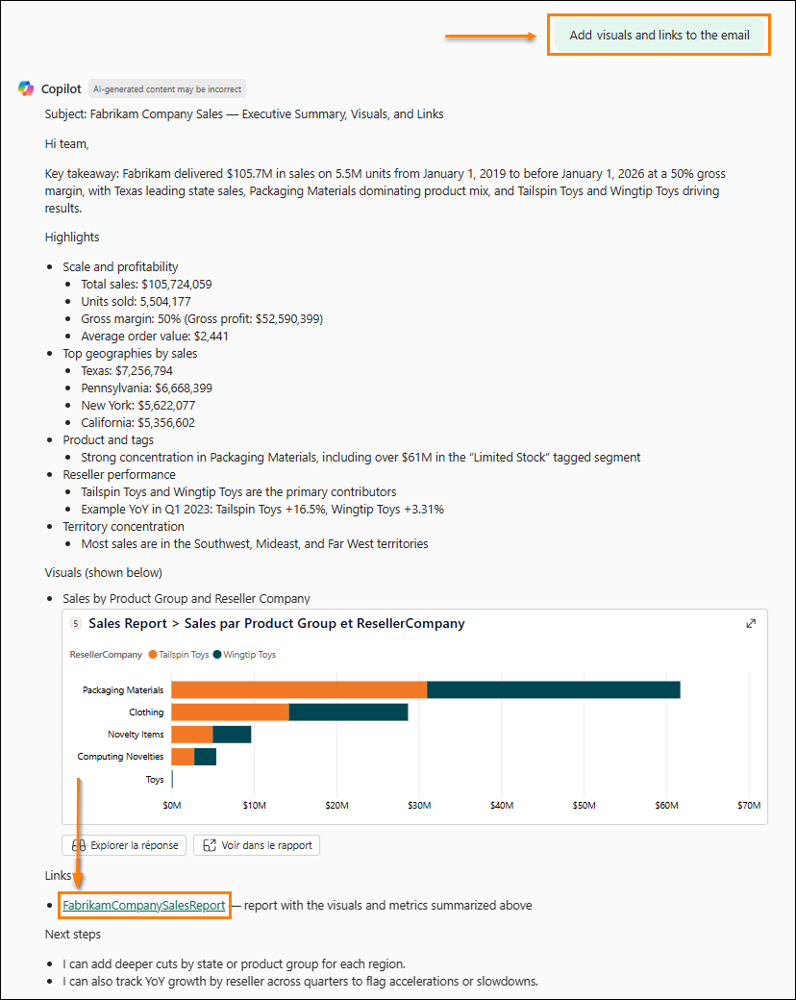

# Références

Chat With Your Data in a Day (CDIAD) vous présente certaines des fonctionnalités clés lors de l’utilisation de Copilot autonome dans un espace de travail Fabric.

Dans le menu du service, la section Aide (?) comporte des liens vers d’excellentes ressources. Gardez à l’esprit que la vue affichée dépend de votre expérience actuelle et que vos options peuvent donc différer de celles présentées dans la capture d’écran ci-dessous.

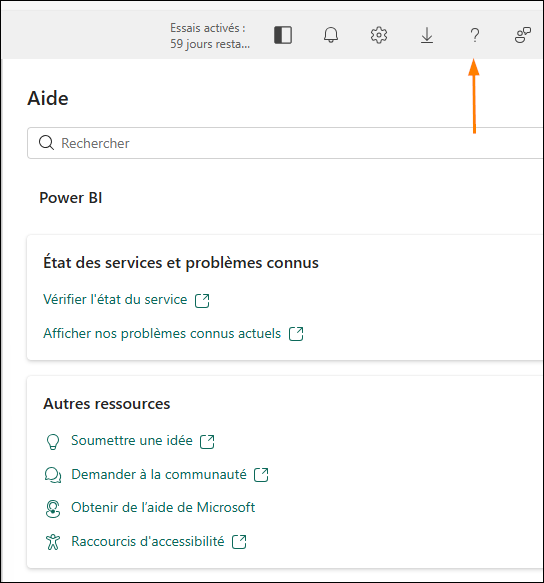

Voici quelques autres ressources qui vous aideront lors de vos prochaines étapes avec Microsoft Fabric :

- Accédez à toutes les informations dans la [Documentation Microsoft Fabric de base](https://learn.microsoft.com/en-us/fabric/)

- Explorez Fabric grâce à la [visite guidée](https://aka.ms/Fabric-GuidedTour)

- Inscrivez-vous pour bénéficier d’un [essai gratuit de Microsoft Fabric](https://aka.ms/try-fabric)

- Rendez-vous sur le [site web Microsoft Fabric](https://aka.ms/microsoft-fabric)

- Acquérez de nouvelles compétences en explorant les [modules d’apprentissage Fabric](https://aka.ms/learn-fabric)

- Lisez l’[e-book gratuit sur la prise en main de Fabric](https://aka.ms/fabric-get-started-ebook)

- Rejoignez la [communauté Fabric](https://aka.ms/fabric-community) pour publier vos questions, partager vos commentaires et apprendre des autres utilisateurs

Lisez la documentation technique détaillée relative à Copilot :

- [Vue d’ensemble de Copilot pour Power BI - Power BI | Microsoft Learn](https://learn.microsoft.com/en-us/power-bi/create-reports/copilot-introduction)

- [Expérience Copilot autonome dans Power BI (version préliminaire) – Power BI | Microsoft Learn](https://learn.microsoft.com/en-us/power-bi/create-reports/copilot-chat-with-data-standalone)

- [Microsoft FabricParamètres administrateur de Copilot | Microsoft Learn](https://learn.microsoft.com/en-us/fabric/admin/service-admin-portal-copilot)

- [Création d’un assistant de données Fabric (version préliminaire) : découvrez comment créer un assistant de données Fabric | Microsoft Learn](https://learn.microsoft.com/en-us/fabric/data-science/concept-data-agent)

- [Bonnes pratiques relatives à la configuration de votre assistant de données - Microsoft Fabric | Microsoft Learn](https://learn.microsoft.com/en-us/fabric/data-science/data-agent-configuration-best-practices)

- [Copilot pour Microsoft Fabric et Power BI : FAQ - Microsoft Fabric | Microsoft Learn](https://learn.microsoft.com/en-us/fabric/fundamentals/copilot-faq-fabric)

© 2026 Microsoft Corporation. Tous droits réservés.

En effectuant cette démonstration/ce labo, vous acceptez les conditions suivantes :

La technologie/fonctionnalité décrite dans cette démonstration/ce labo est fournie par Microsoft Corporation en vue d’obtenir vos commentaires et de vous fournir une expérience d’apprentissage. Vous pouvez utiliser cette démonstration/ce labo uniquement pour évaluer ces technologies et fonctionnalités, et pour fournir des commentaires à Microsoft. Vous ne pouvez pas l’utiliser à d’autres fins. Vous ne pouvez pas modifier, copier, distribuer, transmettre, afficher, effectuer, reproduire, publier, accorder une licence, créer des œuvres dérivées, transférer ou vendre tout ou une partie de cette démonstration/ce labo.

LA COPIE OU LA REPRODUCTION DE CETTE DÉMONSTRATION/CE LABO (OU DE TOUTE PARTIE DE CEUX-CI) SUR TOUT AUTRE SERVEUR OU AUTRE EMPLACEMENT EN VUE D’UNE AUTRE REPRODUCTION OU REDISTRIBUTION EST EXPRESSÉMENT INTERDITE.

CETTE DÉMONSTRATION/CE LABO FOURNIT CERTAINES FONCTIONNALITÉS DE PRODUIT/TECHNOLOGIES LOGICIELLES, NOTAMMENT D’ÉVENTUELS NOUVEAUX CONCEPTS ET FONCTIONNALITÉS, DANS UN ENVIRONNEMENT SIMULÉ SANS CONFIGURATION NI INSTALLATION COMPLEXES AUX FINS DÉCRITES CI-DESSUS. LES TECHNOLOGIES/CONCEPTS REPRÉSENTÉS DANS CETTE DÉMONSTRATION/CE LABO PEUVENT NE PAS REPRÉSENTER LES FONCTIONNALITÉS COMPLÈTES ET PEUVENT NE PAS FONCTIONNER DE LA MÊME MANIÈRE QUE DANS UNE VERSION FINALE. IL EST ÉGALEMENT POSSIBLE QUE NOUS NE PUBLIIONS PAS DE VERSION FINALE DE CES FONCTIONNALITÉS OU CONCEPTS. VOTRE EXPÉRIENCE D’UTILISATION DE CES FONCTIONNALITÉS DANS UN ENVIRONNEMENT PHYSIQUE PEUT ÉGALEMENT ÊTRE DIFFÉRENTE.

**COMMENTAIRES.** Si vous envoyez des commentaires sur les fonctionnalités, technologies et/ou concepts décrit(e)s dans ces labos/cette démonstration à Microsoft, vous accordez à Microsoft, sans frais, le droit d’utiliser, de partager et de commercialiser vos commentaires de quelque manière et à quelque fin que ce soit. Vous accordez également à des tiers, sans frais, les droits de brevet nécessaires pour leurs produits, technologies et services en vue de l’utilisation ou de l’interface avec des parties spécifiques d’un logiciel ou d’un service Microsoft incluant les commentaires. Vous n’enverrez pas de commentaires soumis à une licence exigeant que Microsoft accorde une licence pour son logiciel ou sa documentation à des tiers du fait que nous y incluons vos commentaires. Ces droits survivent à ce contrat.

MICROSOFT CORPORATION DÉCLINE TOUTES LES GARANTIES ET CONDITIONS EN CE QUI CONCERNE CETTE DÉMONSTRATION/CE LABO, Y COMPRIS TOUTES LES GARANTIES ET CONDITIONS DE QUALITÉ MARCHANDE, QU’ELLES SOIENT EXPLICITES, IMPLICITES OU LÉGALES, D’ADÉQUATION À UN USAGE PARTICULIER, DE TITRE ET D’ABSENCE DE CONTREFAÇON. MICROSOFT N’OFFRE AUCUNE GARANTIE OU REPRÉSENTATION EN CE QUI CONCERNE LA PRÉCISION DES RÉSULTATS, LA CONSÉQUENCE QUI DÉCOULE DE L’UTILISATION DE CETTE DÉMONSTRATION/CE LABO, OU L’ADÉQUATION DES INFORMATIONS CONTENUES DANS CETTE DÉMONSTRATION/CE LABO À QUELQUE FIN QUE CE SOIT.

**CLAUSE D’EXCLUSION DE RESPONSABILITÉ**

Cette démonstration/Ce labo comporte seulement une partie des nouvelles fonctionnalités et améliorations disponibles dans Microsoft Power BI. Certaines fonctionnalités sont susceptibles de changer dans les versions ultérieures du produit. Dans ce labo/cette démonstration, vous allez découvrir comment utiliser certaines nouvelles fonctionnalités, mais pas toutes.
