# Microsoft Fabric Chat with your Data in a Day - Labo 5

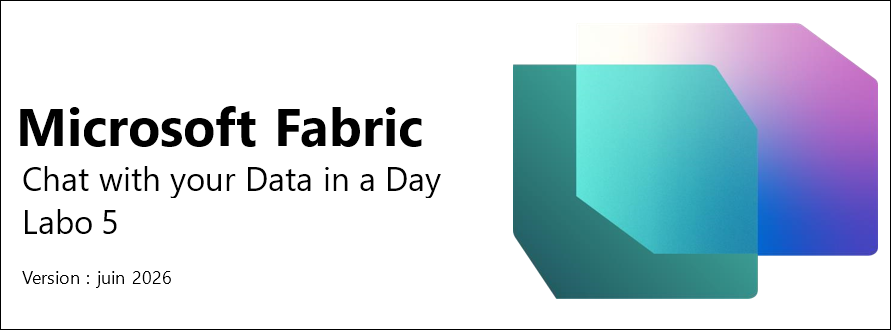

## Sommaire

- Structure du document
- Scénario/Énoncé du problème
- Introduction
- Implémenter les assistants de données Fabric
- Prérequis
  - Tâche 1 : Créer votre assistant de données
  - Tâche 2 : Ajouter des sources de données
  - Tâche 3 : Poser des questions à l’assistant de données
  - Tâche 4 : Ajouter des instructions pour l’IA
- Coup de projecteur : Remplacer une source de données
  - Tâche 5 : Ajouter des sources de données supplémentaires
- Coup de projecteur : Instructions pour une source de données
  - Tâche 6 : Créer des exemples de questions
  - Tâche 7 : Publier et partager votre assistant de données
  - Tâche 8 : Utilisation d’un assistant de données depuis Copilot
- Références

# Structure du document

Le labo comprend des étapes à suivre par l’utilisateur, ainsi que des captures d’écran associées qui fournissent une aide visuelle. Dans chaque capture d’écran, des sections sont mises en évidence avec des encadrés orange afin de souligner la ou les zones sur laquelle/lesquelles l’utilisateur doit se concentrer.

# Scénario/Énoncé du problème

L’expérience Copilot autonome a rencontré un immense succès, en permettant à l’ensemble de votre organisation d’accéder plus rapidement aux analyses et en augmentant l’adoption globale.

Cependant, l’expérience Copilot n’est pas hautement personnalisable, et vous disposez désormais d’utilisateurs finaux qui souhaitent des expériences plus ciblées, afin de pouvoir concentrer leurs questions sur des domaines très spécifiques de l’entreprise, sans avoir à parcourir des rapports et des modèles sémantiques non pertinents. Il vous a été demandé de créer un assistant de données connecté uniquement aux données relatives au rapport Fabrikam Company Sales. Vous devez également ajouter à cet assistant des données supplémentaires qui ne sont pas disponibles dans l’expérience Copilot autonome, afin de pouvoir répondre à des questions plus spécifiques que votre équipe souhaite poser concernant les délais de mise à disposition des produits.

# Introduction

Vous avez découvert l’expérience Copilot autonome, qui est idéale pour explorer l’ensemble de vos données dans tous vos espaces de travail. Toutefois, l’utilisation des assistants de données permet de proposer une expérience plus ciblée pour dialoguer avec des données spécifiques. Les assistants de données peuvent se connecter à des sources de données spécifiques, voire à des tables spécifiques au sein de ces sources. Alors que Copilot est un assistant IA intégré à Microsoft Fabric qui améliore la productivité et l’intelligence, les assistants de données assurent une connectivité fluide et intelligente des données.

À la fin de ce labo, vous aurez appris à effectuer les opérations suivantes :

- Créer un assistant de données

- Ajouter des sources de données à votre assistant

- Poser des questions à votre assistant

- Ajouter des instructions pour l’IA que votre assistant utilisera

- Remplacer une source de données

- Ajouter des sources de données supplémentaires

- Créer des exemples de questions

- Publier et partager votre assistant

- Utiliser un assistant de données depuis l’expérience Copilot autonome

# Implémenter les assistants de données Fabric

Dans cette section, vous allez apprendre à créer un assistant de données. L’assistant peut récupérer des données en générant des requêtes structurées (SQL, DAX, KQL) afin de répondre à des questions impliquant des faits, des totaux, des classements ou des filtres. Au moment de la rédaction de ce document, les assistants de données Fabric sont une fonctionnalité d’évaluation dans Microsoft Fabric et ne sont pas recommandés pour des charges de travail en production. Vous pouvez en savoir plus sur le fonctionnement des assistants de données Fabric ici :

[Création d’un assistant de données Fabric (version préliminaire) : découvrez comment créer un assistant de données Fabric | Microsoft Learn](https://learn.microsoft.com/en-us/fabric/data-science/concept-data-agent)

Les assistants de données Microsoft Fabric permettent aux utilisateurs d’interagir avec les données d’entreprise en langage naturel, sans avoir besoin d’utiliser SQL, DAX ou KQL. Ils fournissent une interface de discussion avec des outils de débogage et peuvent se connecter à des sources telles que les modèles sémantiques Power BI, les bases de données KQL, les lakehouses et les entrepôts. Les assistants de données peuvent être utilisés à l’intérieur et à l’extérieur de Microsoft Fabric. Ils peuvent être intégrés dans Microsoft Teams, Copilot Studio, Azure AI Foundry et des applications personnalisées. Les assistants de données sont également détectables depuis l’expérience Copilot autonome dans Fabric.

## Prérequis

Pour utiliser les assistants de données Fabric, plusieurs paramètres de l’abonné doivent être activés ou configurés. Veuillez consulter le **document Consignes relatives aux paramètres de l’abonné** disponible dans les labos de votre classe :

- Un accès administrateur est requis

- Activer les paramètres Copilot et Azure OpenAI

- Activer la création et le partage d’un assistant de données Fabric

- Activer les points de terminaison XMLA pour les modèles sémantiques Power BI

## Tâche 1 : Créer votre assistant de données

1. Ouvrez un navigateur web dans votre machine virtuelle, accédez à https://fabric.microsoft.com et rendez-vous sur l’espace de travail nommé **Fabrikam_Lab_<inject key="DeploymentID" enableCopy="false"></inject>_FR**.

    *(**Important** : utilisez l’espace de travail que vous avez créé précédemment dans cette classe)*

    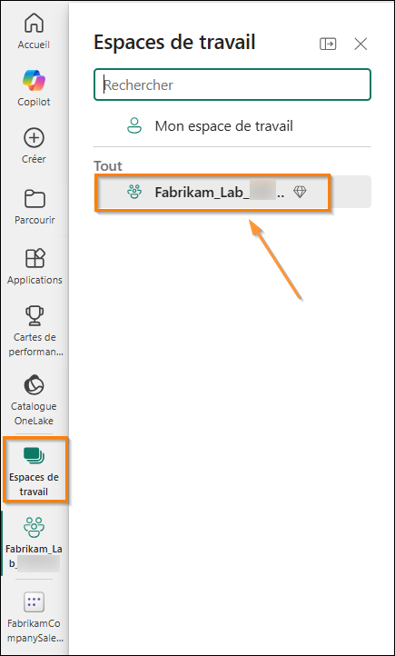

2. Cliquez sur **Nouvel élément** :

    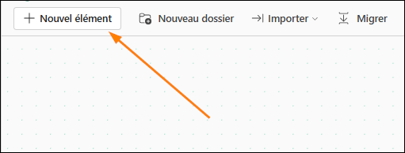

3. Dans la barre de recherche qui s’ouvre, saisissez **Agent**, puis sélectionnez **Assistant de données (version préliminaire).**

    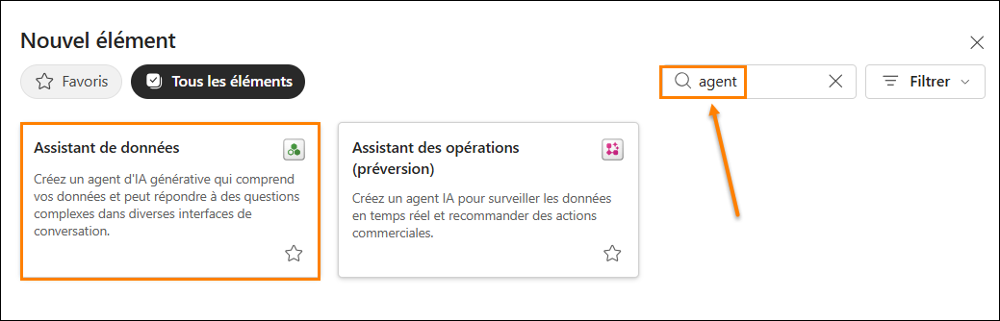

4. Donnez un nom à votre assistant, **FabrikamSales_agent_<inject key="DeploymentID" enableCopy="false"/>**

5. N’oubliez pas que votre code d’utilisateur se trouve dans votre nom d’utilisateur, comme indiqué ci-après :

    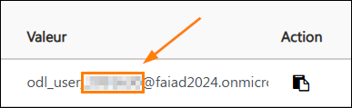

6. Cliquez sur **Créer.**

    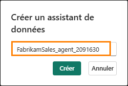

## Tâche 2 : Ajouter des sources de données

1. Une fois que vous avez créé un assistant de données, l’étape suivante consiste à ajouter vos sources de données.

2. Dans le volet de l’explorateur, cliquez sur le bouton **+ Source de données**. Vous pouvez également cliquer sur le bouton **Ajouter une source de données** situé au milieu de l’écran.

    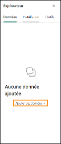

    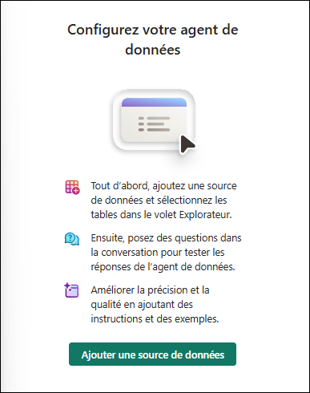

3. Choisissez le modèle sémantique **Fabrikam Company Sales Report** dans la liste, puis cliquez sur **Ajouter**.

    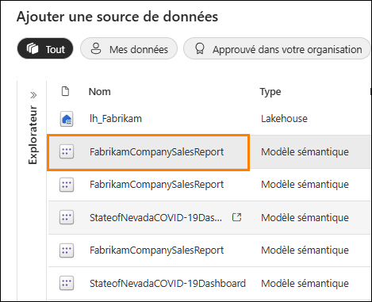

4. Veuillez noter qu’aucune table n’a encore été sélectionnée et que l’assistant de données ne peut pas répondre aux questions tant qu’au moins une source de données n’a pas été sélectionnée. Cliquez sur **>** en regard de **Fabrikam Company Sales Report** dans le volet **Explorer**. Sélectionnez les tables qui sont indiquées dans la capture d’écran ci-dessous.

    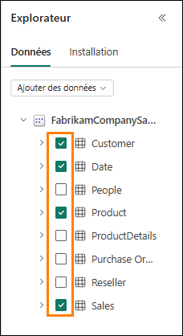

## Tâche 3 : Poser des questions à l’assistant de données

1. Maintenant que votre assistant est connecté à une source de données, commençons à rédiger des invites à destination de l’assistant de données.

2. Saisissez la commande suivante : **Show me sales by country.**

    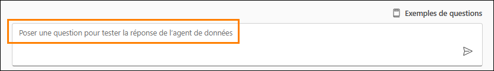

3. L’assistant peut mettre plusieurs secondes à répondre. Notez ce que l’assistant a renvoyé :

    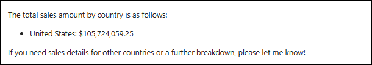

4. Cliquez sur le menu déroulant de l’étape terminée pour afficher ce que l’assistant a fait, puis sur le menu déroulant suivant pour révéler les détails.

    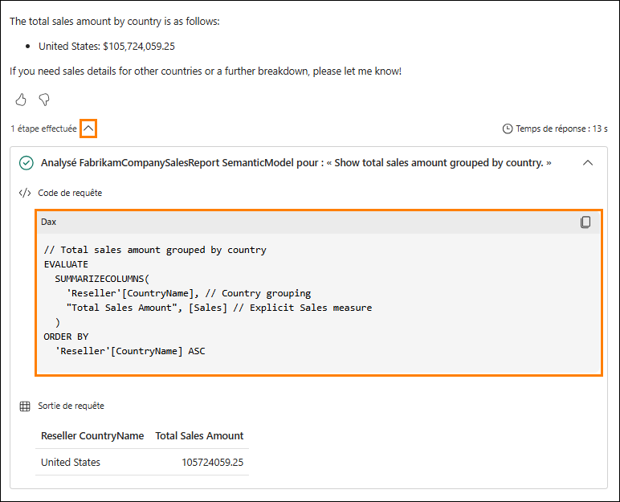

    **ℹ️ Important**

    Lors du développement d’un assistant de données Fabric, il est important de prendre le temps de valider les résultats afin d’en garantir l’exactitude et la cohérence. Maintenant que vous disposez de résultats, nous allons revenir au modèle sémantique et y valider les résultats.

5. Accédez à vos fichiers de classe téléchargés et ouvrez le fichier **Fabrikam Company Sales Report.pbix**.

    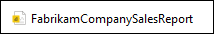

6. Cliquez en bas du rapport pour ouvrir une nouvelle page du rapport.

    

7. Ensuite, vous allez créer un visuel de base pour valider les résultats renvoyés par l’assistant de données.

8. Ajoutez un visuel de table sur cette nouvelle page de rapport.

    

    

9. La table qui en résulte devrait ressembler à ceci :

    

10. Notez que le montant total des ventes est identique au résultat de la requête fourni ci-dessus par l’assistant de données. Cela confirme que la requête de l’assistant a renvoyé le résultat correct.

## Tâche 4 : Ajouter des instructions pour l’IA

Des instructions pour l’IA peuvent être ajoutées à l’assistant de données Fabric afin d’améliorer l’exactitude et la cohérence. Les instructions pour l’IA peuvent être ajoutées à deux emplacements distincts au sein de l’assistant de données.

Tout d’abord, des instructions pour l’IA peuvent être ajoutées directement à l’assistant. Celles-ci sont appelées **Instructions pour l’assistant** et aident ce dernier à identifier quelles sources de données utiliser pour certaines questions, quel ton adopter, quels types de données prioriser, ainsi que d’autres préférences comportementales ou contextuelles similaires qui façonnent la manière dont l’assistant répond aux utilisateurs.

Le deuxième type d’instructions IA correspond aux **instructions pour la source de données** ; avec ces instructions, vous pouvez ajouter des consignes pour aider l’assistant de données à comprendre les données de la source et à les utiliser de la manière la plus efficace possible. Actuellement, les **instructions pour la source de données** ne sont pas prises en charge par les modèles sémantiques ; nous examinerons cette fonctionnalité à une date ultérieure.

1. Commençons par les **instructions pour l’assistant** dans l’interface du navigateur Fabric. Nous pouvons donc indiquer à l’assistant que nous souhaitons qu’un résumé concis soit ajouté à chaque réponse.

2. Dans l’onglet Accueil, sélectionnez Instructions pour l’IA.

    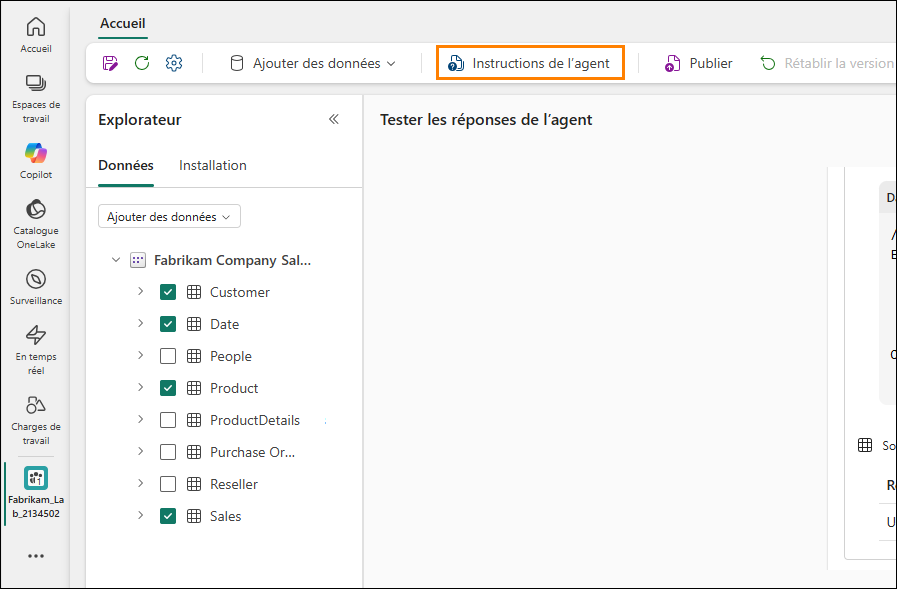

3. Dans la zone **Instructions pour l’assistant** de la fenêtre des instructions pour l’IA, au-dessus ou en dessous des instructions génériques existantes, saisissez les consignes suivantes :

    **## Set Response Guidelines**

    **Always include a concise summary before the detailed breakdown.**

    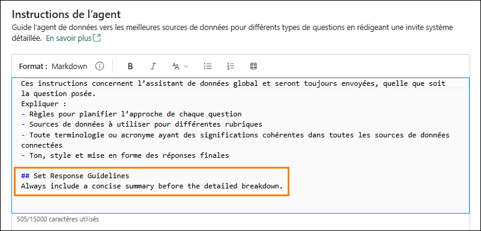

    **ℹ️ Important**

    Il peut arriver que les instructions pour l’IA mettent un certain temps à prendre effet. Si vous n’obtenez pas les résultats souhaités, cliquez sur le bouton Effacer la conversation en haut de la fenêtre de votre assistant, puis réessayez.

4. Cliquez sur le **X** dans le coin supérieur droit de l’onglet « Instructions pour l’assistant » pour fermer les instructions pour l’IA et enregistrer vos modifications.

    **ℹ️ Important**

    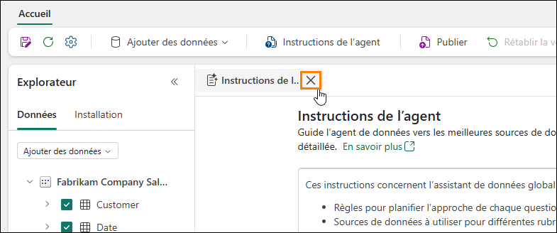

    Il peut arriver que les instructions pour l’IA mettent un certain temps à prendre effet. Si vous n’obtenez pas les résultats souhaités, cliquez sur le bouton Effacer la conversation en haut de la fenêtre de votre assistant, puis réessayez.

5. Donnez à l’assistant la même instruction que précédemment : **Show me sales by country**, puis appuyez sur Entrée.

    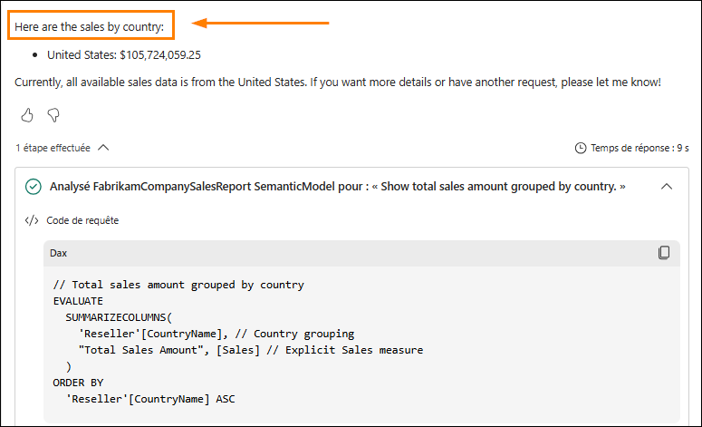

6. Ajoutons une autre instruction pour l’IA afin d’affiner davantage la réponse de l’assistant. Dans cet exemple, vous allez ajouter une consigne dans l’invite pour que l’assistant renvoie toujours une table au lieu d’une liste à puces. Ouvrez les instructions pour l’IA et, dans les instructions pour l’assistant, ajoutez la ligne de code suivante :

    **Always return a table instead of bullet points**

    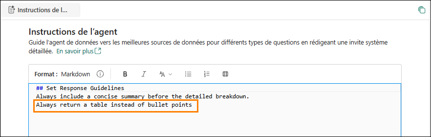

7. Fermez la fenêtre des instructions pour l’IA et saisissez le texte suivant dans l’invite de votre assistant de données : **Return sales by country**

    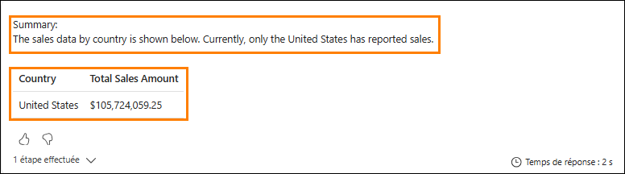

8. Vous recevez maintenant les résultats sous forme d’une table, avec un résumé ! Tout va bien jusqu’à présent. Nous allons ajouter quelques instructions supplémentaires.

9. Dans l’invite de votre assistant de données, saisissez le texte suivant : **Return sales by State**.

    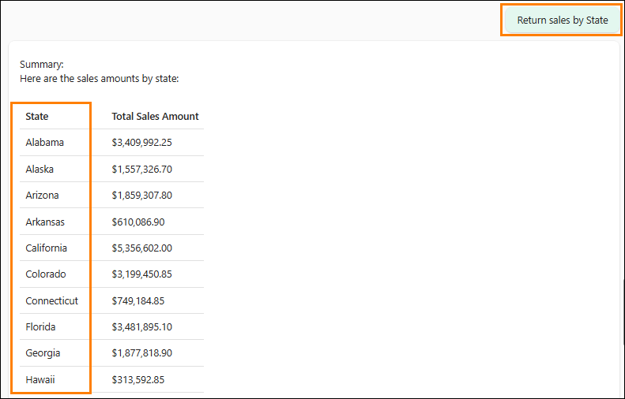

10. Ces résultats correspondent exactement à ce que vous devriez obtenir, mais c’est peut-être trop détaillé ? Nous allons indiquer dans l’invite IA de ne renvoyer que 5 lignes de données à chaque fois, sauf indication contraire.

11. Dans les **instructions pour l’IA** de votre assistant de données, saisissez ce qui suit :

    **Always provide the top 5 results unless a different number is specified**

    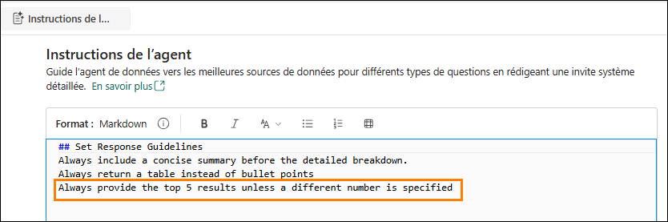

12. Ces résultats sont parfaits ! Notre résumé précise désormais que nous obtenons les 5 États ayant enregistré le plus de ventes. Copilot nous invite également à demander les données de ventes pour tous les États, si c’est ce que nous souhaitons.

    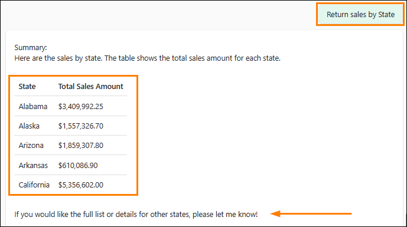

## Coup de projecteur : Remplacer une source de données

Lorsque vous travaillez avec des assistants de données, vous pouvez décider d’utiliser une source de données différente. Dans notre exemple, nous utilisons le modèle sémantique Fabrikam Company Sales Report. Mais que se passerait-il si nous voulions utiliser un autre modèle sémantique ? Il n’existe pas actuellement un moyen qui permette de remplacer simplement une source de données ; en revanche, vous pouvez supprimer et ajouter des sources de données à votre assistant de données à tout moment.

1. Pour supprimer une source de données, accédez à l’explorateur dans votre assistant de données et cliquez sur les points de suspension (**…**) à droite de la source de données. Dans le menu déroulant, vous disposez de trois options. Ouvrir, Actualiser ou Supprimer.

    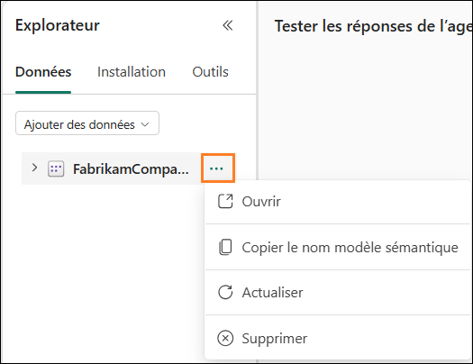

2. Vous n’allez **PAS** remplacer la source de données dans ce labo.

## Tâche 5 : Ajouter des sources de données supplémentaires

Nous avons développé notre assistant de données en nous appuyant sur un modèle sémantique bien défini et soigneusement conçu. Ce modèle sémantique a été pensé pour répondre à la plupart des demandes des utilisateurs, voire à toutes. Cependant, que faire si votre modèle sémantique ne parvient pas à répondre à certaines questions liées aux ventes ? Vous pourriez contacter le créateur de ce modèle sémantique et lui demander d’ajouter des tables et des informations supplémentaires, mais cela peut prendre du temps, ou bien votre demande peut être refusée.

Vous avez un utilisateur qui souhaite analyser les ventes en fonction du délai de livraison des produits. Notre modèle sémantique Fabrikam Company Sales n’inclut pas cette information ; en revanche, celle-ci existe bien dans les données sources originales stockées dans votre lakehouse Fabric.

Dans ce labo, vous allez ajouter une source de données supplémentaire afin que les informations relatives au délai de livraison des produits puissent être incluses dans les réponses de votre assistant de données.

1. Commençons par créer un lakehouse pour y ajouter des données d’exemple. Retournez dans votre espace de travail et sélectionnez à nouveau **Nouvel élément** :

    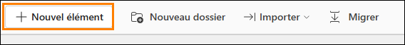

2. Faites défiler vers le bas et sélectionnez **Lakehouse** dans la section Autres éléments que vous pouvez créer avec Microsoft Fabric.

    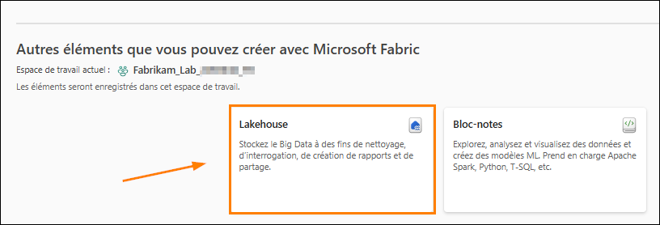

3. Nommez votre nouveau lakehouse : **lh_Fabrikam**, puis appuyez sur **Créer**.

    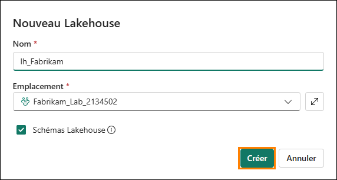

4. Dans notre lakehouse, nous allons utiliser un **raccourci** afin de nous connecter à une version déjà préparée des données Fabrikam. Ouvrez **Obtenir les données** et sélectionnez **Nouveau raccourci**.

    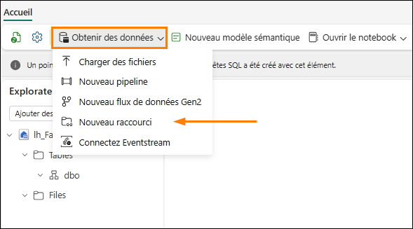

5. Sélectionnez **Azure Data Lake Storage Gen2**.

    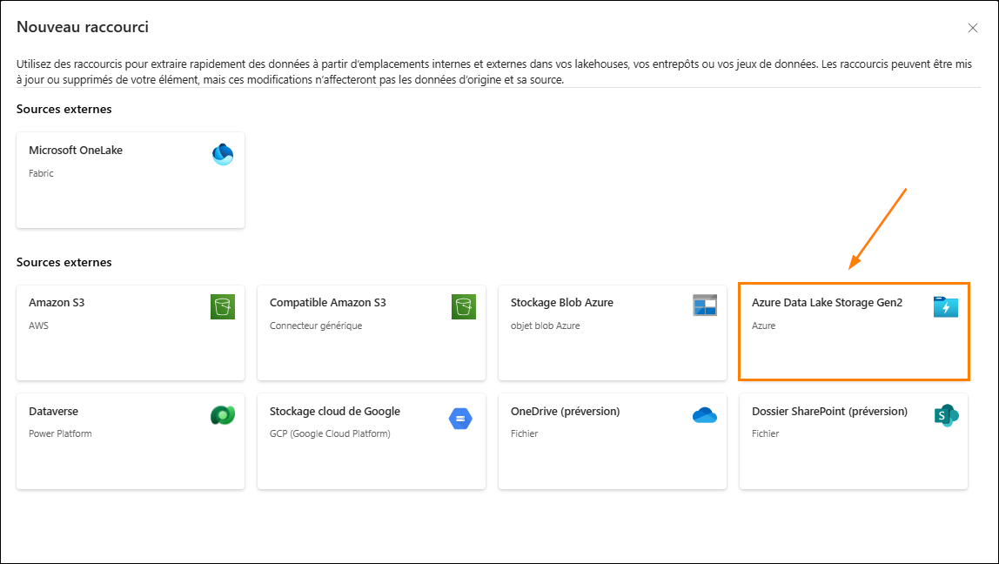

6. Sélectionnez **Nouvelle connexion** et saisissez l’URL Fabrikam :

    ***https://stvnextblobstorage.dfs.core.windows.net/fabrikam-sales***

    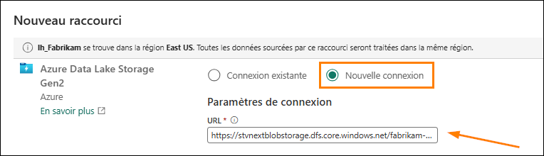

7. Fournissez un nom de connexion, par exemple **Fabrikam Connector ou un nom similaire** et sous Type d’authentification, cliquez sur le menu déroulant et sélectionnez Signature d’accès partagé (SAP).

    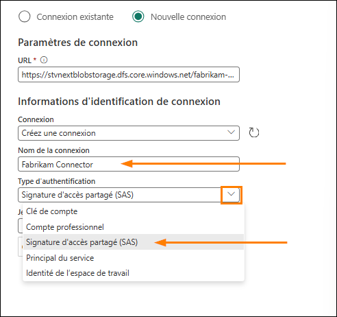

8. Copiez le jeton SAS depuis l’onglet Environnement à droite et collez-le dans la zone **Jeton SAP**.

    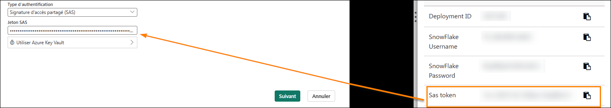

9. Cliquez sur **Suivant**.

    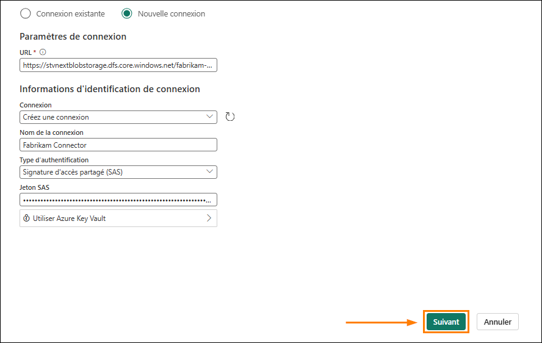

10. Ouvrez **Delta-Parquet-Format-FY25** et sélectionnez tous les éléments, sauf **Sales.Invoices.May**, puis cliquez sur **Suivant**.

    

11. Renommez le **Nom du raccourci** pour chacune des nouvelles tables. Ceci est important pour pouvoir utiliser facilement le lakehouse comme source de données. Suivez le format ci-après :

    Application.Cities en **Cities**

    Application.Countries en **Countries**

    Application.StateProvinces en **StateProvinces**

    DateDim en **Date**

    Sales.BuyingGroups en **BuyingGroups**

    Sales.Customers en **Customers**

    Sales.InvoiceLines en **InvoiceLines**

    Sales.Invoices en **Invoices**

    Warehouse.StockGroups en **StockGroups**

    Warehouse.StockItemStockGroups en **StockItemStockGroups**

    Warehouse.StockItems en **StockItems**

    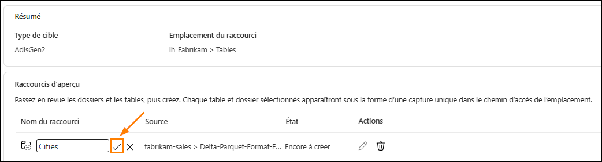

12. Sélectionnez **Créer** pour ajouter les données à votre lakehouse via un raccourci.

    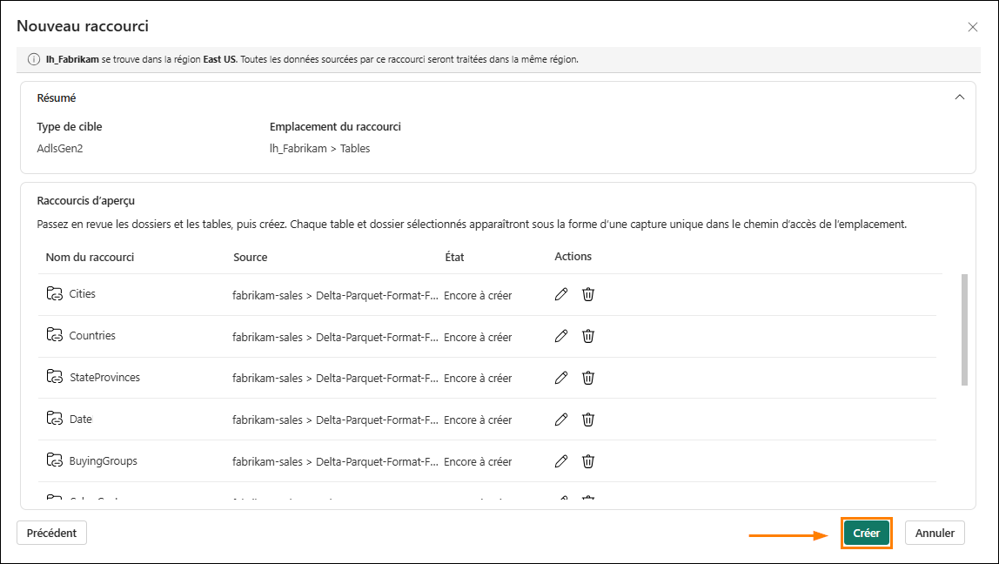

13. Une fois le chargement terminé, vous devriez voir que les objets ont été déplacés vers la zone Table.

    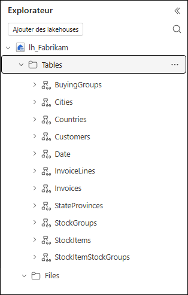

14. Vous pouvez revenir à l’**assistant de données** depuis le menu de gauche ou depuis la vue de l’espace de travail.

    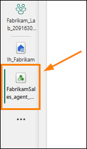

    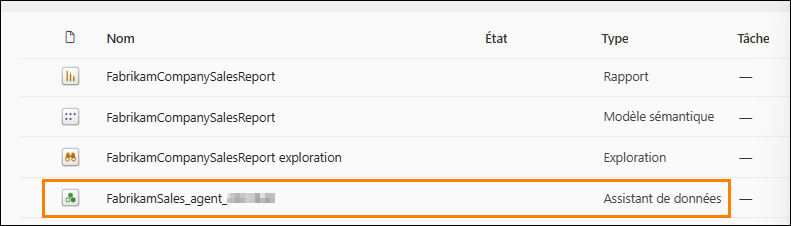

15. Depuis votre assistant de données, cliquez sur le menu déroulant **Ajouter des données** et sélectionnez **Source de données** dans le volet de l’explorateur.

    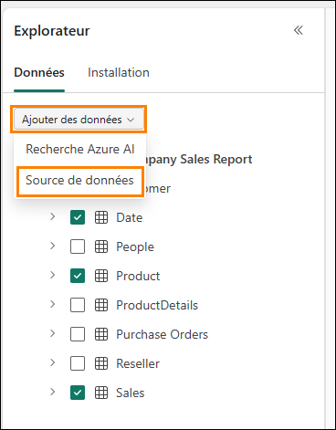

16. Sélectionnez **lh_Fabrikam**, puis cliquez sur **Ajouter**.

    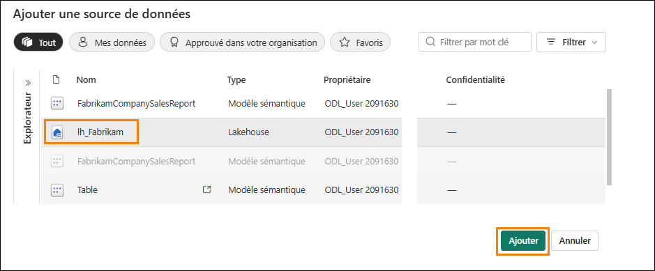
 
17. Vous disposez désormais de deux sources de données dans le volet **Explorateur**.

    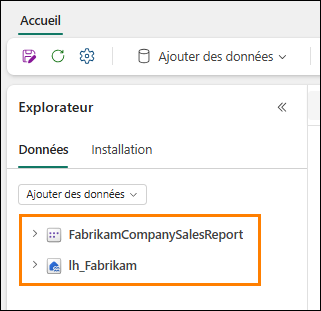

18. Ouvrez le lakehouse et ajoutez toutes les sources de données potentielles depuis lh_Fabrikam. L’affichage de l’ensemble des éléments du lakehouse peut prendre quelques minutes. N’hésitez pas à lui laisser le temps de se charger et à actualiser si nécessaire.

    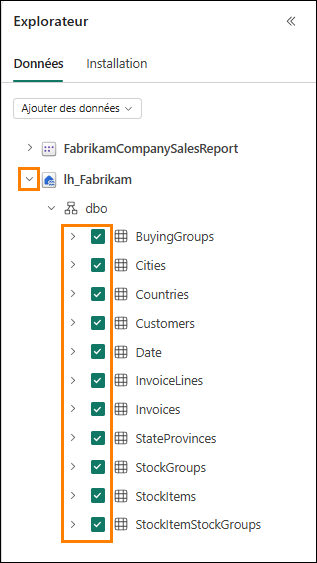

19. Revenez dans l’invite de votre assistant de données, saisissez le texte suivant : **What are total sales by product lead time?**

    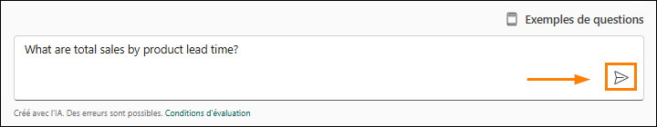

20. Les assistants de données Fabric ont répondu parfaitement à cette demande et ont obtenu les résultats souhaités à partir de notre lakehouse. Vous pouvez toujours désélectionner les données du document Fabrikam Company Sales Report afin de forcer Copilot à utiliser le lakehouse à la place. Cependant, nous allons bientôt utiliser des instructions pour mieux gérer cela.

21. Développez la section des étapes terminées afin d’examiner le SQL généré par les assistants de données pour parvenir à ce résultat.

    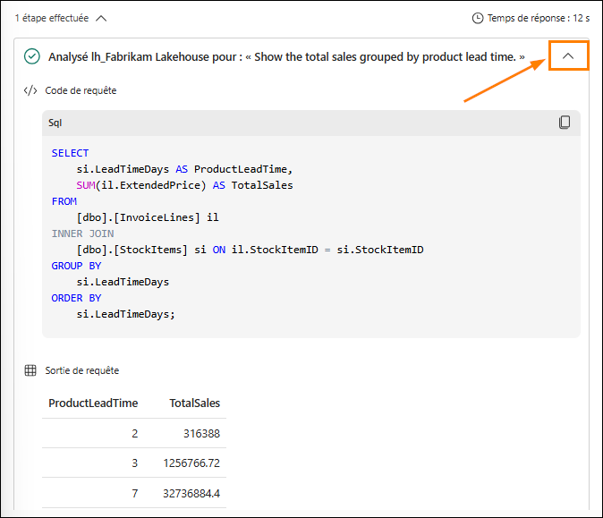

22. N’oubliez pas qu’il est important de valider les résultats de l’assistant de données. Comme les assistants de données exposent le code SQL utilisé, vous pouvez l’examiner et même l’exécuter directement sur le lakehouse afin de vérifier que les résultats sont corrects.

    Il est possible que certaines demandes des utilisateurs adressées à l’assistant de données renvoient des résultats provenant d’une source de données incorrecte. Par exemple, le total des ventes par produit peut être calculé soit à partir de la source de données du lakehouse, soit à partir du modèle sémantique. Afin de garantir que l’assistant de données réponde à la demande en utilisant la source de données souhaitée, vous pouvez ajouter des instructions supplémentaires pour l’IA, afin d’obtenir les résultats attendus.

23. Ouvrez les instructions pour l’IA dans votre assistant de données et, dans la section des instructions pour l’assistant, ajoutez l’instruction suivante :

    **## Data Source Priority**

    **Always use the Fabrikam Company Sales Report to answer questions unless the user explicitly ask about lead time.**

    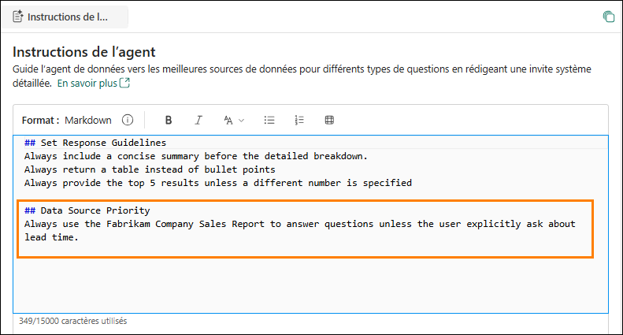

## Coup de projecteur : Instructions pour une source de données

1. Examinons à présent les instructions pour une source de données.

2. Depuis le volet des instructions pour l’IA, sélectionnez les points de suspension à côté de votre lakehouse, puis choisissez **Instructions pour la source de données** et développez le lakehouse. Vous remarquerez que, contrairement aux modèles sémantiques, les instructions pour l’IA sont prises en charge au niveau de la source de données pour les lakehouses.

    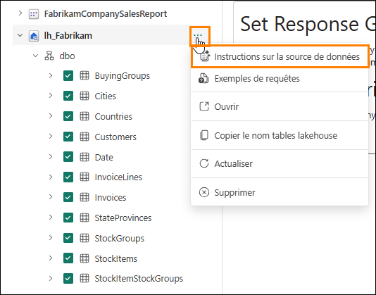

    L’ajout d’instructions pour la source de données à cet endroit peut aider l’IA à mieux comprendre les données de votre lakehouse. Des instructions pour l’IA bien définies aideront celle-ci à comprendre votre contexte métier, votre terminologie et vos priorités analytiques.

    Vous avez déjà tout appris sur les instructions pour l’IA plus tôt dans ce cours, lors de la préparation de votre modèle sémantique pour l’IA. Nous ne reviendrons pas sur l’ensemble de ces informations ici. Sachez simplement que, si vous estimez que l’assistant de données a besoin de clarifications supplémentaires, c’est ici que vous les ajouteriez.

## Tâche 6 : Créer des exemples de questions

L’optimisation d’un assistant de données n’est pas une configuration ponctuelle : c’est un processus continu et itératif qui implique de l’expérimentation, de l’observation et des ajustements. Une partie de ce processus d’ajustement consiste à fournir des requêtes d’exemple qui peuvent aider l’IA à comprendre comment répondre à des questions complexes pouvant nécessiter beaucoup de SQL ou de KQL au niveau de la source de données.

Les assistants de données peuvent exploiter des requêtes d’exemple, également appelées exemples en nombre limité, afin d’améliorer la précision et la pertinence de leurs réponses lors de la conversion de questions en langage naturel vers du SQL ou du KQL (NL2SQL, NL2KQL).

**ℹ️ Important**

La fonctionnalité des requêtes d’exemple n’est actuellement pas prise en charge pour les modèles sémantiques.

Les requêtes d’exemple reposent sur un processus en deux étapes.

1) Tout d’abord, vous fournissez une question d’exemple ; l’IA fera correspondre les questions sémantiquement similaires à celle que vous avez fournie.

2) Ensuite, vous fournissez une requête d’exemple. Cette requête prend en charge les jointures complexes, les prédicats complexes et d’autres scénarios avancés afin d’aider l’assistant lors de la construction de sa réponse.

    Un labo sur des exemples de questions **dépasse le cadre de cette classe**. Toutefois, si vous souhaitiez créer une requête d’exemple, vous pourriez le faire en suivant les étapes ci-après :

3) Sélectionnez les points de suspension à côté du lakehouse, puis choisissez **Exemples de requêtes** afin d’ouvrir le volet correspondant.

    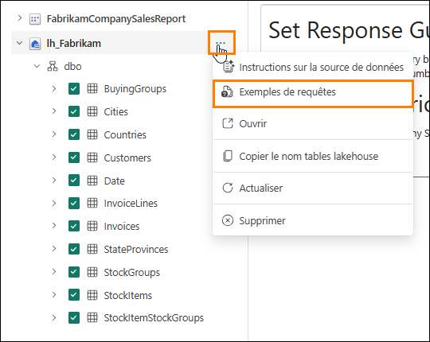

4) Dans le volet Requêtes d’exemple, cliquez sur **Ajouter un exemple**.

    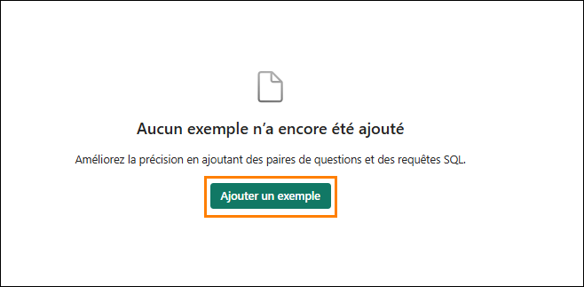

5) Ajoutez un exemple de question, puis appuyez sur Entrée. Exemple : **Show sales by country that the product was manufactured in.**

    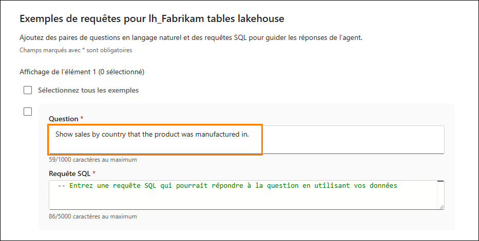

6) Dans la boîte de dialogue de la requête SQL, saisissez le SQL que l’assistant doit utiliser pour répondre à ce type de question. Une fois que vous avez terminé, cliquez sur le (X) dans le coin supérieur droit, puis testez votre assistant.

    **ℹ️ Important**

    Le code n’est pas fourni dans ce labo, car cela dépasse le cadre de cette classe. Toutefois, vous pouvez tout à fait générer votre propre code et l’explorer si le temps vous le permet.

    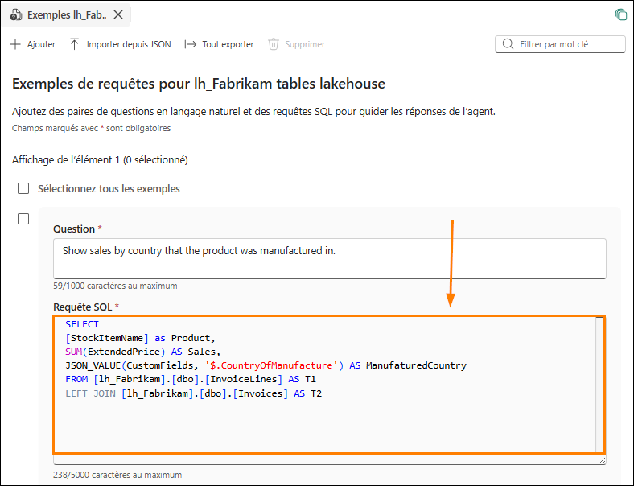

    **Conseil de pro** : chacune de ces questions cible des scénarios analytiques différents : analyse géographique, agrégations filtrées, calculs de chiffre d’affaires et analyse temporelle hiérarchique. Expérimentez avec différentes variantes afin d’observer comment l’assistant de données s’adapte à différents styles de questions.

    **Allez plus loin dans l’expérimentation** : essayez de poser à l’assistant des questions plus complexes, puis de créer des paires question / SQL afin d’aider l’assistant de données à répondre aux demandes des utilisateurs.

## Tâche 7 : Publier et partager votre assistant de données

1. Il est maintenant temps de publier votre assistant de données. Cliquez sur le bouton **Publier** dans le menu Accueil.

    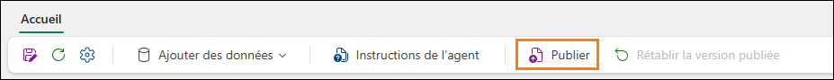

2. Ensuite, fournissez une description de votre assistant. Mentionnez notamment son objectif et ses capacités. Cliquez sur **Publier**.

    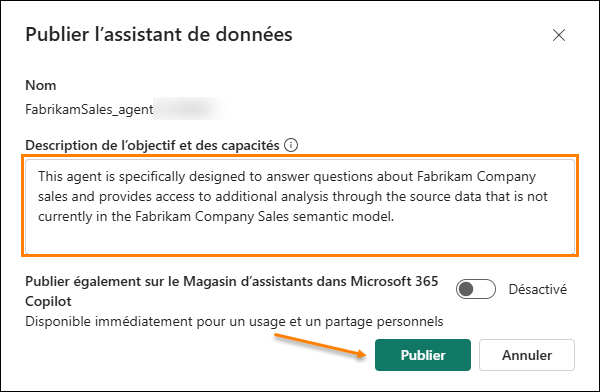

3. Après avoir publié votre assistant, vous devez le partager. Cliquez sur **Partager** dans le coin supérieur droit de votre écran.

    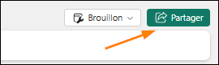

4. Dans la fenêtre **Créer et envoyer un lien** qui s’ouvre, cliquez sur le bouton **Utilisateurs de votre organisation peuvent afficher**.

    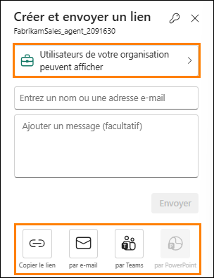

5. Sélectionnez vos paramètres d’autorisation ici, puis cliquez sur **Appliquer**.

    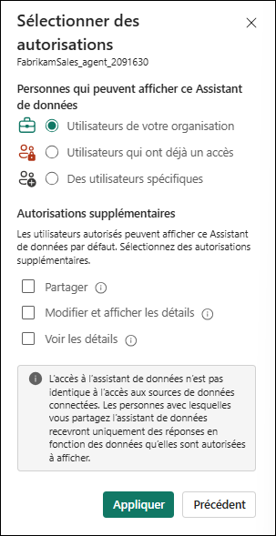

    **ℹ️ Important**

    L’accès à l’assistant de données n’est pas équivalent à l’accès aux sources de données connectées. Les utilisateurs avec qui vous partagez l’assistant de données obtiendront des réponses qui s’appuieront uniquement sur les données auxquelles ils sont autorisés à accéder.

6. L’assistant de données Fabric publié peut être utilisé sur différentes plateformes, notamment :

    - Microsoft Fabric

    - Copilot Studio

    - Microsoft Teams

    - Notebooks

    - Power BI Copilot

    - Azure AI Foundry

    - Applications personnalisées via une API

7. Dans votre espace de travail, passez votre souris sur votre assistant de données afin d’afficher les points de suspension **(...)**.

    

8. Cliquez sur les points de suspension et sélectionnez **Gérer les autorisations**.

    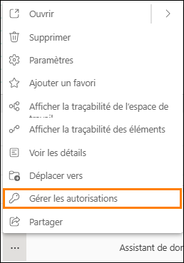

9. Vous pouvez également partager l’assistant depuis cet emplacement ou gérer les utilisateurs disposant d’un accès direct à l’assistant via leur accès à l’espace de travail. Vous pouvez choisir soit **+ Ajouter un lien** dans le menu Liens, soit **+ Ajouter un utilisateur** dans le menu Accès direct. L’ajout d’utilisateurs à l’espace de travail leur donnera accès à l’assistant.

    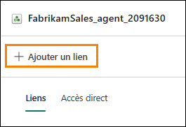

    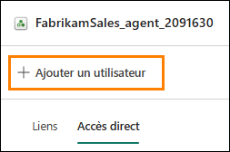

## Tâche 8 : Utilisation d’un assistant de données depuis Copilot

1. Bien que l’assistant puisse être utilisé de différentes manières (voir l’étape 6 ci-dessus), essayons de tirer parti de notre assistant de données via l’expérience Copilot autonome. Dans votre espace de travail, cliquez sur Copilot. (Remarque : vous devrez peut-être cliquer sur les points de suspension dans la barre latérale pour afficher le bouton Copilot.)

    (Rappel : assurez-vous de bien pointer vers votre assistant de données dans l’exemple.)

    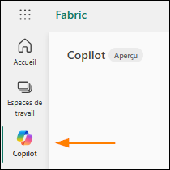

2. Sélectionnez le signe plus : notez que votre assistant est proposé comme une option que Copilot peut utiliser. Cela met en évidence la différence entre l’expérience Copilot autonome et celle de l’assistant de données.

    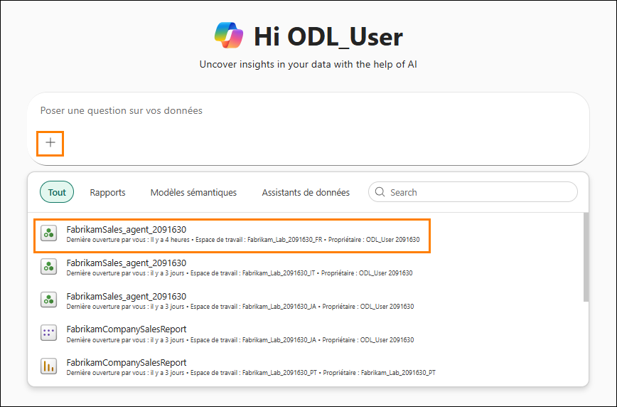

3. Dans votre espace de travail, passez votre souris sur votre assistant de données et cliquez à nouveau sur les points de suspension (...).

    

4. Sélectionnez **Paramètres** dans le menu.

    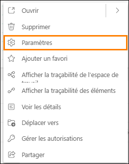

5. Choisissez **Approbation** dans la nouvelle fenêtre.

    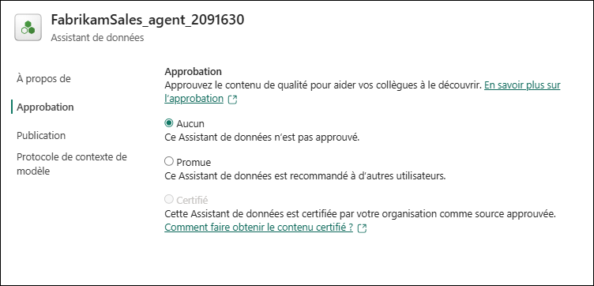

6. Dans le contexte de **Copilot**, en particulier lorsque l’on travaille avec des **assistants de données** dans Power BI ou dans Microsoft Fabric, le fait d’**approuver un assistant de données** signifie lui accorder une validation ou une certification formelle au sein de l’environnement d’une organisation. Cela consiste généralement à rendre l’assistant facilement repérable et digne de confiance pour les utilisateurs, en le marquant comme promu ou certifié.

# Références

Chat With Your Data in a Day (CDIAD) vous présente certaines des fonctionnalités clés lors de l’utilisation de Copilot autonome dans un espace de travail Fabric.

Dans le menu du service, la section Aide (?) comporte des liens vers d’excellentes ressources. Gardez à l’esprit que la vue que vous voyez dépend de l’expérience dans laquelle vous vous trouvez actuellement et que vos options peuvent donc différer de celles présentées dans la capture d’écran ci-dessous.

Voici quelques autres ressources qui vous aideront lors de vos prochaines étapes avec Microsoft Fabric :

- Accédez à toutes les informations dans la [Documentation Microsoft Fabric de base](https://learn.microsoft.com/en-us/fabric/)

- Explorez Fabric grâce à la [visite guidée](https://aka.ms/Fabric-GuidedTour)

- Inscrivez-vous pour bénéficier d’un [essai gratuit de Microsoft Fabric](https://aka.ms/try-fabric)

- Rendez-vous sur le [site web Microsoft Fabric](https://aka.ms/microsoft-fabric)

- Acquérez de nouvelles compétences en explorant les [modules d’apprentissage Fabric](https://aka.ms/learn-fabric)

- Lisez l’[e-book gratuit sur la prise en main de Fabric](https://aka.ms/fabric-get-started-ebook)

- Rejoignez la [communauté Fabric](https://aka.ms/fabric-community) pour publier vos questions, partager vos commentaires et apprendre des autres utilisateurs

Lisez la documentation technique détaillée relative à Copilot :

- [Vue d’ensemble de Copilot pour Power BI - Power BI | Microsoft Learn](https://learn.microsoft.com/en-us/power-bi/create-reports/copilot-introduction)

- [Expérience Copilot autonome dans Power BI (version préliminaire) – Power BI | Microsoft Learn](https://learn.microsoft.com/en-us/power-bi/create-reports/copilot-chat-with-data-standalone)

- [Microsoft FabricParamètres administrateur de Copilot | Microsoft Learn](https://learn.microsoft.com/en-us/fabric/admin/service-admin-portal-copilot)

- [Création d’un assistant de données Fabric (version préliminaire) : découvrez comment créer un assistant de données Fabric | Microsoft Learn](https://learn.microsoft.com/en-us/fabric/data-science/concept-data-agent)

- [Bonnes pratiques relatives à la configuration de votre assistant de données - Microsoft Fabric | Microsoft Learn](https://learn.microsoft.com/en-us/fabric/data-science/data-agent-configuration-best-practices)

- [Copilot pour Microsoft Fabric et Power BI : FAQ - Microsoft Fabric | Microsoft Learn](https://learn.microsoft.com/en-us/fabric/fundamentals/copilot-faq-fabric)

© 2026 Microsoft Corporation. Tous droits réservés.

En effectuant cette démonstration/ce labo, vous acceptez les conditions suivantes :

La technologie/fonctionnalité décrite dans cette démonstration/ce labo est fournie par Microsoft Corporation en vue d’obtenir vos commentaires et de vous fournir une expérience d’apprentissage. Vous pouvez utiliser cette démonstration/ce labo uniquement pour évaluer ces technologies et fonctionnalités, et pour fournir des commentaires à Microsoft. Vous ne pouvez pas l’utiliser à d’autres fins. Vous ne pouvez pas modifier, copier, distribuer, transmettre, afficher, effectuer, reproduire, publier, accorder une licence, créer des œuvres dérivées, transférer ou vendre tout ou une partie de cette démonstration/ce labo.

LA COPIE OU LA REPRODUCTION DE CETTE DÉMONSTRATION/CE LABO (OU DE TOUTE PARTIE DE CEUX-CI) SUR TOUT AUTRE SERVEUR OU AUTRE EMPLACEMENT EN VUE D’UNE AUTRE REPRODUCTION OU REDISTRIBUTION EST EXPRESSÉMENT INTERDITE.

CETTE DÉMONSTRATION/CE LABO FOURNIT CERTAINES FONCTIONNALITÉS DE PRODUIT/TECHNOLOGIES LOGICIELLES, NOTAMMENT D’ÉVENTUELS NOUVEAUX CONCEPTS ET FONCTIONNALITÉS, DANS UN ENVIRONNEMENT SIMULÉ SANS CONFIGURATION NI INSTALLATION COMPLEXES AUX FINS DÉCRITES CI-DESSUS. LES TECHNOLOGIES/CONCEPTS REPRÉSENTÉS DANS CETTE DÉMONSTRATION/CE LABO PEUVENT NE PAS REPRÉSENTER LES FONCTIONNALITÉS COMPLÈTES ET PEUVENT NE PAS FONCTIONNER DE LA MÊME MANIÈRE QUE DANS UNE VERSION FINALE. IL EST ÉGALEMENT POSSIBLE QUE NOUS NE PUBLIIONS PAS DE VERSION FINALE DE CES FONCTIONNALITÉS OU CONCEPTS. VOTRE EXPÉRIENCE D’UTILISATION DE CES FONCTIONNALITÉS DANS UN ENVIRONNEMENT PHYSIQUE PEUT ÉGALEMENT ÊTRE DIFFÉRENTE.

**COMMENTAIRES.** Si vous envoyez des commentaires sur les fonctionnalités, technologies et/ou concepts décrit(e)s dans ces labos/cette démonstration à Microsoft, vous accordez à Microsoft, sans frais, le droit d’utiliser, de partager et de commercialiser vos commentaires de quelque manière et à quelque fin que ce soit. Vous accordez également à des tiers, sans frais, les droits de brevet nécessaires pour leurs produits, technologies et services en vue de l’utilisation ou de l’interface avec des parties spécifiques d’un logiciel ou d’un service Microsoft incluant les commentaires. Vous n’enverrez pas de commentaires soumis à une licence exigeant que Microsoft accorde une licence pour son logiciel ou sa documentation à des tiers du fait que nous y incluons vos commentaires. Ces droits survivent à ce contrat.

MICROSOFT CORPORATION DÉCLINE TOUTES LES GARANTIES ET CONDITIONS EN CE QUI CONCERNE CETTE DÉMONSTRATION/CE LABO, Y COMPRIS TOUTES LES GARANTIES ET CONDITIONS DE QUALITÉ MARCHANDE, QU’ELLES SOIENT EXPLICITES, IMPLICITES OU LÉGALES, D’ADÉQUATION À UN USAGE PARTICULIER, DE TITRE ET D’ABSENCE DE CONTREFAÇON. MICROSOFT N’OFFRE AUCUNE GARANTIE OU REPRÉSENTATION EN CE QUI CONCERNE LA PRÉCISION DES RÉSULTATS, LA CONSÉQUENCE QUI DÉCOULE DE L’UTILISATION DE CETTE DÉMONSTRATION/CE LABO, OU L’ADÉQUATION DES INFORMATIONS CONTENUES DANS CETTE DÉMONSTRATION/CE LABO À QUELQUE FIN QUE CE SOIT. **CLAUSE D’EXCLUSION DE RESPONSABILITÉ**

Cette démonstration/Ce labo comporte seulement une partie des nouvelles fonctionnalités et améliorations disponibles dans Microsoft Power BI. Certaines fonctionnalités sont susceptibles de changer dans les versions ultérieures du produit. Dans ce labo/cette démonstration, vous allez découvrir comment utiliser certaines nouvelles fonctionnalités, mais pas toutes.
