# Microsoft Fabric Chat with your Data in a Day - Übung 1

## Inhalt

- Dokumentstruktur
- Anwendungsfall/Problemstellung
- Einführung
  - Aufgabe 1: Arbeiten in der virtuellen Umgebung
  - Aufgabe 2: Die Bereitschaft Ihrer Daten für KI erfassen
  - Aufgabe 3: Einen Prompt in Power BI Copilot schreiben

# Dokumentstruktur

Die Übung enthält die Schritte, die Benutzer durchführen müssen, sowie zugehörige Screenshots zur visuellen Unterstützung. Wichtige Abschnitte sind in den Screenshots mit einem orangefarbenen Kasten gekennzeichnet.

# Anwendungsfall/Problemstellung

Ihre Organisation ist gerade von einer Microsoft-Konferenz zurückgekehrt, auf der vorgestellt wurde, wie man mit „Chat with your Data“, unterstützt von Copilot, deutlich schneller Erkenntnisse gewinnt. In Demos wurde gezeigt, wie Abfragen in natürlicher Sprache leistungsstarke Analysen ermöglichen können, vorausgesetzt, die zugrunde liegenden semantischen Modelle sind gut strukturiert und für KI optimiert.

**Aktuelle Zielsetzung**

Sie wurden gebeten, ein vorhandenes semantisches Modell in Power BI Desktop zu bewerten. Sie sollen testen, wie gut es in der Copilot-Umgebung funktioniert, und Bereiche mit Verbesserungspotenzial ermitteln.

Untersuchen Sie das semantische Modell mithilfe der in PBI Desktop integrierten Copilot-Benutzeroberfläche.

Finden Sie Reibungspunkte, wo Copilot Schwierigkeiten mit der Interpretation der Absicht hat.

Geben Sie Empfehlungen zur Verbesserung ab, und implementieren Sie diese, um das Verstehen von Copilot zu verbessern.

Dokumentieren Sie Ihre Ergebnisse und bereiten Sie das Modell für eine breitere Verwendung innerhalb der Organisation vor.

# Einführung

In der Kursleiterdemo haben Sie gesehen, wie gut „Chat with your Data“ funktionieren kann. In dieser Übung erfahren Sie, wie wichtig es ist, Datenmodelle für KI vorzubereiten. In der Übung werden verschiedene Benutzeranfragen und die jeweilige Antwort von Copilot darauf behandelt. Außerdem wird Ihnen gezeigt, wie Sie diese Antworten auf Genauigkeit und Richtigkeit prüfen können. In zukünftigen Übungen lernen Sie, wie Sie bewährte Methoden anwenden und Werkzeuge zur Vorbereitung Ihrer Daten einsetzen, um die Copilot-Erfahrung weiter zu verbessern!

## Aufgabe 1: Arbeiten in der virtuellen Umgebung

1. Die virtuelle Umgebung bietet Ihnen einen tollen Raum für die Arbeit mit „Chat with Your Data“! Schauen wir uns einige wichtige Bereiche und Punkte an.

    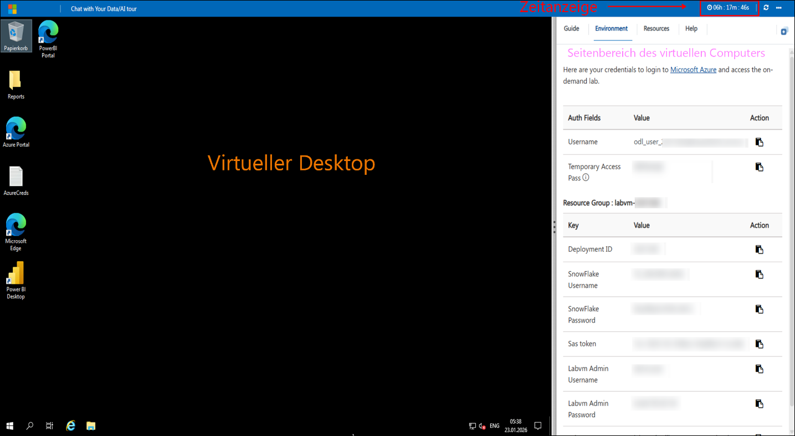

2. Schauen wir uns zunächst ein paar wichtige Bereiche an:

    - Der virtuelle Desktop funktioniert wie ein voll funktionsfähiger Computer, der im Browser genutzt wird.

    - Über den Seitenbereich des virtuellen Computers können Sie auf die Übungsdokumente, Anmeldeinformationen und mehr zugreifen.

    - Die Zeitanzeige zeigt an, wie viel Zeit Sie noch für die Nutzung des virtuellen Computers haben.

    **ℹ️ Wichtig**
    
    Die Kästen mit dem Titel **Wichtig** enthalten wertvolle Informationen in den Übungen des Kurses. Überspringen Sie sie nicht! Wenn Sie beispielsweise den Seitenbereich Ihres virtuellen Computers nicht sehen, müssen Sie ihn vollständig erweitern, wie in der Abbildung unten gezeigt.
    
    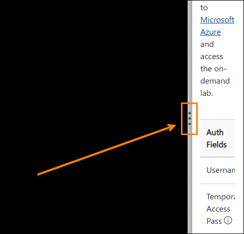

3. Über die Seitenzahl am unteren Rand des Seitenbereichs können Sie ganz einfach durch die Übungen navigieren.

    

4. Während des Kurses können Sie vollständig innerhalb des virtuellen Computers arbeiten. Manche Teilnehmer ziehen es jedoch vor, mit einem Inkognito-Browser zu arbeiten und sich dort mit den ihnen zur Verfügung stehenden Anmeldeinformationen für den virtuellen Computer bei Power BI Desktop anzumelden. Das ist völlig in Ordnung!

## Aufgabe 2: Die Bereitschaft Ihrer Daten für KI erfassen

1. Nachdem Sie nun die Hauptbereiche des virtuellen Computers kennengelernt haben, wählen Sie die Schaltfläche für das Power BI-Portal, um den Power BI-Dienst zu starten.

    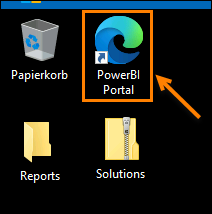

2. Geben Sie im Zugriffsbereich die E-Mail-Adresse ein. Verwenden Sie dafür die auf der Seite „Anmeldeinformationen“ und in Ihrem Dokument angegebenen Anmeldeinformationen.

    - **Benutzername/E-Mail:** **<inject key="AzureAdUserEmail"></inject>** 

        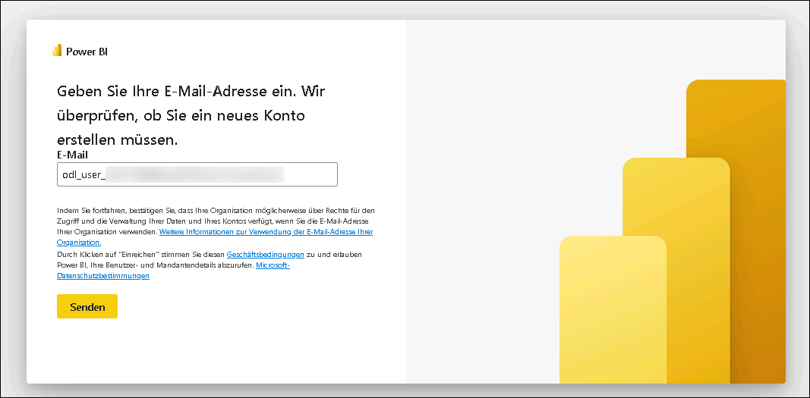

3. Geben Sie dann im Microsoft-Fenster **Anmelden** dieselben Anmeldeinformationen ein, und klicken Sie auf **Weiter**.

    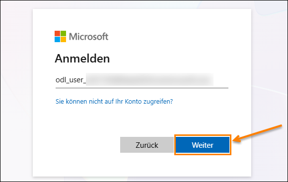

4. Geben Sie den auf der Seite „Anmeldeinformationen“ und in Ihrem Dokument bereitgestellten **befristeten Zugriffspass** ein, und klicken Sie auf **Anmelden**. Wählen Sie optional „Ja“ aus, um angemeldet zu bleiben.

    - **Passwort:** **<inject key="AzureAdUserPassword"></inject>**

        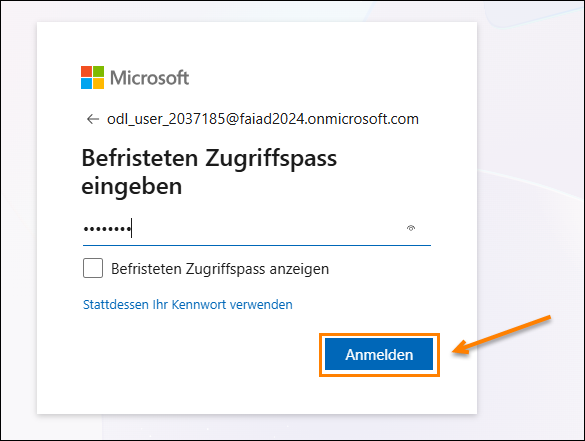

5. Als Erstes gehen wir im Menü auf der linken Seite zu **Arbeitsbereiche**.

    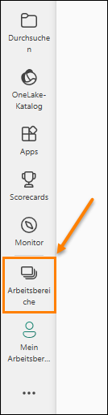

6. Wir erstellen nun einen **neuen Arbeitsbereich**. Dazu wählen wir die Schaltfläche „Neuer Arbeitsbereich“ aus.

    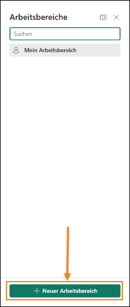

7. Geben als Nächstes Sie Ihrem Arbeitsbereich den Namen **Fabrikam_Lab_<inject key="DeploymentID" enableCopy="false"></inject>**

    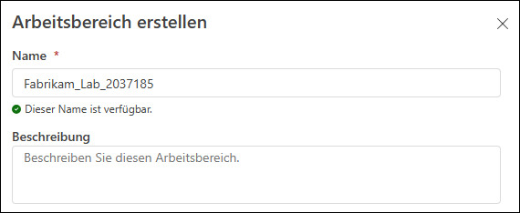

8. Ihr 7-stelliger Code ist Teil des Benutzernamens, der Ihnen für den Kurs zugewiesen wurde. Verwenden Sie diesen! Siehe nachfolgenden Screenshot.

    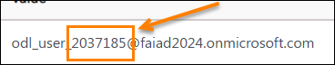

9. John A. Smith wäre beispielsweise: **Fabrikam_Lab_<inject key="DeploymentID" enableCopy="false"></inject>**

    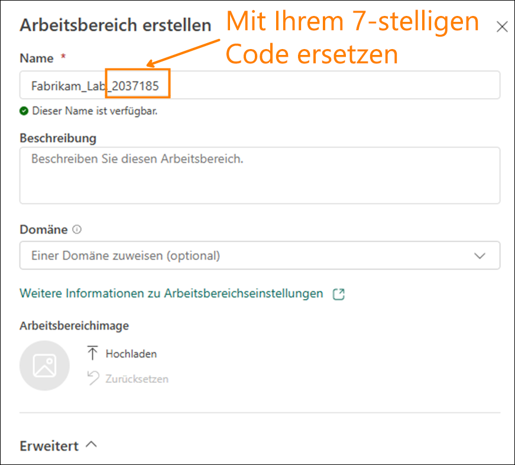

10. Als Nächstes müssen Sie Ihrem Arbeitsbereich eine Fabric-Kapazität zuweisen.

11. Klicken Sie während der Einrichtung des Arbeitsbereiches auf **Erweitert**, um die erweiterten Optionen aufzuklappen.

    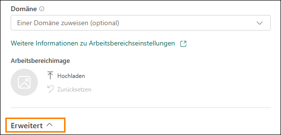

    **ℹ️ Wichtig**

    Die für diesen Kurs verwendete Fabric-Umgebung wird häufig aktualisiert, sodass Sie MÖGLICHERWEISE NICHT über dieselben Kapazitäten verfügen, die im folgenden Screenshot aufgeführt sind. Wählen Sie einfach eine beliebige zur Verfügung stehende Kapazität aus.

    Stellen Sie sicher, dass **Fabric-Kapazität** ausgewählt ist. Scrollen Sie etwas weiter nach unten, und wählen Sie eine Kapazität **nach dem Zufallsprinzip** aus dem Dropdown-Menü aus.

    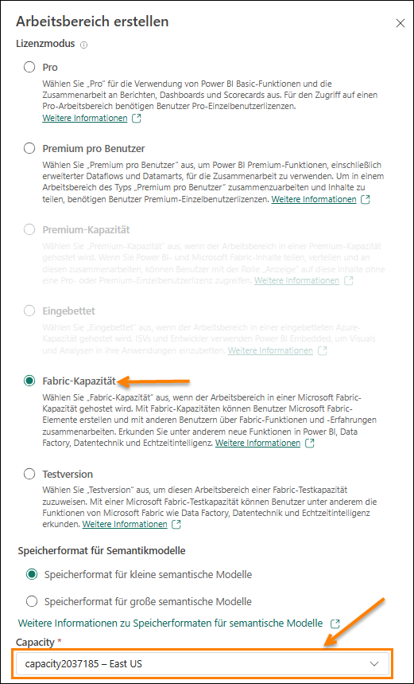

12. Klicken Sie auf **Übernehmen**.

    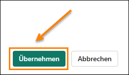

    Sehr gut! Wir werden den Arbeitsbereich der Fabric-Kapazität nutzen, um die besten Funktionen zu entdecken, die „Chat with Your Data“ zu bieten hat!

13. Öffnen Sie die Datei mit dem Namen **CWYDIAD – Lab 01 – Start** aus Ihren Kursdateien, um mit dem Erkunden der Umgebung „Chat with your Data“ zu beginnen.

    

14. Geben Sie Ihre E-Mail-Adresse **<inject key="AzureAdUserEmail"></inject>** in die Power BI Desktop-Datei ein, und klicken Sie auf „Weiter“, um sich mit Ihren Anmeldeinformationen anzumelden:

    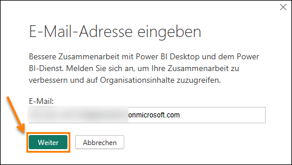

15. Melden Sie sich außerdem über das Microsoft-Anmeldefenster mit demselben Benutzernamen <inject key="AzureAdUserEmail"></inject> und demselben befristeten Zugriffspass an <inject key="AzureAdUserPassword"></inject>.

    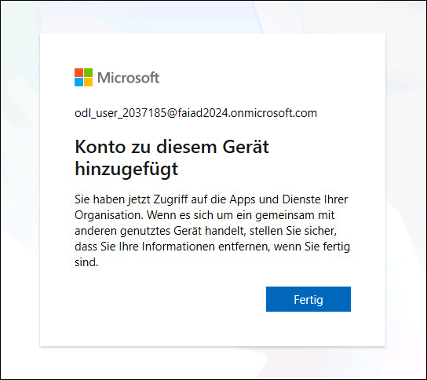

16. Wählen Sie in der geöffneten PBIX-Datei die Copilot-Schaltfläche aus, um die Copilot-Umgebung zu öffnen.

    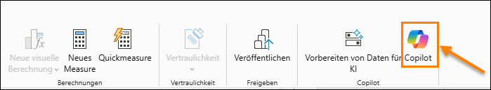

17. Wenn Sie bereits angemeldet sind, öffnet sich ein neues Fenster: **Wählen Sie einen Arbeitsbereich aus, um Copilot zu verwenden.** Klicken Sie auf die Option **Arbeitsbereich auswählen**, und wählen Sie den gerade erstellten Arbeitsbereich aus.

    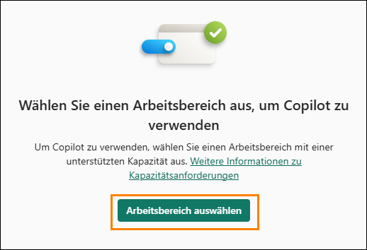

    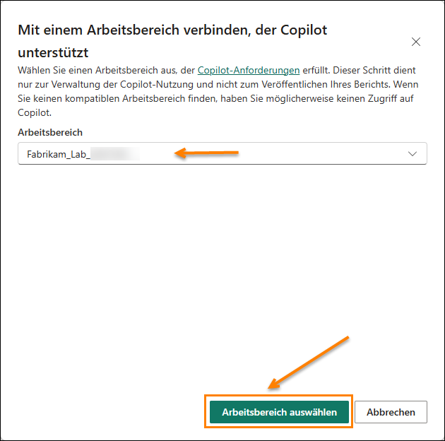

18. Wenn Sie auf dem nächsten Bildschirm eine Aufforderung erhalten, klicken Sie auf **Get started**.

    

19. Willkommen in der Copilot-Umgebung in Power BI! Auf dem Startbildschirm werden Ihnen zunächst einige Prompt-Vorschläge gemacht **(1)**, und weiter unten können Sie Ihre Anfrage schreiben **(2).**

    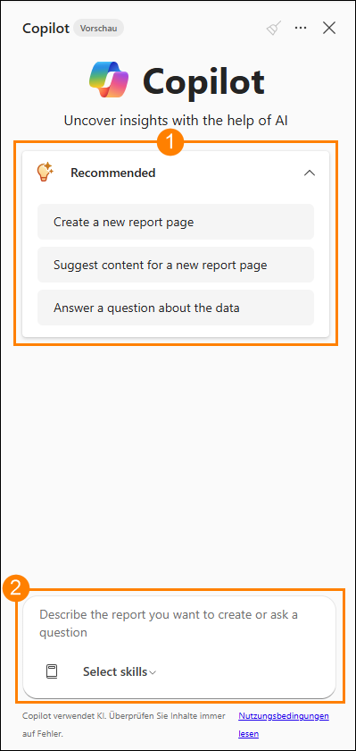

## Aufgabe 3: Einen Prompt in Power BI Copilot schreiben

In diesem Abschnitt werden Sie verschiedene Prompts schreiben und die von der Copilot-Umgebung in Power BI zurückgegebenen Ergebnisse untersuchen.

1. Klicken Sie in den Prompt, und schreiben Sie Folgendes: **Show total purchases by employee**. Klicken Sie dann auf die **Eingabetaste**.

    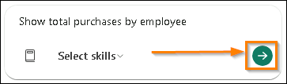

    **Mögliche Ergebnisse:**

    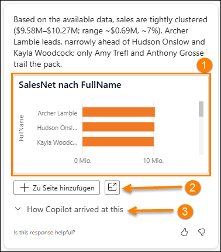

    **ℹ️ Wichtig**

    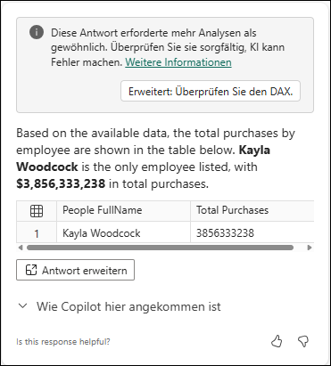

    Die KI liefert nicht deterministische Ergebnisse. Das liegt an vielen Faktoren. Wie bereits in diesem Kurs erläutert, können Ihre Ergebnisse variieren und nicht mit den Ergebnissen der Übungen übereinstimmen. Diese nicht für KI vorbereiteten Daten liefern unterschiedliche Ergebnisse zu genau derselben Frage. Fahren Sie fort, und erkunden Sie die angezeigten Funktionen und Merkmale, so gut Sie können!

    Es kann auch sein, dass Ihnen Folgefragen gestellt werden, wie z. B. eine der unten aufgeführten Fragen:

    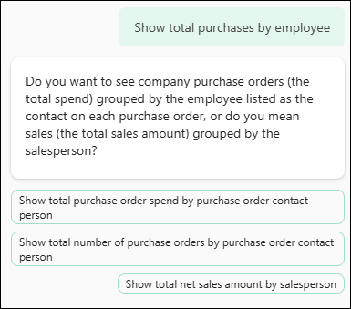

    Wählen Sie die wahrscheinlichste aus, z. B. **Show total purchases by employee**, oder **geben Sie weitere Prompts ein.**

2. Es werden nun viele Informationen zurückgegeben. Schauen wir uns diese näher an:

    1. **(1)** eine Visualisierung der Gesamteinkäufe und Mitarbeiter

    2. **(2)** Bereiche **Zur Seite hinzufügen** zum Hinzufügen einer Seite zum Visual und zum **Aufklappen und** **Erweitern** des Visuals.

    3. **(3)** *How Copilot arrived at this*

        

3. Klicken Sie auf die Schaltfläche **Wie Copilot zu dieser Antwort gelangt ist**, um die Logik hinter der Copilot-Antwort anzuzeigen.

    **Mögliche Ergebnisse:**

    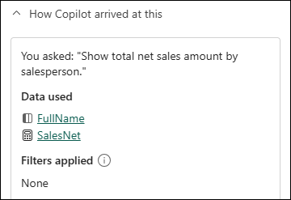

    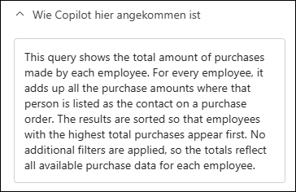

4. Bewegen Sie den Mauszeiger über ***FullName***,** *Sales*** und ***IsSalesperson***, um sowohl das **Feld** als auch die **Start-Tabelle** anzuzeigen, die Copilot bei der Beantwortung der Frage verwendet hat.

    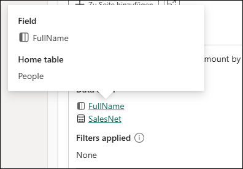

    Leider ist das ein falsches Ergebnis. Wir haben nach den „Total Purchases“ gefragt und stattdessen **Total**** Sales** erhalten. Die andere DAX-Abfrage betrachtete nur einen Mitarbeiter. Sieht so aus, als müssten diese Daten vorbereitet werden. Sie müssen sich das so vorstellen: Daten, die nicht für Copilot vorbereitet wurden, sind wie ein brandneuer Datenanalyst an seinem ersten Arbeitstag. Daten, die für Copilot vorbereitet wurden, sind hingegen so, als würden Sie einem erfahrenen Analysten mit langjähriger Erfahrung in IHRER Organisation mit ihren Besonderheiten eine Frage stellen.

    Bei der Vorbereitung von Daten für Copilot sind zwei wichtige Dinge zu beachten.

    Erstens können wir einen besseren Prompt schreiben, der spezifischer ist. Das hilft auf jeden Fall. Viele Benutzer wissen jedoch nicht, wie man effektive Prompts schreibt. Möglicherweise kennen sie auch die Daten nicht gut genug, um spezifische Fragen zu stellen.

    Zweitens können wir als Datenanalysten die Daten für Copilot vorbereiten und die Art von Anfragen antizipieren, wodurch die Copilot-Antworten genauer werden. Das Ziel dieses Kurses ist es, Ihnen alle bewährten Methoden und verfügbaren Tools zur Verbesserung der Umgebung „Chat with your Data“ zu vermitteln.

    **ℹ️ Wichtig**

    Die Antworten von Copilot hängen davon ab, wie Sie Ihre Fragen stellen. Klare, spezifische Prompts führen zu genaueren Erkenntnissen und schnelleren Lösungen. Versuchen Sie bei der Arbeit mit Ihren Daten den Kontext, die gewünschten Ergebnisse und alle relevanten Filter oder Spalten einzubeziehen. Je besser Ihr Prompt, desto besser die Antworten, die Sie erhalten!

5. Versuchen wir es erneut, diesmal jedoch mit einem spezifischeren Prompt. Geben Sie folgenden Prompt in Copilot ein: **Show total purchases from the PO table by employee.**

    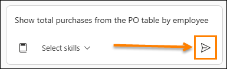

6. Sie werden feststellen, dass das erstellte Visual nur eine Mitarbeiterin mit dem Namen „Kayla Woodcock“ enthält. Das ist korrekt. Kayla ist die einzige Mitarbeiterin, die Einkäufe tätigt. Wenn wir spezifischer sind, können wir also bessere Antworten erzielen. Wenn wir unser semantisches Modell außerdem von Anfang an mit einem Measure namens „Total Purchases“ vorbereitet hätten, hätten wir dieses Szenario vermeiden können.

    **Mögliche Ergebnisse:**

    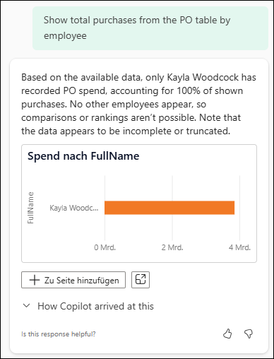

    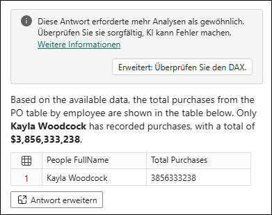

7. Es ist sehr wichtig, stets die Ergebnisse und die Art und Weise zu überprüfen, wie Copilot zu seiner Antwort gelangt ist. Klicken Sie auf **How Copilot arrived at this**.

    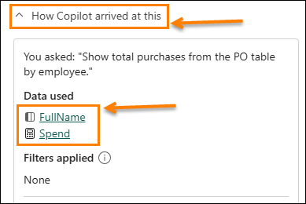

    Wenn Copilot eine DAX-Abfrage bereitstellt, klicken Sie auf **Überprüfen Sie den Dax**.

    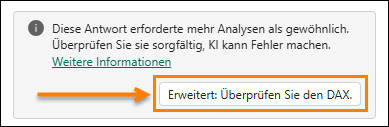

8. Wir sehen, dass Copilot die Spalte „FullName“ aus unserer Tabelle „People“ sowie das Measure „Spend“ verwendet. Sogar unsere DAX-Abfrage tut das. Das Measure „Spend“ könnte wahrscheinlich noch besser benannt werden, um das Copilot-Ergebnis zu verbessern.

    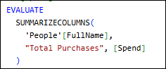

9. Was bedeutet „Spend“ in diesem Zusammenhang? Ist es dasselbe wie „Purchases“? Copilot gibt möglicherweise immer noch die falsche Antwort an. Fragen wir Copilot, wie „Spend“ berechnet wird!

10. Geben Sie folgenden Prompt in Copilot ein: **How is the measure Spend calculated**

    **Mögliche Ergebnisse:**

    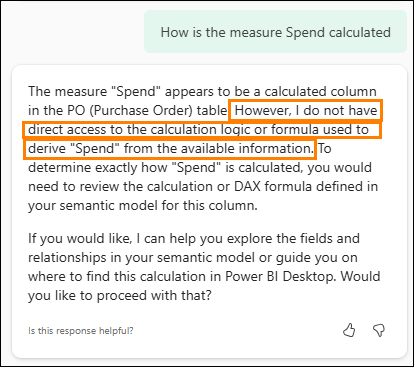

    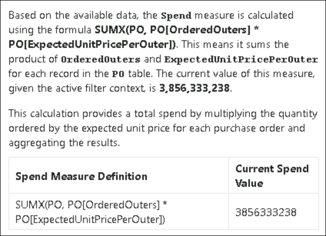

11. Copilot leistet hervorragende Arbeit bei der allgemeinen Erläuterung dessen, wie die Berechnung wahrscheinlich erfolgt. Aber in der Definition tauchen möglicherweise Wörter wie „Typically“ oder „Usually“ auf, da es sich hierbei um eine Verallgemeinerung handelt. Vielleicht ist Ihnen auch aufgefallen, dass Copilot Ihnen ausdrücklich mitteilt, dass es keinen Zugriff auf die genaue Formel oder Berechnungslogik hat und Ihnen daher keine genaue Antwort geben kann.

    In der zweiten Abbildung konnte Copilot das tatsächliche Measure erfolgreich erfassen, erklären und die Antwort zu „Spend“ im aktuellen Filterkontext geben!

    **ℹ️ Wichtig**

    In einer zukünftigen Übung werden Sie lernen, wie Sie Copilot zusätzlichen Geschäftskontext bereitstellen, der für die Beantwortung dieser Fragen erforderlich ist, wodurch Benutzer mehr Vertrauen in die Copilot-Antwort gewinnen.

12. Lassen Sie uns nun weitergehen und ein Visual erstellen, um zu veranschaulichen, wie sich Copilot an Änderungen im Datenmodell und im Bericht anpasst.

13. Geben Sie in folgenden Prompt in Copilot ein: **Create a new report page with a bar chart visual for sales and product tag**.

    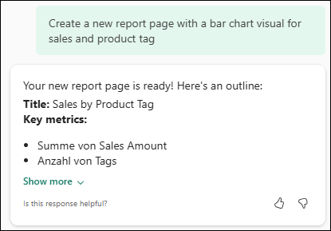

    Möglicherweise müssen Sie weitere Eingaben in Copilot machen wie im Beispiel unten:

    

    Geben Sie Ihr Bestes, um die Elemente **Total Sales** und **Product Tag** abzugleichen.

    Copilot hat das Visual auf einer brandneuen Berichtsseite erstellt!

    **Mögliche Ergebnisse:**

    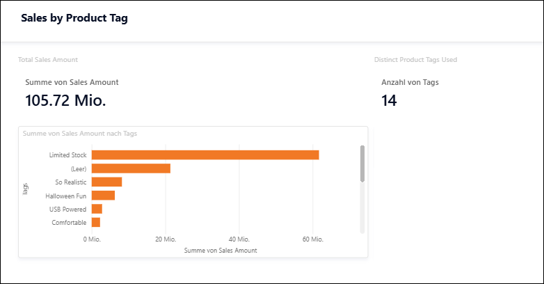

    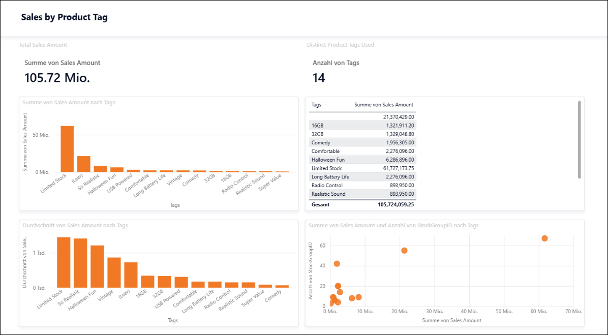

14. Wählen Sie das von Copilot erstellte Balkendiagramm-Visual aus, und wechseln Sie in die **Modellansicht**. Beachten Sie, dass es einen Filter enthält, mit dem unser Datenmodell umgangen wird. Dies ist bemerkenswert, denn „Product Tag“ und „Total Sales“ würden in unserem aktuellen Datenmodell normalerweise nicht funktionieren.

    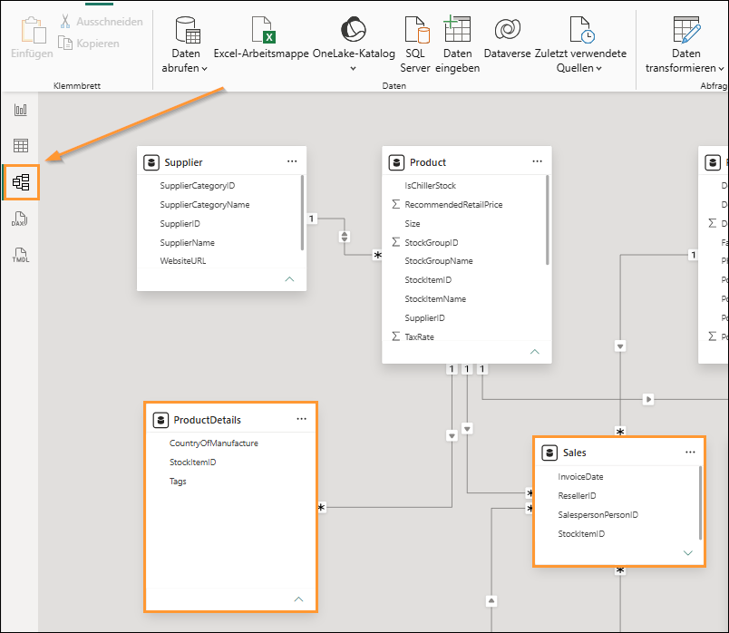

15. Einige Werte könnten doppelt gezählt werden, also entfernen wir ihn. Kehren Sie zur **Berichtsansicht** zurück, und vergewissern Sie sich, dass Sie sich weiterhin in Ihrem Diagramm befinden.

    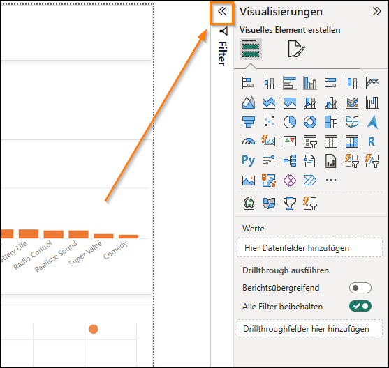

16. Wechseln Sie auf der rechten Seite zur **Registerkarte „Filter“** unter „Filter für dieses Visual“, und entfernen Sie „Product Details that have Products“ von der Achse des Balkendiagramms.

    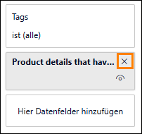

17. Beachten Sie, dass die Werte alle gleich sind: **105.724.059 USD**. Dies können Sie sehen, indem Sie den Mauszeiger über die Datenbalken in dem von Copilot erstellten Visual bewegen. Dies ist ein Indiz für falsche Beziehungen im semantischen Modell.

    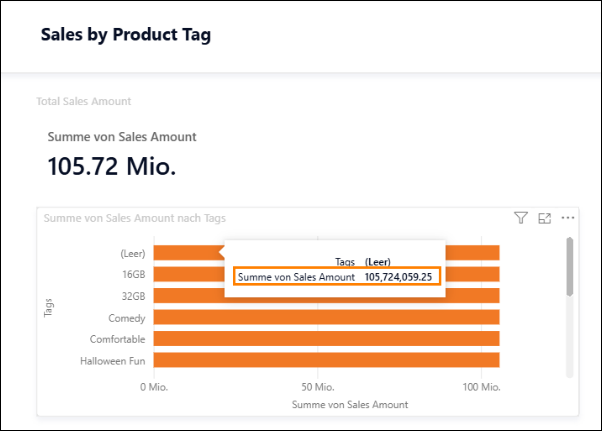

18. Die obige Antwort von Copilot ist aufgrund des Designs des semantischen Modells falsch. Copilot konnte einen Filter erstellen, um sich anzupassen und unsere Abfrage zu erfüllen. Dies zeigt, warum es so wichtig ist, ein Datenmodell zu haben, dass für KI vorbereitet ist. In einer zukünftigen Übung werfen wir einen Blick auf die Tabellen und Beziehungen und sehen uns an, wie diese optimiert werden können, um das Copilot-Ergebnis zu verbessern.

19. Das Visual macht deutlich, dass es mit der Copilot-Antwort ein Problem gibt. Eine andere Möglichkeit zur Anzeige dieser Daten liegt darin, Copilot eine Frage zu stellen und die Antwort anzusehen. Geben Sie folgenden Prompt in Copilot ein: **Show total sales by product tag**.

    

20. Copilot weist Sie in der Antwort ausdrücklich darauf hin, dass es im Umsatz **keine Variationen** gibt. Wenn Sie diese Formulierung in Copilot sehen, ist dies ein Hinweis darauf, dass möglicherweise etwas nicht richtig ist.

    

21. Stellen wir Copilot eine weitere Aufgabe: **Show total sales by State**.

    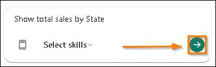

    Es sind unterschiedliche Antworten möglich. *Ihre Ergebnisse werden wahrscheinlich abweichen.* Eine mögliche Antwort sieht so aus:

    **Mögliche Ergebnisse:**

    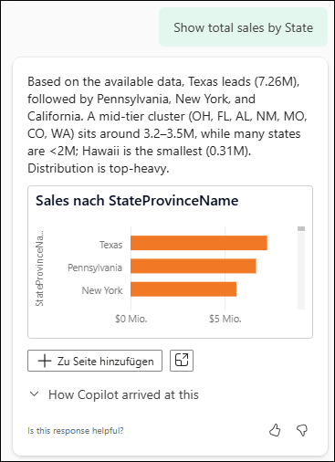

    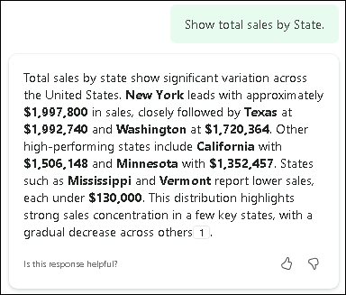

22. Diese Antwort ist nicht ganz richtig. Liegt wieder ein Fehler im Datenmodell vor? Könnte es am Datenmodell ODER an der Ungenauigkeit unserer Frage liegen? Wählen Sie *Wie Copilot zu dieser Antwort gelangt ist* und bewegen Sie den Mauszeiger über ***State*** und ***Sales*. *Sales*** wird korrekt über unser explizites Measure in der Tabelle „Sales“ erfasst, aber das Feld ***State*** stammt aus der Tabelle „Customer“.

    

23. Wechseln Sie zur Modellansicht , und überprüfen Sie die Beziehungen im Datenmodell, die „Customer“ und „Sales“ verbinden. Hier liegt die Erklärung für die falsche Visualisierung! Wir sehen, dass unsere Sprache und das Datenmodell aneinander ausgerichtet sein müssen.

    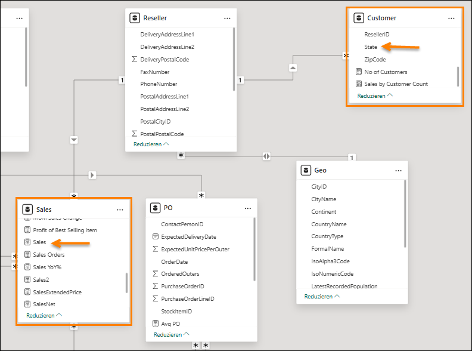

    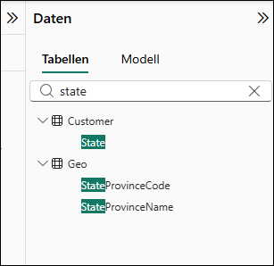

    In diesem Szenario haben wir mehrere Tabellen mit einer Variation von State. Und wir haben mehrere Sales-Measures. Das kann zu inkonsistenten Antworten und sogar irreführenden Ergebnissen führen. In späteren Übungen lernen Sie die verschiedenen Techniken kennen, mit denen Copilot diese Art von Benutzerabfragen beantworten kann.

24. Probieren wir einen weiteren Prompt aus: **Sales by State**.

    

25. In den folgenden Screenshots können Sie sehen, dass der Bundesstaat Texas mit **461.457 USD bzw. 2 Millionen USD** den höchsten Umsatz hat. Diese Antworten wurden unter Bezugnahme auf Visuals im Bericht generiert. Ein Visual verfügt sogar über einen Filter. Wenn Ihre Ergebnisse mit dem folgenden Screenshot übereinstimmen, klicken Sie auf die Referenz. Dadurch gelangen Sie zu der Seite und dem Visual, auf das Bezug genommen wird.

    **Mögliche Ergebnisse:**

    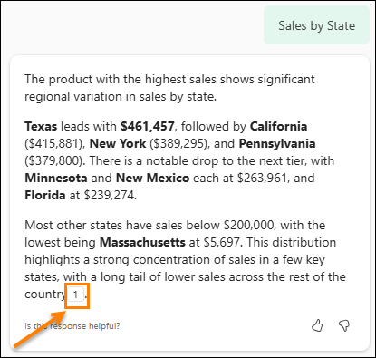

    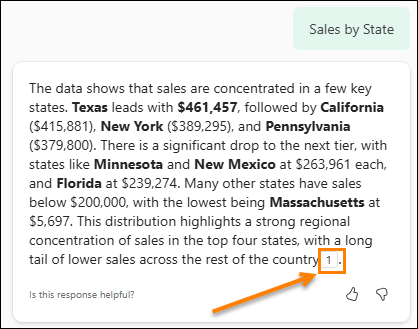

26. Navigieren Sie nun zur Registerkarte mit den meistverkauften Produkten im unteren Menüband.

    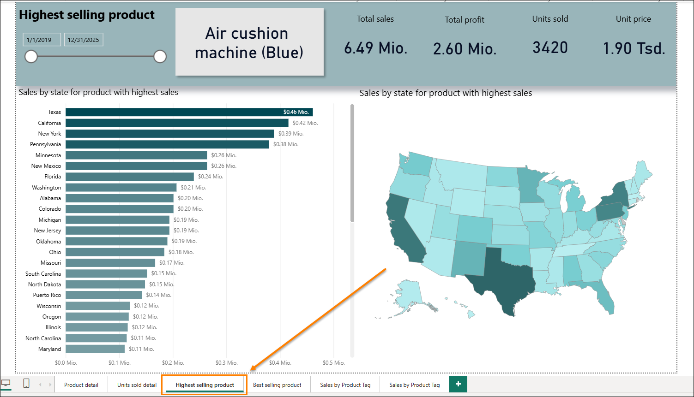

27. Auf den ersten Blick scheinen die Antworten korrekt zu sein. Aber werfen Sie einen Blick auf einige der potenziell auf die Visualisierungen angewendeten Filter. Klappen Sie den Filterbereich aus, sofern er es noch nicht ist:

    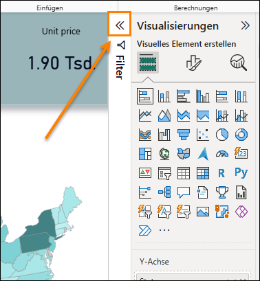

28. Das Visual hat einen Filter, der die Antworten von Copilot verändern könnte. Erweitern Sie den Filter, um zu sehen, dass **dieses Visual nur den Umsatz für das meistverkaufte Produkt anzeigt**. (Stellen Sie sicher, dass Sie in das Kartenvisual geklickt haben.)

    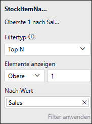

    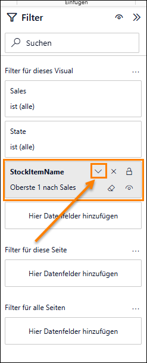

    **ℹ️ Wichtig**

    Filter können auf Visual-, Seiten-, Berichts- und sogar Datenschnittebene vorhanden sein. Copilot generiert manchmal eine Antwort aus einem Visual mit einem Filter, ohne jedoch den Endbenutzer darüber zu informieren, dass ein Filter angewendet wird. Wir werden später in diesem Kurs besprechen, wie Sie KI-Anweisungen zur Unterstützung bei dieser Art von Antworten hinzufügen können.

29. Entfernen Sie den Filter, und beobachten Sie, wie sich die Werte des Referenzvisuals erheblich verändern.

    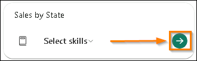

30. Texas hat jetzt einen Umsatz von **7.256.794 USD**. Das unterscheidet sich stark von einigen der anderen Ergebnissen? Wenn Sie genau hinsehen, stellen Sie fest, dass ein Visual das Measure **Sales** verwendete und das andere **Supplier Sales**. Ein Grund mehr, warum wir unsere Daten für KI aufbereiten müssen.

    

    

31. Ich frage mich, was passiert, wenn wir die gleiche Frage noch einmal stellen. Bitten Sie Copilot noch einmal um **Sales by State**.

    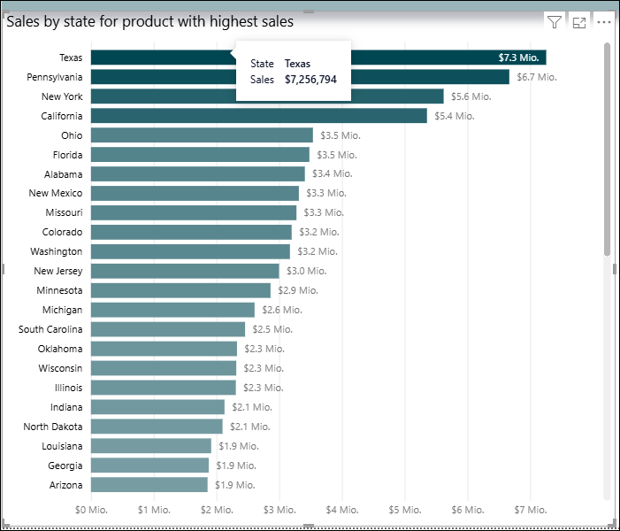

    

32. Ohne den Filter haben wir einen völlig anderen Satz von Werten in derselben Referenz. Dies ist ein wichtiger Aspekt, den Sie bei der Vorbereitung Ihrer Daten für KI beachten müssen.

    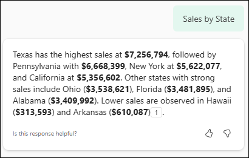

33. Wie sieht es mit einer Antwort aus, die mehrere Referenzen zurückgibt? Stellen Sie Copilot folgende neue Aufgabe: **Show the top selling product**.

    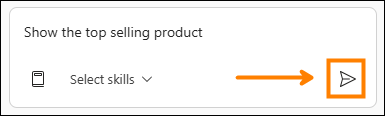

34. Wählen Sie die Referenz aus, und suchen Sie nach eventuell vorhandenen überflüssigen Filtern.

    

    

35. Fügen Sie der Seite aus der Tabelle „Reseller“ einen Filter für **ResellerCompany** hinzu.

    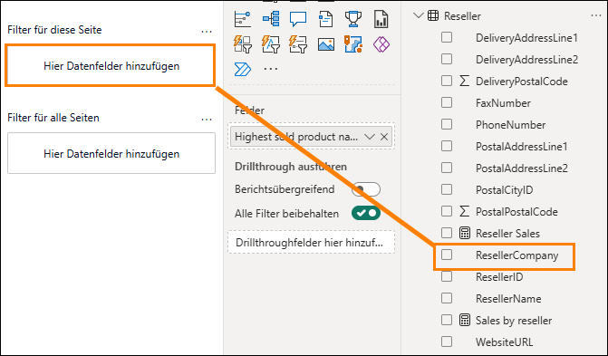

36. Wählen Sie nur TailSpin Toys aus, und beobachten Sie, ob sich die Werte geändert haben.

    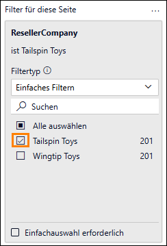

37. Wir stellen erneut die Aufgabe: **Show the top selling product**.

    

38. Das Produkt ist vielleicht gleich geblieben. Aber unsere Zahlen sind ganz andere. Dieses Beispiel zeigt, wie unvorbereitete semantische Modelle zu inkonsistenten und falschen Ergebnissen führen können.

    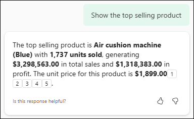

39. Ein weiterer Bereich, in dem wir Copilot nutzen können und den wir überprüfen sollten, ist die Integration von DAX (Data Analysis eXpression). Versuchen Sie es, indem Sie eine Aufgabe mit einer Berechnung stellen, z. B.: **Calculate the percent of total sales in the Southeast to the United States**.

    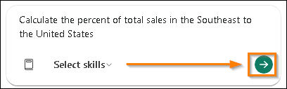

40. In der Antwort sehen Sie, dass Copilot erkennt, dass die Antwort mehr Analyse als gewöhnlich erfordert. Es ist toll, dass uns mitgeteilt wird, dass die Berechnung weiter geprüft werden muss.

    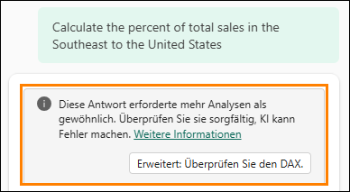

41. In unserem Fall musste Copilot für diese spezielle Berechnung DAX einsetzen. Hier können wir den verwendeten DAX auf zwei Arten überprüfen. Zuerst unter **Erweitert: Überprüfen Sie den DAX.** und dann im Bereich **Antwort erweitern**.

    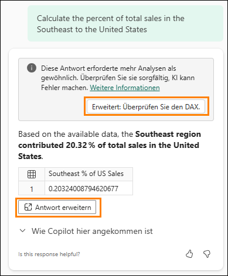

42. Achten Sie darauf, dass die Registerkarte **DAX-Abfrage** angezeigt wird. Hier wird der DAX angezeigt, der zum Erstellen der Antwort verwendet wurde. Die Abfrage wird zusammen mit einer Erklärung der zu folgenden Logik aufgelistet. Wir müssen uns zwei Fragen stellen. (1) Sieht der DAX hier richtig aus? (2) Waren es in der Region Südosten wirklich nur **20,32 %**?

    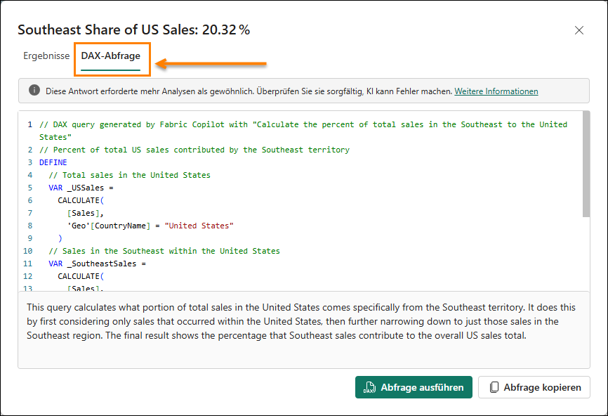

43. Jedes Mal, wenn Copilot DAX generiert, wird dieser oft sehr unterschiedlich und inkonsistent ausfallen. Ihr DAX sieht möglicherweise anders aus als auf den Screenshots in diesem Abschnitt. Im hier abgebildeten Code ruft der DAX den Bundesstaat aus der Tabelle **Geo** ab. Das funktioniert, aber er hätte die Standortinformationen auch problemlos aus der Tabelle **Customer** abrufen können. Hätte er sie aus der Tabelle „Customer“ abgerufen, hätte das Ergebnis bei nur 3-4 % gelegen.

    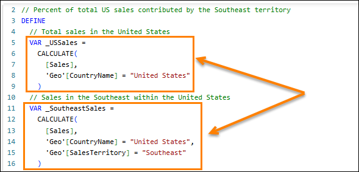

44. Wie können wir dieses Problem nun lösen? Die beste Methode werden wir später in unseren Übungen anwenden, wenn wir die **Daten für KI vorbereiten**. Im Moment können wir eine bessere Antwort erzielen, indem wir einen besseren Prompt schreiben. Sie haben vielleicht bereits Ergebnisse aus der Tabelle **Geo** erhalten. Aber dies ist immer noch der zweitbeste Weg, um dies zu bestätigen.

45. Stellen Sie die Aufgabe erneut mit folgendem Prompt: **Calculate the percent of total sales in the Southeast to the United States from the Geo table**.

    

46. Die Ergebnisse werden dieses Mal wahrscheinlich ähnlich ausfallen. Wir überprüfen den mit der Antwort verknüpften DAX.

    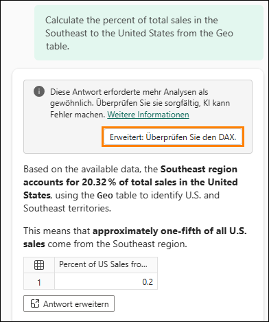

    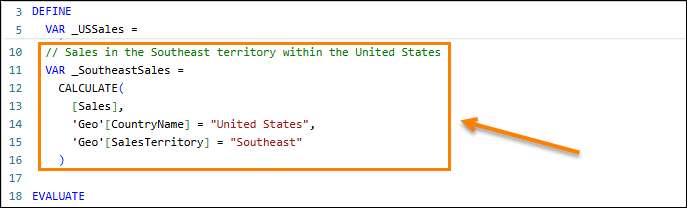

47. Perfekt! Mit einem durchdachten Prompt können Fehler im Modell korrigiert werden. Für unsere Endbenutzer möchten wir jedoch eine Erfahrung schaffen, die auch mit allgemeineren Prompts gut funktioniert.

48. In dieser PBIX-Datei gibt es einige Probleme mit der Datenmodellierung. Genauer gesagt gibt es zwei Snowflake-Dimensionen. Copilot geht damit recht gut um, indem es Filter und andere Änderungen anwendet, um die Antworten zu perfektionieren. Nach einer Überprüfung des Modells und der Geschäftsanforderungen sind wir jedoch zu dem Schluss gekommen, dass diese beiden Dimensionen (Supplier und Geo) nicht als einzelne Tabellen erforderlich sind. Diese beiden Tabellen werden im Modell in anderen Tabellen konsolidiert, um einem Sternschema näher zu kommen. Bei korrekter Modellierung erhöht sich die Leistung, das Modell ist leichter zu verstehen und die Copilot-Ergebnisse verbessern sich. Am Ende dieses Moduls werden Sie CDIAD – Lab 02– Start verwenden.

    - **Supplier:** Die Spalten in der Tabelle „Supplier“ wurden der Tabelle „Product“ hinzugefügt.

    - **Geo:** Die Spalten in der Tabelle „Geo“ wurden der Tabelle „Reseller“ hinzugefügt.

    **ℹ️ Wichtig**

    Manchmal ist es notwendig, Dimensionen zu erstellen, die andere Dimensionen filtern und im Wesentlichen eine Schneeflocke erzeugen. Wenn möglich, sollte das semantische Modell jedoch vereinfacht werden, solange die Geschäftsanforderungen erfüllt sind. Wenn neue Geschäftsanforderungen hinzukommen und neue Tabellen eingeführt werden, wird das Datenmodell unweigerlich komplexer. Es ist wichtig, sich stets Zeit für die Optimierung des Datenmodells zu nehmen.

    ⭐Power BI funktioniert am besten mit einem Sternschema. Eine vollständige Erörterung des Sternschemas würde den Rahmen dieses Kurses sprengen. Weitere Informationen finden Sie unter folgendem Microsoft Learn-Link:

    [**https://learn.microsoft.com/en-us/power-bi/guidance/star-schema**](https://learn.microsoft.com/en-us/power-bi/guidance/star-schema)

    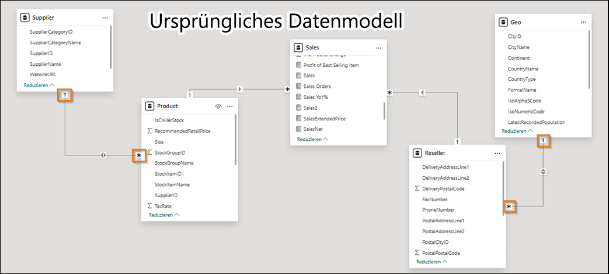

    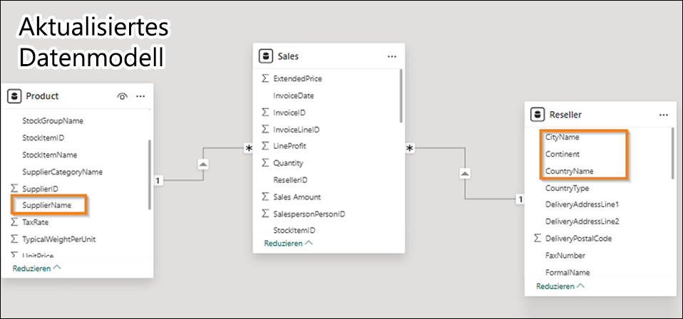

    Nachfolgend finden Sie weitere Ressourcen zur Arbeit mit Microsoft Fabric.

    - Zugriff auf alle Informationen in der [Hauptdokumentation von Microsoft Fabric](https://learn.microsoft.com/en-us/fabric/)

    - Fabric bei einer [interaktiven Vorstellung kennenlernen](https://aka.ms/Fabric-GuidedTour)

    - Zur [kostenlosen Testversion von Microsoft Fabric](https://aka.ms/try-fabric) anmelden

    - Besuchen Sie die [Microsoft Fabric-Website](https://aka.ms/microsoft-fabric)

    - Mit den Modulen von [Fabric Learning neue Qualifikationen erwerben](https://aka.ms/learn-fabric)

    - [Kostenloses E-Book zum Einstieg in Fabric lesen](https://aka.ms/fabric-get-started-ebook)

    - Mitglied der [Fabric-Community](https://aka.ms/fabric-community) werden, um Fragen zu stellen, Feedback zu geben und sich mit anderen auszutauschen

    Lesen Sie die ausführlichere technische Dokumentation zu Copilot:

    - [Übersicht über Copilot für Power BI – Power BI | Microsoft Learn](https://learn.microsoft.com/en-us/power-bi/create-reports/copilot-introduction)

    - [Eigenständige Copilot-Umgebung in Power BI (Vorschauversion) – Power BI | Microsoft Learn](https://learn.microsoft.com/en-us/power-bi/create-reports/copilot-chat-with-data-standalone)

    - [Microsoft Fabric Copilot-Admineinstellungen | Microsoft Learn](https://learn.microsoft.com/en-us/fabric/admin/service-admin-portal-copilot)

    - [Erstellung eines Fabric-Daten-Agent (Vorschauversion) – Erfahren Sie, wie Sie einen Fabric-Daten-Agent erstellen | Microsoft Learn](https://learn.microsoft.com/en-us/fabric/data-science/concept-data-agent)

    - [Bewährte Vorgehensweisen bei der Konfiguration Ihres Daten-Agents – Microsoft Fabric | Microsoft Learn](https://learn.microsoft.com/en-us/fabric/data-science/data-agent-configuration-best-practices)

    - [Copilot für Microsoft Fabric und Power BI: (FAQ) – Microsoft Fabric | Microsoft Learn](https://learn.microsoft.com/en-us/fabric/fundamentals/copilot-faq-fabric)

    © 2026 Microsoft Corporation. Alle Rechte vorbehalten.

    Durch Nutzung dieser Demo/Übung erklären Sie sich mit folgenden Bedingungen einverstanden:

    Die in dieser Demo/Übung beschriebene Technologie/Funktionalität wird von der Microsoft Corporation bereitgestellt, um Feedback von Ihnen zu erhalten und Ihnen Wissen zu vermitteln. Sie dürfen die Demo/Übung nur verwenden, um derartige Technologiefeatures und Funktionen zu bewerten und Microsoft Feedback zu geben. Es ist Ihnen nicht erlaubt, sie für andere Zwecke zu verwenden. Es ist Ihnen nicht gestattet, diese Demo/Übung oder einen Teil derselben zu ändern, zu kopieren, zu verbreiten, zu übertragen, anzuzeigen, auszuführen, zu vervielfältigen, zu veröffentlichen, zu lizenzieren, zu transferieren oder zu verkaufen oder aus ihr abgeleitete Werke zu erstellen.

    DAS KOPIEREN ODER VERVIELFÄLTIGEN DER DEMO/ÜBUNG (ODER EINES TEILS DERSELBEN) AUF EINEN/EINEM ANDEREN SERVER ODER SPEICHERORT FÜR DIE WEITERE VERVIELFÄLTIGUNG ODER VERBREITUNG IST AUSDRÜCKLICH UNTERSAGT.

    DIESE DEMO/ÜBUNG BIETET BESTIMMTE SOFTWARETECHNOLOGIE/PRODUKTFUNKTIONEN UND FUNKTIONALITÄT, EINSCHLIESSLICH MÖGLICHER NEUER FUNKTIONEN UND KONZEPTE, IN EINER SIMULIERTEN UMGEBUNG OHNE KOMPLEXE EINRICHTUNG ODER INSTALLATION FÜR DEN BESCHRIEBENEN ZWECK OBEN. DIE IN DIESER DEMO/ÜBUNG DARGESTELLTEN TECHNOLOGIEN/KONZEPTE STELLEN MÖGLICHERWEISE NICHT DIE VOLLSTÄNDIGE FUNKTIONALITÄT DER FUNKTION DAR UND FUNKTIONIEREN MÖGLICHERWEISE NICHT SO, WIE EINE ENDGÜLTIGE VERSION FUNKTIONIEREN KÖNNTE. UNTER UMSTÄNDEN VERÖFFENTLICHEN WIR AUCH KEINE ENDGÜLTIGE VERSION DERARTIGER FEATURES ODER KONZEPTE. IHRE ERFAHRUNG BEI DER VERWENDUNG DERARTIGER FEATURES UND FUNKTIONEN IN EINER PHYSISCHEN UMGEBUNG KANN FERNER ABWEICHEND SEIN.

    **FEEDBACK.** Wenn Sie Feedback zu den Technologiefeatures, Funktionen und/oder Konzepten geben, die in dieser Demo/Übung beschrieben werden, gewähren Sie Microsoft das Recht, Ihr Feedback in jeglicher Weise und für jeglichen Zweck kostenlos zu verwenden, zu veröffentlichen und gewerblich zu nutzen. Außerdem treten Sie Dritten kostenlos sämtliche Patentrechte ab, die erforderlich sind, damit deren Produkte, Technologien und Dienste bestimmte Teile einer Software oder eines Dienstes von Microsoft, welche/welcher das Feedback enthält, verwenden oder eine Verbindung zu dieser/diesem herstellen können. Sie geben kein Feedback, das einem Lizenzvertrag unterliegt, aufgrund dessen Microsoft Drittparteien eine Lizenz für seine Software oder Dokumentation gewähren muss, weil wir Ihr Feedback in diese aufnehmen. Diese Rechte bestehen nach Ablauf dieser Vereinbarung fort.

    DIE MICROSOFT CORPORATION LEHNT HIERMIT JEGLICHE GEWÄHRLEISTUNGEN UND GARANTIEN IN BEZUG AUF DIE DEMO/ÜBUNG AB, EINSCHLIESSLICH ALLER AUSDRÜCKLICHEN, KONKLUDENTEN ODER GESETZLICHEN GEWÄHRLEISTUNGEN UND GARANTIEN DER HANDELSÜBLICHKEIT, DER EIGNUNG FÜR EINEN BESTIMMTEN ZWECK, DES RECHTSANSPRUCHS UND DER NICHTVERLETZUNG VON RECHTEN DRITTER. MICROSOFT MACHT KEINERLEI ZUSICHERUNGEN BZW. ERHEBT KEINERLEI ANSPRÜCHE IM HINBLICK AUF DIE RICHTIGKEIT DER ERGEBNISSE UND DES AUS DER VERWENDUNG DER DEMO/ÜBUNG RESULTIERENDEN ARBEITSERGEBNISSES BZW. BEZÜGLICH DER EIGNUNG DER IN DER DEMO/ÜBUNG ENTHALTENEN INFORMATIONEN FÜR EINEN BESTIMMTEN ZWECK.

    **HAFTUNGSAUSSCHLUSS**

    Diese Demo/Übung enthält nur einen Teil der neuen Features und Verbesserungen in Microsoft Power BI. Einige Features können sich unter Umständen in zukünftigen Versionen des Produkts ändern. In dieser Demo/Übung erhalten Sie Informationen über einige, aber nicht über alle neuen Features.
