# Microsoft Fabric Chat with your Data in a Day - Übung 2

## Inhalt

- Dokumentstruktur
- Anwendungsfall/Problemstellung
- Einführung
  - Aufgabe 1: Bidirektionale Filterung/Sternschema
  - Aufgabe 2: Spalten, Tabellen, Measures umbenennen
  - Aufgabe 3: Beschreibungen
  - Aufgabe 4: Datenkategorien
  - Aufgabe 5: Zusammenfassung
  - Aufgabe 6: Eigenschaft „Nach Spalte sortieren“
  - Aufgabe 7: Linguistisches Schema: Synonyme

# Dokumentstruktur

Die Übung enthält die Schritte, die Benutzer durchführen müssen, sowie zugehörige Screenshots zur visuellen Unterstützung. Wichtige Abschnitte sind in den Screenshots mit einem orangefarbenen Kasten gekennzeichnet.

# Anwendungsfall/Problemstellung

Ihr Unternehmen hat die ersten Tests und die Testphase der Copilot-Bereitschaft abgeschlossen. Es hat sich herausgestellt, dass das aktuelle Modell noch nicht für die eigenständige Copilot-Umgebung bereit ist und allgemein anerkannte bewährte Methoden in Power BI Desktop implementiert werden müssen. Damit Copilot aussagekräftige Antworten bereitstellen kann, muss das zugrunde liegende semantische Modell sorgfältig geplant und optimiert werden.

Die aktuellen Herausforderungen für Ihr semantisches Modell sind:

- Tabellen- und Spaltennamen sind möglichweise kryptisch und schwer zu entziffern.

- Es sind keine Beschreibungen für Tabellen, Spalten und Measures vorhanden.

- Datenkategorien werden nicht ausreichend genutzt, was das kontextbezogene Verständnis von Copilot einschränkt.

- Die Sortierlogik und die Standardzusammenfassungen spiegeln möglicherweise nicht die Erwartungen der Benutzer wider.

- Beziehungen und das linguistische Schema wurden nicht konfiguriert oder optimiert, um optimale Copilot-Ergebnisse zu erzielen.

# Einführung

Diese Lücken können zu Verwirrung, ungenauen Antworten, irreführenden Visuals oder verpassten Erkenntnissen führen, wenn Benutzer mit Copilot interagieren. In dieser Übung lernen Sie, wie Sie das semantische Modell mithilfe bewährter Methoden für die Benennung, Kategorisierung, Zusammenfassung, Datenmodellierung und das linguistische Schema optimieren können.

## Aufgabe 1: Bidirektionale Filterung/Sternschema

1. Öffnen Sie die Datei mit dem Namen **CDIAD – Lab 02– Start** aus Ihren Kursdateien, um mit der Vorbereitung von Daten für KI zu beginnen.

    

2. Eine Aufgabe für Copilot in der vorherigen Übung lautete: **Create a new report page with a visual for sales and product tag**. Copilot generierte daraufhin eine Antwort, die doppelte Daten anzeigte (siehe Screenshot unten). Wenn Sie für alle Datenpunkte dasselbe Ergebnis sehen, ist dies in der Regel ein Hinweis darauf, dass im Datenmodell ein Beziehungsproblem vorliegt.

    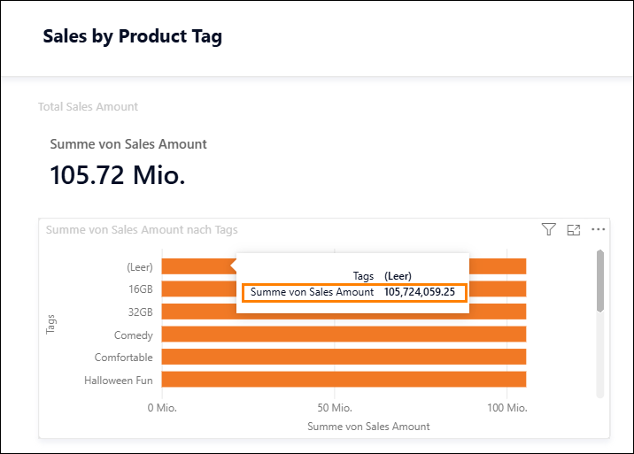

3. Unten sehen Sie einen Screenshot der Beziehung von Tags in der Tabelle „Product Details“ und dem Measure „Sales“ in der Tabelle „Sales“:

    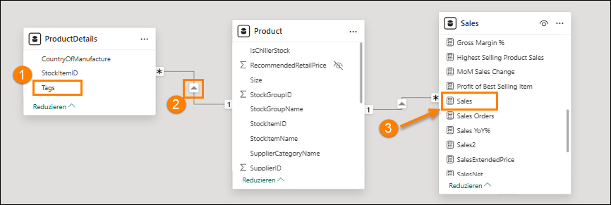

4. Wenn wir Copilot auffordern, „Sales“ nach „Tags“ zurückzugeben, erstellt es einen Bericht mit doppelten Daten. Dies liegt daran, dass die Spalte „Tags“ in der Tabelle „Product Details“ die Tabelle „Product“ nicht filtern kann. Die Filterrichtung zwischen „Product“ und „Product Details“ geht nur in eine Richtung, und zwar von der Tabelle „Product“ zur Tabelle „Product Details“ . Es gibt zwei Möglichkeiten, dieses Problem zu lösen.

    - Erstens könnten wir ein DAX-Measure erstellen, das den Gesamtumsatz berechnet und gleichzeitig den erforderlichen Filter aus der Tabelle „Tags“ hinzufügt. Mit dieser Option bleibt das Datenmodell einfach, aber für jede Geschäftsanforderung müsste ein neues Measure erstellt werden. Das kann mühsam sein.

    - Zweitens können wir zulassen, dass der Filter in beide Richtungen funktioniert. Diesen Ansatz werden wir hier umsetzen. Durch die Aktualisierung der Beziehung zwischen „Product“ und „Product Details“ kann die Spalte „Tag“ dann bis zur Tabelle „Sales“ durchgefiltert werden, und Copilot kann die richtige Antwort generieren.

5. Aktualisieren wir also die Beziehung im Datenmodell. *Siehe nachfolgenden Screenshot:*

    1. Klicken Sie im linken Navigationsbereich auf die Modellansicht.

    2. Wählen Sie die Beziehung zwischen „Product“ und „Product Details“aus.

    3. Ändern Sie im Bereich „Eigenschaften“ die Kreuzfilterrichtung von „Eine“ in „Beide“.

        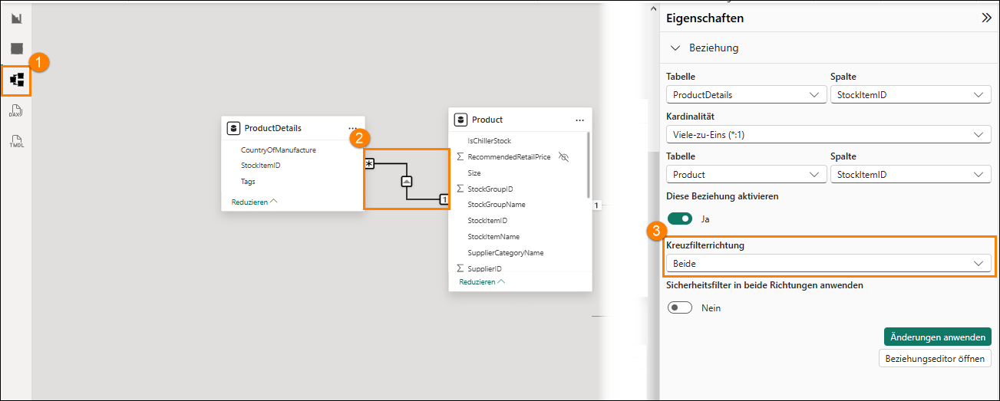

    **ℹ️ Wichtig**

    Allgemein sollten Sie die Filterung in beide Richtungen nach Möglichkeit vermeiden. In einigen Situationen kann dies zu Mehrdeutigkeiten in den Ergebnissen sowie zu Leistungsproblemen führen. Eine Alternative besteht wie gesagt darin, DAX-Measures zu erstellen, die die Filterung für das bestimmte Measure manuell erzwingen. Es gibt auch noch andere Alternativen, auf die in diesem Kurs nicht eingegangen wird.

6. Jetzt können wir die Aufgabe erneut in der **Berichtsansicht** stellen und verbesserte Ergebnisse feststellen. Öffnen Sie erneut die Copilot-Chatfunktion in Power BI, und stellen Sie die folgende Aufgabe: **Show total sales by product tag**.

    

    Wenn Sie um eine Klarstellung gebeten werden, fordern Sie das **Sales Measure** an.

    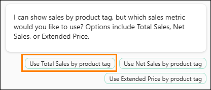

7. Korrekte Ergebnisse:

    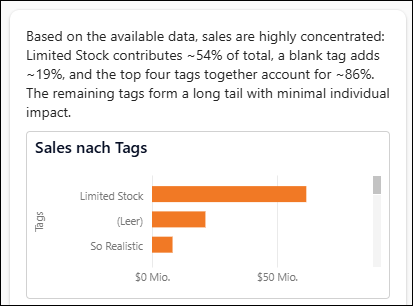

    *Wenn Ihnen ein anderes Visual angezeigt wird, stellen Sie die Aufgabe erneut und verlangen Sie ein **Balkendiagramm***.

    

    Vorheriges Ergebnis:

    

    Die Datenmodellierung war schon immer einer der wichtigsten, wenn nicht sogar der wichtigste Aspekt von Power BI. Ein klar definiertes und gut durchdachtes Datenmodell macht das Erstellen von Berichten, das Schreiben von DAX, das Implementieren von Sicherheitsfunktionen und die Unterstützung für Copilot einfacher und effektiver.

## Aufgabe 2: Spalten, Tabellen, Measures umbenennen

1. In der vorherigen Übung sind wir bei der Verwendung von Spalten, Tabellen und auch Measures durch Copilot auf Probleme gestoßen, die wir nicht erwartet hatten. Diese Herausforderungen sind bei unseren wachsenden Datenmodellen zu erwarten. Für eine bessere Vorbereitung unserer Daten für KI müssen wir Benennungen anpassen.

2. Beginnen wir mit der Umbenennung der Tabellen. Klicken Sie auf die Tabelle **PO**, und wählen Sie dann **Umbenennen** aus. Ändern Sie die Tabelle **PO** zu **Purchase Orders**.

    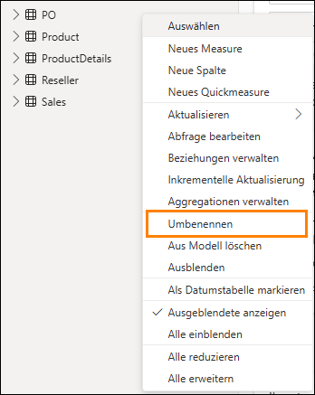

    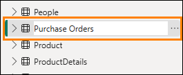

3. Als Nächstes benennen wir auf die gleiche Weise die Spalten um. Klappen Sie zunächst die Tabelle **Reseller** auf.

    

4. Doppelklicken Sie oder klicken Sie mit der rechten Maustaste auf die Spalte **[SPName]** und nennen Sie sie in **State** um.

    

    

5. Nehmen Sie die folgenden Umbenennungen vor:

    Benennen Sie **Reseller[CountryName]** in **Country** um.

    Benennen Sie in der Tabelle **Sales** das Measure **MoM Sales Change** in **Month over Month Sales Change** um.

    Benennen Sie in der Tabelle **Sales** das Measure **Sales YoY%** in **Sales Year over Year %** um.

    Benennen Sie in der Tabelle **Purchase Orders** das Measure **Spend** in **Total Purchases** um.

    **ℹ️ Wichtig**

    Klare, beschreibende Namen für Tabellen und Spalten machen einen großen Unterschied. Copilot interpretiert Ihre Prompts basierend auf der Struktur Ihres Modells – je intuitiver die Benennung, desto besser kann es genaue DAX, Visuals und Erkenntnisse generieren. Nehmen Sie Umbenennungen mit Bedacht vor, um das Verstehen von Copilot und Ihre eigene Produktivität zu verbessern.

    Benennen Sie in der Tabelle **Purchase Orders** das Measure **Spend** in **Total Purchases** um.

## Aufgabe 3: Beschreibungen

1. Lassen Sie uns nun das Datenmodell noch weiter vorbereiten, indem wir Beschreibungen hinzufügen. Beschreibungen können Tabellen, Spalten und Measures in der Modellansicht hinzugefügt werden. Diese Beschreibungen helfen Copilot bei der Beantwortung von Benutzeranfragen. Tabellenbeschreibungen sind eine Art Backstage-Pass für Copilot. Sie geben ihm den Kontext, den es benötigt, um genaue, relevante Erkenntnisse, Zusammenfassungen und auch DAX-Measures zu generieren. Gehen wir zunächst in die **Modellansicht**.

2. Wählen Sie die Tabelle **Purchase Orders** aus. Im Bereich **Eigenschaften** finden Sie den Bereich **Beschreibung**, in dem wir unsere Beschreibung zur Unterstützung von Copilot erstellen. Es folgen einige Tipps für bewährte Methoden:

    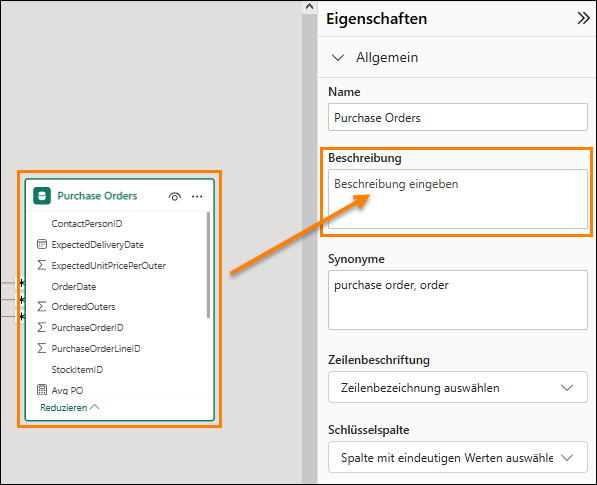

    ### Bewährte Methoden für die Beschreibung von Tabellen

    **Beginnen Sie mit dem Zweck:** Was repräsentiert die Tabelle in geschäftlicher Hinsicht?

    **Fügen Sie Geschäftskontext hinzu:** Erklären Sie, wie die Tabelle die Berichterstellung oder Entscheidungsfindung unterstützt.

    **Erwähnen Sie den Granularitätsgrad:** Ist sie transaktionsbezogen, täglich, aggregiert usw.?

    **Heben Sie wichtige Spalten hervor:** besonders solche, die in Beziehungen oder Berechnungen verwendet werden.

    **Beschreiben Sie häufige Anwendungsfälle:** Welche Arten von Fragen oder Visuals unterstützt diese Tabelle?

    **Notieren Sie Beziehungen:** Erwähnen Sie, wie sie mit anderen Tabellen im Modell verbunden ist

    **ℹ️ Wichtig**

    **Gut geschriebene Beschreibungen helfen Copilot, den Zweck und Kontext Ihrer Daten zu verstehen.** Verwenden Sie Beschreibungen, um zu verdeutlichen, wofür eine Tabelle oder Spalte steht, insbesondere wenn Namen allein nicht ausreichen. Copilot verwendet diese Hinweise, um relevantere Antworten, DAX und Visuals zu generieren. Betrachten Sie Beschreibungen als Ihre Chance, Copilot – und Ihre Benutzer – zu besseren Erkenntnissen zu führen.

3. Geben Sie diese ausführliche, aber genaue Beschreibung in das Feld ein:

    *This Purchase Orders table captures individual line items from purchase orders submitted within the organization. Each row represents a specific product ordered, including the quantity requested, the date of the order, and the employee who initiated the request. It supports analysis of procurement trends, supplier demand, and employee purchasing behavior. Key columns include ProductID, QuantityOrdered, OrderDate, and EmployeeID. This table links to Products, Employees, and PurchaseOrders tables to enable detailed reporting across procurement workflows.*

    Das hilft Copilot dabei, bessere Antworten zu generieren, insbesondere wenn es die Tabelle **Purchase Orders** betrifft. Erstellen wir nun bessere Beschreibungen für einige Spalten. Wählen Sie aus der Tabelle **Purchase Orders** die Spalte **Order Date** aus und fügen Sie eine ähnliche Beschreibung hinzu.

    ### Bewährte Methoden für die Beschreibung von Spalten in semantischen Modellen

    **Beginnen Sie mit der geschäftlichen Bedeutung:** Beschreiben Sie, wofür die Spalte in geschäftlicher Hinsicht steht.

    **Stellen Sie Einheiten, Format oder Staffelung klar:** Hat sie numerische Werte, ist sie datumsbasiert oder enthält sie Kategorien? Erklären Sie, wie sie strukturiert ist.

    **Nennen Sie häufige Anwendungsfälle:** Helfen Sie Copilot zu verstehen, wie diese Spalte normalerweise in Analysen oder Berichten verwendet wird. Beispiel: Umsätze – Gesamtumsatz für jede Transaktion; Verwendung in Rentabilitäts- und Trendanalysen

    **Vermeiden Sie Redundanz:** Wiederholen Sie nicht, was aus dem Spaltennamen ersichtlich ist, es sei denn, dies erhöht die Klarheit. Reichern Sie sie stattdessen mit Kontext an. Für EmployeeID könnten Sie z. B. die folgende Beschreibung hinzufügen: Unique identifier for the employee who submitted the order.

    **Verwenden Sie einen einheitlichen Ton:** Halten Sie die Beschreibungen im gesamten Modell prägnant, informativ und konsistent. Stellen Sie sich vor, Sie würden QuickInfos für einen wissensbegierigen Analysten schreiben.

4. Wählen Sie die Tabelle **Purchase Orders** aus, und klicken Sie dann auf **OrderDate**. Geben Sie folgende Beschreibung ein: **The calendar date when the purchase order was submitted by an employee**.

    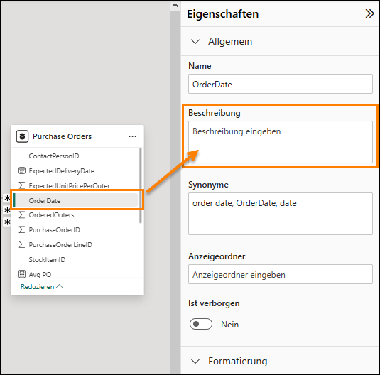

5. Nachdem wir die **Beschreibungen** für Tabellen und Spalten angepasst haben, fügen wir nun einem Measure eine Beschreibung hinzu. Dieses Mal jedoch wird uns Copilot bei der Erstellung der Beschreibung unterstützen. Wählen Sie als Erstes das Measure **Purchase Orders** aus. Als Nächstes wählen wir **Erstellen mit Copilot** aus.

    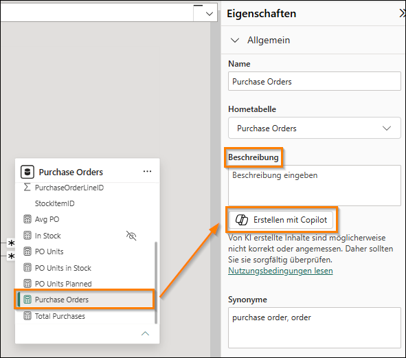

6. Die von Copilot erstellte Beschreibung steht nun zur Überprüfung bereit. Die Antwort kann variieren, wird uns aber bei der Überprüfung und Optimierung unserer Beschreibung nützlich sein. Sie können auf **Erneut versuchen** drücken; wenn Sie zufrieden sind, wählen Sie hingegen **Beibehalten** aus.

    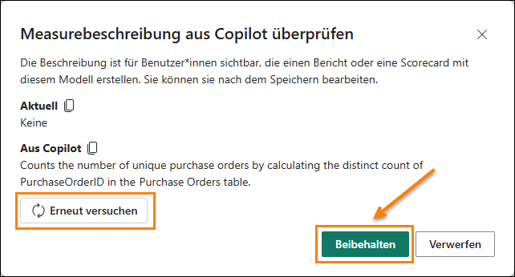

    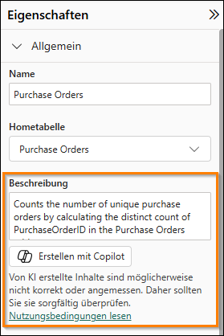

    In diesem Abschnitt haben Sie erfahren, wie Sie Tabellen, Spalten und Measures Beschreibungen hinzufügen. In einem echten semantischen Modell würden Sie das, was wir hier durchgeführt haben, auf den Rest Ihrer Tabellen und alle anwendbaren Spalten und Measures übertragen. Sie haben die Fähigkeit von Copilot, mit den Daten zu arbeiten und alle zukünftigen Antworten zu optimieren, erheblich verbessert.

## Aufgabe 4: Datenkategorien

Das Hinzufügen von Datenkategorien zu Spalten in Power BI ist für Copilot wichtig, insbesondere wenn Sie mit semantischen Modellen arbeiten, die geografische, Web- oder Bilddaten enthalten. Diese Kategorien fungieren als Metadatentags, die Copilot (und Visuals) dabei helfen, den Zweck der Spalte über den Namen oder Datentyp hinaus zu interpretieren.

1. Gehen Sie zur **Tabellenansicht**, und wählen Sie die Tabelle „Reseller“ aus. Wählen Sie in der Tabelle **Reseller** zunächst die Spalte **State** aus.

    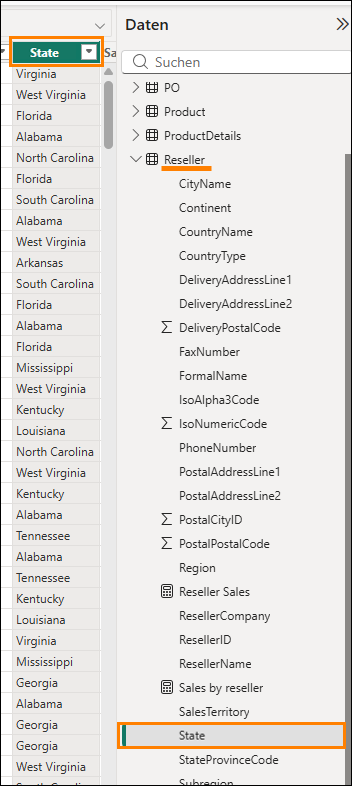

2. Wenn Sie die Spalte **State** ausgewählt haben, sehen Sie oben in Ihrem Power BI-Bericht ein neues Menü im Menüband mit dem Namen **Spaltentools**. Klicken Sie auf Spaltentools. Ändern wir als Erstes die **Datenkategorie**.

    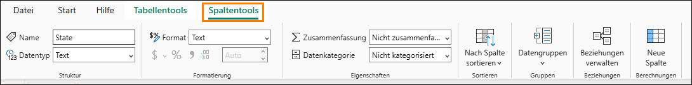

3. Klappen Sie den Bereich **Datenkategorie** aus, und ändern Sie die Datenkategorie von „Nicht kategorisiert“ zu **Bundesland oder Kanton**.

    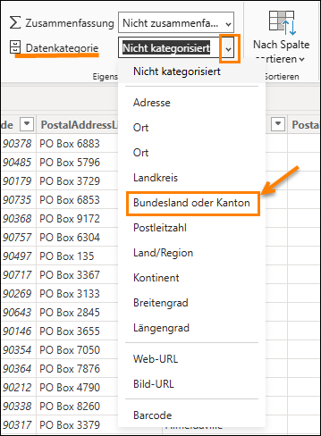

4. Fügen Sie für die folgenden Spalten weitere Datenkategorien hinzu:

    | **Tabellenname** | **Spaltenname** | **Datenkategorie** |
    |------------------|--------------------|--------------------|
    | Reseller | Country | Land/Region |
    | Reseller | DeliveryPostalCode | Postleitzahl |
    | Reseller | PostalPostalCode | Postleitzahl |
    | Reseller | Website URL | Web-URL |

    **ℹ️ Wichtig**

    **Durch das Festlegen von Datenkategorien kann Copilot besser verstehen, wie es mit Ihren Daten umgehen soll.** Ob Geografie, URLs oder Bilder: durch das Zuweisen der richtigen Kategorie erhält Copilot Kontext, um intelligentere Visuals, Filter und Erkenntnisse zu generieren. Wenn Sie zum Beispiel eine Spalte als „Ort“ markieren, kann Copilot sie sofort zuordnen. Es ist ein kleiner Schritt mit einer großen Wirkung.

## Aufgabe 5: Zusammenfassung

In diesem Abschnitt erfahren Sie mehr über die Standardzusammenfassung in Power BI und ihre möglichen Auswirkungen auf Copilot-Antworten. Es handelt sich dabei nicht um eine neue Funktion in Power BI, aber sie ist entscheidend für Copilot.

1. Öffnen Sie Copilot aus der **Berichtsansicht**, und schreiben Sie den folgenden Prompt: **What is customer age by state?**

    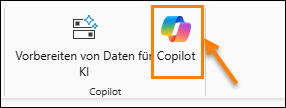

    

2. Schauen Sie sich die Ergebnisse an. Wahrscheinlich werden Sie ein seltsames Ergebnis feststellen. Bewegen Sie den Mauszeiger über die Datenbalken von **WA**,** NY** oder anderen Bundesstaaten, und Sie werden feststellen, dass die Summe von „Age“ zurückgegeben wird. Sie hätten hier eher den Mittelwert erwartet. Da jedoch in der Spalte „Age“ eine Standardzusammenfassung der SUMME vorhanden ist, führt Copilot eine Zusammenfassung durch.

    Copilot bittet möglicherweise um eine Klarstellung wie im Bild unten. Ungeachtet dessen können wir jedes Mal den Durchschnitt erhalten, indem wir die Zusammenfassung anpassen und somit zusätzliche Fragen vermeiden.

    

    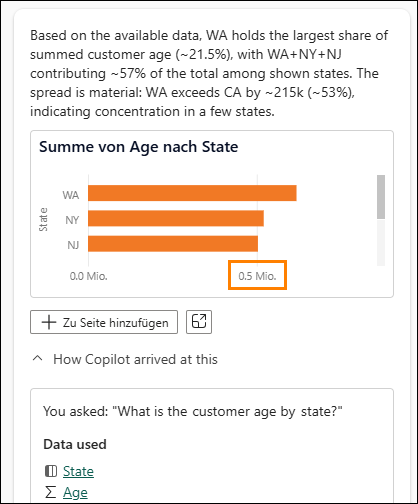

3. Wenn Sie mit der Maus über „Age“ fahren, können Sie überprüfen und sich bestätigen lassen, dass Copilot für die Spalte eine SUMME ausgeführt hat.

    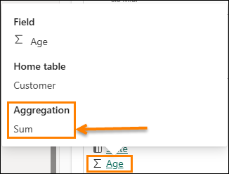

4. Wir könnten einen besseren Prompt schreiben, indem wir gezielt nach dem Durchschnittsalter fragen, und das würde funktionieren. Die bessere Option besteht jedoch darin, das Datenmodell nach Möglichkeit zu verbessern. Daher werden wir die Eigenschaft **Standard-Zusammenfassung** anpassen.

    **ℹ️ Wichtig**

    **Die Standardzusammenfassung teilt Copilot mit, wie es mit Ihren Spalten in Visuals und Berechnungen umgehen soll.** Unabhängig davon, ob die Einstellung „Nicht zusammenfassen“, „Summe“ oder „Mittelwert“ ist – die richtige Einstellung hilft Copilot dabei, genauere Diagramme und DAX zu generieren. Markieren Sie beispielsweise IDs oder Namen mit „Nicht zusammenfassen“, um irreführende Summen zu vermeiden. Es ist eine schnelle Möglichkeit, Copilot zu aussagekräftigen Erkenntnissen zu führen.

5. Geben Sie folgenden Prompt in Copilot ein: **What is customer age average by state**.

    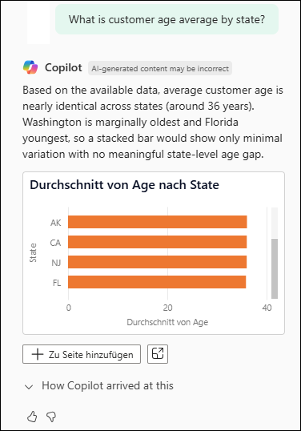

6. Lassen Sie uns die **Standardzusammenfassung** anpassen. Wählen Sie die Spalte **Age** aus der Tabelle „Customer“ aus, um Spaltentools anzuzeigen. Gehen Sie zum Bereich **Zusammenfassung**, und wählen Sie **Mittelwert** für die Spalte „Age“ aus.

    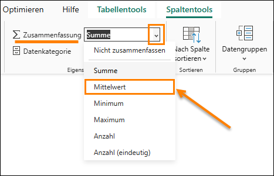

7. Im Copilot-Chat stellen wir erneut die Frage: **What is customer age by state?**

    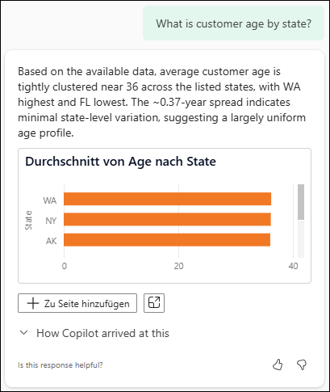

    Perfekt! Dies ist das beabsichtigte Ergebnis. Jetzt können Benutzer ihre Fragen freier formulieren, und es sind Variationen in den Benutzerfragen möglich. Ebenso wichtig ist es, die Standardzusammenfassung für numerische Spalten zu deaktivieren, die nicht zusammengefasst werden sollen. Spalten wie beispielsweise Jahr-, Quartals- und Monatsnummer sollten nicht zusammengefasst werden.

## Aufgabe 6: Eigenschaft „Nach Spalte sortieren“

1. Die Eigenschaft „Nach Spalte sortieren“ ist wie die Standardzusammenfassung nicht neu in Power BI, aber wenn sie richtig genutzt wird, hilft das Copilot dabei, die Ergebnisse in einer Reihenfolge zurückzugeben, die möglicherweise dem entspricht, was Sie erwarten. Wenn Sie zum Beispiel den Umsatz nach Monat zurückgeben, wird das Visual standardmäßig vom Monat mit dem höchsten Umsatz zum Monat mit den niedrigsten Umsatz sortiert. Lassen Sie es uns ausprobieren!

2. Setzen Sie Ihren Copilot-Chat zurück, falls Sie es noch nicht getan haben. Klicken Sie dazu auf **Chat löschen**.

    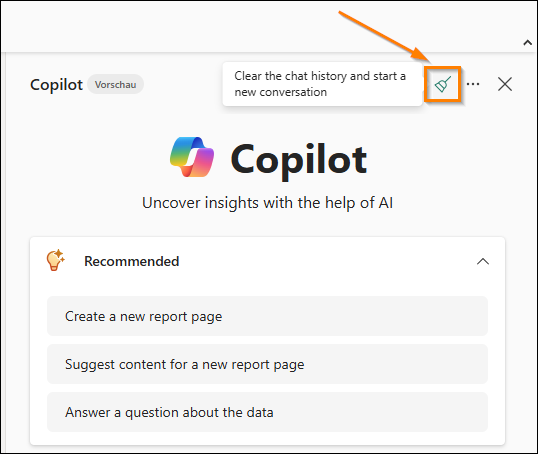

3. Geben Sie nun folgenden Prompt ein: **Show total sales by month as a column chart**.

    

4. Die Ergebnisse sind korrekt, aber auf eine Weise sortiert, die nicht unserer erwarteten Ansicht nach dem gregorianischen Kalender entspricht (Januar, Februar, März... Dezember). Die Ergebnisse werden entweder in alphabetischer Reihenfolge oder, wie in diesem Fall, vom höchsten zum niedrigsten Umsatz sortiert zurückgegeben.

    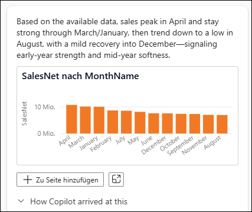

    **ℹ️ Wichtig**

    **Mit „Nach Spalte sortieren“ können Sie steuern, wie Copilot Ihre Daten darstellt.** Diese Einstellung hilft Copilot bei der Anzeige der Daten, sodass Kategorien wie Monate oder benutzerdefinierte Beschriftungen in Visuals und Zusammenfassungen in der erwarteten Reihenfolge angezeigt werden. Das Sortieren von „Monatsname“ anhand von „Monatsnummer“ hilft Copilot beispielsweise dabei, zeitb asierte Diagramme richtig zu erstellen. Es handelt sich um eine einfache Lösung zur Verhinderung verwirrender Ergebnisse.

5. Wir müssen die Sortierung der Spalte **MonthName** im Bereich **Nach Spalte sortieren** unter **Spaltentools** anpassen. Wählen Sie die Spalte „MonthName“ aus der Tabelle **Date** aus.

6. Klappen Sie „Nach Spalte sortieren“ auf, und passen Sie die Sortierung auf „Month“ an:

    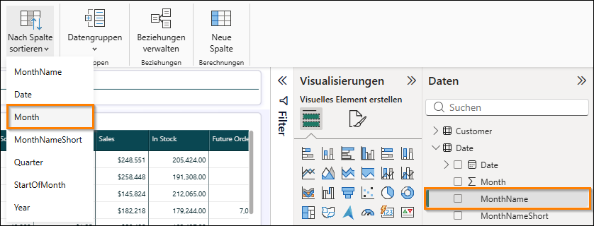

7. Stellen Sie im Copilot-Chat noch einmal die Aufgabe: **Show total sales by month**. Jetzt erhalten Sie die Ergebnisse wie erwartet.

    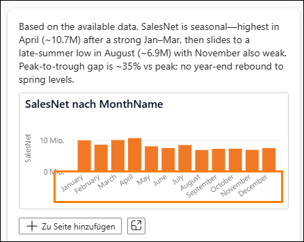

## Aufgabe 7: Linguistisches Schema: Synonyme

Das **linguistische Schema** ist der Schlüssel zur Ausschöpfung des vollen Potenzials von Copilot als auf natürliche Sprache gestützter Analysepartner. Stellen Sie sich das Schema als Übersetzungsanleitung zu Ihrem Datenmodell für Copilot vor. Ohne Schema muss Copilot raten. Mit Schema wird Copilot viel flüssiger und vertrauter mit Ihren Daten.

**Was ist das linguistische Schema?**

Das linguistische Schema besteht aus Metadaten, die Ihr semantisches Modell der natürlichen Sprache zuordnen. Mit seiner Hilfe versteht Copilot:

- was Ihre Tabellen und Spalten bedeuten,

- in welcher Beziehung sie zu Geschäftskonzepten stehen,

- welche Synonyme, Ausdrücke und Arten von Fragen Benutzer bei der Interaktion mit den Daten verwenden könnten.

Zum Beispiel: Anstatt nur Spaltennamen zu lesen, versteht Copilot Folgendes:

- „Umsatzerlös“ = TotalSales

- „Aufgegebene Bestellungen“ = PurchaseOrderCount

- „Mitarbeiterleistung“ = SalesByEmployee

Copilot kann also Aufgaben wie die folgenden beantworten:

- Welche Region hatte im letzten Quartal den höchsten Umsatzerlös?

- Zeige mir die leistungsstärksten Mitarbeiter nach Umsatzvolumen.

Ohne linguistisches Schema könnte Copilot vage Begriffe falsch interpretieren oder irrelevante Visuals vorschlagen. Mit linguistischem Schema erhalten Sie:

- bessere DAX-Vorschläge

- intelligentere Visual-Empfehlungen

- genauere Zusammenfassungen und Erkenntnisse

**Unterstützt Synonyme und natürliche Sprache**

Sie können Synonyme definieren, z. B.:

- PO = Purchase Order

- Rep = Sales Representative

- Qty = Quantity Ordered

1. Werfen wir einen Blick auf die Oberfläche des **linguistischen Schemas**. Wählen Sie zunächst die **Modellansicht** aus oder, wenn Sie sich in der Berichtsansicht befinden, das Menüband „Modellierung“. Gehen Sie zum Bereich **Q&A-Setup**.

    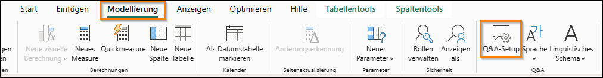

2. Es gibt ein beeindruckendes Menü, das dabei hilft, das von Ihrem Copilot-Datenmodell verwendete Q&A verständlicher zu gestalten. Das Hauptmenü enthält dafür viele Bereiche.

    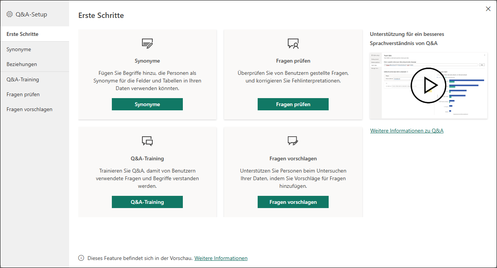

3. Navigieren wir zum ersten Menü „Synonyme“.

    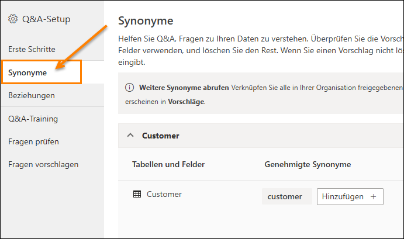

4. Präzisere Synonyme helfen Copilot dabei, die verschiedenen Formulierungen einer Frage durch Benutzer zu verstehen. Sie können auch anpassen, welche Tabelle Sie verwenden, um die korrekte Spalte zu erhalten. Drücken Sie dazu auf das Chevron-Symbol.

    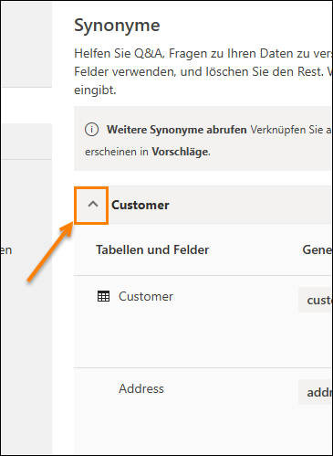

    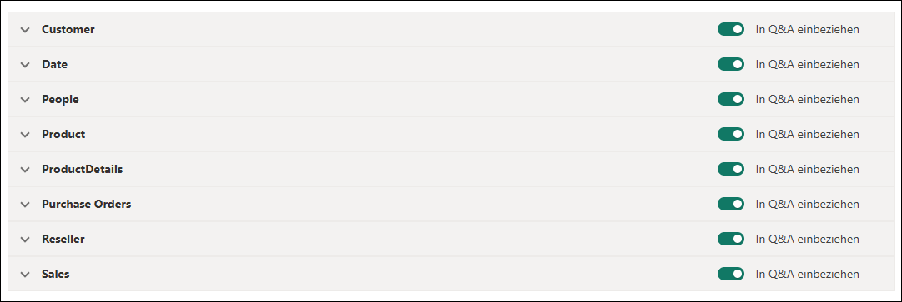

5. Unterstützen wir Copilot, indem wir die Synonyme für **Reseller** anpassen, um sie spezifischer zu machen. Achten Sie darauf, dass die Tabelle **Reseller** aufgeklappt ist. Es werden alle aktuellen Synonyme, die mit der Spalte **ResellerID** verknüpft sind, sowie Vorschläge angezeigt.

6. Bei Fabrikam werden Handelspartner oft auch als ***Fabrikam Friends*** und........ bezeichnet. Fügen wir diese als Synonyme hinzu, damit unsere Mitarbeitenden Fragen im eigenen Fabrikam-Jargon stellen können. Wählen Sie im **Shopper**** Hinzufügen** aus, und geben Sie das Synonym ein.

    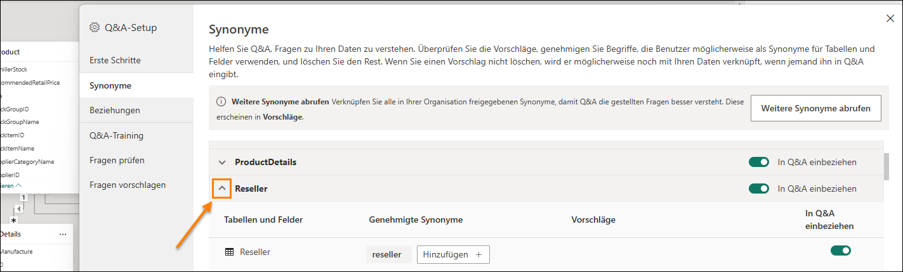

7. Fügen Sie mit Hilfe der Schaltfläche „Hinzufügen +“ ***Fabrikam Friends*** hinzu.

    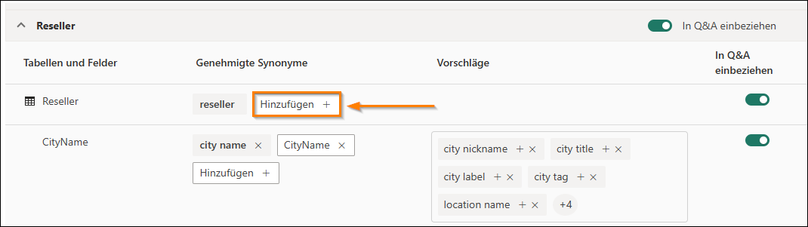

    

8. Sie werden feststellen, dass Copilot die Ergänzung auswertet und entsprechende weitere Vorschläge hinzufügt.

    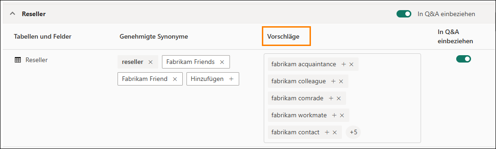

9. Verwenden wir nun einen der Vorschläge, um ein weiteres Synonym für die Tabelle „Reseller“ hinzuzufügen. Klicken Sie auf einen Vorschlag Ihrer Wahl, z. B. ***Fabrikam Acquaintance***.

    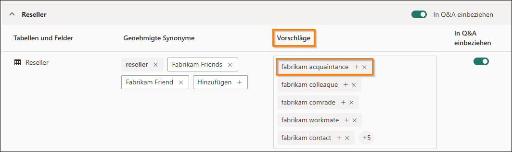

    Das Hinzufügen von Synonymen ist ein sehr aufwendiger Prozess, der im Laufe der Zeit immer einfacher wird. Erkunden Sie gern andere Tabelle und Spalten, und fügen Sie Ihrer Power BI Desktop-Datei weitere Synonyme hinzu.

10. Sehr gut! Werfen wir nun einen Blick auf **Beziehungen**. Gehen Sie zurück zum Menü
    „Q&A-Setup“.

    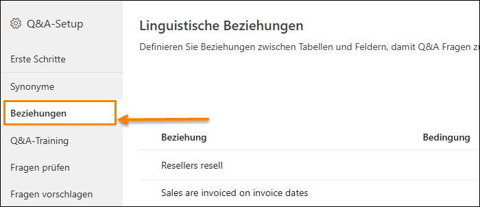

    Sprachliche Beziehungen definieren Beziehungen zwischen Tabellen und Feldern und helfen Q&A dabei, Fragen zu Ihren Daten besser zu verstehen. Sie ähneln den Verbindungen zwischen den Tabellen in Ihrem Datenmodell, aber sie werden so ausgedrückt, dass Copilot sie sprachlich verstehen kann.

    Beziehungen können z. B. dazu verwendet werden, Mehrdeutigkeiten aufzulösen. Wenn Ihr Modell mehrere Datumsfelder in mehreren Tabellen hat, können Sie Beziehungen zu den Daten hinzufügen, sodass Copilot basierend auf Kontext und Tabellenverbindungen herausfinden kann, welches Feld verwendet werden sollte.

    Um neue Beziehungen hinzuzufügen, klicken Sie zunächst auf das Feld „+ Neue Beziehung“ wie im Screenshot unten.

    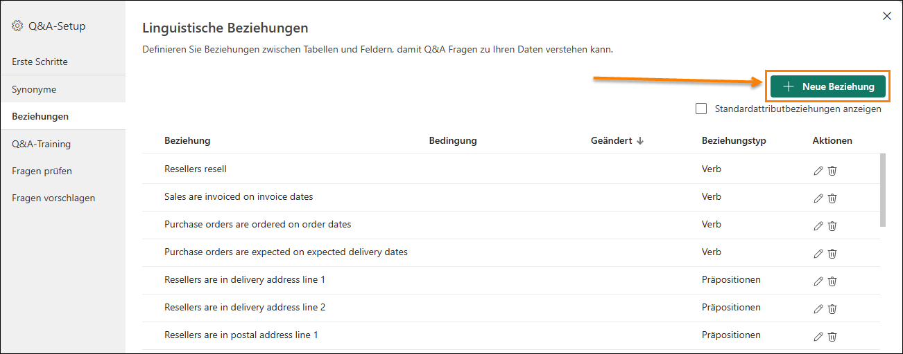

11. Jetzt können Sie viele verschiedene sprachliche Beziehungen erstellen. Derzeit stehen unter anderem Verben, Adjektive, Substantive, Präpositionen, Namen und Assoziierung als Optionen zur Wahl. Sehen Sie sich folgenden Screenshot mit verfügbaren Optionen und Beispielen an:

    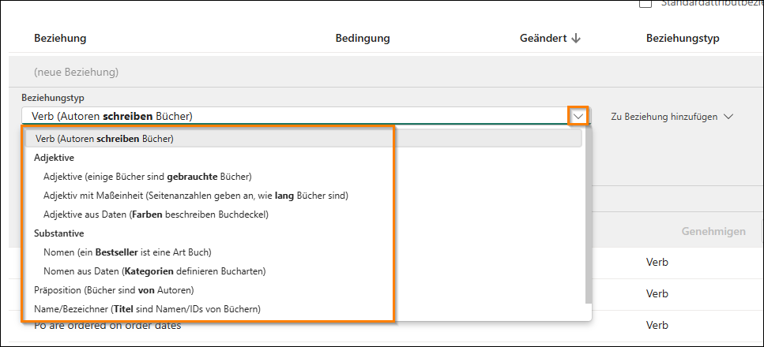

12. In dieser Übung werden Sie keine Beziehungen im Modell erstellen. Ähnlich wie beim Hinzufügen von Synonymen ist dies ein aufwendiger Prozess, der Aktualisierungen und Pflege erfordert, da es immer neue Erkenntnisse gibt, wie Benutzer die Daten mit Copilot abfragen und wie das linguistische Schema zur Verbesserung der Ergebnisse eingesetzt werden kann. Fügen wir nun eine Beziehung hinzu, um unser Modell zu verbessern.

    **ℹ️ Wichtig**

    **Beziehungen im linguistischen Schema legen fest, wie Copilot in Antwort auf Aufforderungen in natürlicher Sprache Verbindungen zwischen Tabellen versteht.** Sie bestimmen, wie Aufgaben wie „Umsatz nach Produktkategorie“ oder „Bestellungen nach Region“ interpretiert werden. Ohne klare Beziehungen kann Copilot Schwierigkeiten damit haben, Konzepte tabellenübergreifend zu verknüpfen. Sie richtig zu definieren sorgt für reibungslosere und intuitivere Unterhaltungen.

13. Schauen wir uns nun die übrigen Elemente im Q&A-Setup an. Wählen Sie als Erstes den Bereich **Q&A-Training** aus.

    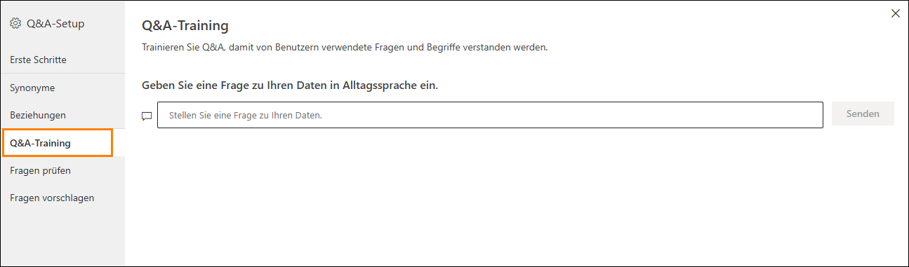

14. Hier können wir Q&A trainieren, Fragen und Begriffe zu verstehen, die Benutzer verwenden könnten.

    Stellen Sie Q&A folgende Frage: **How many sales happen in january?**

    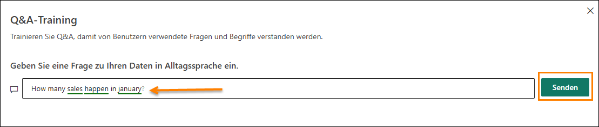

    Wie Sie sehen, führt Copilot „happen“ als unbekannten Begriff auf. Auf diese Weise können Sie weitere Anpassungen vornehmen, damit Fragen wie diese berücksichtigt werden.

    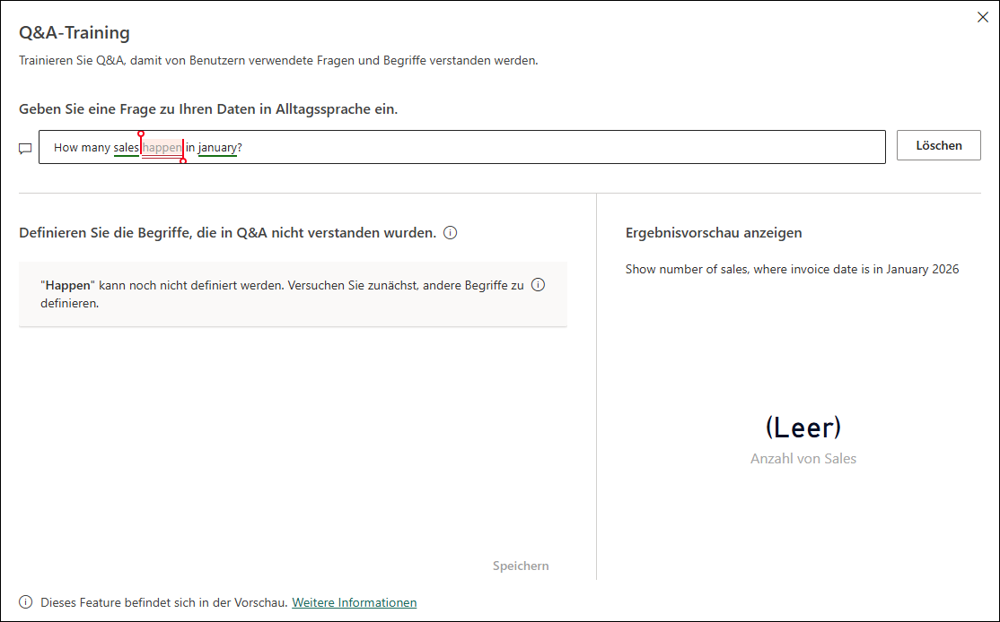

15. Sie können es mit einem anderen Prompt wie „What is the total sales for january 2022?“ versuchen und werden nun Ergebnisse erhalten! Das ist ein toller Testbereich.

    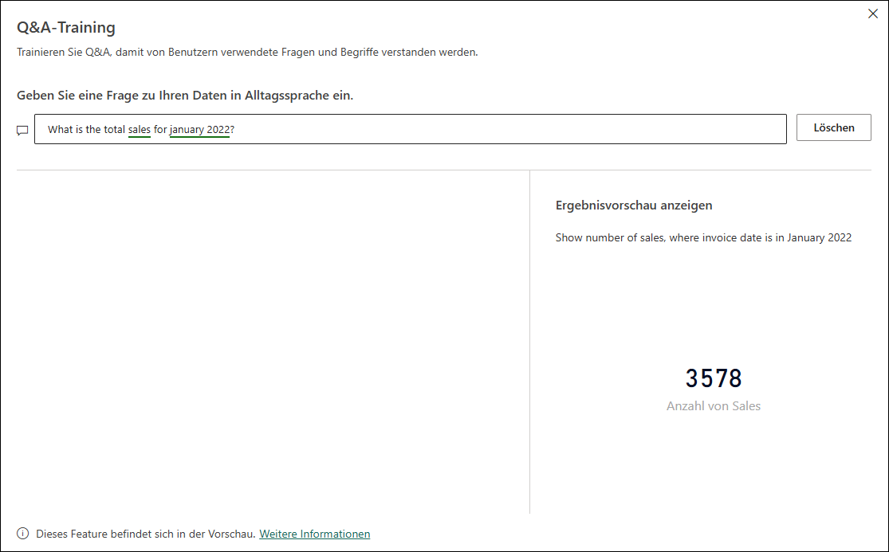

16. Sie können auch die Auswirkungen der Synonyme und Beziehungen sehen: **What is sales by Fabrikam Friends?**

    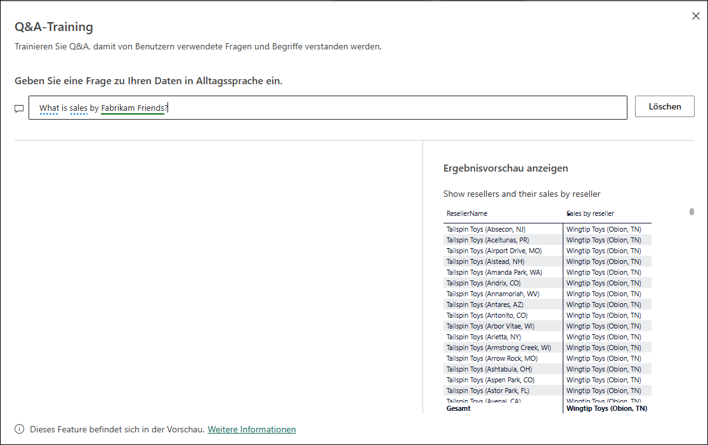

17. Gehen Sie als Nächstes zu **Fragen prüfen**. Hier können Fragen, die innerhalb des Mandanten gestellt wurden, für bessere Ergebnisse in der Zukunft bearbeitet werden.

    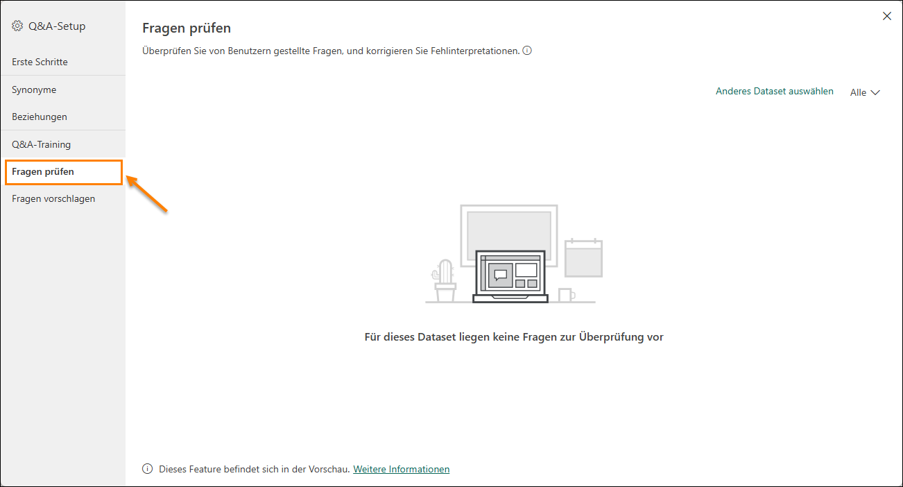

18. Gehen Sie als Letztes zu **Fragen vorschlagen**. Hier können Sie Benutzer beim Untersuchen von Daten helfen, indem Sie Fragen vorschlagen.

    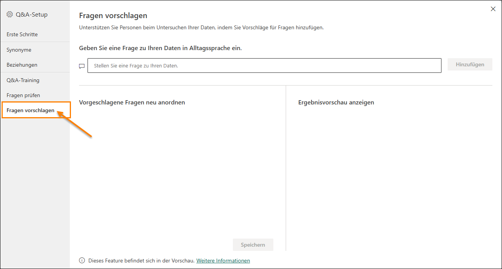

19. Wir möchten die Benutzer unterstützen. Dazu wählen wir das Feld zum Stellen einer Frage zu den Daten aus und fügen einen Vorschlag hinzu: **What is total sales by State?** Klicken Sie anschließend auf „Absenden“, um eine Vorschau zu erhalten.

    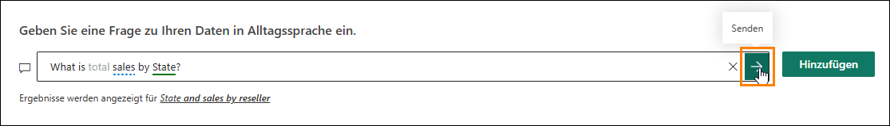

    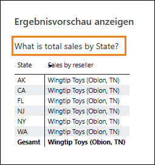

20. Speichern Sie den Vorschlag, indem Sie auf **Hinzufügen** klicken.

    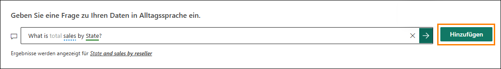

21. **Speichern** Sie Ihre Ergebnisse, und schließen Sie die Übung 2 ab.

    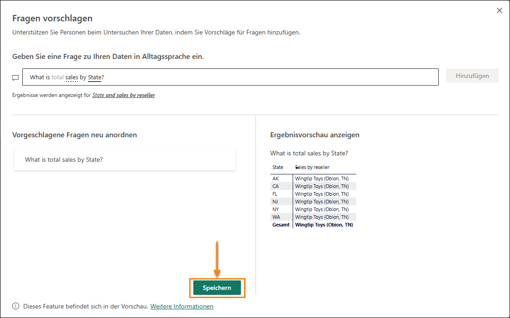

    In dieser Übung haben Sie mehr über bewährte Methoden für die Datenmodellierung erfahren, mit denen sich die Leistung und Genauigkeit der Antworten von Copilot in natürlicher Sprache für semantische Modelle in Power BI verbessern lassen.

    Nachfolgend finden Sie weitere Ressourcen zur Arbeit mit Microsoft Fabric.

    - Zugriff auf alle Informationen in der [Hauptdokumentation von Microsoft Fabric](https://learn.microsoft.com/en-us/fabric/)

    - Fabric bei einer [interaktiven Vorstellung kennenlernen](https://aka.ms/Fabric-GuidedTour)

    - Zur [kostenlosen Testversion von Microsoft Fabric](https://aka.ms/try-fabric) anmelden

    - Besuchen Sie die [Microsoft Fabric-Website](https://aka.ms/microsoft-fabric)

    - Mit den Modulen von [Fabric Learning neue Qualifikationen erwerben](https://aka.ms/learn-fabric)

    - [Kostenloses E-Book zum Einstieg in Fabric lesen](https://aka.ms/fabric-get-started-ebook)

    - Mitglied der [Fabric-Community](https://aka.ms/fabric-community) werden, um Fragen zu stellen, Feedback zu geben und sich mit anderen auszutauschen

    Lesen Sie die ausführlichere technische Dokumentation zu Copilot:

    - [Übersicht über Copilot für Power BI – Power BI | Microsoft Learn](https://learn.microsoft.com/en-us/power-bi/create-reports/copilot-introduction)

    - [Eigenständige Copilot-Umgebung in Power BI (Vorschauversion) – Power BI | Microsoft Learn](https://learn.microsoft.com/en-us/power-bi/create-reports/copilot-chat-with-data-standalone)

    - [Microsoft Fabric Copilot-Admineinstellungen | Microsoft Learn](https://learn.microsoft.com/en-us/fabric/admin/service-admin-portal-copilot)

    - [Erstellung eines Fabric-Daten-Agent (Vorschauversion) – Erfahren Sie, wie Sie einen Fabric-Daten-Agent erstellen | Microsoft Learn](https://learn.microsoft.com/en-us/fabric/data-science/concept-data-agent)

    - [Bewährte Vorgehensweisen bei der Konfiguration Ihres Daten-Agents – Microsoft Fabric | Microsoft Learn](https://learn.microsoft.com/en-us/fabric/data-science/data-agent-configuration-best-practices)

    - [Copilot für Microsoft Fabric und Power BI: (FAQ) – Microsoft Fabric | Microsoft Learn](https://learn.microsoft.com/en-us/fabric/fundamentals/copilot-faq-fabric)

    © 2026 Microsoft Corporation. Alle Rechte vorbehalten.

    Durch Nutzung dieser Demo/Übung erklären Sie sich mit folgenden Bedingungen einverstanden:

    Die in dieser Demo/Übung beschriebene Technologie/Funktionalität wird von der Microsoft Corporation bereitgestellt, um Feedback von Ihnen zu erhalten und Ihnen Wissen zu vermitteln. Sie dürfen die Demo/Übung nur verwenden, um derartige Technologiefeatures und Funktionen zu bewerten und Microsoft Feedback zu geben. Es ist Ihnen nicht erlaubt, sie für andere Zwecke zu verwenden. Es ist Ihnen nicht gestattet, diese Demo/Übung oder einen Teil derselben zu ändern, zu kopieren, zu verbreiten, zu übertragen, anzuzeigen, auszuführen, zu vervielfältigen, zu veröffentlichen, zu lizenzieren, zu transferieren oder zu verkaufen oder aus ihr abgeleitete Werke zu erstellen.

    DAS KOPIEREN ODER VERVIELFÄLTIGEN DER DEMO/ÜBUNG (ODER EINES TEILS DERSELBEN) AUF EINEN/EINEM ANDEREN SERVER ODER SPEICHERORT FÜR DIE WEITERE VERVIELFÄLTIGUNG ODER VERBREITUNG IST AUSDRÜCKLICH UNTERSAGT.

    DIESE DEMO/ÜBUNG BIETET BESTIMMTE SOFTWARETECHNOLOGIE/PRODUKTFUNKTIONEN UND FUNKTIONALITÄT, EINSCHLIESSLICH MÖGLICHER NEUER FUNKTIONEN UND KONZEPTE, IN EINER SIMULIERTEN UMGEBUNG OHNE KOMPLEXE EINRICHTUNG ODER INSTALLATION FÜR DEN BESCHRIEBENEN ZWECK OBEN. DIE IN DIESER DEMO/ÜBUNG DARGESTELLTEN TECHNOLOGIEN/KONZEPTE STELLEN MÖGLICHERWEISE NICHT DIE VOLLSTÄNDIGE FUNKTIONALITÄT DER FUNKTION DAR UND FUNKTIONIEREN MÖGLICHERWEISE NICHT SO, WIE EINE ENDGÜLTIGE VERSION FUNKTIONIEREN KÖNNTE. UNTER UMSTÄNDEN VERÖFFENTLICHEN WIR AUCH KEINE ENDGÜLTIGE VERSION DERARTIGER FEATURES ODER KONZEPTE. IHRE ERFAHRUNG BEI DER VERWENDUNG DERARTIGER FEATURES UND FUNKTIONEN IN EINER PHYSISCHEN UMGEBUNG KANN FERNER ABWEICHEND SEIN.

    **FEEDBACK.** Wenn Sie Feedback zu den Technologiefeatures, Funktionen und/oder Konzepten geben, die in dieser Demo/Übung beschrieben werden, gewähren Sie Microsoft das Recht, Ihr Feedback in jeglicher Weise und für jeglichen Zweck kostenlos zu verwenden, zu veröffentlichen und gewerblich zu nutzen. Außerdem treten Sie Dritten kostenlos sämtliche Patentrechte ab, die erforderlich sind, damit deren Produkte, Technologien und Dienste bestimmte Teile einer Software oder eines Dienstes von Microsoft, welche/welcher das Feedback enthält, verwenden oder eine Verbindung zu dieser/diesem herstellen können. Sie geben kein Feedback, das einem Lizenzvertrag unterliegt, aufgrund dessen Microsoft Drittparteien eine Lizenz für seine Software oder Dokumentation gewähren muss, weil wir Ihr Feedback in diese aufnehmen. Diese Rechte bestehen nach Ablauf dieser Vereinbarung fort.

    DIE MICROSOFT CORPORATION LEHNT HIERMIT JEGLICHE GEWÄHRLEISTUNGEN UND GARANTIEN IN BEZUG AUF DIE DEMO/ÜBUNG AB, EINSCHLIESSLICH ALLER AUSDRÜCKLICHEN, KONKLUDENTEN ODER GESETZLICHEN GEWÄHRLEISTUNGEN UND GARANTIEN DER HANDELSÜBLICHKEIT, DER EIGNUNG FÜR EINEN BESTIMMTEN ZWECK, DES RECHTSANSPRUCHS UND DER NICHTVERLETZUNG VON RECHTEN DRITTER. MICROSOFT MACHT KEINERLEI ZUSICHERUNGEN BZW. ERHEBT KEINERLEI ANSPRÜCHE IM HINBLICK AUF DIE RICHTIGKEIT DER ERGEBNISSE UND DES AUS DER VERWENDUNG DER DEMO/ÜBUNG RESULTIERENDEN ARBEITSERGEBNISSES BZW. BEZÜGLICH DER EIGNUNG DER IN DER DEMO/ÜBUNG ENTHALTENEN INFORMATIONEN FÜR EINEN BESTIMMTEN ZWECK.

    **HAFTUNGSAUSSCHLUSS**

    Diese Demo/Übung enthält nur einen Teil der neuen Features und Verbesserungen in Microsoft Power BI. Einige Features können sich unter Umständen in zukünftigen Versionen des Produkts ändern. In dieser Demo/Übung erhalten Sie Informationen über einige, aber nicht über alle neuen Features.
