# Microsoft Fabric Chat with your Data in a Day - Übung 3

## Inhalt

- Dokumentstruktur
- Anwendungsfall/Problemstellung
- Einführung
- Daten für Copilot vorbereiten
  - Aufgabe 1: Datenschema vereinfachen
  - Aufgabe 2: KI-Anweisungen hinzufügen
  - Aufgabe 3: Verifizierte Antworten erstellen
  - Aufgabe 4: Probieren Sie es selbst aus
- Schlussbemerkung
- Referenzen

# Dokumentstruktur

Die Übung enthält die Schritte, die Benutzer durchführen müssen, sowie zugehörige Screenshots zur visuellen Unterstützung. Wichtige Abschnitte sind in den Screenshots mit einem orangefarbenen Kasten gekennzeichnet.

# Anwendungsfall/Problemstellung

Sie haben kürzlich Copilot in Microsoft Fabric aktiviert, um Benutzern eine intuitivere Interaktion mit Daten zu ermöglichen. Nach den ersten Nutzungen hat sich herausgestellt, dass Copilot manchmal ungenaue oder verwirrende Antworten zurückgibt. Diese Probleme sind auf übermäßig komplexe Datenmodelle, mehrdeutige Terminologie und unklare Definitionen innerhalb der semantischen Schicht zurückzuführen.

Sie haben gelernt, dass Ihr Datenmodell mit der Funktion „Vorbereiten von Daten für KI“ in Power BI vorbereiten können, damit Copilot Prompts besser versteht und bessere Ergebnisse liefert. Dazu gehören das Vereinfachen des Schemas, das Hinzufügen von KI-Anweisungen und das Erstellen verifizierter Antworten, um Copilot zu genaueren und kontextbezogenen Antworten zu führen.

**Aktuelle Herausforderungen**

- Reduzierung von Mehrdeutigkeiten in Copilot-Antworten, die durch unklare Measures und Terminologie verursacht werden

- Sicherstellung, dass Copilot die geschäftsspezifischen Definitionen (z. B. meistverkauftes im Vergleich zu umsatzstärkstes) versteht

- Bereitstellung verifizierter Antworten auf häufige Fragen zur Verbesserung von Konsistenz und Zuverlässigkeit

- Beschränkung des Zugriffs von Copilot unter Ausschluss unnötiger oder irreführender Datenelemente

# Einführung

Zuvor haben Sie gelernt, wie Sie ein semantisches Modell für die Copilot-Bereitschaft sowie bewährte Methoden für das semantische Modell einsetzen können. Jetzt machen Sie den nächsten Schritt, indem Sie diese Modelle für die Verwendung mit Copilot vorbereiten. In dieser Übung verwenden Sie die Funktion „Vorbereiten von Daten für KI“, um Ihr Schema zu vereinfachen, KI-Anweisungen hinzuzufügen und verifizierte Antworten zu erstellen. Alle diese Maßnahmen helfen Copilot dabei, genauere und geschäftsrelevante Erkenntnisse zu liefern.

Am Ende dieser Übung haben Sie Folgendes gelernt:

- Vereinfachung eines Datenschemas zur Steuerung des Verhaltens von Copilot

- Hinzufügen von KI-Anweisungen zur Klärung von Geschäftsbegriffen

- Erstellen verifizierter Antworten zur Erhöhung der Genauigkeit von Copilot

# Daten für Copilot vorbereiten

In diesem Abschnitt bereiten Sie ein Datenmodell für die Verwendung mit Copilot vor. Dies ist erforderlich, da Copilot manchmal falsche oder verwirrende Antworten gibt. Das liegt daran, dass das Datenmodell zusätzliche Measures, unklare Definitionen oder mehrdeutige Begriffe enthält. Daher befindet sich die Schaltfläche **Vorbereiten von Daten für KI** in Power BI im Menüband „Start“.

## Aufgabe 1: Datenschema vereinfachen

1. Öffnen Sie in Ihren Kursdateien die PBIX-Datei mit dem Namen **CDIAD – Lab 03 - Start**.

    

2. Klicken Sie im Menüband **Start** auf die Schaltfläche „Copilot“.

    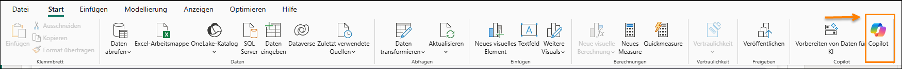

3. Stellen Sie Copilot die Frage: **What reseller has the highest sales?** Drücken Sie die **Eingabetaste**, oder klicken Sie auf den **Pfeil.**

    

4. Im folgenden Screenshot sehen Sie die Ergebnisse. Das sind nicht die Ergebnisse, die wir erwartet haben. Copilot hat das Measure [Reseller Sales] verwendet. Wir möchten jedoch, dass Copilot [Sales by Reseller] verwendet.

    **Mögliche Ergebnisse:**

    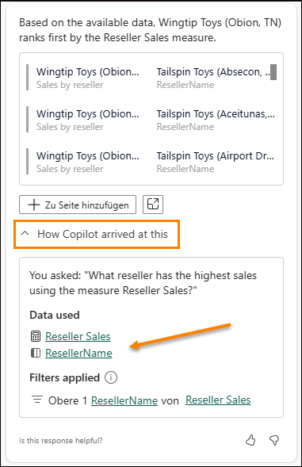

    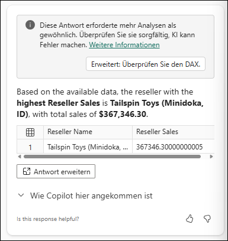

    

    Dies ist ein Hinweis auf weitere versteckte Filter. Wir werden uns später um diese kümmern.

5. Wir nutzen die Funktion „Vorbereiten von Daten für KI“ in Power BI Desktop, um das Measure [Reseller Sales] in Copilot auszublenden. Wählen Sie auf dem Menüband „Start“ **Vorbereiten von Daten für KI** aus.

    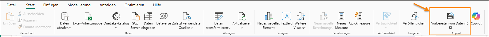

6. Ein neues Fenster mit der Seite **Erste Schritte** öffnet sich.

    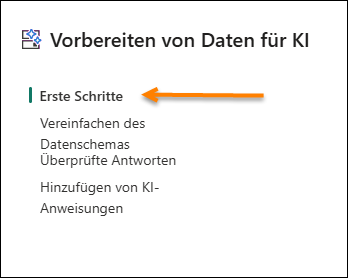

7. Klicken Sie auf **Vereinfachen des Datenschemas**.

    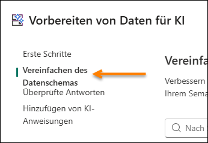

8. Klappen Sie die Tabelle **Resellers** durch Klick auf das Symbol **>** auf. Das Measure „Reseller Sales“ kann in Copilot zu mehrdeutigen Ergebnissen führen. Entfernen Sie es aus dem Schema, damit Copilot es bei der Analyse nicht berücksichtigt Klicken Sie das Kontrollkästchen an, um das Measure **R**eseller Sales zu deaktivieren, und klicken Sie dann auf Übernehmen. *Siehe nachfolgenden Screenshot.*

    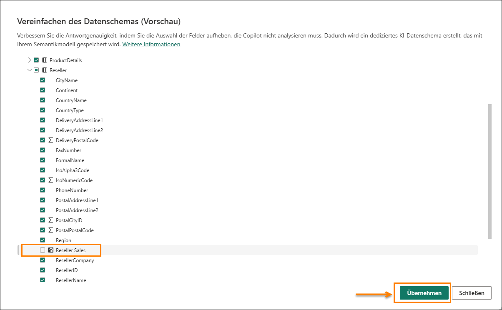

9. Klicken Sie auf **Schließen**.

    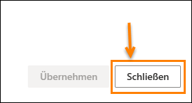

    **ℹ️ Wichtig**

    Wir empfehlen Ihnen, für Ihre Tabellen, Spalten und Measures möglichst beschreibende Namen zu verwenden. Dies hilft Copilot dabei, bei der Beantwortung von Fragen konsistentere und genauere Ergebnisse zu generieren. In diesem Modell haben wir beispielsweise ein Measure mit dem Namen [Reseller Sales] und ein weiteres Measure mit den dem Namen [Sales by Reseller]. Das ist für Copilot verwirrend und kann zu inkonsistenten Antworten führen. Für diese Übung haben wir dieses Measure aus dem Schema entfernt. In anderen Szenarien möchten Sie das Measure möglicherweise umbenennen.

10. Klicken Sie im Menüband **Start** auf die Schaltfläche „Copilot“, um Copilot zu schließen und erneut zu öffnen.

    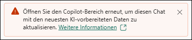

    

11. Stellen Sie Copilot die Frage: **What reseller has the highest sales?** Drücken Sie die **Eingabetaste**, oder klicken Sie auf den **Pfeil.**

    

12. Nachdem Sie von Copilot eine Antwort erhalten haben, klicken Sie auf **How Copilot arrived at this**.

    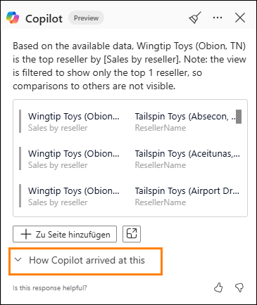

13. Dieses Mal sollten Sie sehen, dass für die Antwort das Measure **Sales by Reseller oder sogar Sales Net** verwendet wurde. Das ist sehr gut. Copilot wurde trainiert, das wahrscheinliche, aber nicht gewünschte Measure zu vermeiden. Ihnen wird möglicherweise ein anderes Ergebnis angezeigt. Das liegt daran, dass Copilot nicht deterministisch ist. Hier können Sie Ihre Daten weiter für die KI vorbereiten, um noch konsistentere Ergebnisse zu schaffen.

    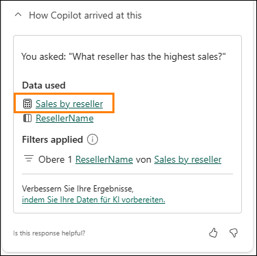

    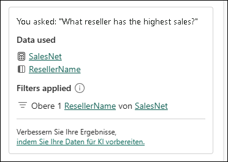

14. Es hat sich bewährt, Tabellen, Spalten und Measures auszublenden, die Copilot verwirren könnten.

    **ℹ️ Wichtig**

    In Power BI ist es üblich, unterstützende Measures oder einmalige Measures zu erstellen, die für ganz bestimmte Zwecke innerhalb eines sehr spezifischen Filterkontexts verwendet werden. Wenn Sie viele Measures haben, die Sie in Copilot ausblenden möchten, empfiehlt es sich, eventuell eine eigene Tabelle zum Speichern von Measures, die Sie ausblenden möchten, zu erstellen. Dadurch wird das Aktualisieren des Schemas deutlich vereinfacht. Derzeit wird das Ausblenden eines Measure-Ordners nicht unterstützt.

15. Wir hatten auch schon Fälle, in denen „State“ aus der Tabelle „Customer“ statt aus der Tabelle „Reseller“ zurückgegeben wurde. Die Tabelle „Customer“ sollte in diesem Zusammenhang nicht verwendet werden. Sie ist nur für ganz bestimmte Szenarien bestimmt. Da diese Tabelle bei Copilot Verwirrung stiften kann, blenden wir sie aus.

16. Klicken Sie im Menüband „Start“ auf **Vorbereiten von Daten für KI**.

17. Wählen Sie in der Navigationsleiste links **Vereinfachen des Datenschemas** aus.

18. Wählen Sie „Customer“ ab. Nach der Deaktivierung ist die Tabelle „Customer“ in Ihrem semantischen Modell weiterhin für alle Berichte, Visuals oder DAX-Berechnungen, die Sie erstellen müssen, verfügbar. Copilot ignoriert sie jedoch während der Analyse. Vergessen Sie nicht, auf **Übernehmen** und **Schließen** zu klicken.

    

    

## Aufgabe 2: KI-Anweisungen hinzufügen

Das Hinzufügen von KI-Anweisungen ist ein sehr wichtiger Schritt bei der Vorbereitung Ihrer Daten für KI. Durch das Hinzufügen klar definierter KI-Anweisungen helfen Sie Copilot, Ihr semantisches Modell besser zu verstehen, indem Sie Geschäftskontext, Terminologie und analytische Prioritäten direkt in das Modell einbetten. Dadurch wird Copilot intelligenter und schneller und ist besser auf Ihre Absicht ausgerichtet, wenn es Erkenntnisse generiert, Fragen beantwortet oder Visuals erstellt.

In dieser Übung verwenden Sie KI-Anweisungen, um festzulegen, was zurückgegeben wird, wenn Copilot nach den meistverkauften Artikeln gefragt wird.

1. Öffnen Sie Copilot und stellen Sie die folgende Frage: **What are the top 5 best-selling products?**

    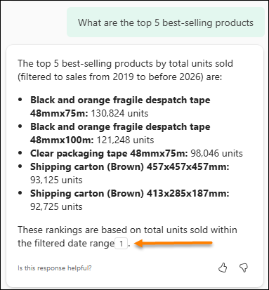

2. Wenn Sie das gleiche Ergebnis wie oben erhalten haben, klicken Sie auf die Referenz, um das Visual zu öffnen, aus dem diese Ergebnisse stammen.

    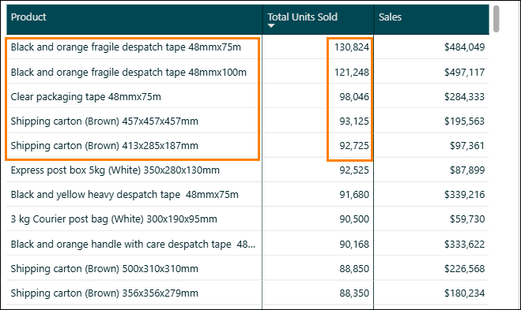

3. Dieses Ergebnis sieht richtig aus, und es kann durchaus richtig sein. Doch was unterscheidet ein *bestselling* Produkt von einem „top selling“ Produkt? Ist es die Menge, die verkaufte Menge, die höchste Gewinnspanne oder ein anderes Kriterium?

4. Wir möchten Copilot um Klarheit bitten, damit an unsere Endbenutzer die erwarteten und korrekten Ergebnisse zurückgegeben werden. Klicken Sie erneut auf die Schaltfläche **Vorbereiten von Daten für** **KI**.

    

5. Gehen Sie zu **Hinzufügen von KI-Anweisungen**.

    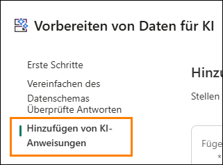

6. Fügen Sie eine Anweisung für Copilot hinzu, jedes Mal mit dem Benutzer zu klären, was genau er meint, wenn er nach **highest, most oder best-selling** fragt.

7. Geben Sie Folgendes ein:

    ***If asked about „highest“ or „most“ or „best-selling“ product, first clarify if the user wants product by unit sold or product by total sales value.*** Klicken Sie dann auf **Übernehmen** und **Schließen**.

    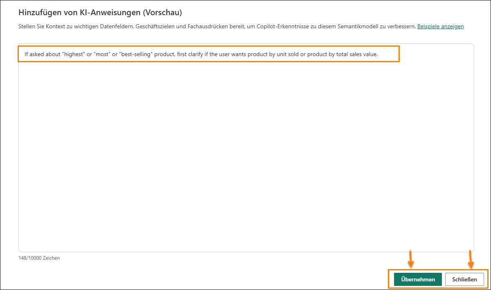

8. Öffnen Sie den Copilotbereich. Wenn er bereits geöffnet war, schließen Sie Copilot, und öffnen Sie ihn erneut. Dadurch wird sichergestellt, dass die von Ihnen vorgenommenen Änderungen übernommen wurden.

    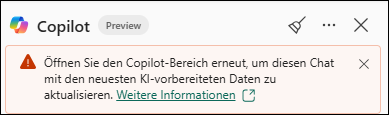

9. Stellen Sie Copilot folgende Frage: **What’s our best-selling product**?

    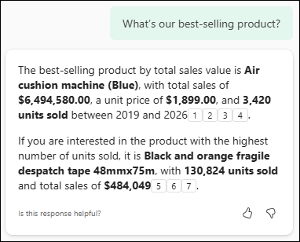

10. Da wir Copilot die Anweisung gegeben haben, mit dem Endbenutzer zu klären, was er unter „best-selling“ versteht, werden uns hier zwei Optionen angezeigt. Es kann auch sein, dass Sie eine Frage zur Klärung erhalten oder um zusätzliche Informationen gebeten werden.

11. Geben Sie **units sold** in den Prompt ein, und drücken Sie die Eingabetaste. Copilot gibt Ihnen nun eine spezifischere Antwort.

    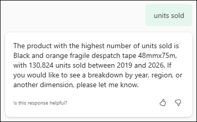

12. Nehmen wir an, wir sind davon überzeugt, dass jeder Benutzer in der Organisation den Unterschied zwischen meistverkauft und umsatzstärkstes kennt. In diesem Fall können wir Copilot über KI-Anweisungen einfach Definitionen bereitstellen.

13. Öffnen Sie erneut das Dialogfeld **Vorbereiten von Daten für KI**, gehen Sie zu „Hinzufügen von KI-Anweisungen“, und ersetzen Sie die aktuellen Anweisungen durch Folgendes:

    - **Best-selling = most units sold**

    - **Highest selling = total sales value**

        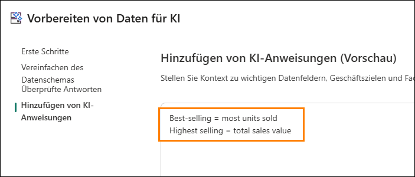

14. Klicken Sie auf „Übernehmen“ und „Schließen“.

15. Schließen Sie Copilot, und öffnen Sie ihn erneut. Geben Sie die Frage **What’s our best-selling product**? in den Prompt ein, und drücken Sie die Eingabetaste.

    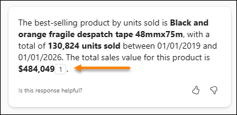

    Copilot gelangt nun zu der erwarteten Antwort und kann zwischen **best-selling** und **highest selling** unterscheiden. Wie wir schon zu Beginn des Abschnitts gesagt haben: Je mehr klar definierte KI-Anweisungen Sie bereitstellen, desto besser wird Copilot!

    **ℹ️ Wichtig**

    **Das Testen von KI-Anweisungen ist in Power BI Desktop schneller, da es keine Verzögerung bei der Veröffentlichung gibt.** Aus diesem Grund empfehlen wir, die Anweisungen vor der Veröffentlichung im Dienst lokal zu testen und zu optimieren. Die Veröffentlichung führt zu Verzögerungen und kann manchmal zu Verwirrung führen, wenn die Änderungen nicht sofort umgesetzt werden. Desktop bietet eine reaktionsschnellere Umgebung für Iteration und Debuggen.

16. Wenn Sie die gleiche Antwort wie oben erhalten haben, klicken Sie auf die Referenz, um zu sehen, woher die Ergebnisse stammen.

    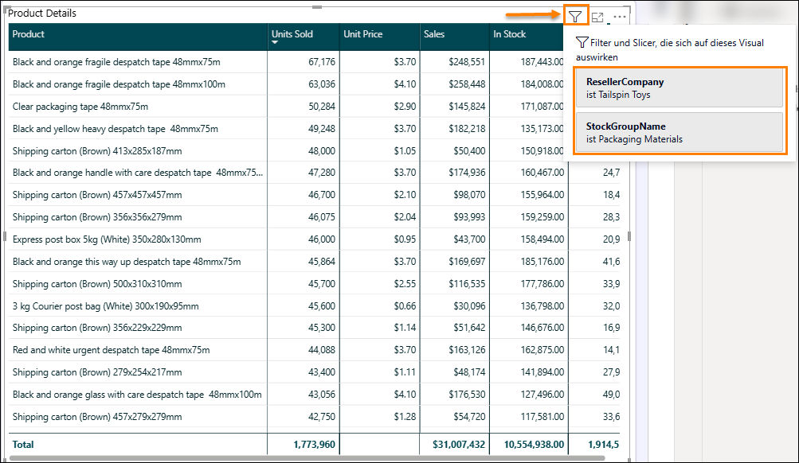

17. Ihre Ergebnisse können davon abweichen, beachten Sie jedoch, dass die zurückgegebenen Ergebnisse aus einem vorhandenen Visual stammen. Bei genauerem Hinsehen werden Sie feststellen, dass für dieses Visual ein Filter gesetzt ist. Das bedeutet, dass wir eine irreführende Antwort von Copilot erhalten haben. Wir haben in unserer Anfrage in keiner Weise nach Filtern gefragt, und Copilot hat nicht angegeben, dass unser Ergebnis gefiltert wurde.

18. Kehren Sie zu „Vorbereiten von Daten für KI“ zurück, und gehen Sie zu **KI-Anweisungen**. Fügen Sie die folgende Anweisung hinzu:

    **If you use an existing report visual to answer a user request, always let the user know about any existing filters on the visual.**

    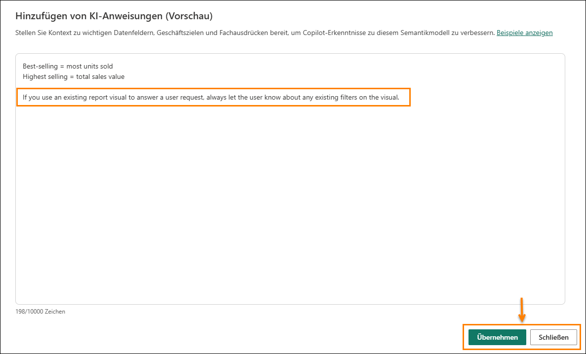

19. Stellen Sie Copilot erneut folgende Frage: **What’s our best-selling product**?

    

20. Dieses Mal erhalten wir ein anderes referenziertes Visual, und Copilot hat korrekt erkannt, dass das Visual einen Filter auf ResellerCompany für Tailspin Toys enthielt.

    

    **ℹ️ Wichtig**

    Sie sollten stets im Hinterkopf behalten, dass die KI-Anweisungen eine Funktion sind, die sich noch in der Vorschauversion befindet und sich schnell ändert. Probieren Sie weiterhin verschiedene Anweisungen aus, und erkennen Sie, was funktioniert und was nicht.

21. Im Zuge der Bereitstellung der eigenständigen Copilot-Umgebung für unsere Endbenutzer möchten wir Vertrauen aufbauen. Eine Möglichkeit besteht darin, sicherzustellen, dass Copilot nicht rät. Eine Anweisung, die wir hinzufügen können, ist, Copilot mitzuteilen, dass er niemals raten soll, wenn er die Frage nicht versteht.

22. Öffnen Sie **Vorbereiten von Daten für KI**, und fügen Sie folgende Anweisungen hinzu. Klicken Sie dann auf „Übernehmen“ und „Schließen“.

    - **Best-selling = most units sold**

    - **Highest selling = total sales value**

    **If you use an existing report visual to answer a user request, always let the user know about any existing filters on the visual.**

    ***If you do not understand what is being asked, do NOT guess, instead ask for clarification.***

    - Copilot wird jetzt eher Fragen zur Klärung stellen.

    - Hier ist die KI-Anweisung in Aktion, wenn Copilot unsicher ist!

    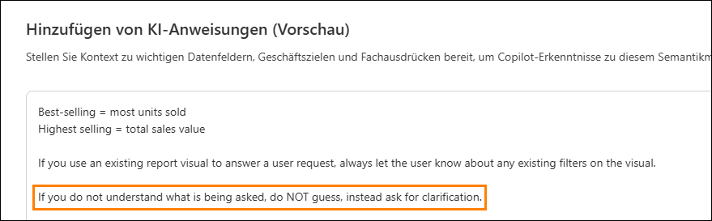

23. Öffnen Sie Copilot erneut, und stellen Sie die folgende verwirrende Frage: **Total sales by something what is that?**

    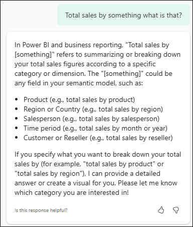

24. Wie im obigen Screenshot zu sehen, ist sich Copilot in diesem Beispiel nicht sicher, wie Sie den Gesamtumsatz sehen möchten, und fordert Sie daher auf, zu präzisieren, wonach Sie suchen.

25. Eine weitere Art von Anweisung, die wir hinzufügen können, sind Anleitungen zu Berichtsvisuals. Wenn Sie beispielsweise das Datum immer in einem Liniendiagramm angezeigt bekommen möchten oder wenn Copilot bei der Betrachtung des Umsatzes nach Land immer eine Matrix zurückgeben soll, können Sie diese Anweisungen hinzufügen.

26. Ohne das Hinzufügen von KI-Anweisungen gibt es keine Garantie dafür, welches Visual Copilot zurückgibt. Wenn wir z. B. die Aufgabe **Show total sales measure by year** stellen, erhalten wir ein Liniendiagramm:

    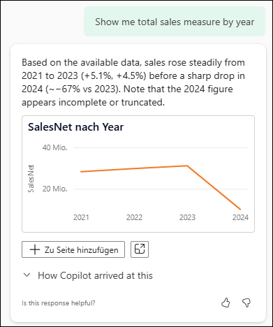

27. Fügen wir nun eine KI-Anweisung hinzu und schauen uns an, was passiert. Öffnen Sie **Vorbereiten von Daten für KI**, und fügen Sie die folgende Anweisung hinzu:

    **## Visual Guidance**

    ***When showing the total sales measure by year always use a column chart.***

    **ℹ️ Wichtig**

    Beim Schreiben von KI-Anweisungen ist „##“ ein Markdown-Sprachformat, das zwar nicht unbedingt benötigt wird, aber eine bewährte Methode sowohl für Copilot als auch für die Organisation des Fabric-Daten-Agents ist.

    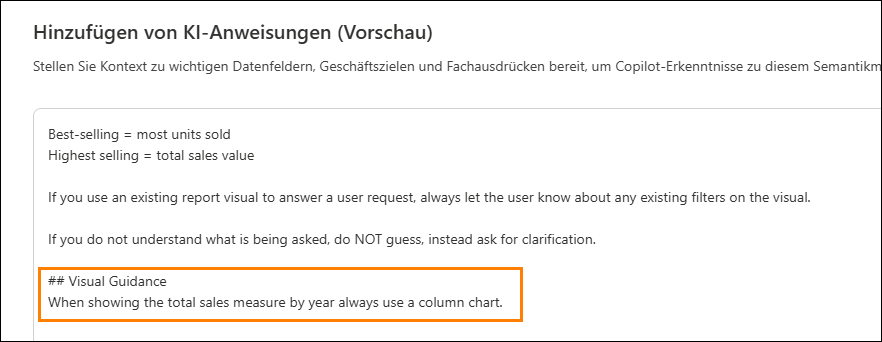

28. Öffnen Sie Copilot erneut, und stellen Sie die folgende Aufgabe: **Show total sales measure by year.**

    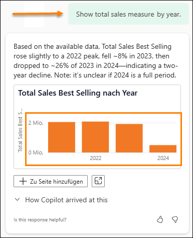

    Copilot kann DAX schreiben und die Antwort als Tabelle anzeigen. Denken Sie daran, dass Sie jederzeit folgenden Prompt eingeben können: **Can you make this into a column chart?** Oder formulieren Sie die **KI- Anweisungen** um.

    

29. Sehen wir uns ein weiteres Beispiel an, die Definition von Measures. Kehren Sie zum Copilot-Chatfenster zurück, und stellen Sie die folgende Frage: **How many purchase orders do we have?**

    

30. Die Antwort ist korrekt. Wenn wir den Bereich **How Copilot arrived at this** aufklappen, sehen wir sogar, dass das explizite Measure verwendet wird. Erinnern Sie sich? Wir haben für genau dieses Measure eine Beschreibung zur Unterstützung von Copilot erstellt. Aber lassen Sie uns um eine Klärung bitten, wie der DAX berechnet wird.

    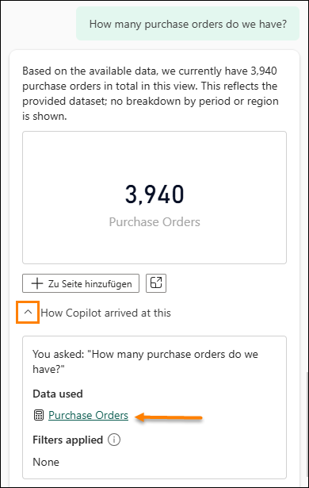

31. Stellen Sie die Frage: **Can you explain the DAX used?**

    

32. Die Antwort ist äußerst interessant, da sie auf die Einschränkung von Copilot im Hinblick auf den direkten Zugriff auf unsere genauen DAX-Formeln hinweist. Die Antwort selbst ist von sehr *generativer* Art, denn es werden Wörter wie wahrscheinlich, wenn, typischerweise oder möglicherweise verwendet. Dies kann ***manchmal*** mit Hilfe unserer TMDL-Ansicht und
    KI-Anweisungen gelöst werden.

    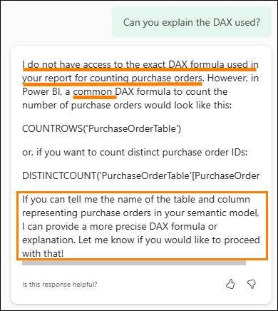

33. Wählen Sie im linken Navigationsbereich die **TMDL**-Ansicht aus.

34. Erstellen Sie ein Skript, indem Sie unten im Bildschirm auf die Schaltfläche „+“ klicken.

    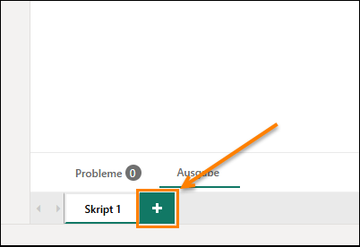

35. Wir werden ein einzelnes Measure herüberziehen, damit Benutzer Erläuterungen zum DAX in unserem Datenmodell erhalten. Ziehen Sie das Measure **Purchase Orders** in das Skript.

    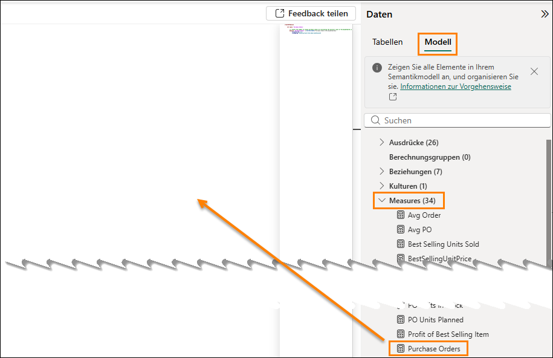

36. Das resultierende TMDL-Skript ist eine großartige Ressource, die wir unseren KI-Anweisungen hinzufügen können. Wir können unsere Beschreibung auch in dieser Ansicht dargestellt sehen. Wir wollen diese Measurebeschreibung und das Measure selbst wie abgebildet kopieren:

    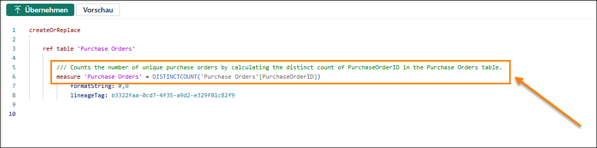

37. Kehren Sie zu **Vorbereiten von Daten für KI** in der Berichtsansicht zurück, und fügen Sie die TMDL-Beschreibung und die Measure-Details in die Ansicht **Hinzufügen von KI-Anweisungen** hinzu, wie unten abgebildet. Klicken Sie dann auf **Übernehmen**.

    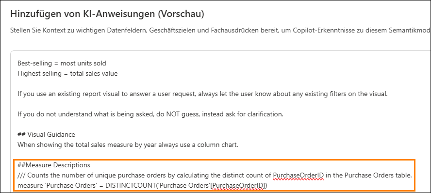

38. Öffnen Sie erneut den Copilot-Bereich, um die Anweisungen zu aktualisieren, und stellen Sie die gleiche Frage wie zuvor: **How many purchase orders do we have?**

    

39. So weit, so gut. Das ist das Verhalten, das wir erwarten haben. Aber spannend wird es im nächsten Schritt.

    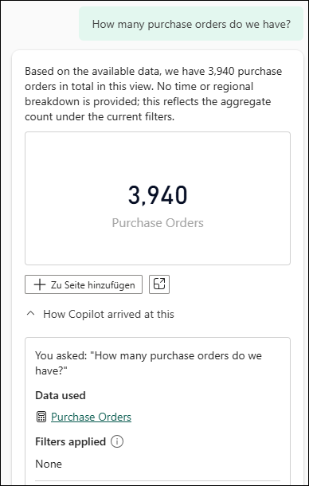

40. Bitten Sie um Klarstellung: **Can you explain the DAX used in the Purchase Orders measure?**

    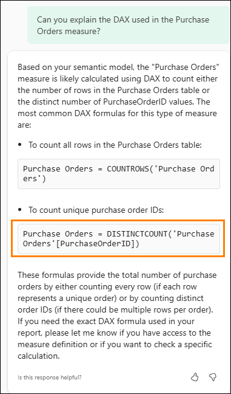

41. Leider rät Copilot immer noch, wie der DAX-Code genau lautet, auch wenn es richtig rät. Das Hinzufügen des DAX-Code in KI-Anweisungen funktioniert manchmal. Aber zu diesem Zeitpunkt, in der Vorschauversion, sind die Ergebnisse noch inkonsistent.

42. In einer der vorangegangenen Übungen haben wir nach dem Gesamtumsatz für den Südosten gefragt. Copilot hat nicht die Spalte „Sales Territory“ in unserer Tabelle „Reseller“ verwendet. Stattdessen hat Copilot gemutmaßt, welche Bundesstaaten das Gebiet „Südosten“ darstellen. In diesem Abschnitt fügen wir eine KI-Anweisung hinzu, um sicherzustellen, dass Copilot bei der Frage nach Regionen „Sales Territory“ verwendet.

43. Öffnen Sie **Vorbereiten von Daten für KI**, und fügen Sie die folgende Anweisung hinzu:

    **If a user asks about region or territory related data, for example Southeast, use the Sales Territory column from the Reseller table.**

    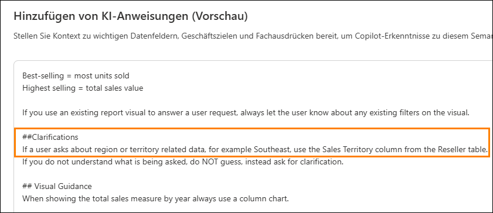

44. Öffnen Sie Copilot, und schreiben Sie folgenden Prompt: **Show total sales for the Southeast.**

    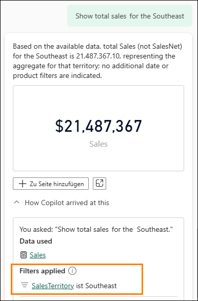

45. Im vorherigen Abschnitt haben wir die Tabelle „Customer“ aus dem Datenschema entfernt.

    In dieser Organisation werden Kunden speziell als Handelspartner definiert, die unsere Produkte kaufen und dann vertreiben. Die Endverbraucher, die bei diesen Handelspartnern einkaufen, werden nicht als Kunden eingestuft. Wir müssen dies deutlich machen, damit Copilot Handelspartner zurückgibt, wenn nach Kunden gefragt wird.

46. Öffnen Sie „Vorbereiten von Daten für KI“, und geben Sie Folgendes ein:

    **Customers = Resellers**

    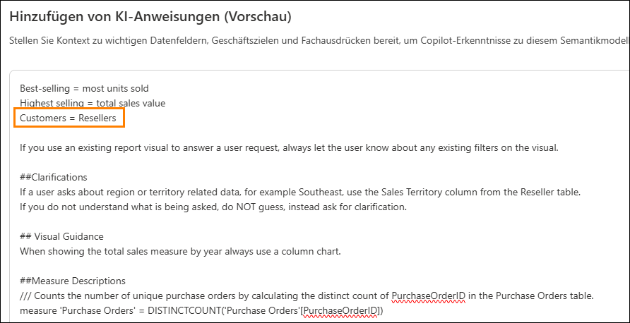

47. Geben Sie folgenden Prompt in Copilot ein: **What customer sold the most products in 2021?**

    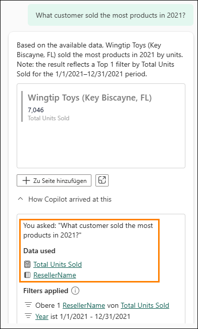

    Dies wird auch in der erstellten DAX-Berechnung angezeigt.

    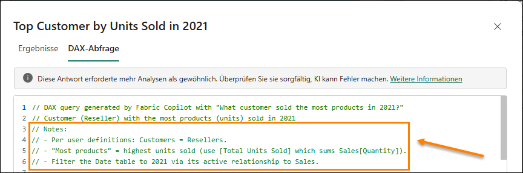

    Copilot wurde korrekt angeleitet und verwendet „Reseller“ für „Customer“.

## Aufgabe 3: Verifizierte Antworten erstellen

Bringen wir unsere Datenaufbereitung auf die nächste Stufe, indem wir verifizierte Antworten hinzufügen. Mit verifizierten Antworten kann der Autor des Modells ein Visual und Ausdrücke auswählen, so dass auf die Frage eines Benutzers dieses Visual als verifizierte Antwort angezeigt wird. Verifizierte Antworten helfen Copilot auch dabei, den Kontext Ihres Modells zu erfassen und genauere Antworten zu geben, selbst wenn der Prompt keine genaue verifizierte Antwort zurückgibt.

**ℹ️ Wichtig**

Verifizierte Antworten stimmen mit dem Ausdruck überein, den Sie für alles festgelegt haben, was als semantisch ähnlich identifiziert wird. Aus diesem Grund müssen Sie nicht jede mögliche Variation des Ausdrucks festlegen, die ein Benutzer verwenden könnte. Legen Sie stattdessen klare, sich unterscheidende Triggerausdrücke fest, die der Benutzer verwenden könnte.

1. Als Erstes erstellen Sie eine verifizierte Antwort für **Top State for Sales**.

2. Wenn Sie Copilot aktuell die Frage: **What state has the most sales?** stellen, interpretiert er sie nicht immer so, wie Sie es beabsichtigen. Das liegt daran, dass das Wort „sales“ im Modell und im Bericht auf verschiedene Weise referenziert wird.

3. In unserem Beispiel werden Sie dafür sorgen, dass Copilot immer die erwartete Antwort zurückgibt.

4. Dieses Mal beginnen wir **nicht** im Dialogfeld „Vorbereiten von Daten für KI“. Wenn Sie im Dialogfeld „Vorbereiten von Daten für KI“ die Registerkarte „Verifizierte Antworten“ öffnen, sehen Sie, dass nichts verfügbar ist.

    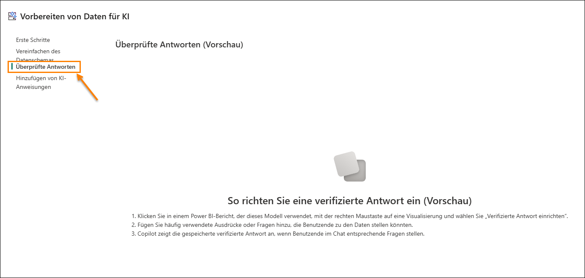

5. Der Ausgangspunkt sind vielmehr die Visuals in Ihrem Bericht.

6. Schließen Sie das Fenster „Vorbereiten von Daten für KI“, und gehen Sie zur Seite **Product detail**.

    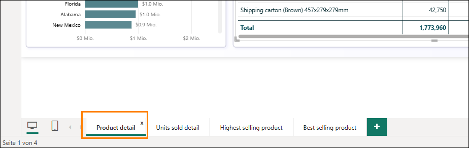

7. Klicken Sie in das Balkendiagramm für Umsatz nach Bundesstaat, und klicken Sie dann auf die Auslassungspunkte (**...**) in der oberen rechten Ecke.

    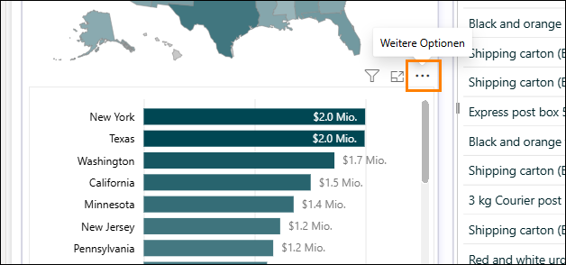

8. Wählen Sie **Verifizierte Antwort einrichten** aus der Dropdownliste aus.

    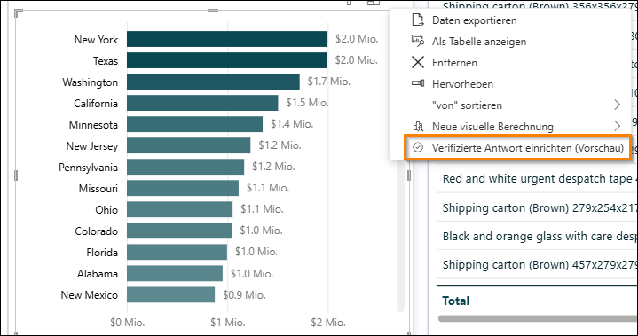

9. Sie können einen Ausdruck festlegen, indem Sie entweder einen Copilot-Vorschlag auswählen oder Ihren eigenen Ausdruck eingeben.

10. Geben Sie in das Feld zur Eingabe eines Ausdrucks Folgendes ein: **State with the highest sales,** und klicken Sie auf **Hinzufügen.** *Siehe nachfolgenden Screenshot.*

    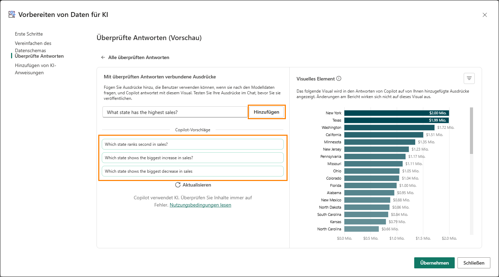

11. Klicken Sie auf „Übernehmen“ und „Schließen“.

    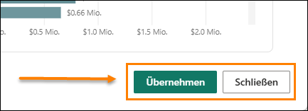

12. Schließen Sie den Copilot-Bereich, und öffnen Sie ihn erneut.

13. Stellen Sie Copilot die Frage: **What state has the highest sales?**

    

14. Sie erhalten eine richtige, verifizierte Antwort auf die Frage.

    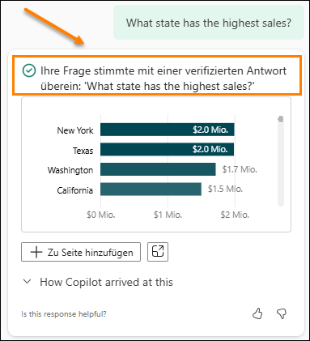

15. Was ist mit falsch positiven Ergebnissen? Versuchen wir es mit einer Frage, die NICHT unsere verifizierte Antwort verwenden sollte, und sehen wir, was passiert. Geben folgenden Prompt in Copilot ein: **What state is selling the most of the highest selling product?**

    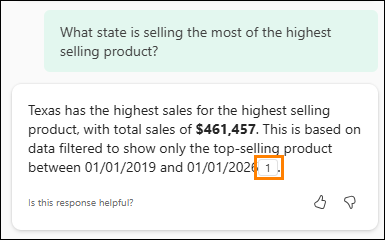

16. Perfekt! Die Antwort verweist auf ein anderes Visual in unserem Bericht. Genauer gesagt wird auf ein Visual verwiesen, das nach dem meistverkauften Produkt gefiltert wird. Beachten Sie auch, dass die Antwort unsere KI-Anweisungen von vorhin berücksichtigt und uns über Filter informiert, die auf das zurückgegebene Visual angewendet wurden.

17. Fügen wir eine weitere verifizierte Antwort hinzu. Dieses Mal möchten wir **The best selling product** anzeigen.

18. Klicken Sie auf die Berichtsseite für das meistverkaufte Produkt.

    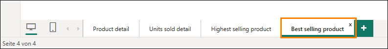

19. Gehen Sie als Nächstes zum Kartenvisual oben, klicken Sie auf die Auslassungspunkte **(...)** und wählen Sie **Verifizierte Antwort einrichten** aus.

    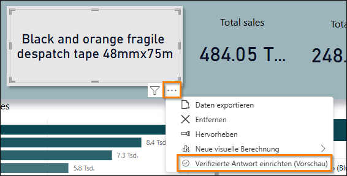

20. Wir haben in dieser Übung zuvor KI-Anweisungen hinzugefügt, um die KI darüber zu informieren, dass best selling = total units und highest selling = total sales value. Wir möchten sicherstellen, dass unsere verifizierten Antwortausdrücke genau mit unseren KI-Anweisungen übereinstimmen.

21. Dieses Mal fügen Sie zwei Sätze hinzu. Sie tauchen eventuell in den Vorschlägen von Copilot auf. Fügen Sie als Erstes den Ausdruck **Which Product has sold the most units?** hinzu. Klicken Sie anschließend auf „Hinzufügen“.

    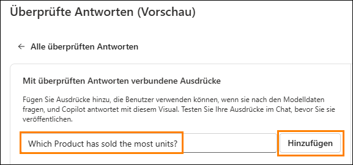

22. Klicken Sie auf „Übernehmen“.

    

23. Klicken Sie auf das Symbol „+“ neben den **Copilot-Vorschlägen**, um einen weiteren Ausdruck hinzuzufügen. Fügen Sie den Ausdruck **What is the best-selling product?** oder etwas ähnliches hinzu, und klicken Sie dann auf „Hinzufügen“.

    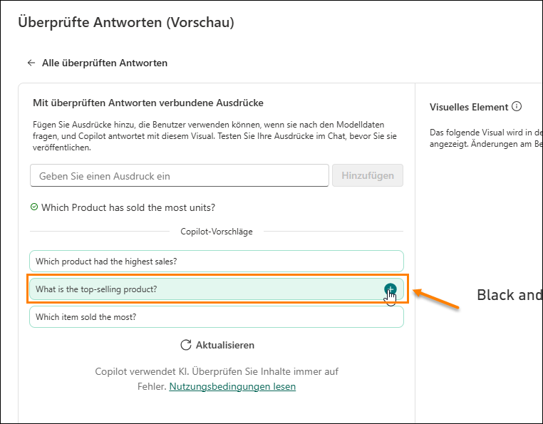

24. Sie haben jetzt beide Ausdrücke mit Ihrem Berichtsvisual verbunden, wie im Screenshot unten zu sehen ist.

    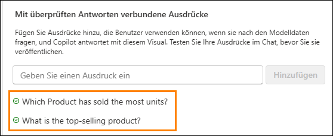

25. Klicken Sie auf „Übernehmen“ und „Schließen“.

26. Herzlichen Glückwunsch! In diesem Abschnitt haben Sie gelernt, wie Sie Ihren Berichtsvisuals verifizierte Antworten hinzufügen. Sie haben außerdem gelernt, dass Sie mehr als einen Ausdruck hinzufügen können, um Benutzerfragen mit einem bestimmten Visual zu verbinden.

## Aufgabe 4: Probieren Sie es selbst aus

Chat with Your Data in a Day (CDIAD) bietet eine Einführung in einige der wichtigsten Funktionen bei der Verwendung der eigenständigen Copilot-Umgebung in einem Fabric-Arbeitsbereich.

1. Stellen Sie als Erstes eine Frage über Copilot, die Sie gern beantwortet haben möchten. Wenn die Ergebnisse nicht Ihren Wünschen oder Erwartungen entsprechen, überlegen Sie, wie Sie das gewünschte Ergebnis mit der Vereinfachung des Datenschemas, verifizierten Antworten oder KI-Anweisungen sicherstellen können.

## Schlussbemerkung

Herzlichen Glückwunsch! Sie haben den Abschnitt „Vorbereiten von Daten für KI“ der Übung abgeschlossen.

# Referenzen

Chat with Your Data in a Day (CWYDIAD) bietet eine Einführung in einige der wichtigsten Funktionen bei der Verwendung der eigenständigen Copilot-Umgebung in einem Fabric-Arbeitsbereich.

Das Dienst-Menü verfügt im Hilfe-Abschnitt (?) über Verknüpfungen zu praktischen Informationen. Vergessen Sie nicht, dass die angezeigte Ansicht von der Umgebung abhängt, in der Sie sich gerade befinden. Die Ihnen angezeigten Optionen können sich daher von der folgenden Abbildung unterscheiden.

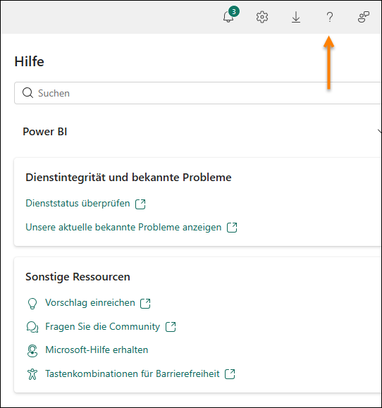

Nachfolgend finden Sie weitere Ressourcen zur Arbeit mit Microsoft Fabric.

- Zugriff auf alle Informationen in der [Hauptdokumentation von Microsoft Fabric](https://learn.microsoft.com/en-us/fabric/)

- Fabric bei einer [interaktiven Vorstellung kennenlernen](https://aka.ms/Fabric-GuidedTour)

- Zur [kostenlosen Testversion von Microsoft Fabric](https://aka.ms/try-fabric) anmelden

- Besuchen Sie die [Microsoft Fabric-Website](https://aka.ms/microsoft-fabric)

- Mit den Modulen von [Fabric Learning neue Qualifikationen erwerben](https://aka.ms/learn-fabric)

- [Kostenloses E-Book zum Einstieg in Fabric lesen](https://aka.ms/fabric-get-started-ebook)

- Mitglied der [Fabric-Community](https://aka.ms/fabric-community) werden, um Fragen zu stellen, Feedback zu geben und sich mit anderen auszutauschen

Lesen Sie die ausführlichere technische Dokumentation zu Copilot:

- [Übersicht über Copilot für Power BI – Power BI | Microsoft Learn](https://learn.microsoft.com/en-us/power-bi/create-reports/copilot-introduction)

- [Eigenständige Copilot-Umgebung in Power BI (Vorschauversion) – Power BI | Microsoft Learn](https://learn.microsoft.com/en-us/power-bi/create-reports/copilot-chat-with-data-standalone)

- [Microsoft Fabric Copilot-Admineinstellungen | Microsoft Learn](https://learn.microsoft.com/en-us/fabric/admin/service-admin-portal-copilot)

- [Erstellung eines Fabric-Daten-Agents (Vorschauversion) – Erfahren Sie, wie Sie einen Fabric-Daten-Agent erstellen | Microsoft Learn](https://learn.microsoft.com/en-us/fabric/data-science/concept-data-agent)

- [Bewährte Vorgehensweisen bei der Konfiguration Ihres Daten-Agents – Microsoft Fabric | Microsoft Learn](https://learn.microsoft.com/en-us/fabric/data-science/data-agent-configuration-best-practices)

- [Copilot für Microsoft Fabric und Power BI: (FAQ) – Microsoft Fabric | Microsoft Learn](https://learn.microsoft.com/en-us/fabric/fundamentals/copilot-faq-fabric)

© 2026 Microsoft Corporation. Alle Rechte vorbehalten.

Durch Nutzung dieser Demo/Übung erklären Sie sich mit folgenden Bedingungen einverstanden:

Die in dieser Demo/Übung beschriebene Technologie/Funktionalität wird von der Microsoft Corporation bereitgestellt, um Feedback von Ihnen zu erhalten und Ihnen Wissen zu vermitteln. Sie dürfen die Demo/Übung nur verwenden, um derartige Technologiefeatures und Funktionen zu bewerten und Microsoft Feedback zu geben. Es ist Ihnen nicht erlaubt, sie für andere Zwecke zu verwenden. Es ist Ihnen nicht gestattet, diese Demo/Übung oder einen Teil derselben zu ändern, zu kopieren, zu verbreiten, zu übertragen, anzuzeigen, auszuführen, zu vervielfältigen, zu veröffentlichen, zu lizenzieren, zu transferieren oder zu verkaufen oder aus ihr abgeleitete Werke zu erstellen.

DAS KOPIEREN ODER VERVIELFÄLTIGEN DER DEMO/ÜBUNG (ODER EINES TEILS DERSELBEN) AUF EINEN/EINEM ANDEREN SERVER ODER SPEICHERORT FÜR DIE WEITERE VERVIELFÄLTIGUNG ODER VERBREITUNG IST AUSDRÜCKLICH UNTERSAGT.

DIESE DEMO/ÜBUNG BIETET BESTIMMTE SOFTWARETECHNOLOGIE/PRODUKTFUNKTIONEN UND FUNKTIONALITÄT, EINSCHLIESSLICH MÖGLICHER NEUER FUNKTIONEN UND KONZEPTE, IN EINER SIMULIERTEN UMGEBUNG OHNE KOMPLEXE EINRICHTUNG ODER INSTALLATION FÜR DEN BESCHRIEBENEN ZWECK OBEN. DIE IN DIESER DEMO/ÜBUNG DARGESTELLTEN TECHNOLOGIEN/ KONZEPTE STELLEN MÖGLICHERWEISE NICHT DIE VOLLSTÄNDIGE FUNKTIONALITÄT DER FUNKTION DAR UND FUNKTIONIEREN MÖGLICHERWEISE NICHT SO, WIE EINE ENDGÜLTIGE VERSION FUNKTIONIEREN KÖNNTE. UNTER UMSTÄNDEN VERÖFFENTLICHEN WIR AUCH KEINE ENDGÜLTIGE VERSION DERARTIGER FEATURES ODER KONZEPTE. IHRE ERFAHRUNG BEI DER VERWENDUNG DERARTIGER FEATURES UND FUNKTIONEN IN EINER PHYSISCHEN UMGEBUNG KANN FERNER ABWEICHEND SEIN.

**FEEDBACK.** Wenn Sie Feedback zu den Technologiefeatures, Funktionen und/oder Konzepten geben, die in dieser Demo/Übung beschrieben werden, gewähren Sie Microsoft das Recht, Ihr Feedback in jeglicher Weise und für jeglichen Zweck kostenlos zu verwenden, zu veröffentlichen und gewerblich zu nutzen. Außerdem treten Sie Dritten kostenlos sämtliche Patentrechte ab, die erforderlich sind, damit deren Produkte, Technologien und Dienste bestimmte Teile einer Software oder eines Dienstes von Microsoft, welche/welcher das Feedback enthält, verwenden oder eine Verbindung zu dieser/diesem herstellen können. Sie geben kein Feedback, das einem Lizenzvertrag unterliegt, aufgrund dessen Microsoft Drittparteien eine Lizenz für seine Software oder Dokumentation gewähren muss, weil wir Ihr Feedback in diese aufnehmen. Diese Rechte bestehen nach Ablauf dieser Vereinbarung fort.

DIE MICROSOFT CORPORATION LEHNT HIERMIT JEGLICHE GEWÄHRLEISTUNGEN UND GARANTIEN IN BEZUG AUF DIE DEMO/ÜBUNG AB, EINSCHLIESSLICH ALLER AUSDRÜCKLICHEN, KONKLUDENTEN ODER GESETZLICHEN GEWÄHRLEISTUNGEN UND GARANTIEN DER HANDELSÜBLICHKEIT, DER EIGNUNG FÜR EINEN BESTIMMTEN ZWECK, DES RECHTSANSPRUCHS UND DER NICHTVERLETZUNG VON RECHTEN DRITTER. MICROSOFT MACHT KEINERLEI ZUSICHERUNGEN BZW. ERHEBT KEINERLEI ANSPRÜCHE IM HINBLICK AUF DIE RICHTIGKEIT DER ERGEBNISSE UND DES AUS DER VERWENDUNG DER DEMO/ÜBUNG RESULTIERENDEN ARBEITSERGEBNISSES BZW. BEZÜGLICH DER EIGNUNG DER IN DER DEMO/ÜBUNG ENTHALTENEN INFORMATIONEN FÜR EINEN BESTIMMTEN ZWECK.

**HAFTUNGSAUSSCHLUSS**

Diese Demo/Übung enthält nur einen Teil der neuen Features und Verbesserungen in Microsoft Power BI. Einige Features können sich unter Umständen in zukünftigen Versionen des Produkts ändern. In dieser Demo/Übung erhalten Sie Informationen über einige, aber nicht über alle neuen Features.
