# Microsoft Fabric Chat with your Data in a Day - Übung 4

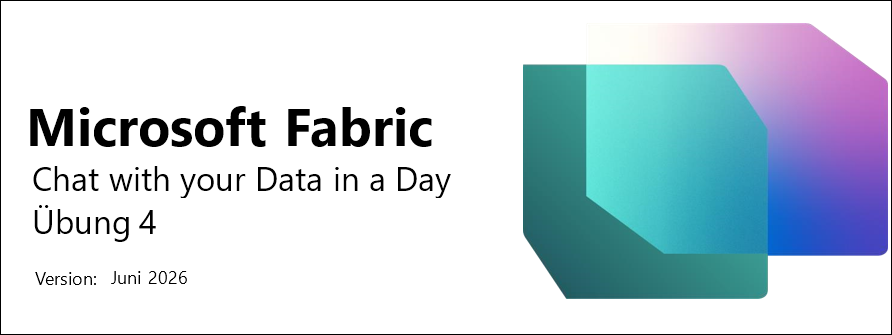

## Inhalt

- Dokumentstruktur
- Anwendungsfall/Problemstellung
- Einführung
- Eigenständige Copilot-Umgebung
- Einrichtung des Arbeitsbereichs für spätere Übungen
  - Aufgabe 1: Eigenständige Copilot-Umgebung erkunden
  - Aufgabe 2: Einen Prompt in der eigenständigen Copilot-Umgebung schreiben
  - Aufgabe 3: Die Funktion „Im Bericht anzeigen“ erkunden
  - Aufgabe 4: Erkundungen
  - Aufgabe 5: Verifizierte Antworten
  - Aufgabe 6: Wie Copilot zu dieser Antwort gelangt ist
  - Aufgabe 7: Datenantwort aus einer von Copilot generierten DAX-Abfrage
  - Aufgabe 8: Kontextwechsel in Copilot
  - Aufgabe 9: Erstellung eines Visuals aus dem semantischen Modell durch Copilot
  - Aufgabe 10: Allgemeine Copilot-Umgebung
- Referenzen

# Dokumentstruktur

Die Übung enthält die Schritte, die Benutzer durchführen müssen, sowie zugehörige Screenshots zur visuellen Unterstützung. Wichtige Abschnitte sind in den Screenshots mit einem orangefarbenen Kasten gekennzeichnet.

# Anwendungsfall/Problemstellung

Herzlichen Glückwunsch, dass Sie es bis hierher geschafft haben. Sie wissen jetzt, wie Sie allgemein anerkannte bewährte Methoden in Ihr Datenmodell implementieren und die Funktion „Vorbereiten von Daten für KI“ nutzen können. Jetzt ist es an der Zeit, die eigenständige Copilot-Umgebung in Microsoft Fabric zu erkunden.

Ihre Organisation verfügt, wie viele andere auch, über Hunderte von Berichten und semantischen Modellen in Dutzenden von Arbeitsbereichen. Den richtigen Bericht oder die richtigen Daten zu finden, stellt für die Endbenutzer eine Herausforderung dar. Sie möchten die eigenständige Copilot-Umgebung nutzen, um die Benutzerakzeptanz zu erhöhen und schneller Erkenntnisse in der gesamten Organisation zu erhalten.

**Aktuelle Herausforderungen**

- **Fragmentierung:** Benutzer haben Schwierigkeiten, die richtigen Daten, Berichte, Apps und Daten-Agents in der Fabric-Umgebung zu finden.

- **Geringe Akzeptanz:** Die Menge an Berichten und die erforderlichen Schulungen führen zu Reibungsverlusten, die der Benutzerakzeptanz im Weg stehen.

- **Verzögerte Entscheidungsfindung:** Erkenntnisse werden aufgrund von Navigationshürden und begrenzten Self-Service-Funktionen nur langsam gewonnen.

# Einführung

In den vorangegangenen Übungen haben Sie gelernt, wie Sie Ihr semantisches Modell für die Optimierung der KI-Erfahrung vorbereiten. In dieser Übung zahlt sich diese Arbeit aus. Sie erkunden, wie Copilot in Microsoft Fabric dabei helfen kann, in Ihrer Organisation schneller Erkenntnisse zu gewinnen.

# Eigenständige Copilot-Umgebung

In diesem Abschnitt erfahren Sie mehr über die eigenständige Copilot-Umgebung in Fabric und entdecken all die tollen Möglichkeiten, wie Sie mit Ihren Daten chatten können. Am Ende dieser Übung werden Sie ein viel besseres Verständnis dafür haben, wie Sie die eigenständige Copilot-Umgebung nutzen können, um schneller zu Erkenntnissen zu gelangen. Sie werden insbesondere Folgendes lernen:

- das Beste aus der eigenständigen Copilot-Umgebung herauszuholen

- die zurückgegebenen Berichte, Visuals und Datenantworten zu verstehen

- „Wie Copilot zu dieser Antwort gelangt ist“ richtig zu erfassen

- Erkundungen zu erstellen und zu ändern, die geteilt werden können

- die Funktionen von „Vorbereiten von Daten für KI“ wie verifizierte Antworten zu nutzen

- Lösungen für Reibungsprobleme zu finden

- die allgemeine Copilot-Umgebung zu nutzen

**ℹ️ Wichtig**

Die in diesen Übungen verwendete eigenständige Copilot-Umgebung speichert NICHT den Chatverlauf. Wenn Sie die Copilot-Umgebung verlassen, geht Ihre Unterhaltung verloren. Dies unterscheidet sich von der Copilot Chat-Umgebung in M365.

## Einrichtung des Arbeitsbereichs für spätere Übungen

In dieser und späteren Übungen benötigen Sie einen eigenen Arbeitsbereich, um Elemente in Fabric bearbeiten und speichern zu können. In diesem Abschnitt erstellen Sie einen Arbeitsbereich und weisen diesem eine Fabric-Kapazität zu, damit Sie bestimmte Aufgaben ausführen können, ohne andere Übungsteilnehmer zu stören.

1. Öffnen Sie einen Webbrowser im virtuellen Computer, und rufen Sie [https://fabric.microsoft.com/ auf.](https://app.fabric.microsoft.com/home?experience=power-bi)

2. Melden Sie sich mit den Anmeldeinformationen, die Sie im Workshop erhalten haben, bei Fabric an.

3. Wählen Sie im Navigationsbereich links die Option **Arbeitsbereiche** aus.

    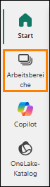

4. Klicken Sie im Bereich „Arbeitsbereiche“ auf Ihren Arbeitsbereich **Fabrikam_Lab_<inject key="DeploymentID" enableCopy="false"/>**

    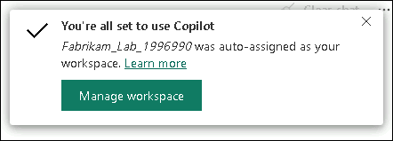

    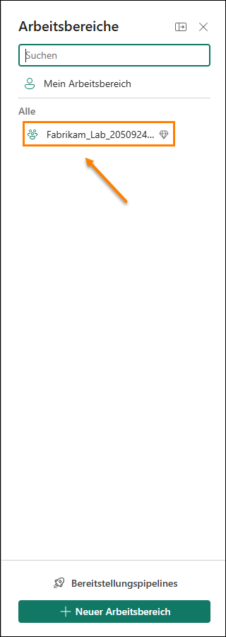

5. Wir müssen nun sicherstellen, dass Ihre individuelle Lizenz im für Fabric aktivierten Arbeitsbereich veröffentlichen kann. Wählen Sie das Personensymbol in der oberen rechten Ecke aus, und klicken Sie auf **Kostenlose Testversion**.

    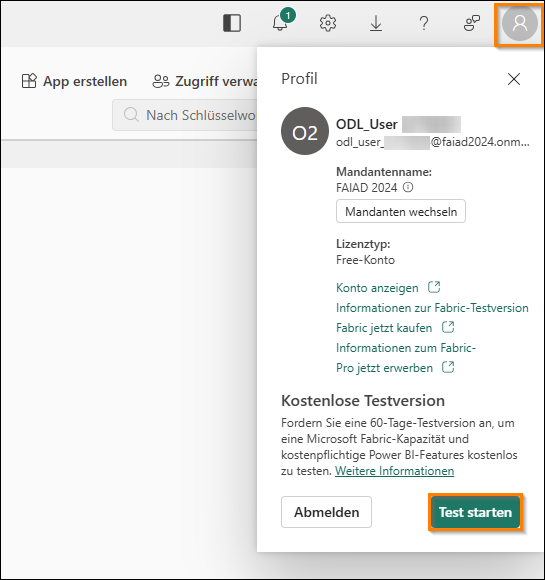

6. Klicken Sie auf **Aktivieren**, um die Veröffentlichung im Arbeitsbereich zu aktivieren.

    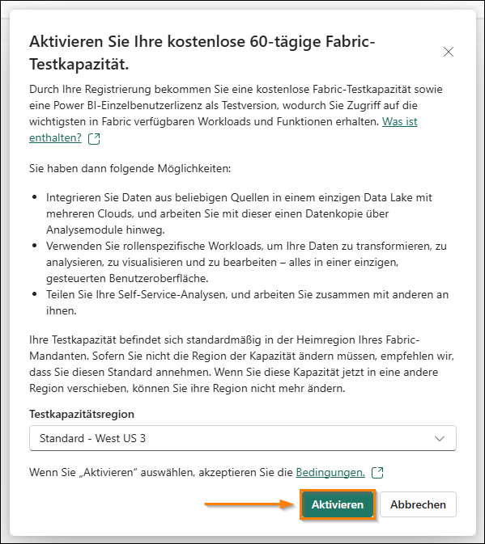

    Klicken Sie auf **OK**.

    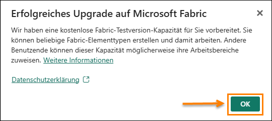

7. Als Nächstes müssen Sie die abgeschlossene PBIX-Datei aus Ihren Kursdateien **veröffentlichen**.

8. Öffnen Sie in Ihren Kursdateien die Datei mit dem Namen **Fabrikam Company Sales Report.pbix**.

    

9. Vergewissern Sie sich nach dem Öffnen, dass Sie in Ihrem zugewiesenen Benutzerkonto für den CDIAD-Workshop angemeldet sind.

10. Klicken Sie auf „Veröffentlichen“, und wählen Sie den gerade erstellten Arbeitsbereich **Fabrikam_Lab_<inject key="DeploymentID" enableCopy="false"/>** aus.

    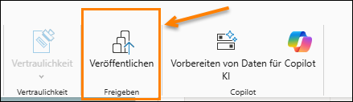

    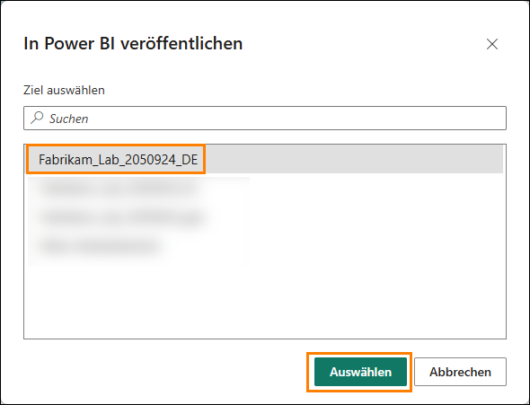

## Aufgabe 1: Eigenständige Copilot-Umgebung erkunden

1. Wählen Sie im linken Navigationsbereich „Copilot“ aus.

    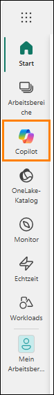

2. Wenn Sie auf dem nächsten Bildschirm eine Aufforderung erhalten, klicken Sie auf **Los geht's**. Copilot wählt einen Arbeitsbereich basierend auf einer **Copilot-Kapazität** aus, auf die der Benutzer Zugriff hat. Die Auswahl hängt davon ab, ob im Arbeitsbereich **Kapazitätseinheiten (Capacity Units, CU)** verfügbar sind. Ist der Benutzer einer **Fabric-Kapazitätskonfiguration (Fabric Capacity Configuration, FCC)** zugewiesen, wird stattdessen diese Kapazität verwendet.

3. Willkommen in der eigenständigen Copilot-Umgebung! Auf dem Startbildschirm sehen Sie unten einen Abschnitt, in dem Sie Ihre Anforderung schreiben können **(1)**. Weiter unten erhalten Sie einige Prompt-Vorschläge **(2)**.

    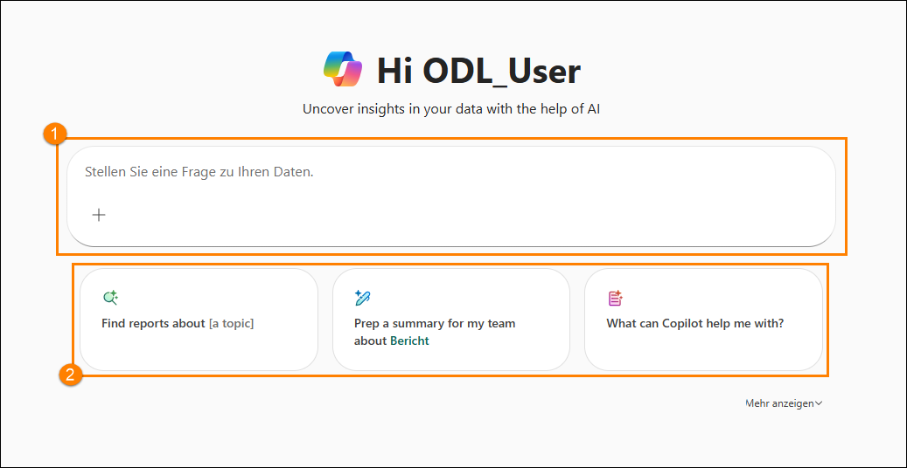

## Aufgabe 2: Einen Prompt in der eigenständigen Copilot-Umgebung schreiben

In diesem Abschnitt werden Sie verschiedene Prompts schreiben und die von der Copilot-Umgebung zurückgegebenen Ergebnisse untersuchen.

1. Klicken Sie in den Prompt, und schreiben Sie Folgendes: **Find reports about Fabrikam’s sales trends for the year.** Drücken Sie dann die **Eingabetaste**.

    **ℹ️ Wichtig**

    

    Die KI liefert nicht deterministische Ergebnisse. Das liegt an vielen Faktoren. Wie bereits in diesem Kurs erläutert, können Ihre Ergebnisse variieren und nicht mit den Ergebnissen der Übungen übereinstimmen. Fahren Sie fort, und erkunden Sie die angezeigten Funktionen und Merkmale, so gut Sie können!

    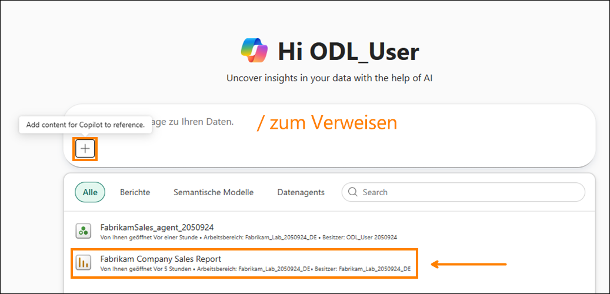

    Sie können ganz einfach **/** verwenden, um auf die Datei zu verweisen, oder **+**. Das kann hilfreich sein, da es einige Zeit in Anspruch nehmen kann, bis Copilot die veröffentlichten Inhalte vollständig erfasst hat.

    Wenn Sie **nicht** den richtigen Bericht erhalten, liegt dies daran, dass wir generell einige Dinge überprüfen müssen:

    1) Wählen Sie in der Power BI-Dienst-Einstellung „Fabric Admin Portal“ aus. Wir möchten sicherstellen, dass wir unsere Copilot-bezogenen Einstellungen überprüft haben. Eine ist: **Nur genehmigte Elemente im eigenständigen Copilot in der Power BI-Umgebung anzeigen**. Wenn Sie diese Funktion auswählen, werden nur Elemente angezeigt, die für Copilot genehmigt wurden, es sei denn, sie werden manuell angehängt oder referenziert. Dies ist in unserem Mandanten bereits standardmäßig aktiviert.

        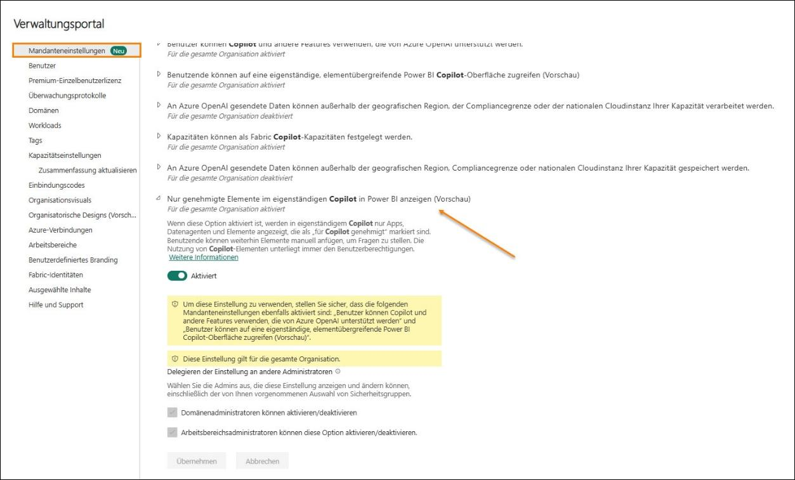

    2) Optional können wir das semantische Modell für Copilot genehmigen, indem wir das Modell in unserem Arbeitsbereich auswählen.

        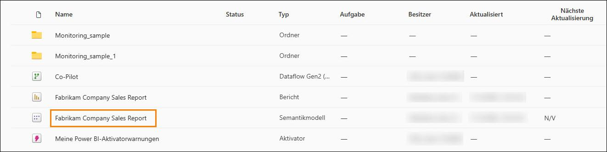

    3) Bei Auswahl von „Vorbereiten von Daten für KI“ wird das Fenster „Vorbereiten von Daten für KI“ geöffnet.

        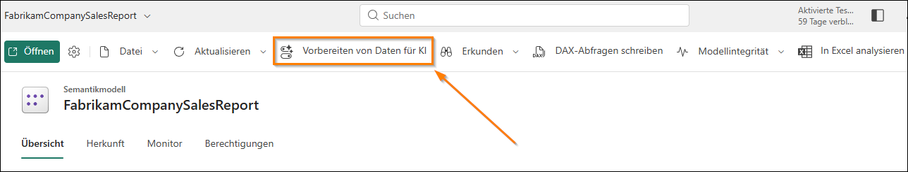

        Damit die Daten ohne manuellen Verweis durchsuchbar sind, müssen wir den Speicher für große Modelle aktivieren.

        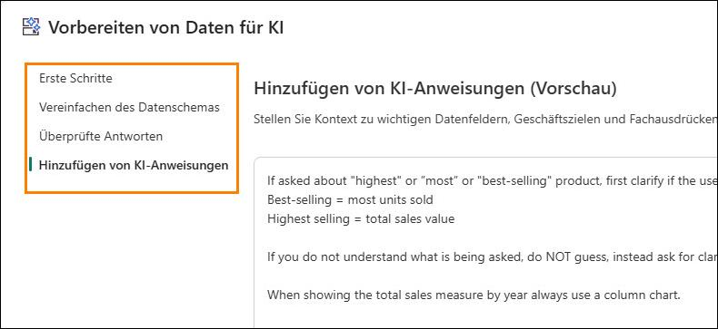

        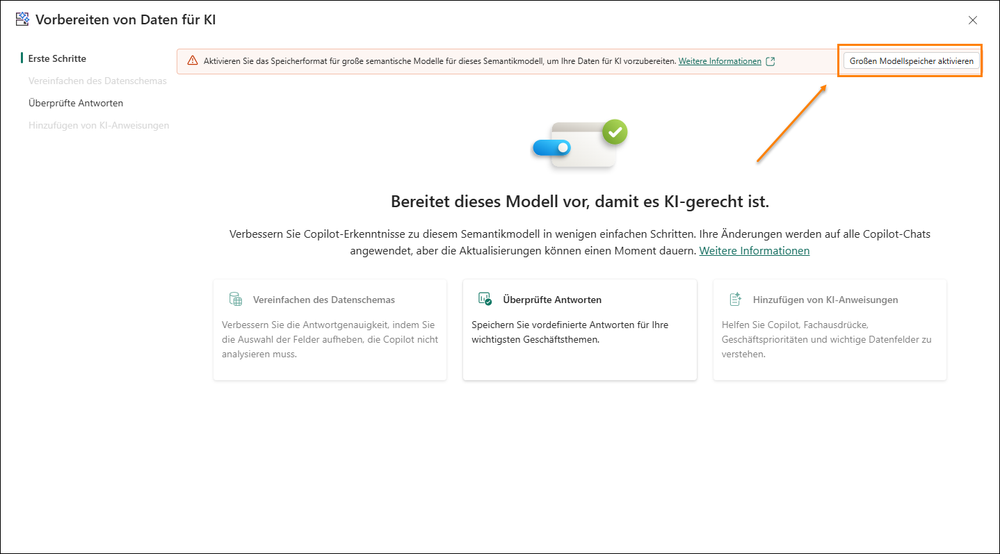

        Hier können Sie Ihre Arbeiten im Rahmen von „Vorbereiten von Daten für KI“ anzeigen und anpassen.

2. Klicken Sie auf den in Ihren Suchergebnissen zurückgegebenen Bericht **Fabrikam Company Sales Report**. Dieser öffnet sich in einer neuen Registerkarte Ihres Webbrowsers.

    

3. Nehmen Sie sich einen Moment Zeit, um diesen Bericht zu **erkunden** und sich mit ihm vertraut zu machen.

    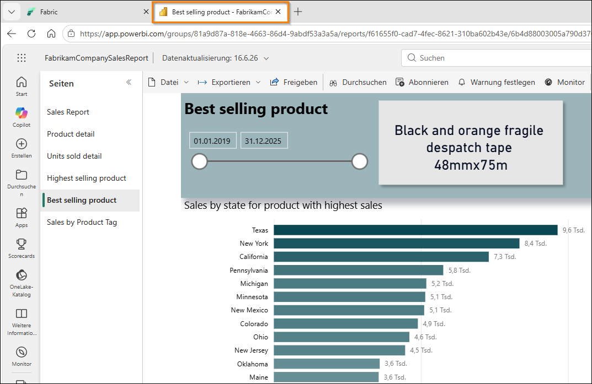

4. Wenn Sie fertig sind, klicken Sie auf das (x) auf der Browser-Registerkarte, um sie zu schließen und zu Ihrer Copilot-Umgebung zurückzukehren.

5. Klicken Sie unten auf der Seite auf den vorgenerierten Prompt oder geben Sie in folgenden Prompt ein: **Give me an overview of 1. Fabrikam Company Sales**:

    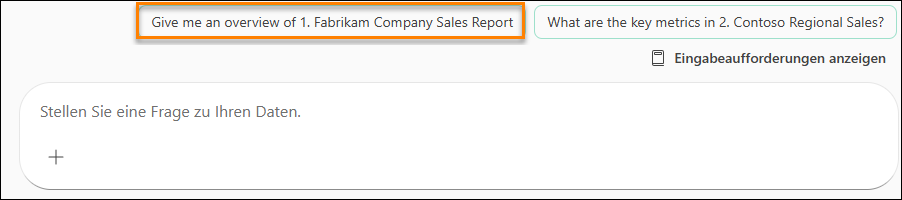

6. Wenn Sie Copilot anweisen, Ihnen einen Überblick über den Bericht zu geben, erhalten Sie die folgenden Informationen, wie im Screenshot unten zu sehen. **Zur Erinnerung: Ihr Bildschirm und Ihre Ergebnisse werden sich leicht unterscheiden.**

    1. Copilot gibt Berichtsvisuals aus dem vorhandenen Bericht für einen Überblick zurück.

    2. Copilot stellt zu jedem zurückgegebenen Visual eine verbale Beschreibung zur Verfügung.

       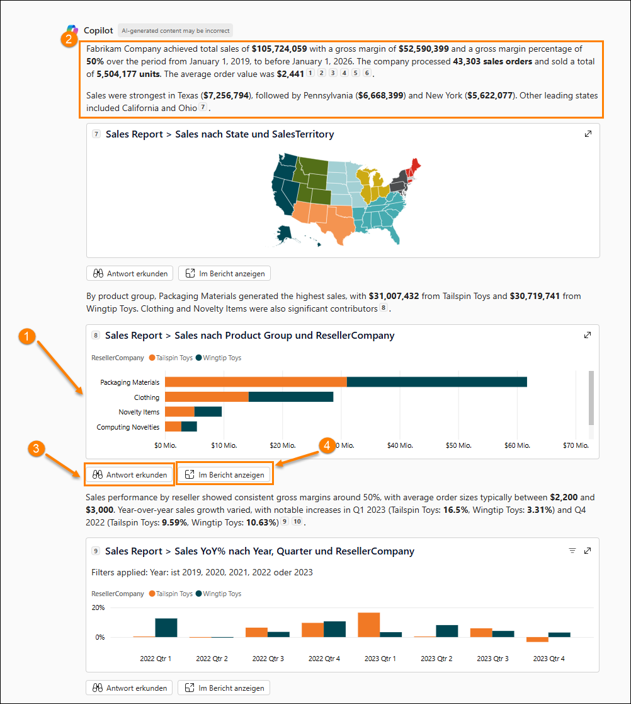

## Aufgabe 3: Die Funktion „Im Bericht anzeigen“ erkunden

Copilot kann abhängig von den gestellten Fragen und der Vorbereitung der zugrunde liegenden Daten verschiedene Arten von Antworten zurückgeben. In diesem Abschnitt erkunden Sie die Funktion **Im Bericht anzeigen**. Diese Funktion wird immer dann zurückgegeben, wenn Copilot für die Beantwortung Ihrer Frage ein vorhandenes Visual aus einem Bericht verwendet.

1. Als Nächstes werfen Sie einen Blick auf die Option **Im Bericht anzeigen**. Diese Option öffnet den aktuellen Bericht, wobei das betreffende Visual hervorgehoben wird.

2. Klicken Sie in einer der angezeigten Visualisierungen auf **Im Bericht anzeigen**. Es öffnet sich eine neue Registerkarte in Ihrem Webbrowser. *Siehe nachfolgenden Screenshot*.

    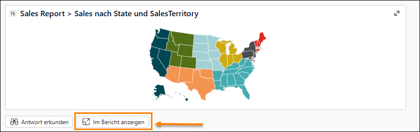

3. Auf der neuen Berichtsseite sehen Sie das von Copilot ausgewählte Visual im ursprünglichen Bericht. Sie werden auch feststellen, dass die anderen Visuals vorübergehend ausgegraut sind. Dies liegt daran, dass das ausgewählte Visual **hervorgehoben** wurde. Klicken Sie auf eine beliebige Stelle im Bericht, um den Bericht zu aktivieren und zu erkunden. Wenn Sie fertig sind, schließen Sie diese Registerkarte in Ihrem Webbrowser, und kehren Sie zur eigenständigen Copilot-Umgebung zurück.

    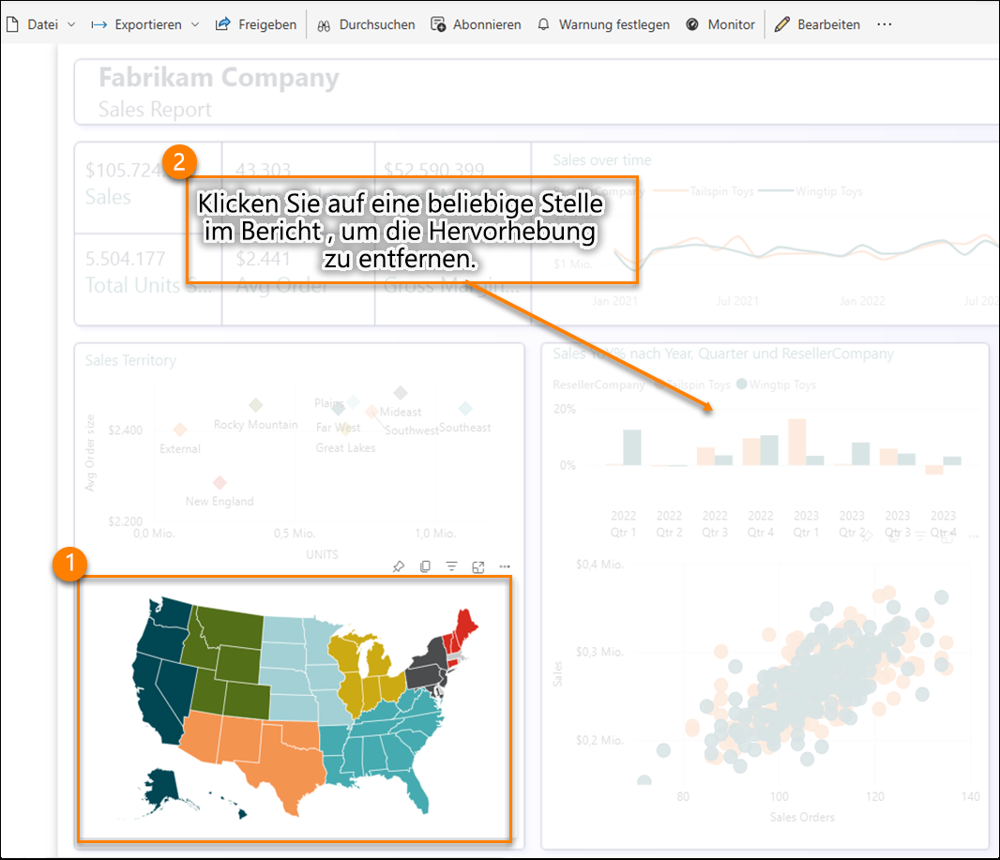

## Aufgabe 4: Erkundungen

Eine weitere Funktion, die die Copilot-Umgebung bietet, ist **Antwort erkunden**. Diese Funktion bietet eine großartige Möglichkeit, Ihre Copilot-Umgebung weiter zu verfeinern. In diesem Abschnitt erfahren Sie, wie Sie Erkundungen verwenden, bearbeiten, speichern und teilen.

**ℹ️ Hinweis**

Erkundungen werden in erster Linie als Tools für die Ad-hoc-Analyse vorhandener Daten und Visuals in Berichten verwendet. Erkundungen können zwar gespeichert werden, werden jedoch häufig nach Abschluss der Ad-hoc-Analyse einfach geschlossen.

1. Sie sollten sich nunmehr wieder in Ihrer eigenständigen Copilot-Umgebung befinden. Klicken Sie unter einer beliebigen Visualisierung in Copilot auf **Antwort erkunden**. Es ist egal, welche Sie nehmen.

    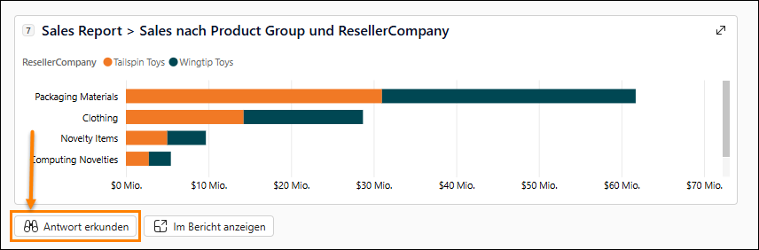

2. Durch das Klicken auf diese Schaltfläche öffnet sich ein neuer Bildschirm. Schauen wir uns **Erkundungen** nun näher an!

    - (1) Speichern Sie die Erkundung als Bericht oder Erkundung.

    - (2) Öffnen Sie sie in einer neuen Browser-Registerkarte.

    - (3) Teilen Sie sie.

    - (4) Lassen Sie sich im Matrixformat anzeigen.

    - (5) Ändern Sie den Visualisierungstyp.

    - (6) Ändern Sie die Spalten/Measures des Visuals.

    - (7) Klappen Sie die Ansicht auf oder zu.

        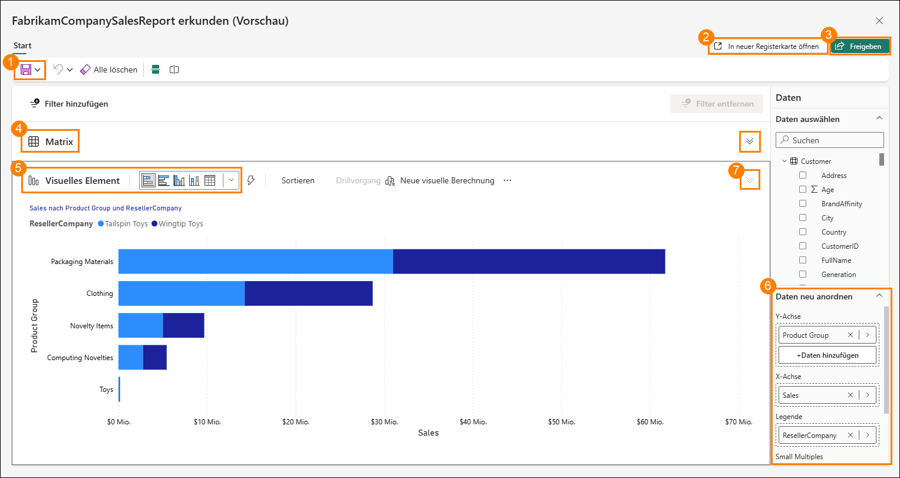

3. Klicken Sie auf das Dropdownsymbol neben der Speichern-Schaltfläche. Hier stehen Ihnen einige Optionen zur Verfügung:

    - Als Erstes können Sie dies als Erkundung speichern. Dies ist ein Objekttyp in Ihrem Arbeitsbereich.

    - Als Nächstes können Sie eine Kopie speichern. Diese Option wird angezeigt, wenn die Erkundung zuvor gespeichert wurde.

    - Als Letztes können Sie dies als Bericht speichern.

        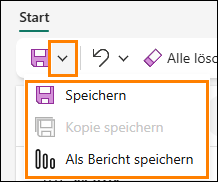

4. Wenn Sie die Einrichtung zuvor in dieser Übung abgeschlossen haben, können Sie die Erkundung jetzt speichern. Wählen Sie in der Dropdownliste die Option „Speichern“ aus. Das Popup-Fenster **Diese Erkundung speichern** öffnet sich. Wählen Sie den Arbeitsbereich aus, den Sie während der Einrichtung erstellt haben, und klicken Sie auf **Speichern**.

    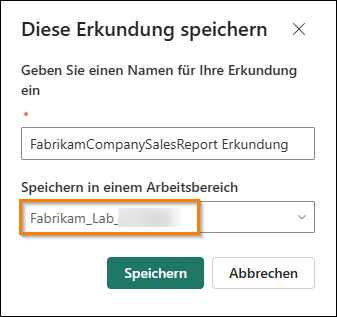

5. Im folgenden Screenshot sehen Sie ein **Beispiel** dafür, wie Erkundungen nach dem Speichern in Ihrem Arbeitsbereich angezeigt werden:

    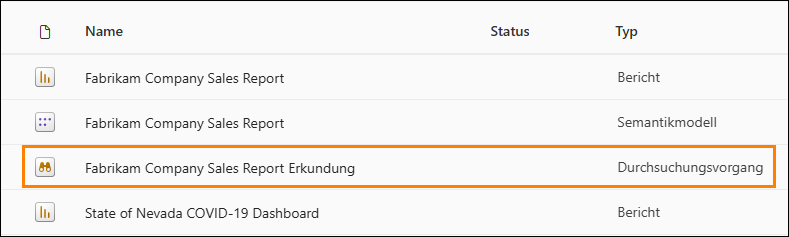

6. Sie können Ihre Erkundungen auch mit anderen teilen. Dazu müssen Sie sie zuerst in einem Arbeitsbereich speichern.

7. Suchen Sie in Ihrem Arbeitsbereich nach der Erkundung, und klicken Sie auf das Symbol „Freigeben“. Es öffnet sich ein Popup-Fenster, in dem Sie die Erkundung per Link, E-Mail oder über Teams teilen können. Hinweis: **Wir teilen in diesem Workshop keine Erkundungen. Schließen Sie bitte das Fenster, und fahren Sie mit dem nächsten Schritt fort.**

    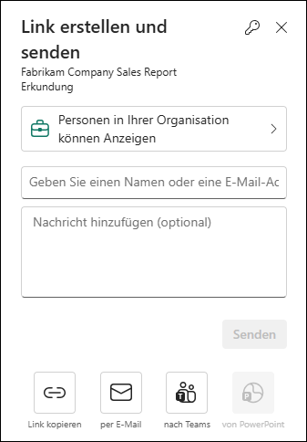

8. Nehmen Sie sich etwas Zeit, um die Erkundung zu öffnen und andere Funktionen zu erkunden!

    - Ändern Sie den Visualtyp.

    - Ändern Sie die angezeigten Spalten und Measures.

9. Wenn Sie fertig sind, klicken Sie auf das **X** in der oberen rechten Ecke, um Ihre Erkundung zu schließen.

    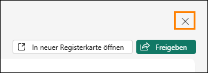

## Aufgabe 5: Verifizierte Antworten

Sie haben in dem Kurs bereits daran gearbeitet, Ihr Datenmodell für KI vorzubereiten. Zur Vorbereitung Ihrer Daten für KI gehört das Erstellen verifizierter Antworten. Mit verifizierten Antworten lässt sich sicherstellen, dass auf Fragen in Copilot bestimmte Visualisierungen zurückgegeben werden. Dies sorgt für ein kuratiertes und konsistenteres Erlebnis beim Endbenutzer und gewährleistet gleichzeitig Genauigkeit, Konsistenz und Vertrauen in die Berichte.

1. Im nächsten Schritt erfahren Sie, wie Sie die Prompt-Erfahrung weiter verbessern können, indem Sie Elemente für bessere Erkenntnisse hinzufügen. Durch das gezielte Anhängen eines Elements kann Copilot den Arbeitsbereich eingrenzen und so klarere und präzisere Ergebnisse liefern. Sie können derzeit drei Elemente an den Prompt anhängen, ein viertes wird in Kürze möglich sein:

    - Berichte

    - semantische Modelle

    - Daten-Agents

    - Apps (bald verfügbar)

2. Klicken Sie auf **+ Inhalt als Referenz für Copilot hinzufügen** in der unteren linken Ecke des Prompts.

    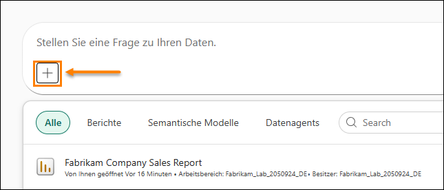

3. Wählen Sie aus den aufgeführten Optionen **Berichte** aus. Wählen Sie dann **Fabrikam Company Sales Report** aus. Klicken Sie auf **Bestätigen**.

    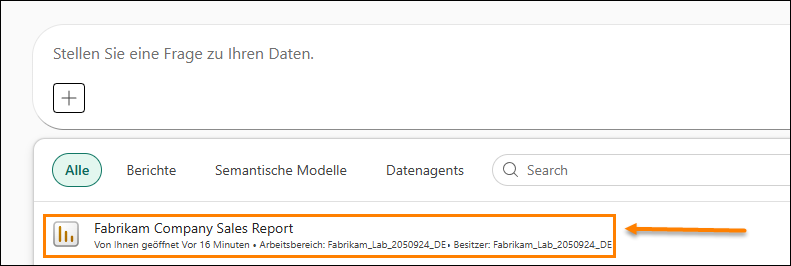

4. Dieser Bericht wird jetzt in Ihrem Copilot-Prompt als verknüpft angezeigt. Vervollständigen Sie als Nächstes den Prompt, und geben Sie **What is our best selling product?** ein.

    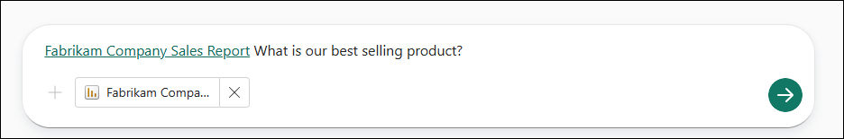

5. Sie sollten folgendes Ergebnis erhalten. Wurde in der Antwort eine verifizierte Antwort verwendet, erscheint über ihr eine Benachrichtigung. *Siehe nachfolgenden Screenshot*.

6. Sie erhalten auch die Möglichkeit, den Bericht anzuzeigen und die Daten zu erkunden.

    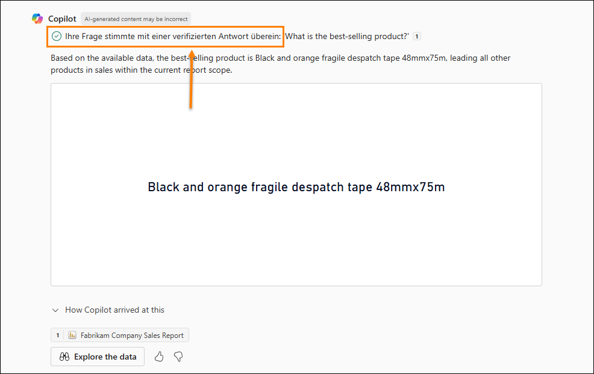

## Aufgabe 6: Wie Copilot zu dieser Antwort gelangt ist

Manchmal liefert Copilot nicht nur eine Antwort, sondern erklärt, wie es zu dieser gelangt ist. Damit erhalten Sie einen Blick hinter die Kulissen in die Logik, Filter, Measures und mehr, die in die Antwort eingeflossen sind. Diese Funktion nennt sich „How Copilot arrived at this“. Diese Erkenntnisse sind mehr als hilfreich. Sie ermöglichen es Ihnen, Ergebnisse zu validieren, Vertrauen in die Ausgabe aufzubauen und Ihr Verständnis des zugrunde liegenden Modells zu vertiefen. Es kann sehr aufschlussreich sein und bietet die Möglichkeit, die Ergebnisse zu validieren.

1. Klicken Sie unter Ihrer verifizierten Antwort auf **How Copilot arrived at this**.

2. Sie sehen die von Ihnen gestellte Frage, die zur Beantwortung der Frage verwendeten Daten, und alle eventuell angewendeten Filter.

    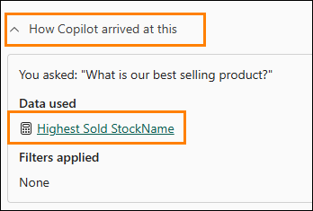

3. „How Copilot arrived at this“ kann unterschiedliche Ergebnisse zurückgeben, je nachdem, wie Copilot zu den Ergebnissen gelangt ist. Schauen wir uns ein weiteres Beispiel an.

4. Hängen Sie im Copilot-Prompt **Fabrikam Company Sales Report** an, und geben Sie Folgendes ein: **return all customers that make up the top 1% of total sales**.

    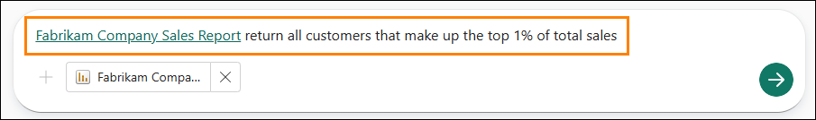

5. Prüfen wir nun die Ergebnisse.

    - (1) Wir erhalten eine Antwort, dass die Antwort mehr Analyse als üblich erforderte. Es handelt sich um ein DAX-generiertes Ergebnis von Copilot. Überprüfen Sie unbedingt den Code! Es kann auch ein Hinweis darauf sein, dass die Daten nicht vollständig genehmigt wurden, da sie DAX-generiert sind.

        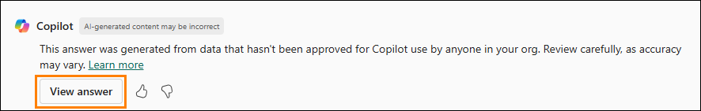

    - (2) Die Tabelle mit den Ergebnissen: Die Ergebnisse sehen gut aus. Beachten Sie, dass wir nach Kunden gefragt haben, aber Handelspartner zurückgegeben werden. Dies liegt daran, dass wir bei der Vorbereitung unserer Daten für KI die Tabelle „Customer“ entfernt und ein Synonym für „Reseller“ verwendet haben.

    - (3) Wie Copilot zu dieser Antwort gelangt ist

    - (4) Der Fabrikam Sales Report

    - (5) Die von Copilot für die Ergebnisse generierte DAX-Abfrage

        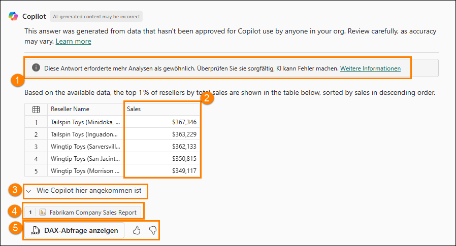

10. Schauen wir uns zunächst „Wie Copilot zu dieser Antwort gelangt ist“ an. Klicken Sie auf **Wie Copilot zu dieser Antwort gelangt ist**, um die Beschreibung aufzuklappen.

11. Das Ergebnis sieht jetzt ganz anders aus. Sie erhalten eine verbale Beschreibung, wie Copilot zu dieser Antwort gelangt ist.

    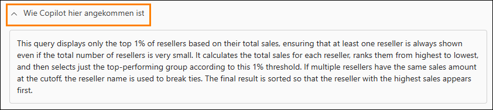

    In diesem Abschnitt haben Sie gelernt, dass Copilot manchmal mitteilt, wie es zu einer bestimmten Antwort gelangt ist. Die Art und Weise, wie Copilot diese Informationen teilt oder anzeigt, kann je nach Prozess variieren, den Copilot verwendet hat, um die Antwort zurückzugeben.

## Aufgabe 7: Datenantwort aus einer von Copilot generierten DAX-Abfrage

Im vorangegangenen Beispiel hat Copilot eine DAX-Abfrage generiert und dazu die zugrunde liegenden Daten im semantischen Modell verwendet. Außerdem hat Copilot Sie gewarnt, die Ergebnisse auf Richtigkeit zu überprüfen. Schauen wir uns die Antwort noch genauer an.

1. Wenn Sie sich die Ergebnisse im Screenshot oben anschauen, können Sie sehen, dass sich der Gesamtumsatz für jeden Kunden wiederholt (Erinnern Sie sich daran, dass wir ein Synonym Resellername = Kunden erstellt haben). Dies ist in der Regel ein Hinweis darauf, dass zwischen den Tabellen, die Teil der Antwort sind, keine gültige Beziehung besteht.

2. Klicken Sie auf **DAX-Abfrage** **anzeigen**.

    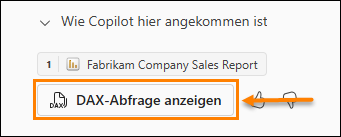

3. Ein Popup-Dialogfeld öffnet sich, in dem die generierte DAX-Abfrage zusammen mit Inline-Kommentaren, wie die Lösung zu dieser Antwort gekommen ist, angezeigt wird. Weiter unten sehen Sie eine Beschreibung, wie Copilot zu diesem Ergebnis gelangt ist. Und ganz unten im Popup-Fenster haben Sie zwei Optionen, die Sie ausführen können.

    - Abfrage ausführen – Dadurch wird der aktuelle DAX in der DAX-Abfrageansicht geöffnet.

    - Abfrage kopieren – Mit dieser Option können Sie den DAX in Ihre Zwischenablage kopieren.

        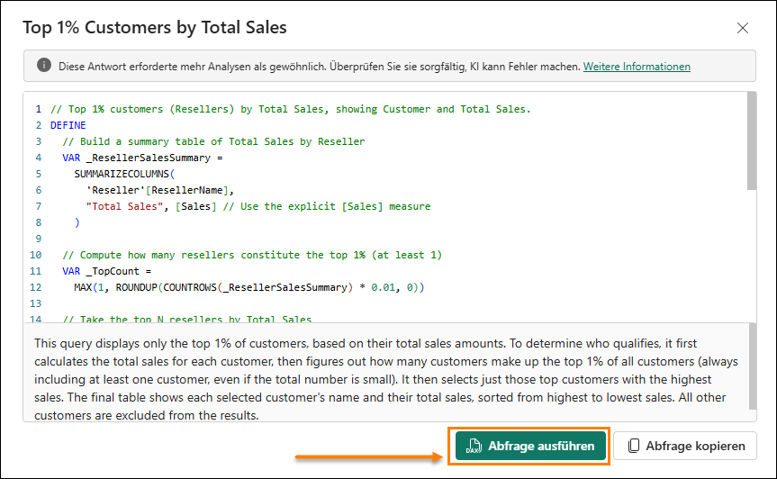

4. Klicken Sie auf **Abfrage ausführen**. In Ihrem Webbrowser öffnet sich eine neue Registerkarte mit der DAX-Abfrageansicht zu Ihrem semantischen Modell der Fabrikam Company.

    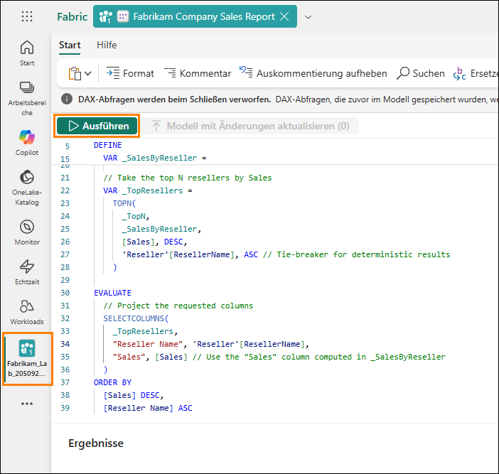

5. Klicken Sie auf **Ausführen**, um die Ergebnisse hier in der DAX-Abfrageansicht anzuzeigen. Die Ergebnisse sind die gleichen, die wir von Copilot erhalten haben. Wenn Sie mit der DAX-Sprache vertraut sind, können Sie den DAX-Ausdruck ändern, um Ihre Ergebnisse zu optimieren.

    

6. Dies scheint eine tolle Antwort von Copilot zu sein. Unsere Vorbereitungsarbeit hat sich ausgezahlt. Wenn ich Power BI Desktop öffne und schnell ein Visual erstelle, kann ich einfach überprüfen, ob die Antwort von Copilot korrekt ist.

    

7. Eine weitere Sache, die hier erwähnt werden soll: Sie haben auch Zugriff auf die Modellansicht. Von hier aus können Sie die Tabellen und Beziehungen im semantischen Modell validieren.

    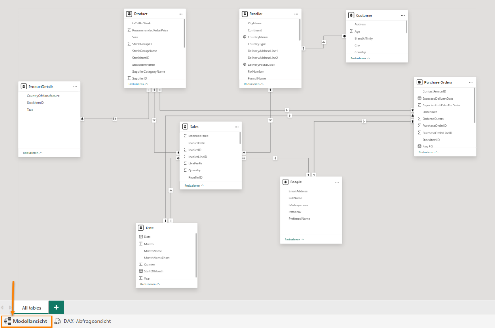

    **ℹ️ Wichtig**

    „Chat with your Data“ ist ein äußerst nützliches Tool, mit dem Unternehmen auf der ganzen Welt schneller Erkenntnisse gewinnen können. Die Ergebnisse können aber auch falsch oder irreführend sein. Wie wir in dieser Übung gesehen haben, ist es sehr wichtig, innezuhalten und die Ergebnisse zu validieren.

    In dieser Übung haben Sie gelernt, dass Sie den von Copilot generierten DAX anzeigen, die DAX-Abfrageansicht starten und den vorhandenen Code ändern und sogar in die Modellansicht wechseln und die Beziehungen überprüfen können.

## Aufgabe 8: Kontextwechsel in Copilot

Bisher haben Sie sich in diesem Workshop ausschließlich auf die Fabrikam Company Sales-Daten konzentriert. Unsere Organisation verfügt jedoch über viele verschiedene Berichte in vielen Arbeitsbereichen. Die eigenständige Copilot-Umgebung berücksichtigt jedoch alle Berichte, auf die sie Zugriff hat.

1. Gehen Sie zu Ihren Kursdateien, und öffnen Sie **State of Nevada COVID-19 Dashboard**.

    

2. Veröffentlichen Sie diesen abgeschlossenen Bericht in Ihrem **Fabrikam_lab_0000000**.

    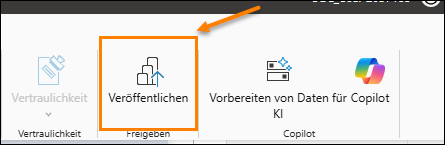

    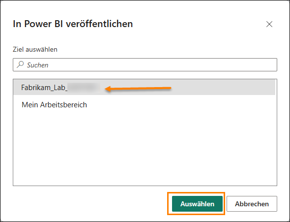

3. Sie können dieses semantische Modell und den Bericht nun in der eigenständigen Copilot-Umgebung abfragen. Geben Sie im Copilot-Prompt Folgendes ein: **How many confirmed cases have there been?** Verwenden Sie die **Plus-Schaltfläche (1), das semantische Modell (2)** und **StateofNevadaCOVID-19Dashboard (3)**, wenn sie nicht von allein einbezogen werden. Wir haben bewusst einen sehr allgemeinen Prompt verwendet. Copilot konnte anhand der Inhalte des Berichts herausfinden, was Sie erwarteten. Zur Erinnerung: Unter dem bereitgestellten Bericht informiert Sie Copilot über die verwendeten Kriterien.

    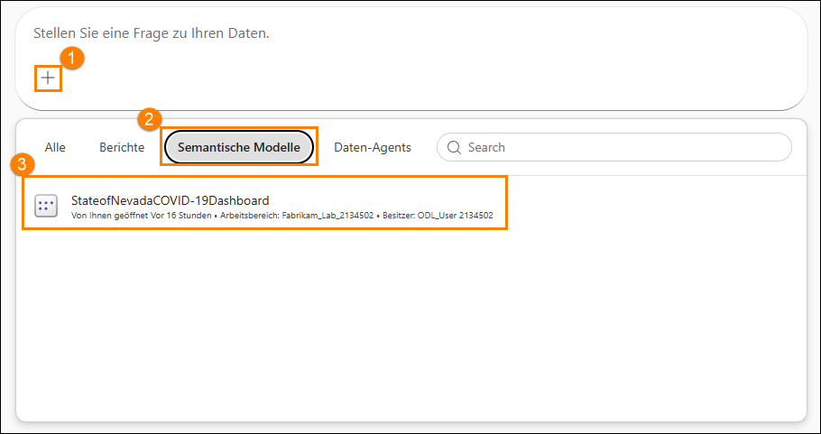

4. Sehr gut! Copilot beantwortet unsere Fragen jetzt mit einem Visual aus dem zugrundeliegenden Bericht. Denken Sie daran, dass Sie von Copilot mehrere verschiedene Anzeigeergebnisse erhalten können.

    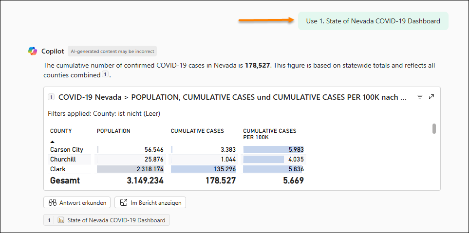

    ODER

    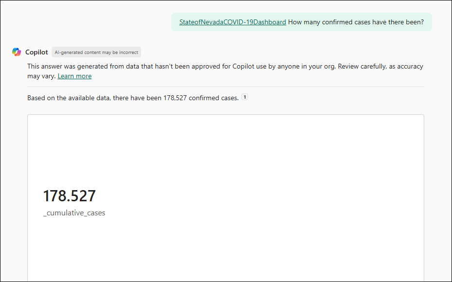

5. Stellen Sie eine weitere Datenfrage. Geben Sie folgenden Prompt ein: **How many deaths were there in Carson City in 2019?**

    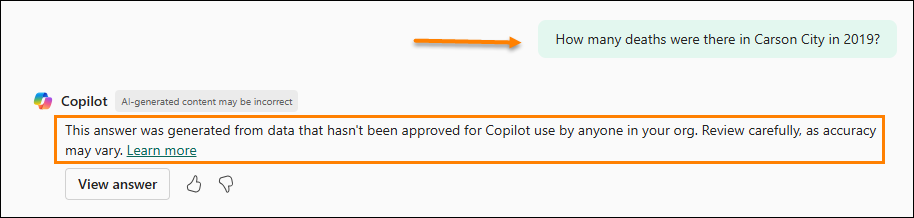

6. Dieses Mal hat Copilot kein vorhandenes Visual gefunden, das es zurückgeben konnte, und generierte daher eine Antwort anhand der dem Bericht zugrunde liegenden Daten. In diesem Fall erhalten Sie bei einem Modell, das nicht als „Vorbereitet für KI“ gekennzeichnet ist, eine **Reibungswarnung**.

    **ℹ️ Wichtig**

    Eine Reibungswarnung ist eine vom System generierte Warnung oder Einschränkungsmitteilung, die angezeigt wird, wenn Copilot auf ein nicht vorbereitetes oder schlecht beschriebenes Datenmodell stößt. Im Wesentlichen sagt Copilot dann, dass es versuchen kann, mit den verfügbaren Informationen zu helfen, die Ergebnisse jedoch validiert werden sollten.

    Um Reibungswarnungen von Copilot zu verringern, bereiten Sie Ihre semantischen Modelle für KI vor, und markieren Sie das semantische Modell nach der Veröffentlichung als „Vorbereitet für KI“. Weitere Informationen finden Sie im Anleitungsdokument zu den Mandanteneinstellungen, das in Ihren Übungsdateien enthalten ist.

## Aufgabe 9: Erstellung eines Visuals aus dem semantischen Modell durch Copilot

In vorangegangenen Übungen haben Sie gesehen, das Copilot in Antwort auf bestimmte Fragen Visualisierungen zurückgibt. Bei diesen Visualisierungen handelte es sich um Visuals, die bereits in unseren Berichten vorhanden waren. In diesem Abschnitt werden Sie sehen, dass Copilot zur Beantwortung von Anfragen auch Visualisierungen aus dem semantischen Modell erstellen kann.

1. Kehren Sie zu Copilot in Fabric zurück, wenn Sie noch nicht dort sind.

2. Fügen Sie in Ihrem Prompt Ihren **Fabrikam Company Sales Report** hinzu, und geben Sie dann Folgendes ein: **Show me units sold over time**.

    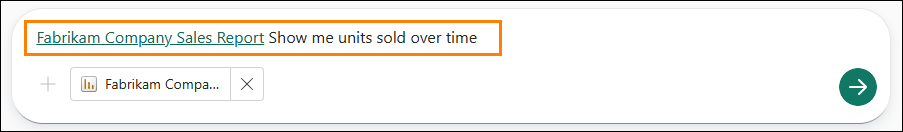

3. Bei der zurückgegebenen Visualisierung handelt es sich nicht um ein Visual, das im Bericht bereits vorhanden war. Diese Visualisierung wurde vielmehr von Copilot auf der Grundlage des semantischen Modells erstellt. Im Gegensatz zu Visuals, die direkt aus einem Bericht stammen, ist diese von Copilot generierte Antwort mit einer Erklärung *How Copilot arrived at this* versehen.

    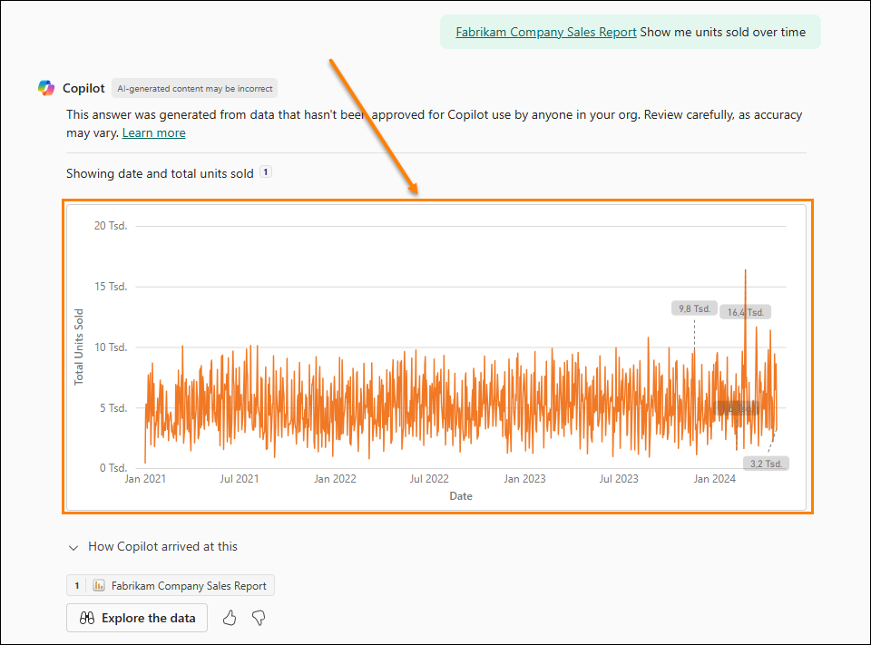

4. Schauen wir uns die Ergebnisse genauer an. Klicken Sie auf **How Copilot arrived at this**.

    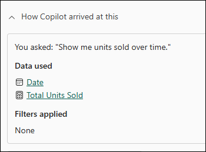

## Aufgabe 10: Allgemeine Copilot-Umgebung

In dieser Übung haben Sie gelernt, wie Sie die eigenständige Copilot-Umgebung in Microsoft Fabric nutzen, um Ihre vorhandenen Berichte und semantischen Modelle zu untersuchen. Sie können aber auch die allgemeine Copilot-Umgebung nutzen. In dieser Übung schreiben wir mit Hilfe von Copilot eine E-Mail zu unseren Ergebnissen.

1. Geben Sie folgenden Prompt in Copilot ein: **Take the conversation so far and turn it into an email to share with the team**.

    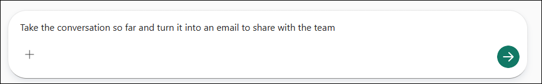

2. Die Ergebnisse können sich sehen lassen. Zur Erinnerung: Ihre Antwort wird sich deutlich vom Screenshot unterscheiden. Denken Sie auch daran, dass die Antwort auf Ihrem aktuellen offenen Chat mit Copilot basiert. Wenn Sie den Chat gelöscht haben oder nur einen kleinen Unterhaltungsverlauf haben, wirkt sich dies auf das Endergebnis aus.

    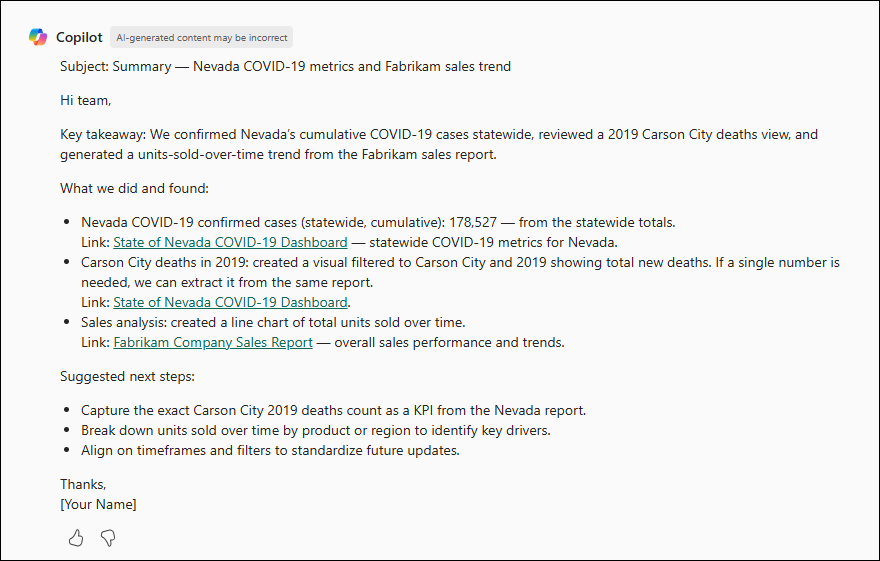

3. Das ist schon mal nicht schlecht. Aber noch besser wäre es, ein paar Visualisierungen und Links in der E- Mail zu haben. Stellen Sie im Copilot-Prompt folgende Anforderung an Copilot: **Add visuals and links to the email**.

    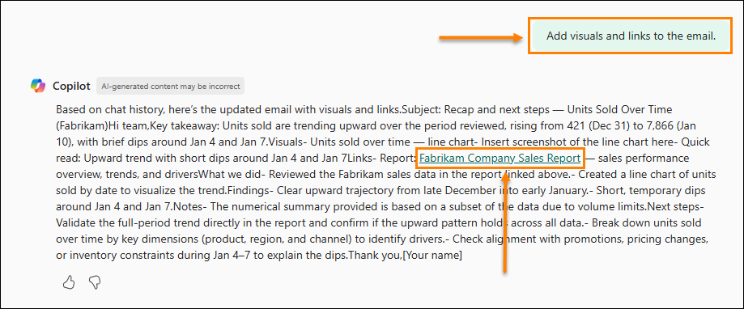

# Referenzen

Chat with Your Data in a Day (CDIAD) bietet eine Einführung in einige der wichtigsten Funktionen bei der Verwendung der eigenständigen Copilot-Umgebung in einem Fabric-Arbeitsbereich.

Das Dienst-Menü verfügt im Hilfe-Abschnitt (?) über Verknüpfungen zu praktischen Informationen. Vergessen Sie nicht, dass die angezeigte Ansicht davon abhängt, in welcher Umgebung Sie sich gerade befinden. Die Ihnen angezeigten Optionen können sich daher von der folgenden Abbildung unterscheiden.

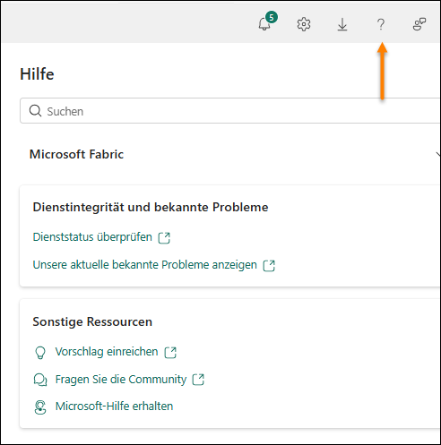

Nachfolgend finden Sie weitere Ressourcen zur Arbeit mit Microsoft Fabric.

- Zugriff auf alle Informationen in der [Hauptdokumentation von Microsoft Fabric](https://learn.microsoft.com/en-us/fabric/)

- Fabric bei einer [interaktiven Vorstellung kennenlernen](https://aka.ms/Fabric-GuidedTour)

- Zur [kostenlosen Testversion von Microsoft Fabric](https://aka.ms/try-fabric) anmelden

- Besuchen Sie die [Microsoft Fabric-Website](https://aka.ms/microsoft-fabric)

- Mit den Modulen von [Fabric Learning neue Qualifikationen erwerben](https://aka.ms/learn-fabric)

- [Kostenloses E-Book zum Einstieg in Fabric lesen](https://aka.ms/fabric-get-started-ebook)

- Mitglied der [Fabric-Community](https://aka.ms/fabric-community) werden, um Fragen zu stellen, Feedback zu geben und sich mit anderen auszutauschen

Lesen Sie die ausführlichere technische Dokumentation zu Copilot:

- [Übersicht über Copilot für Power BI – Power BI | Microsoft Learn](https://learn.microsoft.com/en-us/power-bi/create-reports/copilot-introduction)

- [Eigenständige Copilot-Umgebung in Power BI (Vorschauversion) – Power BI | Microsoft Learn](https://learn.microsoft.com/en-us/power-bi/create-reports/copilot-chat-with-data-standalone)

- [Microsoft Fabric Copilot-Admineinstellungen | Microsoft Learn](https://learn.microsoft.com/en-us/fabric/admin/service-admin-portal-copilot)

- [Erstellung eines Fabric-Daten-Agent (Vorschauversion) – Erfahren Sie, wie Sie einen Fabric-Daten-Agent erstellen | Microsoft Learn](https://learn.microsoft.com/en-us/fabric/data-science/concept-data-agent)

- [Bewährte Vorgehensweisen bei der Konfiguration Ihres Daten-Agents – Microsoft Fabric | Microsoft Learn](https://learn.microsoft.com/en-us/fabric/data-science/data-agent-configuration-best-practices)

- [Copilot für Microsoft Fabric und Power BI: (FAQ) – Microsoft Fabric | Microsoft Learn](https://learn.microsoft.com/en-us/fabric/fundamentals/copilot-faq-fabric)

© 2026 Microsoft Corporation. Alle Rechte vorbehalten.

Durch Nutzung dieser Demo/Übung erklären Sie sich mit folgenden Bedingungen einverstanden:

Die in dieser Demo/Übung beschriebene Technologie/Funktionalität wird von der Microsoft Corporation bereitgestellt, um Feedback von Ihnen zu erhalten und Ihnen Wissen zu vermitteln. Sie dürfen die Demo/Übung nur verwenden, um derartige Technologiefeatures und Funktionen zu bewerten und Microsoft Feedback zu geben. Es ist Ihnen nicht erlaubt, sie für andere Zwecke zu verwenden. Es ist Ihnen nicht gestattet, diese Demo/Übung oder einen Teil derselben zu ändern, zu kopieren, zu verbreiten, zu übertragen, anzuzeigen, auszuführen, zu vervielfältigen, zu veröffentlichen, zu lizenzieren, zu transferieren oder zu verkaufen oder aus ihr abgeleitete Werke zu erstellen.

DAS KOPIEREN ODER VERVIELFÄLTIGEN DER DEMO/ÜBUNG (ODER EINES TEILS DERSELBEN) AUF EINEN/EINEM ANDEREN SERVER ODER SPEICHERORT FÜR DIE WEITERE VERVIELFÄLTIGUNG ODER VERBREITUNG IST AUSDRÜCKLICH UNTERSAGT.

DIESE DEMO/ÜBUNG BIETET BESTIMMTE SOFTWARETECHNOLOGIE/PRODUKTFUNKTIONEN UND FUNKTIONALITÄT, EINSCHLIESSLICH MÖGLICHER NEUER FUNKTIONEN UND KONZEPTE, IN EINER SIMULIERTEN UMGEBUNG OHNE KOMPLEXE EINRICHTUNG ODER INSTALLATION FÜR DEN BESCHRIEBENEN ZWECK OBEN. DIE IN DIESER DEMO/ÜBUNG DARGESTELLTEN TECHNOLOGIEN/ KONZEPTE STELLEN MÖGLICHERWEISE NICHT DIE VOLLSTÄNDIGE FUNKTIONALITÄT DER FUNKTION DAR UND FUNKTIONIEREN MÖGLICHERWEISE NICHT SO, WIE EINE ENDGÜLTIGE VERSION FUNKTIONIEREN KÖNNTE. UNTER UMSTÄNDEN VERÖFFENTLICHEN WIR AUCH KEINE ENDGÜLTIGE VERSION DERARTIGER FEATURES ODER KONZEPTE. IHRE ERFAHRUNG BEI DER VERWENDUNG DERARTIGER FEATURES UND FUNKTIONEN IN EINER PHYSISCHEN UMGEBUNG KANN FERNER ABWEICHEND SEIN.

**FEEDBACK.** Wenn Sie Feedback zu den Technologiefeatures, Funktionen und/oder Konzepten geben, die in dieser Demo/Übung beschrieben werden, gewähren Sie Microsoft das Recht, Ihr Feedback in jeglicher Weise und für jeglichen Zweck kostenlos zu verwenden, zu veröffentlichen und gewerblich zu nutzen. Außerdem treten Sie Dritten kostenlos sämtliche Patentrechte ab, die erforderlich sind, damit deren Produkte, Technologien und Dienste bestimmte Teile einer Software oder eines Dienstes von Microsoft, welche/welcher das Feedback enthält, verwenden oder eine Verbindung zu dieser/diesem herstellen können. Sie geben kein Feedback, das einem Lizenzvertrag unterliegt, aufgrund dessen Microsoft Drittparteien eine Lizenz für seine Software oder Dokumentation gewähren muss, weil wir Ihr Feedback in diese aufnehmen. Diese Rechte bestehen nach Ablauf dieser Vereinbarung fort.

DIE MICROSOFT CORPORATION LEHNT HIERMIT JEGLICHE GEWÄHRLEISTUNGEN UND GARANTIEN IN BEZUG AUF DIE DEMO/ÜBUNG AB, EINSCHLIESSLICH ALLER AUSDRÜCKLICHEN, KONKLUDENTEN ODER GESETZLICHEN GEWÄHRLEISTUNGEN UND GARANTIEN DER HANDELSÜBLICHKEIT, DER EIGNUNG FÜR EINEN BESTIMMTEN ZWECK, DES RECHTSANSPRUCHS UND DER NICHTVERLETZUNG VON RECHTEN DRITTER. MICROSOFT MACHT KEINERLEI ZUSICHERUNGEN BZW. ERHEBT KEINERLEI ANSPRÜCHE IM HINBLICK AUF DIE RICHTIGKEIT DER ERGEBNISSE UND DES AUS DER VERWENDUNG DER DEMO/ÜBUNG RESULTIERENDEN ARBEITSERGEBNISSES BZW. BEZÜGLICH DER EIGNUNG DER IN DER DEMO/ÜBUNG ENTHALTENEN INFORMATIONEN FÜR EINEN BESTIMMTEN ZWECK.

**HAFTUNGSAUSSCHLUSS**

Diese Demo/Übung enthält nur einen Teil der neuen Features und Verbesserungen in Microsoft Power BI. Einige Features können sich unter Umständen in zukünftigen Versionen des Produkts ändern. In dieser Demo/Übung erhalten Sie Informationen über einige, aber nicht über alle neuen Features.
