# Microsoft Fabric Chat with your Data in a Day - Übung 5

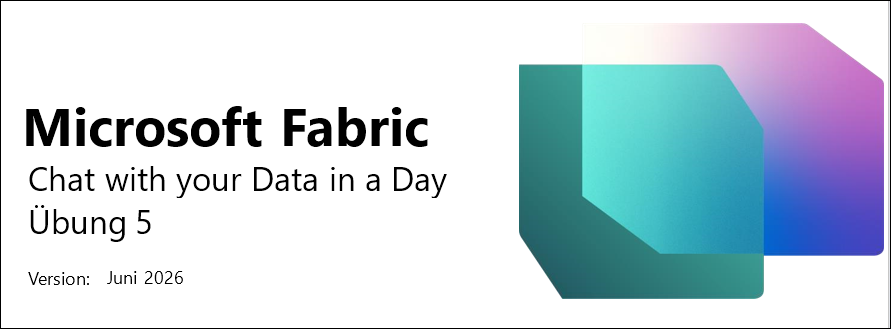

## Inhalt

- Dokumentstruktur
- Anwendungsfall/Problemstellung
- Einführung
- Fabric-Daten-Agents einsetzen
- Voraussetzungen
  - Aufgabe 1: Daten-Agent erstellen
  - Aufgabe 2: Datenquellen hinzufügen
  - Aufgabe 3: Dem Daten-Agent Fragen stellen
  - Aufgabe 4: KI-Anweisungen hinzufügen
  - Spotlight: Ersetzen einer Datenquelle
  - Aufgabe 5: Zusätzliche Datenquellen hinzufügen
  - Spotlight: Datenquellenanweisungen
  - Aufgabe 6: Bespielfragen erstellen
  - Aufgabe 7: Daten-Agent veröffentlichen und teilen
  - Aufgabe 8: Einen Daten-Agent aus Copilot heraus nutzen
- Referenzen

# Dokumentstruktur

Die Übung enthält die Schritte, die Benutzer durchführen müssen, sowie zugehörige Screenshots zur visuellen Unterstützung. Wichtige Abschnitte sind in den Screenshots mit einem orangefarbenen Kasten gekennzeichnet.

# Anwendungsfall/Problemstellung

Die eigenständige Copilot-Umgebung ist ein großer Erfolg. Ihre ganze Organisation profitiert von schnelleren Erkenntnissen. Die allgemeine Akzeptanz steigt.

Die Copilot-Umgebung ist jedoch nicht in hohem Maße anpassbar, und es gibt Endbenutzer, die sich kuratiertere Ergebnisse wünschen. Sie möchten ihre Fragen auf ganz bestimmte Bereiche des Geschäfts richten können, ohne irrelevante Berichte und semantische Modelle entschlüsseln zu müssen. Sie wurden beauftragt, einen Daten-Agent zu erstellen, der nur mit Daten verknüpft ist, die sich auf Berichtsdaten aus Fabrikam Company Sales beziehen. Außerdem müssen Sie dem Daten-Agent einige zusätzliche Daten hinzufügen, die in der eigenständigen Copilot-Umgebung nicht zur Verfügung stehen, um spezifischere Fragen, die Ihr Team zur Produktdurchlaufzeit stellen möchte, beantworten zu können.

# Einführung

Sie haben mehr über die eigenständige Copilot-Umgebung erfahren, die sich hervorragend zum Erkunden all Ihrer Daten in all Ihren Arbeitsbereichen eignet. Mit dem Einsatz von Daten-Agents kann eine noch besser kuratierte Erfahrung für das Chatten mit bestimmten Daten geschaffen werden. Daten-Agents können eine Verbindung zu bestimmten Datenquellen oder sogar zu bestimmten Tabellen innerhalb von Datenquellen herstellen. Während Copilot ein KI-Assistent innerhalb von Fabric ist, der Produktivität und Intelligence ermöglicht, sorgen Daten-Agents für Datenkonnektivität.

Am Ende dieser Übung werden Sie Folgendes gelernt haben:

- einen Daten-Agent zu erstellen

- Ihrem Agent Datenquellen hinzuzufügen

- Ihrem Agent Fragen zu stellen

- Ihrem Agent KI-Anweisungen hinzufügen

- eine Datenquelle zu ersetzen

- eine zusätzliche Datenquelle hinzuzufügen

- Bespielfragen zu erstellen

- Ihren Agent zu veröffentlichen und zu teilen

- den Daten-Agent aus der eigenständigen Copilot-Umgebung heraus zu nutzen

# Fabric-Daten-Agents einsetzen

In diesem Abschnitt erfahren Sie, wie Sie einen Daten-Agent erstellen. Der Agent kann zur Beantwortung von Fragen Daten (inklusive Fakten, Summen, Rangfolgen oder Filter) abrufen, indem er strukturierte Abfragen (SQL, DAX, KQL) generiert. Zum Zeitpunkt des Verfassens dieses Artikels werden Fabric-Daten-Agents als Previewfunktion in Microsoft Fabric zur Verfügung gestellt. Es ist nicht ratsam, sie in Produktionsworkloads zu verwenden. Weitere Informationen zur Funktionsweise von Fabric-Daten-Agents finden Sie hier:

[Erstellung eines Fabric-Daten-Agents (Vorschauversion) – Erfahren Sie, wie Sie einen Fabric-Daten-Agent erstellen | Microsoft Learn](https://learn.microsoft.com/en-us/fabric/data-science/concept-data-agent)

Mit Microsoft Fabric-Daten-Agents können Benutzer in einfachem Englisch mit Unternehmensdaten interagieren, ohne SQL, DAX oder KQL zu benötigen. Sie bieten eine Chat-Oberfläche mit Debugging-Tools und stellen eine Verbindung zu Quellen wie semantischen Modellen in Power BI, KQL-Datenbanken, Lakehouses und Warehouses her. Auf Daten-Agents kann innerhalb und außerhalb von Microsoft Fabric zu gegriffen werden. Sie können in Microsoft Teams, Copilot Studio, Azure AI Foundry und kundenspezifische Apps integriert werden. Daten-Agents können außerdem über die eigenständige Copilot-Umgebung in Fabric verwendet werden.

## Voraussetzungen

Um Fabric-Daten-Agents verwenden zu können, müssen viele Mandanteneinstellungen aktiviert bzw. konfiguriert werden (weitere Informationen dazu finden Sie im **Anleitungsdokument zu den Mandanteneinstellungen** in Ihren Kursübungen):

- Adminzugriff ist erforderlich.

- Copilot- und Azure OpenAI-Einstellungen müssen aktiviert sein.

- Erstellung und Freigabe von Fabric-Daten-Agents müssen aktiviert sein.

- XMLA-Endpunkte für semantische Modelle in Power BI müssen aktiviert sein.

## Aufgabe 1: Daten-Agent erstellen

1. Öffnen Sie einen Webbrowser in Ihrem virtuellen Computer, gehen Sie zu https://fabric.microsoft.com, und navigieren Sie zum Arbeitsbereich **Fabrikam_Lab_<inject key="DeploymentID" enableCopy="false"/>**

    *(**Wichtig**: Verwenden Sie den zuvor in diesem Kurs erstellten Arbeitsbereich.)*

    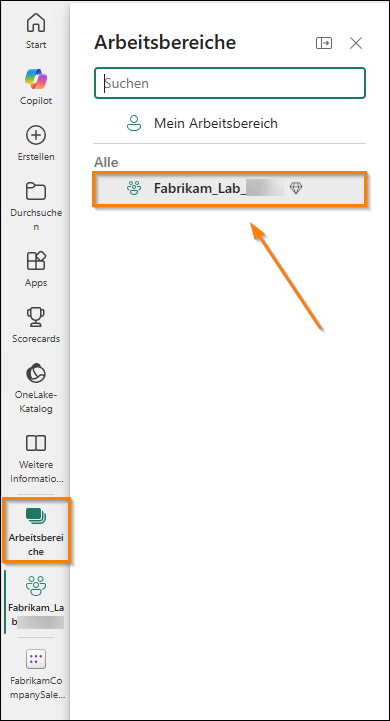

2. Klicken Sie auf **Neues Element**:

    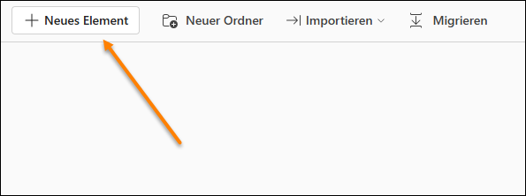

3. Geben Sie in der sich öffnenden Suchleiste **Agent** ein, und wählen Sie **Daten-Agent (Vorschauversion) aus.**

    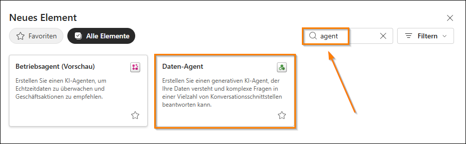

4. Geben Sie Ihrem Agent den Namen ***Fabrikam_Lab_<inject key="DeploymentID" enableCopy="false"/>**

5. Ihren Benutzercode finden Sie in Ihrem Benutzernamen:

    

6. Klicken Sie auf **Erstellen.**

    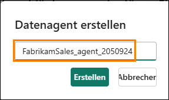

## Aufgabe 2: Datenquellen hinzufügen

1. Nach der Erstellung Ihres Daten-Agents müssen Sie im nächsten Schritt Ihre Datenquellen hinzufügen.

2. Klicken Sie im Explorer-Bereich auf die Schaltfläche **+Daten hinzufügen**. Alternativ können Sie auf die Schaltfläche **Datenquelle hinzufügen** klicken, die in der Mitte des Bildschirms angezeigt wird.

    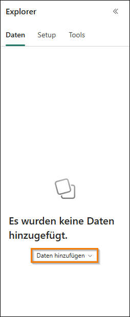**\**

    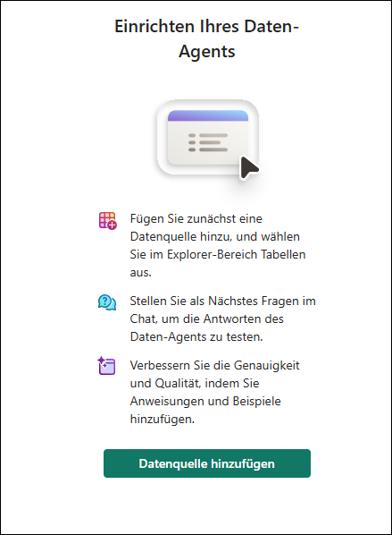

3. Wählen Sie das semantische Modell **Fabrikam Company Sales Report** aus der Liste aus, und klicken Sie dann auf **Hinzufügen**.

    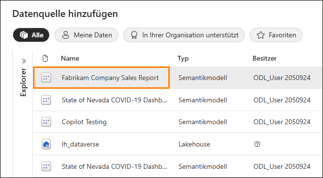

4. Beachten Sie, dass noch keine Tabellen ausgewählt wurden und der Daten-Agent keine Fragen beantworten kann, bis mindestens eine Datenquelle ausgewählt wurde. Klicken Sie auf **>** neben dem **Fabrikam Company Sales Report** im Bereich **Explorer**. Wählen Sie die im nachstehenden Screenshot angezeigten Tabellen aus.

    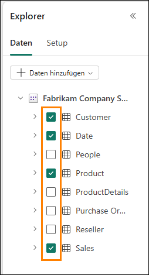

## Aufgabe 3: Dem Daten-Agent Fragen stellen

1. Nachdem Ihr Agent nun mit einer Datenquelle verbunden ist, schreiben wir einige Prompts für den Daten-Agent.

2. Geben Sie folgende Aufforderung ein: **Show me sales by country**.

    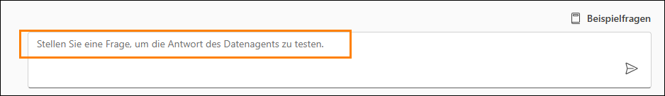

3. Es kann einige Sekunden dauern, bis der Agent antwortet. Schauen Sie sich an, was der Agent zurückgegeben hat:

    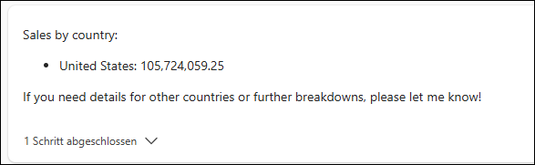

4. Klicken Sie auf das Dropdown neben dem abgeschlossenen Schritt, um anzuzeigen, was der Agent gemacht hat, und dann auf das nächste Dropdown, um die Details anzuzeigen.

    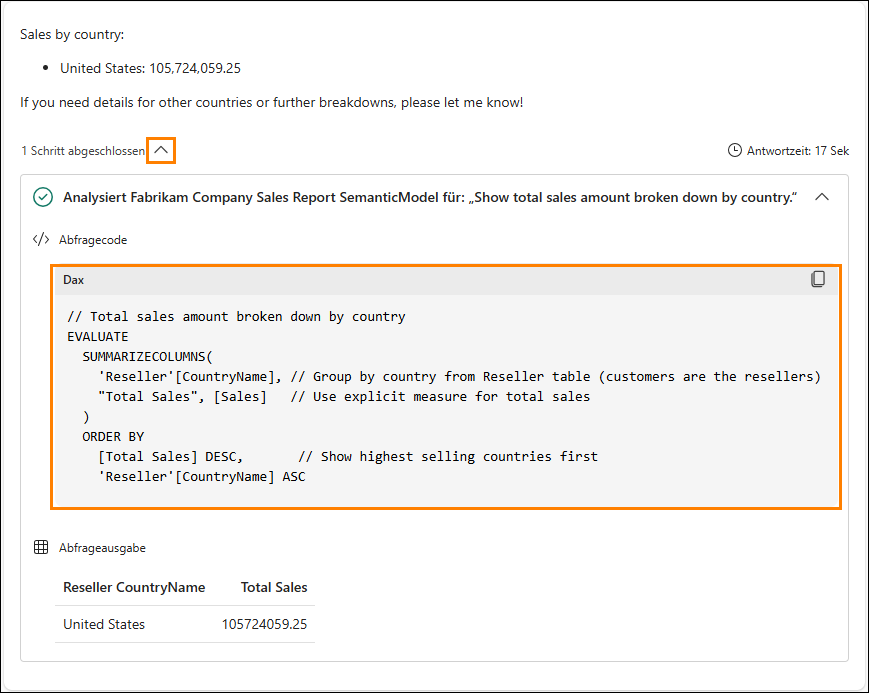

    **ℹ️ Wichtig**

    Es ist wichtig, sich für die Entwicklung eines Fabric-Daten-Agent Zeit zu nehmen und die Ergebnisse zu validieren, um Genauigkeit und Konsistenz sicherzustellen. Nachdem wir nun Ergebnisse haben, kehren wir zum semantischen Modell zurück und validieren dort die Ergebnisse.

5. Öffnen Sie in Ihren Kursdateien die Datei mit dem Namen **Fabrikam Company Sales Report.pbix**.

    

6. Klicken Sie auf das Ende des Berichts, um eine neue Berichtsseite zu öffnen.

    

7. Als Nächstes erstellen Sie ein einfaches Visual, um die vom Daten-Agent zurückgegebenen Ergebnisse zu validieren.

8. Fügen Sie der neuen Berichtsseite ein Tabellenvisual hinzu.

    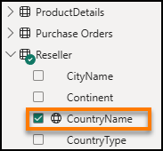

    

9. Die Tabelle sollte wie folgt aussehen:

    

10. Beachten Sie, dass der Gesamtumsatz mit der Abfrageausgabe des Daten-Agents weiter oben übereinstimmt. Damit ist bestätigt, dass die Agentabfrage die richtige Ausgabe zurückgegeben hat.

## Aufgabe 4: KI-Anweisungen hinzufügen

Zur Verbesserung der Genauigkeit und Konsistenz können dem Fabric-Daten-Agent KI-Anweisungen hinzugefügt werden. KI-Anweisungen können an zwei verschiedenen Stellen im Daten-Agent hinzugefügt werden.

Erstens können dem Agent selbst KI-Anweisungen hinzugefügt werden, die als **Agent-Anweisungen** bezeichnet werden und dem Agent bei der Bestimmung helfen, welche Datenquellen für bestimmte Fragen verwendet werden sollten, welcher Ton verwenden werden sollte, welche Art von Daten zu priorisieren sind, und andere ähnliche Verhaltens- oder Kontextpräferenzen, die die Antwort des Agents an die Benutzer beeinflussen.

Die zweite Art von KI-Anweisungen sind **Datenquellenanweisungen**. Mit Datenquellenanweisungen können Sie Anweisungen hinzufügen, die dem Daten-Agent helfen, die Datenquellendaten zu verstehen und sie möglichst effektiv zu verwenden. Derzeit werden Datenquellenanweisungen von semantischen Modellen nicht unterstützt. Wir werden uns diese Funktion zu einem späteren Zeitpunkt ansehen.

1. Beginnen wir zurück auf der Fabric-Browseroberfläche mit den **Agent-Anweisungen**. Wir möchten jeder Antwort des Daten-Agents eine Zusammenfassung hinzufügen. Wir können dem Agent daher mitteilen, dass wir für jede Antwort eine kurze Zusammenfassung hinzufügen möchten.

2. Wählen Sie auf der Registerkarte „Start“ die Option „Agent-Anweisungen“ aus.

    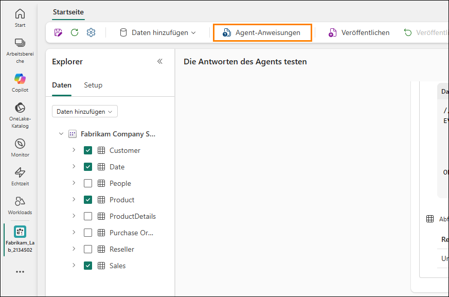

3. Geben Sie im Fenster „KI-Anweisungen“ im Feld **Agent-Anweisungen** über oder unter den vorhandenen allgemeinen Anweisungen die folgenden Anweisungen ein:

    **## Set Response Guidelines**

    **Always include a concise summary before the detailed breakdown.**

    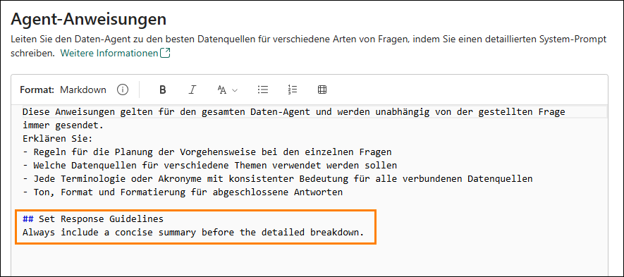

    **ℹ️ Wichtig**

    Bei „##“ handelt es sich um ein Markdown-Sprachformat, das für das Schreiben von Agent-Anweisungen nicht unbedingt erforderlich ist, aber eine bewährte Methode zur Organisation von Fabric-Daten-Agents darstellt.

4. Klicken Sie auf das **X** in der oberen rechten Ecke der Registerkarte „Agent-Anweisungen“, um die KI-Anweisungen zu schließen und Ihre Änderungen zu speichern.

    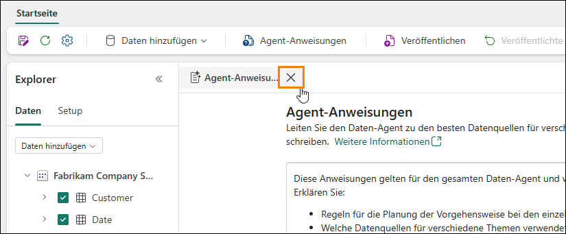

    **ℹ️ Wichtig**

    Es kann gelegentlich etwas dauern, bis Ihre KI-Anweisungen wirksam werden. Wenn Sie nicht die gewünschten Ergebnisse erzielen, klicken Sie oben in Ihrem Agentfenster auf die Schaltfläche „Chat löschen“, und versuchen Sie es erneut.

5. Geben Sie für den Agent den gleichen Prompt ein wie zuvor: **Show me sales by country**, und drücken Sie die Eingabetaste.

    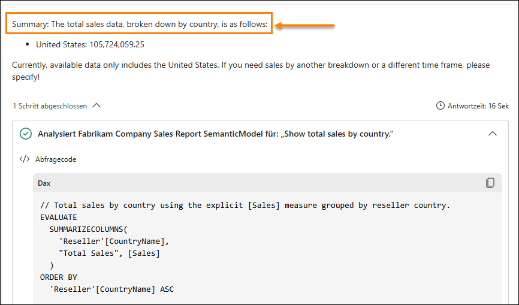

6. Fügen wir eine weitere KI-Anweisung hinzu, um die KI-Antwort weiter zu verfeinern. Dieses Mal fügen Sie im Prompt die Anweisung hinzu, anstelle einer Aufzählungsliste immer eine Tabelle zurückzugeben. Öffnen Sie die KI-Anweisungen, und fügen Sie in den Agent-Anweisungen die folgende Codezeile hinzu:

    **Always return a table instead of bullet points**

    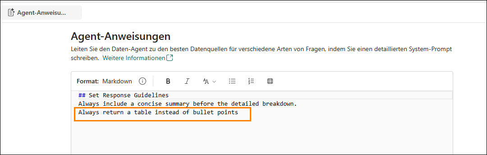

7. Schließen Sie das Fenster mit den KI-Anweisungen, und geben Sie in den Prompt für den Daten-Agent Folgendes ein: **Return sales by country**

    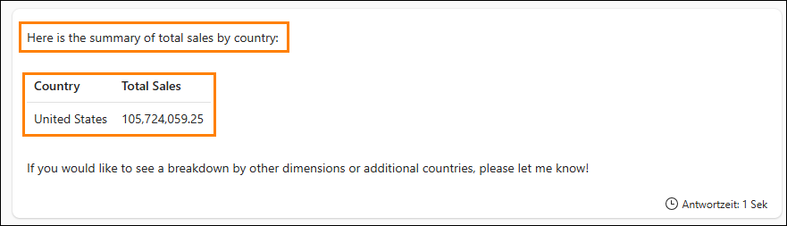

8. Nun erhalten Sie die Ergebnisse in tabellarischer Form mit einer Zusammenfassung. So weit so gut. Fügen wir noch einige Anweisungen hinzu.

9. Geben Sie in den Prompt für den Daten-Agent Folgendes ein: **Return sales by State**.

    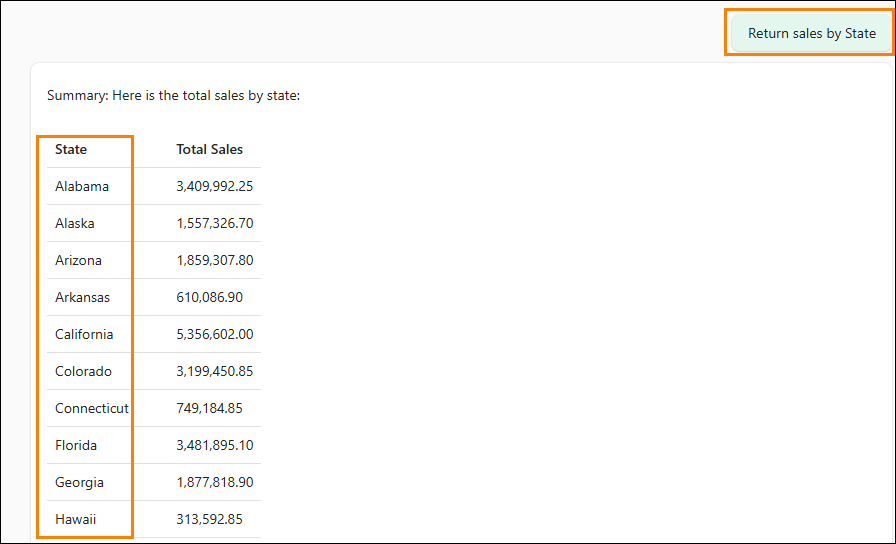

10. Diese Ergebnisse sind genau das, was Sie erwarten, aber vielleicht ist es ein bisschen zu viel? Teilen wir dem Agent mit, immer nur 5 Datenzeilen zurückzugeben, sofern nicht anders angegeben.

11. Geben Sie in den **KI-Anweisungen** Ihres Daten-Agents Folgendes ein:

    **Always provide the top 5 results unless a different number is specified**

    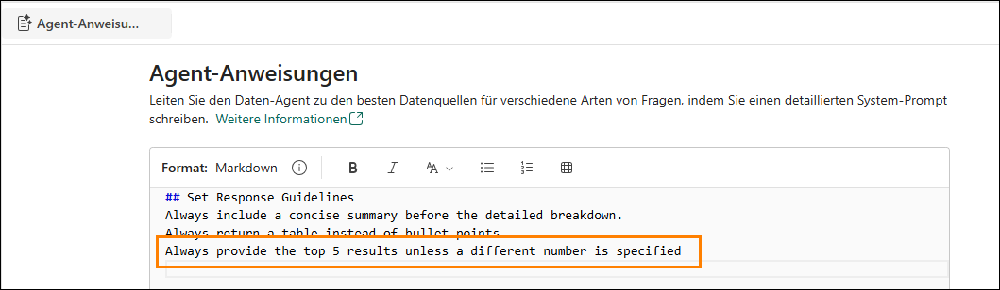

12. Das Ergebnis ist perfekt! In der Zusammenfassung wird klargestellt, dass die fünf ersten Bundesstaaten nach Umsatz angezeigt werden. Und Copilot fordert uns auf, Umsatzdaten für alle Bundesstaaten anzufordern, wenn wir dies wünschen.

    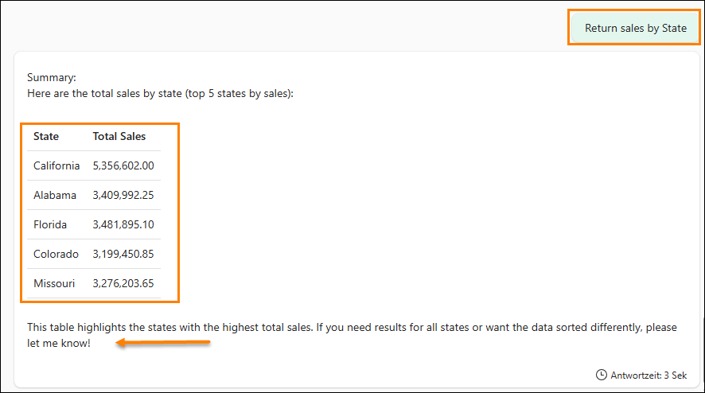

## Spotlight: Ersetzen einer Datenquelle

In Ihrer Arbeit mit Daten-Agents kann es vorkommen, dass Sie die Datenquelle wechseln möchten. In unserem Beispiel verwenden wir das semantische Modell des Fabrikam Company Sales Report. Aber was wäre, wenn wir ein anderes semantisches Modell verwenden wollten? Es gibt derzeit keine Möglichkeit, eine Datenquelle einfach zu ersetzen. Sie können jedoch jederzeit Datenquellen aus Ihrem Daten-Agent entfernen und zu ihm hinzufügen.

1. Um eine Datenquelle zu entfernen, rufen Sie in Ihrem Daten-Agent den Explorer auf, und klicken Sie auf die Auslassungspunkte (**...**) rechts neben der Datenquelle. Im Dropdownmenü haben Sie drei Optionen: öffnen, aktualisieren und entfernen.

    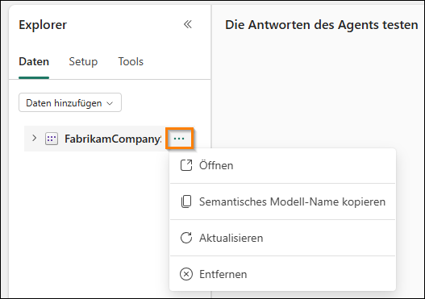

2. In dieser Übungen werden wir die Datenquelle **NICHT** ersetzen.

## Aufgabe 5: Zusätzliche Datenquellen hinzufügen

Wir haben unseren Daten-Agent auf einem klar definierten und durchdachten semantischen Modell aufgebaut. Dieses semantische Modell wurde zur Beantwortung der meisten, wenn nicht aller Benutzeranfragen entworfen. Was passiert jedoch, wenn es Umsatzdaten gibt, die Ihr semantisches Modell nicht berücksichtigt? Sie könnten die Person ausfindig machen, die das semantische Modell erstellt hat, und sie bitten, zusätzliche Tabellen und Informationen hinzuzufügen. Dies kann allerdings einige Zeit in Anspruch nehmen, oder Ihre Anfrage wird sogar abgelehnt.

Sie haben einen Benutzer, der den Umsatz nach Produktdurchlaufzeit anschauen möchte. Unser semantisches Modell von Fabrikam Company Sales umfasst diese Informationen nicht. Sie sind aber in den ursprünglichen Quelldaten vorhanden, die in Ihrem Fabric Lakehouse gespeichert sind.

In dieser Übung fügen Sie eine zusätzliche Datenquelle hinzu, damit die Informationen zur Produktdurchlaufzeit in die Antworten Ihres Daten-Agents eingebunden werden können.

1. Als Erstes erstellen wir ein Lakehouse und fügen einige Beispieldaten hinzu. Kehren Sie zu Ihrem Arbeitsbereich zurück, und wählen Sie erneut **+ Neues Element** aus:

    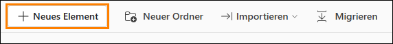

2. Scrollen Sie nach unten, und wählen Sie in dem Bereich „Andere Elemente, die Sie mit Microsoft Fabric erstellen können“ **Lakehouse** aus.

    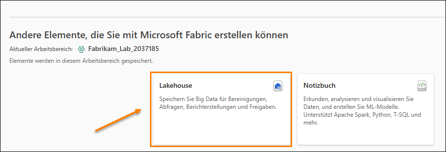

3. Nennen Sie Ihr neues Lakehouse **lh_Fabrikam**, und klicken Sie dann auf **Erstellen**.

    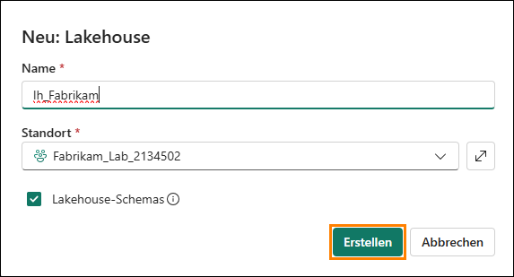

4. In unserem Lakehouse verwenden wir eine **Verknüpfung**, um eine Verbindung zu einer vorbereiteten Version der Fabrikam-Daten herzustellen. Öffnen Sie **Daten abrufen**, und wählen Sie **Neue Verknüpfung** aus.

    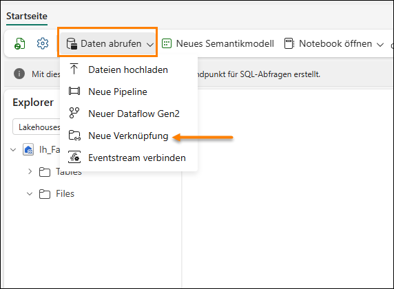

5. Wählen Sie **Azure Data Lake Storage Gen2** aus.

    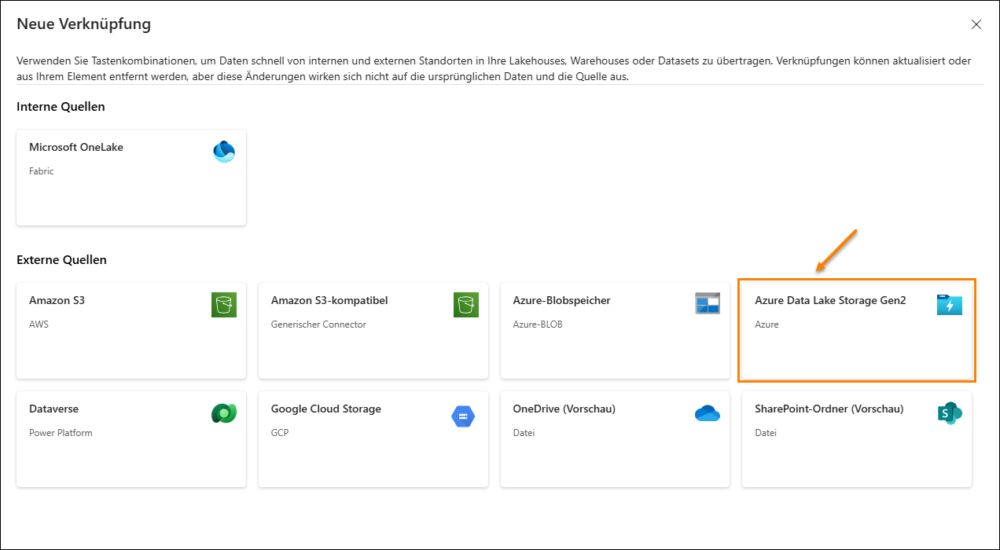

6. Wählen Sie **Neue Verbindung** aus, und geben Sie die Fabrikam-URL ein:

    ***https://stvnextblobstorage.dfs.core.windows.net/fabrikam-sales***

    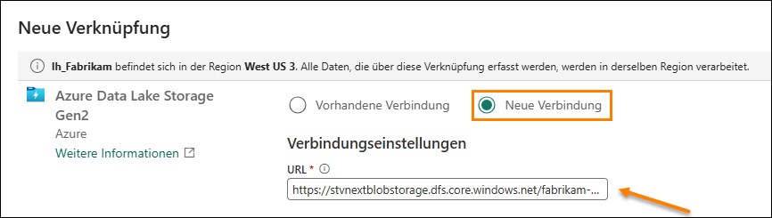

7. Geben Sie einen Verbindungsnamen wie **Fabrikam Connector** **oder etwas Ähnliches** an, klicken Sie neben der Authentifizierungsart auf die Dropdownliste, und wählen Sie „Shared Access Signature (SAS)“ aus.

    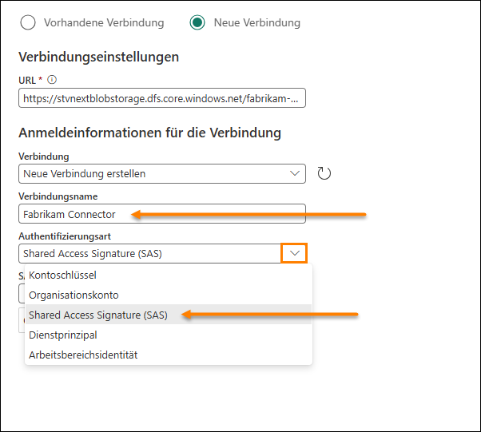

8. Kopieren Sie das SAS-Token von der Registerkarte „Umgebung“ auf der rechten Seite, und fügen Sie es unter **SAS-Token** ein.

    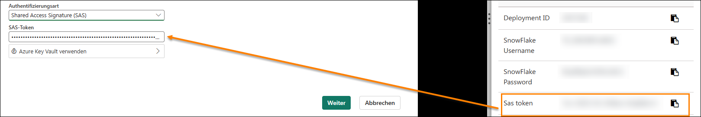

9. Wählen Sie **Weiter** aus.

    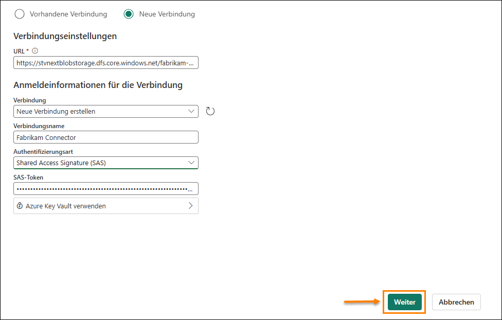

10. Öffnen Sie **Delta-Parquet-Format-FY25**, und wählen Sie alle Elemente außer **Sales.Invoices.May** aus. Klicken Sie anschließend auf **Weiter**.

    

11. Benennen Sie den **Verknüpfungsnamen** für jede neue Tabelle um. Dies ist wichtig, um das Lakehouse reibungslos als Datenquelle verwenden zu können. Nehmen Sie folgende Umbenennungen vor:

    Application.Cities zu **Cities**

    Application.Countries zu **Countries**

    Application.StateProvinces zu **StateProvinces**

    DateDim zu **Date**

    Sales.BuyingGroups zu **BuyingGroups**

    Sales.Customers zu **Customers**

    Sales.InvoiceLines zu **InvoiceLines**

    Sales.Invoices zu **Invoices**

    Warehouse.StockGroups zu **StockGroups**

    Warehouse.StockItemStockGroups zu **StockItemStockGroups**

    Warehouse.StockItems zu **StockItems**

    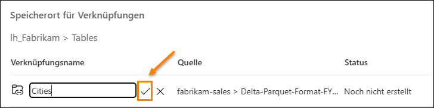

12. Wählen Sie **Erstellen** aus, um die Daten über eine Verknüpfung zu Ihrem Lakehouse hinzuzufügen.

    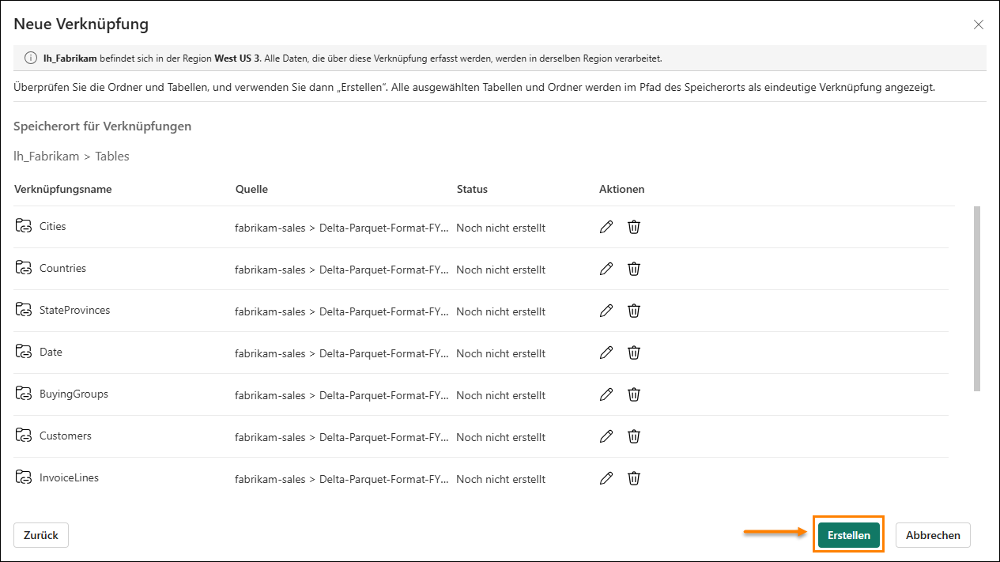

13. Wenn der Upload abgeschlossen ist, sollten die Objekte im Tabellenbereich angezeigt werden.

    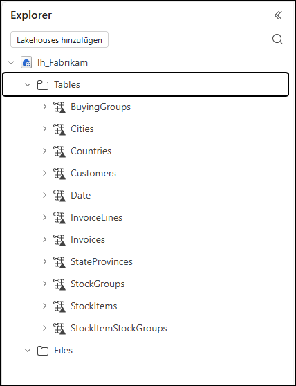

14. Sie können jetzt auf der linken Seite oder in der Arbeitsbereichsansicht zum **Daten-Agent** zurückkehren.

    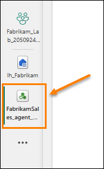

    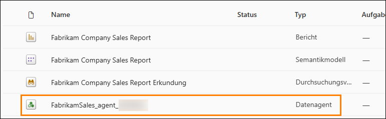

15. Klicken Sie in Ihrem Daten-Agent auf das Dropdownfeld **Daten hinzufügen**, und wählen Sie im Explorer-Bereich **Datenquelle** aus.

    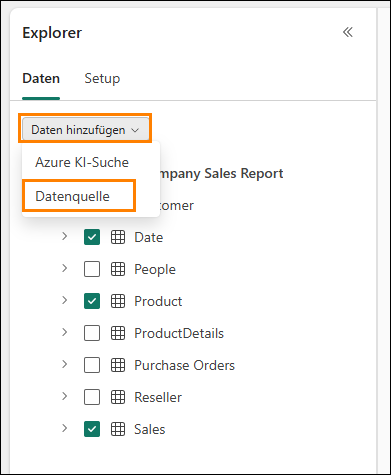

16. Wählen Sie **lh_Fabrikam** aus, und klicken Sie dann auf **Hinzufügen**.

    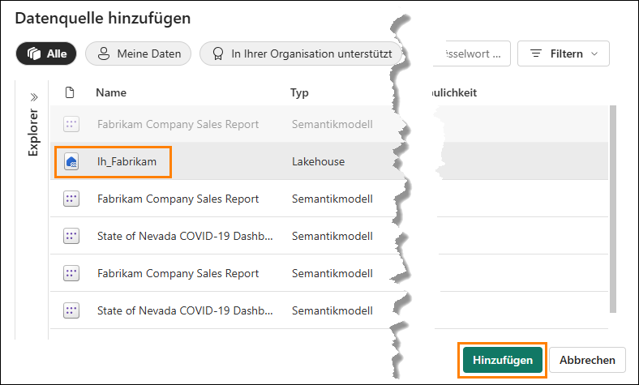

17. Sie haben jetzt zwei Datenquellen im Bereich **Explorer**.

    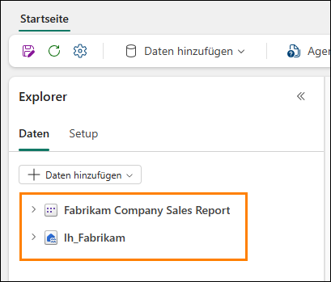

18. Öffnen Sie das Lakehouse, und fügen Sie alle potenziellen Datenquellen aus lh_Fabrikam hinzu. Es kann ein paar Minuten dauern, bis alle Lakehouse-Elemente angezeigt werden. Warten Sie ein wenig, bis alles geladen ist, und aktualisieren Sie bei Bedarf.

    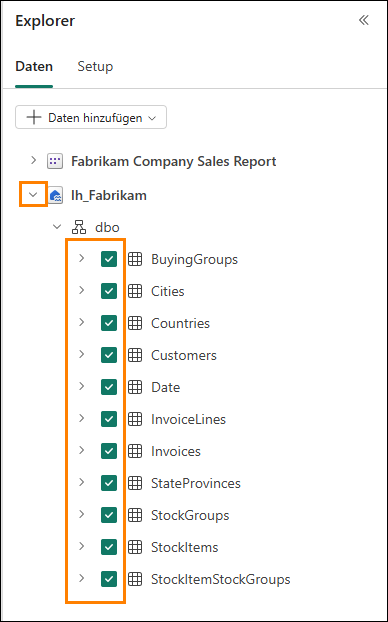

19. Gehen Sie zurück zum Prompt Ihres Daten-Agents, und geben Sie Folgendes ein: **What are total sales by product lead time?**

    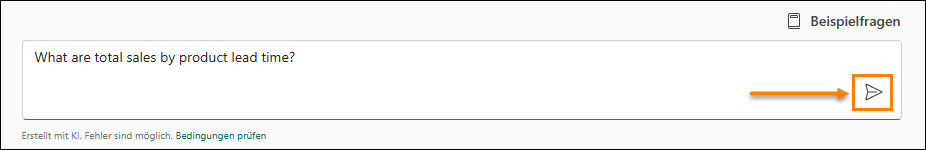

20. Der Fabric-Daten-Agent hat diese Anfrage perfekt beantwortet und die gewünschten Ergebnisse unserem Lakehouse entnommen. Sie können die Daten aus dem Fabrikam Company Sales Report jederzeit abwählen, um stattdessen die Verwendung von Lakehouse durch Copilot zu erzwingen. Wir werden jedoch zu einem späteren Zeitpunkt Anweisungen verwenden, um dies besser zu lösen.

21. Klappen Sie den Abschnitt „Abgeschlossene Schritte“ auf, um die SQL zu überprüfen, die vom Daten-Agent generiert wurde, um zu diesem Ergebnis zu gelangen.

    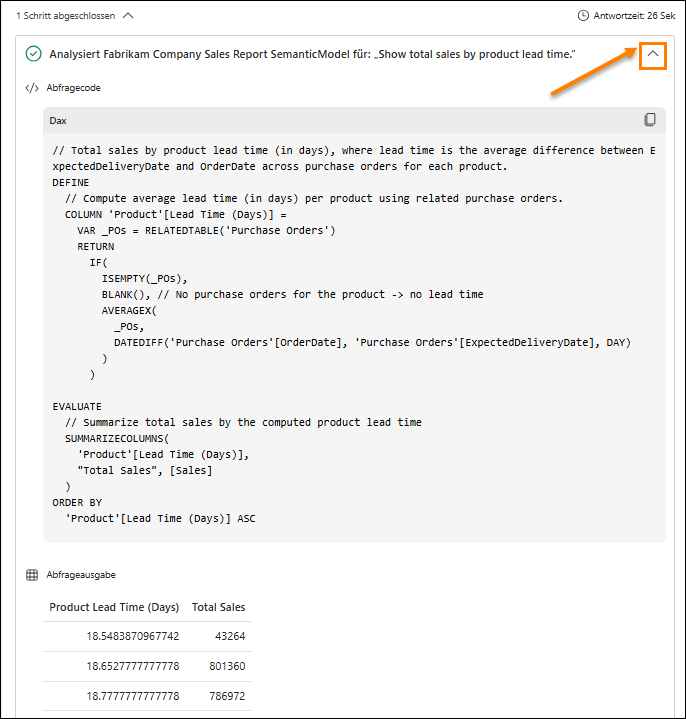

22. Zur Erinnerung: Es ist wichtig, die Ergebnisse des Daten-Agents zu validieren. Da Daten-Agents den verwendeten SQL-Code offenlegen, können Sie ihn überprüfen und sogar mit dem Lakehouse ausführen, um sicherzustellen, dass die Ergebnisse korrekt sind.

    Es ist möglich, dass bestimmte Benutzeranfragen an den Daten-Agent Ergebnisse aus der falschen Datenquelle zurückgeben. So könnte die Frage nach dem Gesamtumsatz nach Produkt z. B. aus der Datenquelle Lakehouse oder dem semantischen Modell beantwortet werden. Um sicherzustellen, dass der Daten-Agent die Anfrage aus der gewünschten Datenquelle beantwortet, können Sie zusätzliche KI-Anweisungen hinzufügen, um die gewünschten Ergebnisse zu erhalten.

23. Öffnen Sie die KI-Anweisungen in Ihrem Daten-Agent, und fügen Sie im Abschnitt „Agent-Anweisungen“ die folgende Anweisung hinzu:

    **## Data Source Priority**

    **Always use the Fabrikam Company Sales Report to answer questions unless the user explicitly ask about lead time.**

    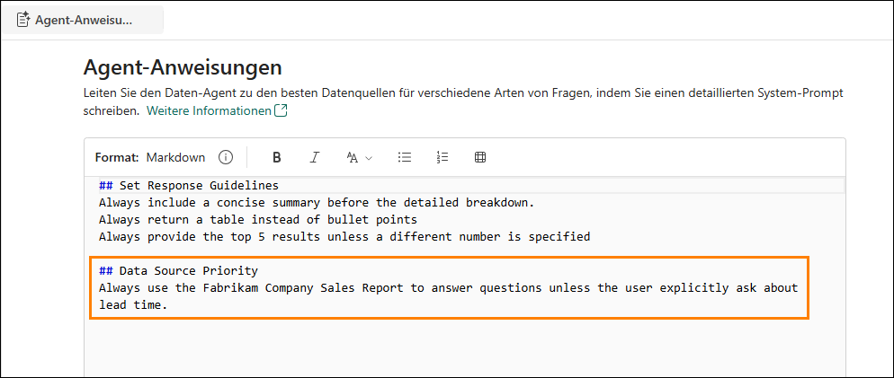

## Spotlight: Datenquellenanweisungen

1. Schauen wir uns als Nächstes die Datenquellenanweisungen an.

2. Wählen Sie im Bereich „KI-Anweisungen“ die Auslassungspunkte neben Ihrem Lakehouse, und dann **Anweisungen für Datenquelle** aus, und klappen Sie das Lakehouse auf. Sie werden feststellen, dass KI- Anweisungen im Gegensatz zu semantischen Modellen für Lakehouses auf Datenquellenebene unterstützt werden.

    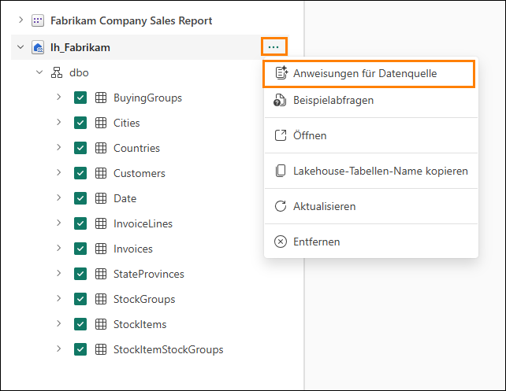

    Das Hinzufügen von Datenquellenanweisungen an dieser Stelle kann der KI dabei helfen, die Daten in Ihrem Lakehouse besser zu verstehen. Gut definierte KI-Anweisungen helfen der KI, Ihren Geschäftskontext, Ihre Terminologie und Ihre analytischen Prioritäten besser zu verstehen.

    Sie haben in diesem Kurs bei der Vorbereitung Ihres semantischen Modells für KI bereits alles über KI- Anweisungen gelernt. Wir werden diese Informationen hier nicht noch einmal aufgreifen. Denken Sie einfach daran, wenn Sie der Meinung sind, dass der Daten-Agent weitere Erläuterungen benötigt, dann können Sie diese hier hinzufügen.

## Aufgabe 6: Bespielfragen erstellen

Die Optimierung eines Daten-Agents ist keine einmalige Sache, sondern ein fortlaufender iterativer Prozess, der Experimentieren, Beobachten und Verfeinern umfasst. Ein Teil des Verfeinerungsprozesses besteht darin, Beispielabfragen zu erstellen, die der KI dabei helfen können zu verstehen, wie komplexe Fragen zu beantworten sind, die in der Datenquelle möglicherweise viel SQL oder KQL erfordern.

Daten-Agents können Beispielabfragen, auch als „Few-Shot-Beispiele“ bekannt, zur Verbesserung der Genauigkeit und Relevanz ihrer Antworten nutzen, wenn sie Fragen in natürlicher Sprache in SQL oder KQL (NL2SQL, NL2KQL) umwandeln.

**ℹ️ Wichtig**

Die Funktion für Beispielabfragen wird für semantische Modelle derzeit nicht unterstützt.

Beispielabfragen umfassen zwei Schritte.

1) Als Erstes stellen Sie eine Beispielfrage zur Verfügung, und die KI gleicht semantisch ähnliche Fragen mit der von Ihnen bereitgestellten Frage ab.

2) Als Zweites stellen Sie eine Beispielabfrage. Diese Abfrage verarbeitet komplexe Verknüpfungen, komplexe Prädikate und andere erweiterte Szenarien, um den Agent beim Erstellen einer Antwort zu unterstützen.

    Eine Übung zu Beispielfragen **würde den Rahmen dieses Kurses sprengen**. Wenn Sie jedoch eine Beispielabfrage erstellen möchten, können Sie wie folgt vorgehen:

3) Klicken Sie auf die Auslassungspunkte neben dem Lakehouse, und wählen Sie **Beispielabfragen** aus, um den Bereich zu öffnen.

    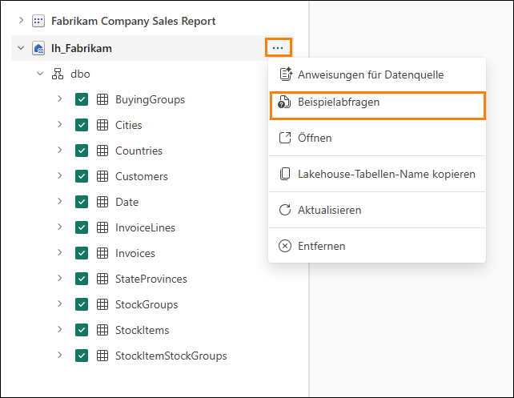

4) Klicken Sie im Bereich „Beispielabfragen“ auf die Schaltfläche **Beispiel hinzufügen**.

    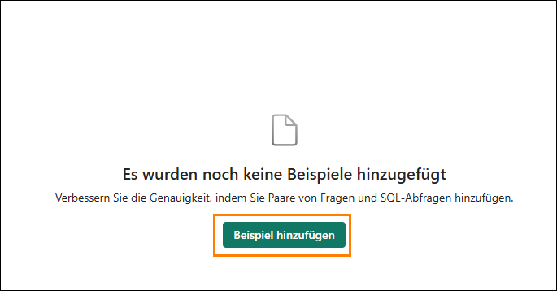

5) Fügen Sie eine Beispielfrage hinzu, und drücken Sie die Eingabetaste. Zum Beispiel: **Show sales by country that the product was manufactured in.**

    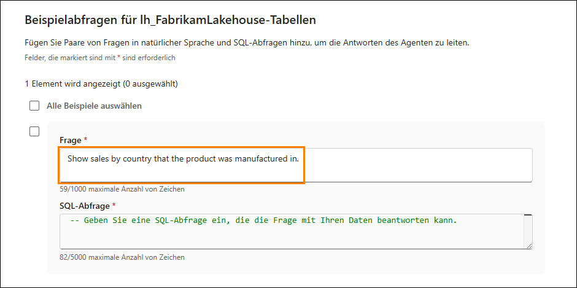

6) Geben Sie im Dialogfeld „SQL-Abfrage“ die SQL ein, die der Agent bei der Beantwortung von dieser Art von Fragen verwenden soll. Wenn Sie fertig sind, klicken Sie auf das (X) in der oberen rechten Ecke, und testen Sie Ihren Agent.

    **ℹ️ Wichtig**

    Der Code wird nicht hier in der Übung bereitgestellt, da er außerhalb des Rahmens dieses Kurses liegt. Sie können jedoch Ihren eigenen Code generieren und erkunden, wenn es die Zeit erlaubt.

    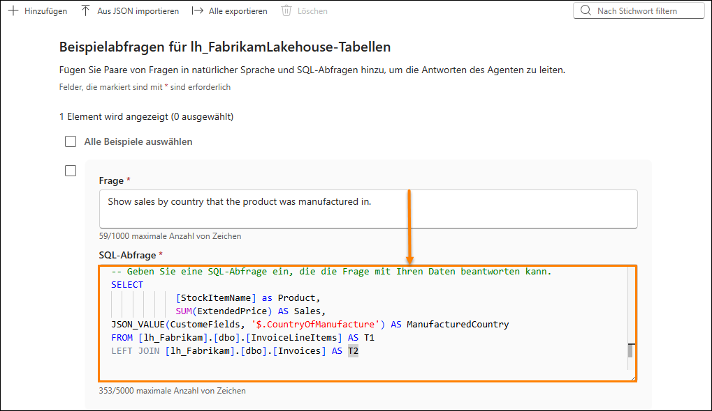

    **Profi-Tipp**: Jede dieser Fragen zielt auf unterschiedliche Analyseszenarien ab – geografische Analysen, gefilterte Aggregationen, Umsatzberechnungen und hierarchische Zeitanalysen. Experimentieren Sie mit Variationen, um zu sehen, wie sich der Daten-Agent an verschiedene Fragestile anpasst.

    **Weiter experimentieren**: Versuchen Sie, komplexere Fragen im Agent zu stellen, und erstellen Sie dann Frage-/SQL-Paare, die den Daten-Agent bei der Beantwortung von Benutzeranfragen unterstützen.

## Aufgabe 7: Daten-Agent veröffentlichen und teilen

1. Es ist Zeit, Ihren Daten-Agent zu veröffentlichen. Klicken Sie im Menü „Start“ auf die Schaltfläche **Veröffentlichen**.

    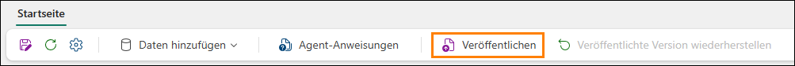

2. Fügen Sie Ihrem Agent als Nächstes eine Beschreibung hinzu. Nennen Sie Zweck und Funktionen des Agents. Klicken Sie auf **Veröffentlichen**.

    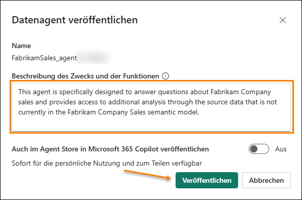

3. Nach der Veröffentlichung Ihres Agents sollten Sie ihn teilen. Klicken Sie oben rechts auf dem Bildschirm auf die Schaltfläche **Freigeben**.

    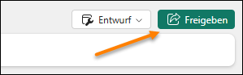

4. Klicken Sie in dem sich öffnenden Feld **Link erstellen und senden** auf die Schaltfläche **Anzeige für Personen in Ihrer Organisation**.

    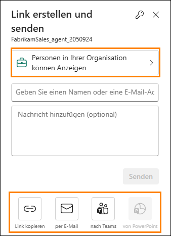

5. Wählen Sie hier Ihre Berechtigungseinstellungen aus, und klicken Sie dann auf **Übernehmen**.

    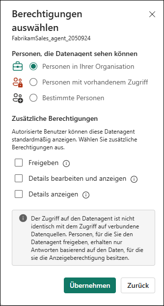

    **ℹ️ Wichtig**

    Der Zugriff auf den Daten-Agent ist nicht mit dem Zugriff auf verbundene Datenquellen identisch. Personen, für die Sie den Daten-Agent freigeben, erhalten nur Antworten auf der Grundlage der Daten, zu deren Anzeige sie berechtigt sind.

6. Der veröffentlichte Fabric-Daten-Agent kann auf verschiedenen Plattformen verwendet werden, darunter:

    - Microsoft Fabric

    - Copilot Studio

    - Microsoft Teams

    - Notebooks

    - Power BI Copilot

    - Azure AI Foundry

    - kundenspezifische Anwendungen über API

7. Bewegen Sie in Ihrem Arbeitsbereich den Mauszeiger über Ihren Daten-Agent, damit die Auslassungspunkte **(...)** angezeigt werden.

    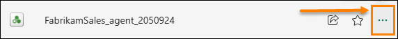

8. Klicken Sie auf die Auslassungspunkte, und wählen Sie **Berechtigungen verwalten** aus.

    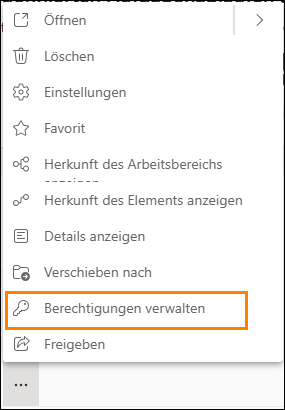

9. Sie können den Daten-Agent auch von hier aus teilen oder verwalten, wer über seinen Zugriff auf den Arbeitsbereich auch direkten Zugriff auf den Agent hat. Sie können entweder im Link-Menü **+Link hinzufügen** oder im Menü „Direkter Zugriff“ **+Benutzer hinzufügen** auswählen. Wenn Sie Benutzer zum Arbeitsbereich hinzufügen, erhalten diese Zugriff auf den Agent.

    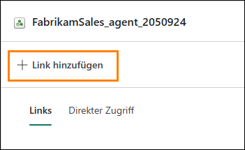

    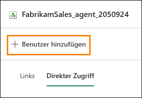

## Aufgabe 8: Einen Daten-Agent aus Copilot heraus nutzen

1. Der Agent kann auf viele Arten genutzt werden (siehe Schritt 6 oben). Wir versuchen nun, unseren Daten-Agent über die eigenständige Copilot-Umgebung zu nutzen. Klicken Sie in Ihrem Arbeitsbereich auf die Schaltfläche „Copilot“. (HINWEIS: Möglicherweise müssen Sie auf die Auslassungspunkte in der Seitenleiste klicken, um die Copilot-Schaltfläche anzuzeigen.)

    (Erinnerung: Stellen Sie sicher, dass Sie im Beispiel auf Ihren Daten-Agent verweisen.)

2. Wählen Sie das Pluszeichen. Beachten Sie, dass Ihr Agent als Option zur Verwendung mit Copilot angeboten wird. Das macht den Unterschied zwischen der eigenständigen Copilot-Umgebung und dem Daten-Agent deutlich.

    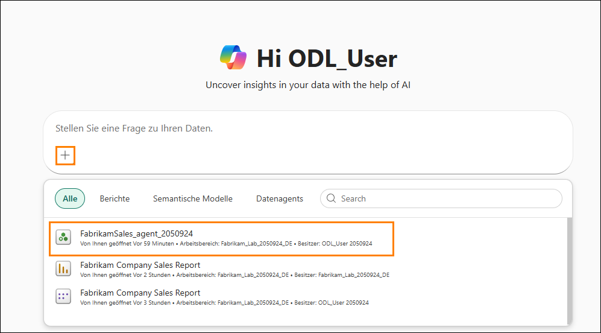

3. Bewegen Sie in Ihrem Arbeitsbereich den Mauszeiger über Ihren Daten-Agent, und klicken Sie erneut auf die Auslassungspunkte (...).

    

4. Wählen Sie aus dem Menü **Einstellungen** aus.

    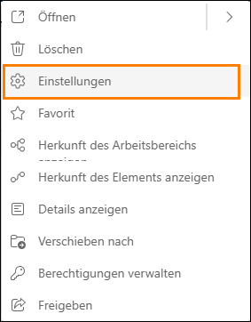

5. Wählen Sie aus dem neuen Fenster **Endorsement** aus.

    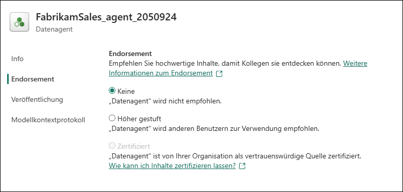

6. Im Zusammenhang mit **Copilot** – insbesondere bei der Arbeit mit **Daten-Agents** in Power BI und Microsoft Fabric – **bedeutet Endorsement für einen Daten-Agent,** diesem Agent in der Umgebung einer Organisation eine formelle Genehmigung oder Zertifizierung zu erteilen. Dazu gehört in der Regel, den Agent für Benutzer leicht auffindbar und vertrauenswürdig zu machen, indem er als heraufgestuft oder zertifiziert markiert wird.

# Referenzen

Chat with Your Data in a Day (CDIAD) bietet eine Einführung in einige der wichtigsten Funktionen bei der Verwendung der eigenständigen Copilot-Umgebung in einem Fabric-Arbeitsbereich.

Das Dienst-Menü verfügt im Hilfe-Abschnitt (?) über Verknüpfungen zu praktischen Informationen. Vergessen Sie nicht, dass die angezeigte Ansicht von der Umgebung abhängt, in der Sie sich gerade befinden. Die Ihnen angezeigten Optionen können sich daher von der folgenden Abbildung unterscheiden.

Nachfolgend finden Sie weitere Ressourcen zur Arbeit mit Microsoft Fabric.

- Zugriff auf alle Informationen in der [Hauptdokumentation von Microsoft Fabric](https://learn.microsoft.com/en-us/fabric/)

- Fabric bei einer [interaktiven Vorstellung kennenlernen](https://aka.ms/Fabric-GuidedTour)

- Zur [kostenlosen Testversion von Microsoft Fabric](https://aka.ms/try-fabric) anmelden

- Besuchen Sie die [Microsoft Fabric-Website](https://aka.ms/microsoft-fabric)

- Mit den Modulen von [Fabric Learning neue Qualifikationen erwerben](https://aka.ms/learn-fabric)

- [Kostenloses E-Book zum Einstieg in Fabric lesen](https://aka.ms/fabric-get-started-ebook)

- Mitglied der [Fabric-Community](https://aka.ms/fabric-community) werden, um Fragen zu stellen, Feedback zu geben und sich mit anderen auszutauschen

Lesen Sie die ausführlichere technische Dokumentation zu Copilot:

- [Übersicht über Copilot für Power BI – Power BI | Microsoft Learn](https://learn.microsoft.com/en-us/power-bi/create-reports/copilot-introduction)

- [Eigenständige Copilot-Umgebung in Power BI (Vorschauversion) – Power BI | Microsoft Learn](https://learn.microsoft.com/en-us/power-bi/create-reports/copilot-chat-with-data-standalone)

- [Microsoft Fabric Copilot-Admineinstellungen | Microsoft Learn](https://learn.microsoft.com/en-us/fabric/admin/service-admin-portal-copilot)

- [Erstellung eines Fabric-Daten-Agents (Vorschauversion) – Erfahren Sie, wie Sie einen Fabric-Daten-Agent erstellen | Microsoft Learn](https://learn.microsoft.com/en-us/fabric/data-science/concept-data-agent)

- [Bewährte Vorgehensweisen bei der Konfiguration Ihres Daten-Agents – Microsoft Fabric | Microsoft Learn](https://learn.microsoft.com/en-us/fabric/data-science/data-agent-configuration-best-practices)

- [Copilot für Microsoft Fabric und Power BI: (FAQ) – Microsoft Fabric | Microsoft Learn](https://learn.microsoft.com/en-us/fabric/fundamentals/copilot-faq-fabric)

© 2026 Microsoft Corporation. Alle Rechte vorbehalten.

Durch Nutzung dieser Demo/Übung erklären Sie sich mit folgenden Bedingungen einverstanden:

Die in dieser Demo/Übung beschriebene Technologie/Funktionalität wird von der Microsoft Corporation bereitgestellt, um Feedback von Ihnen zu erhalten und Ihnen Wissen zu vermitteln. Sie dürfen die Demo/Übung nur verwenden, um derartige Technologiefeatures und Funktionen zu bewerten und Microsoft Feedback zu geben. Es ist Ihnen nicht erlaubt, sie für andere Zwecke zu verwenden. Es ist Ihnen nicht gestattet, diese Demo/Übung oder einen Teil derselben zu ändern, zu kopieren, zu verbreiten, zu übertragen, anzuzeigen, auszuführen, zu vervielfältigen, zu veröffentlichen, zu lizenzieren, zu transferieren oder zu verkaufen oder aus ihr abgeleitete Werke zu erstellen.

DAS KOPIEREN ODER VERVIELFÄLTIGEN DER DEMO/ÜBUNG (ODER EINES TEILS DERSELBEN) AUF EINEN/EINEM ANDEREN SERVER ODER SPEICHERORT FÜR DIE WEITERE VERVIELFÄLTIGUNG ODER VERBREITUNG IST AUSDRÜCKLICH UNTERSAGT.

DIESE DEMO/ÜBUNG BIETET BESTIMMTE SOFTWARETECHNOLOGIE/PRODUKTFUNKTIONEN UND FUNKTIONALITÄT, EINSCHLIESSLICH MÖGLICHER NEUER FUNKTIONEN UND KONZEPTE, IN EINER SIMULIERTEN UMGEBUNG OHNE KOMPLEXE EINRICHTUNG ODER INSTALLATION FÜR DEN BESCHRIEBENEN ZWECK OBEN. DIE IN DIESER DEMO/ÜBUNG DARGESTELLTEN TECHNOLOGIEN/ KONZEPTE STELLEN MÖGLICHERWEISE NICHT DIE VOLLSTÄNDIGE FUNKTIONALITÄT DER FUNKTION DAR UND FUNKTIONIEREN MÖGLICHERWEISE NICHT SO, WIE EINE ENDGÜLTIGE VERSION FUNKTIONIEREN KÖNNTE. UNTER UMSTÄNDEN VERÖFFENTLICHEN WIR AUCH KEINE ENDGÜLTIGE VERSION DERARTIGER FEATURES ODER KONZEPTE. IHRE ERFAHRUNG BEI DER VERWENDUNG DERARTIGER FEATURES UND FUNKTIONEN IN EINER PHYSISCHEN UMGEBUNG KANN FERNER ABWEICHEND SEIN.

**FEEDBACK.** Wenn Sie Feedback zu den Technologiefeatures, Funktionen und/oder Konzepten geben, die in dieser Demo/Übung beschrieben werden, gewähren Sie Microsoft das Recht, Ihr Feedback in jeglicher Weise und für jeglichen Zweck kostenlos zu verwenden, zu veröffentlichen und gewerblich zu nutzen. Außerdem treten Sie Dritten kostenlos sämtliche Patentrechte ab, die erforderlich sind, damit deren Produkte, Technologien und Dienste bestimmte Teile einer Software oder eines Dienstes von Microsoft, welche/welcher das Feedback enthält, verwenden oder eine Verbindung zu dieser/diesem herstellen können. Sie geben kein Feedback, das einem Lizenzvertrag unterliegt, aufgrund dessen Microsoft Drittparteien eine Lizenz für seine Software oder Dokumentation gewähren muss, weil wir Ihr Feedback in diese aufnehmen. Diese Rechte bestehen nach Ablauf dieser Vereinbarung fort.

DIE MICROSOFT CORPORATION LEHNT HIERMIT JEGLICHE GEWÄHRLEISTUNGEN UND GARANTIEN IN BEZUG AUF DIE DEMO/ÜBUNG AB, EINSCHLIESSLICH ALLER AUSDRÜCKLICHEN, KONKLUDENTEN ODER GESETZLICHEN GEWÄHRLEISTUNGEN UND GARANTIEN DER HANDELSÜBLICHKEIT, DER EIGNUNG FÜR EINEN BESTIMMTEN ZWECK, DES RECHTSANSPRUCHS UND DER NICHTVERLETZUNG VON RECHTEN DRITTER. MICROSOFT MACHT KEINERLEI ZUSICHERUNGEN BZW. ERHEBT KEINERLEI ANSPRÜCHE IM HINBLICK AUF DIE RICHTIGKEIT DER ERGEBNISSE UND DES AUS DER VERWENDUNG DER DEMO/ÜBUNG RESULTIERENDEN ARBEITSERGEBNISSES BZW. BEZÜGLICH DER EIGNUNG DER IN DER DEMO/ÜBUNG ENTHALTENEN INFORMATIONEN FÜR EINEN BESTIMMTEN ZWECK.

**HAFTUNGSAUSSCHLUSS**

Diese Demo/Übung enthält nur einen Teil der neuen Features und Verbesserungen in Microsoft Power BI. Einige Features können sich unter Umständen in zukünftigen Versionen des Produkts ändern. In dieser Demo/Übung erhalten Sie Informationen über einige, aber nicht über alle neuen Features.
