# Microsoft Fabric Chat with your Data in a Day - Lab 1

## Sommario

- Struttura del documento
- Scenario/Esposizione del problema
- Introduzione
    - Attività 1: utilizzo dell'ambiente virtuale
    - Attività 2: valutazione della preparazione dei dati per l'IA
    - Attività 3: scrittura di un prompt in Power BI Copilot

# Struttura del documento

Il lab include i passaggi che l'utente deve seguire con gli screenshot associati che forniscono un aiuto visivo. In ogni screenshot vi sono sezioni evidenziate con riquadri arancioni che indicano le aree su cui l'utente deve concentrarsi.

# Scenario/Esposizione del problema

L'organizzazione è appena tornata da una conferenza Microsoft in cui ha sentito e visto come l'esperienza Chat with your Data, basata su Copilot, può accelerare notevolmente i tempi di acquisizione delle informazioni dettagliate. Le demo hanno mostrato come le query in linguaggio naturale possano sbloccare potenti capacità di analisi, a condizione che i modelli semantici sottostanti siano ben strutturati e ottimizzati per l'IA.

**Obiettivo attuale**

SI è ricevuto l'incarico di valutare un modello semantico esistente all'interno di Power BI Desktop. L'obiettivo è testare le prestazioni dell'esperienza Copilot e identificare le aree di miglioramento.

Esplorare il modello semantico tramite PBI Desktop integrato nell'interfaccia Copilot

Identificare i punti di attrito in cui Copilot fatica a interpretare l'intento

Consigliare e implementare miglioramenti per migliorare la comprensione di Copilot

Documentare i risultati e preparare il modello per un uso organizzativo più ampio

# Introduzione

Nella demo dell'istruttore è stato mostrato quanto l'esperienza Chat with your Data possa risultare efficace; in questo lab viene evidenziato quanto sia necessario preparare i modelli di dati per l'IA. Questo lab mostrerà varie richieste degli utenti e il modo in cui Copilot risponde a tali richieste. Si apprenderà inoltre come convalidare l'accuratezza e la correttezza delle risposte. Nei lab futuri si apprenderà come applicare le procedure consigliate e usare la preparazione degli strumenti per i dati per potenziare e migliorare l'esperienza Copilot.

## Attività 1: utilizzo dell'ambiente virtuale

1. L'esperienza dell'ambiente virtuale offre uno spazio disponibile e altamente efficace per lavorare con l’esperienza Chat with Your Data. Esaminiamo alcune aree e punti chiave.

    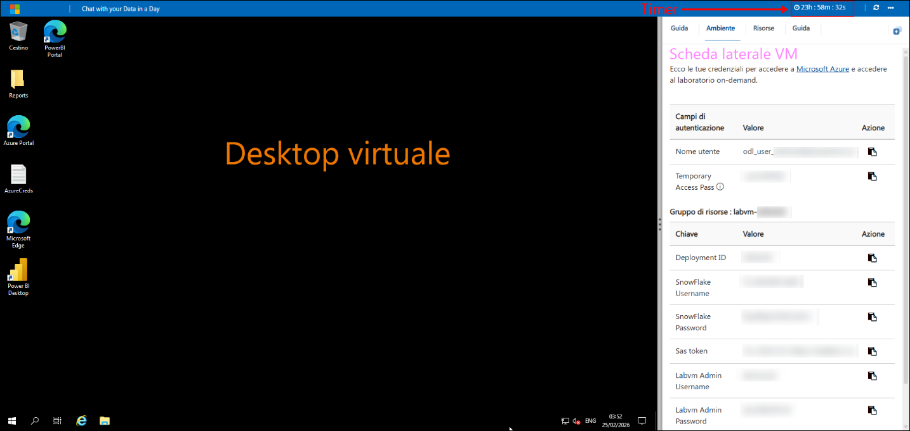

2. Ecco alcune aree e punti chiave:

    - Il desktop virtuale funge da computer completamente funzionale da utilizzare nel browser.

    - La scheda laterale della VM consente di accedere ai documenti del lab, alle credenziali e ad altri contenuti.

    **ℹ️ Importante**

1. Nel corso dei lab della classe, queste caselle **importanti** contengono informazioni preziose. È importante non saltarle. Ad esempio, SE la scheda laterale della VM non viene visualizzata, assicurarsi di espanderla completamente, come mostrato nell'immagine seguente.

    Il timer mostra il tempo rimanente per usare la macchina virtuale.

    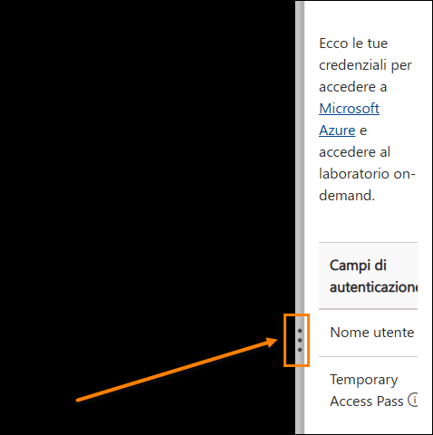

3. È possibile spostarsi facilmente tra i lab utilizzando il numero di pagina nella parte inferiore della scheda laterale.

    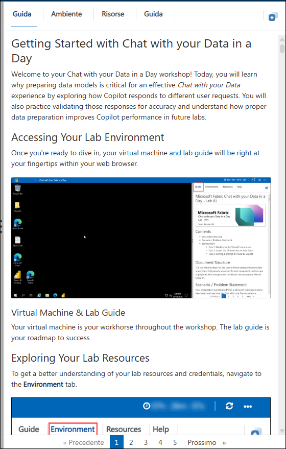

4. Durante la lezione è possibile lavorare interamente all'interno della macchina virtuale. Tuttavia, alcuni partecipanti preferiscono lavorare con un browser in incognito e accedere a Power BI Desktop con le credenziali della macchina virtuale assegnate. Questo approccio è perfettamente accettabile.

## Attività 2: valutazione della preparazione dei dati per l'IA

1. Ora che sono state visualizzate le aree principali della macchina virtuale, passare al pulsante del portale Power BI per avviare il servizio Power BI.

    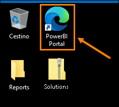

2. Utilizzando le credenziali elencate nella pagina delle credenziali e nel documento, fornire l'indirizzo e-mail nell'area Accesso e-mail.

    - **Username/Email:** **<inject key="AzureAdUserEmail"></inject>** 

        

3. Quindi utilizzare la casella **Accedi** di Microsoft con le stesse credenziali e fare clic su **Avanti**.

    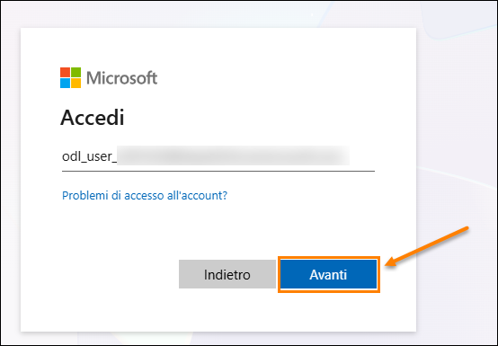

4. Immettere il **pass di accesso temporaneo** fornito dalla pagina delle credenziali o dal documento del lab e premere **Accedi**. Se richiesto, selezionare Sì per mantenere l'accesso.

    - **Password:** **<inject key="AzureAdUserPassword"></inject>**

        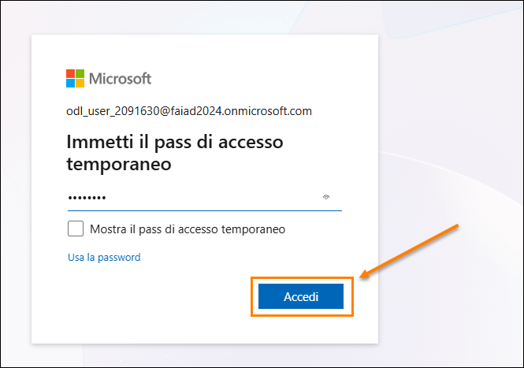

5. Per prima si accederà all'area **Aree di lavoro** nel menu a sinistra.

    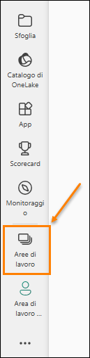

6. Verrà creata una **nuova area di lavoro** selezionando il pulsante Nuova area di lavoro.

    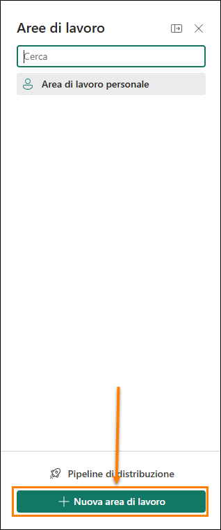

7. Assegnare quindi un nome all'area di lavoro: **Fabrikam_Lab_<inject key="DeploymentID" enableCopy="false"></inject>_IT**

    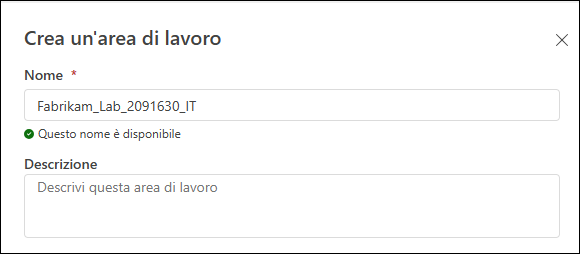

8. Il codice a 7 cifre fa parte del nome utente assegnato per la lezione. È necessario utilizzarlo.
    Vedere lo screenshot seguente.

    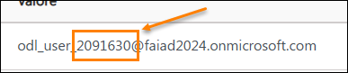

9. Ad esempio, John A. Smith sarebbe: **Fabrikam_Lab_<inject key="DeploymentID" enableCopy="false"></inject>_IT**

    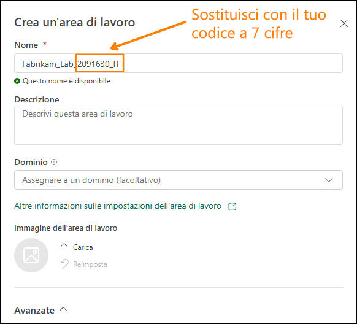

10. Successivamente, è necessario assegnare una capacità Fabric all'area di lavoro.

11. Fare clic su **Avanzate** per espandere le opzioni avanzate durante la configurazione di un'area di lavoro.

    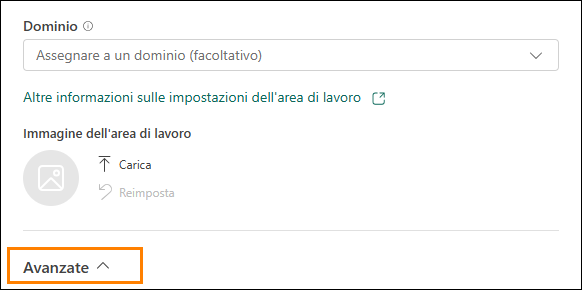

12. Assicurarsi che sia selezionata la **capacità Fabric**. Scorrere leggermente verso il basso e selezionare, **a caso**, una capacità dal menu a discesa.

    **ℹ️ Importante**

2. L'ambiente Fabric utilizzato per questa lezione verrà aggiornato spesso: le capacità elencate quindi POTREBBERO NON corrispondere a quelle mostrate nello screenshot. Basta scegliere qualsiasi capacità disponibile.

    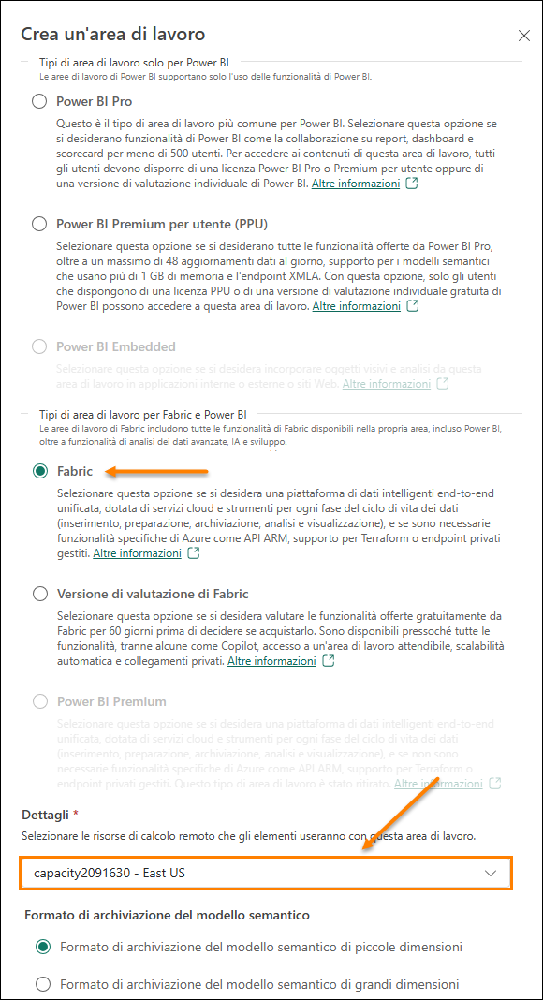

13. Fare clic su **Applica**.

    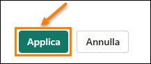

    A questo punto viene utilizzata l'area di lavoro Capacità Fabric per esplorare tutte le funzionalità offerte da Chat with Your Data.

14. Aprire il file denominato **CDIAD – Lab 01 – Start** dai file della lezione per iniziare a esplorare l'esperienza Chat with your Data.

    

15. Immettere il proprio indirizzo e-mail **<inject key="AzureAdUserEmail"></inject>** nel file Power BI Desktop e premere Continua per accedere utilizzando le proprie credenziali:

    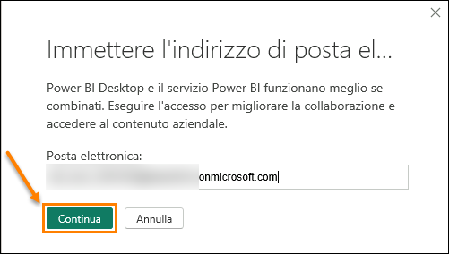

16. Inoltre, eseguire l'accesso tramite la finestra di accesso Microsoft utilizzando lo stesso nome <inject key="AzureAdUserEmail"></inject> utente e il pass di accesso temporaneo <inject key="AzureAdUserPassword"></inject>

    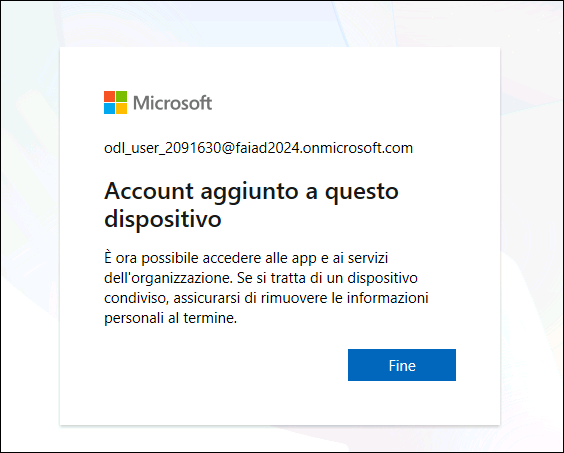

17. Con il file PBIX iniziale aperto, passare al pulsante Copilot e selezionarlo per aprire l'esperienza Copilot.

    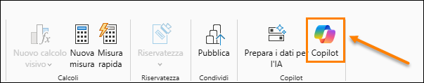

18. Se si è già effettuato l'accesso, si apre una nuova finestra per **Connettiti a un'area di lavoro che supporta Copilot.** Fare clic sull'opzione **Selezionare un'area di lavoro** e selezionare l'area di lavoro appena creata.

    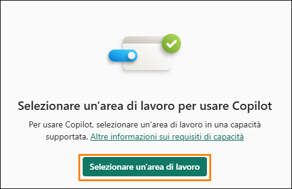

    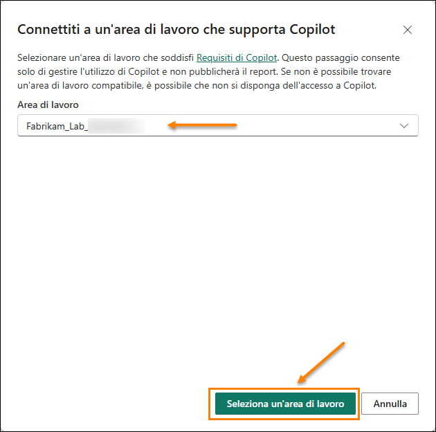

19. Se viene visualizzato un messaggio nella schermata successiva, fare clic su **Inizia**.

    

20. Ti diamo il benvenuto nell'esperienza. Copilot in Power BI. Nella schermata iniziale vengono mostrati alcuni suggerimenti di prompt nella parte superiore **(1)** e una sezione nella parte inferiore in cui è possibile scrivere la propria richiesta **(2).**

    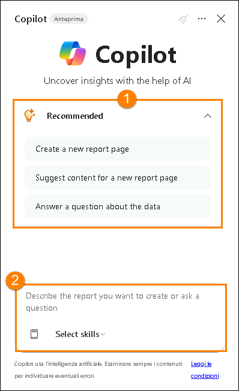

## Attività 3: scrittura di un prompt in Power BI Copilot

In questa sezione vengono inseriti diversi prompt ed esplorati i risultati restituiti dall'esperienza Power BI Copilot.

1. Fare clic nel prompt e scrivere quanto segue: **Show total purchases by employee**. Quindi, fare clic su **INVIO**.

    

    **Opzioni possibili:**

    **ℹ️ Importante**

    L'IA restituisce risultati non deterministici a causa di molti fattori. Come discusso in precedenza in questa lezione, i risultati potrebbero variare e potrebbero non essere identici a quelli dei lab. Si noti che questi dati non preparati per l’IA possono produrre risultati diversi anche con la stessa identica domanda. Procedere quindi con l’esplorazione delle funzionalità e delle caratteristiche visualizzate, sfruttandole al meglio delle proprie possibilità.

    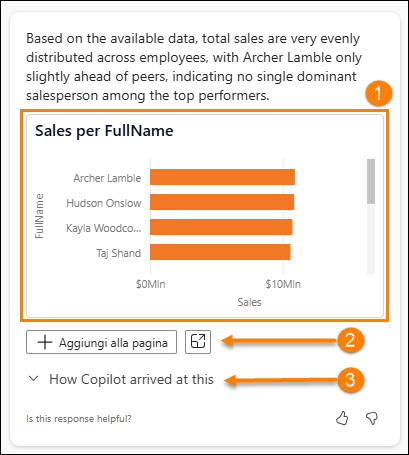

    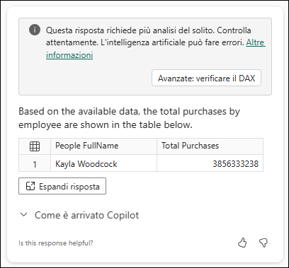

    È possibile che vengano poste ulteriori domande di follow-up, come quella indicata di seguito:

    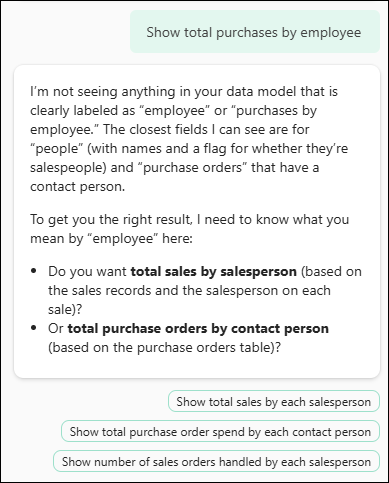

    Se necessario, scegli la più simile a **Show total purchases by employee** o **continua con i prompt.**

2. Viene ora restituita una grande quantità di informazioni. Esaminiamo questa sezione in modo più approfondito.

    1. **(1)** Viene visualizzata una rappresentazione grafica che confronta gli acquisti totali e i dipendenti.

    2. **(2)** Aree da **aggiungere alla pagina** o per **aprire ed** **espandere** l'oggetto visivo.

    3. **(3)** *HCAAT:* Come Copilot è arrivato a questo risultato.

        

3. Fare clic sul pulsante *HCAAT*: **Come Copilot è arrivato a questo risultato** per visualizzare la logica alla base della risposta di Copilot.

    **Opzioni possibili:**

    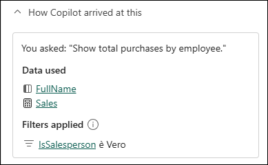

    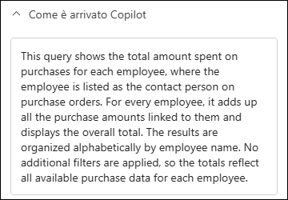

4. Passare il mouse su ***FullName***, ***Sales*** e anche ***IsSalesperson*** per vedere sia la tabella **Campo**
    che **Home** per vedere ciò che Copilot ha usato per rispondere alla domanda.

    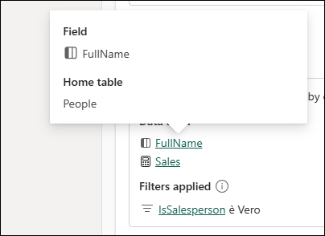

    Purtroppo si tratta di un risultato errato. È stato richiesto il totale degli acquisti e invece è stato ricevuto **il totale** **delle vendite**. L'altra query DAX ha preso in considerazione solo un singolo dipendente. Sembra che questi dati richiedano una preparazione. Si consideri questo esempio: i dati non preparati per Copilot equivalgono a un analista dati appena assunto al primo giorno di lavoro, mentre i dati preparati per Copilot equivalgono a porre una domanda a un analista esperto con molti anni di esperienza nella propria organizzazione.

    Ci sono due aspetti principali da considerare quando si preparano i dati per Copilot.

    Come primo passo, è possibile scrivere un prompt più preciso e specifico; questo contribuisce sicuramente a migliorare il risultato. Tuttavia, molti utenti non sanno come scrivere prompt efficaci e potrebbero anche non conoscere i dati abbastanza bene per essere specifici.

    **ℹ️ Importante**

    Le risposte di Copilot vengono influenzate dal modo in cui vengono poste le domande. Prompt chiari e specifici consentono di ottenere informazioni dettagliate più accurate e soluzioni più rapide. Quando si lavora con i propri dati, è consigliabile includere il contesto, i risultati desiderati ed eventuali filtri o colonne pertinenti. Più il prompt è efficace, migliore sarà la risposta.

    In secondo luogo, in qualità di analisti di dati, è possibile preparare i dati per Copilot e anticipare questo tipo di richieste, rendendo le risposte di Copilot più accurate. L'obiettivo di questo corso è illustrare le procedure consigliate e gli strumenti disponibili per migliorare l'esperienza Chat with your Data.

5. Riprovare con un prompt più specifico e, nel campo Prompt di Copilot, digitare: **Show total purchases from the PO table by employee.**

    

6. Si noterà che l'oggetto visivo creato include un solo dipendente, denominato "Kayla Woodcock". Questo è corretto. Kayla è l'unica dipendente che effettua acquisti. Essere più specifici consente quindi di ottenere risposte migliori. Inoltre, se avessimo preparato fin dall'inizio il modello semantico con una misura denominata Total Purchases, avremmo potuto evitare questo scenario.

    **Opzioni possibili:**

    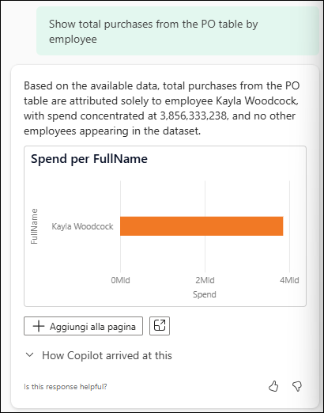

    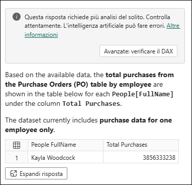

7. È molto importante verificare sempre i risultati e il modo in cui Copilot è arrivato alla risposta.
    Fare clic su **HCAAT,** Come Copilot è arrivato a questo risultato.

    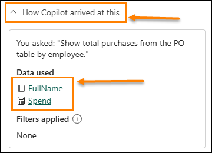

    **Se** Copilot fornisce una query DAX, provare a premere **Verifica DAX**.

    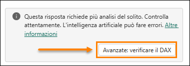

8. Come si può notare, Copilot usa la colonna FullName della tabella People e la misura Spend. Anche la query DAX sta facendo lo stesso. La misura Spend potrebbe essere rinominata in modo più appropriato per migliorare l'esperienza Copilot.

    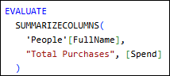

9. Che cosa indica Spend in questo contesto? Indica la stessa cosa di Purchases? È possibile che Copilot continui a restituire una risposta non corretta. Procedere quindi chiedendo a Copilot
    di spiegare come viene calcolato Spend.

10. Nel prompt di Copilot digitare: **How is the measure Spend calculated**

    **Opzioni possibili:**

    

    

11. Copilot fornisce un'ottima spiegazione generale di ciò che probabilmente sta facendo il calcolo. Tuttavia, in questa definizione potrebbero comparire termini come "Typically" o "Usually", poiché si tratta di una generalizzazione. Si potrebbe inoltre notare che Copilot indica esplicitamente di non avere accesso alla formula esatta o alla logica di calcolo e, pertanto, di non poter fornire una risposta specifica.

    Nell'altra immagine, Copilot è riuscito a recuperare correttamente la misura effettiva, a spiegarla e a fornire la risposta relativa a Spend nel contesto di filtro corrente.

    **ℹ️ Importante**

    In un lab successivo verrà illustrato come fornire a Copilot ulteriore contesto aziendale necessario per rispondere a queste domande e aumentare la fiducia dell’utente nelle risposte fornite.

12. Procedere ora con un ulteriore approfondimento e creare un oggetto visivo per dimostrare come Copilot si adatti alle modifiche del modello di dati e del report.

13. Nel prompt di Copilot digitare: **Create a new report page with a bar chart visual for sales and product tag.**

    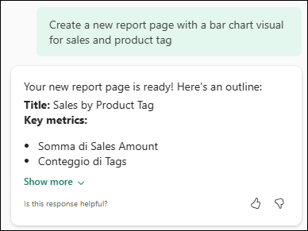

    Potrebbe essere necessario continuare a fornire prompt a Copilot, come mostrato qui:

    

    Cercare di far corrispondere il più possibile gli elementi **Total Sales** e **Product Tag**.

    Da notare che Copilot ha creato l'oggetto visivo in una nuova pagina del report.

    **Opzioni possibili:**

    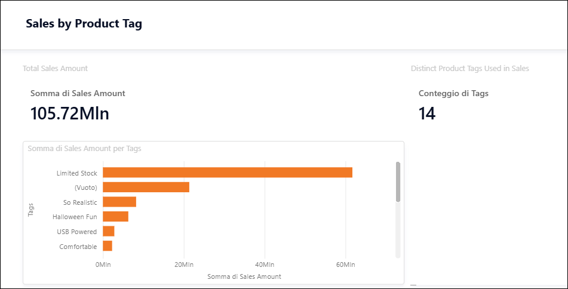

    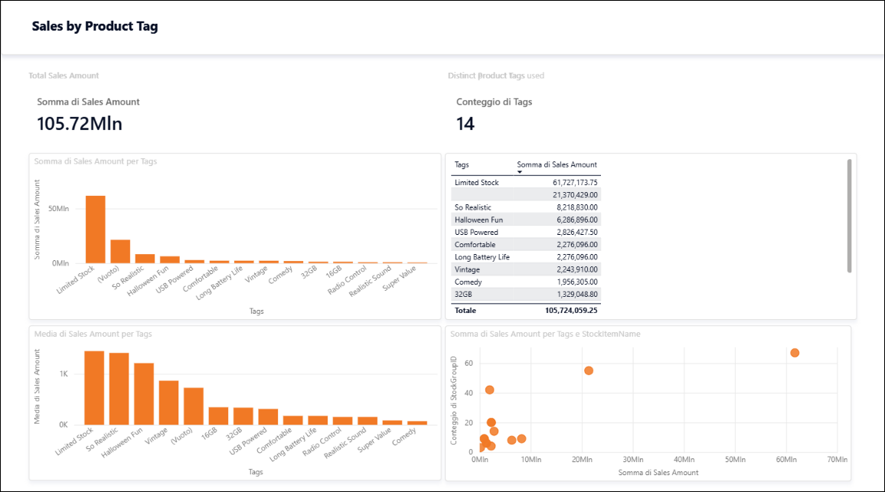

14. Selezionare l'oggetto visivo grafico a barre creato da Copilot e accedere alla sezione **Vista modello**. Si noti che è stato incluso un filtro per aggirare il modello di dati. Questo è notevole, poiché Product Tag e Total Sales normalmente non funzionerebbero nel modello di dati attuale.

    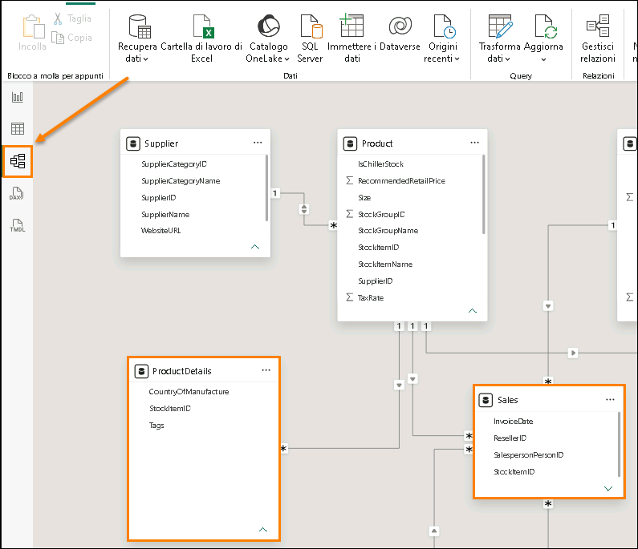

15. Questo potrebbe comportare un conteggio doppio di alcuni valori, quindi è consigliabile rimuoverlo. Tornare alla **Vista report** e assicurarsi che sia stato ancora fatto clic sul grafico.

    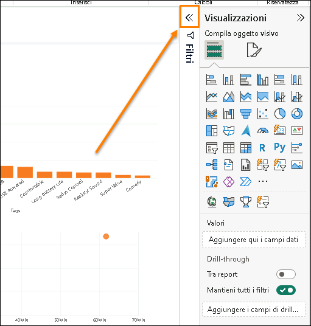

16. A destra, andare alla **scheda Filtri** sotto "Filtro in questo oggetto visivo" rimuovere "Product Details that have Products" dall'asse del grafico a barre.

    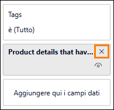

17. Notare che i valori sono tutti uguali a **\$105.724.059**; ciò può essere verificato passando il cursore sulle barre dati dell'oggetto visivo creato da Copilot. Questo rappresenta un chiaro segnale della presenza di relazioni non corrette nel modello semantico.

    

18. La risposta restituita da Copilot in precedenza non era corretta a causa della progettazione del modello semantico. Copilot è riuscito a creare un filtro per adattarsi e soddisfare la richiesta. Questo dimostra perché è importante disporre di un modello di dati preparato per l'IA. In un
    lab successivo verranno analizzate le tabelle e le relazioni e verrà mostrato come migliorarle per ottimizzare l'esperienza Copilot.

19. L'oggetto visivo evidenzia chiaramente la presenza di un problema nella risposta di Copilot. Un altro modo per visualizzare questi dati è porre una domanda a Copilot e visualizzare la risposta. Nel prompt di Copilot digitare: **Show total sales by product tag**.

    

20. Copilot indica esplicitamente, nella risposta, che non è presente **alcuna variazione** nelle vendite. Quando compare questa formulazione in Copilot, potrebbe essere un'indicazione che qualcosa non è corretto.

    

21. Porre quindi un'altra domanda a Copilot: **Show total sales by State**.

    

    Potrebbero essere restituite più risposte, *i risultati potrebbero variare.* Una possibile risposta è la seguente:

    **Opzioni possibili:**

    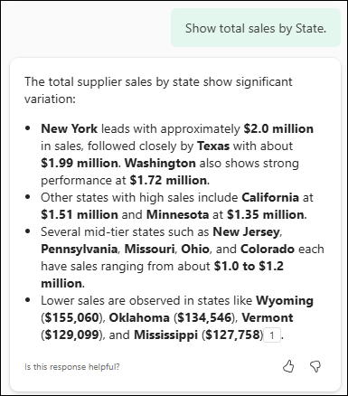

22. Questa risposta non è del tutto corretta. È nuovamente presente un errore nel modello di dati? Potrebbe dipendere dal modello di dati oppure dalla scarsa precisione del linguaggio utilizzato. Selezionare *HCAAT*: Come Copilot è arrivato a questo risultato e passare il mouse sui dati ***State*** e ***Sales*** utilizzati. Le ***vendite*** vengono calcolate correttamente tramite la misura esplicita nella tabella Sales, ma il campo ***State*** proviene dalla tabella Customer.

    

23. Passare alla vista del modello ed esaminare le relazioni del modello di dati che collegano Customer a Sales. Questo spiega perfettamente perché la visualizzazione non risulta corretta. Ora risulta chiaro che il linguaggio utilizzato e il modello di dati devono essere allineati tra loro.

    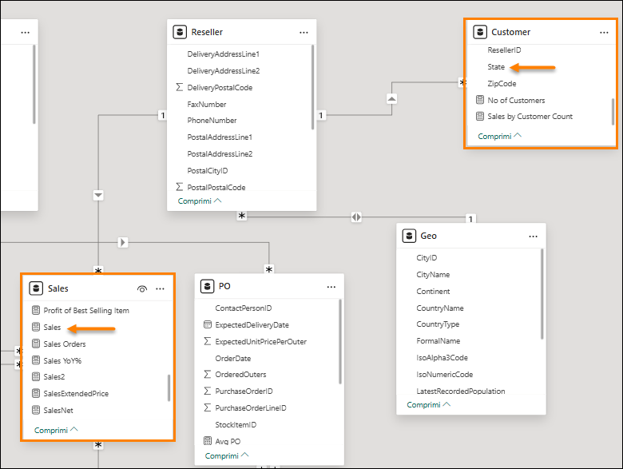

    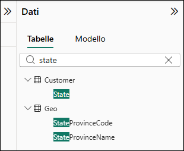

    In questo scenario, sono presenti più tabelle con una variazione di State e sono inoltre presenti più misure di vendita. Ciò può portare a risposte incoerenti e persino a risultati fuorvianti. Nei lab successivi, si apprenderanno le diverse tecniche per aiutare Copilot a rispondere a questo tipo di richieste degli utenti.

24. Provare con un altro prompt: **Sales by State**.

    

25. Negli screenshot riportati di seguito è possibile osservare che lo stato del Texas registra il valore di vendite più elevato, pari a **\$461.457 o \$2 milioni**. Queste risposte sono state generate facendo riferimento a oggetti visivi nel report, uno dei quali ha effettivamente un filtro applicato. Se i risultati sono uguali allo screenshot seguente, fare clic sul riferimento per visualizzare la pagina e l'oggetto visivo a cui si fa riferimento.

    **Opzioni possibili:**

    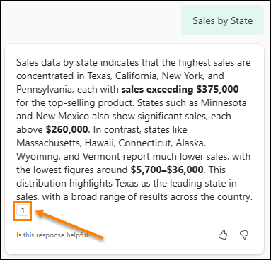

    

26. Ora, andare alla scheda del prodotto più venduto che si trova nella barra multifunzione in basso.

    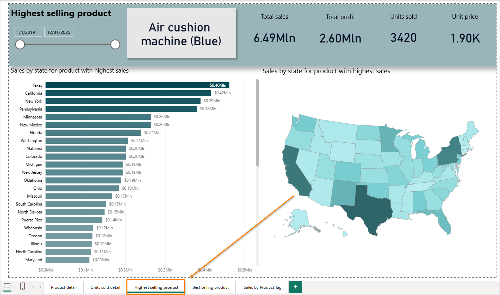

27. A prima vista le risposte possono sembrare accurate, ma è opportuno verificare alcuni dei possibili filtri applicati alle visualizzazioni. Se non lo si è già fatto, espandere il riquadro dei filtri:

    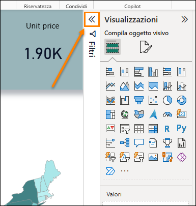

28. Nell'oggetto visivo è presente un filtro che potrebbe causare una modifica nelle risposte di Copilot. Espandere il filtro per verificare che **questo oggetto visivo mostri solo le vendite del prodotto più venduto**. Assicurarsi di aver fatto clic nell'oggetto visivo mappa

    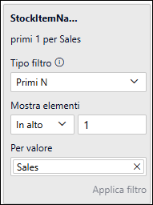

    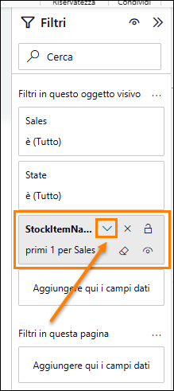

    **ℹ️ Importante**

    I filtri possono esistere a livello di oggetto visivo, pagina, report e persino filtro dei dati. A volte Copilot può generare una risposta basata su un oggetto visivo a cui è applicato un filtro, senza però informare l'utente finale che tale filtro è attivo. Più avanti in questo corso verrà illustrato come aggiungere istruzioni IA per aiutare con questi tipi di risposte.

29. Rimuovere questo filtro e notare come i valori dell'oggetto visivo di riferimento cambiano drasticamente.

    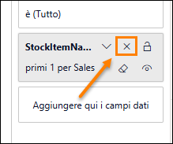

30. Il Texas ora ha **\$7.256.794**. Risulta drasticamente diverso rispetto ad alcune delle altre opzioni? Osservando bene, è possibile notare che un oggetto visivo usa la misura **Sales** e l'altro la misura **Supplier Sales**. Questo è un motivo in più per cui è necessario preparare i dati per l'IA.

    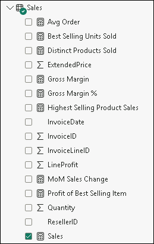

    

31. Ci si può chiedere cosa succederebbe ponendo nuovamente la stessa domanda. Chiedere nuovamente a Copilot: **Sales by State**.

    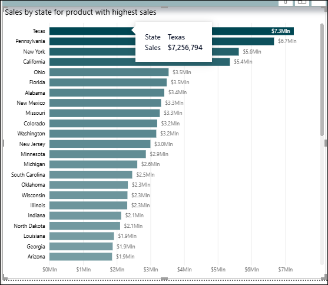

    

32. Senza il filtro, si avrebbe un set di valori completamente diverso nello stesso riferimento.
    Si tratta di un aspetto importante da considerare nel processo di preparazione dei dati per l'IA.

    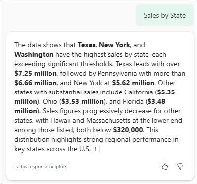

33. Cosa succedere se una risposta restituisce più riferimenti? Porre a Copilot questa nuova domanda: **Show the top selling product**.

    

34. Selezionare il riferimento e verificare la presenza di eventuali filtri estranei.

    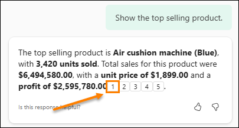

    

35. Aggiungere un filtro alla pagina dalla tabella Reseller per **ResellerCompany**.

    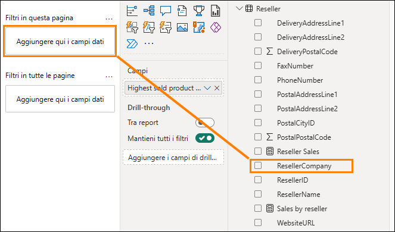

36. Selezionare solo TailSpin Toys e osservare che i valori sono cambiati.

    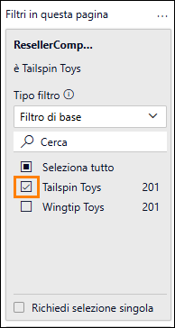

37. Ora viene posta nuovamente la domanda: **Show the top selling product**.

    

38. Il prodotto potrebbe rimanere lo stesso, ma i valori risultano molto diversi; questo esempio dimostra come modelli semantici non preparati possano generare risultati incoerenti e non corretti.

    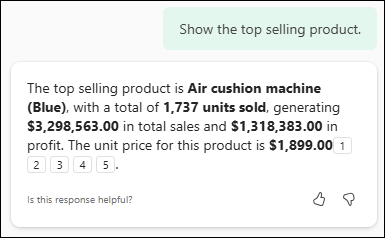

39. Un altro ambito in cui è possibile sfruttare Copilot e che merita attenzione è l’integrazione del linguaggio Data Analysis eXpressions (DAX). Provare a porre una domanda che includa un calcolo, come nell’esempio seguente: **Calculate the percent of total sales in the Southeast to the United States**.

    

40. Nella risposta si noterà che Copilot riconosce che la richiesta richiede un livello di analisi
    superiore al consueto. Questo rappresenta un utile segnale per verificare ulteriormente il calcolo, se necessario.

    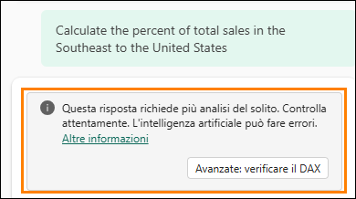

41. In questo caso, il calcolo specifico ha richiesto la scrittura di codice DAX da parte di Copilot. Qui è possibile verificare il DAX utilizzato in due modi. Innanzitutto, l'area **Avanzate: controlla il DAX** e **Espandi risposta**.

    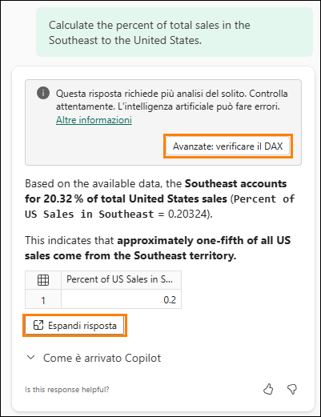

42. È consigliabile assicurarsi di visualizzare la scheda **Query DAX** per visualizzare il DAX utilizzato
    per creare la risposta. La query è elencata insieme a una spiegazione della logica da seguire. È necessario porsi due domande. (1) Il DAX ha l'aspetto giusto qui? (2) L'area geografica Southeast era davvero solo il **20,32%**?

    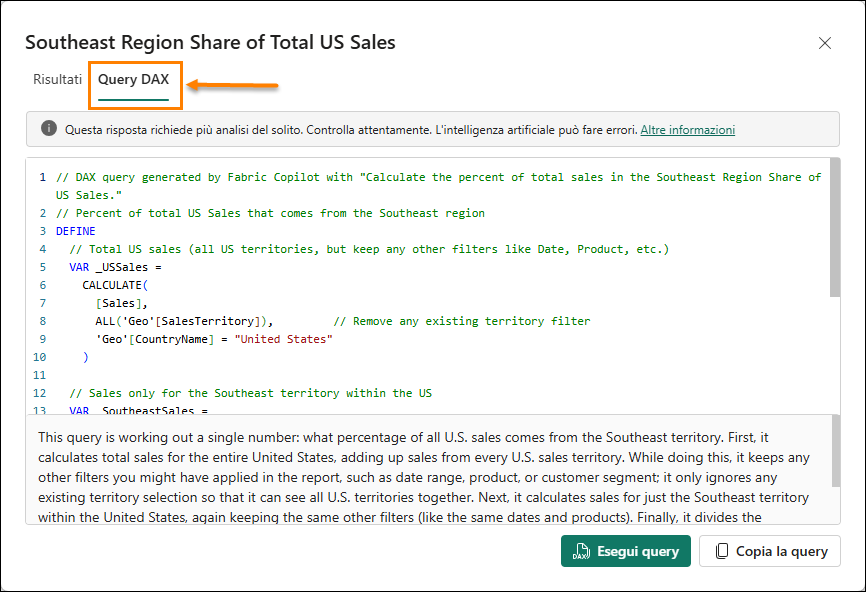

43. Ogni volta che Copilot genera codice DAX, questo può risultare spesso diverso e non coerente.
    Il DAX generato potrebbe essere diverso da quello mostrato negli screenshot di questa sezione. In questo codice, il DAX recupera lo stato dalla tabella **Geo**, soluzione che funziona, ma avrebbe potuto altrettanto facilmente recuperare le informazioni sulla località dalla tabella **Customer**. Se i dati fossero stati recuperati dalla tabella Customer, i risultati sarebbero stati pari solo al 3-4%.

    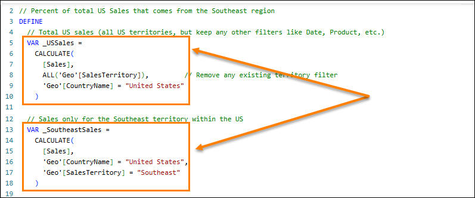

44. Ora, in che modo è possibile risolvere questo problema? Il metodo migliore verrà utilizzato più avanti nei lab, quando si procederà con la fase **Prepara dati per l'IA**. Per il momento, un modo per ottenere risposte migliori consiste nello scrivere prompt più efficaci. Potrebbero essere già stati ottenuti risultati dalla tabella **Geo**, tuttavia questo rappresenta comunque il secondo modo migliore per confermare.

45. Porre di nuovo la domanda usando questo prompt: **Calculate the percent of total sales in the Southeast to the United States from the Geo table**.

    

46. I risultati questa volta sono probabilmente simili. È inoltre possibile controllare il DAX associato alla risposta.

    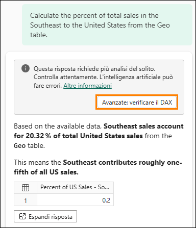

    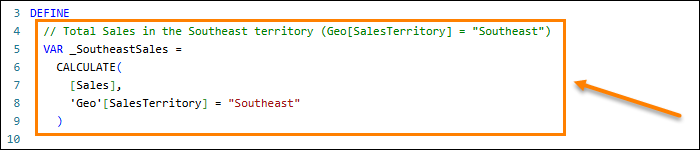

47. Perfetto! Con prompt ben formulati, eventuali lacune del modello possono essere compensate. Tuttavia, per gli utenti finali è preferibile creare un’esperienza che consenta l’uso di prompt più generici.

48. Questo file PBIX presenta alcuni problemi di modellazione dei dati. Più nello specifico, sono presenti due dimensioni con schema a fiocco di neve. Copilot gestisce queste situazioni in modo efficace applicando filtri e altre modifiche per ottimizzare le risposte. Tuttavia, dopo aver esaminato il modello e i requisiti aziendali, è stato deciso che queste due dimensioni (Supplier
    e Geo) non sono necessarie come tabelle separate. Queste due tabelle verranno consolidate in altre tabelle nel modello per avvicinarsi a uno schema a stella. Se modellato correttamente, ciò consente di migliorare le prestazioni, rendere il modello più semplice da comprendere e ottimizzare l’esperienza Copilot. Alla fine di questo modulo si utilizzerà **CDIAD – Lab 02– Start**.

    - **Supplier:** le colonne nella tabella Supplier sono state aggiunte alla tabella Product.

    - **Geo:** le colonne nella tabella Geo sono state aggiunte alla tabella Reseller.

**ℹ️ Importante**

In alcuni casi è necessario creare dimensioni che filtrano altre dimensioni, creando di fatto una struttura snowflake. Tuttavia, quando possibile, il modello semantico dovrebbe essere semplificato se i requisiti aziendali sono soddisfatti. Man mano che vengono aggiunti nuovi requisiti aziendali e vengono inserite nuove tabelle, il modello di dati diventa inevitabilmente più complesso. È importante dedicare sempre del tempo a mantenere il modello di dati ottimizzato.

⭐Power BI offre prestazioni ottimali con uno schema a stella; una trattazione completa dello schema a stella esula dall'ambito di questa lezione. Per altre informazioni consultare questo collegamento Microsoft Learn:

[**https://learn.microsoft.com/en-us/power-bi/guidance/star-schema**](https://learn.microsoft.com/en-us/power-bi/guidance/star-schema)

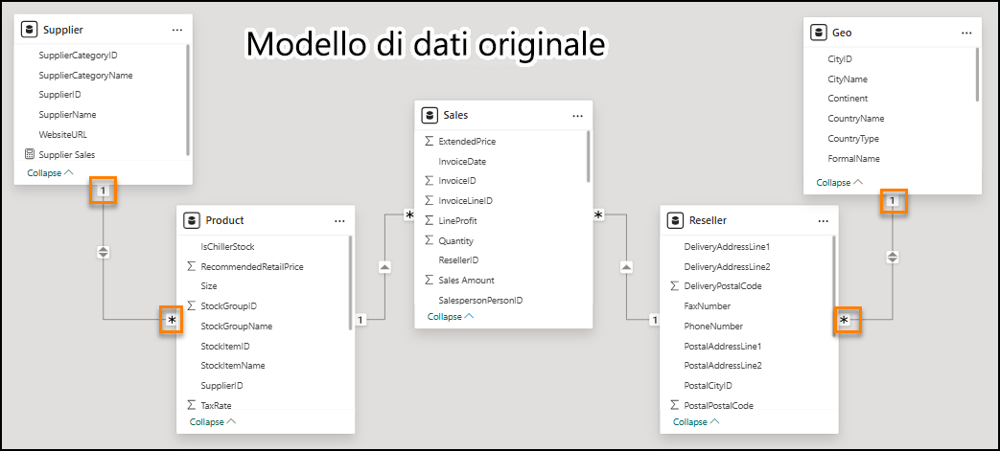

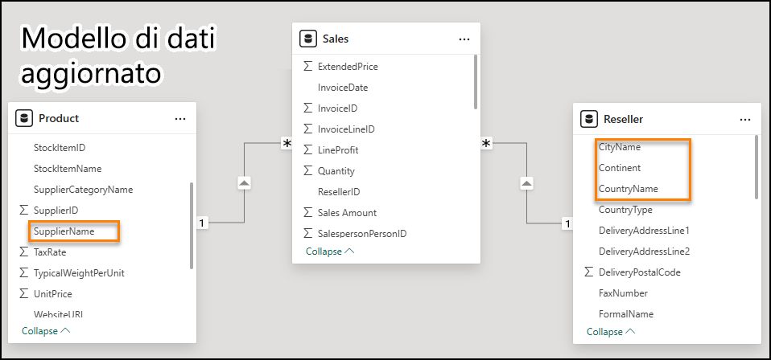

Di seguito sono indicate altre risorse utili a progredire nell'uso di Microsoft Fabric.

- Accedere a tutte le informazioni nella [documentazione di Microsoft Fabric](https://learn.microsoft.com/en-us/fabric/)

- Esplorare Fabric tramite la [presentazione guidata](https://aka.ms/Fabric-GuidedTour)

- Iscriversi alla [versione di valutazione gratuita di Microsoft Fabric](https://aka.ms/try-fabric)

- Visitare il [sito Web di Microsoft Fabric](https://aka.ms/microsoft-fabric)

- Acquisire nuove competenze esplorando i [moduli di apprendimento di Fabric](https://aka.ms/learn-fabric)

- Leggere [l'e-book gratuito introduttivo a Fabric](https://aka.ms/fabric-get-started-ebook)

- Unirsi alla [community di Fabric](https://aka.ms/fabric-community) per pubblicare domande, condividere feedback e imparare dagli altri

Leggere la documentazione tecnica più approfondita relativa a Copilot:

- [Panoramica di Copilot per Power BI - Power BI | Microsoft Learn](https://learn.microsoft.com/en-us/power-bi/create-reports/copilot-introduction)

- [Esperienza Copilot standalone in Power BI (anteprima) – Power BI | Microsoft Learn](https://learn.microsoft.com/en-us/power-bi/create-reports/copilot-chat-with-data-standalone)

- [Impostazioni dell'amministratore di Microsoft Fabric Copilot | Microsoft Learn](https://learn.microsoft.com/en-us/fabric/admin/service-admin-portal-copilot)

- [Creazione dell'agente dei dati di Fabric (anteprima) - Informazioni su come creare un agente dei dati di Fabric | Microsoft Learn](https://learn.microsoft.com/en-us/fabric/data-science/concept-data-agent)

- [Procedure consigliate per la configurazione dell'agente dei dati - Microsoft Fabric |
Microsoft Learn](https://learn.microsoft.com/en-us/fabric/data-science/data-agent-configuration-best-practices)

- [Copilot per Microsoft Fabric e Power BI: domande frequenti - Microsoft Fabric | Microsoft Learn](https://learn.microsoft.com/en-us/fabric/fundamentals/copilot-faq-fabric)

© 2026 Microsoft Corporation. Tutti i diritti sono riservati.

L'uso della demo/del lab implica l'accettazione delle seguenti condizioni:

La tecnologia/le funzionalità descritte nella demo/nel lab sono fornite da Microsoft Corporation allo scopo di ottenere feedback dall'utente e offrire un'esperienza di apprendimento. L'utilizzo della demo/del lab è consentito solo per la valutazione delle caratteristiche e delle funzionalità di tale tecnologia e per l'invio di feedback a Microsoft. L'utilizzo per qualsiasi altro scopo non è consentito. È vietato modificare, copiare, distribuire, trasmettere, visualizzare, eseguire, riprodurre, pubblicare, concedere in licenza, usare per la creazione di lavori derivati, trasferire o vendere questa demo/questo lab o parte di essi.

SONO ESPLICITAMENTE PROIBITE LA COPIA E LA RIPRODUZIONE DELLA DEMO/DEL LAB (O DI QUALSIASI PARTE DI ESSI) IN QUALSIASI ALTRO SERVER O IN QUALSIASI ALTRA POSIZIONE PER ULTERIORE RIPRODUZIONE O RIDISTRIBUZIONE.

QUESTA DEMO/QUESTO LAB RENDONO DISPONIBILI TECNOLOGIE SOFTWARE/FUNZIONALITÀ DI PRODOTTO SPECIFICHE, INCLUSI NUOVI CONCETTI E NUOVE FUNZIONALITÀ POTENZIALI, IN UN AMBIENTE SIMULATO, CON UN'INSTALLAZIONE E UNA CONFIGURAZIONE PRIVE DI COMPLESSITÀ, PER GLI SCOPI DESCRITTI IN PRECEDENZA. LA TECNOLOGIA/I CONCETTI RAPPRESENTATI IN QUESTA DEMO/IN QUESTO LAB POTREBBERO NON CONTENERE LE FUNZIONALITÀ COMPLETE E IL LORO FUNZIONAMENTO POTREBBE NON ESSERE LO STESSO DELLA VERSIONE FINALE. È ANCHE POSSIBILE CHE UNA VERSIONE FINALE DI TALI FUNZIONALITÀ O CONCETTI NON VENGA RILASCIATA. L'ESPERIENZA D'USO DI TALI CARATTERISTICHE E FUNZIONALITÀ PUÒ RISULTARE DIVERSA IN UN AMBIENTE FISICO.

**FEEDBACK.** L'invio a Microsoft di feedback sulle caratteristiche, sulle funzionalità e/o sui concetti della tecnologia descritti in questa demo/questo lab implica la concessione a Microsoft, a titolo gratuito, del diritto di usare, condividere e commercializzare tale feedback in qualsiasi modo e per qualsiasi scopo. Implica anche la concessione a titolo gratuito a terze parti del diritto di utilizzo di eventuali brevetti necessari per i loro prodotti, le loro tecnologie e i loro servizi al fine di utilizzare o interfacciarsi ai componenti software o ai servizi Microsoft specifici che includono il feedback. L'utente si impegna a non inviare feedback la cui inclusione all'interno di software o documentazione Microsoft imponga a Microsoft di concedere in licenza a terze parti tale software o documentazione. Questi diritti sussisteranno anche dopo la scadenza del presente contratto.

CON LA PRESENTE MICROSOFT CORPORATION NON RICONOSCE ALCUNA GARANZIA E CONDIZIONE RELATIVAMENTE ALLA DEMO/AL LAB, INCLUSE TUTTE LE GARANZIE E CONDIZIONI DI COMMERCIABILITÀ, DI FATTO ESPRESSE, IMPLICITE O PRESCRITTE DALLA LEGGE, ADEGUATEZZA PER UNO SCOPO SPECIFICO, TITOLARITÀ E NON VIOLABILITÀ. MICROSOFT NON OFFRE GARANZIE O RAPPRESENTAZIONI IN RELAZIONE ALL'ACCURATEZZA DEI RISULTATI E DELL'OUTPUT DERIVANTI DALL'USO DELLA DEMO/DEL LAB O ALL'ADEGUATEZZA DELLE INFORMAZIONI CONTENUTE NELLA DEMO/NEL LAB PER QUALSIASI SCOPO.

**CLAUSOLA DI RESPONSABILITÀ**

Questa demo/questo lab contiene solo una parte delle nuove funzionalità e dei miglioramenti in Microsoft Power BI. Alcune funzionalità potrebbero cambiare nelle versioni future del prodotto. In questa demo/in questo lab si apprendono alcune delle nuove funzionalità, ma non tutte.
