# Microsoft Fabric Chat with your Data in a Day - Lab 2

## Sommario

- Struttura del documento
- Scenario/Esposizione del problema
- Introduzione
  - Attività 1: applicazione del filtro bidirezionale/schema a stella
  - Attività 2: ridenominazione di colonne, tabelle e misure
  - Attività 3: descrizioni
  - Attività 4: categorie di dati
  - Attività 5: riepilogo
  - Attività 6: proprietà Ordina per colonna
  - Attività 7: schema linguistico - sinonimi

# Struttura del documento

Il lab include i passaggi che l'utente deve seguire con gli screenshot associati che forniscono un aiuto visivo. In ogni screenshot vi sono sezioni evidenziate con riquadri arancioni che indicano le aree su cui l'utente deve concentrarsi.

# Scenario/Esposizione del problema

L'azienda ha completato la fase iniziale di test e la fase di verifica della preparazione a Copilot. È stato rilevato che il modello attuale non è ancora pronto per l'esperienza Copilot standalone e che sarà necessario implementare le procedure consigliate generalmente accettate in Power BI Desktop. Per consentire a Copilot di fornire risposte significative, il modello semantico sottostante deve essere progettato e ottimizzato con attenzione.

Sfide attuali del modello semantico:

- I nomi di tabelle e colonne possono risultare criptici e difficili da interpretare.

- Le descrizioni di tabelle, colonne e misure non sono presenti.

- Le categorie di dati sono poco utilizzate, limitando la comprensione contestuale da parte di Copilot.

- Logica di ordinamento e riepiloghi predefiniti potrebbero non riflettere le aspettative degli utenti.

- Relazioni e schema linguistico non sono configurati o ottimizzati per supportare un'esperienza Copilot ottimale.

# Introduzione

Queste lacune possono generare confusione, risposte imprecise, visualizzazioni fuorvianti o informazioni dettagliate mancanti quando gli utenti interagiscono con Copilot. In questo lab viene illustrato come perfezionare il modello semantico applicando le procedure consigliate per denominazione, categorizzazione, riepilogo, modellazione dei dati e schema linguistico.

## Attività 1: applicazione del filtro bidirezionale/schema a stella

1.  Aprire il file con nome **CDIAD – Lab 02– Start** dai file della lezione per iniziare a preparare i dati per l’uso con l’IA.

    

2.  Una domanda posta nel lab precedente era: **Create a new report page with a visual for sales and product tag**. In questo modo Copilot ha generato una risposta che mostrava dati duplicati (screenshot seguente). Quando si osserva lo stesso risultato su tutti i punti dati, spesso indica un problema di relazione nel modello dati.

    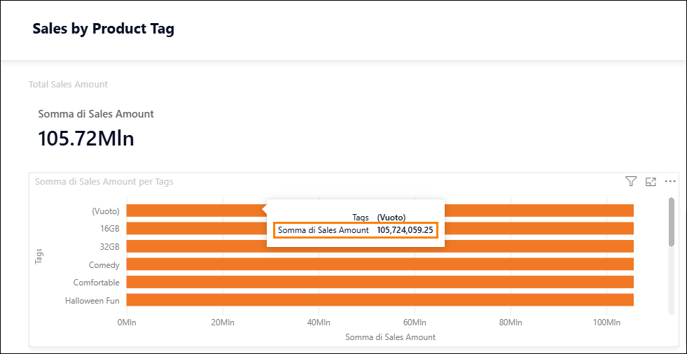

3.  Di seguito è riportato uno screenshot della relazione tra Tags della tabella Product Details e la misura Sales della tabella Sales:

    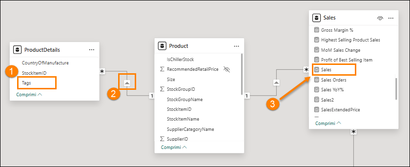

4.  Quando viene richiesta la restituzione di Sales per Tags, Copilot genera un report con dati duplicati. Questo accade perché Tags della colonna nella tabella Product Details non è in grado di filtrare la tabella Product. La direzione del filtro tra Product e Product Details è singola e va dalla tabella Product alla tabella Product Details . Esistono due possibili soluzioni.
    - Per prima cosa, è possibile creare una misura DAX che calcola le vendite totali aggiungendo il filtro necessario dalla tabella Tags. Questa opzione mantiene semplice il modello dati ma richiede la creazione di nuove misure per ogni esigenza aziendale.

    - In secondo luogo, ed è l'opzione che verrà implementata qui, è possibile consentire al filtro di propagarsi in entrambe le direzioni. Aggiornando la relazione tra Product e Product Details, la colonna tag potrà filtrare la tabella Sales e Copilot potrà generare la risposta corretta.

5.  Si procederà ora con l'aggiornamento della relazione nel modello di dati. _Vedere lo screenshot seguente:_
    1.  Fare clic sulla vista del modello nel riquadro di spostamento a sinistra.

    2.  Selezionare la relazione tra Product e Product Details.

    3.  Nel riquadro delle proprietà, modificare la direzione del filtro incrociato da Singola
        a Entrambe.

            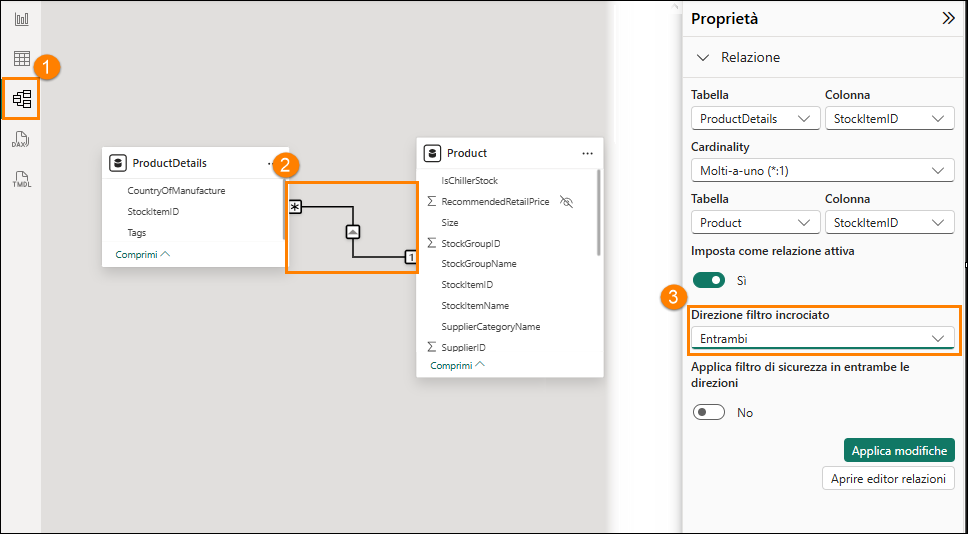

    **ℹ️ Importante**

    Come procedura consigliata è consigliabile evitare il filtro bidirezionale quando possibile. In alcuni casi può generare ambiguità nei risultati e problemi di prestazioni. Come menzionato in questa sezione, un'alternativa consiste nel creare misure DAX che forzino manualmente l'applicazione di filtri per quella misura specifica. Esistono anche altre alternative, ma non verranno discusse in questo corso.

6.  Ora è possibile porre nuovamente la domanda nella **Visualizzazione** **report** e osservare i risultati migliorati. Aprire di nuovo l'esperienza di chat Copilot di Power BI e porre la seguente domanda: **Show total sales by product tag**.

    

    Se viene chiesto un chiarimento, chiedere la **misura Sales**.

    

7.  Risultati corretti:

    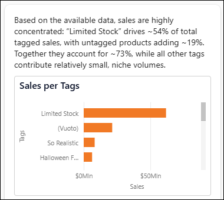

    Se si ottiene un oggetto visivo diverso, creare nuovamente il prompt e chiedere un **grafico a barre**.

    

    Risultati precedenti:

    

    La modellazione dei dati è sempre stata uno degli aspetti più importanti, se non il più importante, di Power BI. Un modello dati ben definito e progettato con attenzione rende più semplice ed efficace la creazione di report, la scrittura di DAX, l'implementazione della sicurezza e il supporto per Copilot.

## Attività 2: ridenominazione di colonne, tabelle e misure

1. Nel lab precedente sono stati riscontrati problemi legati all'utilizzo da parte di Copilot di colonne, tabelle e persino misure non previste. Questi problemi sono prevedibili in modelli dati in continua evoluzione e, per preparare meglio i dati per l'IA, è necessario apportare modifiche alla denominazione.

2. Si inizia ridenominando correttamente le tabelle. Fare clic sulla tabella **PO**, quindi selezionare **Rinomina**. Modificare la **tabella PO** in **Purchase Orders**.

   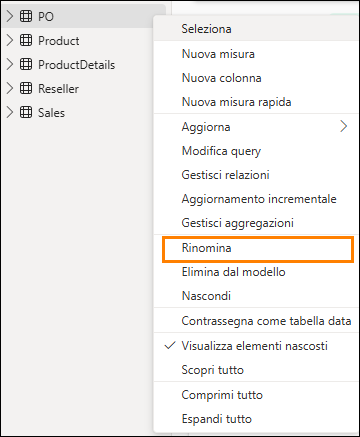

   

3. Ora si procederà a rinominare le colonne usando lo stesso processo. Iniziare con l'espansione della tabella **"Reseller"**.

   

4. Quindi fare doppio clic o fare clic con il pulsante destro del mouse sulla colonna **[SPName]** e rinominarla in **State.**

   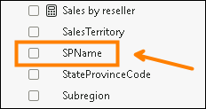

   

5. Continuare con le modifiche alla ridenominazione come segue:

   Rinominare **"Reseller"[CountryName]** in **Country**

   Nella tabella **Sales**, rinominare la misura **MoM Sales Change** in **Month over Month Sales Change**

   Nella tabella **Sales**, rinominare la misura **Sales YoY%** in **Sales Year over Year %**

   Nella tabella **Purchase Orders**, rinominare la misura **Spend** in **Total Purchases**

   **ℹ️ Importante**

   Nomi chiari e descrittivi per tabelle e colonne fanno una grande differenza. Copilot interpreta i prompt in base alla struttura del modello: più la denominazione è intuitiva, maggiore sarà la capacità di generare DAX, oggetti visivi e informazioni dettagliate accurati. Rinominare in modo ponderato per migliorare la comprensione da parte di Copilot e la propria produttività.

## Attività 3: descrizioni

1. Preparare ulteriormente il modello di dati aggiungendo le descrizioni. Le descrizioni possono essere aggiunte a tabelle, colonne e misure nella vista del modello. Queste descrizioni aiuteranno Copilot quando risponderà alle richieste degli utenti. Le descrizioni delle tabelle funzionano come un accesso privilegiato per Copilot, fornendo il contesto necessario per generare riepiloghi di informazioni dettagliate accurati e pertinenti, e persino misure DAX. Per iniziare, passare alla **vista del modello**.

2. Selezionare la tabella **Purchase Orders**. Nell'area **Proprietà** sarà disponibile l'area **Descrizione** in cui verrà creata la descrizione per aiutare Copilot. Ecco alcuni suggerimenti per le procedure consigliate:

   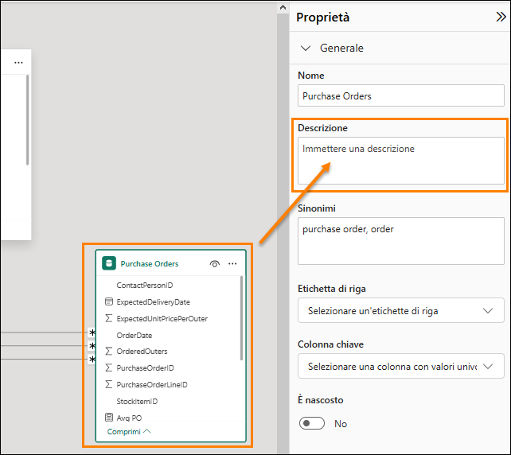

   ### Procedure consigliate per le descrizioni delle tabelle

   **Iniziare dallo scopo:** che cosa rappresenta la tabella in termini aziendali?

   **Includere il contesto aziendale:** spiegare in che modo la tabella supporta la creazione di report o il processo decisionale.

   **Indicare la granularità:** è di tipo transazionale, giornaliera, aggregata e così via?

   **Evidenziare le colonne chiave:** in particolare quelle utilizzate nelle relazioni o nei calcoli.

   **Descrivere i casi d'uso comuni:** quali tipi di domande o oggetti visivi supporta questa tabella.

   **Indicare le relazioni:** specificare in che modo la tabella si collega alle altre tabelle del modello.

   **ℹ️ Importante**

   **Descrizioni ben scritte aiutano Copilot a comprendere lo scopo e il contesto dei dati.** Usare le descrizioni per chiarire cosa rappresenta una tabella o una colonna, soprattutto quando i nomi da soli non sono sufficienti. Copilot utilizza questi elementi per generare risposte, DAX e oggetti visivi più pertinenti. Le descrizioni possono essere considerate come un'opportunità per guidare Copilot e gli utenti verso informazioni dettagliate migliori.

3. Inserire questo testo descrittivo, esteso ma accurato, nel campo:

   _This Purchase Orders table captures individual line items from purchase orders submitted within the organization. Each row represents a specific product ordered, including the quantity requested, the date of the order, and the employee who initiated the request. It supports analysis of procurement trends, supplier demand, and employee purchasing behavior. Key columns include ProductID, QuantityOrdered, OrderDate, and EmployeeID. This table links to Products, Employees, and PurchaseOrders tables to enable detailed reporting across procurement workflows._

   Questo aiuterà notevolmente Copilot a creare risposte migliori, soprattutto per quanto riguarda la tabella **Purchase Orders**. Procedere con la creazione di descrizioni migliori per alcune colonne. Selezionare la colonna **Order Date** dalla tabella **Purchase Orders** e aggiungere una descrizione simile:

   ### Procedure consigliate per le descrizioni delle colonne nei modelli semantici

   **Iniziare dal significato aziendale:** descrivere cosa rappresenta la colonna in termini aziendali.

   **Chiarire unità, formato o scala:** se è numerica, basata su date o categorie, spiegare come è strutturata.

   **Indicare i casi d'uso comuni:** aiutare Copilot a comprendere come questa colonna viene generalmente utilizzata nelle analisi o nei report. Esempio: Revenue - Importo totale delle vendite per ogni transazione; utilizzato nelle analisi di redditività e di tendenza

   **Evitare ridondanze:** non ripetere ciò che è già evidente dal nome della colonna, a meno che non aggiunga chiarezza. Arricchirla invece con il contesto. Ad esempio, per EmployeeID è possibile aggiungere la seguente descrizione: Unique identifier for the employee who submitted the order.

   **Usare un tono coerente:** mantenere le descrizioni concise, informative e coerenti in tutto il modello. È come scrivere descrizioni comando per un analista curioso.

4. Selezionare la tabella **Purchase Orders**, quindi fare clic su **OrderDate**. Immettere la descrizione seguente: **The calendar date when the purchase order was submitted by an employee.**

   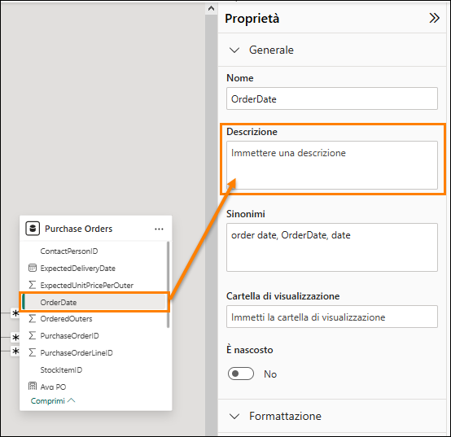

5. Ora che sono state aggiornate le **descrizioni** delle tabelle e delle colonne, aggiungere una descrizione a una misura. In questo caso verrà utilizzato Copilot per aiutare a creare la descrizione. Iniziare selezionando la misura **Purchase Orders**. Da qui selezionare **Crea con Copilot**.

   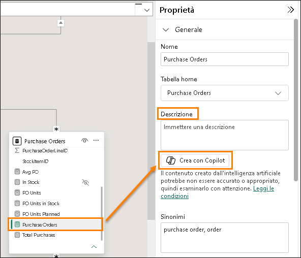

6. Notare che la descrizione creata da Copilot è pronta per la revisione. Questa risposta può variare,
   ma risulterà comunque utile per verificare e perfezionare la descrizione. È possibile premere **Riprova**, ma quando si è pronti selezionare **Mantieni**.

   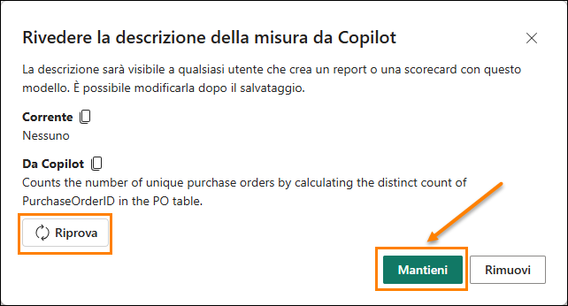

   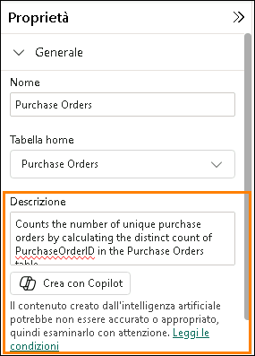

   In questa sezione si è appreso come aggiungere descrizioni a tabelle, colonne e misure. In un modello semantico reale, è possibile estendere le operazioni eseguite qui al resto delle tabelle e a qualsiasi colonna e misura applicabile. È stata ora notevolmente migliorata la capacità di Copilot di lavorare con i dati e di ottimizzare tutte le risposte future.

## Attività 4: categorie di dati

L'aggiunta di categorie di dati alle colonne in Power BI è importante per Copilot, soprattutto quando si lavora con modelli semantici che includono dati geografici, Web o immagini. Queste categorie fungono da tag di metadati che aiutano Copilot (e gli oggetti visivi) a interpretare lo scopo della colonna al di là del nome o del tipo di dati.

1. Passare alla **visualizzazione Tabella** e selezionare la tabella Reseller. Per iniziare, selezionare la colonna **State** nella tabella **Reseller**.

   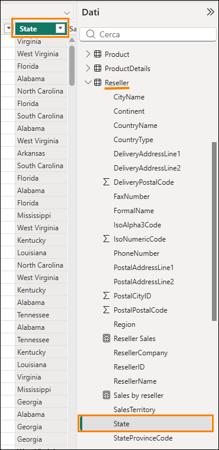

2. Dopo aver selezionato la colonna **State**, nella parte superiore del report Power BI apparirà un nuovo menu della barra multifunzione denominato **Strumenti colonna**. Fare clic su Strumenti colonna. Iniziare modificando la **categoria di dati**.

   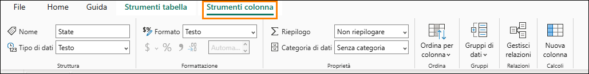

3. Espandere l'area **Categoria dati** e modificare la categoria di dati da Non categorizzato a **Stato
   o Provincia**.

   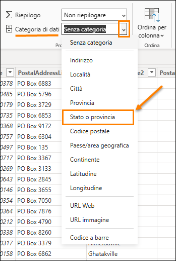

   **ℹ️ Importante**

   **L'impostazione delle categorie di dati aiuta Copilot a capire come trattare i dati.** Che si tratti di dati geografici, URL o immagini, l'assegnazione della categoria corretta fornisce a Copilot il contesto necessario per generare oggetti visivi, filtri e informazioni dettagliate più intelligenti. Ad esempio, contrassegnare una colonna come "City" consente a Copilot di mapparla immediatamente. È un piccolo passaggio che può generare un grande valore.

   Continuare ad aggiungere categorie di dati per le colonne rimanenti:

   | **Nome tabella** | **Nome colonna**   | **Categoria di dati** |
   | ---------------- | ------------------ | --------------------- |
   | Reseller         | Country            | Paese/area geografica |
   | Reseller         | DeliveryPostalCode | Codice postale        |
   | Reseller         | PostalPostalCode   | Codice postale        |
   | Reseller         | Website URL        | URL Web               |

## Attività 5: riepilogo

In questa sezione verrà illustrato il riepilogo predefinito in Power BI e come può influire sulle risposte di Copilot. Non si tratta di una nuova aggiunta a Power BI, ma è fondamentale per Copilot.

1. Aprire Copilot, dalla **vista Report** e scrivere il prompt seguente: **What is customer age by state?**

   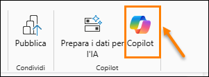

   

2. Esaminare i risultati e notare che potrebbe essere presente un risultato anomalo. Passare il puntatore del mouse sulle barre dei dati relative a WA, NY o ad altri stati e osservare che viene restituita la somma di Age. Ci si aspetterebbe probabilmente di visualizzare la media, ma poiché per la colonna Age è impostata come aggregazione predefinita la funzione Somma, Copilot esegue tale aggregazione.

   Copilot può anche chiedere chiarimenti come nell'immagine seguente. È comunque possibile fare in modo che venga sempre restituita la media modificando il riepilogo, evitando così ulteriori richieste a Copilot.

   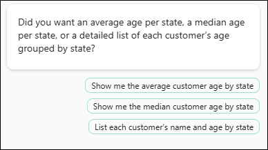

   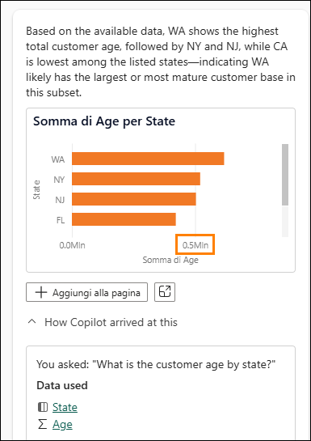

3. Passando il puntatore del mouse sull'età, è possibile verificare e confermare che Copilot ha eseguito un'operazione SUM sulla colonna.

   

   **ℹ️ Importante**

   **Il riepilogo predefinito indica a Copilot come trattare le colonne negli oggetti visivi e nei calcoli.** Che si tratti di "Non riepilogare", "Somma" o "Media", l'impostazione corretta di questi dati aiuta Copilot a generare DAX e grafici più accurati. Ad esempio, impostare ID o nomi su "Non riepilogare" per evitare totali fuorvianti. È un modo rapido per guidare Copilot verso informazioni dettagliate significative.

   Si potrebbe formulare un prompt migliore chiedendo esplicitamente l'età media e questo funzionerebbe. Tuttavia, l'opzione ideale consiste nel migliorare il modello di dati ove possibile, pertanto verrà modificata la proprietà **Riepilogo predefinito**.

4. Nel prompt di Copilot digitare: **What is customer age average by state.**

   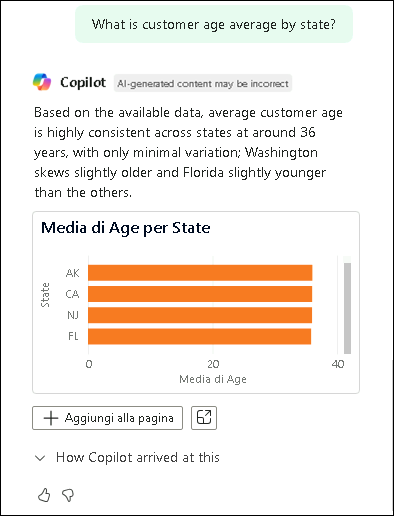

5. Ora si procederà a regolare il **riepilogo predefinito**. Selezionare la colonna **Age** dalla tabella "Customer" per mostrare Strumenti colonna. Trovare l'area **Riepilogo** e impostare Age su **Media**.

   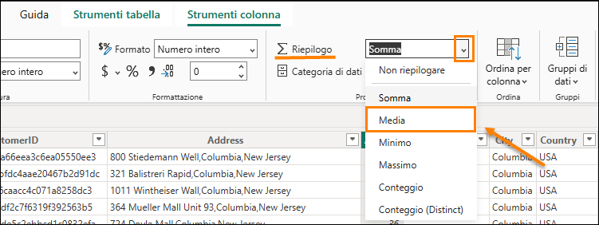

6. Utilizzando la chat di Copilot, porre nuovamente la domanda: **What is customer age by state?**

   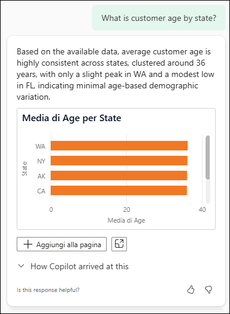

   Perfetto! Questo è il risultato previsto e consente agli utenti di porre domande in modo più naturale, supportando anche le normali variazioni nelle richieste degli utenti. È altrettanto importante disattivare il riepilogo predefinito nelle colonne numeriche che non devono essere riepilogate. Colonne come Year, Quarter e Month number, ad esempio, non devono essere riepilogate.

## Attività 6: proprietà Ordina per colonna

1. La proprietà Ordina per colonna, come il riepilogo predefinito, non è una novità in Power BI, ma configurarla correttamente può aiutare Copilot a restituire risultati in un ordine più in linea con
   le aspettative. Ad esempio, se si restituiscono le vendite per mese, per impostazione predefinita l'oggetto visivo viene ordinato dal mese con vendite più alte a quello con vendite più basse. Mettere ora questo comportamento alla prova.

2. Se non lo si è già fatto, reimpostare la chat di Copilot selezionando l'area **Cancella chat**.

   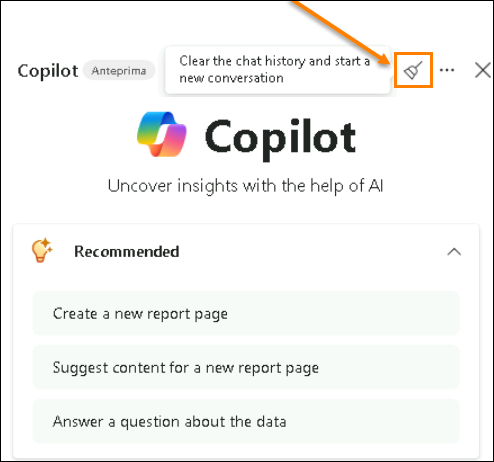

3. Ora digitare il prompt seguente: **Show total sales by month as a column chart**.

   

4. I risultati sono corretti, ma ordinati in modo non coerente con la visualizzazione tipica del calendario gregoriano (gennaio, febbraio, marzo… dicembre). I risultati possono essere restituiti in ordine alfabetico oppure, come in questo caso, ordinati dalle vendite più alte a quelle più basse.

   **ℹ️ Importante**

   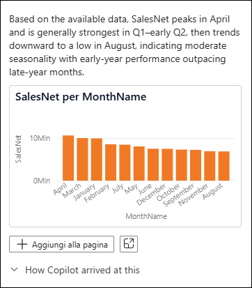

   **Usare** **"Ordina per colonna"** **per controllare come Copilot presenta i dati**. Questa impostazione aiuta Copilot a visualizzare i dati affinché categorie come mesi o etichette personalizzate compaiano nell'ordine previsto negli oggetti visivi e nei riepiloghi. Ad esempio, ordinare "Month Name" in base a "Month Number" aiuta Copilot a creare grafici temporali accurati. È una semplice modifica che evita risultati fuorvianti.

5. Sarà necessario modificare l'ordinamento della colonna **MonthName** dall'area **Ordina per colonna** nell'area **Strumenti colonna**. Selezionare la colonna MonthName dalla tabella **Date**.

6. Espandere Ordina per colonna e modificare l'ordinamento in modo che sia per Month:

   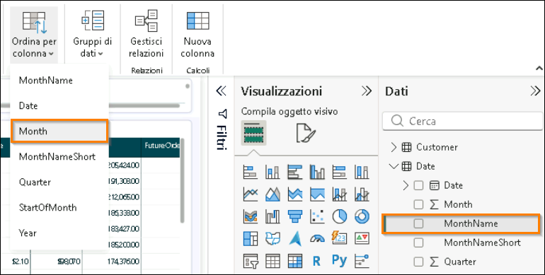

7. Porre la stessa domanda alla chat di Copilot: **Show total sales by month** e ora vengono restituiti i risultati previsti.

   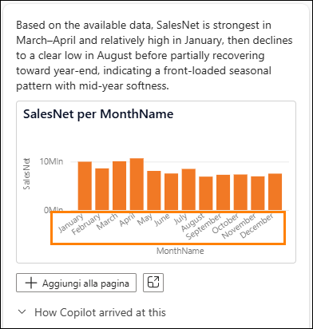

## Attività 7: schema linguistico - sinonimi

Lo **schema linguistico** è la chiave per sbloccare tutto il potenziale di Copilot come partner di analisi in linguaggio naturale. Si comporta come una guida di traduzione fornita a Copilot per interpretare il modello dati. Senza di esso, Copilot procede per tentativi; con esso, Copilot diventa molto più fluido e familiare con i dati.

**Cos'è lo schema linguistico?**

Lo schema linguistico è costituito da metadati che eseguono il mapping del modello semantico al linguaggio naturale. Aiuta Copilot a comprendere:

- Significato di tabelle e colonne

- Come si relazionano con i concetti aziendali

- Quali sinonimi, frasi e tipi di domande gli utenti potrebbero usare quando interagiscono con i dati

Ad esempio, invece di limitarsi a leggere i nomi delle colonne, Copilot comprende che:

- "Ricavi" = TotalSales

- "Ordini effettuati" = PurchaseOrderCount

- "Prestazioni dipendente" = SalesByEmployee

Ciò significa che Copilot può rispondere a domande come:

- "Quale area geografica ha registrato i ricavi più alti nell'ultimo trimestre?"

- "Mostrami i dipendenti con le migliori prestazioni in base al volume delle vendite"

Senza uno schema linguistico, Copilot potrebbe interpretare erroneamente termini vaghi o suggerire oggetti visivi irrilevanti. Con esso, si ottengono:

- Migliori suggerimenti DAX

- Suggerimenti di oggetti visivi più intelligenti

- Riepiloghi e informazioni dettagliate più accurati

**Supporta sinonimi e linguaggio naturale**

È possibile definire i sinonimi come:

- "PO" = "Ordine fornitore"

- "Rap" = "Rappresentante"

- "Qtà" = "Quantità ordinata"

1. È ora di esaminare l'interfaccia dello **schema linguistico**. Per iniziare, selezionare la **vista del modello** o, se è attiva la vista report, la barra multifunzione di modellazione. Quindi accedere all'area di **configurazione delle domande e risposte**.

   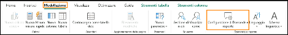

2. È disponibile un menu completo che aiuta la sezione di domande e risposte utilizzata dal modello di dati Copilot a comprendere meglio le richieste degli utenti. Il menu principale offre numerose sezioni da cui iniziare.

   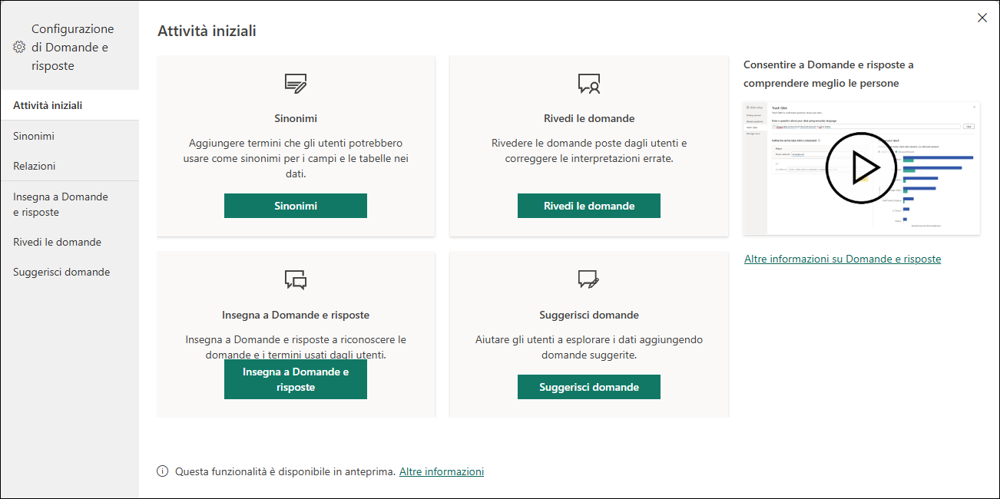

3. Accedere al primo menu, quello dei sinonimi.

   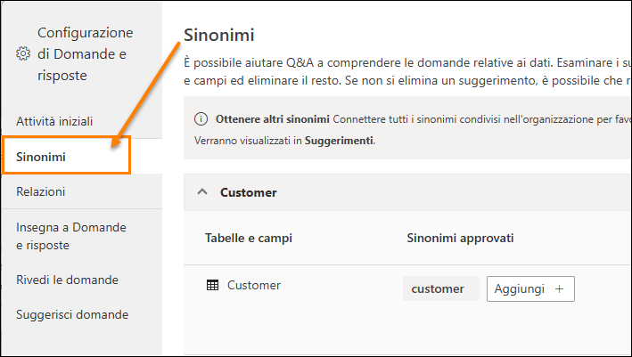

4. Sinonimi più precisi aiuteranno Copilot a capire i diversi modi in cui l'utente potrebbe formulare
   le domande. È inoltre possibile modificare la tabella in cui ci si sposta per raggiungere la colonna corretta premendo l'icona della freccia di espansione.

   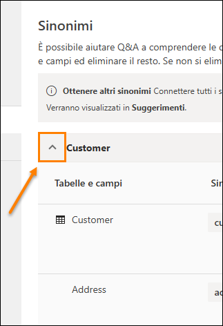

   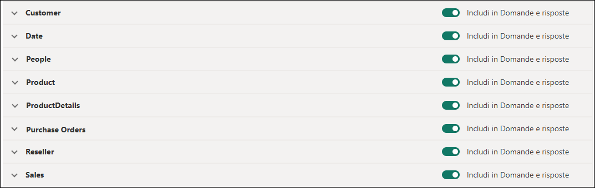

5. Per aiutare Copilot, è possibile rendere più specifici i sinonimi di **Reseller**. Assicurarsi che la tabella **Reseller** sia espansa e che sia possibile vedere tutti i sinonimi correnti associati alla colonna **ResellerID** e ai suggerimenti.

6. All'interno di Fabrikam, i rivenditori sono spesso indicati come **_Fabrikam Friends_** ........Aggiungerli come sinonimi per consentire ai dipendenti di porre domande utilizzando la terminologia interna
   di Fabrikam. Selezionare **Aggiungi** nell'**acquirente** e inserire il sinonimo.

   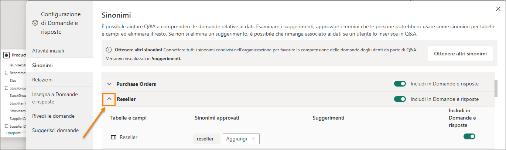

7. Aggiungere **_Fabrikam Friends_** usando il pulsante Aggiungi +.

   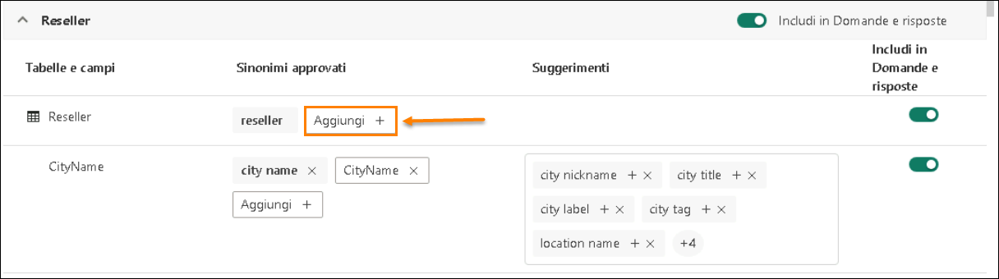

   

8. Si noterà che Copilot valuterà l'aggiunta e inserirà automaticamente altri suggerimenti in modo dinamico.

   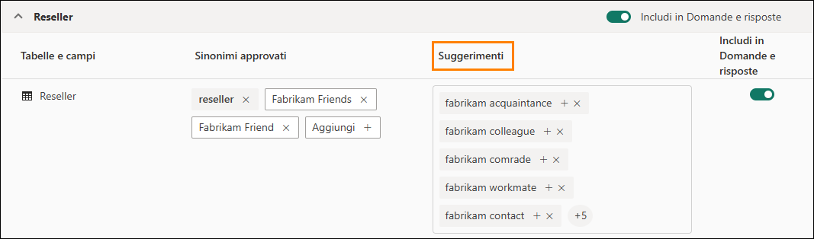

9. Aggiungere ora un altro sinonimo per la tabella Reseller usando uno dei suggerimenti. Fare clic su un suggerimento a scelta, ad esempio **_Fabrikam Acquaintance_**.

   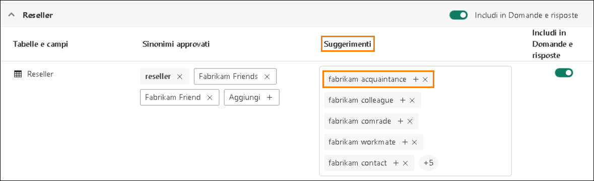

   Il processo di aggiunta dei sinonimi è articolato e viene migliorato nel tempo. È possibile esplorare liberamente altre tabelle e colonne e aggiungere ulteriori sinonimi nel file Power BI Desktop.

10. A questo punto si procede all'esame delle **relazioni**. Accedere menu di configurazione di Domande e risposte.

    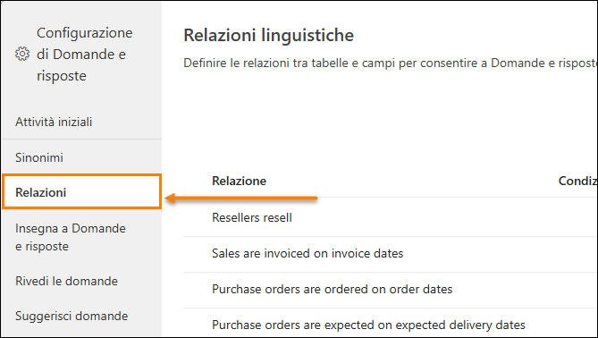

    Le relazioni linguistiche definiscono i collegamenti tra tabelle e campi per aiutare la sezione Domande e risposte a comprendere le domande sui dati. È simile al modo in cui le tabelle sono connesse nel modello di dati, ma vengono espresse in una forma che Copilot può comprendere dal punto di vista linguistico.

    Ad esempio, le relazioni possono essere utilizzate per risolvere l'ambiguità. Se il modello contiene più campi data distribuiti tra diverse tabelle, è possibile aggiungere relazioni sulle date per aiutare Copilot a determinare quale utilizzare in base al contesto e ai collegamenti tra le tabelle.

    Per aggiungere nuove relazioni, iniziare facendo clic sulla casella + Nuova relazione, come illustrato nello screenshot seguente.

    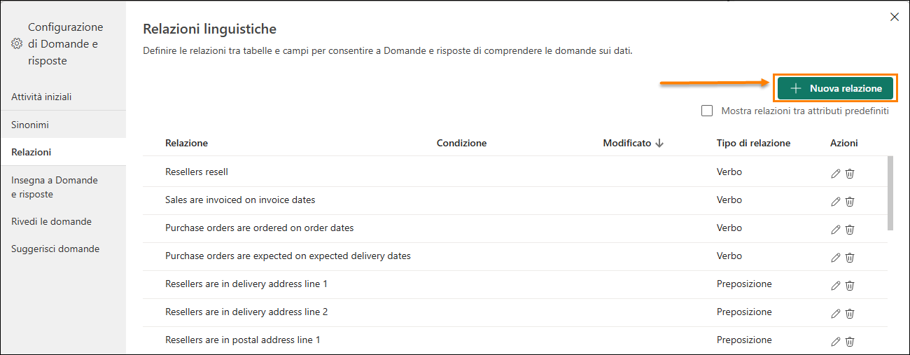

11. Da qui è possibile creare molte relazioni linguistiche diverse. Le opzioni correnti includono verbi, aggettivi, sostantivi, preposizioni, nomi e associazioni. Vedere lo screenshot seguente con le opzioni disponibili e relativi esempi.

    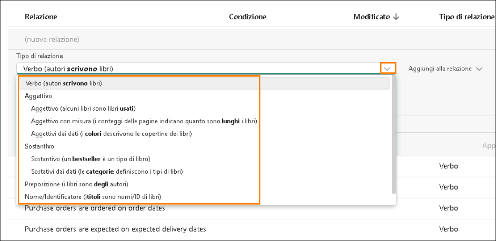

    **ℹ️ Importante**

    **Le relazioni nello schema linguistico definiscono il modo in cui Copilot comprende le connessioni tra le tabelle quando risponde al linguaggio naturale.** Determinano il modo in cui vengono interpretate domande come "vendite per categoria di prodotto" o "ordini per area geografica". Senza relazioni chiare, Copilot potrebbe avere difficoltà a collegare i concetti tra le tabelle. La loro corretta definizione assicura conversazioni più fluide e intuitive.

    In questo laboratorio non verranno create relazioni nel modello. Analogamente all'aggiunta di sinonimi, questo è un processo complesso che richiederà aggiornamento e manutenzione man mano che si apprenderà di più su come gli utenti eseguono query sui dati con Copilot e su come utilizzare lo schema linguistico per migliorare tale esperienza. Provare ad aggiungerne uno per migliorare il modello. Iniziare facendo clic su **Aggiungi** per **Soggetto**.

12. È ora possibile esaminare i restanti elementi della configurazione di Domande e risposte. Passare ora alla sezione **Insegna a Domande e risposte**.

    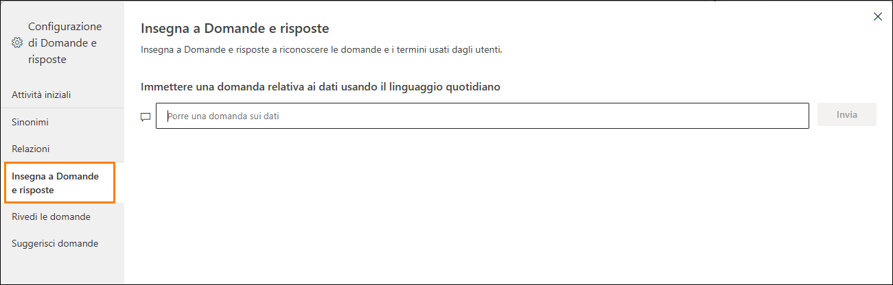

13. Qui è possibile insegnare alla sezione Domande e risposte a comprendere le domande e i termini che gli utenti potrebbero utilizzare.

    Provare a chiedere a Domande e risposte: **How many sales happen in january?**

    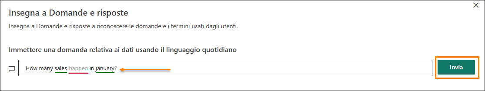

    Come si noterà, Copilot considera "happen" come termine sconosciuto. Questo consente di apportare ulteriori modifiche per gestire domande di questo tipo.

    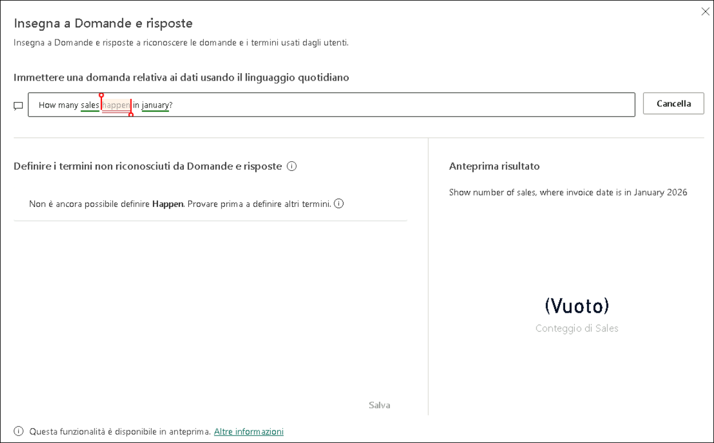

14. È possibile riprovare con un altro prompt, ad esempio "What is the total sales for january 2022?", e visualizzare i risultati. Questa diventa un'ottima area di test

    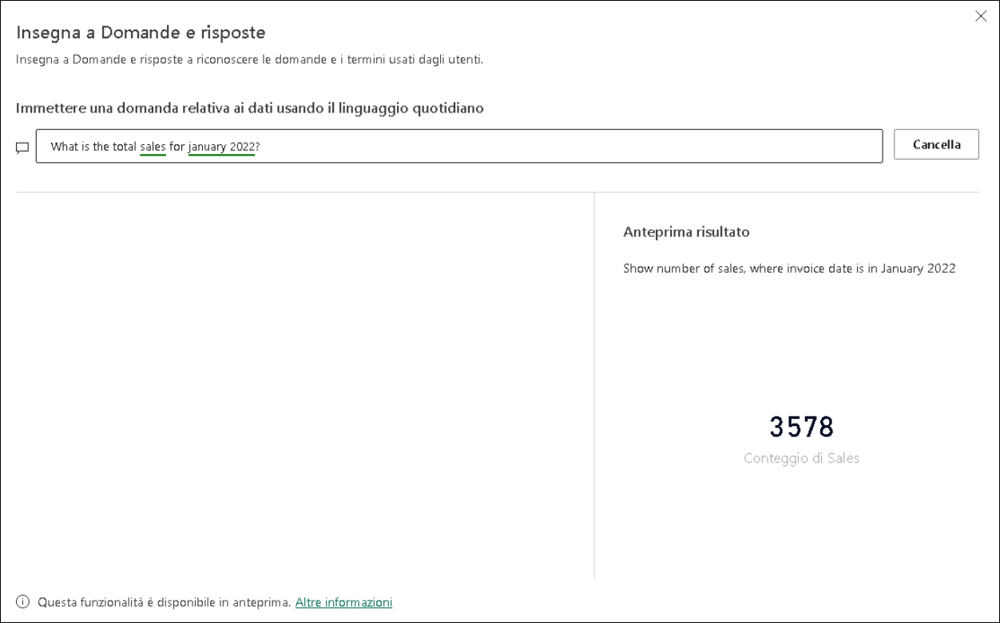

15. È anche possibile vedere l'effetto di sinonimi e relazioni all'opera: **What is sales by Fabrikam Friends?**

    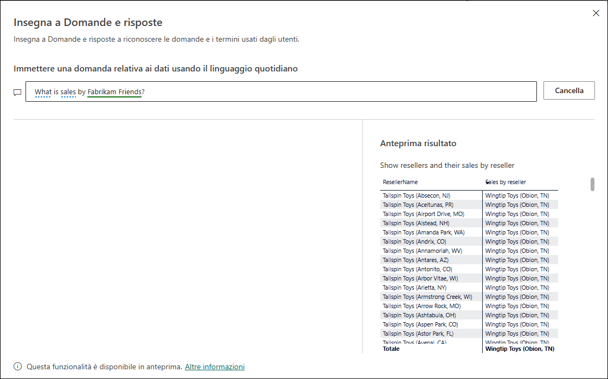

16. Successivamente, accedere a **Rivedi le domande**. Qui è possibile modificare le domande poste all'interno del tenant per una futura correzione.

    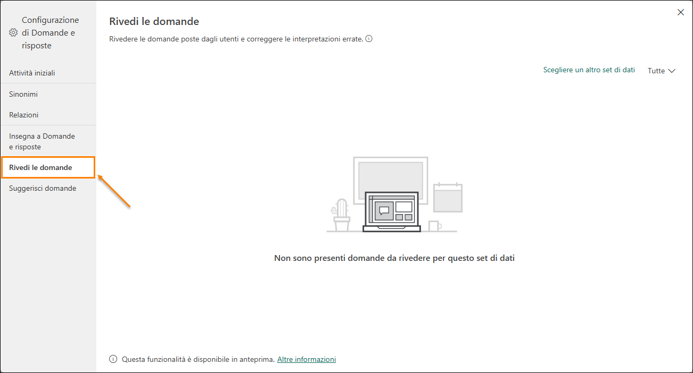

17. Infine, accedere a **Suggerisci domande**. Qui è possibile aiutare gli utenti a esplorare i dati aggiungendo domande di suggerimento.

    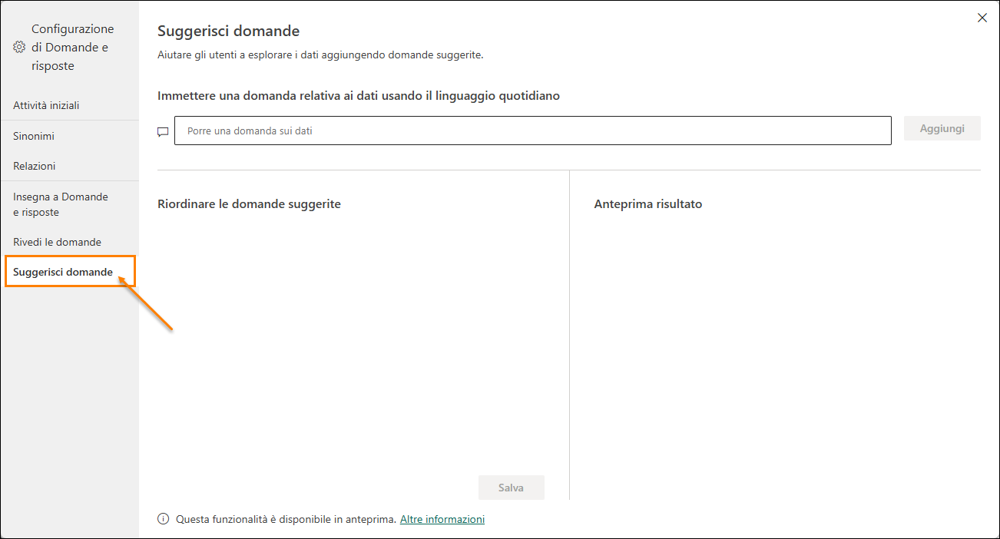

18. Per aiutare gli utenti in questa operazione, selezionare la casella Fai una domanda sui dati
    e aggiungere un suggerimento: **What is total sales by State?** Quindi, è possibile premere Invia per visualizzare un'anteprima.

    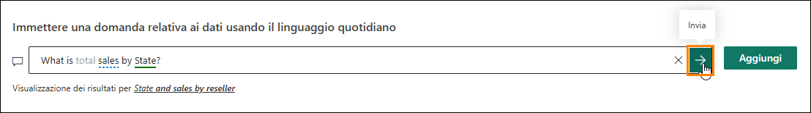

    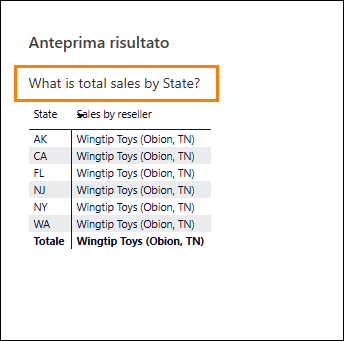

19. Salvare il suggerimento facendo clic su **Aggiungi.**

    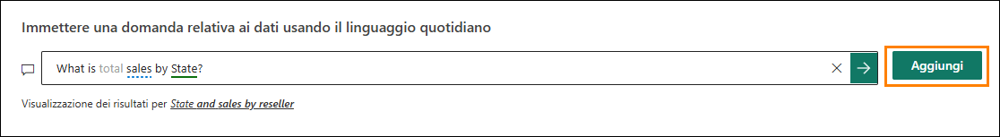

20. Dopo aver **salvato** i risultati è possibile completare il lab 2.

    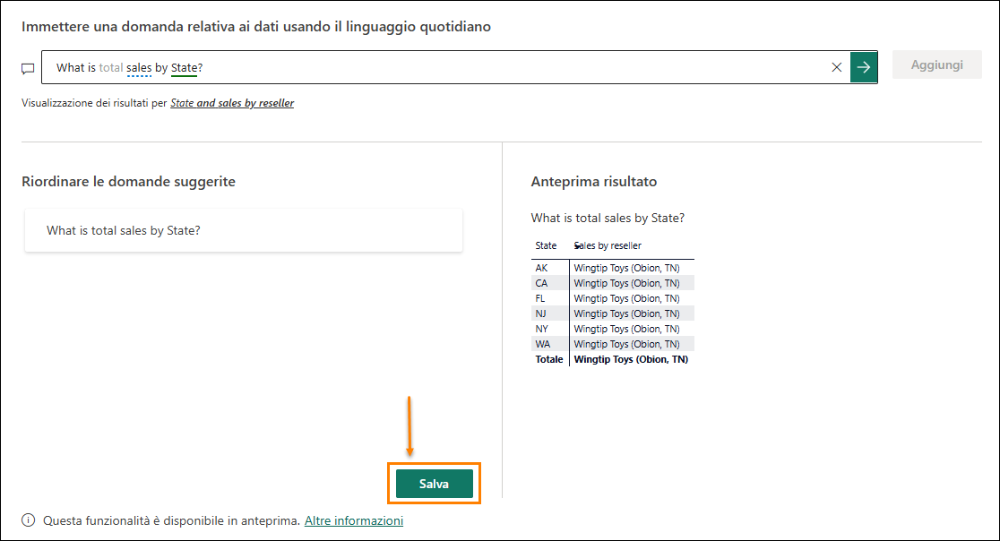

    In questo lab si sono apprese le procedure consigliate per la modellazione dei dati al fine di migliorare le prestazioni e l'accuratezza delle risposte in linguaggio naturale di Copilot per i modelli semantici Power BI.

    Di seguito sono indicate altre risorse utili a progredire nell'uso di Microsoft Fabric.
    - Accedere a tutte le informazioni nella [documentazione di Microsoft Fabric](https://learn.microsoft.com/en-us/fabric/)

    - Esplorare Fabric tramite la [presentazione guidata](https://aka.ms/Fabric-GuidedTour)

    - Iscriversi alla [versione di valutazione gratuita di Microsoft Fabric](https://aka.ms/try-fabric)

    - Visitare il [sito Web di Microsoft Fabric](https://aka.ms/microsoft-fabric)

    - Acquisire nuove competenze esplorando i [moduli di apprendimento di Fabric](https://aka.ms/learn-fabric)

    - Leggere [l'e-book gratuito introduttivo a Fabric](https://aka.ms/fabric-get-started-ebook)

    - Unirsi alla [community di Fabric](https://aka.ms/fabric-community) per pubblicare domande, condividere feedback e imparare dagli altri

    Leggere la documentazione tecnica più approfondita relativa a Copilot:
    - [Panoramica di Copilot per Power BI - Power BI | Microsoft Learn](https://learn.microsoft.com/en-us/power-bi/create-reports/copilot-introduction)

    - [Esperienza Copilot standalone in Power BI (anteprima) – Power BI | Microsoft Learn](https://learn.microsoft.com/en-us/power-bi/create-reports/copilot-chat-with-data-standalone)

    - [Impostazioni dell'amministratore di Microsoft Fabric Copilot | Microsoft Learn](https://learn.microsoft.com/en-us/fabric/admin/service-admin-portal-copilot)

    - [Creazione dell'agente dei dati di Fabric (anteprima) - Informazioni su come creare un agente
      dei dati di Fabric | Microsoft Learn](https://learn.microsoft.com/en-us/fabric/data-science/concept-data-agent)

    - [Procedure consigliate per la configurazione dell'agente dei dati - Microsoft Fabric |
      Microsoft Learn](https://learn.microsoft.com/en-us/fabric/data-science/data-agent-configuration-best-practices)

    - [Copilot per Microsoft Fabric e Power BI: domande frequenti - Microsoft Fabric | Microsoft Learn](https://learn.microsoft.com/en-us/fabric/fundamentals/copilot-faq-fabric)

    © 2026 Microsoft Corporation. Tutti i diritti sono riservati.

    L'uso della demo/del lab implica l'accettazione delle seguenti condizioni:

    La tecnologia/le funzionalità descritte nella demo/nel lab sono fornite da Microsoft Corporation allo scopo di ottenere feedback dall'utente e offrire un'esperienza di apprendimento. L'utilizzo della demo/del lab è consentito solo per la valutazione delle caratteristiche e delle funzionalità di tale tecnologia e per l'invio di feedback a Microsoft. L'utilizzo per qualsiasi altro scopo non è consentito. È vietato modificare, copiare, distribuire, trasmettere, visualizzare, eseguire, riprodurre, pubblicare, concedere in licenza, usare per la creazione di lavori derivati, trasferire o vendere questa demo/questo lab o parte di essi.

    SONO ESPLICITAMENTE PROIBITE LA COPIA E LA RIPRODUZIONE DELLA DEMO/DEL LAB (O DI QUALSIASI PARTE DI ESSI) IN QUALSIASI ALTRO SERVER O IN QUALSIASI ALTRA POSIZIONE PER ULTERIORE RIPRODUZIONE O RIDISTRIBUZIONE.

    QUESTA DEMO/QUESTO LAB RENDONO DISPONIBILI TECNOLOGIE SOFTWARE/FUNZIONALITÀ DI PRODOTTO SPECIFICHE, INCLUSI NUOVI CONCETTI E NUOVE FUNZIONALITÀ POTENZIALI, IN UN AMBIENTE SIMULATO, CON UN'INSTALLAZIONE E UNA CONFIGURAZIONE PRIVE DI COMPLESSITÀ, PER GLI SCOPI DESCRITTI IN PRECEDENZA. LA TECNOLOGIA/I CONCETTI RAPPRESENTATI IN QUESTA DEMO/IN QUESTO LAB POTREBBERO NON CONTENERE LE FUNZIONALITÀ COMPLETE E IL LORO FUNZIONAMENTO POTREBBE NON ESSERE LO STESSO DELLA VERSIONE FINALE. È ANCHE POSSIBILE CHE UNA VERSIONE FINALE DI TALI FUNZIONALITÀ O CONCETTI NON VENGA RILASCIATA. L'ESPERIENZA D'USO DI TALI CARATTERISTICHE E FUNZIONALITÀ PUÒ RISULTARE DIVERSA IN UN AMBIENTE FISICO.

    **FEEDBACK.** L'invio a Microsoft di feedback sulle caratteristiche, sulle funzionalità e/o sui concetti della tecnologia descritti in questa demo/questo lab implica la concessione a Microsoft, a titolo gratuito, del diritto di usare, condividere e commercializzare tale feedback in qualsiasi modo e per qualsiasi scopo. Implica anche la concessione a titolo gratuito a terze parti del diritto di utilizzo di eventuali brevetti necessari per i loro prodotti, le loro tecnologie e i loro servizi al fine di utilizzare o interfacciarsi ai componenti software o ai servizi Microsoft specifici che includono il feedback. L'utente si impegna a non inviare feedback la cui inclusione all'interno di software o documentazione Microsoft imponga a Microsoft di concedere in licenza a terze parti tale software o documentazione. Questi diritti sussisteranno anche dopo la scadenza del presente contratto.

    CON LA PRESENTE MICROSOFT CORPORATION NON RICONOSCE ALCUNA GARANZIA E CONDIZIONE RELATIVAMENTE ALLA DEMO/AL LAB, INCLUSE TUTTE LE GARANZIE E CONDIZIONI DI COMMERCIABILITÀ, DI FATTO ESPRESSE, IMPLICITE O PRESCRITTE DALLA LEGGE, ADEGUATEZZA PER UNO SCOPO SPECIFICO, TITOLARITÀ E NON VIOLABILITÀ. MICROSOFT NON OFFRE GARANZIE O RAPPRESENTAZIONI IN RELAZIONE ALL'ACCURATEZZA DEI RISULTATI E DELL'OUTPUT DERIVANTI DALL'USO DELLA DEMO/DEL LAB O ALL'ADEGUATEZZA DELLE INFORMAZIONI CONTENUTE NELLA DEMO/NEL LAB PER QUALSIASI SCOPO.

    **CLAUSOLA DI RESPONSABILITÀ**

    Questa demo/questo lab contiene solo una parte delle nuove funzionalità e dei miglioramenti in Microsoft Power BI. Alcune funzionalità potrebbero cambiare nelle versioni future del prodotto. In questa demo/in questo lab si apprendono alcune delle nuove funzionalità, ma non tutte.
