# Microsoft Fabric Chat with your Data in a Day - Lab 3

## Sommario

- Struttura del documento
- Scenario/Esposizione del problema
- Introduzione
- Preparazione dei dati per Copilot
  - Attività 1: semplificazione dello schema dei dati
  - Attività 2: aggiungere istruzioni IA
  - Attività 3: creazione di risposte verificate
  - Attività 4: esercitazione autonoma
- Conclusione
- Riferimenti

# Struttura del documento

Il lab include i passaggi che l'utente deve seguire con gli screenshot associati che forniscono un aiuto visivo. In ogni screenshot vi sono sezioni evidenziate con riquadri arancioni che indicano le aree su cui l'utente deve concentrarsi.

# Scenario/Esposizione del problema

Copilot è stato recentemente abilitato in Microsoft Fabric per aiutare gli utenti a interagire con i dati in modo più intuitivo. Tuttavia, l'utilizzo iniziale ha rivelato che Copilot a volte restituisce risposte imprecise o fuorvianti. Questi problemi derivano da modelli di dati eccessivamente complessi, terminologia ambigua e definizioni poco chiare all'interno del livello semantico.

Per migliorare la comprensione e i risultati di Copilot, si è appreso che è possibile preparare il modello di dati usando la funzionalità Prepara i dati per l'IA in Power BI. Ciò include la semplificazione dello schema, l'aggiunta di istruzioni IA e la creazione di risposte verificate per guidare Copilot verso risposte più accurate e consapevoli del contesto.

**Sfide attuali**

- Ridurre l'ambiguità nelle risposte di Copilot causata da misure e terminologia poco chiare.

- Assicurarsi che Copilot comprenda le definizioni specifiche dell'azienda (Ad esempio, più venduto rispetto a con vendite più elevate).

- Fornire risposte verificate a domande comuni per migliorare la coerenza e l'affidabilità.

- Limitare l'accesso di Copilot a elementi di dati superflui o fuorvianti.

# Introduzione

Finora si è appreso valutare la preparazione di un modello semantico per Copilot e le procedure consigliate per il modello semantico. Ora si procederà al passaggio successivo che prevede la preparazione di tali modelli per l'uso con Copilot. In questo lab si userà la funzionalità Prepara dati per l'IA per semplificare lo schema, aggiungere istruzioni IA e creare risposte verificate, tutte operazioni che aiutano Copilot a fornire informazioni dettagliate più accurate e pertinenti per l'azienda.

In questo lab si apprenderà quanto segue:

- Come semplificare uno schema di dati per guidare il comportamento di Copilot

- Come aggiungere istruzioni IA per chiarire la terminologia aziendale

- Come creare risposte verificate per migliorare l'accuratezza di Copilot

# Preparazione dei dati per Copilot

Questa sezione illustra la preparazione di un modello di dati da utilizzare con Copilot. Questa operazione è necessaria perché Copilot a volte fornisce risposte errate o fuorvianti perché il modello di dati contiene misure aggiuntive, definizioni poco chiare o terminologia ambigua. Per questo è disponibile il pulsante **Prepara dati per IA** nella barra multifunzione Home in Power BI.

## Attività 1: semplificazione dello schema dei dati

1. Dai file del corso, aprire il file PBIX denominato **CDIAD – Lab 03 - Start**.

   

2. Fare clic sul pulsante Copilot nella barra multifunzione **Home**.

   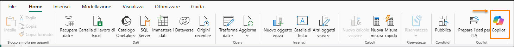

3. Chiedere a Copilot **What reseller has the highest sales?** Premere **INVIO** o fare clic sulla **freccia.**

   

4. I risultati sono mostrati nello screenshot seguente. Non sono i risultati previsti. Copilot ha utilizzato la misura [Reseller Sales], tuttavia, si desidera che utilizzi [Sales by Reseller].

   **Opzioni possibili:**

   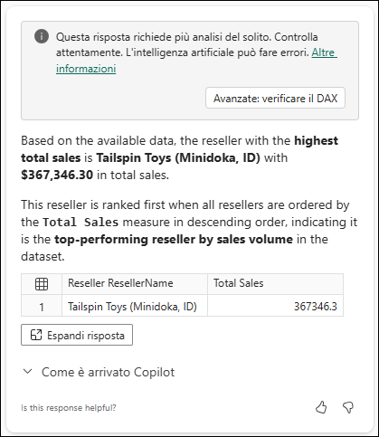

   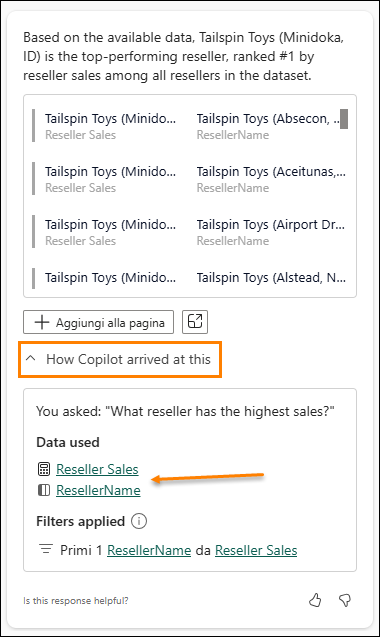

   

   Questo evidenzia anche ulteriori filtri nascosti. Verranno modificati in seguito.

5. La funzionalità Prepara i dati per l'IA in Power BI Desktop verrà utilizzata per nascondere la misura [Reseller Sales] a Copilot. Nella barra multifunzione Home, seleziona **Prepara i dati per l’IA**.

   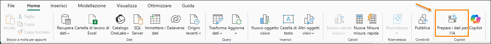

6. Viene visualizzata la nuova finestra con la pagina **Attività iniziali**.

   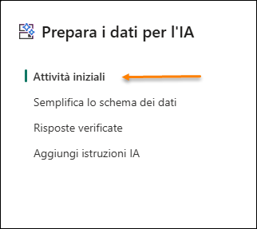

7. Fare clic su **Semplifica lo schema dei dati**.

   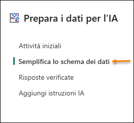

8. Espandere la tabella **Resellers** facendo clic sull'icona **>**. La misura Reseller Sales può creare risultati ambigui con Copilot, pertanto verrà rimossa dallo schema in modo che Copilot non la includa durante l'analisi. L'esclusione di questa misura da Copilot consentirà di ottenere una maggiore coerenza dei risultati. Fare clic sulla casella di controllo per deselezionare la misura **Reseller Sales**, quindi fare clic su Applica. _Vedere lo screenshot seguente._

   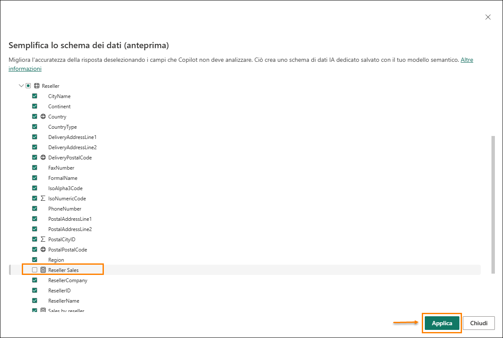

9. Fare clic su **Chiudi**.

   **ℹ️ Importante**

   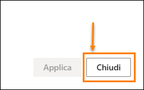

   Come procedura consigliata, i nomi delle tabelle, delle colonne e delle misure devono essere

   molto descrittivi. In questo modo Copilot potrà creare risultati più coerenti e accurati quando risponde alle domande. Ad esempio, in questo modello sono presenti una misura denominata [Reseller Sales] e un'altra misura denominata [Sales by Reseller]. Questo può creare confusione

   per Copilot e portare a risposte potenzialmente incoerenti. Per questo lab questa misura è stata rimossa dallo schema, mentre in altri scenari potrebbe essere opportuno rinominarla.

10. Fare clic sul pulsante Copilot nella barra multifunzione **Home** per chiudere e riaprire Copilot.

    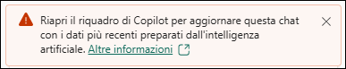

    

11. Chiedere a Copilot **What reseller has the highest sales?** Premere **INVIO** o fare clic sulla **freccia**.

    

12. Dopo aver ricevuto una risposta da Copilot, fare clic sulla sezione **How Copilot arrived at this**.

    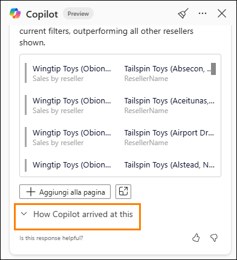

13. Questa volta dovrebbe essere visibile che la misura utilizzata per ottenere questa risposta è **Sales by reseller o perfino SalesNet.** Perfetto, Copilot è stato configurato per evitare quella misura probabile ma non desiderata. Il risultato potrebbe apparire diverso a causa della natura non deterministica di Copilot. È qui che è possibile continuare a preparare i dati per l'IA per creare un'esperienza più coerente.

    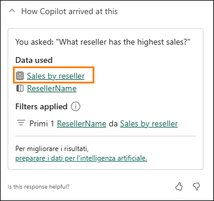

    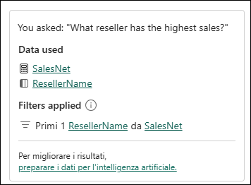

14. Come procedura consigliata, è opportuno nascondere tabelle, colonne e misure che potrebbero creare confusione per Copilot.

    **ℹ️ Importante**

    In Power BI è comune creare misure di supporto o misure temporanee utilizzate per scopi molto specifici all'interno di un contesto di filtro ben definito. Se si è consapevoli del fatto che si hanno molte misure che si desidera nascondere a Copilot, potrebbe essere opportuno creare una tabella appositamente per l'archiviazione delle misure che si desidera nascondere. In tal modo il processo di aggiornamento dello schema sarà molto più semplice. Al momento, la possibilità di nascondere una cartella delle misure non è supportata.

15. Si sono inoltre verificati casi in cui è stato restituito lo stato dalla tabella Customer invece dello stato dalla tabella Reseller. La tabella Customer non deve essere utilizzata in questo contesto ed è disponibile solo per scenari molto specifici. Poiché questa tabella può essere fuorviante per Copilot, verrà nascosta.

16. Fare clic su **Prepara i dati per l’IA** dalla barra multifunzione Home.

17. Selezionare **Semplifica lo schema dei dati** dalla barra di spostamento a sinistra.

18. Deselezionare Customer. Se si deseleziona la tabella Customer, questa continuerà a essere presente nel modello semantico per tutti i report, gli oggetti visivi o i calcoli DAX da creare. Tuttavia, verrà ignorata da Copilot durante l'analisi. Assicurarsi di fare clic su **Applica** e **Chiudi**.

    

    

## Attività 2: aggiungere istruzioni IA

L'aggiunta di istruzioni IA è un passaggio molto importante nella preparazione dei dati per l'IA. Aggiungendo istruzioni IA ben definite, si aiuta Copilot a comprendere più a fondo il modello semantico incorporando il contesto aziendale, la terminologia e le priorità analitiche direttamente nel modello. In questo modo Copilot sarà più intelligente, veloce e maggiormente in linea con le intenzioni dell'utente quando genera informazioni dettagliate, risponde a domande o crea gli oggetti visivi.

In questo lab si useranno le istruzioni IA per definire cosa viene restituito quando a Copilot vengono chieste informazioni sugli articoli più venduti.

1. Aprire Copilot e porre la seguente domanda: **What are the top 5 best-selling products.**

   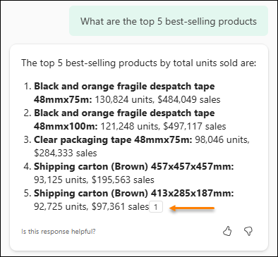

2. Se si ottiene lo stesso risultato mostrato sopra, selezionare il riferimento per aprire l'oggetto visivo da cui provengono questi risultati.

   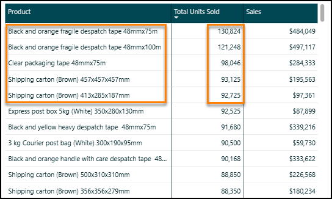

3. Questo risultato sembra corretto e potrebbe effettivamente esserlo. Tuttavia, cosa determina un prodotto "_più venduto_" rispetto a un prodotto con vendite più elevate? Si tratta della quantità, dell'importo venduto, del margine di profitto più alto o di altri criteri?

4. Per il momento, si desidera che Copilot richieda chiarimenti, così da restituire agli utenti finali risultati attesi e corretti. Fare di nuovo clic sul pulsante **Prepara i dati per l'IA**.

   

5. Accedere a **Aggiungi istruzioni IA**.

   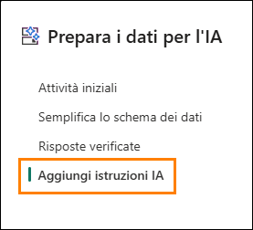

6. Aggiungere un'istruzione per Copilot affinché chieda chiarimenti all'utente su quale definizione intende ogni volta che richiede **highest, most or best-selling**.

7. Digitare:

   **_If asked about "highest" or "most" or "best-selling" product, first clarify if the user wants product by unit sold or product by total sales value._**

   Quindi fare clic su **Applica**, quindi su **Chiudi**.

   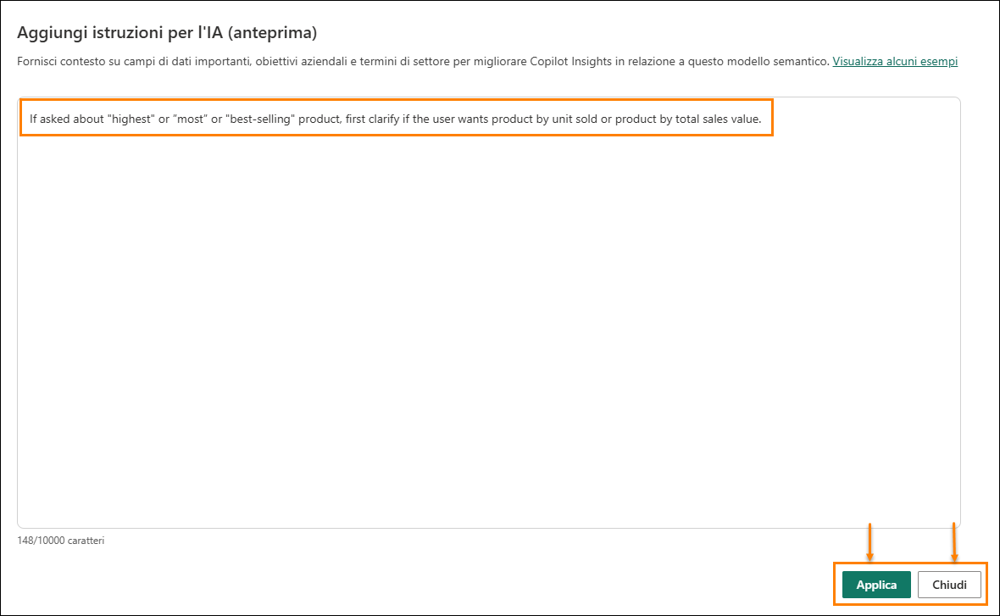

8. Aprire il riquadro Copilot. Se era già aperto, chiudere Copilot e riaprirlo. In questo modo le modifiche apportate verranno applicate.

   

9. Chiedere a Copilot **What's our best-selling product**?

   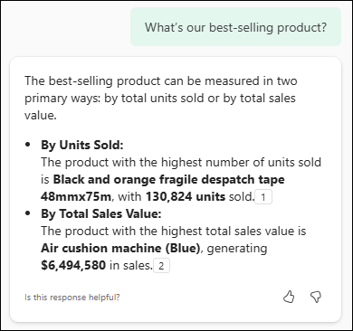

10. Poiché sono state fornite a Copilot istruzioni per chiedere chiarimenti all'utente finale sul significato di best-selling, verranno visualizzate due opzioni. Potrebbe inoltre essere visualizzata una domanda di chiarimento o informazioni aggiuntive.

11. Digitare **units sold** nel prompt e premere INVIO. Copilot ora fornirà una risposta più specifica.

    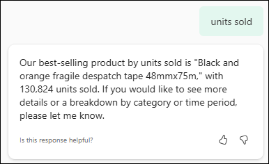

12. Si ipotizzi che ogni utente dell'organizzazione conosca con certezza la distinzione tra best-selling e highest selling. In tal caso, è sufficiente fornire le definizioni a Copilot usando le istruzioni IA.

13. Riaprire la finestra di dialogo **Prepara i dati per l'IA**, accedere a Aggiungi istruzioni IA e sostituire le istruzioni correnti con le seguenti:
    - **Best-selling = most units sold**

    - **Highest selling = total sales value**

      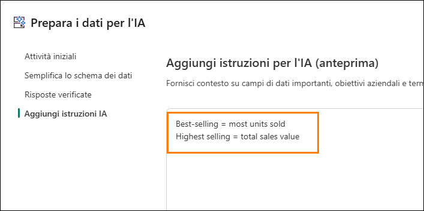

14. Fare clic su Applica, quindi chiudere.

15. Chiudere e riaprire Copilot. Digitare **What's our best-selling product**? nel prompt e premere INVIO.

    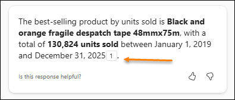

    Copilot ora fornisce la risposta prevista ed è in grado di distinguere tra **best-selling** e **highest selling**. Come accennato all'inizio di questa sezione, Più le istruzioni IA sono chiare e ben definite, migliori saranno le prestazioni di Copilot.

    **ℹ️ Importante**

    **Il test delle istruzioni IA sarà più veloce in Power BI Desktop perché non vi è alcun ritardo nella pubblicazione.** Per questo motivo, è consigliabile testare e perfezionare le istruzioni in locale prima di pubblicarle nel servizio. La pubblicazione introduce un ritardo e può talvolta generare confusione se le modifiche non vengono riflesse immediatamente. Desktop offre un ambiente più reattivo per l'iterazione e il debug.

16. Se viene restituita la stessa risposta mostrata sopra, selezionare il riferimento per visualizzare l'origine dei risultati.

    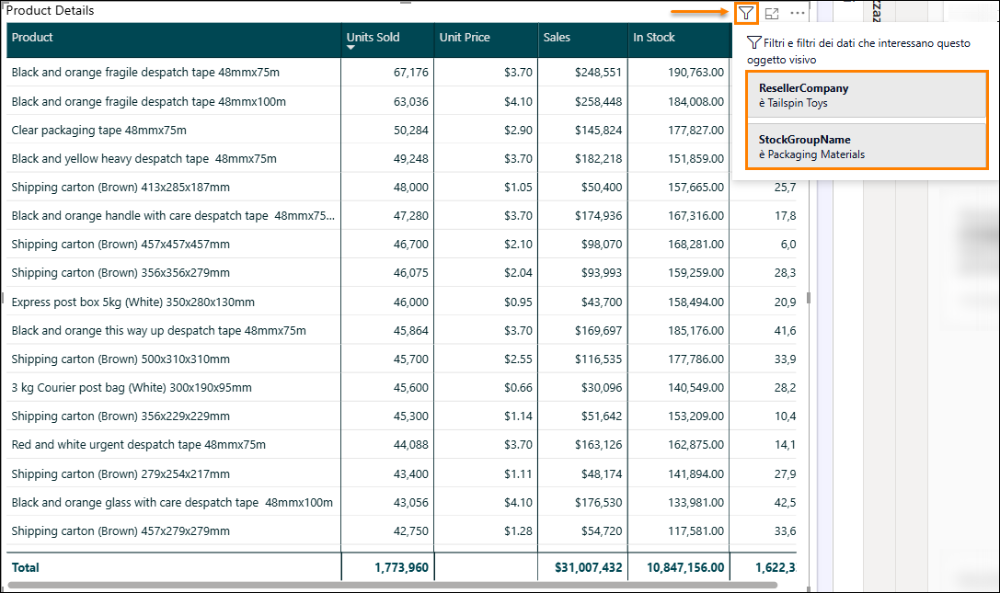

17. I risultati possono variare, ma è facile notare come i risultati restituiti provengano da un oggetto visivo esistente. A un esame più attento, si noterà che questo oggetto visivo è effettivamente filtrato. Ciò significa che abbiamo ricevuto una risposta fuorviante da Copilot. In particolare, nella richiesta non è stato specificato alcun filtro e Copilot non ha indicato che il risultato fosse filtrato.

18. Tornare a Prepara i dati per l'IA e andare accedere **istruzioni IA**. Aggiungere l'istruzione seguente:

    **If you use an existing report visual to answer a user request, always let the user know about any existing filters on the visual.**

    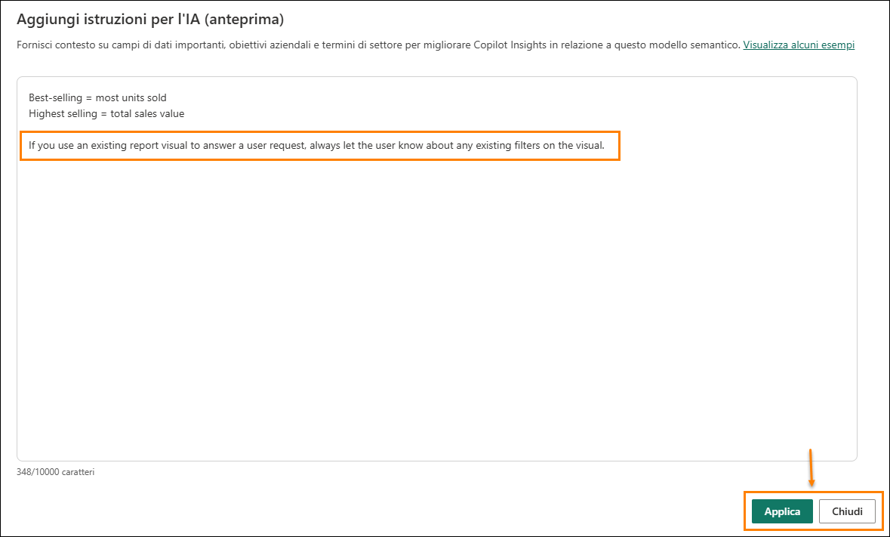

19. Chiedere di nuovo a Copilot **What**'**s our best-selling product?**

    

20. Si noti che questa volta è stato restituito un oggetto visivo di riferimento diverso e Copilot ha correttamente identificato che l'oggetto visivo presentava un filtro su ResellerCompany per Tailspin Toys.

    

    **ℹ️ Importante**

    È importante ricordare che la funzionalità per le istruzioni IA è ancora in anteprima e soggetta a rapidi cambiamenti. Continuare a esplorare istruzioni diverse per verificare cosa funziona e cosa non funziona.

21. Durante la distribuzione dell'esperienza Copilot standalone agli utenti finali, è importante creare fiducia e un modo per farlo è assicurarsi che Copilot non proceda per supposizioni. Un'istruzione che può essere aggiunta consiste nell'indicare a Copilot di non fare mai supposizioni quando non comprende la richiesta.

22. Aprire **Prepara dati per l'IA** e aggiungere le istruzioni seguenti, quindi applicare e chiudere.
    - **Best-selling = most units sold**

    - **Highest selling = total sales value**

    **If you use an existing report visual to answer a user request, always let the user know about any existing filters on the visual.**

    **_If you do not understand what is being asked, do NOT guess, instead ask for clarification._**
    - Copilot ora è più propenso a porre domande di chiarimento.

    - Ecco l'istruzione IA in azione quando Copilot non è sicuro.

      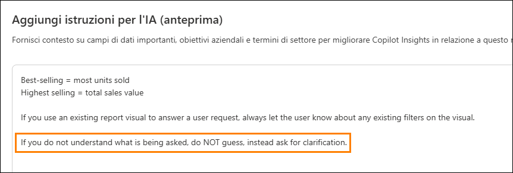

23. Aprire di nuovo Copilot e porre la seguente domanda fuorviante: **Total sales by something what is that?**

    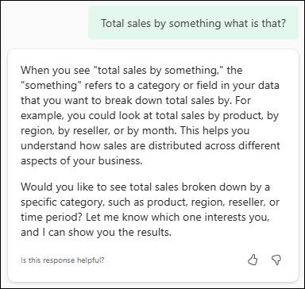

24. In questo esempio, come si vede nello screenshot precedente, Copilot non è sicuro di come si desidera visualizzare le vendite totali, quindi chiede di chiarire cosa si sta cercando.

25. Un altro tipo di istruzione che può essere aggiunto riguarda le indicazioni sugli oggetti visivi del report. Ad esempio, se si desidera visualizzare la data sempre su un grafico a linee o si vuole che Copilot restituisca sempre una matrice quando si esaminano le vendite per paese, è possibile aggiungere queste istruzioni.

26. Senza aggiungere istruzioni IA non vi è alcuna garanzia su quale oggetto visivo verrà restituito da Copilot. Ad esempio, se viene chiesto: **Show total sales measure by year**. Si riceve al momento un grafico a linee:

    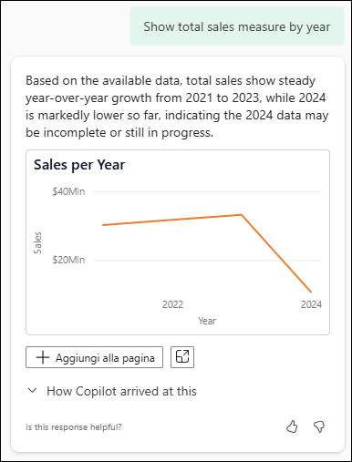

27. Aggiungere ora un'istruzione IA e osservare cosa succede. Aprire **Prepara i dati per l'IA** e aggiungere l'istruzione seguente:

    **## Visual Guidance**

    **_When showing the total sales measure by year always use a column chart._**

    **ℹ️ Importante**

    Quando si scrivono istruzioni per l'IA, "##" è un formato Markdown non necessario, ma una buona norma sia per Copilot che per l'organizzazione dell'agente dei dati di Fabric.

    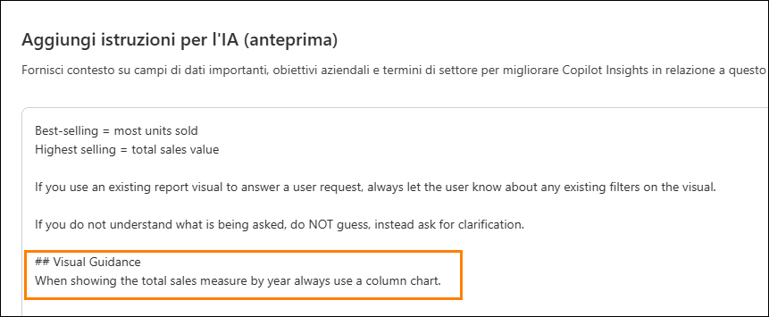

28. Aprire di nuovo Copilot e porre la seguente domanda: **Show total sales measure by year.**

    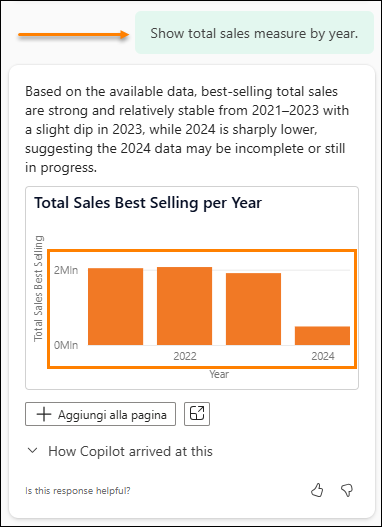

    Copilot può scrivere DAX per ottenere la risposta e visualizzarla come tabella. Ricordarsi che è sempre possibile chiedere: **Can you make this into a column chart?** Oppure riformulare le **istruzioni IA**.

    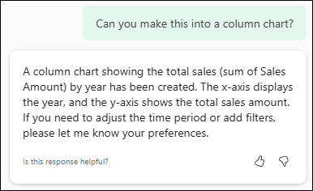

29. Esaminare un altro esempio, questa volta relativo alla definizione di una misura. Tornare alla finestra della chat di Copilot e porre la seguente domanda: **How many purchase orders do we have?**

    

30. Notare che i risultati sono corretti e, espandendo l'area **How Copilot arrived at this**, è possibile vedere che viene utilizzata anche la misura esplicita. Come già visto, è stata creata una descrizione assistita da Copilot proprio per questa misura. Richiedere ora un chiarimento su come viene calcolato il DAX.

    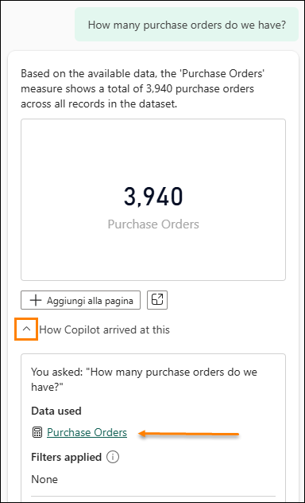

31. Porre la domanda: **Can you explain the DAX used?**

    

32. La risposta è particolarmente interessante perché evidenzia la limitazione di Copilot nell'accedere direttamente alle formule DAX esatte. La risposta stessa è di natura altamente _generativa_ e utilizza espressioni come "probabilmente", "se", "tipicamente" e "potenzialmente". **_A volte_** questo problema può essere risolto con l'aiuto della visualizzazione TMDL e delle istruzioni IA.

    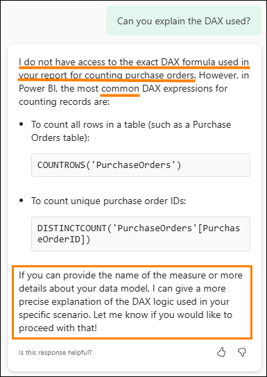

33. Nel riquadro di spostamento a sinistra, seleziona re la visualizzazione **TMDL**.

34. Nella parte inferiore della schermata, creare uno script premendo il pulsante "+".

    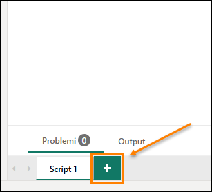

35. Verrà utilizzata una singola misura per aiutare gli utenti a ottenere chiarimenti sul DAX nel modello dati. Trascinare la misura **Purchase Orders** nello script.

    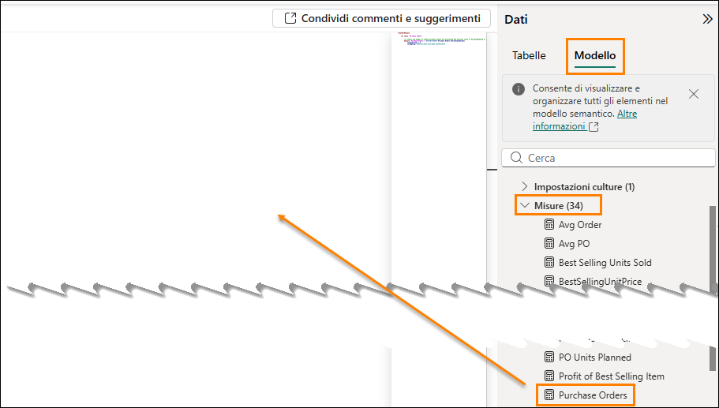

36. Lo script TMDL ottenuto è un'ottima risorsa da aggiungere alle istruzioni IA. La descrizione è rappresentata anche in questa vista. Si desidera ora copiare la descrizione della misura e la misura stessa come mostrato:

    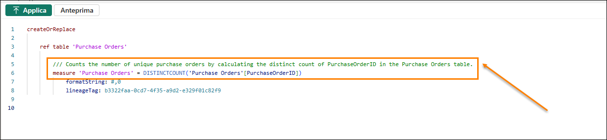

37. Tornare a **Prepara i dati per l'IA** nella vista Report e aggiungere la descrizione TMDL e i dettagli della misura nella vista **Aggiungi istruzioni IA** come mostrato di seguito. Quindi premere **Applica**.

    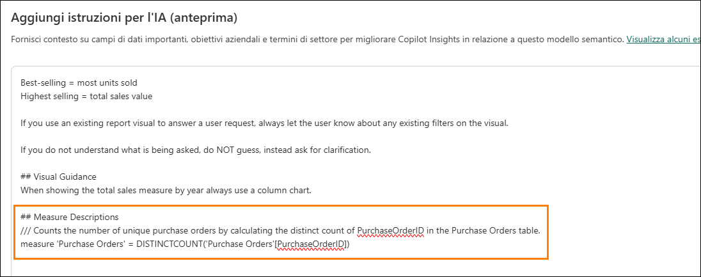

38. Riaprire il riquadro Copilot per aggiornare le istruzioni e porre la stessa domanda di prima: **How many purchase orders do we have?**

    

39. Fin qui tutto bene. Questo è il comportamento previsto, ma il momento atteso è rappresentato dalla domanda successiva.

    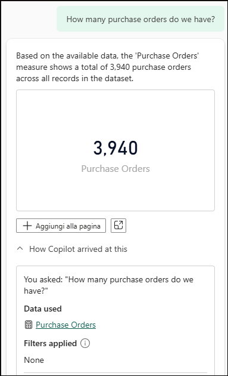

40. Chiedere ora chiarimenti: **Can you explain the DAX used in the Purchase Orders measure?**

    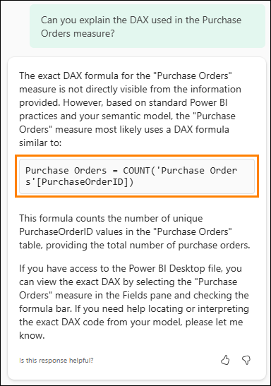

41. Sfortunatamente, Copilot sta ancora facendo supposizione, anche se corrette, su quale sia il codice DAX effettivo. L'aggiunta del codice DAX nelle istruzioni IA può funzionare in alcuni casi, ma al momento, essendo ancora in anteprima, il comportamento non è coerente.

42. In precedenza, durante i lab, è stato richiesto il totale delle vendite per il Southeast. Copilot non ha utilizzato la colonna Sales Territory nella tabella Reseller; ha invece dedotto autonomamente quali stati rappresentassero il territorio Southeast. In questa sezione verrà aggiunta un'istruzione IA per indicare a Copilot di utilizzare Sales Territory quando vengono richieste informazioni sulle aree geografiche.

43. Aprire **Prepara i dati per l'IA** e aggiungere l'istruzione seguente:

    **If a user asks about region or territory related data, for example Southeast, use the Sales Territory column from the Reseller table.**

    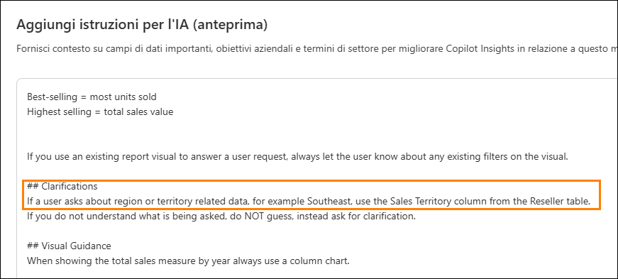

44. Aprire Copilot e scrivere il prompt seguente: **Show total sales for the Southeast**.

    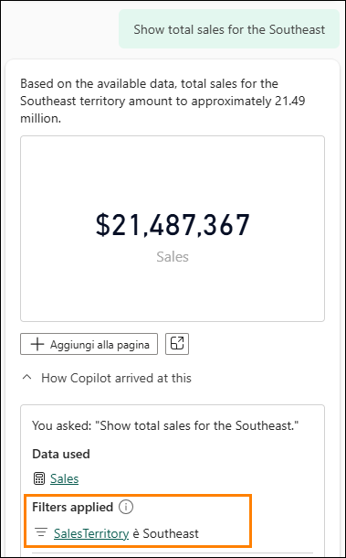

45. Nella sezione precedente è stata rimossa la tabella Customer dallo schema dei dati.

    All'interno di questa organizzazione, i clienti sono definiti in modo specifico come rivenditori che acquistano e successivamente distribuiscono i prodotti. I consumatori finali che acquistano da tali rivenditori non sono classificati come clienti. È necessario chiarire questo aspetto, in modo che Copilot restituisca i rivenditori quando vengono chieste informazioni sui clienti.

46. Aprire Prepara i dati per l'IA e inserire quanto segue:

    **Customers = Resellers**

    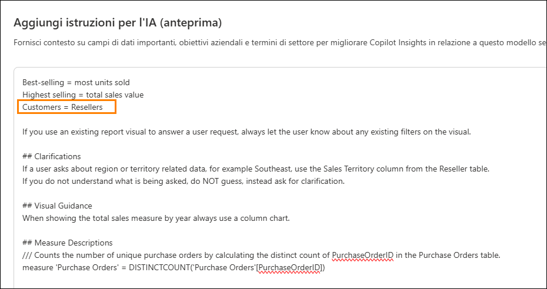

47. Nel prompt di Copilot, chiedere: **What customer sold the most products in 2021?**

    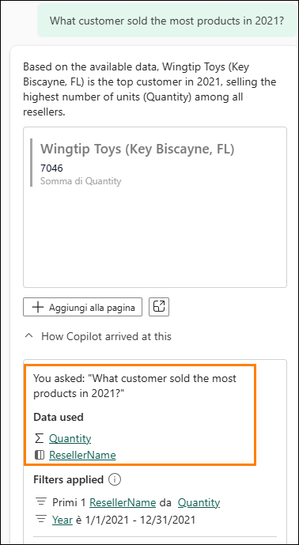

    Questo è visibile anche nel calcolo DAX creato.

    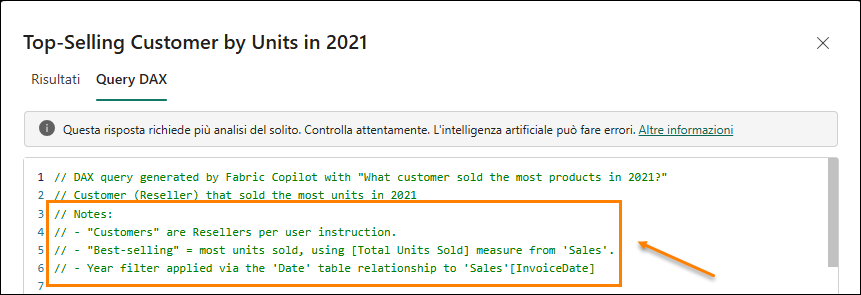

    Si noti che Copilot è stato istruito correttamente e sta usando Reseller per rappresentare il cliente.

## Attività 3: creazione di risposte verificate

Adesso è possibile portare la preparazione dei dati al livello successivo aggiungendo le risposte verificate. Le risposte verificate consentono all'autore del modello di selezionare un oggetto visivo e scegliere frasi che, quando un utente chiede, visualizzeranno quell'oggetto visivo come risposta verificata. Le risposte verificate aiutano inoltre Copilot a conoscere il contesto del modello e a fornire risposte più accurate anche se la richiesta non restituisce una risposta verificata esatta.

**ℹ️ Importante**

Le risposte verificate associano la frase impostata a qualsiasi richiesta identificata come semanticamente simile. Per questo motivo non è necessario definire tutte le possibili varianti della frase che un utente potrebbe utilizzare. È invece consigliabile impostare frasi trigger chiare e distinte che possano essere richiamate anche da richieste simili.

1. Per il primo esempio, verrà creata una risposta verificata per **Top state for sales**.

2. Attualmente, se si chiede a Copilot: **What state has the most sales?** Non sempre interpreta la domanda nel modo desiderato. Questo perché si fa riferimento alla parola "vendite" in diversi modi all'interno del modello e del report.

3. In questo esempio, sarà importante assicurarsi che Copilot restituisca sempre la risposta prevista.

4. Questa volta non si **inizierà** nella finestra di dialogo di preparazione dei dati per l'IA. Se si apre la scheda delle risposte verificate nella finestra di dialogo Prepara dati per l'IA, si noterà che non è disponibile nulla.

   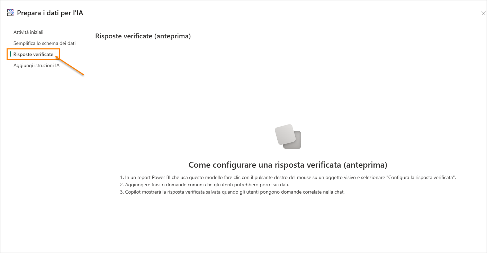

5. Si inizierà invece con gli oggetti visivi del report.

6. Chiudere la finestra Prepara i dati per l'IA e accedere alla pagina **Dettagli prodotto**.

   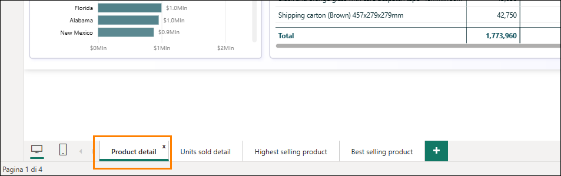

7. Fare clic sul grafico a barre per le vendite per stato e fare clic sui puntini di sospensione (**...**) che si trovano nell'angolo in alto a destra.

   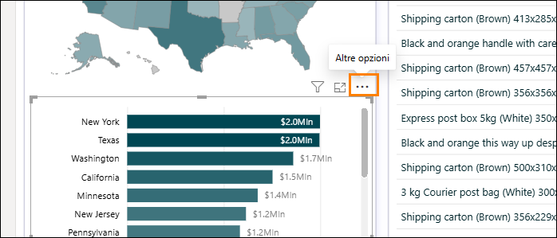

8. Scegliere **Configura una risposta verificata** dal menu a discesa.

   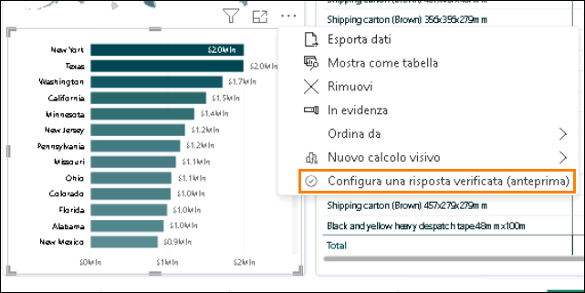

9. È possibile impostare una frase selezionando un suggerimento di Copilot o digitando una frase personalizzata.

10. Nella casella Immetti una frase digitare: **State with the highest sales** e **fare clic su Aggiungi.** _Vedere lo screenshot seguente._

    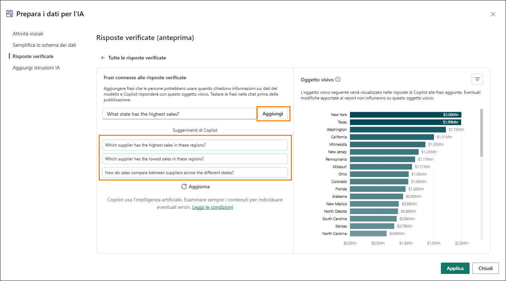

11. Fare clic su Applica e quindi chiudere.

    

12. Chiudere e riaprire il riquadro Copilot.

13. Chiedere a Copilot: **What state has the highest sales?**

    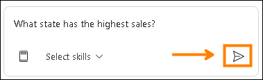

14. Ottenere una risposta verificata corretta per la domanda.

    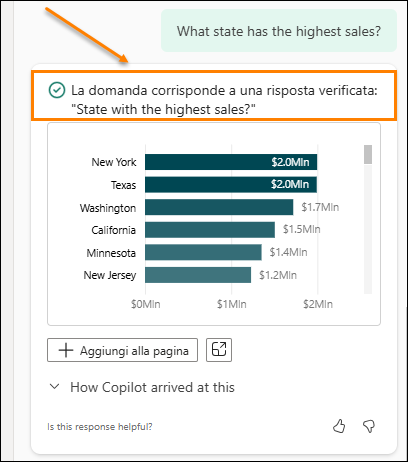

15. E i falsi positivi? Provare a porre una domanda che non dovrebbe utilizzare la risposta verificata e osservare cosa accade. In Copilot, digitare il prompt seguente **What state is selling the most of the highest selling product?**

    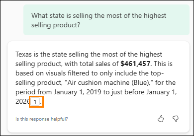

16. Perfetto. La risposta punta a un oggetto visivo diverso nel report. Più nello specifico, fa riferimento a un oggetto visivo filtrato sul prodotto con le vendite più elevate. Si noti anche che la risposta rispetta le istruzioni IA fornite in precedenza e indica i filtri applicati all'oggetto visivo restituito.

17. Ora si procederà all'aggiunta di un'altra risposta verificata. Questa volta si chiede di mostrare **The best selling product.**

18. Fare clic sulla pagina del report per il prodotto più venduto.

    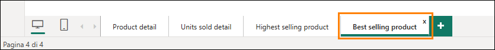

19. Successivamente, trovare l'oggetto visivo della scheda in alto, fare clic sui puntini di sospensione **(...)** e selezionare **Configura una risposta verificata**.

    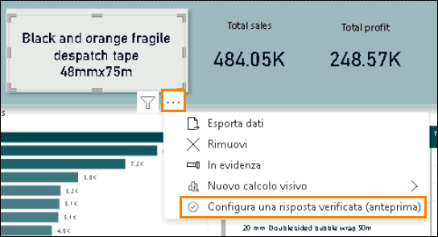

20. In precedenza, nel lab sono state aggiunte istruzioni IA per indicare che best selling corrisponde alle unità totali, mentre highest selling al valore totale delle vendite. È importante assicurarsi che le frasi delle risposte verificate siano correttamente allineate con le istruzioni IA.

21. Questa volta si aggiungeranno due frasi, che possono essere visualizzate o meno nei suggerimenti di Copilot. Innanzitutto, aggiungere una frase per **Which Product has sold the most units?** Quindi fare clic su Aggiungi.

    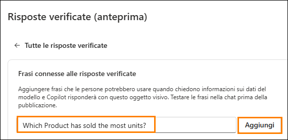

22. Fare clic su Applica.

    

23. Fare clic sull'icona + accanto ai **suggerimenti di Copilot** per aggiungere una frase aggiuntiva. Aggiungere la frase **What is the best-selling product?** o una frase analoga, quindi fare clic su Aggiungi.

    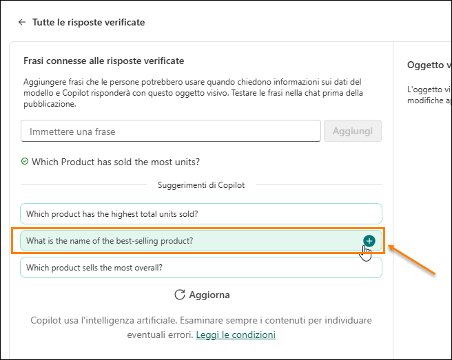

24. Ora entrambe le frasi sono collegate all'oggetto visivo del report, come mostrato nello screenshot seguente.

    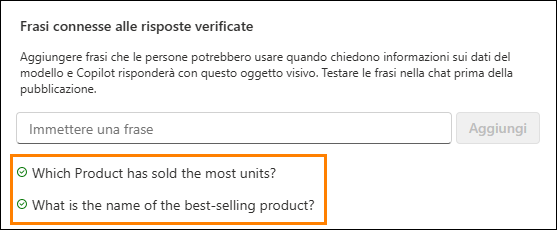

25. Fare clic su Applica e Chiudi.

26. L'esercizio è terminato. In questa sezione si è appreso come aggiungere risposte verificate agli oggetti visivi del report. Si è anche appreso che è possibile aggiungere più di una frase per collegare le domande degli utenti a un unico oggetto visivo del report.

## Attività 4: esercitazione autonoma

Se il tempo del lab lo consente, continuare a esplorare le funzionalità di **Prepara i dati per l'IA** apprese in questo lab.

1. Iniziare ponendo a Copilot una domanda di interesse. Se i risultati non sono quelli desiderati o previsti, valutare come ottenere il risultato desiderato utilizzando semplicemente lo schema di dati, le risposte verificate o le istruzioni IA.

## Conclusione

L'esercizio è terminato. La sezione del lab sulla preparazione dei dati per l'IA è stata completata.

# Riferimenti

Chat With Your Data in a Day (CDIAD) presenta alcune delle funzionalità chiave dell'uso di Copilot standalone in un'area di lavoro Fabric.

Nel menu di servizio, la sezione Guida (?) include collegamenti ad alcune risorse utili. Tenere presente che la visualizzazione dipende dall'esperienza attualmente in uso e, pertanto, le opzioni potrebbero risultare diverse rispetto alla schermata mostrata di seguito.

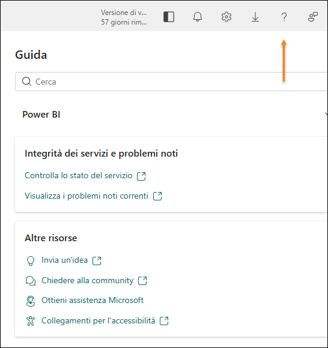

Di seguito sono indicate altre risorse utili a progredire nell'uso di Microsoft Fabric.

- Accedere a tutte le informazioni nella [documentazione di Microsoft Fabric](https://learn.microsoft.com/en-us/fabric/)

- Esplorare Fabric tramite la [presentazione guidata](https://aka.ms/Fabric-GuidedTour)

- Iscriversi alla [versione di valutazione gratuita di Microsoft Fabric](https://aka.ms/try-fabric)

- Visitare il [sito Web di Microsoft Fabric](https://aka.ms/microsoft-fabric)

- Acquisire nuove competenze esplorando i [moduli di apprendimento di Fabric](https://aka.ms/learn-fabric)

- Leggere [l'e-book gratuito introduttivo a Fabric](https://aka.ms/fabric-get-started-ebook)

- Unirsi alla [community di Fabric](https://aka.ms/fabric-community) per pubblicare domande, condividere feedback e imparare dagli altri

Leggere la documentazione tecnica più approfondita relativa a Copilot:

- [Panoramica di Copilot per Power BI - Power BI | Microsoft Learn](https://learn.microsoft.com/en-us/power-bi/create-reports/copilot-introduction)

- [Esperienza Copilot standalone in Power BI (anteprima) – Power BI | Microsoft Learn](https://learn.microsoft.com/en-us/power-bi/create-reports/copilot-chat-with-data-standalone)

- [Impostazioni dell'amministratore di Microsoft Fabric Copilot | Microsoft Learn](https://learn.microsoft.com/en-us/fabric/admin/service-admin-portal-copilot)

- [Creazione dell'agente dei dati di Fabric (anteprima) - Informazioni su come creare un agente dei dati di Fabric | Microsoft Learn](https://learn.microsoft.com/en-us/fabric/data-science/concept-data-agent)

- [Procedure consigliate per la configurazione dell'agente dei dati - Microsoft Fabric | Microsoft Learn](https://learn.microsoft.com/en-us/fabric/data-science/data-agent-configuration-best-practices)

- [Copilot per Microsoft Fabric e Power BI: domande frequenti - Microsoft Fabric | Microsoft Learn](https://learn.microsoft.com/en-us/fabric/fundamentals/copilot-faq-fabric)

© 2026 Microsoft Corporation. Tutti i diritti sono riservati.

L'uso della demo/del lab implica l'accettazione delle seguenti condizioni:

La tecnologia/le funzionalità descritte nella demo/nel lab sono fornite da Microsoft Corporation allo scopo di ottenere feedback dall'utente e offrire un'esperienza di apprendimento. L'utilizzo della demo/del lab è consentito solo per la valutazione delle caratteristiche e delle funzionalità di tale tecnologia e per l'invio di feedback a Microsoft. L'utilizzo per qualsiasi altro scopo non è consentito. È vietato modificare, copiare, distribuire, trasmettere, visualizzare, eseguire, riprodurre, pubblicare, concedere in licenza, usare per la creazione di lavori derivati, trasferire o vendere questa demo/questo lab o parte di essi.

SONO ESPLICITAMENTE PROIBITE LA COPIA E LA RIPRODUZIONE DELLA DEMO/DEL LAB (O DI QUALSIASI PARTE DI ESSI) IN QUALSIASI ALTRO SERVER O IN QUALSIASI ALTRA POSIZIONE PER ULTERIORE RIPRODUZIONE O RIDISTRIBUZIONE.

QUESTA DEMO/QUESTO LAB RENDONO DISPONIBILI TECNOLOGIE SOFTWARE/FUNZIONALITÀ DI PRODOTTO SPECIFICHE, INCLUSI NUOVI CONCETTI E NUOVE FUNZIONALITÀ POTENZIALI, IN UN AMBIENTE SIMULATO, CON UN'INSTALLAZIONE E UNA CONFIGURAZIONE PRIVE DI COMPLESSITÀ, PER GLI SCOPI DESCRITTI IN PRECEDENZA. LA TECNOLOGIA/I CONCETTI RAPPRESENTATI IN QUESTA DEMO/IN QUESTO LAB POTREBBERO NON CONTENERE LE FUNZIONALITÀ COMPLETE E IL LORO FUNZIONAMENTO POTREBBE NON ESSERE LO STESSO DELLA VERSIONE FINALE. È ANCHE POSSIBILE CHE UNA VERSIONE FINALE DI TALI FUNZIONALITÀ O CONCETTI NON VENGA RILASCIATA. L'ESPERIENZA D'USO DI TALI CARATTERISTICHE E FUNZIONALITÀ PUÒ RISULTARE DIVERSA IN UN AMBIENTE FISICO.

**FEEDBACK.** L'invio a Microsoft di feedback sulle caratteristiche, sulle funzionalità e/o sui concetti della tecnologia descritti in questa demo/questo lab implica la concessione a Microsoft, a titolo gratuito, del diritto di usare, condividere e commercializzare tale feedback in qualsiasi modo e per qualsiasi scopo. Implica anche la concessione a titolo gratuito a terze parti del diritto di utilizzo di eventuali brevetti necessari per i loro prodotti, le loro tecnologie e i loro servizi al fine di utilizzare o interfacciarsi ai componenti software o ai servizi Microsoft specifici che includono il feedback. L'utente si impegna a non inviare feedback la cui inclusione all'interno di software o documentazione Microsoft imponga a Microsoft di concedere in licenza a terze parti tale software o documentazione. Questi diritti sussisteranno anche dopo la scadenza del presente contratto.

CON LA PRESENTE MICROSOFT CORPORATION NON RICONOSCE ALCUNA GARANZIA E CONDIZIONE RELATIVAMENTE ALLA DEMO/AL LAB, INCLUSE TUTTE LE GARANZIE E CONDIZIONI DI COMMERCIABILITÀ, DI FATTO ESPRESSE, IMPLICITE O PRESCRITTE DALLA LEGGE, ADEGUATEZZA PER UNO SCOPO SPECIFICO, TITOLARITÀ E NON VIOLABILITÀ. MICROSOFT NON OFFRE GARANZIE O RAPPRESENTAZIONI IN RELAZIONE ALL'ACCURATEZZA DEI RISULTATI E DELL'OUTPUT DERIVANTI DALL'USO DELLA DEMO/DEL LAB O ALL'ADEGUATEZZA DELLE INFORMAZIONI CONTENUTE NELLA DEMO/NEL LAB PER QUALSIASI SCOPO.

**CLAUSOLA DI RESPONSABILITÀ**

Questa demo/questo lab contiene solo una parte delle nuove funzionalità e dei miglioramenti in Microsoft Power BI. Alcune funzionalità potrebbero cambiare nelle versioni future del prodotto. In questa demo/in questo lab si apprendono alcune delle nuove funzionalità, ma non tutte.
