# Microsoft Fabric Chat with your Data in a Day - Lab 4

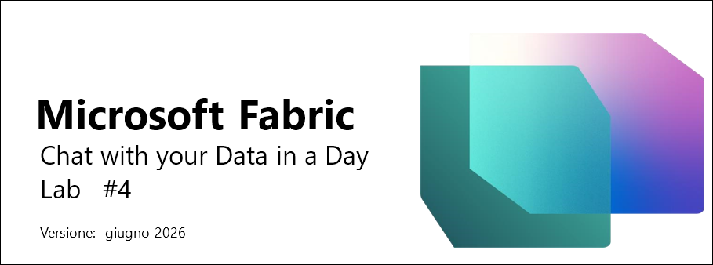

## Sommario

- Struttura del documento
- Scenario/Esposizione del problema
- Introduzione
- Esperienza Copilot standalone
- Configurazione: configurazione dell'area di lavoro per lab successivi
    - Attività 1: esplorazione dell'esperienza Copilot standalone
    - Attività 2: scrittura di un prompt in Copilot standalone
    - Attività 3: esplorazione della vista nella funzionalità del report
    - Attività 4: esplorazioni
    - Attività 5: risposte verificate
    - Attività 6: come Copilot è arrivato a questo risultato (HCAAT)
    - Attività 7: una risposta sui dati da una query DAX generata da Copilot
    - Attività 8: cambio di contesto in Copilot
    - Attività 9: creazione di un oggetto visivo da parte di Copilot a partire dal modello semantico
    - Attività 10: esperienza Copilot generale
- Riferimenti

# Struttura del documento

Il lab include i passaggi che l'utente deve seguire con gli screenshot associati che forniscono un aiuto visivo. In ogni screenshot vi sono sezioni evidenziate con riquadri arancioni che indicano le aree su cui l'utente deve concentrarsi.

# Scenario/Esposizione del problema

Congratulazioni per aver raggiunto questo punto. Si è appreso come implementare le procedure consigliate generalmente accettate nel modello di dati e come usare la funzionalità Prepara dati per l'IA. Ora è il momento di esplorare l'esperienza Copilot standalone all'interno di Microsoft Fabric.

Nell'organizzazione, come in molte altre, sono presenti centinaia di report e modelli semantici distribuiti tra decine di aree di lavoro. Per gli utenti finali trovare il report o i dati corretti è stato complesso. Si desidera sfruttare l'esperienza Copilot standalone per aumentare l'adozione da parte degli utenti e ridurre i tempi necessari per ottenere informazioni dettagliate in tutta l'organizzazione.

**Sfide attuali**

- **Esperienza di individuazione frammentata:** gli utenti riscontrano difficoltà nel trovare i dati, i report, le app e gli agenti dei dati corretti nell'ambiente Fabric.

- **Bassa adozione**: l'elevato numero di report e la formazione richiesta creano attriti, rendendo difficile ottenere il coinvolgimento e favorire l'adozione da parte degli utenti.

- **Ritardo nel processo decisionale:** i tempi necessari per ottenere informazioni dettagliate restano elevati a causa delle difficoltà di navigazione e delle limitate funzionalità self-service.

# Introduzione

Nei lab precedenti si è appreso come preparare il modello semantico per ottimizzare l'esperienza IA. In questo lab si sfrutterà tutto il lavoro svolto e si scoprirà come Copilot in Microsoft Fabric può contribuire ad accelerare i tempi di acquisizione delle informazioni dettagliate all'interno dell'organizzazione.

# Esperienza Copilot standalone

In questa sezione verrà illustrata l'esperienza di Copilot standalone in Fabric e verranno illustrate le diverse modalità disponibili per interagire con i dati tramite chat. Al termine di questo lab si avrà una comprensione molto più approfondita di come sfruttare l’esperienza Copilot standalone per ridurre i tempi necessari per ottenere informazioni dettagliate. In particolare, si apprenderà quando segue:

- Come sfruttare al meglio l'esperienza Copilot standalone

- Come comprendere i report, gli oggetti visivi e le risposte sui dati restituiti.

- In che modo convalidare "Come Copilot è arrivato a questo risultato (HCAAT)"

- Come creare e modificare esplorazioni che possono essere condivise.

- Come sfruttare le funzionalità di Prepara dati per l'IA, come le risposte verificate

- Come identificare le risposte che indicano attriti

- Come sfruttare l'esperienza generale di Copilot

**ℹ️ Importante**

L'esperienza Copilot standalone evidenziata in questi lab NON conserva una cronologia della chat. Se si fa clic per uscire dall'esperienza Copilot, la conversazione andrà persa. Questo differisce dall'esperienza di M365 Copilot Chat.

## Configurazione: configurazione dell'area di lavoro per lab successivi

In questo lab e in quelli successivi, sarà necessario disporre di un'area di lavoro personale per modificare e salvare gli elementi in Fabric. In questa sezione di configurazione verrà creata un'area di lavoro e verrà assegnata una capacità Fabric a tale area, in modo da poter eseguire attività specifiche senza influire sugli altri partecipanti al lab.

1. Aprire un Web browser nella macchina virtuale e accedere a [https://fabric.microsoft.com/](https://app.fabric.microsoft.com/home?experience=power-bi)

2. Accedere a Fabric usando le credenziali fornite durante il workshop.

3. Selezionare **Aree di lavoro** nel riquadro di spostamento a sinistra.

    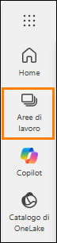

4. Nel riquadro Aree di lavoro, fare clic sull'area di lavoro **Fabrikam_Lab_<inject key="DeploymentID" enableCopy="false"></inject>_IT**.

    

    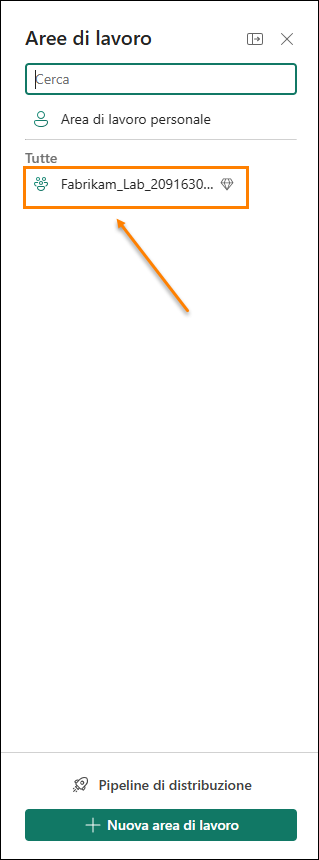

5. Ora è necessario assicurarsi che la licenza individuale possa essere pubblicata nell'area di lavoro abilitata per Fabric. Selezionare l'icona dell'utente nell'angolo in alto a destra e fare clic su **Avvia la versione di valutazione**.

    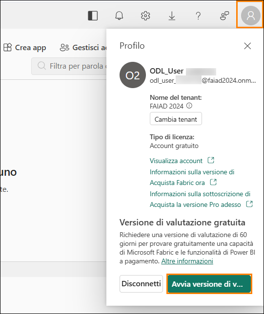

6. È sufficiente fare clic su **Attiva** per abilitare la pubblicazione nell'area di lavoro.

    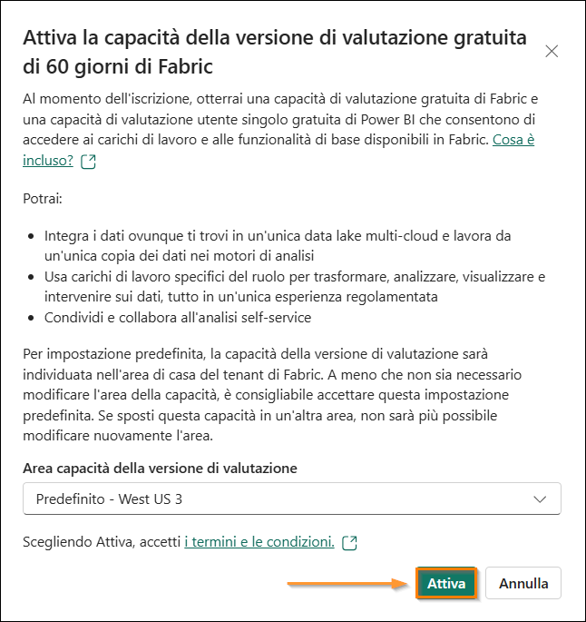

    Fare clic su **OK**.

    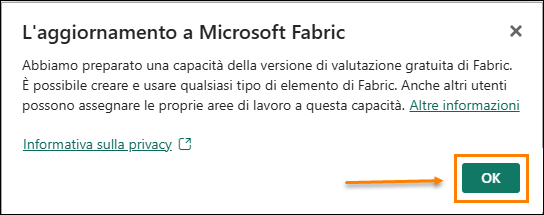

7. Successivamente, sarà necessario **pubblicare** il file PBIX completato dai file della lezione.

8. Dai file della lezione aprire il file denominato **Fabrikam Company Sales Report.pbix**.

    

9. Una volta aperto, verificare di aver effettuato l'accesso al proprio account utente assegnato per il workshop CDIAD.

10. Fare clic su Pubblica per trovare l'area di lavoro appena creata **Fabrikam_Lab_<inject key="DeploymentID" enableCopy="false"></inject>_IT**.

    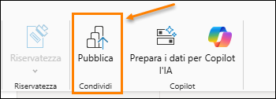

    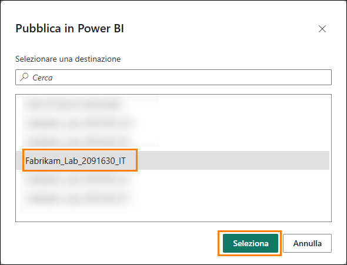

## Attività 1: esplorazione dell'esperienza Copilot standalone

1. Selezionare Copilot nel riquadro di spostamento a sinistra.

    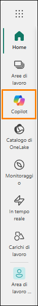

2. Se viene visualizzato un messaggio nella schermata successiva, fare clic su **Inizia**. Copilot selezionerà un'area di lavoro in base alla **capacità Copilot** cui l'utente ha accesso. Questa selezione dipenderà dal fatto che l'area di lavoro disponga o meno di **unità di capacità (CU).** Se all'utente è assegnata una **configurazione della capacità Fabric,** verrà usata invece tale capacità.

3. Benvenuti nell'esperienza Copilot standalone. Nella schermata iniziale vengono mostrati alcuni suggerimenti di prompt nella parte superiore **(1)** e una sezione nella parte inferiore in cui è possibile scrivere la propria richiesta **(2).**

    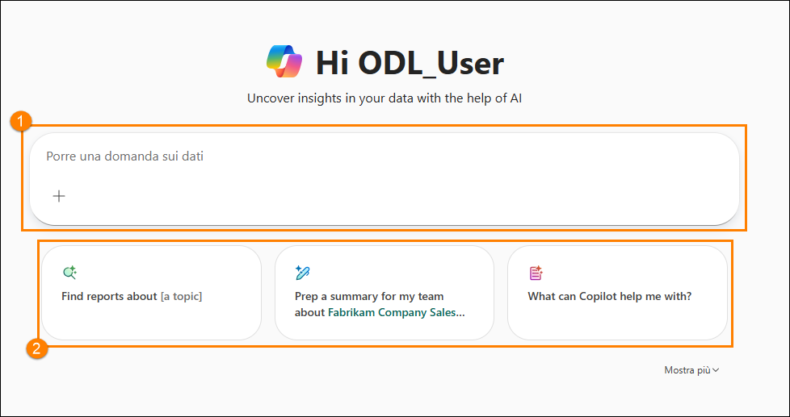

## Attività 2: scrittura di un prompt in Copilot standalone

In questa sezione vengono inseriti diversi prompt ed esplorati i risultati restituiti dall'esperienza Copilot.

1. Fare clic sul prompt e scrivere quanto segue: **Find reports about Fabrikam's sales trends for the year**. Quindi, fare clic su **INVIO**.

    **ℹ️ Importante**

    

    L'IA restituisce risultati non deterministici a causa di molti fattori. Come discusso in precedenza in questa lezione, i risultati potrebbero variare e potrebbero non essere identici a quelli dei lab. Procedere quindi con l'esplorazione delle funzionalità e delle caratteristiche visualizzate, sfruttandole al meglio delle proprie possibilità.

    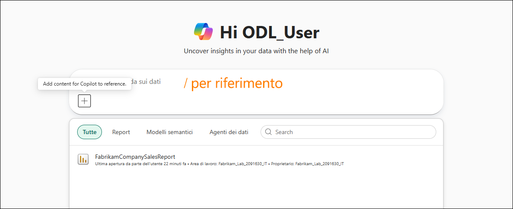

    È possibile utilizzare facilmente o per fare riferimento al file o al **+**. Questo può risultare utile, poiché Copilot potrebbe impiegare del tempo per assimilare completamente il contenuto pubblicato.

    **Se non si ottiene** il report corretto da visualizzare, è perché di solito è necessario verificare alcuni elementi:

    1) Nell'impostazione del servizio Power BI, seleziona il portale di amministrazione di Fabric, vogliamo assicurarci di aver verificato le impostazioni relative a Copilot. Tra queste, l'opzione **Mostra solo gli elementi approvati nell'esperienza standalone di Copilot in Power BI**. Se questa opzione è selezionata, saranno visualizzati esclusivamente gli elementi approvati per Copilot, salvo quelli allegati o a cui si fa riferimento manualmente. Questa funzionalità è già abilitata per impostazione predefinita nel tenant.

        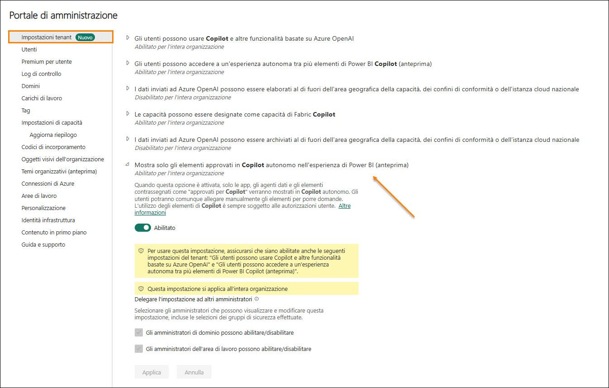

    2) Se necessario, è possibile approvare il modello semantico per Copilot selezionando il modello nell'area di lavoro.

        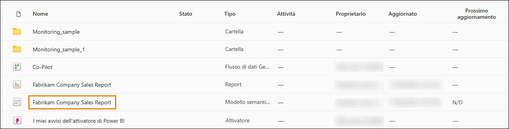

    3) Selezionando **Preparazione dei dati per l'IA**, si aprirà la finestra Preparazione dei dati per l'IA.

        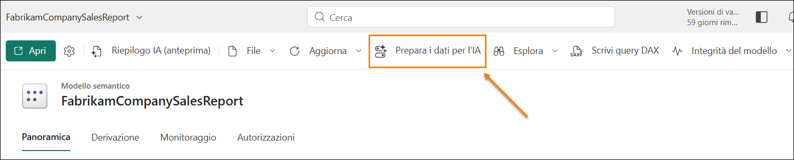

        Per consentire la ricerca automatica senza riferimenti manuali, occorre attivare la funzionalità di archiviazione dei modelli di grandi dimensioni.

        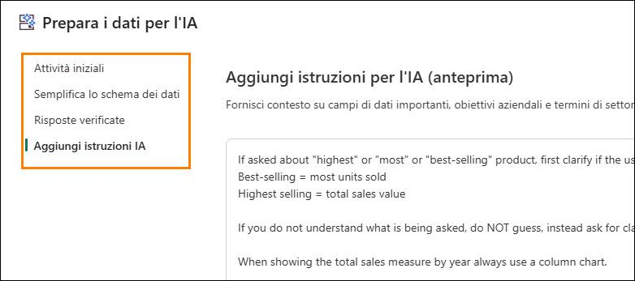

        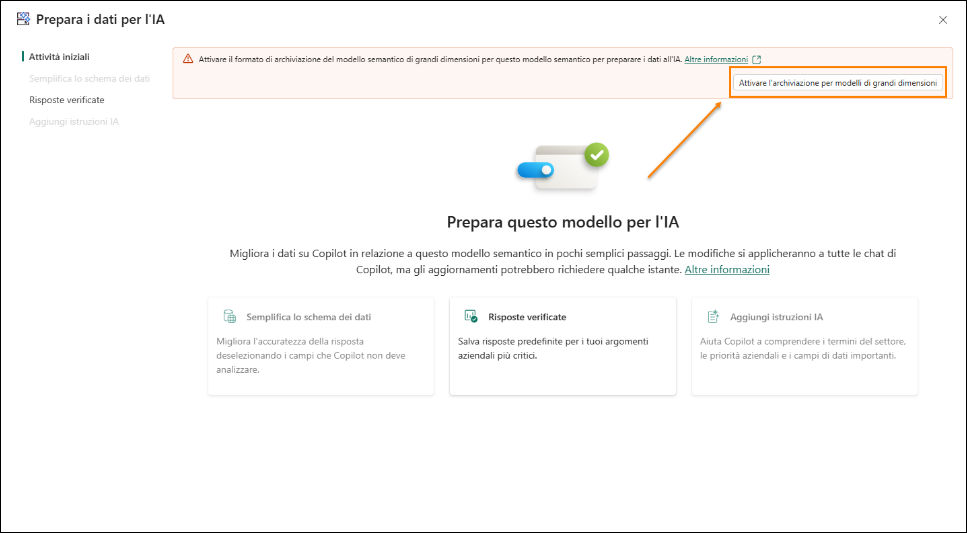

        Da questa schermata è possibile visualizzare e configurare i dati di preparazione per le attività di AI.

2. Fare clic sul report restituito nei risultati della ricerca, **Fabrikam Company Sales Report**. Si aprirà una nuova scheda nel Web browser, che porterà direttamente a quel report.

    

3. Dedicare qualche istante a **esplorare** questo report e a prenderne familiarità.

    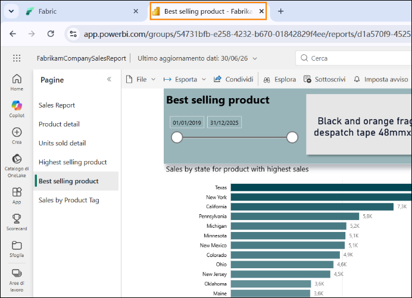

4. Dopo aver esplorato il report, fare clic sulla (x) nella scheda del browser per chiudere questa scheda e tornare all'esperienza Copilot.

5. Fare clic sul prompt pregenerato nella parte inferiore della pagina o inserire il prompt: **Give me an overview of 1. Fabrikam Company Sales**:

    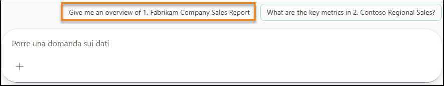

6. Richiedere a Copilot una panoramica del report consentirà di ottenere le seguenti informazioni, come mostrato nello screenshot seguente. **Promemoria: la schermata e i risultati potrebbero presentare lievi differenze.**

    1. Copilot restituirà le visualizzazioni del report esistente, fornendo una panoramica generale.

    2. Copilot fornirà una descrizione narrativa per ogni oggetto visivo restituito.

       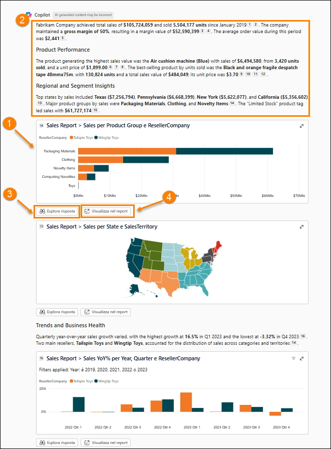

## Attività 3: esplorazione della vista nella funzionalità del report

Copilot può restituire vari tipi di risposte a seconda delle domande poste e del livello di preparazione dei dati sottostanti. In questa sezione viene illustrata la funzionalità **Visualizza nel report**. Questa funzionalità viene restituita ogni volta che Copilot usa un oggetto visivo esistente di un report per rispondere alla domanda.

1. Ora si esaminerà l'opzione **Visualizza nel report** che consente di aprire il report corrente con l'oggetto visivo specificato evidenziato.

2. Da una qualsiasi delle visualizzazioni presentate, fare clic su **Visualizza nel report** e si aprirà una nuova scheda nel browser Web. *Vedere lo screenshot seguente*.

    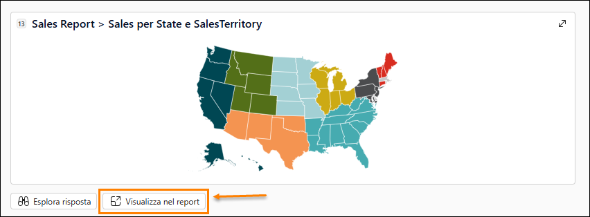

3. Nella nuova pagina del report verrà visualizzato l’oggetto visivo selezionato da Copilot all’interno del report originale. Si noterà anche che gli altri oggetti visivi sono temporaneamente disattivati perché l'oggetto visivo selezionato è stato **evidenziato**. Fare clic in un punto qualsiasi del report per attivarlo ed esplorare. Una volta terminata l'esplorazione, chiudere questa scheda nel Web browser e tornare all'esperienza Copilot standalone.

    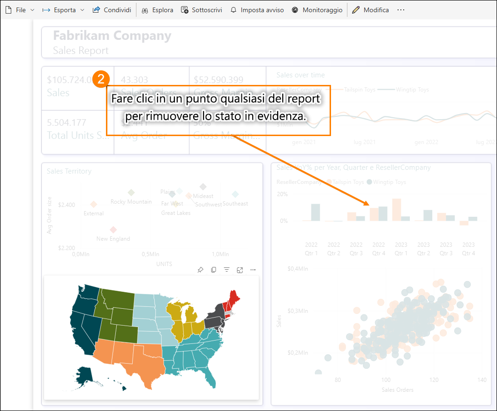

## Attività 4: esplorazioni

Un'altra funzionalità presentata dall'esperienza Copilot è la possibilità di **esplorare la risposta**. Questa possibilità di esplorare una risposta rappresenta un ottimo modo per continuare a perfezionare l'esperienza Copilot. In questa sezione verrà illustrato come utilizzare le esplorazioni, modificarle, salvarle e condividerle.

**ℹ️ Nota**

Le esplorazioni vengono utilizzate principalmente come strumenti per l'analisi ad hoc dei dati e degli oggetti visivi esistenti nei report. Sebbene le esplorazioni possano essere salvate, spesso vengono semplicemente chiuse dopo che l'analisi ad hoc è stata completata.

1. È consigliabile ora tornare all'esperienza Copilot standalone. Fare clic su **Esplora risposta** sotto una qualsiasi delle visualizzazioni in Copilot; per questo esempio non è rilevante quale venga scelta.

    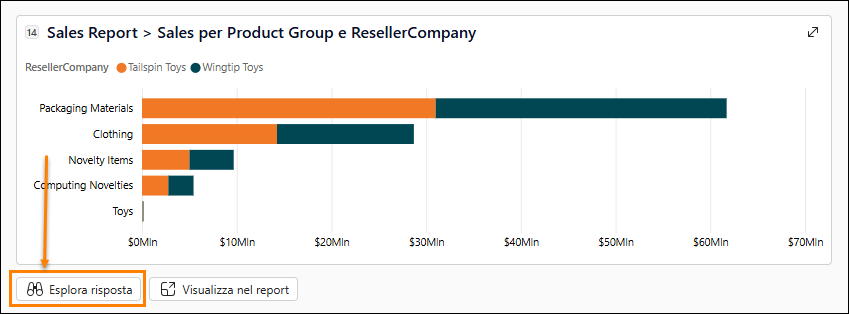

2. Facendo clic su questo pulsante si apre una nuova schermata da dove è possibile cominciare le **esplorazioni.**

    - (1) Salvare l'esplorazione come report o come esplorazione.

    - (2) Aprire in una nuova scheda del browser.

    - (3) Condividere

    - (4) Visualizzare in formato matrice

    - (5) Modificare il tipo di visualizzazione

    - (6) Modificare le colonne/misure dell'oggetto visivo

    - (7) Espandere/comprimere la visualizzazione

        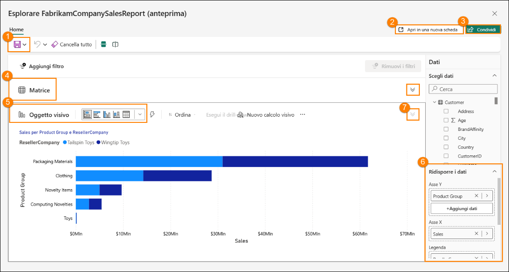

3. Fare clic sull'icona a discesa accanto al pulsante Salva, che fornisce alcune opzioni:

    - Innanzitutto, è possibile salvarla come esplorazione, poiché si tratta di un tipo di oggetto nell'area di lavoro.

    - Successivamente è possibile salvare una copia. Questa opzione viene visualizzata se l'esplorazione è stata salvata in precedenza.

    - Infine, è possibile salvarla come report.

        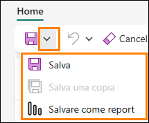

4. Se la configurazione è stata completata in precedenza in questo lab, è ora possibile salvare questa esplorazione. Selezionare Salva dal menu a discesa. Verrà ora visualizzato un popup per **Salva questa esplorazione**, scegliere l'area di lavoro creata durante la configurazione e premere **Salva**.

    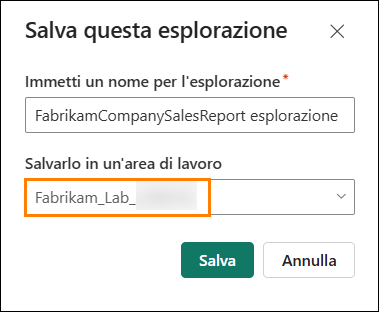

5. Nello screenshot seguente è possibile vedere un **esempio** di come un'esplorazione apparirà nell'area di lavoro dopo essere stata salvata:

    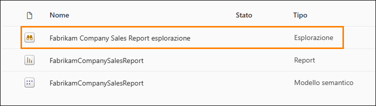

6. È anche possibile condividere l'esplorazione con altri utenti; la condivisione è disponibile solo dopo aver salvato l'esplorazione in un'area di lavoro.

7. Tornare all'area di lavoro, trovare l'esplorazione e fare clic sull'icona Condividi. Verrà ora visualizzato un popup per **Salva** questa esplorazione, scegliere l'area di lavoro creata durante la configurazione e premere Salva. Nota. **Le esplorazioni non verranno condivise in questo workshop; chiudere questa casella e procedere al passaggio successivo.**

    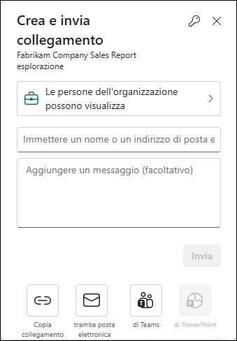

8. Dedicare un po' di tempo ad aprire l'esplorazione e a provare altre funzionalità.

    - Modificare il tipo di oggetto visivo

    - Modificare le colonne e le misure visualizzate

9. Una volta terminata l'esplorazione, fare clic sulla **X** nell'angolo in alto a destra per chiudere l'esplorazione.

    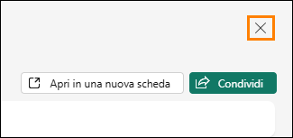

## Attività 5: risposte verificate

In precedenza, durante la lezione, è stato dedicato del tempo alla preparazione del modello di dati per l'IA. Parte della preparazione dei dati per l'IA consiste nella creazione di risposte verificate. Le risposte verificate garantiscono che determinate visualizzazioni vengano restituite quando vengono poste domande in Copilot. Questo consente di offrire agli utenti finali un'esperienza più curata e coerente, garantendo al tempo stesso accuratezza, coerenza e affidabilità tra i report.

1. Nella sessione successiva si apprenderà anche come migliorare ulteriormente l'esperienza di prompt aggiungendo elementi per ottenere informazioni dettagliate più approfondite. Associando esplicitamente un elemento, Copilot può restringere l'ambito del lavoro fornendo risultati molto più chiari e concisi. Attualmente è possibile allegare tre elementi al prompt, con un quarto in arrivo a breve:

    - Report

    - Modelli semantici

    - Agenti dei dati

    - Apps (disponibile a breve)

2. Fare clic su **+Aggiungi contenuto cui Copilot può fare riferimento**, disponibile nell'angolo in basso a sinistra della richiesta.

    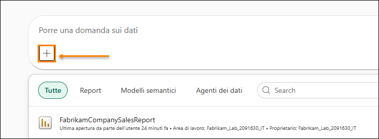

3. Selezionare **Report** dalle opzioni elencate. Quindi selezionare **Fabrikam Company Sales Report**. Fare clic su **Conferma**.

    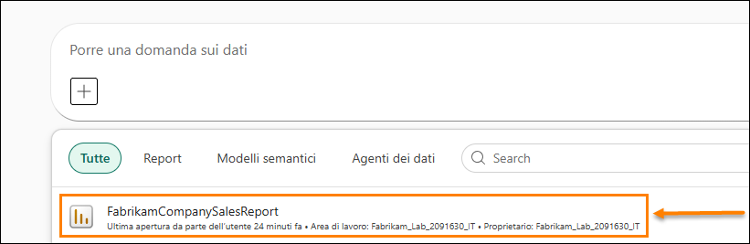

4. Questo report ora viene visualizzato come collegato nel prompt di Copilot. Quindi, completare il prompt digitando **What is our best selling product?**

    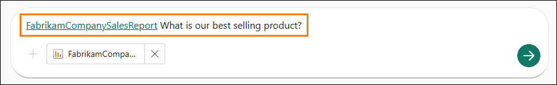

5. Da questo prompt si dovrebbe ottenere il seguente risultato. Se nella risposta viene utilizzata una risposta verificata, sopra la risposta verrà visualizzata una notifica. *Vedere lo screenshot seguente*.

6. Verrà anche fornita un'opzione per visualizzare il report ed esplorare i dati.

    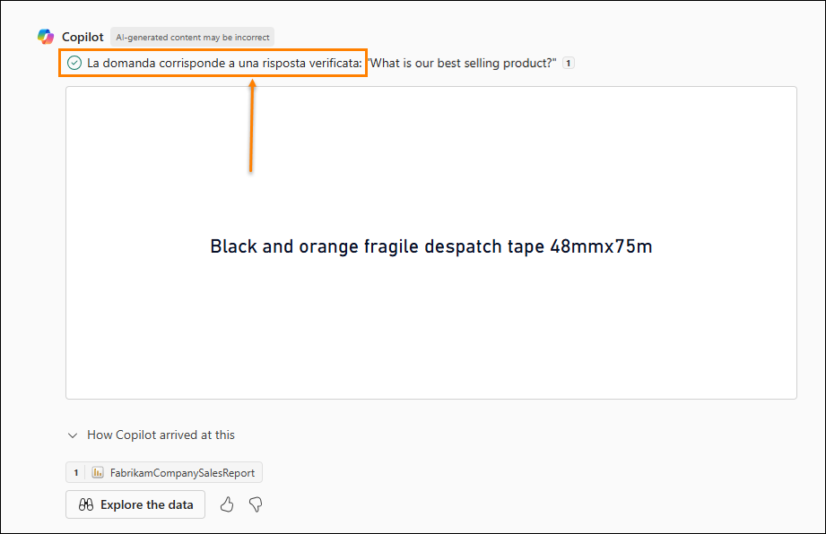

## Attività 6: come Copilot è arrivato a questo risultato (HCAAT)

A volte Copilot non si limita a fornire una risposta, ma spiega anche come è arrivato a tale risultato. Questo offre uno sguardo dietro le quinte alla logica, ai filtri, alle misure e ad altri elementi che hanno contribuito a definire la risposta. Più nello specifico, questa funzionalità è nota come HCAAT (How Copilot arrived at this - Come Copilot è arrivato a questo risultato). Queste informazioni dettagliate non sono solo utili: consentono di convalidare i risultati, rafforzare la fiducia nell'output e approfondire la comprensione del modello sottostante. Quando ciò avviene, può risultare molto utile e offrire un modo per convalidare i risultati.

1. Sotto la risposta verificata, fare clic su **How Copilot arrived at this**.

2. Verranno visualizzati la domanda posta, i dati utilizzati per fornire la risposta ed eventuali filtri applicati.

    

3. HCAAT può restituire risultati diversi in base a come è arrivato a ottenere i risultati. Verrà ora esaminato un altro esempio.

4. Nel prompt di Copilot, allegare **Fabrikam Company Sales Report** e digitare quanto segue: **return all customers that make up the top 1% of total sales.**

    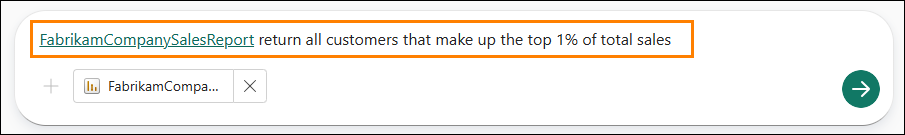

5. Esaminare i risultati.

    - (1) Per prima cosa viene visualizzata una risposta che indica che l'analisi richiesta è stata più approfondita del solito. Questo è un risultato DAX generato da Copilot. Assicurarsi di controllare il codice. Potrebbe anche indicare che i dati non sono completamente approvati poiché sono generati da DAX.

        

    - (2) La tabella che visualizza i risultati. I risultati appaiono ottimi. Notare che, anche se è stato richiesto Customers, viene restituito Resellers. Ciò avviene perché, durante la preparazione dei dati per l'IA, la tabella Customer è stata rimossa ed è stato utilizzato un sinonimo per Reseller.

    - (3) Come Copilot è arrivato a questo risultato

    - (4) Il report sulle vendite di Fabrikam

    - (5) La query DAX generata da Copilot per arrivare ai risultati

        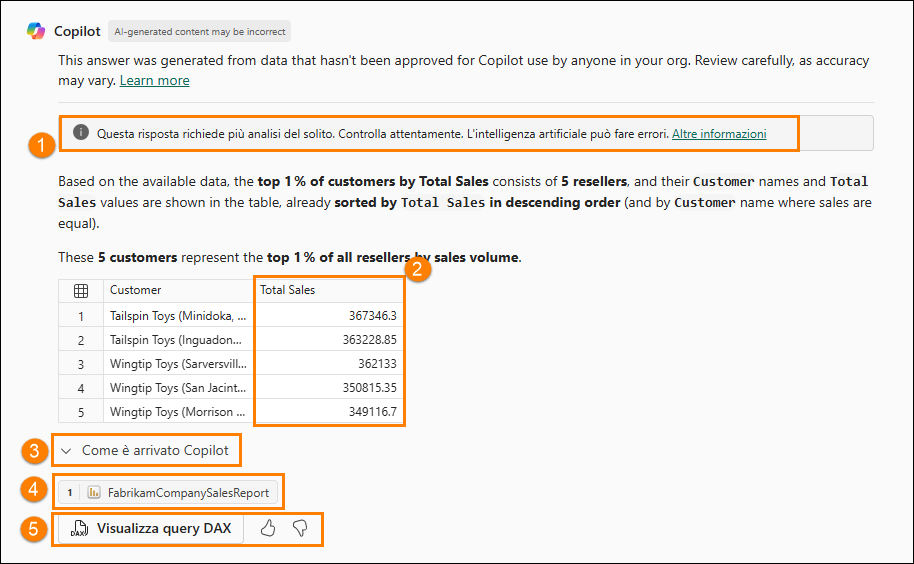

6. Per prima cosa, esplorare HCAAT. Fare clic su **How Copilot arrived at this** per espandere la descrizione.

7. Questa volta il risultato ottenuto è molto diverso rispetto al passato. Verrà fornita una descrizione narrativa che spiega come Copilot è arrivato a questa risposta.

    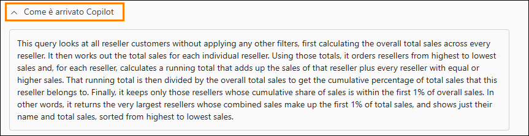

    In questa sezione si è appreso che Copilot a volte condivide il modo in cui è arrivato a una risposta specifica. Il modo in cui Copilot condivide o visualizza queste informazioni può variare in base al processo usato da Copilot per restituire la risposta.

## Attività 7: una risposta sui dati da una query DAX generata da Copilot

Nell'esempio precedente, Copilot ha generato una query DAX esaminando i dati sottostanti nel modello semantico. Inoltre, Copilot ha indicato di verificare i risultati per assicurarsi che siano accurati. È ora di approfondire ulteriormente la risposta.

1. Se si osservano i risultati nello screenshot precedente, è possibile vedere che le vendite totali vengono ripetute per ogni cliente (ricordare che è stato creato un sinonimo che associa Resellername a Customers). In genere ciò indica che non esiste una relazione valida tra le tabelle che fanno parte della risposta che si sta ricevendo.

2. Fare clic su **Visualizza query DAX**.

    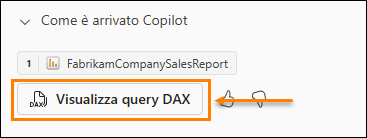

3. Verrà visualizzata una finestra di dialogo popup che mostra la query DAX generata insieme a commenti inline sul modo in cui la soluzione è arrivata a questa risposta. Nella parte inferiore è riportata la descrizione di come Copilot è arrivato a questo risultato. Infine, nella parte inferiore del popup sono disponibili due opzioni che è possibile eseguire.

    - Esegui query: consente di utilizzare il DAX corrente e aprirlo nella vista Query DAX

    - Copia query: questa opzione copierà il DAX negli Appunti

        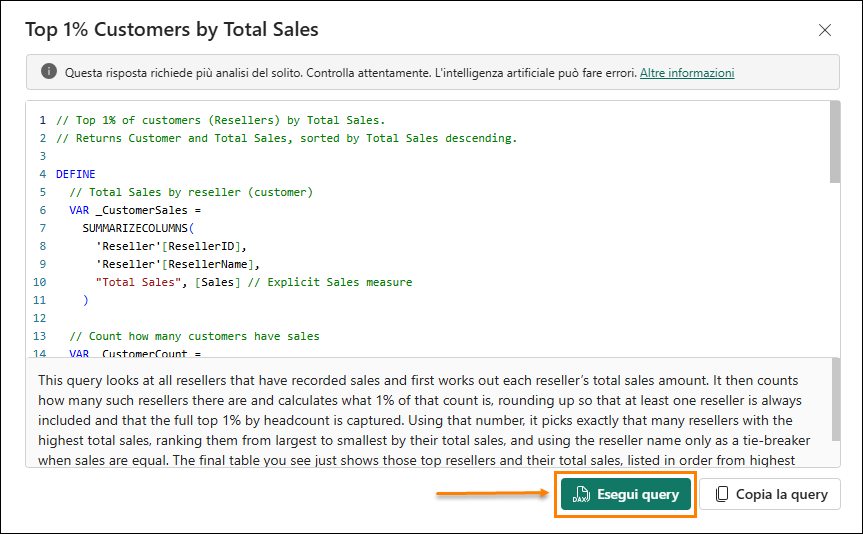

4. Fare clic su **Esegui query**. Tenere presente che è possibile ottenere più output di visualizzazione diversi da Copilot.

    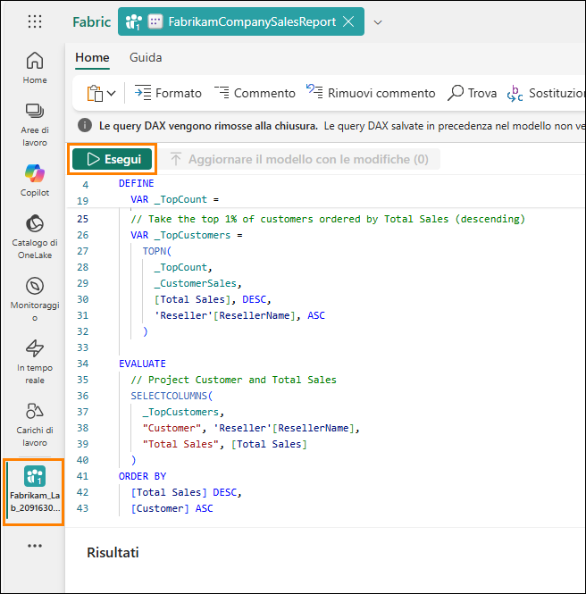

5. Fare clic su **Esegui** per visualizzare i risultati qui nella vista della query DAX. I risultati qui visualizzati sono gli stessi risultati ottenuti da Copilot. Se si ha familiarità con il linguaggio DAX, è possibile modificare l'espressione DAX per perfezionare ulteriormente i risultati.

    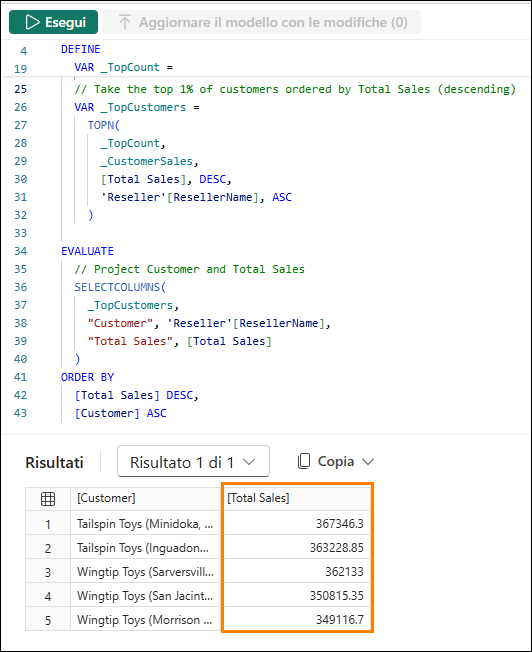

6. Questa sembra essere un'ottima risposta da parte di Copilot e tutto il lavoro di preparazione ha dato i suoi frutti. Se si riapre Power BI Desktop e si crea rapidamente un oggetto visivo, è possibile verificare velocemente che la risposta fornita da Copilot sia corretta.

    

7. Un altro aspetto da evidenziare è che è disponibile anche l'accesso alla visualizzazione modello. Da qui è possibile convalidare le tabelle e le relazioni nel modello semantico.

    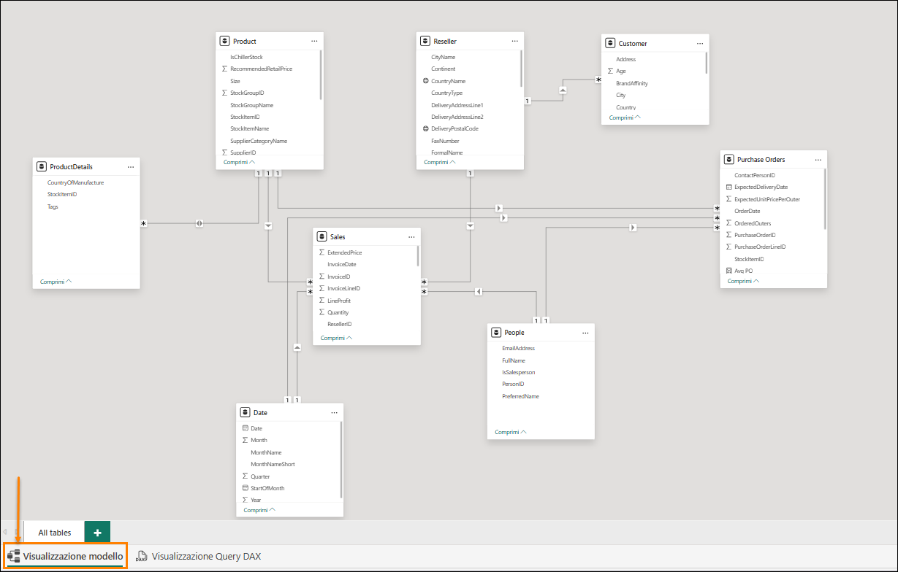

    In questo lab si è appreso che è possibile visualizzare il DAX generato da Copilot, avviare la vista Query DAX, modificare il codice esistente e persino accedere alla visualizzazione del modello per verificare le relazioni.

    **ℹ️ Importante**

    L'esperienza Chat with your Data rappresenta uno strumento estremamente utile che può migliorare in modo significativo i tempi necessari per ottenere informazioni dettagliate per le organizzazioni in tutto il mondo. Tuttavia, questi risultati possono anche essere errati o fuorvianti. È molto importante fermarsi e convalidare i risultati, come illustrato in questo lab.

## Attività 8: cambio di contesto in Copilot

Finora in questo workshop l'attenzione si è concentrata esclusivamente sui dati delle vendite della società Fabrikam. Tuttavia, l'organizzazione ha molti report diversi in molte aree di lavoro e l'esperienza Copilot standalone farà riferimento a tutti i report a cui ha accesso.

1. Accedere ai file della lezione e aprire **State of Nevada COVID-19 Dashboard.**

    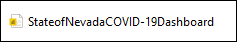

2. Pubblicare questo report completo sul proprio **Fabrikam_lab_0000000.**

    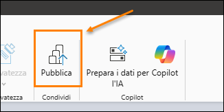

    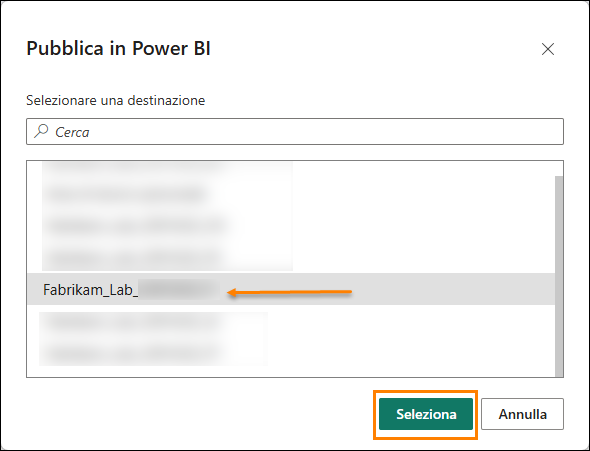

3. Ora è possibile eseguire query su questo modello semantico e report nell'esperienza Copilot standalone. Nel prompt di Copilot, digitare quanto segue: **How many confirmed cases have there been?** Assicurarsi di utilizzare **il pulsante (1), il modello semantico (2),** e **StateofNevadaCOVID-19Dashboard (3)** se non è immediatamente incluso. È stato fornito volutamente un prompt molto generico e Copilot è riuscito a comprendere l'intento in base ai contenuti del report. Ricordare che, sotto il report fornito, Copilot indica i criteri utilizzati per trovare le corrispondenze.

    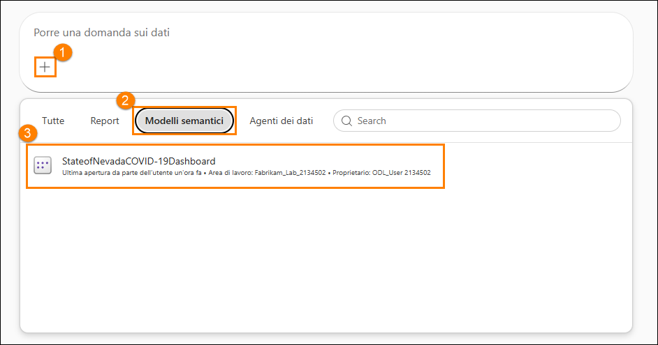

4. Perfetto! Copilot ora risponde alle domande restituendo un oggetto visivo dal report sottostante. Tenere presente che è possibile ottenere più output di visualizzazione diversi da copilota.

    OR

    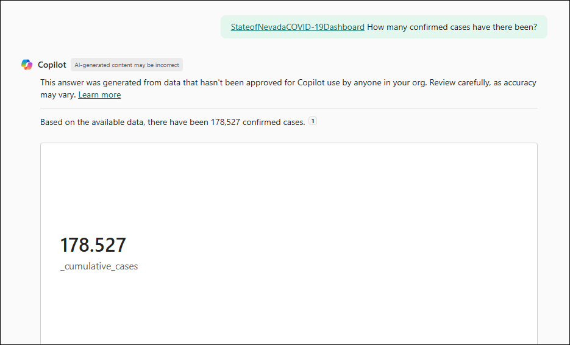

    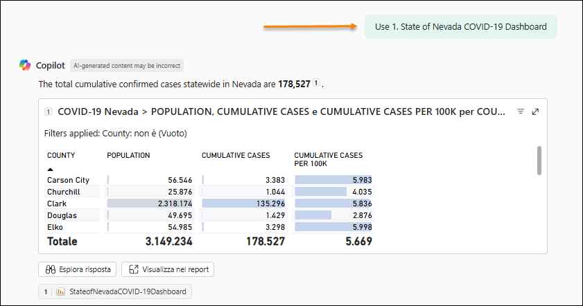

5. Porre un'altra domanda sui dati, nel prompt digitare: **How many deaths were there in Carson City in 2019?**

    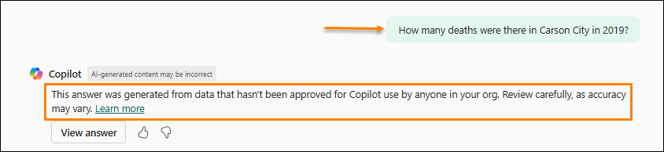

6. Questa volta Copilot non ha trovato un oggetto visivo esistente da restituire e, di conseguenza, ha generato una risposta dai dati sottostanti del report. Quando ciò accade, in un modello non contrassegnato come preparato per l'IA, viene restituita una **risposta di attrito**.

    **ℹ️ Importante**

    Una risposta di attrito è un avviso o una limitazione generata dal sistema che viene visualizzata quando Copilot incontra un modello di dati non preparato o descritto in modo insufficiente. In sostanza, Copilot indica che può provare a fornire supporto con le informazioni disponibili; tuttavia, i risultati devono essere convalidati.

    Per ridurre le risposte di attrito da parte di Copilot, assicurarsi di preparare i modelli semantici per l'IA e quindi contrassegnarli come preparati per l'IA dopo la pubblicazione. Consultare il documento delle linee guida sulle impostazioni del tenant fornito nei file dei lab.

## Attività 9: creazione di un oggetto visivo da parte di Copilot a partire dal modello semantico

Nei lab precedenti, è stato osservato che Copilot restituiva visualizzazioni per rispondere a domande specifiche. Queste visualizzazioni erano oggetti visivi già esistenti nei report. In questa sezione verrà mostrato come Copilot possa anche creare oggetti visivi a partire dal modello semantico per rispondere alle richieste.

1. Se Copilot non è già aperto, tornare a Copilot in Fabric.

2. Nel prompt, allegare **Fabrikam Company Sales Report** e digitare quanto segue: **Show me units sold over time**.

    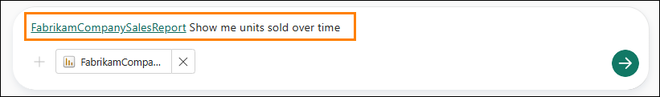

3. La visualizzazione restituita non è un oggetto visivo precedentemente esistente nel report. Questa è una visualizzazione creata da Copilot in base al modello semantico. Infatti, a differenza degli oggetti visivi che provengono direttamente da un report, questa risposta generata da Copilot viene fornita con una spiegazione HCAAT, *Come Copilot è arrivato a questo risultato*.

    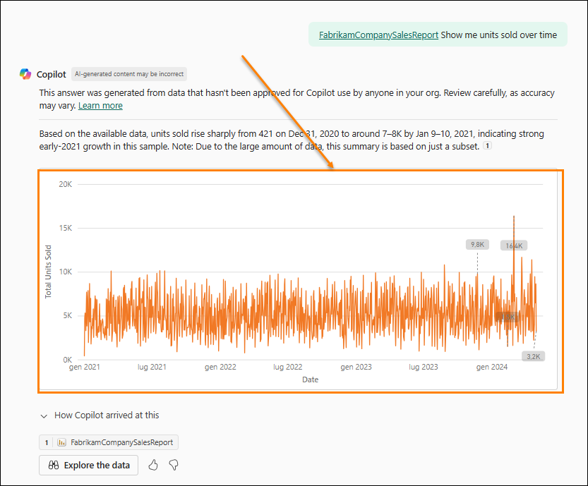

4. Per esaminare i risultati, fare clic su **Come Copilot è arrivato a questo risultato**.

    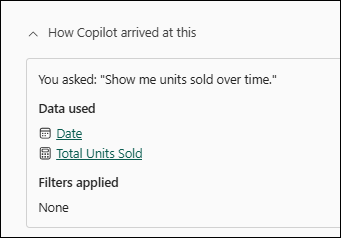

## Attività 10: esperienza Copilot generale

In questo lab, si è appreso come sfruttare l'esperienza Copilot standalone in Microsoft Fabric per esplorare i report e i modelli semantici esistenti. Tuttavia, è possibile anche sfruttare l'esperienza Copilot generale. In questo lab, Copilot verrà utilizzato per creare un messaggio e-mail basato sui risultati ottenuti.

1. Nel prompt di Copilot, digitare **Take the conversation so far and turn it into an email to share with the team**.

    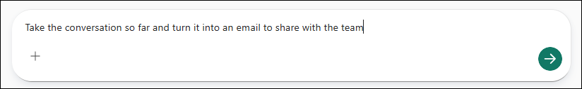

2. I risultati sono davvero interessanti. Promemoria: la risposta potrebbe apparire molto diversa rispetto allo screenshot. È inoltre importante ricordare che la risposta si basa sulla chat attualmente aperta con Copilot; se la chat è stata cancellata o la cronologia delle conversazioni è molto limitata, ciò influirà sui risultati finali.

    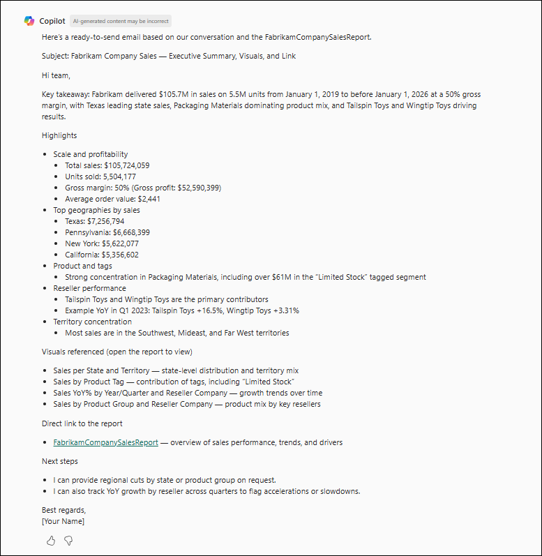

3. Questo è un buon risultato, ma sarebbe ancora migliore includere alcune visualizzazioni e collegamenti nel messaggio e-mail. Nel prompt di Copilot, chiedi **Add visuals and links to the email.**

    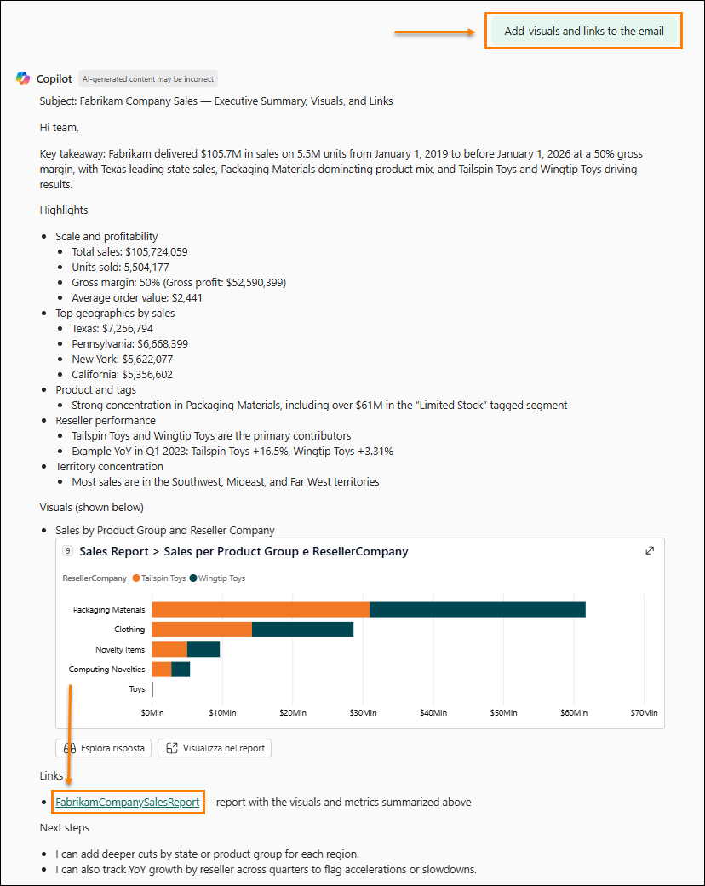

# Riferimenti

Chat With Your Data in a Day (CDIAD) presenta alcune delle funzionalità chiave dell'uso di Copilot standalone in un'area di lavoro Fabric.

Nel menu di servizio, la sezione Guida (?) include collegamenti ad alcune risorse utili. Tenere presente che la visualizzazione dipende dall'esperienza attualmente in uso e, pertanto, le opzioni potrebbero risultare diverse rispetto alla schermata mostrata di seguito.

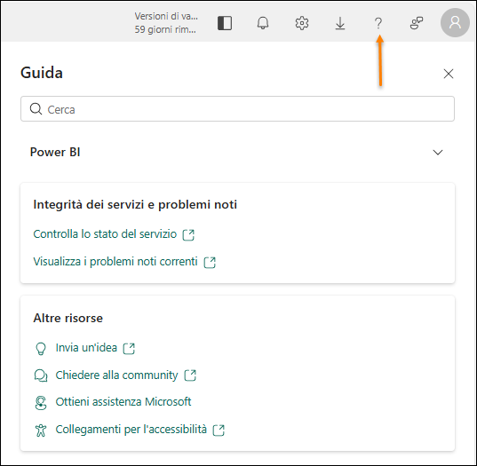

Di seguito sono indicate altre risorse utili a progredire nell'uso di Microsoft Fabric.

- Accedere a tutte le informazioni nella [documentazione di Microsoft Fabric](https://learn.microsoft.com/en-us/fabric/)

- Esplorare Fabric tramite la [presentazione guidata](https://aka.ms/Fabric-GuidedTour)

- Iscriversi alla [versione di valutazione gratuita di Microsoft Fabric](https://aka.ms/try-fabric)

- Visitare il [sito Web di Microsoft Fabric](https://aka.ms/microsoft-fabric)

- Acquisire nuove competenze esplorando i [moduli di apprendimento di Fabric](https://aka.ms/learn-fabric)

- Leggere [l'e-book gratuito introduttivo a Fabric](https://aka.ms/fabric-get-started-ebook)

- Unirsi alla [community di Fabric](https://aka.ms/fabric-community) per pubblicare domande, condividere feedback e imparare dagli altri

Leggere la documentazione tecnica più approfondita relativa a Copilot:

- [Panoramica di Copilot per Power BI - Power BI | Microsoft Learn](https://learn.microsoft.com/en-us/power-bi/create-reports/copilot-introduction)

- [Esperienza Copilot standalone in Power BI (anteprima) – Power BI | Microsoft Learn](https://learn.microsoft.com/en-us/power-bi/create-reports/copilot-chat-with-data-standalone)

- [Impostazioni dell'amministratore di Microsoft Fabric Copilot | Microsoft Learn](https://learn.microsoft.com/en-us/fabric/admin/service-admin-portal-copilot)

- [Creazione dell'agente dei dati di Fabric (anteprima) - Informazioni su come creare un agente dei dati di Fabric | Microsoft Learn](https://learn.microsoft.com/en-us/fabric/data-science/concept-data-agent)

- [Procedure consigliate per la configurazione dell'agente dei dati - Microsoft Fabric | Microsoft Learn](https://learn.microsoft.com/en-us/fabric/data-science/data-agent-configuration-best-practices)

- [Copilot per Microsoft Fabric e Power BI: domande frequenti - Microsoft Fabric | MicrosoftLearn](https://learn.microsoft.com/en-us/fabric/fundamentals/copilot-faq-fabric)

© 2026 Microsoft Corporation. Tutti i diritti sono riservati.

L'uso della demo/del lab implica l'accettazione delle seguenti condizioni:

La tecnologia/le funzionalità descritte nella demo/nel lab sono fornite da Microsoft Corporation allo scopo di ottenere feedback dall'utente e offrire un'esperienza di apprendimento. L'utilizzo della demo/del lab è consentito solo per la valutazione delle caratteristiche e delle funzionalità di tale tecnologia e per l'invio di feedback a Microsoft. L'utilizzo per qualsiasi altro scopo non è consentito. È vietato modificare, copiare, distribuire, trasmettere, visualizzare, eseguire, riprodurre, pubblicare, concedere in licenza, usare per la creazione di lavori derivati, trasferire o vendere questa demo/questo lab o parte di essi.

SONO ESPLICITAMENTE PROIBITE LA COPIA E LA RIPRODUZIONE DELLA DEMO/DEL LAB (O DI QUALSIASI PARTE DI ESSI) IN QUALSIASI ALTRO SERVER O IN QUALSIASI ALTRA POSIZIONE PER ULTERIORE RIPRODUZIONE O RIDISTRIBUZIONE.

QUESTA DEMO/QUESTO LAB RENDONO DISPONIBILI TECNOLOGIE SOFTWARE/FUNZIONALITÀ DI PRODOTTO SPECIFICHE, INCLUSI NUOVI CONCETTI E NUOVE FUNZIONALITÀ POTENZIALI, IN UN AMBIENTE SIMULATO, CON UN'INSTALLAZIONE E UNA CONFIGURAZIONE PRIVE DI COMPLESSITÀ, PER GLI SCOPI DESCRITTI IN PRECEDENZA. LA TECNOLOGIA/I CONCETTI RAPPRESENTATI IN QUESTA DEMO/IN QUESTO LAB POTREBBERO NON CONTENERE LE FUNZIONALITÀ COMPLETE E IL LORO FUNZIONAMENTO POTREBBE NON ESSERE LO STESSO DELLA VERSIONE FINALE. È ANCHE POSSIBILE CHE UNA VERSIONE FINALE DI TALI FUNZIONALITÀ O CONCETTI NON VENGA RILASCIATA. L'ESPERIENZA D'USO DI TALI CARATTERISTICHE E FUNZIONALITÀ PUÒ RISULTARE DIVERSA IN UN AMBIENTE FISICO.

**FEEDBACK.** L'invio a Microsoft di feedback sulle caratteristiche, sulle funzionalità e/o sui concetti della tecnologia descritti in questa demo/questo lab implica la concessione a Microsoft, a titolo gratuito, del diritto di usare, condividere e commercializzare tale feedback in qualsiasi modo e per qualsiasi scopo. Implica anche la concessione a titolo gratuito a terze parti del diritto di utilizzo di eventuali brevetti necessari per i loro prodotti, le loro tecnologie e i loro servizi al fine di utilizzare o interfacciarsi ai componenti software o ai servizi Microsoft specifici che includono il feedback. L'utente si impegna a non inviare feedback la cui inclusione all'interno di software o documentazione Microsoft imponga a Microsoft di concedere in licenza a terze parti tale software o documentazione. Questi diritti sussisteranno anche dopo la scadenza del presente contratto.

CON LA PRESENTE MICROSOFT CORPORATION NON RICONOSCE ALCUNA GARANZIA E CONDIZIONE RELATIVAMENTE ALLA DEMO/AL LAB, INCLUSE TUTTE LE GARANZIE E CONDIZIONI DI COMMERCIABILITÀ, DI FATTO ESPRESSE, IMPLICITE O PRESCRITTE DALLA LEGGE, ADEGUATEZZA PER UNO SCOPO SPECIFICO, TITOLARITÀ E NON VIOLABILITÀ. MICROSOFT NON OFFRE GARANZIE O RAPPRESENTAZIONI IN RELAZIONE ALL'ACCURATEZZA DEI RISULTATI E DELL'OUTPUT DERIVANTI DALL'USO DELLA DEMO/DEL LAB O ALL'ADEGUATEZZA DELLE INFORMAZIONI CONTENUTE NELLA DEMO/NEL LAB PER QUALSIASI SCOPO.

**CLAUSOLA DI RESPONSABILITÀ**

Questa demo/questo lab contiene solo una parte delle nuove funzionalità e dei miglioramenti in Microsoft Power BI. Alcune funzionalità potrebbero cambiare nelle versioni future del prodotto. In questa demo/in questo lab si apprendono alcune delle nuove funzionalità, ma non tutte.
