# Microsoft Fabric Chat with your Data in a Day - Lab 5

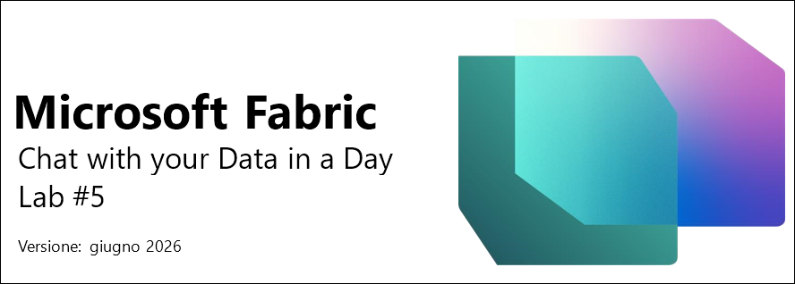

## Sommario

- Struttura del documento
- Scenario/Esposizione del problema
- Introduzione
- Implementazione degli agenti dei dati Fabric
- Prerequisiti
    - Attività 1: creazione dell'agente dei dati
    - Attività 2: aggiunta di origini dati
    - Attività 3: domande all'agente dei dati
    - Attività 4: aggiungere istruzioni IA
- In evidenza: sostituzione di un'origine dati
    - Attività 5: aggiunta di altre origini dati
- In evidenza: istruzioni dell'origine dati
    - Attività 6: creazione di domande di esempio
    - Attività 7: pubblicazione e condivisione dell'agente dei dati
    - Attività 8: utilizzo di un agente dei dati da Copilot
- Riferimenti

# Struttura del documento

Il lab include i passaggi che l'utente deve seguire con gli screenshot associati che forniscono un aiuto visivo. In ogni screenshot vi sono sezioni evidenziate con riquadri arancioni che indicano le aree su cui l'utente deve concentrarsi.

# Scenario/Esposizione del problema

L'esperienza Copilot standalone ha riscosso grande successo, offrendo a tutta l'organizzazione un accesso più rapido alle informazioni dettagliate e favorendo una maggiore adozione complessiva.

Tuttavia, l'esperienza di Copilot non è altamente personalizzabile e ora gli utenti finali desiderano esperienze più curate in cui possono concentrare le loro domande su aree molto specifiche dell'azienda, senza dover interpretare report e modelli semantici non pertinenti. Si è stati incaricati di creare un agente dei dati connesso esclusivamente ai dati relativi al report Fabrikam Company Sales. È inoltre necessario aggiungere all'agente dei dati alcuni dati aggiuntivi non disponibili nell'esperienza Copilot standalone, così da poter rispondere a domande più specifiche che il team intende porre in merito al lead time dei prodotti.

# Introduzione

È stata illustrata l'esperienza Copilot standalone, particolarmente efficace per esplorare tutti i dati presenti nelle diverse aree di lavoro. Tuttavia, l'uso degli agenti dei dati può fornire un'esperienza più curata per chattare con dati specifici. Gli agenti dei dati possono connettersi a origini dati specifiche o anche a tabelle specifiche all'interno delle origini dati. Mentre Copilot è un assistente IA integrato in Fabric che favorisce la produttività e l'intelligenza, gli agenti dei dati abilitano la connettività dei dati.

In questo lab viene spiegato come:

- Creare un agente dei dati

- Aggiungere origini dati all'agente

- Porre domande sull'agente

- Aggiungere istruzioni IA utilizzabili dall'agente

- Sostituire un'origine dati

- Aggiungere altre origini dati

- Creare domande di esempio

- Pubblicare e condividere l'agente

- Utilizzare l'agente dei dati di Copilot standalone

# Implementazione degli agenti dei dati Fabric

Questa sezione contiene informazioni su come creare un agente dei dati. L'agente può recuperare i dati generando query strutturate (SQL, DAX, KQL) per rispondere a domande che includono fatti, totali, classifiche o filtri. Al momento della stesura di questo contenuto, gli agenti dei dati Fabric sono attualmente una funzionalità di anteprima in Microsoft Fabric e non sono consigliati per carichi di lavoro di produzione. Altre informazioni sul funzionamento dell'agente dei dati di Fabric sono disponibili qui:

[Creazione dell'agente dei dati di Fabric (anteprima) - Informazioni su come creare un agente dei dati di Fabric | Microsoft Learn](https://learn.microsoft.com/en-us/fabric/data-science/concept-data-agent)

Gli agenti dei dati Microsoft Fabric consentono agli utenti di interagire con i dati aziendali in lingua inglese, eliminando la necessità di SQL, DAX o KQL. Offrono un'interfaccia di chat con strumenti di debug e consentono la connessione a origini dati come modelli semantici di Power BI, database KQL, lakehouse e warehouse. Gli agenti dei dati sono accessibili all'interno e all'esterno di Microsoft Fabric, possono essere integrati in Microsoft Teams, Copilot Studio, Fonderia Azure AI e nelle app personalizzate. Gli agenti dei dati sono individuabili anche dall'esperienza Copilot standalone in Fabric.

## Prerequisiti

Per utilizzare gli agenti dei dati di Fabric, è necessario abilitare o configurare molte impostazioni del tenant. Vedere il **documento relativo alle linee guida sulle impostazioni del tenant** disponibile nei lab del corso:

- È necessario l'accesso come amministratore

- Abilitazione delle impostazioni di Copilot e Azure OpenAI

- Abilitazione della creazione e della condivisione degli agenti dei dati di Fabric

- Abilitazione degli endpoint XMLA per i modelli semantici Power BI

## Attività 1: creazione dell'agente dei dati

1. Aprire un Web browser nella macchina virtuale, accedere a https://fabric.microsoft.com e passare all'area di lavoro denominata **Fabrikam_Lab_<inject key="DeploymentID" enableCopy="false"></inject>_IT**.

    *(**Importante**: utilizzare l'area di lavoro creata in precedenza in questa lezione)*

    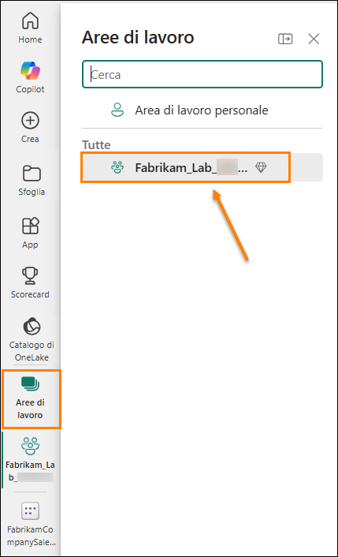

2. Fare clic su **Nuovo elemento**:

    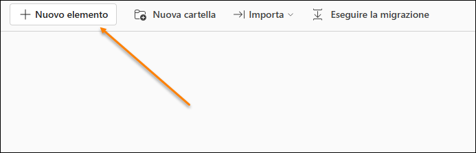

3. Nella barra di ricerca che si apre, digita **Agent** e seleziona **Agente dei dati (anteprima).**

    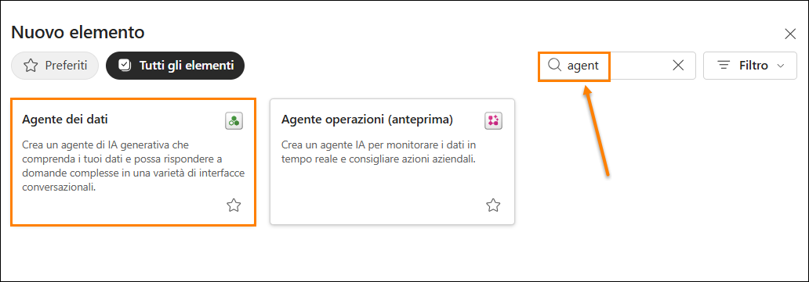

4. Assegnare un nome all'agente, **FabrikamSales_agent_<inject key="DeploymentID" enableCopy="false"/>**.

5. Ricordare che il codice utente è incluso nel nome utente, come mostrato di seguito:

    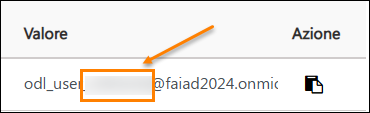

6. Fare clic su **Crea.**

    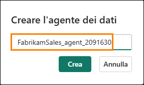

## Attività 2: aggiunta di origini dati

1. Dopo aver creato un agente dei dati, il passaggio successivo consiste nell'aggiungere le origini dati.

2. Dal riquadro Explorer, fare clic sul pulsante **+ Origine dati**. In alternativa, è possibile fare clic sul pulsante **Aggiungi un'origine** visualizzato al centro della schermata.

    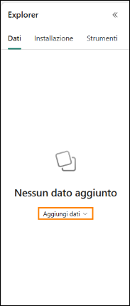

    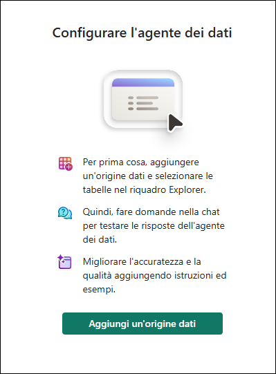

3. Scegliere il modello semantico **Fabrikam Company Sales Report** dall'elenco, quindi fare clic su **Aggiungi**.

    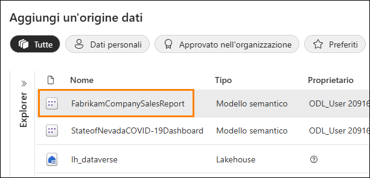

4. Notare che non è stata ancora selezionata alcuna tabella e che l'agente dei dati non può rispondere alle domande finché non viene selezionata almeno un'origine dati. Fare clic su **>** accanto a **Fabrikam Company Sales Report** nel riquadro **Explorer**. Selezionare le tabelle mostrate nello screenshot seguente.

    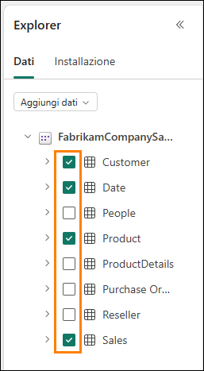

## Attività 3: domande all'agente dei dati

1. Ora che l'agente è connesso a un'origine dati, è possibile iniziare a scrivere alcuni prompt per l'agente dei dati.

2. Digitare il seguente comando: **Show me sales by country.**

    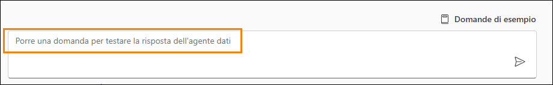

3. L'agente potrebbe impiegare alcuni secondi per fornire una risposta. Notare il risultato restituito dall'agente:

    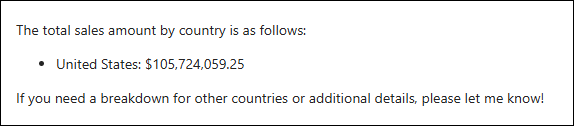

4. Selezionare il menu a discesa del passaggio completato per visualizzare le azioni eseguite dall'agente, quindi aprire il menu successivo per mostrare i dettagli.

    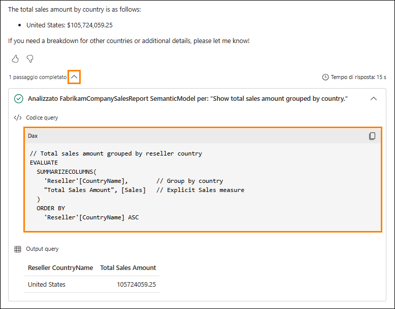

    **ℹ️ Importante**

    Quando si sviluppa un agente dei dati di Fabric, è importante dedicare del tempo alla convalida dei risultati per garantire accuratezza e coerenza. Ora che sono disponibili i risultati, è possibile tornare al modello semantico e convalidarli direttamente lì.

5. Accedere ai file della lezione scaricati e aprire il file **Fabrikam Company Sales Report.pbix**.

    

6. Fare clic nella parte inferiore del report per aprire una nuova pagina del report.

    

7. Nel passaggio successivo viene creato un oggetto visivo di base per convalidare i risultati restituiti dall'agente dei dati.

8. Aggiungere un oggetto visivo tabella in questa nuova pagina del report.

    

    

9. La tabella ottenuta deve avere un aspetto simile al seguente:

    

10. Si noti che l'importo totale delle vendite corrisponde all'output della query restituito dall'agente dei dati mostrato sopra. Questo conferma che la query dell’agente ha restituito l'output corretto.

## Attività 4: aggiungere istruzioni IA

È possibile aggiungere istruzioni IA all'agente dei dati di Fabric per migliorare l'accuratezza e la coerenza. Le istruzioni IA possono essere aggiunte in due posizioni separate all'interno dell'agente dei dati.

Per prima cosa, è possibile aggiungere istruzioni di IA direttamente all'agente; queste sono note come **istruzioni dell'agente** e aiutano l'agente a identificare quali origini dati utilizzare per determinate domande, quale tono adottare, a quali dati assegnare la priorità e altre preferenze comportamentali o contestuali che definiscono il modo in cui l'agente risponde agli utenti.

Il secondo tipo di istruzione IA sono le **istruzioni dell'origine dati**; con le istruzioni dell'origine dati è possibile aggiungere istruzioni per aiutare l'agente dei dati a comprendere i dati dell'origine dati e come usarli nel modo più efficace. Al momento le **istruzioni dell'origine dati** non sono supportate nei modelli semantici. Questa funzionalità verrà illustrata in un secondo momento.

1. Torniamo con le **istruzioni dell'agente** nell'interfaccia del browser di Fabric. Si desidera aggiungere un riepilogo a ogni risposta fornita dall'agente dei dati. Pertanto, è possibile indicare all'agente di includere un riepilogo conciso per ogni risposta fornita.

2. Selezionare le istruzioni IA nella scheda Home.

    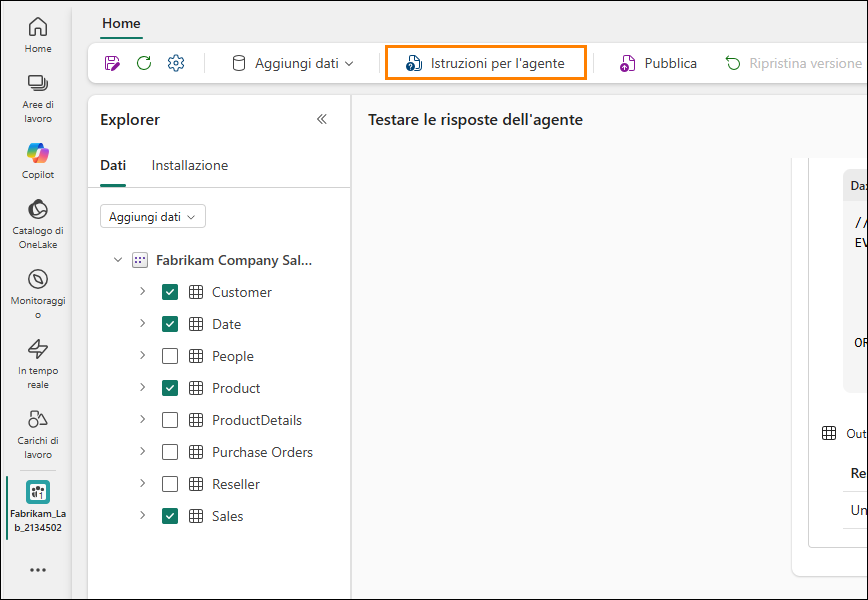

3. Nella casella **Istruzioni dell'agente** della finestra Istruzioni IA sopra o sotto le istruzioni generiche esistenti, digitare le seguenti indicazioni:

    **## Set Response Guidelines**

    **Always include a concise summary before the detailed breakdown.**

    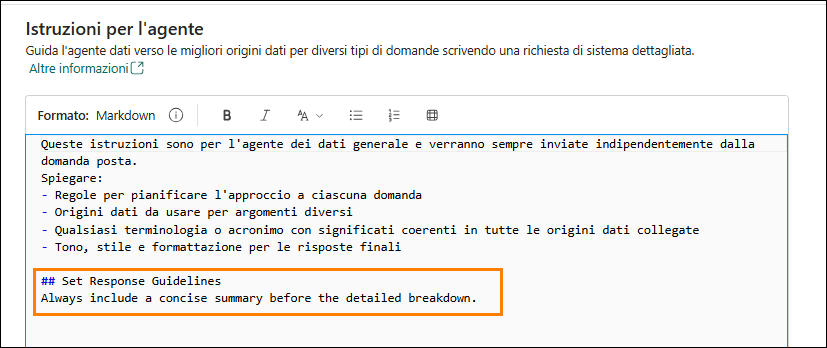

    **ℹ️ Importante**

    In alcuni casi, le istruzioni di IA potrebbero richiedere del tempo prima di essere applicate. Se non vengono ottenuti i risultati desiderati, selezionare il pulsante Cancella chat nella parte superiore della finestra dell'agente e riprovare.

4. Fare clic sulla X nell'angolo in alto a destra della scheda "Istruzioni agente" per chiudere le istruzioni IA e salvare le modifiche.

    **ℹ️ Importante**

    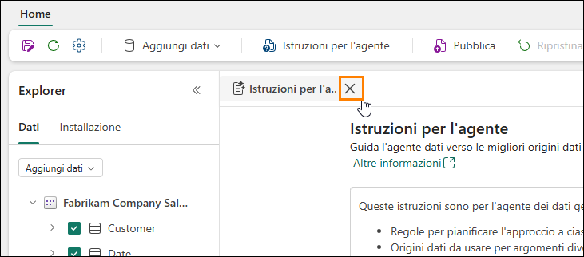
    
    In alcuni casi, le istruzioni di IA potrebbero richiedere del tempo prima di essere applicate. Se non vengono ottenuti i risultati desiderati, selezionare il pulsante Cancella chat nella parte superiore della finestra dell'agente e riprovare.

5. Fornire all'agente lo stesso prompt utilizzato in precedenza: **Show me sales by country** e premere INVIO.

    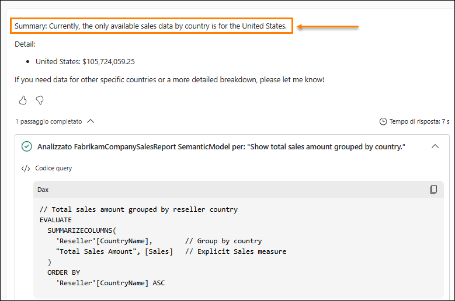

6. Aggiungere un'ulteriore istruzione IA per perfezionare ulteriormente la risposta dell'IA. In questo esempio, si aggiungerà un comando nel prompt per restituire sempre una tabella anziché un elenco puntato. Aprire le istruzioni IA e aggiungere la seguente riga di codice nelle istruzioni dell'agente:

    **Always return a table instead of bullet points**

    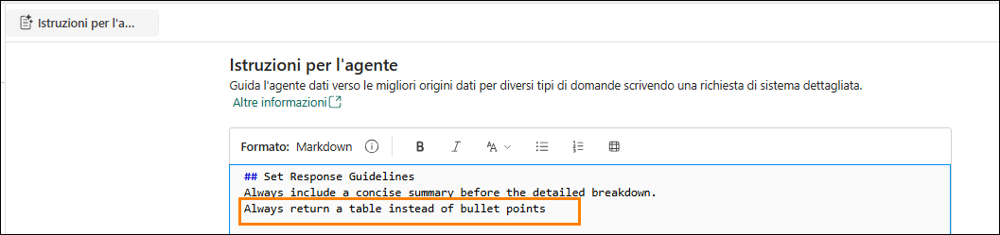

7. Chiudere la finestra delle istruzioni IA e digitare quanto segue nel prompt dell'agente dei dati: **Return sales by country**

    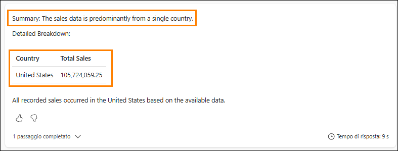

8. Ora i risultati vengono restituiti in formato tabellare con un riepilogo. Finora il risultato è ottimo. Aggiungere quindi ulteriori istruzioni.

9. Nel prompt dell'agente dei dati, digitare quanto segue: **Return sales by State**.

    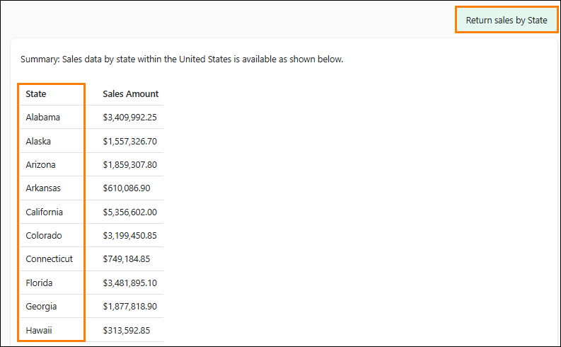

10. Questi risultati corrispondono esattamente a quanto previsto, ma potrebbero risultare eccessivi? Indicare quindi al prompt dell'IA di restituire sempre solo 5 righe di dati, salvo diversa indicazione.

11. Nelle **istruzioni IA** dell'agente dei dati digitare quanto segue:

    **Always provide the top 5 results unless a different number is specified**

    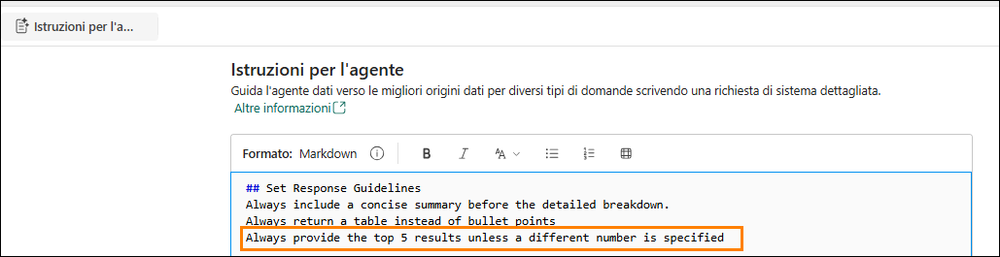

12. I risultati sono perfetti. Il riepilogo ora chiarisce che vengono restituiti i primi 5 stati per vendite. Copilot suggerisce ixnoltre di richiedere i dati di vendita per tutti gli stati, se necessario.

    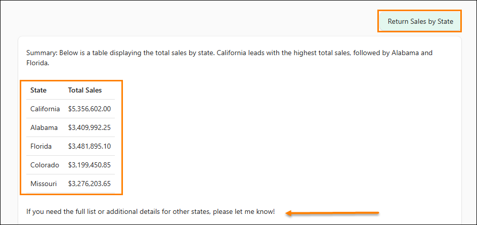

## In evidenza: sostituzione di un'origine dati

Quando si lavora con gli agenti dei dati, si potrebbe decidere di usare un'origine dati diversa. In questo esempio si usa il modello semantico Fabrikam Company Sales Report. Ma cosa succede se si desidera utilizzare un modello semantico diverso? Al momento non esiste un modo per sostituire semplicemente un'origine dati, tuttavia, è possibile rimuovere e aggiungere origini dati all'agente dei dati in qualsiasi momento.

1. Per rimuovere un'origine dati, aprire Explorer all'interno dell'agente dei dati e fare clic sui puntini di sospensione (...) a destra dell'origine dati. Nel menu a discesa sono disponibili tre opzioni. Le tre opzioni disponibili sono Apri, Aggiorna o Rimuovi.

    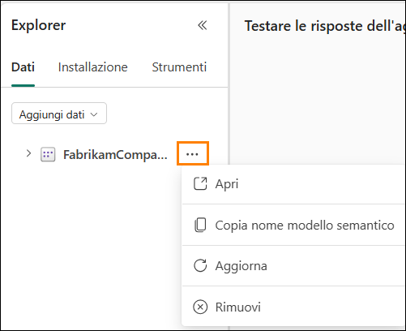

2. In questo lab **NON** viene sostituita l'origine dati.

## Attività 5: aggiunta di altre origini dati

L'agente dei dati è stato creato su un modello semantico ben definito e progettato con attenzione. Questo modello semantico è stato progettato per rispondere alla maggior parte, se non a tutte, le richieste degli utenti. Tuttavia, cosa succede se sono presenti informazioni di vendita a cui il modello semantico non è in grado di rispondere? È possibile contattare l'autore di quel modello semantico e richiedere l'aggiunta di ulteriori tabelle e informazioni, ma ciò potrebbe richiedere tempo oppure la richiesta potrebbe essere respinta.

Un utente desidera esaminare le vendite in base al lead time del prodotto. Il modello semantico Fabrikam Company Sales non include queste informazioni; tuttavia, tali dati sono presenti nell'origine dati originale archiviata nel lakehouse di Fabric.

In questo lab si aggiungerà un'ulteriore origine dati, in modo che le informazioni sul lead time del prodotto possano essere incluse nelle risposte dell'agente dei dati.

1. Iniziare creando un Lakehouse e aggiungendo alcuni dati di esempio. Tornare all'area di lavoro e selezionare ancora una volta **Nuovo elemento**:

    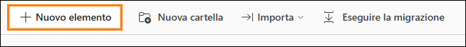

2. Scorrere verso il basso e selezionare **Lakehouse** dall'area Altri elementi che è possibile creare con Microsoft Fabric.

    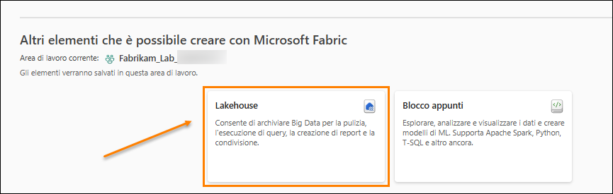

3. Assegnare un nome al nuovo Lakehouse: **lh_Fabrikam** quindi premere Crea.

    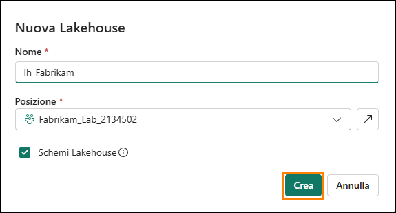

4. Nel lakehouse viene utilizzato un **collegamento** per connettersi a una versione dei dati Fabrikam già preparata. Aprire **Recupera dati** e selezionare **Nuovo collegamento**.

    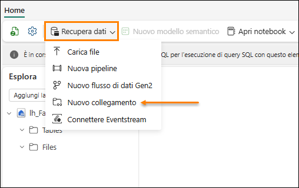

5. Selezionare **Azure Data Lake Storage Gen2**.

    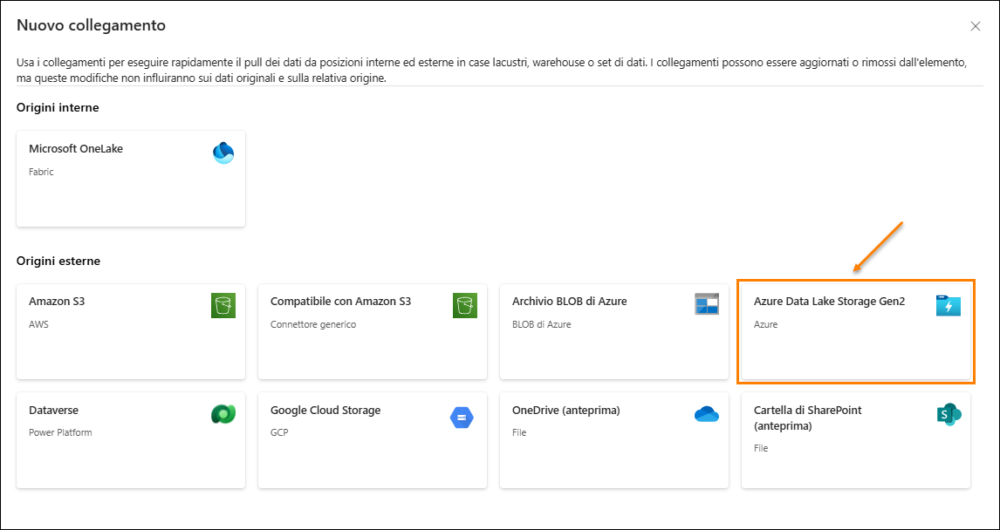

6. Selezionare **Nuova connessione** e immettere nell'URL Fabrikam:

    ***https://stvnextblobstorage.dfs.core.windows.net/fabrikam-sales***

    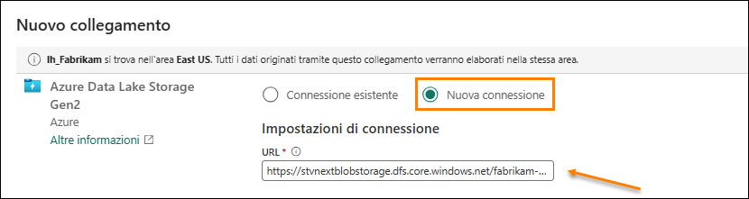

7. Specificare un nome di connessione, ad esempio **Connettore Fabrikam o simile**, quindi in Tipo di autenticazione fare clic sul menu a discesa e selezionare Firma di accesso condiviso (SAS).

    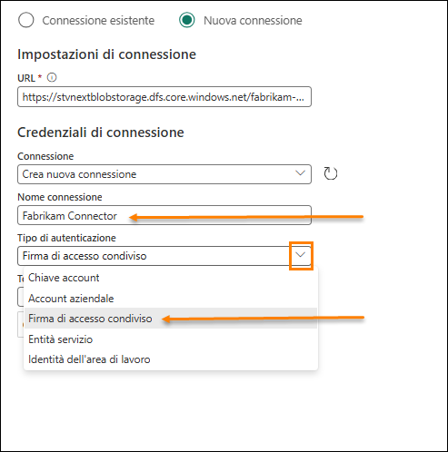

8. Copiare il token SAS dalla scheda Ambiente sul lato destro e incollarlo nell'area del **token di firma di accesso condiviso**.

    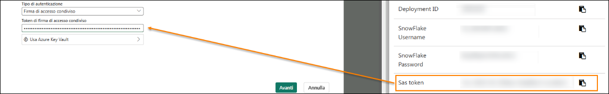

9. Selezionare **Avanti**.

    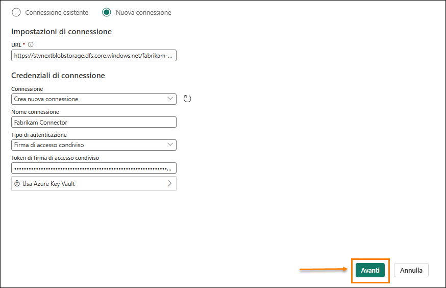

10. Aprire **Delta-Parquet-Format-FY25** e selezionare tutti gli elementi tranne **Sales.Invoices.May**, quindi selezionare **Avanti**.

    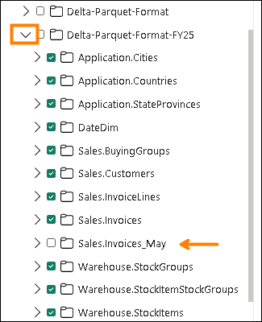

11. Modificare il **nome del collegamento** per ognuna delle nuove tabelle. Questo è importante per poter utilizzare facilmente il lakehouse come origine dati. Utilizzare il formato seguente:

    Application.Cities a **Cities**

    Application.Countries in **Countries**

    Application.StateProvinces in **StateProvinces**

    DateDim in **Date**

    Sales.BuyingGroups in **BuyingGroups**

    Sales.Customers in **Customers**

    Sales.InvoiceLines in **InvoiceLines**

    Sales.Invoices in **Invoices**

    Warehouse.StockGroups in **StockGroups**

    Warehouse.StockItemStockGroups in **StockItemStockGroups**

    Warehouse.StockItems in **StockItems**

    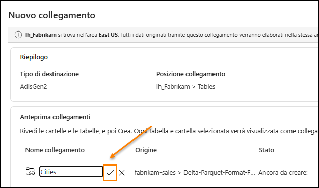

12. Selezionare **Crea** per aggiungere i dati tramite un collegamento al lakehouse.

    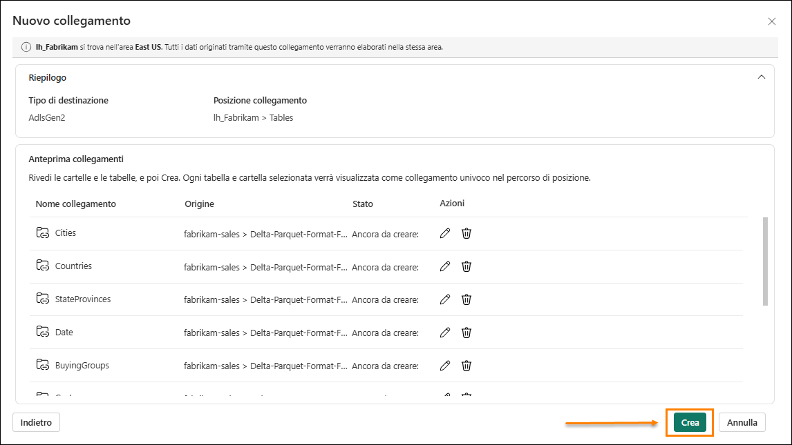

13. Al termine del caricamento, gli oggetti dovrebbero essere stati spostati nell'area Tabella.

    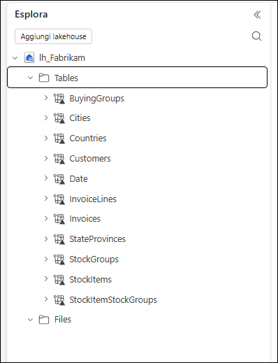

14. È possibile tornare all'**agente dei dati** dal lato sinistro o dalla vista dell'area di lavoro.

    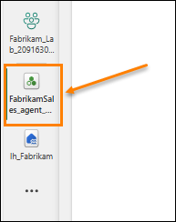

    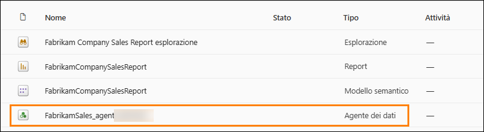

15. Dall'agente dati, fare clic sulla casella di riepilogo a discesa **Aggiungi dati** e seleziona **Origine dati** nel riquadro Explorer.

    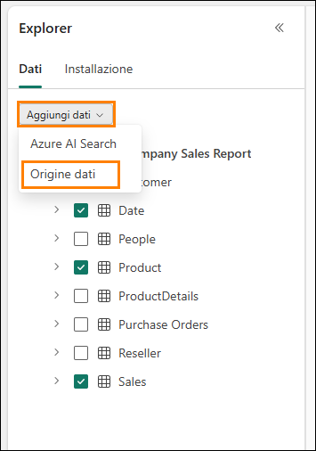

16. Selezionare **lh_Fabrikam**, quindi fare clic su **Aggiungi**.

    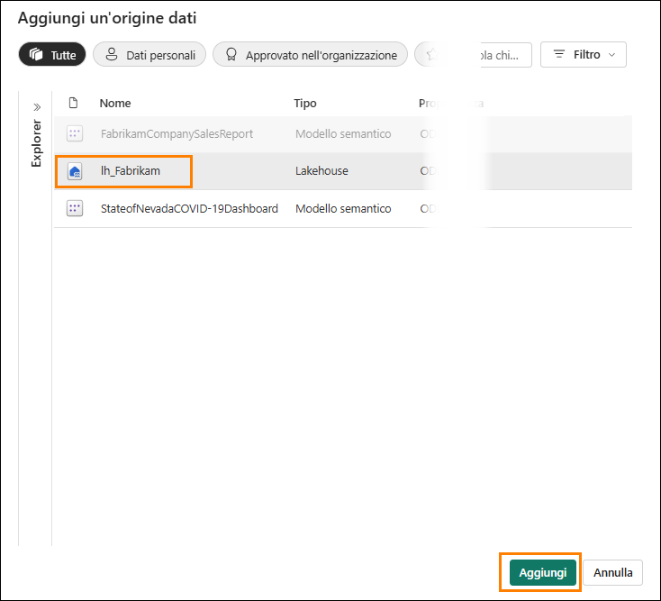

17. Nel riquadro **Explorer** sono ora presenti due origini dati.

    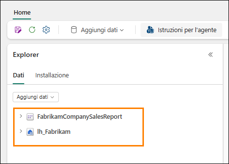

18. Aprire il lakehouse e aggiungere tutte le potenziali origini dati dal lh_Fabrikam. Potrebbero essere necessari alcuni minuti prima che tutti gli elementi del Lakehouse vengano visualizzati. Attendere il completamento del caricamento e aggiornare la pagina, se necessario.

    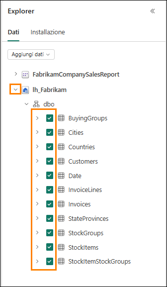

19. Tornare al prompt dell'agente dei dati e digitare quanto segue: **What are total sales by product lead time?**

    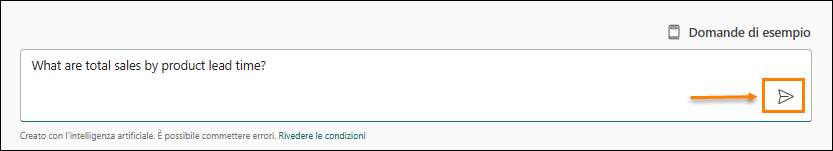

20. Gli agenti dei dati di Fabric hanno risposto perfettamente a questa richiesta e hanno ottenuto i risultati desiderati dal lakehouse. È sempre possibile deselezionare i dati dal Fabrikam Company Sales Report per forzare l'utilizzo del lakehouse da parte di Copilot. Tuttavia, a breve verranno utilizzate istruzioni per correggere meglio questo aspetto.

21. Espandere la sezione dei passaggi completati per rivedere l'SQL generato dagli agenti dei dati per arrivare a questo risultato.

    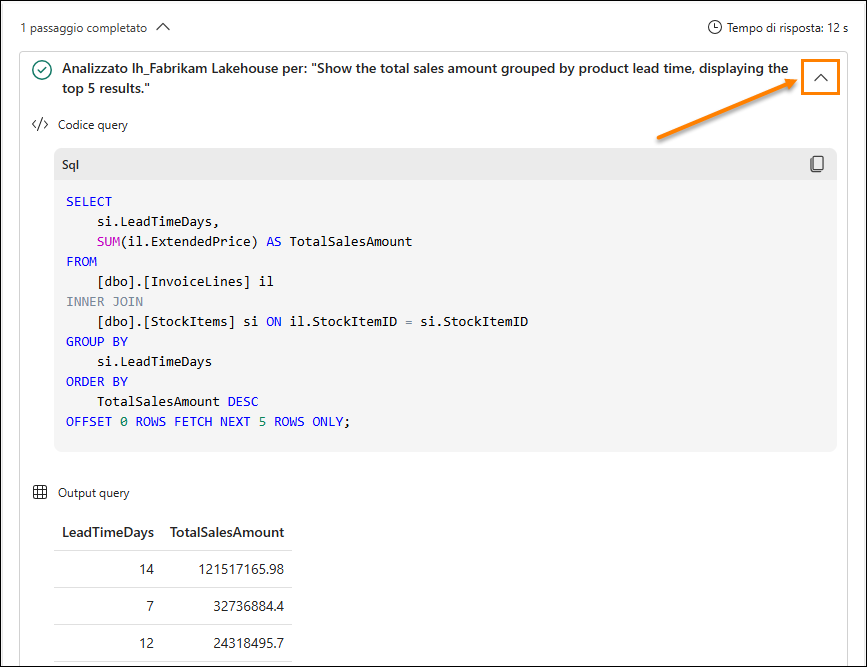

22. Ricordare che è importante convalidare i risultati dell'agente dei dati. Poiché gli agenti dei dati mostrano il codice SQL utilizzato, è possibile esaminarlo ed eseguirlo direttamente sul lakehouse per verificare che i risultati siano corretti.

    È possibile che alcune richieste dell'utente all'agente dei dati restituiscano risultati provenienti dall'origine dati errata. Ad esempio, il totale delle vendite per prodotto può essere restituito sia dall'origine dati del lakehouse sia dal modello semantico. Per fare in modo che l'agente dei dati risponda alla richiesta usando l'origine dati desiderata, è possibile aggiungere ulteriori istruzioni IA che restituiscano i risultati desiderati.

23. Aprire le istruzioni IA nell'agente dei dati e aggiungere le istruzioni seguenti nella sezione Istruzioni agente:

    **## Data Source Priority**

    **Always use the Fabrikam Company Sales Report to answer questions unless the user explicitly ask about lead time.**

    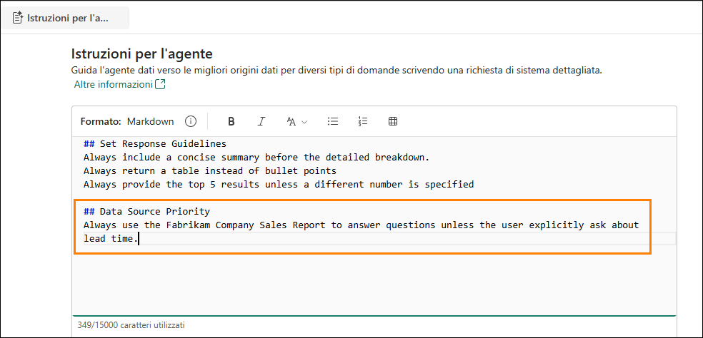

## In evidenza: istruzioni dell'origine dati

1. Successivamente vengono esaminate le istruzioni dell'origine dati.

2. Nel riquadro Istruzioni IA, selezionare i puntini di sospensione accanto al lakehouse, scegliere **Istruzioni origine dati** ed espandere il lakehouse. Si noterà che, a differenza dei modelli semantici, le istruzioni IA sono supportate a livello di origine dati per i lakehouse.

    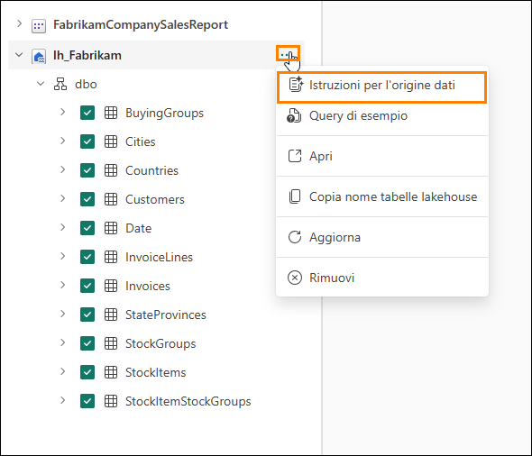

    L'aggiunta di istruzioni dell'origine dati qui può aiutare l'IA a comprendere meglio i dati all'interno del lakehouse. Istruzioni IA ben definite aiuteranno l'IA a comprendere il contesto aziendale, la terminologia e le priorità analitiche.

    In precedenza, durante la preparazione del modello semantico per l'IA, sono state illustrate le istruzioni IA. Tali informazioni non vengono riprese nuovamente in questa sede. Tenere presente che, se l'agente dei dati necessita di ulteriori chiarimenti, è possibile aggiungerli in questa sezione.

## Attività 6: creazione di domande di esempio

L'ottimizzazione di un agente dei dati non rappresenta una configurazione una tantum, ma un processo continuo e iterativo che richiede sperimentazione, osservazione e perfezionamento. Parte del processo di perfezionamento consiste nel fornire query di esempio che possono aiutare l'intelligenza artificiale a capire come rispondere a domande complesse che possono richiedere un uso esteso di SQL o KQL nell'origine dati.

Gli agenti dei dati possono utilizzare query di esempio, note anche come esempi few-shot, per migliorare l'accuratezza e la pertinenza delle risposte durante la conversione delle domande in linguaggio naturale in SQL o KQL (NL2SQL, NL2KQL).

**ℹ️ Importante**

La funzionalità delle query di esempio non è attualmente supportata per i modelli semantici.

Le query di esempio sono un processo costituito da due parti.

1) Per prima cosa viene fornita una domanda di esempio; l'IA assocerà semanticamente le domande simili a quella indicata.

2) In secondo luogo, si fornisce una query di esempio. Questa query gestisce join complessi, predicati complessi e altri scenari avanzati, supportando l'agente nella formulazione della risposta.

    Un lab su esempi di domande **non rientra nell'ambito di questo corso**. Tuttavia, se si desidera creare una query di esempio, è possibile farlo effettuando i seguenti passaggi:

3) Selezionare i puntini di sospensione accanto al lakehouse e selezionare **Query di esempio** per aprire il riquadro.

    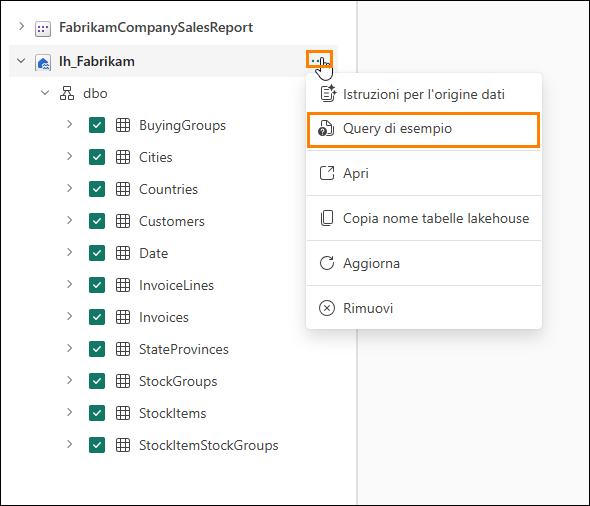

4) Nel riquadro Query di esempio fare clic sul pulsante **Aggiungi esempio**.

    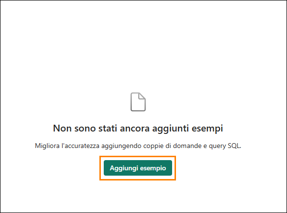

5) Aggiungere una domanda di esempio, quindi premere INVIO. Esempio: **Show sales by country that the product was manufactured in.**

    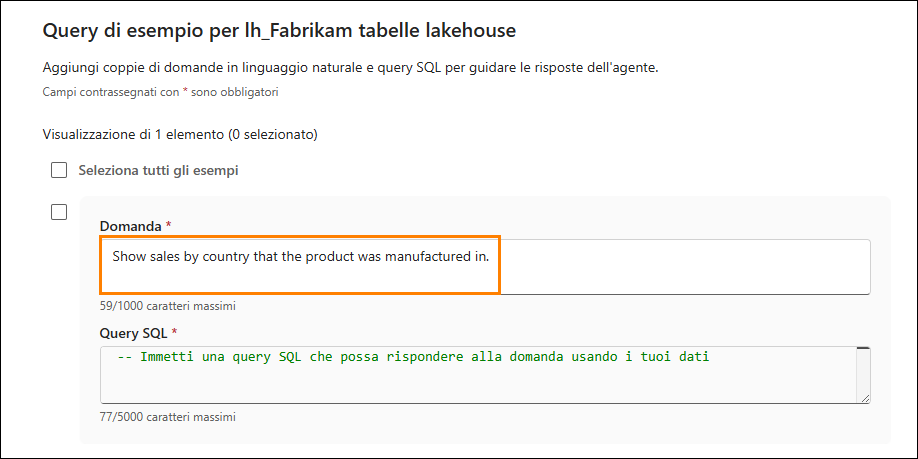

6) Nella finestra di dialogo Query SQL immettere l'SQL che l'agente deve usare per rispondere a questo tipo di domanda. Una volta completato, fare clic sulla (X) nell'angolo in alto a destra e testare l'agente.

    **ℹ️ Importante**

    Il codice non viene fornito in questo lab poiché esula dall'ambito della lezione; tuttavia, se il tempo lo consente, è possibile generare codice autonomamente ed esplorarlo.

    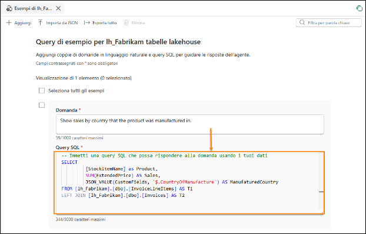

    **Suggerimento**: ciascuna di queste domande riguarda scenari analitici differenti, tra cui analisi geografica, aggregazioni filtrate, calcoli dei ricavi e analisi temporali gerarchiche. Sperimentare con diverse varianti per osservare come l'agente dei dati si adatta a stili di domanda differenti.

    **Sperimentare ulteriormente**: provare a porre domande più complesse nell'agente e quindi creare coppie domanda/SQL che aiutino l'agente dei dati a rispondere alle richieste degli utenti.

## Attività 7: pubblicazione e condivisione dell'agente dei dati

1. È giunto il momento di pubblicare l'agente dei dati. Fare clic sul pulsante **Pubblica** nel menu Home.

    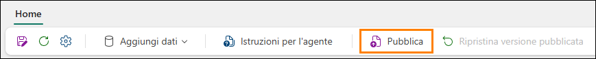

2. Nel passaggio successivo viene aggiunta una descrizione all'agente. Include lo scopo e le funzionalità dell'agente. Fare clic su **Pubblica**.

    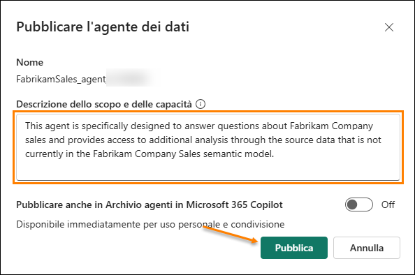

3. Dopo aver pubblicato l'agente, è necessario condividerlo. Fare clic sul pulsante **Condividi** in alto a destra nella schermata.

    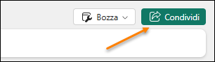

4. Nella casella **Crea e invia collegamento** visualizzata, fare clic sul pulsante **Le persone dell'organizzazione possono visualizzare**.

    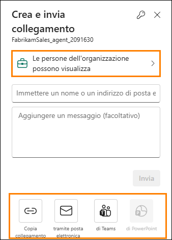

5. Selezionare qui le impostazioni per le autorizzazioni, quindi fare clic su **Applica**.

    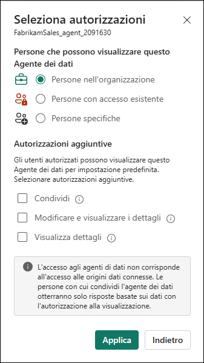

    **ℹ️ Importante**

    L'accesso all'agente dei dati non equivale all'accesso alle origini dati connesse. Le persone con cui viene condiviso l'agente dei dati ricevono risposte basate esclusivamente sui dati per i quali dispongono delle autorizzazioni di visualizzazione.

6. L'agente dei dati di Fabric pubblicato può essere utilizzato in varie piattaforme, tra cui:

    - Microsoft Fabric

    - Copilot Studio

    - Microsoft Teams

    - Notebooks

    - Power BI Copilot

    - Fonderia Azure AI

    - Applicazioni personalizzate tramite API

7. Nell'area di lavoro, passare il puntatore del mouse sull'agente dei dati per visualizzare i puntini di sospensione (...).

    

8. Fare clic sui puntini di sospensione e selezionare Gestisci autorizzazioni.

    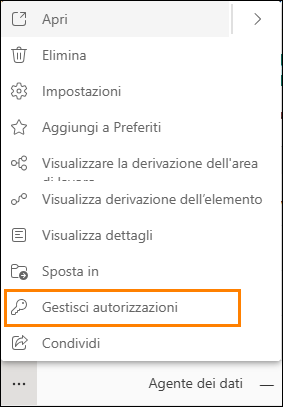

9. Da questa sezione è inoltre possibile condividere l'agente oppure gestire chi dispone di accesso diretto tramite le autorizzazioni dell'area di lavoro. È possibile scegliere **+ Aggiungi collegamento** dal menu Collegamenti o **+ Aggiungi utente** dal menu Accesso diretto. L'aggiunta di utenti all'area di lavoro consente loro di accedere all'agente.

    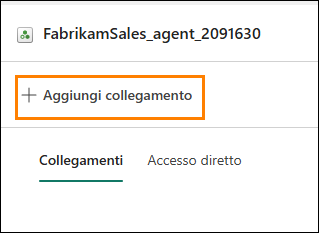

    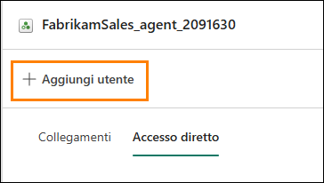

## Attività 8: utilizzo di un agente dei dati da Copilot

1. Sebbene l'agente possa essere utilizzato in diversi modi (vedere il passaggio 6 sopra), viene ora illustrato come sfruttare l'agente dei dati tramite l'esperienza Copilot standalone. Nell'area di lavoro, fare clic sul pulsante Copilot. (NOTA: potrebbe essere necessario fare clic sui puntini di sospensione nella barra laterale per visualizzare il pulsante Copilot).

    Promemoria: nell'esempio, assicurarsi di puntare al proprio agente dei dati.

    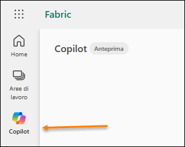

2. Selezionare il segno più: si noti che l'agente viene proposto come opzione utilizzabile da Copilot. Questo evidenzia la differenza tra l'esperienza Copilot standalone e l'esperienza dell'agente dei dati.

    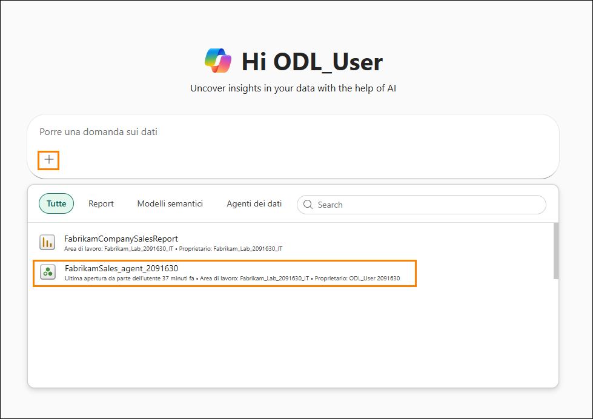

3. Nell'area di lavoro, passare il puntatore del mouse sull'agente e fare clic nuovamente sui puntini di sospensione (...).

    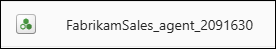

4. Scegliere **Impostazioni** dal menu.

    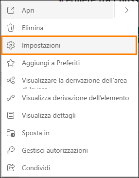

5. Scegliere **Approvazione** dalla nuova finestra.

    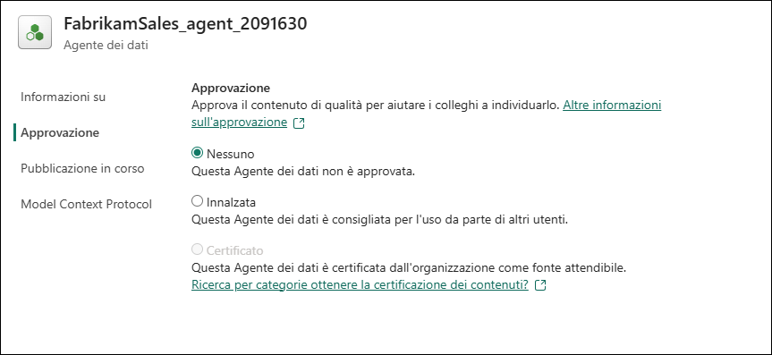

6. Nel contesto di **Copilot**, in particolare quando si lavora con **agenti dei dati** in Power BI o Microsoft Fabric, **"approvare un agente dei dati"** significa concedere un'approvazione o una certificazione formale per quell'agente all'interno dell'ambiente di un'organizzazione. In genere questo significa rendere l'agente facilmente individuabile e affidabile per gli utenti, contrassegnandolo come promosso o certificato.

# Riferimenti

Chat With Your Data in a Day (CDIAD) presenta alcune delle funzionalità chiave dell'uso di Copilot standalone in un'area di lavoro Fabric.

Nel menu di servizio, la sezione Guida (?) include collegamenti ad alcune risorse utili. Tenere presente che la visualizzazione dipende dall'esperienza attualmente in uso e, pertanto, le opzioni potrebbero risultare diverse rispetto alla schermata mostrata di seguito.

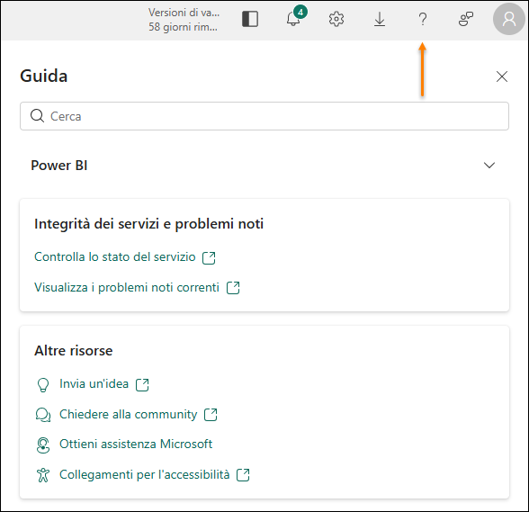

Di seguito sono indicate altre risorse utili a progredire nell'uso di Microsoft Fabric.

- Accedere a tutte le informazioni nella [documentazione di Microsoft Fabric](https://learn.microsoft.com/en-us/fabric/)

- Esplorare Fabric tramite la [presentazione guidata](https://aka.ms/Fabric-GuidedTour)

- Iscriversi alla [versione di valutazione gratuita di Microsoft Fabric](https://aka.ms/try-fabric)

- Visitare il [sito Web di Microsoft Fabric](https://aka.ms/microsoft-fabric)

- Acquisire nuove competenze esplorando i [moduli di apprendimento di Fabric](https://aka.ms/learn-fabric)

- Leggere [l'e-book gratuito introduttivo a Fabric](https://aka.ms/fabric-get-started-ebook)

- Unirsi alla [community di Fabric](https://aka.ms/fabric-community) per pubblicare domande, condividere feedback e imparare dagli altri

Leggere la documentazione tecnica più approfondita relativa a Copilot:

- [Panoramica di Copilot per Power BI - Power BI | Microsoft Learn](https://learn.microsoft.com/en-us/power-bi/create-reports/copilot-introduction)

- [Esperienza Copilot standalone in Power BI (anteprima) – Power BI | Microsoft Learn](https://learn.microsoft.com/en-us/power-bi/create-reports/copilot-chat-with-data-standalone)

- [Impostazioni dell'amministratore di Microsoft Fabric Copilot | Microsoft Learn](https://learn.microsoft.com/en-us/fabric/admin/service-admin-portal-copilot)

- [Creazione dell'agente dei dati di Fabric (anteprima) - Informazioni su come creare un agente dei dati di Fabric | Microsoft Learn](https://learn.microsoft.com/en-us/fabric/data-science/concept-data-agent)

- [Procedure consigliate per la configurazione dell'agente dei dati - Microsoft Fabric | Microsoft Learn](https://learn.microsoft.com/en-us/fabric/data-science/data-agent-configuration-best-practices)

- [Copilot per Microsoft Fabric e Power BI: domande frequenti - Microsoft Fabric | Microsoft Learn](https://learn.microsoft.com/en-us/fabric/fundamentals/copilot-faq-fabric)

© 2026 Microsoft Corporation. Tutti i diritti sono riservati.

L'uso della demo/del lab implica l'accettazione delle seguenti condizioni:

La tecnologia/le funzionalità descritte nella demo/nel lab sono fornite da Microsoft Corporation allo scopo di ottenere feedback dall'utente e offrire un'esperienza di apprendimento. L'utilizzo della demo/del lab è consentito solo per la valutazione delle caratteristiche e delle funzionalità di tale tecnologia e per l'invio di feedback a Microsoft. L'utilizzo per qualsiasi altro scopo non è consentito. È vietato modificare, copiare, distribuire, trasmettere, visualizzare, eseguire, riprodurre, pubblicare, concedere in licenza, usare per la creazione di lavori derivati, trasferire o vendere questa demo/questo lab o parte di essi.

SONO ESPLICITAMENTE PROIBITE LA COPIA E LA RIPRODUZIONE DELLA DEMO/DEL LAB (O DI QUALSIASI PARTE DI ESSI) IN QUALSIASI ALTRO SERVER O IN QUALSIASI ALTRA POSIZIONE PER ULTERIORE RIPRODUZIONE O RIDISTRIBUZIONE.

QUESTA DEMO/QUESTO LAB RENDONO DISPONIBILI TECNOLOGIE SOFTWARE/FUNZIONALITÀ DI PRODOTTO SPECIFICHE, INCLUSI NUOVI CONCETTI E NUOVE FUNZIONALITÀ POTENZIALI, IN UN AMBIENTE SIMULATO, CON UN'INSTALLAZIONE E UNA CONFIGURAZIONE PRIVE DI COMPLESSITÀ, PER GLI SCOPI DESCRITTI IN PRECEDENZA. LA TECNOLOGIA/I CONCETTI RAPPRESENTATI IN QUESTA DEMO/IN QUESTO LAB POTREBBERO NON CONTENERE LE FUNZIONALITÀ COMPLETE E IL LORO FUNZIONAMENTO POTREBBE NON ESSERE LO STESSO DELLA VERSIONE FINALE. È ANCHE POSSIBILE CHE UNA VERSIONE FINALE DI TALI FUNZIONALITÀ O CONCETTI NON VENGA RILASCIATA. L'ESPERIENZA D'USO DI TALI CARATTERISTICHE E FUNZIONALITÀ PUÒ RISULTARE DIVERSA IN UN AMBIENTE FISICO.

**FEEDBACK.** L'invio a Microsoft di feedback sulle caratteristiche, sulle funzionalità e/o sui concetti della tecnologia descritti in questa demo/questo lab implica la concessione a Microsoft, a titolo gratuito, del diritto di usare, condividere e commercializzare tale feedback in qualsiasi modo e per qualsiasi scopo. Implica anche la concessione a titolo gratuito a terze parti del diritto di utilizzo di eventuali brevetti necessari per i loro prodotti, le loro tecnologie e i loro servizi al fine di utilizzare o interfacciarsi ai componenti software o ai servizi Microsoft specifici che includono il feedback. L'utente si impegna a non inviare feedback la cui inclusione all'interno di software o documentazione Microsoft imponga a Microsoft di concedere in licenza a terze parti tale software o documentazione. Questi diritti sussisteranno anche dopo la scadenza del presente contratto.

CON LA PRESENTE MICROSOFT CORPORATION NON RICONOSCE ALCUNA GARANZIA E CONDIZIONE RELATIVAMENTE ALLA DEMO/AL LAB, INCLUSE TUTTE LE GARANZIE E CONDIZIONI DI COMMERCIABILITÀ, DI FATTO ESPRESSE, IMPLICITE O PRESCRITTE DALLA LEGGE, ADEGUATEZZA PER UNO SCOPO SPECIFICO, TITOLARITÀ E NON VIOLABILITÀ. MICROSOFT NON OFFRE GARANZIE O RAPPRESENTAZIONI IN RELAZIONE ALL'ACCURATEZZA DEI RISULTATI E DELL'OUTPUT DERIVANTI DALL'USO DELLA DEMO/DEL LAB O ALL'ADEGUATEZZA DELLE INFORMAZIONI CONTENUTE NELLA DEMO/NEL LAB PER QUALSIASI SCOPO.

**CLAUSOLA DI RESPONSABILITÀ**

Questa demo/questo lab contiene solo una parte delle nuove funzionalità e dei miglioramenti in Microsoft Power BI. Alcune funzionalità potrebbero cambiare nelle versioni future del prodotto. In questa demo/in questo lab si apprendono alcune delle nuove funzionalità, ma non tutte.
