# Microsoft Fabric Chat with your Data in a Day - ラボ 1

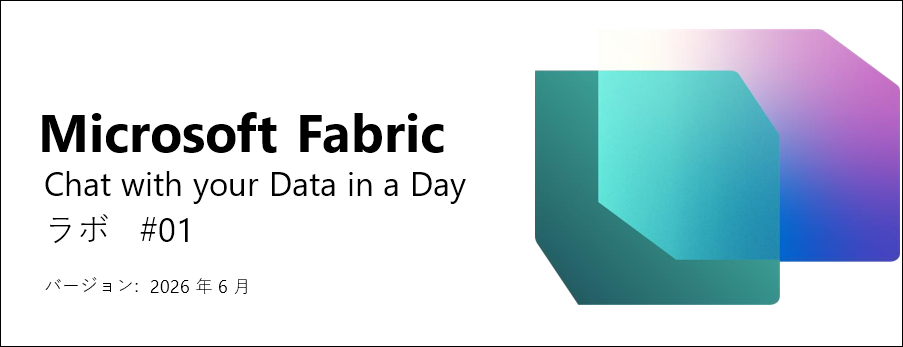

## 目次

- ドキュメントの構造
- シナリオ / 問題の説明
- 概要
  - タスク 1: 仮想環境での作業
  - タスク 2: データの AI 準備状況を評価する
  - タスク 3: Power BI Copilot でプロンプトを記述する

# ドキュメントの構造

このラボでは、実行する手順だけでなく、視覚的にわかりやすいように、手順に関連するスクリーンショットも提示されます。各スクリーンショットでは、ユーザーが注目する必要のある領域が、オレンジのボックスで強調表示されて示されます。

# シナリオ / 問題の説明

あなたの組織は Microsoft のカンファレンスに参加したばかりです。そこで、Copilot を活用した Chat with your Data 体験によって、インサイトを得るまでの時間を大幅に短縮できることを確認しました。デモでは、基盤となるセマンティック モデルが適切に構造化され、AI 向けに最適化されていれば、自然言語でのクエリによって高度な分析を引き出せることがわかりました。

**現在の目標**

Power BI Desktop 内の既存のセマンティック モデルを評価するよう依頼されています。目的は、モデルが Copilot 体験でどの程度うまく機能するかを検証し、改善点を特定することです。

Copilot のインターフェイスに組み込まれた PBI Desktop を使用してモデルを調査する

Copilot が意図の解釈に問題が生じるポイントを特定する

Copilot の理解を向上させるための改善案を提案し、実装する

調査結果を文書化し、組織全体で利用できるようモデルを準備する

# 概要

講師によるデモでは、Chat with your data 体験がどれほど優れたパフォーマンスを発揮できるかを確認しました。このラボでは、AI 向けにデータ モデルを準備することの重要性を確認します。このラボでは、ユーザーからのさまざまな要求の内容と、Copilot がそのような要求に対してどのように応答するかを確認します。また、それらの応答が正確で適切であることを検証する方法についても見て行きます。今後のラボでは、ベスト プラクティスを適用し、データ準備ツールを使用して Copilot 体験をさらに強化、改善する方法について説明します。

## タスク 1: 仮想環境での作業

1. 仮想環境は、Chat with your Data 体験を試すための作業スペースとして非常に優れています。いくつかの重要な領域とポイントを見ていきましょう。

   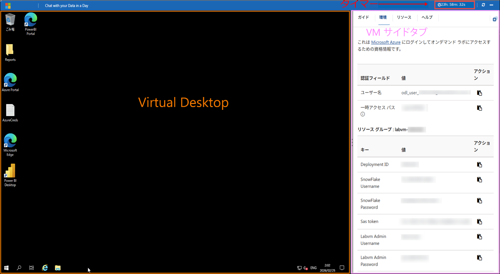

2. いくつかの重要な領域を見ていきましょう。
   - 仮想デスクトップは、ブラウザー上で利用できる完全な機能を備えたコンピューターとして動作します。

   - VM サイドタブでは、ラボのドキュメントや認証情報などにアクセスできます。

   **ℹ️ 重要**

3. このクラス ラボ全体を通して、これらの**重要**ボックスには重要な情報が記載されています。読み飛ばさないようにしてください。たとえば、VM サイドタブが表示されない場合は、下の図のように、VM を完全に展開してください。

   タイマーには、仮想マシンを利用できる残り時間が表示されます。

   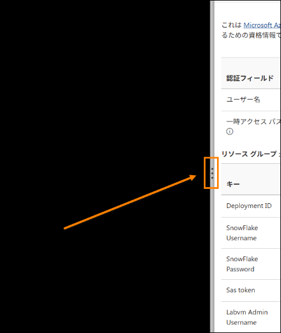

4. サイドタブ下部のページ番号を使用して、ラボ内を簡単に移動できます。

   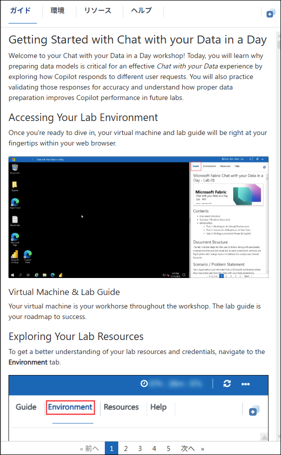

5. このクラスでは、仮想マシン内だけで作業を進めることができます。ただし、参加者の中にはブラウザーをシークレット モードで使用し、付与された仮想マシン用の認証情報で Power BI Desktop にログインして作業することを好む方もいます。その方法でも問題ありません。

## タスク 2: データの AI 準備状況を評価する

1. 仮想マシンの重要な領域を確認したところで、次は Power BI ポータル ボタンに進み、Power BI サービスを起動します。

   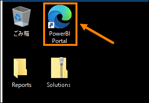

2. 認証情報ページおよびドキュメントに記載されている認証情報を使用し、メール入力欄にメール アドレスを入力します。
   - **ユーザー名/メールアドレス:** **<inject key="AzureAdUserEmail"></inject>**

     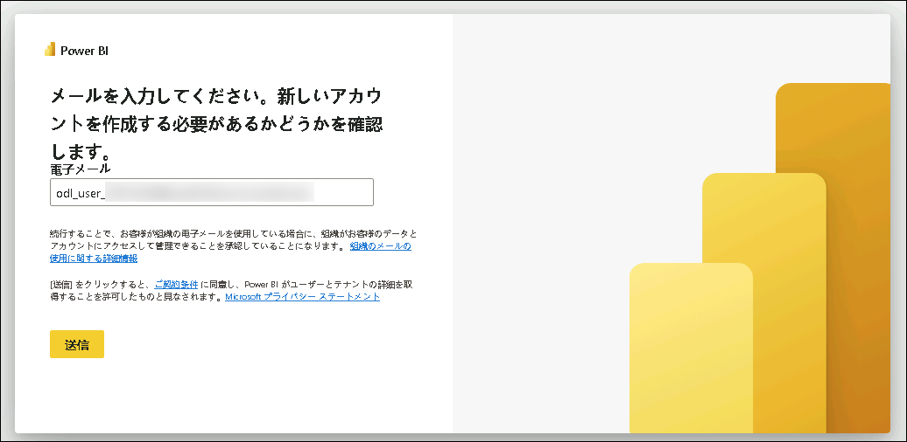

3. 次に、Microsoft の **サインイン**画面で同じ資格情報を使用し、**次へ**をクリックします。

   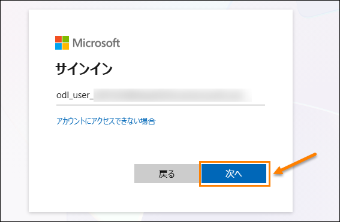

4. 資格情報ページまたはラボのドキュメントで指定されている**一時アクセス パス**を入力し、**サインイン**を押します。必要に応じて、サインイン状態を維持するには [はい] を選択します。
   - **パスワード：** **<inject key="AzureAdUserPassword"></inject>**

     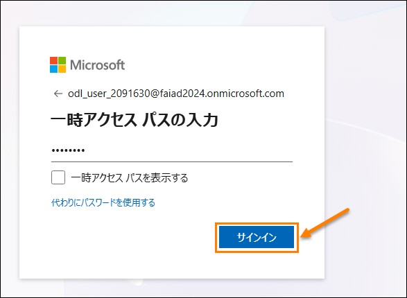

5. まずは左側のメニューの**ワークスペース**領域に移動します。

   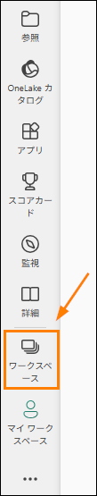

6. ここで、[新しいワークスペース] ボタンを選択して、**新しいワークスペース**を作成します。

   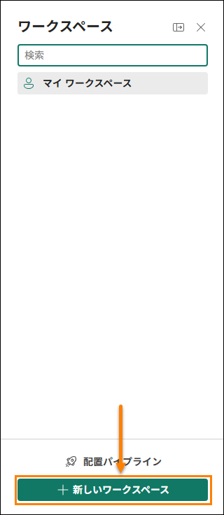

7. 次に、ワークスペースに **Fabrikam*Lab*<inject key="DeploymentID" enableCopy="false"></inject>\_JA** と名前を付けます。

   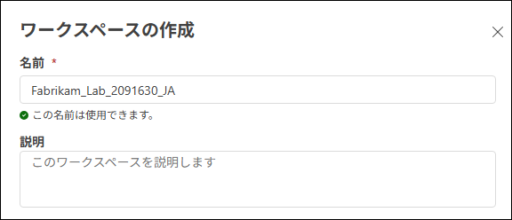

8. この 7 桁のコードは、クラス用にユーザーに割り当てられたユーザー名の一部です。必ずこれを使用してください。以下のスクリーンショットを参照してください。

   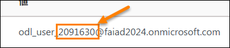

9. たとえば、John A. Smith は **Fabrikam*Lab*<inject key="DeploymentID" enableCopy="false"></inject>\_JA** になります

   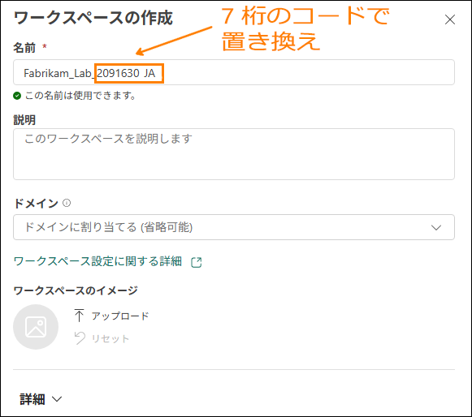

10. 次は、ワークスペースに Fabric の容量を割り当てる必要があります。

11. ワークスペースの設定時に**詳細**をクリックして詳細オプションを展開します。

    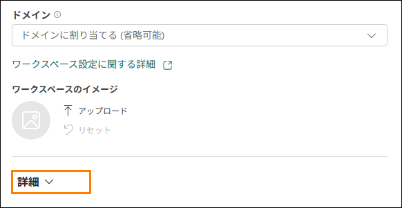

12. **Fabric 容量**が選択されていることを確認します。少し下にスクロールし、ドロップダウン メニューで容量を**ランダムに**選択します。

    **ℹ️ 重要**

13. このクラスで使用する Fabric 環境は頻繁に更新されるため、下のスクリーンショットに表示されているものと同じ容量が表示されない場合があります。利用可能ないずれかの容量を選択してください。

    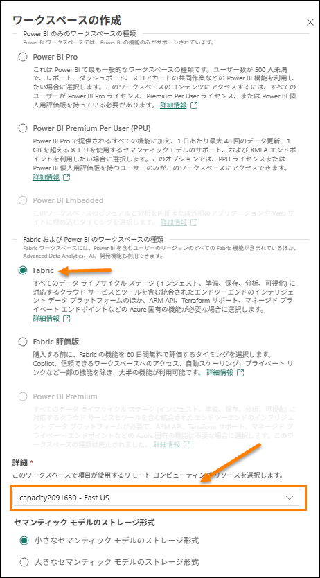

14. **適用**をクリックします。

    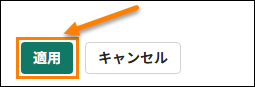

    よくできました。この Fabric 容量ワークスペースを使用して、Chat with your Data が提供する優れた機能や利点をすべて体験します。

15. クラス ファイルから **CDIAD – Lab 01 – Start** という名前のファイルを開き、Chat with your Data エクスペリエンスの探索を開始します。

    

16. Power BI Desktop ファイルに電子メール アドレス **<inject key="AzureAdUserEmail"></inject>** を入力し、**続行** をクリックして資格情報でサインインします。

    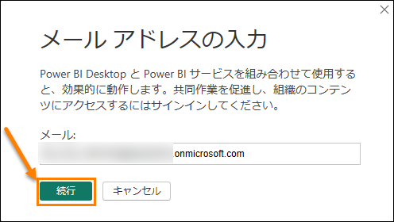

17. さらに、Microsoft のサインイン画面で、同じ**ユーザー名：** **<inject key="AzureAdUserEmail"></inject>** と**一時アクセス パス：** **<inject key="AzureAdUserPassword"></inject>** を使用してサインインしてください。

    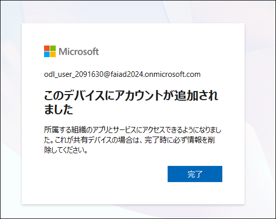

18. 最初の PBIX を開いた状態で、Copilot ボタンに進み、それを選択して Copilot エクスペリエンスを開きます。

    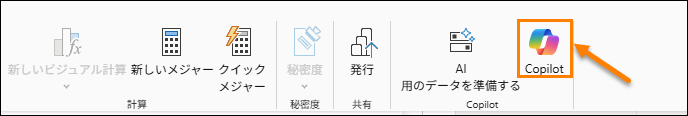

19. 既にログインしている場合、**Copilot をサポートするワークスペースに接続**するための新しいウィンドウが開きます。**ワークスペースの選択**オプションをクリックし、先ほど作成したワークスペースを選択します。

    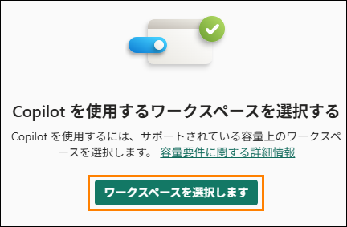

    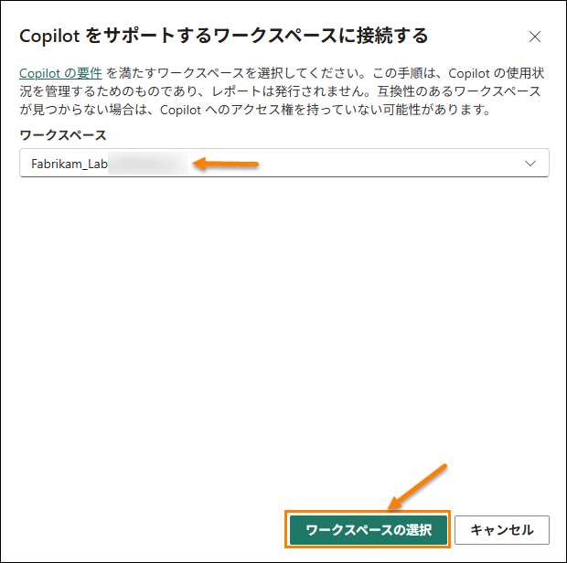

20. 次の画面でプロンプトが表示された場合は、**Get started** をクリックします。

    

21. Power BI の Copilot エクスペリエンスへようこそ。この起動画面では、上部 **(1)** にいくつかのプロンプト例が表示され、下部 **(2)** には要求を入力できるセクションがあります。

    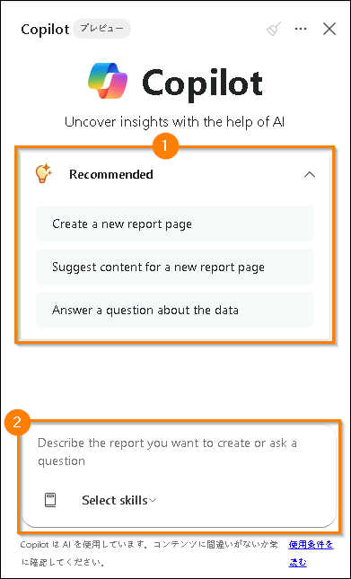

## タスク 3: Power BI Copilot でプロンプトを記述する

このセクションでは、さまざまなプロンプトを記述し、Power BI Copilot エクスペリエンスによって返される結果を確認します。

1. プロンプト欄をクリックし、**Show total purchases by employee** と入力します。入力したら、**Enter** キーを押します。

   

   **表示される候補:**

   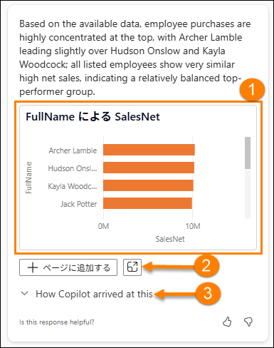

   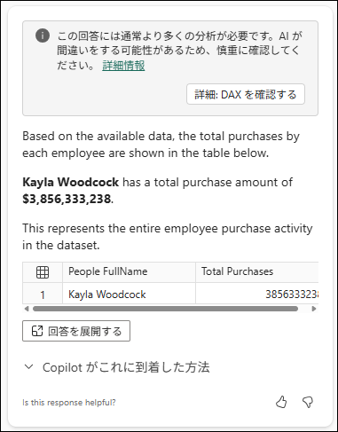

   **ℹ️ 重要**

   AI はさまざまな要因により、結果が一定にならない場合があります。既にこのクラスで説明したとおり、得られる結果は人によって異なり、ラボの例とまったく同じにならないことがあります。また、ここで使用している AI 向けに準備されていないデータでは、同じ質問でも結果が異なる場合があります。表示される機能を確認しながら、できる範囲で作業を進めてください。

   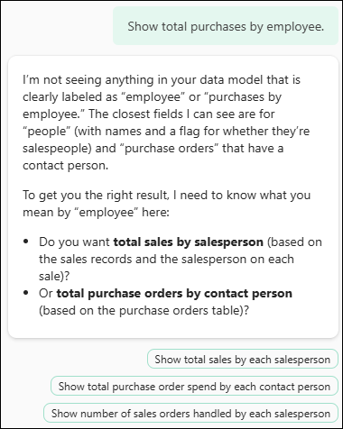

   次のようなフォローアップの質問を受け取る場合があります。

   必要に応じて、**Show total purchases by employee** に最も近いものを選択するか、**そのままプロンプトを続けて入力**してください。

2. 多くの情報が返されるようになります。このセクションを詳しく見ていきましょう。
   1. **(1)** 総購入額と従業員を比較したビジュアル。

   2. **(2)** **ページに追加** したり、ビジュアルを**ポップアウトして拡大表示**したりできる領域。

   3. **(3)** _HCAAT:_ Copilot がこれに至った経緯 (How Copilot arrived at this)。

      

3. Copilot がこのように回答した根拠となるロジックを確認するには、_HCAAT_: **Copilot がこれに到着した方法**ボタンをクリックします。

   **表示される候補:**

   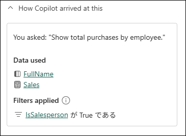

   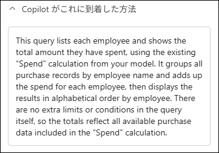

4. **_FullName_**, **Sales**, さらに **_IsSalesperson_** にカーソルを合わせると、Copilot が回答するのに使用した**フィールド**と**ホーム テーブル**を確認できます。

   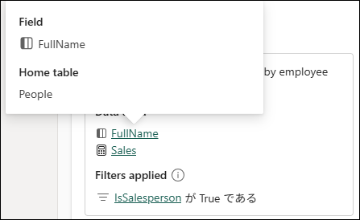

   残念ながら、この結果は正しくありません。"総購入額" を求めたにもかかわらず、**総売上**が表示されているからです。もう一方の DAX クエリでは、1 人の従業員しか対象にしていません。どうやらこのデータは準備が必要なようです。たとえば、次のように考えてみてください。Copilot 向けに準備されていないデータは、入社初日の新人データ アナリストのようなものです。一方、Copilot 向けに準備されたデータは、自社についてよく理解した、長年の経験を持つアナリストに質問するようなものです。

   Copilot 向けにデータを準備する際には、主に 2 つのことを検討する必要があります。

   まず 1 つ目は、より具体的な内容を含む、より優れたプロンプトを書くことです。これは確実に効果があります。しかし、多くのユーザーは、効果的なプロンプトの書き方を理解しておらず、データの内容を十分に理解していないため、具体的に指示できない場合もあります。

   2 つ目は、データ アナリストとして、Copilot 向けにデータを準備し、このようなタイプの要求をあらかじめ想定しておくことで、Copilot の回答の精度を高めることです。このクラスの目的は、Chat with your Data 体験を向上させるためのベスト プラクティスとツールを説明することです。

   **ℹ️ 重要**

   Copilot の回答は、質問の仕方によって大きく変わります。明確で具体的なプロンプトほど、より正確なインサイトや迅速な解決につながります。データを扱う際は、背景情報、求めている結果、関連するフィルターや列などをできるだけ含めるようにしてください。プロンプトを改良すればするほど、より良い回答が得られます。

5. もう一度やってみましょう。ただし、今回はより具体的なプロンプトにします。Copilot のプロンプト欄に、**Show total purchases from the PO table by employee** と入力してください。

   

6. 作成されたビジュアルには、"Kayla Woodcock" という従業員が 1 人だけ表示されていることにお気づきでしょうか。これは正しい結果です。購入を行っている従業員は Kayla のみであるからです。このように、より具体的に指示することで、よりよい回答を得ることができます。さらに、最初から "Total Purchases" というメジャーをセマンティック モデルに用意しておけば、このような状況は避けられたはずです。

   **表示される候補:**

   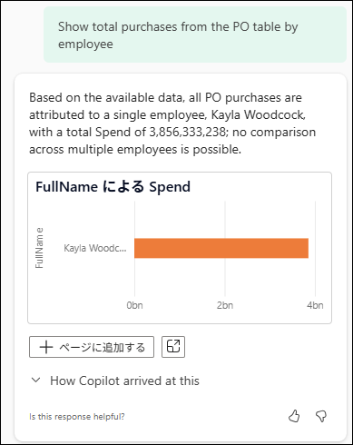

   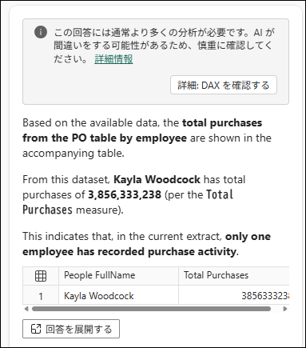

7. 表示された結果と、Copilot がどのようにしてその回答に到達したかを常に検証することが非常に重要です。[How Copilot arrived at this] (**HCAAT**) をクリックします。

   

   Copilot **から** DAX クエリが提供された場合は、**DAX を確認する**を押してみてください。

   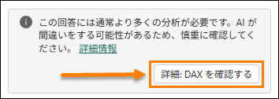

8. Copilot が People テーブルの FullName 列を使用しており、かつ Spend メジャーも使用しているのがわかります。DAX クエリでも同じです。Copilot エクスペリエンスを改善するために、この Spend メジャーはよりわかりやすい名前にすることをお勧めします。

   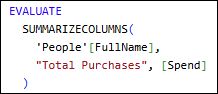

9. この文脈において、Spend は何を意味するのでしょうか? Purchases と同じものでしょうか? まだ Copilot が間違った回答をしている可能性があります。では、Copilot に Spend がどのように計算されているかについて説明してもらいましょう。

10. Copilot のプロンプト欄に、**How is the measure Spend calculated** と入力します

    **表示される候補:**

    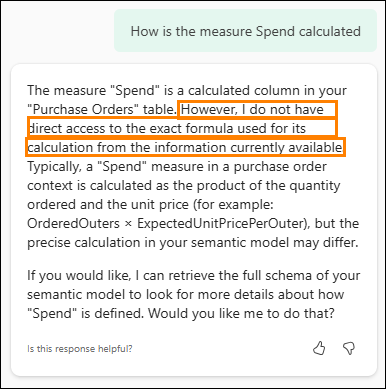

    

11. Copilot は、その計算がどのような処理をしている可能性が高いかについて、大まかな説明をわかりやすく提示します。ただし、これは "大まかな説明" であるため、"通常は" や "一般的には" などの表現が使われていることがあります。また、正確な数式や計算ロジックにアクセスできないため、具体的な回答はできないと、Copilot が明確に伝えている場合もあります。

    **ℹ️ 重要**

    今後のラボでは、ユーザーが Copilot の回答に自信を持つことができるように、これらの質問に回答するのに必要な追加のビジネス コンテキストを Copilot に与える方法について説明します。

    もう一方の画像では、Copilot が実際のメジャーを正しく取得し、その内容を説明したうえで、Spend について現在のフィルター コンテキストに基づいて回答を提示できています。

12. 次はさらに展開して、Copilot がデータ モデルやレポートの変更にどのように対応するかを示すビジュアルを作成します。

13. Copilot のプロンプト欄に、**Create a new report page with a bar chart visual for sales and product tag** と入力してください。

    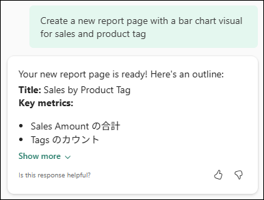

    次に示すように、Copilot のプロンプト作成を続行することが求められる場合があります。

    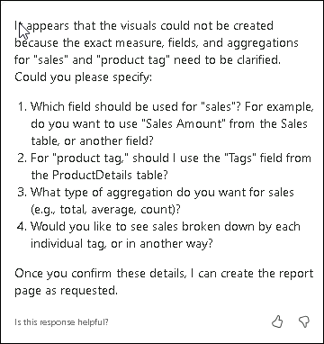

    **Total Sales** と **Product Tag** の要素ができるだけ一致するようにしてください。

    Copilot が新しいレポート ページ上にビジュアルを作成したことに注目してください。

    **表示される候補:**

    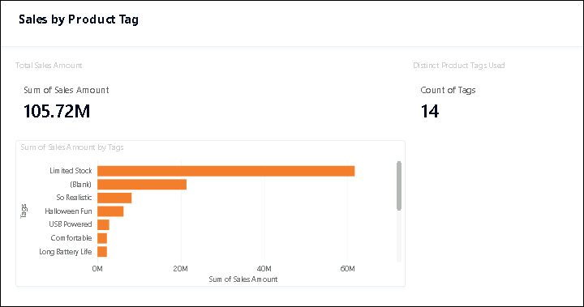

    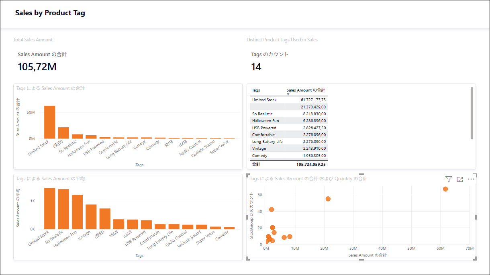

14. Copilot が作成した棒グラフのビジュアルを選択し、**モデル ビュ**ーに切り替えます。データ モデルの制約を回避するために、フィルターが追加されていることに注目してください。現在のデータ モデルでは、通常は Product Tag と Total Sales は一緒には機能しないため、これは驚くべき点です。

    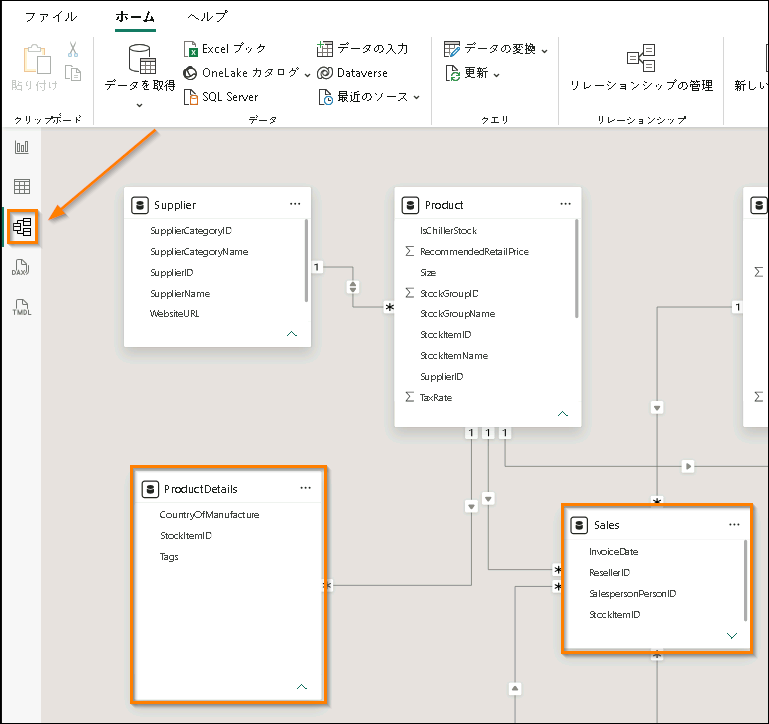

15. これはいくつかの値を二重にカウントしている可能性があるため、削除しましょう。 **レポート ビュ**ーに戻り、引き続きグラフをクリックした状態であることを確認します。

    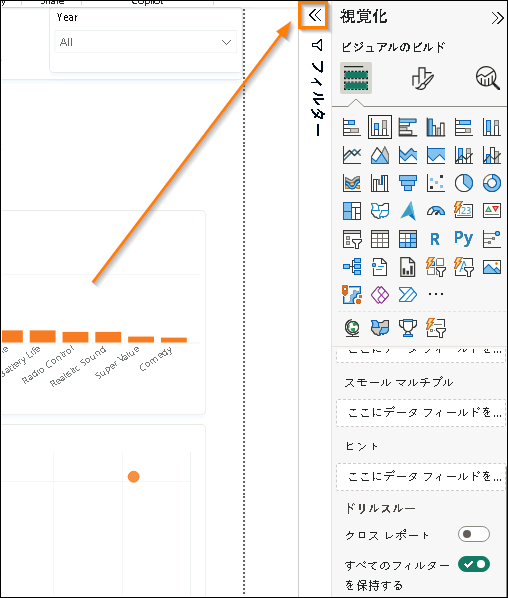

16. 右側にある **[フィルター] タ**ブの [このビジュアルでのフィルター] で、棒グラフの軸から "Product Details that have Products" を削除します。

    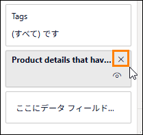

17. 値はすべて **\$105,724,059** で同じになっていることに注目してください。これは、Copilot が作成したビジュアルのデータ バーにカーソルを合わせると確認できます。これは、セマンティック モデル内のリレーションシップが正しく設定されていないことを示す典型的な兆候です。

    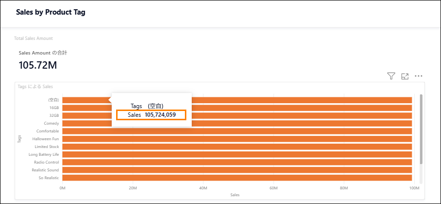

18. 上記の Copilot の回答が誤っていたのは、セマンティック モデルの設計が原因です。Copilot は、要求に合わせるためのフィルターを作成することはできました。これは、AI 向けにデータ モデルを準備しておくことがなぜ重要であるかを示しています。今後のラボでは、テーブルやリレーションシップを確認し、それらをどのように改善すれば Copilot の体験を向上できるかについて説明します。

19. このビジュアルを見ると、Copilot の回答に問題があることがはっきりとわかります。このデータを確認するもう 1 つの方法は、Copilot に質問をし、その回答を確認することです。Copilot のプロンプト欄に、**Show total sales by product tag** と入力してください。

    

20. Copilot は回答の中で、売上に**変動がない**ことを明確に伝えています。Copilot でこのような表現を見かけた場合は、何かが正しくない可能性があることを示しています。

    

21. Copilot に **Show total sales by State** と別の質問をしてみましょう。

    

    表示される回答は複数のパターンがあり、*結果は人によって異なる*場合があります。次に示すのはその一例です。

    **表示される候補:**

    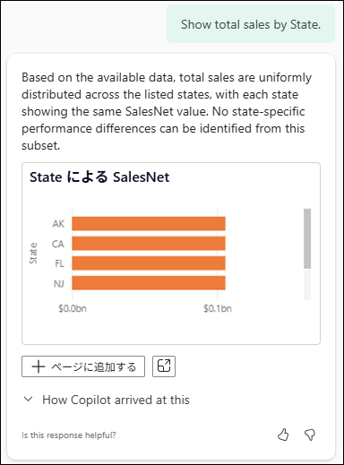

    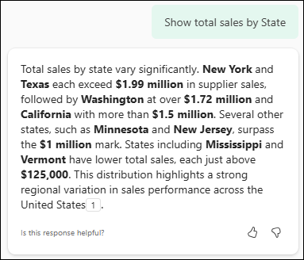

22. この回答は完全に正しいとはいえません。再び、データ モデルに問題があるのでしょうか。問題があるのはデータ モデルなのか、それともこちらの指示が曖昧だったのでしょうか。[How Copilot arrived at this] (_HCAAT_) を選択し、使用されている **_State_** と **_Sales_** のデータにカーソルを合わせて確認してください. **_Sales_** は、Sales テーブルの明示的なメジャーを介して正確に取得されていますが,**_State_** フィールドは Customer テーブルから取得されています。

    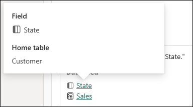

23. モデル ビュー に移動し、Customer と Sales を結び付けているデータ モデルのリレーションシップを確認してください。これで、ビジュアルが誤っていた理由がはっきり分かります。これにより、質問の表現とデータ モデルが一致している必要があることがわかります。

    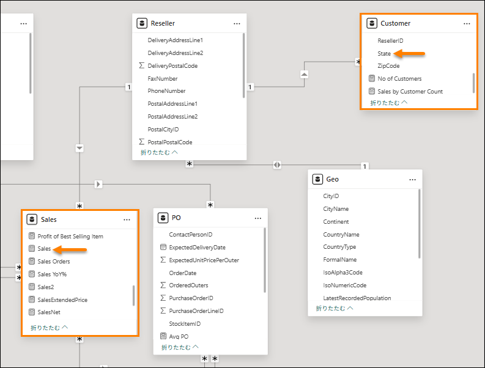

    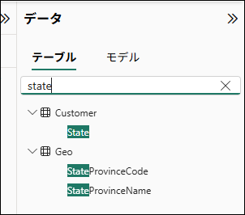

    このシナリオでは、State のバリエーションが複数のテーブルにあるほか、複数の Sales メジャーも存在します。これにより、回答に一貫性がなくなったり、誤解を招く結果になったりすることがあります。後のラボでは、Copilot がこのようなユーザーの要求に応えるのに役立つ、さまざまな手法について説明します。

24. もう 1 つ、**Sales by State** というプロンプトを試してみましょう。

    

25. 下のスクリーンショットでは、テキサス州の売上が最も多く、**\$461,457 または \$200 万**となっていることがわかります。これらの回答は、レポートのビジュアルを参照することによって生成されていますが、実際にはそのうちの 1 つのビジュアルにはフィルターが適用されています。結果が下のスクリーンショットと同じ場合は、参照リンクをクリックすると、参照元のページとビジュアルが表示されます。

    **表示される候補:**

    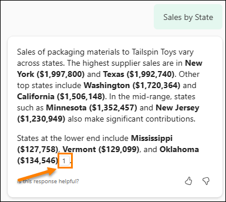

    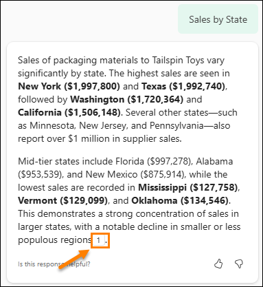

26. 次に、下部のリボンにある [Highest selling product] タブに移動します。

    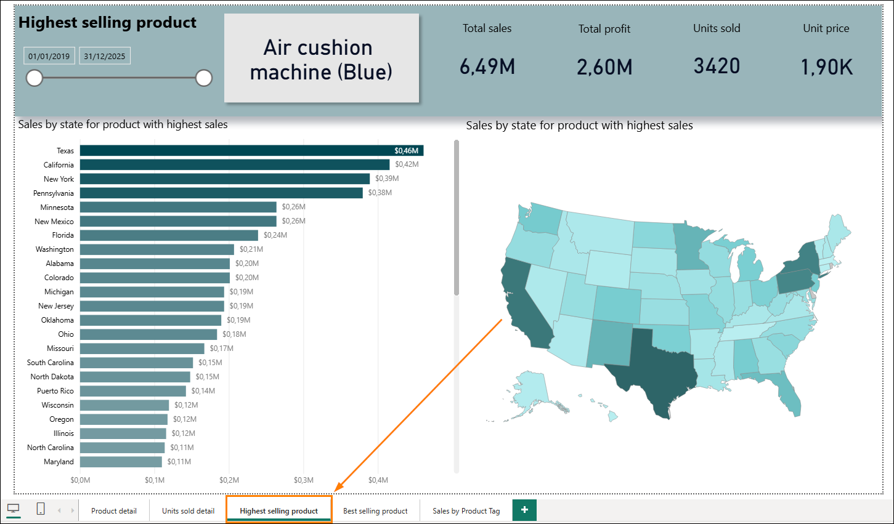

27. 一見すると回答は正確に見えるかもしれませんが、ビジュアルに適用されている可能性のあるフィルターを確認してください。まだ行ってない場合は、フィルター ウィンドウを展開してください。

    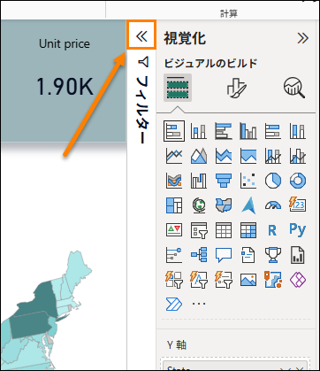

    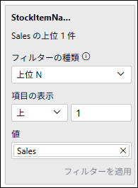こ

28. のビジュアルにはフィルターが設定されており、それが Copilot の回答に影響している可能性があります。フィルターを展開すると、**このビジュアルは最も売れている製品の売上のみが表示されている**ことがわかります。 (マップ ビジュアルをクリックしたことを確認してください)

    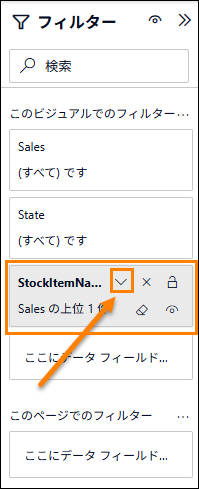

    **ℹ️ 重要**

    フィルターは、ビジュアル、ページ、レポートだけでなく、スライサーのレベルでも存在する場合があります。Copilot は、フィルターが設定されているビジュアルを基に回答を生成することがありますが、エンド ユーザーにはフィルターが適用されていることは通知しない場合があります。このコースの後半で、このような回答に対応するために、AI 指示を追加する方法について説明します。

29. このフィルターを削除すると、参照されているビジュアルの値が大幅に変化することに注目してください。

    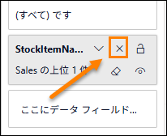

30. テキサス州の売上は、今度は **\$7,256,794** になっています。他の結果と比べて大きく異なっていませんか。よく見てみると、あるビジュアルでは **Sales** メジャーが使用されており、別のビジュアルでは **Supplier Sales** が使用されていることがわかります。これも、データを AI 向けに準備する必要がある理由の 1 つです。

    

    

31. 同じ質問をもう一度してみるとどうなるでしょうか。もう一度 Copilot に **Sales by State** を聞いてみましょう。

    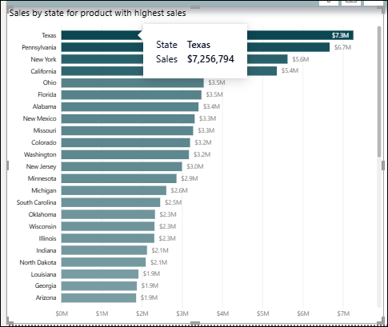

    

32. フィルターが設定されていない状態では、参照元が同じでもまったく異なる値になります。これは AI 向けにデータを準備するにあたって、注意すべき重要な側面の 1 つです。

    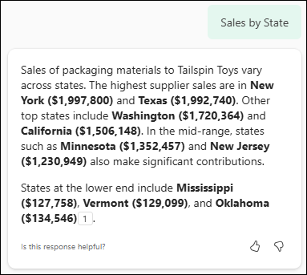

33. 複数の参照を返す回答はどうでしょう。Copilot に新しい質問 **Show the top selling product** と入力してください。

    

34. 参照リンクを選択し、無関係なフィルターが設定されていないか確認します。

    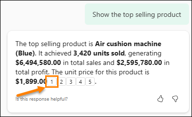

    

35. Reseller テーブルの **ResellerCompany** を使用して、ページにフィルターを追加します。

    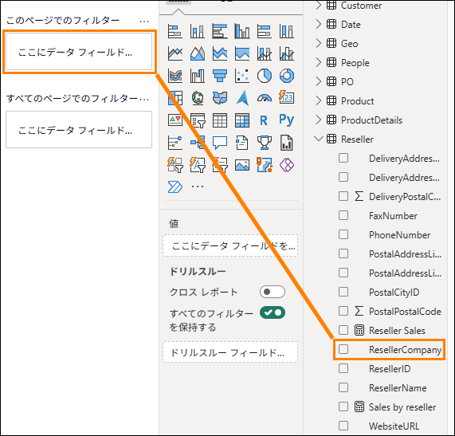

36. TailSpin Toys のみを選択し、値が変更されているかを観察します。

    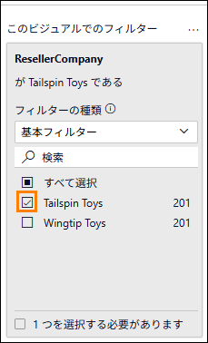

37. ここでもう一度、**Show the top selling product** と質問をしてください。

    

38. 製品は同じままでも、数字が大きく異なっています。この例は、準備されていないセマンティック モデルでは、一貫性のない結果や誤った結果が表示される可能性があることを示しています。

    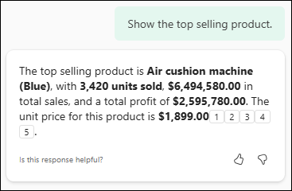

39. ここで Copilot の便利さを体験でき、確認しておくべきもう 1 つの領域は、Data Analysis eXpressions (DAX) 言語との統合です。**Calculate the percent of total sales in the Southeast to the United States** と、計算が関与する質問をしてみてください。

    

40. この回答では、Copilot が通常よりも多くの分析が必要になることを認識しているのがわかります。これは、必要に応じて計算内容をさらに検証すべきだと知らせてくれる点で有用です。

    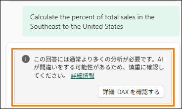

41. このケースでは、この特定の計算を行うのに、Copilot が DAX を作成する必要があります。ここでは、使用された DAX を 2 つの方法で確認できます。まず 1 つ目は、**詳細: DAX を確認する**と**回答を展開する**です。

    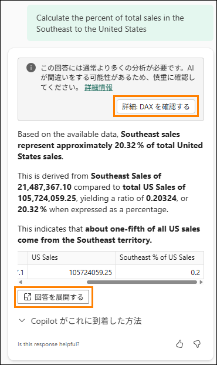

42. 回答を作成するために使用された DAX を確認するために、**DAX クエリ** タブを表示していることを確認してください。そこには、クエリ本体と、そのロジックの説明が表示されます。ここで次の 2 つの点を確認する必要があります。(1) この DAX は正しく見えるかどうか。(2) Southeast リージョンは本当に **20.32%** であったのかどうか。

    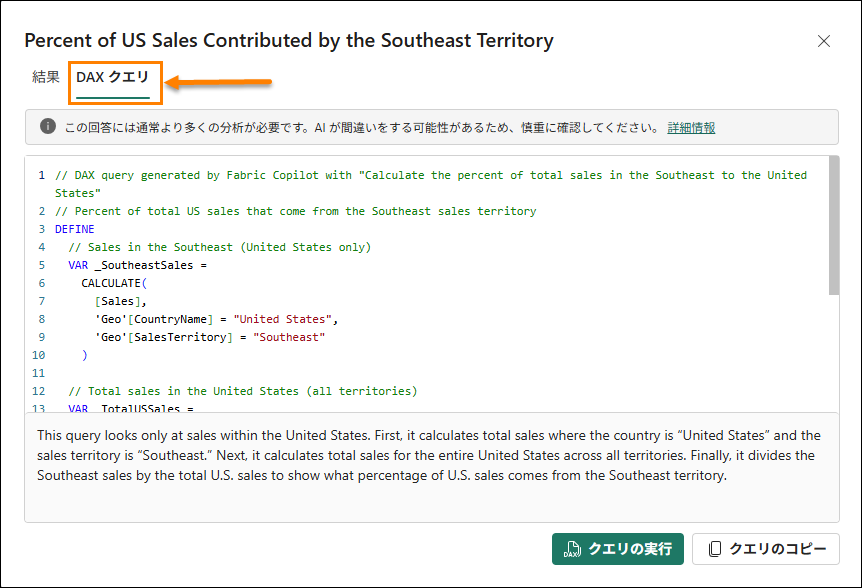

43. Copilot によって DAX が生成されるたびに、しばしば内容が大きく異なったり、一貫していなかったりします。このセクションのスクリーンショットと同じ DAX にならない場合もあります。このコードでは、DAX は **Geo** テーブルから州の情報を取得しており、これは正しく機能していますが、**Customer** テーブルから位置情報を取得してしまう可能性もありました。もし Customer テーブルから取得していた場合、結果はわずか 3% から 4% 程度になっていたでしょう。

    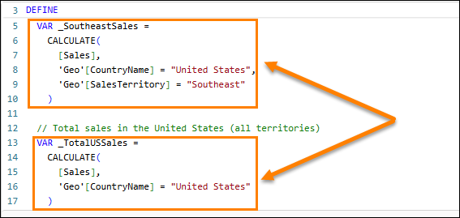

44. では、この問題はどのように解決できるでしょうか。最善の方法は、後ほどラボで **AI 用のデータを準備する**際に使用する方法です。ただし現時点では、よりよい回答を確実に得るための方法の 1 つは、よりよいプロンプトを書くことです。既に **Geo** テーブルから結果を得ているかもしれませんが、それでもこれは確認するための 2 番目に有効な方法です。

45. プロンプト **Calculate the percent of total sales in the Southeast to the United States from the Geo table** を使用して、もう一度質問してください。

    

46. 今回も似たような結果になるでしょう。また、回答に関連付けられている DAX を確認することもできます。

    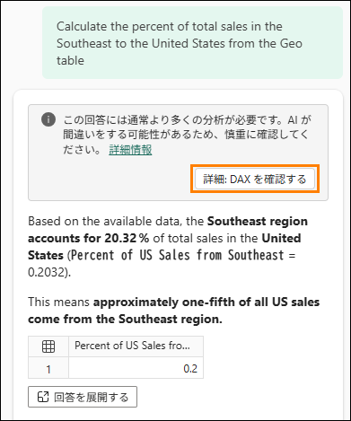

    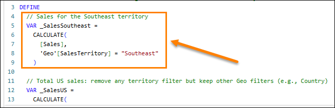

47. よくできました。よく考えられたプロンプトを使用することで、モデルの不備は調整できます。ただし、エンド ユーザーに対しては、より一般的な質問でも対応できる体験を提供したいところです。

48. この PBIX ファイルには、データ モデリング上の問題がいくつかあります。具体的には、スノーフレーク ディメンションが 2 つ存在しています。 Copilot は、フィルターの適用やその他の変更によって回答を調整し、これらをうまく処理しています。しかし、モデルとビジネス要件を見直した結果、これら 2 つのディメンション (Supplier と Geo) は、個別のテーブルとして保持する必要はないと判断しました。これら 2 つのテーブルは、スター スキーマに近づけるために、モデル内の他のテーブルに統合されます。正しくモデリングすることで、パフォーマンスの向上、モデルの理解しやすさの向上、そして Copilot エクスペリエンスの向上につながります。このモジュールの最後には、**CDIAD – Lab 02– Start** を使用します。
    - **Supplier:** Supplier テーブルの列は Product テーブルに追加されました。

    - **Geo:** Geo テーブルの列は Reseller テーブルに追加されました。

    **ℹ️ 重要**

    他のディメンションをフィルター処理するディメンションを作成する必要がある場合もあり、その結果、スノーフレーク構造になることがあります。しかし、ビジネス要件を満たせるのであれば、可能な限りセマンティック モデルはシンプルに保つべきです。新しいビジネス要件が追加され、新しいテーブルが取り込まれるにつれて、データ モデルは必然的に複雑になります。常にデータ モデルを最適な状態に保つことが重要です。

    ⭐Power BI はスター スキーマで最も効果的に動作します。スター スキーマについてはこのクラスでは詳しく取り上げません。詳細については、次の Microsoft Learn のリンクを参照してください。

    [**https://learn.microsoft.com/en-us/power-bi/guidance/star-schema**](https://learn.microsoft.com/en-us/power-bi/guidance/star-schema)

    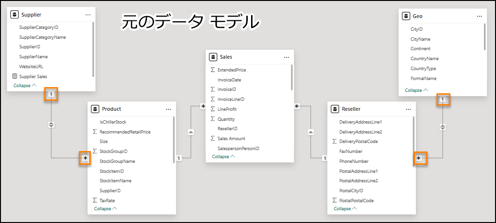

    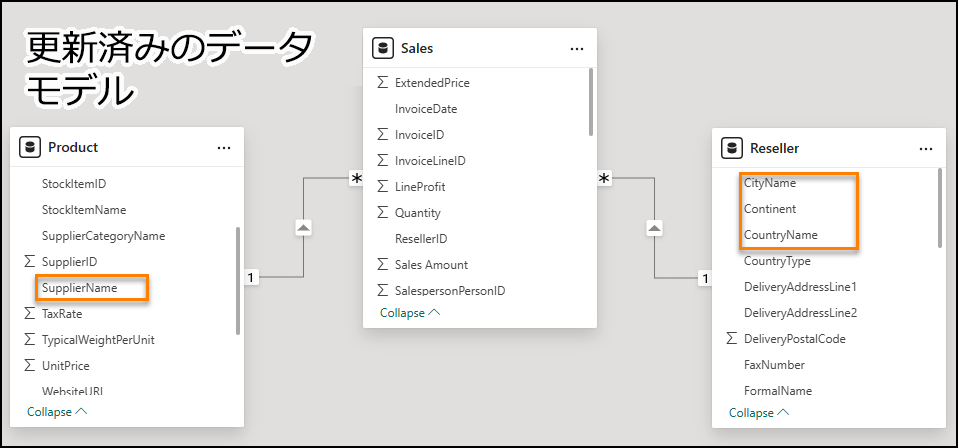

Microsoft Fabric の次のステップに役立つリソースをいくつか以下に紹介します。

- メインの [Microsoft Fabric ドキュメント](https://learn.microsoft.com/en-us/fabric/)のすべての情報にアクセスする

- [ガイド付きツアー](https://aka.ms/Fabric-GuidedTour)を通じて Fabric を探索する

- [Microsoft Fabric の無料試用版](https://aka.ms/try-fabric)にサインアップする

- [Microsoft Fabric の Web サイト](https://aka.ms/microsoft-fabric)にアクセスする

- [Fabric の学習モジュール](https://aka.ms/learn-fabric)で新しいスキルを学ぶ

- [Fabric 入門編の無料の e-book](https://aka.ms/fabric-get-started-ebook) を読む

- [Fabric コミュニティ](https://aka.ms/fabric-community)に参加し、質問の投稿やフィードバックの共有を行い、他のユーザーから学びを得る

Copilot についてより掘り下げる、次の技術ドキュメントを参照してください。

- [Power BI の Copilot の概要 - Power BI | Microsoft Learn](https://learn.microsoft.com/en-us/power-bi/create-reports/copilot-introduction)

- [Power BI のスタンドアロン Copilot エクスペリエンス (プレビュー) – Power BI | Microsoft Learn](https://learn.microsoft.com/en-us/power-bi/create-reports/copilot-chat-with-data-standalone)

- [Microsoft Fabric Copilot の管理設定 | Microsoft Learn](https://learn.microsoft.com/en-us/fabric/admin/service-admin-portal-copilot)

- [Fabric データ エージェントの作成 (プレビュー) - Fabric データ エージェントの作成方法 | Microsoft Learn](https://learn.microsoft.com/en-us/fabric/data-science/concept-data-agent)

- [データ エージェントを構成するためのベスト プラクティス - Microsoft Fabric | Microsoft Learn](https://learn.microsoft.com/en-us/fabric/data-science/data-agent-configuration-best-practices)

- [Microsoft Fabric と Power BI の Copilot: FAQ - Microsoft Fabric | Microsoft Learn](https://learn.microsoft.com/en-us/fabric/fundamentals/copilot-faq-fabric)

© 2026 Microsoft Corporation. All rights reserved.

このデモ/ラボを使用すると、次の条件に同意したことになります。

このデモ/ラボで説明するテクノロジまたは機能は、ユーザーのフィードバックを取得し、学習エクスペリエンスを提供するために、Microsoft Corporation によって提供されます。ユーザーは、このようなテクノロジおよび機能を評価し、Microsoft にフィードバックを提供するためにのみデモ/ラボを使用できます。それ以外の目的には使用できません。このデモ/ラボまたはその一部を、変更、コピー、配布、送信、表示、実行、再現、発行、ライセンス、著作物の作成、転送、または販売することはできません。

複製または再頒布のために他のサーバーまたは場所にデモ/ラボ (またはその一部) をコピーまたは複製することは明示的に禁止されています。

このデモ/ラボは、前に説明した目的のために複雑なセットアップまたは

インストールを必要としないシミュレーション環境で潜在的な新機能や

概念などの特定のソフトウェア テクノロジ/製品の機能を

提供します。このデモ/ラボで表されるテクノロジ/概念は、フル機能を表していない

可能性があり、最終バージョンと動作が異なることがあります。また、

そのような機能や概念の最終版がリリースされない場合があります。物理環境でこのような機能を使用するエクスペリエンスが異なる場合もあります。

**フィードバック。** このデモ/ラボで説明されているテクノロジ、機能、概念に関するフィードバックを Microsoft に提供する場合、ユーザーは任意の方法および目的でユーザーのフィードバックを使用、共有、および商品化する権利を無償で Microsoft に提供するものとします。また、ユーザーは、フィードバックを含む Microsoft のソフトウェアまたはサービスの特定部分を使用したり特定部分とインターフェイスを持ったりする製品、テクノロジ、サービスに必要な特許権を無償でサード パーティに付与します。ユーザーは、フィードバックを含めるために Microsoft がサード パーティにソフトウェアまたはドキュメントをライセンスする必要があるライセンスの対象となるフィードバックを提供しません。これらの権限は、本契約の後も存続します。

Microsoft Corporation は、明示、黙示、または法律上にかかわらず、商品性のすべての保証および条件、特定の目的、タイトル、非侵害に対する適合性など、デモ/ラボに関するすべての保証および条件を拒否します。Microsoft は、デモ/ラボから派生する結果、出力の正確さ、任意の目的に対するデモ/ラボに含まれる情報の適合性に関して、いかなる保証または表明もしません。

**免責事項**

このデモ/ラボには、Microsoft Power BI の新機能と機能強化の一部のみが含まれています。一部の機能は、製品の将来のリリースで変更される可能性があります。このデモ/ラボでは、新機能のすべてではなく一部について学習します。
