# Microsoft Fabric Chat with your Data in a Day - ラボ 2

## 目次

- ドキュメントの構造
- シナリオ / 問題の説明
- 概要
  - タスク 1: 双方向フィルター処理 / スター スキーマ
  - タスク 2: 列、テーブル、メジャーの名前変更
  - タスク 3: 説明
  - タスク 4: データ カテゴリ
  - タスク 5: 集計
  - タスク 6: [列で並べ替え] プロパティ
  - タスク 7: 言語的スキーマ: 同意語

# ドキュメントの構造

このラボでは、実行する手順だけでなく、視覚的にわかりやすいように、手順に関連するスクリーンショットも提示されます。各スクリーンショットでは、ユーザーが注目する必要のある領域が、オレンジのボックスで強調表示されて示されます。

# シナリオ / 問題の説明

あなたの会社は、初期テストおよび Copilot 準備状況の確認フェーズを完了しました。その結果、現在のモデルはまだスタンドアロン Copilot エクスペリエンスに対応できる状態ではなく、Power BI Desktop で一般的に認められているベスト プラクティスを導入する必要があることがわかりました。Copilot が意味のある回答を確実に提供できるように、基盤となるセマンティック モデルは慎重に設計して最適化する必要があります。

現在のセマンティック モデルには、次のような課題があります。

- テーブル名や列名がわかりにくく、解釈しづらい可能性がある。

- テーブル、列、メジャーの説明がない。

- データ カテゴリが十分に活用されておらず、Copilot の文脈理解が制限されている。

- 並び替えロジックや既定の集計設定がユーザーの期待に合っていない可能性がある。

- リレーションシップや言語的スキーマが、Copilot の最適な体験を支えるよう構成、最適化されていない。

# 概要

これらのギャップは、ユーザーが Copilot を使用する際に、混乱や不正確な回答、誤解を招くビジュアル、重要なインサイトの見落としにつながるおそれがあります。このラボでは、命名、カテゴリ設定、集計設定、データ モデリング、言語スキーマに関するベスト プラクティスを使用して、セマンティック モデルを改良する方法について説明します。

## タスク 1: 双方向フィルター処理 / スター スキーマ

1. クラス ファイルから **CDIAD – Lab 02– Start** という名前のファイルを開き、AI 向けにデータの準備を開始します。

   

2. 前のラボで、**Create a new report page with a visual for sales and product tag** という質問をしました。Copilot から作成された回答には、データの重複が見られました (下のスクリーンショットを参照)。通常、すべてのデータ ポイントの結果が同じである場合は、データ モデルのリレーションシップに問題があることを示しています。

   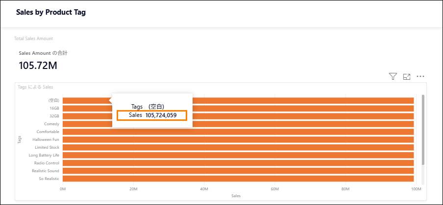

3. 以下は、Product Details テーブルの Tag と Sales テーブルの Sales メジャーのリレーションシップを示すスクリーンショットです。

   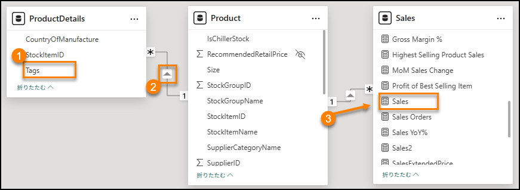

4. Copilot に Tags 別の Sales を返すよう指示すると、データの重複があるレポートが生成されます。これは、Product Details テーブルの Tags 列から、Product テーブルをフィルター処理できないことが原因です。Product テーブルと Product Details テーブルの間のフィルター方向は一方向で、Product から Product Details テーブルへのみ適用されています 。この問題は 2 つの方法で解決できる可能性があります。
   - 1 つ目は、Tags テーブルから必要なフィルターを追加したうえで、総売上を計算する DAX メジャーを作成する方法です。この方法では、データ モデルをシンプルに保てますが、ビジネス ニーズごとに新しいメジャーを作成する必要があるため、手間がかかる可能性があります。

   - 2 つ目は、今回このラボで実装する方法で、フィルターが双方向に伝わるように設定することです。Product テーブルと Product Details テーブルの間のリレーションシップを更新することで、タグ列から Sales テーブルまでフィルターが適用されるようになり、Copilot が正しい回答を生成できるようになります。

5. データ モデル内のリレーションシップを更新しましょう。_以下のスクリーンショットを参照してください。_
   1. 左のナビゲーション ウィンドウにあるモデル ビューをクリックします。

   2. Product と Product Details の間のリレーションシップを選択します。

   3. [プロパティ] ウィンドウで、クロスフィルターの方向を一方向から双方向に変更します。

      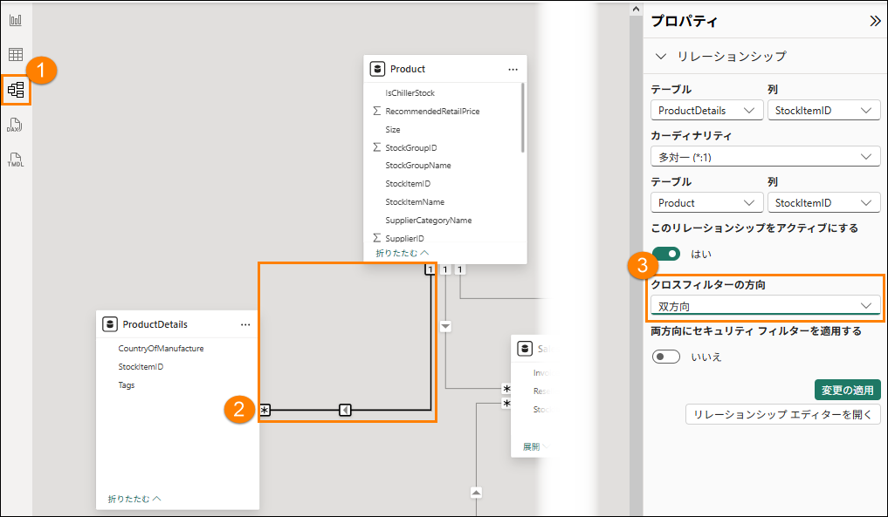

   **ℹ️ 重要**

   ベスト プラクティスとして、可能な限り双方向フィルター処理は避けることをお勧めします。場合によっては、結果のあいまいさやパフォーマンスの問題を引き起こす可能性があります。このセクションで述べたように、代替案の 1 つは、特定のメジャーに対して手動でフィルターを適用する DAX メジャーを作成する方法です。他にも代替手段はありますが、このコースでは取り上げません。

6. では、**レポート ビュー**でもう一度質問をして、結果が改善されていることを確認しましょう。Copilot Power BI チャット エクスペリエンスをもう一度開き、**Show total sales by product tag** と質問をしてください。

   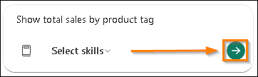

   もし確認の質問が表示された場合は、**Sales メジャー**を選択してください。

   

7. 正しい結果:

   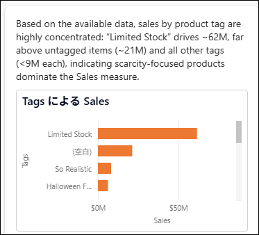

   異なるビジュアルが表示された場合は、もう一度プロンプトを入力し直し、**棒グラフ** を指定します。

   

   前回の結果:

   

   データ モデリングは、Power BI において常に最も重要な要素の 1 つであり、場合によっては最も重要な要素と言えるものです。十分に検討して定義されたデータ モデルは、レポートの作成、DAX の記述、セキュリティの実装、Copilot のサポートを、より簡単で効果的にします。

## タスク 2: 列、テーブル、メジャーの名前変更

1. 前回のラボでは、全体を通して、Copilot が想定していなかった列、テーブル、メジャーを使用してしまうという問題が発生していました。こうした課題は、データ モデルが成長していく中ではよく起こるものですが、AI により適したデータにするためには、命名の調整を行う必要があります。

2. まずはテーブルを適切な名前に変更しましょう。**PO** テーブルを右クリックし、**名前の変更**を選択します。**PO テーブル**の名前を **Purchase Orders** に変更します。

   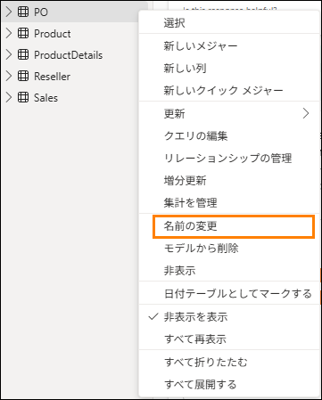

   

3. 次は、同じ方法で列の名前を変更します。まずは **Reseller** テーブルを展開します。

   

4. 次に **[SPName]** 列をダブルクリックまたは右クリックし、名前を **State** に変更します。

   

   

5. 続けて、次のように名前を変更します。

   **‘Reseller’[CountryName]** を **Country** に変更

   **Sales** テーブルで、メジャー **MoM Sales Change** を **Month over Month Sales Change** に変更

   **Sales** テーブルで、メジャー **Sales YoY%** を **Sales Year over Year %** に変更

   **Purchase Orders** テーブルで、メジャー **Spend** を **Total Purchases** に変更

   **ℹ️ 重要**

   テーブルや列をわかりやすい名前にすると、大きな違いをもたらします。Copilot はモデルの構造に基づいてプロンプトを解釈するため、より直感的に理解できる名前であるほど、より正確な DAX、ビジュアル、インサイトを生成できるようになります。Copilot の理解度と自身の作業効率を高めるために、命名は慎重に検討しましょう。

## タスク 3: 説明

1. それでは、説明を追加して、データ モデルをさらに改善していきましょう。説明は、モデル ビューでテーブル、列、メジャーに追加できます。これらの説明は、Copilot がユーザーの要求に回答する際に役立ちます。テーブルの説明は Copilot にとってバックステージ パスのような役割を果たし、正確で関連性の高いインサイトや要約、さらに DAX メジャーを生成するために必要な文脈を提供します。それでは、**モデル ビュー**から作業を開始しましょう。

2. **Purchase Orders** テーブルを選択します。**プロパティ**に、Copilot を支援する説明を入力する**説明**欄があります。そのためのベスト プラクティスをいくつか紹介します。

   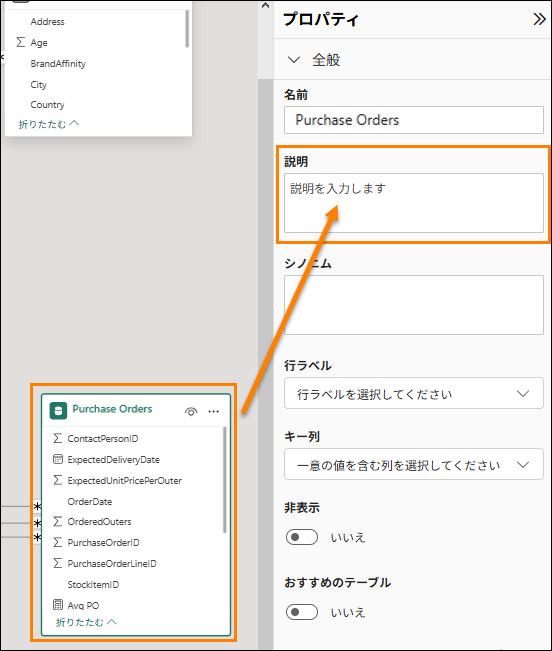

   ### テーブルの説明のベスト プラクティス

   **目的から書き始める:** このテーブルはビジネス上どのような意味があるのか?

   **ビジネス コンテキストを含める:** このテーブルがレポート作成や意思決定にどのように役立つかを説明する。

   **粒度を明記する:** トランザクション単位、日次単位、集計済みなど、どのレベルのデータか?

   **重要な列を強調する:** 特にリレーションや計算で使用される列を示す。

   **主なユース ケースを説明する:** どのような質問やビジュアルでこのテーブルが使用されるか。

   **リレーションを記載する:** モデル内で他のテーブルとどのようにつながっているかを示す。

   **ℹ️ 重要**

   **適切に書かれた説明は、Copilot がデータの目的や文脈を理解するのに役立ちます。** 特に名前だけでは意味が十分に伝わらない場合は、説明を使ってテーブルや列の内容を明確にしましょう。Copilot はこうした手がかりを基に、より適切な回答、DAX、ビジュアルを生成します。説明は、Copilot とユーザーの両方を、よりよいインサイトへ導くための手段であると考えてください。

3. このフィールドに、次の詳細で正確な説明文を貼り付けてください。

   _This Purchase Orders table captures individual line items from purchase orders submitted within the organization.Each row represents a specific product ordered, including the quantity requested, the date of the order, and the employee who initiated the request.It supports analysis of procurement trends, supplier demand, and employee purchasing behavior.Key columns include ProductID, QuantityOrdered, OrderDate, and EmployeeID.This table links to Products, Employees, and PurchaseOrders tables to enable detailed reporting across procurement workflows._

   これにより、特に **Purchase Orders** テーブルに関する回答において、Copilot がより適切な回答を生成できるようになります。引き続き、いくつかの列についても、よりよい説明を作成していきましょう。**Purchase Orders** テーブルの **Order Date** 列を選択し、同様の説明を追加てください。

   ### セマンティック モデルの列の説明に関するベスト プラクティス

   **ビジネス上の意味から書き始める:** その列が業務上どのような意味を持つのかを説明する。

   **単位、形式、スケールを明確にする:** 数値、日付ベース、カテゴリ型の場合は、どのような構造になっているかを説明する。

   **主なユース ケースを示す:** この列が一般的にどのような分析やレポートで使用されているかを Copilot が理解するのを手助けする。例: Revenue – 各取引の総売上額。収益性分析やトレンド分析で使用される

   **冗長になるのを避ける:** 意味を補足する目的でない限り、列名から明らかなことは繰り返さない。たとえば、EmployeeID の場合は次のような説明を追加できます: Unique identifier for the employee who submitted the order.

   **文体を統一する:** 説明は簡潔で分かりやすく、モデル全体で統一した表現にする。好奇心のあるアナリスト向けのツールチップを書くイメージで作成しましょう。

4. **Purchase Orders** テーブルを選択し、**OrderDate** をクリックします。次の説明を入力してください。**The calendar date when the purchase order was submitted by an employee.**

   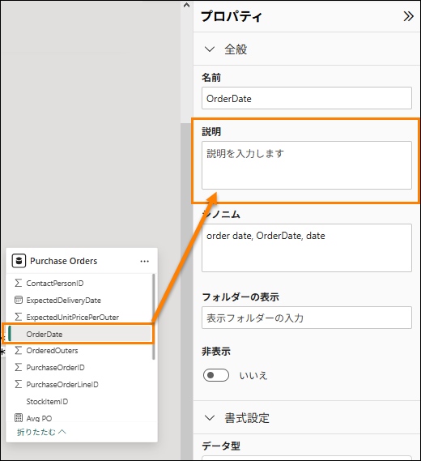

5. テーブルと列の**説明**が改善されたところで、次はメジャーの説明を追加しましょう。ただし、今回は Copilot に説明の作成をサポートしてもらいます。まずは **Purchase Orders** メジャーを選択します。それから **Copilot を使用して作成する**を選択します。

   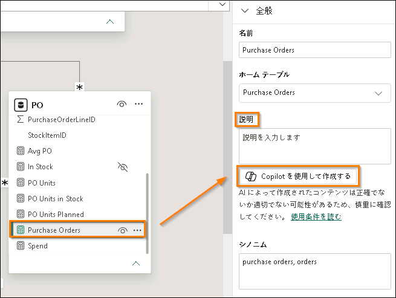

6. Copilot が作成した説明が、確認できる状態で表示されていることに注目してください。この回答は人によって異なる場合がありますが、説明内容の確認や補足には十分役立ちます。**再試行**を押して再生成することもできますが、問題がなければ**保持する**を選択してください。

   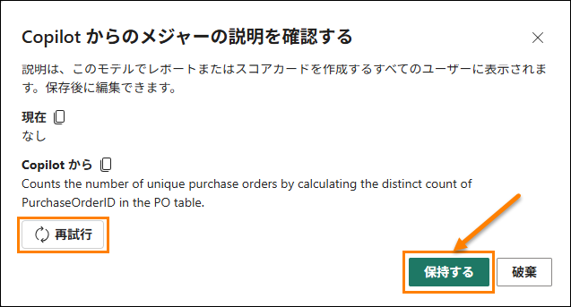

   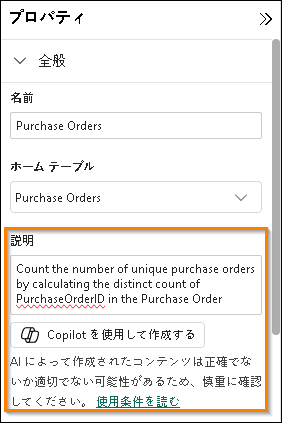

   このセクションでは、テーブル、列、メジャーに説明を追加する方法について説明しました。実際のセマンティック モデルでは、ここでやったことを他のすべてのテーブルや該当する列、メジャーに展開していくことになります。これにより、Copilot がデータを扱う能力が大きく向上し、今後のすべての回答の質も改善されます。

## タスク 4: データ カテゴリ

Power BI で列にデータ カテゴリを追加することは、Copilot にとって重要です。特に、地理的データ、Web データ、画像データを含むセマンティック モデルを扱う場合に効果的です。これらのカテゴリは、メタデータのタグのような役割を果たし、列名やデータ型だけではわからない列の目的を、Copilot (およびビジュアル) が理解するのに役立ちます。

1. **テーブル ビュー**に移動し、Reseller テーブルを選択します。まずは、**Reseller** テーブルの **State** 列を選択します。

   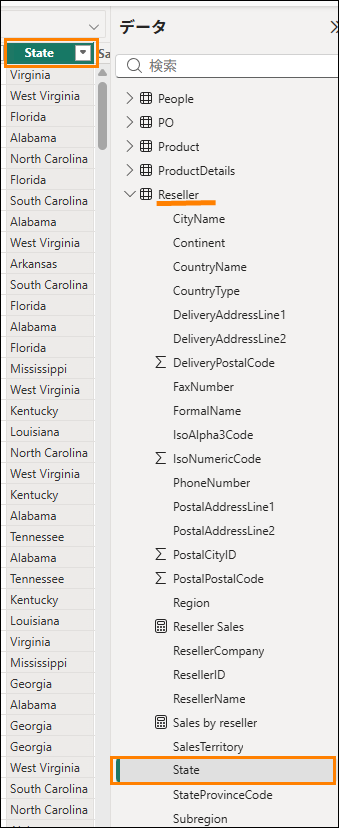

2. **State** 列を選択すると、Power BI レポートの上部に、**列ツール**という新しいリボン メニューが表示されます。まずは**データ カテゴリ**を変更しましょう。

   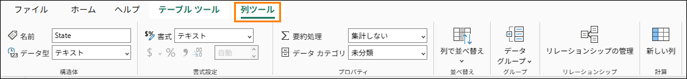

3. **データ カテゴリ**を展開し、[未分類] から**州または都道府県**に変更します。

   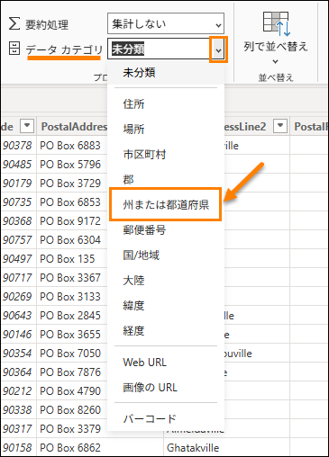

4. 引き続き、以下の残りの列に対してもデータ カテゴリを追加します。

   | **テーブル名** | **列名**           | **データ カテゴリ** |
   | -------------- | ------------------ | ------------------- |
   | Reseller       | Country            | 国/地域             |
   | Reseller       | DeliveryPostalCode | 郵便番号            |
   | Reseller       | PostalPostalCode   | 郵便番号            |
   | Reseller       | Website URL        | Web URL             |

   **ℹ️ 重要**

   **データ カテゴリを設定すると、Copilot がデータの扱い方を理解できます。** 地理的情報、URL、画像など、正しいカテゴリを割り当てることで、Copilot は文脈を把握し、より適切なビジュアル、フィルター、インサイトを生成できるようになります。たとえば、列に "City" とタグ付けすると、Copilot がそれをすぐに地図上で表示できます。この小さな設定が大きな価値をもたらします。

## タスク 5: 集計

このセクションでは、Power BI の既定の集計と、それが Copilot の回答にどのように影響するかについて説明します。これは Power BI に新たに追加された要素ではありませんが、Copilot にとって非常に重要です。

1. **レポート ビュー**で Copilot を開き、プロンプトとして **What is customer age by state?** と入力してください。

   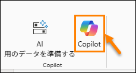

   

2. 結果を見てみると、奇妙な結果が生じている可能性があることがわかります。**WA**、**NY**、または他の州のデータ バーにカーソルを合わせると、**Age** の合計が返されていることがわかります。ここには通常なら平均値が表示されると予想されるところですが、Age 列の既定の集計は SUM であるため、Copilot は集計処理を行います。

   下の画像のように、Copilot が確認の質問をしてくる場合があります。それとは関係なく、集計を調整し、毎回平均を返すように設定することで、追加の確認質問を避けることができます。

   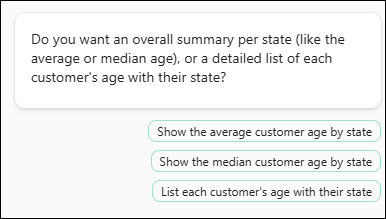

   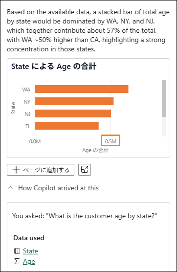

3. Age にカーソルを合わせると、Copilot がこの列に対して SUM を実行したことがわかります。

   

4. 平均年齢を具体的に指定するプロンプトを書けば、正しい結果を得ることはできます。しかし、よりよい方法は、可能な範囲でデータ モデルを改善することです。そのためには、**既定の集計**プロパティを調整します。

   **ℹ️ 重要**

   **既定の集計は、Copilot にビジュアルや計算内の列をどのように扱うかを指示します。**"集計しない"、"合計"、"平均" など、これを正しく設定すると、Copilot がより正確なグラフや DAX を生成できるようになります。たとえば、ID や名前は "集計しない" とマークすると、誤って合計されるのを避けることができます。これは、Copilot を意味のあるインサイトへ導くための簡単な方法です。

5. Copilot のプロンプト欄に、**What is customer age average by state** と入力します。

   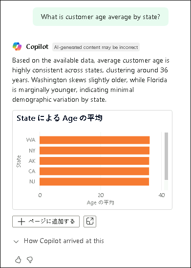

6. では、**既定の集計**を調整してみましょう。‘Customer’ テーブルの **Age** 列を選択し、列ツールを表示します。**集計**で、Age を**平均**に設定します。

   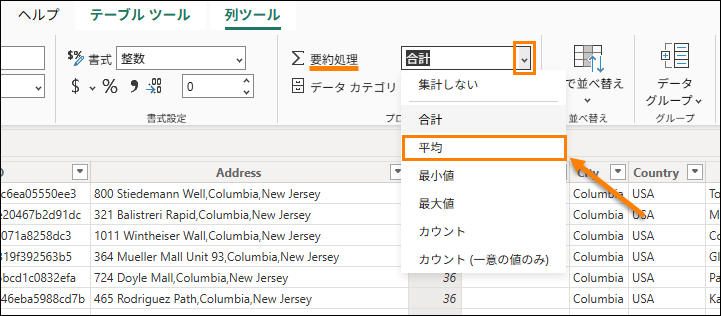

7. Copilot のチャット画面で、もう一度 **What is customer age by state?** と質問してください。

   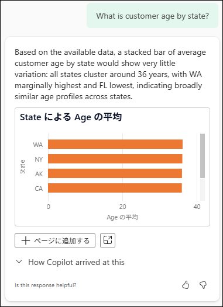

   よくできました。これこそが意図した結果であり、ユーザーがより気軽に質問できるようになり、質問内容のばらつきにも対応できるようになります。また、数値型であっても集計すべきでない列については、既定の集計をオフにすることも同様に重要です。たとえば、Year、Quarter、Month のような数値の列は集計すべきではありません。

## タスク 6: [列で並べ替え] プロパティ

1. [列で並べ替え] プロパティは、既定の集計と同様に、Power BI の新たな要素ではありませんが、このプロパティを正しく設定すると、Copilot が期待どおりの順序で結果を表示できるようになります。たとえば、月別の売上を表示した場合、既定で最も売上が高い月から順番にビジュアルが並べ替えられます。これを実際に試してみましょう。

2. まだそうしていない場合は、チャットのクリア領域を押して Copilot チャットをリセットします。

   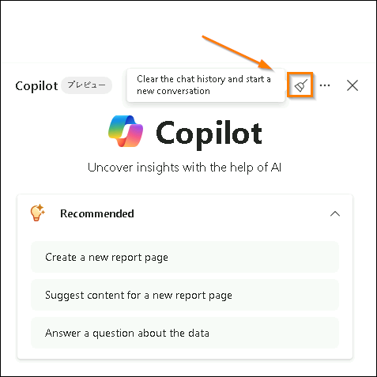

3. 次に、プロンプトとして **Show total sales by month as a column chart** と入力します。

   

4. 結果自体は正しいものの、グレゴリオ暦 (1 月、2 月、3 月... 12 月) で一般的に見る並び順になっていません。結果は、アルファベット順に基づいた順序、または今回のように、売上が高い順に表示されます。

   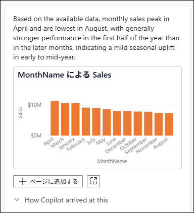

   **ℹ️ 重要**

   **[列で並べ替え] を使用すると、Copilot がデータをどのように表示するかを制御できます。** この設定により、月やカスタム ラベルなどのカテゴリが、ビジュアルや集計で期待どおりの並び順で表示されるようになります。たとえば、"月名" を "月番号" で並べ替えるよう指定すると、Copilot は正しい時系列のグラフを作成できます。この簡単な修正により、混乱を招く結果を防ぐことができます。

5. **列ツール**の**列で並べ替え**で、**MonthName** 列の並び順を調整する必要があります。**Date** テーブルの MonthName 列を選択します。

6. [列で並べ替え] を展開し、並び順が Month 列の順番になるよう調整します。

   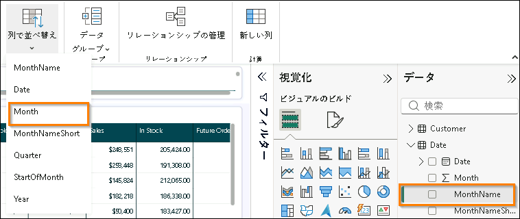

7. Copilot に **Show total sales by month** と同じ質問をすると、今度は期待どおりの結果が表示されます。

   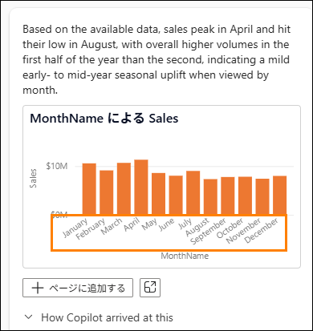

## タスク 7: 言語的スキーマ: 同意語

**言語的スキーマ**は、Copilot を自然言語による分析パートナーとして最大限に活用するための鍵となります。Copilot に対してデータ モデルの翻訳ガイドを付けるようなものです。これがないと、Copilot は推測に頼りますが、設定することで、Copilot ははるかに流暢になり、データに精通した状態で回答できるようになります。

**言語的スキーマとは何か?**

言語的スキーマは、セマンティック モデルを自然言語にマップするためのメタデータです。これにより、Copilot が次のことを理解できるようになります。

- テーブルおよび列の意味

- それらのビジネス上の概念との関連性

- ユーザーがデータを操作する際に使用する可能性がある同意語、表現、質問の種類

例として、単に列名を読むのではなく、Copilot は次のように理解します。

- "収益" = TotalSales

- "発注数" = PurchaseOrderCount

- "従業員の業績" = SalesByEmployee

これは、Copilot が次のような質問に回答できることを意味します。

- "前四半期に最も収益が高かった地域はどこですか?"

- "売上数量で上位の従業員を表示してください"

言語的スキーマがない場合、Copilot はあいまいな用語を誤って解釈したり、関係のないビジュアルを提案したりする可能性があります。設定すると、次のような効果が得られます。

- より適切な DAX の提案

- よりスマートなビジュアルの提案

- より正確な要約やインサイト

**同意語と自然言語をサポート**

同意語は次のように定義できます。

- "PO" = "Purchase Order (発注書)"

- "Rep" = "Sales Representative (営業担当者)"

- "Qty" = "Quantity Ordered (注文済み数量)"

1. **言語的スキーマ**のインターフェイスを見てみましょう。まずは**モデル ビュー**を選択します。レポート ビューを開いている場合は、モデリング リボンを選択します。次に、**Q&A の設定**に移動します。

   

2. Copilot のデータ モデルで使用される Q&A が、ユーザーの質問をより正しく理解できるようにするための、充実したメニューが用意されています。メイン メニューには、設定を開始するためのさまざまな領域があります。

   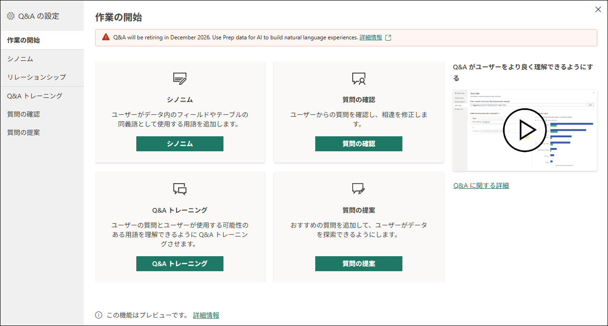

3. まずは最初のメニューである、シノニム (同意語) のメニューに移動しましょう。

   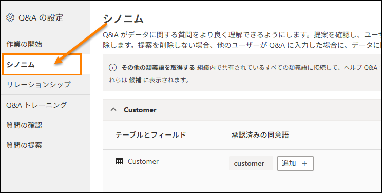

4. より正確な同意語を設定することで、ユーザーがさまざまな言い回しで質問した場合でも、Copilot が正しく理解できるようになります。また、目的の列に移動するために、テーブルを切り替えることができます。そのためには、山型アイコンを押します。

   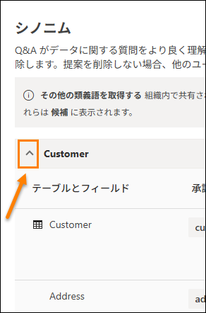

   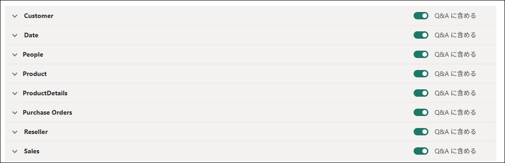

5. Copilot が理解できるように、**Reseller** の同意語をより具体的に設定してみましょう。**Reseller** テーブルを展開し、**ResellerID** 列に現在関連付けられているすべての同意語と、提案が表示されていることを確認します。

6. Fabrikam 社内では、Resellers は **Fabrikam Friends** と呼ばれることがあります。これを同意語として追加し、従業員が Fabrikam 独自の言い回しで質問できるようにしましょう。**shopper** で**追加**を選択し、同意語を入力します。

   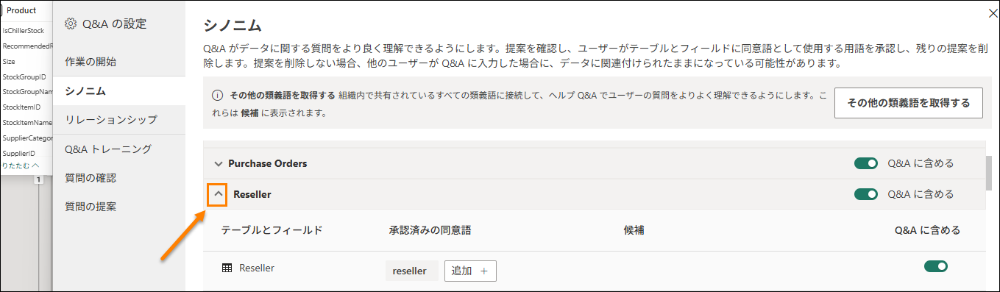

7. [追加 +] ボタンを使用して, **Fabrikam Friends** を追加します。

   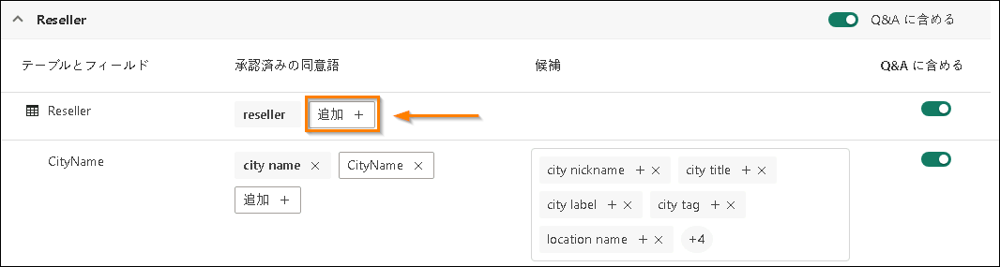

   

8. Copilot が追加した項目を評価し、それに応じてその他の提案が動的に追加されることに注目してください。

   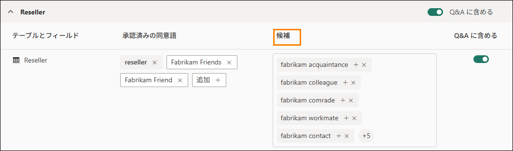

9. 次は、提案の 1 つを使用して、Reseller テーブルに別の同意語を追加しましょう。いずれかの提案をクリックします (**_Fabrikam Acquaintance_** など)。

   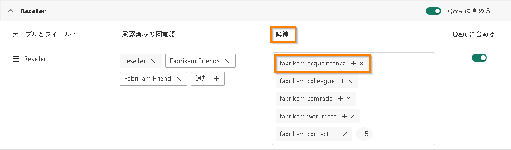

   同意語を追加するプロセスは非常に手間がかかり、時間をかけて徐々に改善するものです。Power BI Desktop ファイル内の他のテーブルや列を確認し、同意語をさらに追加してみてください。

10. よくできました。次は**リレーションシップ**を見ていきましょう。[Q&A の設定] メニューに移動します。

    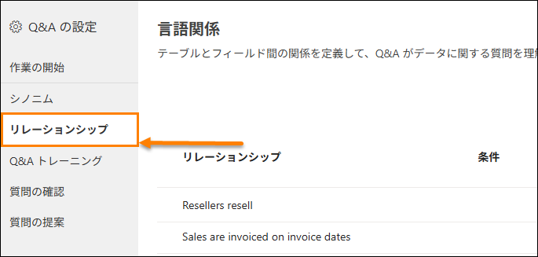

    言語的リレーションシップは、Q&A がデータに関する質問を理解できるように、テーブルやフィールド間の関係を定義します。これは、テーブル同士がデータ モデル内で接続されている仕組みに似ていますが、Copilot が言語的に理解できるような形で表現されている点が異なります。

    たとえば、リレーションシップを使用すると、あいまいさを解消できます。モデルの複数のテーブルに複数の日付フィールドが存在する場合、日付同士に関係性を追加することで、Copilot が文脈やテーブル間の接続に基づいてどの日付を使用すべきかを判断できるようになります。

    新しいリレーションシップを追加するには、まず下のスクリーンショットに示すように、[+ 新しいリレーションシップ] ボックスをクリックします。

    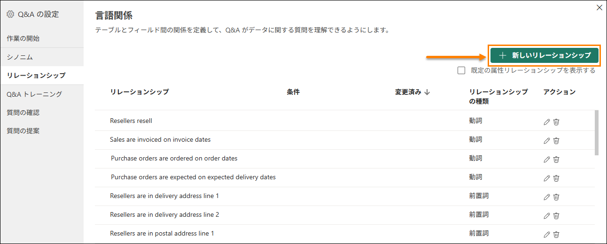

11. ここから、さまざまな言語的リレーションシップを作成できます。現在のオプションには、動詞、形容詞、名詞、前置詞、名前、関連付けなどがあります。使用可能なオプションの例については、以下のスクリーンショットを参照してください。

    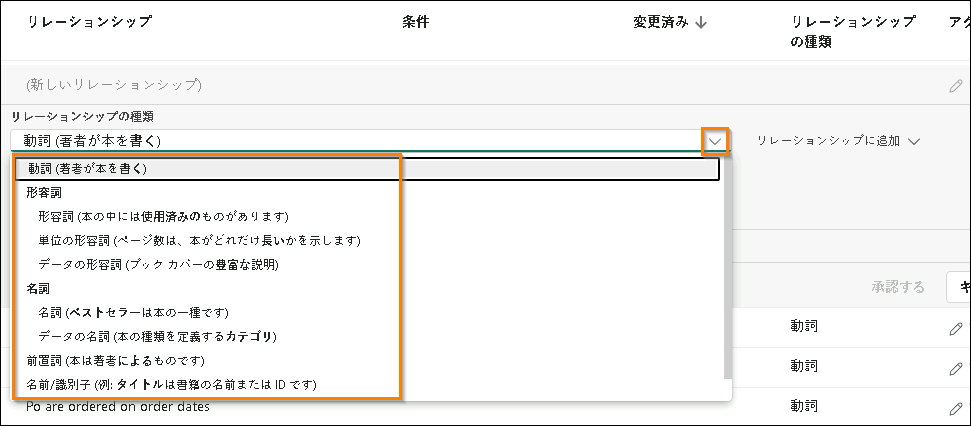

    **ℹ️ 重要**

    **言語的スキーマにおいて、リレーションシップは、Copilot が自然言語の質問に回答する際に、テーブル間のつながりをどのように理解するかを定義します。**"製品カテゴリ別の売上" や "地域別の注文数" などの質問をどのように解釈するかに影響します。リレーションシップが明確でないと、Copilot が複数のテーブルにわたる概念を結び付けるのに苦労する場合があります。これらを適切に定義することで、より円滑で直感的な会話が可能になります。

    このラボでは、モデルにリレーションシップは作成しません。同意語を追加する場合と同様に、これも手間のかかるプロセスであり、ユーザーが Copilot を使用してデータに対してどのようにクエリを実行し、言語的スキーマがその体験をどのように改善できるかについて理解が深まるにつれて、更新やメンテナンスが必要になります。

12. それでは、[Q&A の設定] の残りの要素を確認しましょう。**Q&A トレーニング** セクションを選択します。

    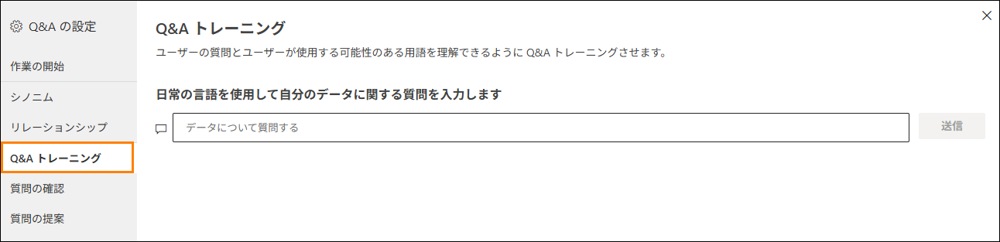

13. ここでは、ユーザーが使用する可能性がある質問や用語について理解できるよう、Q&A をトレーニングできます。

    Q&A に、**How many sales happen in january?** と質問をしてください。

    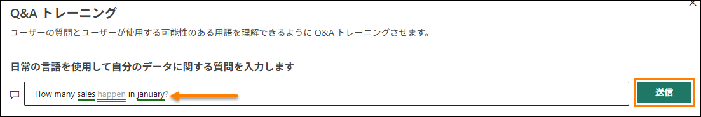

    Copilot が "happen" を不明な用語として認識しているのがわかります。これにより、このような表現を含む質問に対応できるよう、さらに調整を加えることができます。

    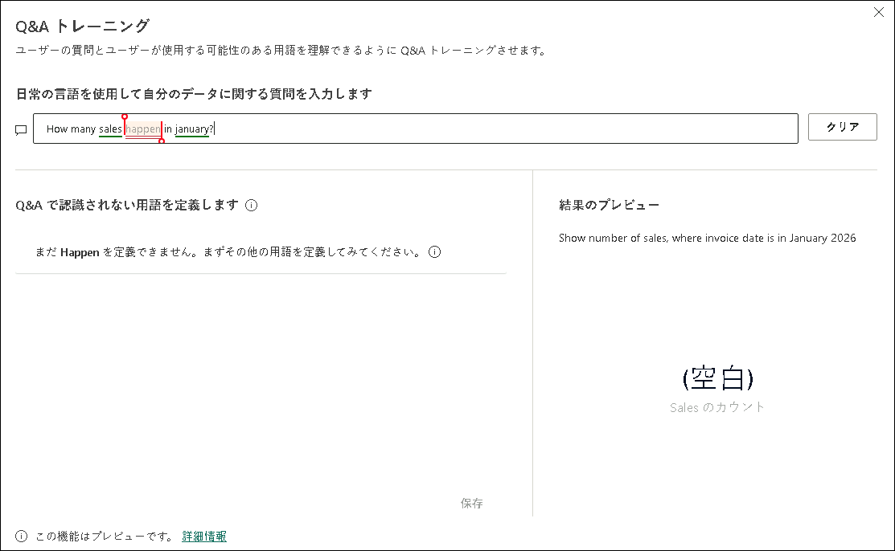

14. "What is the total sales for january 2022?" のような別のプロンプトも試して、結果を確認してみましょう。ここはテストする場所として最適です。

    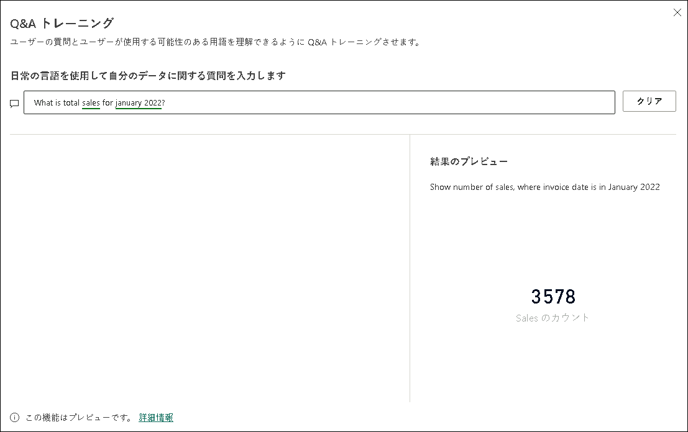

15. また、シノニムやリレーションシップの効果も確認できます。**What is sales by Fabrikam Friends?** と入力してください。

    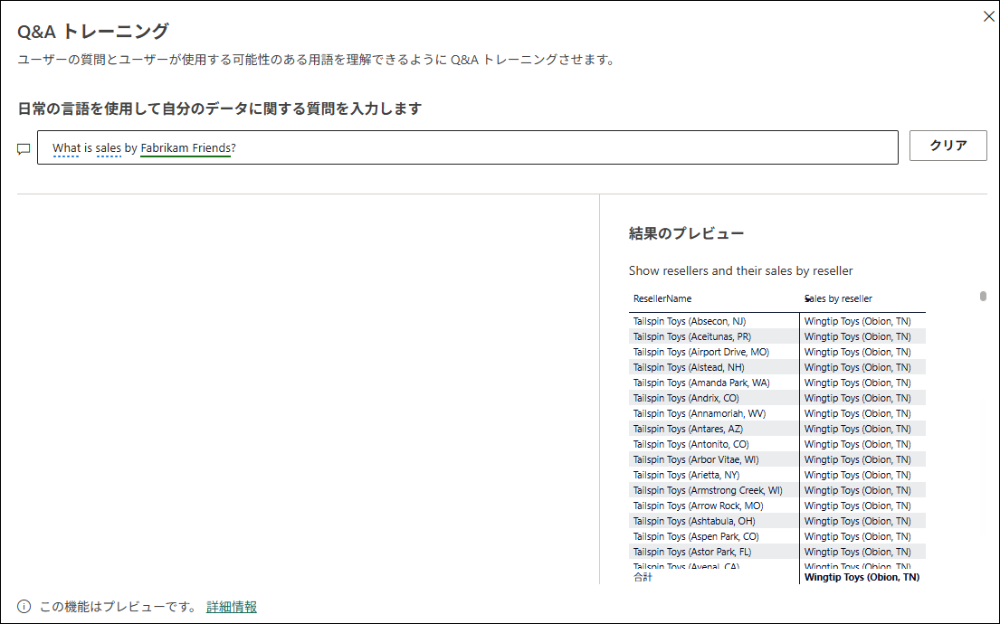

16. 次に、**質問の確認**に移動します。ここでは、テナント内でユーザーが入力した質問を確認し、今後の改善のために調整できます。

    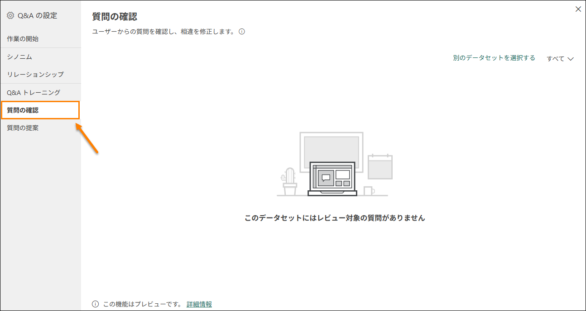

17. 最後に、**質問の提案**に移動します。ここでは、質問の提案を追加することで、ユーザーがデータを探索しやすくなります。

    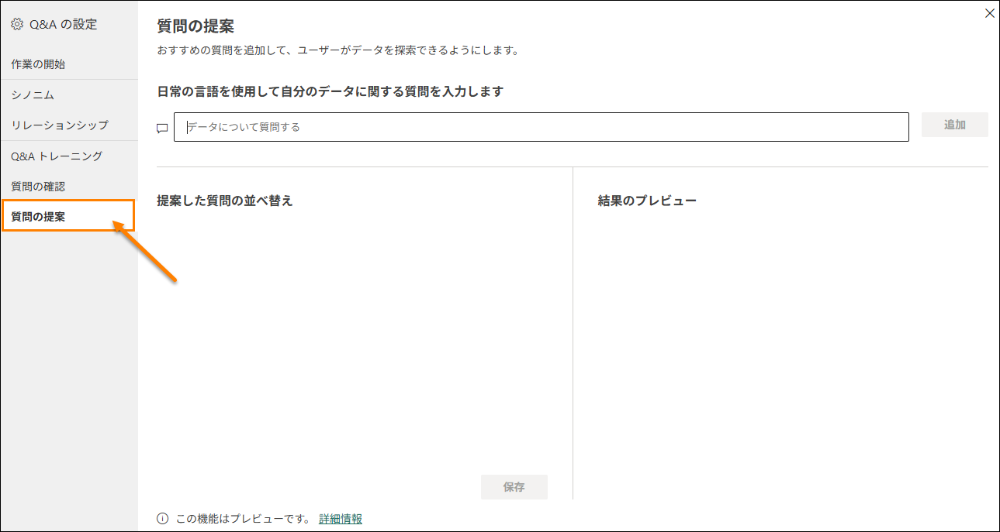

18. ユーザーを支援するために、[データについて質問する] ボックスを選択し、提案として **What is total sales by State?** と入力します。その後、[送信] を押すとプレビューを確認できます。

    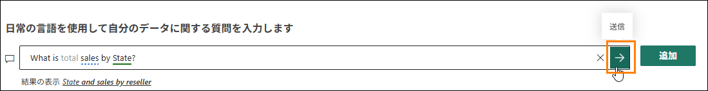

    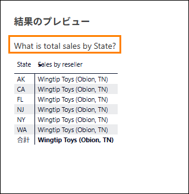

19. **追加**をクリックして提案を保存します。

    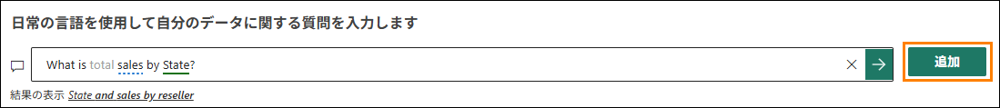

20. 結果を**保存**して、ラボ 2 を完了することができます。

    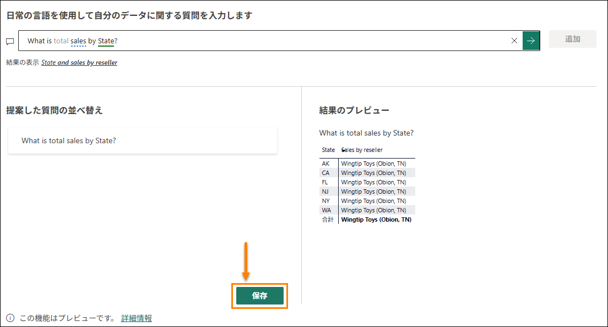

    このラボでは、Power BI のセマンティック モデルにおける、Copilot の自然言語での回答の質と精度を向上させるための、データ モデリングのベスト プラクティスについて説明しました。

Microsoft Fabric の次のステップに役立つリソースをいくつか以下に紹介します。

- メインの [Microsoft Fabric ドキュメント](https://learn.microsoft.com/en-us/fabric/)のすべての情報にアクセスする

- [ガイド付きツアー](https://aka.ms/Fabric-GuidedTour)を通じて Fabric を探索する

- [Microsoft Fabric の無料試用版](https://aka.ms/try-fabric)にサインアップする

- [Microsoft Fabric の Web サイト](https://aka.ms/microsoft-fabric)にアクセスする

- [Fabric の学習モジュール](https://aka.ms/learn-fabric)で新しいスキルを学ぶ

- [Fabric 入門編の無料の e-book](https://aka.ms/fabric-get-started-ebook) を読む

- [Fabric コミュニティ](https://aka.ms/fabric-community)に参加し、質問の投稿やフィードバックの共有を行い、他のユーザーから学びを得る

Copilot についてより掘り下げる、次の技術ドキュメントを参照してください。

- [Power BI の Copilot の概要 - Power BI | Microsoft Learn](https://learn.microsoft.com/en-us/power-bi/create-reports/copilot-introduction)

- [Power BI のスタンドアロン Copilot エクスペリエンス (プレビュー) – Power BI | Microsoft Learn](https://learn.microsoft.com/en-us/power-bi/create-reports/copilot-chat-with-data-standalone)

- [Microsoft Fabric Copilot の管理設定 | Microsoft Learn](https://learn.microsoft.com/en-us/fabric/admin/service-admin-portal-copilot)

- [Fabric データ エージェントの作成 (プレビュー) - Fabric データ エージェントの作成方法 | Microsoft Learn](https://learn.microsoft.com/en-us/fabric/data-science/concept-data-agent)

- [データ エージェントを構成するためのベスト プラクティス - Microsoft Fabric | Microsoft Learn](https://learn.microsoft.com/en-us/fabric/data-science/data-agent-configuration-best-practices)

- [Microsoft Fabric と Power BI の Copilot: FAQ - Microsoft Fabric | Microsoft Learn](https://learn.microsoft.com/en-us/fabric/fundamentals/copilot-faq-fabric)

© 2026 Microsoft Corporation. All rights reserved.

このデモ/ラボを使用すると、次の条件に同意したことになります。

このデモ/ラボで説明するテクノロジまたは機能は、ユーザーのフィードバックを取得し、学習エクスペリエンスを提供するために、Microsoft Corporation によって提供されます。ユーザーは、このようなテクノロジおよび機能を評価し、Microsoft にフィードバックを提供するためにのみデモ/ラボを使用できます。それ以外の目的には使用できません。このデモ/ラボまたはその一部を、変更、コピー、配布、送信、表示、実行、再現、発行、ライセンス、著作物の作成、転送、または販売することはできません。

複製または再頒布のために他のサーバーまたは場所にデモ/ラボ (またはその一部) をコピーまたは複製することは明示的に禁止されています。

このデモ/ラボは、前に説明した目的のために複雑なセットアップまたは インストールを必要としないシミュレーション環境で潜在的な新機能や 概念などの特定のソフトウェア テクノロジ/製品の機能を 提供します。このデモ/ラボで表されるテクノロジ/概念は、フル機能を表していない 可能性があり、最終バージョンと動作が異なることがあります。また、そのような機能や概念の最終版がリリースされない場合があります。物理環境でこのような機能を使用するエクスペリエンスが異なる場合もあります。

**フィードバック。** このデモ/ラボで説明されているテクノロジ、機能、概念に関するフィードバックを Microsoft に提供する場合、ユーザーは任意の方法および目的でユーザーのフィードバックを使用、共有、および商品化する権利を無償で Microsoft に提供するものとします。また、ユーザーは、フィードバックを含む Microsoft のソフトウェアまたはサービスの特定部分を使用したり特定部分とインターフェイスを持ったりする製品、テクノロジ、サービスに必要な特許権を無償でサード パーティに付与します。ユーザーは、フィードバックを含めるために Microsoft がサード パーティにソフトウェアまたはドキュメントをライセンスする必要があるライセンスの対象となるフィードバックを提供しません。これらの権限は、本契約の後も存続します。

Microsoft Corporation は、明示、黙示、または法律上にかかわらず、商品性のすべての保証および条件、特定の目的、タイトル、非侵害に対する適合性など、デモ/ラボに関するすべての保証および条件を拒否します。Microsoft は、デモ/ラボから派生する結果、出力の正確さ、任意の目的に対するデモ/ラボに含まれる情報の適合性に関して、いかなる保証または表明もしません。

**免責事項**

このデモ/ラボには、Microsoft Power BI の新機能と機能強化の一部のみが含まれています。一部の機能は、製品の将来のリリースで変更される可能性があります。このデモ/ラボでは、新機能のすべてではなく一部について学習します。
