# Microsoft Fabric Chat with your Data in a Day - ラボ 3

## 目次

- ドキュメントの構造
- シナリオ / 問題の説明
- 概要
- Copilot 用のデータを準備する
  - タスク 1: データ スキーマを簡略化する
  - タスク 2: AI への指示を追加する
  - タスク3: 確認済みの回答を作成する
  - タスク 4: 実際に試す
- 結び
- 参考資料

# ドキュメントの構造

このラボでは、実行する手順だけでなく、視覚的にわかりやすいように、手順に関連するスクリーンショットも提示されます。各スクリーンショットでは、ユーザーが注目する必要のある領域が、オレンジのボックスで強調表示されて示されます。

# シナリオ / 問題の説明

最近、Microsoft Fabric の Copilot を有効にして、ユーザーがより直感的にデータを操作できるようにしました。しかし、初期の使用では、Copilot が不正確な回答やわかりにくい回答を返す場合があることが判明しました。これらの問題は、過度に複雑なデータ モデル、あいまいな用語、セマンティック レイヤー内の定義の不明確さに起因しています。

Copilot の理解度と結果を改善するために、Power BI の AI データの準備機能を使用してデータ モデルを準備できることがわかりました。これには、スキーマの簡略化、AI 指示の追加、確認済みの回答の作成などが含まれており、Copilot をより正確でコンテキストに応じた応答に導くことができます。

**現在の課題**

- 不明確なメジャーと用語によって生じる Copilot 応答のあいまいさを軽減する。

- ビジネス固有の定義 (best-selling と highest selling など) を Copilot に確実に理解させる。

- 一貫性と信頼性を高めるために、よくある質問に対する確認済みの回答を用意する。

- 不必要または誤解を招くようなデータ要素への Copilot のアクセスを制限する。

# 概要

ここまで、Copilot の準備状況についてセマンティック モデルを評価する方法と、セマンティック モデルに関するベスト プラクティスを学びました。次に、これらのモデルを Copilot で使用できるように準備して次のステップに進みます。このラボでは、AI データの準備機能を使用して、スキーマを簡略化し、AI への指示を追加して、確認済みの回答を作成します。これらはすべて、Copilot がより正確でビジネスとの関連性の高い分析情報を提供するために役立ちます。

このラボを終了すると、次のことが学べます。

- Copilot の動作を導くためにデータ スキーマを簡略化する方法

- AI への指示を追加してビジネスに関する用語を明確化する方法

- Copilot の正確性を高めるために確認済みの回答を作成する方法

# Copilot 用のデータを準備する

このセクションでは、Copilot で使用するためのデータ モデルを準備します。これが必要な理由は、データ モデルに余分なメジャーや不明確な定義、あいまいな用語が含まれていると、Copilot が誤った回答や混乱を招く回答を返す場合があるためです。そのため、Power BI には **AI 用のデータを準備する**ボタンがあります。

## タスク 1: データ スキーマを簡略化する

1. クラス ファイルから、**CDIAD – Lab 03 - Star**t という名前の PBIX ファイルを開きます。

    

2. **ホーム** リボンにある [Copilot] ボタンをクリックします。

    

3. Copilot に **What reseller has the highest sales?** と入力し、**Enter** キーを押すか、**矢印**をクリックします。

    

4. 結果を以下のスクリーンショットに示します。これらは予想した結果ではありません。Copilot が使用したメジャーは [Reseller Sales] ですが、使用する必要があるのは [Sales by Reseller] です。

    **表示される候補:**

    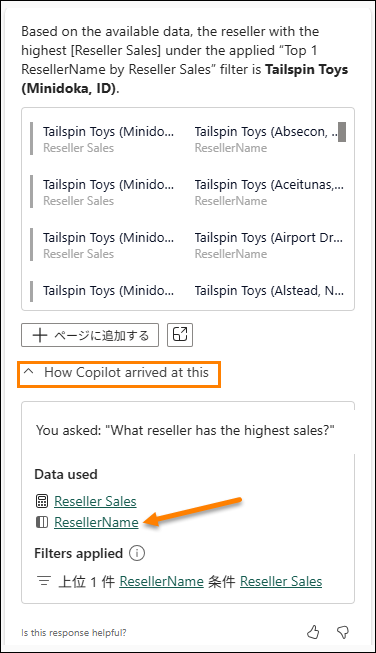

    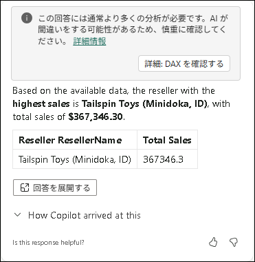

    

    その他の非表示フィルターがあることも示されています。これらについては後で調整します。

5. Power BI Desktop の AI データの準備機能を活用して、メジャー [Reseller Sales] を Copilot に対して非表示にします。ホーム リボンで **AI 用のデータを準備する**を選択します。

    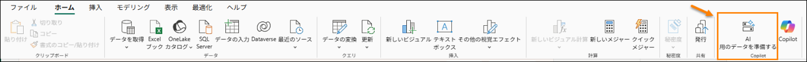

6. 新しいウィンドウが開き、**作業の開始**ページが表示されます。

    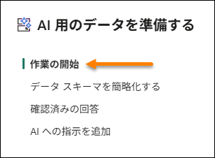

7. **データ スキーマを簡略化する**をクリックします。

    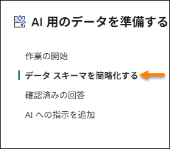

8. **>** アイコンをクリックして **Resellers** テーブルを展開します。Reseller Sales メジャーを使用すると Copilot であいまいな結果が作成される可能性があるため、スキーマからこのメジャーを削除して、Copilot での分析時に組み込まれないようにします。このメジャーを Copilot から除外すると、結果の一貫性が向上します。このチェック ボックスをクリックしてメジャー **Reseller Sales** をオフにしてから、**適用**をクリックします。*以下のスクリーンショットを参照してください。*

    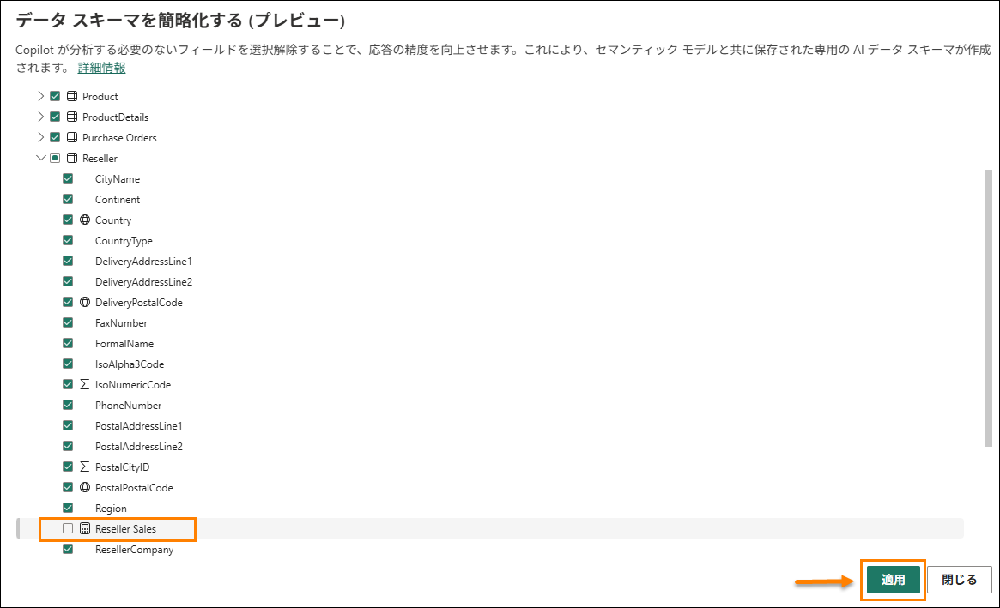

9. **閉じる**をクリックします。

    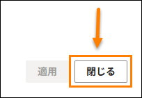

    **ℹ️ 重要**

    ベスト プラクティスとして、テーブル、列、メジャーの名前は、できるだけ説明的なものにします。そうすると、Copilot が質問に回答するときに、より一貫した正確な結果が作成されやすくなります。たとえば、このモデルには [Reseller Sales] という名前のメジャーと、[Sales by Reseller] という名前のメジャーがあります。これは Copilot にとって混乱を招くものであり、一貫性のない回答につながる可能性があります。このラボでは、このメジャーをスキーマから削除しましたが、他のシナリオではメジャーの名前を変更することも可能です。

10. Copilot を閉じるには、また再び開くには、**ホーム** リボンの [Copilot] ボタンをクリックします。

    

    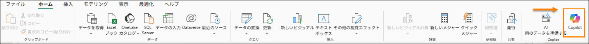

11. Copilot に **What reseller has the highest sales?** と入力し、**Enter** キーを押すか、**矢印**をクリックします。

    

12. Copilot からの応答を得た後、**How Copilot arrived at this**セクションをクリックします。

    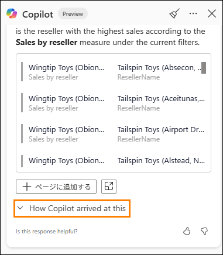

13. すると、この回答を見つけ出すために使用されたメジャーが、**Sales by reseller または SalesNet** であったことがわかります。これは完璧な処理です。Copilot は、使用できる可能性はあるが望ましくないメジャーを回避するようにトレーニングされています。Copilot には非決定的な特性があるため、異なる結果がここに表示される可能性があります。ここで、続けて AI 用のデータを準備することで、より一貫性のあるエクスペリエンスを実現できます。

    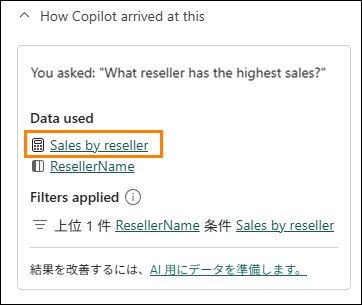

    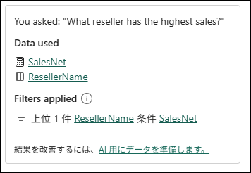

14. ベスト プラクティスとして、Copilot を混乱させる可能性があるテーブル、列、メジャーを非表示にすることをお勧めします。

    **ℹ️ 重要**

    Power BI では、特定のフィルター コンテキストにおいて特定の目的に使用される、ヘルパー メジャーや 1 回限りのメジャーを作成することが一般的です。Copilot に対して非表示にすることが必要なメジャーが多数ある場合は、非表示にするメジャーを格納する専用のテーブルを作成すると効果的です。そうするとスキーマの更新プロセスが大幅に簡素化されます。現時点では、メジャー フォルダーの非表示はサポートされていません。

15. また、Reseller テーブルの State ではなく、customer テーブルの State が返された場合もありました。customer テーブルは、このコンテキストで使用するのではなく、非常に限定されたシナリオでのみ使用する必要があります。このテーブルは Copilot に対して混乱を招く可能性があるため、非表示にします。

16. ホーム リボンで、**AI 用のデータを準備する**をクリックします。

17. 左側のナビゲーション バーから**データ スキーマを簡略化する**を選択します。

18. Customer を選択解除します。Customer テーブルのチェックを外しても、テーブルは引き続きセマンティック モデル内に存在し、レポート、ビジュアル、または DAX 計算を作成する必要があるときに使用できます。ただし、分析中は Copilot によって無視されます。必ず**適用**をクリックしてから、**閉じる**をクリックします。

    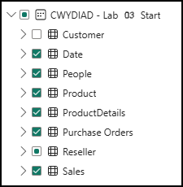

    

## タスク 2: AI への指示を追加する

AI への指示を追加することは、AI 用のデータを準備するうえで非常に重要なステップです。適切に定義された AI への指示を追加することで、ビジネス コンテキスト、用語、分析の優先順位をモデルに直接埋め込み、Copilot がセマンティック モデルをより深く理解できるようにすることができます。これにより Copilot で、よりスマートに、より速く、より意図に沿った分析情報の生成、質問への回答、ビジュアルの構築が可能になります。

このラボでは、AI への指示を使用して、Copilot に best-selling (ベスト セラー) 品目を質問したときに返される内容を定義します。

1. Copilot を開いて次の質問を行います: **What are the top 5 best-selling products**。

    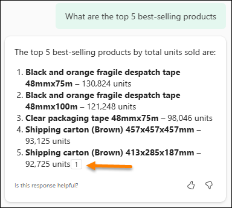

2. 上記と同じ結果が表示された場合は、参照リンクをクリックして、これらの結果の元となったビジュアルを開きます。

    

3. この結果は正しいように見えますし、おそらく正しいでしょう。しかし、"*best selling*" 製品と top selling 製品を区別するものは何でしょうか? 数量か、販売額か、最高の利益率、それとも他の基準でしょうか?

4. ここでは、エンド ユーザーに期待どおりの正しい結果を返すために、Copilot が明確化のための質問をするようにしましょう。**AI 用のデータを準備する**ボタンをもう一度クリックします。

    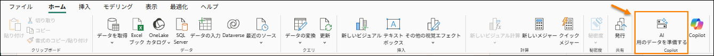

5. **AI への指示を追加**に移動します。

    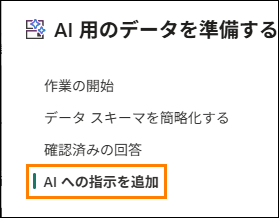

6. Copilot に対して、ユーザーが **highest、most、または best-selling** について質問するたびに、ユーザーが意図する定義を明確にするための指示を追加します。

7. 次のように入力します:

    ***If asked about "highest" or ”most” or "best-selling" product, first clarify if the user wants product by unit sold or product by total sales value.***

    その後、**適用**をクリックしてから、**閉じる**をクリックします。

    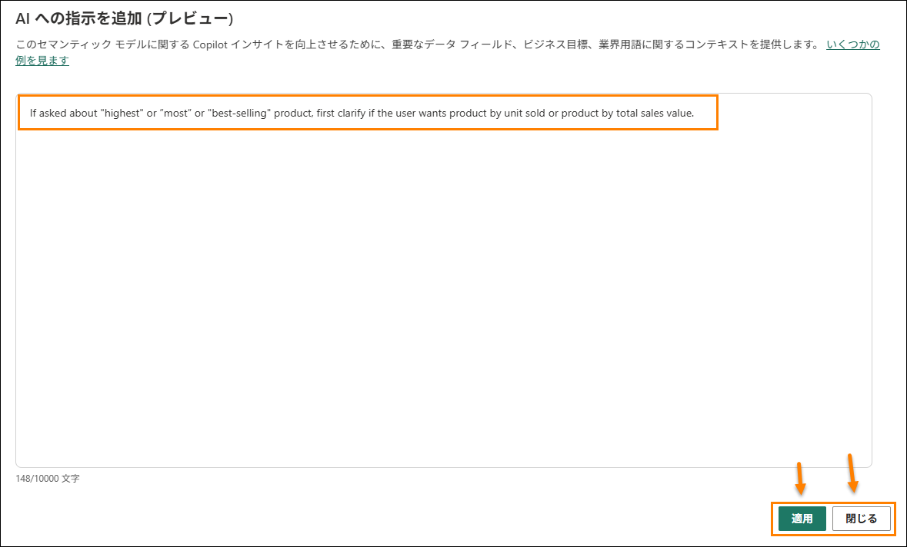

8. Copilot ペインを開きます。既に開いている場合は、Copilot を閉じてから再度開きます。そうすることで、行った変更が確実に適用されます。

    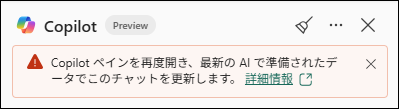

9. Copilot に**What’s our best-selling product**? と質問します。

    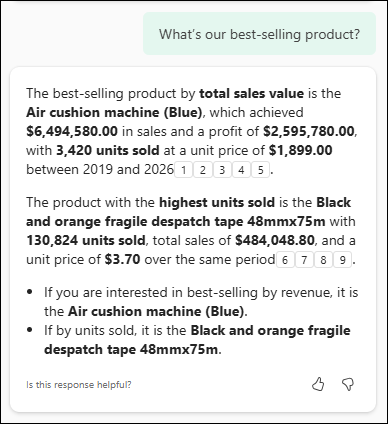

10. best-selling の意味を明確にするためにエンド ユーザーに確認するという指示を Copilot に与えたため、ここでは 2 つのオプションが表示されます。また、明確化のための質問や追加情報を求める確認メッセージが表示される場合もあります。

11. 確認メッセージに **units sold** と入力し、Enter キーを押します。これにより、Copilot からより具体的な回答が返されます。

    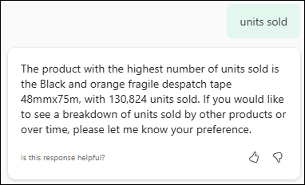

12. 組織内のすべてのユーザーが best-selling と highest selling の違いを認識していると仮定しましょう。その場合、AI への指示を使用して Copilot に定義を与えるだけで済みます。

13. **AI 用のデータを準備する**ダイアログを再度開き、[AI への指示を追加] に移動して、現在の指示を以下のものに置き換えます:

    - **Best-selling = most units sold**

    - **Highest selling = total sales value**

        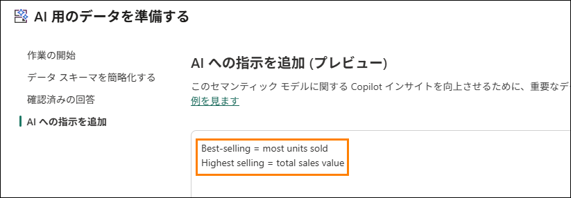

14. [適用] をクリックしてから、[閉じる] をクリックします。

15. Copilot を閉じ、再度開きます。**What’s our best-selling product**? と確認プロンプトに入力し、Enterキー を押します。

    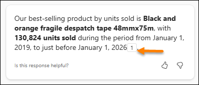

    **ℹ️ 重要**

    **Power BI Desktop では公開の遅延がないため、AI への指示のテストが高速になります。** そのため、サービスに公開する前に、ローカルで指示をテストして改良することをお勧めします。公開することによって遅延が発生し、場合によっては変更が直ちに反映されず、混乱が生じることがあります。Desktop では、反復処理とデバッグのためのより応答性の高い環境が提供されます。

    これで Copilot は期待した回答に至り、**best-selling** と **highest selling** を区別できます。このセクションの冒頭で述べたように、AI への指示を明確に定義すればするほど、Copilot の応答が向上します。

16. 上記と同じ回答を得た場合は、参照リンクをクリックして、結果がどこから得られたのかを確認します。

    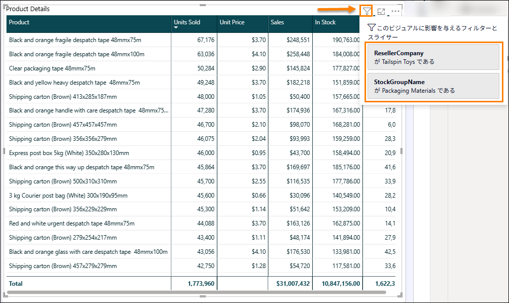

17. 結果は異なる場合がありますが、返された結果が既存のビジュアルから取得されていることに注意してください。詳しく調べると、このビジュアルが実際にはフィルター処理されていることがわかります。詳しく調べると、このビジュアルが実際にはフィルター処理されていることがわかります。つまり、Copilot から誤解を招くような応答を受け取ったことになります。具体的には、この要求でフィルターの使用は求めておらず、Copilot も結果がフィルター処理されていることを明示していませんでした。

18. [AI 用のデータを準備する] に戻り、**AI への指示**に移動します。以下の指示を追加します。

    **If you use an existing report visual to answer a user request, always let the user know about any existing filters on the visual.**

    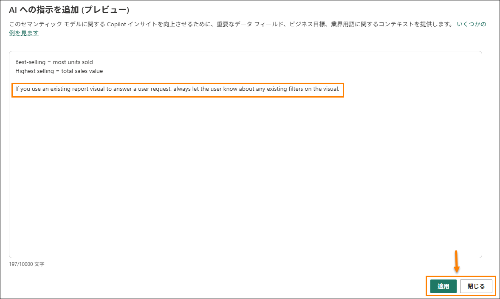

19. もう一度 Copilot に質問します: **What’s our best-selling product?**

    

20. 今回は、参照されているビジュアルが 1 つ返され、Copilot は、そのビジュアルの ResellerCompany が Tailspin Toys でフィルター処理されていることを正しく示している点に注目してください。

    

    **ℹ️ 重要**

    AI への指示はまだプレビュー段階の機能であり、急速に変化していることに留意することが重要です。引き続きさまざまな指示を試して、何がうまく機能し、何がうまく機能しないかを確認してください。

21. エンド ユーザーにスタンドアロン Copilot エクスペリエンスを展開する際には、信頼関係を構築したいと考えています。そのための 1 つの方法は、Copilot が推測しないようにすることです。質問内容を理解できない場合は推測しないよう Copilot に伝える指示を追加できます。

22. **AI 用のデータを準備する**を開き、以下の指示を追加し、[適用] をクリックしてから [閉じる] をクリックします。

    - **Best-selling = most units sold**

    - **Highest selling = total sales value**

    **If you use an existing report visual to answer a user request, always let the user know about any existing filters on the visual.**

    ***If you do not understand what is being asked, do NOT guess, instead ask for clarification.***

    - これで、Copilot は、明確化のための質問をする可能性が高くなります。

    - Copilot に確信がない場合に、AI への指示がどのように機能するかを以下に示します。

        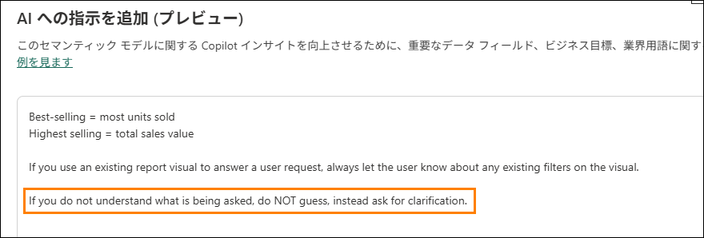

23. Copilot を再度開いて、次のような混乱を招く質問を行います: **Total sales by something what is that?**

    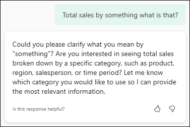

24. この例では、上のスクリーンショットからわかるように、Copilot は total sales が何を示しているかわからないため、何を探しているのかを明確にするようユーザーに求めます。

25. 別の種類の指示として、レポートのビジュアルに関するガイダンスを追加することもできます。たとえば、折れ線グラフに日付を常に表示する場合や、国別の売上を表示する際に Copilot で常にマトリックスが返されるようにする場合などに、これらの指示を追加できます。

26. AI への指示を追加しないと、Copilot からどのようなビジュアルが返されるかは保証されません。たとえば、**Show total sales measure by year** と指示したとします。現時点では折れ線グラフが返されます。

    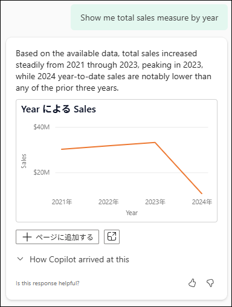

27. では、AI への指示を追加してどうなるかを見てみましょう。**AI 用のデータを準備する**を開き、以下の指示を追加します。

    **## Visual Guidance**

    **ℹ️ 重要**

    AI 指示を書くとき、"##" は Markdown 言語の形式であり、必須ではありませんが、Copilot と Fabric データ エージェントの両方の組織にとって良い方法です。

    ***When showing the total sales measure by year always use a column chart.***

    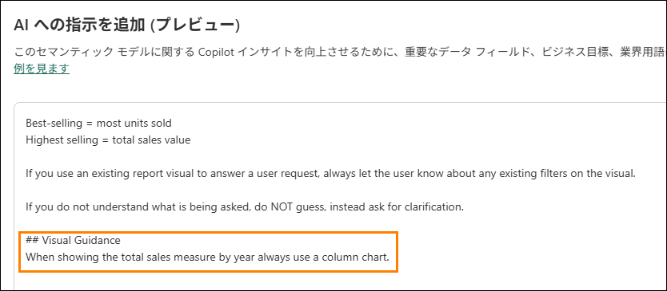

28. Copilot を再度開いて、次の質問を行います: **Show total sales measure by year.**

    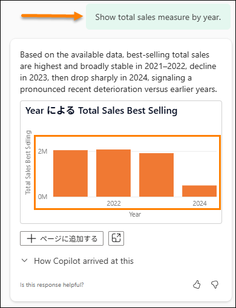

    Copilot は DAX を記述して答えを導き出し、テーブルとして表示することができます。いつでも次のようにプロンプトを入力できます: **Can you make this into a column chart?** または、**AI への指示**の文言を変更できます。

    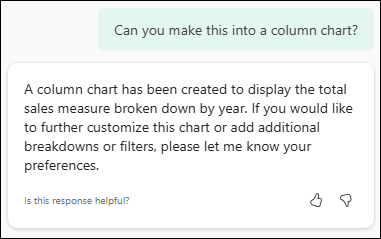

29. 別の例として、今度はメジャーの定義を見てみましょう。Copilot Chat ウィンドウに戻って次の質問を行います: **How many purchase orders do we have?**

    

30. 結果が正しいことに注目してください。また、**How Copilot arrived at this**領域を展開すると、明示的なメジャーが使われていることを確認できます。この特定のメジャーについて、Copilot で支援された説明を作成したことを覚えているでしょう。しかし、DAX がどのように計算されたかについて説明を求めましょう。

    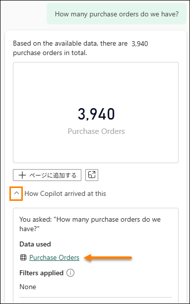

31. このように質問します: **Can you explain the DAX used?**

    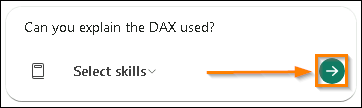

32. この応答は、Copilot が DAX 式に直接アクセスすることについての制限を指摘しており、特別に注目すべきものです。回答自体は、"likely" (可能性として)、"if" (もし)、"typically" (通常は)、"potentially" (潜在的に) のような単語を使用しており、非常に*生成*型の特性を表しています。これは、***場合によっては*** TMDL ビューと AI への指示を利用して解決できます。

    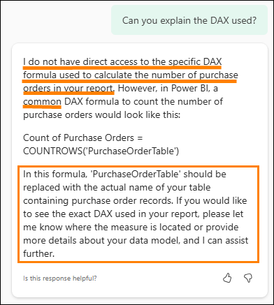

33. 左側のナビゲーション ウィンドウで、**TMDL** ビュー を選択します。

34. 画面下部にある [+] ボタンを押してスクリプトを作成します。

    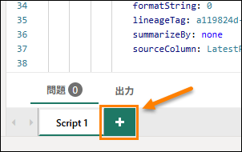

35. このデータ モデルの DAX についてユーザーが明確に理解できるように、単一のメジャーを取得します。**Purchase Order** メジャーをスクリプトにドラッグします。

    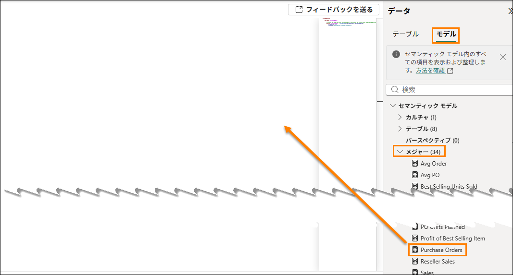

36. 結果として生成される TMDL スクリプトは、AI への指示に追加するのに適したリソースです。このビューには、説明も表示されていることがわかります。ここで、次のようにメジャーの説明とメジャー自体をコピーします。

    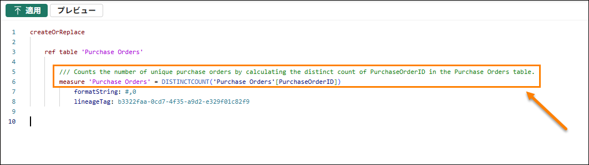

37. 次に、**AI 用のデータを準備する**のレポート ビューに戻り、次に示すように TMDL の記述とメジャーの詳細を **AI への指示を追加**ビューに追加します。それから**適用**をクリックします。

    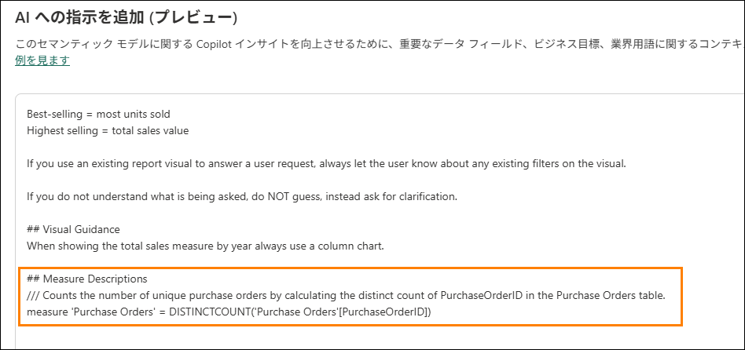

38. Copilot ペインを再度開いて指示を更新し、前と同じように質問します: **How many purchase orders do we have?**

    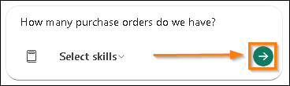

39. ここまでは順調です。これは予想どおりの動作で、待ち望んでいたのは次の質問です。

    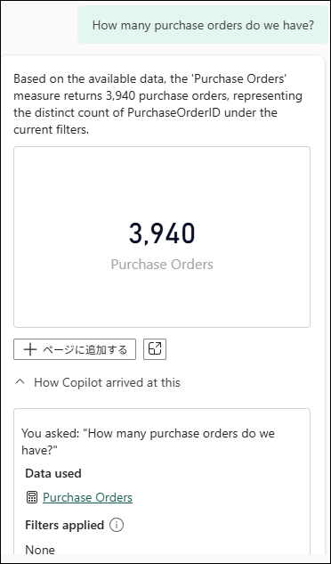

40. 次に、明確化を求めます: **Can you explain the DAX used in the Purchase Orders measure?**

    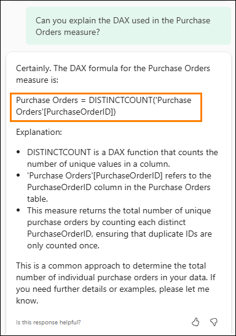

41. 残念ながら、Copilot は依然として推測をしています (それでも、実際の DAX コードが何であるかは正しく推測しています)。DAX コードを AI への指示に追加すると、場合によっては機能することがありますが、現時点ではまだプレビュー段階であるため、一貫性がありません。

42. ラボの前半で、Total Sales for the Southeast について質問しました。Copilot は Reseller テーブルの Sales Territory 列を使用せず、代わりにどの States が Southeast 地域に相当するかを推測しました。このセクションでは、Copilot が地域について質問されたときに Sales Territory を使用するように AI への指示を追加します。

43. **AI 用のデータを準備する**を開き、以下の指示を追加します。

    **If a user asks about region or territory related data, for example Southeast, use the Sales Territory column from the Reseller table.**

    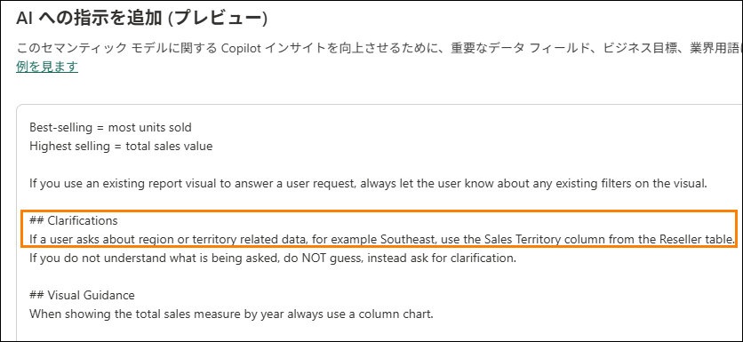

44. Copilot を開いて次のプロンプトを記述します: **Show total sales for the Southeast.**

    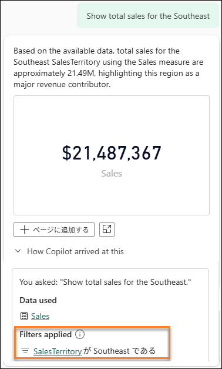

45. 前のセクションでは、データ スキーマから Customer テーブルを削除しました。

    この組織では、customers (顧客) は製品を購入して販売する resellers (再販業者) として明確に定義されています。再販業者から購入する最終消費者は、顧客として分類されません。Copilot が Customers について質問されたときに Resellers を返すようにするために、この区別をする必要があります。

46. [AI 用のデータを準備する] を開き、以下を入力します。

    **Customers = Resellers**

    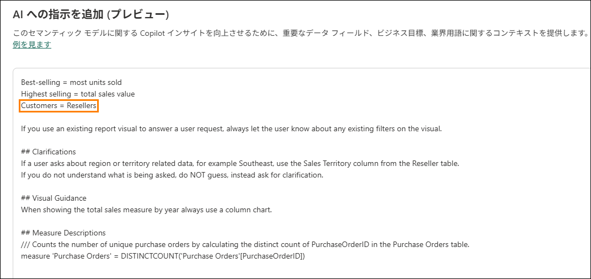

47. Copilot のプロンプト欄で、次のように質問します: **What customer sold the most products in 2021?**

    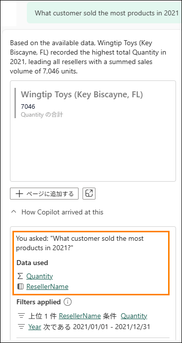

    これは作成された DAX 計算にも表示されます。

    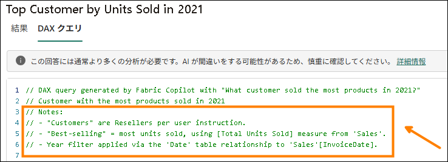

    Copilot が正しく指示を受け、Customer を表すために Reseller を使用していることに注意してください。

## タスク3: 確認済みの回答を作成する

**ℹ️ 重要**

確認済みの回答は、設定したフレーズと意味的に類似していると判断されたあらゆる語句に一致します。このため、ユーザーが質問するであろうフレーズの可能なバリエーションすべてを設定する必要はありません。代わりに、明確でわかりやすいトリガー フレーズを設定することで、類似した任意のフレーズがユーザーに対してトリガーされるようになります。

確認済みの回答を追加して、データ準備を次のレベルに進めましょう。確認済みの回答を使用すると、モデル作成者はビジュアルを選択し、フレーズを選んで、ユーザーが質問したときに、そのビジュアルを確認済みの回答として表示できます。確認済みの回答は、プロンプトが正確な確認済みの回答を返さない場合でも、Copilot がモデルに関するコンテキストを学習し、より正確な回答を提供するのにも役立ちます。

1. 最初の例として、**Top state for sales** に対する確認済みの回答を作成します。

2. 現時点では、Copilot に **What state has the most sales?** と質問すると、質問は必ずしも意図したとおりに解釈されません。これは、"sales" という単語が、モデル内とレポート内のさまざまな文脈で参照されるためです。

3. この例では、Copilot が常に予想どおりの応答を返すようにします。

4. 今度は、[AI 用のデータを準備する] ダイアログからは**開始しません**。[AI 用のデータを準備する] ダイアログの [確認済みの回答] タブを開くと、使用可能なものがないことがわかります。

    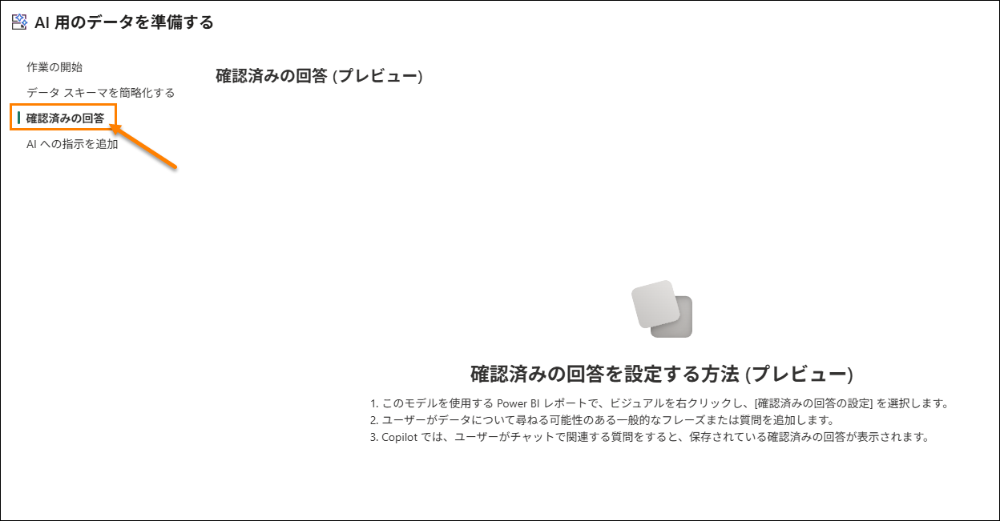

5. 代わりに、レポートのビジュアルから開始します。

6. [AI 用のデータを準備する] ウィンドウを閉じ、**Product detail** ページに移動します。

    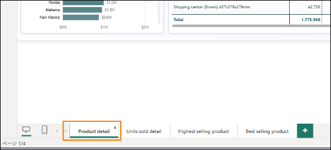

7. 州別の販売の棒グラフをクリックし、右上隅にある省略記号 (**...**) をクリックします。

    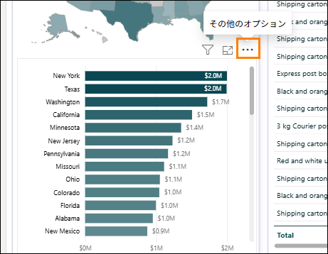

8. ドロップダウンから**確認済みの回答を設定する**を選択します。

    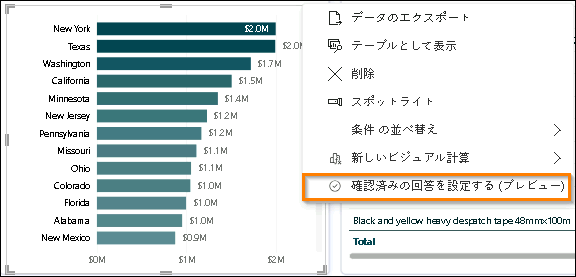

9. Copilot の提案を選択するか、独自のカスタム フレーズを入力して、フレーズを設定できます。

10. [フレーズを入力してください] ボックスに **State with the highest sales** と入力し、**追加**をクリックします。*以下のスクリーンショットを参照してください。*

    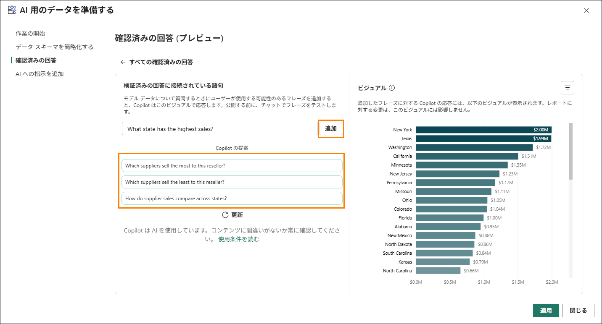

11. [適用] をクリックしてから、[閉じる] をクリックします。

    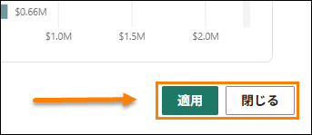

12. Copilot ペインを閉じて再度開きます。

13. Copilot に質問します: **What state has the highest sales?**

    

14. 質問に対して正しい確認済みの回答が返されます。

    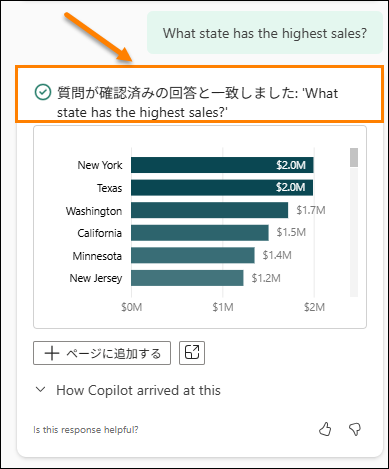

15. 偽陽性についてはどうでしょうか? 確認済みの回答を使用するべきではない質問を試して、どうなるかを見てみましょう。Copilot で、次のプロンプトを入力します: **What state is selling the most of the highest selling product?**

    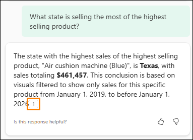

16. これは完璧な動作です。応答はレポート内の別のビジュアルを参照しています。具体的には、top selling product に絞り込まれたビジュアルを参照しています。また、応答はこれまでの AI への指示に従っていて、返されたビジュアルに適用されているフィルターを通知しています。

17. 確認済みの回答をもう 1 つ追加しましょう。今度は **best selling product** を表示します。

18. Best Selling Product のレポート ページをクリックします。

    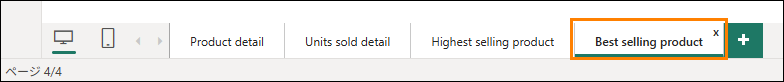

19. 次に、上部にあるカードのビジュアルを見つけて、省略記号 **(...)** をクリックし、**確認済みの回答を設定する**を選択します。

    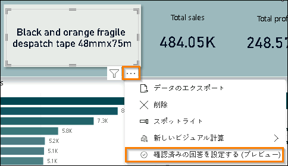

20. このラボの前半で、AI への指示を追加して、best selling は合計ユニット数であり、highest selling は合計販売額であることを AI に伝えました。確認済みの回答のフレーズと AI への指示を正しく合致させたいと思います。

21. 今度はフレーズを 2 つ追加します。それらは Copilot の提案に表示される可能性もあれば、表示されない可能性もあります。最初に、**Which Product has sold the most units?** のフレーズを追加し、その後、[追加] をクリックします。

    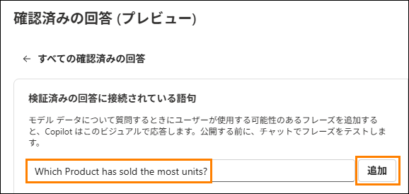

22. [適用] をクリックします。

    

23. フレーズをもう 1 つ追加するために、**Copilot の提案**の横にある [+] アイコンをクリックします。フレーズ **What is the best-selling product?** または類似のフレーズを追加し、[追加] をクリックします。

    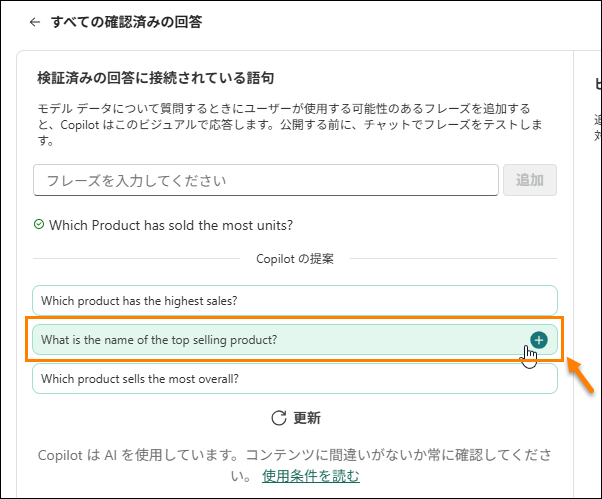

24. これで、以下のスクリーンショットに示すように、両方のフレーズがレポート ビジュアルに関連付けられました。

    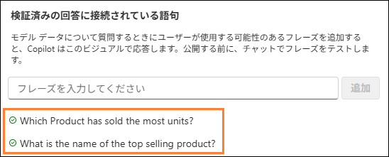

25. [適用] をクリックしてから [閉じる] をクリックします。

26. お疲れさまでした。このセクションでは、レポートのビジュアルに確認済みの回答を追加する方法を学習します。さらに、複数のフレーズを追加してユーザーの質問を個々のレポート ビジュアルに関連付ける方法も学習しました。

## タスク 4: 実際に試す

ラボの時間が許せば、このラボで学習した **AI データの準備**機能を引き続き確認してください。

1. 最初に、何か知りたいことを Copilot に質問します。その結果が希望どおりまたは予想どおりではなかった場合は、データ スキーマ、確認済みの回答、または AI 指示を使用するだけで、希望する結果を確実に得る方法について考えてみましょう。

## 結び

お疲れさまでした。ラボの「AI 用のデータを準備する」セクションを完了しました。

# 参考資料

Chat With Your Data in a Day (CDIAD) では、Fabric ワークスペースでスタンドアロン Copilot を使用する際に重要な機能の一部を紹介します。

サービスのメニューにあるヘルプ (?) セクションには、いくつかの優れたリソースへのリンクがあります。表示されるビューはユーザーが現在使用しているエクスペリエンスによって異なるため、以下のスクリーンショットとはオプションが異なる場合があります。

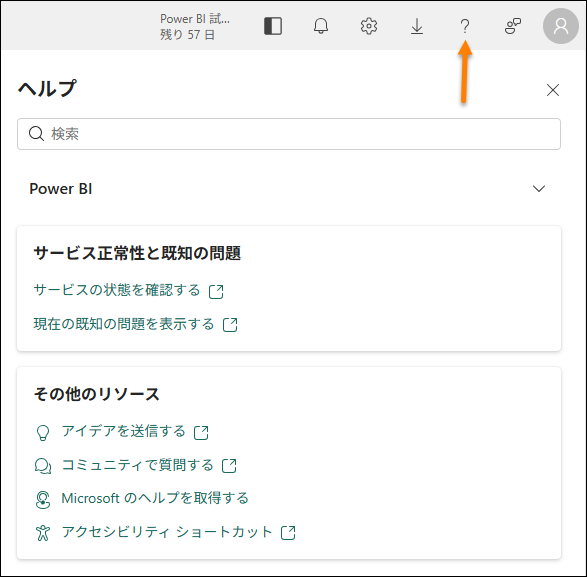

Microsoft Fabric の次のステップに役立つリソースをいくつか以下に紹介します。

- メインの [Microsoft Fabric ドキュメント](https://learn.microsoft.com/en-us/fabric/)のすべての情報にアクセスする

- [ガイド付きツアー](https://aka.ms/Fabric-GuidedTour)を通じて Fabric を探索する

- [Microsoft Fabric の無料試用版](https://aka.ms/try-fabric)にサインアップする

- [Microsoft Fabric の Web サイト](https://aka.ms/microsoft-fabric)にアクセスする

- [Fabric の学習モジュール](https://aka.ms/learn-fabric)で新しいスキルを学ぶ

- [Fabric 入門編の無料の e-book](https://aka.ms/fabric-get-started-ebook) を読む

- [Fabric コミュニティ](https://aka.ms/fabric-community)に参加し、質問の投稿やフィードバックの共有を行い、他のユーザーから学びを得る

Copilot についてより掘り下げる、次の技術ドキュメントを参照してください。

- [Power BI の Copilot の概要 - Power BI | Microsoft Learn](https://learn.microsoft.com/en-us/power-bi/create-reports/copilot-introduction)

- [Power BI のスタンドアロン Copilot エクスペリエンス (プレビュー) – Power BI | Microsoft Learn](https://learn.microsoft.com/en-us/power-bi/create-reports/copilot-chat-with-data-standalone)

- [Microsoft Fabric Copilot の管理設定 | Microsoft Learn](https://learn.microsoft.com/en-us/fabric/admin/service-admin-portal-copilot)

- [Fabric データ エージェントの作成 (プレビュー) - Fabric データ エージェントの作成方法 | Microsoft Learn](https://learn.microsoft.com/en-us/fabric/data-science/concept-data-agent)

- [データ エージェントを構成するためのベスト プラクティス - Microsoft Fabric | Microsoft Learn](https://learn.microsoft.com/en-us/fabric/data-science/data-agent-configuration-best-practices)

- [Microsoft Fabric と Power BI の Copilot: FAQ - Microsoft Fabric | Microsoft Learn](https://learn.microsoft.com/en-us/fabric/fundamentals/copilot-faq-fabric)

© 2026 Microsoft Corporation. All rights reserved.

このデモ/ラボを使用すると、次の条件に同意したことになります。

このデモ/ラボで説明するテクノロジまたは機能は、ユーザーのフィードバックを取得し、学習エクスペリエンスを提供するために、Microsoft Corporation によって提供されます。ユーザーは、このようなテクノロジおよび機能を評価し、Microsoft にフィードバックを提供するためにのみデモ/ラボを使用できます。それ以外の目的には使用できません。このデモ/ラボまたはその一部を、変更、コピー、配布、送信、表示、実行、再現、発行、ライセンス、著作物の作成、転送、または販売することはできません。

複製または再頒布のために他のサーバーまたは場所にデモ/ラボ (またはその一部) をコピーまたは複製することは明示的に禁止されています。

このデモ/ラボは、前に説明した目的のために複雑なセットアップまたはインストールを必要としないシミュレーション環境で潜在的な新機能や概念などの特定のソフトウェア テクノロジ/製品の機能を提供します。このデモ/ラボで表されるテクノロジ/概念は、フル機能を表していない可能性があり、最終バージョンと動作が異なることがあります。また、

そのような機能や概念の最終版がリリースされない場合があります。物理環境でこのような機能を使用するエクスペリエンスが異なる場合もあります。

**フィードバック。**このデモ/ラボで説明されているテクノロジ、機能、概念に関するフィードバックを Microsoft に提供する場合、ユーザーは任意の方法および目的でユーザーのフィードバックを使用、共有、および商品化する権利を無償で Microsoft に提供するものとします。また、ユーザーは、フィードバックを含む Microsoft のソフトウェアまたはサービスの特定部分を使用したり特定部分とインターフェイスを持ったりする製品、テクノロジ、サービスに必要な特許権を無償でサード パーティに付与します。ユーザーは、フィードバックを含めるために Microsoft がサード パーティにソフトウェアまたはドキュメントをライセンスする必要があるライセンスの対象となるフィードバックを提供しません。これらの権限は、本契約の後も存続します。

Microsoft Corporation は、明示、黙示、または法律上にかかわらず、商品性のすべての保証および条件、特定の目的、タイトル、非侵害に対する適合性など、デモ/ラボに関するすべての保証および条件を拒否します。Microsoft は、デモ/ラボから派生する結果、出力の正確さ、任意の目的に対するデモ/ラボに含まれる情報の適合性に関して、いかなる保証または表明もしません。

**免責事項**

このデモ/ラボには、Microsoft Power BI の新機能と機能強化の一部のみが含まれています。一部の機能は、製品の将来のリリースで変更される可能性があります。このデモ/ラボでは、新機能のすべてではなく一部について学習します。
