# Microsoft Fabric Chat with your Data in a Day - ラボ 4

## 目次

- ドキュメントの構造
- シナリオ / 問題の説明
- 概要
- スタンドアロン Copilot エクスペリエンス
- 設定: 以降のラボ用のワークスペース設定
  - タスク 1: スタンドアロン Copilot エクスペリエンスを探索する
  - タスク 2: スタンドアロン Copilot でプロンプトを記述する
  - タスク 3: レポートで見る機能を探索する
  - タスク 4: 探索
  - タスク 5: 確認済みの回答
  - タスク 6: Copilot がこれに至った経緯 (HCAAT)
  - タスク 7: Copilot によって生成された DAX クエリからのデータ回答
  - タスク 8: Copilot でのコンテキストの切り替え
  - タスク 9: セマンティック モデルから Copilot でのビジュアル作成
  - タスク 10: 一般的な Copilot エクスペリエンス
- 参考資料

# ドキュメントの構造

このラボでは、実行する手順だけでなく、視覚的にわかりやすいように、手順に関連するスクリーンショットも提示されます。各スクリーンショットでは、ユーザーが注目する必要のある領域が、オレンジのボックスで強調表示されて示されます。

# シナリオ / 問題の説明

ここまでお疲れさまでした。一般的に受け入れられているベスト プラクティスをデータ モデルに実装する方法と、AI データの準備機能を使用する方法を学びました。次に、 Microsoft Fabric のスタンドアロン Copilot エクスペリエンスについて詳しく確認します。

あなたの組織は、他の多くの組織と同様に、膨大な数のレポートと、多数のワークスペースを含むセマンティック モデルを使用しています。適切なレポートやデータを見つけることは、エンド ユーザーにとって困難です。スタンドアロン Copilot エクスペリエンスを活用して、ユーザーによる採用を増やし、分析情報を得るまでの時間を組織全体で短縮できます。

**現在の課題**

- **断片化された検出エクスペリエンス:** ユーザーは、Fabric 環境全体から適切なデータ、レポート、アプリ、データ エージェントを見つけるのに苦労している。

- **採用が少ない**: レポートの量と必要なトレーニングによってストレスが生じ、ユーザーの賛同や採用を促進することが難しい。

- **意思決定の遅れ:** 操作が困難なことやセルフサービス機能が限定されていることにより、分析情報を得るまで依然として時間がかかる。

# 概要

ここまでのラボでは、AI エクスペリエンスを最適化するためにセマンティック モデルを準備する方法を学習しました。このラボでは、その努力の結果すべてを活用し、Microsoft Fabric の Copilot が組織内の分析情報を得るまでの時間を迅速化するのにどのように役立つかを探ります。

# スタンドアロン Copilot エクスペリエンス

このセクションでは、Fabric のスタンドアロン Copilot エクスペリエンスについて説明し、データとチャットする効果的な方法をすべて見ていきます。このラボを終了すると、スタンドアロン Copilot エクスペリエンスを活用して分析情報を得るまでの時間を短縮する方法をより深く理解できます。具体的には、以下について学びます。

- スタンドアロン Copilot エクスペリエンスを最大限に活用する方法

- 返されるレポート、ビジュアル、データ応答を理解する方法。

- "Copilot がこれに至った経緯 (HCAAT)" を検証する方法

- 共有が可能な探索を作成および変更する方法。

- 確認済みの回答など、AI データの準備の機能を活用する方法

- 注意が必要な応答を識別する方法

**ℹ️ 重要**

これらのラボで取り上げるスタンドアロン Copilot エクスペリエンスでは、チャット履歴が保持されません。Copilot エクスペリエンスから離れた場所をクリックすると、会話は失われます。これは M365 Copilot Chat エクスペリエンスとは異なります。

一般的な Copilot エクスペリエンスを活用する方法

## 設定: 以降のラボ用のワークスペース設定

このラボおよび以降のラボでは、Fabric で項目を編集して保存するために独自のワークスペースが必要です。この設定セクションでは、ワークスペースを作成し、そのワークスペースに Fabric 容量を割り当てて、他のラボ出席者に影響を与えずに特定のタスクを実行できるようにします。

1. 仮想マシンで Web ブラウザーを開き、https://fabric.microsoft.com/ に移動します

2. ワークショップで提供された資格情報を使用して Fabric にログインします。

3. 左ナビゲーション ウィンドウから**ワークスペース**を選択します。

   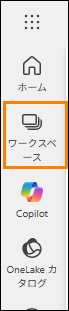

4. [ワークスペース] ペインで **Fabrikam*Lab*<inject key="DeploymentID" enableCopy="false"></inject>\_JA** ワークスペースをクリックします。

   

   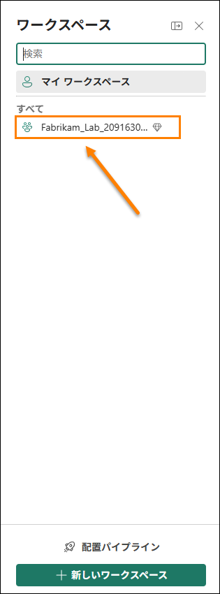

5. ここで、個別のライセンスで Fabric 対応ワークスペースへの発行ができることを確認する必要があります。右上隅にある人物のアイコンをクリックし、**無料試用版**をクリックします。

   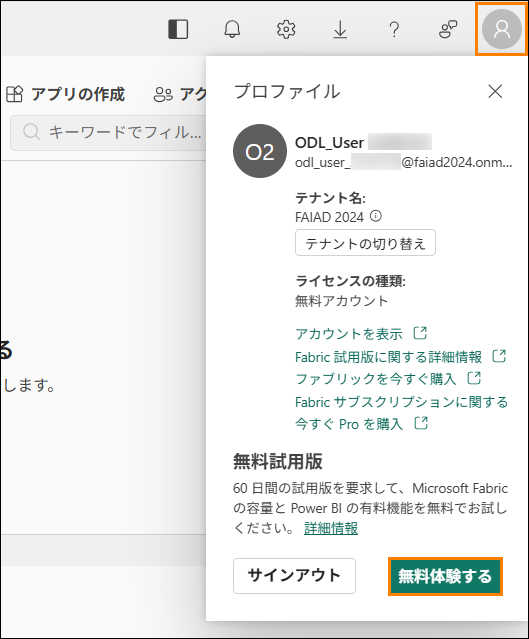

6. そのまま**アクティブ化**をクリックして、ワークスペースへの発行を有効にします。

   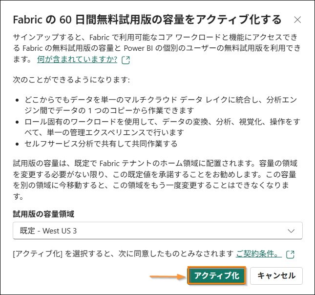

   **OK** をクリックします。

   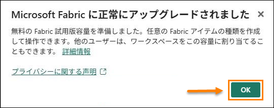

7. 次に、完成した PBIX をクラス ファイルから**発行**する必要があります。

8. クラス ファイルから **Fabrikam Company Sales Report.pbix** という名前のファイルを開きます。

   

9. 開いたら、CDIAD ワークショップ用に割り当てられたユーザー アカウントにログインしていることを確認します。

10. [発行] をクリックし、今作成したワークスペース **Fabrikam*Lab*<inject key="DeploymentID" enableCopy="false"></inject>\_JA** を見つけます。

    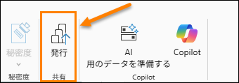

    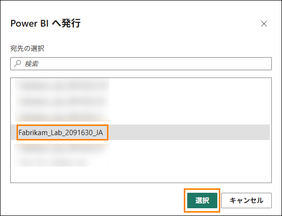

## タスク 1: スタンドアロン Copilot エクスペリエンスを探索する

1. 左側のナビゲーション ウィンドウで、[Copilot] を選択します。

   

2. 次の画面でプロンプトが表示された場合は、**開始する**をクリックします。Copilot は、ユーザーがアクセスできる **Copilot 容量**に基づいてワークスペースを作成します。この選択は、ワークスペースに使用可能な**容量ユニット (CU)** があるかどうかに基づきます。ユーザーが **Fabric 容量構成 (FCC)** に割り当てられている場合、その容量が代わりに使用されます。

3. スタンドアロン Copilot エクスペリエンスへようこそ。この起動画面では、要求を記述できるセクションがあり **(1)** 、下部にいくつかのプロンプト例が表示されます **(2)**.

   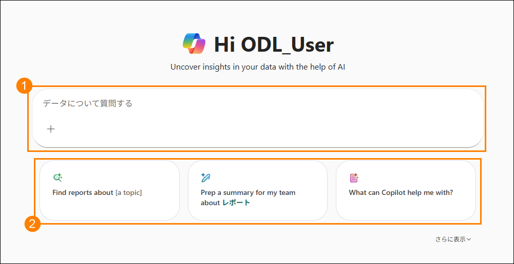

## タスク 2: スタンドアロン Copilot でプロンプトを記述する

このセクションでは、さまざまなプロンプトを記述し、Copilot エクスペリエンスによって返される結果を確認します。

1. プロンプトをクリックして、**Find reports about Fabrikam’s sales trends for the year** と記述します。入力したら、**Enter** キーを押します。

   **ℹ️ 重要**

   

   AI はさまざまな要因により、結果が一定にならない場合があります。既にこのクラスで説明したとおり、得られる結果は人によって異なり、ラボの例とまったく同じにならないことがあります。表示される機能を確認しながら、できる範囲で作業を進めてください。

   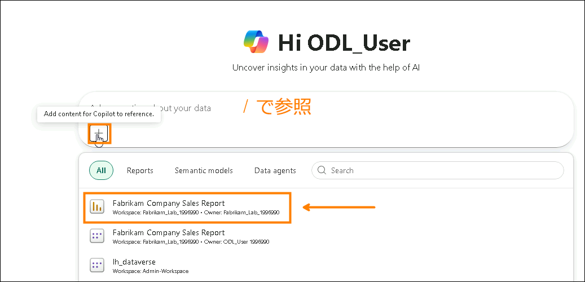

   を使用してファイルを簡単に参照することも、 **(+)** を使用することもできます。発行したコンテンツが Copilot で完全に内部化されるには時間がかかるため、これが役立ちます。

   紹介する適切なレポートが見つからない場合、一般的にいくつかの点を確認する必要があります。
   1. Power BI サービス設定で、[Fabric 管理ポータル] を選択し、Copilot 関連の設定を有効にしたことを確認します。それらの 1 つが、 **[Power BI のスタンドアロン** **Copilot エクスペリエンスで承認済み項目のみを表示する]** です。この機能を選択すると、手動で関連付けまたは参照しない限り、Copilot に対して承認された項目だけが表示されます。これは、このテナントで既定により既に有効になっています。

      

   2. 必要に応じて、ワークスペースでモデルを選択することで、Copilot 用のセマンティック モデルを承認できます。

      

   3. **[AI 用のデータを準備する]** を選択すると、[AI 用のデータを準備する] ウィンドウが開きます。

      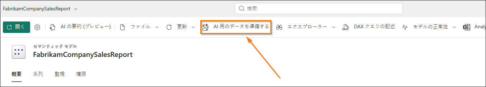

      手動で参照しなくても検索できるようにするには、大規模なモデル ストレージを有効にする必要があります。

      

      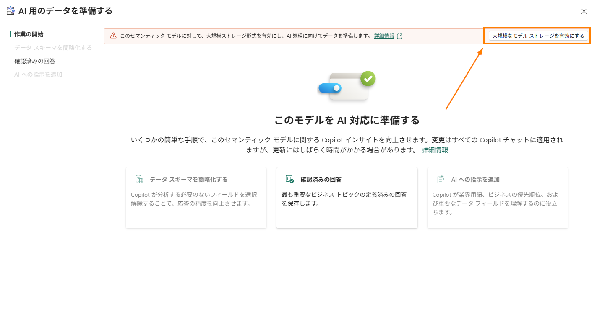

      ここから、AI 用のデータ準備作業を確認し、調整できます。

2. 検索結果として返されたレポート **Fabrikam Company Sales Report** をクリックします。これにより、Web ブラウザーで新しいタブが開き、そのレポートに直接移動できます。

   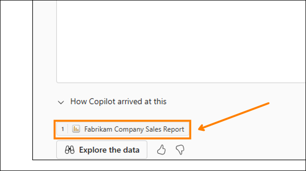

3. 少し時間を取って、このレポートを**探索**し、理解してください。

   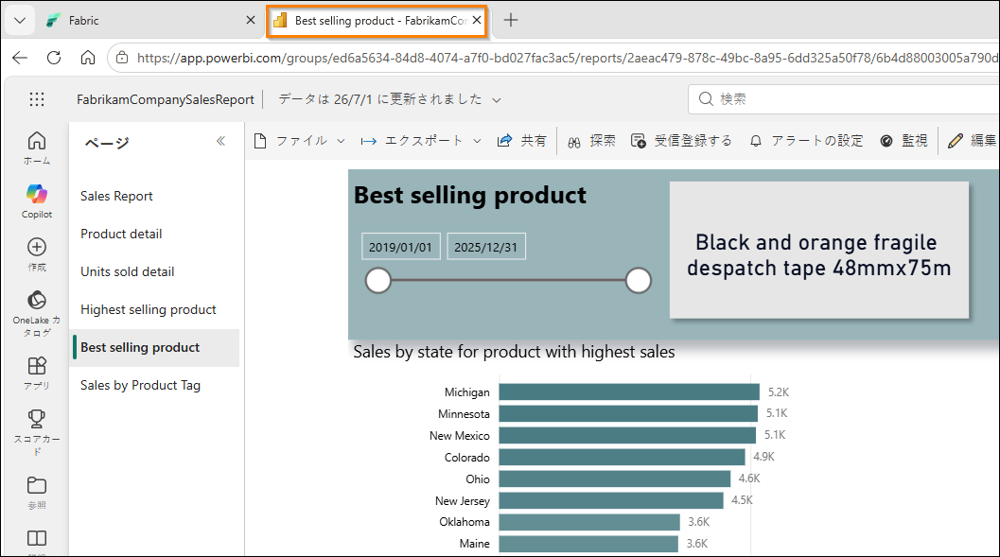

4. レポートの探索が完了したら、ブラウザー タブの (x) をクリックしてこのタブを閉じ、Copilot エクスペリエンスに戻ります。

5. ページ下部で、事前に生成されたプロンプトをクリックするか、このプロンプトを入力します: **Give me an overview of 1. Fabrikam Company Sales**:

   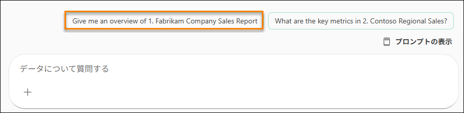

6. レポートの概要をまとめるよう Copilot に指示すると、次のような情報が返されます (以下のスクリーンショットを参照)。**注意: 実際の画面と結果には若干の違いがあります!!**
   1. Copilot は、概要を示す既存のレポートからレポート ビジュアルを返します。

   2. 返された各ビジュアルには Copilot が作成した説明が付加されます。

      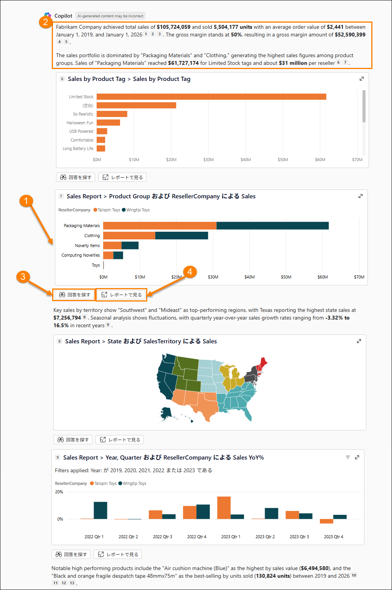

## タスク 3: レポートで見る機能を探索する

Copilot は、入力された質問や基になるデータの準備状況に応じて、さまざまな種類の応答を返します。このセクションでは、**レポートで見る**機能を探索します。この機能は、Copilot がレポートの既存のビジュアルを使用して質問に回答する場合に返されます。

1. 次に、**レポートで見る**オプションを見ていきます。このオプションを選択すると、指定したビジュアルにスポットライトが当てられた状態で現在のレポートが開きます。

2. 表示された視覚化から**レポートで見る**をクリックすると、Web ブラウザーの新しいタブが開きます。_以下のスクリーンショットを参照してください_。

   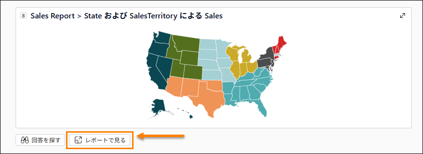

3. 新しいレポート ページには、Copilot が選択した元のレポート内のビジュアルが表示されます。また、他のビジュアルが一時的にグレー表示されている理由は、選択したビジュアルに**スポットライト**が適用されているからです。レポートの任意の場所をクリックしてレポートをアクティブ化し、探索します。探索し終わったら、Web ブラウザーでこのタブを閉じ、スタンドアロン Copilot エクスペリエンスに戻ります。

   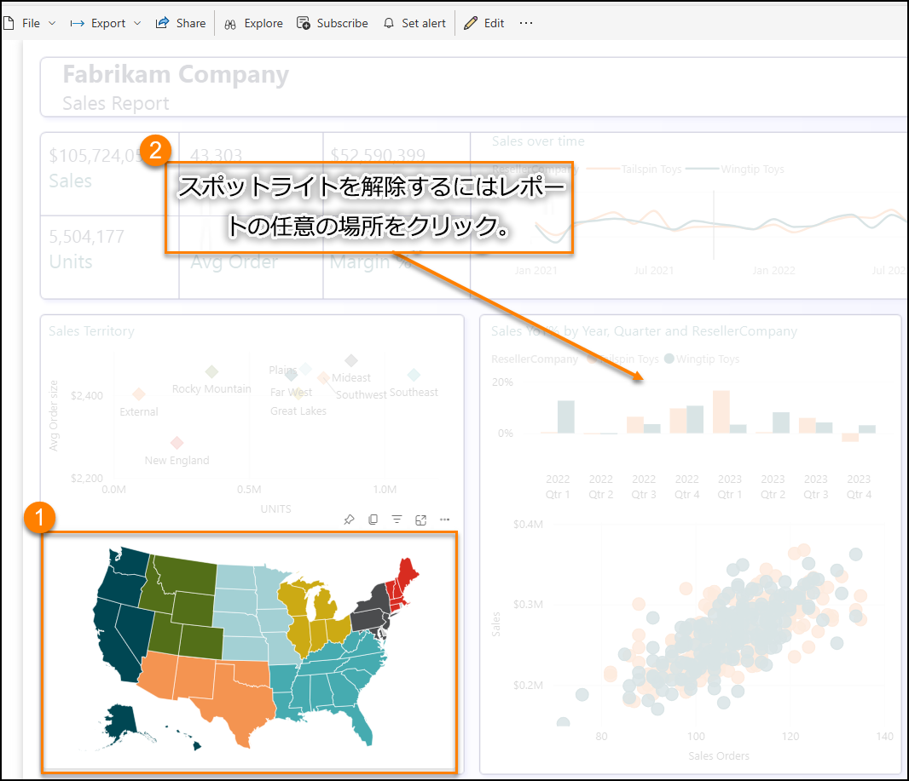

## タスク 4: 探索

**ℹ️ 注意**

探索は、レポート上の既存のデータとビジュアルのアドホック分析を行うツールとして主に使用します。探索は保存できますが、アドホック分析が完了したら単に閉じることが多いです。

Copilot エクスペリエンスによって提供されるもう 1 つの機能は、**回答を探す**機能です。回答を探すこの機能は、Copilot エクスペリエンスを継続して調整するための優れた方法です。このセクションでは、探索を使用、編集、保存、共有する方法について説明します。

1. 次にスタンドアロン Copilot エクスペリエンスに戻ります。Copilot で、任意の視覚化の下部にある**回答を探す**をクリックします。この例では、どれを選んでもかまいません。

   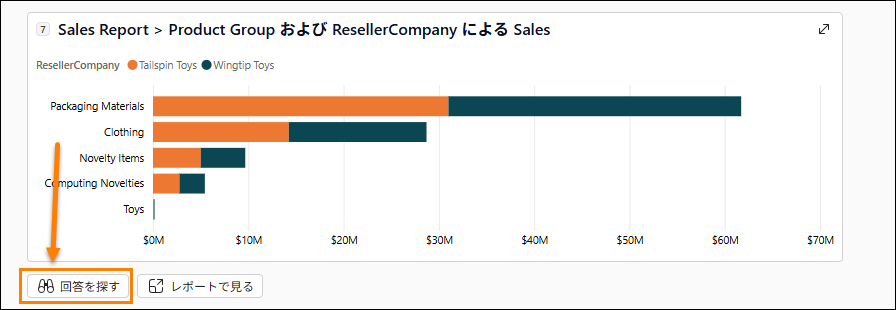

2. このボタンをクリックして新しい画面が開いています。それでは、**探索**について調べてみましょう。
   - (1) 探索をレポートとして、または探索として保存する。

   - (2) 新しいブラウザー タブで開く。

   - (3) 共有する

   - (4) マトリックス形式で表示する

   - (5) 視覚化の種類を変更する

   - (6) ビジュアルの列やメジャーを変更する

   - (7) ビューを展開または折りたたむ

     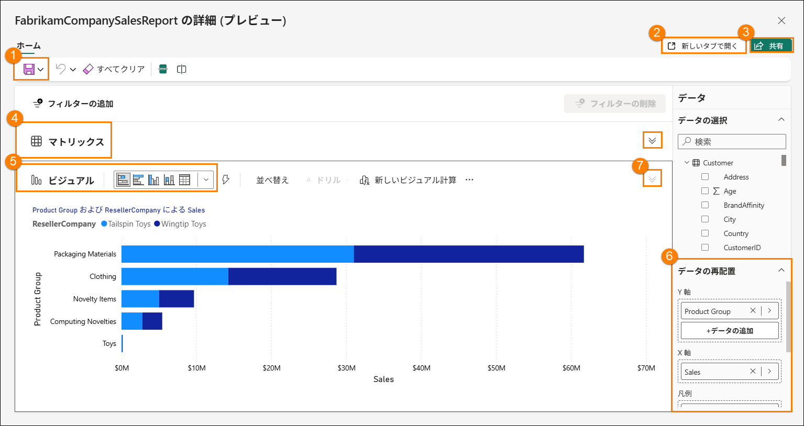

3. [保存] ボタンの横のドロップダウン アイコンをクリックすると、いくつかのオプションが表示されます。
   - 最初に、これを探索として保存できます。これはワークスペース内のオブジェクト タイプです。

   - 次に、コピーを保存できます。このオプションは、探索が保存済みである場合に表示されます。

   - 最後に、これをレポートとして保存できます。

     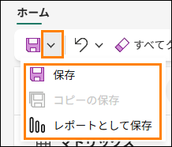

4. このラボで前に設定を完了している場合は、ここでこの探索を保存できます。ドロップダウンから [保存] を選択します。これで、この探索を**保存**するためのポップアップが表示されるので、セットアップ時に作成したワークスペースを選択し、**保存**をクリックします。

   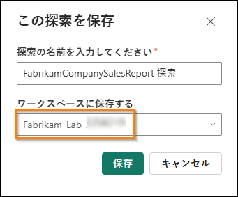

5. 次のスクリーンショットでは、保存後にワークスペースで探索がどのように表示されるかの**例**を確認できます。

   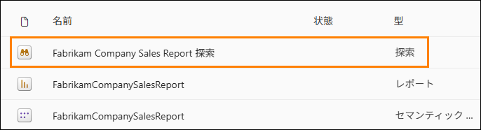

6. 他のユーザーと探索を共有することもできます。探索は、最初にワークスペースに保存した後にのみ共有できます。

7. ワークスペースに戻って、その探索を見つけて共有アイコンをクリックします。このプログラムをリンク、メール、または Teams で共有できるポップアップが表示されます。注意: **このワークショップでは探索の共有はしません。このボックスを閉じて次のステップに進んでください。**

   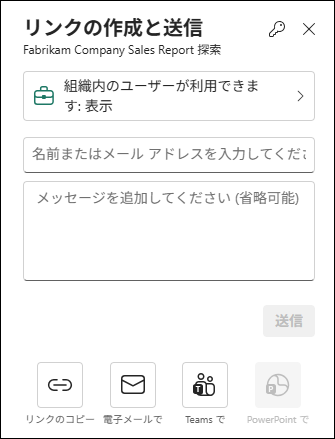

8. 少し時間を取って、探索を開き、他の機能を確認します。
   - 視覚化タイプを変更する

   - 表示されている列とメジャーを変更する

9. 確認し終わったら、右上隅にある **X** をクリックして探索を閉じます。

   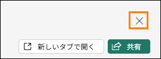

## タスク 5: 確認済みの回答

このクラスではこれまでに、AI 用のデータ モデルの準備に時間を使いました。AI 用にデータを準備する作業の一部として、確認済みの回答を作成します。確認済みの回答により、Copilot で質問したときに特定の視覚化が返されるようになります。これにより、より厳選された一貫性のあるエクスペリエンスがエンド ユーザーに提供されると同時に、レポートの正確性、一貫性、信頼性が確保されます。

1. この次のセッションでは、より役立つ分析情報が得られる項目を追加して、プロンプト エクスペリエンスをさらに改善する方法も学びます。項目を明示的に添付すると、Copilot は作業の範囲を絞り込み、より明確で簡潔な結果を提供できます。現在、プロンプトに添付できる項目は 3 つで、4 つ目は近日対応予定です。
   - レポート

   - セマンティック モデル

   - データ エージェント

   - アプリ (近日対応予定)

2. プロンプトの左下隅にある **+ Copilot が参照するコンテンツを追加**をクリックします。

   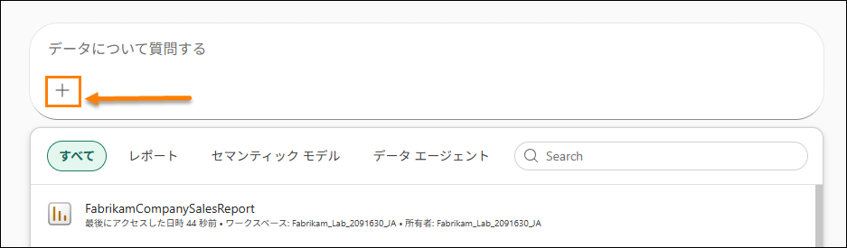

3. 示されたオプションから**レポート**を選択します。次に**Fabrikam Company Sales Report** を選択します。**確認**をクリックします。

   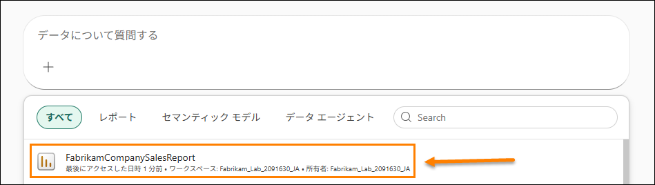

4. このレポートが、リンクされたレポートとして Copilot のプロンプト欄に表示されます。次に、**What is our best selling product?** と入力してプロンプトを完了します。

   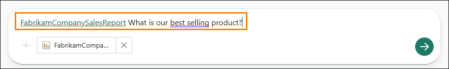

5. このプロンプトから以下の応答を受け取ります。応答で確認済みの回答が使われた場合は、回答の上に通知が表示されます。_以下のスクリーンショットを参照してください_。

6. レポートを表示してデータを探索するためのオプションも表示されます。

   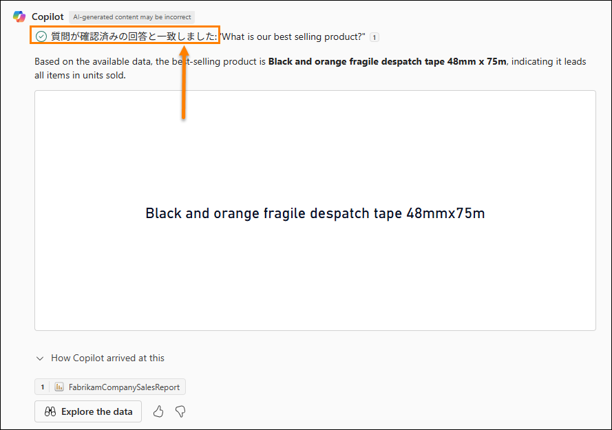

## タスク 6: Copilot がこれに至った経緯 (HCAAT)

Copilot は、回答を提供するだけではなく、その回答に至った経緯を説明する場合があります。これにより、応答の形成に使われた背後にあるロジック、フィルター、メジャーなどが明らかになります。具体的には、これは HCAAT または Copilot がこれに至った経緯と呼ばれます。単に役に立つ以上のものであるこれらの分析情報により、ユーザーは結果を検証し、出力の信頼性を構築して、基になるモデルに対する理解を深めることができます。このようにして、優れた分析情報と結果を検証する方法が提供されます。

1. 確認済みの回答の下にある **How Copilot arrived at this** をクリックします。

2. 行った質問と、質問に回答するために使われたデータ、さらに、適用されたフィルターがあれば表示されます。

   

3. HCAAT は、どのようにして結果に至ったかに基づいて、異なる結果を返します。別の例を見てみましょう。

4. Copilot のプロンプト欄で、**Fabrikam Company Sales Report** を添付し、次に **return all customers that make up the top 1% of total sales** と入力します。

   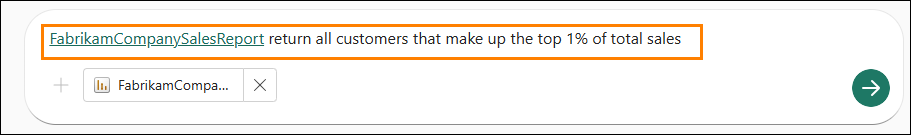

5. 結果を確認しましょう。
   - (1) 最初に得たのは、回答に通常よりも多くの分析が必要だったという応答です。これは Copilot が DAX で生成した結果です。必ずコードを確認してください。また、データは DAX で生成されたため、完全に承認されてはいないことが示されています。

     

   - (2) 結果がテーブルに表示されています。結果は問題ないように見えます。Customers について質問しましたが、返されたのは Resellers であることに注意してください。これは、AI 用のデータを準備したときに、Customer テーブルを除外し、Reseller の同義語を使用したためです。

   - (3) Copilot がこれに到着した方法

   - (4) Fabrikam Sales Report

   - (5) 結果に到達するために Copilot によって生成された DAX クエリ

     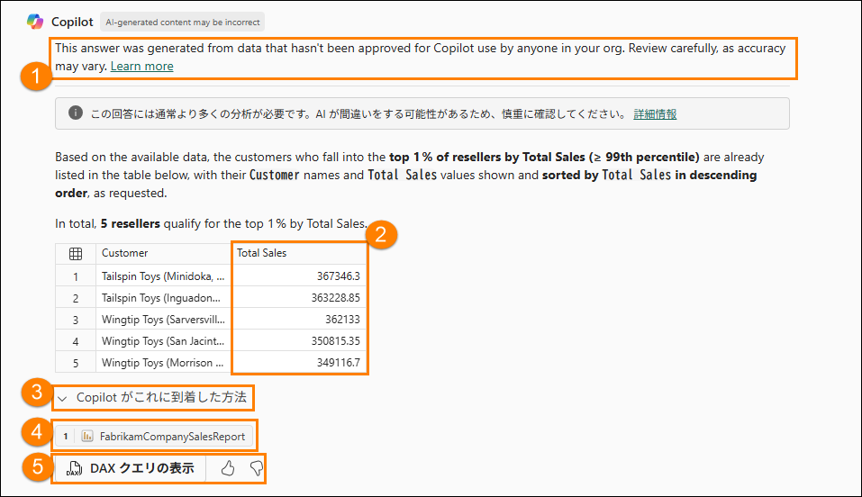

6. まず、HCAAT を探索しましょう。**Copilot がこれに到着した方法**をクリックして説明を展開します。

7. 今回、受け取った結果は今までとは大きな違いがあります。Copilot がどのようにこの応答に至ったかを示す説明が返されます。

   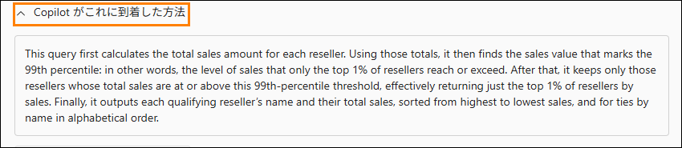

   このセクションでは、Copilot がどのようにして特定の回答に至ったかを共有する場合があることを学びました。Copilot がこの情報を共有または表示する方法は、Copilot が応答を返すために使用したプロセスによって異なる可能性があります。

## タスク 7: Copilot によって生成された DAX クエリからのデータ回答

前の例では、Copilot は、セマンティック モデルの基になるデータを確認して DAX クエリを生成しました。さらに、結果の正確性を確認するよう Copilot から警告が表示されました。応答をさらに詳しく見てみましょう。

1. 上のスクリーンショットの結果を見て、顧客ごとに合計売上が繰り返されていることが確認できます (Resellername = Customers を使用して同義語を作成したことを思い出してください)。これは通常、返された応答に含まれるテーブル間に有効なリレーションシップがないことを示しています。

2. **DAX クエリの表示**をクリックします。

   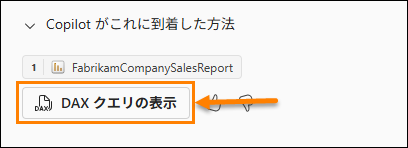

3. これにより、ポップアップ ダイアログ ボックスが表示され、生成された DAX クエリと、ソリューションがどのようにしてこの回答に至ったかを表すインライン コメントが示されます。下部付近に、Copilot がどのようにしてこの結果に至ったかの説明が表示されます。最後に、ポップアップの下部に、実行できる 2 つのオプションがあります。
   - クエリの実行 – 現在の DAX を取得して DAX クエリ ビューで開きます

   - クエリのコピー – このオプションは、DAX をクリップボードにコピーします

     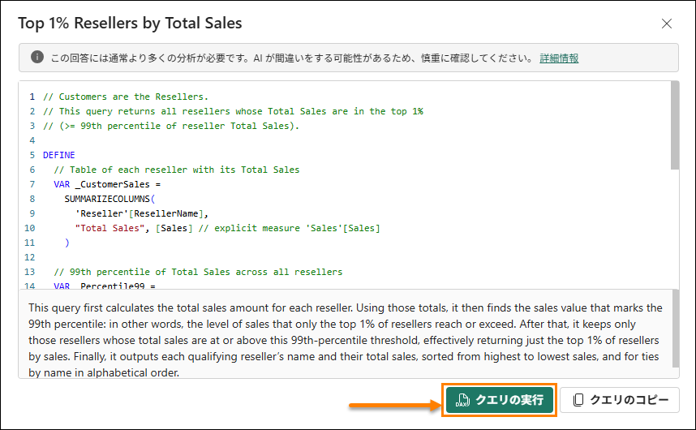

4. **クエリの実行**をクリックします。Web ブラウザーの新しいタブが開き、Fabrikam Company セマンティック モデルの DAX クエリ ビューが表示されます。

   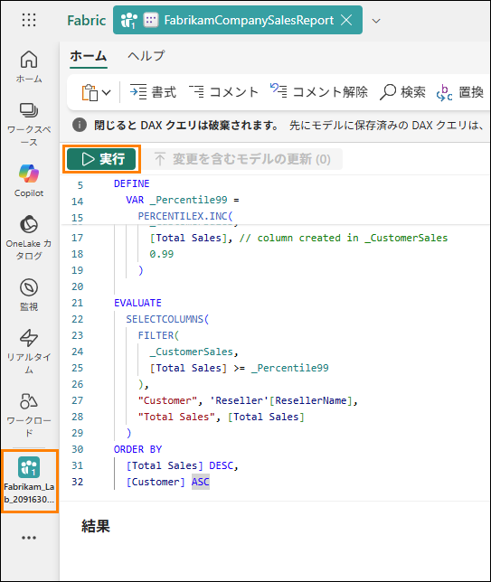

5. **実行**をクリックし、DAX クエリ ビューで結果を確認します。ここで、結果は Copilot から受け取った結果と同じです。DAX 言語を使い慣れている場合は、DAX 式を変更して結果をさらに絞り込むことができます。

   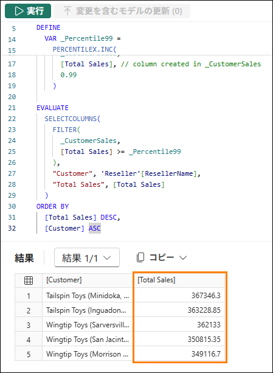

6. 見たところ、これは Copilot による良好な応答であり、すべての準備が報われました。Power BI Desktop を再度開いて簡単なビジュアルを作成すると、Copilot からの応答が正しいことをすぐに確認できます。

   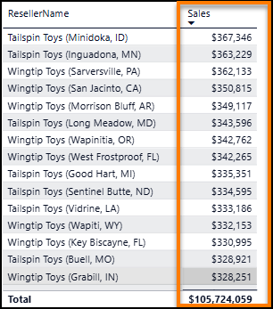

7. ここで指摘しておくべきもう 1 つの点は、モデル ビューを表示するアクセス権もあるということです。ここから、セマンティック モデルのテーブルとリレーションシップを検証できます。

   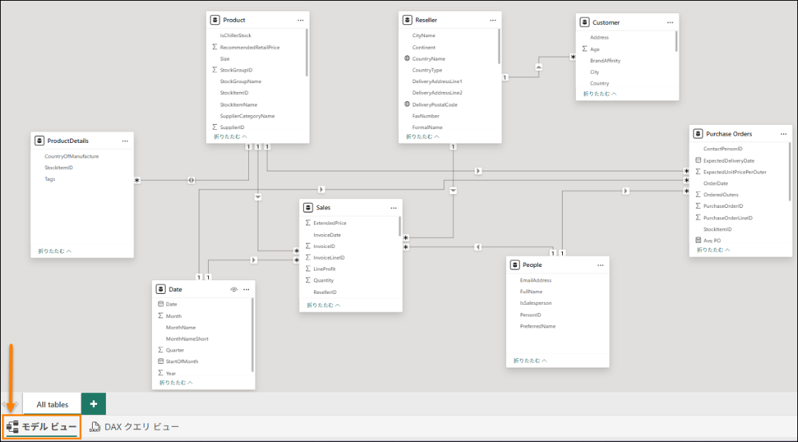

   このラボでは、Copilot によって生成された DAX を確認できること、DAX クエリ ビューを起動して既存のコードを変更したり、モデル ビューに移動してリレーションシップを確認したりできることを学びました。

   **ℹ️ 重要**

   Chat with your Data エクスペリエンスは、世界中の企業が分析情報を得るまでの時間を大幅に短縮する非常に便利なツールです。ただし、結果が正しくない場合や誤解を招く可能性もあります。このラボで見てきたように、立ち止まって結果を検証することが非常に重要です。

## タスク 8: Copilot でのコンテキストの切り替え

このワークショップでは、Fabrikam Company Sales データだけに焦点を合わせてきました。ただし、この組織には多くのワークスペースにさまざまなレポートがあり、スタンドアロン Copilot エクスペリエンスでは、アクセスできるすべてのレポートが参照されます。

1. クラス ファイルに移動して、**State of Nevada COVID-19 Dashboard** を開きます。

   

2. この完全に完了したレポートを **Fabrikam_lab_0000000** に発行します。

   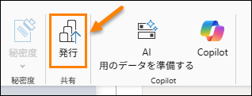

   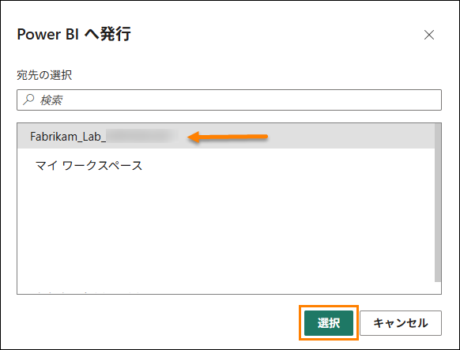

3. これで、このセマンティック モデルとレポートのクエリをスタンドアロン Copilot エクスペリエンスで実行できるようになります。Copilot のプロンプト欄に次のように入力します: **How many confirmed cases have there been?** すぐに挿入されない場合は、+ ボタン **(1)** 、セマンティック モデル **(2)、StateofNevadaCOVID-19Dashboard (3)** を使用してください。意図的に非常に汎用的なプロンプトを使用しましたが、Copilot はレポートの内容に基づいて、ユーザーが何を求めているかを理解することができました。提供されたレポートの下に、Copilot が一致する基準を知らせていることに注意してください。

   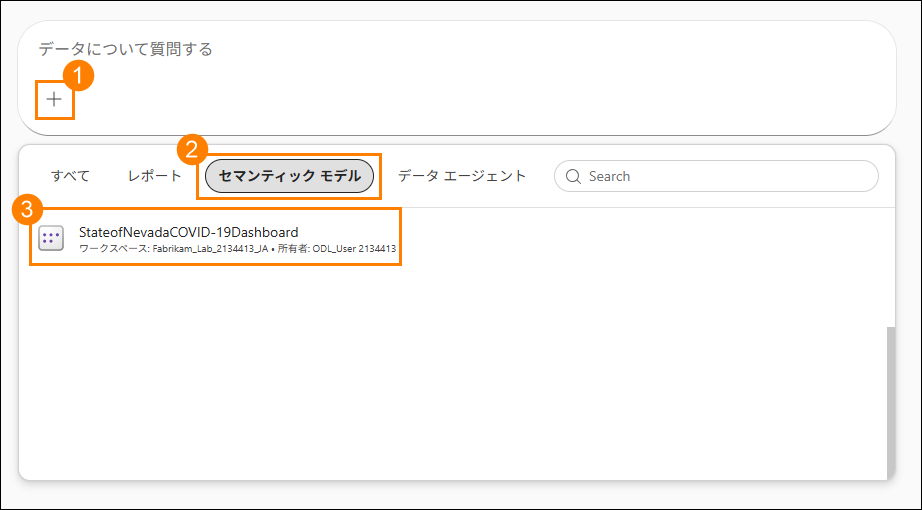

4. よくできました。このように、Copilot は基になるレポートからビジュアルを返して質問に回答します。Copilot から複数の異なる表示出力が返される場合があることに注意してください。

   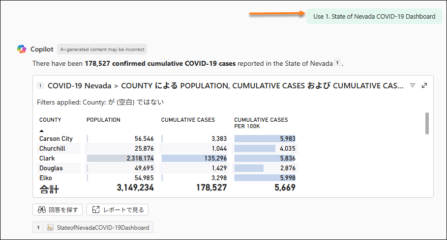

   または

   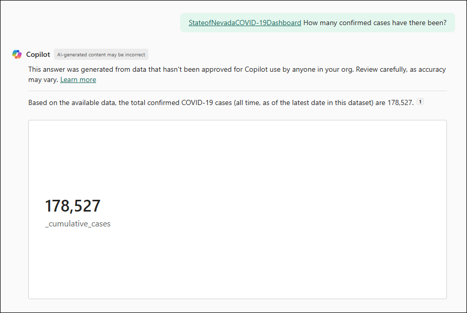

5. データについて別の質問を行います。プロンプトに次のように入力します: **How many deaths were there in Carson City in 2019?**

   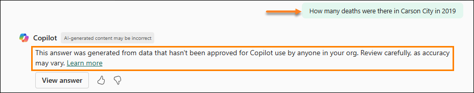

6. 今回、返すことができる既存のビジュアルが見つからなかったため、その結果として Copilot はレポートの基になるデータから回答を生成しました。このような場合、AI 用データ準備済みとマークされていないモデルでは、**注意書きのある応答**が返されます。

   **ℹ️ 重要**

   注意書きのある応答は、準備が完了していない、または記述の質が低いデータ モデルに Copilot が遭遇した場合に表示される、システムによって生成された警告または制限です。Copilot は基本的に、"入手可能な情報でお手伝いすることはできますが、結果の検証が必要です" と伝えています。

   Copilot からの注意書きのある応答を減らすには、セマンティック モデルを AI 用に準備してから、そのセマンティック モデルを発行後、AI 用に準備済みとしてマークします。ラボ ファイルに用意されているテナント設定ガイダンス ドキュメントを参照してください。

## タスク 9: セマンティック モデルから Copilot でのビジュアル作成

これまでのラボでは、特定の質問に回答するために Copilot が視覚化を返すのを確認しました。これらの視覚化は、レポート内に既に存在するビジュアルでした。Copilot はセマンティック モデルから視覚化を構築して要求に回答することもできます。このセクションでは、その方法について説明します。

1. Copilot にまだ移動していない場合は、Fabric の Copilot に戻ります。

2. プロンプトで、**Fabrikam Company Sales Report** を添付し、**Show me units sold over time** と入力します。

   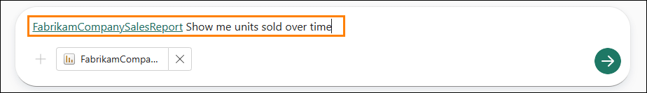

3. 返された視覚化は、レポート内に以前から存在していたビジュアルではありません。これは、セマンティック モデルに基づいて Copilot によって作成された視覚化です。実際、レポートから直接取得されるビジュアルとは異なり、Copilot によって生成されたこの回答には、HCAAT の説明である *Copilot がこれに至った経緯*が示されています。

   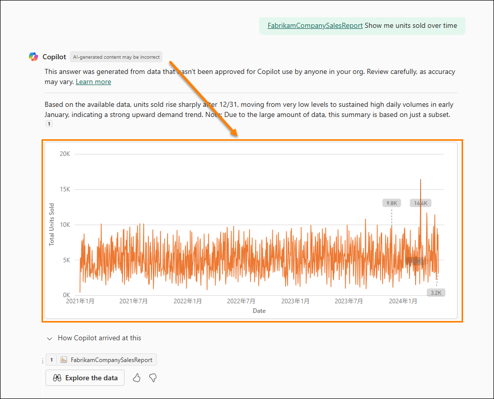

4. 結果を確認し、**How Copilot arrived at this** をクリックしてみましょう。

   

## タスク 10: 一般的な Copilot エクスペリエンス

このラボでは、Microsoft Fabric のスタンドアロン Copilot エクスペリエンスを活用して、既存のレポートとセマンティック モデルを探索する方法を学びました。ただし、一般的な Copilot エクスペリエンスを活用することもできます。このラボでは、Copilot を活用して調査結果に関するメールを作成します。

1. Copilot のプロンプト欄に **Take the conversation so far and turn it into an email to share with the team** と入力します。

   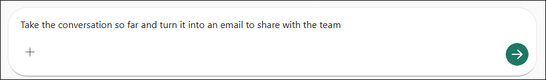

2. 結果はすばらしいものです。実際の応答はスクリーンショットとは大幅に異なることに注意してください。また、応答は現在開かれている Copilot とのチャットに基づいており、チャットをクリアした場合や会話履歴がほとんどない場合は、最終結果に影響を与える可能性があるため、注意が必要です。

   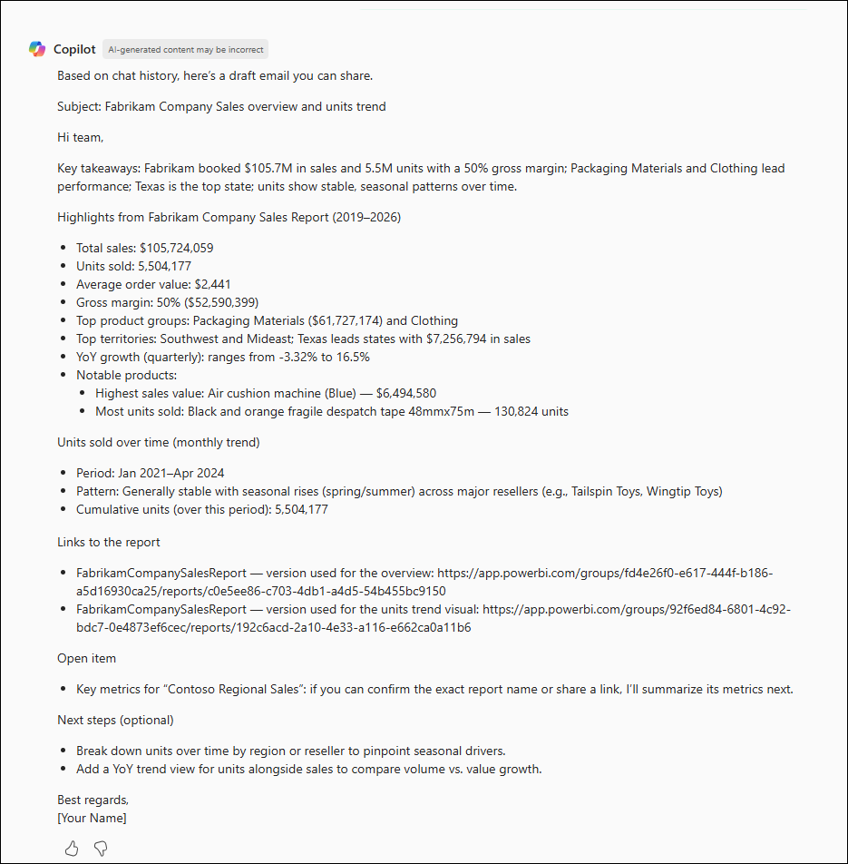

3. これは良好な結果ですが、メールに視覚化とリンクを加えれば、さらに便利です。Copilot のプロンプト欄で、Copilot に **Add visuals and links to the email** と依頼します。

   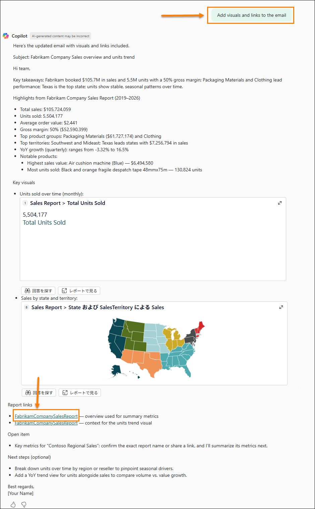

# 参考資料

Chat With Your Data in a Day (CDIAD) では、Fabric ワークスペースでスタンドアロン Copilot を使用する際に重要な機能の一部を紹介します。

サービスのメニューにあるヘルプ (?) セクションには、いくつかの優れたリソースへのリンクがあります。表示されるビューはユーザーが使用しているエクスペリエンスによって異なるため、以下のスクリーンショットとはオプションが異なる場合があります。

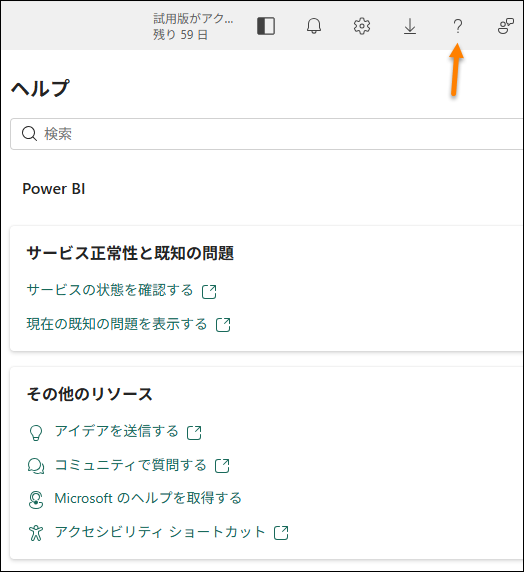

Microsoft Fabric の次のステップに役立つリソースをいくつか以下に紹介します。

- メインの [Microsoft Fabric ドキュメント](https://learn.microsoft.com/en-us/fabric/)のすべての情報にアクセスする

- [ガイド付きツアー](https://aka.ms/Fabric-GuidedTour)を通じて Fabric を探索する

- [Microsoft Fabric の無料試用版](https://aka.ms/try-fabric)にサインアップする

- [Microsoft Fabric の Web サイト](https://aka.ms/microsoft-fabric)にアクセスする

- [Fabric の学習モジュール](https://aka.ms/learn-fabric)で新しいスキルを学ぶ

- [Fabric 入門編の無料の e-book](https://aka.ms/fabric-get-started-ebook) を読む

- [Fabric コミュニティ](https://aka.ms/fabric-community)に参加し、質問の投稿やフィードバックの共有を行い、他のユーザーから学びを得る

Copilot についてより掘り下げる、次の技術ドキュメントを参照してください。

- [Power BI の Copilot の概要 - Power BI | Microsoft Learn](https://learn.microsoft.com/en-us/power-bi/create-reports/copilot-introduction)

- [Power BI のスタンドアロン Copilot エクスペリエンス (プレビュー) – Power BI | Microsoft Learn](https://learn.microsoft.com/en-us/power-bi/create-reports/copilot-chat-with-data-standalone)

- [Microsoft Fabric Copilot の管理設定 | Microsoft Learn](https://learn.microsoft.com/en-us/fabric/admin/service-admin-portal-copilot)

- [Fabric データ エージェントの作成 (プレビュー) - Fabric データ エージェントの作成方法 | Microsoft Learn](https://learn.microsoft.com/en-us/fabric/data-science/concept-data-agent)

- [データ エージェントを構成するためのベスト プラクティス - Microsoft Fabric | Microsoft Learn](https://learn.microsoft.com/en-us/fabric/data-science/data-agent-configuration-best-practices)

- [Microsoft Fabric と Power BI の Copilot: FAQ - Microsoft Fabric | Microsoft Learn](https://learn.microsoft.com/en-us/fabric/fundamentals/copilot-faq-fabric)

© 2026 Microsoft Corporation. All rights reserved.

このデモ/ラボを使用すると、次の条件に同意したことになります。

このデモ/ラボで説明するテクノロジまたは機能は、ユーザーのフィードバックを取得し、学習エクスペリエンスを提供するために、Microsoft Corporation によって提供されます。ユーザーは、このようなテクノロジおよび機能を評価し、Microsoft にフィードバックを提供するためにのみデモ/ラボを使用できます。それ以外の目的には使用できません。このデモ/ラボまたはその一部を、変更、コピー、配布、送信、表示、実行、再現、発行、ライセンス、著作物の作成、転送、または販売することはできません。

複製または再頒布のために他のサーバーまたは場所にデモ/ラボ (またはその一部) をコピーまたは複製することは明示的に禁止されています。

このデモ/ラボは、前に説明した目的のために複雑なセットアップまたはインストールを必要としないシミュレーション環境で潜在的な新機能や概念などの特定のソフトウェア テクノロジ/製品の機能を提供します。このデモ/ラボで表されるテクノロジ/概念は、フル機能を表していない

可能性があり、最終バージョンと動作が異なることがあります。また、そのような機能や概念の最終版がリリースされない場合があります。物理環境でこのような機能を使用するエクスペリエンスが異なる場合もあります。

**フィードバック。**このデモ/ラボで説明されているテクノロジ、機能、概念に関するフィードバックを Microsoft に提供する場合、ユーザーは任意の方法および目的でユーザーのフィードバックを使用、共有、および商品化する権利を無償で Microsoft に提供するものとします。また、ユーザーは、フィードバックを含む Microsoft のソフトウェアまたはサービスの特定部分を使用したり特定部分とインターフェイスを持ったりする製品、テクノロジ、サービスに必要な特許権を無償でサード パーティに付与します。ユーザーは、フィードバックを含めるために Microsoft がサード パーティにソフトウェアまたはドキュメントをライセンスする必要があるライセンスの対象となるフィードバックを提供しません。これらの権限は、本契約の後も存続します。

Microsoft Corporation は、明示、黙示、または法律上にかかわらず、商品性のすべての保証および条件、特定の目的、タイトル、非侵害に対する適合性など、デモ/ラボに関するすべての保証および条件を拒否します。Microsoft は、デモ/ラボから派生する結果、出力の正確さ、任意の目的に対するデモ/ラボに含まれる情報の適合性に関して、いかなる保証または表明もしません。

**免責事項**

このデモ/ラボには、Microsoft Power BI の新機能と機能強化の一部のみが含まれています。一部の機能は、製品の将来のリリースで変更される可能性があります。このデモ/ラボでは、新機能のすべてではなく一部について学習します。
