# Microsoft Fabric Chat with your Data in a Day - ラボ 5

## 目次

- ドキュメントの構造
- シナリオ / 問題の説明
- 概要
- Fabric データ エージェントを実装する
- 前提条件
  - タスク 1: データ エージェントを作成する
  - タスク 2: データ ソースを追加する
  - タスク 3: データ エージェントに質問する
  - タスク 4: AI への指示を追加する
- スポットライト: データ ソースの置き換え
  - タスク 5: 追加のデータ ソースを加える
- スポットライト: データ ソース指示
  - タスク 6: 質問の例を作成する
  - タスク 7: データ エージェントの公開と共有
  - タスク 8: Copilot からデータ エージェントを使用する
- 参考資料

# ドキュメントの構造

このラボでは、実行する手順だけでなく、視覚的にわかりやすいように、手順に関連するスクリーンショットも提示されます。各スクリーンショットでは、ユーザーが注目する必要のある領域が、オレンジのボックスで強調表示されて示されます。

# シナリオ / 問題の説明

スタンドアロン Copilot エクスペリエンスは大変効果的で、組織全体で分析情報を得るまでの時間を短縮し、全体的な採用を増やすことができました。

ただし、Copilot エクスペリエンスは高度にカスタマイズ可能ではなく、関連のないレポートやセマンティック モデルを解読することなく、ビジネスの非常に特定の領域に質問を集中できる、より厳選されたエクスペリエンスを求めるエンド ユーザーもいます。Fabrikam Company Sales Report データに関連するデータのみに接続されたデータ エージェントを作成する任意を与えられました。また、製品リード タイムに関してチームが質問する、より具体的な質問に答えるために、スタンドアロン Copilot エクスペリエンスでは利用できない追加データをデータ エージェントに加える必要もあります。

# 概要

すべてのワークスペース内のすべてのデータを探索するのに最適な Copilot スタンドアロン エクスペリエンスについて学習しました。ただし、データ エージェントを使用すると、特定のデータとのチャットにおいて、より厳選されたエクスペリエンスを提供できます。データ エージェントは、特定のデータ ソースまたはデータ ソース内の特定のテーブルに接続できます。Copilot は生産性とインテリジェンスを実現する Fabric 内の AI アシスタントであり、データ エージェントはデータ接続を実現します。

このラボを終了すると、次の方法が学べます。

- データ エージェントを作成する

- エージェントにデータ ソースを追加する

- エージェントに質問する

- エージェントが使用するための AI への指示を追加する

- データ ソースを置き換える

- 追加のデータ ソースを加える

- 質問の例を作成する

- エージェントの公開と共有

- スタンドアロン Copilot からデータ エージェントを使用する

# Fabric データ エージェントを実装する

このセクションでは、データ エージェントを作成する方法について説明します。エージェントは、構造化クエリ (SQL、DAX、KQL) を生成してデータを取得し、事実、合計、ランキング、フィルターが関係する質問に答えることができます。これを書いている時点では、Fabrick データ エージェントは Microsoft Fabric のプレビュー機能として提供されており、運用環境のワークロード用には推奨されません。Fabric データ エージェントの機能の詳細については、こちらを参照してください:

[Fabric データ エージェントの作成 (プレビュー) - Fabric データ エージェントの作成方法 | Microsoft Learn](https://learn.microsoft.com/en-us/fabric/data-science/concept-data-agent)

Microsoft Fabric データ エージェントを使用すると、ユーザーはエンタープライズ データを平易な英語で操作できるため、SQL、DAX、または KQLの必要はなくなります。デバッグ ツールを備えたチャット インターフェイスが提供され、Power BI セマンティック モデル、KQL データベース、レイクハウス、ウェアハウスなどのソースに接続できます。データ エージェントは、Microsoft Fabric の内部および外部からアクセスでき、Microsoft Teams、Copilot Studio、Azure AI Foundry、カスタム アプリに統合できます。データ エージェントは、Fabric のスタンドアロン Copilot エクスペリエンスからも見つけることができます。

## 前提条件

Fabric データ エージェントを使用するには、有効化または構成する必要がある多くのテナント設定があります。クラス ラボの**テナント設定ガイダンスのドキュメント**を参照してください。

- 管理者のアクセス権が必要

- Copilot と Azure OpenAI 設定の有効化

- Fabric データ エージェントの作成と共有の有効化

- Power BI セマンティック モデルに対する XMLA エンドポイントの有効化

## タスク 1: データ エージェントを作成する

1. 仮想マシンで Web ブラウザーを開いて https://fabric.microsoft.com にアクセスし、**Fabrikam*Lab*<inject key="DeploymentID" enableCopy="false"></inject>\_JA** という名前のワークスペースに移動します。

   _(**重要**: このクラスで前に作成したワークスペースを使用します)_

   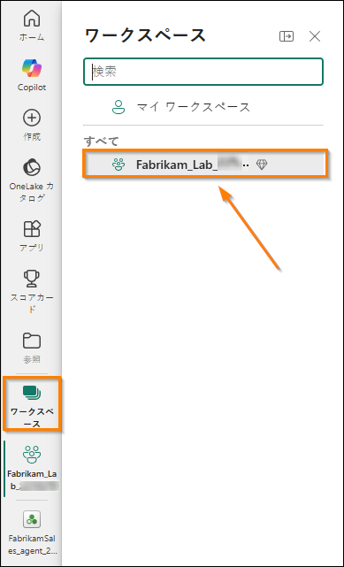

2. **新しい項目**をクリックします。

   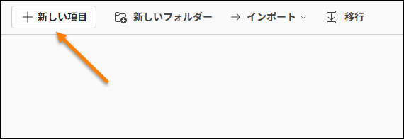

3. 開いた検索バーに **Agent** と入力し、次を選択します: **データ エージェント (プレビュー)。**

   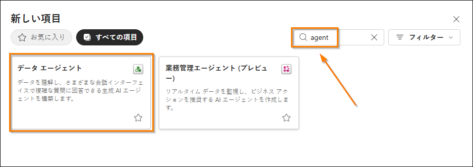

4. エージェントに次のように名前を付けます: **FabrikamSales*agent*<inject key="DeploymentID" enableCopy="false"/>。**

5. usercode は、次に示すようにユーザー名に含まれていることに注意してください。

   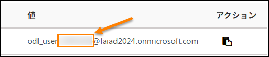

6. 次をクリックします: **作成。**

   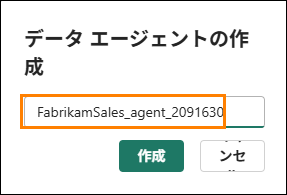

## タスク 2: データ ソースを追加する

1. データ エージェントを作成したら、次のステップでデータ ソースを追加します。

2. エクスプローラー ペインで、 **(+)** **データ ソース** ボタンをクリックします。または、画面の中央に表示されている**データ ソースの追加**ボタンをクリックすることもできます。

   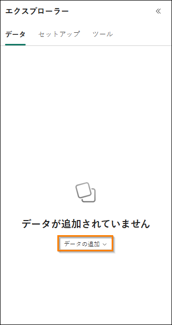

   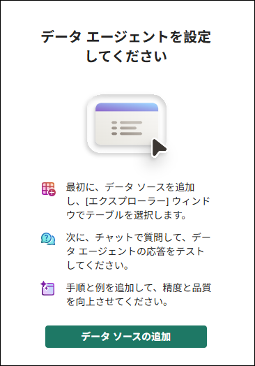

3. リストから **Fabrikam Company Sales Report** セマンティック モデルを選び、**追加**をクリックします。

   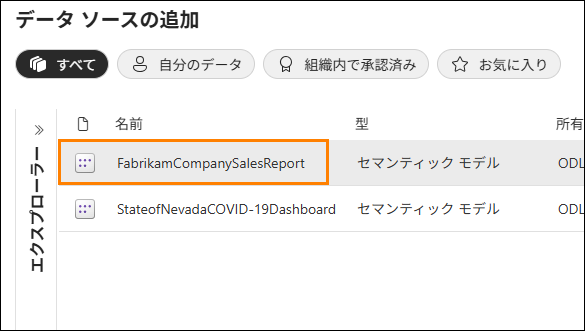

4. テーブルがまだ選択されていないことに注意してください。データ エージェントは、少なくとも 1 つのデータ ソースが選択されるまで質問に回答できません。**エクスプローラー** ペインで **Fabrikam Company Sales Report** の横にある **>** をクリックします。次のスクリーンショットに示されているテーブルを選択します。

   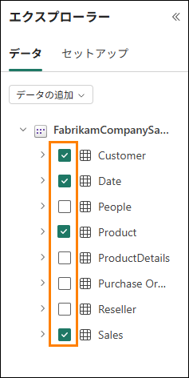

## タスク 3: データ エージェントに質問する

1. エージェントがデータ ソースに接続されたので、データ エージェントに対するプロンプトの記述を始めましょう。

2. 次のコマンドを入力します: **Show me sales by country**。

   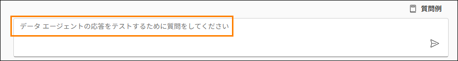

3. エージェントが回答を返すのに数秒かかる場合があります。エージェントが返した情報に注意してください。

   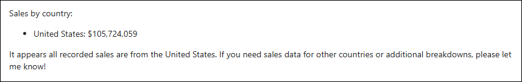

4. 完了したステップのドロップダウンをクリックしてエージェントの実行内容を表示し、次のドロップダウンで詳細を表示します。

   **ℹ️ 重要**

   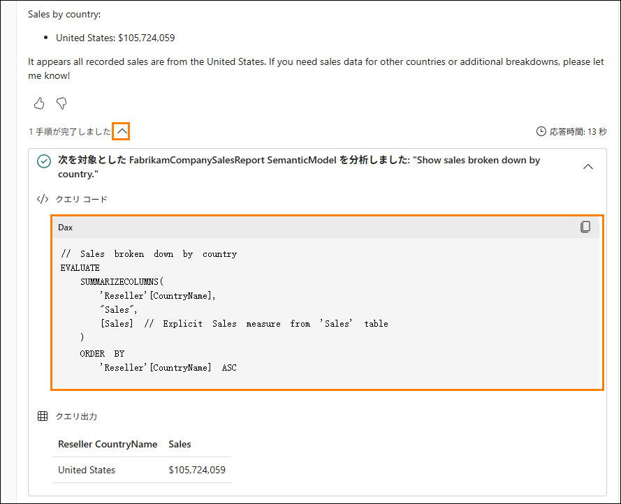
   Fabric データ エージェントを開発する場合、正確性と一貫性を確保するために、時間を取って結果を検証することが重要です。結果が返されたので、セマンティック モデルに戻り、そこで結果を検証します。

5. ダウンロードしたクラス ファイルに移動し、**Fabrikam Company Sales Report.pbix** ファイルを開きます。

   

6. レポートの下部をクリックして新しいレポート ページを開きます。

   

7. 次に、データ エージェントが返した結果を検証するために基本的なビジュアルを作成します。

8. この新しいレポート ページにテーブル ビジュアルを追加します。

   

   

9. 結果のテーブルは次のようになります。

   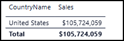

10. 合計売上金額が、前出のデータ エージェントからのクエリ出力と同じであることに注意してください。これにより、エージェント クエリが正しい出力を返したことが検証されます。

## タスク 4: AI への指示を追加する

正確性と一貫性の向上のために、AI への指示を Fabric データ エージェントに追加することができます。AI への指示は、データ エージェント内の 2 つの異なる場所で追加できます。

まず、AI への指示をエージェント自体に追加できます。これらは特に**エージェントの指示**と呼ばれ、エージェントが特定の質問に使用するデータ ソース、使用するトーン、優先するデータの種類のほか、エージェントによるユーザーへの応答を形成するその他の類似した動作やコンテキストの優先設定を識別するのに役立ちます。

2 つ目のタイプの AI 指示は、**データ ソース指示**です。データ ソース指示により、データ エージェントがデータ ソースのデータおよびその最も効果的な使用方法を理解するのに役立つ指示を追加できます。現在、データ ソース**指示**はセマンティック モデルではサポートされていません。この機能は後日提供予定です。

1. Fabric ブラウザー インターフェイスに戻り、**エージェントの指示**から始めましょう。 データ エージェントによって提供されたすべての回答に概要を追加したいと思います。そのため、各回答に簡潔な概要を追加したいことをエージェントに伝えます。

2. ホーム タブで、[エージェントの指示] を選択します。

   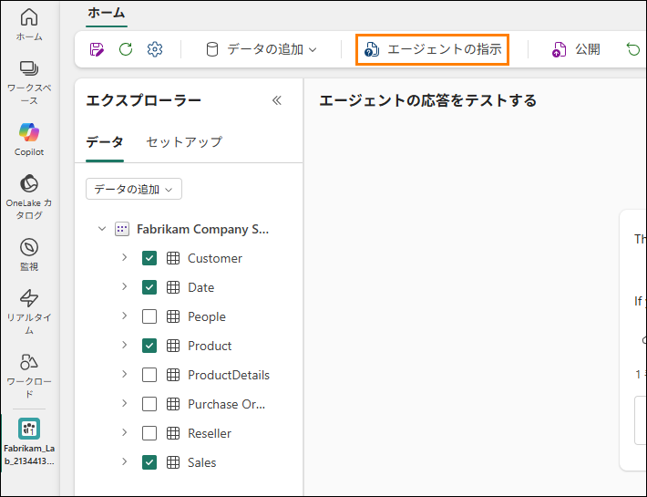

3. 既存の汎用的な指示の上または下にある、AI 指示ウィンドウの**エージェントの指示**ボックスに、以下の指示を入力します。

   **## Set Response Guidelines**

   **Always include a concise summary before the detailed breakdown.**

   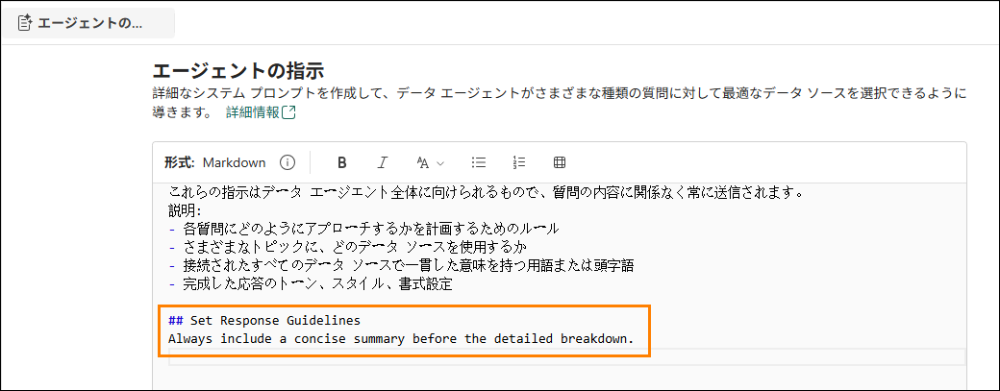

   **ℹ️ 重要**

   場合によっては、AI への指示が有効になるまで時間がかかる場合があります。望ましい結果が得られない場合は、エージェント ウィンドウの上部にあるチャットをクリアするボタンをクリックし、もう一度やり直してください。

4. [エージェントの指示] タブの右上隅の X をクリックして AI 指示を閉じ、変更を保存します。

   **ℹ️ 重要**

   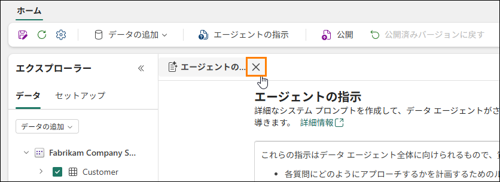

   場合によっては、AI への指示が有効になるまで時間がかかる場合があります。望ましい結果が得られない場合は、エージェント ウィンドウの上部にあるチャットをクリアするボタンをクリックし、もう一度やり直してください。

5. 前に入力したのと同じプロンプト **Show me sales by country** をエージェントに与え、Enter キーを押します。

   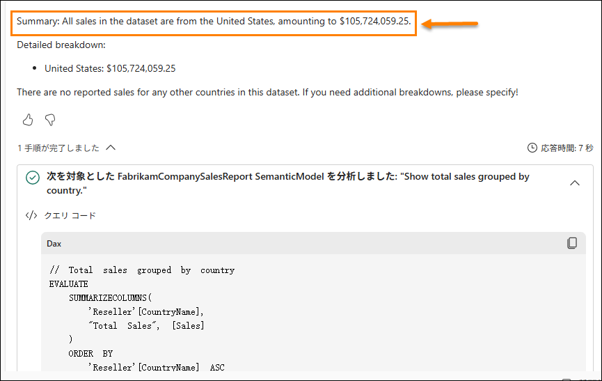

6. さらに AI 応答を調整するために、AI 指示をもう 1 つ追加しましょう。この例では、プロンプトでコマンドを追加し、箇条書きリストではなく、常にテーブルを返すようにします。AI 指示を開き、[エージェントの指示] に以下のコード行を追加します。

   **Always return a table instead of bullet points**

   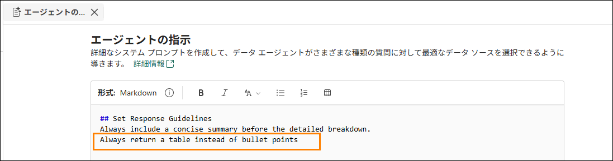

7. AI への指示ウィンドウを閉じ、データ エージェントのプロンプトに次のように入力します: **Return sales by country**

   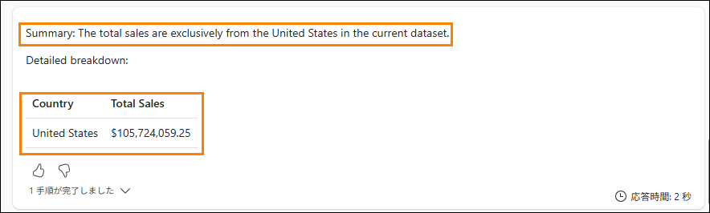

8. これで、結果がテーブル形式で概要とともに返されます。ここまでは順調です。もう少し指示を追加しましょう。

9. データ エージェント プロンプトに **Return sales by State** と入力します。

   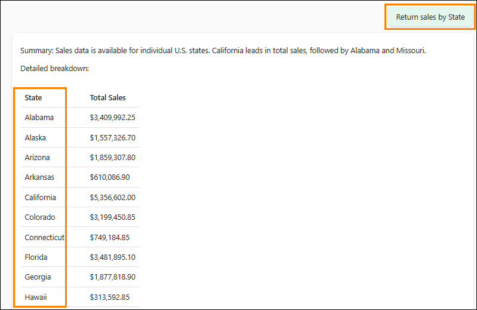

10. これらの結果はまさに期待どおりのものですが、情報が多すぎるかもしれません。特に指定しない限り、常に 5 行だけデータを返すよう AI プロンプトに指示しましょう。

11. データ エージェントの **AI 指示で**、次のように入力します。

    **Always provide the top 5 results unless a different number is specified**

    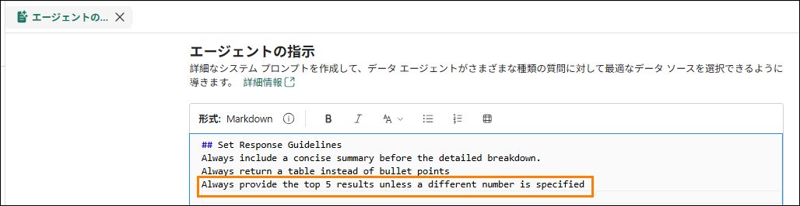

12. 最適な結果になりました。販売上位の 5 つの州が取得されていることが概要で明確になりました。また、Copilot は、必要な場合はすべての州の売上データを要求するように促します。

    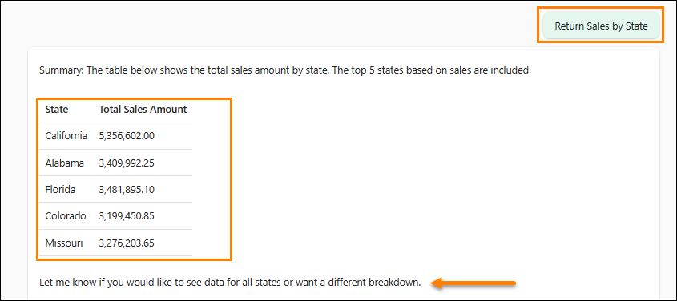

## スポットライト: データ ソースの置き換え

データ エージェントで作業しているときに、別のデータ ソースを使用したい場合があります。この例では、Fabrikam Company Sales Report セマンティック モデルを使用しています。しかし、別のセマンティック モデルを使用したい場合は、どうすればよいでしょうか? 現在、データ ソースを単純に置き換える方法はありません。ただし、いつでもデータ ソースを削除してデータ エージェントに追加することができます。

1. データ ソースを削除するには、データ エージェント内のエクスプローラーに移動し、データ ソースの右側の省略記号 (**...**) をクリックします。ドロップダウン メニューには 3 つのオプションがあります。3 つのオプションは、[開く]、[更新]、[削除] です。

   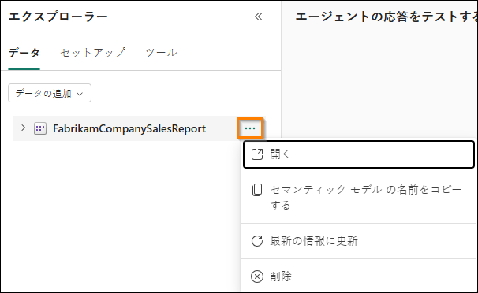

2. このラボでは、ファイルの置き換えは**行いません**。

## タスク 5: 追加のデータ ソースを加える

このデータ エージェントは、明確に定義され、考え抜かれたセマンティック モデルに基づいて構築したものです。このセマンティック モデルは、すべてではないにしても、ほとんどのユーザー要求に答えられるように設計されています。ただし、そのセマンティック モデルで回答できない販売情報があった場合は、どうなるでしょうか? そのセマンティック モデルの作成者を探して、追加のテーブルと情報を加えるように依頼することもできますが、時間がかかったり、要求が拒否されたりする可能性があります。

製品のリード タイム別に売上を見たいユーザーがいます。この Fabrikam Company Sales セマンティック モデルにこの情報は含まれていませんが、Fabric レイクハウス に保存されている元のソース データにはこの情報が存在しています。

このラボでは、製品のリード タイム情報をデータ エージェントの応答に含めることができるように、追加のデータ ソースを加えます。

1. 最初に、レイクハウスを作成し、サンプル データを追加します。ワークスペースに戻り、**新しい項目**をもう一度選択します。

   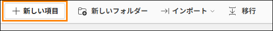

2. 下にスクロールし、[Microsoft Fabric で作成できるその他の項目] 領域から**レイクハウス**を選択します。

   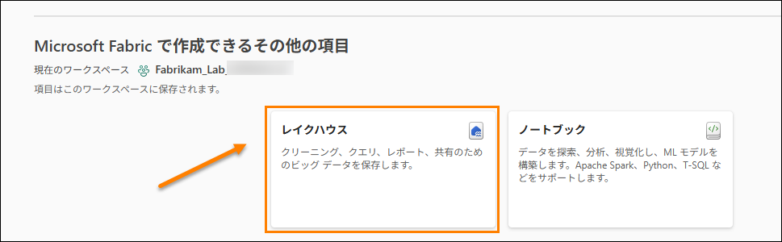

3. 新しいレイクハウスに **lh_Fabrikam** という名前を付け、**作成**をクリックします。

   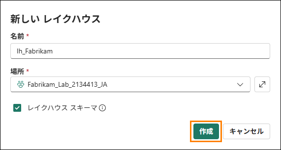

4. レイクハウスで**ショートカット**を使用して、あらかじめ準備されたバージョンの Fabrikam データに接続します。**データを取得**を開き、**新しいショートカット**を開きます。

   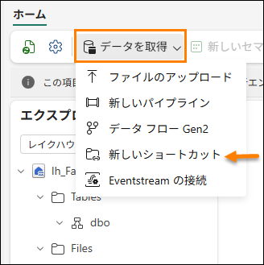

5. **Azure Data Lake Storage Gen2** を選択します。

   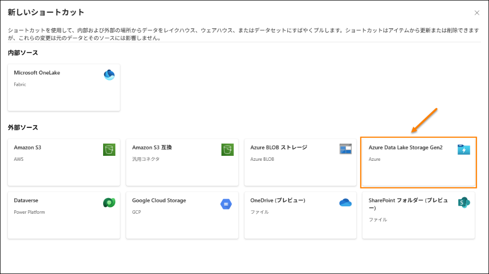

6. **新しい接続**を選択し、Fabrikam の URL を入力します。

   ***https://stvnextblobstorage.dfs.core.windows.net/fabrikam-sales***

   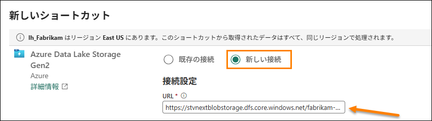

7. **Fabrikam Connector など**の接続名を指定し、[認証の種類] のドロップダウンをクリックして、[Shared Access Signature (SAS)] を選択します。

   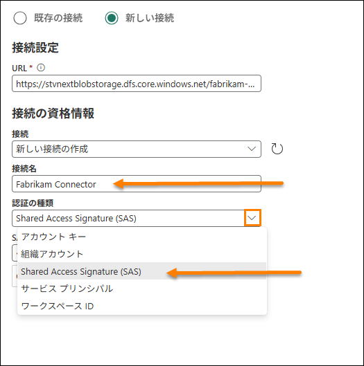

8. 右側の [環境] タブから SAS トークンをコピーし、**SAS トークン**領域に貼り付けます。

   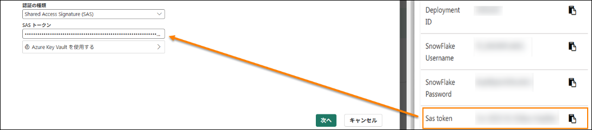

9. **次へ**を選択します。

   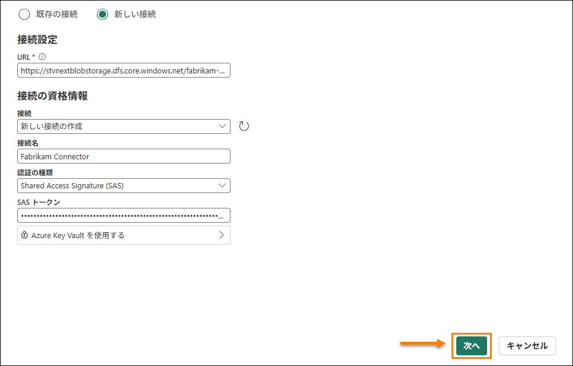

10. **Delta-Parquet-Format-FY25** を開き、**Sales.Invoices.May** を除くすべての項目を選択して、**次へ**を選択します。

    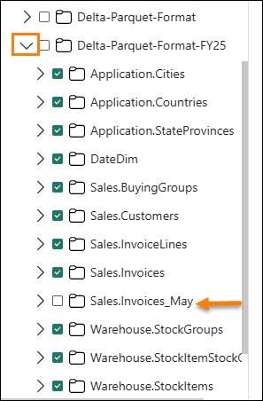

11. **ショートカット名**で新しい各テーブルの名前を変更します。これは、レイクハウスをデータ ソースとして簡単に使用するために重要です。以下の形式に従ってください。

    Application.Cities から **Cities** へ

    Application.Countries から **Countries** へ

    Application.StateProvinces から **StateProvinces** へ

    DateDim から **Date** へ

    Sales.BuyingGroups から **BuyingGroups** へ

    Sales.Customers から **Customers** へ

    Sales.InvoiceLines から **InvoiceLines** へ

    Sales.Invoices から **Invoices** へ

    Warehouse.StockGroups から **StockGroups** へ

    Warehouse.StockItemStockGroups から **StockItemStockGroups** へ

    Warehouse.StockItems から **StockItems** へ

    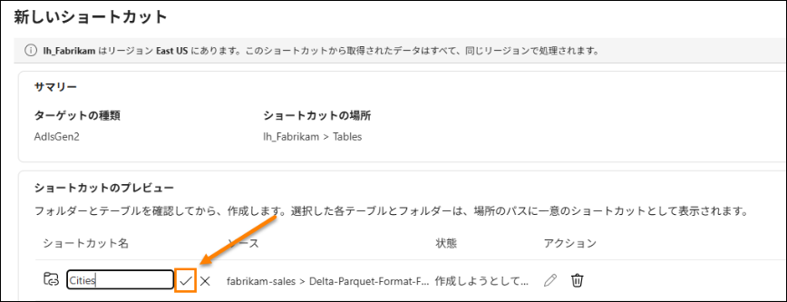

12. **作成**を選択して、レイクハウスへのショートカットを通じてデータを追加します。

    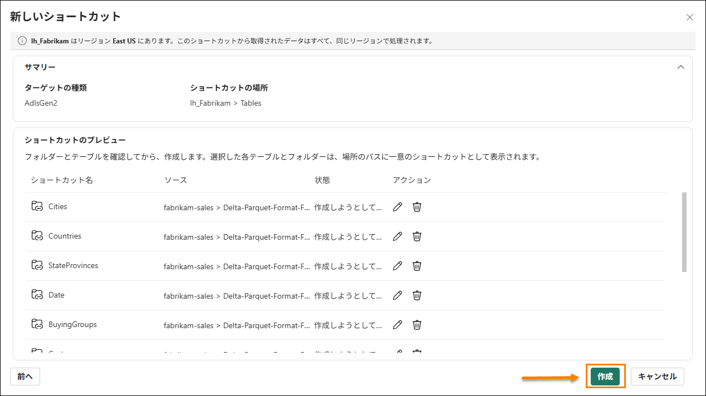

13. アップロードが完了すると、オブジェクトが Tables 領域に移動されたことがわかります。

    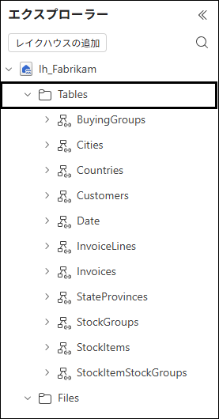

14. 左側またはワークスペース ビューから**データ エージェント**に戻ることができます。

    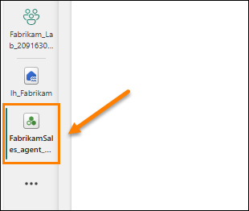

    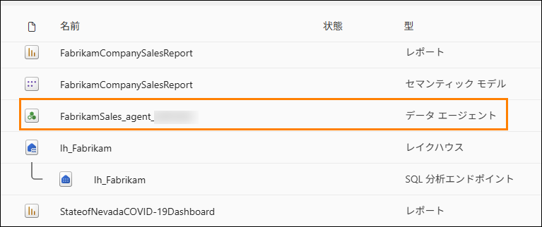

15. データ エージェントで、**データの追加**ドロップダウン ボックスをクリックし、Explorer ペインでデータ ソースを選択します。

    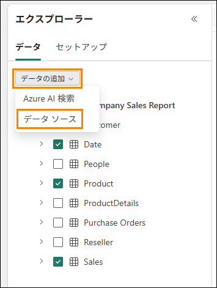

16. **lh_Fabrikam** を選択し、**追加**をクリックします。

    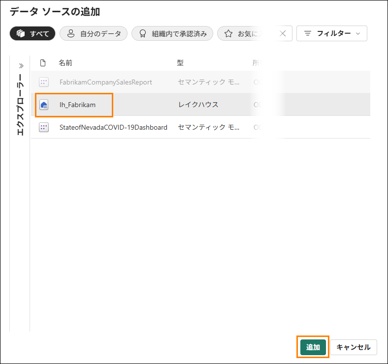

17. これで、**エクスプローラー** ペインにデータ ソースが 2 つ表示されます。

    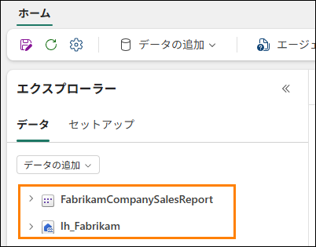

18. レイクハウスを開き、lh_Fabrikam からすべての潜在的なデータ ソースを追加します。すべてのレイクハウス項目が表示されるまでに数分かかる場合があります。読み込まれるまで間をおいてから、必要に応じて画面を更新してみてください。

    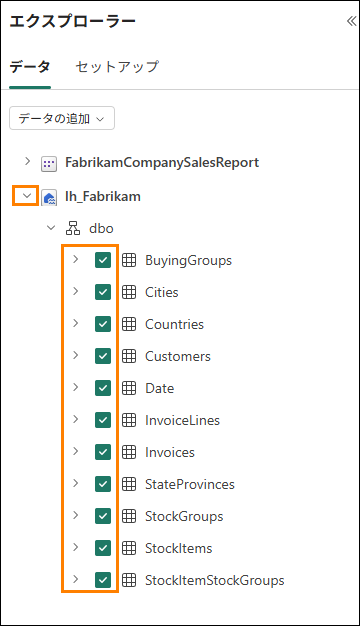

19. データ エージェント プロンプトに戻り、次のように入力します: **What are total sales by product lead time?**

    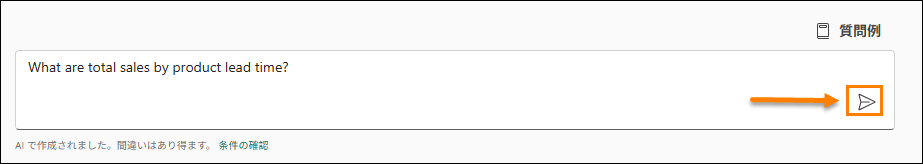

20. Fabric データ エージェントは、この要求に完璧な答えを返し、レイクハウスから必要な結果を取得しました。いつでも Fabrikam Company Sales Report のデータを選択解除して、代わりにレイクハウスを使用するよう Copilot に強制できます。ただし、この後すぐに指示を使用してこれを修正します。

21. 完了したステップのセクションを展開して、この結果に到達するためにデータ エージェントによって生成された SQL を確認します。

    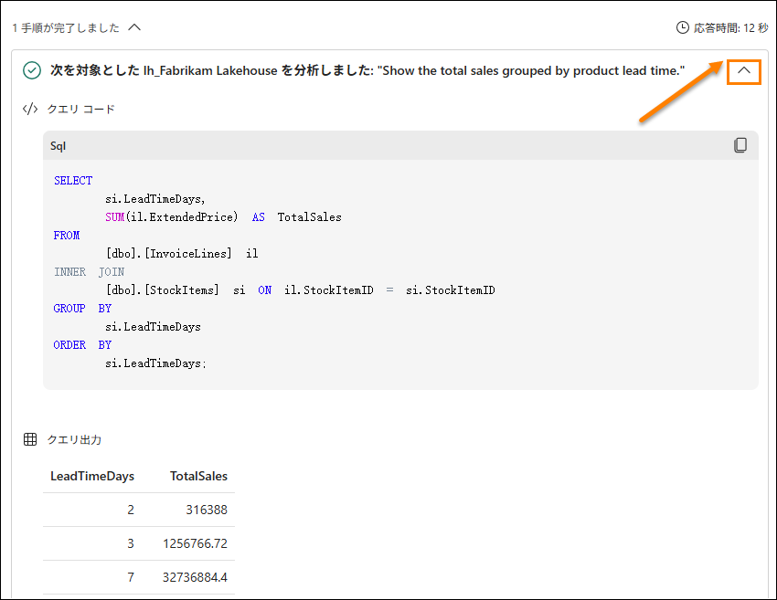

22. 重要なのは、データ エージェントによる結果を検証することです。使用された SQL コードがデータ エージェントによって明らかにされるので、それを確認してレイクハウスに対して実行し、結果が正しいか確認することができます。

    データ エージェントに対する特定のユーザー要求で、誤ったデータ ソースから結果が返されることがあります。たとえば、製品別の合計売上は、レイクハウス データ ソースまたはセマンティック モデルによる回答が可能です。データ エージェントによる要求への回答に目的のデータ ソースが確実に使用されるように、目的の結果を返す追加の AI 指示を加えることができます。

23. データ エージェントで AI 指示を開き、[エージェントの指示] セクションで以下の指示を追加します。

    **## Data Source Priority**

    **Always use the Fabrikam Company Sales Report to answer questions unless the user explicitly ask about lead time.**

    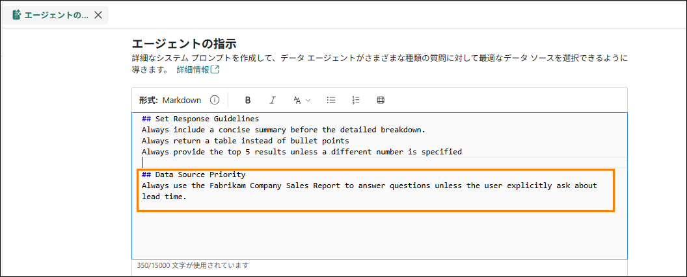

## スポットライト: データ ソース指示

1. 次に、データ ソース指示を見てみましょう。

2. AI への指示ペインで、レイクハウスの横にある省略記号を選択し、**データ ソース指示**を選択して、レイクハウスを展開します。セマンティック モデルとは異なり、AI 指示はレイクハウスのデータ ソース レベルでサポートされていることがわかります。

   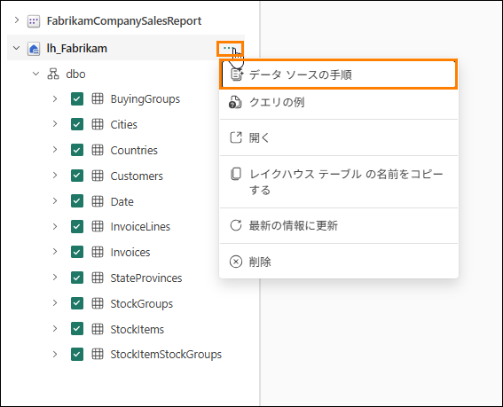

   ここにデータ ソース指示を追加すると、AI がレイクハウス内のデータをよりよく理解するのに役立ちます。明確に定義された AI 指示は、AI がビジネスのコンテキスト、用語、分析の優先順位を理解するのに役立ちます。

   このクラスで前にセマンティック モデルを AI 用に準備したときに、AI 指示のすべてについて学習しました。ここでその情報をすべて再確認することはしません。データ エージェントにさらに明確化が必要と思われるときに、追加することになります。

## タスク 6: 質問の例を作成する

データ エージェントを調整する作業は 1 回限りの設定ではなく、実験、監視、調整を含む継続的な反復プロセスです。調整プロセスには、データ ソースで多くの SQL または KQL を必要とする可能性がある複雑な質問に答える方法を AI が理解するのに役立つ、クエリの例を用意することが含まれます。

データ エージェントは、few-shot 例とも呼ばれるクエリの例を活用して、自然言語の質問を SQL または KQL (NL2SQL、NL2KQL) に変換する際の応答の正確性と関連性を改善できます。

**ℹ️ 重要**

現在、クエリの例の機能はセマンティック モデルではサポートされていません。

クエリの例は、2 つの部分から構成されるプロセスです。

1. まず、質問の例を指定します。AI は、ユーザーが指定した質問に意味的に類似した質問を一致させます。

2. 2 つ目として、クエリの例を指定します。このクエリは、複雑な結合や複雑な述語などの高度なシナリオを処理して、応答を形成するときにエージェントを支援します。

   質問の例に関するラボは、**このクラスの範囲外です**。ただし、クエリの例を作成する場合は、次の手順を実行できます。

3. レイクハウスの横の省略記号を選択し、**クエリの例**を選択してペインを開きます。

   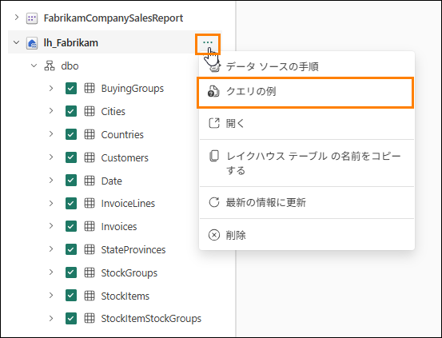

4. クエリの例のペインで、**例の追加**ボタンをクリックします。

   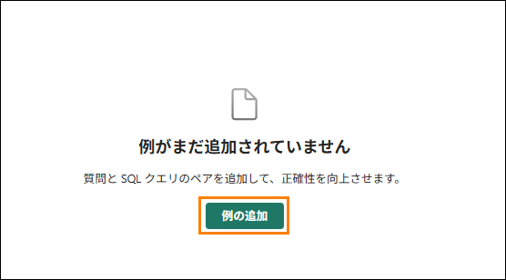

5. 質問の例を追加してから、Enter キーを押します。例: **Show sales by country that the product was manufactured in**。

   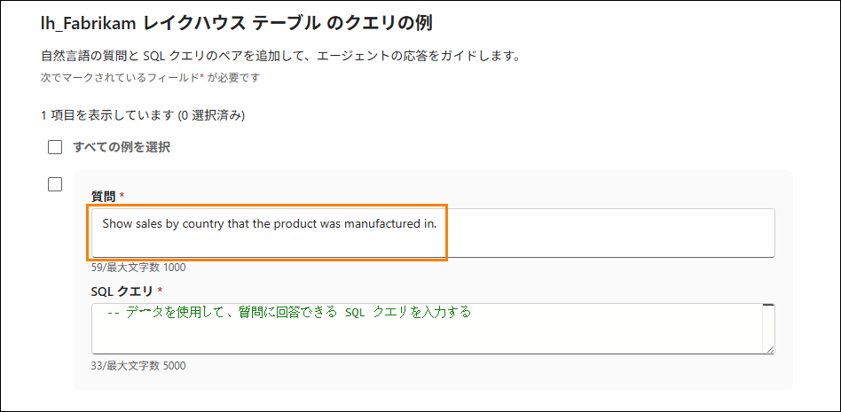

   **ℹ️ 重要**

   このコードは、このクラスの範囲外であるため、このラボには提供されていません。ただし、時間が許す場合は、自由に独自のコードを生成して探索することができます。

   [SQL クエリ] ダイアログ ボックスに、エージェントがこの種類の質問に回答するために使用すべき SQL を入力します。完了したら、右上隅の (X) をクリックし、エージェントをテストします。

   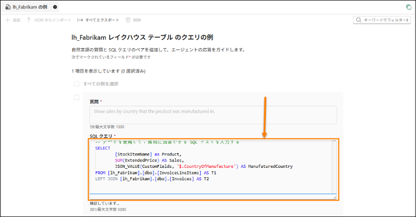

   **プロのヒント**: これらの質問はそれぞれ、地理的分析、フィルターされた集計、収益計算、階層的な時間分析など、さまざまな分析シナリオを対象としています。さまざまなバリエーションを試して、データ エージェントがさまざまな質問スタイルにどのように適応するかを確認してください。

   **さらに実験する**: エージェントでもっと複雑な質問をして、データ エージェントがユーザーの要求に応答するのに役立つ、質問と SQL のペアを作成してみてください。

## タスク 7: データ エージェントの公開と共有

1. ここでデータ エージェントを公開します。[ホーム] メニューの**公開**ボタンをクリックします。

   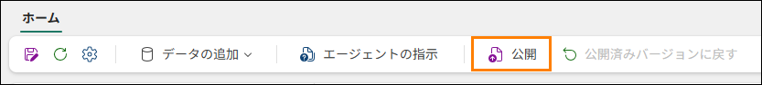

2. 次に、エージェントの説明を指定します。エージェントの目的と機能を含めます。**公開**をクリックします。

   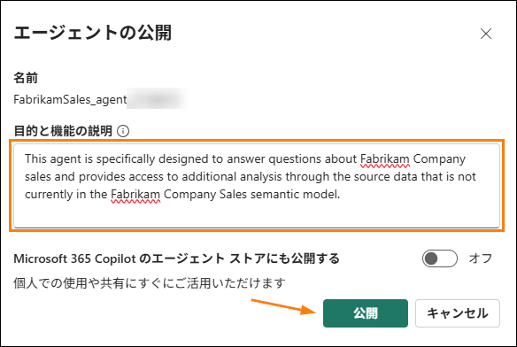

3. エージェントを公開した後、共有する必要があります。画面の右上隅にある**共有**をクリックします。

   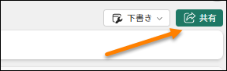

4. 開いた**リンクの作成と送信**ボックスで、**組織内のユーザーが表示できる**ボタンをクリックします。

   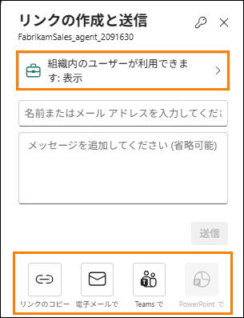

5. ここでアクセス許可の設定を選択し、次に**適用**をクリックします。

   **ℹ️ 重要**

   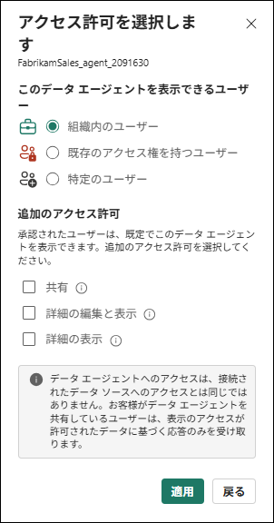

   データ エージェントへのアクセスは、接続されているデータ ソースへのアクセスと同じではありません。データ エージェントの共有先ユーザーは、表示アクセス許可があるデータに基づいた応答のみを受け取ります。

6. 公開された Fabric データ エージェントは、次に示すさまざまなプラットフォームで利用できます。
   - Microsoft Fabric

   - Copilot Studio

   - Microsoft Teams

   - Notebooks

   - Power BI Copilot

   - Azure AI Foundry

   - API 経由のカスタム アプリケーション

7. ワークスペースで、データ エージェントの上にカーソルを移動して、省略記号 **(...)** を表示します。

   

8. 省略記号をクリックして、**アクセス許可の管理**を選択します。

   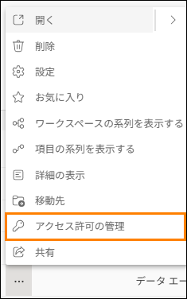

9. ここから共有したり、ワークスペースへのアクセスを介してエージェントに直接アクセスできるユーザーを管理したりすることもできます。[リンク] メニューから **+リンクの追加**を選ぶか、[直接アクセス] メニューから **+ユーザーの追加**を選びます。ワークスペースにユーザーを追加すると、そのユーザーにエージェントへのアクセス権を与えることになります。

   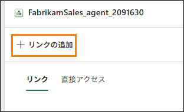

   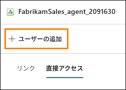

## タスク 8: Copilot からデータ エージェントを使用する

1. エージェントはさまざまな方法で使用できますが (上記のステップ 6 を参照)、スタンドアロン Copilot エクスペリエンスを通じてデータ エージェントを活用してみましょう。ワークスペースで、[Copilot] ボタンをクリックします。(注: [Copilot] ボタンを表示するには、サイド バーの省略記号をクリックすることが必要な場合があります。)

   (注意: この例では、必ずデータ エージェントをポイントしてください。)

   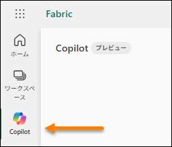

2. プラス記号を選択: Copilot で使用するオプションとしてエージェントが提供されています。これにより、スタンドアロン Copilot とデータ エージェント エクスペリエンスの違いが強調されます。

   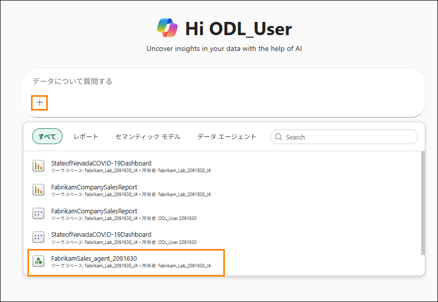

3. ワークスペースで、エージェントの上にカーソルを移動して、省略記号 (...) をクリックします。

   

4. メニューから**設定**を選びます。

   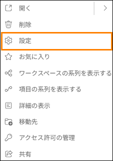

5. 新しいウィンドウから**承認**を選びます。

   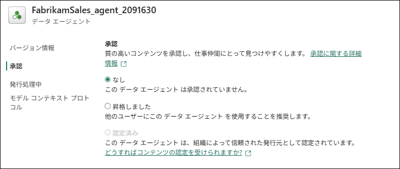

6. **Copilot** のコンテキスト、特に Power BI または Microsoft Fabric で**データエージェント**を使用する場合, **"データ** **エージェントを承認する"** とは、組織の環境内でそのエージェントに正式な承認または認証を与えることを意味します。これは通常、エージェントを昇格済みまたは認定済みとしてマークして、ユーザーが簡単に見つけて信頼できるようにすることを意味します。

# 参考資料

Chat With Your Data in a Day (CDIAD) では、Fabric ワークスペースでスタンドアロン Copilot を使用する際に重要な機能の一部を紹介します。

サービスのメニューにあるヘルプ (?) セクションには、いくつかの優れたリソースへのリンクがあります。表示されるビューはユーザーが現在使用しているエクスペリエンスによって異なるため、以下のスクリーンショットとはオプションが異なる場合があります。

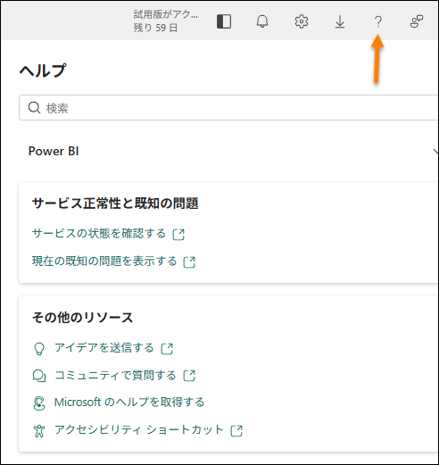

Microsoft Fabric の次のステップに役立つリソースをいくつか以下に紹介します。

- メインの [Microsoft Fabric ドキュメント](https://learn.microsoft.com/en-us/fabric/)のすべての情報にアクセスする

- [ガイド付きツアー](https://aka.ms/Fabric-GuidedTour)を通じて Fabric を探索する

- [Microsoft Fabric の無料試用版](https://aka.ms/try-fabric)にサインアップする

- [Microsoft Fabric の Web サイト](https://aka.ms/microsoft-fabric)にアクセスする

- [Fabric の学習モジュール](https://aka.ms/learn-fabric)で新しいスキルを学ぶ

- [Fabric 入門編の無料の e-book](https://aka.ms/fabric-get-started-ebook) を読む

- [Fabric コミュニティ](https://aka.ms/fabric-community)に参加し、質問の投稿やフィードバックの共有を行い、他のユーザーから学びを得る

Copilot についてより掘り下げる、次の技術ドキュメントを参照してください。

- [Power BI の Copilot の概要 - Power BI | Microsoft Learn](https://learn.microsoft.com/en-us/power-bi/create-reports/copilot-introduction)

- [Power BI のスタンドアロン Copilot エクスペリエンス (プレビュー) – Power BI | Microsoft Learn](https://learn.microsoft.com/en-us/power-bi/create-reports/copilot-chat-with-data-standalone)

- [Microsoft Fabric Copilot の管理設定 | Microsoft Learn](https://learn.microsoft.com/en-us/fabric/admin/service-admin-portal-copilot)

- [Fabric データ エージェントの作成 (プレビュー) - Fabric データ エージェントの作成方法 | Microsoft Learn](https://learn.microsoft.com/en-us/fabric/data-science/concept-data-agent)

- [データ エージェントを構成するためのベスト プラクティス - Microsoft Fabric | Microsoft Learn](https://learn.microsoft.com/en-us/fabric/data-science/data-agent-configuration-best-practices)

- [Microsoft Fabric と Power BI の Copilot: FAQ - Microsoft Fabric | Microsoft Learn](https://learn.microsoft.com/en-us/fabric/fundamentals/copilot-faq-fabric)

© 2026 Microsoft Corporation. All rights reserved.

このデモ/ラボを使用すると、次の条件に同意したことになります。

このデモ/ラボで説明するテクノロジまたは機能は、ユーザーのフィードバックを取得し、学習エクスペリエンスを提供するために、Microsoft Corporation によって提供されます。ユーザーは、このようなテクノロジおよび機能を評価し、Microsoft にフィードバックを提供するためにのみデモ/ラボを使用できます。それ以外の目的には使用できません。このデモ/ラボまたはその一部を、変更、コピー、配布、送信、表示、実行、再現、発行、ライセンス、著作物の作成、転送、または販売することはできません。

複製または再頒布のために他のサーバーまたは場所にデモ/ラボ (またはその一部) をコピーまたは複製することは明示的に禁止されています。

このデモ/ラボは、前に説明した目的のために複雑なセットアップまたは インストールを必要としないシミュレーション環境で潜在的な新機能や概などの特定のソフトウェア テクノロジ/製品の機能を提供します。このデモ/ラボで表されるテクノロジ/概念は、フル機能を表していない可能性があり、最終バージョンと動作が異なることがあります。また、そのような機能や概念の最終版がリリースされない場合があります。物理環境でこのような機能を使用するエクスペリエンスが異なる場合もあります。

**フィードバック。**このデモ/ラボで説明されているテクノロジ、機能、概念に関するフィードバックを Microsoft に提供する場合、ユーザーは任意の方法および目的でユーザーのフィードバックを使用、共有、および商品化する権利を無償で Microsoft に提供するものとします。また、ユーザーは、フィードバックを含む Microsoft のソフトウェアまたはサービスの特定部分を使用したり特定部分とインターフェイスを持ったりする製品、テクノロジ、サービスに必要な特許権を無償でサード パーティに付与します。ユーザーは、フィードバックを含めるために Microsoft がサード パーティにソフトウェアまたはドキュメントをライセンスする必要があるライセンスの対象となるフィードバックを提供しません。これらの権限は、本契約の後も存続します。

Microsoft Corporation は、明示、黙示、または法律上にかかわらず、商品性のすべての保証および条件、特定の目的、タイトル、非侵害に対する適合性など、デモ/ラボに関するすべての保証および条件を拒否します。Microsoft は、デモ/ラボから派生する結果、出力の正確さ、任意の目的に対するデモ/ラボに含まれる情報の適合性に関して、いかなる保証または表明もしません。

**免責事項**

このデモ/ラボには、Microsoft Power BI の新機能と機能強化の一部のみが含まれています。一部の機能は、製品の将来のリリースで変更される可能性があります。このデモ/ラボでは、新機能のすべてではなく一部について学習します。
