# Microsoft Fabric Chat with your Data in a Day - 랩 01

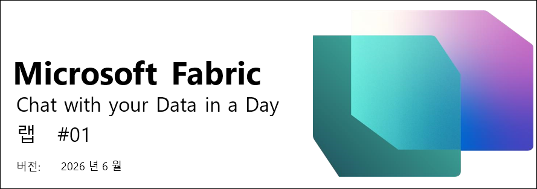

## 목차

- 문서 구조
- 시나리오/문제 설명
- 소개
  - 작업 1: 가상 환경에서 작업하기
  - 작업 2: 데이터의 AI 준비 상태 평가
  - 작업 3: Power BI Copilot에서 프롬프트 작성하기

# 문서 구조

이 랩에서는 사용자가 수행해야 하는 단계를 보조 시각 자료의 관련 스크린샷과 함께 확인할 수 있습니다. 스크린샷에서 주황색 상자로 강조 표시된 섹션은 사용자가 특히 주목해야 하는 영역입니다.

# 시나리오/문제 설명

조직은 최근 Microsoft 컨퍼런스에서 Copilot이 지원하는 Chat with your Data 환경이 인사이트 도출 시간을 획기적으로 단축할 수 있다는 점을 직접 확인하고 돌아왔습니다. 데모에서는 자연어 질의가 어떻게 강력한 분석을 가능하게 하는지 보여주었으며, 이는 기반이 되는 의미 체계가 AI에 최적화되어 체계적으로 구축되었을 때 가능합니다.

**현재 목표**

Power BI Desktop 내에서 기존 의미 체계 모델을 평가하도록 요청받았습니다. 목표는 Copilot 환경에서 성능을 테스트하고 개선이 필요한 부분을 파악하는 것입니다.

Copilot 인터페이스 내장 PBI Desktop을 사용하여 의미 체계 탐색

Copilot이 의도를 해석하는 데 어려움을 겪는 마찰 지점 식별

Copilot의 이해도를 높이기 위한 개선 사항 제안 및 구현

조사 결과를 문서화하고 모델을 조직 전체에서 활용할 수 있도록 준비

# 소개

강사 데모에서는 Chat with your data 환경이 얼마나 뛰어난지 확인하셨습니다. 이번 랩에서는 AI를 위해 데이터 모델을 준비하는 것이 얼마나 필수적인지 살펴보게 됩니다. 이 랩에서는 다양한 사용자 요청과 Copilot이 해당 요청에 응답하는 방식을 보여줍니다. 또한 응답의 정확도와 타당성을 검증하는 방법도 확인하실 수 있습니다. 향후 랩에서는 모범 사례를 적용하고 데이터 준비 도구를 활용하여 Copilot 환경을 향상시키고 개선하는 방법을 배우게 될 것입니다!

## 작업 1: 가상 환경에서 작업하기

1. 가상 환경은 Chat with Your Data 기능을 활용할 수 있는 공간을 제공한다는 점에서 탁월한 환경을 선사합니다! 주요 영역과 포인트 몇 가지를 살펴보겠습니다.

    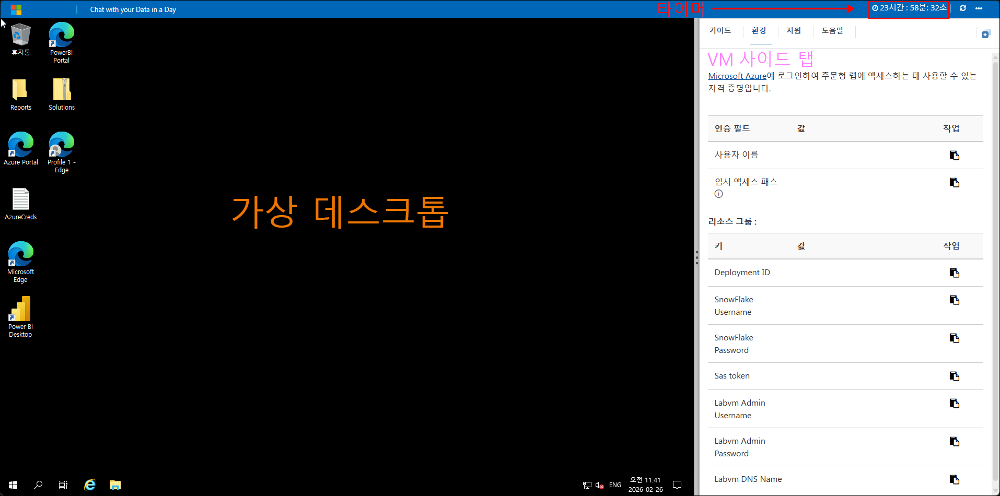

2. 주요 영역을 살펴보겠습니다.

    - 가상 데스크톱은 브라우저에서 사용할 수 있는 완전한 기능을 갖춘 컴퓨터 역할을 합니다!

    - VM 사이드 탭에서는 랩 문서, 개인 인증 정보 등을 이용할 수 있습니다.

    **ℹ️ 중요**

1. 랩 수업 내내 이 **중요** 상자에는 유용한 정보가 상세히 설명됩니다. 절대 건너뛰지 마세요! 예를 들어, VM 사이드 탭이 보이지 않는다면 아래 그림과 같이 완전히 펼치도록 합니다.

    타이머는 가상 머신을 사용할 수 있는 남은 시간을 표시합니다.

    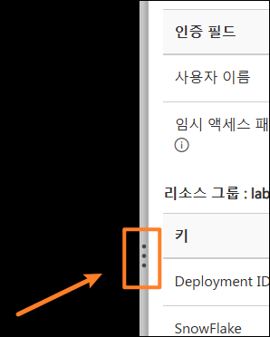

3. 사이드 탭 하단의 페이지 번호를 사용하여 랩을 쉽게 탐색할 수 있습니다.

    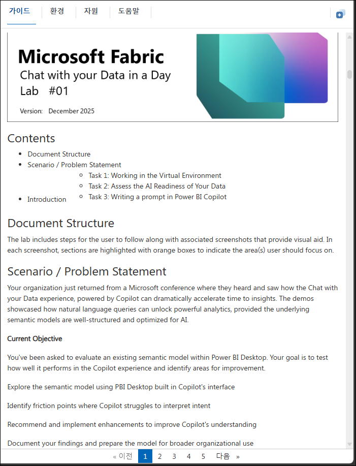

4. 수업 중에는 가상 머신 내에서 완전히 작업할 수 있습니다. 그러나 일부 참석자는 시크릿 브라우저를 사용하여 작업하고, 부여받은 가상 머신 개인 인증 정보로 Power BI Desktop에 로그인하는 것을 선호합니다. 이는 완전히 허용됩니다!

## 작업 2: 데이터의 AI 준비 상태 평가

1. 이제 가상 머신의 주요 영역을 살펴보셨으니, Power BI 포털 버튼으로 이동하여 Power BI 서비스를 실행합니다.

    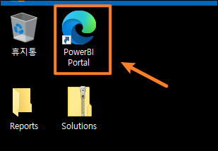

2. 자격 증명 페이지와 문서에 기재된 자격 증명을 사용하여 이메일 액세스 영역에 이메일을 입력합니다.

    - **사용자 이름/이메일:** <inject key="AzureAdUserEmail"></inject>

        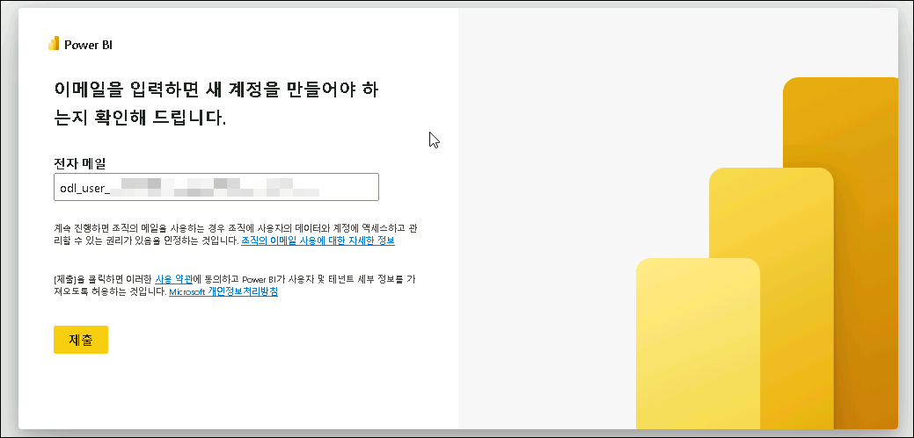

3. 그런 다음 동일한 자격 증명으로 Microsoft **로그인** 상자를 사용하고 **다음**을 클릭합니다.

    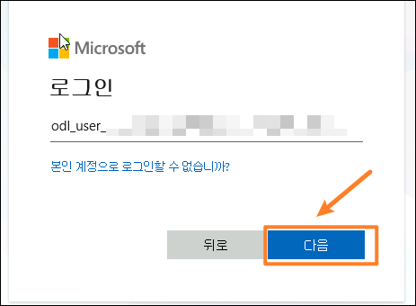

4. 자격 증명 페이지 또는 랩 문서에서 제공된 **임시 액세스 패스**를 입력하고 **로그인**을 누릅니다. 필요에 따라 예를 선택하여 로그인 상태를 유지합니다.

    - **암호:** <inject key="AzureAdUserPassword"></inject>

        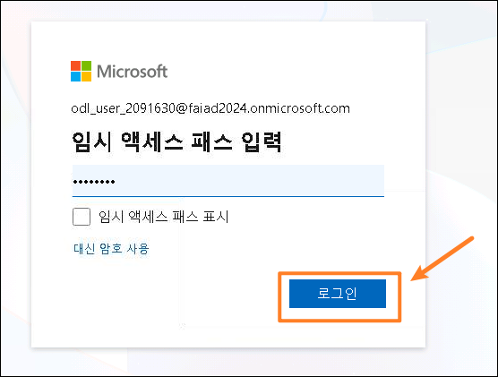

5. 먼저 왼쪽 메뉴의 **작업 영역**으로 이동하겠습니다.

    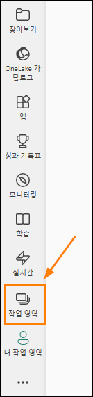

6. 이제 새 작업 영역 버튼을 선택하여 **새 작업 영역**을 만듭니다.

    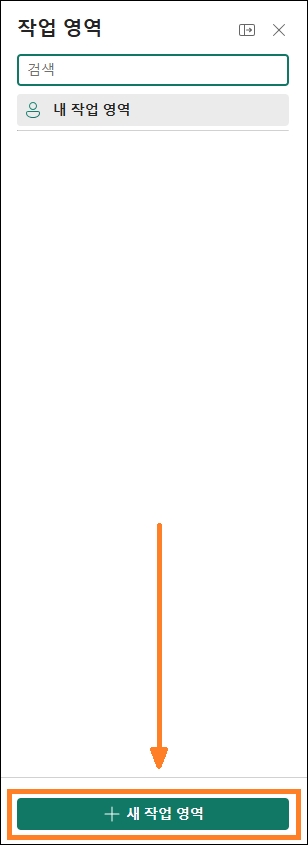

7. 다음으로 작업 영역 이름을 **Fabrikam_Lab_<inject key="DeploymentID" enableCopy="false"></inject>** 로 지정합니다.

    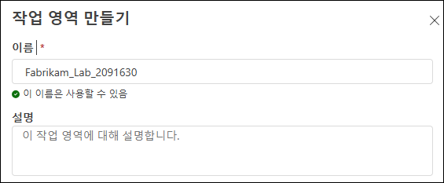

8. 7자리 코드는 수업에 할당된 사용자 이름의 일부입니다. 이 코드를 사용하세요. 아래 스크린샷을 참조하세요.

    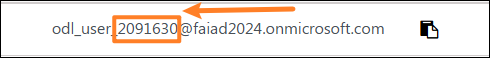

9. 예를 들어, John A. Smith의 경우: **Fabrikam_Lab_<inject key="DeploymentID" enableCopy="false"></inject>**

    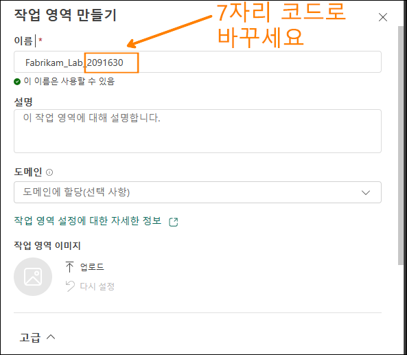

10. 다음으로, 작업 영역에 Fabric 용량을 할당해야 합니다.

11. 작업 영역 설정 시 고급 옵션을 확장하려면 **고급**을 클릭합니다.

    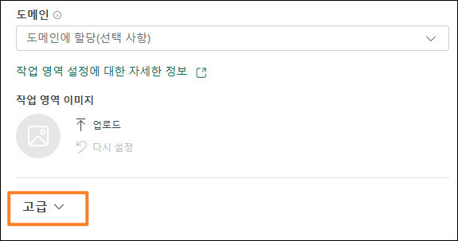

    **ℹ️ 중요**

2. 이 수업에 사용되는 Fabric 환경은 자주 업데이트되므로 아래 스크린샷에 표시된 것과 동일한 용량을 사용할 수 없을 수도 있습니다. 사용 가능한 용량을 선택하기만 하면 됩니다!

    **Fabric 용량**이 선택되었는지 확인합니다. 조금 더 아래로 스크롤하여 드롭다운 메뉴에서 **임의로** 용량을 선택합니다.

    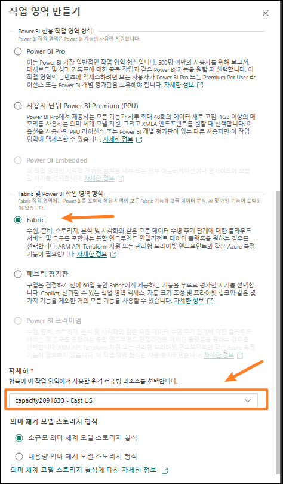

12. **적용** 을 클릭합니다.

    

    좋습니다! Fabric 용량 작업 영역을 사용하여 Chat with Your Data가 제공하는 모든 기능을 탐색해 보겠습니다!

13. 수업 파일에서 **CDIAD – Lab 01 – Start**라는 파일을 열어 Chat with your Data 환경을 탐색합니다.

    

14. Power BI Desktop 파일에 이메일 주소를 입력하고 계속을 눌러 개인 인증 정보로 로그인합니다.

    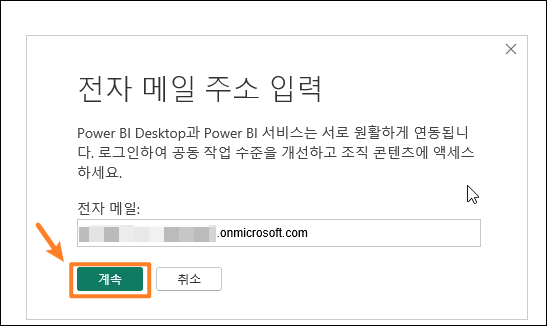

15. 또한 Microsoft 로그인 창에서 동일한 **사용자 이름:** **<inject key="AzureAdUserEmail"></inject>** 및 **임시 액세스 패스:** **<inject key="AzureAdUserPassword"></inject>** 를 사용하여 로그인하세요.

    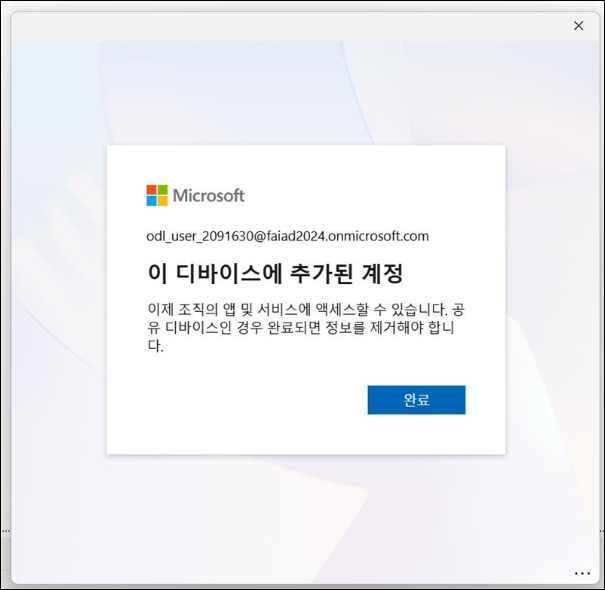

16. 시작 PBIX 파일을 연 상태에서 Copilot 버튼으로 이동하여 선택하면 Copilot 환경이 열립니다.

    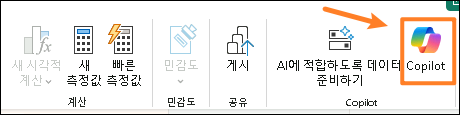

17. 이미 로그인된 경우, **Copilot을 지원하는 작업 영역에 연결**을 위한 새 창이 열립니다. **작업 영역 선택** 옵션을 클릭하고 방금 생성한 작업 영역을 선택합니다.

    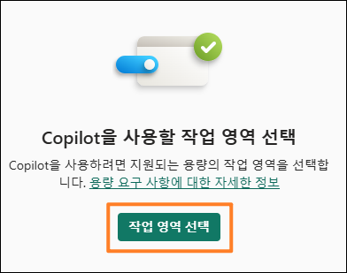

    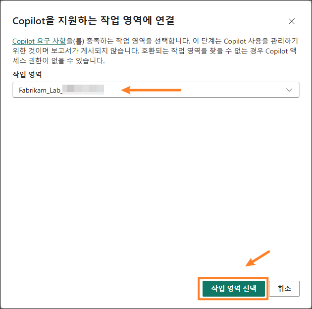

18. 다음 화면에서 프롬프트가 표시되면 **시작**을 클릭합니다.

    

19. Power BI의 Copilot 환경에 오신 것을 환영합니다! 이 시작 화면 상단에는 몇 가지 프롬프트 아이디어가 표시되며 **(1)**, 하단에는 요청 내용을 작성할 수 있는 영역이 있습니다**(2)**.

    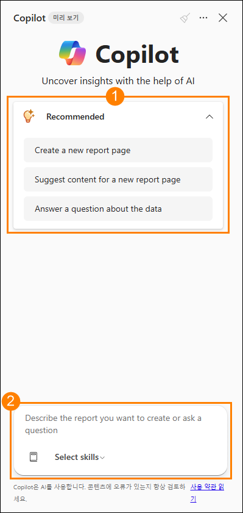

## 작업 3: Power BI Copilot에서 프롬프트 작성하기

이 섹션에서는 다양한 프롬프트를 작성하고 Power BI Copilot 환경이 반환하는 결과를 살펴봅니다.

1. 프롬프트 영역을 클릭한 후 **Show total purchases by employee**를 입력합니다. 그런 다음 **Enter**를 클릭합니다.

    

    **가능한 옵션:**

    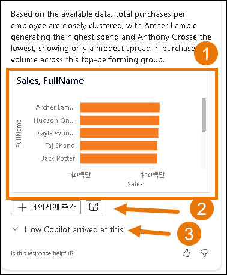

    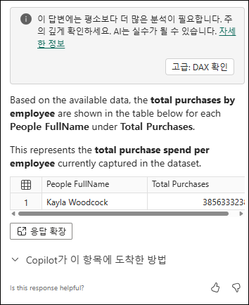

    **ℹ️ 중요**

    AI는 여러 요인으로 인해 비결정적 결과를 반환합니다. 이 수업에서 이전에 논의한 바와 같이, 여러분의 결과는 달라질 수 있으며 랩과 동일하지 않을 수 있습니다. 위에서 언급했듯이, 이렇게 준비되지 않은 AI 데이터는 동일한 질문에 대해 다양한 결과를 보일 것입니다. 최선을 다해 표시되는 기능과 특징을 탐색해 보세요!

    아래와 같은 후속 질문이 나올 수도 있습니다.

    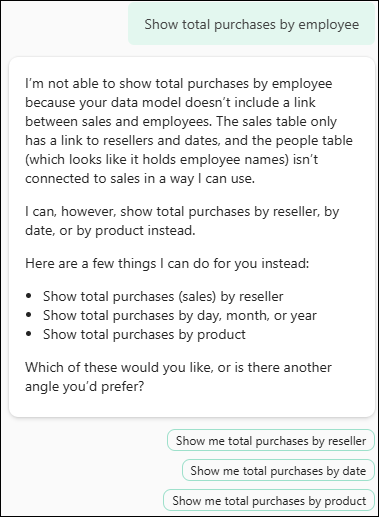

    필요한 경우, **Show total purchases by employee** 또는 **계속 프롬프트 입력** 과 같은 가장 유사한 항목을 선택하세요.

2. 많은 정보가 반환됩니다. 이 섹션을 자세히 살펴보겠습니다.

    1. **(1)** 총 구매액과 직원 수를 비교한 시각화.

    2. **(2)** 시각화를 **페이지에 추가**하거나** 팝아웃**하여** 확장**할 영역.

    3. **(3)** *HCAAT*: Copilot이 이 결론에 도달한 과정.

        

3. *HCAAT*: **How Copilot arrived at this** 버튼을 클릭하여 Copilot 답변의 논리를 확인합니다.

    **가능한 옵션:**

    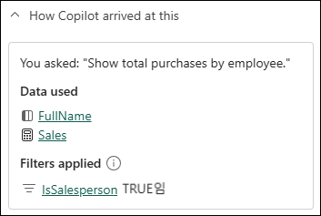

    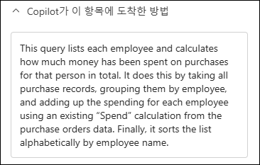

4. ***FullName***,***Sales*** 및 ***IsSalesperson*** 위로 마우스를 가져가면 Copilot이 질문에 답변하는 데 사용한 항목에 대한 **필드** 및 **홈 테이블**을 모두 볼 수 있습니다.

    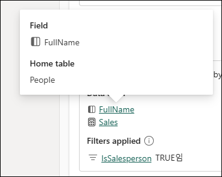

    안타깝게도 이 결과는 잘못되었습니다. Total Purchases을 요청했는데 **총**** 판매액**이 반환되었습니다! 다른 DAX 쿼리는 직원 한 명만 조사했습니다. 데이터 준비가 필요한 것 같습니다! Copilot용으로 준비되지 않은 데이터는 막 입사한 신입 데이터 분석자와 같고, Copilot용으로 준비된 데이터는 귀사의 특정 조직에서 다년간 환경을 쌓은 노련한 분석자에게 질문하는 것과 같습니다.

    Copilot에 대한 데이터를 준비할 때 고려해야 할 두 가지 주요 사항이 있습니다.

    첫째, 더 구체적인 내용을 담은 개선된 프롬프트를 작성할 수 있습니다. 이는 확실히 도움이 될 것입니다. 그러나 많은 사용자는 효과적인 프롬프트 작성법을 모를 뿐만 아니라 데이터를 충분히 이해하지 못해 구체적으로 요청하지 못할 수 있습니다.

    **ℹ️ 중요**

    Copilot의 응답은 질문 방식에 따라 달라집니다. uㄹ책명확하고 구체적인 프롬프트는 더 정확한 인사이트와 빠른 솔루션을 이끌어냅니다. 데이터를 작업할 때는 컨텍스트, 원하는 결과, 관련 필터나 열을 포함하도록 노력하세요. 프롬프트가 좋을수록 응답도 더 좋아집니다!

    둘째, 데이터 분석자로서 우리는 Copilot을 위한 데이터를 준비하고 이러한 유형의 요청을 예측하여 Copilot 응답의 정확도를 높일 수 있습니다. 이 수업의 목적은 Chat with your Data 환경을 개선하기 위해 활용 가능한 모든 모범 사례와 도구를 가르치는 것입니다.

5. Copilot 프롬프트 유형에 더 구체적인 프롬프트를 입력해 다시 시도해 보겠습니다. **Show total purchases from the PO table by employee.**

    

6. 생성된 시각적 개체에는 'Kayla Woodcock'이라는 단일 직원이 표시됩니다. 이는 정확합니다. Kayla가 유일한 구매 담당자이기 때문입니다. 따라서 구체성을 높여 더 나은 응답을 얻을 수 있습니다. 또한, 초기 단계에서 Total Purchases라는 측정값으로 의미 체계를 사전 준비했다면 이런 상황을 피할 수 있었을 것입니다!

    **가능한 옵션:**

    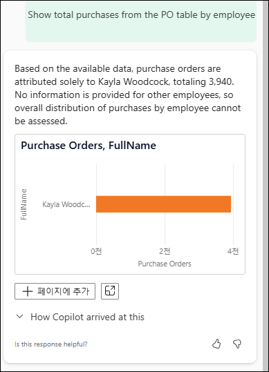

    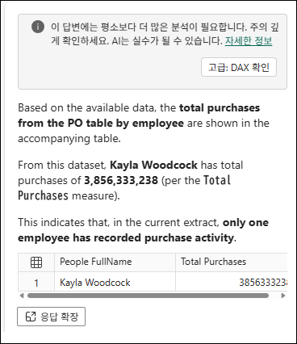

7. 결과와 Copilot이 답에 도달한 과정을 항상 검증하는 것이 매우 중요합니다. **HCAAT** (How Copilot arrived at this)를 클릭합니다.

    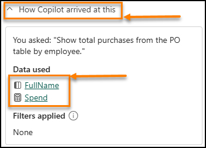

    Copilot이 DAX 쿼리를 제공하면 **DAX 확인**을 누릅니다.

    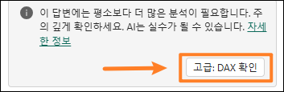

8. Copilot이 People 테이블의 FullName 열과 Spend 측정값을 사용하고 있음을 확인할 수 있습니다. DAX 쿼리도 동일한 작업을 수행하고 있습니다. Copilot 경험을 개선하려면 Spend 측정값의 이름을 더 명확하게 지정하는 것이 좋을 것입니다.

    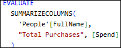

9. 이 맥락에서 Spend는 무엇을 의미하나요? Purchases와 동일한 개념인가요? Copilot으로부터 여전히 잘못된 응답을 받고 있을 가능성이 있습니다. Copilot에게 Spend이 어떻게 계산되는지 설명해 달라고 요청해 보겠습니다!

10. Copilot 프롬프트에 다음을 입력합니다. **How is the measure Spend calculated**

    **가능한 옵션:**

    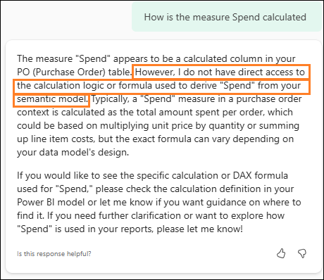

    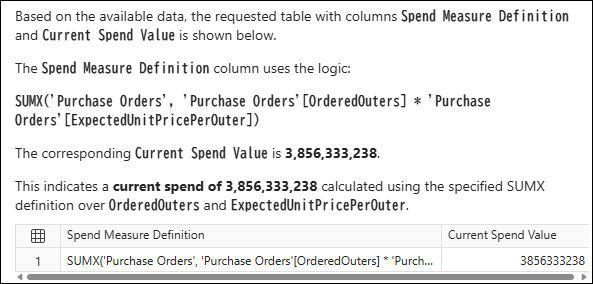

11. Copilot은 계산 방식에 대한 일반적인 설명을 잘 제공합니다 그러나 이 정의에는 '일반적으로' 또는 '보통'과 같은 표현이 포함될 수 있습니다. 이는 일반화한 설명이기 때문입니다. 또한 Copilot이 정확한 공식이나 계산 논리에 접근할 수 없어 구체적인 답변을 제공할 수 없다고 명시적으로 밝히고 있음을 확인할 수 있습니다.

    다른 이미지에서는 Copilot이 실제 측정값을 성공적으로 파악하고 설명하며, 현재 필터 컨텍스트 내에서 지출과 관련된 답변을 제공했습니다!

    **ℹ️ 중요**

    향후 랩에서는 이러한 질문에 답하고 사용자가 Copilot 응답에 더 큰 신뢰를 가질 수 있도록 필요한 추가 비즈니스 컨텍스트를 Copilot에 제공하는 방법을 배울 것입니다.

12. 이제 더 확장하여 Copilot이 데이터 모델과 보고서의 변경 사항에 어떻게 적응하는지 보여주는 시각적 개체를 만들어 보겠습니다.

13. Copilot 프롬프트에 다음을 입력합니다. **Create a new report page with a bar chart visual for sales and product tag.**

    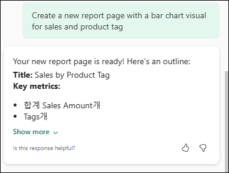

    다음과 같이 Copilot에 계속 프롬프트를 입력해야 할 수 있습니다.

    

    **Total Sales** and **Product Tag** 요소를 최대한 일치시키도록 노력합니다.

    Copilot이 완전히 새로운 보고서 페이지에 시각적 개체를 구성했음을 확인합니다!

    **가능한 옵션:**

    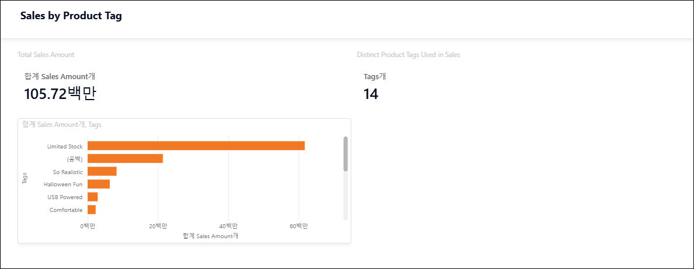

    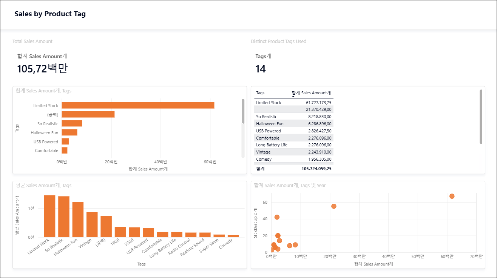

14. Copilot에서 생성한 막대형 차트 시각적 개체를 선택하고 **모델 보기**로 이동합니다. 데이터 모델을 우회하는 필터가 포함되어 있음을 확인합니다. 이는 놀라운 일입니다. 현재 데이터 모델에서는 일반적으로 제품 태그와 총 매출이 함께 작동하지 않기 때문입니다.

    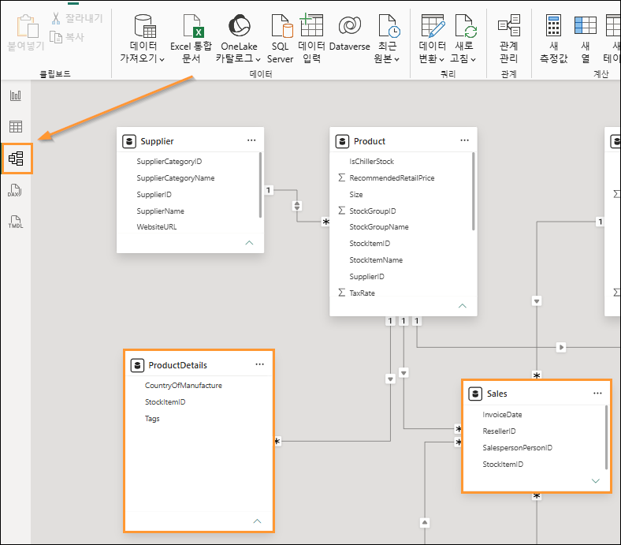

15. 일부 값이 이중으로 계산될 수 있으므로 이를 제거하겠습니다. **보고서 보기**로 돌아가서 그래프가 여전히 선택되어 있는지 확인하세요.

    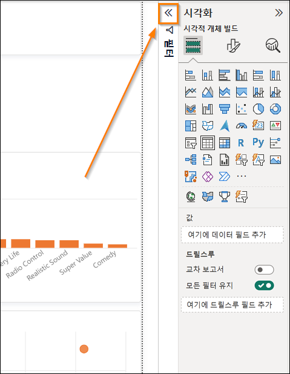

16. 오른쪽의 이 시각화 항목 필터링 아래에 있는 **필터 탭**으로 이동하여 막대 차트의 축에서 'Product Details that have Products'를 제거합니다.

    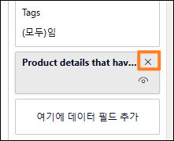

17. 모든 값이 **\$105,724,059**로 동일하다는 점을 확인합니다. Copilot이 생성한 시각적 개체에서 데이터 막대에 마우스를 올리면 이를 확인할 수 있습니다. 이는 의미 체계 내 관계 설정이 잘못되었음을 보여주는 결정적인 증거입니다.

    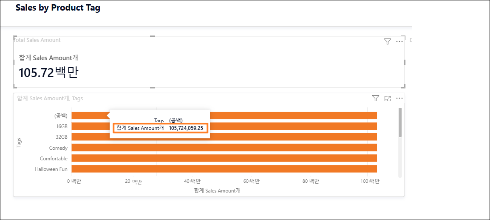

18. 위에서 Copilot이 반환한 응답은 의미 체계 설계 문제로 인해 잘못되었습니다. Copilot은 우리의 요청에 맞춰 조정할 수 있는 필터를 생성해냈습니다! 이는 AI를 위해 준비된 데이터 모델의 중요성을 보여줍니다. 향후 랩에서는 테이블과 관계 구조를 살펴보고 Copilot 경험을 개선하기 위한 방법을 알아보겠습니다!

19. 시각적 개체는 Copilot 응답에 문제가 있음을 매우 명확하게 보여줍니다. 이 데이터를 확인하는 또 다른 방법은 Copilot에 질문을 하고 응답을 보는 것입니다. Copilot 프롬프트에 다음을 입력합니다. **Show total sales by product tag**.

    

20. Copilot은 응답에서 판매량에 **변동이 없다**고 명시적으로 알려줍니다. Copilot에서 이런 표현을 볼 때마다 무언가 정확하지 않을 수 있다는 신호입니다.

    

21. Copilot에게 다른 질문을 해봅시다. **Show total sales by State**.

    

    여러 가지 응답을 받을 수 있으며, *결과는 달라질 수 있습니다.* 한 가지 가능한 응답은 다음과 같습니다.

    **가능한 옵션:**

    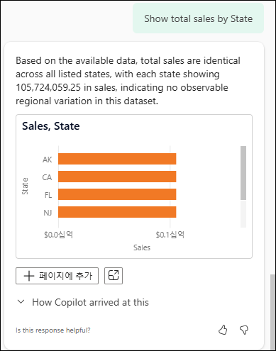

    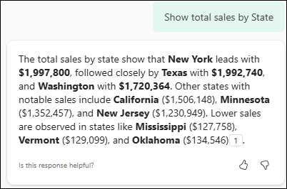

22. 이 응답은 정확하지 않습니다. 다시 말해, 데이터 모델 오류가 있는 걸까요? 데이터 모델 문제일 수도 있고, 우리의 표현이 모호해서일 수도 있습니다. *HCAAT*: Copilot이 이를 어떻게 도출했는지 선택하고, 사용된 ***State*** 및 ***Sales*** 데이터 위에 마우스를 올려 놓습니다. ***Sales***는 Sales 테이블의 명시적 측정값을 통해 정확히 수집되고 있지만, ***State*** 필드는 Customer 테이블에서 가져온 것입니다!

    

23. 모델 보기로 이동하여 Customer와 Sales를 연결하는 데이터 모델 관계를 검토합니다. 이 관계가 우리의 잘못된 시각화를 완벽하게 설명해 줍니다! 이제 언어와 데이터 모델이 반드시 일치해야 함을 알 수 있습니다.

    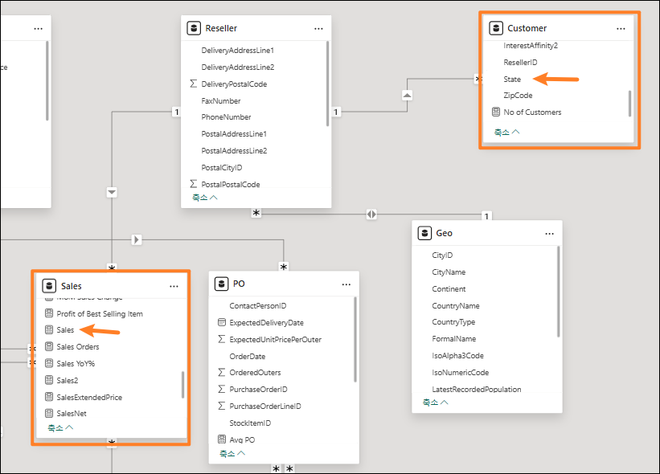

    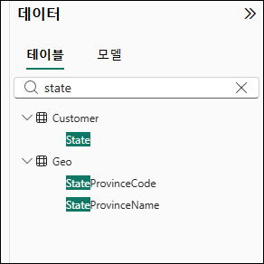

    이 시나리오에서는 State의 변형이 있는 여러 테이블과 여러 판매 측정값이 존재합니다. 이는 일관성 없는 응답과 오해의 소지가 있는 결과를 초래할 수 있습니다. 후속 랩에서 Copilot이 이러한 유형의 사용자 요청에 응답하는 데 도움이 되는 다양한 기법을 배우게 될 것입니다.

24. 다른 프롬프트인 **Sales by State**를 사용해 보겠습니다.

    

25. 아래 스크린샷에서 텍사스 주의 매출이 **\$461,457 또는 \$2 million**으로 가장 높다는 것을 확인할 수 있습니다. 이 답변은 보고서 내 시각적 개체를 참조하여 생성되었으며, 실제로 한 시각적 개체에는 필터가 적용되어 있습니다! 결과가 아래 스크린샷과 동일하다면 참조 항목을 클릭합니다. 그러면 참조된 페이지와 시각적 개체로 이동합니다.

    **가능한 옵션:**

    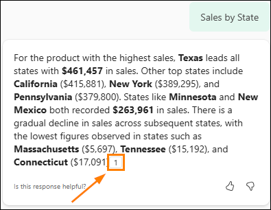

    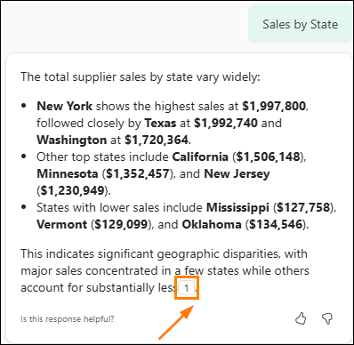

26. 이제 하단 리본 메뉴에 있는 최고 판매 상품 탭으로 이동합니다.

    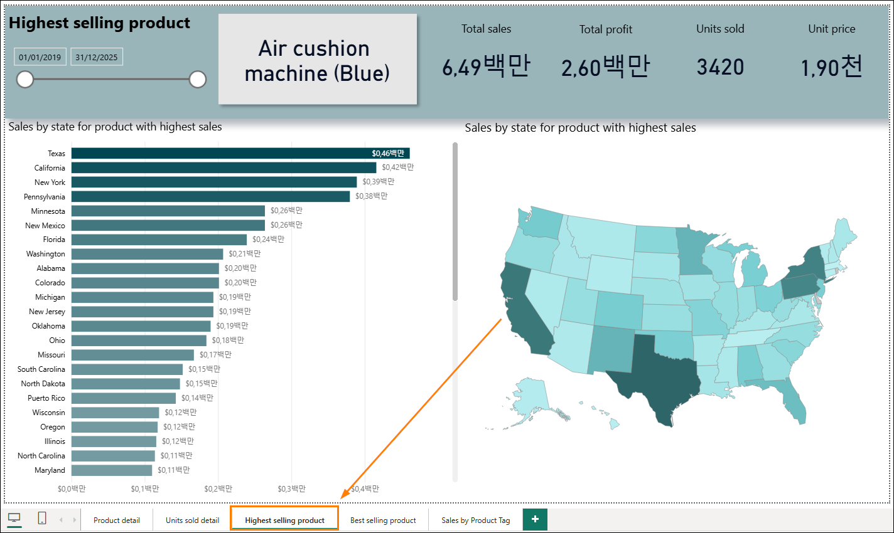

27. 첫눈에 답변이 정확해 보일 수 있지만, 시각화에 적용된 잠재적 필터를 살펴보세요. 아직 확장하지 않았다면 필터 패널을 펼치세요. 아직 확장하지 않았다면 필터 패널을 펼칩니다.

    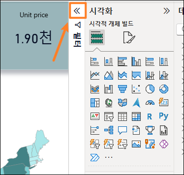

28. 시각화에 필터가 적용되어 있어 Copilot의 응답이 달라질 수 있습니다. 필터를 확장하면 **이 그래프는 가장 많이 팔린 제품의 판매량만 보여줍니다** 를 확인할 수 있습니다. (지도 시각화 요소가 선택되어 있는지 확인하세요)

    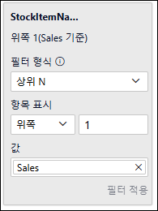

    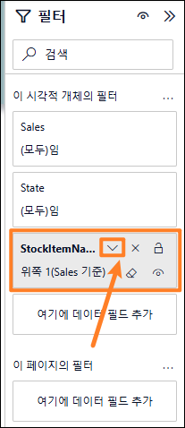

    **ℹ️ 중요**

    필터는 시각적 개체, 페이지, 보고서, 심지어 슬라이서 수준에서도 있을 수 있습니다. Copilot은 때때로 필터가 적용된 시각적 개체에서 응답을 생성할 수 있지만, 필터가 적용되고 있다는 사실을 최종 사용자에게 알리지 않을 수 있습니다! 이 과정 후반부에서는 이러한 유형의 응답을 돕기 위해 AI 지침을 추가하는 방법을 논의할 것입니다.

    이 필터를 제거하면 참조 시각적 개체의 값이 급격히 변하는 것을 확인할 수 있습니다.

    

29. 텍사스 주의 매출액이 **\$7,256,794**로 표시됩니다. 다른 옵션들과 크게 다르지 않나요? 자세히 살펴보면, 한 시각적 개체는 **Sales** 측정값을 사용하고 다른 개체는 **Supplier Sales**를 사용했음을 알 수 있습니다. 이는 AI를 위해 데이터를 준비해야 하는 더 큰 이유입니다.

    

    

30. 동일한 질문을 다시 하면 어떻게 될까요? Copilot에게 **Sales by State**를 한 번 더 요청해 봅니다.

    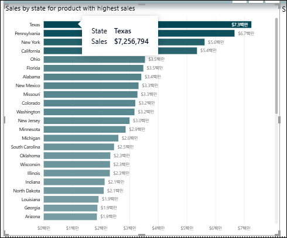

    

31. 필터가 없으면 동일한 참조에서 완전히 다른 값 집합이 나타납니다. 이는 AI를 위한 데이터 준비 과정에서 주목해야 할 중요한 측면입니다.

    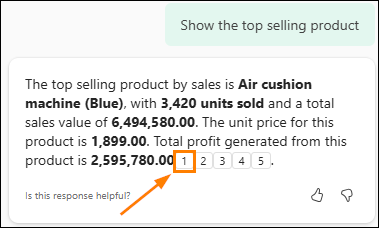

32. 여러 참조를 반환하는 응답은 어떻게 되나요? Copilot에게 다른 질문을 해보세요. **Show the top selling product**.

    

33. 참조를 선택하고 존재할 수 있는 불필요한 필터가 있는지 확인합니다.

    
    

34. Reseller 테이블에서 **ResellerCompany** 필터를 페이지에 추가합니다.

    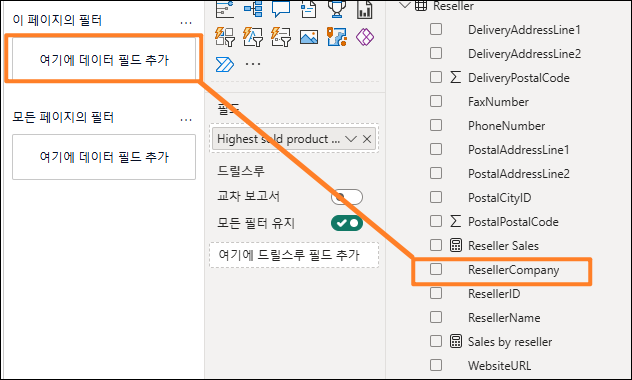

35. TailSpin Toys만 선택하면 값이 변경된 것을 확인할 수 있습니다.

    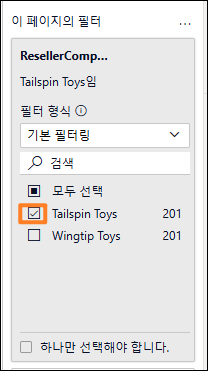

36. 이제 다시 질문을 던져보겠습니다. **Show the top selling product**.

    

37. 제품은 동일할 수 있지만 수치는 크게 다릅니다. 이 예시는 준비되지 않은 의미 체계가 일관성 없고 잘못된 결과를 제공할 수 있음을 보여줍니다.

    

38. 여기서 Copilot을 활용하고 검토해야 할 또 다른 영역은 Data Analysis Expressions(DAX) 언어 통합입니다. 다음과 같은 계산이 포함된 질문을 해 봅니다. **Calculate the percent of total sales in the Southeast to the United States**

    

39. 응답에서 Copilot이 평소보다 더 많은 분석이 필요함을 인지하는 것을 확인할 수 있습니다. 이는 필요 시 계산을 추가로 검증해야 함을 알려주는 유용한 기능입니다.

    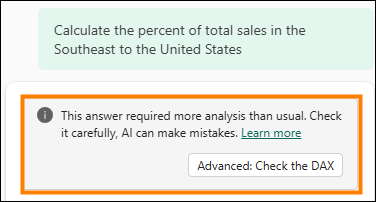

40. 이 특정 계산에는 Copilot이 DAX를 작성해야 했습니다. 사용된 DAX는 두 가지 방법으로 확인할 수 있습니다. 첫째, **고급: DAX 확인** 및 **응답 확장** 영역입니다.

    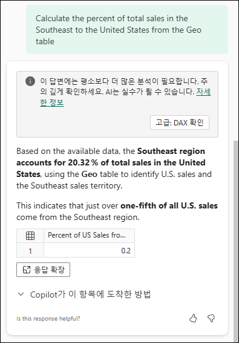

41. 답변을 구성하는 데 사용된 DAX를 확인하려면 **DAX Query** 탭을 보고 있는지 확인합니다. 쿼리는 논리 설명과 함께 나열됩니다. 두 가지 질문을 해야 합니다. (1) 여기서 DAX가 올바르게 보이나요? (2) 남동부 지역이 정말 **20.32%**였나요?

    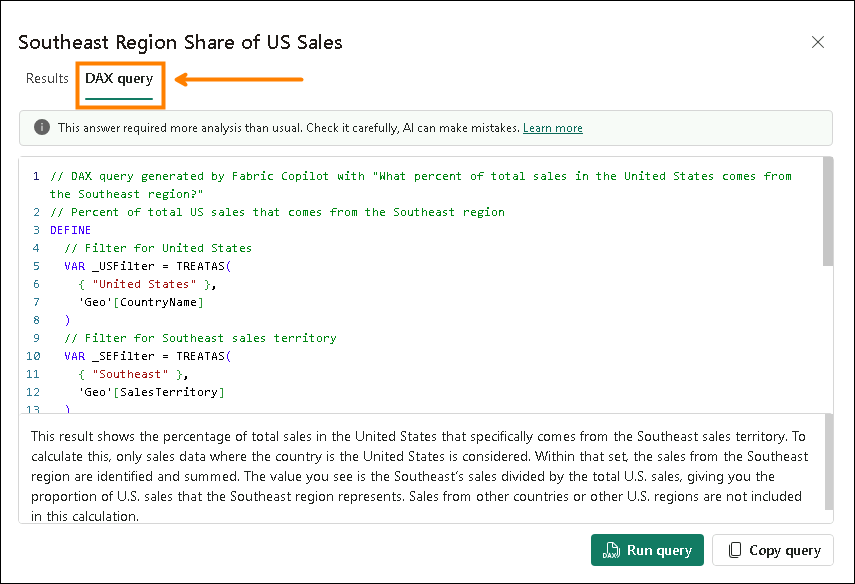

42. Copilot이 DAX를 생성할 때마다 결과는 종종 매우 다르고 일관성이 없을 수 있습니다. 생성된 DAX는 본 섹션의 스크린샷과 같을 수도, 다를 수도 있습니다! 이 코드에서 DAX는 **Geo** 테이블에서 주 정보를 가져오는데, 이는 작동하지만 **Customer** 테이블에서 위치 정보를 가져올 수도 있었습니다. Customer 테이블에서 가져왔다면 결과는 3~4%에 불과했을 것입니다.

    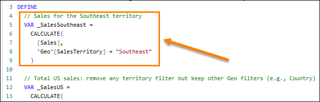

43. 그렇다면 이 문제를 해결할 방법은 무엇일까요? 가장 효과적인 방법은 **AI를 위한 데이터 준비** 단계에서 활용할 예정입니다. 당장은 더 나은 프롬프트 작성을 통해 더 정확한 결과를 보장할 수 있습니다. 이미 **Geo** 테이블에서 결과를 얻었을 수도 있지만, 이를 확인하는 차선책으로 이 방법을 시도해 보세요.

44. 다음 프롬프트로 질문을 다시 입력하세요. **Calculate the percent of total sales in the Southeast to the United States from the Geo table**.

    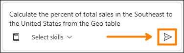

45. 이번 결과도 비슷할 것입니다. 응답과 연관된 DAX도 확인할 수 있습니다.

    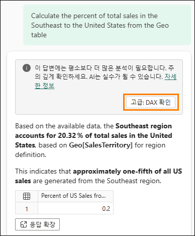

    

46. 완벽합니다! 신중한 프롬프트로 모델의 오류를 조정할 수 있습니다. 하지만 최종 사용자를 위해 더 일반적인 프롬프트가 가능한 경험을 설계해야 합니다.

47. 이 PBIX 파일에는 데이터 모델링 측면에서 몇 가지 문제가 있습니다. 구체적으로 두 개의 Snowflake 차원이 존재합니다. Copilot은 필터 적용 등 다양한 변경을 통해 답변을 완성하는 데 상당히 능숙합니다! 그러나 모델과 비즈니스 요구사항을 검토한 결과, 이 두 차원(Supplier 및 Geo)을 별도의 테이블로 유지할 필요는 없다고 판단했습니다. 이 두 테이블은 스타 스키마에 더 가깝게 만들기 위해 모델 내 다른 테이블로 통합될 예정입니다. 이 모듈이 끝날 때쯤에는 CDIAD – Lab 02– Start**를 사용하게 될 것입니다.**

    - **Supplier:** supplier 테이블의 열이 Product 테이블에 추가되었습니다.

    **ℹ️ 중요**

    때로는 다른 차원을 필터링하는 차원을 생성해야 할 때가 있으며, 이는 본질적으로 Snowflake 구조를 만드는 것입니다. 그러나 비즈니스 요구사항이 충족된다면 가능한 한 의미 체계를 단순화해야 합니다. 새로운 비즈니스 요구사항이 추가되고 새로운 테이블이 도입되면 데이터 모델은 필연적으로 더 복잡해집니다. 데이터 모델을 최적화 상태로 유지하기 위해 항상 시간을 할애하는 것이 중요합니다!

    ⭐Power BI는 스타 스키마에서 가장 효과적으로 작동합니다. 스타 스키마에 대한 전체 논의는 본 강의 범위를 벗어납니다. 자세한 내용은 다음 Microsoft Learn 링크를 참조하세요.

    [**https://learn.microsoft.com/en-us/power-bi/guidance/star-schema**](https://learn.microsoft.com/en-us/power-bi/guidance/star-schema)

    **Geo:** Geo 테이블의 열은 Reseller 테이블에 추가되었습니다.

    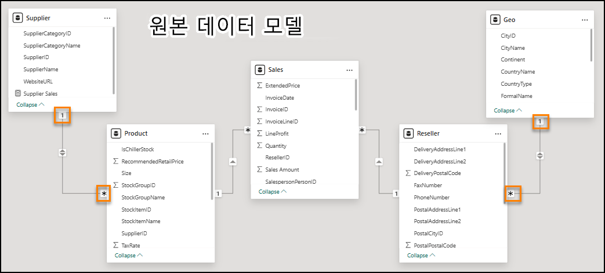

    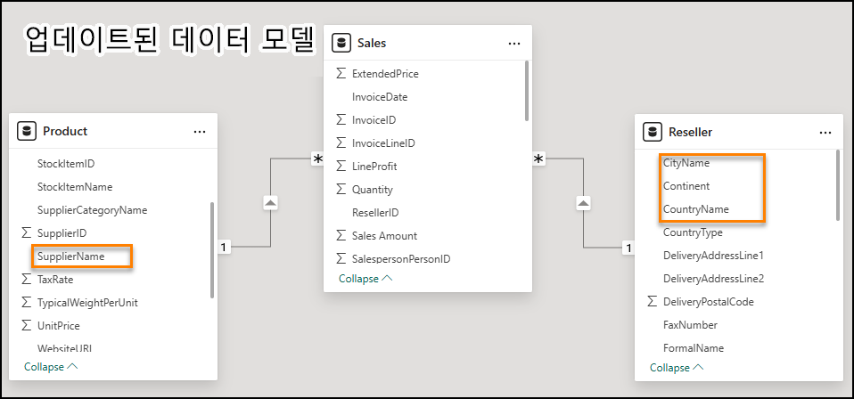

아래는 Microsoft Fabric의 다음 단계에 도움이 되는 몇 가지 추가 자료입니다.

- 기본 [Microsoft Fabric 문서](https://learn.microsoft.com/en-us/fabric/)의 모든 정보에 액세스

- [가이드 투어](https://aka.ms/Fabric-GuidedTour)로 Fabric 탐색

- [Microsoft Fabric 무료 평가판](https://aka.ms/try-fabric) 신청

- [Microsoft Fabric 웹 사이트](https://aka.ms/microsoft-fabric) 방문

- [Fabric 학습 모듈](https://aka.ms/learn-fabric)을 탐색해서 새로운 기술 익히기

- [Fabric 시작하기 무료 eBook](https://aka.ms/fabric-get-started-ebook) 읽기

- [Fabric 커뮤니티](https://aka.ms/fabric-community)에 가입하여 질문을 게시하고 피드백을 공유하며 다른 사람들로부터 배우기

다음과 같은 Copilot 관련 심층 기술 문서를 읽어보세요.

- [Power BI용 Copilot 개요 - Power BI | Microsoft Learn](https://learn.microsoft.com/en-us/power-bi/create-reports/copilot-introduction)

- [Power BI에서 독립형 Copilot 환경(프리뷰) – Power BI | Microsoft Learn](https://learn.microsoft.com/en-us/power-bi/create-reports/copilot-chat-with-data-standalone)

- [Microsoft Fabric Copilot 관리자 설정 | Microsoft Learn](https://learn.microsoft.com/en-us/fabric/admin/service-admin-portal-copilot)

- [Fabric 데이터 에이전트 생성(프리뷰) - Fabric 데이터 에이전트 생성 방법 알아보기 | Microsoft Learn](https://learn.microsoft.com/en-us/fabric/data-science/concept-data-agent)

- [데이터 에이전트 구성을 위한 모범 사례 - Microsoft Fabric | Microsoft Learn](https://learn.microsoft.com/en-us/fabric/data-science/data-agent-configuration-best-practices)

- [Microsoft Fabric 및 Power BI용 Copilot: FAQ - Microsoft Fabric | Microsoft Learn](https://learn.microsoft.com/en-us/fabric/fundamentals/copilot-faq-fabric)

© 2026 Microsoft Corporation. All rights reserved.

이 데모/랩을 사용하면 다음 조건에 동의하게 됩니다.

이 데모/랩에 설명된 기술/기능은 학습 환경을 제공하고 사용자 의견을 얻기 위해 Microsoft Corporation에서 제공합니다. 데모/랩을 통해서만 이러한 기술적 특성과 기능을 평가하고 사용자 의견을 Microsoft에 제시할 수 있습니다. 다른 용도로는 사용할 수 없습니다. 이 데모/랩 또는 그 일부에 대해 수정, 복사, 배포, 전송, 표시, 수행, 재현, 게시, 라이선스 허여, 파생 작업 생성, 양도 또는 판매할 수 없습니다.

추가 복제 또는 재배포를 위한 다른 서버 또는 위치에 대한 데모/랩(또는 그 일부)의 복사 또는 재현은 명시적으로 금지됩니다.

이 데모/랩은 위에서 명시한 목적을 위해 복잡한 설정 또는 설치가 없는 시뮬레이션된 환경에서 잠재적인 새로운 기능과 개념을 포함하여 특정 소프트웨어 기술/제품의 특성 및 기능을 제공합니다. 이 데모/랩에서 서술된 기술/개념은 전체 기능을 나타내지 않을 수 있으며, 최종 버전이 작동하지 않을 수도 있습니다. 또한 해당 기능 또는 개념의 최종 버전을 릴리스하지 않을 수도 있습니다. 또한 실제 환경에서 이러한 특성과 기능을 사용한 경험이 다를 수도 있습니다.

**피드백.** 이 데모/랩에서 서술된 기술적 특성, 기능 및/또는 개념에 대한 피드백을 Microsoft에 제시하면 Microsoft는 이 피드백을 어떤 방식과 목적으로든 무료로 사용, 공유 및 상용화할 수 있습니다. 또한 제품, 기술 및 서비스에서 사용자 의견이 포함된 Microsoft 소프트웨어 또는 서비스의 특정 부분을 사용하거나 인터페이스하는 데 필요한 모든 특허권을 제3자에게 무료로 제공합니다. Microsoft에서 사용자 의견을 포함하기 때문에 Microsoft에서 해당 소프트웨어 또는 설명서의 사용을 인가해야 하는 라이선스에 종속된 사용자 의견은 제공할 수 없습니다. 이러한 권리는 본 계약에 의거하여 유효합니다.

Microsoft Corporation은 이에 따라 명시적, 묵시적 또는 법적 특정 목적에의 적합성, 권리 및 비침해 여부에 관계없이 상품성에 대한 모든 보증과 조건을 포함하여 데모/랩과 관련된 모든 보증 및 조건을 부인합니다. Microsoft는 어떤 목적으로든 결과의 정확성, 데모/랩의 사용으로 파생된 출력 또는 데모/랩에 포함된 정보의 적합성과 관련하여 어떠한 보증이나 진술도 하지 않습니다.

**고지 사항**

이 데모/랩에는 Microsoft Power BI의 새로운 기능 및 향상된 기능 중 일부만 포함되어 있습니다. 일부 기능은 제품의 향후 릴리스에서 변경될 수 있습니다. 이 데모/랩에서는 새로운 기능 모두가 아닌 일부에 대해 학습하게 됩니다.
