# Microsoft Fabric Chat with your Data in a Day - 랩 02

## 목차

- 문서 구조
- 시나리오/문제 설명
- 소개
  - 작업 1: 양방향 필터링/스타 스키마
  - 작업 2: 열, 테이블, 측정값 이름 변경
  - 작업 3: 설명
  - 작업 4: 데이터 범주
  - 작업 5: 요약
  - 작업 6: 열 기준 정렬 속성
  - 작업 7: 언어적 스키마: 동의어

# 문서 구조

이 랩에서는 사용자가 수행해야 하는 단계를 보조 시각 자료의 관련 스크린샷과 함께 확인할 수 있습니다. 스크린샷에서 주황색 상자로 강조 표시된 섹션은 사용자가 특히 주목해야 하는 영역입니다.

# 시나리오/문제 설명

귀사는 초기 테스트 및 Copilot 준비 상태 테스트 단계를 완료했습니다. 현재 모델은 독립형 Copilot 환경에 아직 적합하지 않으며, Power BI Desktop에 일반적으로 인정되는 모범 사례를 구현해야 함이 확인되었습니다. Copilot이 의미 있는 답변을 제공할 수 있도록 하려면 기반이 되는 의미 체계 모델을 신중하게 설계하고 최적화해야 합니다.

귀사의 의미 체계는 현재 다음과 같은 과제에 직면해 있습니다.

- 테이블 및 열 이름이 난해하고 해석하기 어려울 수 있습니다.

- 테이블, 열, 측정값에 대한 설명이 존재하지 않습니다.

- 데이터 범주가 충분히 활용되지 않아 Copilot의 문맥 이해가 제한됩니다.

- 정렬 논리와 기본 요약 방식이 사용자 기대를 반영하지 못할 수 있습니다.

- 관계 및 언어 스키마가 최적의 Copilot 경험을 지원하도록 구성되거나 최적화되지 않았습니다.

# 소개

이러한 격차는 사용자가 Copilot과 상호 작용할 때 혼란, 부정확한 응답, 오해의 소지가 있는 시각적 개체 또는 놓친 인사이트로 이어질 수 있습니다. 이 랩에서는 명명, 분류, 요약, 데이터 모델링 및 언어 스키마에 대한 모범 사례를 사용하여 의미 체계를 개선하는 방법을 배웁니다.

## 작업 1: 양방향 필터링/스타 스키마

1. AI에 적합하도록 데이터 준비하기를 시작하려면 클래스 파일에서 **CDIAD – Lab 02– Start** 파일을 엽니다.

    

2. 이전 랩에서 제시된 질문 중 하나는 다음과 같습니다. **Create a new report page with a visual for sales and product tag**. 이로 인해 Copilot은 중복된 데이터를 보여주는 응답을 생성했습니다(아래 스크린샷 참조). 일반적으로 모든 데이터 포인트에 동일한 결과가 나타나는 경우 데이터 모델에 관계 문제가 있음을 시사합니다.

    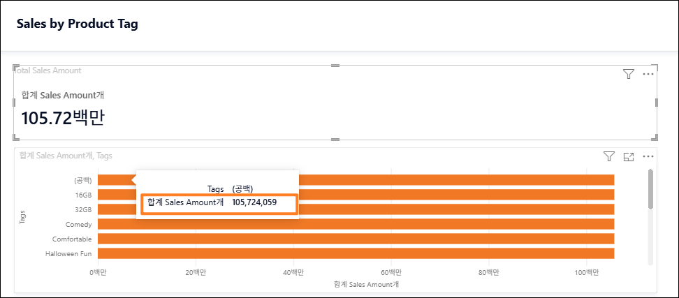

3. 아래는 Product Details 테이블의 Tag와 Sales 테이블의 Sales 측정값 간의 관계 스크린샷입니다.

    

4. Copilot에 Tags별 Sales를 반환하도록 요청하면 중복 데이터가 포함된 보고서가 생성됩니다. 이는 Product Details 테이블의 Tags 열이 Product 테이블을 필터링하지 못하기 때문입니다. Product 테이블과 Product Details 테이블 간의 필터 방향은 단방향이며 Product 테이블에서 Product Details 테이블로만 적용됩니다. 이 문제를 해결할 수 있는 전통적인 방법은 두 가지가 있습니다.

    - 첫째, Tags 테이블에서 필요한 필터를 추가하면서 총 판매액을 계산하는 DAX 측정값을 생성할 수 있습니다. 이 옵션은 데이터 모델을 단순하게 유지하지만, 모든 비즈니스 요구 사항마다 새로운 측정값을 생성해야 하므로 번거로울 수 있습니다.

    - 둘째, 여기서 구현할 방법은 양방향 필터를 허용하는 것입니다. Product와 Product Details 간의 관계를 업데이트하면 Tag 열이 Sales 테이블까지 필터링을 진행할 수 있게 되어 Copilot이 올바른 응답을 생성할 수 있습니다.

5. 데이터 모델의 관계를 업데이트해 보겠습니다. *아래 스크린샷을 참조하세요:*

    1. 왼쪽 탐색 창에서 모델 보기를 클릭합니다.

    2. Product와 Product Details 간의 관계를 선택합니다.

    3. 속성 창에서 교차 필터 방향을 단방향에서 양방향으로 변경합니다.

        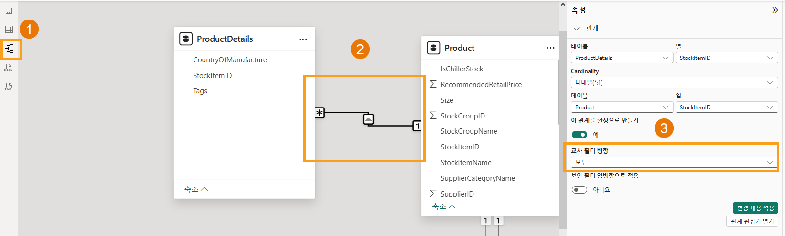

    **ℹ️ 중요**

    모범 사례로 가능한 경우 양방향 필터링을 활성화하지 않는 것이 좋습니다. 특정 상황에서는 결과의 모호성과 성능 문제를 유발할 수 있습니다. 이 섹션에서 언급한 대로 대안 중 하나는 특정 측정값에 대해 수동으로 필터링을 강제하는 DAX 측정값을 생성하는 것입니다. 이 외에도 다른 대안이 있지만 이 과정에서는 다루지 않습니다.

6. 이제 **보고서 보기**에서 질문을 다시 하고, 개선된 결과를 확인해 보세요! Copilot Power BI 채팅 환경을 다시 열고 다음 질문을 입력하세요. **Show total sales by product tag**.

    

    명확히 해달라는 요청을 받으면 **Sales 측정값** 를 요청하세요.

    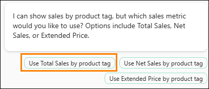

7. 올바른 결과는 다음과 같습니다.

    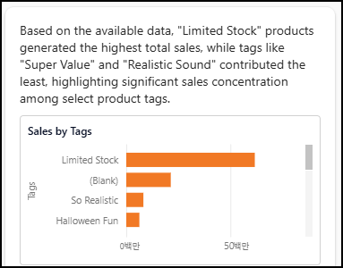

    *다른 시각적 개체가 표시되면 재질문을 통해 **막대 차트***를 요청하세요

    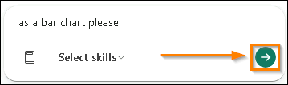

    이전 결과:

    

    데이터 모델링은 Power BI에서 가장 중요한 측면 중 하나입니다. 잘 정의되고 신중하게 설계된 데이터 모델은 보고서 작성, DAX 코딩, 보안 구현, Copilot 지원을 보다 쉽고 효과적으로 만듭니다.

## 작업 2: 열, 테이블, 측정값 이름 변경

1. 이전 랩 전반에 걸쳐 Copilot이 예상치 못한 열, 테이블, 심지어 측정값을 사용하는 문제를 겪었습니다. 이러한 어려움은 확장되는 데이터 모델에서 예상되는 현상이며, AI를 위한 데이터 준비를 개선하려면 명명 방식을 조정해야 합니다.

2. 먼저 테이블 이름을 적절히 변경해 보겠습니다. **PO** 테이블을 클릭한 다음 **이름 바꾸기**를 선택합니다. **PO 테이블** 을 **Purchase Orders**로 조정합니다.

    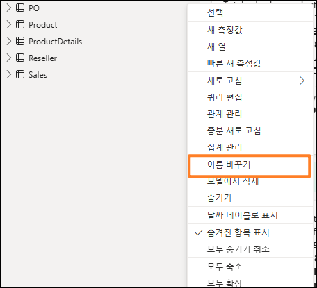

    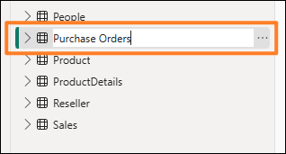

3. 다음으로 동일한 과정을 통해 열 이름을 변경하겠습니다. **‘Reseller’** 테이블을 확장하여 시작합니다.

    

4. **[SPName]** 열을 두 번 클릭하거나 마우스 오른쪽 버튼으로 클릭한 후 이름을 **State**로 변경합니다.

    

    

5. 다음과 같이 이름 변경 작업을 계속합니다.

    **Reseller’[CountryName]**을** Country**로 이름 바꾸기

    **Sales** 테이블에서 측정값 **MoM Sales Change**를** Month over Month Sales Change**로 변경합니다.

    **Sales** 테이블에서 측정값 **Sales YoY%**를** Sales Year over Year %**로 변경합니다.

    **Purchase Orders** 테이블에서 측정값 **Spend**의 이름을 **Total Purchases**로 변경합니다.

    **ℹ️ 중요**

    테이블과 열에 명확하고 설명적인 이름을 지정하는 것이 매우 중요합니다. Copilot은 모델 구조를 기반으로 프롬프트를 해석합니다. 명명 방식이 직관적일수록 정확한 DAX, 시각적 개체, 인사이트를 생성하는 능력이 향상됩니다. 신중하게 이름을 변경하여 Copilot의 이해도를 높이고 작업 효율을 개선하세요.

## 작업 3: 설명

1. 이제 설명을 추가하여 데이터 모델을 더욱 정교하게 준비해 보겠습니다. 설명은 모델 보기에서 테이블, 열, 측정값에 추가할 수 있습니다. 이러한 설명은 Copilot이 사용자 요청에 응답할 때 도움이 됩니다. 테이블 설명은 Copilot에게 백스테이지 패스 역할을 하여 정확한 관련 인사이트 요약, 심지어 DAX 측정값을 생성하는 데 필요한 맥락을 제공합니다. 시작하려면 **모델 보기**에서 작업을 시작해 보겠습니다.

2. **Purchase Orders** 테이블을 선택합니다. **속성** 영역에서 **설명** 영역을 찾을 수 있으며, 여기서 Copilot을 돕기 위한 설명을 작성할 것입니다. 다음은 몇 가지 모범 사례 팁입니다.

    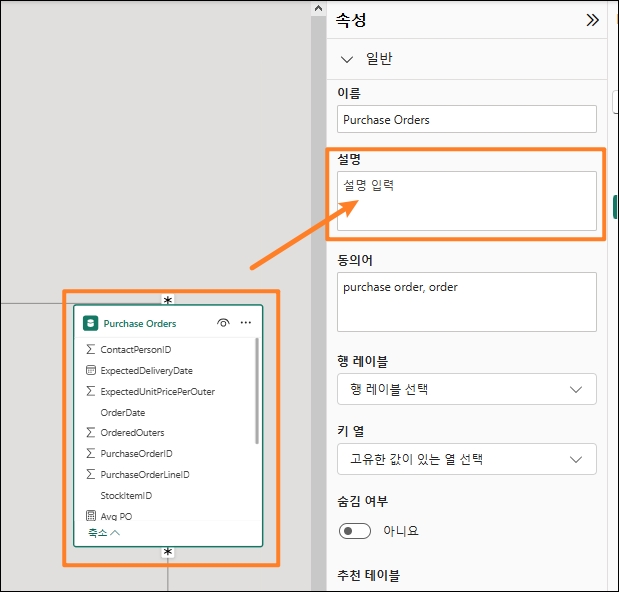

    ### 테이블 설명을 위한 모범 사례

    **목적에서 시작:** 비즈니스 측면에서 이 테이블이 무엇을 나타내는지 설명하세요.

    **비즈니스 컨텍스트 포함:** 이 테이블이 보고나 의사결정을 어떻게 지원하는지 설명하세요.

    **멘션 세분성:** 트랜잭션, 매일, 집계 등인가요?

    **핵심 열 강조:** 특히 관계나 계산에 사용되는 열을 포함하세요.

    **일반적인 사용 사례 설명:** 이 테이블이 어떤 종류의 질문이나 시각적 개체를 지원하는지 기술하세요.

    **관계성 명시:** 모델 내 다른 테이블과의 연결 방식을 언급하세요.

    **ℹ️ 중요**

    **잘 작성된 설명은 Copilot이 데이터의 목적과 맥락을 이해하는 데 도움이 됩니다.** 테이블이나 열이 무엇을 나타내는지 명확히 하려면 설명을 활용하세요. 특히 이름만으로는 충분하지 않을 때 더욱 그렇습니다. Copilot은 이러한 단서를 활용하여 더 관련성 높은 답변, DAX, 시각적 개체를 생성합니다. 설명은 Copilot과 사용자를 더 나은 인사이트로 안내할 수 있는 기회라고 생각하세요.

3. 이 상세하지만 정확한 설명을 필드에 입력하세요.

    *This Purchase Orders table captures individual line items from purchase orders submitted within the organization. Each row represents a specific product ordered, including the quantity requested, the date of the order, and the employee who initiated the request. It supports analysis of procurement trends, supplier demand, and employee purchasing behavior. Key columns include ProductID, QuantityOrdered, OrderDate, and EmployeeID. This table links to Products, Employees, and PurchaseOrders tables to enable detailed reporting across procurement workflows.*

    이는 Copilot이 특히 **Purchase Orders** 테이블과 관련된 더 나은 응답을 작성하는 데 크게 도움이 될 것입니다. 이제 일부 열에 대한 더 나은 설명을 작성해 보겠습니다. **Purchase Orders** 테이블에서 **Order Date** 열을 선택하고 유사한 설명을 추가하세요.

    ### 의미 체계에서 열 설명을 위한 모범 사례

    **비즈니스 의미로 시작:** 해당 열이 비즈니스 용어로 무엇을 나타내는지 설명하세요.

    **단위, 형식 또는 규모 명시:** 숫자형, 날짜형, 범주형인 경우 구조를 설명하세요.

    **일반적인 사용 사례 언급:** 이 열이 분석이나 보고에서 일반적으로 어떻게 사용되는지 Copilot이 이해하도록 돕습니다. 예: 매출액 – 각 거래의 총 판매 금액; 수익성 및 추세 분석에 사용

    **중복 피하기:** 명확성을 더하지 않는 한 열 이름에서 이미 알 수 있는 내용을 반복하지 마세요. 대신 맥락을 풍부하게 하세요. 예를 들어 EmployeeID의 경우 다음과 같은 설명을 추가할 수 있습니다. 예를 들어 EmployeeID의 경우 다음과 같은 설명을 추가할 수 있습니다. Unique identifier for the employee who submitted the order..

    **일관된 어조 사용:** 모델 전반에 걸쳐 설명을 간결하고 유익하며 일관되게 유지하세요. 호기심 많은 분석자를 위한 툴팁을 작성한다고 생각하세요.

4. **Purchase Orders** 테이블을 클릭한 후 **OrderDate**를 선택합니다. 다음 설명을 입력합니다. **The calendar date when the purchase order was submitted by an employee.**

    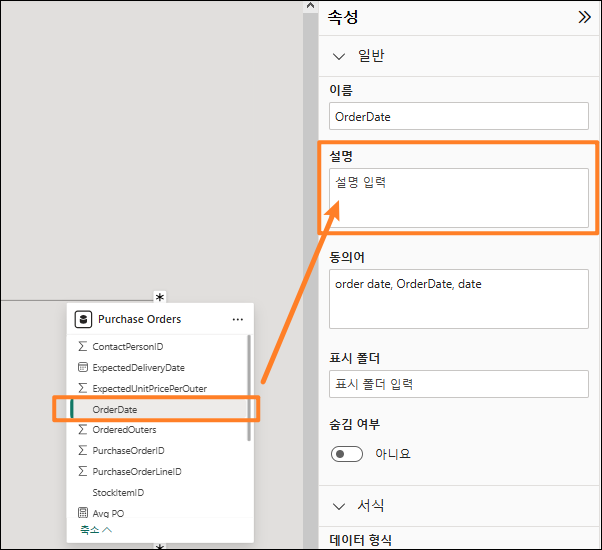

5. 이제 테이블과 **설명** 열을 모두 조정했으니, 측정값에 설명을 추가해 보겠습니다. 이번에는 설명 생성에 Copilot을 활용할 것입니다. **Purchase Orders** 측정값을 선택하세요. 그런 다음 **Copilot으로 생성**을 선택합니다.

    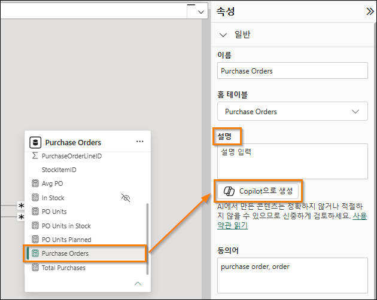

6. Copilot이 작성한 설명이 검토 준비가 되었음을 확인합니다. 답변은 다를 수 있지만, 설명을 확인하고 세부화하는 데 유용하게 활용될 것입니다. **다시 시도**를 누를 수 있지만, 준비되면 **유지**를 선택하세요.

    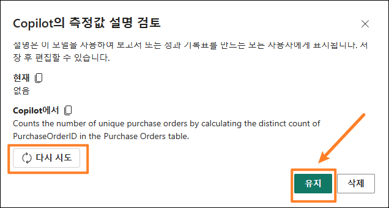

    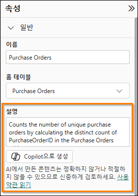

    이 섹션에서는 테이블, 열, 측정값에 설명을 추가하는 방법을 배웠습니다. 실제 의미 체계에서는 여기서 수행한 작업을 나머지 테이블과 해당되는 모든 열 및 측정값으로 확장해야 합니다. 이제 Copilot이 데이터를 처리하고 향후 모든 응답을 개선하는 능력을 크게 향상시켰습니다.

## 작업 4: 데이터 범주

Power BI에서 열에 데이터 범주를 추가하는 것은 Copilot에 중요합니다. 특히 지리적, 웹 또는 이미지 데이터를 포함하는 의미 체계 모델을 작업할 때 더욱 그렇습니다. 범주는 메타데이터 태그처럼 작동하여 Copilot(및 시각적 개체)이 열의 이름이나 데이터 유형을 넘어 그 목적을 해석하는 데 도움을 줍니다.

1. **테이블 보기**로 이동하여 Reseller 테이블을 선택합니다. **Reseller** 테이블에서 **State** 열을 선택하여 시작합니다.

    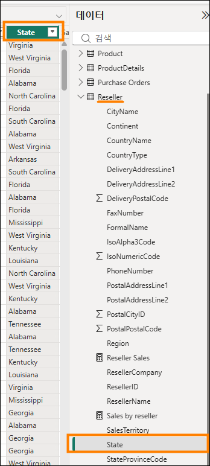

2. **State** 열을 선택하면 Power BI 보고서 상단에 **열 도구**라는 새 리본 메뉴가 나타납니다. 먼저 **데이터 범주** 를 변경해 보겠습니다.

    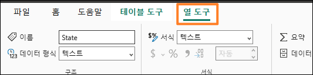

3. **데이터 범주** 영역을 확장하고 데이터 범주를 '분류 되지 않음'에서 **시/도**로 변경합니다.

    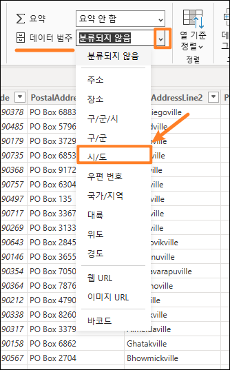

4. 아래의 나머지 열들을 위해 데이터 범주 추가를 계속합니다.

    **ℹ️ 중요**

    **데이터 범주를 설정하면 Copilot이 데이터를 어떻게 처리해야 하는지 이해하는 데 도움이 됩니다.** 지리 정보, URL, 이미지 등 적절한 범주를 지정하면 Copilot이 더 스마트한 시각적 개체, 필터, 인사이트를 생성할 수 있는 맥락을 제공합니다. 예를 들어, 열에 'City' 태그를 지정하면 Copilot이 즉시 지도로 변환합니다. 작은 한 걸음이 큰 가치를 열어줍니다.

    | **테이블 이름** | **열 이름** | **데이터 범주** |
    |-----------------|--------------------|-----------------|
    | Reseller | Country | 국가/지역 |
    | Reseller | DeliveryPostalCode | 우편번호 |
    | Reseller | PostalPostalCode | 우편번호 |
    | Reseller | Website URL | 웹 URL |

## 작업 5: 요약

이 섹션에서는 Power BI의 기본 요약 기능과 이것이 Copilot 응답에 미치는 영향에 대해 알아봅니다. 이는 Power BI에 새로 추가된 기능은 아니지만 Copilot에 있어서는 매우 중요한 기능입니다.

1. **보고서 보기**에서Copilot을 열고 다음 프롬프트를 입력합니다. **What is customer age by state?**

    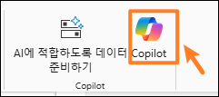

    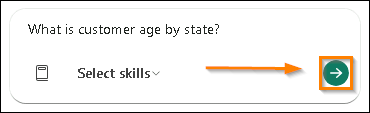

2. 결과를 확인해 보시면, 때때로 예상치 못한 결과가 나타날 수 있음을 알 수 있습니다. WA, NY 또는 기타 주의 데이터 막대 위에 마우스를 올려놓으면 평균 Age개가 표시되는 것을 확인할 수 있습니다! 여기서는 평균값이 표시될 것이라고 예상하셨겠지만, age 열에 합계라는 기본 요약 방식이 설정되어 있기 때문에 Copilot이 해당 요약 처리를 수행한 것입니다.

    Copilot이 아래 이미지와 같이 추가 설명을 요청할 수도 있습니다. 어쨌든, 요약 설정을 조정하면 매번 평균값을 얻을 수 있어 추가 질문을 피할 수 있습니다.

    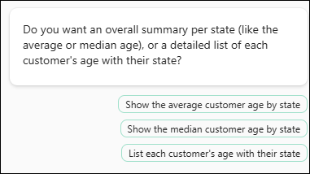

    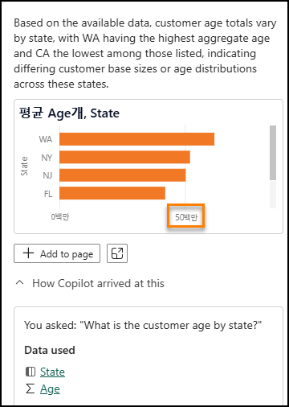

3. Age 값 위에 마우스를 올리면 Copilot이 해당 열에 대해 합계(SUM) 계산을 수행했음을 확인하고 검증할 수 있습니다.

    

    **ℹ️ 중요**

    **기본 요약 설정은 시각적 개체 및 계산 시 Copilot이 열을 처리하는 방식을 지정합니다.** ‘요약 안 함’, ‘합계', '평균’ 중 올바르게 설정하면 Copilot이 더 정확한 차트와 DAX를 생성하는 데 도움이 됩니다. 예를 들어, 오해의 소지가 있는 합계를 피하려면 ID나 이름을 '요약 안 함'으로 표시합니다. 이는 Copilot이 의미 있는 인사이트를 도출하도록 안내하는 빠른 방법입니다.

    평균 연령을 구체적으로 요청하는 더 나은 프롬프트를 작성할 수 있으며, 이렇게 하면 작동할 것입니다. 그러나 가능한 경우 데이터 모델을 개선하는 것이 더 나은 선택이므로, **기본 요약** 속성을 조정하겠습니다.

4. Copilot 프롬프트에 **What is customer age average by state**를 입력합니다.

    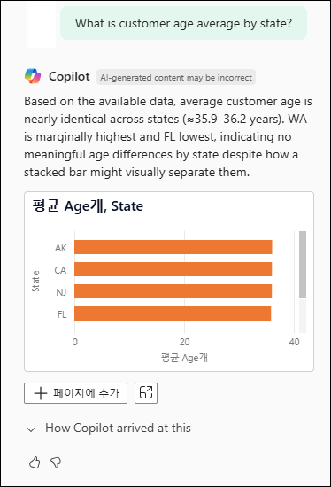

5. **기본 요약** 을 조정해 보겠습니다. 'Customer'테이블에서 **Age** 열을 선택하여 열 도구를 표시합니다. **요약** 영역을 찾아 **Age**를** 평균**으로 조정합니다.

    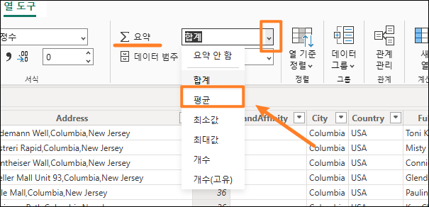

6. Copilot 채팅 을 사용하여 다시 질문해 보겠습니다. **What is customer age by state?**

    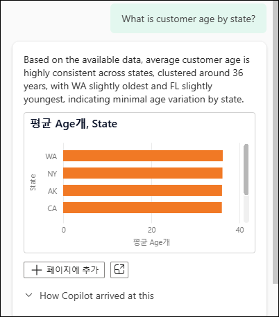

    완벽합니다! 이는 의도된 결과이며, 사용자가 보다 자연스럽게 질문할 수 있게 하고 예상되는 질문 변형을 허용합니다. 숫자형이지만 요약해서는 안 되는 열의 기본 요약 기능을 끄는 것 역시 중요합니다. 예를 들어 Year, Quarter, Month 번호 같은 열은 요약해서는 안 됩니다!

## 작업 6: 열 기준 정렬 속성

1. 열 기준 정렬 속성은 기본 요약과 마찬가지로 Power BI에 새로 추가된 기능은 아니지만, 이 속성을 적절히 설정하면 Copilot이 예상하는 순서대로 결과를 반환하는 데 도움이 될 수 있습니다. 예를 들어 월별 매출을 반환하면 기본적으로 시각적 개체가 매출이 가장 높은 월부터 낮은 월 순으로 정렬됩니다. 직접 테스트해 보겠습니다!

2. 아직 재설정하지 않은 경우 **채팅 지우기** 영역을 눌러 Copilot 채팅을 재설정합니다.

    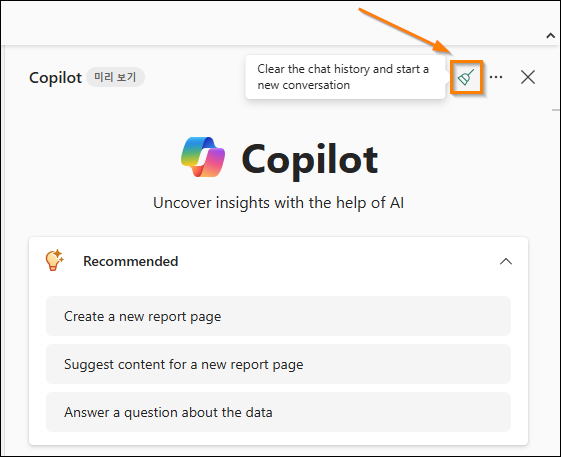

3. 이제 다음 프롬프트를 입력합니다. **Show total sales by month as a column chart.**

    

4. 결과는 정확하지만, 그레고리력(1월, 2월, 3월…12월)의 일반적인 관점에 부합하는 방식으로 정렬되었을 수 있습니다. 결과는 알파벳순 또는 이 경우처럼 매출액이 높은 순서에서 낮은 순서로 정렬되어 반환됩니다.

    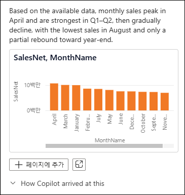

    **ℹ️ 중요**

    **열 기준 정렬 을 사용하여 Copilot이 데이터를 표시하는 방식을 제어합니다.** 이 설정은 월별 또는 사용자 맞춤형 레이블과 같은 범주가 시각적 개체 및 요약에서 예상되는 순서로 표시되도록 Copilot의 데이터 표시를 돕습니다. 예를 들어, 'Month Name'을 'Month Number'로 정렬하면 Copilot이 정확한 시간 기반 차트를 생성하는 데 도움이 됩니다. 이는 혼란스러운 결과를 방지하는 간단한 해결책입니다.

5. **열 도구** 영역의 **열 기준 정렬** 영역에서 **MonthName** 열의 정렬 방식을 조정해야 합니다. **Date** 테이블에서 MonthName 열을 선택합니다.

6. **열 기준 정렬**을 확장하고 정렬 방식을 Month별로 조정합니다.

    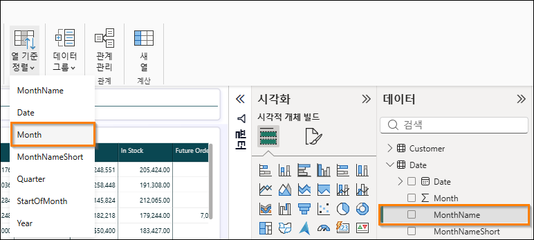

7. Copilot 채팅 에 동일한 질문을 합니다. **Show total sales by month** 그리고 이제 예상대로 결과가 나옵니다.

    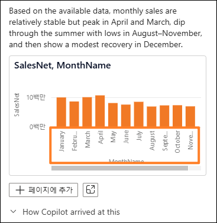

## 작업 7: 언어적 스키마: 동의어

**언어적 스키마**는 Copilot이 자연어 분석 파트너로서의 잠재력을 최대한 발휘할 수 있게 하는 열쇠입니다. Copilot에게 데이터 모델에 대한 번역 가이드를 제공하는 것이라고 생각하면 됩니다. 이 스키마가 없으면 Copilot은 추측에 의존하지만, 이 스키마가 있으면 Copilot은 훨씬 더 유창해지고 데이터에 익숙해집니다.

**언어적 스키마란?**

언어적 스키마는 의미 체계를 자연어로 매핑하는 메타데이터입니다. 이는 Copilot이 다음을 이해하는 데 도움을 줍니다.

- 테이블과 열의 의미

- 비즈니스 개념과의 연관성

- 데이터 상호작용 시 사용자가 사용할 수 있는 동의어, 구문 및 질문 유형

예를 들어, Copilot은 단순히 열 이름을 읽는 대신 다음을 이해합니다.

- '매출’ = TotalSales

- ‘주문 건수’ = PurchaseOrderCount

- ‘직원 성과’ = SalesByEmployee

이를 통해 Copilot은 다음과 같은 질문에 답변할 수 있습니다.

- 'Which region had the highest revenue last quarter?'

- 'Show me top-performing employees by sales volume'

언어적 스키마가 없으면 Copilot은 모호한 용어를 오해하거나 관련 없는 시각적 개체를 제안할 수 있습니다. 이를 통해 다음과 같은 이점을 얻을 수 있습니다.

- 향상된 DAX 제안

- 더 스마트한 시각적 개체 추천

- 더 정확한 요약 및 인사이트

**동의어 및 자연어 지원**

다음과 같은 동의어를 정의할 수 있습니다.

- 'PO' = '구매 주문'

- 'Rep' = '영업 담당자'

- 'Qty' = '주문된 수량'

1. **언어적 스키마** 인터페이스를 살펴보겠습니다. 먼저 **모델 보기**를 선택하거나, 보고서 보기에 있다면 모델링 리본을 선택합니다. 그런 다음 **Q&A 설정** 영역으로 이동합니다.

    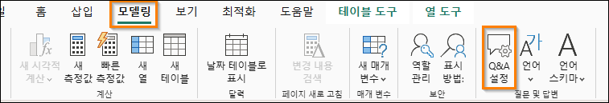

2. Copilot 데이터 모델이 사용하는 Q&A가 사용자를 더 잘 이해하도록 돕는 인상적인 메뉴가 있습니다. 메인 메뉴에는 시작할 수 있는 다양한 영역이 있습니다.

    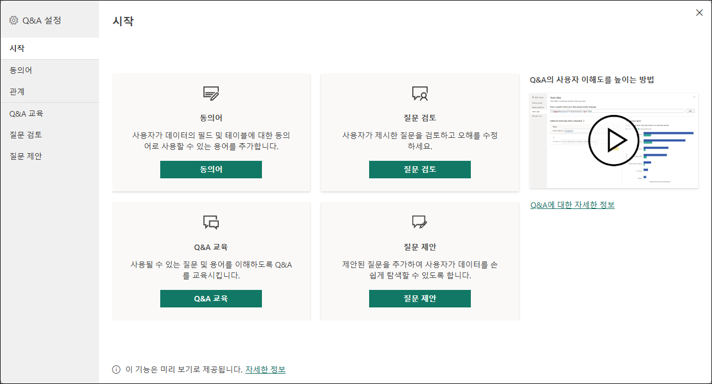

3. 첫 번째 메뉴인 동의어 메뉴로 이동해 보겠습니다.

    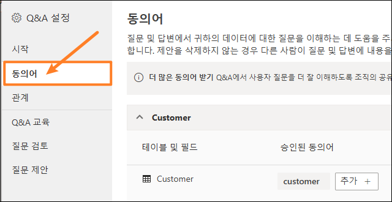

4. 더 정확한 동의어는 Copilot이 사용자가 질문을 표현하는 다양한 방식을 이해하는 데 도움이 됩니다. 올바른 열로 이동하기 위해 탐색 중인 테이블을 조정할 수도 있습니다. 화살표 아이콘을 누릅니다.

    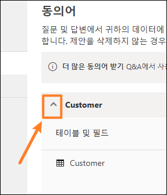

    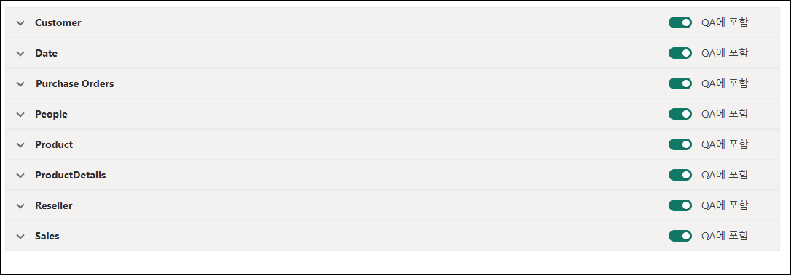

5. **Reseller** 동의어를 더 구체적으로 조정하여 Copilot을 도와봅시다. **Reseller** 테이블이 확장되어 **ResellerID** 열과 제안 사항에 연결된 모든 현재 동의어를 확인할 수 있는지 확인합니다.

6. Fabrikam 내에서 재판매인은 종종 ***Fabrikam Friends***라고 불리며…… 직원들이 우리만의 Fabrikam 용어로 질문할 수 있도록 이들을 동의어로 추가해 보겠습니다. **shopper**에서** 추가** 를 선택하고 동의어를 입력합니다.

    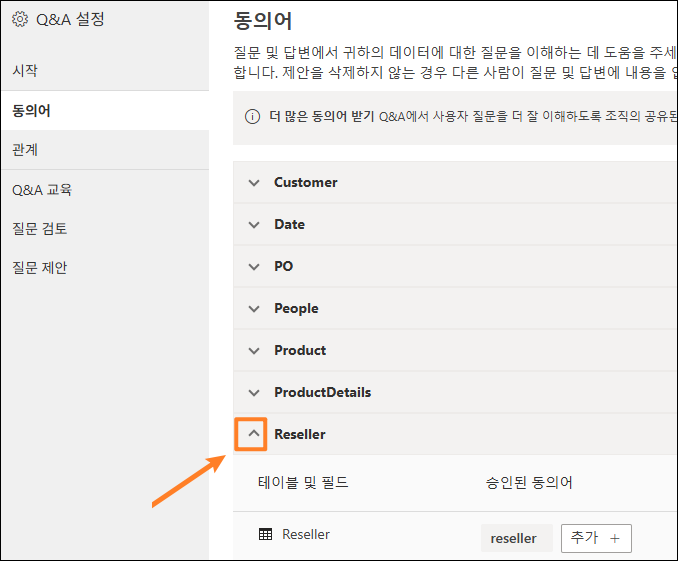

7. 추가 + 버튼을 사용하여 ***Fabrikam Friends***를 추가합니다.

    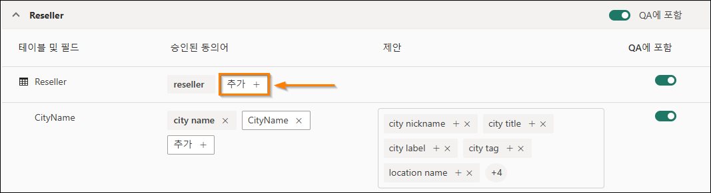

    

8. Copilot이 추가 내용을 평가하고 동적으로 다른 제안 사항을 적절히 추가하는 것을 확인할 수 있습니다.

    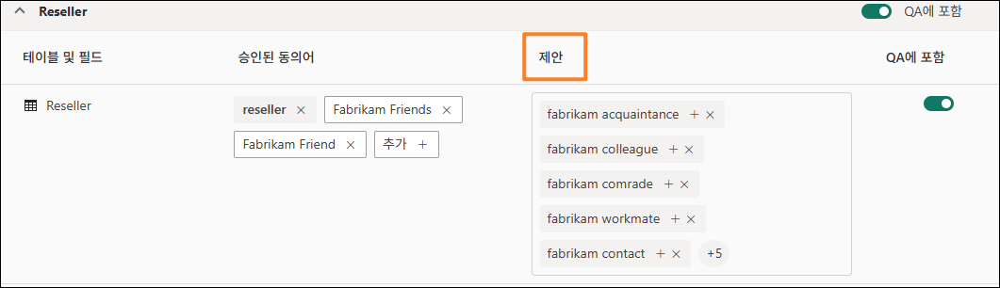

9. 이제 제안 사항 중 하나를 사용하여 Reseller 테이블에 또 다른 동의어를 추가해 보겠습니다. ***Fabrikam Acquaintance***와 같이 원하는 제안 사항을 클릭합니다.

    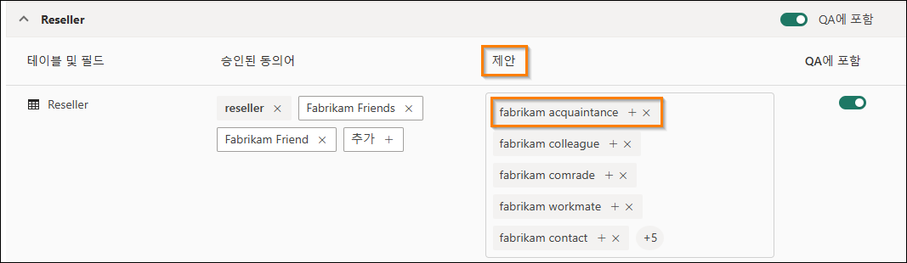

    동의어 추가 과정은 시간이 지남에 따라 개선되는 매우 복잡한 과정입니다. 다른 테이블과 열을 자유롭게 탐색하고 Power BI Desktop 파일에 추가 동의어를 추가해 봅니다.

10. 좋습니다! 이제 **관례**를 살펴보겠습니다. Q&A 설정 메뉴로 이동합니다.

    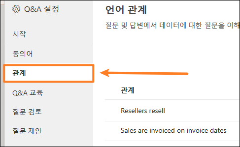

    언어적 관계는 테이블과 필드 간의 관계를 정의하여 Q&A가 데이터에 대한 질문을 이해하도록 돕습니다. 이는 데이터 모델에서 테이블이 연결되는 방식과 유사하지만, Copilot이 언어적으로 이해할 수 있는 방식으로 표현됩니다.

    예를 들어, 관계는 모호성을 해결하는 데 사용될 수 있습니다. 모델에 여러 테이블에 걸쳐 여러 날짜 필드가 있는 경우, 날짜에 관계를 추가하면 Copilot이 컨텍스트와 테이블 연결을 기반으로 사용할 날짜를 파악하는 데 도움이 됩니다.

    새로운 관계를 추가하려면 아래 스크린샷에서 볼 수 있듯이 + 새 관계 상자를 클릭하여 시작합니다.

    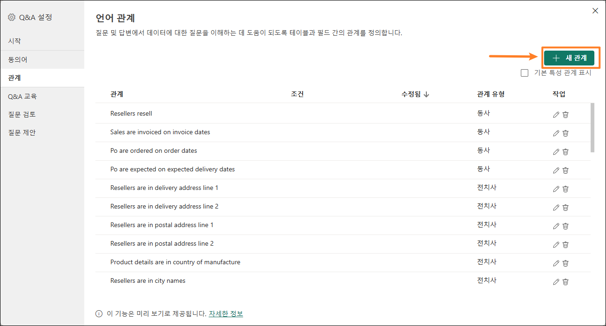

11. 여기서 다양한 언어적 관계를 생성할 수 있습니다. 현재 옵션에는 동사, 형용사, 명사, 전치사, 이름, 연관 관계가 포함됩니다. 아래 스크린샷에서 예시와 함께 사용 가능한 옵션을 확인합니다.

    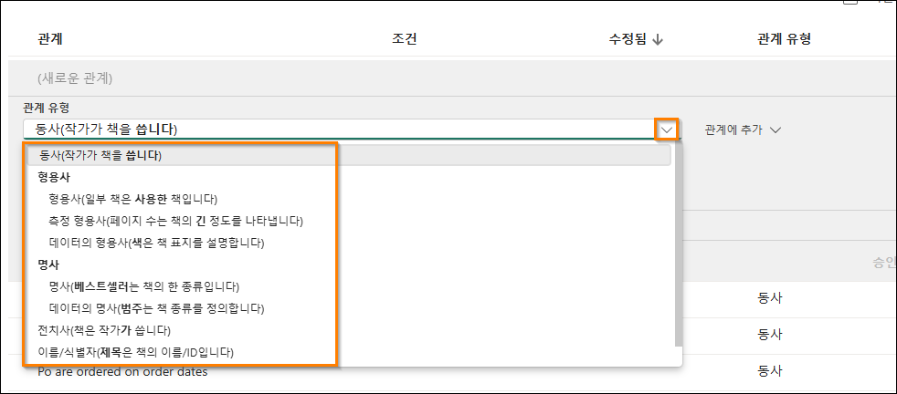

12. 이 랩에서는 모델에 관계를 만들지 않습니다.

    **ℹ️ 중요**

    **언어적 스키마 내 관계는 Copilot이 자연어에 응답할 때 테이블 간 연결을 이해하는 방식을 정의합니다.** 이는 '제품 카테고리별 매출'이나 '지역별 주문'과 같은 질문이 해석되는 방식을 결정합니다. 명확한 관계가 없으면 Copilot이 테이블 간 개념을 연결하는 데 어려움을 겪을 수 있습니다. 관계를 적절히 정의하면 더 매끄럽고 직관적인 대화가 보장됩니다.

    동의어 추가와 유사하게, 이는 사용자가 Copilot으로 데이터를 쿼리하는 방식과 언어적 스키마를 활용해 경험을 개선하는 방법에 대한 이해가 깊어질수록 업데이트와 유지보수가 필요한 복잡한 과정입니다!

13. 이제 Q&A 설정의 나머지 요소를 둘러볼 수 있습니다. **Q&A 교육** 섹션을 선택해 확인해 보세요.

    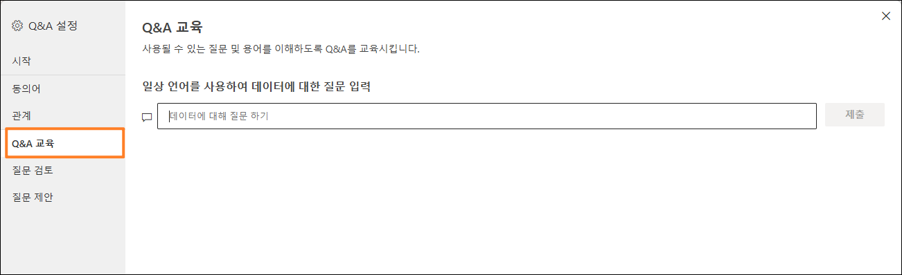

14. 여기서 Q&A가 사람들이 사용할 수 있는 질문과 용어를 이해하도록 학습시킬 수 있습니다.

    Q&A에 다음과 같이 질문해 보세요. **How many sales happen in january?**

    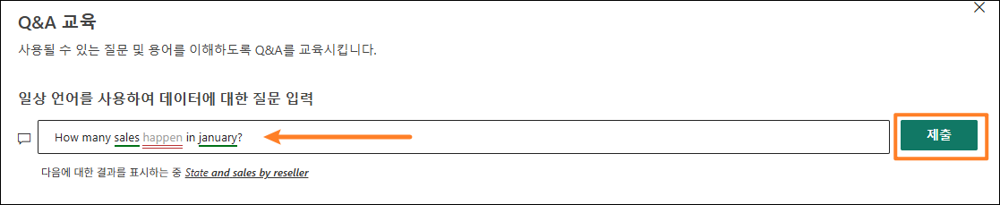

    Copilot이 'happen'을 알려지 않은 용어로 표시하는 것을 확인할 수 있습니다! 이를 통해 이와 같은 질문을 수용하도록 추가로 조정할 수 있습니다.

    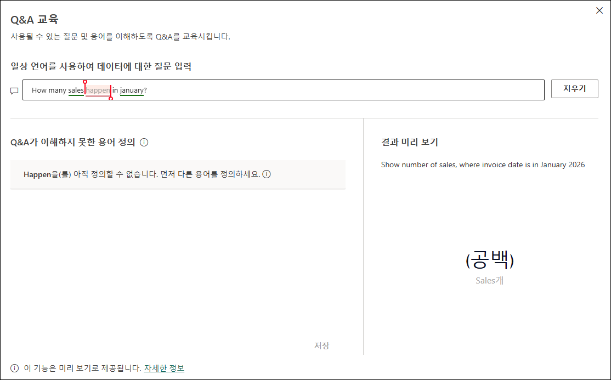

15. "What is the total sales for january 2022?"와 같은 다른 프롬프트로 다시 시도하고 결과를 받을 수 있습니다! 이는 훌륭한 테스트 영역이 됩니다.

    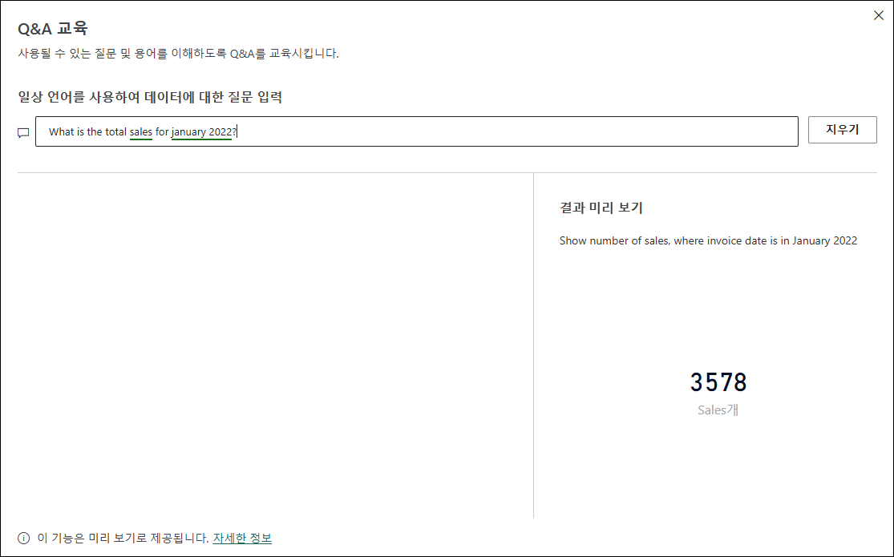

16. 동의어와 관계 설정이 작동하는 효과도 확인할 수 있습니다. **What is sales by Fabrikam Friends?**

    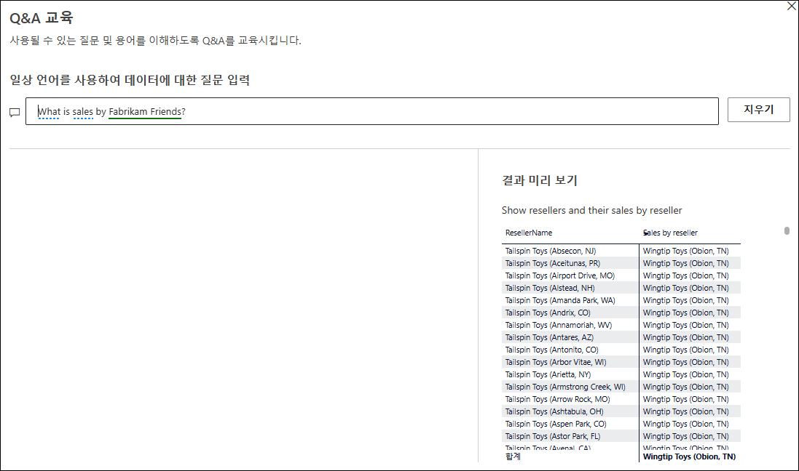

17. 다음으로 **질문 검토**로 이동합니다. 여기서 테넌트 내에서 사용자들이 제기한 질문들을 향후 수정할 수 있도록 조정할 수 있습니다.

    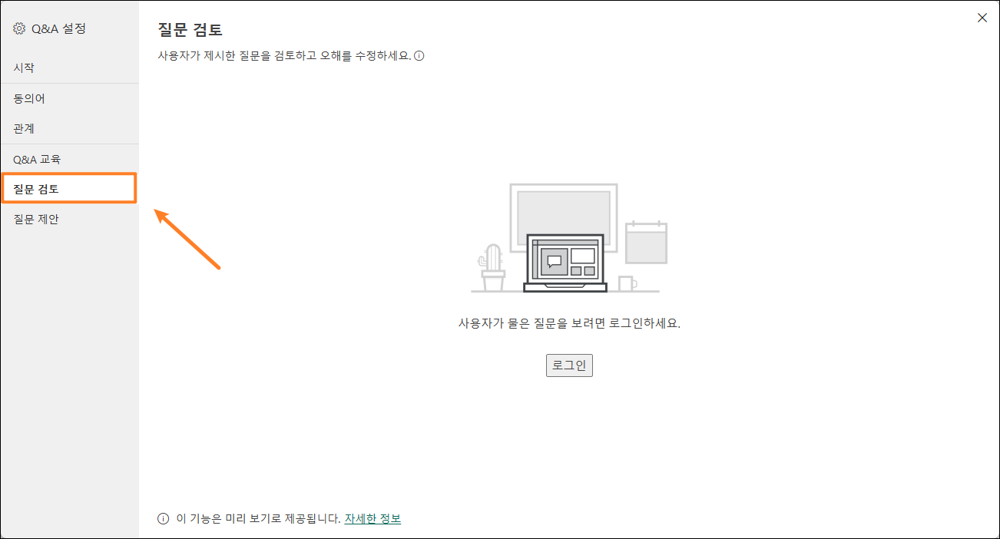

18. 마지막으로 **질문 제안**으로 이동합니다. 여기서 제안 질문을 추가하여 사용자들이 데이터를 탐색할 수 있도록 도울 수 있습니다.

    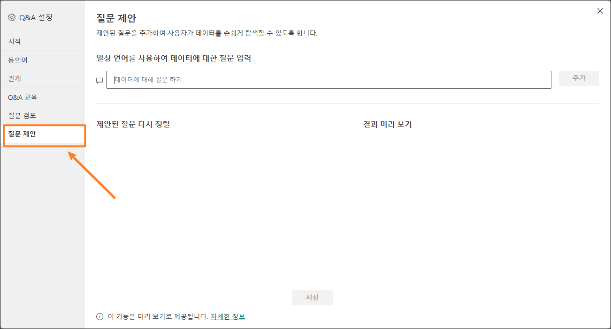

19. 사용자를 지원하기 위해 데이터에 대한 질문하기 상자를 선택하고 한 가지 제안을 추가해 보겠습니다. **What is total sales by State?** 제출을 눌러 미리 보기를 확인합니다.

    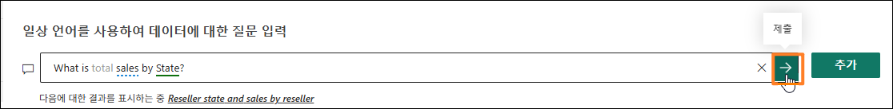

    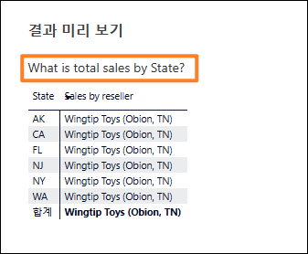

20. **추가**를 클릭하여 제안 사항을 저장합니다.

    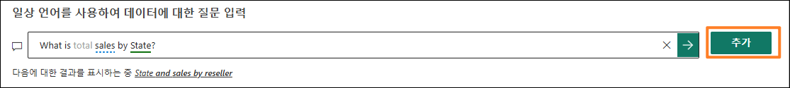

21. **결과**를 저장하면 랩 2를 완료할 수 있습니다.

    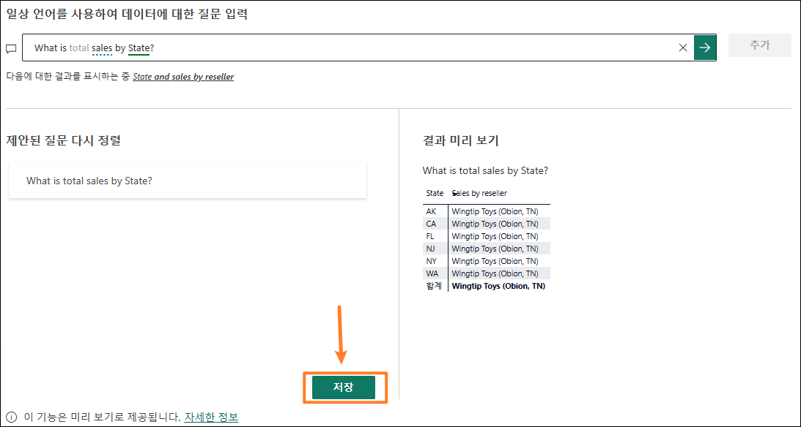

    이 랩에서는 Power BI 의미 체계 모델에 대한 Copilot의 자연어 응답 성능과 정확도를 향상시키기 위한 데이터 모델링 모범 사례를 배웠습니다.

    아래는 Microsoft Fabric의 다음 단계에 도움이 되는 몇 가지 추가 자료입니다.

    - 기본 [Microsoft Fabric 문서](https://learn.microsoft.com/en-us/fabric/)의 모든 정보에 액세스

    - [가이드 투어](https://aka.ms/Fabric-GuidedTour)로 Fabric 탐색

    - [Microsoft Fabric 무료 평가판](https://aka.ms/try-fabric) 신청

    - [Microsoft Fabric 웹 사이트](https://aka.ms/microsoft-fabric) 방문

    - [Fabric 학습 모듈](https://aka.ms/learn-fabric)을 탐색해서 새로운 기술 익히기

    - [Fabric 시작하기 무료 eBook](https://aka.ms/fabric-get-started-ebook) 읽기

    - [Fabric 커뮤니티](https://aka.ms/fabric-community)에 가입하여 질문을 게시하고 피드백을 공유하며 다른 사람들로부터 배우기

    다음과 같은 Copilot 관련 심층 기술 문서를 읽어보세요.

    - [Power BI용 Copilot 개요 - Power BI | Microsoft Learn](https://learn.microsoft.com/en-us/power-bi/create-reports/copilot-introduction)

    - [Power BI에서 독립형 Copilot 환경(프리뷰) – Power BI | Microsoft Learn](https://learn.microsoft.com/en-us/power-bi/create-reports/copilot-chat-with-data-standalone)

    - [Microsoft Fabric Copilot 관리자 설정 | Microsoft Learn](https://learn.microsoft.com/en-us/fabric/admin/service-admin-portal-copilot)

    - [Fabric 데이터 에이전트 생성(프리뷰) - Fabric 데이터 에이전트 생성 방법 알아보기 | Microsoft Learn](https://learn.microsoft.com/en-us/fabric/data-science/concept-data-agent)

    - [데이터 에이전트 구성을 위한 모범 사례 - Microsoft Fabric | Microsoft Learn](https://learn.microsoft.com/en-us/fabric/data-science/data-agent-configuration-best-practices)

    - [Microsoft Fabric 및 Power BI용 Copilot: FAQ - Microsoft Fabric | Microsoft Learn](https://learn.microsoft.com/en-us/fabric/fundamentals/copilot-faq-fabric)

    © 2026 Microsoft Corporation. All rights reserved.

    이 데모/랩을 사용하면 다음 조건에 동의하게 됩니다.

    이 데모/랩에 설명된 기술/기능은 학습 환경을 제공하고 사용자 의견을 얻기 위해 Microsoft Corporation에서 제공합니다. 데모/랩을 통해서만 이러한 기술적 특성과 기능을 평가하고 사용자 의견을 Microsoft에 제시할 수 있습니다. 다른 용도로는 사용할 수 없습니다. 이 데모/랩 또는 그 일부에 대해 수정, 복사, 배포, 전송, 표시, 수행, 재현, 게시, 라이선스 허여, 파생 작업 생성, 양도 또는 판매할 수 없습니다.

    추가 복제 또는 재배포를 위한 다른 서버 또는 위치에 대한 데모/랩(또는 그 일부)의 복사 또는 재현은 명시적으로 금지됩니다.

    이 데모/랩은 위에서 명시한 목적을 위해 복잡한 설정 또는 설치가 없는 시뮬레이션된 환경에서 잠재적인 새로운 기능과 개념을 포함하여 특정 소프트웨어 기술/제품의 특성 및 기능을 제공합니다. 이 데모/랩에서 서술된 기술/개념은 전체 기능을 나타내지 않을 수 있으며, 최종 버전이 작동하지 않을 수도 있습니다. 또한 해당 기능 또는 개념의 최종 버전을 릴리스하지 않을 수도 있습니다. 또한 실제 환경에서 이러한 특성과 기능을 사용한 경험이 다를 수도 있습니다.

    **피드백.** 이 데모/랩에서 서술된 기술적 특성, 기능 및/또는 개념에 대한 피드백을 Microsoft에 제시하면 Microsoft는 이 피드백을 어떤 방식과 목적으로든 무료로 사용, 공유 및 상용화할 수 있습니다. 또한 제품, 기술 및 서비스에서 사용자 의견이 포함된 Microsoft 소프트웨어 또는 서비스의 특정 부분을 사용하거나 인터페이스하는 데 필요한 모든 특허권을 제3자에게 무료로 제공합니다. Microsoft에서 사용자 의견을 포함하기 때문에 Microsoft에서 해당 소프트웨어 또는 설명서의 사용을 인가해야 하는 라이선스에 종속된 사용자 의견은 제공할 수 없습니다. 이러한 권리는 본 계약에 의거하여 유효합니다.

    Microsoft Corporation은 이에 따라 명시적, 묵시적 또는 법적 특정 목적에의 적합성, 권리 및 비침해 여부에 관계없이 상품성에 대한 모든 보증과 조건을 포함하여 데모/랩과 관련된 모든 보증 및 조건을 부인합니다. Microsoft는 어떤 목적으로든 결과의 정확성, 데모/랩의 사용으로 파생된 출력 또는 데모/랩에 포함된 정보의 적합성과 관련하여 어떠한 보증이나 진술도 하지 않습니다.

    **고지 사항**

    이 데모/랩에는 Microsoft Power BI의 새로운 기능 및 향상된 기능 중 일부만 포함되어 있습니다. 일부 기능은 제품의 향후 릴리스에서 변경될 수 있습니다. 이 데모/랩에서는 새로운 기능 모두가 아닌 일부에 대해 학습하게 됩니다.
