# Microsoft Fabric Chat with your Data in a Day - 랩 03

## 목차

- 문서 구조
- 시나리오/문제 설명
- 소개
- Copilot용 데이터 준비
  - 작업 1: 데이터 스키마 단순화
  - 작업 2: AI 지침 추가
  - 작업 3: 확인된 답변 생성
  - 작업 4: 직접 해보기
- 결론
- 참조

# 문서 구조

이 랩에서는 사용자가 수행해야 하는 단계를 보조 시각 자료의 관련 스크린샷과 함께 확인할 수 있습니다. 스크린샷에서 주황색 상자로 강조 표시된 섹션은 사용자가 특히 주목해야 하는 영역입니다.

# 시나리오/문제 설명

최근 Microsoft Fabric에서 Copilot을 활성화하여 사용자가 데이터를 보다 직관적으로 상호작용할 수 있도록 지원했습니다. 그러나 초기 사용 과정에서 Copilot이 때때로 부정확하거나 혼란스러운 답변을 반환하는 문제가 발견되었습니다. 이러한 문제는 지나치게 복잡한 데이터 모델, 모호한 용어, 의미 체계 내 불명확한 정의에서 비롯됩니다.

Copilot의 이해력과 결과물을 개선하기 위해, Power BI의 AI를 위한 데이터 준비 기능을 활용해 데이터 모델을 준비할 수 있다는 점을 알게 되었습니다. 여기에는 스키마 단순화, AI 지침 추가, 확인된 답변 생성 등이 포함되어 Copilot이 더 정확하고 맥락을 고려한 응답을 할 수 있도록 안내합니다.

**현재 과제**

- 불명확한 측정값 및 용어로 인한 Copilot 응답의 모호성 감소

- Copilot이 비즈니스 특화 정의(예: 베스트셀러 및 최고 판매량 비교)를 이해하도록 보장

- 일관성과 신뢰성 향상을 위한 일반적 질문에 대한 확인된 답변 제공

- 불필요하거나 오해의 소지가 있는 데이터 요소로의 Copilot 액세스 제한

# 소개

지금까지 Copilot 적용 준비 상태를 평가하는 방법과 의미 체계의 모범 사례를 학습했습니다. 이제 다음 단계로 해당 모델을 Copilot과 함께 사용할 수 있도록 준비할 것입니다. 이 랩에서는 AI용 데이터 준비 기능을 사용하여 스키마를 단순화하고, AI 지침을 추가하며, 확인된 답변을 생성할 것입니다. 이 모든 작업은 Copilot이 더 정확하고 비즈니스 관련성이 높은 인사이트를 제공하도록 돕습니다.

이 랩을 마치면 다음 사항을 알게 됩니다.

- Copilot의 동작을 안내하기 위해 데이터 스키마를 단순화하는 방법

- 비즈니스 용어를 명확히 하기 위해 AI 지침을 추가하는 방법

- Copilot의 정확도를 높이기 위해 확인된 답변을 생성하는 방법

# Copilot용 데이터 준비

이 섹션에서는 Copilot과 함께 사용할 데이터 모델을 준비합니다. 데이터 모델에 불필요한 측정값, 불명확한 정의 또는 모호한 용어가 포함되어 있을 경우 Copilot이 잘못되거나 혼란스러운 답변을 제공할 수 있기 때문입니다. 따라서 Power BI의 홈 리본에는 **AI에 적합하도록 데이터 준비하기** 버튼이 있습니다.

## 작업 1: 데이터 스키마 단순화

1. 수업 파일에서 **CDIAD – Lab 03 - Start**라는 PBIX 파일을 엽니다.

    

2. **홈** 리본의 Copilot 버튼을 클릭합니다.

    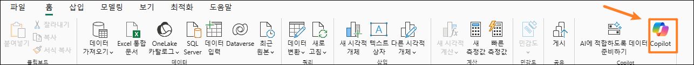

3. Copilot에게 질문합니다. **What reseller has the highest sales? Enter** 키를 누르거나 **화살표**를 클릭합니다.

    

4. 아래 스크린샷에서 결과를 확인할 수 있습니다. 이는 우리가 기대했던 결과가 아닙니다. Copilot은 [Reseller Sales] 측정값을 사용했지만, Copilot이 [Sales by Reseller]를 사용하기를 원합니다.

    **가능한 옵션:**

    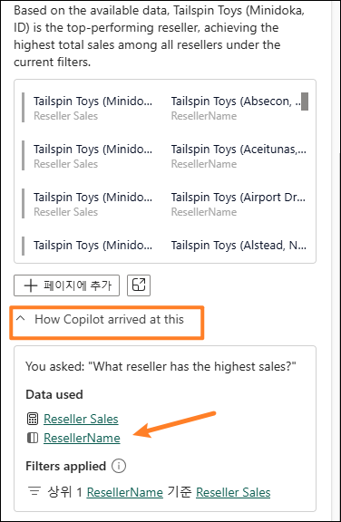

    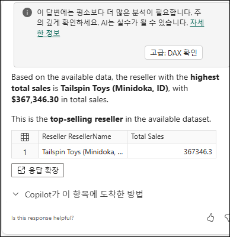

    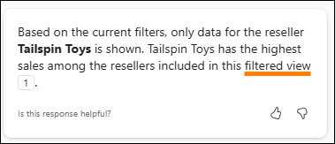

    이는 숨겨진 필터가 더 있음을 보여줍니다! 나중에 이를 조정할 것입니다.

5. Power BI Desktop의 ‘AI를 위한 데이터 준비’ 기능을 활용하여 Copilot에서 [Reseller Sales] 측정값을 숨기겠습니다. 홈 리본에서 **AI에 적합하도록 데이터 준비하기를** 선택합니다.

    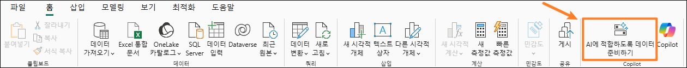

6. 새 창이 열리고 **AI에 적합하도록 데이터 준비하기** 페이지가 표시됩니다.

    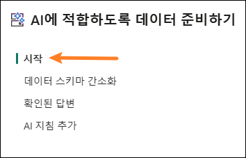

7. **데이터 스키마 간소화** 를 클릭합니다.

    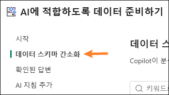

8. **>** 아이콘을 클릭하여 **Resellers** 테이블을 확장합니다. Reseller Sales 측정값은 Copilot을 사용하여 모호한 결과를 생성할 수 있으므로 Copilot이 분석 중에 포함하지 않도록 스키마에서 제거합니다! 이 측정값을 Copilot에서 제외하면 결과의 일관성이 향상됩니다. 측정값 **R**eseller Sales의 선택을 해제하려면 확인란을 클릭한 후 적용을 클릭합니다.. *아래 스크린샷을 참조하세요.*

    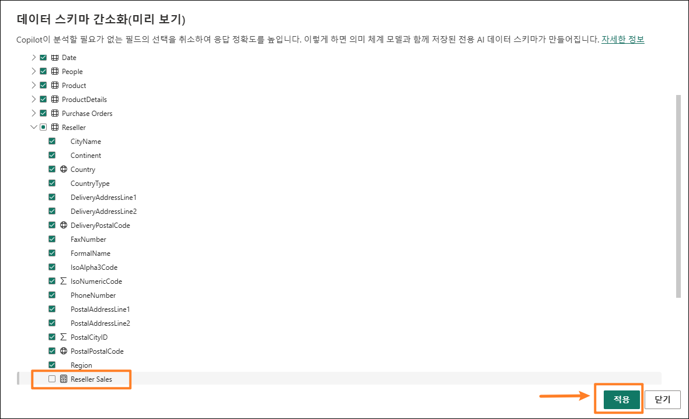

9. **닫기**를 클릭합니다.

    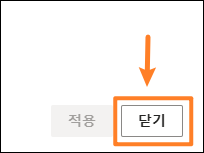

    **ℹ️ 중요**

    테이블, 열, 측정값의 이름을 매우 상세하게 지정하는 것이 권장되는 방법입니다. 이렇게 하면 Copilot이 질문에 답변할 때 더 일관되고 정확한 결과를 생성하는 데 도움이 됩니다. 예를 들어, 이 모델에는 [Reseller Sales]라는 측정값과 [Sales by Reseller]라는 또 다른 측정값이 있습니다. 이는 Copilot에게 혼란을 주어 답변이 일관되지 않을 수 있습니다. 이 랩에서는 스키마에서 해당 측정값을 제거했습니다. 다른 시나리오에서는 측정값 이름을 변경하는 것이 좋습니다!

10. **홈**** 리본에서** Copilot 버튼을 클릭하여 Copilot을 닫았다가 다시 엽니다.

    

    

11. Copilot에게 질문합니다. **What reseller has the highest sales? Enter** 키를 누르거나 **화살표**를 클릭합니다.

    

12. Copilot의 응답을 받은 후 **How Copilot arrived at this** 섹션을 클릭합니다.

    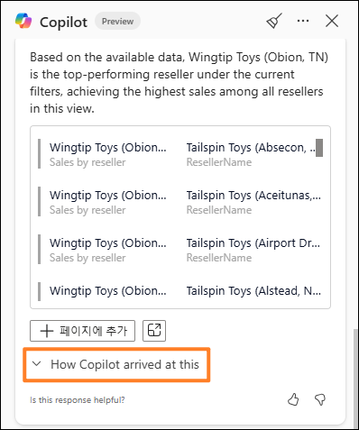

13. 이번에는 답변 도출에 사용된 측정값이 **Sales by Reseller 또는 SalesNet**임을 확인할 수 있습니다. 이는 Copilot이 원치 않는 측정값을 피하도록 훈련되었음을 의미합니다. Copilot의 비결정적 특성으로 인해 결과가 다르게 표시될 수 있습니다. AI가 보다 일관된 경험을 제공하도록 데이터를 계속 준비할 수 있는 부분입니다.

    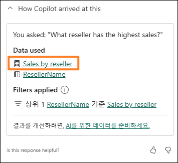

    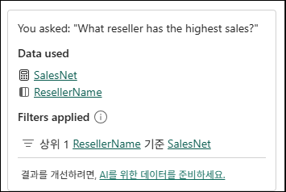

    **ℹ️ 중요**

    Power BI에서는 특정 필터 컨텍스트 내에서 매우 특수한 목적으로 사용되는 보조 측정값이나 일회성 측정값을 생성하는 경우가 흔합니다. Copilot에서 숨기고 싶은 측정값이 많다면, 숨길 측정값을 저장하기 위한 전용 테이블을 생성하는 것이 좋습니다. 이렇게 하면 스키마 업데이트 과정이 훨씬 간편해집니다. 현재 측정값 폴더 숨기기는 지원되지 않습니다.

    모범 사례로, Copilot을 혼란스럽게 할 수 있는 테이블, 열 및 측정값을 숨기는 것이 좋습니다.

14. Reseller 테이블의 State 대신 customer 테이블의 State가 반환되는 사례도 확인했습니다. Customer 테이블은 이 컨텍스트에서 사용되어서는 안 되며, 매우 특정 시나리오에서만 존재합니다. 이 테이블이 Copilot에 혼란을 줄 수 있으므로 숨기기로 하겠습니다.

15. 홈 리본에서 **AI에 적합하도록 데이터 준비하기**를 클릭합니다.

16. 왼쪽 탐색 모음에서 **데이터 스키마 간소화**를 선택합니다.

17. Customer를 선택 해제합니다. Customer 테이블의 선택을 해제하더라도, 해당 테이블은 보고서, 시각적 개체 또는 DAX 계산 등 구축이 필요한 모든 작업에 대해 의미 체계 내에 계속 존재합니다. 다만 분석 과정에서 Copilot은 이를 무시합니다. **적용** 및 **닫기**를 수행하세요.

    

    

## 작업 2: AI 지침 추가

AI 지침 추가 작업은 AI를 위한 데이터 준비 과정에서 매우 중요한 단계입니다. 명확하게 정의된 AI 지침을 추가하면 비즈니스 컨텍스트, 용어, 분석 우선순위를 모델에 직접 내장함으로써 Copilot이 의미 체계를 더 깊이 이해하도록 돕습니다. 이를 통해 Copilot은 인사이트 생성, 질문 응답 또는 시각적 개체 구축 시 더 스마트하고 빠르게 사용자의 의도에 부합하는 결과를 제공합니다.

이 랩에서는 AI 지침을 사용하여 Copilot이 베스트셀러 품목에 대해 질문받을 때 반환되는 내용을 정의하는 방법을 알아봅니다.

1. Copilot을 열고 다음 질문을 입력하세요. **What are the top 5 best-selling products.**

    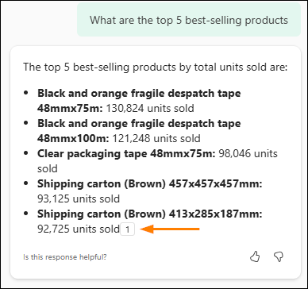

2. 위와 동일한 결과를 얻었다면, 해당 결과를 생성한 시각적 개체를 열기 위해 참조를 클릭하세요.

    

3. 이 결과는 정확해 보이며, 실제로 정확할 수도 있습니다. 그러나 '*best selling*' 제품과 최고 판매 제품을 구분하는 기준은 무엇일까요? 판매량, 판매 금액, 최고 이익률, 아니면 다른 기준일까요?

4. 현재로서는 Copilot이 명확성을 요청하도록 하여 최종 사용자에게 예상되고 정확한 결과가 반환되도록 해야 합니다. **AI에 적합하도록 데이터 준비하기** 버튼을 다시 클릭합니다.

    

5. **AI 지침 추가**로 이동합니다.

    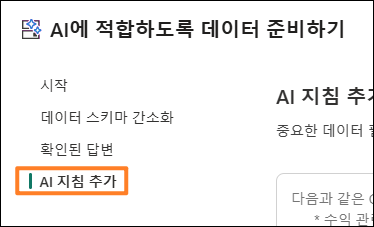

6. Copilot이 사용자에게 최고, **가장 또는 베스트셀러**를 요청할 때마다 어떤 정의를 의도하는지 명확히 하도록 지침을 추가하세요.

7. 다음을 입력합니다.
    ***If asked about "highest" or ”most” or "best-selling" product, first clarify if the user wants product by unit sold or product by total sales value.*** **적용**을 클릭하고 **닫기**를 클릭합니다.

    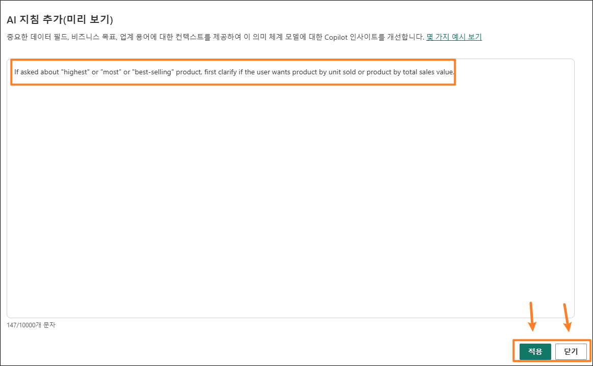

8. Copilot 창을 엽니다. 이미 열려 있었다면 Copilot을 닫고 다시 엽니다. 이렇게 하면 변경 사항이 적용되었는지 확인할 수 있습니다!

    

9. Copilot에게 질문합니다. **What’s our best-selling product**

    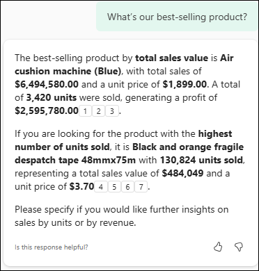

10. Copilot에게 사용자가 베스트셀러라는 용어를 어떻게 정의하는지 명확히 하라는 지침을 제공했기 때문에, 여기에는 두 가지 옵션이 표시됩니다. 명확히 하거나 추가 정보를 요청하는 질문이 표시될 수도 있습니다.

11. 프롬프트에 **units sold**를 입력하고 Enter 키를 누릅니다. Copilot이 이제 더 구체적인 답변을 제공할 것입니다.

    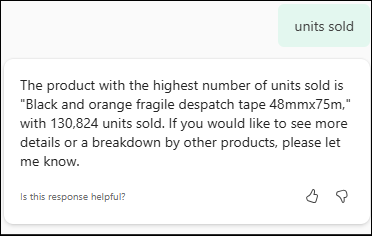

12. 조직 내 모든 사용자가 베스트셀링과 최고 판매량의 차이를 확실히 알고 있다고 가정해 보겠습니다. 이 경우 AI 지침을 사용하여 Copilot에 간단히 정의를 제공할 수 있습니다.

13. **AI에 적합하도록 데이터 준비하기** 대화 상자를 다시 열고, AI 지침 추가로 이동한 후 현재 지침을 다음과 같이 교체합니다.

    - **Best-selling = most units sold**

    - **Highest selling = total sales value**

        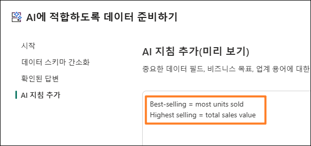

14. 적용을 클릭한 후 닫기를 클릭합니다.

15. Copilot을 닫았다가 다시 엽니다. 프롬프트에서 **What’s our best-selling product**를 입력하고 Enter 키를 누릅니다.

    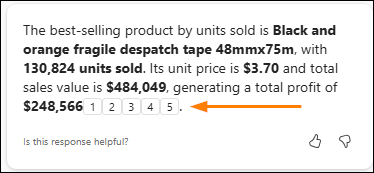

    이제 Copilot은 우리가 기대하는 답변에 도달하며 **베스트셀링**과** 최고 판매량**을 구분할 수 있습니다. 이 섹션 시작 부분에서 언급했듯이 AI에 더 명확하게 정의된 지시를 제공할수록 Copilot의 성능은 더 좋아집니다!

    **ℹ️ 중요**

    **Power BI Desktop에서는 게시 지연이 없으므로 AI 지침 테스트가 더 빠릅니다.** 따라서 서비스에 게시하기 전에 로컬에서 지침을 테스트하고 개선하는 것이 좋습니다. 게시 시 지연이 발생하며 변경 사항이 즉시 반영되지 않으면 혼란을 초래할 수 있습니다. Desktop은 반복 작업과 디버깅에 더 반응성이 뛰어난 환경을 제공합니다.

16. 위와 동일한 답변을 받았다면, 결과가 어디서 비롯되었는지 확인하기 위해 참조 항목을 클릭합니다.

    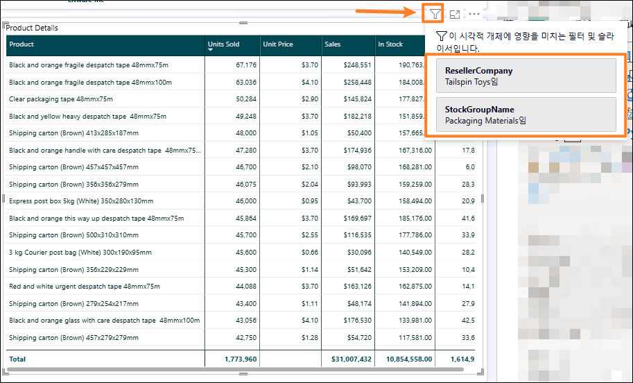

17. 결과는 다를 수 있지만, 반환된 결과가 기존 시각적 개체에서 비롯되었음을 확인하고 자세히 살펴보면 해당 시각적 개체가 실제로 필터링되어 있음을 알 수 있습니다. 이는 Copilot으로부터 오해의 소지가 있는 응답을 받았음을 의미합니다. 특히, 요청 시 필터를 명시하지 않았음에도 Copilot이 결과가 필터링되었다고 명시하지 않았습니다.

18. AI에 적합하도록 데이터 준비하기로 돌아간 후 **AI 지침**으로 이동합니다. 다음 지침을 추가합니다.

    **If you use an existing report visual to answer a user request, always let the user know about any existing filters on the visual.**

    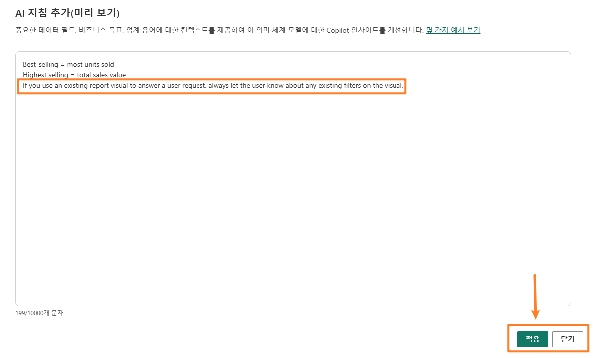

19. Copilot에게 다시 질문합니다. **What’s our best-selling product?**

    

20. 이번에는 참조된 시각적 개체가 1개 달라졌으며, Copilot이 시각적 개체에 Tailspin Toys에 대한 ResellerCompany 필터가 적용되어 있음을 정확히 식별했음을 확인합니다.

    **ℹ️ 중요**

    AI 지침은 아직 프리뷰 단계에 있으며 빠르게 변화하는 기능임을 기억하는 것이 중요합니다. 다양한 지침을 계속 탐색하며 어떤 것이 효과적이고 어떤 것이 그렇지 않은지 확인해 보세요!

    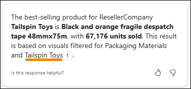

21. 독립형 Copilot 환경을 최종 사용자에게 배포함에 따라 신뢰를 구축해야 하며, 이를 위한 한 가지 방법은 Copilot이 추측하지 않도록 하는 것입니다. 추가할 수 있는 지시 사항 중 하나는 Copilot이 질문 내용을 이해하지 못할 경우 절대 추측하지 않도록 지시하는 것입니다.

22. **AI에 적합하도록 데이터 준비하기**를 열고 다음 지시 사항을 추가한 후 적용하고 닫습니다.

    - **Best-selling = most units sold**

    - **Highest selling = total sales value**

    **If you use an existing report visual to answer a user request, always let the user know about any existing filters on the visual.**

    ***If you do not understand what is being asked, do NOT guess, instead ask for clarification.***

    - 이제 Copilot이 명확히 설명해 달라고 요청할 가능성이 높아집니다.

    - Copilot이 불확실할 때 적용되는 AI 지침의 실제 작동 모습입니다!

    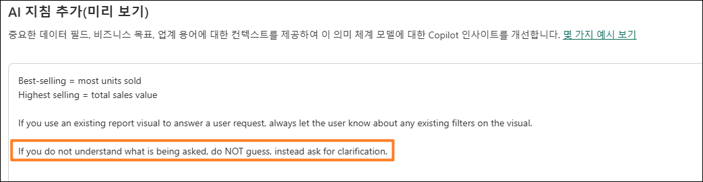

23. Copilot을 다시 열고 다음과 같은 혼란스러운 질문을 해보세요. **Total sales by something what is that?**

    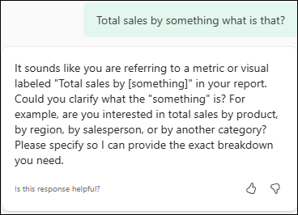

24. 위 스크린샷에서 볼 수 있듯이, 이 예시에서 Copilot은 총 매출액을 어떻게 보고 싶어 하는지 확신하지 못하므로, 원하는 내용을 명확히 해달라고 요청합니다!

25. 추가할 수 있는 또 다른 유형의 지침은 보고서 시각적 가이드입니다. 예를 들어, 날짜를 항상 선 그래프로 표시하거나 국가별 매출을 볼 때 항상 Copilot이 행렬을 반환하도록 하려면 이러한 지침을 추가할 수 있습니다.

26. AI 지침을 추가하지 않으면 Copilot이 어떤 시각화를 반환할지 보장할 수 없습니다. 예를 들어, 다음과 같이 묻는다면 **Show total sales measure by year** 꺾은선형 차트가 표시됩니다.

    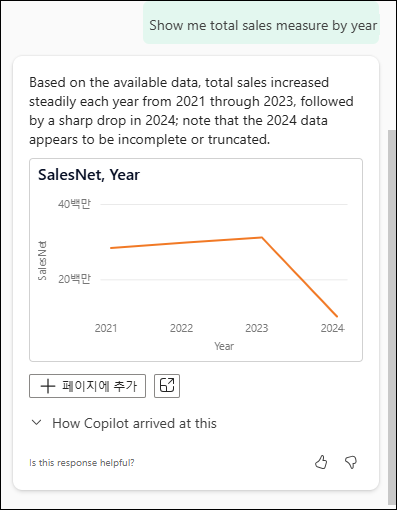

27. 이제 AI 지침을 추가해 결과를 확인해 보겠습니다! **AI에 적합하도록 데이터 준비하기**를 열고 다음 지침을 추가합니다.

    **## Visual Guidance**

    **ℹ️ 중요**

    AI 지침을 작성할 때 “##”는 Markdown 언어 형식으로서 필수 사항은 아니지만, Copilot과 Fabric 데이터 에이전트의 체계적인 관리를 위해 권장되는 방식입니다.

    ***When showing the total sales measure by year always use a column chart.***

    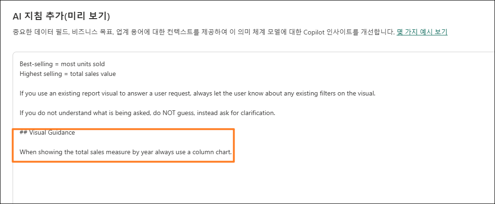

28. Copilot을 다시 열고 다음과 같은 질문을 해보세요. **Show total sales measure by year.**

    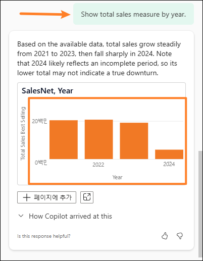

    Copilot은 답을 도출하기 위해 DAX를 작성하고 테이블로 표시할 수 있습니다. 항상 다음과 같이 요청할 수 있다는 점을 기억하세요. **Can you make this into a column chart?** 또는 **AI 지침**을 재작성합니다.

    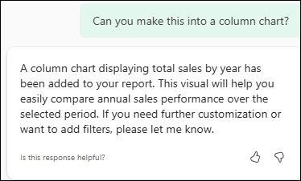

29. 다른 예시, 이번에는 측정값 정의를 살펴보겠습니다. Copilot 채팅 창으로 돌아가 다음 질문을 해봅니다. **How many purchase orders do we have?**

    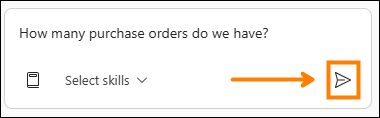

30. 결과가 정확하다는 점에 주목하세요. **How Copilot** **arrived at this** 역을 확장하면 명시적 측정값을 사용하고 있음을 확인할 수 있습니다! 기억하시겠지만, 정확히 이 측정값에 대해 Copilot 지원 설명을 생성한 바 있습니다. 하지만 DAX가 어떻게 계산되는지 명확히 설명해 달라고 요청해 봅시다.

    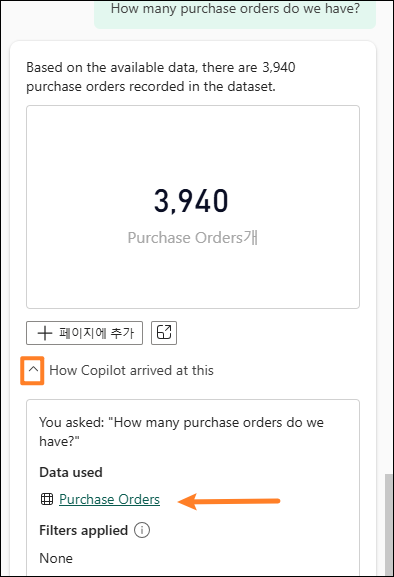

31. 질문해 봅니다. **Can you explain the DAX used?**

    

32. 답변은 Copilot이 정확한 DAX 수식을 직접 접근하는 데 한계가 있음을 지적한다는 점에서 매우 흥미롭습니다 답변 자체는 'likely', 'if', 'typically', 'potentially'와 같은 표현을 사용하여 본질적으로 매우 *생성형*입니다. 이는 ***때로는*** TMDL 보기와 AI 지침의 도움으로 해결될 수 있습니다!

    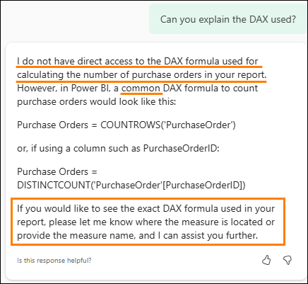

33. 왼쪽 탐색 창에서 **TMDL** 보기를 선택합니다.

34. 화면 하단에서 '+' 버튼을 눌러 스크립트를 생성합니다.

    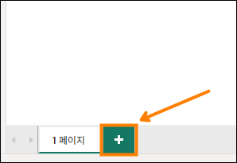

35. 데이터 모델 내 DAX에 대한 명확한 설명을 사용자에게 제공하기 위해 단일 측정값을 가져올 것입니다. **Purchase Orders** 측정값을 스크립트로 드래그합니다.

    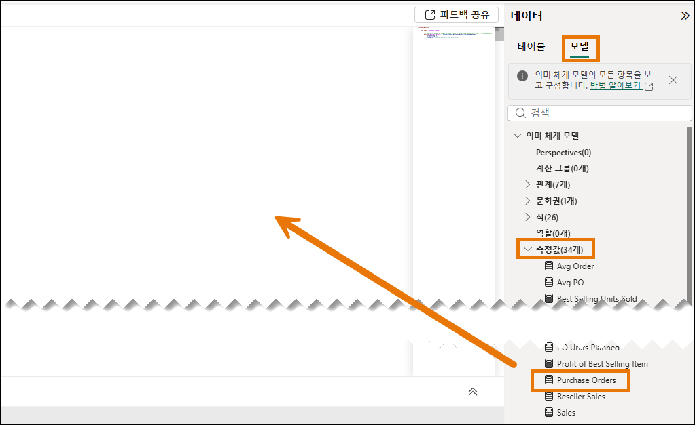

36. 생성된 TMDL 스크립트는 AI 지침에 추가하기에 훌륭한 자료입니다! 이 보기에서도 설명이 표시되는 것을 확인할 수 있습니다. 이제 아래와 같이 측정값 설명과 측정값 자체를 복사합니다.

    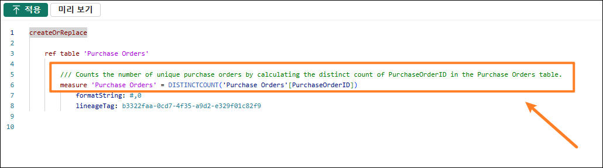

37. 이제 보고서 보기에서 **AI에 적합하도록 데이터 준비하기**로 돌아가 아래와 같이 **AI 지침 추가** 보기에 TMDL 설명과 측정 항목 세부 정보를 추가합니다. 그런 다음 **적용**을 누릅니다.

    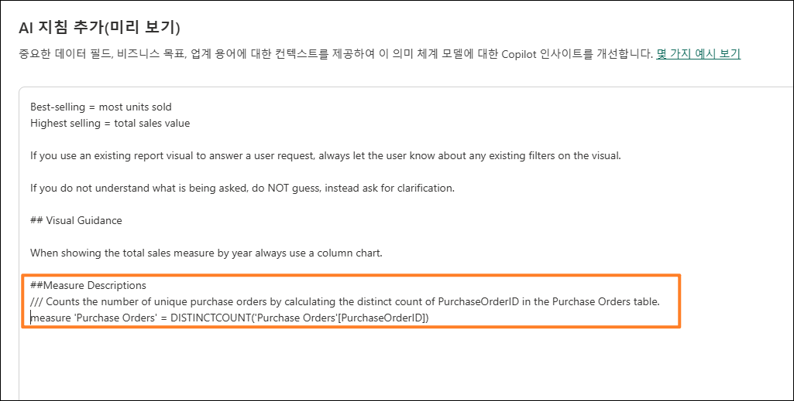

38. Copilot 창을 다시 열어 지침을 새로 고치고 이전과 동일한 질문을 합니다. **How many purchase orders do we have?**

    

39. 지금까지 좋습니다. 예상했던 동작이지만, 우리가 기다려온 순간은 다음 질문입니다.

    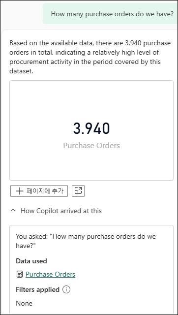

40. 이제 명확히 설명해 달라고 요청합니다. **Can you explain the DAX used in the Purchase Orders measure?**

    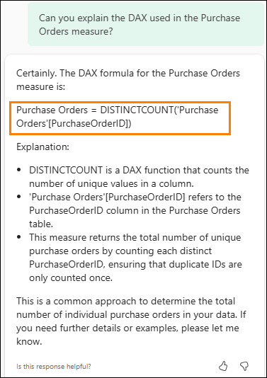

41. 안타깝게도 Copilot은 여전히 추측 중입니다. 실제 DAX 코드가 무엇인지는 맞췄으나 AI 지침에 DAX 코드를 추가하는 방법이 가끔은 통할 수 있지만, 현재 프리뷰 단계에서는 일관성이 없습니다!

42. 이전 랩에서 남동부 지역의 총 매출을 요청했습니다. Copilot은 Reseller 테이블의 Sales Territory 열을 사용하지 않고, 대신 남동부 지역을 대표하는 주를 추측했습니다. 이 섹션에서는 지역 관련 질문 시 Copilot이 반드시 Sales Territory를 사용하도록 AI 지침을 추가하겠습니다!

43. **AI에 적합하도록 데이터 준비하기**를 열고 다음 지침을 추가합니다.

    **If a user asks about region or territory related data, for example Southeast, use the Sales Territory column from the Reseller table.**

    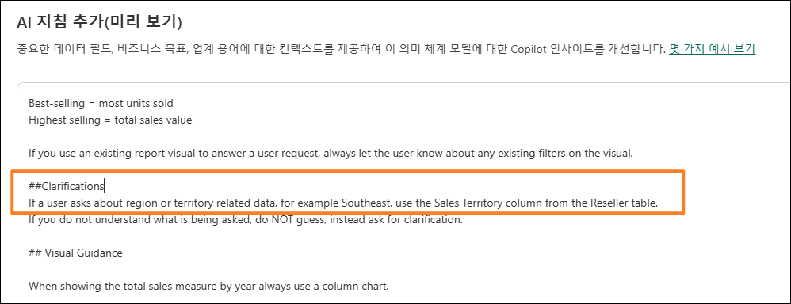

44. opilot을 열고 다음 프롬프트를 입력합니다. **Show total sales for the Southeast.**

    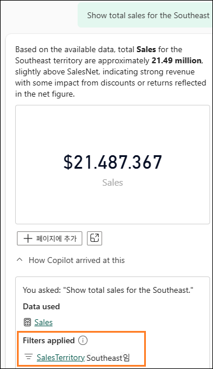

45. 이전 섹션에서 데이터 스키마에서 Customer 테이블을 제거했습니다.

    이 조직 내에서 고객은 당사 제품을 구매한 후 유통하는 재판매인으로 특별히 정의됩니다. 해당 재판매인으로부터 구매하는 최종 소비자는 고객으로 분류되지 않습니다. Copilot이 고객에 대해 질문받을 때 재판매인을 반환하도록 하기 위해 이 점을 명확히 구분해야 합니다.

46. AI에 적합하도록 데이터 준비하기를 열고 다음을 입력합니다.

    **Customers = Resellers**

    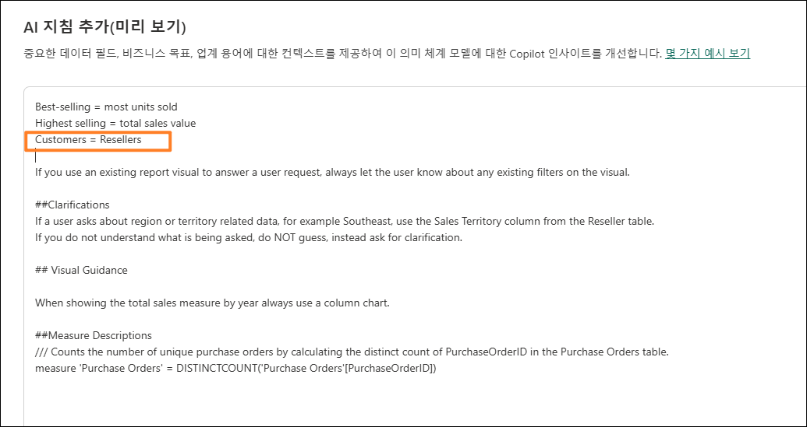

47. Copilot 프롬프트에 다음을 질문합니다. **What customer sold the most products in 2021?**

    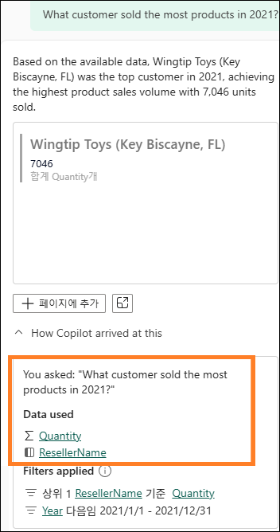

    이 결과는 생성된 DAX 계산식에도 표시됩니다!

    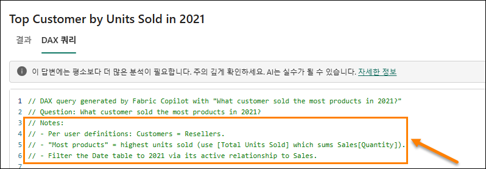

    Copilot이 올바르게 지시받아 Customer를 Reseller으로 표현하고 있는지 확인합니다.

## 작업 3: 확인된 답변 생성

**ℹ️ 중요**

확인된 답변은 사용자가 설정한 문구와 의미 체계적으로 유사한 것으로 식별된 모든 표현과 일치합니다. 따라서 사용자가 물어볼 수 있는 모든 가능한 변형을 설정할 필요는 없습니다. 대신 유사한 표현이 사용자에게 동일한 결과를 유발할 수 있도록 명확하고 구별되는 트리거 문구를 설정합니다.

데이터 준비를 한 단계 업그레이드하여 확인된 답변을 추가해 보겠습니다. 확인된 답변은 모델 작성자가 시각적 개체를 선택하고 문구를 지정할 수 있게 하여, 사용자가 질문할 때 해당 시각적 개체를 확인된 답변으로 표시합니다. 확인된 답변은 Copilot이 모델의 맥락을 학습하는 데 도움을 주며, 프롬프트가 정확한 확인된 답변을 반환하지 않더라도 더 정확한 답변을 제공할 수 있게 합니다.

1. 첫 번째 예시에서는 **Top state for sales**에 대한 확인된 답변을 생성합니다.

2. 현재 Copilot에게 다음과 같이 물어보면 **What state has the most sales?** 이는 모델과 보고서 내에서 “판매”(sales)라는 단어가 여러 방식으로 참조되기 때문입니다.

3. 이 예시에서는 Copilot이 항상 예상된 응답을 반환하도록 보장합니다.

4. 이번에는 AI를 위한 데이터 준비 대화 상자에서 시작하지 **않습니다**. AI를 위한 데이터 준비 대화 상자에서 검증된 답변 탭을 열면 아무것도 표시되지 **않음**을 확인할 수 있습니다.

    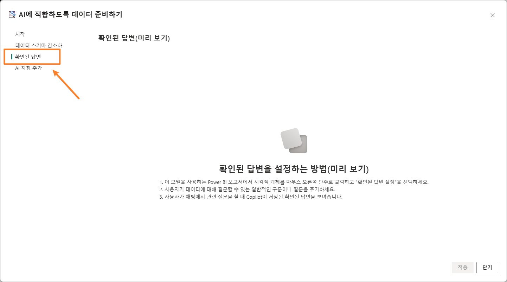

5. 대신 보고서의 시각적 개체부터 시작합니다.

6. AI를 위한 데이터 준비 창을 닫고 **Product detail** 페이지로 이동합니다.

    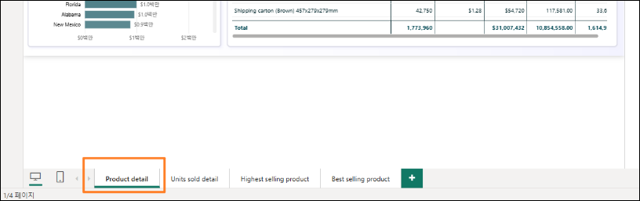

7. 주별 매출 막대형 차트를 클릭한 후 오른쪽 상단 모서리의 점 세 개(**…**)를 클릭합니다.

    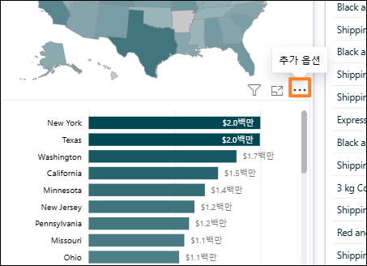

8. 드롭다운에서 **확인된 답변 설정**을 선택합니다.

    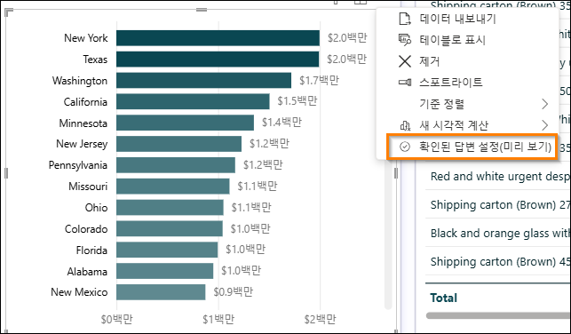

9. Copilot 제안 중 하나를 선택하거나 직접 사용자 맞춤형 문구를 입력하여 문구를 설정할 수 있습니다.

10. 문구 입력란에 **State with the highest sales**를 입력하고 **추가를 클릭합니다.** *아래 스크린샷을 참조하세요.*

    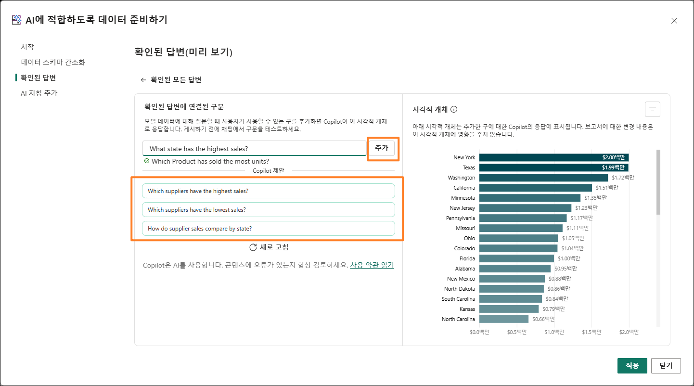

11. **적용**을 클릭한 후 닫습니다.

    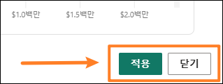

    12\. Copilot 창을 닫았다가 다시 엽니다.

    13\. Copilot에게 질문합니다. **What state has the highest sales?**

    

    14\. 질문에 대한 정확한 확인된 답변이 반환됩니다.

    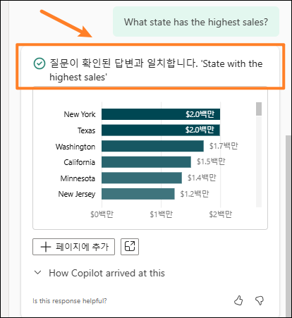

    15\. 오탐(false positive)은 어떨까요? 확인된 답변을 사용해서는 안 되는 질문을 시도해 보고 결과를 확인해 보겠습니다. Copilot에 다음 프롬프트를 입력합니다. **What state is selling the most of the highest selling product?**

    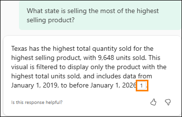

    16 완벽합니다! 응답이 보고서 내 다른 시각적 개체를 가리키고 있습니다. 더 구체적으로, 상위 판매 제품으로 필터링된 시각적 개체를 가리키고 있습니다. 또한 응답이 이전 AI 지시를 준수하며 반환된 시각적 개체에 적용된 필터를 알려주고 있음을 확인합니다.

17. 또 다른 확인된 답변을 추가해 보겠습니다. 이번에는 **가장 많이 판매된 제품**을 보여주고자 합니다.

18. Best selling product 페이지를 클릭합니다.

    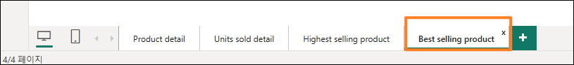

19. 다음으로 상단의 시각적 개체 요소를 찾아 점 세 개**(…)**를 클릭한 후 **확인된 답변 설정**을 선택합니다.

    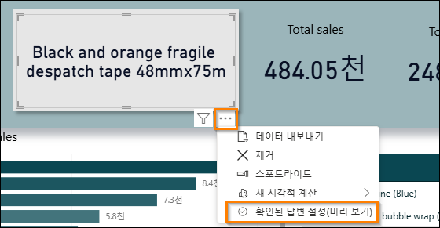

20. 이전 랩에서 AI 지침을 추가하여 AI가 '베스트셀링'은 총 판매 수량, '최고 판매'는 총 판매 금액임을 알도록 했습니다. 확인된 답변 문구가 AI 지침과 정확히 일치하는지 확인해야 합니다.

21. 이번에는 두 문구를 추가할 것입니다. 이 문구들은 Copilot 제안에 표시될 수도 있고 표시되지 않을 수도 있습니다. 먼저 다음 문구를 추가합니다. **Which Product has sold the most units?** 그런 다음 추가를 클릭합니다.

    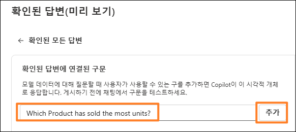

22. 적용을 클릭합니다.

    

23. **Copilot 제안** 옆의 + 아이콘을 클릭하여 추가 문구를 입력합니다. **What is the best-selling product?** 또는 유사한 문구를 입력한 후 경우 추가를 클릭합니다.

    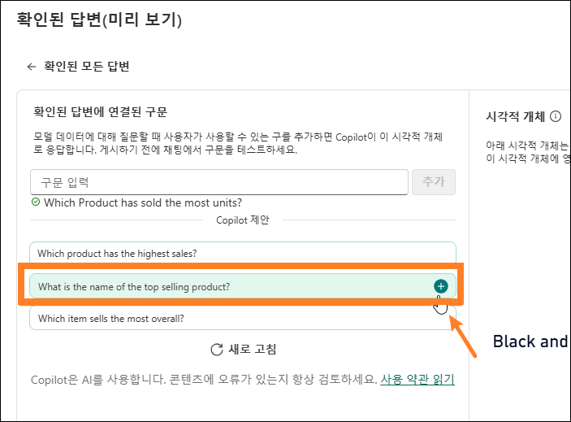

24. 아래 스크린샷과 같이 이제 두 문구가 모두 보고서 시각적 개체와 연결되었습니다.

    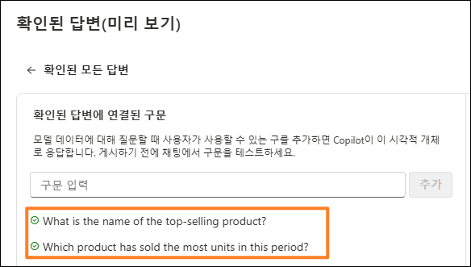

25. 적용을 클릭한 후 닫습니다.

26. 축하합니다! 이 섹션에서는 보고서 시각적 개체에 확인된 답변을 추가하는 방법을 배웠습니다 또한 개별 보고서 시각적 개체에 사용자 질문을 연결하기 위해 여러 문구를 추가할 수 있다는 점도 알게 되었습니다!

## 작업 4: 직접 해보기

랩 시간이 허용된다면, 이 랩에서 배운 **AI에 적합하도록 데이터 준비하기** 기능을 계속 탐색해 보세요.

1. Copilot에게 알고 싶은 질문을 던져 보세요. 결과가 원하거나 기대했던 것과 다른 경우. 결과가 원하는 바와 다르거나 예상과 다를 경우, 데이터 스키마, 확인된 답변 또는 AI 지시문만 사용하여 원하는 결과를 보장할 수 있는 방법을 고려해 보세요!

## 결론

축하합니다! 랩의 AI에 적합하도록 데이터 준비하기 섹션을 완료했습니다!

# 참조

Chat With Your Data in a Day (CDIAD)에서는 Fabric 작업 영역에서 독립형 Copilot을 사용할 때의 몇 가지 주요 기능을 소개합니다.

서비스의 메뉴에 있는 도움말(?) 섹션에는 유용한 리소스로 연결되는 링크가 있습니다. 현재 사용 중인 환경에 따라 표시되는 화면이 달라질 수 있으므로 아래 스크린샷과 옵션이 다를 수 있음을 유의하세요.

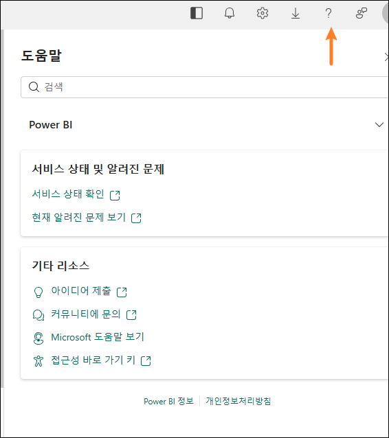

아래는 Microsoft Fabric의 다음 단계에 도움이 되는 몇 가지 추가 자료입니다.

- 기본 [Microsoft Fabric 문서](https://learn.microsoft.com/en-us/fabric/)의 모든 정보에 액세스

- [가이드 투어](https://aka.ms/Fabric-GuidedTour)로 Fabric 탐색

- [Microsoft Fabric 무료 평가판](https://aka.ms/try-fabric) 신청

- [Microsoft Fabric 웹 사이트](https://aka.ms/microsoft-fabric) 방문

- [Fabric 학습 모듈](https://aka.ms/learn-fabric)을 탐색해서 새로운 기술 익히기

- [Fabric 시작하기 무료 eBook](https://aka.ms/fabric-get-started-ebook) 읽기

- [Fabric 커뮤니티](https://aka.ms/fabric-community)에 가입하여 질문을 게시하고 피드백을 공유하며 다른 사람들로부터 배우기

다음과 같은 Copilot 관련 심층 기술 문서를 읽어보세요.

- [Power BI용 Copilot 개요 - Power BI | Microsoft Learn](https://learn.microsoft.com/en-us/power-bi/create-reports/copilot-introduction)

- [Power BI에서 독립형 Copilot 환경(프리뷰) – Power BI | Microsoft Learn](https://learn.microsoft.com/en-us/power-bi/create-reports/copilot-chat-with-data-standalone)

- [Microsoft Fabric Copilot 관리자 설정 | Microsoft Learn](https://learn.microsoft.com/en-us/fabric/admin/service-admin-portal-copilot)

- [Fabric 데이터 에이전트 생성(프리뷰) - Fabric 데이터 에이전트 생성 방법 알아보기 | Microsoft Learn](https://learn.microsoft.com/en-us/fabric/data-science/concept-data-agent)

- [데이터 에이전트 구성을 위한 모범 사례 - Microsoft Fabric | Microsoft Learn](https://learn.microsoft.com/en-us/fabric/data-science/data-agent-configuration-best-practices)

- [Microsoft Fabric 및 Power BI용 Copilot: FAQ - Microsoft Fabric | Microsoft Learn](https://learn.microsoft.com/en-us/fabric/fundamentals/copilot-faq-fabric)

© 2026 Microsoft Corporation. All rights reserved.

이 데모/랩을 사용하면 다음 조건에 동의하게 됩니다.

이 데모/랩에 설명된 기술/기능은 학습 환경을 제공하고 사용자 의견을 얻기 위해 Microsoft Corporation에서 제공합니다. 데모/랩을 통해서만 이러한 기술적 특성과 기능을 평가하고 사용자 의견을 Microsoft에 제시할 수 있습니다. 다른 용도로는 사용할 수 없습니다. 이 데모/랩 또는 그 일부에 대해 수정, 복사, 배포, 전송, 표시, 수행, 재현, 게시, 라이선스 허여, 파생 작업 생성, 양도 또는 판매할 수 없습니다.

추가 복제 또는 재배포를 위한 다른 서버 또는 위치에 대한 데모/랩(또는 그 일부)의 복사 또는 재현은 명시적으로 금지됩니다.

이 데모/랩은 위에서 명시한 목적을 위해 복잡한 설정 또는 설치가 없는 시뮬레이션된 환경에서 잠재적인 새로운 기능과 개념을 포함하여 특정 소프트웨어 기술/제품의 특성 및 기능을 공합니다. 이 데모/랩에서 서술된 기술/개념은 전체 기능을 나타내지 않을 수 있으며, 최종 버전이 작동하지 않을 수도 있습니다. 또한

해당 기능 또는 개념의 최종 버전을 릴리스하지 않을 수도 있습니다. 또한 실제 환경에서 이러한 특성과 기능을 사용한 경험이 다를 수도 있습니다.

**피드백.** 이 데모/랩에서 서술된 기술적 특성, 기능 및/또는 개념에 대한 피드백을 Microsoft에 제시하면 Microsoft는 이 피드백을 어떤 방식과 목적으로든 무료로 사용, 공유 및 상용화할 수 있습니다. 또한 제품, 기술 및 서비스에서 사용자 의견이 포함된 Microsoft 소프트웨어 또는 서비스의 특정 부분을 사용하거나 인터페이스하는 데 필요한 모든 특허권을 제3자에게 무료로 제공합니다. Microsoft에서 사용자 의견을 포함하기 때문에 Microsoft에서 해당 소프트웨어 또는 설명서의 사용을 인가해야 하는 라이선스에 종속된 사용자 의견은 제공할 수 없습니다. 이러한 권리는 본 계약에 의거하여 유효합니다.

Microsoft Corporation은 이에 따라 명시적, 묵시적 또는 법적 특정 목적에의 적합성, 권리 및 비침해 여부에 관계없이 상품성에 대한 모든 보증과 조건을 포함하여 데모/랩과 관련된 모든 보증 및 조건을 부인합니다. Microsoft는 어떤 목적으로든 결과의 정확성, 데모/랩의 사용으로 파생된 출력 또는 데모/랩에 포함된 정보의 적합성과 관련하여 어떠한 보증이나 진술도 하지 않습니다.

**고지 사항**

이 데모/랩에는 Microsoft Power BI의 새로운 기능 및 향상된 기능 중 일부만 포함되어 있습니다. 일부 기능은 제품의 향후 릴리스에서 변경될 수 있습니다. 이 데모/랩에서는 새로운 기능 모두가 아닌 일부에 대해 학습하게 됩니다.
