# Microsoft Fabric Chat with your Data in a Day - 랩 04

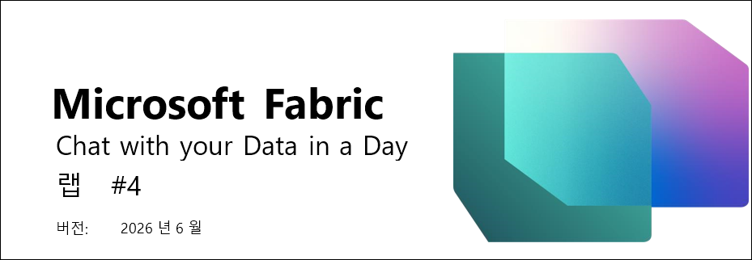

## 목차

- 문서 구조
- 시나리오/문제 설명
- 소개
- 독립형 Copilot 환경
- 설정: 후속 랩을 위한 작업 영역 설정
  - 작업 1: 독립형 Copilot 환경 탐색
  - 작업 2: 독립형 Copilot에서 프롬프트 작성하기
  - 작업 3: 보고서에서 확인하세요 기능 탐색
  - 작업 4: 탐색
  - 작업 5: 검증된 답변
  - 작업 6: Copilot이 이 결론에 도달한 과정(HCAAT)
  - 작업 7: Copilot에서 생성된 DAX 쿼리의 데이터 답변
  - 작업 8: Copilot의 컨텍스트 전환
  - 작업 9: 의미 체계로부터 Copilot의 시각적 개체 생성
  - 작업 10: 일반 Copilot 환경
- 참조

# 문서 구조

이 랩에서는 사용자가 수행해야 하는 단계를 보조 시각 자료의 관련 스크린샷과 함께 확인할 수 있습니다. 스크린샷에서 주황색 상자로 강조 표시된 섹션은 사용자가 특히 주목해야 하는 영역입니다.

# 시나리오/문제 설명

여기까지 오신 것을 축하드립니다. 이제 데이터 모델에 일반적으로 인정되는 모범 사례를 구현하는 방법과 AI를 위한 데이터 준비 기능을 사용하는 방법을 알게 되었습니다. 이제 Microsoft Fabric 내에서 독립형 Copilot 환경을 살펴볼 시간입니다.

많은 다른 조직과 마찬가지로 귀사의 조직도 수십 개의 작업 영역에 걸쳐 수백 개의 보고서와 의미 체계를 보유하고 있습니다. 사용자들이 적합한 보고서나 데이터를 찾는 것은 어려운 과제였습니다. 조직 전반에서 사용자 채택률을 높이고 인사이트 도출 시간을 단축하기 위해 독립형 Copilot 경험을 활용하고자 합니다.

**현재 과제**

- **분산된 탐색 환경:** 사용자는 Fabric 환경 전반에서 올바른 데이터, 보고서, 앱 및 데이터 에이전트를 찾기 어렵습니다.

- **낮은 채택률**: 보고서의 양과 필요한 교육이 마찰을 일으켜 사용자 수용과 채택을 유도하기 어렵습니다.

- **지연된 의사 결정:** 탐색 장애물과 제한된 셀프 서비스 기능으로 인해 인사이트 도출 시간이 여전히 느립니다.

# 소개

이전 랩에서는 AI 경험을 최적화하기 위해 의미 체계를 준비하는 방법을 배웠습니다. 이번 랩에서는 그 모든 노력을 활용하여 Microsoft Fabric의 Copilot이 조직 내 인사이트 도출 시간을 가속화하는 데 어떻게 도움이 되는지 살펴보겠습니다.

# 독립형 Copilot 환경

이 섹션에서는 Fabric의 독립형 Copilot 경험을 살펴보고 데이터와 대화할 수 있는 다양한 방법을 발견하게 됩니다. 이 랩을 마치면 독립형 Copilot 경험을 활용하여 인사이트 도출 시간을 단축하는 방법을 훨씬 더 잘 이해하게 될 것입니다. 구체적으로 다음 내용을 배웁니다.

- 독립형 Copilot 경험을 최대한 활용하는 방법

- 반환된 보고서, 시각적 개체 및 데이터 응답을 이해하는 방법

- Copilot이 특정 결론에 도달한 과정(HCAAT) 검증 방법

- 공유 가능한 탐색 생성 및 수정 방법

- AI에 적합하도록 데이터 준비하기의 확인된 답변 같은 기능 활용 방법

- 마찰 반응을 식별하는 방법

**ℹ️ 중요**

이 랩에서 다루는 독립형 Copilot 경험은 채팅 기록을 보관하지 않습니다. Copilot 경험 창을 닫으면 대화 내용이 사라집니다. 이는 M365 Copilot Chat 경험과 다릅니다.

일반 Copilot 경험 활용 방법

## 설정: 후속 랩을 위한 작업 영역 설정

이 랩 및 후속 랩에서는 Fabric에서 항목을 편집하고 저장하기 위해 개인 작업 영역이 필요합니다. 이 설정 섹션에서는 작업 영역을 생성하고 해당 작업 영역에 Microsoft Fabric 용량을 할당하여 다른 랩 참가자에게 영향을 주지 않고 특정 작업을 수행할 수 있도록 합니다.

1. 가상 머신에서 브라우저를 열고 https://fabric.microsoft.com/으로 이동합니다.

2. 워크샵에서 제공된 개인 인증 정보를 사용하여 Fabric에 로그인합니다.

3. 왼쪽 탐색 창에서 **작업 영역**을 선택합니다.

    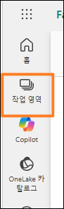

4. 작업 영역 창에서 **Fabrikam_Lab_<inject key="DeploymentID" enableCopy="false"/>** 작업 영역을 클릭합니다.

    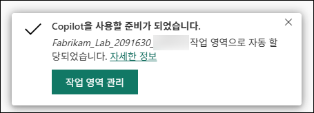

    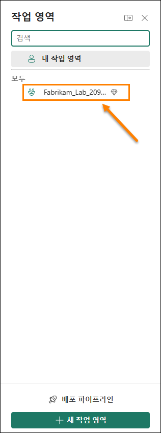

5. 이제 개인 라이선스가 Fabric이 활성화된 작업 영역에 게시할 수 있도록 설정해야 합니다. 오른쪽 상단 모서리의 사람 아이콘을 선택하고 **무료 평가판** 을 클릭하세요.

    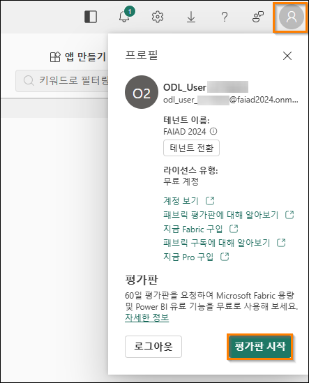

6. 작업 영역에 게시를 활성화하려면 **활성화**를 클릭하기만 하면 됩니다.

    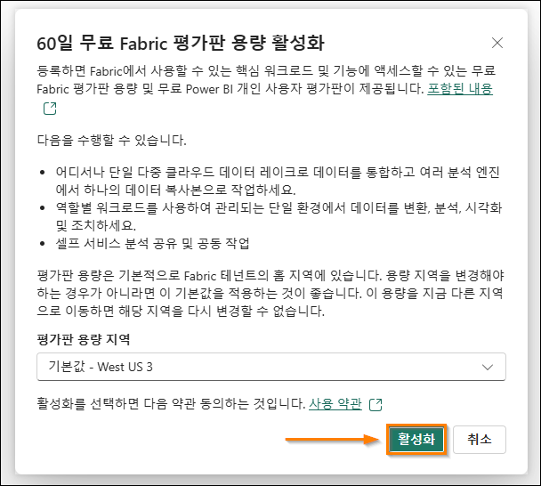

    **확인**을 클릭합니다.

    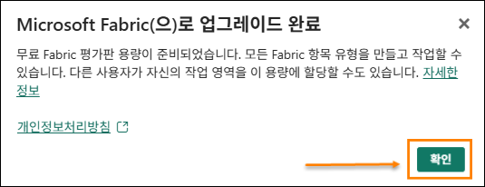

7. 다음으로, 수업 파일에서 완성된 PBIX를 **게시**해야 합니다.

8. 수업 파일에서 **Fabrikam Company Sales Report.pbix** 파일을 엽니다.

    

9. 파일이 열리면 CDIAD 워크숍에 할당된 사용자 계정으로 로그인했는지 확인합니다.

10. 게시를 클릭하고 방금 생성한 작업 영역 **Fabrikam_lab_<inject key="DeploymentID" enableCopy="false"/>**을 찾습니다.

    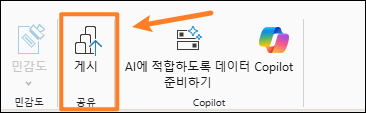

    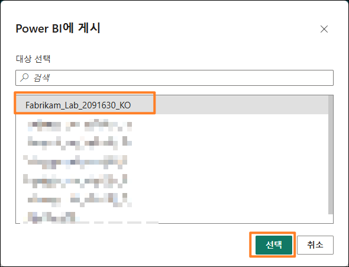

## 작업 1: 독립형 Copilot 환경 탐색

1. 왼쪽 탐색 창에서 Copilot을 선택합니다.

    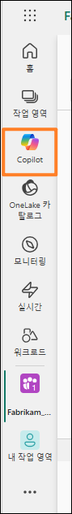

2. 다음 화면에서 프롬프트가 표시되면 **시작**을 클릭합니다. 사용자가 액세스할 수 있는 **Copilot 용량**을 기반으로 작업 영역을 선택합니다. 이 선택은 작업 영역에 사용 가능한 **용량 단위(CU)**가 있는지 여부에 따라 달라집니다. 사용자에게 **Fabric 용량 구성 (FCC)**이 할당된 경우 해당 용량이 대신 사용됩니다.

3. 독립형 Copilot 경험에 오신 것을 환영합니다! 이 시작 화면 하단에는 요청 사항을 입력할 수 있는 섹션이 있으며**(1)**, 하단에는 몇 가지 제안 사항이 표시됩니다**(2)**.

    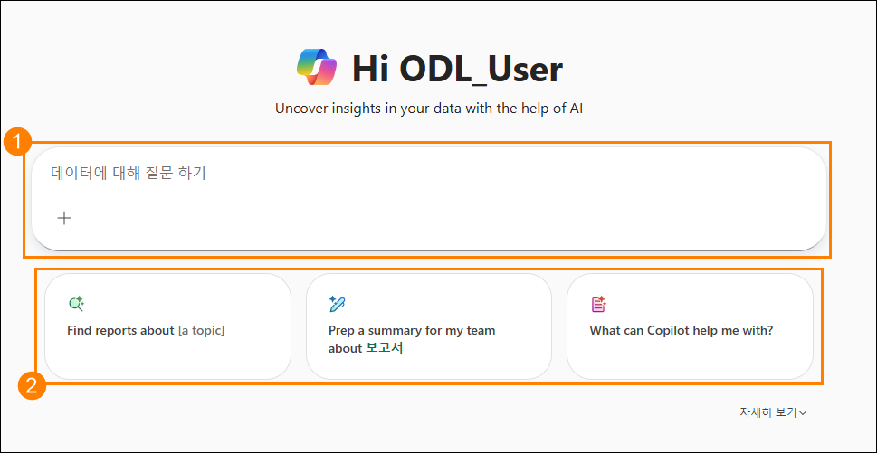

## 작업 2: 독립형 Copilot에서 프롬프트 작성하기

이 섹션에서는 다양한 프롬프트를 작성하고 Copilot 환경이 반환하는 결과를 살펴봅니다.

1. 프롬프트 영역을 클릭한 후 다음 내용을 입력합니다. **Find reports about Fabrikam’s sales trends for the year.** 그런 다음 **Enter**를 클릭합니다.

    **ℹ️ 중요**

    
    AI는 여러 요인으로 인해 비결정적 결과를 반환합니다. 이 수업에서 이전에 논의한 바와 같이, 여러분의 결과는 달라질 수 있으며 랩과 동일하지 않을 수 있습니다. 최선을 다해 표시되는 기능과 특징을 탐색해 보세요!

    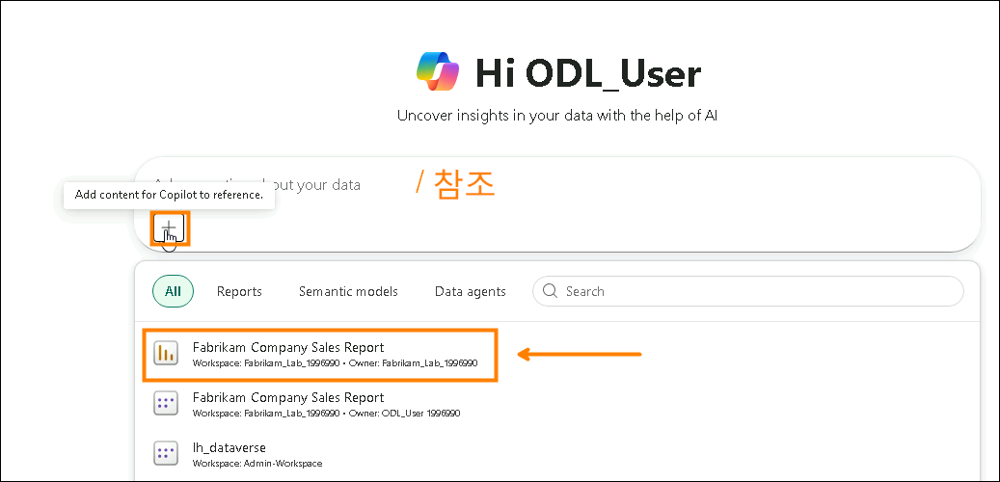

    파일을 참조할 때는 / 또는 + 기호를 간편하게 사용할 수 있습니다. 이는 Copilot이 게시된 콘텐츠를 완전히 내재화하는 데 시간이 다소 걸릴 수 있으므로 유용할 수 있습니다.

    제시할 보고서가 제대로 **표시되지 않는다**면, 일반적으로 다음 사항들을 확인해야 하기 때문입니다.

    1. Power BI 서비스 설정에서 Fabric 관리 포털을 선택한 후, Copilot 관련 설정이 제대로 적용되었는지 확인해야 합니다. 그중 하나는 Power BI 환경의 독립형 Copilot에서 승인된 항목만 표시하는 기능입니다. 이 기능을 선택하면, 수동으로 첨부하거나 참조하지 않는 한 Copilot에서 승인된 항목만 표시됩니다. 이는 테넌트에서 이미 기본적으로 활성화되어 있습니다.

        

    2) 원한다면 작업 영역에서 해당 모델을 선택하여 Copilot용 의미 체계 모델을 승인할 수 있습니다.

        

    3) AI에 적합하도록 데이터 준비하기를 선택하면 AI에 적합하도록 데이터 준비하기 창이 열립니다.

        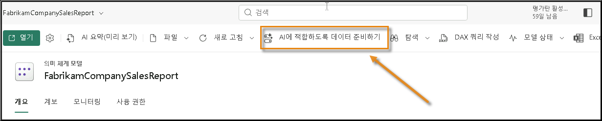

        수동 참조 없이 검색할 수 있도록 하려면 대규모 모델 저장 기능을 활성화해야 합니다.

        

        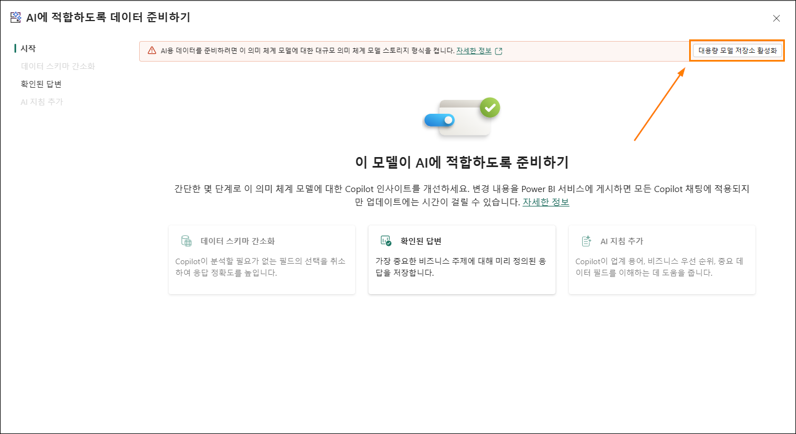

        여기에서 AI에 적합하도록 데이터 준비하기를 보고 조정할 수 있습니다.

2. 검색 결과에 반환된 보고서인 **Fabrikam Company Sales Report**를 클릭합니다. 이렇게 하면 웹 브라우저에 새 탭이 열리며 해당 보고서로 바로 이동합니다.

    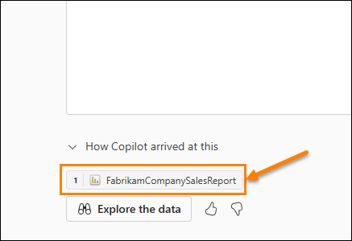

3. 잠시 시간을 내어 이 보고서를 **자세히 살펴보고** 익숙해지세요!

    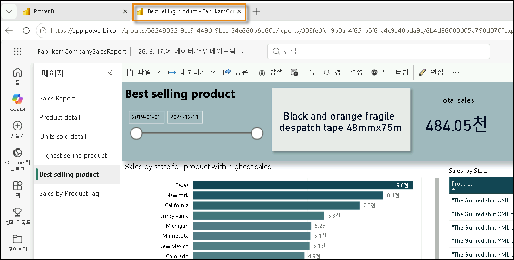

4. 보고서를 다 살펴보고 나면 브라우저 탭의 (x)를 클릭하여 이 탭을 닫고 Copilot 환경으로 돌아갑니다.

5. 페이지 하단의 미리 생성된 프롬프트를 클릭하거나 다음 프롬프트를 입력합니다. **Give me an overview of 1. Fabrikam Company Sales**

    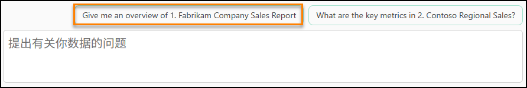

6. Copilot에게 보고서 개요를 요청하면 아래 스크린샷과 같은 정보가 제공됩니다. **참고: 화면과 결과는 약간 다를 수 있습니다!!**

    1. Copilot은 기존 보고서에서 추출한 시각적 개체를 개요 형태로 반환합니다.

    2. Copilot은 반환된 각 시각적 개체에 대한 서술적 설명을 제공합니다.

        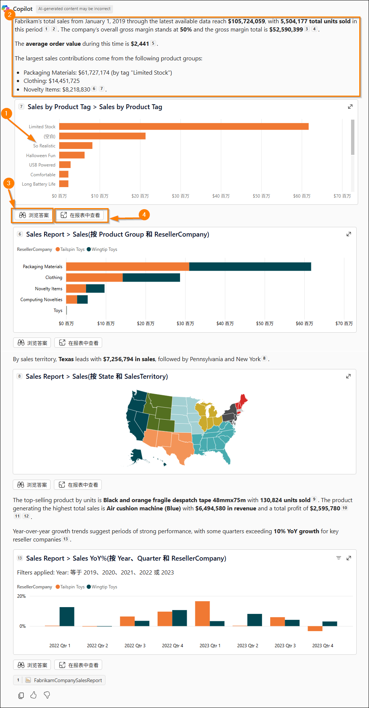

## 작업 3: 보고서에서 확인하세요 기능 탐색

Copilot은 질문 내용과 기반 데이터의 준비 상태에 따라 다양한 유형의 응답을 반환할 수 있습니다. 이 섹션에서는 **보고서에서 확인하세요** 기능을 살펴보겠습니다. 이 기능은 Copilot이 질문에 답변하기 위해 보고서의 기존 시각적 개체를 활용할 때마다 제공됩니다.

1. 다음으로 **보고서에서 확인하세요** 옵션을 살펴보겠습니다. 이 옵션을 선택하면 현재 보고서가 지정된 시각적 개체가 강조 표시된 상태로 열립니다.

2. 표시된 시각적 개체 중 하나를 선택하고 **보고서에서 확인하세요**를 클릭하면 웹 브라우저에 새 탭이 열립니다. *아래 스크린샷을 참조하세요.*

    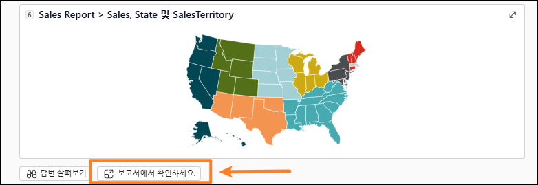

3. 새 보고서 페이지에서 Copilot이 선택한 시각적 개체가 원본 보고서 내에 표시됩니다. 다른 시각적 개체들이 일시적으로 회색으로 표시되는 것을 확인할 수 있는데, 이는 선택한 시각적 개체가 **스포트라이트 처리**되었기 때문입니다. 보고서 내 아무 곳이나 클릭하여 보고서를 활성화하고 탐색해 보세요. 탐색을 마친 후 웹 브라우저에서 이 탭을 닫고 독립형 Copilot 환경으로 돌아갑니다.

    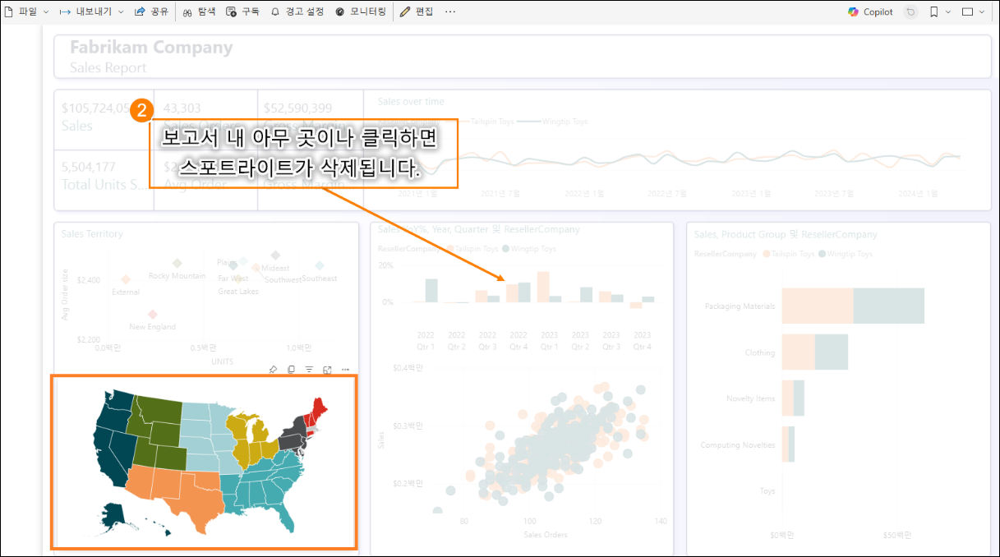

## 작업 4: 탐색

**ℹ️ 참고**

탐색은 주로 보고서 내 기존 데이터 및 시각적 개체에 대한 즉석 분석 도구로 사용됩니다. 탐색 기능은 저장할 수 있지만, 임시 분석이 완료된 후에는 대부분 단순히 닫히게 됩니다.

Copilot 환경이 제공하는 또 다른 기능은 **답변 살펴보기** 기능입니다. 답변을 탐색하는 이 기능은 Copilot 환경을 지속적으로 개선하는 훌륭한 방법입니다. 이 섹션에서는 탐색을 사용하고, 편집하고, 저장하고, 공유하는 방법을 배웁니다!

1. 이제 독립형 Copilot 환경으로 돌아왔을 것입니다. Copilot 내 시각적 개체 아래에 있는 **답변 살펴보기**를 클릭합니다. 이 예시에서는 어떤 시각적 개체를 선택하든 상관없습니다.

    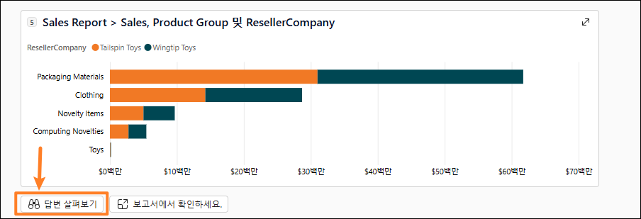

2. 이 버튼을 클릭하면 새 화면이 열립니다. 이제 **탐색** 기능을 살펴보겠습니다!

    - (1) 탐색을 보고서 또는 탐색으로 저장

    - (2) 새 브라우저 탭에서 열기

    - (3) 공유

    - (4) 행렬 형식으로 보기

    - (5) 시각적 개체의 유형 변경

    - (6) 시각적 개체의 열/측정값 변경

    - (7) 보기 확장/축소

        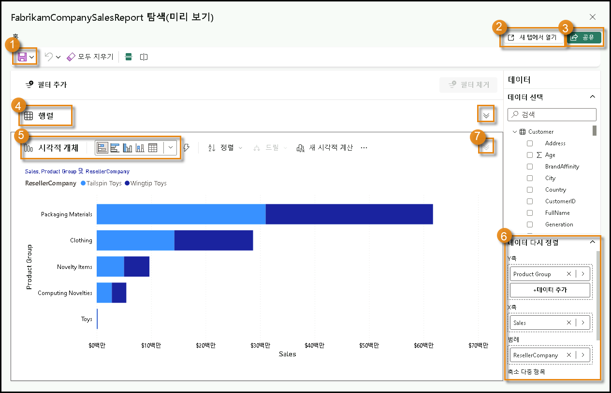

3. 저장 버튼 옆의 드롭다운 아이콘을 클릭하면 몇 가지 옵션이 제공됩니다.

    - 첫째, 탐색으로 저장할 수 있습니다. 이는 작업 영역의 개체 유형입니다.

    - 둘째, 복사본을 저장할 수 있습니다. 이 옵션은 탐색이 이전에 저장된 경우에 나타납니다.

    - 마지막으로, 보고서로 저장할 수 있습니다.

        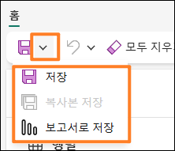

4. 본 랩 초반에 설정을 완료했다면, 이제 이 탐색을 저장할 수 있습니다. 드롭다운에서 저장을 선택합니다. 이 **이 탐색 저장** 팝업이 표시되면, 설정 과정에서 생성한 작업 영역을 선택하고 **저장**을 클릭합니다.

    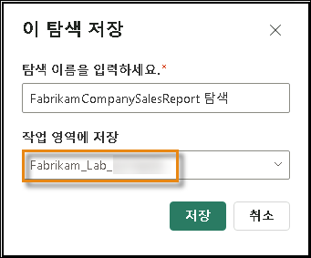

5. 아래 스크린샷에서 저장된 탐색이 작업 영역에 어떻게 표시되는지 **예시**를 확인할 수 있습니다.

    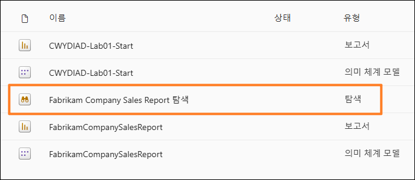

6. 탐색 결과를 다른 사람과 공유할 수도 있습니다. 단, 먼저 작업 영역에 저장해야만 공유가 가능합니다!

7. 작업 영역으로 돌아가 탐색 결과를 찾은 후 공유 아이콘을 클릭합니다. 링크, 이메일 또는 Teams로 이 탐색 결과를 공유할 수 있는 팝업 창이 나타납니다! 참고. **이 워크샵에서는 탐색 결과를 공유하지 않습니다. 이 창을 닫고 다음 단계로 진행하세요!**

    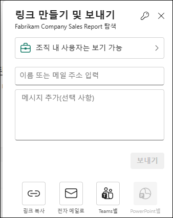

8. 잠시 시간을 내어 탐색을 열고 다른 기능을 탐색해 봅니다.

    - 시각적 개체 유형 변경

    - 표시되는 열과 측정값 변경

9. 탐색을 마친 후, 오른쪽 상단의 **X**를 클릭하여 탐색 창을 닫습니다.

    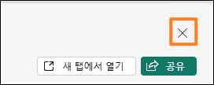

## 작업 5: 검증된 답변

수업 초반에 AI를 위한 데이터 모델 준비 작업을 진행했습니다. AI 데이터 준비 과정의 일부로 검증된 답변을 생성하는 작업이 포함됩니다. 검증된 답변은 Copilot에서 질문을 할 때 특정 시각화 결과가 반환되도록 보장합니다. 이는 최종 사용자에게 더 선별되고 일관된 경험을 제공하면서 보고서 전반에 걸쳐 정확도, 일관성 및 신뢰성을 보장합니다!

1. 이번 세션에서는 더 나은 인사이트를 위한 항목을 추가하여 프롬프트 경험을 더욱 개선하는 방법도 배울 것입니다. 항목을 명시적으로 연결하면 Copilot이 작업 범위를 좁혀 훨씬 명확하고 간결한 결과를 제공할 수 있습니다. 현재 프롬프트에 세 가지 항목을 첨부할 수 있으며, 곧 네 번째 항목이 추가될 예정입니다.

    - 보고서

    - 의미 체계 모델

    - 데이터 에이전트

    - 앱(제공 예정)

2. 프롬프트 좌측 하단에 위치한 **+ Copilot이 참조할 수 있도록 콘텐츠 추가** 를 클릭합니다.

    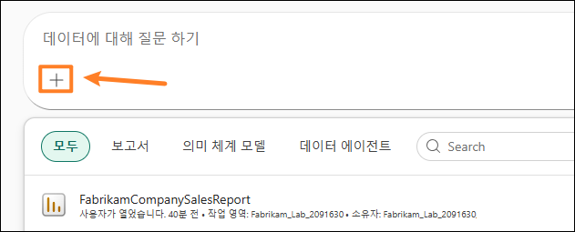

3. 나열된 옵션에서 **보고서**를 선택합니다. 그런 다음 **Fabrikam Company Sales Report**를 선택합니다. **확인**을 클릭합니다.

    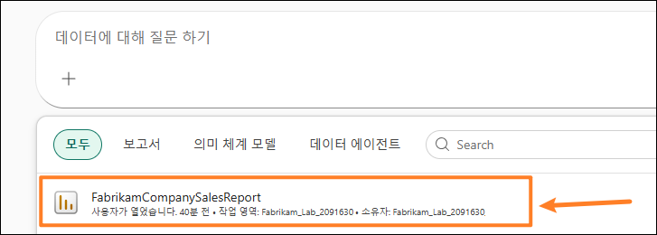

4. 이제 해당 보고서가 Copilot 프롬프트에 연결된 상태로 표시됩니다! 그런 다음 프롬프트에 다음을 입력합니다. Copilot에서 여러 가지 다른 디스플레이 출력을 얻을 수 있다는 점을 기억해 주세요.

    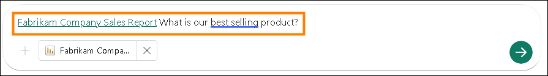

5. 이 프롬프트에 대해 다음과 같은 결과를 받아야 합니다. 검증된 답변이 응답에 사용된 경우, 답변 위에 알림이 표시됩니다. *아래 스크린샷을 참조하세요.*

6. 보고서를 확인하고 데이터를 탐색할 수 있는 옵션도 제공됩니다.

    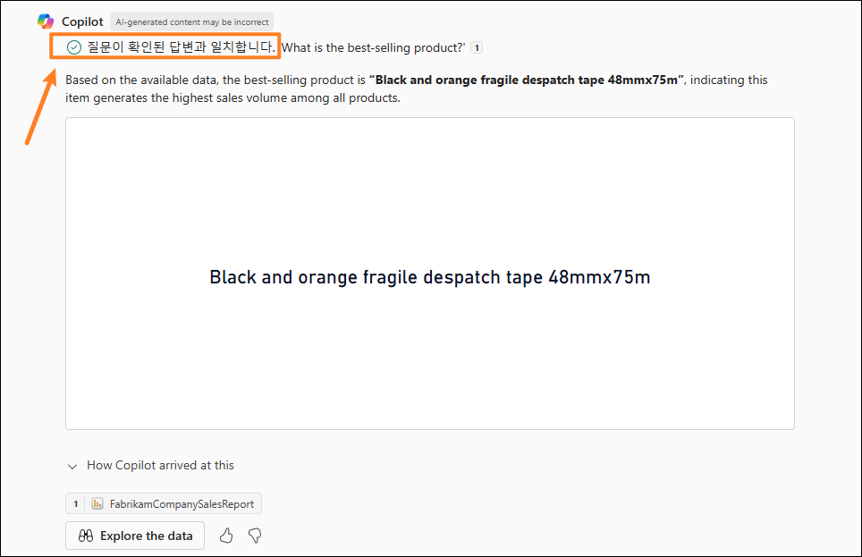

## 작업 6: Copilot이 이 결론에 도달한 과정(HCAAT)

때로는 Copilot이 단순히 답변을 제공하는 것 이상으로, 그 답변에 도달한 과정을 설명하기도 합니다. 이는 답변을 형성한 논리, 필터, 측정 기준 등을 엿볼 수 있는 기회를 제공합니다. 더 구체적으로, 이는 HCAAT 또는 Copilot이 이 답변에 도달한 방법으로 알려져 있습니다. 이러한 인사이트는 단순히 유용할 뿐만 아니라 결과를 검증하고 출력물에 대한 신뢰를 구축하며 기반 모델에 대한 이해를 심화시키는 데 도움이 됩니다. 이러한 과정은 매우 유용하며 결과를 검증하는 방법을 제시할 수 있습니다.

1. 검증된 답변 아래에서 **How Copilot arrived at this**를 클릭합니다.

2. 질문 내용, 답변에 사용된 데이터, 적용된 필터가 표시됩니다.

    

3. HCAAT는 결과 도출 방식에 따라 다른 결과를 반환할 수 있습니다. 다른 예시를 살펴보겠습니다.

4. Copilot 프롬프트에 **Fabrikam Company Sales Report**를 첨부한 후 다음을 입력합니다. **return all customers that make up the top 1% of total sales.**

    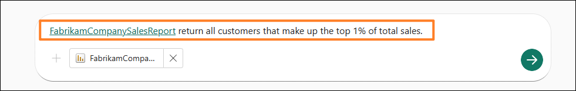

5. 결과를 검토해 보겠습니다.

    - (1) 먼저, 답변이 평소보다 더 많은 분석이 필요하다는 응답을 받습니다. 코드를 꼭 확인하세요! DAX로 생성된 결과이므로 데이터가 완전히 승인되지 않았을 수도 있습니다.

        

    - (2) 결과를 표시하는 테이블입니다. 결과가 훌륭해 보입니다. Customers를 요청했음에도 Resellers가 표시되는 점에 유의하세요. 이는 AI에 적합하도록 데이터 준비하기 과정에서 Customer 테이블을 제거하고 Reseller에 대한 동의어를 사용했기 때문입니다.

    - (3) Copilot이 이 결론에 도달한 과정

    - (4) Fabrikam 영업 보고서

    - (5) 결과를 도출하기 위해 Copilot이 생성한 DAX 쿼리

        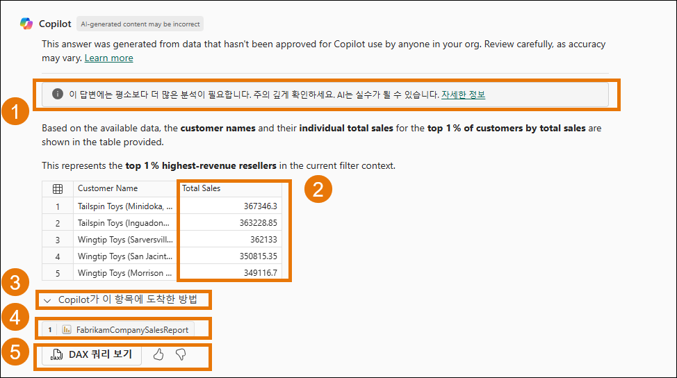

10. 먼저 HCAAT를 살펴보겠습니다. **Copilot가 이 항목에 도착한 방법** 을 클릭하여 설명을 확장합니다.

11. 이번에는 이전과 매우 다른 결과를 얻게 됩니다. Copilot이 이 응답을 도출한 과정을 설명하는 서술형 설명을 받게 됩니다.

    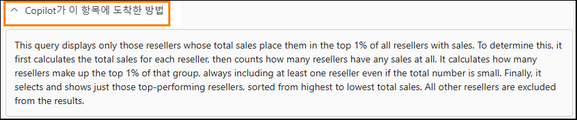

    이 섹션에서는 Copilot이 특정 답변을 도출한 과정을 가끔 공유한다는 점을 배웠습니다. Copilot이 이 정보를 공유하거나 표시하는 방식은 응답을 반환하는 데 사용한 프로세스에 따라 달라질 수 있습니다!

## 작업 7: Copilot에서 생성된 DAX 쿼리의 데이터 답변

이전 예시에서 Copilot은 의미 체계의 기본 데이터를 분석하여 DAX 쿼리를 생성했습니다. 또한 Copilot은 결과의 정확도를 확인하라고 경고했습니다! 응답을 더 자세히 살펴보겠습니다.

1. 위 스크린샷의 결과를 보면 총 매출액이 고객별로 반복되어 표시됩니다(Resellername = Customers로 설정하는 동의어를 생성했음을 기억하세요). 이는 일반적으로 응답을 구성하는 테이블 간에 유효한 관계가 없다는 신호입니다.

2. **DAX 쿼리 보기**를 클릭합니다.

    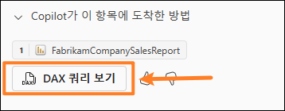

3. 생성된 DAX 쿼리와 함께 이 답변에 도달한 과정에 대한 인라인 설명이 포함된 팝업 대화 상자가 표시됩니다. 하단 근처에서 Copilot이 이 결과에 도달한 방법에 대한 설명을 확인할 수 있습니다. 마지막으로 팝업 하단에는 두 가지 수행 가능한 옵션이 있습니다.

    - 쿼리 실행 – 현재 DAX를 가져와 DAX 쿼리 보기에서 엽니다.

    - 쿼리 복사 – 이 옵션은 DAX를 클립보드에 복사합니다.

        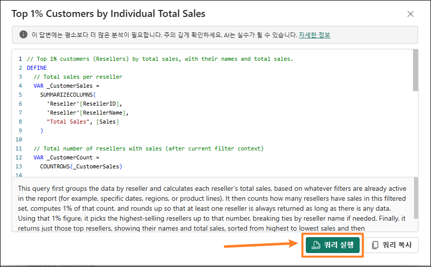

4. **쿼리 실행**을 클릭합니다. 웹 브라우저에 새 탭이 열리며 Fabrikam Company 의미 체계의 DAX 쿼리 보기로 이동합니다.

    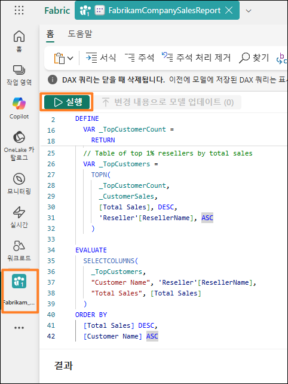

5. **실행**을 클릭하여 DAX 쿼리 보기에서 결과를 확인합니다. 여기서 표시되는 결과는 Copilot에서 받은 결과와 동일합니다. DAX 언어에 익숙하다면 DAX 표현식을 수정하여 결과를 더욱 정교하게 다듬을 수 있습니다.

    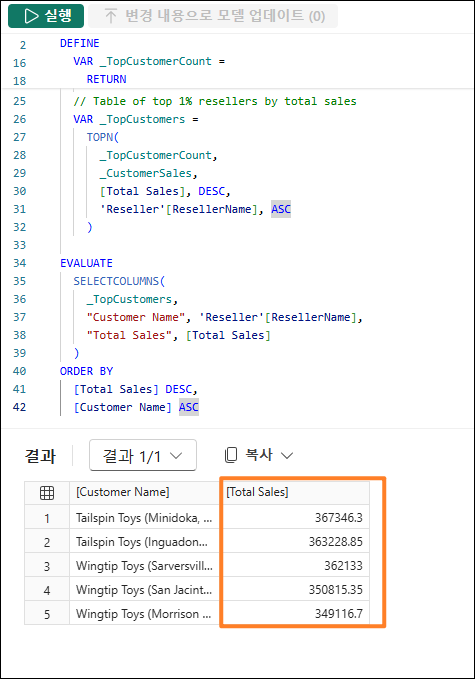

6. Copilot의 응답이 매우 훌륭하며 사전 준비 작업이 모두 효과를 발휘한 것으로 보입니다. Power BI Desktop을 다시 열고 간단한 시각적 개체를 생성하면 Copilot의 응답이 정확한지 빠르게 확인할 수 있습니다!

    

7. 여기서 추가로 언급할 점은 모델 뷰도 확인할 수 있다는 것입니다. 여기서 의미 체계 모델의 테이블과 관계를 검증할 수 있습니다.

    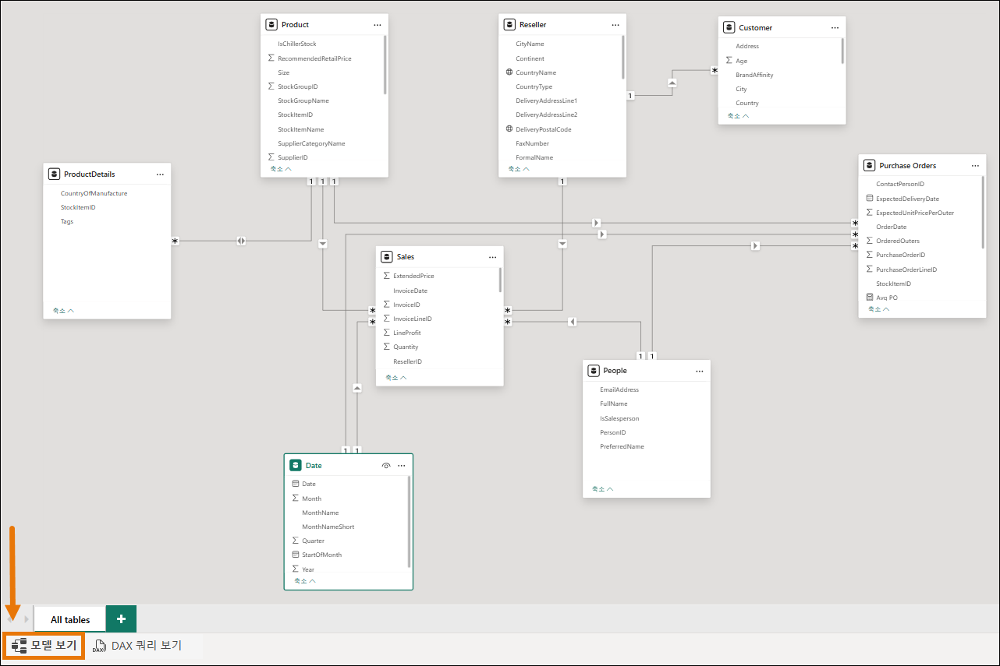

    이 랩을 통해 Copilot이 생성한 DAX를 확인하고, DAX 쿼리 보기를 실행하여 기존 코드를 수정하며, 모델 보기로 이동해 관계성을 검증할 수 있음을 배웠습니다.

    **ℹ️ 중요**

    Chat with your Data 환경은 전 세계 기업의 인사이트 도출 시간을 획기적으로 단축시켜 줄 매우 유용한 도구입니다. 그러나 이러한 결과는 부정확하거나 오해의 소지가 있을 수도 있습니다. 이 랩에서 확인했듯이 결과를 멈추고 검증하는 것이 매우 중요합니다!

## 작업 8: Copilot의 컨텍스트 전환

지금까지 이 워크샵에서는 Fabrikam Company Sales 데이터에만 집중해 왔습니다. 그러나 조직에는 여러 작업 영역에 걸쳐 다양한 보고서가 있으며, 독립형 Copilot 환경은 접근 가능한 모든 보고서를 참조합니다.

1. 수업 파일로 이동하여 **State of Nevada COVID-19 Dashboard**를 엽니다.

    

2. 이 완성된 보고서를 **Fabrikam_lab_0000000**에 게시합니다.

    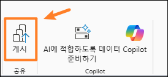

    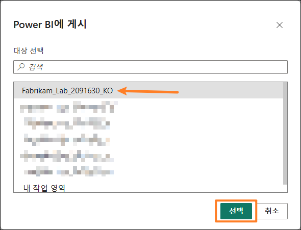

3. 이제 독립형 Copilot 환경에서 이 의미 체계와 보고서를 쿼리할 수 있습니다. Copilot 프롬프트에 다음을 입력합니다. **How many confirmed cases have there been?** 해당 항목이 바로 표시되지 않는 경우, 반드시 **+ 버튼(1), 의미 체계 모델(2), StateofNevadaCOVID-19Dashboard(3)**를 사용해 주세요. 의도적으로 매우 일반적인 프롬프트를 제공했으며, Copilot은 보고서 내용을 기반으로 원하는 내용을 파악할 수 있었습니다. 참고로, 제공된 보고서 하단에는 Copilot이 일치시킨 기준을 알려줍니다.

    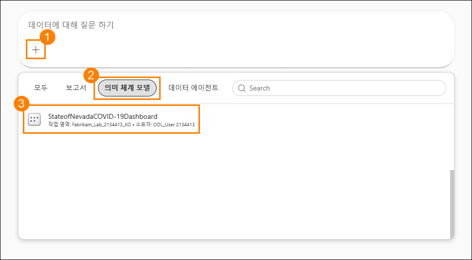

4. 완벽합니다! Copilot이 이제 기본 보고서의 시각적 개체를 반환하여 질문에 답변합니다. Copilot에서 여러 가지 다른 디스플레이 출력을 얻을 수 있다는 점을 기억해 주세요.

    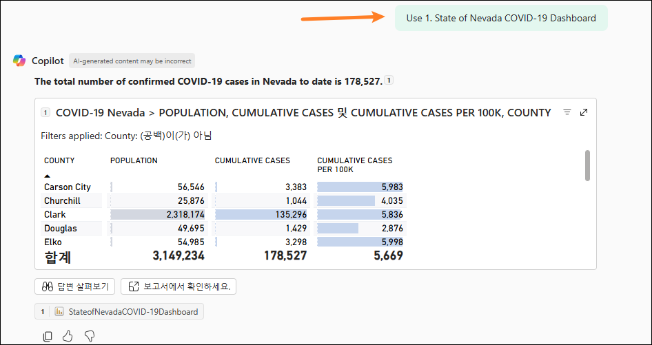

    또는

    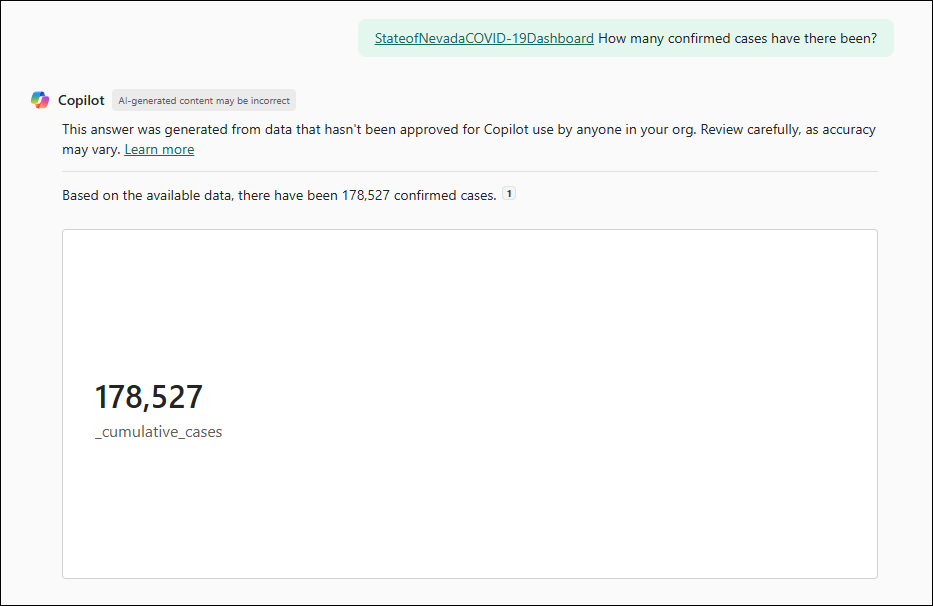

5. 데이터에 대해 다른 질문을 해보세요. **How many deaths were there in Carson City in 2019?**

    

    **ℹ️ 중요**

    마찰 응답은 Copilot이 준비되지 않았거나 불완전하게 설명된 데이터 모델을 만나면 나타나는 시스템 생성 경고 또는 제한 사항입니다. Copilot은 본질적으로 사용 가능한 정보로 도움을 드릴 수는 있지만, 결과는 반드시 검증해야 합니다!라고 말하는 것입니다.

    Copilot의 마찰 응답을 줄이려면, AI를 위해 의미 체계 모델을 준비한 후 게시 시 의미 체계 모델을 AI 준비 완료로 표시하세요. 랩 파일에 포함된 테넌트 설정 안내 문서를 참조하세요.

    이번에는 Copilot이 반환할 수 있는 기존 시각적 개체를 찾지 못했습니다. 그 결과 Copilot이 보고서의 기본 데이터로부터 답변을 생성했습니다. 이 경우, 'AI 준비 완료'로 표시되지 않은 모델에서는 **마찰 응답**을 받게 됩니다.

## 작업 9: 의미 체계로부터 Copilot의 시각적 개체 생성

이전 랩에서는 Copilot이 특정 질문에 답하기 위해 시각화를 반환하는 것을 관찰했습니다. 이러한 시각화는 기존 보고서에 이미 존재하던 것이었습니다. 이 섹션에서는 Copilot이 요청에 답하기 위해 의미 체계로부터 시각화를 생성하는 방법도 살펴보겠습니다.

1. 아직 Copilot에 있지 않다면, Fabric에서 Copilot으로 돌아갑니다.

2. 프롬프트에 **Fabrikam Company Sales Report**에 첨부한 후 **Show me units sold over time**을 입력합니다.

    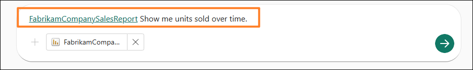

3. 반환된 시각화는 보고서 내에 기존에 존재하던 시각적 개체가 아닙니다. 이는 의미 체계를 기반으로 Copilot이 생성한 시각적 개체입니다! 실제로 보고서에서 직접 가져온 시각적 개체와 달리, Copilot이 생성한 이 답변에는 HCAAT 설명인 *How Copilot arrived at this*가 함께 제공됩니다.

    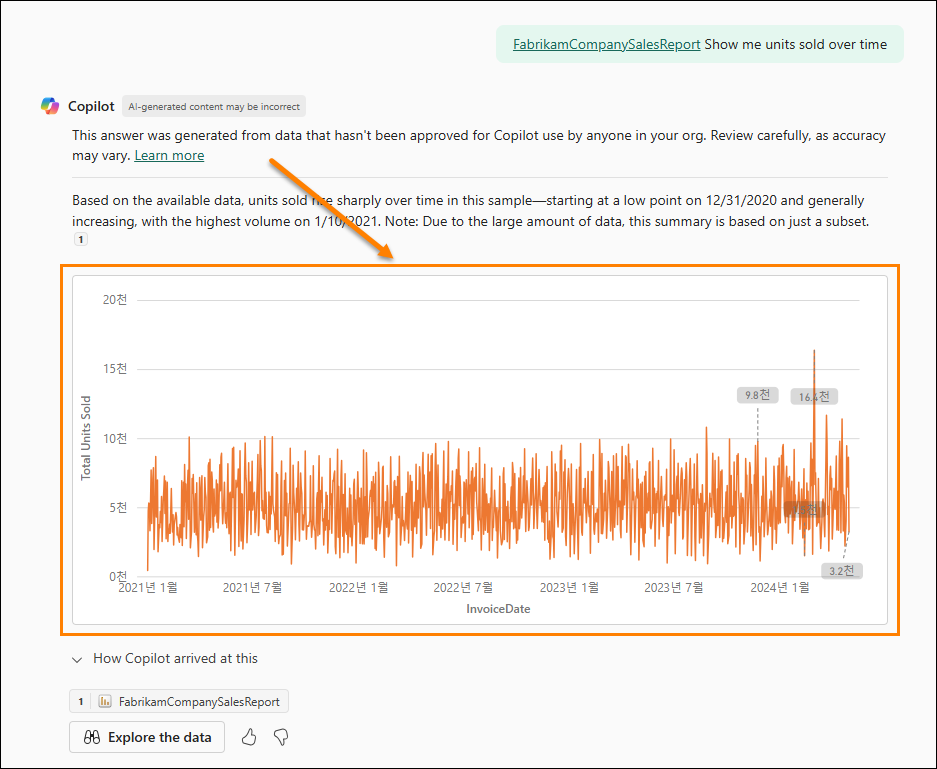

4. 결과를 살펴보려면 **How Copilot arrived at this**를 클릭합니다.

    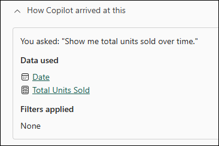

## 작업 10: 일반 Copilot 환경

이 랩에서는 Microsoft Fabric의 독립형 Copilot 경험을 활용하여 기존 보고서와 의미 체계를 탐색하는 방법을 배웠습니다. 그러나 일반 Copilot 경험도 활용할 수 있습니다. 이 랩에서는 Copilot을 활용하여 발견한 내용을 이메일로 작성해 보겠습니다!

1. Copilot 프롬프트에 **Take the conversation so far and turn it into an email to share with the team**을 입력합니다.

    

2. 결과는 꽤 멋지네요! 참고로, 여러분의 응답은 스크린샷과 크게 다를 수 있습니다. 또한 응답은 현재 Copilot과 진행 중인 채팅 내용을 기반으로 한다는 점을 기억하세요. 채팅 기록을 지웠거나 대화 내용이 거의 없다면 최종 결과에 영향을 미칠 수 있습니다.

    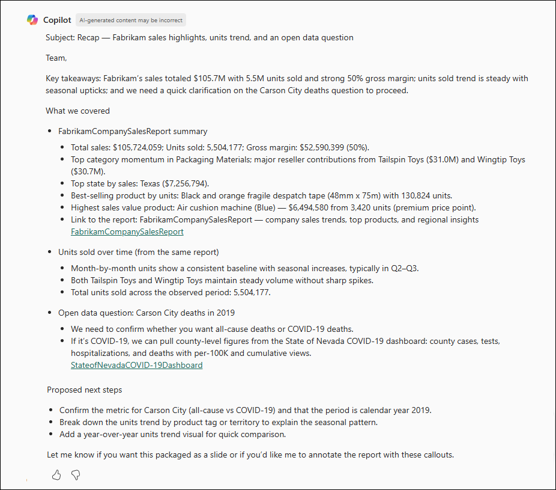

3. 이 정도면 괜찮지만, 이메일에 시각적 개체와 링크가 포함되면 훨씬 더 좋을 것입니다. Copilot 프롬프트에 **Add visuals and links to the email**을 입력합니다.

    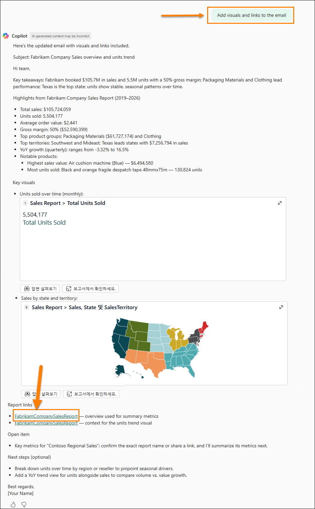

# 참조

Chat With Your Data in a Day(CDIAD)에서는 Fabric 작업 영역에서 독립형 Copilot을 사용할 때의 몇 가지 주요 기능을 소개합니다.

서비스의 메뉴에 있는 도움말(?) 섹션에는 유용한 리소스로 연결되는 링크가 있습니다. 현재 어떤 환경에 있는지 여부에 따라 보이는 화면이 달라질 수 있으므로, 아래 스크린샷과 실제 화면이 다를 수 있다는 점을 유의해 주세요.

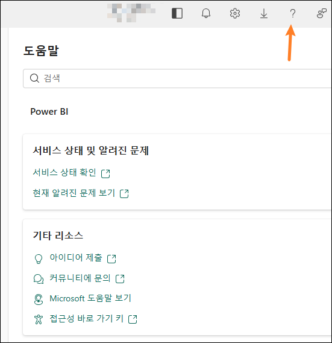

아래는 Microsoft Fabric의 다음 단계에 도움이 되는 몇 가지 추가 자료입니다.

- 기본 [Microsoft Fabric 문서](https://learn.microsoft.com/en-us/fabric/)의 모든 정보에 액세스

- [가이드 투어](https://aka.ms/Fabric-GuidedTour)로 Fabric 탐색

- [Microsoft Fabric 무료 평가판](https://aka.ms/try-fabric) 신청

- [Microsoft Fabric 웹 사이트](https://aka.ms/microsoft-fabric) 방문

- [Fabric 학습 모듈](https://aka.ms/learn-fabric)을 탐색해서 새로운 기술 익히기

- [Fabric 시작하기 무료 eBook](https://aka.ms/fabric-get-started-ebook) 읽기

- [Fabric 커뮤니티](https://aka.ms/fabric-community)에 가입하여 질문을 게시하고 피드백을 공유하며 다른 사람들로부터 배우기

다음과 같은 Copilot 관련 심층 기술 문서를 읽어보세요.

- [Power BI용 Copilot 개요 - Power BI | Microsoft Learn](https://learn.microsoft.com/en-us/power-bi/create-reports/copilot-introduction)

- [Power BI에서 독립형 Copilot 환경(프리뷰) – Power BI | Microsoft Learn](https://learn.microsoft.com/en-us/power-bi/create-reports/copilot-chat-with-data-standalone)

- [Microsoft Fabric Copilot 관리자 설정 | Microsoft Learn](https://learn.microsoft.com/en-us/fabric/admin/service-admin-portal-copilot)

- [Fabric 데이터 에이전트 생성(프리뷰) - Fabric 데이터 에이전트 생성 방법 알아보기 | Microsoft Learn](https://learn.microsoft.com/en-us/fabric/data-science/concept-data-agent)

- [데이터 에이전트 구성을 위한 모범 사례 - Microsoft Fabric | Microsoft Learn](https://learn.microsoft.com/en-us/fabric/data-science/data-agent-configuration-best-practices)

- [Microsoft Fabric 및 Power BI용 Copilot: FAQ - Microsoft Fabric | Microsoft Learn](https://learn.microsoft.com/en-us/fabric/fundamentals/copilot-faq-fabric)

© 2026 Microsoft Corporation. All rights reserved.

이 데모/랩을 사용하면 다음 조건에 동의하게 됩니다.

이 데모/랩에 설명된 기술/기능은 학습 환경을 제공하고 사용자 의견을 얻기 위해 Microsoft Corporation에서 제공합니다. 데모/랩을 통해서만 이러한 기술적 특성과 기능을 평가하고 사용자 의견을 Microsoft에 제시할 수 있습니다. 다른 용도로는 사용할 수 없습니다. 이 데모/랩 또는 그 일부에 대해 수정, 복사, 배포, 전송, 표시, 수행, 재현, 게시, 라이선스 허여, 파생 작업 생성, 양도 또는 판매할 수 없습니다.

추가 복제 또는 재배포를 위한 다른 서버 또는 위치에 대한 데모/랩(또는 그 일부)의 복사 또는 재현은 명시적으로 금지됩니다.

이 데모/랩은 위에서 명시한 목적을 위해 복잡한 설정 또는 설치가 없는 시뮬레이션된 환경에서 잠재적인 새로운 기능과 개념을 포함하여 특정 소프트웨어 기술/제품의 특성 및 기능을 제공합니다. 이 데모/랩에서 서술된 기술/개념은 전체 기능을 나타내지 않을 수 있으며, 최종 버전이 작동하지 않을 수도 있습니다. 또한 해당 기능 또는 개념의 최종 버전을 릴리스하지 않을 수도 있습니다. 또한 실제 환경에서 이러한 특성과 기능을 사용한 경험이 다를 수도 있습니다.

**피드백.** 이 데모/랩에서 서술된 기술적 특성, 기능 및/또는 개념에 대한 피드백을 Microsoft에 제시하면 Microsoft는 이 피드백을 어떤 방식과 목적으로든 무료로 사용, 공유 및 상용화할 수 있습니다. 또한 제품, 기술 및 서비스에서 사용자 의견이 포함된 Microsoft 소프트웨어 또는 서비스의 특정 부분을 사용하거나 인터페이스하는 데 필요한 모든 특허권을 제3자에게 무료로 제공합니다. Microsoft에서 사용자 의견을 포함하기 때문에 Microsoft에서 해당 소프트웨어 또는 설명서의 사용을 인가해야 하는 라이선스에 종속된 사용자 의견은 제공할 수 없습니다. 이러한 권리는 본 계약에 의거하여 유효합니다.

Microsoft Corporation은 이에 따라 명시적, 묵시적 또는 법적 특정 목적에의 적합성, 권리 및 비침해 여부에 관계없이 상품성에 대한 모든 보증과 조건을 포함하여 데모/랩과 관련된 모든 보증 및 조건을 부인합니다. Microsoft는 어떤 목적으로든 결과의 정확성, 데모/랩의 사용으로 파생된 출력 또는 데모/랩에 포함된 정보의 적합성과 관련하여 어떠한 보증이나 진술도 하지 않습니다.

**고지 사항**

이 데모/랩에는 Microsoft Power BI의 새로운 기능 및 향상된 기능 중 일부만 포함되어 있습니다. 일부 기능은 제품의 향후 릴리스에서 변경될 수 있습니다. 이 데모/랩에서는 새로운 기능 모두가 아닌 일부에 대해 학습하게 됩니다.
