# Microsoft Fabric Chat with your Data in a Day - 랩 05

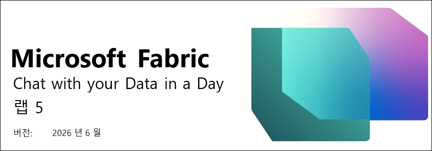

## 목차

- 문서 구조
- 시나리오/문제 설명
- 소개
- Fabric 데이터 에이전트 구현
- 필수 구성 요소
  - 작업 1: 데이터 에이전트 생성
  - 작업 2: 데이터 원본 추가
  - 작업 3: 데이터 에이전트에 질문하기
  - 작업 4: AI 지침 추가
- 스포트라이트: 데이터 원본 교체
  - 작업 5: 추가 데이터 소스 추가
- 스포트라이트: 데이터 원본 지침
  - 작업 6: 질문 예시 생성
  - 작업 7: 데이터 에이전트 게시 및 공유
  - 작업 8: Copilot에서 데이터 에이전트 사용하기
- 참조

# 문서 구조

이 랩에서는 사용자가 수행해야 하는 단계를 보조 시각 자료의 관련 스크린샷과 함께 확인할 수 있습니다. 스크린샷에서 주황색 상자로 강조 표시된 섹션은 사용자가 특히 주목해야 하는 영역입니다.

# 시나리오/문제 설명

독립형 Copilot 경험은 조직 전체에 더 빠른 인사이트 도출 시간을 제공하고 전반적인 채택률을 높이는 데 큰 성공을 거두었습니다!

그러나 Copilot 경험은 사용자 맞춤형으로 설계되지 않았으며, 이제 최종 사용자들은 관련 없는 보고서와 의미 체계를 해석할 필요 없이 비즈니스의 매우 특정 영역에 질문을 집중할 수 있는 더 정교하게 구성된 경험을 원하고 있습니다. 여러분은 Fabrikam Company Sales Report 데이터와만 연결된 데이터 에이전트를 생성하는 임무를 맡았습니다. 또한 독립형 Copilot 환경에서는 제공되지 않는 추가 데이터를 이 데이터 에이전트에 포함시켜, 팀이 제품 리드 타임과 관련해 묻고자 하는 보다 구체적인 질문에 답변할 수 있도록 해야 합니다.

# 소개

모든 작업 영역의 모든 데이터를 탐색하는 데 탁월한 Copilot 독립형 환경에 대해 배웠습니다. 그러나 데이터 에이전트를 사용하면 특정 데이터와 대화할 때 더 정교한 경험을 제공할 수 있습니다. 데이터 에이전트는 특정 데이터 소스 또는 데이터 소스 내 특정 테이블에 연결할 수 있습니다. Copilot이 Fabric 내 생산성과 인텔리전스를 가능하게 하는 AI 어시스턴트인 반면, 데이터 에이전트는 데이터 연결성을 가능하게 합니다.

이 랩을 마치면 다음을 수행하는 방법을 익히게 됩니다.

- 데이터 에이전트 생성

- 에이전트에 데이터 원본 추가

- 에이전트에 질문하기

- 에이전트가 사용할 AI 지침 추가

- 데이터 원본 문제

- 추가 데이터 원본 추가

- 질문 예시 생성

- 에이전트 게시 및 공유

- 독립형 Copilot에서 데이터 에이전트 사용

# Fabric 데이터 에이전트 구현

이 섹션에서는 데이터 에이전트를 만드는 방법을 배웁니다. 이 에이전트는 구조화된 쿼리(SQL, DAX, KQL)를 생성하여 사실, 합계, 순위 또는 필터와 관련된 질문에 답함으로써 데이터를 검색할 수 있습니다. 이 문서 작성 시점 기준으로 Fabric 데이터 에이전트는 Microsoft Fabric에서 미리 보기 기능으로 제공되며, 프로덕션 워크로드에는 권장되지 않습니다. Fabric 데이터 에이전트의 작동 방식에 대한 자세한 내용은 다음을 참조하세요.

[Fabric 데이터 에이전트 생성(프리뷰) - Fabric 데이터 에이전트 생성 방법 알아보기 | Microsoft Learn](https://learn.microsoft.com/en-us/fabric/data-science/concept-data-agent)

Microsoft Fabric 데이터 에이전트를 사용하면 SQL, DAX 또는 KQL 없이도 평이한 영어로 기업 데이터와 상호 작용할 수 있습니다. 디버깅 도구가 포함된 채팅 인터페이스를 제공하며, Power BI 의미 체계 모델, KQL 데이터베이스, 레이크하우스, 웨어하우스 등의 소스에 연결됩니다. 데이터 에이전트는 Microsoft Fabric 내부 및 외부에서 접근 가능하며, Microsoft Teams, Copilot Studio, Azure AI Foundry 및 사용자 지정 앱에 통합될 수 있습니다. 또한 Fabric의 독립형 Copilot 환경에서도 데이터 에이전트를 검색할 수 있습니다!

## 필수 구성 요소

Fabric 데이터 에이전트를 사용하려면 여러 테넌트 설정을 활성화하거나 구성해야 합니다. 수업 랩에 있는 **테넌트 설정 가이드 문서**를 참조하세요.

- 관리자 액세스 권한 필요

- Copilot 및 Azure OpenAI 설정 활성화

- Microsoft Fabric 데이터 에이전트 생성 및 공유 활성화

- Power BI 의미 체계 모델용 XMLA 엔드포인트 활성화

## 작업 1: 데이터 에이전트 생성

1. 가상 머신에서 웹 브라우저를 열고 https://fabric.microsoft.com으로 이동한 후 **Fabrikam_Lab_<inject key="DeploymentID" enableCopy="false"/>**라는 작업 영역으로 이동합니다.

    *(**중요**: 이 수업 초반에 생성한 작업 영역을 사용)*

    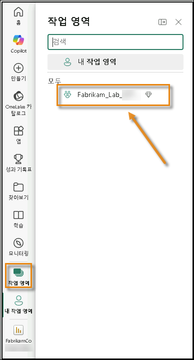

2. **새 항목**을 클릭합니다.

    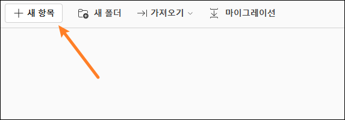

3. 열린 검색 창에 **agent**를 입력하고 **데이터 에이전트(미리 보기)를 선택합니다.**

    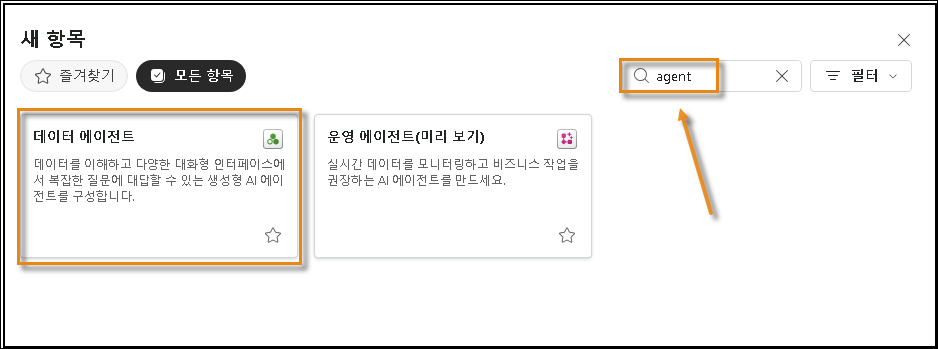

4. 에이전트에 **FabrikamSales_agent_<inject key="DeploymentID" enableCopy="false"/> 라는 이름을 지정합니다.**

5. 사용자 코드는 아래와 같이 사용자 이름에서 찾을 수 있습니다.

    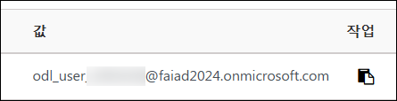

6. **만들기를 클릭합니다.**

    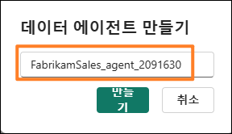

## 작업 2: 데이터 원본 추가

1. 데이터 에이전트를 생성한 후, 다음 단계는 데이터 원본을 추가하는 것입니다!

2. 탐색기 창에서 **+ 데이터 원본** 버튼을 클릭합니다. 또는 화면 중앙에 표시된 **데이터 원본 추가** 버튼을 클릭할 수도 있습니다.

    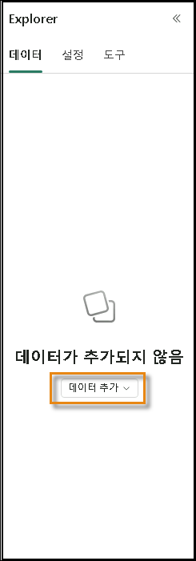

    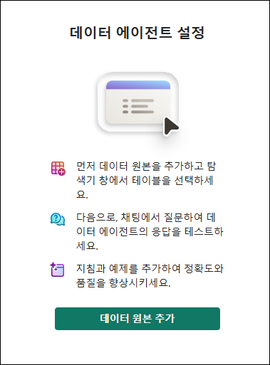

3. 목록에서 **Fabrikam Company Sales Report** 의미 체계를 선택한 후 **추가**를 클릭합니다.

    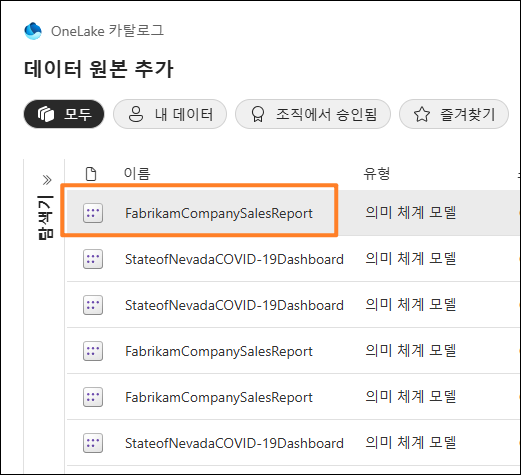

4. 아직 선택된 테이블이 없으며, 최소한 하나의 데이터 소스가 선택되기 전까지는 데이터 에이전트가 질문에 답변할 수 없습니다. **탐색기** 창에서 **Fabrikam Company Sales Report** 옆의 **>**를 클릭합니다. 아래 스크린샷에 표시된 테이블을 선택합니다.

    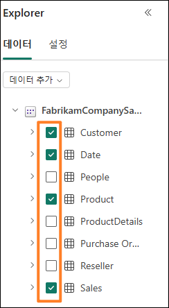

## 작업 3: 데이터 에이전트에 질문하기

1. 이제 에이전트가 데이터 소스에 연결되었으므로, 데이터 에이전트에 프롬프트를 작성해 보겠습니다.

2. 다음 명령을 입력합니다. **Show me sales by country.**

    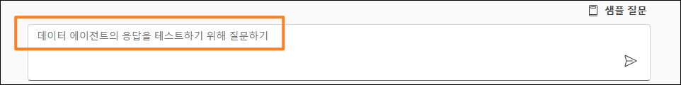

3. 에이전트가 답변을 반환하는 데 몇 초가 소요될 수 있습니다. 에이전트가 반환한 내용을 확인합니다.

    

4. 완료된 단계의 드롭다운을 클릭하여 에이전트의 작업을 확인한 후, 다음 드롭다운을 클릭하여 세부 정보를 표시합니다.

    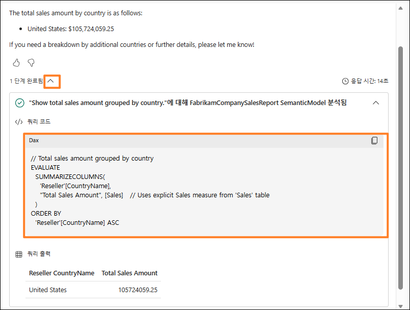

    **ℹ️ 중요**

    Fabric 데이터 에이전트를 개발할 때는 정확도와 일관성을 보장하기 위해 결과를 검증하는 데 시간을 할애하는 것이 중요합니다. 결과를 얻었으니 이제 의미 체계로 돌아가 결과를 검증해 보겠습니다!

5. 다운로드한 클래스 파일로 이동하여 **Fabrikam Company Sales Report.pbix** 파일을 엽니다.

    

6. 보고서 하단을 클릭하여 새 보고서 페이지를 엽니다.

    

7. 다음으로, 데이터 에이전트가 반환한 결과를 검증하기 위한 기본 시각적 개체를 구축합니다.

8. 이 새 보고서 페이지에 테이블 시각적 개체를 추가합니다.

    

    

9. 결과 테이블은 다음과 같아야 합니다.

    

10. 총 판매 금액이 위 데이터 에이전트의 쿼리 출력과 동일함을 확인합니다. 이는 에이전트 쿼리가 올바른 출력을 반환했음을 검증합니다.

## 작업 4: AI 지침 추가

AI 지침은 정확도와 일관성을 개선하기 위해 Fabric 데이터 에이전트에 추가할 수 있습니다. AI 지침은 데이터 에이전트 내 두 개의 별도 위치에 추가할 수 있습니다.

첫째, 에이전트 자체에 AI 지침을 추가할 수 있습니다. 이는 구체적으로 **에이전트 지침**으로 알려져 있으며, 에이전트가 특정 질문에 사용할 데이터 원본, 사용할 어조, 우선 순위로 삼을 데이터 유형, 에이전트의 사용자 응답 방식을 형성하는 기타 유사한 행동적 또는 문맥적 선호도를 식별하는 데 도움을 줍니다.

두 번째 유형의 AI 지침은 **데이터 원본 지침**입니다. 데이터 원본 지침을 통해 데이터 에이전트가 데이터 원본 데이터를 이해하고 이를 가장 효과적으로 활용하는 방법을 돕는 지침을 추가할 수 있습니다. 현재 시점에서는 의미 체계 모델에서 **데이터 원본 지침**이 지원되지 않으며, 이 기능은 추후 검토 예정입니다!

1. 먼저 Fabric 브라우저 인터페이스로 돌아가 **에이전트 지침**부터 살펴보겠습니다. 따라서 에이전트에게 각 답변에 간결한 요약문을 추가하도록 지시할 수 있습니다!

2. 홈 탭에서 AI 지침을 선택합니다.

    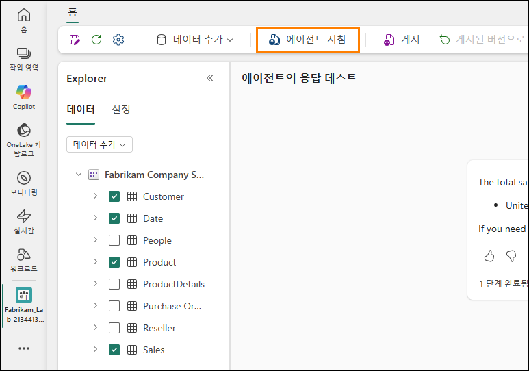

3. AI 지침 창 상단 또는 하단의 기존 일반 지침 옆에 있는 **에이전트 지침** 상자에 다음 지시사항을 입력합니다.

    **## Set Response Guidelines**

    **Always include a concise summary before the detailed breakdown.**

    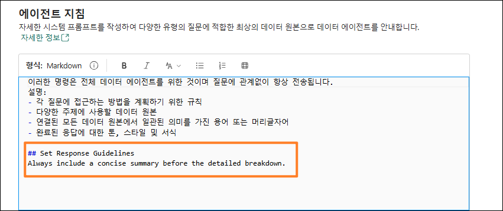

    **ℹ️ 중요**

    때로는 AI 지침이 적용되기까지 시간이 걸릴 수 있습니다. 원하는 결과가 나오지 않으면 에이전트 창 상단의 채팅 지우 버튼을 클릭하고 다시 시도하세요!

4. '에이전트 지침' 탭의 오른쪽 상단 모서리에 있는 **X**를 클릭하여 AI 지침을 닫고 변경 사항을 저장하세요.

    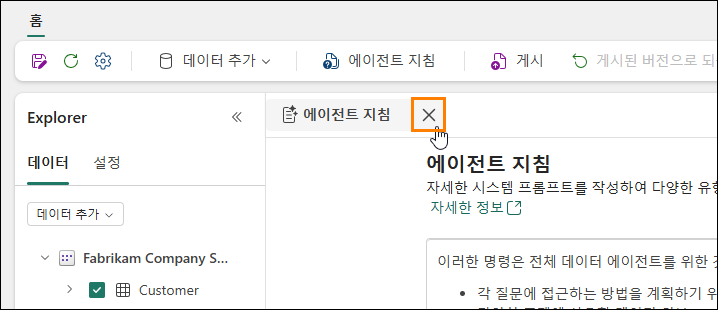

    **ℹ️ 중요**

    때로는 AI 지침이 적용되기까지 시간이 걸릴 수 있습니다. 원하는 결과가 나오지 않으면 에이전트 창 상단의 채팅 지우기 버튼을 클릭하고 다시 시도하세요!

    에이전트에게 이전에 제공한 것과 동일한 프롬프트를 입력한 다음 Enter를 누릅니다. **Show me sales by country**

    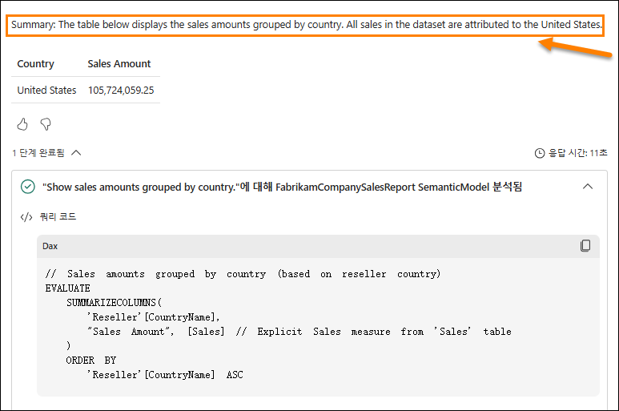

5. AI 응답을 더욱 정교하게 만들기 위해 다른 AI 지침을 추가해 보겠습니다. 이 예시에서는 프롬프트에 항상 글머리 기호 목록 대신 표를 반환하도록 명령어를 추가합니다. AI 지침을 열고 에이전트 명령어에 다음 코드 줄을 추가합니다.

    **Always return a table instead of bullet points**

    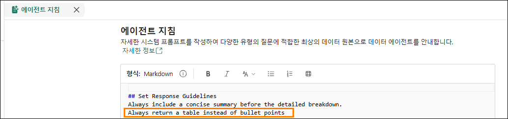

6. AI 지침 창을 닫고 데이터 에이전트 프롬프트에 다음을 입력합니다. **Return sales by country**

    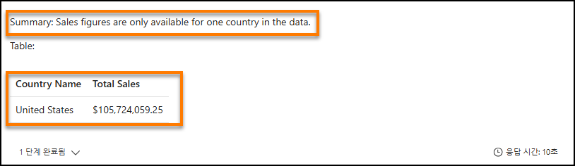

7. 이제 요약이 포함된 테이블 형식으로 결과를 받게 됩니다! 지금까지 아주 훌륭합니다! 몇 가지 지침을 더 추가해 보겠습니다.

8. 데이터 에이전트 프롬프트에 다음을 입력하세요. **Return sales by State**.

    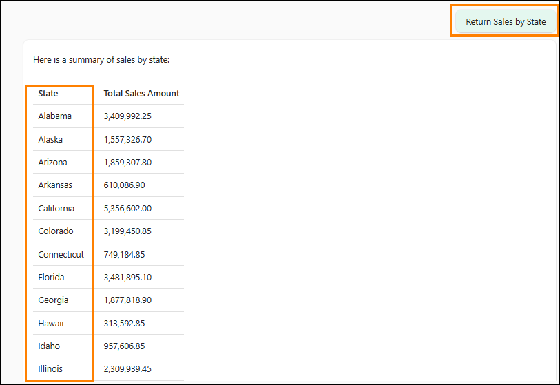

9. 이 결과는 정확히 기대했던 것이지만, 너무 많을 수도 있습니다. 별도로 지정되지 않는 한 항상 5개 행의 데이터만 반환하도록 **AI 프롬프트에** 지시해 봅시다.

10. 데이터 에이전트 AI 지침에 다음을 입력합니다.

    **Always provide the top 5 results unless a different number is specified**

    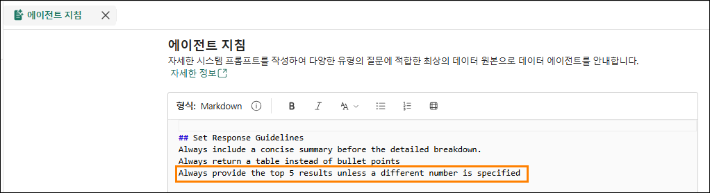

11. 결과는 완벽합니다! 요약에서 이제 매출 기준 상위 5개 주를 확인하고 있음을 명확히 알 수 있습니다. 또한 Copilot은 원한다면 모든 주의 매출 데이터를 요청하라고 안내합니다.

    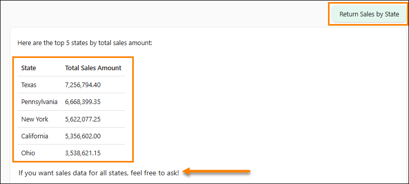

## 스포트라이트: 데이터 원본 교체

데이터 에이전트 작업 중 다른 데이터 소스를 사용하기로 결정할 수 있습니다. 이 예시에서는 Fabrikam Company Sales Report 의미 체계 모델을 사용 중입니다. 하지만 다른 의미 체계 모델을 사용하려면 어떻게 해야 할까요? 현재 데이터 소스를 간단히 교체하는 방법은 없지만, 데이터 에이전트에서 언제든지 데이터 소스를 제거하고 추가할 수 있습니다.

1. 데이터 소스를 제거하려면 데이터 에이전트 내 탐색기로 이동하여 데이터 소스 오른쪽의 점 세 개(**...**)를 클릭합니다. 드롭다운 메뉴에서 세 가지 옵션 (열기, 새로 고침, 제거)이 제공됩니다.

    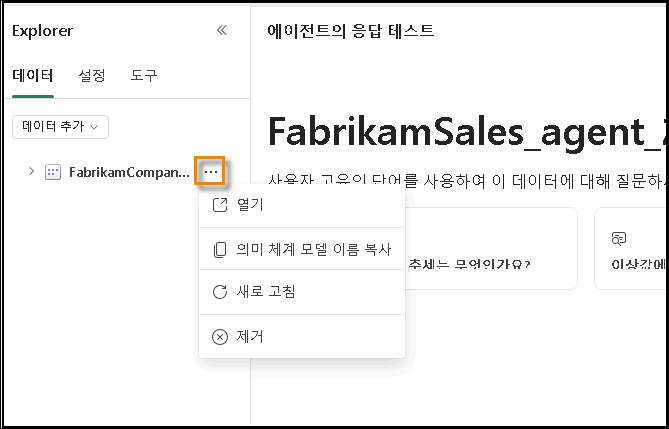

2. 이 랩에서는 데이터 소스를 교체하지 **않습니다**.

## 작업 5: 추가 데이터 소스 추가

데이터 에이전트는 잘 정의되고 신중하게 설계된 의미 체계 모델을 기반으로 구축되었습니다. 이 의미 체계 모델은 모든 사용자 요청은 아니더라도 대부분을 처리하도록 설계되었습니다. 해당 의미 체계 모델의 작성자를 찾아 추가 테이블과 정보를 요청할 수 있지만, 시간이 오래 걸리거나 요청이 거부될 수 있습니다.

제품 리드 타임별 판매량을 확인하려는 사용자가 있습니다. Fabrikam Company Sales 의미 체계에는 이 정보가 포함되어 있지 않지만, Fabric 레이크하우스에 저장된 원본 소스 데이터에는 이 정보가 존재합니다.

이 랩에서는 추가 데이터 소스를 추가하여 제품 리드 타임 정보가 데이터 에이전트 응답에 포함될 수 있도록 하겠습니다.

1. 레이크하우스 생성 및 샘플 데이터 추가부터 시작하겠습니다. 작업 영역으로 돌아가서 **새 항목**을 다시 한 번 선택합니다.

    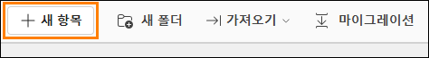

2. 아래로 스크롤하여 Microsoft Fabric으로 생성할 수 있는 기타 항목 영역에서 **레이크하우스**를 선택합니다.

    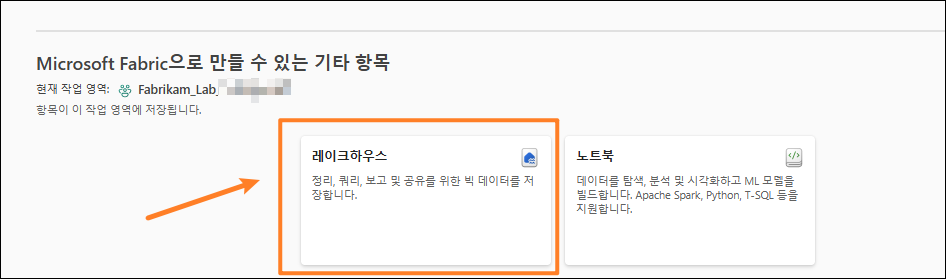

3. 새 레이크하우스의 이름을 **lh_Fabrikam**으로 지정한 다음 **만들기**를 누르세요.

    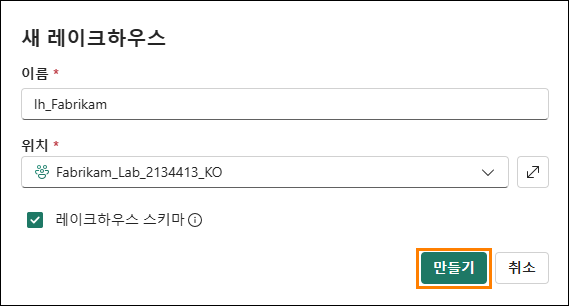

4. 이 레이크하우스에서는 미리 준비된 Fabrikam 데이터에 연결하기 위해 **바로 가기**를 사용할 것입니다. **데이터 가져오기**를 열고 **새 바로 가기**를 선택합니다.

    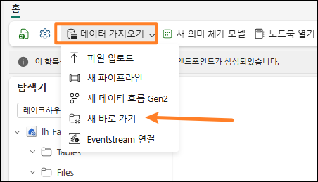

5. **Azure Data Lake Storage Gen2**를 선택합니다.

    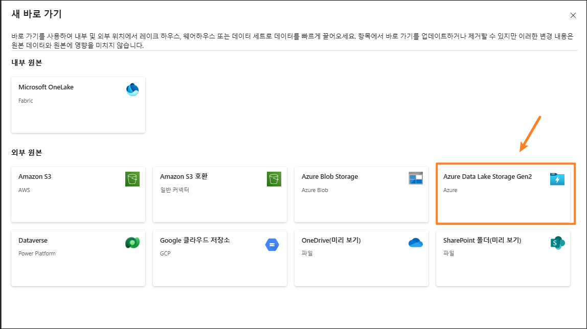

6. **새 연결**을 선택하고 Fabrikam URL을 입력하세요.

    ***https://stvnextblobstorage.dfs.core.windows.net/fabrikam-sales***

    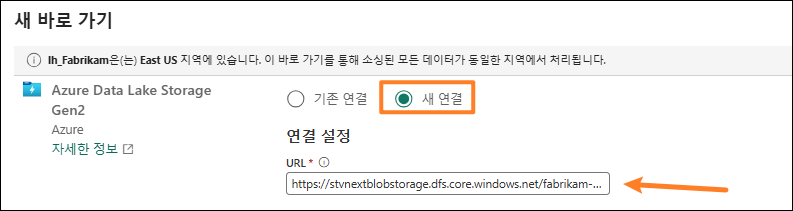

7. 연결 이름(예: **Fabrikam 커넥터 등**)을 지정하고 인증 유형에서 드롭다운을 클릭하여 공유 액세스 서명(SAS)을 선택합니다.

    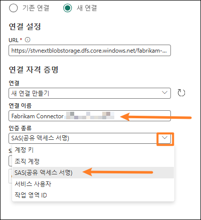

8. 오른쪽 환경 탭에서 SAS 토큰을 복사하여 **SAS 토큰** 영역에 붙여넣습니다.

    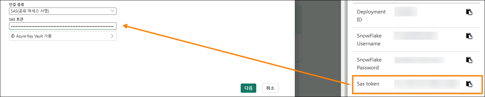

9. **다음**을 선택합니다.

    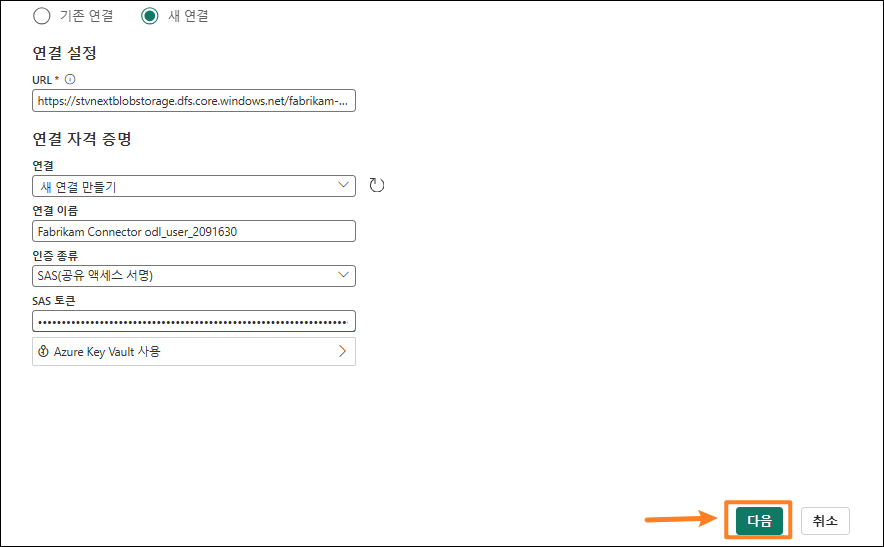

10. **Delta-Parquet-Format-FY25**를 열고 **Sales.Invoices.May**를 제외한 모든 항목을 선택한 후 **다음**을 선택합니다.

    

11. 새로 생성된 각 테이블의 **바로 가기 이름**을 변경합니다. 이는 레이크하우스를 데이터 원본으로 쉽게 사용하기 위해 중요합니다. 아래 형식을 따르세요.

    Application.Cities에서 **Cities**로

    Application.Countries에서 **Countries**로

    Application.StateProvinces에서 **StateProvinces**로

    DateDim에서 **Date**로

    Sales.BuyingGroups에서 **BuyingGroups**로

    Sales.Customers에서 **Customers**로

    Sales.InvoiceLines에서 **InvoiceLines**로

    Sales.Invoices에서 **Invoices**로

    Warehouse.StockGroups에서 **StockGroups**로

    Warehouse.StockItemStockGroups에서 **StockItemStockGroups**로

    Warehouse.StockItems에서 **StockItems**로

    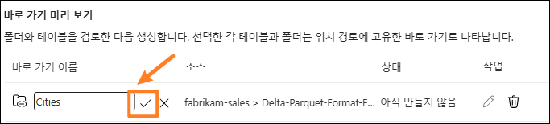

12. **만들기**를 선택하여 레이크하우스에 바로 가기를 통해 데이터를 추가합니다.

    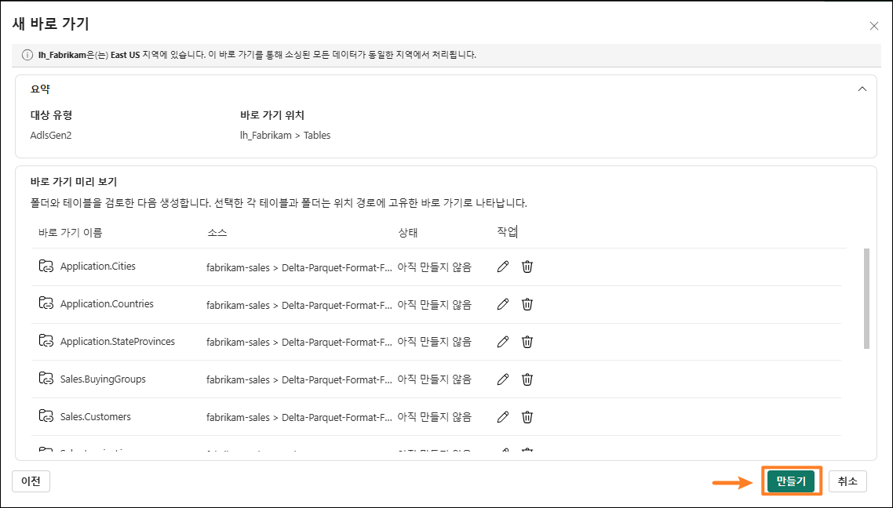

13. 업로드가 완료되면 개체가 테이블 영역으로 이동된 것을 볼 수 있습니다.

    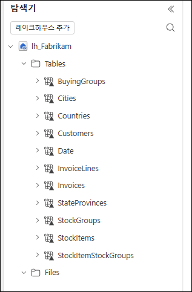

14. 왼쪽 또는 작업 영역 보기에서 **데이터 에이전트**로 돌아갈 수 있습니다.

    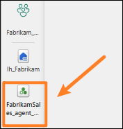

    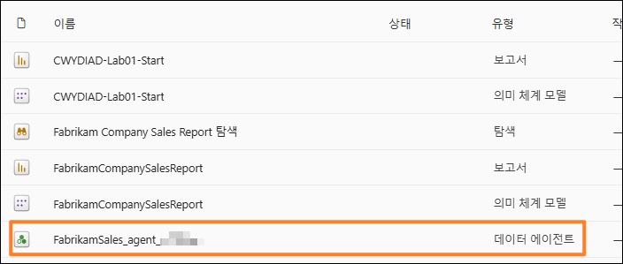

15. 데이터 에이전트에서 **데이터 추가** 드롭다운 상자를 클릭한 다음, 탐색 창에서 **데이터 원본**을 선택합니다.

    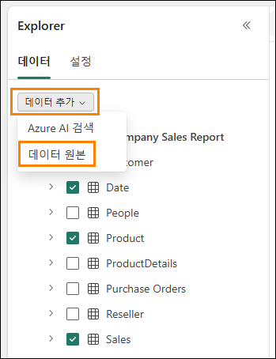

16. **lh_Fabrikam**을 선택한 후 **추가**를 클릭합니다.

    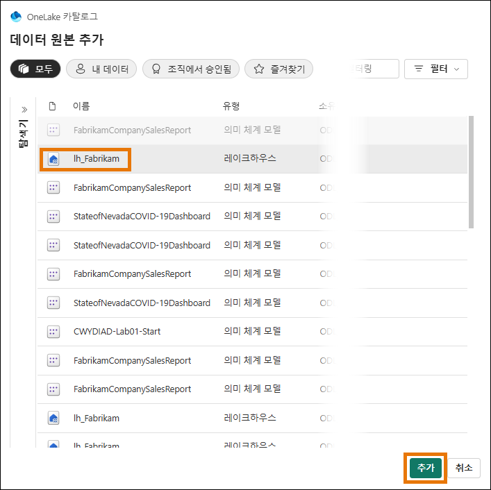

17. 이제 **탐색기** 창에 두 개의 데이터 소스가 표시됩니다.

    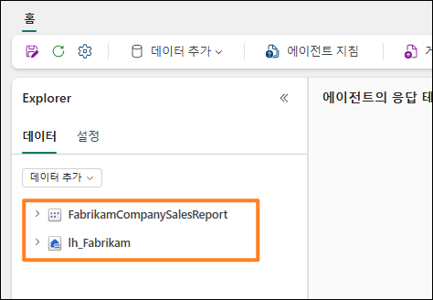

18. 레이크하우스를 열고 lh_Fabrikam에서 모든 잠재적 데이터 원본을 추가합니다. 모든 레이크하우스 항목이 표시되기까지 몇 분이 소요될 수 있습니다. 필요에 따라 로드 및 새로 고침이 완료될 때까지 기다립니다.

    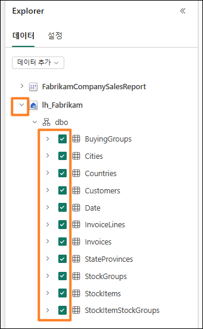

19. 데이터 에이전트 프롬프트로 돌아가 다음을 입력합니다. **What are total sales by product lead time?**

    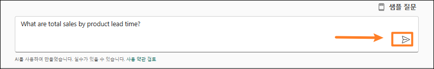

20. Fabric 데이터 에이전트가 이 요청을 완벽하게 처리하여 레이크하우스에서 원하는 결과를 얻었습니다. Fabrikam Company Sales Report 데이터를 선택 해제하면 Copilot이 대신 레이크하우스를 사용하도록 강제할 수 있습니다 다만, 곧 지침을 통해 이 문제를 더 효과적으로 해결할 예정입니다.

21. 완료된 단계 섹션을 확장하여 데이터 에이전트가 이 결과를 도출하기 위해 생성한 SQL을 검토합니다.

    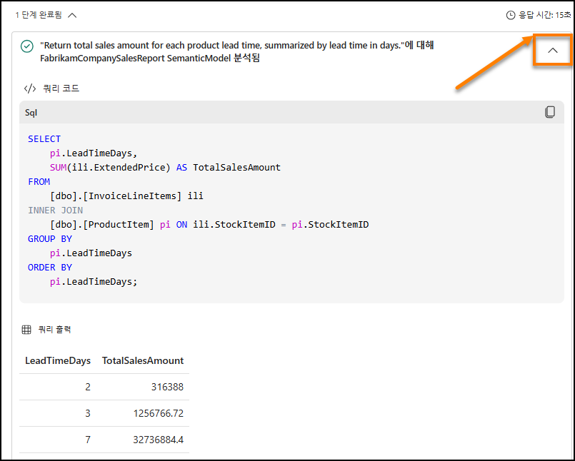

22. 데이터 에이전트 결과를 검증하는 것이 중요합니다. 데이터 에이전트는 사용된 SQL 코드를 노출하므로 이를 검토하고 레이크하우스에서 직접 실행하여 결과가 정확한지 확인할 수 있습니다!

    데이터 에이전트에 대한 특정 사용자 요청이 잘못된 데이터 소스에서 결과를 반환할 수 있습니다. 예를 들어, 제품별 총 매출은 레이크하우스 데이터 소스나 의미 체계에서 답변될 수 있습니다. 데이터 에이전트가 원하는 데이터 소스를 사용하여 요청에 답변하도록 보장하려면, 원하는 결과를 반환하도록 추가 AI 지침을 추가할 수 있습니다.

23. 데이터 에이전트의 AI 지침을 열고 에이전트 지침 섹션에 다음 지침을 추가합니다.

    **## Data Source Priority**

    **Always use the Fabrikam Company Sales Report to answer questions unless the user explicitly ask about lead time.**

    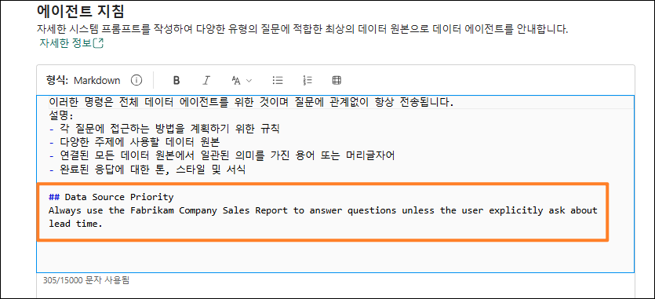

## 스포트라이트: 데이터 원본 지침

1. 다음으로 데이터 원본 지침을 살펴보겠습니다.

2. AI 지침 창에서 레이크하우스 옆의 점 세 개 를 선택하고 **데이터 원본 지침**을 선택한 후 레이크하우스를 확장합니다. 의미 체계와 달리 레이크하우스에서는 데이터 원본 수준에서 AI 지침이 지원된다는 점을 확인할 수 있습니다.

    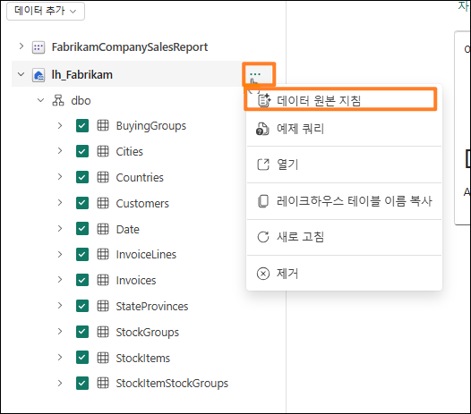

    여기에 데이터 원본 지침을 추가하면 AI가 레이크하우스의 데이터를 더 잘 이해하는 데 도움이 됩니다. 명확하게 정의된 AI 지침은 AI가 비즈니스 컨텍스트, 용어 및 분석 우선순위를 이해하는 데 기여합니다.

    이 수업 초반에 AI용 의미 체계 모델을 준비할 때 AI 지침에 대해 모두 배웠습니다. 여기서는 그 내용을 다시 다루지 않겠습니다. 다만, 데이터 에이전트에 추가 설명이 필요하다고 생각되면 바로 여기에 추가하면 된다는 점을 기억하세요.

## 작업 6: 질문 예시 생성

데이터 에이전트 튜닝은 일회성 설정이 아닙니다. 실험, 관찰, 개선을 포함하는 지속적이고 반복적인 과정입니다. 개선 과정의 일부는 데이터 원본에서 많은 SQL 또는 KQL이 필요할 수 있는 복잡한 질문에 AI가 어떻게 답변해야 하는지 이해하는 데 도움이 되는 예시 쿼리를 제공하는 것입니다.

데이터 에이전트는 소량 예제라고도 하는 예제 쿼리를 활용하여 자연어 질문을 SQL 또는 KQL로 변환할 때(NL2SQL, NL2KQL) 응답의 정확도와 관련성을 향상시킬 수 있습니다.

**ℹ️ 중요**

예제 쿼리 기능은 현재 의미 체계에서는 지원되지 않습니다.

예제 쿼리는 두 단계로 구성됩니다.

1) 먼저 예제 질문을 제공하면, AI가 제공한 질문과 의미 체계적으로 유사한 질문을 매칭합니다.

2) 둘째, 예제 쿼리를 제공합니다. 이 쿼리는 복잡한 조인, 복잡한 술어 및 기타 고급 시나리오를 처리하여 에이전트가 응답을 구성할 때 지원합니다!

    질문 예제에 대한 **랩은 본 강의 범위 외**입니다. 그러나 예제 쿼리를 생성하려면 다음 단계를 수행할 수 있습니다.

3) 레이크하우스 옆의 점(…)을 선택하고 **예제 쿼리**를 선택하여 창을 엽니다.

    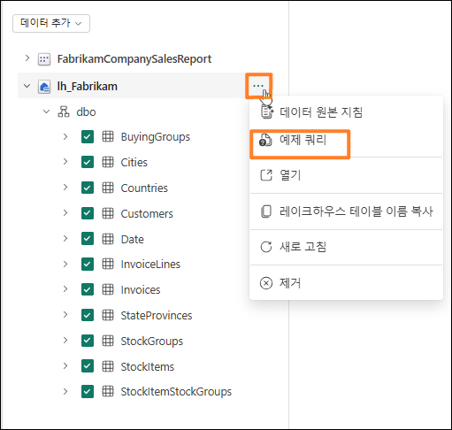

4) 예제 쿼리 창에서 **예제 추가**를 클릭합니다.

    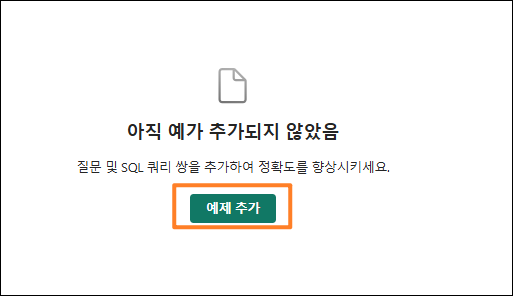

5) 예제 질문을 추가한 다음 Enter 키를 누릅니다. 예시: **Show sales by country that the product was manufactured in.**

    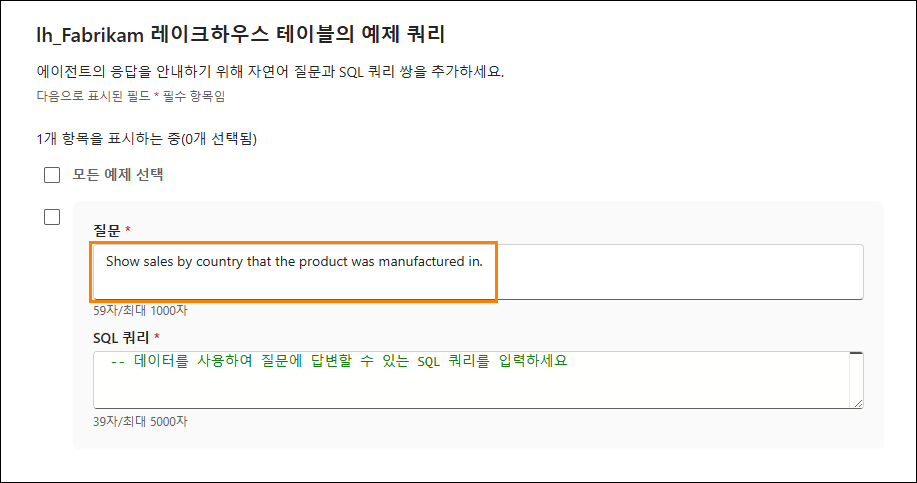

    **ℹ️ 중요**

    해당 코드는 랩 범위를 벗어나는 내용으로 실습에 제공되지 않습니다. 다만 시간이 허락한다면 자유롭게 직접 코드를 생성하여 탐구해 보셔도 좋습니다!

    SQL 쿼리 대화 상자에 에이전트가 이 유형의 질문에 답하기 위해 사용해야 할 SQL을 입력합니다. 완료 후 오른쪽 상단의 (X)를 클릭하고 에이전트를 테스트합니다.

    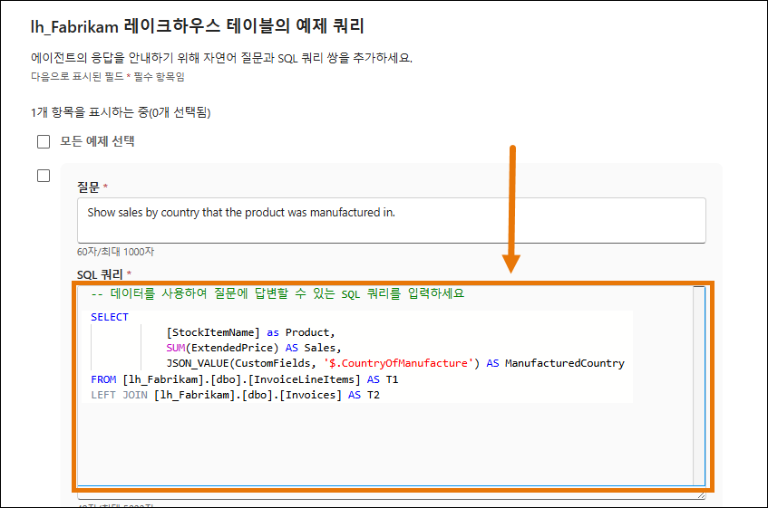

    **전문가 팁**: 각 질문은 서로 다른 분석 시나리오(지리적 분석, 필터링된 집계, 수익 계산, 계층적 시간 분석)를 대상으로 합니다. 다양한 변형을 실험하여 데이터 에이전트가 서로 다른 질문 스타일에 어떻게 적응하는지 확인해 봅니다.

    **추가 실험**: 에이전트에 더 복잡한 질문을 던져보고, 데이터 에이전트가 사용자 요청에 응답할 수 있도록 돕는 질문/SQL 쌍을 생성해 봅니다.

## 작업 7: 데이터 에이전트 게시 및 공유

1. 이제 데이터 에이전트를 게시할 차례입니다. 홈 메뉴의 **게시** 버튼을 클릭합니다.

    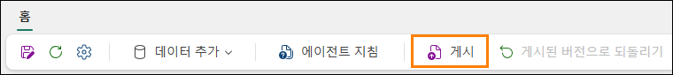

2. 그런 다음 에이전트에게 설명을 제공합니다. 에이전트의 목적과 기능을 포함시킵니다. **게시**를 클릭합니다.

    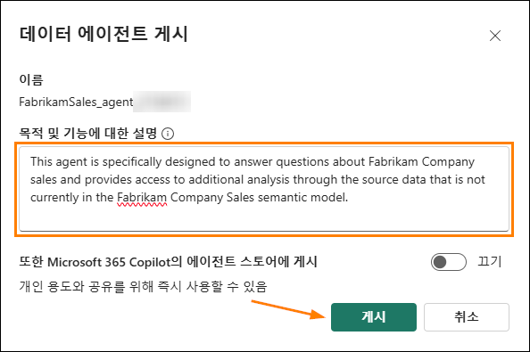

3. 에이전트를 게시한 후에는 공유해야 합니다. 화면 오른쪽 상단의 **공유** 버튼을 클릭합니다.

    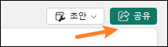

4. 열리는 **링크 만들기 및 보내기** 상자에서 **조직 내 사용자는 보기 가능** 버튼을 클릭합니다.

    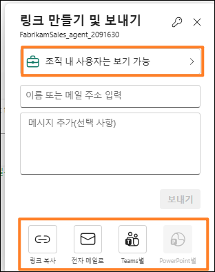

5. 여기서 권한 설정을 선택한 후 **적용**을 클릭합니다.

    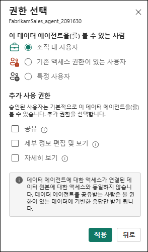

    **ℹ️ 중요**

    데이터 에이전트에 대한 액세스 권한은 연결된 데이터 소스에 대한 액세스 권한과 동일하지 않습니다. 데이터 에이전트를 공유한 사람들은 볼 수 있는 권한이 있는 데이터에 기반한 응답만 받게 됩니다.

6. 게시된 Fabric 데이터 에이전트는 다음과 같은 다양한 플랫폼에서 활용할 수 있습니다.

    - Microsoft Fabric

    - Copilot Studio

    - Microsoft Teams

    - Notebooks

    - Power BI Copilot

    - Azure AI Foundry

    - API를 통한 사용자 지정 애플리케이션

7. 작업 영역에서 데이터 에이전트 위에 마우스를 올려 **(…)** 점 세 개 아이콘을 표시합니다.

    

8. 점 세 개 아이콘을 클릭하고 **권한 관리**를 선택합니다.

    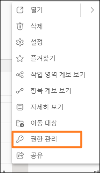

9. 여기서 공유하거나, 작업 영역 접근 권한을 통해 에이전트에 직접 접근할 수 있는 사용자를 관리할 수도 있습니다. 링크 메뉴에서 **+링크 추가**를 선택하거나, 직접 액세스 권한 메뉴에서 **+사용자 추가**를 선택할 수 있습니다. 작업 영역에 사용자를 추가하면 해당 사용자에게 에이전트 접근 권한이 부여됩니다.

    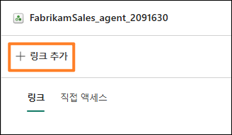

    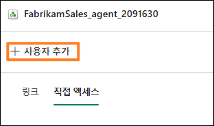

## 작업 8: Copilot에서 데이터 에이전트 사용하기

1. 에이전트는 다양한 방식으로 활용할 수 있지만(위 6단계 참조), 독립형 Copilot 환경에서 데이터 에이전트를 활용해 보겠습니다. 작업 영역에서 Copilot 버튼을 클릭합니다. (참고: 사이드바의 점 세 개(…)를 클릭해야 Copilot 버튼이 표시될 수 있습니다.)

    (참고: 예시에서 데이터 에이전트를 반드시 지정해야 합니다.)

    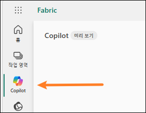

2. \+ 기호를 선택합니다. 에이전트가 Copilot이 사용할 수 있는 옵션으로 제공되는 것을 확인할 수 있습니다. 이는 독립형 Copilot과 데이터 에이전트 환경 간의 차이를 강조합니다.

    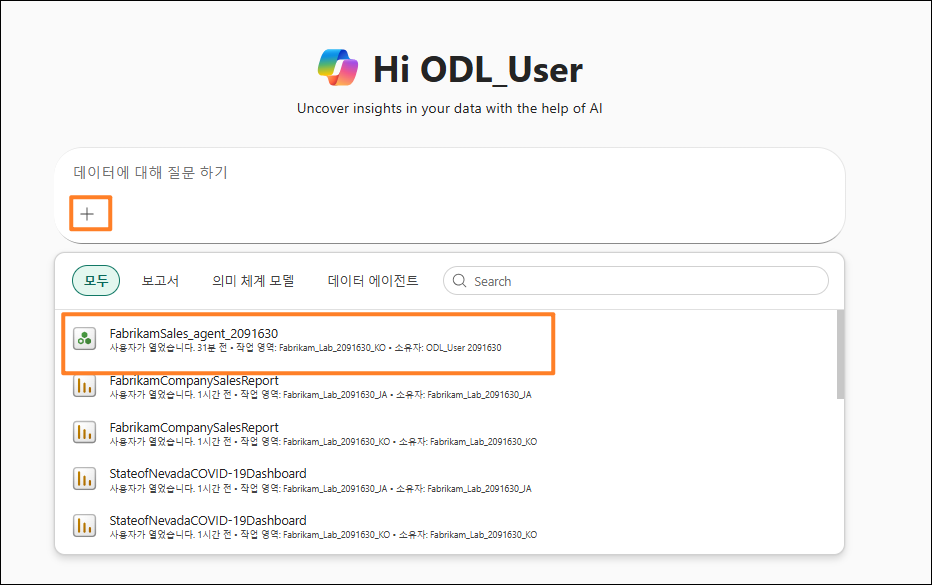

3. 작업 영역에서 에이전트 위에 마우스를 올려놓고 다시 점 세 개(…)를 클릭합니다.

    

4. 메뉴에서 **설정**을 선택합니다.

    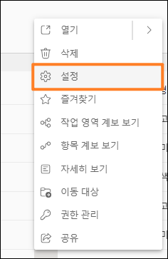

5. 새 창에서 **보증**을 선택합니다.

    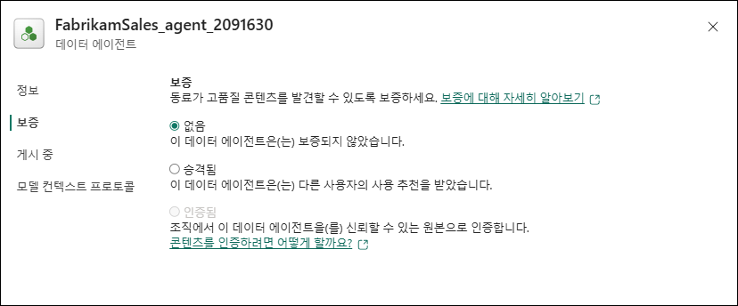

6. **Copilot** 환경에서 특히 Power BI 또는 Microsoft Fabric에서 **데이터 에이전트**를 사용할 때 '**데이터 에이전트 승인**'이란 조직 환경 내에서 해당 에이전트에 대한 공식적인 승인 또는 인증을 부여하는 것을 의미합니다. 이는 일반적으로 에이전트를 승인됨 또는 인증됨으로 표시하여 사용자가 쉽게 발견하고 신뢰할 수 있도록 하는 과정을 포함합니다.

# 참조

Chat With Your Data in a Day(CDIAD)에서는 Fabric 작업 영역에서 독립형 Copilot을 사용할 때의 몇 가지 주요 기능을 소개합니다.

서비스의 메뉴에 있는 도움말(?) 섹션에는 유용한 리소스로 연결되는 링크가 있습니다. 현재 사용 중인 환경에 따라 표시되는 화면이 달라질 수 있으므로 아래 스크린샷과 옵션이 다를 수 있음을 유의하세요.

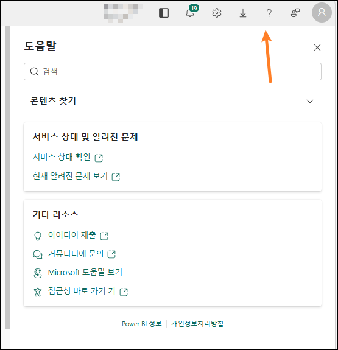

아래는 Microsoft Fabric의 다음 단계에 도움이 되는 몇 가지 추가 자료입니다.

- 기본 [Microsoft Fabric 문서](https://learn.microsoft.com/en-us/fabric/)의 모든 정보에 액세스

- [가이드 투어](https://aka.ms/Fabric-GuidedTour)로 Fabric 탐색

- [Microsoft Fabric 무료 평가판](https://aka.ms/try-fabric) 신청

- [Microsoft Fabric 웹 사이트](https://aka.ms/microsoft-fabric) 방문

- [Fabric 학습 모듈](https://aka.ms/learn-fabric)을 탐색해서 새로운 기술 익히기

- [Fabric](https://aka.ms/fabric-get-started-ebook) 시작하기 무료 eBook 읽기

- [Fabric 커뮤니티](https://aka.ms/fabric-community)에 가입하여 질문을 게시하고 피드백을 공유하며 다른 사람들로부터 배우기

다음과 같은 Copilot 관련 심층 기술 문서를 읽어보세요.

- [Power BI용 Copilot 개요 - Power BI | Microsoft Learn](https://learn.microsoft.com/en-us/power-bi/create-reports/copilot-introduction)

- [Power BI에서 독립형 Copilot 환경(프리뷰) – Power BI | Microsoft Learn](https://learn.microsoft.com/en-us/power-bi/create-reports/copilot-chat-with-data-standalone)

- [Microsoft Fabric Copilot 관리자 설정 | Microsoft Learn](https://learn.microsoft.com/en-us/fabric/admin/service-admin-portal-copilot)

- [Fabric 데이터 에이전트 생성(프리뷰) - Fabric 데이터 에이전트 생성 방법 알아보기 | Microsoft Learn](https://learn.microsoft.com/en-us/fabric/data-science/concept-data-agent)

- [데이터 에이전트 구성을 위한 모범 사례 - Microsoft Fabric | Microsoft Learn](https://learn.microsoft.com/en-us/fabric/data-science/data-agent-configuration-best-practices)

- [Microsoft Fabric 및 Power BI용 Copilot: FAQ - Microsoft Fabric | Microsoft Learn](https://learn.microsoft.com/en-us/fabric/fundamentals/copilot-faq-fabric)

© 2026 Microsoft Corporation. All rights reserved.

이 데모/랩을 사용하면 다음 조건에 동의하게 됩니다.

이 데모/랩에 설명된 기술/기능은 학습 환경을 제공하고 사용자 의견을 얻기 위해 Microsoft Corporation에서 제공합니다. 데모/랩을 통해서만 이러한 기술적 특성과 기능을 평가하고 사용자 의견을 Microsoft에 제시할 수 있습니다. 다른 용도로는 사용할 수 없습니다. 이 데모/랩 또는 그 일부에 대해 수정, 복사, 배포, 전송, 표시, 수행, 재현, 게시, 라이선스 허여, 파생 작업 생성, 양도 또는 판매할 수 없습니다. 추가 복제 또는 재배포를 위한 다른 서버 또는 위치에 대한 데모/랩(또는 그 일부)의 복사 또는 재현은 명시적으로 금지됩니다.

이 데모/랩은 위에서 명시한 목적을 위해 복잡한 설정 또는 설치가 없는 시뮬레이션된 환경에서 잠재적인 새로운 기능과 개념을 포함하여 특정 소프트웨어 기술/제품의 특성 및 기능을 제공합니다. 이 데모/랩에서 서술된 기술/개념은 전체 기능을 나타내지 않을 수 있으며, 최종 버전이 작동하지 않을 수도 있습니다. 또한 해당 기능 또는 개념의 최종 버전을 릴리스하지 않을 수도 있습니다. 또한 실제 환경에서 이러한 특성과 기능을 사용한 경험이 다를 수도 있습니다.

**피드백.** 이 데모/랩에서 서술된 기술적 특성, 기능 및/또는 개념에 대한 피드백을 Microsoft에 제시하면 Microsoft는 이 피드백을 어떤 방식과 목적으로든 무료로 사용, 공유 및 상용화할 수 있습니다. 또한 제품, 기술 및 서비스에서 사용자 의견이 포함된 Microsoft 소프트웨어 또는 서비스의 특정 부분을 사용하거나 인터페이스하는 데 필요한 모든 특허권을 제3자에게 무료로 제공합니다. Microsoft에서 사용자 의견을 포함하기 때문에 Microsoft에서 해당 소프트웨어 또는 설명서의 사용을 인가해야 하는 라이선스에 종속된 사용자 의견은 제공할 수 없습니다. 이러한 권리는 본 계약에 의거하여 유효합니다.

Microsoft Corporation은 이에 따라 명시적, 묵시적 또는 법적 특정 목적에의 적합성, 권리 및 비침해 여부에 관계없이 상품성에 대한 모든 보증과 조건을 포함하여 데모/랩과 관련된 모든 보증 및 조건을 부인합니다. Microsoft는 어떤 목적으로든 결과의 정확성, 데모/랩의 사용으로 파생된 출력 또는 데모/랩에 포함된 정보의 적합성과 관련하여 어떠한 보증이나 진술도 하지 않습니다.

**고지 사항**

이 데모/랩에는 Microsoft Power BI의 새로운 기능 및 향상된 기능 중 일부만 포함되어 있습니다. 일부 기능은 제품의 향후 릴리스에서 변경될 수 있습니다. 이 데모/랩에서는 새로운 기능 모두가 아닌 일부에 대해 학습하게 됩니다.
