# Microsoft Fabric Chat with your Data in a Day - Laboratório 1

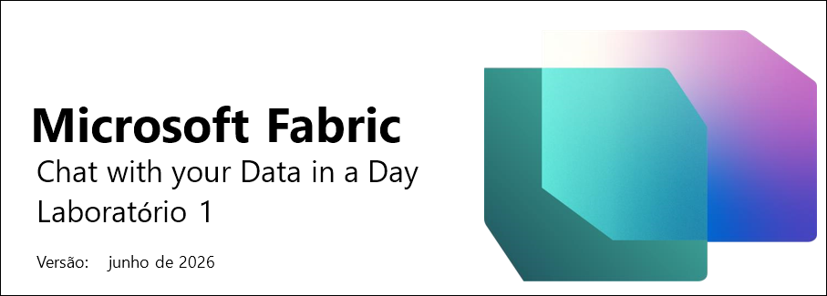

## Conteúdo

- Estrutura do documento
- Cenário/Declaração do problema
- Introdução
  - Tarefa 1: Trabalhar no Ambiente Virtual
  - Tarefa 2: Avaliar a preparação para IA de seus dados
  - Tarefa 3: Como escrever um prompt no Power BI Copilot

# Estrutura do documento

O laboratório inclui as etapas a serem seguidas pelo usuário juntamente com as capturas de tela associadas que fornecem auxílio visual. Em cada captura de tela, as seções estão destacadas com caixas laranjas para indicar as áreas nas quais o usuário deve se concentrar.

# Cenário/Declaração do problema

Sua organização acabou de voltar de uma conferência da Microsoft onde ouviu e viu como a experiência Chat with your Data, da plataforma Copilot, pode acelerar drasticamente o tempo de insights. As demonstrações mostraram como as consultas de linguagem natural podem desbloquear análises poderosas, desde que os modelos semânticos subjacentes sejam bem estruturados e otimizados para a IA.

**Objetivo atual**

Foi-lhe pedido que avaliasse um modelo semântico existente no Power BI Desktop. A sua meta é testar o desempenho dele na experiência do Copilot e identificar áreas para melhoria.

Explore o modelo semântico usando a interface PBI Desktop interna do Copilot

Identifique os pontos de atrito em que o Copilot tem dificuldade para interpretar a intenção

Recomende e implemente os aprimoramentos para melhorar a compreensão do Copilot

Documente suas descobertas e prepare o modelo para um uso organizacional mais amplo

# Introdução

Na demonstração do instrutor, você viu como a experiência Chat with your Data pode funcionar bem, neste laboratório, você verá como é necessário preparar modelos de dados para a IA. Este laboratório mostrará várias solicitações de usuários e como o Copilot responde a essas solicitações. Você também verá como validar essas respostas para precisão e correção. Em laboratórios futuros, você aprenderá a aplicar as práticas recomendadas e usar a preparação para suas ferramentas de dados para aprimorar e melhorar a experiência do Copilot!

## Tarefa 1: Trabalhar no Ambiente Virtual

1. A experiência do ambiente virtual é fenomenal por fornecer um espaço disponível para trabalhar com a Experiência Chat with Your Data! Vejamos alguns dos principais pontos e áreas.

   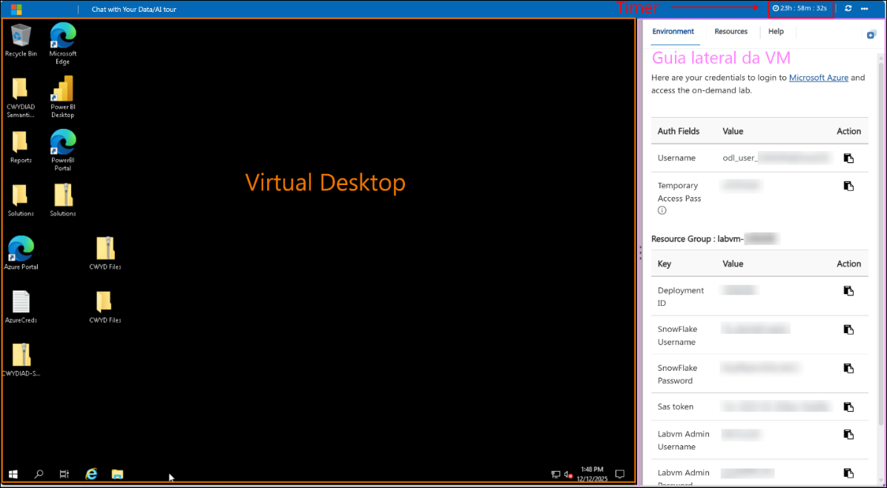

2. Vejamos algumas das principais áreas:
   - A área de trabalho virtual funciona como um computador totalmente funcional para você usar no navegador!

   - A Guia Lateral da VM é onde você pode acessar os Documentos do laboratório, as Credenciais e muito mais.

   - O Temporizador mostra quanto tempo restante você tem para usar a Máquina Virtual.

   **ℹ️ Importante**

3. Ao longo dos laboratórios de aula, essas caixas **Importante** detalharão informações valiosas. Tente não ignorá-las! Por exemplo, SE você não vir sua Guia Lateral da VM, certifique-se de expandi-la totalmente, conforme mostrado na imagem abaixo.

   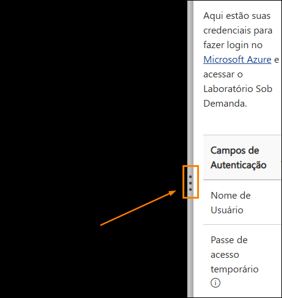

4. Você pode navegar com facilidade nos laboratórios usando o número de página na parte inferior da Guia Lateral.

   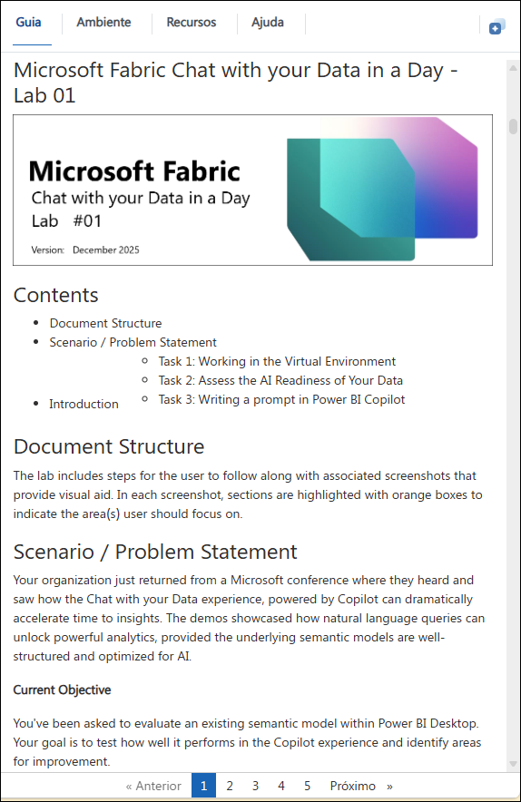

5. Em sala, você pode trabalhar totalmente dentro da Máquina Virtual. No entanto, alguns participantes preferem trabalhar com um Navegador Anônimo e fazer logon no Power BI Desktop com as credenciais de Máquina Virtual concedidas a eles. Isso é perfeitamente aceitável!

## Tarefa 2: Avaliar a preparação para IA de seus dados

1. Agora que você viu as principais áreas da Máquina Virtual, vá para o botão PowerBI Portal para iniciar o Serviço do Power BI.

   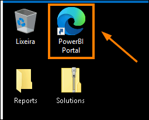

2. Usando as credenciais listadas na página de credenciais e em seu documento, forneça o email na área Email.
   - **Username/Email:** **<inject key="AzureAdUserEmail"></inject>**

     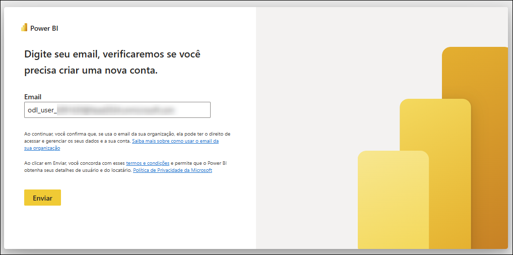

3. Em seguida, use a caixa **Entrar** da Microsoft com as mesmas credenciais e clique em **Avançar**.

   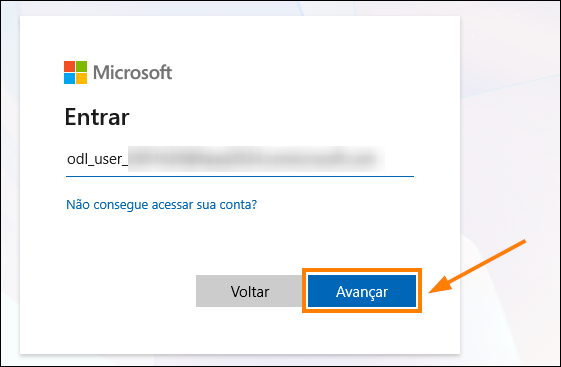

4. Insira a **Senha de Acesso Temporária** na página de credenciais ou no documento do laboratório e pressione **Entrar**. Opcionalmente, selecione Sim para permanecer conectado(a).
   - **senha:** **<inject key="AzureAdUserPassword"></inject>**

     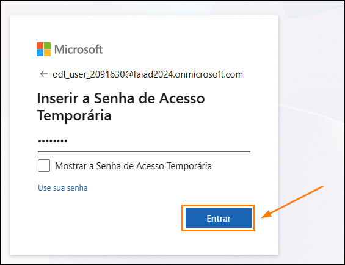

5. Primeiro, navegaremos até a área **Workspaces** no menu do lado esquerdo.

   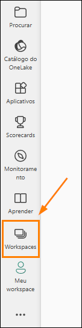

6. Agora criaremos um **Novo Workspace** selecionando o botão Novo Workspace.

   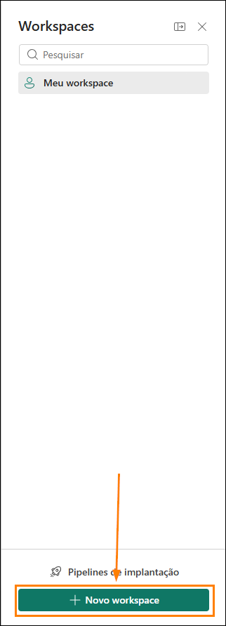

7. Em seguida, nomeie seu espaço de trabalho: **Fabrikam*Lab*<inject key="DeploymentID" enableCopy="false"></inject>\_PT**

   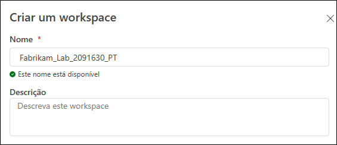

8. O código de sete dígitos faz parte do nome de usuário que você recebeu para a classe. Use isto! Veja a captura de tela abaixo.

   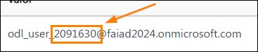

9. Por exemplo, John A. Smith seria: **Fabrikam*Lab*<inject key="DeploymentID" enableCopy="false"></inject>\_PT**

   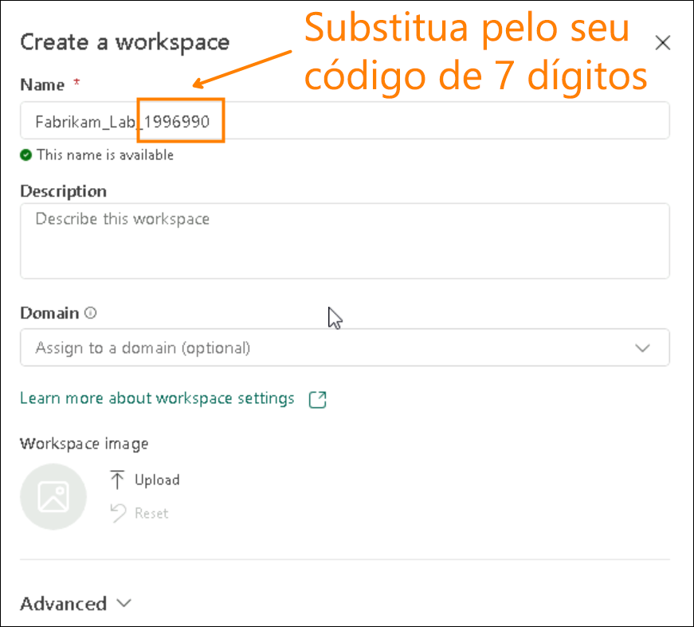

10. Em seguida, você precisa atribuir uma capacidade do Fabric ao seu workspace.

11. Clique em **Avançado** para expandir as opções avançadas ao configurar um workspace.

    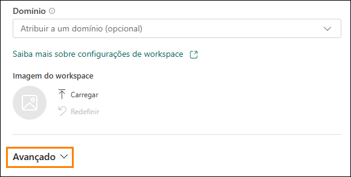

12. Verifique se **Capacidade do Fabric** está selecionado. Role um pouco mais para baixo e selecione **aleatoriamente** uma capacidade do menu suspenso!

    **ℹ️ Importante**

    O ambiente do Fabric usado para essa classe será atualizado com frequência, então é POSSÍVEL QUE VOCÊ NÃO tenha as mesmas capacidades listadas na captura de tela abaixo. Basta escolher qualquer capacidade disponível!

    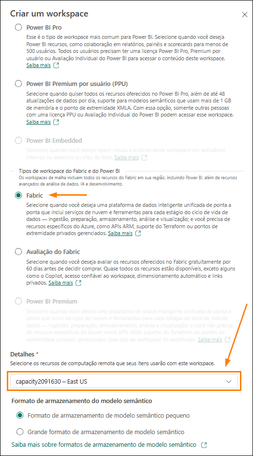

13. Clique em **Aplicar**.

    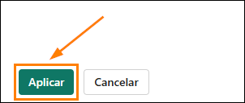

    Excelente! Usaremos o Espaço de Trabalho de Capacidade do Fabric para explorar tudo de melhor que o Chat with Your Data tem a oferecer!

14. Abra o arquivo chamado **CWYDIAD – Lab 01 – Start** em seus arquivos de classe para começar a explorar a experiência Chat with your Data.

    

15. Insira o seu endereço de email **<inject key="AzureAdUserEmail"></inject>** no arquivo do Power BI Desktop e pressione continuar para fazer logon usando as suas credenciais:

    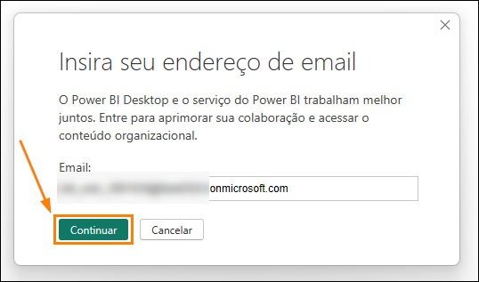

16. Além disso, faça logon por meio da janela de logon da Microsoft usando o mesmo Nome de Usuário **<inject key="AzureAdUserEmail"></inject>** e a Senha de Acesso Temporário **<inject key="AzureAdUserPassword"></inject>**

    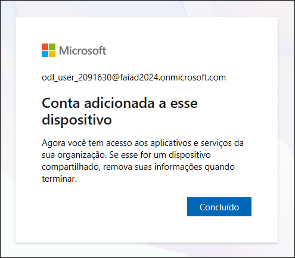

17. Com o arquivo PBIX inicial aberto, vá para o botão Copilot e selecione-o para abrir a experiência do Copilot.

    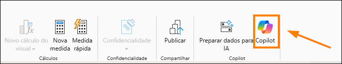

18. Se você já estiver conectado(a), uma nova janela será aberta: **Conecte-se a um espaço de trabalho com suporte para o Copilot.** Clique na opção **Selecionar o workspace** e selecione o espaço de trabalho que você acabou de criar.

    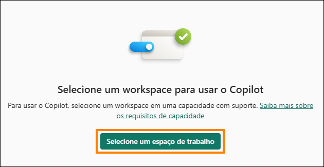

    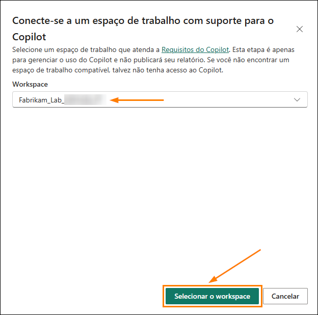

19. Se você receber um prompt na próxima tela, clique em **Get started**

    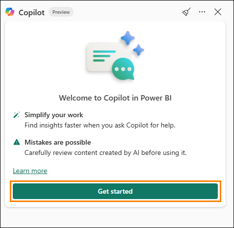

20. Bem-vindo(a) à experiência do Copilot no Power BI! Nesta tela de inicialização, você receberá algumas ideias de prompt na parte superior **(1)** e, em seguida, uma seção na parte inferior onde você pode escrever seu prompt **(2)**.

    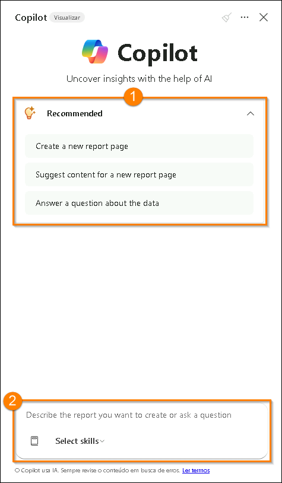

## Tarefa 3: Como escrever um prompt no Power BI Copilot

Nesta seção, você escreverá vários prompts e explorará os resultados retornados pela experiência do Power BI Copilot.

1. Clique no prompt e escreva o seguinte: **Show total purchases by employee**. Clique em **Inserir**.

   

   **Potenciais Opções:**

   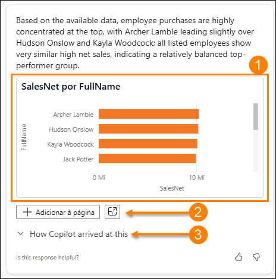

   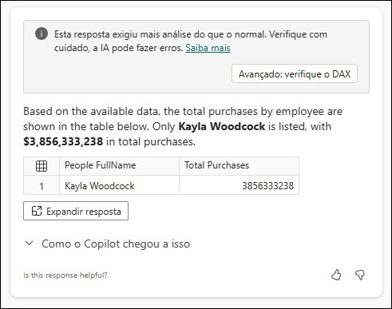

   **ℹ️ Importante**

   A IA retorna resultados não determinísticos devido a muitos fatores. Conforme discutido anteriormente nesta aula, seus resultados podem variar e podem não ser idênticos aos laboratórios. Observe acima que esses dados não preparados para IA terão resultados variados exatamente na mesma pergunta. Prossiga e explore as capacidades e recursos que estão sendo exibidos da melhor maneira possível!

   Você até mesmo pode receber perguntas de acompanhamento como a listada abaixo:

   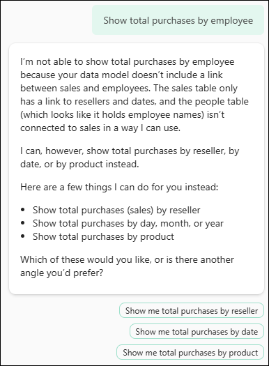

   Se for necessário, escolha o mais provável **Show total purchases by employee** ou **continue gerando prompts.**

2. Muitas informações são retornadas agora. Vamos explorar esta seção em profundidade.
   1. **(1)** Uma visualização comparando o Total de Compras e Funcionários.

   2. **(2)** Áreas para **Adicionar à página** ou para **pop-out e** **expandir** o visual.

   3. **(3)** _HCAAT:_ Como o Copilot chegou a isso.

      

3. Clique em _HCAAT_: botão **How Copilot arrived at this** para ver a lógica por trás da resposta do Copilot.

   **Potenciais Opções:**

   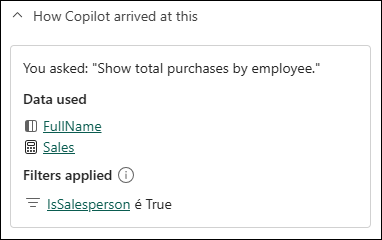

   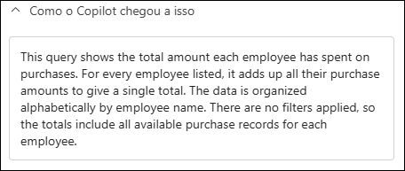

4. Passe o mouse sobre o **_FullName_**, **_Sales_** e até mesmo **_IsSalesperson_** para ver o **Campo** e a **Tabela de Início** que o Copilot utilizou para responder à pergunta.

   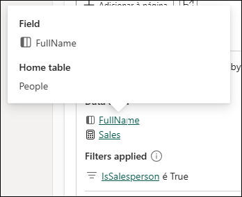

   Infelizmente, este é um resultado incorreto. Solicitamos Total de Compras e recebemos **Total** **de Vendas**! A outra Consulta DAX analisou apenas um único funcionário. Parece que estes dados precisam de preparação! Pense assim, os dados que não foram preparados para o Copilot são como o primeiro dia de trabalho de um novo analista de dados; e dados que foram preparados para o Copilot são como fazer uma pergunta para um analista tarimbado com muitos anos de experiência em SUA organização específica.

   Há dois aspectos principais a serem considerados aqui quando se preparar os dados para o Copilot.

   Primeiro, podemos escrever um prompt melhor que forneça mais especificidade, isso definitivamente ajudará. No entanto, muitos usuários não saberão como escrever prompts eficazes e também podem não conhecer os dados suficientemente bem para serem específicos.

   Em segundo lugar, como analistas de dados, podemos preparar os dados para o Copilot e antecipar esses tipos de solicitações, tornando as respostas do Copilot mais precisas. O objeto desta aula é ensinar todas as práticas recomendadas e ferramentas disponíveis para melhorar a experiência Chat with your Data.

   **ℹ️ Importante**

   As respostas do Copilot são moldadas pela forma como você faz as suas perguntas. Prompts claros e específicos levam a insights mais precisos e soluções mais rápidas. Quando trabalhar com seus dados, tente incluir o contexto, os resultados desejados e quaisquer filtros ou colunas relevantes. Quanto melhor o seu prompt, melhor a sua resposta!

5. Vamos tentar isso novamente, mas com um prompt mais específico, no tipo Prompt do Copilot: **Show total purchases from the PO table by employee.**

   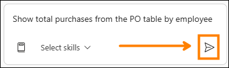

6. Você notará que o visual criado tem apenas uma Funcionária chamada "Kayla Woodcock". Está correto! Kayla é a única funcionária que faz compras. Assim, sendo mais específicos, podemos obter melhores respostas. Além disso, se tivéssemos preparado nosso modelo semântico com uma medida chamada Total de Compras desde o início, poderíamos ter evitado esse cenário!

   **Potenciais Opções:**

   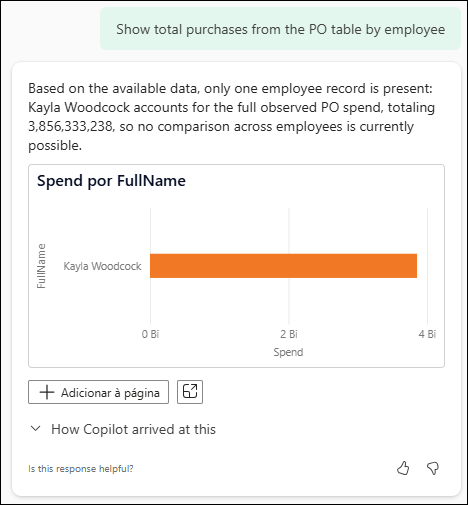

   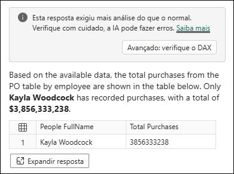

7. É muito importante sempre validar os resultados e como o Copilot chegou à resposta. Clique em **HCAAT**, How Copilot arrived at this.

   

   Se o Copilot fornecer uma consulta DAX, tente pressionar **verifique o DAX**.

   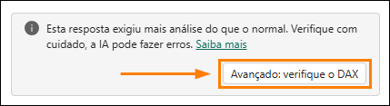

8. Podemos ver que o Copilot está usando a coluna FullName da nossa tabela People e também está usando a medida Spend. Até mesmo nossa consulta DAX está fazendo o mesmo. A medida de gastos provavelmente poderia ser nomeada melhor para melhorar a experiência do Copilot.

   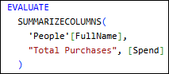

9. O que significa Spend aqui neste contexto? É igual a Purchases? É possível que ainda estejamos recebendo a resposta incorreta do Copilot. Vamos em frente e pedir ao Copilot que nos explique como Spend é calculado!

10. No prompt do Copilot, digite: **How is the measure Spend calculated**

    **Potenciais Opções:**

    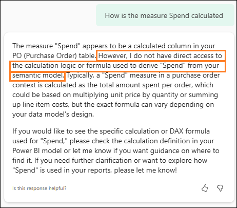

    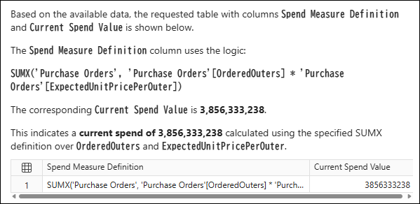

11. O Copilot faz um ótimo trabalho quando dá uma explicação geral do que o cálculo provavelmente está fazendo. Mas você pode ver nessa definição termos como "Typically" ou "Usually", porque isso é uma generalização. Você também pode notar que o Copilot informa explicitamente que não tem acesso à fórmula exata ou à lógica de cálculo e, portanto, não pode fornecer uma resposta específica.

    Na outra imagem, o Copilot conseguiu obter com sucesso a Medida real, explicá-la e fornecer a resposta associada aos gastos dentro do contexto de filtro atual!

    **ℹ️ Importante**

    Em um laboratório futuro, você aprenderá a oferecer ao Copilot o contexto de negócios adicional necessário para responder a essas perguntas e dar ao usuário mais confiança na resposta do Copilot!

12. Agora vamos expandir ainda mais e criar um visual para demonstrar como o Copilot se ajustará às alterações no modelo de dados e no relatório.

13. No prompt do Copilot, digite: **Create a new report page with a bar chart visual for sales and product tag.**

    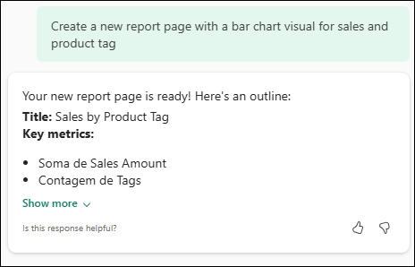

    Talvez seja necessário continuar criando prompts para o Copilot, conforme mostrado aqui:

    

    Faça o possível para fazer a correspondência dos elementos **Sales Amount** e **product tag**.

    Observe que o Copilot criou o visual em uma nova página de relatório!

    **Opções potenciais:**

    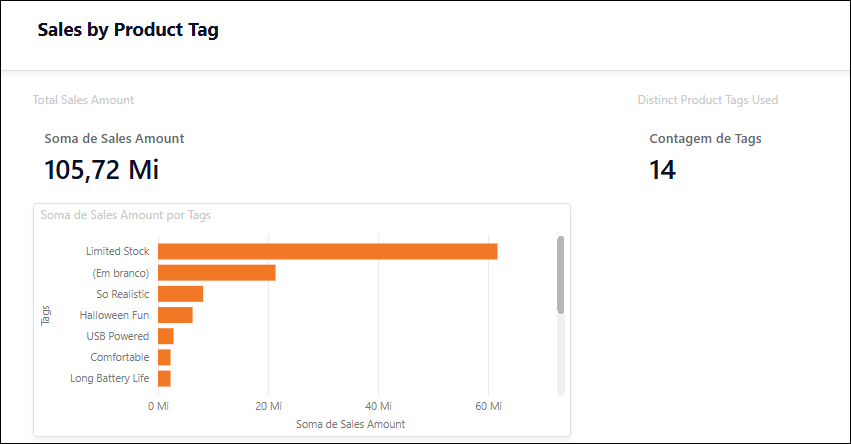

    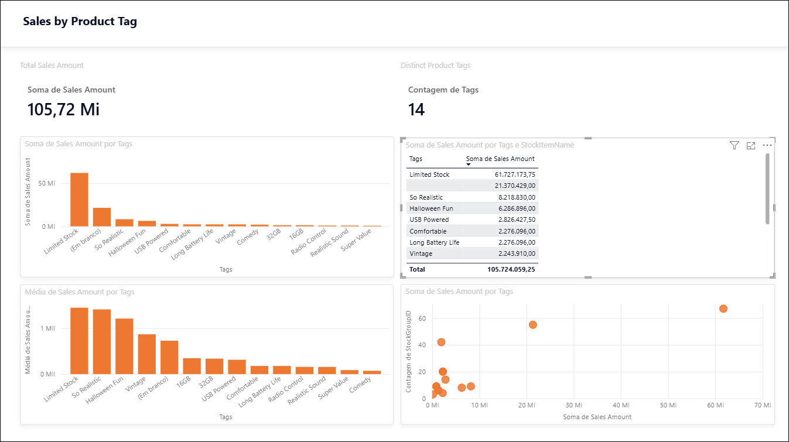

14. Selecione o visual de gráfico de barras que o Copilot criou e acesse a **Modo de Exibição do Modelo.** Observe que ele incluiu um filtro para contornar o nosso modelo de dados! Isso éṣincrível porque a Etiqueta de Produto e o Total de Vendas normalmente não funcionariam emṣnosso modelo de dados atual.

    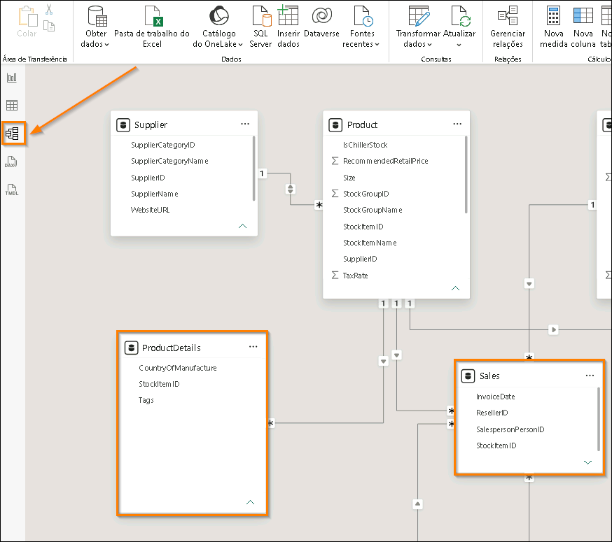

15. Isso pode ser contagem dupla de alguns valores, então vamos removê-lo. Volte para o **Modo de Exibição do Relatório.** Certifique-se de que o gráfico ainda esteja selecionado.

    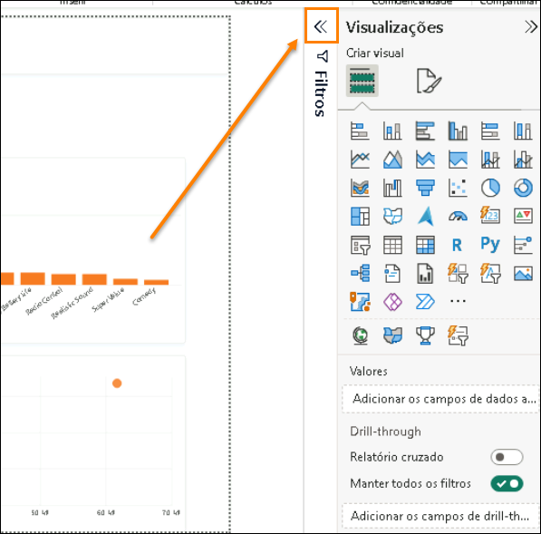

16. À direita, acesse a **guia Filtros** em "Filtrar neste visual", remova "Detalhes do Produto que têm Produtos" do eixo do gráfico de barras.

    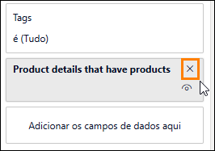

17. Observe que os valores são todos iguais em **R\$ 105.724.059**, isso pode ser mostrado passando o mouse sobre as barras de dados no visual criado pelo Copilot. Este é um sinal revelador de relacionamentos incorretos no modelo semântico.

    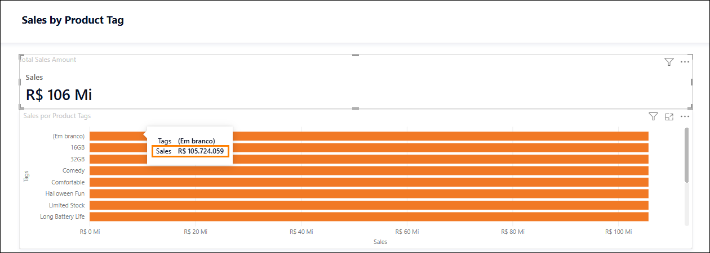

18. A resposta retornada pelo Copilot acima estava incorreta devido ao design do modelo semântico. O Copilot foi capaz de criar um filtro para ajustar para corresponder à nossa solicitação! Isso mostra a natureza de por que é importante ter um modelo de dados preparado para a IA. Em um laboratório futuro, daremos uma olhada nas tabelas e relacionamentos e como isso pode ser melhorado para melhorar a experiência do Copilot!

19. O visual deixa bem claro que há um problema com a resposta do Copilot. Outra maneira de ver esses dados seria fazer uma pergunta ao Copilot e exibir a resposta. No prompt do Copilot, digite: **Show total sales by product tag**.

    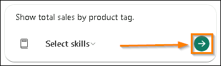

20. O Copilot deixa você saber, explicitamente na resposta, que **no variation in sales** (não há variação) nas vendas. Sempre que você vir essas palavras no Copilot, é uma indicação de que algo pode não estar correto.

    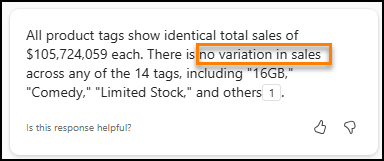

21. Vamos fazer outra pergunta do Copilot: **Show total sales by State**.

    

    Há várias respostas que você pode obter, _seus resultados provavelmente vão variar!_ Uma possível resposta é esta:

    **Potenciais Opções:**

    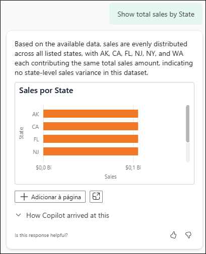

    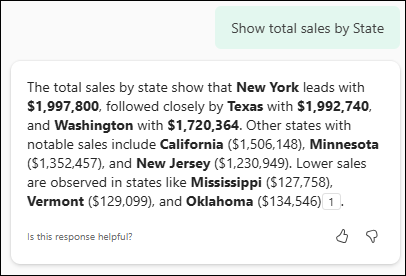

22. Essa resposta não está exatamente correta. Novamente, um erro de modelo de dados está presente? Poderia ser o modelo de dados OU a imprecisão da nossa linguagem. Selecione _HCAAT_: como o How Copilot arrived a this e passe o mouse sobre os Dados de **_State_** e **_Sales. Sales_** está sendo coletado com precisão por meio de nossa medida explícita na tabela Sales, mas nosso campo **_State_** é da tabela Customer!

    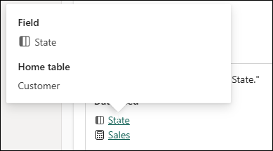

23. Vá até a Exibição de Modelo e revise os relacionamentos do modelo de dados que vinculam Customer a Sales. Isso explica perfeitamente nossa visualização incorreta! Agora podemos ver que nossa linguagem e o modelo de dados devem se alinhar.

    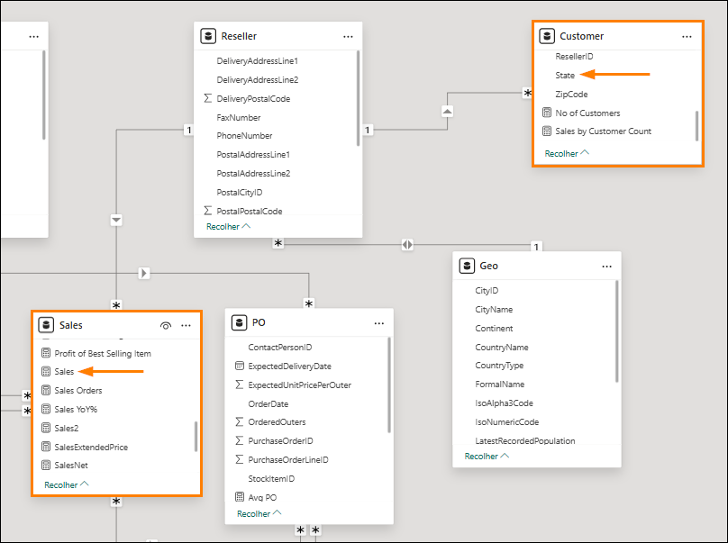

    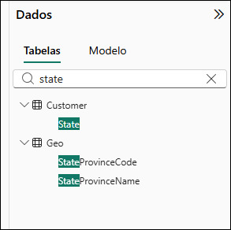

    Nesse cenário, temos várias tabelas que têm uma variação de State, também temos várias medidas de vendas. Isso pode resultar em respostas inconsistentes e até mesmo em resultados enganosos. Em laboratórios posteriores, você aprenderá as diferentes técnicas para ajudar o Copilot a responder a esses tipos de solicitações de usuários!

24. Vamos tentar um outro prompt: **Sales by State**.

    

25. Nas imagens abaixo, você pode ver que o estado do Texas tem o maior número de vendas, com **\$461,457 ou \$2 million**. Essas respostas foram geradas referenciando visuais no relatório, um visual realmente tem um filtro! Se os seus resultados forem os mesmos da captura de tela abaixo, clique na referência, isso levará você para a página e o visual que está sendo referenciado.

    **Potenciais Opções:**

    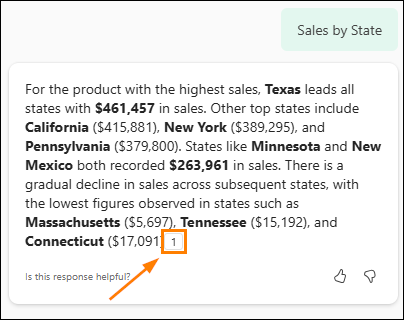

    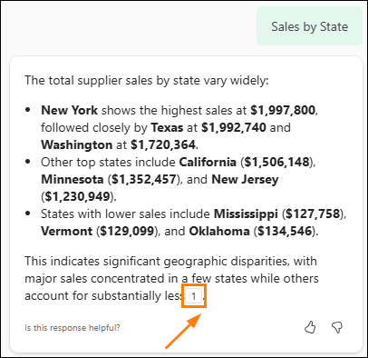

26. Agora, navegue até a guia do produto mais vendido que está na faixa de opções inferior.

    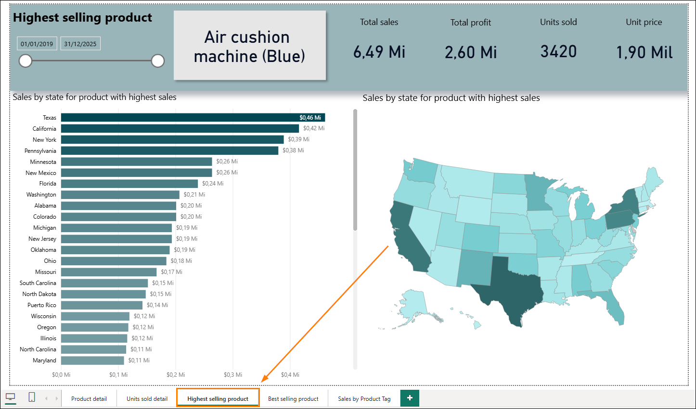

27. À primeira vista, as respostas podem parecer precisas, mas dê uma olhada em alguns dos filtros potenciais aplicados às visualizações. Se ainda não tiver feito isso, expanda seu painel de filtragem:

    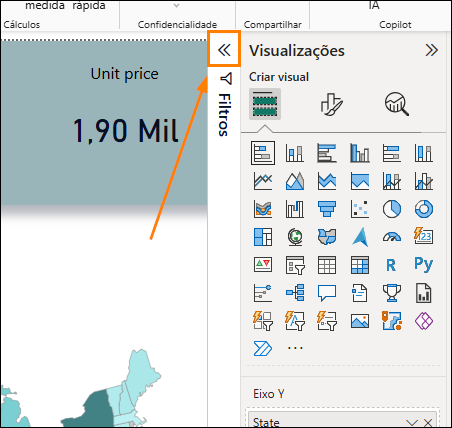

28. Há um filtro no visual que pode estar causando uma alteração nas respostas do Copilot. Expanda o Filtro para ver que **esse visual só mostra as vendas do produto mais vendido**. (Certifique-se de ter selecionado o visual do mapa)

    **ℹ️ Importante**

    Os filtros podem existir nos níveis visual, de página, relatório e até mesmo segmentação de dados. Às vezes, o Copilot pode gerar uma resposta a partir de um visual que tenha um filtro, mas não notificar o usuário final de que há um filtro sendo aplicado! Mais adiante neste curso, discutiremos como você pode adicionar instruções de IA para ajudar com esses tipos de respostas.

    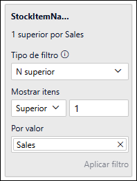

    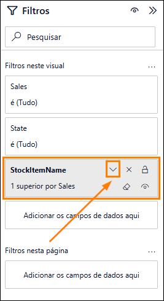

29. Remova esse filtro e observe como os valores do visual de referência mudam drasticamente.

    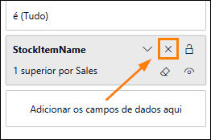

30. O Texas agora tem **USD 7.256.794**. Drasticamente diferente de algumas das outras opções? Bem, olhando de perto, você verá que um visual estava usando a Medida **Sales** e o outro **Supplier Sales**. Essa é ainda mais uma razão pela qual precisamos preparar nossos dados para a IA.

    

    

31. O que será que acontecerá se voltarmos a fazer a mesma pergunta? Pergunte ao Copilot mais uma vez **Sales by State**.

    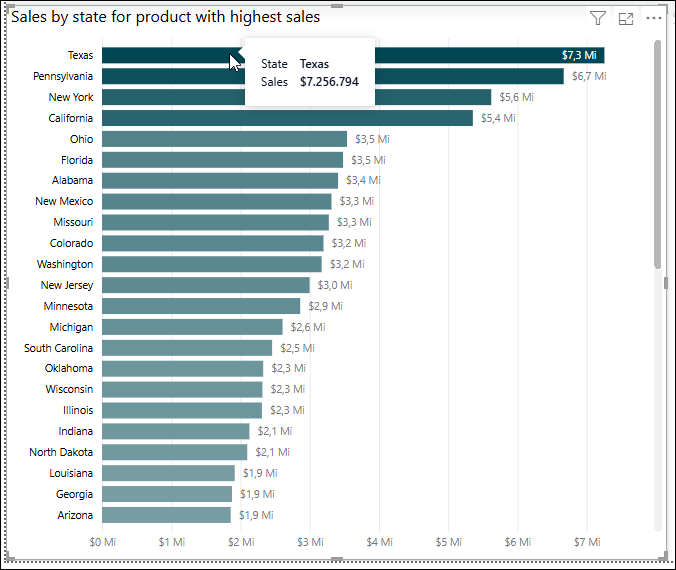

    

32. Sem o filtro, temos um conjunto completamente diferente de valores na mesma referência. Esse é um aspecto importante a ser observado no processo de preparação dos dados para a IA.

    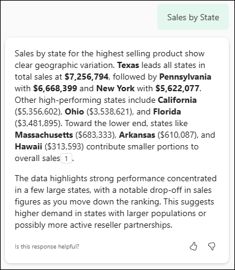

33. E quanto a uma resposta que retorna várias referências? Faça esta nova pergunta ao Copilot: **Show the top selling product**.

    

34. Selecione a referência e verifique se há filtros estranhos que possam estar presentes.

    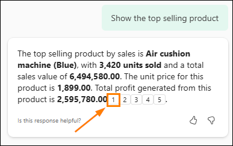
    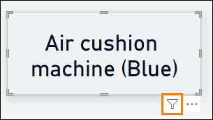

35. Adicione um filtro à página da tabela Reseller para **ResellerCompany**.

    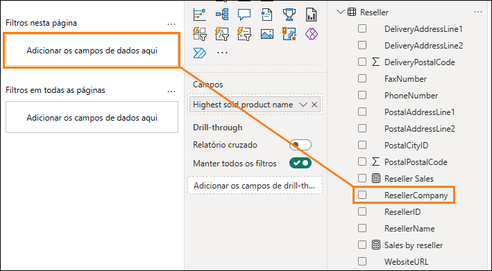

36. Selecione apenas TailSpin Toys e observe os valores que mudaram.

    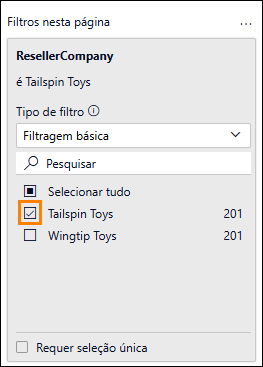

37. Agora vamos fazer a pergunta novamente: **Show the top selling product**.

    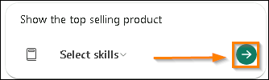

38. O produto pode permanecer o mesmo, mas nossos números são muito diferentes, este exemplo mostra onde modelos semânticos não preparados podem fornecer resultados inconsistentes e incorretos.

    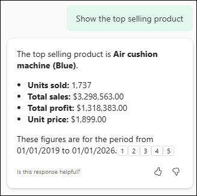

39. Outra área em que podemos desfrutar do Copilot aqui e devemos rever é a integração da linguagem Data Analysis eXpression (DAX). Tente fazer uma pergunta que envolva um cálculo como este: **Calculate the percent of total sales in the Southeast to the United States**.

    

40. Em nossa resposta, você notará que o Copilot reconhece que a resposta exigirá mais análise do que o normal. Isso é ótimo para nos informar para validar ainda mais o cálculo, conforme necessário.

    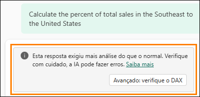

41. No nosso caso, esse cálculo específico exigiu que o Copilot escrevesse em DAX. Aqui podemos verificar o DAX usado de duas maneiras. Primeiro, a área **Avançado: verifique o DAX** e a área **Expandir Resposta**.

    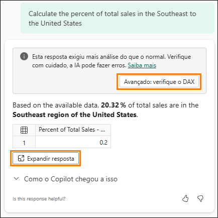

42. Você deseja garantir que está exibindo a guia **Consulta DAX** para exibir o DAX utilizado para criar a resposta. A consulta é listada juntamente com uma explicação da lógica a ser seguida. Precisamos fazer duas perguntas. (1) O DAX parece certo aqui? (2) A região Southeast foi mesmo de apenas **20,32%**?

    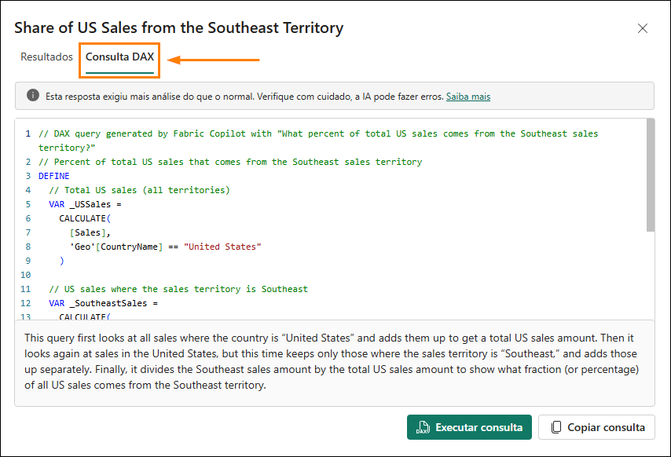

43. Cada vez que o Copilot gera o DAX, muitas vezes ele será muito diferente e inconsistente. Seu DAX pode ou não se parecer com as capturas de tela nesta seção! Nesse código, o DAX está extraindo o estado da tabela **Geo** que funciona, mas poderia facilmente ter capturado as informações de localização da tabela **Customer**. Se tivesse tirado da tabela Customer, os resultados teriam sido apenas 3 a 4%.

    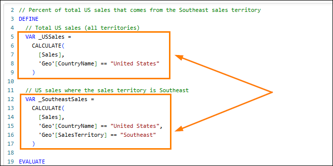

44. Agora, de que forma podemos resolver esse problema? Utilizaremos o melhor método mais tarde em nossos laboratórios quando **Prepararmos os dados para a IA**. Por enquanto, uma maneira de garantirmos uma resposta melhor é escrevendo um prompt melhor. Você pode já ter obtido resultados da tabela **Geo**, mas ainda assim esta é a segunda melhor maneira de confirmar.

45. Faça a pergunta novamente usando este prompt: **Calculate the percent of total sales in the Southeast to the United States from the Geo table**.

    

46. Desta vez, os resultados são provavelmente semelhantes. Também podemos verificar o DAX associado à resposta.

    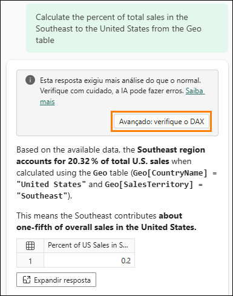

    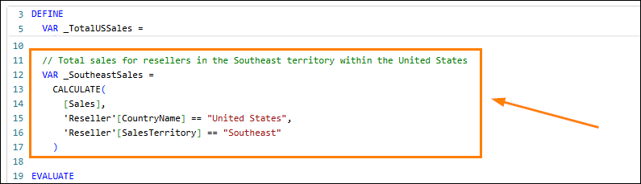

47. Perfeito! Com um prompt bem pensado, os lapsos no modelo podem ser ajustados. Mas para os nossos usuários finais, queremos criar uma experiência que possa permitir um prompt mais geral.

48. Neste arquivo PBIX, há algumas preocupações de modelagem de dados. Mais especificamente, existem duas dimensões do Snowflake. O Copilot lida muito bem com isso, aplicando filtros e outras mudanças para aperfeiçoar suas respostas! No entanto, depois de revisar o modelo e os requisitos de negócios, decidimos que essas duas dimensões (Supplier e Geo) não são necessárias como tabelas individuais. Essas duas tabelas serão consolidadas em outras tabelas no modelo para se aproximar de um Esquema em Estrela. Quando modelado corretamente, isso melhorará o desempenho, tornará o modelo mais fácil de entender e melhorará a experiência do Copilot. Ao final deste módulo, você usará o **CDIAD – Lab 02– Start**.
    - **Supplier:** as colunas na tabela Supplier foram adicionadas à tabela Product.

    - **Geo:** as colunas na tabela Geo foram adicionadas à tabela Reseller.

    **ℹ️ Importante**

    Às vezes, é necessário criar dimensões que filtram outras dimensões, essencialmente criando um snowflake. No entanto, sempre que possível, o modelo semântico deve ser simplificado se os requisitos de negócios forem atendidos. À medida que novos requisitos de negócios são adicionados e novas tabelas são trazidas, o modelo de dados inevitavelmente se tornará mais complexo. É importante sempre reservar um tempo para manter o modelo de dados otimizado!

⭐O Power BI funciona melhor em um Esquema em Estrela, uma discussão completa sobre o Esquema em Estrela está fora do escopo desta classe. Consulte este Link do Microsoft Learn para obter mais informações:

[**https://learn.microsoft.com/en-us/power-bi/guidance/star-schema**](https://learn.microsoft.com/en-us/power-bi/guidance/star-schema)

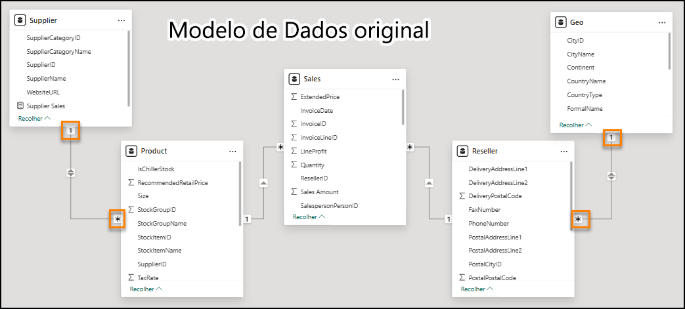

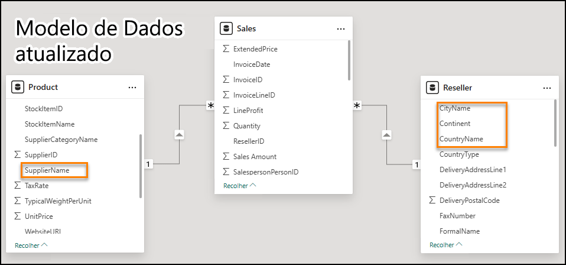

Veja aqui mais alguns recursos que ajudarão você com as próximas etapas do Microsoft Fabric.

- Acesse todas as informações na [Documentação principal do Microsoft Fabric](https://learn.microsoft.com/en-us/fabric/)

- Explore o Fabric por meio do [Tour Guiado](https://aka.ms/Fabric-GuidedTour)

- Inscreva-se na [avaliação gratuita do Microsoft Fabric](https://aka.ms/try-fabric)

- Visite o [site do Microsoft Fabric](https://aka.ms/microsoft-fabric)

- Aprenda novas habilidades explorando os [módulos de Aprendizagem do Fabric](https://aka.ms/learn-fabric)

- Leia o livro eletrônico [gratuito sobre como começar a usar o Fabric](https://aka.ms/fabric-get-started-ebook)

- Participe da [comunidade do Fabric](https://aka.ms/fabric-community) para postar suas perguntas, compartilhar seus comentários e aprender com outras pessoas

Leia a documentação técnica mais detalhada relevante para o Copilot:

- [Visão geral do Copilot para Power BI - Power BI | Microsoft Learn](https://learn.microsoft.com/en-us/power-bi/create-reports/copilot-introduction)

- [Experiência do Copilot Autônomo no Power BI (Versão Prévia) – Power BI | Microsoft Learn](https://learn.microsoft.com/en-us/power-bi/create-reports/copilot-chat-with-data-standalone)

- [Configurações de administrador do Microsoft Fabric Copilot | Microsoft Learn](https://learn.microsoft.com/en-us/fabric/admin/service-admin-portal-copilot)

- [Criação de agente de dados do Fabric (versão prévia) - saiba como criar um agente de dados do Fabric | Microsoft Learn](https://learn.microsoft.com/en-us/fabric/data-science/concept-data-agent)

- [Práticas recomendadas para configurar agentes de dados - Microsoft Fabric | Microsoft Learn](https://learn.microsoft.com/en-us/fabric/data-science/data-agent-configuration-best-practices)

- [Copilot para Microsoft Fabric e Power BI: perguntas frequentes - Microsoft Fabric | Microsoft Learn](https://learn.microsoft.com/en-us/fabric/fundamentals/copilot-faq-fabric)

© 2026 Microsoft Corporation. Todos os direitos reservados.

Ao usar esta demonstração/este laboratório, você concorda com os seguintes termos:

A tecnologia/funcionalidade descrita nesta demonstração/neste laboratório é fornecida pela Microsoft Corporation para obter seus comentários e oferecer uma experiência de aprendizado. Você pode usar a demonstração/o laboratório somente para avaliar tais funcionalidades e recursos de tecnologia e fornecer comentários à Microsoft. Você não pode usá-los para nenhuma outra finalidade. Você não pode modificar, copiar, distribuir, transmitir, exibir, executar, reproduzir, publicar, licenciar, criar obras derivadas, transferir nem vender esta demonstração/este laboratório ou qualquer parte deles.

A CÓPIA OU A REPRODUÇÃO DA DEMONSTRAÇÃO/DO LABORATÓRIO (OU DE QUALQUER PARTE DELES) EM QUALQUER OUTRO SERVIDOR OU LOCAL PARA REPRODUÇÃO OU REDISTRIBUIÇÃO ADICIONAL É EXPRESSAMENTE PROIBIDA.

ESTA DEMONSTRAÇÃO/LABORATÓRIO FORNECE DETERMINADAS TECNOLOGIAS DE SOFTWARE/RECURSOS E FUNCIONALIDADE DO PRODUTO, INCLUINDO POTENCIAIS NOVOS RECURSOS E CONCEITOS, EM UM AMBIENTE SIMULADO SEM CONFIGURAÇÃO OU INSTALAÇÃO COMPLEXA PARA A FINALIDADE DESCRITA ACIMA. A TECNOLOGIA/CONCEITOS REPRESENTADOS NESTA DEMONSTRAÇÃO/LABORATÓRIO PODEM NÃO REPRESENTAR A FUNCIONALIDADE COMPLETA DO RECURSO E PODEM NÃO FUNCIONAR DA MESMA FORMA QUE UMA VERSÃO FINAL. NÓS TAMBÉM PODEMOS NÃO LANÇAR UMA VERSÃO FINAL DE TAIS RECURSOS OU CONCEITOS. SUA EXPERIÊNCIA COM O USO DE TAIS RECURSOS E FUNCIONALIDADES EM UM AMBIENTE FÍSICO TAMBÉM PODE SER DIFERENTE.

**COMENTÁRIOS.** Caso você forneça comentários sobre os recursos de tecnologia, as funcionalidades e/ou os conceitos descritos nesta demonstração/neste laboratório à Microsoft, você concederá à Microsoft, sem encargos, o direito de usar, compartilhar e comercializar seus comentários de qualquer forma e para qualquer finalidade. Você também concede a terceiros, sem encargos, quaisquer direitos de patente necessários para que seus produtos, suas tecnologias e seus serviços usem ou interajam com partes específicas de um software ou um serviço da Microsoft que inclua os comentários. Você não fornecerá comentários que estejam sujeitos a uma licença que exija que a Microsoft licencie seu software ou sua documentação para terceiros em virtude da inclusão de seus comentários neles. Esses direitos continuarão em vigor após o término do contrato.

A MICROSOFT CORPORATION SE ISENTA DE TODAS AS GARANTIAS E CONDIÇÕES COM RELAÇÃO A DEMONSTRAÇÃO/LABORATÓRIO, INCLUINDO TODAS AS GARANTIAS E CONDIÇÕES DE COMERCIALIZAÇÃO, SEJAM EXPRESSAS, IMPLÍCITAS OU ESTATUTÁRIAS, ADEQUAÇÃO A UM DETERMINADO FIM, TÍTULO E NÃO VIOLAÇÃO. A MICROSOFT NÃO DECLARA NEM GARANTE A PRECISÃO DOS RESULTADOS DERIVADOS DO USO DA DEMONSTRAÇÃO/DO LABORATÓRIO NEM A ADEQUAÇÃO DAS INFORMAÇÕES CONTIDAS NA DEMONSTRAÇÃO/NO LABORATÓRIO A QUALQUER FINALIDADE.

**AVISO DE ISENÇÃO DE RESPONSABILIDADE**

Esta demonstração/este laboratório contém apenas uma parte dos novos recursos e aprimoramentos do Microsoft Power BI. Alguns dos recursos podem ser alterados em versões futuras do produto. Nesta demonstração/neste laboratório, você aprenderá sobre alguns dos novos recursos, mas não todos.
