# Microsoft Fabric Chat with your Data in a Day - Laboratório 2

## Conteúdo

- Estrutura do documento
- Cenário/Declaração do problema
- Introdução
  - Tarefa 1: Filtragem Bidirecional/Esquema em Estrela
  - Tarefa 2: Renomear colunas, tabelas, medidas
  - Tarefa 3: Descrições
  - Tarefa 4: Categorias de Dados
  - Tarefa 5: Resumo
  - Tarefa 6: Propriedade Classificar por Coluna
  - Tarefa 7: Esquema Linguístico: Sinônimos

# Estrutura do documento

O laboratório inclui as etapas a serem seguidas pelo usuário juntamente com as capturas de tela associadas que fornecem auxílio visual. Em cada captura de tela, as seções estão destacadas com caixas laranjas para indicar as áreas nas quais o usuário deve se concentrar.

# Cenário/Declaração do problema

Sua empresa concluiu os testes iniciais e a fase de testes de preparação do Copilot. Descobriu-se que o modelo atual ainda não está pronto para a experiência do Copilot Autônomo e que as práticas recomendadas geralmente aceitas precisarão ser implementadas no Power BI Desktop. Para garantir que o Copilot possa fornecer respostas significativas, o modelo semântico subjacente deve ser cuidadosamente projetado e otimizado.

Seu modelo semântico enfrenta os desafios atuais:

- Os nomes das tabelas e colunas podem ser enigmáticos e difíceis de decifrar.

- Não existem descrições em tabelas, colunas e medidas.

- As Categorias de Dados são subutilizadas, limitando a compreensão contextual do Copilot.

- A lógica de classificação e os resumos padrão podem não refletir as expectativas do usuário.

- Os relacionamentos e o esquema linguístico não estão configurados ou otimizados para oferecer suporte a uma experiência ideal do Copilot.

# Introdução

Essas lacunas podem causar confusão, respostas imprecisas, recursos visuais enganosos ou insights perdidos quando os usuários interagem com o Copilot. Neste laboratório, você aprenderá a refinar o modelo semântico usando as melhores práticas para nomenclatura, categorização, resumo, modelagem de dados e esquema linguístico.

## Tarefa 1: Filtragem Bidirecional/Esquema em Estrela

1. Abra o arquivo chamado **CDIAD – Lab 02– Start** em seus arquivos de classe para começar a preparar os seus dados para a IA.

    

2. Uma pergunta feita no laboratório anterior foi: **Create a new report page with a visual for sales and product tag**. Isso criou uma resposta do Copilot que mostrava dados duplicados (captura de tela abaixo). Normalmente, quando você vê o mesmo resultado para todos os pontos de dados, é uma indicação de que há um problema de relacionamento no modelo de dados.

    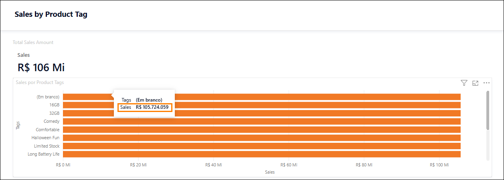

3. Veja abaixo uma captura de tela do relacionamento de Tag na tabela Product Details com a medida Sales na tabela Sales:

    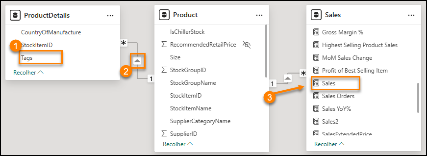

4. Quando solicitamos ao Copilot para retornar as Sales by Tags, ele gera um relatório com dados duplicados. Isso ocorre porque a coluna Tags na tabela Product Details não consegue filtrar a tabela de produtos. A direção do filtro entre Product e Product Details é única e de Product para a tabela Product Details . Há duas maneiras de, potencialmente, resolver esse problema.

    - Primeiro, podemos criar uma medida DAX que calcula o total de vendas enquanto adiciona o filtro necessário da tabela Tags. Essa opção mantém o modelo de dados simples, mas uma nova medida precisa ser criada para cada necessidade comercial e pode se tornar entediante.

    - Em segundo lugar, e o que vamos implementar aqui, podemos permitir que o filtro prossiga em ambas as direções. Ao atualizar o relacionamento entre Product e Product Details, a coluna Tag poderá ser filtrada até a tabela Sales e o Copilot poderá gerar a resposta correta.

5. Vamos atualizar o relacionamento no modelo de dados. *Veja a captura de tela abaixo:*

    1. Clique na exibição de modelo no painel de navegação esquerdo.

    2. Selecione o relacionamento entre Product e Product Details.

    3. No painel de propriedades, altere a direção do filtro cruzado de simples para ambos.

        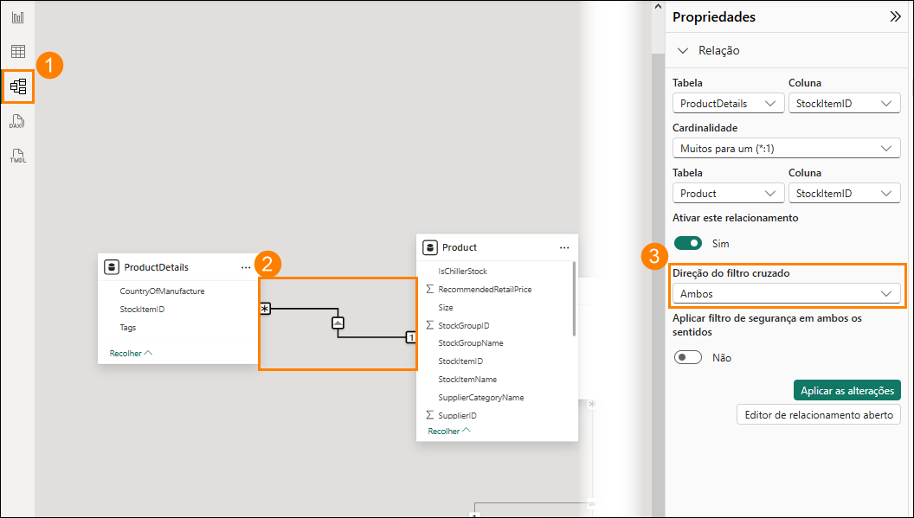

    **ℹ️ Importante**

    Como prática recomendada, você deve evitar ativar a filtragem em ambas as direções quando possível. Em algumas situações, isso pode causar ambiguidade nos resultados, bem como problemas de desempenho. Conforme mencionado nesta seção, uma alternativa é criar medidas DAX que forcem manualmente a filtragem para essa medida específica. Há outras alternativas também, que não serão discutidas neste curso.

6. Agora podemos fazer a pergunta novamente na **Exibição de Relatório** e notar os resultados aprimorados! Abra a experiência de chat do Copilot Power BI novamente e faça a seguinte pergunta: **Show total sales by product tag**.

    

    Se lhe pedirem esclarecimentos, peça a **Medida Sales**.

    

7. Resultados corretos:

    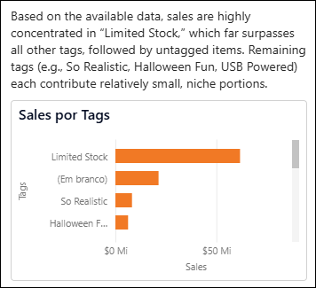

    *Se você obtiver um visual diferente, crie um novo prompt e peça um **Gráfico de Barras***.

    

    Resultados Anteriores:

    

    A modelagem de dados sempre foi um dos aspectos mais importantes, se não o mais importante do Power BI. Um modelo de dados bem definido e bem pensado torna a criação de relatórios, a escrita de DAX, a implementação de segurança e o suporte ao Copilot mais fáceis e eficazes.

## Tarefa 2: Renomear colunas, tabelas, medidas

1. Ao longo do laboratório anterior, encontramos problemas em relação ao Copilot usando colunas, tabelas e até medidas que não prevíamos. Esses desafios são esperados em nossos modelos de dados crescentes e, para preparar melhor nossos dados para a IA, precisamos fazer ajustes de nomenclatura.

2. Vamos começar renomeando as tabelas apropriadamente. Clique na Tabela **PO** e selecione **Renomear**. Ajuste a **tabela PO** para **Purchase Orders**.

    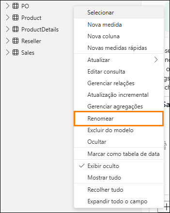

    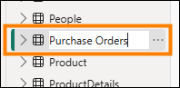

3. Em seguida, vamos renomear as colunas usando o mesmo processo. Comece expandindo a tabela **"Reseller"**.

    

4. Em seguida, clique duas vezes ou clique com o botão direito do mouse na coluna **SPName** e renomeie-a para **State.**

    

    

5. Continue com as alterações de nomes da seguinte maneira:

    Renomeie **‘Reseller’[CountryName]** para **Country**

    Na tabela **Sales**, renomeie a Medida **MoM Sales Change** para **Month over Month Sales Change**

    Na Tabela **Sales**, renomeie a Medida **Sales YoY%** para **Sales Year over Year %**

    Na tabela **Purchase Orders**, renomeie a Medida **Spend** para **Total Purchases**

    **ℹ️ Importante**

    Nomes claros e descritivos para tabelas e colunas fazem uma grande diferença. O Copilot interpreta os prompts com base na estrutura do modelo, quanto mais intuitiva for a nomenclatura, melhor será a geração de DAX, visuais e insights precisos. Renomeie cuidadosamente para melhorar a compreensão do Copilot e sua própria produtividade.

## Tarefa 3: Descrições

1. Agora vamos preparar ainda mais o modelo de dados adicionando Descrições. As descrições podem ser adicionadas a Tabelas, Colunas e Medidas no Modo de Exibição do Modelo.. Essas descrições ajudarão o Copilot a responder às solicitações do usuário. As descrições da tabela funcionam como uma passagem de bastidores para o Copilot, dando-lhe o contexto necessário para gerar insights precisos e relevantes, resumos e até mesmo medidas DAX. Para começar, vamos partir da **exibição Modelo**.

2. Selecione a tabela **Purchase Orders**. Na área **Propriedades**, você encontrará a área **Descrição**, em que criaremos a nossa descrição para ajudar o Copilot. Aqui estão algumas dicas de práticas recomendadas:

    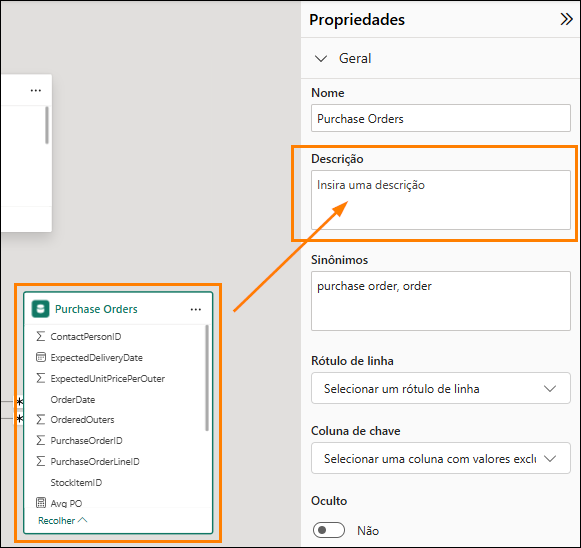

    ### Práticas recomendadas para descrições de tabela

    **Comece com a finalidade:** o que a tabela representa em termos comerciais?

    **Inclua o Contexto de Negócios:** explique como a tabela oferece suporte a relatórios ou à tomada de decisões.

    **Mencione a granularidade:** é transacional, diária, agregada etc.?

    **Destaque as principais colunas:** especialmente aquelas usadas em relacionamentos ou cálculos.

    **Descreva os casos de uso comuns:** a que tipos de perguntas ou elementos visuais esta tabela dá suporte.

    **Observe os relacionamentos:** mencione como ele se conecta a outras tabelas no modelo.

    **ℹ️ Importante**

    **Descrições bem escritas ajudam o Copilot a entender a finalidade e o contexto dos dados.** Use descrições para esclarecer o que uma tabela ou coluna representa, especialmente quando os nomes por si só não são suficientes. O Copilot usa essas dicas para gerar respostas, DAX e visuais mais relevantes. Pense nas descrições como sua chance de orientar o Copilot, e seus usuários, em direção a insights melhores.

3. Coloque esta descrição extensa, mas precisa, no campo:

    *This Purchase Orders table captures individual line items from purchase orders submitted within the organization. Each row represents a specific product ordered, including the quantity requested, the date of the order, and the employee who initiated the request. It supports analysis of procurement trends, supplier demand, and employee purchasing behavior. Key columns include ProductID, QuantityOrdered, OrderDate, and EmployeeID. This table links to Products, Employees, and PurchaseOrders tables to enable detailed reporting across procurement workflows.*

    Isso ajudará muito o Copilot a criar respostas melhores, especialmente referentes à tabela **Purchase Orders**. Vamos continuar criando descrições melhores para algumas Colunas. Selecione a coluna **Order Date** da tabela **Purchase Orders** e adicione uma descrição semelhante:

    ### Práticas recomendadas para descrições de coluna em modelos semânticos

    **Comece com o Significado de Negócios:** descreva o que a coluna representa em termos comerciais.

    **Esclareça Unidades, Formato ou Escala:** se for numérico, baseado em data ou categórico, explique como ele está estruturado.

    **Mencione Casos de Uso Comuns:** ajude o Copilot a entender como essa coluna é normalmente usada em análises ou relatórios. Exemplo: o valor de Revenue – Total sales para cada transação; utilizado em análise de rentabilidade e tendência.

    **Evite a Redundância:** não repita o que é óbvio do nome da coluna, a menos que isso adicione clareza. Em vez disso, enriqueça-o com contexto. Por exemplo, para EmployeeID, você pode adicionar a seguinte descrição: Unique identifier for the employee who submitted the order.

    **Use um Tom Consistente:** mantenha as descrições concisas, informativas e consistentes em todo o modelo. Pense nisso como escrever dicas de ferramentas para um analista curioso.

4. Selecione a tabela **Purchase Orders** e então clique em **OrderDate**. Insira a seguinte descrição:

    **The calendar date when the purchase order was submitted by an employee.**

    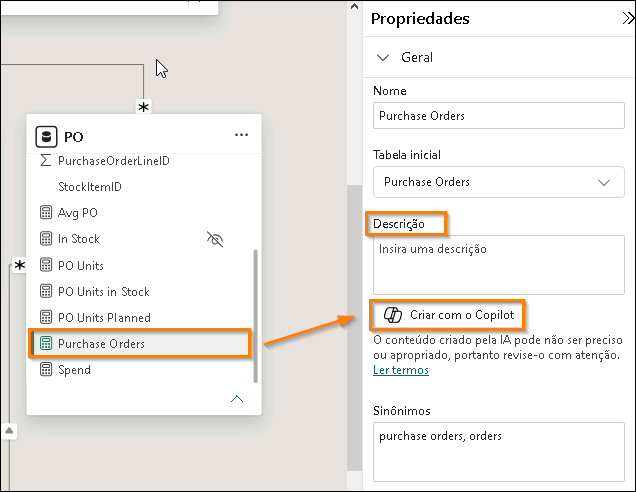

5. Agora que ajustamos as descrições de Tabela e Coluna **Descrições**, vamos agora adicionar uma descrição a uma Medida. Desta vez, porém, utilizaremos o Copilot para ajudar a criar a Descrição. Comece selecionando a Medida **Purchase Orders**. A partir daí, vamos selecionar **Criar com o Copilot**.

    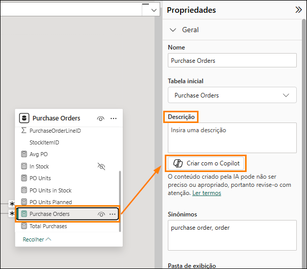

6. Observe que a descrição criada pelo Copilot está pronta para revisão. Essa resposta pode variar, mas funcionará bem para ajudar a verificar e detalhar nossa descrição. Você pode pressionar **Tentar novamente**, mas quando estiver pronto(a), clique em **Manter**.

    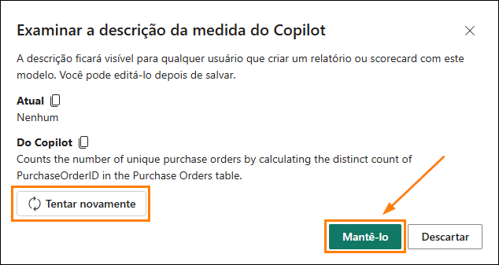

    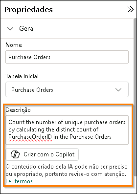

    Nesta seção, você aprendeu como adicionar descrições a tabelas, colunas e medidas. Em um modelo semântico real, você expandiria o que fizemos aqui para o resto de suas tabelas e quaisquer colunas e medidas aplicáveis. Agora, você melhorou muito a capacidade do Copilot de trabalhar com os dados e aprimorar todas as respostas futuras.

## Tarefa 4: Categorias de Dados

Adicionar categorias de dados a colunas no Power BI é importante para o Copilot, especialmente quando você trabalha com modelos semânticos que incluem dados geográficos, da Web ou de imagem. Essas categorias funcionam como marcas de metadados que ajudam o Copilot (e os visuais) a interpretar a finalidade da coluna para além do nome ou do tipo de dados.

1. Navegue até a **exibição Tabela** e selecione a tabela Reseller. Comece selecionando a coluna **State** na tabela **Reseller**.

    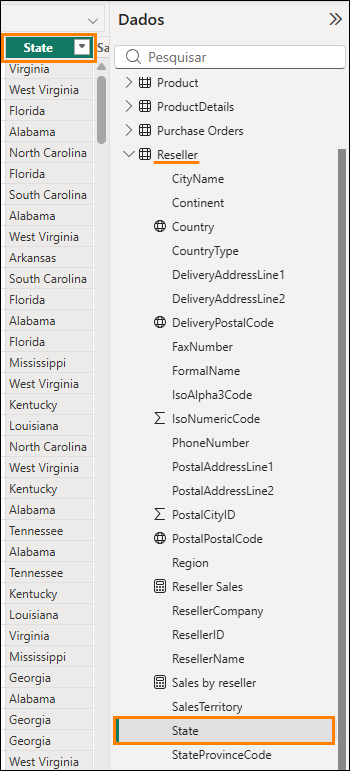

2. Quando a coluna **State** estiver selecionada, você verá que um novo menu da faixa de opções apareceu na parte superior do relatório do Power BI, chamado **Ferramentas de Coluna**.

    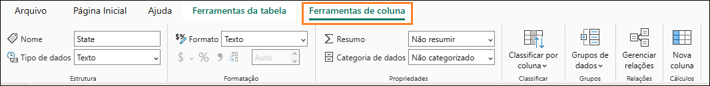

3. Expanda a área **Categoria de Dados** e altere a Categoria de dados de Não categorizado para **State ou Province**.

    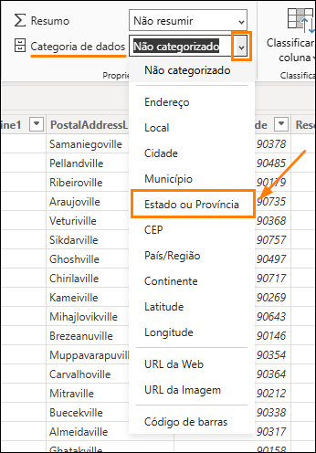

4. Continue adicionando Categorias de Dados para as Colunas restantes abaixo:

    | **Nome da Tabela** | **Nome da Coluna** | **Categoria de Dados** |
    |--------------------|--------------------|------------------------|
    | Reseller | Country | Country/Region |
    | Reseller | DeliveryPostalCode | Postal code |
    | Reseller | PostalPostalCode | Postal code |
    | Reseller | Website URL | Web URL |

    **ℹ️ Importante**

    **A definição de categorias de dados ajuda o Copilot a entender como tratar seus dados.** Seja geografia, URLs ou imagens, atribuir a categoria certa fornece contexto ao Copilot para gerar visuais, filtros e insights mais inteligentes. Por exemplo, marcar uma coluna como "City" permite que o Copilot mapeie-a instantaneamente. É uma etapa pequena que desbloqueia um grande valor.

## Tarefa 5: Resumo

Nesta seção, aprenderemos sobre o resumo padrão no Power BI como ele pode afetar as respostas do Copilot. Esta não é uma adição nova no Power BI, mas crucial para o Copilot.

1. Abra o Copilot, na **Exibição de Relatório** e escreva o seguinte prompt: **What is customer age by state?**

    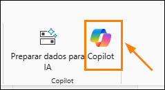

    

2. Exiba os resultados e observe que pode haver um resultado estranho ocorrendo. Passe o mouse sobre as barras de dados de WA, NY ou outros Estados e você verá que a Soma de Age Idade é retornada! Você provavelmente espera ver a média aqui, mas como há um resumo padrão de SOMA na coluna Age, o Copilot executa um resumo.

    O Copilot também pode pedir esclarecimentos como na imagem abaixo. De qualquer forma, podemos obter a Média todas as vezes ajustando o Resumo e evitando questionamentos adicionais..

    

    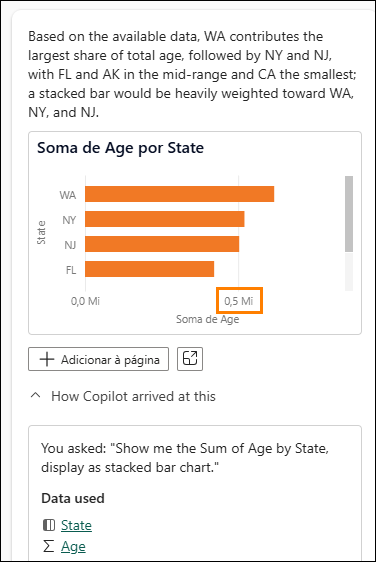

3. Quando passa o mouse sobre Age, você pode verificar e confirmar se o Copilot executou uma SOMA na coluna.

    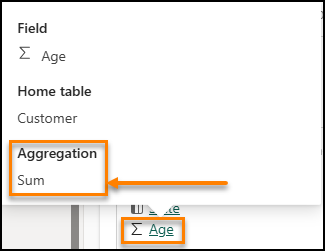

4. Poderíamos escrever um prompt melhor, perguntando especificamente para a idade média, e isso funcionaria. No entanto, a melhor opção é melhorar o modelo de dados sempre que possível, portanto, ajustaremos a propriedade **Default Summarization**.

    **ℹ️ Importante**

    **O resumo padrão informa ao Copilot como tratar suas colunas em elementos visuais e cálculos.** Seja "Não resumir", "Soma" ou "Média", definir isso corretamente ajuda o Copilot a gerar gráficos e DAX mais precisos. Por exemplo, marque IDs ou nomes como "Não resumir" para evitar totais enganosos. É uma maneira rápida de orientar o Copilot para obter insights significativos.

5. No prompt do Copilot, digite: **What is customer age average by state**.

    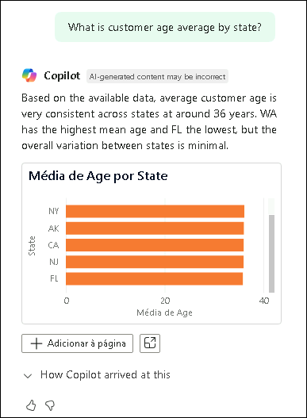

6. Vamos ajustar o **Resumo Padrão**. Selecione a coluna **Age** da tabela 'Customer' para mostrar Ferramentas de Coluna. Encontre a área **Resumo** e ajuste Age para **Média**.

    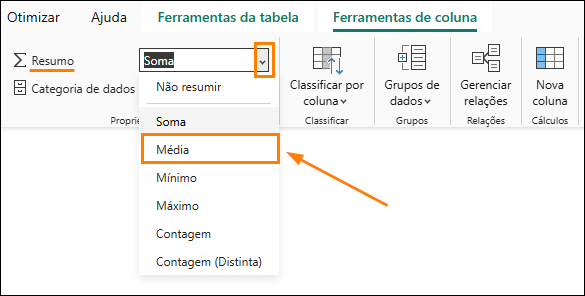

7. Usando o chat do Copilot, vamos fazer a pergunta novamente: **What is customer age by state?**

    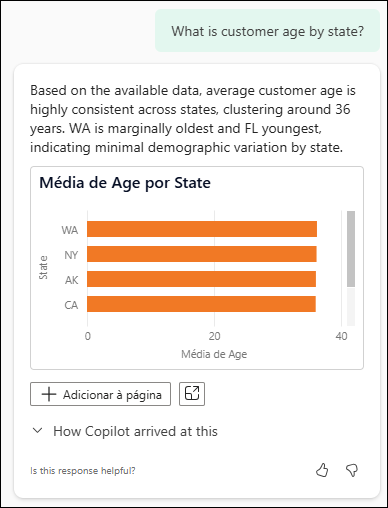

    Perfeito! Este é o resultado pretendido e permitirá que os usuários façam suas perguntas de forma mais casual e permitirá variações esperadas nas perguntas do usuário. É igualmente importante desativar o resumo padrão nas colunas que são numéricas, mas não devem ser resumidas. Colunas como Year, Quarter e Month number, por exemplo, não devem ser resumidas!

## Tarefa 6: Propriedade Classificar por Coluna

1. A propriedade Classificar por Coluna, como o resumo padrão, não é novidade no Power BI, mas a configuração correta dessa propriedade pode ajudar o Copilot a retornar os resultados em uma ordem que pode alinhar com o que você esperaria ver. Por exemplo, se você retornar vendas por mês, ele classificará o visual por padrão pelo mês de venda mais alta para o mês de venda mais baixa. Vamos testar isso!

2. Redefina o Copilot Chat, se ainda não fez isso, pressionando a área **Limpar Chat**.

    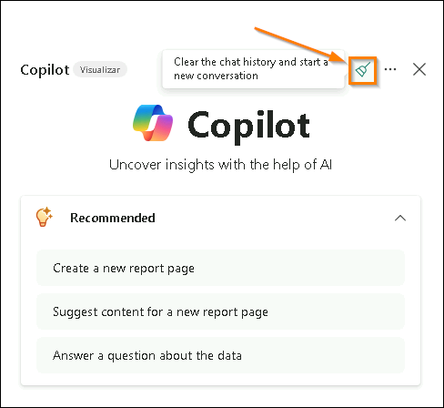

3. Agora digite o seguinte prompt: **Show total sales by month as a column chart**.

    

4. Os resultados estão corretos, mas classificados de uma maneira que não é propícia à nossa exibição típica no Calendário Gregoriano (janeiro, fevereiro, março... dezembro). Os resultados são retornados em ordem alfabética, ou, neste caso, classificados pelas vendas mais altas até as vendas mais baixas.

    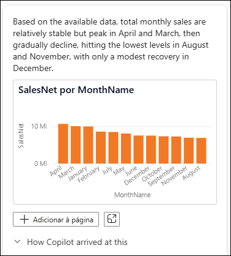

    **ℹ️ Importante**

    **Use "Classificar por Coluna" para controlar como o Copilot apresenta seus dados.** Essa configuração ajuda o Copilot a exibir os dados para que categorias como meses ou rótulos personalizados apareçam na ordem esperada em visuais e resumos. Por exemplo, classificar "Nome do Mês" pelo "Número do mês" ajuda o Copilot a criar gráficos precisos baseados no tempo. É uma correção simples que evita resultados confusos.

5. Precisaremos ajustar como a coluna **MonthName** está classificando na área **Classificar por Coluna** na área **Ferramentas de Coluna**. Selecione a Coluna MonthName na Tabela **Date**.

6. Expanda Classificar por coluna e ajuste a classificação para ser por Month:

    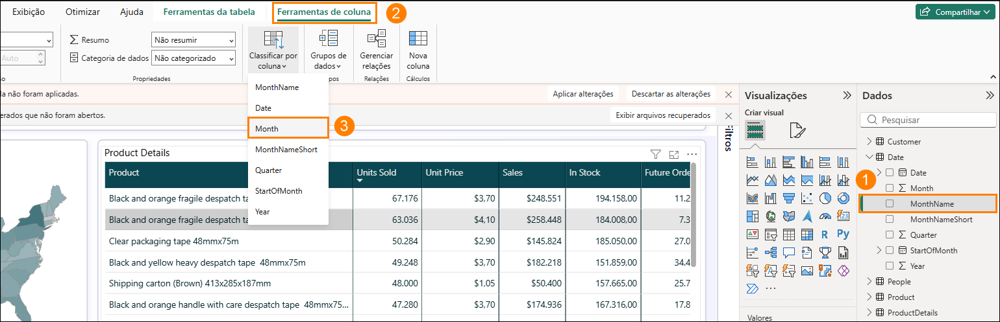

7. Faça a mesma pergunta ao chat do Copilot: **Show total sales by month** e agora você obtém os resultados, conforme o esperado.

    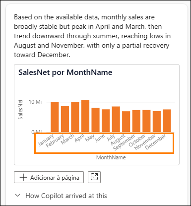

## Tarefa 7: Esquema Linguístico: Sinônimos

O **esquema linguístico** é a chave para liberar todo o potencial do Copilot como parceiro de análise de linguagem natural. Pense nisso como dar ao Copilot um guia do tradutor para seu modelo de dados. Sem ele, o Copilot está adivinhando; com ele, o Copilot se torna muito mais fluente e familiarizado com seus dados.

**O que é o Esquema Linguístico?**

O esquema linguístico é composto por metadados que mapeiam seu modelo semântico para a linguagem natural. Ele ajuda o Copilot a entender:

- O que significam as tabelas e colunas

- Como eles se relacionam com os conceitos de negócios

- Quais sinônimos, frases e tipos de perguntas os usuários podem usar ao interagir com os dados

Como exemplo, em vez de apenas ler nomes de colunas, o Copilot entende que:

- “Revenue” = TotalSales

- “Orders placed” = PurchaseOrderCount

- “Employee performance” = SalesByEmployee

Isso significa o Copilot pode responder a perguntas como:

- “Which region had the highest revenue last quarter?”

- "Mostre os funcionários com melhor desempenho por volume de vendas"

Sem um esquema linguístico, o Copilot pode interpretar mal termos vagos ou sugerir elementos visuais irrelevantes. Com ele, você obtém:

- Melhores sugestões de DAX

- Recomendações visuais mais inteligentes

- Resumos e insights mais precisos

**Dá suporte a sinônimos e à linguagem natural**

Você pode definir sinônimos como:

- “PO” = “Ordem de Compra”

- “Rep” = “Representante de Vendas”

- “Qty” = “Quantidade Encomendada”

1. Vamos analisar a interface **Esquema Linguístico**. Comece selecionando a **Exibição de Modelo** ou, se estiver no modo de exibição de relatório, a faixa de opções de modelagem. Em seguida, navegue até a área de **configuração de perguntas e respostas**.

    

2. Há um menu impressionante para ajudar as perguntas e respostas usadas pelo modelo de dados do Copilot a entender melhor as pessoas. O menu principal tem muitas áreas como introdução.

    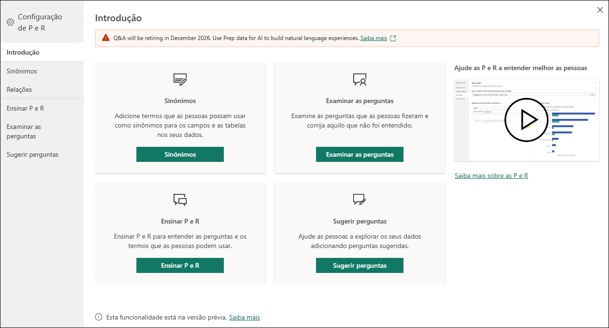

3. Vamos navegar até o primeiro menu, o menu de sinônimos.

    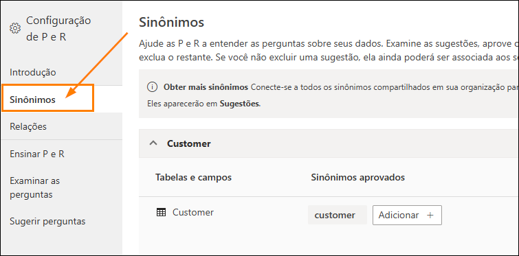

4. Sinônimos mais precisos ajudarão o Copilot a entender as diferentes maneiras pelas quais o usuário pode formular suas perguntas. Você também pode ajustar a tabela que está navegando para chegar à coluna correta. Pressionando o ícone de divisa.

    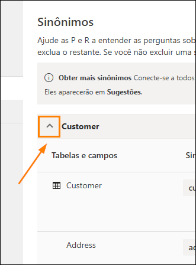

    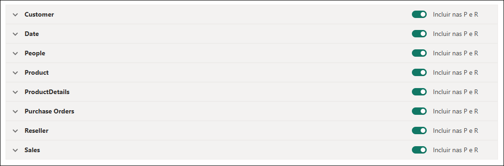

5. Vamos ajudar o Copilot a sair ajustando os sinônimos de **Reseller** para que sejam mais específicos. Certifique-se de que a tabela **Reseller** está expandida e se você pode ver todos os sinônimos atuais associados à coluna **ResellerID** e Sugestões.

6. Na Fabrikam, os revendedores geralmente são chamados de ***Fabrikam Friends*** e……..Vamos adicioná-los como sinônimos para permitir que nossos funcionários façam perguntas em nosso próprio idioma da Fabrikam. Selecione **Adicionar** no **comprador** e insira o sinônimo.

    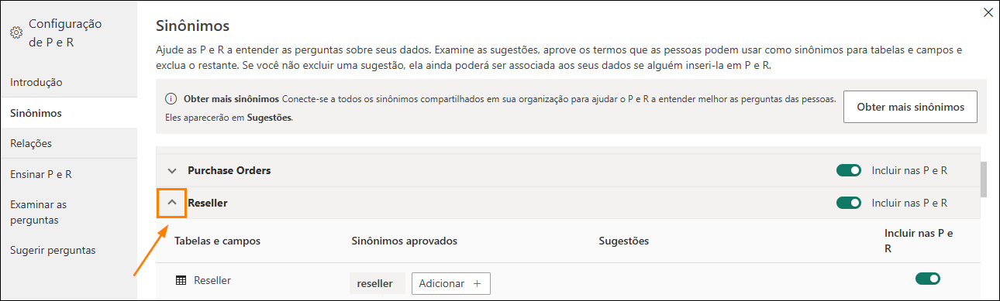

7. Adicione ***Fabrikam Friends*** usando o botão Adicionar +.

    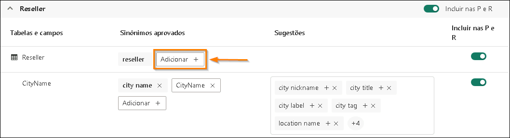

    

8. Você notará que o Copilot avaliará a adição e adicionará adequadamente outras Sugestões dinamicamente.

    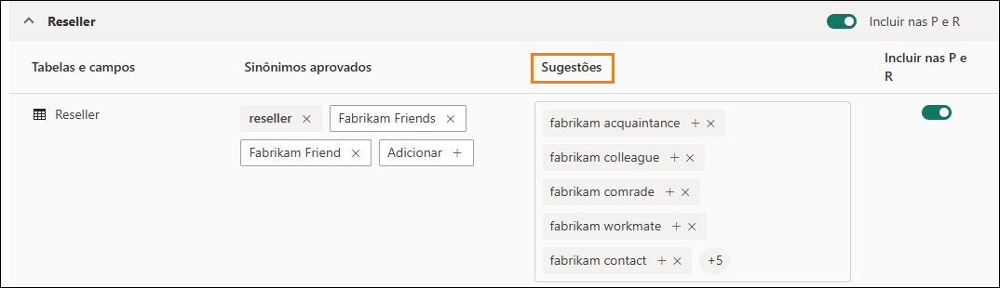

9. Vamos agora adicionar outro Sinônimo para a Tabela Reseller usando uma das sugestões. Clique em uma Sugestão de sua escolha, como ***Fabrikam acquaintance***

    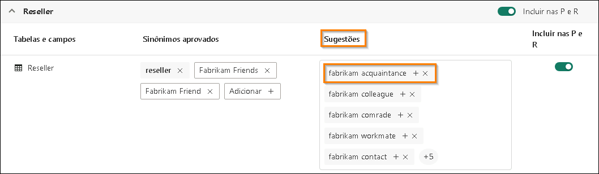

    O processo de adição de sinônimos é um processo muito envolvido que é melhorado ao longo do tempo. Sinta-se livre para explorar outras tabelas e colunas e adicionar outros sinônimos em seu arquivo do Power BI Desktop!

10. Excelente! Vejamos agora os **Relações**. Navegue no menu de configuração de perguntas e respostas.

    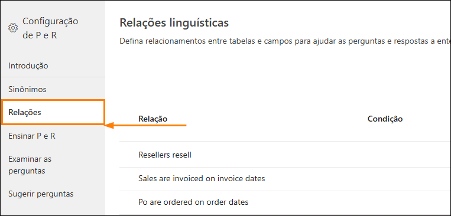

    As Relações linguísticas definem relações entre tabelas e campos para ajudar as perguntas e respostas a entender perguntas sobre seus dados. É semelhante à forma como as tabelas são conectadas no seu modelo de dados, mas elas são expressas de uma forma que o Copilot possa compreender linguisticamente.

    Por exemplo, as relações podem ser uadas para resolver ambiguidades. Se o modelo tiver vários campos de data em várias tabelas, você poderá adicionar relações nas datas que ajudarão o Copilot a descobrir qual usar com base nas conexões de contexto e tabela.

    Para adicionar novas relações, você começa clicando na caixa + Novo relacionamento, como visto na captura de tela abaixo.

    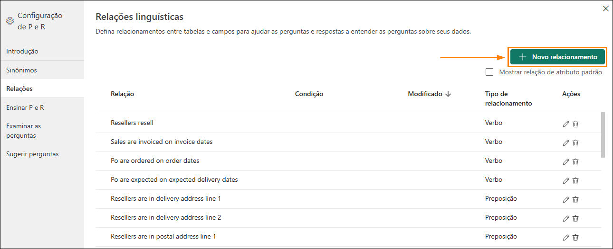

11. A partir daqui, você pode criar muitas relações linguísticas diferentes. As opções atuais incluem Verbos, Adjetivos, Substantivos, Preposições, Nomes e Associação. Consulte a captura de tela das opções disponíveis abaixo com exemplos:

    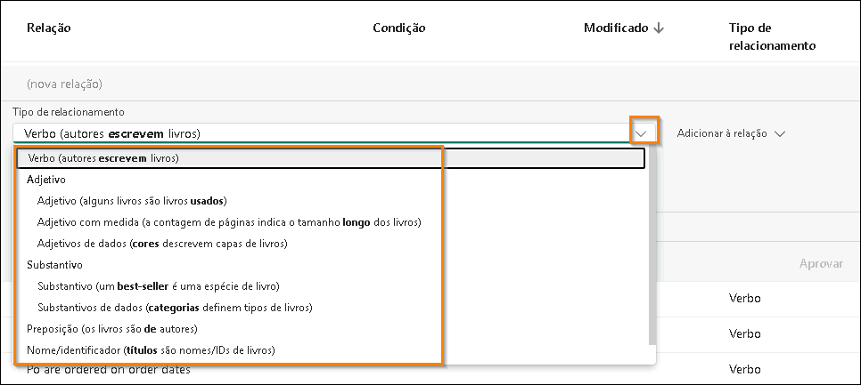

12. Para este laboratório, você não criará nenhuma relação no modelo. Semelhante à adição de sinônimos, este é um processo envolvido que exigirá atualização e manutenção, à medida que mais se aprende sobre como os usuários consultam seus dados com o Copilot e como o esquema linguístico pode ser usado para melhorar essa experiência!

    **ℹ️ Importante**

    **As relações no esquema linguístico definem como o Copilot compreende as conexões entre tabelas ao responder à linguagem natural.** Elas moldam como perguntas como "vendas por categoria de produto" ou "ordens por região" são interpretadas. Sem relações claras o Copilot pode ter dificuldades para vincular conceitos em tabelas. Defini-los corretamente garante conversas mais suaves e intuitivas.

13. Agora podemos visitar os elementos restantes para a configuração de Perguntas e Respostas. Vamos conferir **Ensinar P e R**, selecione a seção.

    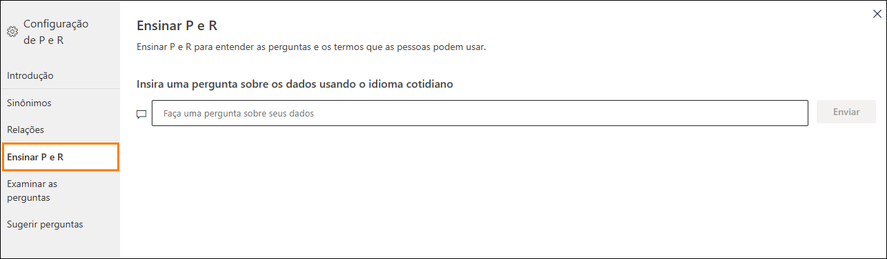

14. Aqui podemos ensinar P e R para entender as perguntas e os termos que as pessoas podem usar.

    Tente perguntar: **How many sales happen in january?**

    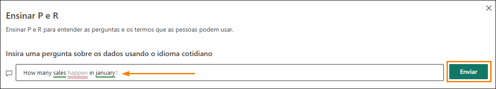

    Você verá que o Copilot está listando "happen" como um termo desconhecido. Isso permitirá que você se ajuste ainda mais para acomodar perguntas como essas.

    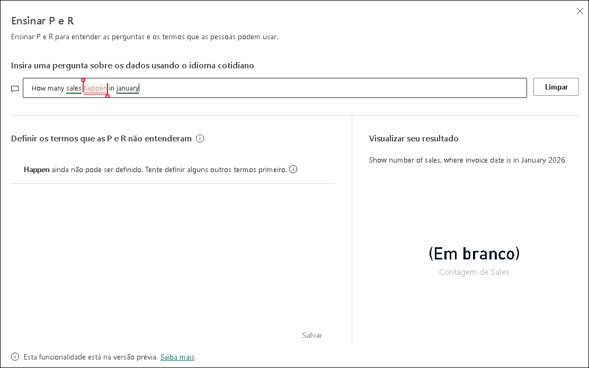

15. Você pode tentar novamente com outro prompt como, "What is the total sales for january 2022?" e receber resultados. Isso se torna uma ótima área de testes.

    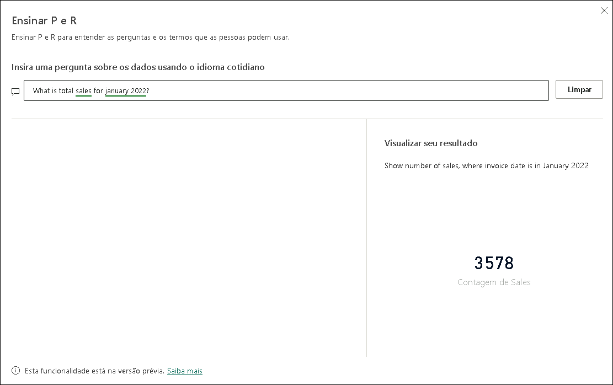

16. Você também pode ver o efeito dos Sinônimos e Relações no trabalho: **O que é vendas de Fabrikam Friends?**

    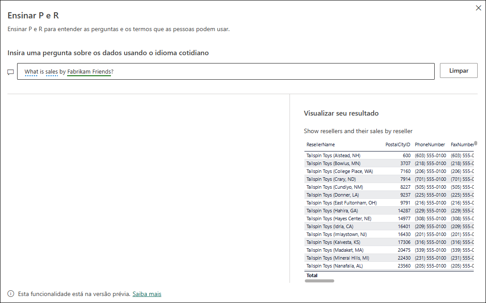

17. Em seguida, navegue até **Examinar as perguntas** Aqui, as perguntas que as pessoas fizeram no locatário podem ser ajustadas para correção futura.

    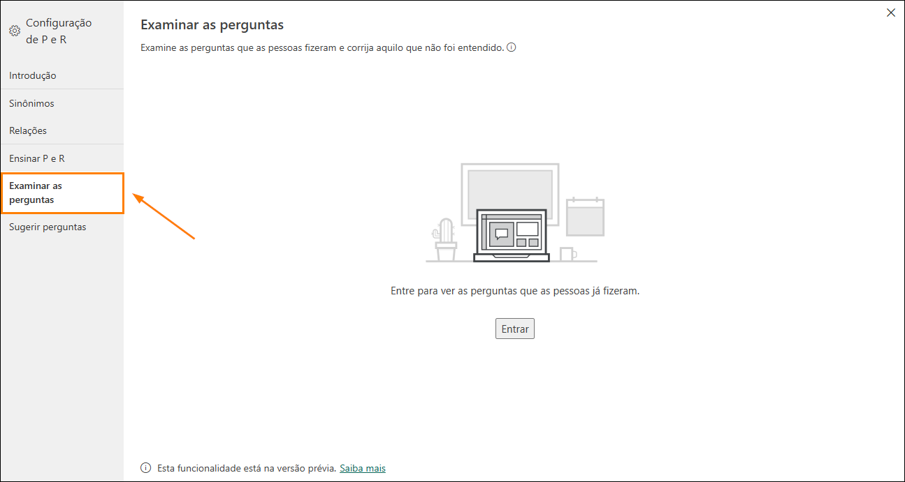

18. Por fim, navegue até **Sugerir perguntas**. Aqui você pode ajudar as pessoas a explorar os dados adicionando sugestões de perguntas.

    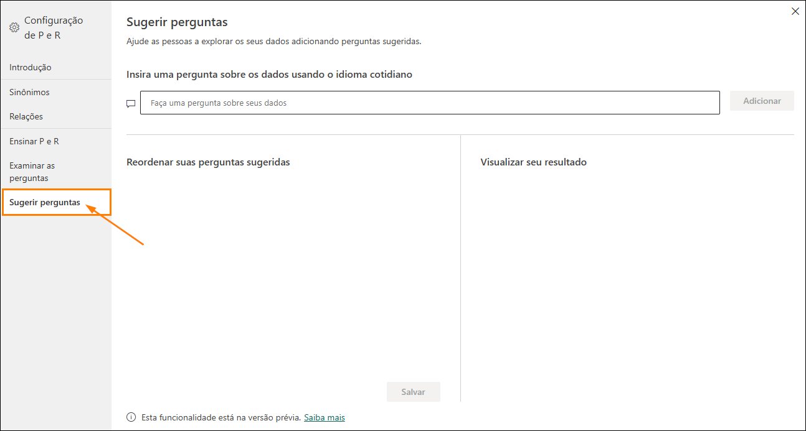

19. Queremos ajudar os usuários com isso, então vamos selecionar a Pergunta sobre sua caixa de dados e adicionar uma sugestão: **What is total sales by State?** Você pode pressionar enviar para ver uma visualização!

    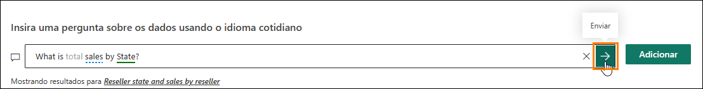

    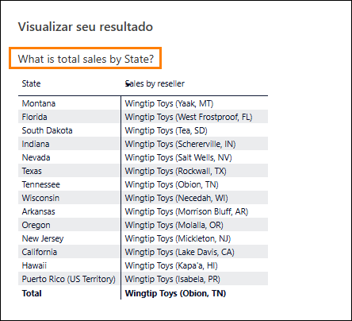

20. Salve a sugestão clicando em **Adicionar.**

    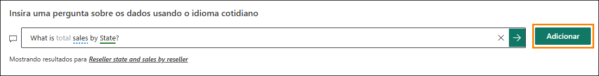

21. **Salve** seus resultados e você pode concluir o laboratório 2.

    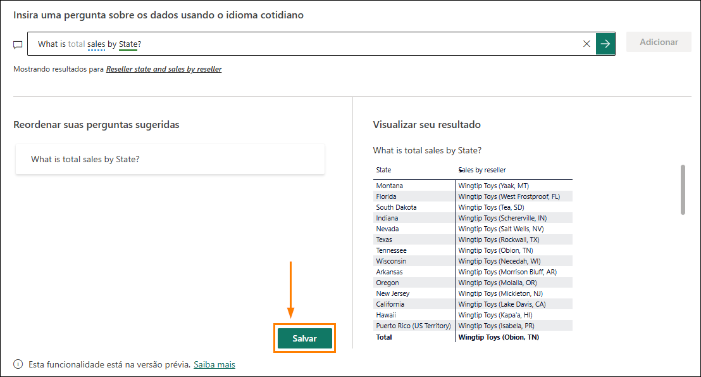

    Neste laboratório, você aprendeu sobre as práticas recomendadas de modelagem de dados para aprimorar o desempenho e a precisão das respostas em linguagem natural do Copilot para os modelos semânticos do Power BI.

    Veja aqui mais alguns recursos que ajudarão você com as próximas etapas do Microsoft Fabric.

    - Acesse todas as informações na [Documentação principal do Microsoft Fabric](https://learn.microsoft.com/en-us/fabric/)

    - Explore o Fabric por meio do [Tour Guiado](https://aka.ms/Fabric-GuidedTour)

    - Inscreva-se na [avaliação gratuita do Microsoft Fabric](https://aka.ms/try-fabric)

    - Visite o [site do Microsoft Fabric](https://aka.ms/microsoft-fabric)

    - Aprenda novas habilidades explorando os [módulos de Aprendizagem do Fabric](https://aka.ms/learn-fabric)

    - Leia o livro eletrônico [gratuito sobre como começar a usar o Fabric](https://aka.ms/fabric-get-started-ebook)

    - Participe da [comunidade do Fabric](https://aka.ms/fabric-community) para postar suas perguntas, compartilhar seus comentários e aprender com outras pessoas

    Leia a documentação técnica mais detalhada relevante para o Copilot:

    - [Visão geral do Copilot para Power BI - Power BI | Microsoft Learn](https://learn.microsoft.com/en-us/power-bi/create-reports/copilot-introduction)

    - [Experiência do Copilot Autônomo no Power BI (Versão Prévia) – Power BI | Microsoft Learn](https://learn.microsoft.com/en-us/power-bi/create-reports/copilot-chat-with-data-standalone)

    - [Configurações de administrador do Microsoft Fabric Copilot | Microsoft Learn](https://learn.microsoft.com/en-us/fabric/admin/service-admin-portal-copilot)

    - [Criação de agente de dados do Fabric (versão prévia) - saiba como criar um agente de dados do Fabric | Microsoft Learn](https://learn.microsoft.com/en-us/fabric/data-science/concept-data-agent)

    - [Práticas recomendadas para configurar agentes de dados - Microsoft Fabric | Microsoft Learn](https://learn.microsoft.com/en-us/fabric/data-science/data-agent-configuration-best-practices)

    - [Copilot para Microsoft Fabric e Power BI: perguntas frequentes - Microsoft Fabric | Microsoft Learn](https://learn.microsoft.com/en-us/fabric/fundamentals/copilot-faq-fabric)

    © 2026 Microsoft Corporation. Todos os direitos reservados.

    Ao usar esta demonstração/este laboratório, você concorda com os seguintes termos:

    A tecnologia/funcionalidade descrita nesta demonstração/neste laboratório é fornecida pela Microsoft Corporation para obter seus comentários e oferecer uma experiência de aprendizado. Você pode usar a demonstração/o laboratório somente para avaliar tais funcionalidades e recursos de tecnologia e fornecer comentários à Microsoft. Você não pode usá-los para nenhuma outra finalidade. Você não pode modificar, copiar, distribuir, transmitir, exibir, executar, reproduzir, publicar, licenciar, criar obras derivadas, transferir nem vender esta demonstração/este laboratório ou qualquer parte deles.

    A CÓPIA OU A REPRODUÇÃO DA DEMONSTRAÇÃO/DO LABORATÓRIO (OU DE QUALQUER PARTE DELES) EM QUALQUER OUTRO SERVIDOR OU LOCAL PARA REPRODUÇÃO OU REDISTRIBUIÇÃO ADICIONAL É EXPRESSAMENTE PROIBIDA.

    ESTA DEMONSTRAÇÃO/LABORATÓRIO FORNECE DETERMINADAS TECNOLOGIAS DE SOFTWARE/RECURSOS E FUNCIONALIDADE DO PRODUTO, INCLUINDO POTENCIAIS NOVOS RECURSOS E CONCEITOS, EM UM AMBIENTE SIMULADO SEM CONFIGURAÇÃO OU INSTALAÇÃO COMPLEXA PARA A FINALIDADE DESCRITA ACIMA. A TECNOLOGIA/CONCEITOS REPRESENTADOS NESTA DEMONSTRAÇÃO/LABORATÓRIO PODEM NÃO REPRESENTAR A FUNCIONALIDADE COMPLETA DO RECURSO E PODEM NÃO FUNCIONAR DA MESMA FORMA QUE UMA VERSÃO FINAL. NÓS TAMBÉM PODEMOS NÃO LANÇAR UMA VERSÃO FINAL DE TAIS RECURSOS OU CONCEITOS. SUA EXPERIÊNCIA COM O USO DE TAIS RECURSOS E FUNCIONALIDADES EM UM AMBIENTE FÍSICO TAMBÉM PODE SER DIFERENTE.

    **COMENTÁRIOS.** Caso você forneça comentários sobre os recursos de tecnologia, as funcionalidades e/ou os conceitos descritos nesta demonstração/neste laboratório à Microsoft, você concederá à Microsoft, sem encargos, o direito de usar, compartilhar e comercializar seus comentários de qualquer forma e para qualquer finalidade. Você também concede a terceiros, sem encargos, quaisquer direitos de patente necessários para que seus produtos, suas tecnologias e seus serviços usem ou interajam com partes específicas de um software ou um serviço da Microsoft que inclua os comentários. Você não fornecerá comentários que estejam sujeitos a uma licença que exija que a Microsoft licencie seu software ou sua documentação para terceiros em virtude da inclusão de seus comentários neles. Esses direitos continuarão em vigor após o término do contrato.

    A MICROSOFT CORPORATION SE ISENTA DE TODAS AS GARANTIAS E CONDIÇÕES COM RELAÇÃO A DEMONSTRAÇÃO/LABORATÓRIO, INCLUINDO TODAS AS GARANTIAS E CONDIÇÕES DE COMERCIALIZAÇÃO, SEJAM EXPRESSAS, IMPLÍCITAS OU ESTATUTÁRIAS, ADEQUAÇÃO A UM DETERMINADO FIM, TÍTULO E NÃO VIOLAÇÃO. A MICROSOFT NÃO DECLARA NEM GARANTE A PRECISÃO DOS RESULTADOS DERIVADOS DO USO DA DEMONSTRAÇÃO/DO LABORATÓRIO NEM A ADEQUAÇÃO DAS INFORMAÇÕES CONTIDAS NA DEMONSTRAÇÃO/NO LABORATÓRIO A QUALQUER FINALIDADE.

    **AVISO DE ISENÇÃO DE RESPONSABILIDADE**

    Esta demonstração/este laboratório contém apenas uma parte dos novos recursos e aprimoramentos do Microsoft Power BI. Alguns dos recursos podem ser alterados em versões futuras do produto. Nesta demonstração/neste laboratório, você aprenderá sobre alguns dos novos recursos, mas não todos.
