# Microsoft Fabric Chat with your Data in a Day - Laboratório 3

## Conteúdo

- Estrutura do documento
- Cenário/Declaração do problema
- Introdução
- Preparar dados para o Copilot
  - Tarefa 1: Simplificar o esquema de dados
  - Tarefa 2: Adicionar instruções de IA
  - Tarefa 3: Criar respostas verificadas
  - Tarefa 4: Experimente você mesmo
- Conclusão
- Referências

# Estrutura do documento

O laboratório inclui as etapas a serem seguidas pelo usuário juntamente com as capturas de tela associadas que fornecem auxílio visual. Em cada captura de tela, as seções estão destacadas com caixas laranjas para indicar as áreas nas quais o usuário deve se concentrar.

# Cenário/Declaração do problema

Recentemente, você habilitou o Copilot no Microsoft Fabric para ajudar os usuários a interagir com os dados de forma mais intuitiva. No entanto, o uso inicial revelou que o Copilot às vezes retorna respostas imprecisas ou confusas. Esses problemas decorrem de modelos de dados excessivamente complexos, terminologia ambígua e configurações pouco claras dentro da camada semântica.

Para melhorar a compreensão e os resultados do Copilot, você aprendeu que é possível preparar seu modelo de dados usando o recurso Preparar dadospara IA no Power BI. Isso inclui simplificar o esquema, adicionar instruções de IA e criar respostas verificadas para orientar o Copilot em direção a respostas mais precisas e com reconhecimento de contexto.

**Desafios atuais**

- Reduzir a ambiguidade nas respostas do Copilot causada por medidas e terminologia pouco claras.

- Garantir que o Copilot compreenda as configurações específicas do negócio (por exemplo, mais vendido versus maior volume de vendas).

- Fornecer respostas verificadas a perguntas comuns para melhorar a consistência e a confiabilidade.

- Limitar o acesso do Copilot a elementos de dados desnecessários ou enganosos.

# Introdução

Até agora, você aprendeu como avaliar um modelo semântico para prontidão do Copilot, bem como as práticas recomendadas para o modelo semântico. Agora, você dará o próximo passo preparando esses modelos para uso com o Copilot. Neste laboratório, você usará o recurso Preparar dados para IA para simplificar seu esquema, adicionar instruções de IA e criar respostas verificadas, o que ajuda o Copilot a fornecer insights mais precisos e relevantes para os negócios.

Ao final deste laboratório, você terá aprendido:

- Como simplificar um esquema de dados para guiar o comportamento do Copilot

- Como adicionar instruções de IA para esclarecer a terminologia de negócios

- Como criar respostas verificadas para melhorar a precisão do Copilot

# Preparar dados para o Copilot

Nesta seção, você preparará um modelo de dados para uso com o Copilot. Isso é necessário porque o Copilot às vezes dá respostas erradas ou confusas porque o modelo de dados contém medidas extras, configurações pouco claras ou terminologia ambígua. Portanto, temos o botão **Preparar dados para IA** na faixa de opções Página Inicial no Power BI.

## Tarefa 1: Simplificar o esquema de dados

1. Em seus arquivos de classe, abra o arquivo PBIX chamado **CDIAD – Lab 03 - Start**.

    

2. Clique no botão Copilot na faixa de opções **Página Inicial**.

    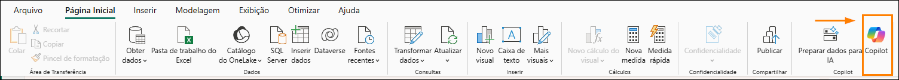

3. Pergunte ao Copilot **What reseller has the highest sales?** Pressione **Enter** ou clique na **seta.**

    

4. É possível ver os resultados na captura de tela abaixo. Estes não são os resultados que esperávamos. O Copilot usou a medida [Reseller Sales], mas queremos que o Copilot use [Sales by Reseller].

    **Potenciais Opções:**

    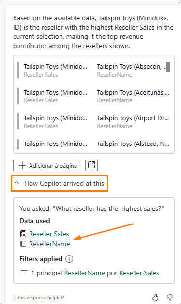

    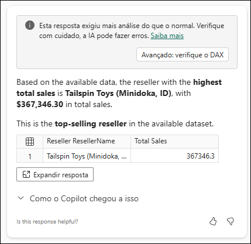

    

    Isso também destaca mais filtros ocultos! Vamos ajustar isso mais tarde.

5. Aproveitaremos o recurso Preparar dados para IA no Power BI Desktop para ocultar a medida [Reseller Sales] do Copilot. Na faixa de opções Página Inicial, selecione **Preparar dados para IA**

    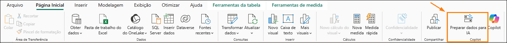

6. A nova janela é aberta na página **Introdução**.

    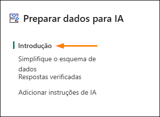

7. Clique em **Simplifique o esquema de dados**.

    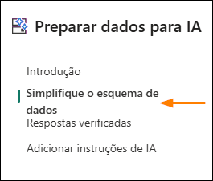

8. Expanda a tabela **Resellers** clicando no ícone **>**. A medida Reseller Sales pode criar resultados ambíguos com o Copilot, você a removerá do esquema para que o Copilot não a inclua durante a análise! A exclusão dessa medida do Copilot criará uma melhor consistência nos resultados. Clique na caixa de seleção para desmarcar a medida **R**eseller Sales e, em seguida, clique em Aplicar. *Veja a captura de tela abaixo.*

    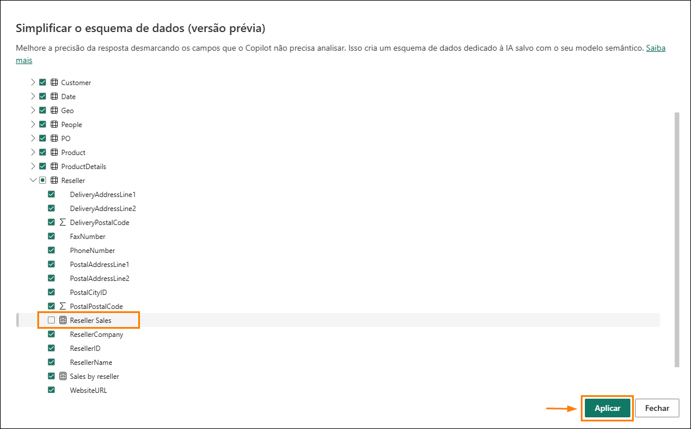

9. Clique em **Fechar**.

    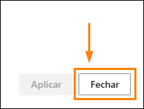

    **ℹ️ Importante**

    Como prática recomendada, descreva detalhadamente com os nomes de suas tabelas, colunas e medidas. Isso ajudará o Copilot a criar resultados mais consistentes e precisos ao responder perguntas. Por exemplo, nesse modelo temos uma medida chamada [Reseller Sales] e outra medida chamada [Sales by Reseller]. Isso é confuso para o Copilot e resultará em respostas que podem ser inconsistentes. Para este laboratório, removemos essa medida do esquema, em outros cenários você pode querer renomear a medida!

10. Clique no botão Copilot na faixa de opções **Página Inicial** para fechar e reabrir o Copilot.

    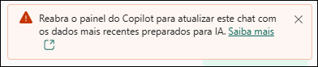

    

11. Pergunte ao Copilot **What reseller has the highest sales?** Pressione **Enter** ou clique na **seta.**

    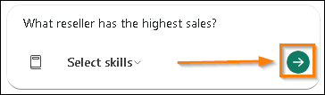

12. Depois de obter uma resposta do Copilot, clique na seção **How Copilot arrived at this**.

    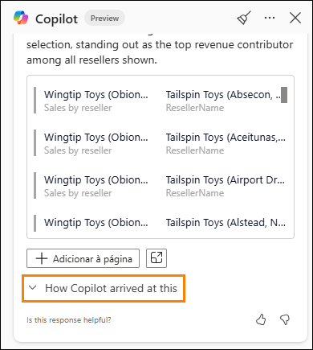

13. Desta vez, você deve ver que a medida utilizada para encontrar essa resposta foi o **Sales by reseller ou até SalesNet!** Isso é perfeito, o Copilot foi treinado para evitar essa Medida provável, mas não desejada. Você pode ver um resultado diferente aqui devido à natureza não determinista do Copilot. É aqui que você pode continuar a preparar seus dados para a IA criar uma experiência mais consistente!

    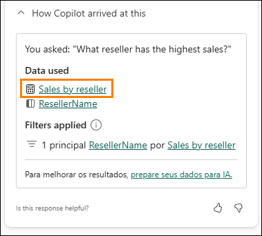

    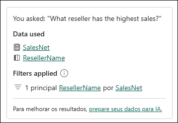

14. Como prática recomendada, é uma boa ideia ocultar tabelas, colunas e medidas que possam confundir o Copilot.

    **ℹ️ Importante**

    É comum no Power BI criar medidas auxiliares ou medidas pontuais que são usadas para fins muito específicos dentro de um contexto de filtro muito específico. Se você sabe que tem muitas medidas que deseja ocultar do Copilot, talvez valha a pena criar uma tabela especificamente para armazenar medidas que deseja ocultar. Isso tornará o processo de atualização do esquema muito mais simples. No momento, não há suporte para ocultar uma pasta de medidas.

15. Também nos deparamos com casos em que o State da tabela Customer retornou em vez de State da tabela Reseller. A tabela Customer não deve ser usada nesse contexto e está lá apenas para cenários muito específicos. Como essa tabela pode confundir o Copilot, vamos ocultá-la.

16. Clique em **Preparar dados para IA** na sua faixa de opções página inicial.

17. Selecione **Simplifique o Esquema de Dados** na barra de navegação esquerda.

18. Desmarque Customer. Ao desmarcar a tabela Customer, a tabela ainda existirá no seu modelo semântico para quaisquer relatórios, visuais ou cálculos DAX que você precise criar. No entanto, ele será ignorado pelo Copilot durante a análise. Certifique-se de **Aplicar** e **Fechar**.

    

    

## Tarefa 2: Adicionar instruções de IA

Adicionar instruções de IA é uma etapa muito importante de preparar seus dados para IA. Quando adiciona instruções de IA bem definidas, você ajuda o Copilot a compreender seu modelo semântico mais profundamente, incorporando o contexto de negócios, a terminologia e as prioridades analíticas diretamente no modelo. Isso torna o Copilot mais inteligente, rápido e alinhado com sua intenção ao gerar insights, responder a perguntas ou criar visuais.

Neste laboratório, você usará as Instruções de IA para ajudar a definir o que é retornado quando o Copilot é questionado sobre itens mais vendidos.

1. Abra o Copilot e faça a seguinte pergunta: **What are the top 5 best-selling products.**

    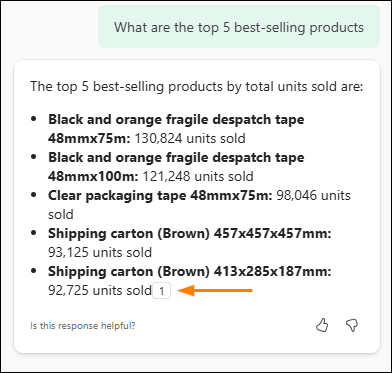

2. Se você obteve o mesmo resultado acima, clique na referência para abrir o visual de onde esses resultados vieram.

    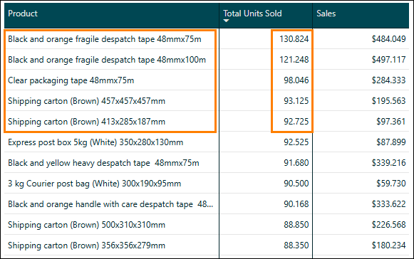

3. Esse resultado parece correto, e pode muito bem estar correto. No entanto, o que determina um produto "*mais vendido*" versus um produto que vende bem? É quantidade, quantidade vendida, maior margem de lucro ou algum outro critério?

4. Por enquanto, queremos que o Copilot peça clareza para que os resultados esperados e corretos sejam retornados aos nossos usuários finais. Clique no botão **Preparar dados para IA** novamente.

    

5. Navegue até **Adicionar instruções de IA**.

    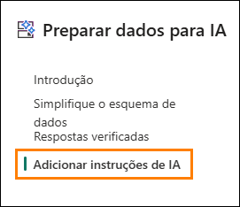

6. Adicione uma instrução para que o Copilot esclareça com o usuário qual definição ele pretende cada vez que solicitar **recordista de vendas, com maior volume de vendas ou o mais vendido**.

7. Digite:

    ***If asked about "highest" or ”most” or "best-selling" product, first clarify if the user wants product by unit sold or product by total sales value.*** Em seguida, clique em **Aplicar** e depois em **Fechar**.

    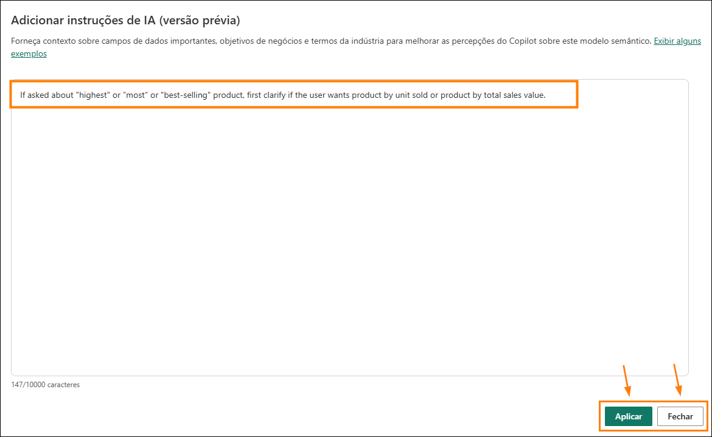

8. Abra o painel Copilot. Se já estiver aberto, feche o Copilot e Reabra-o. Isso garantirá que as alterações que você fez tenham sido aplicadas!

    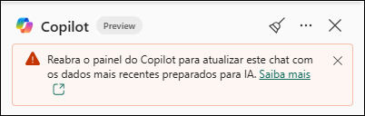

9. Pergunte ao Copilot **What’s our best-selling product**?

    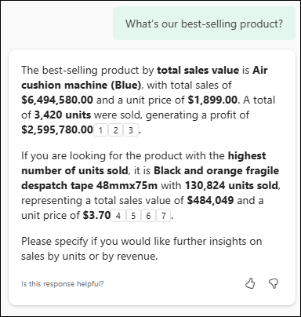

10. Como fornecemos instruções ao Copilot para esclarecer ao usuário final o que ele entende por mais vendido, veremos duas opções aqui. Você também pode ser solicitado com uma pergunta para esclarecer ou informações adicionais.

11. Digite **units sold** no prompt e pressione enter. O Copilot agora fornecerá uma resposta mais específica.

    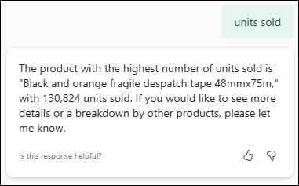

12. Vamos imaginar que temos certeza de que todos os usuários da organização sabem fazer a distinção entre mais vendido e maior volume de vendas. Nesse caso, podemos simplesmente fornecer definições ao Copilot usando Instruções de IA.

13. Reabra o diálogo **Preparar dados para IA,** navegue até Adicionar instruções de IA e substitua as instruções atuais pelo seguinte:

    - **Best-selling = most units sold**

    - **Highest selling = total sales value**

        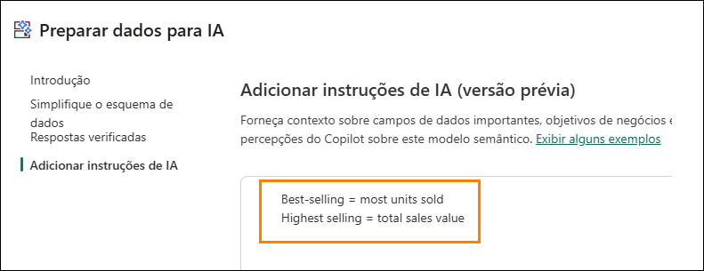

14. Clique em aplicar e depois em fechar.

15. Feche e reabra o Copilot. Digite **What’s our best-selling product**? No prompt e pressione enter.

    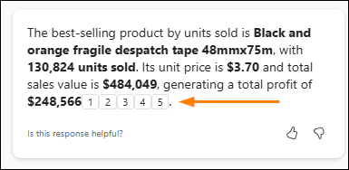

    O Copilot chega agora à resposta que esperamos e pode distinguir entre **mais vendido** e **maior volume de vendas**. Como mencionamos no início desta seção. Quanto mais instruções de IA bem definidas você fornecer, melhor será o Copilot!

    **ℹ️ Importante**

    **O teste de instruções de IA será mais rápido no Power BI Desktop porque não há atraso de publicação.** Por esse motivo, é recomendável testar e refinar suas instruções localmente antes de publicar no Serviço. A publicação introduz um atraso e, às vezes, pode causar confusão se as alterações não forem refletidas imediatamente. A área de trabalho oferece um ambiente mais responsivo para iteração e depuração.

16. Se você recebeu a mesma resposta acima, clique na referência para ver de onde vieram os resultados.

    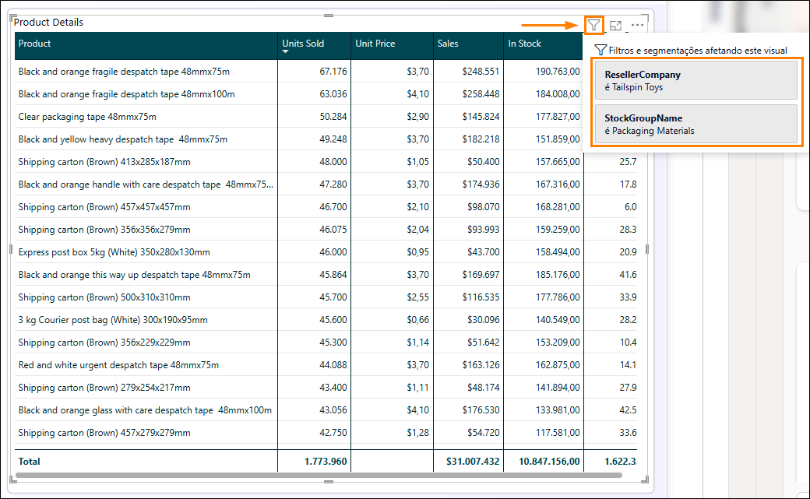

17. Os resultados podem variar, mas observe como os resultados retornados estão vindo de um visual existente, após uma inspeção mais detalhada, você notará que esse visual está realmente filtrado. Isso significa que recebemos uma resposta enganosa do Copilot. Especificamente, nunca solicitamos filtros em nossa solicitação e o Copilot não especificou que o nosso resultado foi filtrado.

18. Volte para Preparar dados para IA e navegue até as **Adicionar instruções de IA** Adicione a seguinte instrução:

    **If you use an existing report visual to answer a user request, always let the user know about any existing filters on the visual.**

    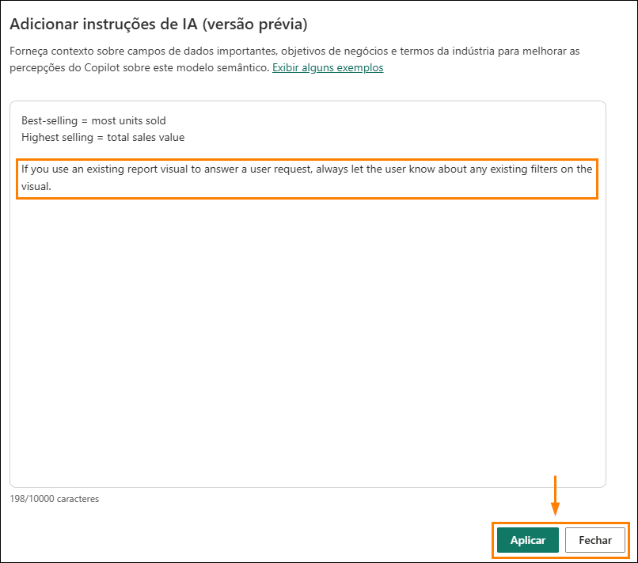

19. Pergunte ao Copilot novamente: **What’s our best-selling product?**

    

20. Observe que, desta vez, retornamos 1 visual referenciado diferente e o Copilot identificou corretamente que os visuais tinham um filtro no ResellerCompany para Tailspin Toys.

    **ℹ️ Importante**

    É importante lembrar que as Instruções de IA são um recurso que ainda está em versão prévia e mudando rapidamente. Continue a explorar diferentes instruções e veja o que funciona e o que não funciona!

    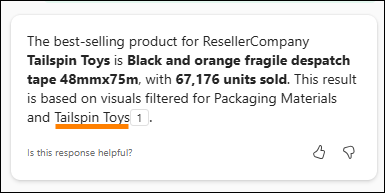

21. À medida que distribuímos a experiência do Copilot Autônomo para os nossos usuários finais, queremos criar confiança e uma maneira de fazer isso é garantir que o Copilot não adivinhe. Uma instrução que podemos adicionar é dizer ao Copilot para nunca tentar adivinhar se ele não entender o que está sendo perguntado.

22. Abra **Preparar dados para IA** e adicione as instruções a seguir e, em seguida, aplique e feche.

    - **Best-selling = most units sold**

    - **Highest selling = total sales value**

    If you use an existing report visual to answer a user request, always let the user know about any existing filters on the visual."

    ***If you do not understand what is being asked, do NOT guess, instead ask for clarification.***

    - Agora, o Copilot terá mais chances de fazer perguntas esclarecedoras.

    - Aqui está aquela instrução de IA em ação quando o Copilot não tem certeza!

        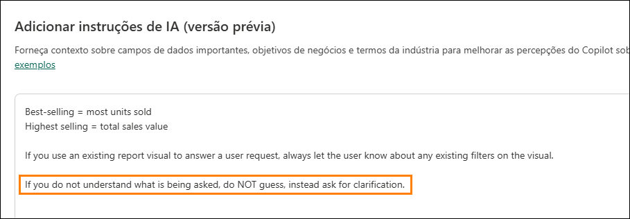

23. Abra o Copilot novamente e faça a seguinte pergunta confusa: **Total sales by something what is that?**

    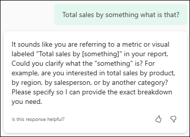

24. Neste exemplo, como visto na captura de tela acima, o Copilot não tem certeza de como você deseja ver as vendas totais, portanto, ele pede que você esclareça o que está procurando!

25. Outro tipo de instrução que podemos adicionar é a orientação visual de relatórios. Por exemplo, se você quiser ver a data sempre em um gráfico de linhas ou se quiser sempre que o Copilot retorne uma matriz ao analisar as vendas por país/região, adicione estas instruções.

26. Sem adicionar instruções de IA, não há garantia de qual visual o Copilot retornará. Por exemplo, se perguntarmos: **Show me total sales measure by year**. No momento, eu recebo um gráfico de linhas:

    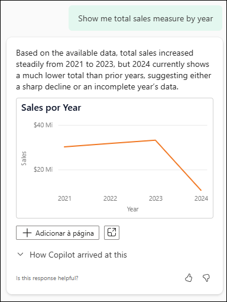

27. Agora vamos adicionar uma instrução de IA e ver o que acontece! Abra **Preparar dados para IA** e adicione a seguinte instrução:

    **## Visual Guidance**

    ***When showing the total sales measure by year always use a column chart.***

    **ℹ️ Importante**

    Quando escrever Instruções de IA, o "##" é um formato de linguagem de Markdown não necessário, mas uma boa prática para o Copilot e a organização do Agente de Dados do Fabric.

    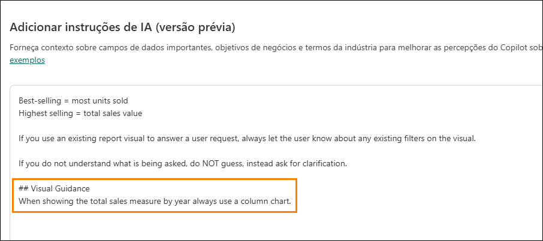

28. Abra o Copilot novamente e faça a seguinte pergunta: **Show total sales measure by year.**

    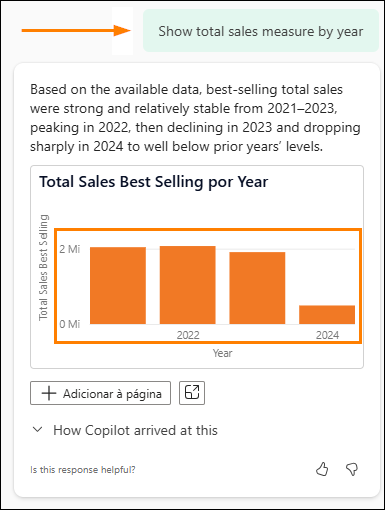

    O Copilot pode escrever em DAX para chegar à resposta e exibir como uma tabela. Lembre-se, você sempre pode criar um prompt: **Can you make this into a column chart?** Ou reformular as **Instruções de IA**.

    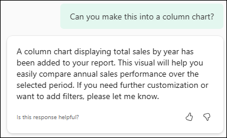

29. Vamos dar uma olhada em outro exemplo, essa definição de medida de tempo. Retorne à janela de chat do Copilot e faça a seguinte pergunta: **How many purchase orders do we have?**

    

30. Observe que os resultados estão corretos e se expandirmos a área **How Copilot arrived at this**, vemos até que ele está usando a medida explícita! Se você se lembra, criamos uma descrição assistida pelo Copilot para essa Medida exata. Mas vamos pedir esclarecimentos sobre como o DAX está sendo calculado.

    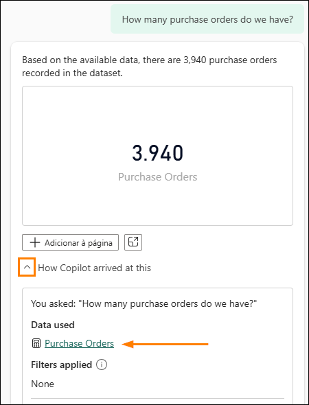

31. Faça a pergunta: **Can you explain the DAX used?**

    

32. Nossa resposta é extremamente interessante, pois observa a limitação do Copilot em acessar diretamente nossas fórmulas DAX exatas. A resposta em si é de natureza altamente *generativa* usando palavras como "provavelmente", "se", "tipicamente" e "potencialmente". Isso ***às vezes*** pode ser resolvido com a ajuda de nossa exibição TMDL e instruções de IA!

    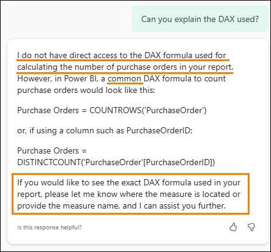

33. No seu painel de navegação esquerdo, selecione a exibição **TMDL** .

34. Na parte inferior da tela, crie um Script pressionando o botão "+".

    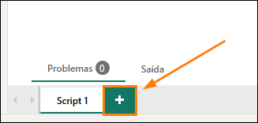

35. Vamos puxar uma única medida para ajudar os usuários a obter esclarecimentos sobre o DAX em nosso modelo de dados. Arraste a Medida **Purchase Orders** para o Script.

    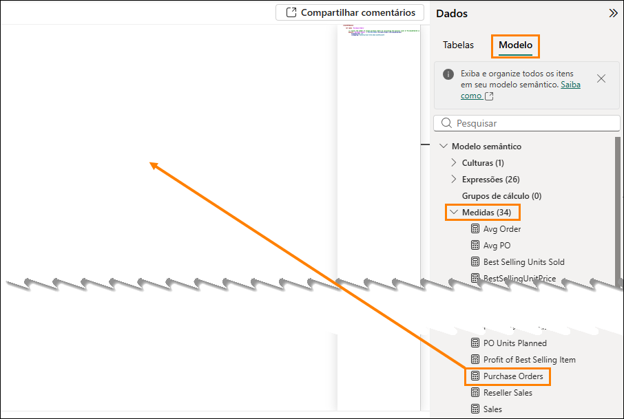

36. O script TMDL resultante é um ótimo recurso para adicionar às nossas Instruções de IA! Podemos ver nossa descrição representada nesta exibição também. Agora queremos copiar a descrição da medida e a medida em si, conforme mostrado:

    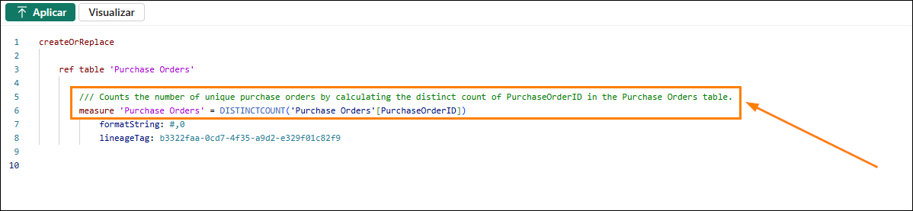

37. Agora retorne a **Preparar dados para IA** na Exibição de Relatório e adicione a descrição do TMDL e os detalhes da medida na exibição **Adicionar instruções de IA**, conforme mostrado abaixo. Em seguida, pressione **Aplicar**.

    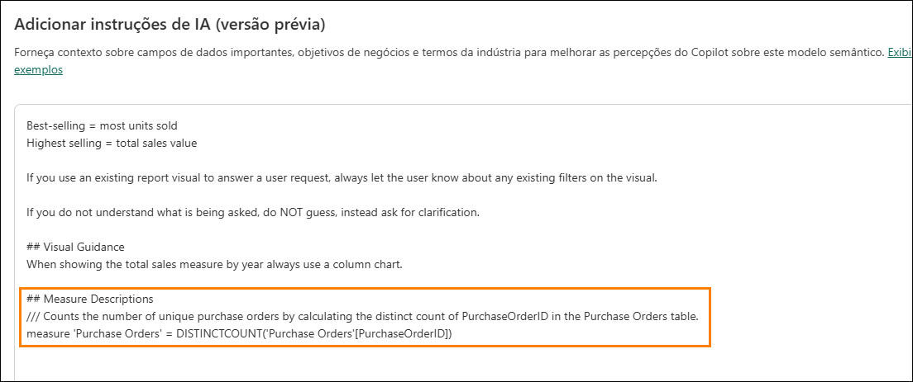

38. Reabra o painel Copilot para atualizar as instruções e fazer a mesma pergunta de antes: **How many purchase orders do we have?**

    

39. Até agora, tudo bem. Este é o comportamento que esperávamos, mas o momento que esperávamos é a nossa próxima pergunta.

    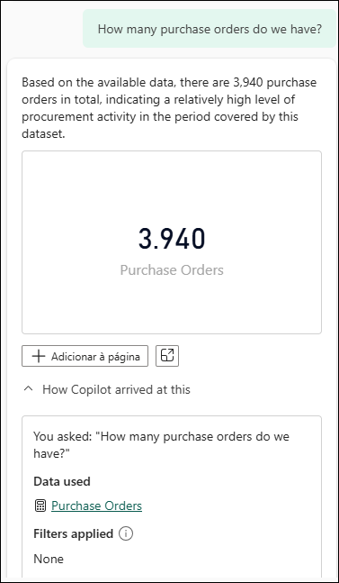

40. Agora peça esclarecimentos: **Can you explain the DAX used in the Purchase Orders measure?**

    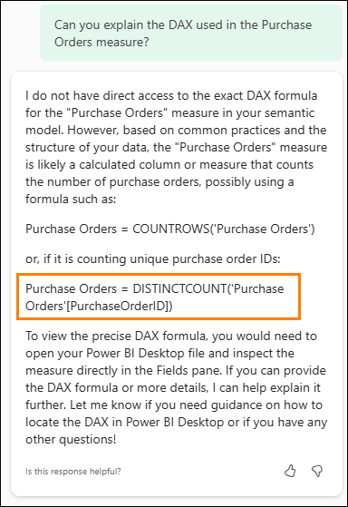

41. Infelizmente, o Copilot ainda está adivinhando, embora corretamente qual é o código DAX real. Adicionar o código DAX às Instruções de IA pode funcionar ocasionalmente, mas neste momento, ainda em versão prévia, isso é inconsistente!

42. No início dos laboratórios, solicitamos Total Sales para o Southeast. O Copilot não usou a coluna Sales Territory em nossa tabela Reseller, mas assumiu quais States representavam a região Southeast. Nesta seção, adicionaremos uma Instrução de IA para garantir que o Copilot use o Sales Territory quando perguntado sobre regiões!

43. Abra **Preparar dados para IA** e adicione a seguinte instrução:

    **If a user asks about region or territory related data, for example Southeast, use the Sales Territory column from the Reseller table.**

    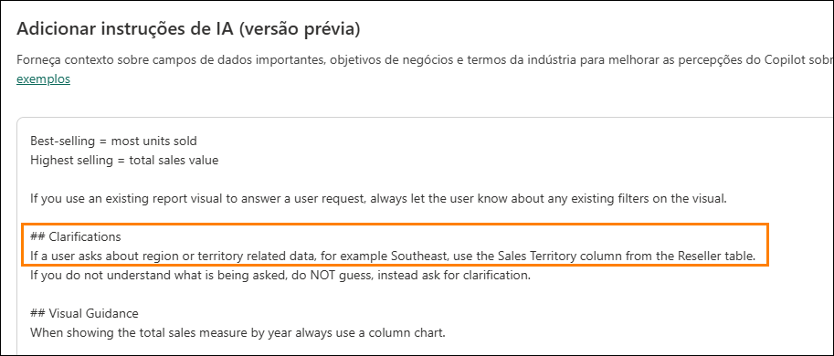

44. Abra o Copilot e escreva o seguinte prompt: **Show total sales for the Southeast.**

    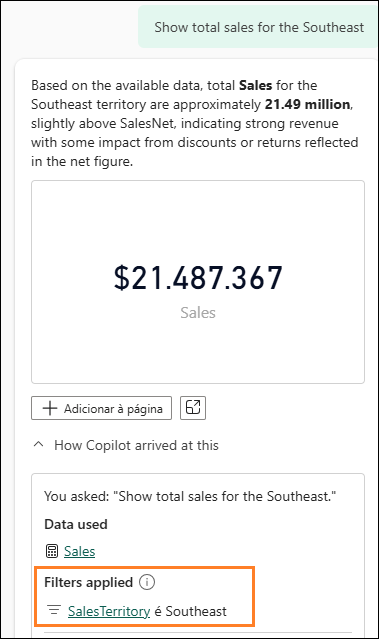

45. Na seção anterior, removemos a tabela Customer do esquema de dados.

    Dentro dessa organização, os clientes são definidos especificamente como revendedores que compram e distribuem nossos produtos. Os consumidores finais que compram desses revendedores não são classificados como clientes. Precisamos fazer isso de forma distinta para que o Copilot retorne a Resellers quando questionado sobre Customers.

46. Abra Preparar dados para IA e insira o seguinte:

    **Customers = Resellers**

    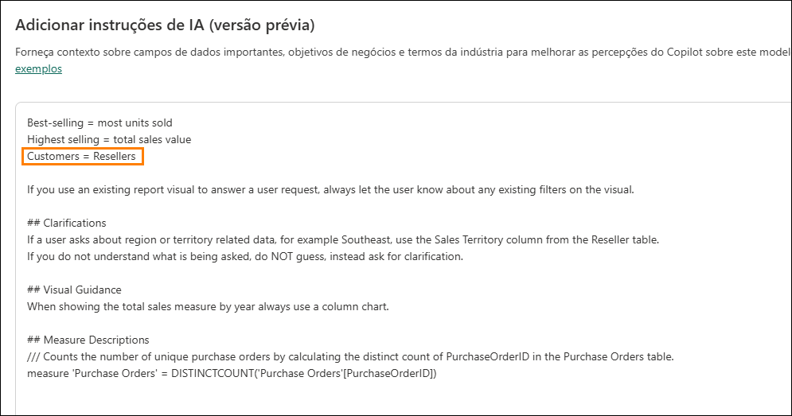

47. No prompt do Copilot, pergunte: **What customer sold the most products in 2021?**

    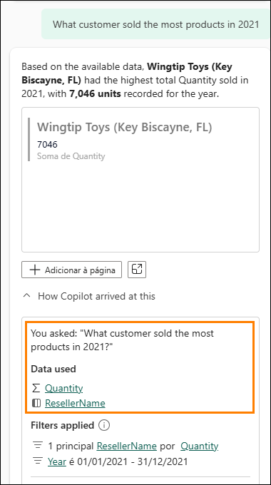

    Isso também é mostrado no Cálculo DAX criado!

    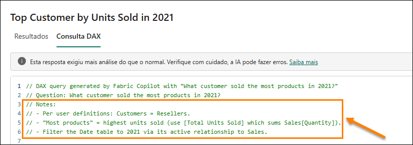

    Observe que o Copilot foi instruído corretamente e está usando Reseller para representar Customer.

## Tarefa 3: Criar respostas verificadas

Vamos levar nossa preparação de dados para o próximo nível, adicionando respostas verificadas. As respostas verificadas permitem que o autor do modelo selecione um visual e escolha frases, que quando um usuário perguntar, exibirão esse visual como uma resposta verificada. As respostas verificadas também ajudam o Copilot a conhecer o contexto do seu modelo e a fornecer respostas mais precisas, mesmo que o prompt não retorne uma resposta verificada exata.

**ℹ️ Importante**

As respostas verificadas corresponderão à frase que você definiu como qualquer coisa identificada como semanticamente semelhante. Por esse motivo, você não precisa definir todas as variações possíveis de qual frase um usuário pode perguntar. Em vez disso, defina frases de gatilho claras e distintas que qualquer coisa semelhante possa disparar para o usuário.

1. Para o seu primeiro exemplo, você criará uma resposta verificada para **Top state for sales**.

2. No momento, se você perguntar ao Copilot **What state has the most sales?** Ele nem sempre interpreta a pergunta da maneira que você pretende. Isso porque a palavra "sales" é referenciada de diversas formas dentro do modelo e do relatório.

3. Neste exemplo, você garantirá que o Copilot sempre retorne a resposta esperada.

4. Desta vez, nós **não** iniciaremos o diálogo Preparar dados para IA Se abrir a guia de respostas verificadas no diálogo Preparar dados para IA você verá que não há nada disponível.

    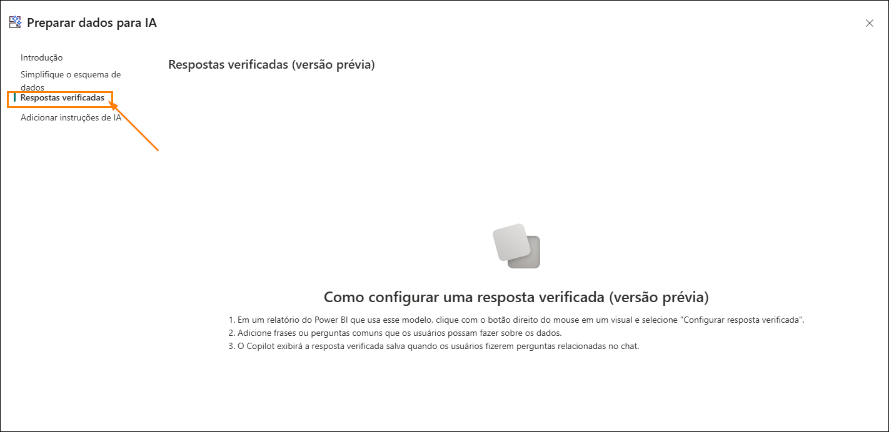

5. Em vez disso, você começará com os visuais do relatório.

6. Feche a janela Preparar dados para IA e navegue até a página **Product detail**.

    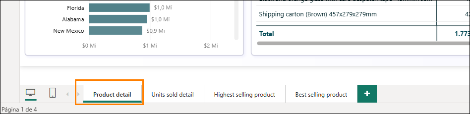

7. Clique no gráfico de barras para vendas por estado e clique nas reticências (**...**) encontradas no canto superior direito.

    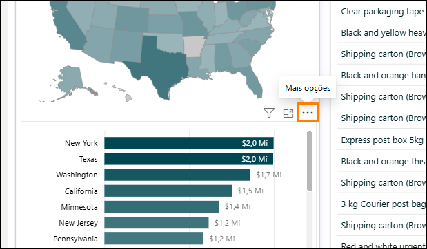

8. Escolha **Configurar uma resposta verificada** na lista suspensa.

    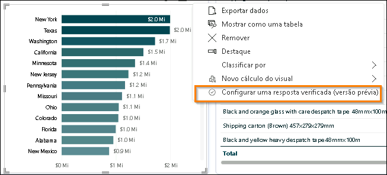

9. Você pode definir uma frase selecionando uma sugestão do Copilot ou digitando sua própria frase personalizada.

10. Na caixa Inserir uma frase, digite: **State with the highest sales** e **clique em Adicionar.** *Veja a captura de tela abaixo.*

    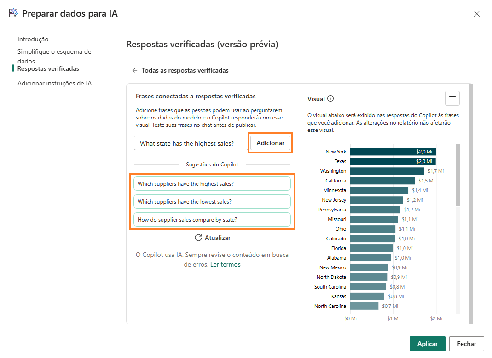

11. Clique em Aplicar e depois em Fechar

    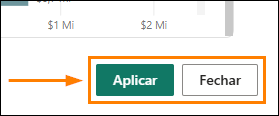

12. Feche e reabra o painel Copilot.

13. Pergunte ao Copilot: **What state has the highest sales?**

    

14. Obtenha uma resposta verificada correta retornada para a pergunta.

    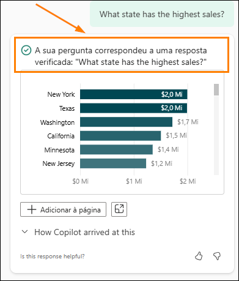

15. E os falsos positivos? Vamos tentar uma pergunta que NÃO deve usar nossa resposta verificada e ver o que acontece. No Copilot, digite o seguinte prompt **What state is selling the most of the highest selling product?**

    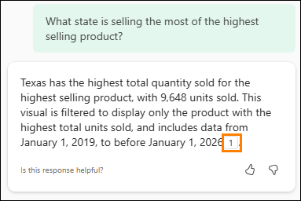

16. Isso é perfeito! A resposta aponta para um visual diferente em nosso relatório. Mais especificamente, está apontando para um visual que é filtrado até o produto mais vendido. Observe também, a resposta está respeitando nossas instruções de IA anteriores e nos informando sobre filtros que são aplicados no visual retornado!

17. Vamos adicionar outra resposta verificada! Desta vez, queremos mostrar **Best selling product.**

18. Clique na página do relatório para Best selling product.

    

19. Em seguida, localize o visual do cartão na parte superior, clique nas reticências **(...)** e selecione **Configurar uma resposta verificada**.

    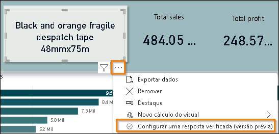

20. No início do laboratório, adicionamos Instruções de IA para que a IA saiba que o mais vendido é o total de unidades e o mais vendido é o valor total de vendas. Queremos ter certeza de que nossas frases de resposta verificadas estejam corretamente alinhadas com nossas instruções de IA.

21. Desta vez, você adicionará duas frases, elas podem ou não aparecer nas sugestões do Copilot. Primeiro, adicione uma frase para **Which Product has sold the most units?** Em seguida, clique em Adicionar.

    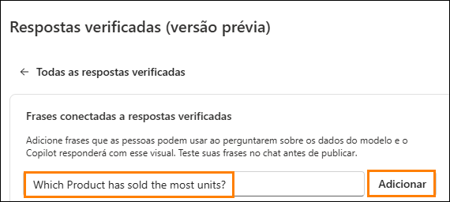

22. Clique em Aplicar.

    

23. Clique no ícone + ao lado das **Sugestões do Copilot** para adicionar uma frase adicional. Adicione a frase **What is the best-selling product?** Ou semelhante então clique em Adicionar.

    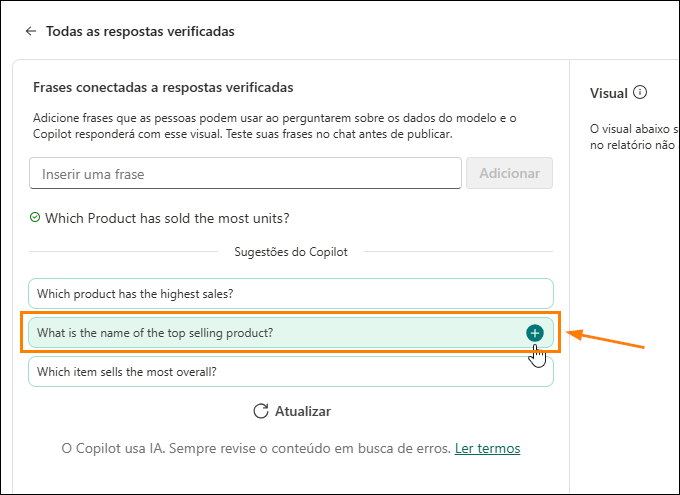

24. Agora você tem as duas frases conectadas ao visual do seu relatório, como pode ser visto na captura de tela abaixo!

    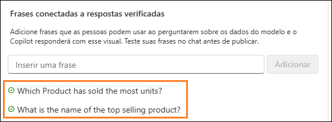

25. Clique em Aplicar e Fechar.

26. Parabéns! Nesta seção, você aprendeu a adicionar respostas verificadas aos visuais do relatório. Você também aprendeu que poderia adicionar mais de uma frase para conectar as perguntas do usuário a um visual de relatório individual!

## Tarefa 4: Experimente você mesmo

Se o tempo de laboratório permitir, continue a explorar os recursos de **Preparar dados para IA** que você aprendeu neste laboratório.

1. Comece fazendo uma pergunta ao Copilot sobre algo que você gostaria de saber. Se os resultados não são o que você queria ou esperava. Pense em como você pode garantir o resultado desejado usando simplesmente o esquema de dados, respostas verificadas ou instruções de IA!

## Conclusão

Parabéns! Você concluiu os dados de preparação para a seção de IA do laboratório!

# Referências

O Chat with your Data in a Day (CDIAD) apresenta alguns dos principais recursos ao usar o Copilot Autônomo em um workspace do Fabric.

No menu do serviço, a seção Ajuda (?) tem links para ótimos recursos. Lembre-se de que a exibição que você vê depende da experiência na qual você está atualmente e, portanto, as opções podem parecer diferentes da captura de tela abaixo.

Veja aqui mais alguns recursos que ajudarão você com as próximas etapas do Microsoft Fabric.

- Acesse todas as informações na [Documentação principal do Microsoft Fabric](https://learn.microsoft.com/en-us/fabric/)

- Explore o Fabric por meio do [Tour Guiado](https://aka.ms/Fabric-GuidedTour)

- Inscreva-se na [avaliação gratuita do Microsoft Fabric](https://aka.ms/try-fabric)

- Visite o [site do Microsoft Fabric](https://aka.ms/microsoft-fabric)

- Aprenda novas habilidades explorando os [módulos de Aprendizagem do Fabric](https://aka.ms/learn-fabric)

- Leia o livro eletrônico [gratuito sobre como começar a usar o Fabric](https://aka.ms/fabric-get-started-ebook)

- Participe da [comunidade do Fabric](https://aka.ms/fabric-community) para postar suas perguntas, compartilhar seus comentários e aprender com outras pessoas

Leia a documentação técnica mais detalhada relevante para o Copilot:

- [Visão geral do Copilot para Power BI - Power BI | Microsoft Learn](https://learn.microsoft.com/en-us/power-bi/create-reports/copilot-introduction)

- [Experiência do Copilot Autônomo no Power BI (Versão Prévia) – Power BI | Microsoft Learn](https://learn.microsoft.com/en-us/power-bi/create-reports/copilot-chat-with-data-standalone)

- [Configurações de administrador do Microsoft Fabric Copilot | Microsoft Learn](https://learn.microsoft.com/en-us/fabric/admin/service-admin-portal-copilot)

- [Criação de agente de dados do Fabric (versão prévia) - saiba como criar um agente de dados do Fabric | Microsoft Learn](https://learn.microsoft.com/en-us/fabric/data-science/concept-data-agent)

- [Práticas recomendadas para configurar agentes de dados - Microsoft Fabric | Microsoft Learn](https://learn.microsoft.com/en-us/fabric/data-science/data-agent-configuration-best-practices)

- [Copilot para Microsoft Fabric e Power BI: perguntas frequentes - Microsoft Fabric | Microsoft Learn](https://learn.microsoft.com/en-us/fabric/fundamentals/copilot-faq-fabric)

© 2026 Microsoft Corporation. Todos os direitos reservados.

Ao usar esta demonstração/este laboratório, você concorda com os seguintes termos:

A tecnologia/funcionalidade descrita nesta demonstração/neste laboratório é fornecida pela Microsoft Corporation para obter seus comentários e oferecer uma experiência de aprendizado. Você pode usar a demonstração/o laboratório somente para avaliar tais funcionalidades e recursos de tecnologia e fornecer comentários à Microsoft. Você não pode usá-los para nenhuma outra finalidade. Você não pode modificar, copiar, distribuir, transmitir, exibir, executar, reproduzir, publicar, licenciar, criar obras derivadas, transferir nem vender esta demonstração/este laboratório ou qualquer parte deles.

A CÓPIA OU A REPRODUÇÃO DA DEMONSTRAÇÃO/DO LABORATÓRIO (OU DE QUALQUER PARTE DELES) EM QUALQUER OUTRO SERVIDOR OU LOCAL PARA REPRODUÇÃO OU REDISTRIBUIÇÃO ADICIONAL É EXPRESSAMENTE PROIBIDA.

ESTA DEMONSTRAÇÃO/LABORATÓRIO FORNECE DETERMINADAS TECNOLOGIAS DE SOFTWARE/RECURSOS E FUNCIONALIDADE DO PRODUTO, INCLUINDO POTENCIAIS NOVOS RECURSOS E CONCEITOS, EM UM AMBIENTE SIMULADO SEM CONFIGURAÇÃO OU INSTALAÇÃO COMPLEXA PARA A FINALIDADE DESCRITA ACIMA. A TECNOLOGIA/CONCEITOS REPRESENTADOS NESTA DEMONSTRAÇÃO/LABORATÓRIO PODEM NÃO REPRESENTAR A FUNCIONALIDADE COMPLETA DO RECURSO E PODEM NÃO FUNCIONAR DA MESMA FORMA QUE UMA VERSÃO FINAL. NÓS TAMBÉM PODEMOS NÃO LANÇAR UMA VERSÃO FINAL DE TAIS RECURSOS OU CONCEITOS. SUA EXPERIÊNCIA COM O USO DE TAIS RECURSOS E FUNCIONALIDADES EM UM AMBIENTE FÍSICO TAMBÉM PODE SER DIFERENTE.

**COMENTÁRIOS.** Caso você forneça comentários sobre os recursos de tecnologia, as funcionalidades e/ou os conceitos descritos nesta demonstração/neste laboratório à Microsoft, você concederá à Microsoft, sem encargos, o direito de usar, compartilhar e comercializar seus comentários de qualquer forma e para qualquer finalidade. Você também concede a terceiros, sem encargos, quaisquer direitos de patente necessários para que seus produtos, suas tecnologias e seus serviços usem ou interajam com partes específicas de um software ou um serviço da Microsoft que inclua os comentários. Você não fornecerá comentários que estejam sujeitos a uma licença que exija que a Microsoft licencie seu software ou sua documentação para terceiros em virtude da inclusão de seus comentários neles. Esses direitos continuarão em vigor após o término do contrato.

A MICROSOFT CORPORATION SE ISENTA DE TODAS AS GARANTIAS E CONDIÇÕES COM RELAÇÃO A DEMONSTRAÇÃO/LABORATÓRIO, INCLUINDO TODAS AS GARANTIAS E CONDIÇÕES DE COMERCIALIZAÇÃO, SEJAM EXPRESSAS, IMPLÍCITAS OU ESTATUTÁRIAS, ADEQUAÇÃO A UM DETERMINADO FIM, TÍTULO E NÃO VIOLAÇÃO. A MICROSOFT NÃO DECLARA NEM GARANTE A PRECISÃO DOS RESULTADOS DERIVADOS DO USO DA DEMONSTRAÇÃO/DO LABORATÓRIO NEM A ADEQUAÇÃO DAS INFORMAÇÕES CONTIDAS NA DEMONSTRAÇÃO/NO LABORATÓRIO A QUALQUER FINALIDADE.

**AVISO DE ISENÇÃO DE RESPONSABILIDADE**

Esta demonstração/este laboratório contém apenas uma parte dos novos recursos e aprimoramentos do Microsoft Power BI. Alguns dos recursos podem ser alterados em versões futuras do produto. Nesta demonstração/neste laboratório, você aprenderá sobre alguns dos novos recursos, mas não todos.
