# Microsoft Fabric Chat with your Data in a Day - Laboratório 4

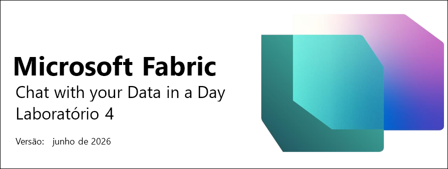

## Conteúdo

- Estrutura do documento
- Cenário/Declaração do problema
- Introdução
- Experiência do Copilot Autônomo
- Configuração: Configuração do workspace para laboratórios posteriores
  - Tarefa 1: Explorando a experiência do Copilot Autônomo
  - Tarefa 2: Escrevendo um prompt no Copilot Autônomo
  - Tarefa 3: Explorando a exibição na capacidade de relatório
  - Tarefa 4: Explorações
  - Tarefa 5: Respostas verificadas
  - Tarefa 6: Como o Copilot chegou a isso (HCAAT)
  - Tarefa 7: Uma resposta de dados de uma consulta DAX gerada pelo Copilot
  - Tarefa 8: Alternância de contexto no Copilot
  - Tarefa 9: A construção do Copilot de um visual desde o Modelo Semântico
  - Tarefa 10: Experiência geral do Copilot
- Referências

# Estrutura do documento

O laboratório inclui as etapas a serem seguidas pelo usuário juntamente com as capturas de tela associadas que fornecem auxílio visual. Em cada captura de tela, as seções estão destacadas com caixas laranjas para indicar as áreas nas quais o usuário deve se concentrar.

# Cenário/Declaração do problema

Parabéns por chegar até aqui. Agora você sabe como implementar as práticas recomendadas geralmente aceitas em seu modelo de dados e como usar a funcionalidade Preparar seus dados para IA. Agora é hora de explorar a experiência do Copilot Autônomo no Microsoft Fabric.

Sua organização, como muitas outras, tem centenas de relatórios e modelos semânticos em dezenas de espaços de trabalho. Encontrar o relatório ou os dados certos tem sido um desafio para os usuários finais. Você deseja aproveitar a experiência do Copilot Autônomo para aumentar a adoção do usuário e obter tempo mais rápido para obter insights em toda a organização.

**Desafios atuais**

- **Experiência de descoberta de fragmentos:** os usuários lutam para encontrar os dados, os relatórios, os aplicativos e os agentes de dados corretos no ambiente do Fabric.

- **Baixa Adoção**: o volume de relatórios e treinamentos necessários cria atrito, dificultando a adesão e adoção do usuário.

- **Tomada de decisão atrasada:** o tempo para insights permanece lento devido a obstáculos à navegação e aos recursos de autoatendimento limitados.

# Introdução

Em laboratórios anteriores, você aprendeu a preparar seu modelo semântico para otimizar a experiência de IA. Neste laboratório, você aproveitará todo esse trabalho árduo e explorará como o Copilot no Microsoft Fabric pode ajudar a acelerar o tempo de insights dentro da sua organização.

# Experiência do Copilot Autônomo

Nesta seção, você vai explorar a experiência autônoma do Copilot no Fabric e descobrir todas as maneiras incríveis para conversar com seus dados. Ao final deste laboratório, você vai ter uma compreensão muito melhor de como pode aproveitar a experiência do Copilot Autônomo para ter tempo mais rápido para obter insights. Mais especificamente, você vai aprender:

- Como aproveitar ao máximo a experiência do Copilot Autônomo

- Como entender os relatórios, os recursos visuais e as respostas de dados retornados

- Como validar "como o Copilot chegou a isso (HCAAT)"

- Como criar e modificar explorações, que possam ser compartilhadas.

- Como aproveitar os recursos de Preparar dados para a IA, como respostas verificadas

- Como identificar respostas de atrito

- Como aproveitar a experiência geral do Copilot

**ℹ️ Importante**

A experiência do Copilot Autônomo realçada nestes laboratórios NÃO mantém um histórico de chat. Se você clicar fora da experiência do Copilot, sua conversa será perdida. Isso difere da experiência do M365 Copilot Chat.

## Configuração: Configuração do workspace para laboratórios posteriores

Neste laboratório e em laboratórios posteriores, você precisará de seu próprio workspace para editar e salvar itens no Fabric. Nesta seção de configuração, você criará um workspace e atribuirá uma Capacidade do Fabric a esse workpace para que você possa executar tarefas específicas sem afetar outros participantes do laboratório.

1. Abra um navegador da Web na Máquina Virtual e navegue até [https://fabric.microsoft.com/](https://app.fabric.microsoft.com/home?experience=power-bi)

2. Faça logon no Fabric usando as credenciais fornecidas a você no workshop.

3. Selecione **Workspaces** no painel de navegação esquerda.

    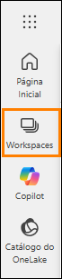

4. No painel Workspaces, clique no Workspace **Fabrikam_Lab_<inject key="DeploymentID" enableCopy="false"/>_PT**

    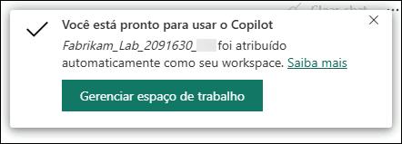

    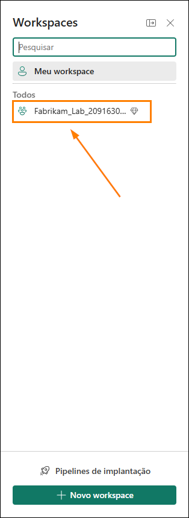

5. Agora precisamos garantir que sua licença individual possa ser publicada no Espaço de Trabalho habilitado para o Fabric. Selecione o ícone de pessoa no canto superior direito e clique em **Iniciar avaliação do Fabric**.

    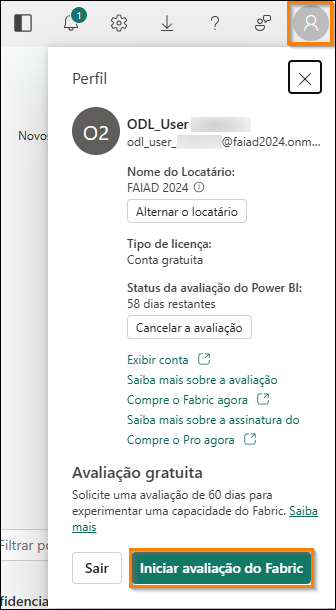

6. Basta clicar em **Ativar** para habilitar a publicação no Espaço de Trabalho.

    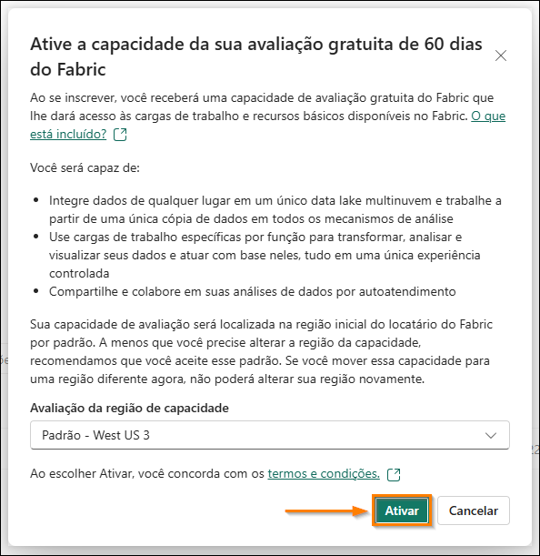

    Clique em **OK**.

    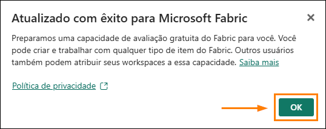

7. Em seguida, você precisará **publicar** o PBIX completo de seus arquivos de classe.

8. Nos arquivos de classe, abra o arquivo chamado **Fabrikam Company Sales Report.pbix**.

    

9. Uma vez aberto, certifique-se de que você está conectado à sua conta de usuário atribuída para o Workshop CDIAD.

10. Clique em Publicar, localize o espaço de trabalho em que você acabou de criar **Fabrikam_Lab_<inject key="DeploymentID" enableCopy="false"/>_PT**

    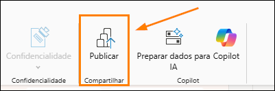

    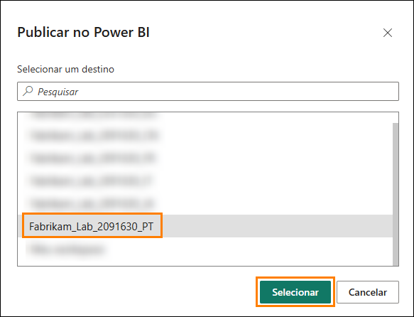

## Tarefa 1: Explorando a experiência do Copilot Autônomo

1. Selecione Copilot no painel de navegação esquerdo.

    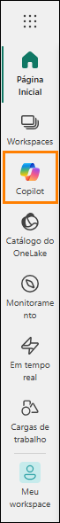

2. Se você receber um prompt na próxima tela, clique em **Introdução**. O Copilot selecionará um espaço de trabalho com base em uma **capacidade do Copilot** à qual o usuário tem acesso. Essa seleção dependerá de o espaço de trabalho ter **Unidades de Capacidade (UC)** disponíveis. Se o usuário for atribuído a uma **FCC (Configuração de Capacidade do Fabric)**, essa capacidade será usada.

3. Bem-vindo(a) à experiência do Copilot Autônomo! Nesta tela de inicialização, você verá uma seção na parte inferior em que você pode escrever sua solicitação **(1)** receber algumas ideias de prompt na parte inferior **(2).**

    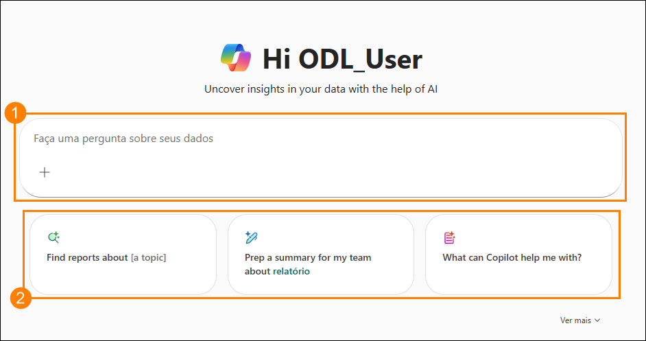

## Tarefa 2: Escrevendo um prompt no Copilot Autônomo

Nesta seção, você escreverá vários prompts e explorará os resultados retornados pela experiência do Copilot.

1. Clique no prompt e escreva o seguinte: **Find reports about** **Fabrikam’s sales trends for the year.** Clique em **Inserir.**

    

    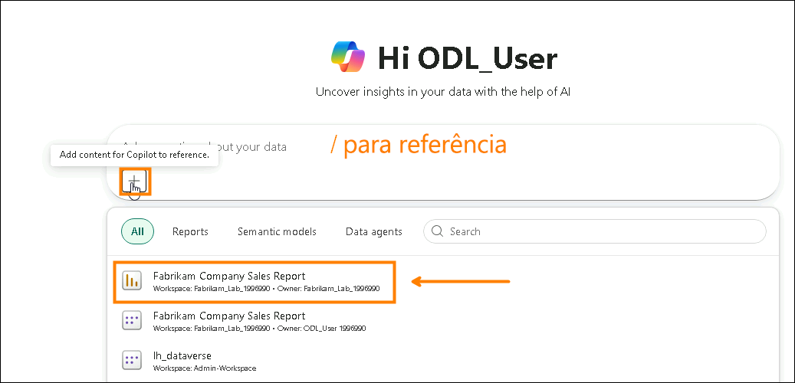

    **ℹ️ Importante**

    A IA retorna resultados não determinísticos devido a muitos fatores. Conforme discutido anteriormente nesta aula, seus resultados podem variar e podem não ser idênticos aos laboratórios. Prossiga e explore as capacidades e recursos que estão sendo exibidos da melhor maneira possível!

    Você pode facilmente usar a / para referenciar o arquivo ou o sinal +. Isso pode ser útil, pois levará algum tempo para que o Copilot internalize completamente o conteúdo publicado.

    **Se não obtiver** o relatório correto para mostrar, você precisará verificar algumas coisas:

    1) Na configuração de serviço do Power BI, selecione o Portal de administração do Fabric, pois queremos garantir que verificamos nossas configurações relacionadas ao Copilot. Uma delas é **Mostrar somente itens aprovados no Copilot autônomo na experiência do Power BI**. Quando selecionar esse recurso, somente os itens aprovados para o Copilot serão exibidos, salvo se ele for anexado/referenciado manualmente. Isso já está habilitado por padrão em nosso locatário.

    2) Opcionalmente, podemos aprovar o modelo Semântico para o Copilot selecionando o modelo em nosso espaço de trabalho.

        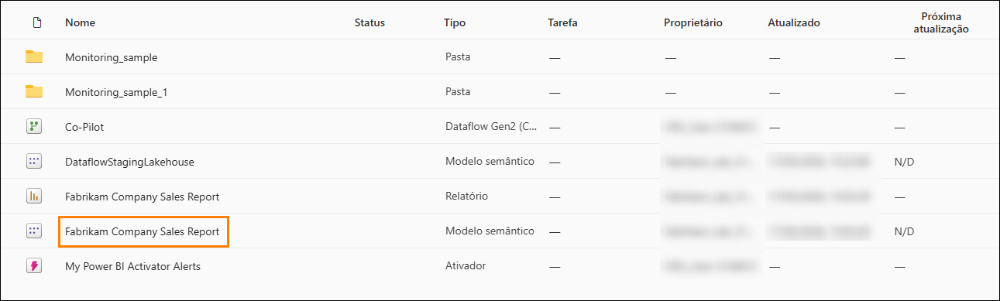

    3) Quando selecionar **Preparar dados para IA**, você abrirá a janela Preparar dados para IA.

        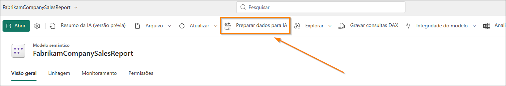

        Para ser pesquisável sem uma referência manual, precisaremos ativar o armazenamento de modelos grandes.

        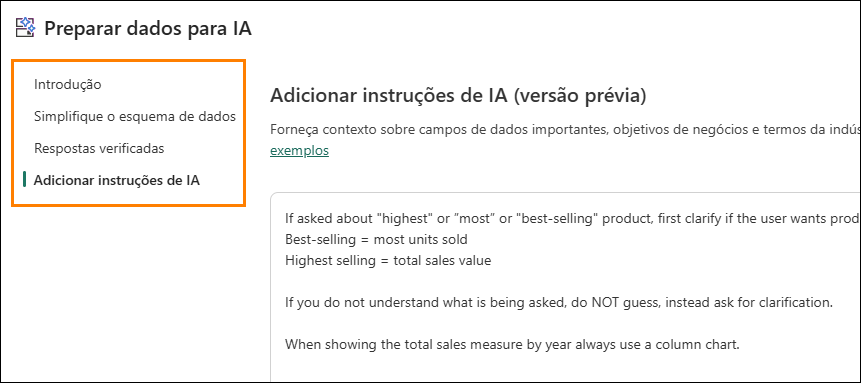

        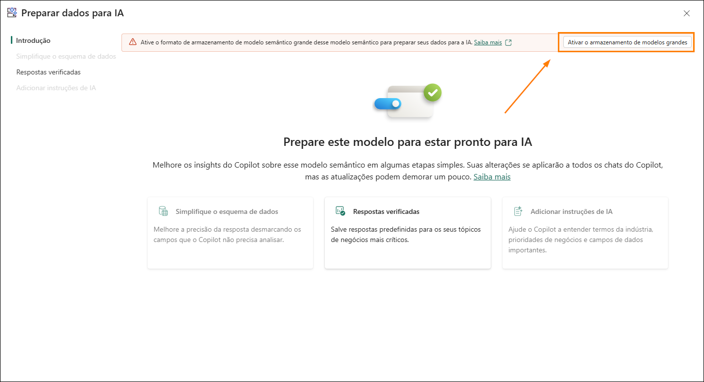

        Desse ponto em diante, você pode ver e ajustar o trabalho Preparar dados para IA.

2. Clique no relatório retornado em seus resultados de pesquisa, **Fabrikam Company Sales Report**. Isso abrirá uma nova guia em seu navegador da Web, levando você diretamente para esse relatório.

    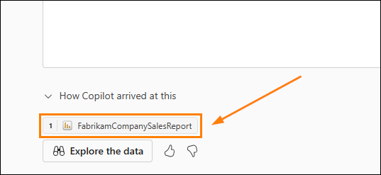

3. Reserve um momento para **explorar** este relatório e familiarizar-se com ele!

    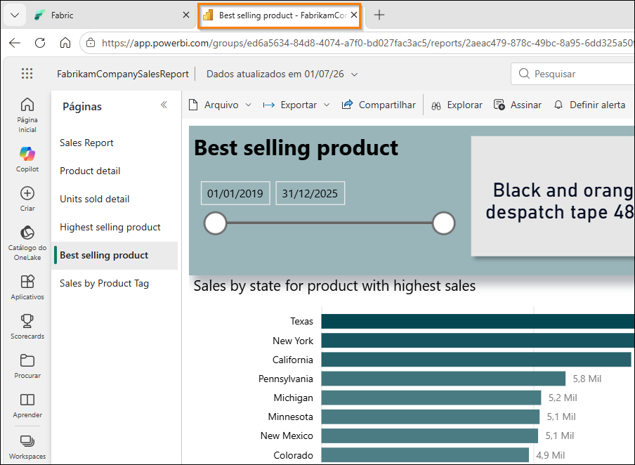

4. Quando terminar de explorar o relatório. Clique no (x) na guia do navegador para fechar essa guia e voltar à experiência do Copilot.

5. Clique no prompt pré-gerado na parte inferior da página ou entre no prompt: **Give me an overview of 1. Fabrikam Company Sales**:

    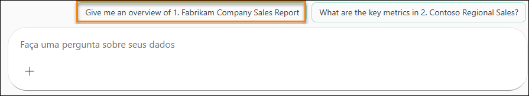

6. Dizer ao Copilot para fornecer uma visão geral do relatório fornecerá as seguintes informações, conforme mostrado na captura de tela abaixo. **Lembrete: sua tela e os resultados terão pequenas diferenças!!**

    1. O Copilot retornará visuais de relatório do relatório existente fornecendo uma visão geral.

    2. O Copilot fornecerá uma descrição narrativa de cada visual retornado.

        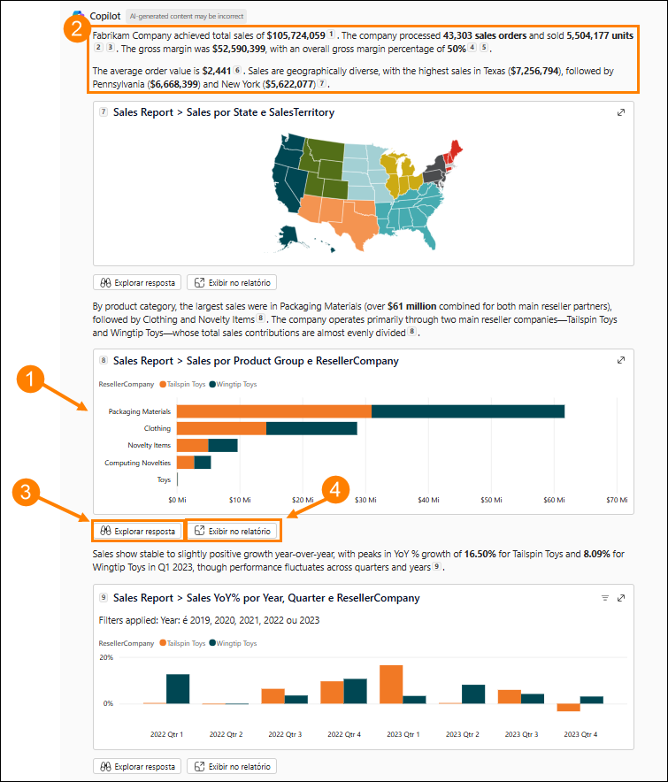

## Tarefa 3: Explorando a exibição na capacidade de relatório

O Copilot pode retornar vários tipos de respostas, dependendo das perguntas feitas e da preparação dos dados subjacentes. Nesta seção, você explorará o recurso **Exibir no relatório**. Esse recurso é retornado sempre que o Copilot usa um elemento visual existente de um relatório para responder à sua pergunta.

1. Em seguida, você vai dar uma olhada na opção **Exibir no relatório**, essa opção abrirá o relatório atual com o visual especificado em destaque.

2. A partir de qualquer uma das visualizações apresentadas, clique em **Exibir no relatório**, isso abrirá uma nova aba em seu navegador da Web. *Veja a captura de tela abaixo*.

    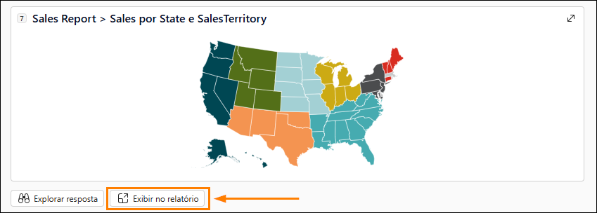

3. Na nova página de relatórios, você verá o visual selecionado do Copilot no relatório original. Você também notará que os outros visuais ficaram temporariamente acinzentados, isso porque o visual que você selecionou foi **destacado**. Clique em qualquer lugar do relatório para ativá-lo e explorá-lo! Quando terminar de explorar, feche esta guia no navegador da Web e volte para a experiência do Copilot Autônomo.

    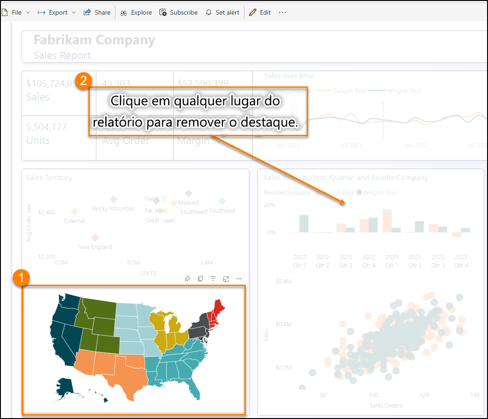

## Tarefa 4: Explorações

Outro recurso apresentado pela experiência do Copilot é a capacidade de **Explorar a resposta**. Essa capacidade de explorar uma resposta é uma ótima maneira de continuar a refinar sua experiência com o Copilot. Nesta seção, você aprenderá a usar explorações, editá-las, salvá-las e compartilhá-las!

**ℹ️ Observação**

As explorações são usadas principalmente como ferramentas para análise ad-hoc de dados e visuais existentes em relatórios. Embora as explorações possam ser salvas, elas geralmente são simplesmente fechadas após a conclusão da análise ad-hoc.

1. Agora você deve estar de volta à sua experiência de Copilot Autônomo. Clique em **Explorar resposta** abaixo de qualquer uma das visualizações no Copilot, qual delas você escolher não importa para este exemplo.

    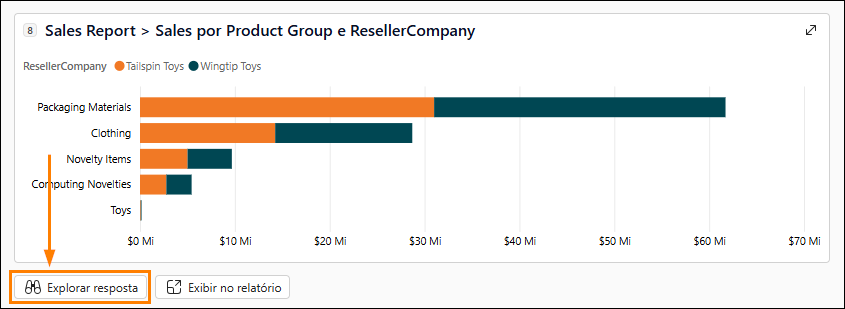

2. Clicar neste botão abriu uma nova tela. Vamos **explorar!**

    - (1) Salve a exploração como um relatório ou como uma exploração

    - (2) Abra em uma nova guia do navegador

    - (3) Compartilhe

    - (4) Exiba em formato de Matriz

    - (5) Altere o tipo de visualização

    - (6) Altere as colunas/medidas do visual

    - (7) Expanda/recolha a exibição

        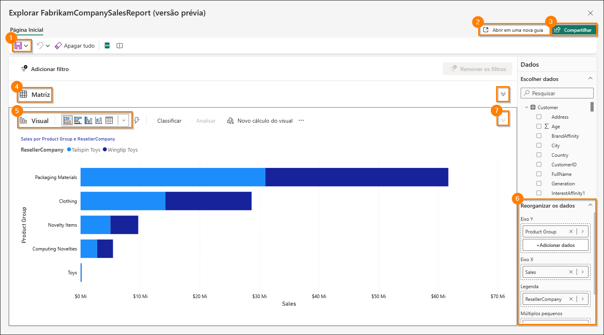

3. Clique no ícone suspenso ao lado do botão Salvar. Isso fornecerá algumas opções:

    - Primeiro, você pode salvar isso como uma exploração, este é um tipo de objeto em seu espaço de trabalho.

    - Em seguida, você poderá salvar uma cópia. Essa opção será exibida se a exploração tiver sido salva anteriormente.

    - Por fim, você poderá salvar isto como um relatório.

        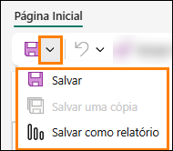

4. Se você tiver concluído a configuração anteriormente neste laboratório, agora poderá salvar esta exploração. Agora você receberá um pop-up para **Salvar** essa exploração, escolher o espaço de trabalho que você criou durante a configuração e pressione **Salvar**.

    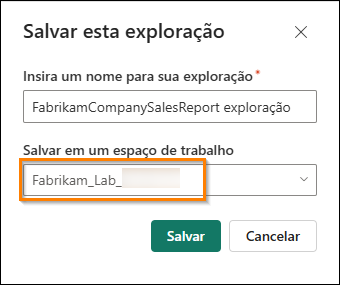

5. Na captura de tela abaixo, você poderá ver um **exemplo** de como as explorações aparecerão em seu espaço de trabalho após serem salvas:

    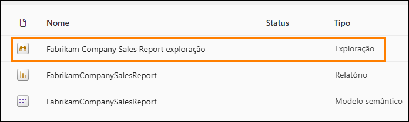

6. Você também pode compartilhar sua exploração com outras pessoas, só pode compartilhar sua exploração se primeiro salvá-la em um espaço de trabalho!

7. De volta ao seu espaço de trabalho, encontre a exploração e clique no ícone de compartilhamento. Você receberá um pop-up que permite compartilhar essa exploração por link, por email ou pelo Teams! Observação. **Não estamos compartilhando explorações neste workshop, feche esta caixa e prossiga para a próxima etapa!**

    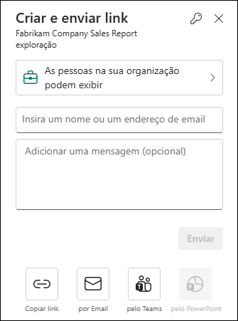

8. Reserve algum tempo para abrir a exploração e explorar outros recursos!

    - Alterar o tipo de visual

    - Alterar as colunas e medidas que estão sendo exibidas

9. Quando terminar de explorar, clique no **X** no canto superior direito para fechar sua exploração.

    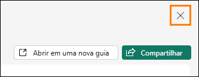

## Tarefa 5: Respostas verificadas

No início da aula, você gastou um tempo preparando seu modelo de dados para IA. Parte da preparação de seus dados para IA é criar respostas verificadas. As respostas verificadas garantem que determinadas visualizações sejam retornadas quando as perguntas forem feitas no Copilot. Isso proporciona uma experiência mais organizada e consistente para o usuário final, além de garantir precisão, consistência e confiança em todos os relatórios!

1. Nesta próxima sessão, você também aprenderá como pode melhorar ainda mais a experiência de prompt adicionando itens para obter melhores insights. Ao anexar explicitamente um item, o Copilot pode restringir o escopo de trabalho, fornecendo resultados muito mais claros e concisos. Atualmente, você pode anexar três itens ao prompt com um quarto em breve:

    - Relatórios

    - Modelos Semânticos

    - Agentes de Dados

    - Aplicativos (em breve)

2. Clique em **+ Adicionar conteúdo para referência do Copilot**, encontrado no canto inferior esquerdo do prompt.

    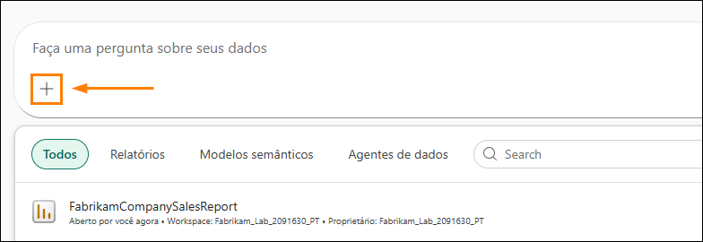

3. Selecione **Relatórios** nas opções listadas. Em seguida, selecione **Fabrikam Company Sales Report**. Clique em **Confirmar**.

    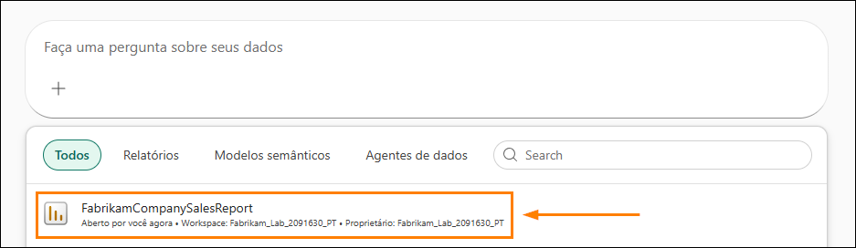

4. Este relatório agora aparece como vinculado no prompt do Copilot! Em seguida, preencha o prompt digitando **Qual é o nosso produto mais vendido?**

    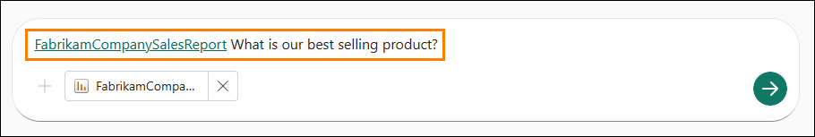

5. Você deverá receber o seguinte deste prompt. Se uma resposta verificada foi usada na resposta, uma notificação aparecerá acima da resposta. *Veja a captura de tela abaixo*.

6. Você também terá a opção de exibir o relatório e explorar os dados.

    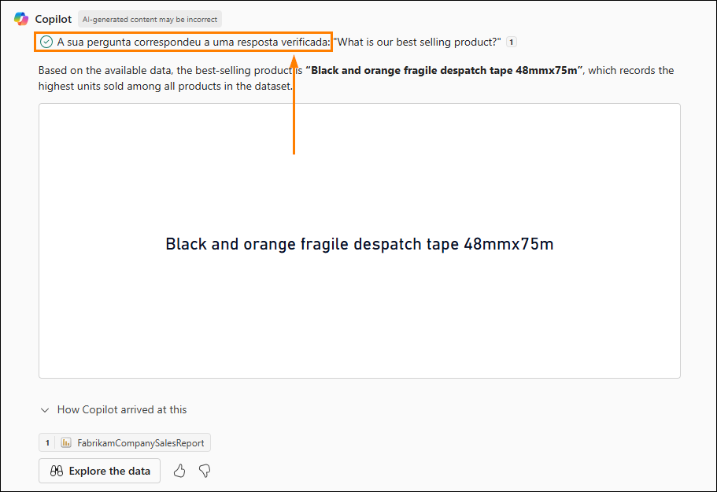

## Tarefa 6: Como o Copilot chegou a isso (HCAAT)

Às vezes, o Copilot não apenas fornece uma resposta, mas explica como ele chegou a ela. Isso fornece um vislumbre dos bastidores da lógica, filtros, medidas e muito mais que moldaram a resposta. Mais especificamente, isso é conhecido como HCAAT ou Como o Copilot chegou a isso. Esses insights são mais do que apenas úteis, eles permitem que você valide resultados, crie confiança no resultado e aprofunde sua compreensão do modelo subjacente. Quando isso acontece, pode ser muito perspicaz e oferecer uma maneira de validar os resultados.

1. Abaixo da resposta verificada, clique em **Como o Copilot chegou a isso**.

2. Você verá a pergunta que fez, os dados usados para responder à pergunta e todos os filtros que foram aplicados.

    

3. O HCAAT pode retornar resultados diferentes com base em como chegou aos resultados. Vamos ver outro exemplo.

4. No prompt do Copilot, anexe o **Fabrikam Company Sales Report** e digite o seguinte: **return all customers that make up the top 1% of total sales.**

    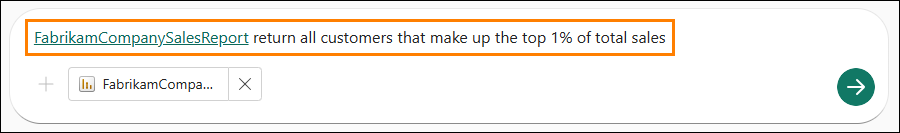

5. Vamos revisar os resultados.

    - (1) Primeiro, temos a resposta de que a resposta exigiu mais análise do que o normal. Este é um resultado gerado pelo DAX desde o Copilot. Verifique o código! Ele também pode mostrar que os dados não são totalmente aprovados, uma vez que são gerados pelo DAX.

        

    - (2) A tabela exibindo os resultados. Os resultados parecem ótimos. Observe que, apesar de termos solicitados Customers, estamos recebendo Resellers. Isso ocorre porque, quando preparamos nossos dados para a IA, removemos a tabela Customer e usamos um sinônimo de Reseller.

    - (3) Como o Copilot chegou a isso

    - (4) Fabrikam Sales Report

    - (5) A Consulta DAX gerada pelo Copilot para chegar aos resultados

        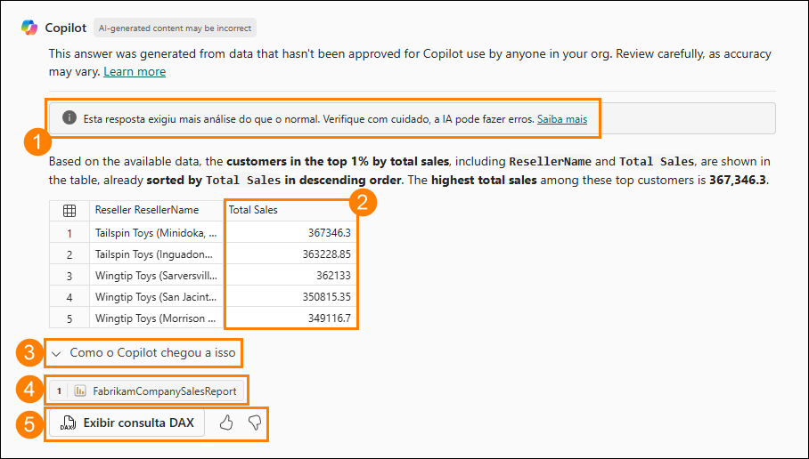

6. Primeiro, vamos explorar o HCAAT. Clique em **Como o Copilot chegou a isso** para expandir a descrição.

7. Desta vez, o resultado obtido é muito diferente do anterior. Você receberá uma descrição narrativa explicando como o Copilot chegou a essa resposta.

    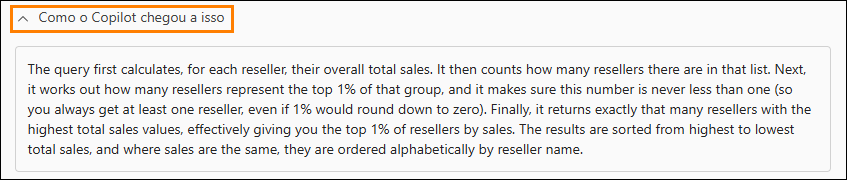

    Nesta seção, você aprendeu que o Copilot às vezes compartilha como chegou a uma resposta específica. A maneira como o Copilot compartilha ou exibe essas informações pode variar de acordo com o processo usado pelo Copilot para retornar a resposta!

## Tarefa 7: Uma resposta de dados de uma consulta DAX gerada pelo Copilot

No exemplo anterior, o Copilot gerou uma consulta DAX examinando os dados subjacentes no modelo Semântico. Além disso, o Copilot alertou você para verificar a precisão dos resultados! Vamos mergulhar mais na resposta.

1. Observando os resultados na captura de tela acima, é possível ver que o total de vendas se repete para cada cliente (lembre-se de que criamos um sinônimo tornando Nome do Revendedor = Clientes). Isso geralmente é uma indicação de que não há um relacionamento válido entre as tabelas que fazem parte da resposta que estamos recebendo.

2. Clique em **Exibir Consulta DAX**.

    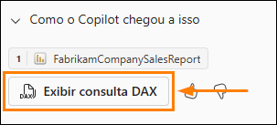

3. Isso fornecerá uma caixa de diálogo pop-up que mostra a consulta DAX gerada, juntamente com comentários embutidos de como a solução chegou a essa resposta. Na parte inferior, você verá a descrição de como o Copilot chegou a esse resultado. Por fim, na parte inferior do pop-up você tem duas opções que você pode executar.

    - Executar Consulta – isso pegará o DAX atual e a abrirá na Exibição de Consulta DAX

    - Copiar Consulta – essa opção copiará o DAX para a área de transferência

        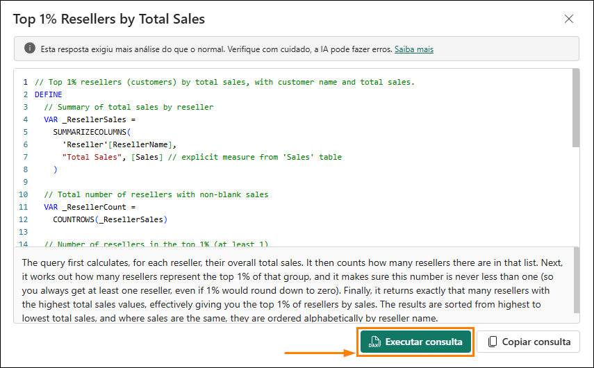

4. Clique em **Executar consulta**. Uma nova guia será aberta no navegador da Web para a exibição Consulta DAX no Modelo Semântico da Fabrikam Company.

    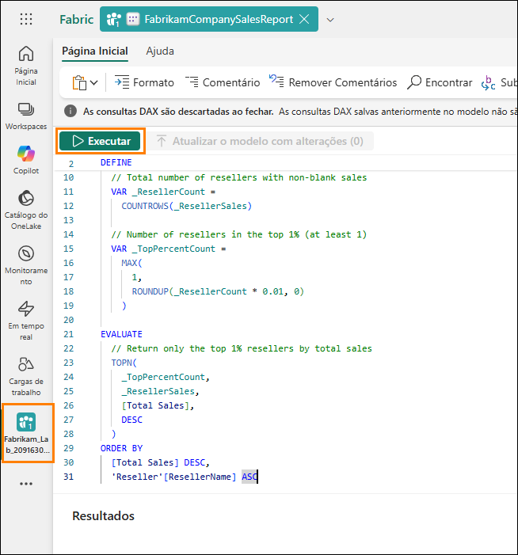

5. Clique em **Executar** para ver os resultados aqui na Exibição Consulta DAX. Os resultados aqui são iguais aos que recebemos do Copilot. Se você estiver familiarizado com a linguagem DAX, poderá modificar a expressão DAX para refinar ainda mais seus resultados.

    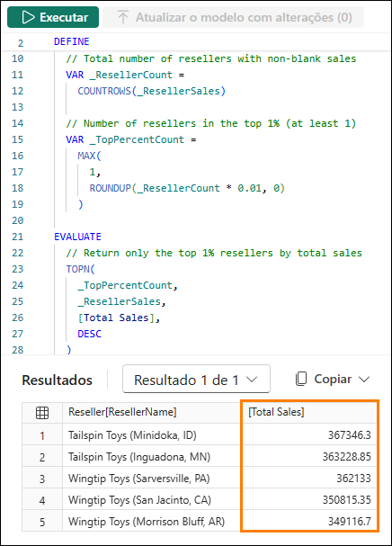

6. Essa parece ser uma ótima resposta do Copilot e toda a nossa preparação valeu a pena. Se eu abrir o Power BI Desktop de backup e criar um visual rápido, posso verificar rapidamente se a resposta do Copilot está correta!

    

7. A outra coisa a ressaltar aqui é que você também tem acesso para ver a exibição do modelo. A partir daqui você pode validar as tabelas e relacionamentos no modelo semântico.

    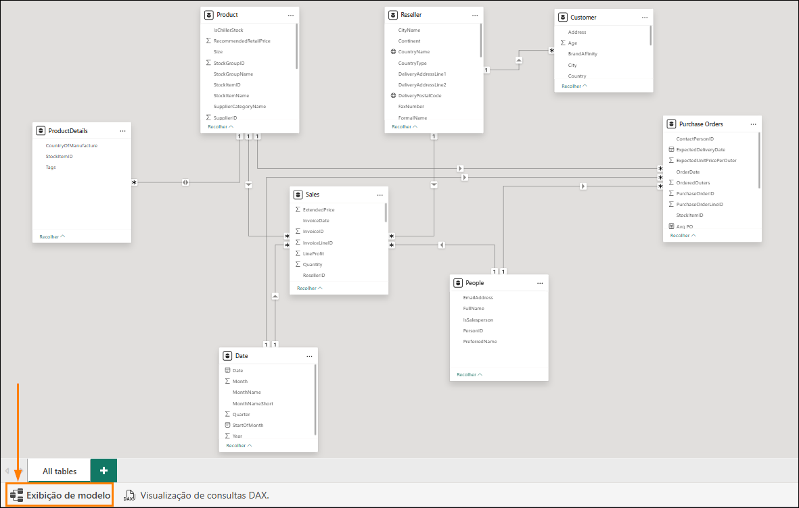

    Neste laboratório, você aprendeu que pode exibir o DAX gerado pelo Copilot, iniciar a exibição Consulta DAX e modificar o código existente e até mesmo entrar na exibição de modelo e verificar os relacionamentos.

    **ℹ️ Importante**

    A experiência Chat with your Data é uma ferramenta extremamente útil que melhorará significativamente o tempo de insights para corporações em todo o mundo. No entanto, esses resultados também podem ser incorretos ou enganosos. É muito importante parar e validar os resultados como vimos neste laboratório!

## Tarefa 8: Alternância de contexto no Copilot

Até agora, neste workshop, seu foco tem sido exclusivamente os dados de Fabrikam Company Sales. No entanto, nossa organização tem muitos relatórios diferentes em vários espaços de trabalho, e a experiência do Copilot Autônomo fará referência a todos os relatórios aos quais ele tiver acesso.

1. Navegue até seus arquivos de classe e abra o **State of Nevada COVID-19 Dashboard.**

    

2. Publique este relatório totalmente concluído em seu **Fabrikam_lab_0000000.**

    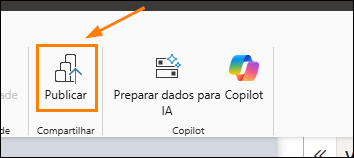

    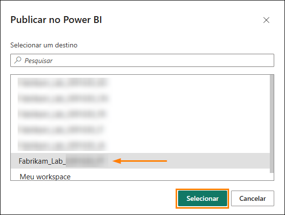

3. Agora você poderá consultar esse modelo semântico e relatório na Experiência do Copilot Autônomo. No prompt do Copilot, digite o seguinte: **How many confirmed cases have there been?** Certifique-se de usar **o botão + (1), Modelos semânticos (2)** e **StateofNevadaCOVID-19Dashboard (3)** caso não seja imediatamente incluído. Nós propositalmente fornecemos um prompt muito genérico, e o Copilot foi capaz de descobrir o que você queria com base no conteúdo do relatório! Lembre-se de que, abaixo do relatório fornecido, o Copilot informa os critérios aos quais ele corresponde.

    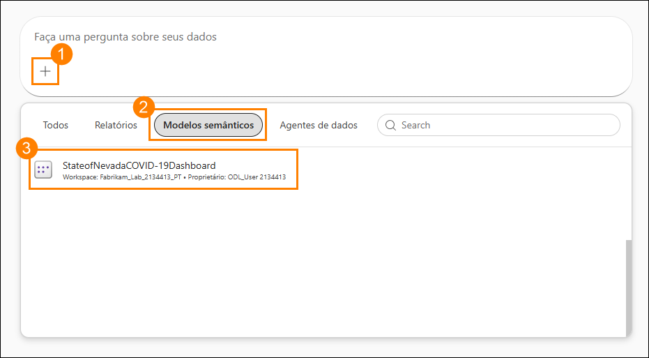

4. Perfeito! O Copilot agora responde às nossas perguntas retornando um elemento visual do relatório subjacente. Lembre-se de que você pode obter várias saídas de exibição diferentes do Copilot.

    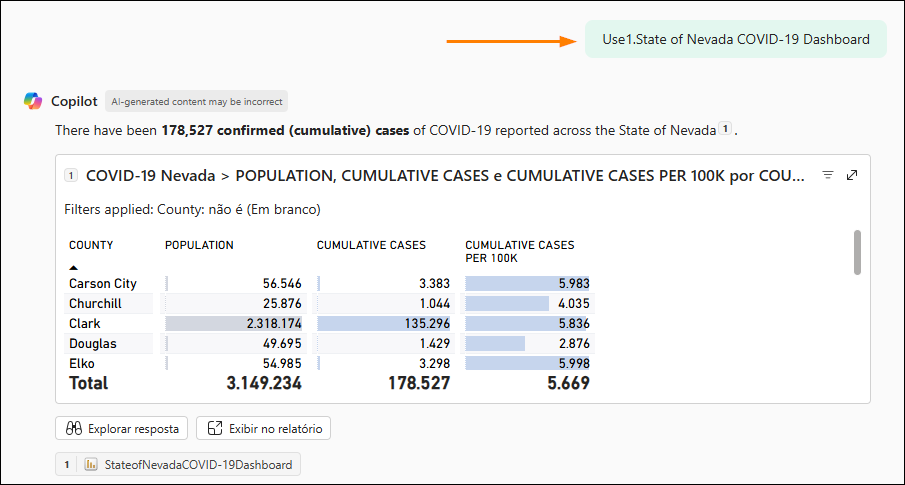

    OU

    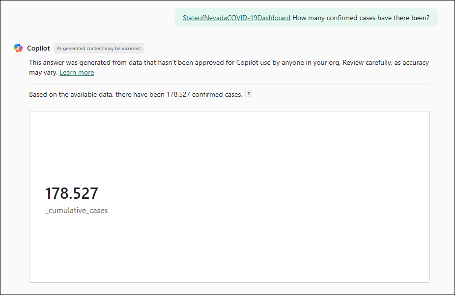

5. Faça outra pergunta aos dados, no tipo de prompt: **How many deaths were there in Carson City in 2019?**

    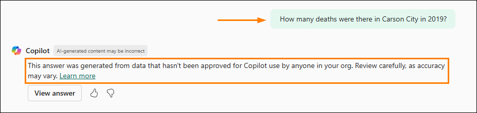

6. Desta vez, o Copilot não encontrou um elemento visual existente que pudesse retornar e, como resultado, o Copilot gerou uma resposta dos dados subjacentes do relatório. Quando isso acontece, em um modelo que não está marcado como Preparado para IA, você recebe uma **resposta de atrito**.

    **ℹ️ Importante**

    Uma resposta de atrito é um aviso ou limitação gerado pelo sistema que aparece quando o Copilot encontra um modelo de dados não preparado ou mal descrito. O Copilot está essencialmente dizendo: eu posso tentar ajudar com as informações disponíveis, no entanto, os resultados devem ser validados!

    Para reduzir as respostas de atrito do Copilot, certifique-se de preparar seus modelos semânticos para IA e marque o modelo semântico como Preparado para IA após a publicação. Consulte o documento de diretrizes Configurações do Locatário fornecido em seus arquivos de laboratório.

## Tarefa 9: A construção do Copilot de um visual desde o Modelo Semântico

Em laboratórios anteriores, você observou o Copilot retornando visualizações para responder a perguntas específicas. Essas visualizações eram visuais que já existiam em nossos relatórios. Nesta seção, você verá como o Copilot também pode criar visualizações do modelo semântico para responder a solicitações.

1. Se você ainda não estiver no Copilot, navegue de volta até o Copilot no Fabric.

2. No prompt, anexe o **Fabrikam Company Sales Report** e digite o seguinte: **Show me units sold over time**.

    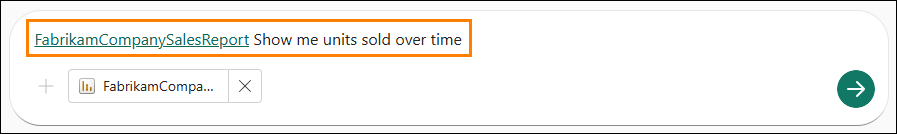

3. A visualização retornada não é um elemento visual que existia anteriormente no relatório. Esta é uma visualização que foi criada pelo Copilot com base no modelo Semântico! Na verdade, ao contrário dos visuais que vêm de um relatório diretamente, essa resposta gerada pelo Copilot vem com uma explicação do HCAAT, *Como o Copilot chegou a isso*.

    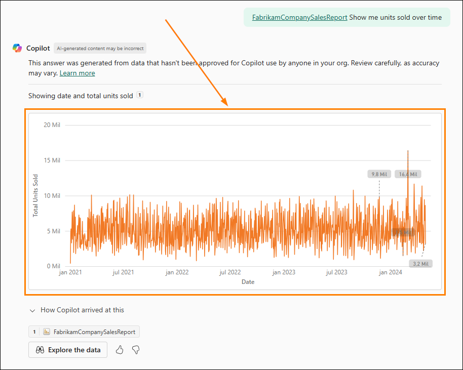

4. Vamos explorar os resultados, clique em **Como o Copilot chegou a isso**.

    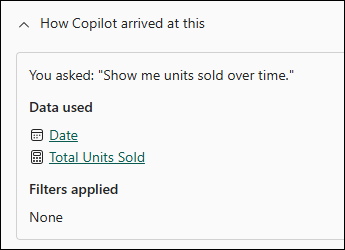

## Tarefa 10: Experiência geral do Copilot

Neste laboratório, você aprendeu a aproveitar a experiência do Copilot Autônomo no Microsoft Fabric para explorar seus relatórios e modelos semânticos existentes. Entretanto, você também pode aproveitar a experiência geral do Copilot. Neste laboratório, aproveitaremos o Copilot para criar um email sobre as nossas descobertas!

1. No prompt do Copilot, digite **Take the conversation so far and turn it into an email to share with the team**.

    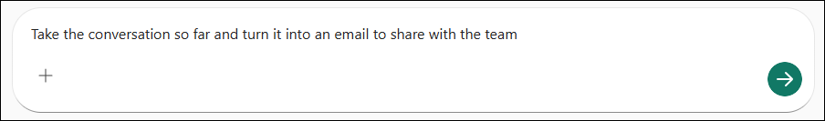

2. Os resultados são bem legais! Como lembrete, sua resposta terá uma aparência muito diferente da captura de tela. Também é importante lembrar que a resposta se baseia em seu chat aberto atual com o Copilot, caso você tenha limpado o chat ou tenha um histórico de conversas muito pequeno, e isso afetará os resultados finais.

    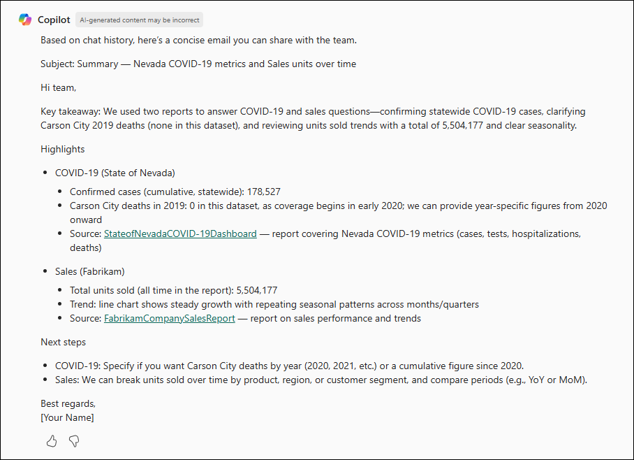

3. Isso é bom, mas seria muito melhor se tivéssemos algumas visualizações e links no email.
    N prompt do Copilot, peça ao Copilot para **Add visuals and links to the email**.

    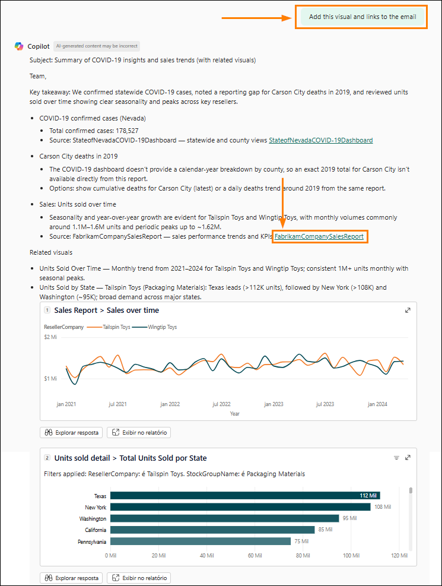

# Referências

O Chat with your Data in a Day (CDIAD) apresenta alguns dos principais recursos ao usar o Copilot Autônomo em um workspace do Fabric.

No menu do serviço, a seção Ajuda (?) tem links para ótimos recursos. Lembre-se de que o modo de exibição que você vê depende da experiência na qual você está atualmente e, portanto, as opções podem parecer diferentes da captura de tela abaixo.

Veja aqui mais alguns recursos que ajudarão você com as próximas etapas do Microsoft Fabric.

- Acesse todas as informações na [Documentação principal do Microsoft Fabric](https://learn.microsoft.com/en-us/fabric/)

- Explore o Fabric por meio do [Tour Guiado](https://aka.ms/Fabric-GuidedTour)

- Inscreva-se na [avaliação gratuita do Microsoft Fabric](https://aka.ms/try-fabric)

- Visite o [site do Microsoft Fabric](https://aka.ms/microsoft-fabric)

- Aprenda novas habilidades explorando os [módulos de Aprendizagem do Fabric](https://aka.ms/learn-fabric)

- Leia o [livro eletrônico](https://aka.ms/fabric-get-started-ebook) [gratuito sobre como começar a usar o Fabric](https://aka.ms/fabric-get-started-ebook)

- Participe da [comunidade do Fabric](https://aka.ms/fabric-community) para postar suas perguntas, compartilhar seus comentários e aprender com outras pessoas

Leia a documentação técnica mais detalhada relevante para o Copilot:

- [Visão geral do Copilot para Power BI - Power BI | Microsoft Learn](https://learn.microsoft.com/en-us/power-bi/create-reports/copilot-introduction)

- [Experiência do Copilot Autônomo no Power BI (Versão Prévia) – Power BI | Microsoft Learn](https://learn.microsoft.com/en-us/power-bi/create-reports/copilot-chat-with-data-standalone)

- [Configurações de administrador do Microsoft Fabric Copilot | Microsoft Learn](https://learn.microsoft.com/en-us/fabric/admin/service-admin-portal-copilot)

- [Criação de agente de dados do Fabric (versão prévia) - saiba como criar um agente de dados do Fabric | Microsoft Learn](https://learn.microsoft.com/en-us/fabric/data-science/concept-data-agent)

- [Práticas recomendadas para configurar agentes de dados - Microsoft Fabric | Microsoft Learn](https://learn.microsoft.com/en-us/fabric/data-science/data-agent-configuration-best-practices)

- [Copilot para Microsoft Fabric e Power BI: perguntas frequentes - Microsoft Fabric | Microsoft Learn](https://learn.microsoft.com/en-us/fabric/fundamentals/copilot-faq-fabric)

© 2026 Microsoft Corporation. Todos os direitos reservados.

Ao usar esta demonstração/este laboratório, você concorda com os seguintes termos:

A tecnologia/funcionalidade descrita nesta demonstração/neste laboratório é fornecida pela Microsoft Corporation para obter seus comentários e oferecer uma experiência de aprendizado. Você pode usar a demonstração/o laboratório somente para avaliar tais funcionalidades e recursos de tecnologia e fornecer comentários à Microsoft. Você não pode usá-los para nenhuma outra finalidade. Você não pode modificar, copiar, distribuir, transmitir, exibir, executar, reproduzir, publicar, licenciar, criar obras derivadas, transferir nem vender esta demonstração/este laboratório ou qualquer parte deles.

A CÓPIA OU A REPRODUÇÃO DA DEMONSTRAÇÃO/DO LABORATÓRIO (OU DE QUALQUER PARTE DELES) EM QUALQUER OUTRO SERVIDOR OU LOCAL PARA REPRODUÇÃO OU REDISTRIBUIÇÃO ADICIONAL É EXPRESSAMENTE PROIBIDA.

ESTA DEMONSTRAÇÃO/LABORATÓRIO FORNECE DETERMINADAS TECNOLOGIAS DE SOFTWARE/RECURSOS E FUNCIONALIDADE DO PRODUTO, INCLUINDO POTENCIAIS NOVOS RECURSOS E CONCEITOS, EM UM AMBIENTE SIMULADO SEM CONFIGURAÇÃO OU INSTALAÇÃO COMPLEXA PARA A FINALIDADE DESCRITA ACIMA. A TECNOLOGIA/CONCEITOS REPRESENTADOS NESTA DEMONSTRAÇÃO/LABORATÓRIO PODEM NÃO REPRESENTAR A FUNCIONALIDADE COMPLETA DO RECURSO E PODEM NÃO FUNCIONAR DA MESMA FORMA QUE UMA VERSÃO FINAL. NÓS TAMBÉM PODEMOS NÃO LANÇAR UMA VERSÃO FINAL DE TAIS RECURSOS OU CONCEITOS. SUA EXPERIÊNCIA COM O USO DE TAIS RECURSOS E FUNCIONALIDADES EM UM AMBIENTE FÍSICO TAMBÉM PODE SER DIFERENTE.

**COMENTÁRIOS.** Caso você forneça comentários sobre os recursos de tecnologia, as funcionalidades e/ou os conceitos descritos nesta demonstração/neste laboratório à Microsoft, você concederá à Microsoft, sem encargos, o direito de usar, compartilhar e comercializar seus comentários de qualquer forma e para qualquer finalidade. Você também concede a terceiros, sem encargos, quaisquer direitos de patente necessários para que seus produtos, suas tecnologias e seus serviços usem ou interajam com partes específicas de um software ou um serviço da Microsoft que inclua os comentários. Você não fornecerá comentários que estejam sujeitos a uma licença que exija que a Microsoft licencie seu software ou sua documentação para terceiros em virtude da inclusão de seus comentários neles. Esses direitos continuarão em vigor após o término do contrato.

A MICROSOFT CORPORATION SE ISENTA DE TODAS AS GARANTIAS E CONDIÇÕES COM RELAÇÃO A DEMONSTRAÇÃO/LABORATÓRIO, INCLUINDO TODAS AS GARANTIAS E CONDIÇÕES DE COMERCIALIZAÇÃO, SEJAM EXPRESSAS, IMPLÍCITAS OU ESTATUTÁRIAS, ADEQUAÇÃO A UM DETERMINADO FIM, TÍTULO E NÃO VIOLAÇÃO. A MICROSOFT NÃO DECLARA NEM GARANTE A PRECISÃO DOS RESULTADOS DERIVADOS DO USO DA DEMONSTRAÇÃO/DO LABORATÓRIO NEM A ADEQUAÇÃO DAS INFORMAÇÕES CONTIDAS NA DEMONSTRAÇÃO/NO LABORATÓRIO A QUALQUER FINALIDADE.

**AVISO DE ISENÇÃO DE RESPONSABILIDADE**

Esta demonstração/este laboratório contém apenas uma parte dos novos recursos e aprimoramentos do Microsoft Power BI. Alguns dos recursos podem ser alterados em versões futuras do produto. Nesta demonstração/neste laboratório, você aprenderá sobre alguns dos novos recursos, mas não todos.
