# Microsoft Fabric Chat with your Data in a Day - Laboratório 5

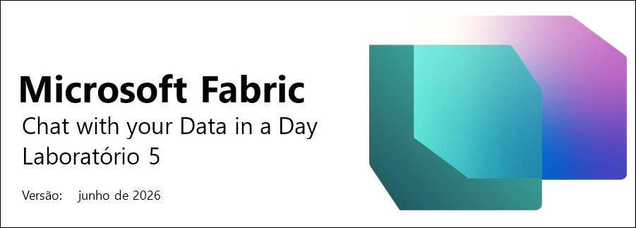

## Conteúdo

- Estrutura do documento
- Cenário/Declaração do problema
- Introdução
- Implementar Agentes de Dados do Fabric
- Pré-requisitos
  - Tarefa 1: Criar seu Agente de Dados
  - Tarefa 2: Adicionar Fontes de Dados
  - Tarefa 3: Fazer perguntas ao Agente de Dados
  - Tarefa 4: Adicionar instruções de IA
- Destaque: Substituição de uma fonte de dados
  - Tarefa 5: Adicionar outras Fontes de Dados
- Destaque: Instruções da fonte de dados
  - Tarefa 6: Criar exemplos de perguntas
  - Tarefa 7: Publicar e compartilhar seu Agente de Dados
  - Tarefa 8: Consumir um Agente de Dados do Copilot
- Referências

# Estrutura do documento

O laboratório inclui as etapas a serem seguidas pelo usuário juntamente com as capturas de tela associadas que fornecem auxílio visual. Em cada captura de tela, as seções estão destacadas com caixas laranjas para indicar as áreas nas quais o usuário deve se concentrar.

# Cenário/Declaração do problema

A experiência do Copilot Autônomo tem sido um enorme sucesso, proporcionando a toda a sua organização um tempo mais rápido para insights e aumentando a adoção geral!

No entanto, a experiência do Copilot não é altamente personalizável e agora você tem usuários finais que desejam experiências mais organizadas, onde possam focar suas perguntas em áreas muito específicas do negócio, sem a necessidade de decifrar relatórios e modelos semânticos não relacionados. Você foi encarregado de criar um Agente de Dados conectado somente aos dados relacionados aos dados do Fabrikam Company Sales Report. Você também precisa adicionar alguns dados adicionais ao agente de dados que não estão disponíveis para a experiência do Copilot Autônomo para responder a perguntas mais específicas que sua equipe deseja fazer sobre o prazo de entrega do produto.

# Introdução

Você aprendeu sobre a experiência do Copilot Autônomo, que é excelente para explorar todos os seus dados em todos os seus espaços de trabalho. No entanto, o uso de Agentes de Dados pode fornecer uma experiência mais organizada para conversar com dados específicos. Os Agentes de Dados podem se conectar a fontes de dados específicas ou até mesmo tabelas específicas dentro das fontes de dados. Enquanto o Copilot é um Assistente de IA dentro do Fabric que permite produtividade e inteligência, os Agentes de Dados permitem a conectividade de dados.

Ao final deste laboratório, você terá aprendido a:

- Criar um Agente de Dados

- Adicionar fontes de dados ao seu agente

- Fazer perguntas aos seus agente

- Adicionar instruções de IA para seu agente usar

- Substituir uma fonte de dados

- Adicionar fontes de dados adicionais

- Criar exemplos de perguntas

- Publicar e compartilhar seu agente

- Consumir o Agente de Dados do Copilot Autônomo

# Implementar Agentes de Dados do Fabric

Nesta seção, você aprenderá a criar um Agente de Dados. O agente pode recuperar dados gerando consultas estruturadas (SQL, DAX, KQL) para responder a perguntas envolvendo fatos, totais, classificações ou filtros. No momento em que este artigo foi escrito, os Agentes de Dados do Fabric estão atualizando uma versão prévia do recurso no Microsoft Fabric e não são recomendados para cargas de trabalho de produção. Você pode ler mais sobre como o Agente de Dados do Fabric funciona aqui:

[Criação de agente de dados do Fabric (versão prévia) - saiba como criar um agente de dados do Fabric | Microsoft Learn](https://learn.microsoft.com/en-us/fabric/data-science/concept-data-agent)

Os agentes de dados do Microsoft Fabric permitem que os usuários interajam com dados corporativos em inglês simples, eliminando a necessidade de SQL, DAX ou KQL. Eles fornecem uma interface de bate-papo com ferramentas de depuração, conectam-se a fontes como os modelos semânticos do Power BI, os bancos de dados KQL, os Lakehouses e os Warehouses. Os Agentes de Dados podem ser acessados dentro e fora do Microsoft Fabric, eles podem ser integrados ao Microsoft Teams, ao Copilot Studio, ao Microsoft Foundry e aos aplicativos personalizados. Os Agentes de Dados também podem ser descobertos da experiência do Copilot Autônomo no Fabric!

## Pré-requisitos

Para usar os Agentes de Dados do Fabric, há muitas configurações de locatário que devem ser habilitadas ou configuradas, consulte o **documento Diretrizes de Configurações do Locatário** localizado em seus laboratórios de aula:

- O Acesso de Administrador é necessário

- Habilitar configurações do Copilot e do OpenAI do Azure

- Habilitar a criação e o compartilhamento do Agente de Dados do Fabric

- Habilitar pontos de extremidade XMLA para Modelos Semânticos do Power BI

## Tarefa 1: Criar seu Agente de Dados

1. Abra um navegador da Web na sua Máquina Virtual, acesse https://fabric.microsoft.com e navegue até o Workspace chamado **Fabrikam_Lab_<inject key="DeploymentID" enableCopy="false"/>_PT**

    *(**Importante**: use o espaço de trabalho criado anteriormente nesta classe)*

    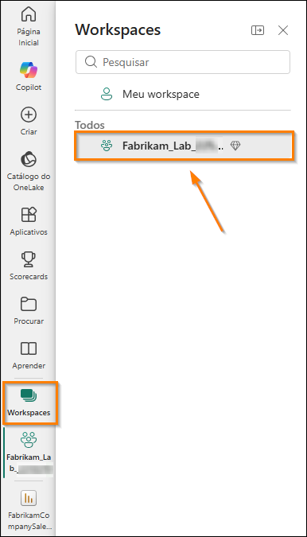

2. Clique em **+ Novo Item**:

    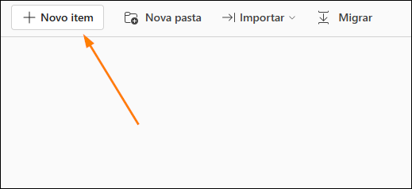

3. Na barra de pesquisa que é aberta, digite **agent** e selecione **Agente de dados (versão prévia).**

    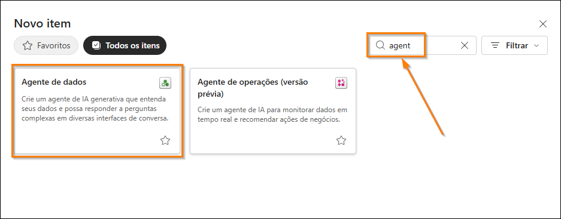

4. Dê um nome ao seu agente, **FabrikamSales_agent_<inject key="DeploymentID" enableCopy="false"/>**

5. Lembre-se, seu código de usuário é encontrado em seu nome de usuário, como visto abaixo:

    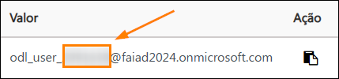

6. Clique em **Criar.**

    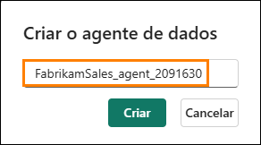

## Tarefa 2: Adicionar Fontes de Dados

1. Depois de criar um Agente de Dados, a próxima etapa é adicionar suas fontes de dados!

2. No painel do Explorer, clique no botão **+ Fonte de dados**. Como alternativa, você pode clicar no botão **Adicionar dados** mostrada no meio da tela.

    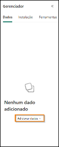

    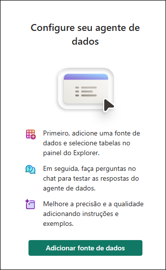

3. Escolha o modelo semântico **Fabrikam Company Sales Report** na lista e clique em **Adicionar**.

    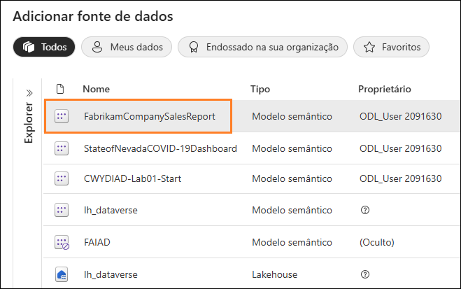

4. Observe que nenhuma tabela foi selecionada ainda e o agente de dados não pode responder perguntas até que pelo menos uma fonte de dados seja selecionada. Clique no **>** ao lado do **Fabrikam Company Sales Report** no painel **Explorer**. Selecione as tabelas mostradas na captura de tela abaixo.

    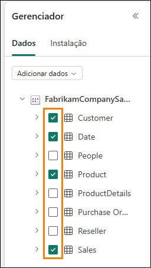

## Tarefa 3: Fazer perguntas ao Agente de Dados

1. Agora que seu agente está conectado a uma fonte de dados, vamos começar a gravar alguns prompts para o agente de dados.

2. Digite o seguinte comando: **Show me sales by country.**

    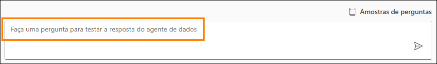

3. O agente pode levar vários segundos para responder com uma resposta. Observe o que o agente retornou:

    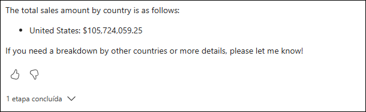

4. Clique na lista suspensa da etapa concluída para mostrar o que o agente fez e, em seguida, na próxima lista suspensa para revelar os detalhes.

    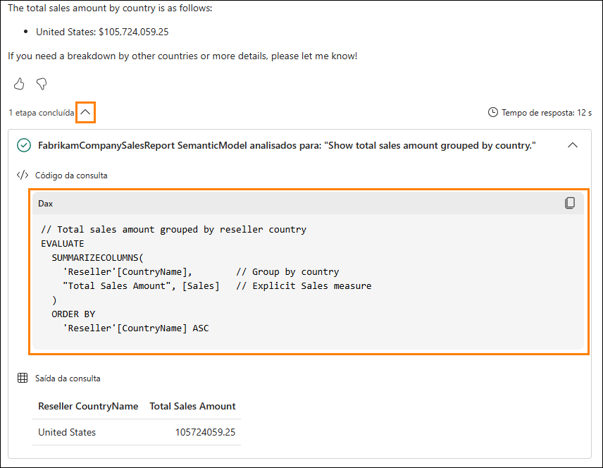

    **ℹ️ Importante**

    Ao desenvolver um Agente de Dados do Fabric, é importante passar um tempo validando os resultados para garantir a precisão e a consistência. Agora que você tem resultados, vamos voltar para o modelo semântico e validar os resultados lá!

5. Navegue até os arquivos de classe baixados e abra o arquivo **Fabrikam Company Sales Report.pbix**.

    

6. Clique na parte inferior do relatório para abrir uma nova página de relatório.

    

7. Em seguida, você criará um visual básico para validar os resultados retornados pelo agente de dados.

8. Adicione um visual de tabela nesta nova página de relatório.

    

    

9. A tabela resultante deverá ter a seguinte aparência:

    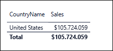

10. Observe que o valor total de venda é igual à saída da consulta do Agente de Dados acima. Isso valida que a consulta do agente retornou a saída correta.

## Tarefa 4: Adicionar instruções de IA

As instruções de IA podem ser adicionadas ao Agente de Dados do Fabric para melhorar a precisão e a consistência. As Instruções de IA podem ser adicionadas em dois locais separados no Agente de Dados.

Primeiro, as instruções de IA podem ser adicionadas ao próprio agente, elas são conhecidas especificamente como **instruções do Agente** e ajudam o Agente a identificar quais fontes de dados usar para determinadas perguntas, qual tom usar, que tipo de dados priorizar e outras preferências comportamentais ou contextuais semelhantes que moldam como o agente responde aos usuários.

O segundo tipo de instrução de IA é **instruções de fonte de dados**, com instruções de fonte de dados você pode adicionar instruções para ajudar o agente de dados a entender os dados da fonte de dados e como usá-los de forma mais eficaz. Atualmente, as **instruções de fonte de dados** não têm suporte nos modelos semânticos. Veremos esse recurso em uma data posterior!

1. Vamos começar com as **Instruções do agente** na interface do navegador do Fabric. Portanto, podemos dizer ao agente que queremos adicionar um resumo conciso adicionado para cada resposta!

2. Selecione as instruções de IA na guia da página inicial.

    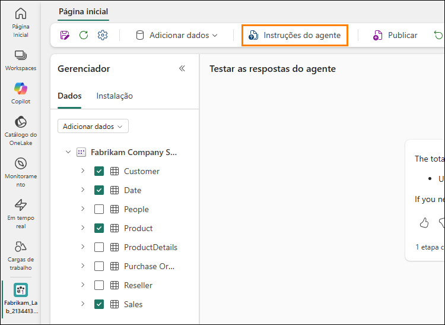

3. Na caixa **Instruções do agente** da janela de instruções de IA acima ou abaixo das instruções genéricas existentes, digite as seguintes instruções:

    **## Set Response Guidelines**

    **Always include a concise summary before the detailed breakdown.**

    **ℹ️ Importante**

    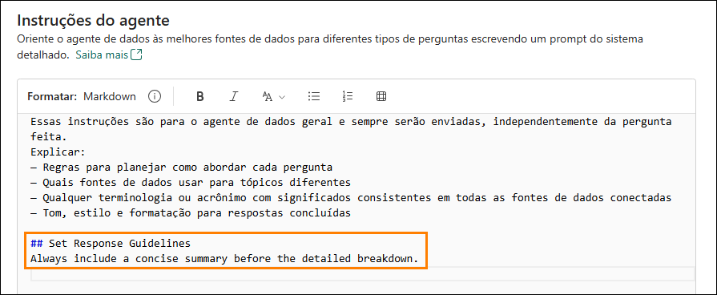

    Às vezes, pode levar tempo para que as instruções de IA entrem em vigor. Se você não obtiver os resultados desejados, clique no botão Limpar Chat claro na parte superior da janela do agente e tente novamente!

4. Clique no **X** no canto superior direito da guia “Instruções do agente” para fechar as instruções de IA e salvar suas alterações.

    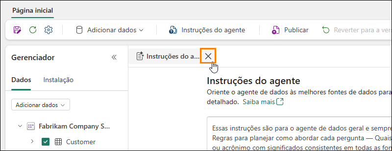

    **ℹ️ Importante**

    Às vezes, pode levar tempo para que suas instruções de IA entrem em vigor. Se você não obtiver os resultados desejados, clique no botão de chat claro na parte superior da janela do seu agente e tente novamente!

    Dê ao agente o mesmo prompt fornecido anteriormente: **Show me sales by country** e pressione Enter.

    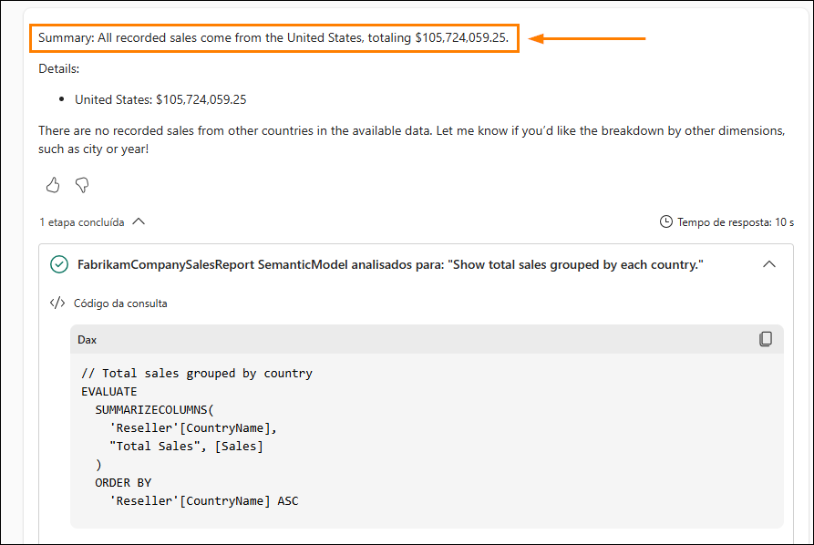

5. Vamos adicionar outra instrução de IA para refinar ainda mais a resposta de IA. Neste exemplo, você adicionará um comando no prompt para sempre retornar uma tabela em vez de uma lista com marcadores. Abra as instruções de IA e, nas Instruções do Agente, adicione a seguinte linha de código:

    **Always return a table instead of bullet points**

    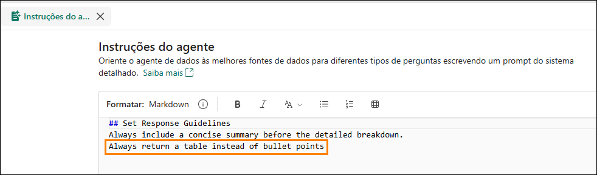

6. Feche a janela de instruções de IA e digite o seguinte no prompt do agente de dados: **Return sales by country**

    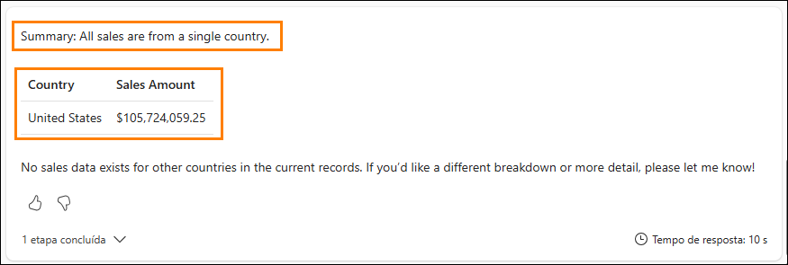

7. Agora você recebe os resultados em formato tabular com um resumo! Até agora isso é ótimo! Vamos adicionar mais algumas instruções.

8. No prompt do agente de dados, digite o seguinte: **Return sales by State**.

    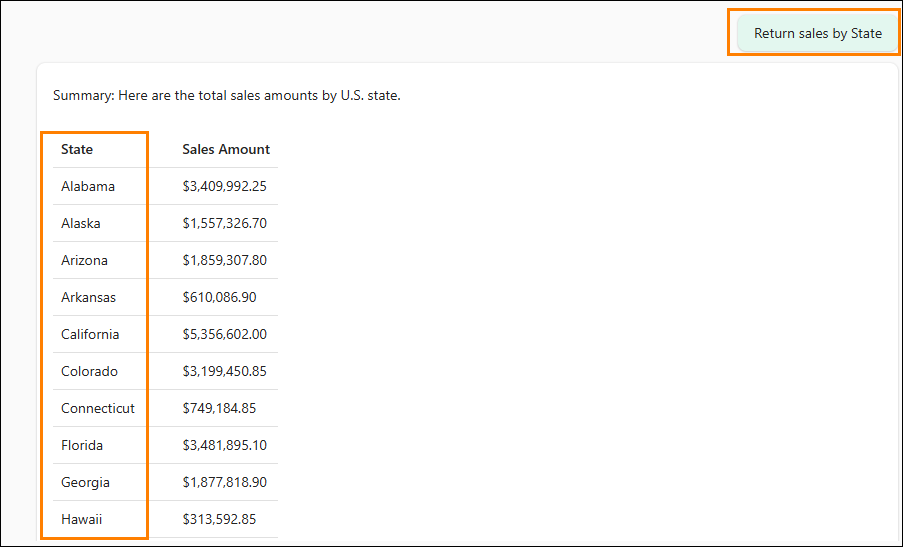

9. Esses resultados são exatamente o que você deve esperar, mas talvez seja demais? Vamos dizer ao prompt de IA para sempre retornar apenas 5 linhas de dados, a menos que especificado de outra forma.

10. Em suas **Instruções de IA** do agente de dados, digite o seguinte:

    **Always provide the top 5 results unless a different number is specified**

    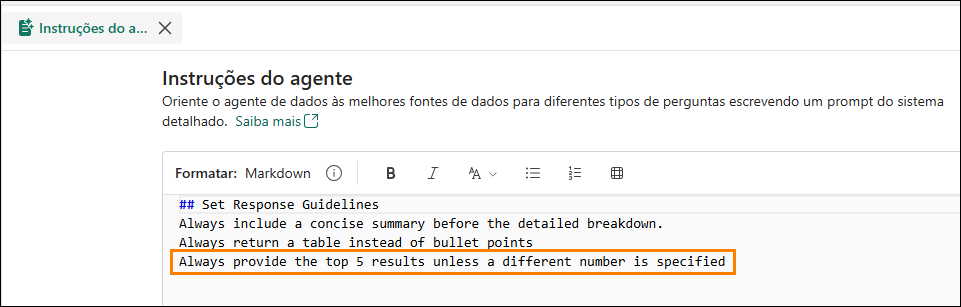

11. Os resultados são perfeitos! Nosso resumo agora esclarece que estamos recebendo os 5 principais estados por vendas. E o prompt do Copilot nos faz solicitar os dados de vendas para todos os estados, se é isso que queremos.

    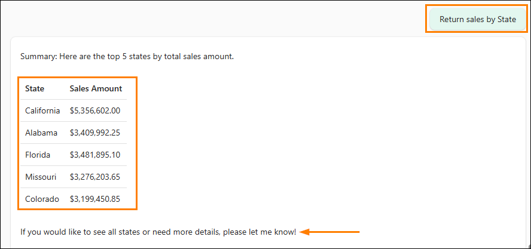

## Destaque: Substituição de uma fonte de dados

Quando trabalhar com agentes de dados, você pode decidir que deseja usar uma fonte de dados diferente. Em nosso exemplo, estamos usando o modelo semântico Fabrikam Company Sales Report. Mas e se quiséssemos usar um modelo semântico diferente? No momento, não há uma maneira de simplesmente substituir uma fonte de dados, no entanto, você pode remover e adicionar fontes de dados ao seu agente de dados a qualquer momento.

1. Para remover uma fonte de dados, acesse o explorer dentro do seu agente de dados e clique nas reticências (**...**) à direita da fonte de dados. No menu suspenso, você tem três opções. Elas são Aberto, Atualizar ou Remover.

    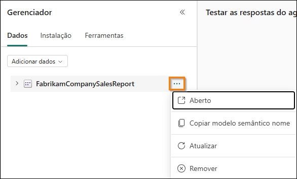

2. Você **NÃO** substituirá a fonte de dados neste laboratório.

## Tarefa 5: Adicionar outras Fontes de Dados

Nós criamos o nosso agente de dados em um modelo semântico bem definido e pensado. Esse modelo semântico foi projetado para responder à maioria, se não a todas as solicitações dos usuários. Você pode encontrar o criador desse modelo semântico e pedir que ele adicione tabelas e informações extras, mas isso pode levar tempo ou sua solicitação pode ser negada.

Você tem um usuário que deseja verificar as vendas por prazo de entrega do produto. Nosso modelo semântico Fabrikam Company Sales não inclui essas informações; no entanto, elas existem nos dados da fonte original armazenados no Lakehouse do Fabric.

Neste laboratório, você adicionará uma fonte de dados adicional para que as informações de prazo de entrega do produto possam ser incluídas nas respostas do agente de dados.

1. Vamos começar criando um Lakehouse e adicionando alguns dados de exemplo. Volte para o Espaço de Trabalho e selecione **Novo Item** mais uma vez:

    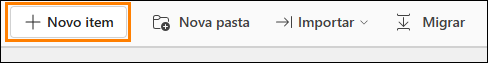

2. Role para baixo e selecione o **Lakehouse** na área Outros itens que você pode criar com o Microsoft Fabric.

    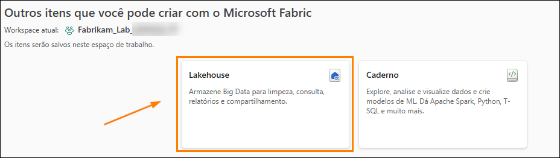

3. Nomeie o novo Lakehouse: **lh_Fabrikam** e pressione **Criar.**

    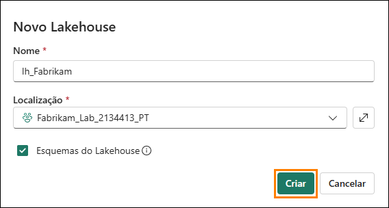

4. Em nosso Lakehouse, usaremos um **Atalho** para conectar-nos a uma versão pré-preparada dos dados da Fabrikam. Abra **Obter Dados** e selecione **Novo Atalho**.

    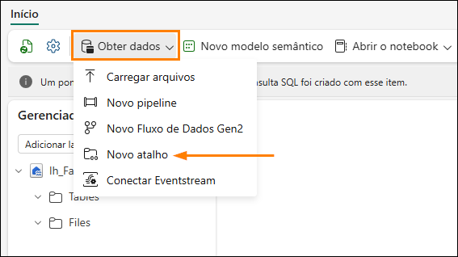

5. Selecione **Azure Data Lake Storage Gen2**.

    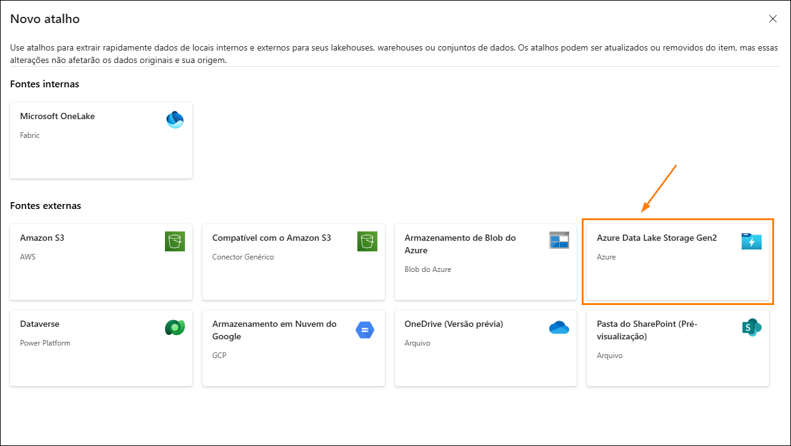

6. Selecione **Nova conexão** e insira a URL da Fabrikam:

    ***https://stvnextblobstorage.dfs.core.windows.net/fabrikam-sales***

    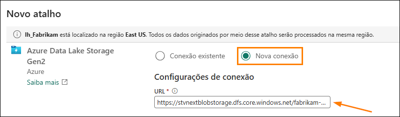

7. Forneça um nome de conexão como **Fabrikam Connector ou semelhante** e, em Tipo de autenticação, clique no menu suspenso e selecione SAS (Assinatura de Acesso Compartilhado).

    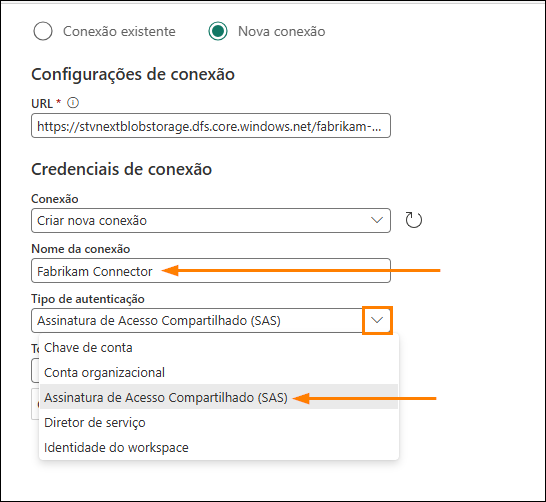

8. Copie o Token SAS da guia Ambiente no lado direito e passe para a área **Token SAS**.

    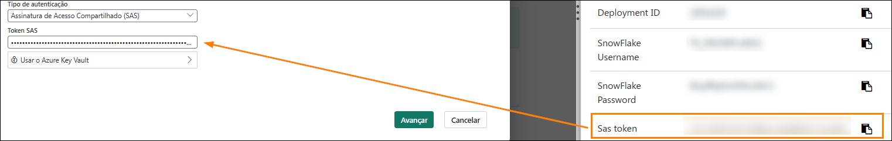

9. Selecione **Avançar**.

    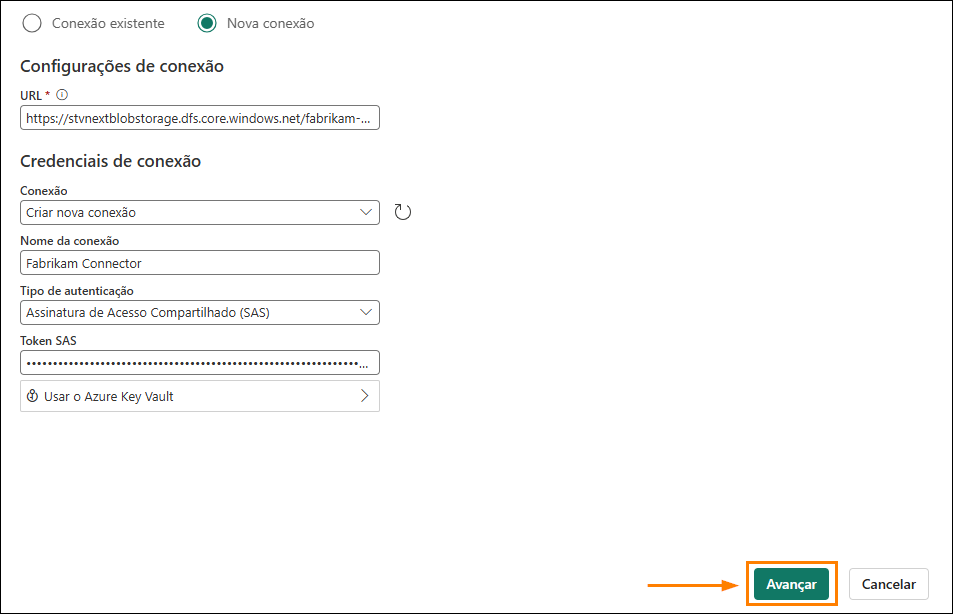

10. Abra o **Delta-Parquet-Format-FY25** e selecione todos os itens, exceto **Sales.Invoices.May** e depois selecione **Avançar**.

    

11. Renomeie o **Nome de Atalho** para cada uma das novas tabelas. É importante usar com facilidade o lakehouse como uma fonte de dados. Siga o formato abaixo:

    Application.Cities para **Cities**

    Application.Countries para **Countries**

    Application.StateProvinces para **StateProvinces**

    DateDim para **Date**

    Sales.BuyingGroups para **BuyingGroups**

    Sales.Customers para **Customers**

    Sales.InvoiceLines para **InvoiceLines**

    Sales.Invoices para **Invoices**

    Warehouse.StockGroups para **StockGroups**

    Warehouse.StockItemStockGroups para **StockItemStockGroups**

    Warehouse.StockItems para **StockItems**

    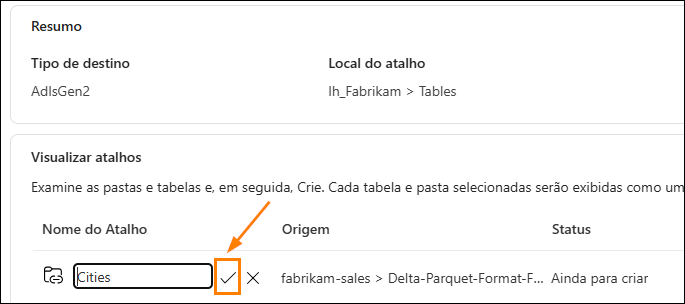

12. Selecione **Criar** para adicionar os dados por meio de um Atalho para o seu Lakehouse.

    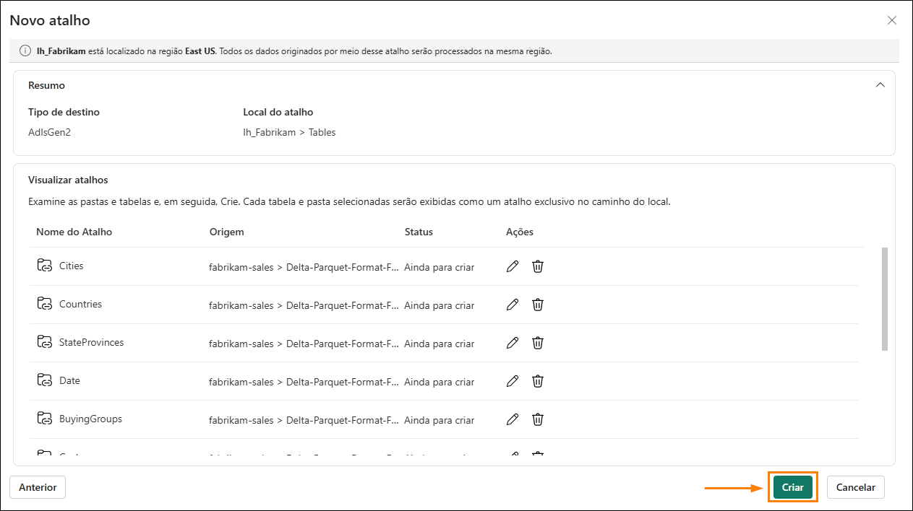

13. Quando o upload for concluído, você verá que os objetos foram movidos para a área Tabela.

    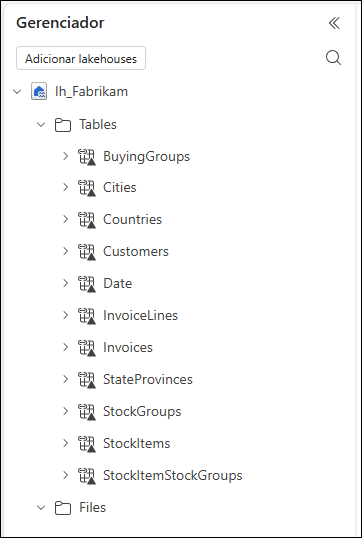

14. Você pode retornar ao **Agente de dados** do lado esquerdo ou do modo de exibição Workspace.

    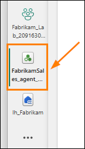

    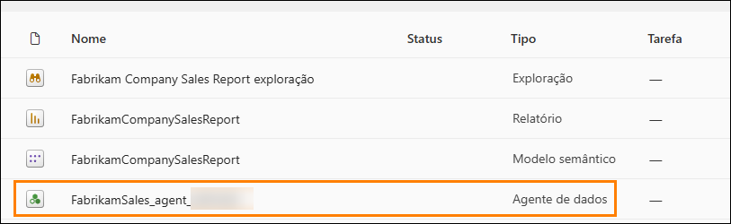

15. No agente de dados, clique na caixa suspensa **Adicionar dados** e selecione **Fonte de dados** no painel do Explorer.

    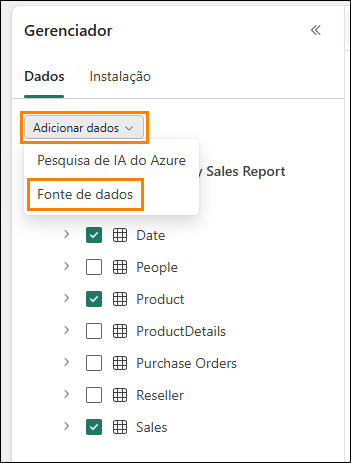

16. Selecione **lh_Fabrikam** e depois clique em **Adicionar**.

    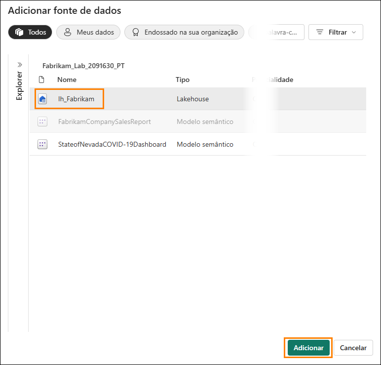

17. Agora você terá duas fontes de dados no painel **Explorer**.

    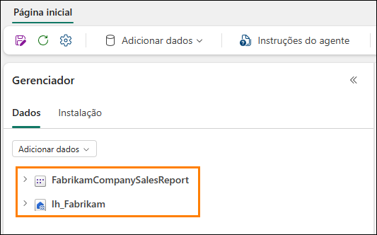

18. Abra a Lakehouse e adicione todas as fontes de dados potenciais do lh_Fabrikam. Pode levar alguns minutos para que cada item do Lakehouse seja mostrado. Sinta-se à vontade para permitir que ele seja carregado e atualize conforme necessário.

    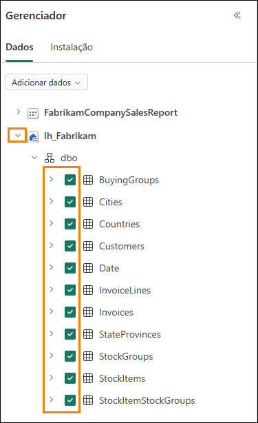

19. Novamente no prompt do agente de dados, digite o seguinte: **What are total sales by product lead time?**

    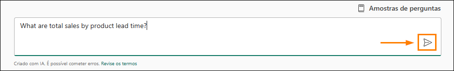

20. Os agentes de dados da Fabric responderam perfeitamente a este pedido e obtiveram os resultados desejados do nosso Lakehouse! Você sempre pode desmarcar os dados do Fabrikam Company Sales Report para impor o uso do Lakehouse pelo Copilot. No entanto, usaremos instruções para corrigir melhor isso em breve.

21. Expanda a seção etapas concluídas para revisar o SQL que foi gerado pelos agentes de dados para chegar a esse resultado.

    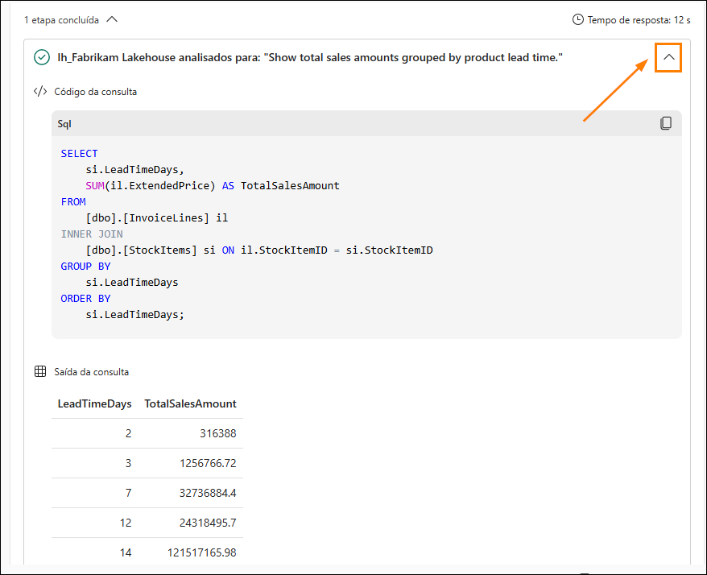

22. Lembre-se, é importante validar os resultados do Agente de Dados. Como os Agentes de Dados expõem o Código SQL que foi usado, você poderá revisá-lo e até executá-lo no lakehouse para verificar se os resultados estão corretos!

    É possível que determinadas solicitações do usuário ao agente de dados possam retornar resultados da fonte de dados incorreta. Por exemplo, o total de vendas por produto pode ser respondido pela fonte de dados do lakehouse ou pelo modelo semântico. Para garantir que o Agente de Dados responda à solicitação usando a fonte de dados desejada, você pode adicionar instruções adicionais de IA para retornar os resultados desejados.

23. Abra as instruções de IA no agente de dados e, na seção Instruções do agente, adicione a seguinte instrução:

    **## Data Source Priority**

    **Always use the Fabrikam Company Sales Report to answer questions unless the user explicitly ask about lead time.**

    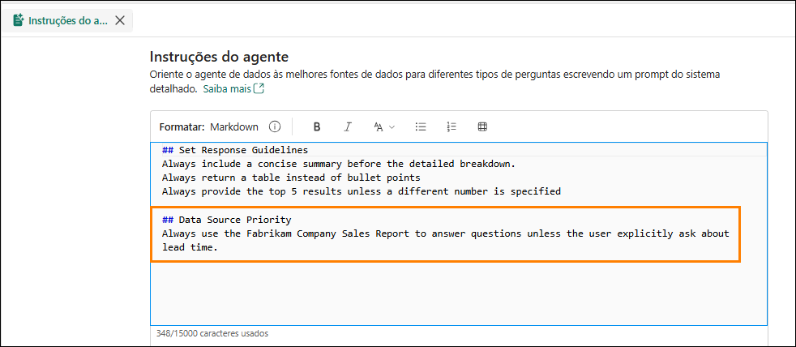

## Destaque: Instruções da fonte de dados

1. Em seguida, vamos conferir as instruções da fonte de dados.

2. No painel de Instruções de IA, selecione as reticências ao lado do seu Lakehouse e selecione **Instruções da fonte de dados** e expanda o Lakehouse. Você notará, ao contrário dos modelos semânticos, que as instruções de IA têm suporte no nível da fonte de dados para Lakehouses!

    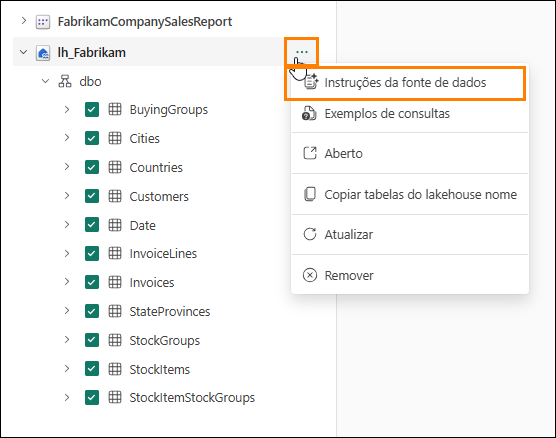

    Adicionar instruções de fonte de dados aqui pode ajudar a IA a entender melhor os dados em seu lakehouse. As instruções de IA bem definidas ajudarão a IA a entender seu contexto de negócios, terminologia e prioridades analíticas.

    Você aprendeu tudo sobre instruções de IA anteriormente nesta aula ao preparar seu modelo semântico para a IA. Não vamos revisitar todas essas informações aqui. Apenas esteja ciente, se você acha que o Agente de Dados precisa de mais esclarecimentos, adicione-os aqui!

## Tarefa 6: Criar exemplos de perguntas

O ajuste de um agente de dados não é uma configuração única, é um processo contínuo e iterativo que envolve experimentação, observação e refinamento. Parte do processo de refinamento é fornecer consultas de exemplo que podem ajudar a IA a entender como responder a perguntas complexas que podem exigir muito SQL ou KQL na fonte de dados.

Os Agentes de Dados podem aproveitar consultas de exemplo, também conhecidas como alguns exemplos curtos, para melhorar a precisão e a relevância de suas respostas ao converter as perguntas de linguagem natural em SQL ou KQL (NL2SQL, NL2KQL).

**ℹ️ Importante**

No momento, o recurso de consultas de exemplo não tem suporte para modelos semânticos.

As consultas de exemplo são um processo de duas partes.

1) Na primeira, você fornece uma pergunta de exemplo, a IA corresponderá semanticamente a perguntas semelhantes à pergunta fornecida.

2) Na segunda, você fornece uma consulta de exemplo. Essa consulta lidaria com junções complexas, predicados complexos e outros cenários avançados para ajudar o agente na formação de uma resposta!

    Um laboratório sobre exemplos de perguntas **está fora do escopo desta aula**. No entanto, se quisesse criar uma consulta de exemplo, você poderia executar as seguintes etapas:

3) Selecione as reticências ao lado do Lakehouse e selecione **Consultas de exemplo** para abrir o painel.

    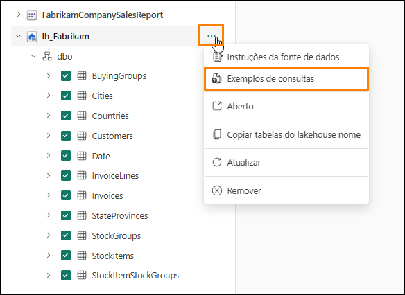

4) No painel de consultas de exemplo, clique no botão **Adicionar Exemplo**.

    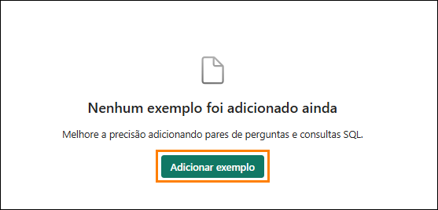

5) Adicione uma pergunta de exemplo e pressione Enter. Exemplo: **Show sales by country that the product was manufactured in.**

    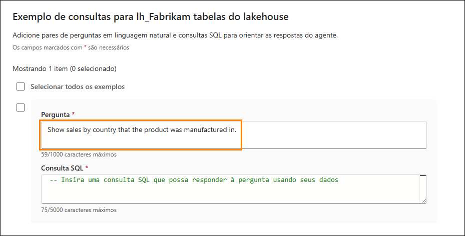

6) Na caixa de diálogo Consulta SQL, insira o SQL que o agente deve usar para responder a esse tipo de pergunta! Depois de concluído, clique no (X) no canto superior direito e teste seu agente.

    **ℹ️ Importante**

    O código aqui não é fornecido no laboratório, uma vez que está fora do escopo desta aula, mas sinta-se à vontade para gerar seu próprio código e explorá-lo se o tempo permitir!

    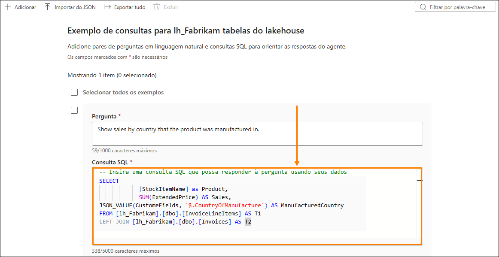

    **Dica profissional**: cada uma dessas perguntas tem como alvo diferentes cenários analíticos - análise geográfica, agregações filtradas, cálculos de receita e análise hierárquica de tempo. Experimente variações para ver como o agente de dados se adapta a diferentes estilos de pergunta.

    **Experimente mais**: tente fazer perguntas no agente que são mais complexas e, em seguida, criar pares de pergunta/SQL que ajudem o agente de dados a responder às solicitações do usuário.

## Tarefa 7: Publicar e compartilhar seu Agente de Dados

1. É hora de publicar o seu agente de dados. Clique no botão **Publicar** no menu Página inicial.

    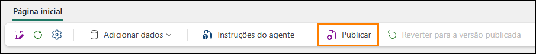

2. Em seguida, acrescente uma descrição ao seu agente. Inclua a finalidade e as capacidades do agente. Clique em **Publicar**.

    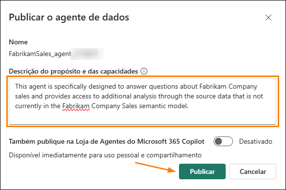

3. Depois de publicar seu agente, você deverá compartilhá-lo. Clique no botão **Compartilhar** no canto superior direito da tela.

    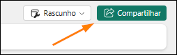

4. Na caixa **Criar e enviar link** aberta, clique no botão **Pessoas em sua organização podem exibir**.

    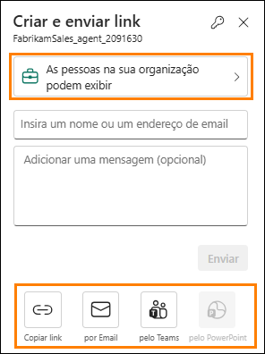

5. Selecione as configurações de permissões aqui e clique em **Aplicar**.

    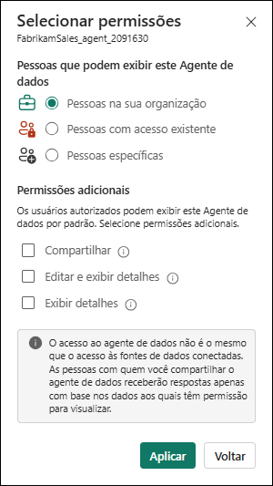

    **ℹ️ Importante**

    O acesso ao agente de dados não é igual ao acesso a fontes de dados conectadas. As pessoas com quem você compartilha o agente de dados só receberão respostas com base nos dados que têm permissão para exibir.

6. O agente de dados do Fabric publicado pode ser consumido em diversas plataformas, incluindo:

    - Microsoft Fabric

    - Copilot Studio

    - Microsoft Teams

    - Notebooks

    - Power BI Copilot

    - Microsoft Foundry

    - Aplicativos personalizados via API

7. No seu espaço de trabalho, passe o mouse sobre o agente de dados para revelar as reticências **(...)**.

    

8. Clique nas reticências e selecione **Gerenciar permissões**.

    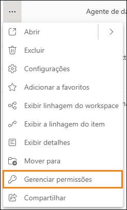

9. Você também pode compartilhar daqui ou gerenciar quem tem acesso direto ao agente por meio de seu acesso ao espaço de trabalho. Você pode escolher **+ Adicionar link** no menu Links ou **+ Adicionar usuário** no menu Acesso direto. Adicionar usuários ao espaço de trabalho dará a eles acesso ao agente.

    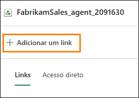

    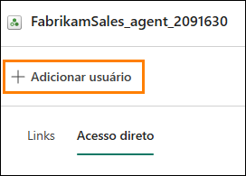

## Tarefa 8: Consumir um Agente de Dados do Copilot

1. Embora o agente possa ser consumido de várias maneiras (consulte o Etapa 6 acima), vamos tentar aproveitar nosso agente de dados por meio da experiência do Copilot Autônomo. No espaço de trabalho, clique no botão Copilot. (OBSERVAÇÃO: talvez seja necessário clicar nas reticências na barra lateral para revelar o botão Copilot).

    (Lembrete: certifique-se de apontar para o agente de dados no exemplo.)

    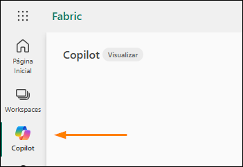

2. Selecione o sinal de mais: observe que o agente é oferecido como uma opção a ser usada pelo Copilot. Isso realça a diferença entre as experiências do Copilot Autônomo e do Agente de Dados.

    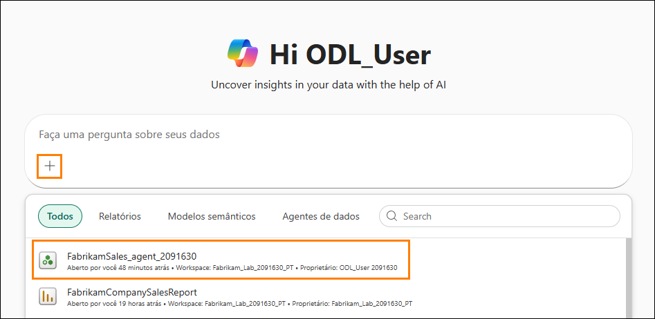

3. No seu espaço de trabalho, passe o mouse sobre o agente e clique nas reticências (...) novamente.

    

4. Escolha **Configurações** no menu.

    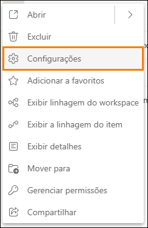

5. Escolha **Endosso** na nova janela.

    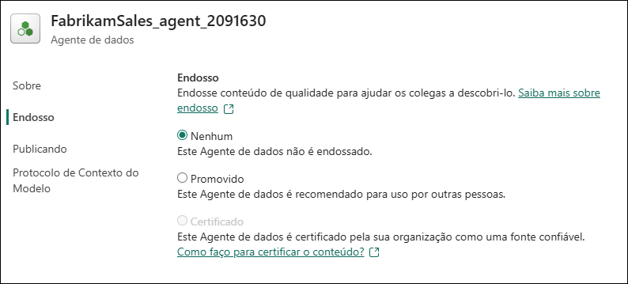

6. No contexto do **Copilot**, especialmente ao trabalhar com **agentes de dados** no Power BI ou no Microsoft Fabric, **"endossar um agente de dados"** significa conceder aprovação formal ou certificação para esse agente no ambiente de uma organização. Isso normalmente envolve tornar o agente facilmente detectável e confiável para os usuários, marcando-o como promovido ou certificado.

# Referências

O Chat with your Data in a Day (CDIAD) apresenta alguns dos principais recursos ao usar o Copilot Autônomo em um workspace do Fabric.

No menu do serviço, a seção Ajuda (?) tem links para ótimos recursos. Lembre-se de que a exibição que você vê depende da experiência na qual você está atualmente e, portanto, as opções podem parecer diferentes da captura de tela abaixo.

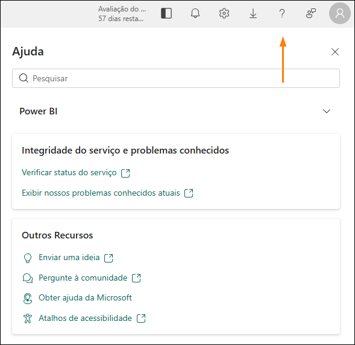

Veja aqui mais alguns recursos que ajudarão você com as próximas etapas do Microsoft Fabric.

- Acesse todas as informações na [Documentação principal do Microsoft Fabric](https://learn.microsoft.com/en-us/fabric/)

- Explore o Fabric por meio do [Tour Guiado](https://aka.ms/Fabric-GuidedTour)

- Inscreva-se na [avaliação gratuita do Microsoft Fabric](https://aka.ms/try-fabric)

- Visite o [site do Microsoft Fabric](https://aka.ms/microsoft-fabric)

- Aprenda novas habilidades explorando os [módulos de Aprendizagem do Fabric](https://aka.ms/learn-fabric)

- Leia o livro eletrônico [gratuito](https://aka.ms/fabric-get-started-ebook) [sobre como começar a usar o Fabric](https://aka.ms/fabric-get-started-ebook)

- Participe da [comunidade do Fabric](https://aka.ms/fabric-community) para postar suas perguntas, compartilhar seus comentários e aprender com outras pessoas

Leia a documentação técnica mais detalhada relevante para o Copilot:

- [Visão geral do Copilot para Power BI - Power BI | Microsoft Learn](https://learn.microsoft.com/en-us/power-bi/create-reports/copilot-introduction)

- [Experiência do Copilot Autônomo no Power BI (Versão Prévia) – Power BI | Microsoft Learn](https://learn.microsoft.com/en-us/power-bi/create-reports/copilot-chat-with-data-standalone)

- [Configurações de administrador do Microsoft Fabric Copilot | Microsoft Learn](https://learn.microsoft.com/en-us/fabric/admin/service-admin-portal-copilot)

- [Criação de agente de dados do Fabric (versão prévia) - saiba como criar um agente de dados do Fabric | Microsoft Learn](https://learn.microsoft.com/en-us/fabric/data-science/concept-data-agent)

- [Práticas recomendadas para configurar agentes de dados - Microsoft Fabric | Microsoft Learn](https://learn.microsoft.com/en-us/fabric/data-science/data-agent-configuration-best-practices)

- [Copilot para Microsoft Fabric e Power BI: perguntas frequentes - Microsoft Fabric | Microsoft Learn](https://learn.microsoft.com/en-us/fabric/fundamentals/copilot-faq-fabric)

© 2026 Microsoft Corporation. Todos os direitos reservados.

Ao usar esta demonstração/este laboratório, você concorda com os seguintes termos:

A tecnologia/funcionalidade descrita nesta demonstração/neste laboratório é fornecida pela Microsoft Corporation para obter seus comentários e oferecer uma experiência de aprendizado. Você pode usar a demonstração/o laboratório somente para avaliar tais funcionalidades e recursos de tecnologia e fornecer comentários à Microsoft. Você não pode usá-los para nenhuma outra finalidade. Você não pode modificar, copiar, distribuir, transmitir, exibir, executar, reproduzir, publicar, licenciar, criar obras derivadas, transferir nem vender esta demonstração/este laboratório ou qualquer parte deles.

A CÓPIA OU A REPRODUÇÃO DA DEMONSTRAÇÃO/DO LABORATÓRIO (OU DE QUALQUER PARTE DELES) EM QUALQUER OUTRO SERVIDOR OU LOCAL PARA REPRODUÇÃO OU REDISTRIBUIÇÃO ADICIONAL É EXPRESSAMENTE PROIBIDA.

ESTA DEMONSTRAÇÃO/LABORATÓRIO FORNECE DETERMINADAS TECNOLOGIAS DE SOFTWARE/RECURSOS E FUNCIONALIDADE DO PRODUTO, INCLUINDO POTENCIAIS NOVOS RECURSOS E CONCEITOS, EM UM AMBIENTE SIMULADO SEM CONFIGURAÇÃO OU INSTALAÇÃO COMPLEXA PARA A FINALIDADE DESCRITA ACIMA. A TECNOLOGIA/CONCEITOS REPRESENTADOS NESTA DEMONSTRAÇÃO/LABORATÓRIO PODEM NÃO REPRESENTAR A FUNCIONALIDADE COMPLETA DO RECURSO E PODEM NÃO FUNCIONAR DA MESMA FORMA QUE UMA VERSÃO FINAL. NÓS TAMBÉM PODEMOS NÃO LANÇAR UMA VERSÃO FINAL DE TAIS RECURSOS OU CONCEITOS. SUA EXPERIÊNCIA COM O USO DE TAIS RECURSOS E FUNCIONALIDADES EM UM AMBIENTE FÍSICO TAMBÉM PODE SER DIFERENTE.

**COMENTÁRIOS.** Caso você forneça comentários sobre os recursos de tecnologia, as funcionalidades e/ou os conceitos descritos nesta demonstração/neste laboratório à Microsoft, você concederá à Microsoft, sem encargos, o direito de usar, compartilhar e comercializar seus comentários de qualquer forma e para qualquer finalidade. Você também concede a terceiros, sem encargos, quaisquer direitos de patente necessários para que seus produtos, suas tecnologias e seus serviços usem ou interajam com partes específicas de um software ou um serviço da Microsoft que inclua os comentários. Você não fornecerá comentários que estejam sujeitos a uma licença que exija que a Microsoft licencie seu software ou sua documentação para terceiros em virtude da inclusão de seus comentários neles. Esses direitos continuarão em vigor após o término do contrato.

A MICROSOFT CORPORATION SE ISENTA DE TODAS AS GARANTIAS E CONDIÇÕES COM RELAÇÃO A DEMONSTRAÇÃO/LABORATÓRIO, INCLUINDO TODAS AS GARANTIAS E CONDIÇÕES DE COMERCIALIZAÇÃO, SEJAM EXPRESSAS, IMPLÍCITAS OU ESTATUTÁRIAS, ADEQUAÇÃO A UM DETERMINADO FIM, TÍTULO E NÃO VIOLAÇÃO. A MICROSOFT NÃO DECLARA NEM GARANTE A PRECISÃO DOS RESULTADOS DERIVADOS DO USO DA DEMONSTRAÇÃO/DO LABORATÓRIO NEM A ADEQUAÇÃO DAS INFORMAÇÕES CONTIDAS NA DEMONSTRAÇÃO/NO LABORATÓRIO A QUALQUER FINALIDADE.

**AVISO DE ISENÇÃO DE RESPONSABILIDADE**

Esta demonstração/este laboratório contém apenas uma parte dos novos recursos e aprimoramentos do Microsoft Power BI. Alguns dos recursos podem ser alterados em versões futuras do produto. Nesta demonstração/neste laboratório, você aprenderá sobre alguns dos novos recursos, mas não todos.
