# Microsoft Fabric Chat with your Data in a Day - Laboratorio 1

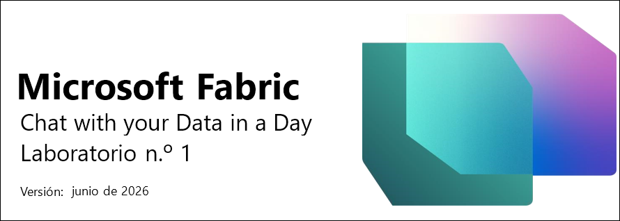

## Contenido

- Estructura del documento
- Escenario/planteamiento del problema
- Introducción
  - Tarea 1: Trabajar en el entorno virtual
  - Tarea 2: Evaluar la preparación de la IA de sus datos
  - Tarea 3: Escribir una solicitud en Copilot de Power BI

# Estructura del documento

El laboratorio incluye pasos que el usuario debe seguir junto con capturas de pantalla asociadas que sirven de ayuda visual. En cada captura de pantalla, las secciones se resaltan con cuadros de color naranja para indicar en qué áreas debe centrarse el usuario.

# Escenario/planteamiento del problema

Su organización acaba de regresar de una conferencia de Microsoft donde escucharon y vieron cómo la experiencia de Chat with your Data, con tecnología de Copilot, puede acelerar notablemente el tiempo de obtención de información. Las demostraciones mostraron cómo las consultas de lenguaje natural pueden desbloquear eficaces análisis, siempre que los modelos semánticos subyacentes estén bien estructurados y optimizados para la IA.

**Objetivo actual**

Se le ha pedido que evalúe un modelo semántico existente dentro de Power BI Desktop. Su objetivo es probar su rendimiento en la experiencia de Copilot e identificar las áreas de mejora.

Explore el modelo semántico con la interfaz de Copilot integrada de PBI Desktop.

Identifique los puntos de fricción en los que Copilot tiene dificultades para interpretar la intención.

Recomiende e implemente mejoras para mejorar la comprensión de Copilot.

Documente sus conclusiones y prepare el modelo para un uso organizativo más amplio.

# Introducción

En la demostración del instructor, ha visto el rendimiento de la experiencia de chat con sus datos y, en esta práctica de laboratorio, verá lo necesario que es preparar modelos de datos para la IA. Este laboratorio mostrará varias solicitudes de usuarios y la manera en que responde Copilot a esas solicitudes. También verá cómo validar la precisión y corrección de esas respuestas. En futuros laboratorios, aprenderá cómo aplicar los procedimientos recomendados y cómo utilizar la preparación de sus herramientas de datos para mejorar la experiencia de Copilot.

## Tarea 1: Trabajar en el entorno virtual

1. La experiencia de entorno virtual es fantástica, ya que le ofrece un espacio disponible para trabajar con la experiencia de Chat with Your Data. Veamos algunos puntos y áreas clave:

    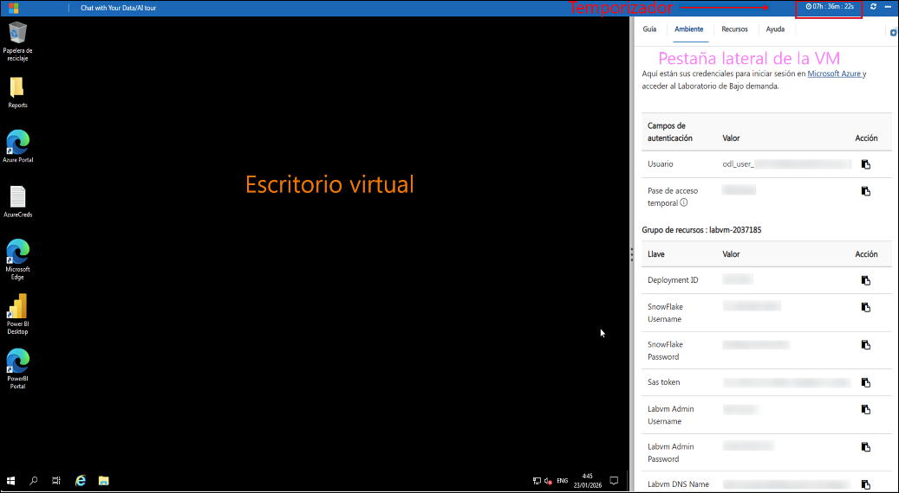

2. Veamos algunas áreas clave:

    - El escritorio virtual actúa como un equipo completamente funcional para usarlo en el navegador.

    - La pestaña lateral de la VM es donde puede acceder a los documentos de laboratorio y las credenciales, entre otros.

    - El temporizador muestra cuánto tiempo restante tiene para usar la máquina virtual.

    **ℹ️ Importante**

1. A lo largo de los laboratorios de clase, estos cuadros que señalan **Importante** detallarán información valiosa. ¡Intente no saltárselos! Por ejemplo, SI no ve la pestaña lateral de su máquina virtual, asegúrese de expandirla por completo, como se muestra en la imagen a continuación.

    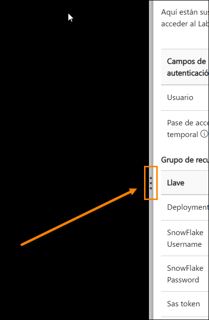

3. Para navegar con facilidad por los laboratorios, use el número de página de la parte inferior de la pestaña lateral.

    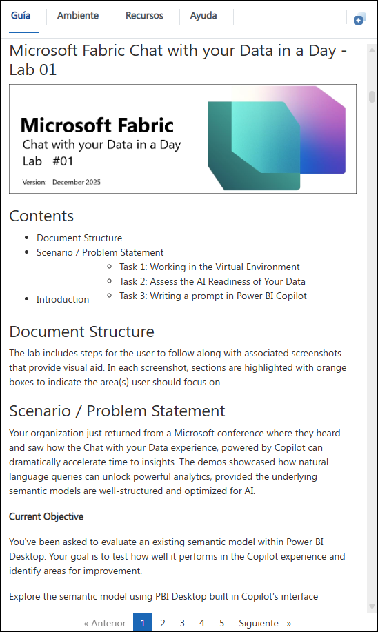

4. En clase, puede trabajar completamente dentro de la máquina virtual. Sin embargo, algunos asistentes prefieren trabajar con un navegador de incógnito e iniciar sesión en Power BI Desktop con las credenciales de máquina virtual que se les conceden. Eso es perfectamente aceptable.

## Tarea 2: Evaluar la preparación de la IA de sus datos

1. Ahora que ha visto las áreas principales de la máquina virtual, continúe con el botón del portal de Power BI para iniciar el Servicio Power BI.

    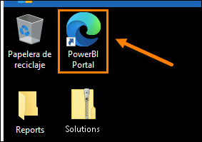

2. Con las credenciales que aparecen en la página de credenciales y en su documento, proporcione el correo electrónico en el área Acceso al correo electrónico.

    - **Nombre de usuario/Correo electrónico:** <inject key="AzureAdUserEmail"></inject> 

        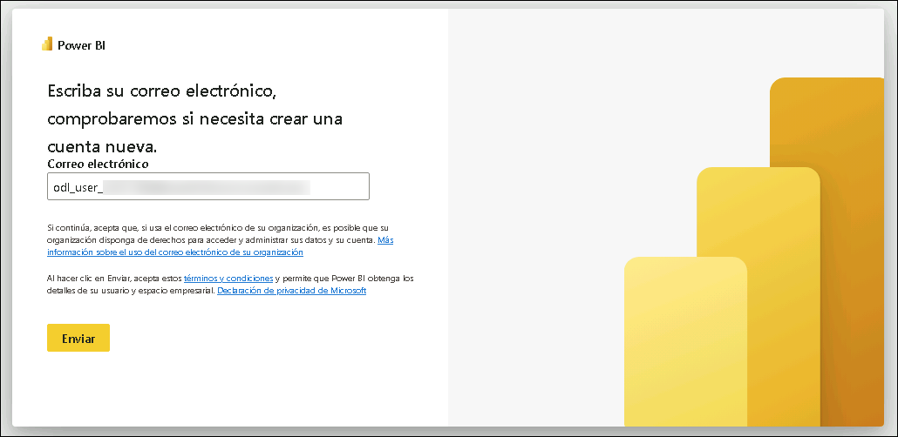

3. A continuación, utilice el cuadro **Inicio de sesión de Microsoft** con las mismas credenciales y haga clic en **Siguiente**.

    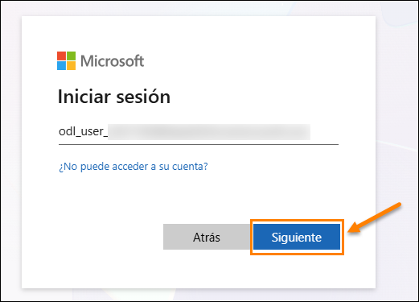

4. Escriba el **Pase de acceso temporal** proporcionado en la página de credenciales o su documento de laboratorio y presione **Iniciar sesión**. También puede seleccionar Sí para permanecer con la sesión iniciada.

    - **contraseña**: **<inject key="AzureAdUserPassword"></inject>** 

        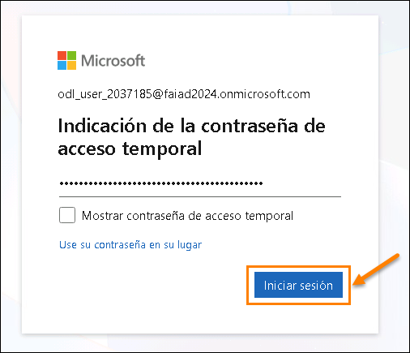

5. En primer lugar navegaremos hasta el área **Espacios de trabajo** en el menú del lado izquierdo.

    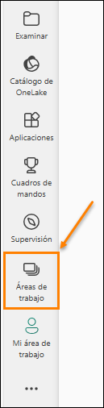

6. Ahora crearemos una **Nueva área de trabajo** seleccionando el botón Nueva área de trabajo.

    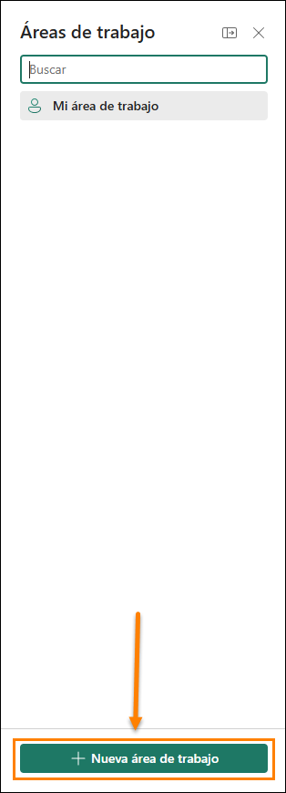

7. A continuación, asignaremos un nombre al área de trabajo: **Fabrikam_Lab_<inject key="DeploymentID" enableCopy="false"></inject>**

    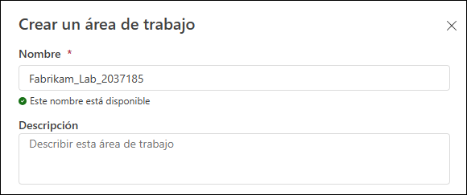

8. Su código de 7 dígitos forma parte del nombre de usuario que se le asignó para la clase. ¡Use esto! Vea la captura de pantalla a continuación.

    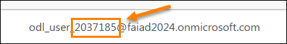

9. Por ejemplo, John A. Smith sería: **Fabrikam_Lab_<inject key="DeploymentID" enableCopy="false"></inject>**

    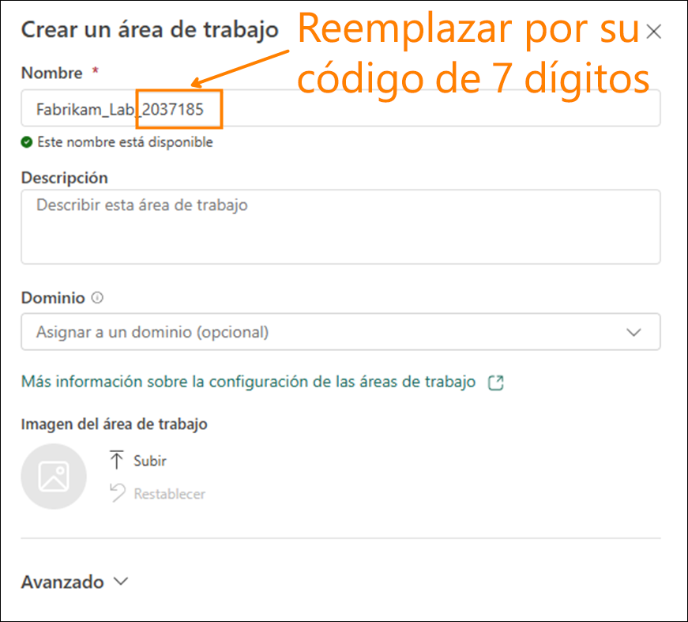

10. A continuación, debe asignar una capacidad de Fabric a su área de trabajo.

11. Haga clic en **Avanzado** para expandir las opciones avanzadas al configurar un área de trabajo.

    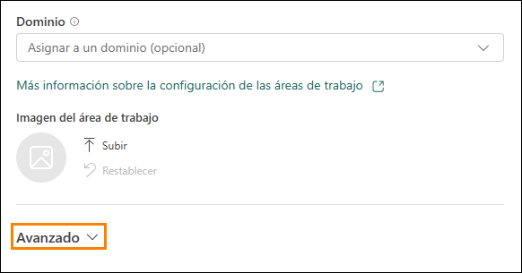

12. Asegúrese de que la opción **Capacidad de Fabric** esté seleccionada. Desplácese hacia abajo algo más y seleccione, **al azar**, una capacidad en el menú desplegable.

    **ℹ️ Importante**

2. El entorno de Fabric utilizado para esta clase se actualizará con frecuencia, por lo que ES POSIBLE QUE NO tenga las mismas capacidades enumeradas en la siguiente captura de pantalla. Solo tiene que elegir cualquier capacidad disponible.

    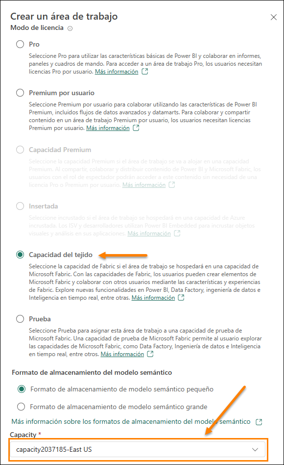

13. Haga clic en **Aplicar**.

    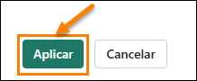

    ¡Genial! Utilizaremos el espacio de trabajo de capacidad de Fabric para explorar todo lo mejor que Chat with Your Data tiene para ofrecer.

14. Abra el archivo llamado **CWYDIAD – Lab 01 – Start** de los archivos de clase para comenzar a explorar la experiencia de Chat with Your Data.

    

15. Escriba su dirección de correo electrónico **<inject key="AzureAdUserEmail"></inject>** en el archivo de Power BI Desktop y presione continuar para iniciar sesión con sus credenciales:

    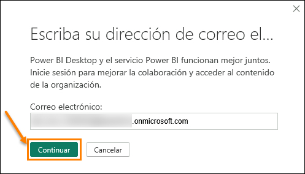

16. Además, inicie sesión mediante la ventana de inicio de sesión de Microsoft con el mismo nombre de usuario **<inject key="AzureAdUserEmail"></inject>** y pase de acceso temporal **<inject key="AzureAdUserPassword"></inject>**

    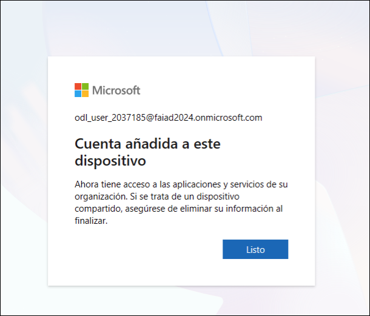

17. Con el archivo PBIX inicial abierto, continúe con el botón de Copilot y selecciónelo para abrir la experiencia de Copilot.

    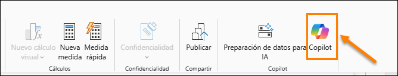

18. Si ya ha iniciado sesión, se abrirá una nueva ventana para **Conectarse a un espacio de trabajo compatible con Copilot.** Haga clic en la opción **Seleccionar un espacio de trabajo** y seleccione el espacio de trabajo que acaba de crear.

    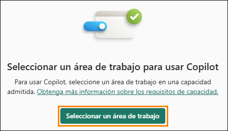

    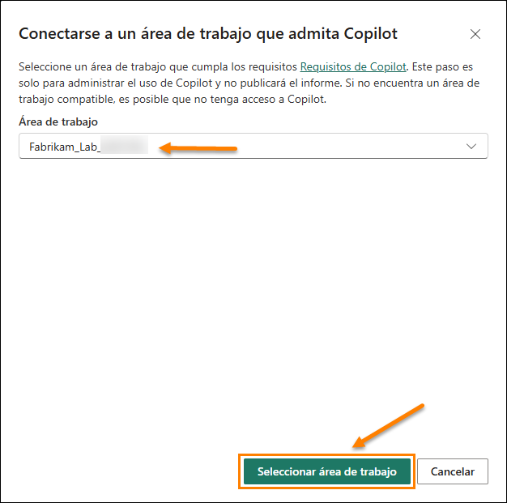

19. Si recibe un mensaje en la siguiente pantalla, haga clic en **Comenzar**.

    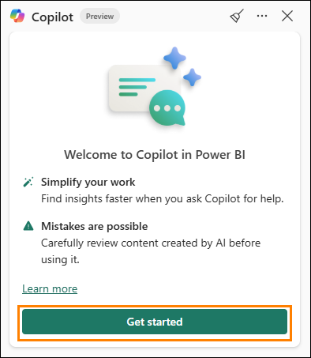

20. Le damos la bienvenida a la experiencia de Copilot en Power BI. En esta pantalla de inicio, recibirá algunas ideas de solicitudes en la parte superior **(1)** y luego una sección en la parte inferior donde puede escribir su solicitud **(2)**.

    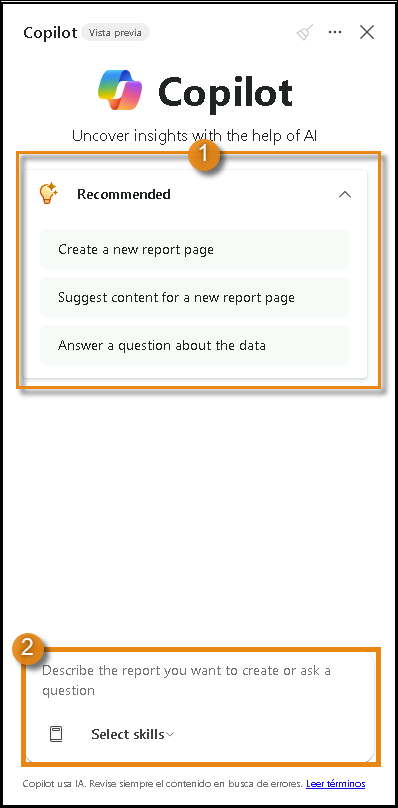

## Tarea 3: Escribir una solicitud en Copilot de Power BI

En esta sección, escribirá varias solicitudes y explorará los resultados que arroja la experiencia de Copilot de Power BI.

1. Haga clic en la solicitud y escriba lo siguiente: **Show total purchases by employee**. A continuación, haga clic en **Entrar**.

    

    **Posibles opciones:**

    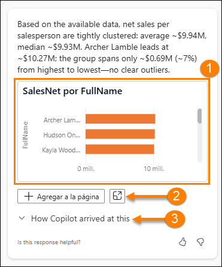

    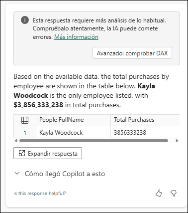

    **ℹ️ Importante**

    La IA devuelve resultados no deterministas debido a múltiples factores. Como se ha explicado anteriormente en esta clase, sus resultados pueden variar y pueden no ser idénticos a los de los laboratorios. Tenga en cuenta que esta no preparación para los datos de IA tendrá resultados variados exactamente en la misma pregunta. Continúe y explore las capacidades y características que se muestran lo mejor que pueda.

    Incluso es posible que le hagan preguntas de seguimiento como las que se enumeran a continuación:

    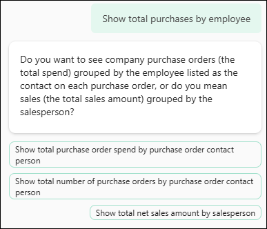

    Si es necesario, elija la más probable **Show total purchases by employee o continúe realizando solicitudes**.

2. Ahora se devuelve mucha información. Exploremos esta sección en profundidad.

    1. **(1)** Una visualización que compara el total de compras y el de empleados.

    2. **(2)** Áreas para **Agregar a la página** o para **mostrar y** **expandir** el objeto visual.

    3. **(3)** *HCAAT:* cómo llegó Copilot a esto.

        

3. Haga clic en el botón *HCAAT*: **cómo llegó Copilot a esto** para ver la lógica subyacente a la respuesta de Copilot.

    **Posibles opciones:**

    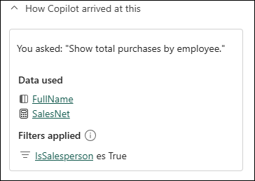

    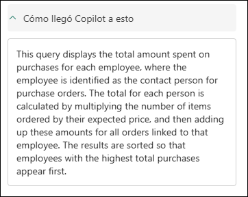

4. Mantenga el puntero sobre ***FullName***,** *Sales*** e incluso ***IsSalesperson*** para ver tanto el **Campo** como **Tabla principal** para consultar lo que Copilot ha utilizado al responder a la pregunta.

    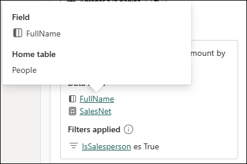

    Lamentablemente, este es un resultado incorrecto. Hemos pedido las compras totales y hemos recibido el **Total** de **Ventas** en su lugar. La otra consulta DAX solo analizaba a un único empleado. Parece que estos datos necesitan preparación. Piénselo de esta manera, los datos que no se han preparado para Copilot son como un primer día de trabajo nuevo, un analista de datos y los datos que se han preparado para Copilot es como hacer una pregunta a un analista con muchos años de experiencia en SU organización específica.

    Hay dos cosas principales en las que hay que pensar aquí al preparar los datos para Copilot.

    En primer lugar, podemos escribir una solicitud mejor que sea más específica. Esto definitivamente ayudará. Sin embargo, muchos usuarios no sabrán cómo escribir solicitudes efectivas y es posible que no conozcan los datos lo suficientemente bien como para ser específicos.

    En segundo lugar, como analistas de datos, podemos preparar los datos para Copilot y anticiparnos a este tipo de solicitudes, lo que hace que aumente la precisión de las respuestas de Copilot. El objetivo de esta clase es enseñarle todos los procedimientos recomendados y las herramientas disponibles para mejorar la experiencia de Chat with your Data.

    **ℹ️ Importante**

    Las respuestas de Copilot dependen de la manera en que formule sus preguntas. Las indicaciones claras y específicas generan conclusiones más precisas y soluciones más rápidas. Cuando trabaje con sus datos, intente incluir el contexto, los resultados que desee y los filtros o columnas pertinentes. ¡Cuanto mejor sea su solicitud, mejor será su respuesta!

5. Intentemos esto de nuevo, pero con una solicitud más específica, en el tipo de solicitud de Copilot, escriba: **Show total purchases from the PO table by employee**.

    

6. Observará que el objeto visual creado solo tiene una empleada llamada "Kayla Woodcock". Esto es correcto. Kayla es la única empleada que realiza compras. Por lo tanto, al ser más específicos, podemos lograr mejores respuestas. Además, si hubiéramos preparado nuestro modelo semántico con una medida llamada Total de compras desde el principio, podríamos haber evitado este escenario.

    **Posibles opciones:**

    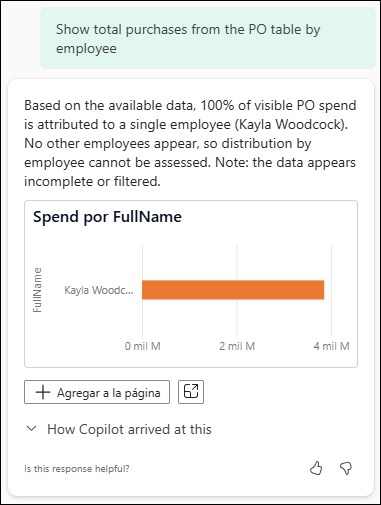

    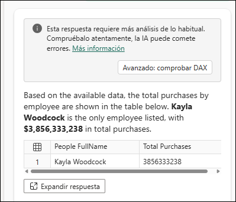

7. Es muy importante validar siempre los resultados y la manera en que Copilot ha llegado a la respuesta. Haga clic en **HCAAT**, cómo llegó Copilot a esto.

    

    **Si** Copilot proporciona una consulta DAX, intente presionar **Comprobar DAX**.

    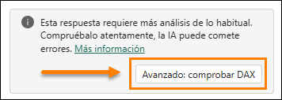

8. Como puede ver, Copilot está usando la columna FullName de nuestra tabla People y también está usando la medida Gasto. Incluso nuestra consulta DAX está haciendo lo mismo. La medida de gasto probablemente podría tener un mejor nombre para mejorar la experiencia de Copilot.

    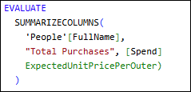

9. ¿Qué significa Gasto aquí en este contexto? ¿Es lo mismo que Compras? Es posible que sigamos recibiendo una respuesta incorrecta de Copilot. Continuemos y pidámosle a Copilot que nos explique cómo se calcula el gasto.

10. En el tipo de solicitud de Copilot, escriba: **How is the measure Spend calculated**

    **Posibles opciones:**

    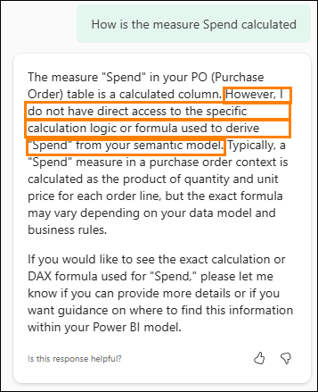

    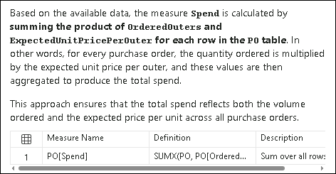

11. Copilot realiza un excelente trabajo al dar una explicación general de lo que probablemente esté haciendo el cálculo. Pero es posible que vea términos en esta definición como "Normalmente" o "Por lo general" porque esto es una generalización. También observará que Copilot le indica explícitamente que no tiene acceso a la fórmula o lógica de cálculo exactas y que, por lo tanto, no puede darle una respuesta específica.

    En la otra imagen, Copilot ha podido agarrar correctamente la medida real, explicarla y dar la respuesta asociada al gasto en el contexto de filtro actual.

    **ℹ️ Importante**

    En un laboratorio futuro, aprenderá cómo proporcionarle a Copilot el contexto empresarial adicional necesario para responder a estas preguntas y brindarle al usuario más confianza en la respuesta de Copilot.

12. Ahora vamos a ampliar aún más y a crear un objeto visual para demostrar de qué manera Copilot se ajustará a los cambios en el modelo de datos y en el informe.

13. En su solicitud de Copilot, escriba: **Create a new report page with a bar chart visual for sales and product tag.**

    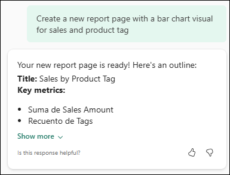

    Es posible que tenga que seguir preguntando a Copilot como se muestra aquí:

    

    Haga todo lo posible para que coincidan los elementos **Ventas totales** y **Etiqueta de producto**.

    Observe que Copilot ha creado el objeto visual en una página de informe completamente nueva.

    **Posibles opciones:**

    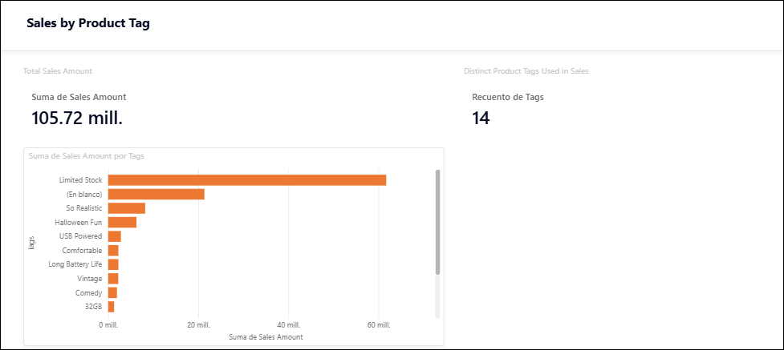

    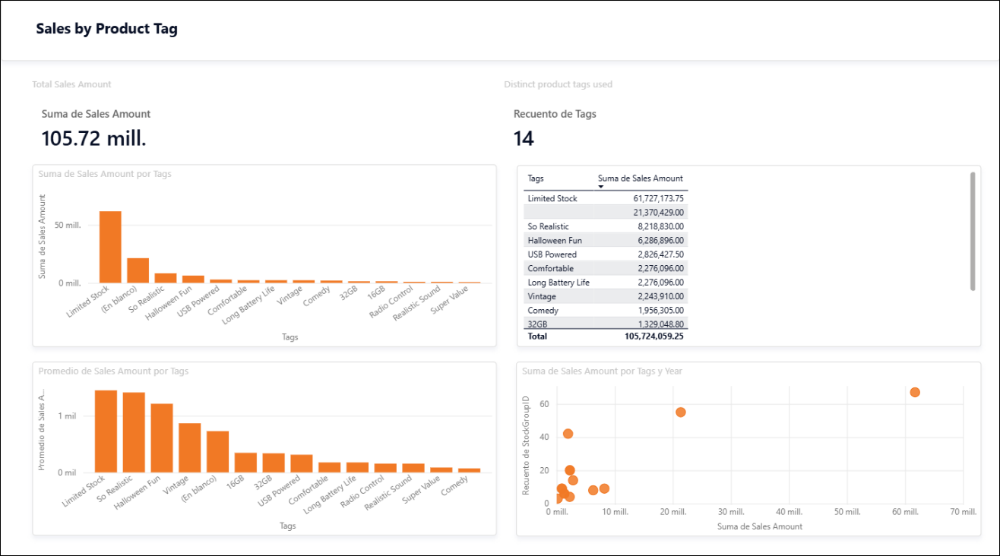

14. Seleccione el objeto visual del gráfico de barras que Copilot ha creado y vaya a la **Vista de modelo**. Observe que ha incluido un filtro para eludir nuestro modelo de datos. Esto es sorprendente porque la etiqueta de producto y las ventas totales normalmente no funcionarían en nuestro modelo de datos actual.

    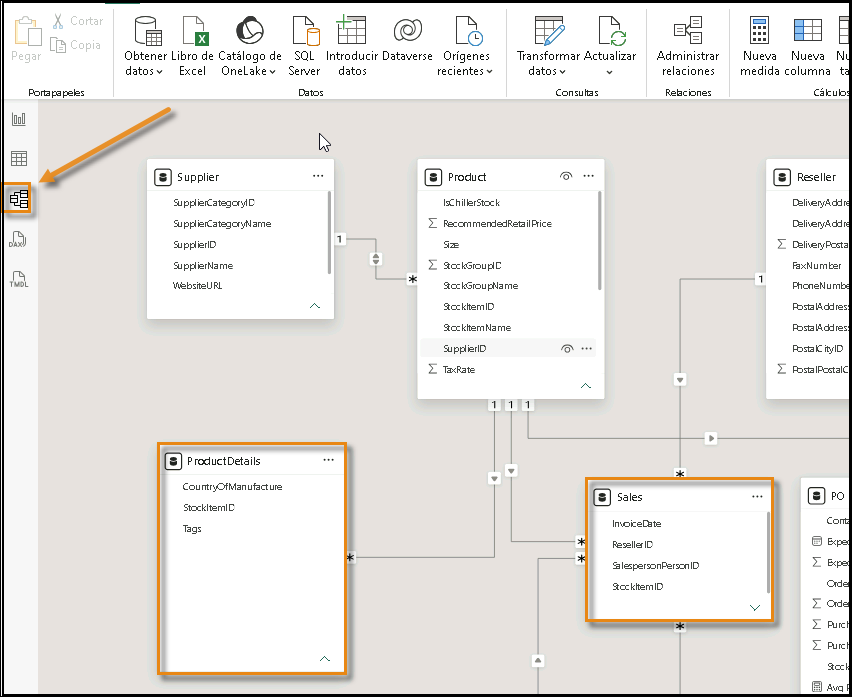

15. Esto podría ser una doble contabilización de algunos valores, por lo que vamos a eliminarlo. Vuelva a la **Vista de informe** y asegúrese de que sigue teniendo seleccionado el gráfico.

    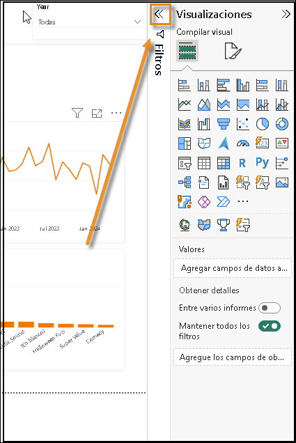

16. A la derecha, vaya a la **pestaña Filtros** bajo "Filtros en este objeto visual" y elimine "Detalles de productos que tienen productos" del eje del gráfico de barras.

    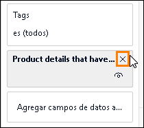

17. Observe que los valores son todos iguales en **105 724 059 \$**. Esto se puede ver pasando el cursor sobre las barras de datos en el objeto visual que Copilot ha creado. Este es un signo revelador de relaciones incorrectas en el modelo semántico.

    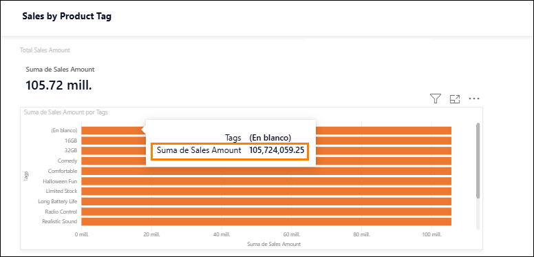

18. La respuesta anterior de Copilot era incorrecta debido al diseño del modelo semántico. Copilot ha podido crear un filtro para ajustarse a nuestra solicitud. Esto muestra la naturaleza de por qué es importante tener un modelo de datos preparado para la IA. En un laboratorio futuro, echaremos un vistazo a las tablas y relaciones y veremos cómo se pueden mejorar para mejorar la experiencia de Copilot.

19. La imagen deja muy claro que hay un problema con la respuesta de Copilot. Otra forma de ver estos datos sería hacerle una pregunta de Copilot y ver la respuesta. En su solicitud de Copilot, escriba **Show total sales by product tag**.

    

20. Copilot le informe explícitamente, en la respuesta, de que no hay **ninguna variación** en las ventas. Cada vez que vea estas palabras en Copilot, es una indicación de que algo podría no ser correcto.

    

21. Hagamos otra pregunta de Copilot: **Show total sales by State**.

    

    Hay varias respuestas que puede obtener, *¡sus resultados variarán!* Las siguientes son posibles respuestas:

    **Posibles opciones:**

    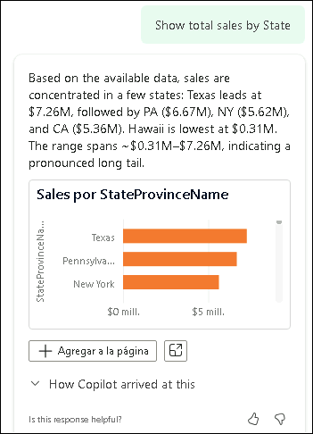

    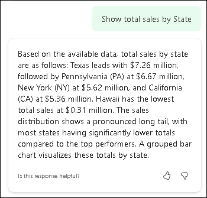

22. Esta respuesta no es exactamente correcta. De nuevo, ¿hay un error del modelo de datos? ¿Podría ser el modelo de datos O la ambigüedad de nuestro lenguaje? Seleccione *HCAAT*: cómo llegó Copilot a esto y mantenga el puntero sobre los datos ***State*** y ***Sales*** utilizados. Las ***ventas*** se recopilan con precisión a través de nuestra medida explícita en la tabla Sales, pero el campo ***State*** procede de la tabla Customer.

    

23. Diríjase a la vista de modelo y revise las relaciones del modelo de datos que vinculan Customer con Sales. Esto explica perfectamente nuestra visualización incorrecta. Ahora podemos ver que nuestro lenguaje y el modelo de datos deben ajustarse.

    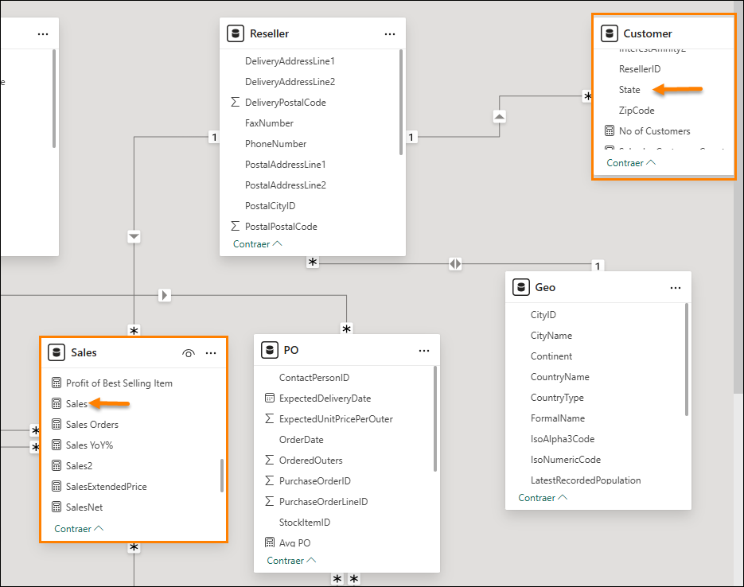

    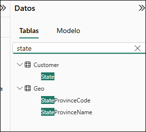

    En este escenario, tenemos varias tablas con una variación de State y también tenemos varias medidas de ventas. Esto puede dar lugar a respuestas incoherentes e incluso a resultados engañosos. En laboratorios posteriores, descubrirá las diferentes técnicas para ayudar a Copilot a responder a este tipo de solicitudes de los usuarios.

24. Probemos otra solicitud: **Sales by State**.

    

25. En las capturas de pantalla siguientes, puede ver que el estado de Texas tiene la mayor cantidad de ventas con **461 457 \$ o 2 millones de \$**. Estas respuestas se generaron haciendo referencia a objetos visuales en el informe, uno de los cuales tiene un filtro. Si sus resultados son los mismos que los de la siguiente captura de pantalla, haga clic en la referencia. Esto le llevará a la página y al objeto visual a los que se hace referencia.

    **Posibles opciones:**

    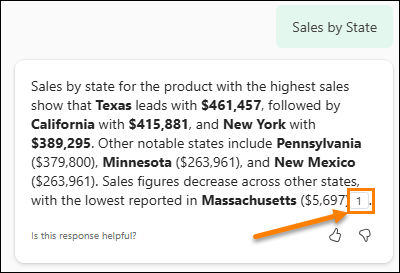

    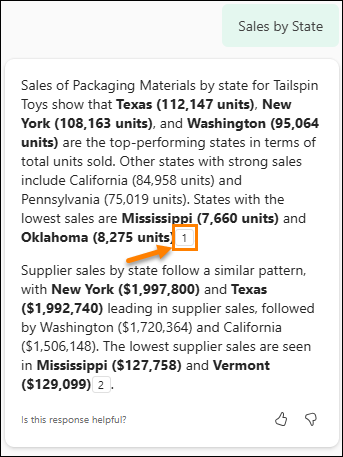

26. Ahora, vaya a la pestaña del producto más vendido, en la cinta de opciones inferior.

    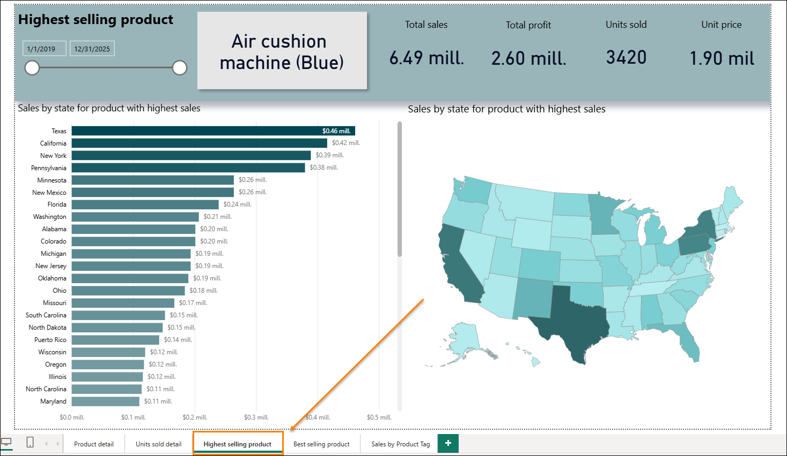

27. A primera vista, las respuestas pueden parecer precisas, pero eche un vistazo a algunos de los posibles filtros aplicados a las visualizaciones. Si aún no es así, expanda el panel de filtro:

    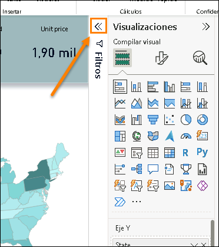

28. Hay un filtro en el objeto visual que podría estar provocando un cambio en las respuestas de Copilot. Expanda el filtro para ver que **este objeto visual solo muestra las ventas del producto más vendido**. (Asegúrese de haber hecho clic en el objeto visual de mapa)

    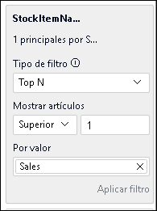

    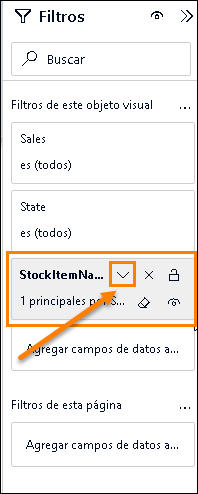

    **ℹ️ Importante**

    Pueden existir filtros en el nivel de objeto visual, página, informe e incluso de segmentación. A veces, Copilot puede generar una respuesta a partir de un objeto visual que tiene un filtro, pero no notificar al usuario final de que se está aplicando un filtro. Más adelante en este curso, analizaremos cómo puede agregar instrucciones de IA para ayudar con estos tipos de respuestas.

29. Elimine este filtro y observe de qué manera los valores del objeto visual de referencia cambian drásticamente.

    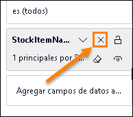

30. Texas ahora tiene **7 256 794 de \$**. ¿Muy diferente a algunas de las demás opciones? Si nos fijamos bien, veremos que uno de los objetos visuales usaba la medida **Sales** y el otro, **Supplier Sales**. Esta es una razón más por la que necesitamos preparar nuestros datos para la IA.

    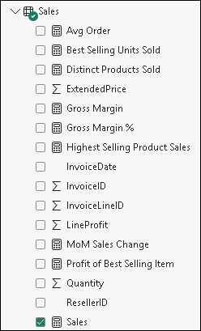

    

31. Me pregunto qué pasará si volvemos a hacer la misma pregunta. Pregúntele a Copilot una vez más **Sales by State**.

    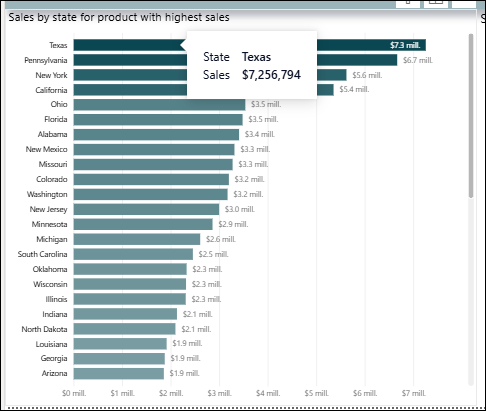

    

32. Sin el filtro, tenemos un conjunto de valores completamente diferente en la misma referencia. Este es un aspecto importante que se debe tener en cuenta en el proceso de preparación de los datos para la IA.

    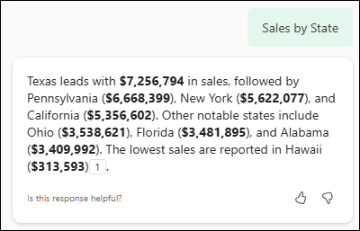

33. ¿Qué pasa con una respuesta que devuelve varias referencias? Pregúntele a Copilot lo siguiente: **Show the top selling product**.

    

34. Seleccione la referencia y compruebe si hay filtros extraños que puedan estar presentes.

    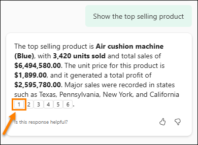

    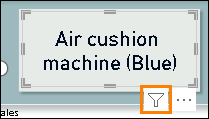

35. Agregue un filtro a la página desde la tabla Reseller para **ResellerCompany**.

    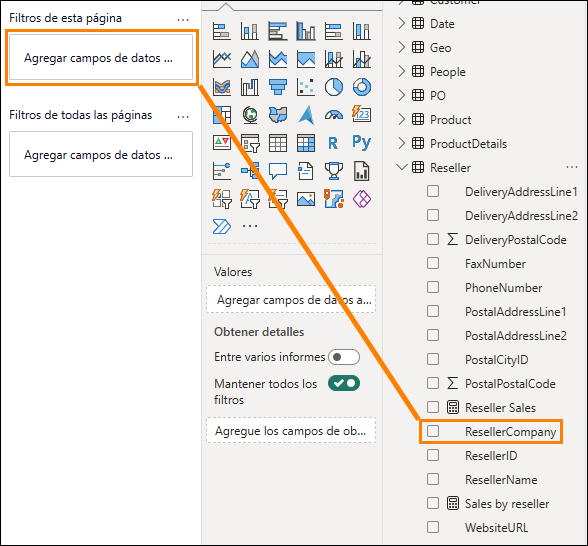

36. Seleccione únicamente TailSpin Toys y observe que los valores han cambiado.

    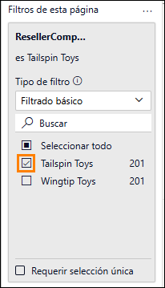

37. Ahora volveremos a hacer la pregunta: **Show the top selling product**.

    

38. El producto puede seguir siendo el mismo, pero nuestros números son muy diferentes. Este ejemplo muestra dónde los modelos semánticos no preparados pueden proporcionar resultados incoherentes e incorrectos.

    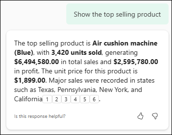

39. Otra área en la que podemos disfrutar de Copilot aquí y que deberíamos revisar es la integración del lenguaje Data Analysis eXpression (DAX). Intente hacer una pregunta que implique un cálculo como el siguiente: **Calculate the percent of total sales in the Southeast to the United States**.

    

40. En nuestra respuesta, observará que Copilot reconoce que la respuesta requerirá más análisis de lo habitual. Esto es excelente para informarnos de que hay que validar aún más el cálculo según sea necesario.

    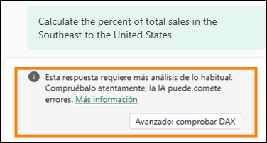

41. En nuestro caso, este cálculo específico requería que Copilot escribiera DAX. Aquí podemos comprobar la DAX utilizado de dos maneras. En primer lugar, el área **Avanzado: comprobar DAX** y **Expandir respuesta**.

    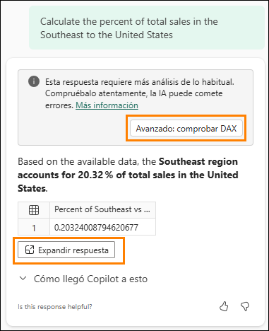

42. Desea asegurarse de que está viendo la pestaña **Consulta DAX** para ver la DAX utilizada para elaborar la respuesta. La consulta se enumera junto con una explicación de la lógica que se seguirá. Tenemos que hacernos dos preguntas. (1) ¿Se ve la DAX bien aquí? (2) ¿Representaba realmente la región sudeste solo el **20,32 %**?

    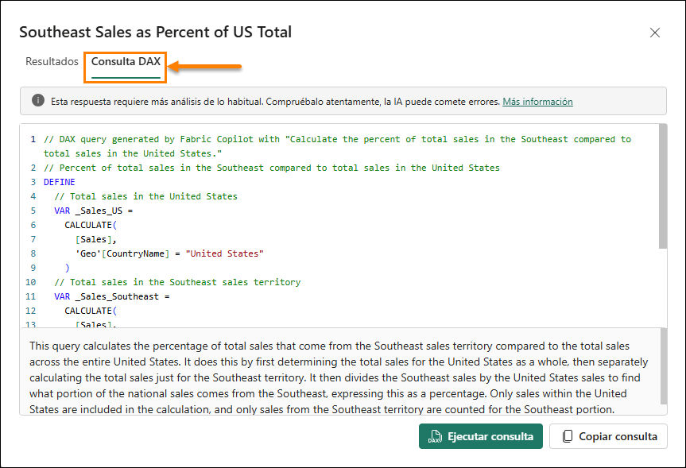

43. Cada vez que Copilot genera DAX, a menudo será muy diferente e incoherente. Su DAX puede parecerse o no a las capturas de pantalla de esta sección. En este código, DAX extrae el estado de la tabla **Geo**, lo cual funciona, pero podría haber tomado fácilmente la información de la ubicación de la tabla **Customer**. Si se hubiera tomado de la tabla Customer, los resultados habrían sido solo de entre el 3 y el 4 %.

    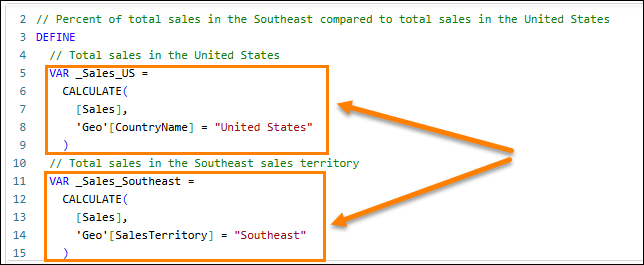

44. Ahora bien, ¿de qué manera podemos resolver este problema? El mejor método que utilizaremos más adelante en nuestros laboratorios cuando **preparemos los datos para la IA**. Por ahora, una forma de garantizar una mejor respuesta es escribiendo una solicitud mejor. Es posible que ya haya obtenido resultados de la tabla **Geo**, pero aun así esta es la segunda mejor manera de confirmarlo.

45. Vuelva a formular la pregunta mediante esta solicitud: **Calculate the percent of total sales in the Southeast to the United States from the Geo table**.

    

46. Es probable que esta vez los resultados sean similares. También podemos comprobar la DAX asociada a la respuesta.

    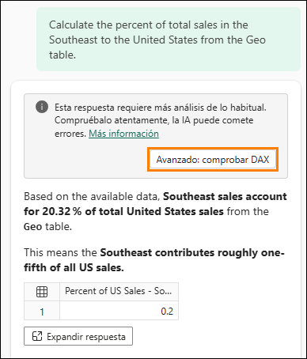

    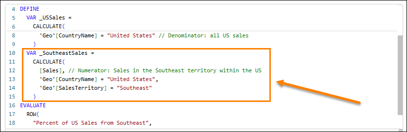

47. ¡Perfecto! Con solicitudes reflexivas, se pueden ajustar los lapsos en el modelo. Sin embargo, para nuestros usuarios finales, queremos crear una experiencia que permita solicitudes más generales.

48. En este archivo PBIX, hay algunos problemas de modelado de datos. De manera más específica, hay dos dimensiones en copo de nieve. Sin embargo, después de revisar el modelo y los requisitos empresariales, hemos decidido que estas dos dimensiones (Supplier y Geo) no son necesarias como tablas individuales. Estas dos tablas se consolidarán en otras tablas en el modelo para acercarse a un esquema de estrella. Cuando se modela correctamente, esto mejorará el rendimiento, hará que el modelo sea más sencillo de entender y mejorará la experiencia de Copilot. Al finalizar este módulo, podrá usar CDIAD – Lab 02– Start.

    - **Supplier:** las columnas de la tabla de proveedores se agregaron a la tabla Product.

    - **Geo:** las columnas de la tabla Geo se agregaron a la tabla Reseller.

**ℹ️ Importante**

A veces es necesario crear dimensiones que filtren otras dimensiones, creando básicamente un copo de nieve. Sin embargo, siempre que sea posible, el modelo semántico debe simplificarse si se cumplen los requisitos empresariales. A medida que se agregan nuevos requisitos comerciales y se incorporan nuevas tablas, el modelo de datos inevitablemente se volverá más complejo. Es importante dedicar siempre tiempo a mantener el modelo de datos optimizado.

⭐Power BI funciona mejor en un esquema de estrella, una discusión completa sobre el esquema de estrella está fuera del alcance de esta clase. Consulte este vínculo de Microsoft Learn para obtener más información:

[**https://learn.microsoft.com/en-us/power-bi/guidance/star-schema**](https://learn.microsoft.com/en-us/power-bi/guidance/star-schema)

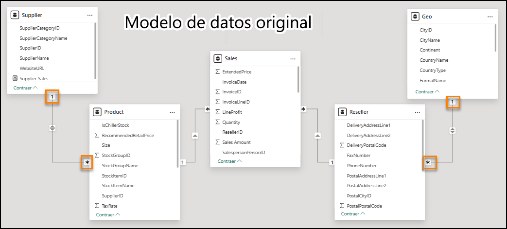

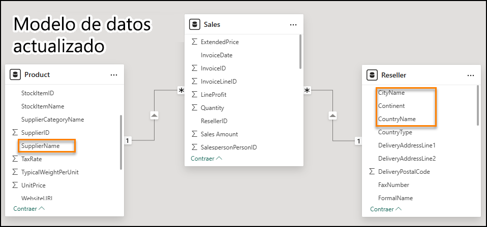

Estos son algunos recursos más que podrán ayudarle a seguir avanzando con Microsoft Fabric.

- Obtenga acceso a toda la información en la [Documentación de Microsoft Fabric](https://learn.microsoft.com/en-us/fabric/).

- Explore Fabric a través de la [Visita guiada](https://aka.ms/Fabric-GuidedTour).

- Regístrese en la [prueba gratuita de Microsoft Fabric](https://aka.ms/try-fabric).

- Visite el [sitio web de Microsoft Fabric](https://aka.ms/microsoft-fabric).

- Adquiera nuevas capacidades mediante la exploración de los [módulos de aprendizaje de Fabric](https://aka.ms/learn-fabric).

- Lea el [libro electrónico gratuito sobre cómo empezar a usar Fabric](https://aka.ms/fabric-get-started-ebook).

- Únase a la [comunidad de Fabric](https://aka.ms/fabric-community) para publicar sus preguntas, compartir sus comentarios y aprender de otros.

Lea de manera más detallada la documentación técnica relevante sobre Copilot:

- [Información general de Copilot para Power BI: Power BI | Microsoft Learn](https://learn.microsoft.com/en-us/power-bi/create-reports/copilot-introduction)

- [Experiencia de Copilot independiente en Power BI (versión preliminar): Power BI | Microsoft Learn](https://learn.microsoft.com/en-us/power-bi/create-reports/copilot-chat-with-data-standalone)

- [Configuración de administrador de Copilot de Microsoft Fabric | Microsoft Learn](https://learn.microsoft.com/en-us/fabric/admin/service-admin-portal-copilot)

- [Creación de agentes de datos de Fabric (versión preliminar): aprenda a crear un agente de datos de Fabric | Microsoft Learn](https://learn.microsoft.com/en-us/fabric/data-science/concept-data-agent)

- [Procedimientos recomendados para la configuración del agente de datos: Microsoft Fabric | Microsoft Learn](https://learn.microsoft.com/en-us/fabric/data-science/data-agent-configuration-best-practices)

- [Copilot para Microsoft Fabric y Power BI: P+F: Microsoft Fabric | Microsoft Learn](https://learn.microsoft.com/en-us/fabric/fundamentals/copilot-faq-fabric)

© 2026 Microsoft Corporation. Todos los derechos reservados.

Al participar en esta demostración o laboratorio práctico, acepta las siguientes condiciones:

Microsoft Corporation pone a su disposición la tecnología o funcionalidad descrita en esta demostración/laboratorio práctico con el fin de obtener comentarios por su parte y de facilitarle una experiencia de aprendizaje. Esta demostración/laboratorio práctico solo se puede usar para evaluar las características de tal tecnología o funcionalidad y para proporcionar comentarios a Microsoft. No se puede usar para ningún otro propósito. Ninguna parte de esta demostración/laboratorio práctico se puede modificar, copiar, distribuir, transmitir, mostrar, realizar, reproducir, publicar, licenciar, transferir ni vender, ni tampoco crear trabajos derivados de ella.

LA COPIA O REPRODUCCIÓN DE ESTA DEMOSTRACIÓN/LABORATORIO PRÁCTICO (O PARTE DE ELLA) EN CUALQUIER OTRO SERVIDOR O UBICACIÓN PARA SU REPRODUCCIÓN O DISTRIBUCIÓN POSTERIOR QUEDA EXPRESAMENTE PROHIBIDA.

ESTA DEMOSTRACIÓN/LABORATORIO PRÁCTICO PROPORCIONA CIERTAS FUNCIONES Y CARACTERÍSTICAS DE PRODUCTOS O TECNOLOGÍAS DE SOFTWARE (INCLUIDOS POSIBLES NUEVOS CONCEPTOS Y CARACTERÍSTICAS) EN UN ENTORNO SIMULADO SIN INSTALACIÓN O CONFIGURACIÓN COMPLEJA PARA EL PROPÓSITO ARRIBA DESCRITO. LA TECNOLOGÍA/ CONCEPTOS DESCRITOS EN ESTA DEMOSTRACIÓN/LABORATORIO PRÁCTICO NO REPRESENTAN LA FUNCIONALIDAD COMPLETA DE LAS CARACTERÍSTICAS Y, EN ESTE SENTIDO, ES POSIBLE QUE NO FUNCIONEN DEL MODO EN QUE LO HARÁN EN UNA VERSIÓN FINAL. ASIMISMO, PUEDE QUE NO SE PUBLIQUE UNA VERSIÓN FINAL DE TALES CARACTERÍSTICAS O CONCEPTOS. DE IGUAL MODO, SU EXPERIENCIA CON EL USO DE ESTAS CARACTERÍSTICAS Y FUNCIONALIDADES EN UN ENTORNO FÍSICO PUEDE SER DIFERENTE.

**COMENTARIOS.** Si envía comentarios a Microsoft sobre las características, funcionalidades o conceptos de tecnología descritos en esta demostración/laboratorio práctico, acepta otorgar a Microsoft, sin cargo alguno, el derecho a usar, compartir y comercializar sus comentarios de cualquier modo y para cualquier fin. También concederá a terceros, sin cargo alguno, los derechos de patente necesarios para que sus productos, tecnologías y servicios usen o interactúen con cualquier parte específica de un software o servicio de Microsoft que incluya los comentarios. No enviará comentarios que estén sujetos a una licencia que obligue a Microsoft a conceder su software o documentación bajo licencia a terceras partes porque incluyamos sus comentarios en ellos. Estos derechos seguirán vigentes después del vencimiento de este acuerdo.

MICROSOFT CORPORATION RENUNCIA POR LA PRESENTE A TODAS LAS GARANTÍAS Y CONDICIONES RELATIVAS A LA DEMOSTRACIÓN/LABORATORIO PRÁCTICO, INCLUIDA CUALQUIER GARANTÍA Y CONDICIÓN DE COMERCIABILIDAD (YA SEA EXPRESA, IMPLÍCITA O ESTATUTARIA), DE IDONEIDAD PARA UN FIN DETERMINADO, DE TITULARIDAD Y DE AUSENCIA DE INFRACCIÓN. MICROSOFT NO DECLARA NI GARANTIZA LA EXACTITUD DE LOS RESULTADOS, EL RESULTADO DERIVADO DE LA REALIZACIÓN DE LA DEMOSTRACIÓN/LABORATORIO PRÁCTICO NI LA IDONEIDAD DE LA INFORMACIÓN CONTENIDA EN ELLA CON NINGÚN PROPÓSITO.

**DECLINACIÓN DE RESPONSABILIDADES**

Esta demostración/laboratorio práctico contiene solo una parte de las nuevas características y mejoras realizadas en Microsoft Power BI. Puede que algunas de las características cambien en versiones futuras del producto. En esta demostración/laboratorio práctico, conocerá algunas de estas nuevas características, pero no todas.
