# Microsoft Fabric Chat with your Data in a Day - Laboratorio 2

## Contenido

- Estructura del documento
- Escenario/planteamiento del problema
- Introducción
  - Tarea 1: Filtrado bidireccional/esquema de estrella
  - Tarea 2: Cambiar el nombre de las columnas, tablas y medidas
  - Tarea 3: Descripciones
  - Tarea 4: Categorías de datos
  - Tarea 5: Resumen
  - Tarea 6: Ordenar por propiedad de columna
  - Tarea 7: Esquema lingüístico: sinónimos

# Estructura del documento

El laboratorio incluye pasos que el usuario debe seguir junto con capturas de pantalla asociadas que sirven de ayuda visual. En cada captura de pantalla, las secciones se resaltan con cuadros de color naranja para indicar en qué áreas debe centrarse el usuario.

# Escenario/planteamiento del problema

Su empresa ha completado sus pruebas iniciales y la fase de prueba de preparación para Copilot. Se ha detectado que el modelo actual aún no está listo para la experiencia de Copilot independiente y será necesario implementar en Power BI Desktop los procedimientos recomendadas generalmente aceptados. Para garantizar que Copilot pueda ofrecer respuestas significativas, el modelo semántico subyacente debe diseñarse y optimizarse cuidadosamente.

Su modelo semántico se enfrenta a los desafíos actuales:

- Los nombres de tablas y columnas pueden ser crípticos y difíciles de descifrar.

- No existen descripciones sobre tablas, columnas y medidas.

- Las categorías de datos están infrautilizadas, lo que limita la comprensión contextual de Copilot.

- Es posible que la lógica de ordenación y los resúmenes predeterminados no reflejen las expectativas del usuario.

- Las relaciones y el esquema lingüístico no están configurados ni optimizados para dar soporte a una experiencia de Copilot óptima.

# Introducción

Estas brechas pueden generar confusión, respuestas imprecisas, objetos visuales engañosos o pérdida de información cuando los usuarios interactúan con Copilot. En este laboratorio, aprenderá a hacer ajustes en el modelo semántico utilizando los procedimientos recomendados para la nomenclatura, la categorización, el resumen, el modelado de datos y el esquema lingüístico.

## Tarea 1: Filtrado bidireccional/esquema de estrella

1. Abra los nombres de archivo **CDIAD – Lab 02– Start** de los archivos de clase para comenzar a preparar sus datos para IA.

    

2. Una de las preguntas que se formularon en el laboratorio anterior fue: **Create a new report page with a visual for sales and product tag**. Esto generaba una respuesta de Copilot que mostraba datos duplicados (captura de pantalla que se muestra a continuación). Por lo general, cuando ve el mismo resultado para todos los puntos de datos, es una indicación de que hay un problema de relación en el modelo de datos.

    

3. A continuación se muestra una captura de pantalla de la relación entre las Tags de la tabla Product Details y la medida Sales de la tabla Sales:

    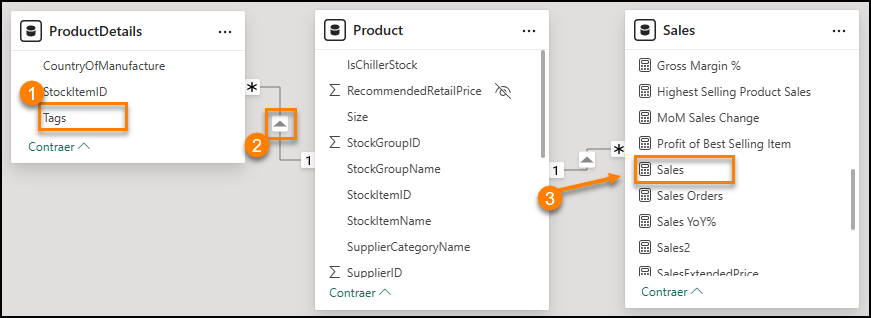

4. Cuando le pedimos a Copilot que devuelva Sales por Tags, genera un informe con datos duplicados. Esto sucede porque la columna Tags de la tabla ProductDetails no puede filtrar la tabla de productos. La dirección del filtro entre Product y ProductDetails es única y desde el Product hasta la tabla ProductDetails . Hay dos maneras de resolver potencialmente este problema.

    - En primer lugar, podríamos crear una medida DAX que calcule las ventas totales mientras se agrega el filtro necesario desde la tabla Tags. Esta opción hace que el modelo de datos sea sencillo, pero es necesario crear una nueva medida para cada necesidad empresarial y podría resultar tedioso.

    - En segundo lugar, y la opción que implementaremos aquí, podemos permitir que el filtro continúe en ambas direcciones. Al actualizar la relación entre Product y ProductDetails, la columna de etiqueta podría filtrarse a través de la tabla Sales y Copilot podría generar la respuesta correcta.

5. Actualicemos la relación en el modelo de datos. *Vea la captura de pantalla a continuación:*

    1. Haga clic en la vida del modelo en el panel de navegación izquierdo.

    2. Seleccione la relación entre Product y ProductDetails.

    3. En el panel de propiedades, cambie la dirección del filtro cruzado de única a ambas.

        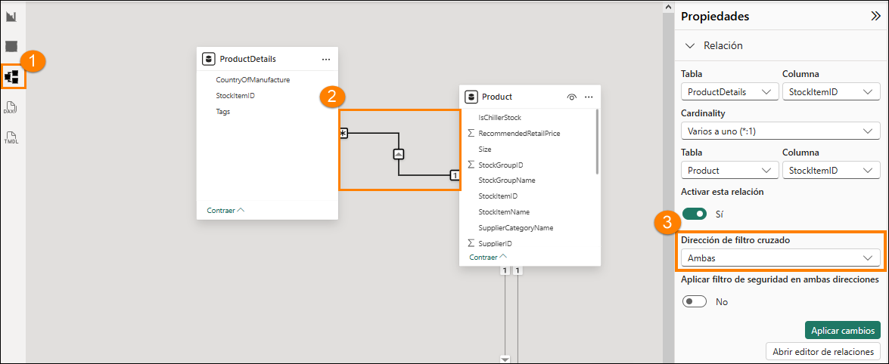

    **ℹ️ Importante**

    Como procedimiento recomendado, debe evitar activar el filtrado en ambas direcciones cuando sea posible. En algunas situaciones, esto puede causar ambigüedad en los resultados, así como problemas de rendimiento. Como se ha mencionado en esta sección, una alternativa es crear medidas DAX que fuercen de manera manual a filtrar esa medida concreta. También hay otras alternativas, que no se tratarán en este curso.

6. Ahora podemos volver a formular la pregunta en la **Vista de informe** y observar la mejora de los resultados. Abra la experiencia de chat de Copilot en Power BI de nuevo y haga la siguiente pregunta: **Show total sales by product tag**.

    

    Si le pide una aclaración, pida la medida **Sales**.

    

7. Resultados correctos:

    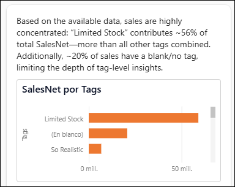

    *Si obtiene un objeto visual diferente, vuelva a solicitar y pida un **Gráfico de barras***.

    

    Resultados anteriores:

    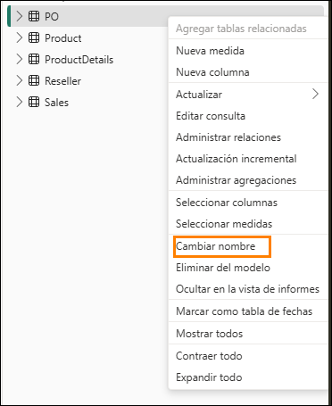

    El modelado de datos siempre ha sido uno de los aspectos más importantes, si no el más importante, de Power BI. Un modelo de datos bien definido y pensado hace que la creación de informes, la redacción de DAX, la implementación de seguridad y la compatibilidad con Copilot resulten más sencillos y eficaces.

## Tarea 2: Cambiar el nombre de las columnas, tablas y medidas

1. En nuestro laboratorio anterior, nos encontramos con problemas relacionados con el uso de Copilot de columnas, tablas e incluso medidas que no habíamos previsto. Estos desafíos son de esperar en nuestros modelos de datos en crecimiento y, para preparar mejor nuestros datos para la IA, debemos realizar ajustes de nomenclatura.

2. Para empezar, vamos a cambiar el nombre de las tablas por otro adecuado. Haga clic en la tabla **PO** y, a continuación, seleccione **Cambiar nombre**. Ajuste la tabla **PO** a **Purchase Orders**.

    

    

3. A continuación, vamos a cambiar el nombre de las columnas siguiendo el mismo proceso. Comience expandiendo la tabla **Reseller**.

    

4. A continuación, haga doble clic o haga clic con el botón derecho en la columna **[SPName]** y cámbiele el nombre a **State**.

    

    

5. Continúe con sus cambios de nombre de la siguiente manera:

    Cambie el nombre de **‘Reseller’[CountryName]** a **Country**.

    En la tabla **Sales**, cambie el nombre de la medida **MoM Sales Change** a **Month over Month Sales Change**.

    En la tabla **Sales**, cambie el nombre de la medida **Sales YoY%** a **Sales Year over Year %**.

    En la tabla **Purchase Orders**, cambie la medida **Spend** a **Total Purchases**.

    **ℹ️ Importante**

    Los nombres claros y descriptivos para tablas y columnas marcan una gran diferencia. Copilot interpreta las solicitudes en función de la estructura del modelo: cuanto más intuitivo sean los nombres, mejor podrá generar DAX, imágenes e información precisos. Cambie el nombre cuidadosamente pensando en mejorar la comprensión de Copilot y su propia productividad.

## Tarea 3: Descripciones

1. Preparemos ahora el modelo de datos aún más agregando descripciones. Se pueden agregar descripciones a tablas, columnas y medidas en la vista de modelo. Estas descripciones ayudarán a Copilot a responder a las solicitudes de los usuarios. Las descripciones de tablas actúan como un pase entre bastidores para Copilot, ya que le brindan el contexto que necesita para generar resúmenes de información precisos y pertinentes, e incluso medidas DAX. Para empezar, comencemos por la vista **Modelo**.

2. Seleccione la tabla **Purchase Orders**. En el área **Propiedades**, encontrará el área Descripción donde crearemos nuestra **descripción** para ayudar a Copilot. Estos son algunas sugerencias de procedimientos recomendados:

    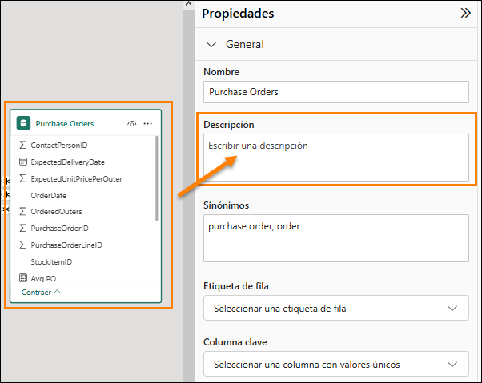

    ### Procedimientos recomendados para descripciones de tablas

    **Comenzar con una finalidad:** ¿Qué representa la tabla en términos empresariales?

    **Incluir el contexto empresarial:** explique de qué manera la tabla admite la elaboración de informes o la toma de decisiones.

    **Mencionar la granularidad:** ¿es transaccional, diaria, agregada, etc.?

    **Resaltar las columnas clave:** especialmente las que se utilizan en relaciones o cálculos.

    **Describir los casos de uso común:** qué tipos de preguntas u objetos visuales admite esta tabla.

    **Observar las relaciones:** mencione cómo se conecta a otras tablas del modelo.

    **ℹ️ Importante**

    **Las descripciones bien escritas ayudan a Copilot a comprender la finalidad y el contexto de sus datos.** Use descripciones para aclarar lo que representa una tabla o columna, especialmente cuando los nombres por sí solos no son suficientes. Copilot utiliza estas señales para generar respuestas, DAX y objetos visuales más relevantes. Piense en las descripciones como su oportunidad de guiar a Copilot (y a sus usuarios) hacia mejores conclusiones.

3. Coloque esta extensa pero precisa descripción en el campo:

    *This Purchase Orders table captures individual line items from purchase orders submitted within the organization. Each row represents a specific product ordered, including the quantity requested, the date of the order, and the employee who initiated the request. It supports analysis of procurement trends, supplier demand, and employee purchasing behavior. Key columns include ProductID, QuantityOrdered, OrderDate, and EmployeeID. This table links to Products, Employees, and PurchaseOrders tables to enable detailed reporting across procurement workflows.*

    Esto ayudará en gran medida a Copilot a elaborar mejores respuestas, especialmente en lo que respecta a la tabla **Purchase Orders**. Sigamos creando mejores descripciones para algunas columnas. Seleccione la columna **OrderDate** en la tabla **Purchase Orders** y agregue una descripción similar:

    ### Procedimientos recomendados para descripciones de columnas en modelos semánticos

    **Comenzar con el significado empresarial:** describa lo que representa la columna en términos empresariales.

    **Aclarar las unidades, el formato o la escala:** si es numérico, se basan en fechas o son categóricas, explique cómo están estructuradas.

    **Mencionar casos de uso comunes:** ayuda a Copilot a comprender cómo se suele usar esta columna en los análisis o informes. Ejemplo: Ingresos – Importe total de ventas de cada transacción. Se utiliza en el análisis de rentabilidad y tendencias.

    **Evitar la redundancia:** no repita lo que es obvio en el nombre de la columna a menos que aporte claridad. En su lugar, enriquézcalo con contexto. Por ejemplo, para EmployeeID, puede agregar la siguiente descripción: Unique identifier for the employee who submitted the order.

    **Emplear un tono coherente:** mantenga las descripciones concisas, informativas y coherentes en todo el modelo. Es como escribir información sobre herramientas para analistas curiosos.

4. Seleccione la tabla **Purchase Orders** y, a continuación, haga clic en **OrderDate**. Escriba la siguiente descripción:

    ***Introduzca la siguiente descripción: The calendar date when the purchase order was submitted by an employee.***

    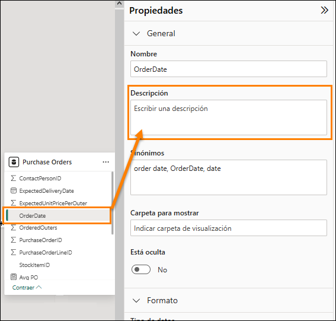

5. Ahora que hemos ajustado las **descripciones** de tabla y columna, agreguemos una descripción a una medida. Sin embargo, esta vez, vamos a utilizar Copilot para ayudar a crear la descripción. Empiece seleccionando la medida **Purchase Orders**. Desde allí, vamos a seleccionar **Crear con Copilot**.

    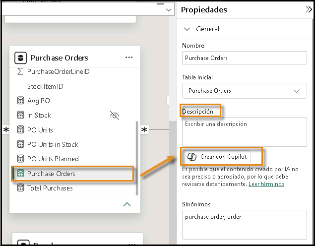

6. Observe que la descripción creada por Copilot está lista para su revisión. Esta respuesta puede variar, pero funcionará bien para ayudar a comprobar y detallar nuestra descripción. Puede presionar **Volver a intentarlo**, pero cuando esté listo, seleccione **Mantener**.

    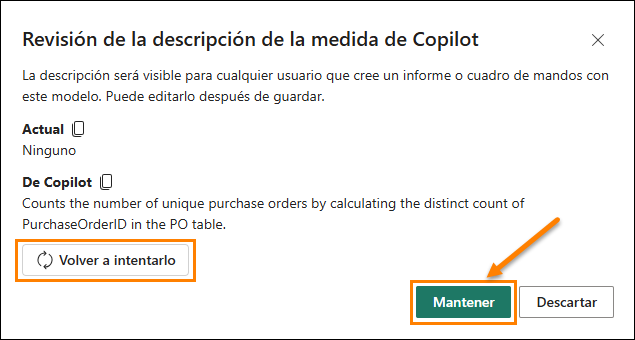

    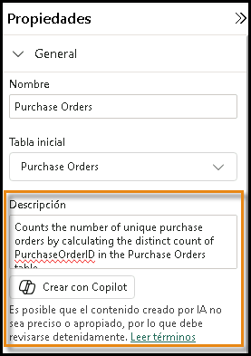

    En esta sección ha aprendido a agregar descripciones a tablas, columnas y medidas. En un modelo semántico real, ampliaría lo que hemos hecho aquí al resto de las tablas, así como a las columnas y medidas aplicables. Ha mejorado considerablemente la capacidad de Copilot para trabajar con los datos y mejorar todas las respuestas futuras.

## Tarea 4: Categorías de datos

La adición de categorías de datos a las columnas de Power BI es importante para Copilot, especialmente cuando trabaja con modelos semánticos que incluyen datos web, geográficos o de imagen. Estas categorías actúan como etiquetas de metadatos que ayudan a Copilot (y a los objetos visuales) a interpretar la finalidad de la columna más allá del nombre o del tipo de datos.

1. Vaya a la vista **Tabla** y seleccione la tabla Reseller. Empiece seleccionando la columna **State** en la tabla **Reseller**.

    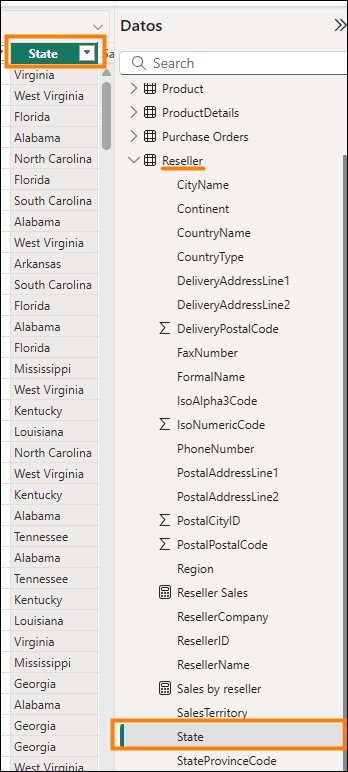

2. Cuando haya seleccionada la columna State, verá que ha aparecido un nuevo menú de cinta en la parte superior del informe de Power BI denominado **Herramientas de columna**. Haga clic en Herramientas de columna. Comencemos cambiando la **Categoría de datos**.

    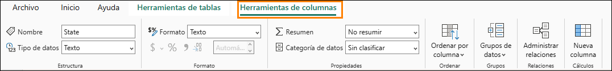

3. Expanda el área **Categoría de datos** y cambie la categoría de datos de Sin categoría a **Estado o provincia**.

    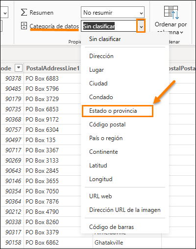

4. Continúe agregando categorías de datos para las columnas restantes que se indican a continuación:

    | **Nombre de tabla** | **Nombre de columna** | **Categoría de datos** |
    |---------------------|-----------------------|------------------------|
    | Reseller | Country | País o región |
    | Reseller | DeliveryPostalCode | Código postal |
    | Reseller | PostalPostalCode | Código postal |
    | Reseller | Website URL | Dirección URL web |

    **ℹ️ Importante**

    **El establecimiento de categorías de datos ayuda a Copilot a comprender cómo realizar el tratamiento de sus datos.** Tanto si se trata de geografía, direcciones URL o imágenes, la asignación de la categoría correcta le brinda a Copilot contexto para generar imágenes, filtros e información más inteligentes. Por ejemplo, etiquetar una columna como "City" permite que Copilot la sitúe en el mapa al instante. Es un pequeño paso que desbloquea un gran valor.

## Tarea 5: Resumen

En esta sección, descubriremos el resumen predeterminado en Power BI y cómo puede afectar a las respuestas de Copilot. Esta no es una adición nueva a Power BI, pero es fundamental para Copilot.

1. Abra Copilot en la **vista de informe** y escriba la siguiente solicitud: **What is customer age by state?**

    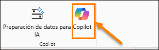

    

2. Eche un vistazo a los resultados y observe que puede haber algún resultado extraño. Pase el cursor sobre las barras de datos de **WA, NY** u otros estados y verá que se devuelve la suma de Age. Probablemente esperaría ver aquí el promedio, pero debido a que hay un resumen predeterminado de **SUM en la columna Age**, Copilot realiza un resumen.

    Copilot también puede solicitar una aclaración, como se ve en la siguiente imagen. En cualquier caso, podemos obtener el Promedio cada vez ajustando el **Resumen** y evitar preguntas adicionales.

    

    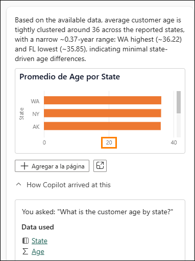

3. Al pasar el cursor sobre Age, puede comprobar y confirmar que Copilot realizó una operación de SUM en la columna.

    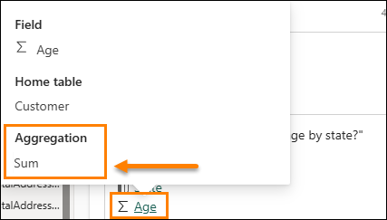

    **ℹ️ Importante**

    **El resumen predeterminado le indica a Copilot cómo tratar sus columnas en objetos visuales y cálculos.** Ya sea "No resumir", "Suma" o "Promedio", si se configura correctamente, Copilot puede generar gráficos y DAX más precisos. Por ejemplo, marque los id. o nombres como "No resumir" para evitar totales engañosos. Es una manera rápida de guiar a Copilot hacia información significativa.

    Podríamos escribir una mejor solicitud preguntando específicamente por la edad promedio, y esto funcionaría. Sin embargo, la mejor opción es mejorar el modelo de datos siempre que sea posible. Por lo tanto, ajustaremos la propiedad **Resumen predeterminado**.

4. En la solicitud de Copilot, escriba: **What is customer age average by state**.

    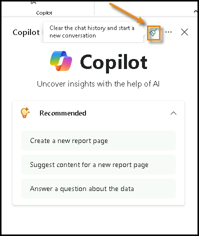

5. Vamos a ajustar el **Resumen predeterminado**. Seleccione la columna **Age** en la tabla 'Customer' para mostrar las herramientas de columna. Busque el área **Resumen** y ajuste la edad a **Promedio**.

    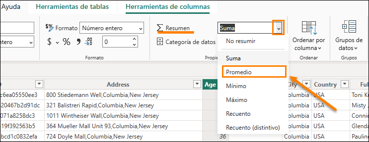

6. Usando el chat de Copilot, volvamos a hacer la pregunta: **What is customer age by state?**

    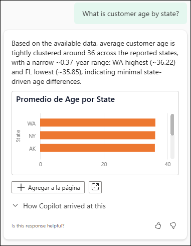

    ¡Perfecto! Este es el resultado esperado y permitirá a los usuarios hacer sus preguntas de manera más informal, así como las variaciones esperadas en las preguntas del usuario. Es igualmente importante desactivar el resumen predeterminado en las columnas que son numéricas pero que no deben resumirse. Las columnas como Año, Trimestre y Número de mes, por ejemplo, no se deben resumir.

## Tarea 6: Ordenar por propiedad de columna

1. La propiedad Ordenar por columna, al igual que el resumen predeterminado, no es nueva para Power BI, pero si se establece correctamente, Copilot devolverá los resultados en un orden que podría alinearse con lo que esperaría ver. Por ejemplo, si devuelve ventas por mes, ordena el objeto visual de manera predeterminada entre el mes de mayor venta y el mes de menor venta. Pongámoslo en la prueba.

2. Si aún no lo ha hecho, restablezca el chat de Copilot presionando el área **Borrar chat**.

3. Ahora escriba la siguiente solicitud: **Show total sales by month as a column chart**.

    

4. Los resultados son correctos, pero están ordenados de una manera que no se ajusta a nuestra visión típica en el calendario gregoriano (enero, febrero, marzo... diciembre). Los resultados se devuelven ordenados alfabéticamente o, en este caso, están ordenados desde las ventas más altas a las más bajas.

    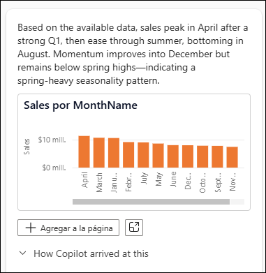

    **ℹ️ Importante**

    **Utilice "Ordenar por columna" para controlar cómo presenta Copilot los datos.** Esta configuración ayuda a Copilot a mostrar los datos para que categorías como meses o etiquetas personalizadas aparezcan en el orden previsto en imágenes y resúmenes. Por ejemplo, ordenar "Nombre de mes" por "Número de mes" ayuda a Copilot a crear gráficos precisos basados en el tiempo. Es una solución sencilla que evita resultados confusos.

5. Tendremos que ajustar la manera en que la columna **MonthName** ordena desde el área **Ordenar por columna** del área **Herramientas de columna**. Seleccione la columna MonthName desde
    la tabla **Date**.

6. Expanda Ordenar por columna y ajuste la ordenación para que sea por Month:

    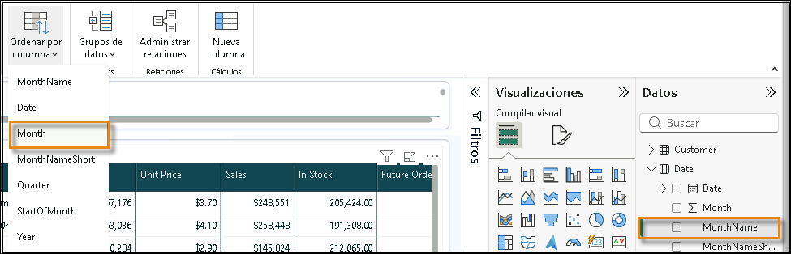

7. Hágale la misma pregunta al chat de Copilot: **Show total sales by month** y ahora obtendrá los resultados, de la manera prevista.

    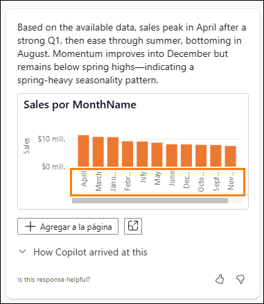

## Tarea 7: Esquema lingüístico: sinónimos

El **esquema lingüístico** es la clave para aprovechar todo el potencial de Copilot como partner de análisis de lenguaje natural. Es como si le diera a Copilot una guía de traducción para su modelo de datos. Sin ella, Copilot adivina. Con ella, Copilot adquiere mucha mayor fluidez y se familiariza con sus datos.

**¿Qué es el esquema lingüístico?**

El esquema lingüístico son metadatos que asignan su modelo semántico al lenguaje natural. Ayuda a Copilot a entender lo siguiente:

- Qué significan sus tablas y columnas

- Cómo se relacionan con los conceptos empresariales

- Qué sinónimos, frases y tipos de preguntas pueden usar los usuarios al interactuar con los datos

Por ejemplo, en lugar de limitarse a leer los nombres de las columnas, Copilot entiende lo siguiente:

- "Ingresos" = TotalSales

- "Pedidos realizados" = PurchaseOrderCount

- “Rendimiento del empleado” = SalesByEmployee

Esto significa que Copilot puede responder preguntas como las siguientes:

- "¿Qué región tuvo los mayores ingresos el trimestre pasado?"

- "Muéstrame los empleados con mejor rendimiento por volumen de ventas"

Sin un esquema lingüístico, Copilot podría malinterpretar términos imprecisos o sugerir objetos visuales irrelevantes. Con él, obtiene:

- Mejores sugerencias de DAX

- Recomendaciones visuales más inteligentes

- Resúmenes e información más precisos

**Admite sinónimos y lenguaje natural**

Puede definir sinónimos como los siguientes:

- “PC” = “Pedido de compra”

- “Rep” = “Representante de ventas”

- “Cant” = “Cantidad pedida”

1. Echemos un vistazo a la interfaz **Esquema lingüístico**. Comience seleccionando la **vista de modelo** o, si se encuentra en la vista de informe, la cinta de modelado. A continuación, vaya al área de **Configuración de Preguntas y respuestas**.

    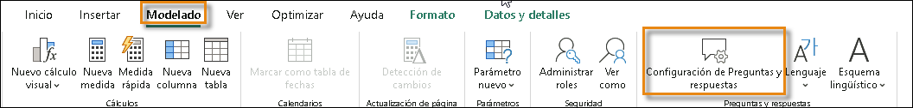

2. Hay un menú impresionante para ayudar a las preguntas y respuestas utilizadas por su modelo de datos de Copilot a comprender mejor a las personas. El menú principal tiene muchas áreas para comenzar.

    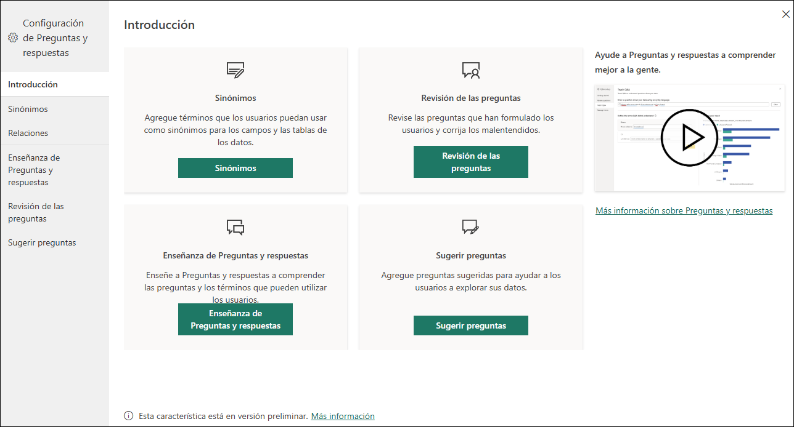

3. Vayamos al primer menú, el de sinónimos.

    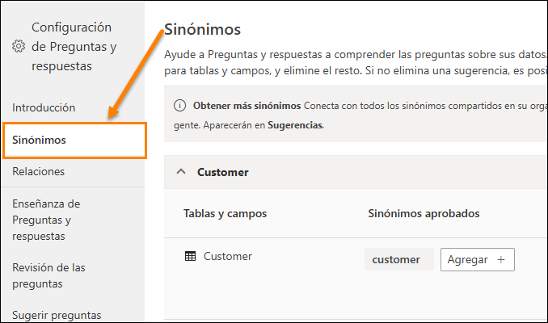

4. Los sinónimos más precisos ayudarán a Copilot a comprender las diferentes formas en que los usuarios pueden formular sus preguntas. También puede ajustar la tabla por la que navega para llegar a la columna correcta presionando el icono de contenido adicional.

    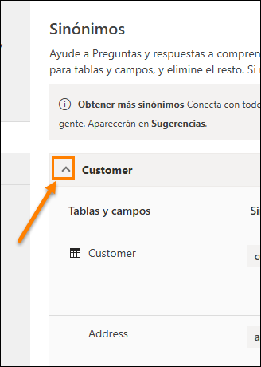

    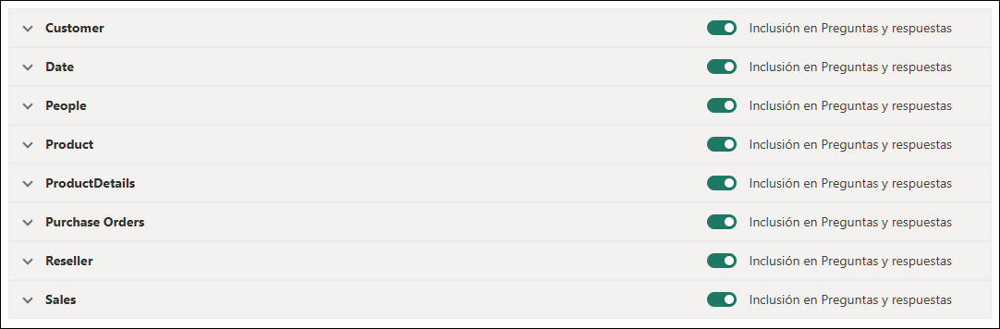

5. Ayudemos a Copilot ajustando los sinónimos de **Reseller** para ser más específicos. Asegúrese de que la tabla **Reseller** esté expandida y podrá ver todos los sinónimos actuales asociados a la columna **ResellerID** y Sugerencias.

6. Dentro de Fabrikam, a menudo se hace referencia a los revendedores como ***Fabrikam Friends***. Agreguemos los mismos sinónimos para que nuestros empleados puedan realizar preguntas en la jerga de Fabrikam. Seleccione **Agregar** en el **comprador** e introduzca el sinónimo.

    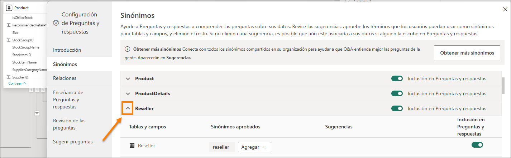

7. Agregue ***Fabrikam Friends*** con el botón Agregar +.

    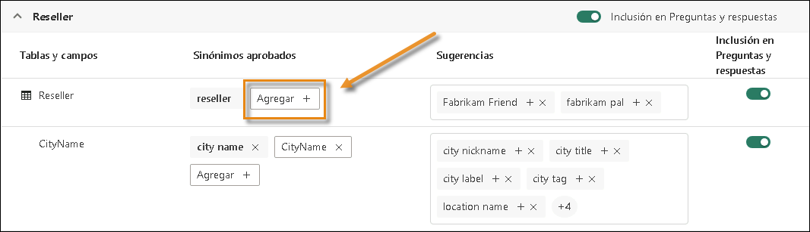

    

8. Observará que Copilot evaluará la adición y agregará otras sugerencias de manera adecuada de forma dinámica.

    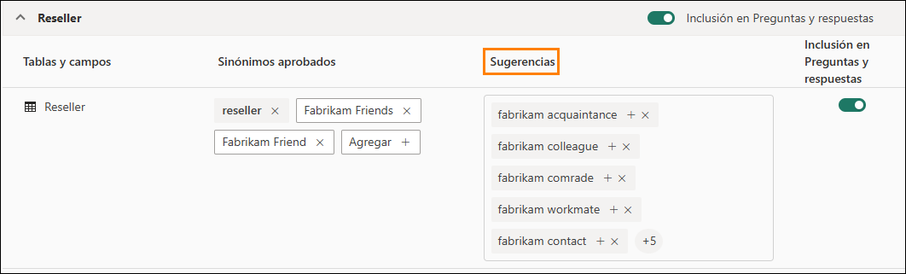

9. Agreguemos ahora otro sinónimo para la tabla Reseller mediante una de las sugerencias. Haga clic en una sugerencia que elija, como ***Fabrikam Acquaintance***.

    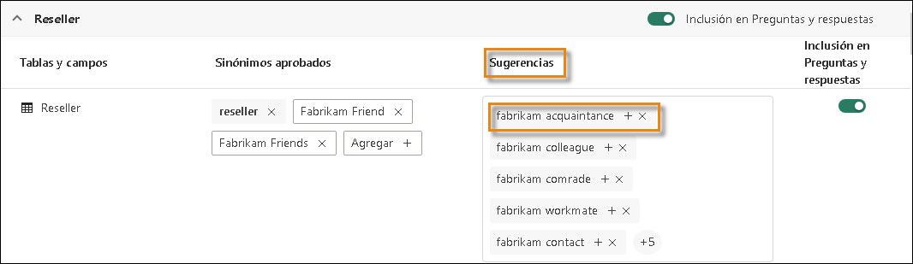

    El proceso de agregar sinónimos es un proceso muy complicado que se mejora con el tiempo. No dude en explorar otras tablas y columnas y en agregar sinónimos adicionales en el archivo de Power BI Desktop.

10. ¡Genial! Veamos ahora **Relaciones**. Navegue por el menú de configuración de preguntas y respuestas.

    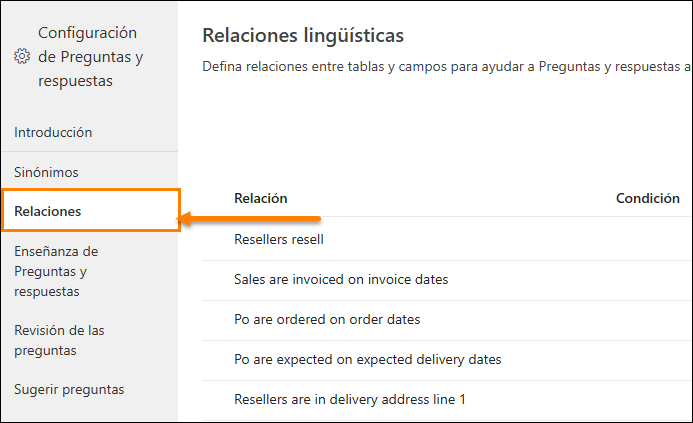

    Las relaciones lingüísticas definen las relaciones entre tablas y campos para ayudar a las preguntas y respuestas a comprender las preguntas sobre sus datos. Es similar a cómo se conectan las tablas en su modelo de datos, pero se expresan de manera que Copilot pueda comprender lingüísticamente.

    Por ejemplo, las relaciones se pueden usar para resolver ambigüedades. Si su modelo tiene varios campos de fecha en múltiples tablas, puede agregar relaciones en las fechas que ayudarán a Copilot a determinar cuál usar según el contexto y las conexiones de la tabla.

    Para agregar nuevas relaciones, comience haciendo clic en el cuadro + Nueva relación, como se ve en la captura de pantalla a continuación.

    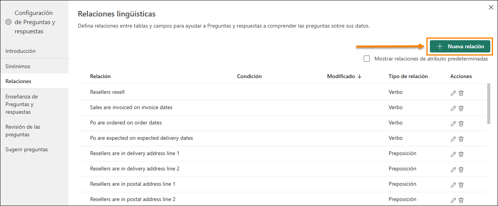

11. Desde aquí, puede crear muchas relaciones lingüísticas diferentes. Las opciones actuales incluyen verbos, adjetivos, sustantivos, preposiciones, nombres y asociación. Consulte la captura de pantalla de las opciones disponibles que aparece a continuación con ejemplos:

    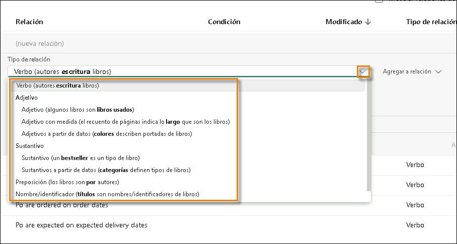

    **ℹ️ Importante**

    **Las relaciones en el esquema lingüístico definen cómo entiende Copilot las conexiones entre tablas al responder al lenguaje natural.** Dan forma a cómo se interpretan preguntas como "ventas por categoría de producto" o "pedidos por región". Sin relaciones claras, Copilot podría tener dificultades para vincular conceptos entre tablas. Definirlas correctamente garantiza conversaciones más fluidas e intuitivas.

    Para este laboratorio, no creará ninguna relación en el modelo. De manera similar a agregar sinónimos, este es un proceso complicado que requerirá actualización y mantenimiento a medida que se aprenda más sobre cómo los usuarios consultan los datos con Copilot y cómo se puede utilizar el esquema lingüístico para mejorar esa experiencia.

12. Ahora podemos recorrer los elementos restantes de la configuración de preguntas y respuestas. Echemos un vistazo a **Enseñanza de Preguntas y respuestas**, seleccione la sección.

    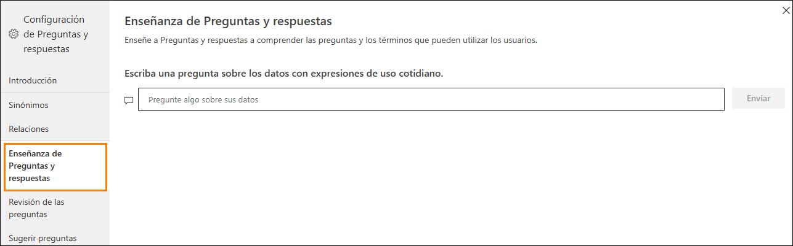

13. Aquí podemos enseñar a Preguntas y respuestas para comprender las preguntas y los términos que la gente puede usar. Intente hacer preguntas y respuestas: **How many sales happen in january?**

    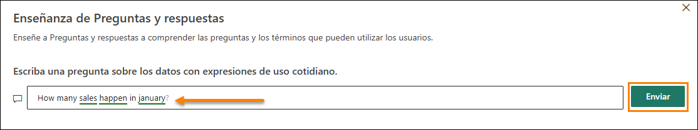

    Verá que Copilot muestra "happen" como un término desconocido. Esto le permitirá ajustar aún más para dar cabida a preguntas como estas.

    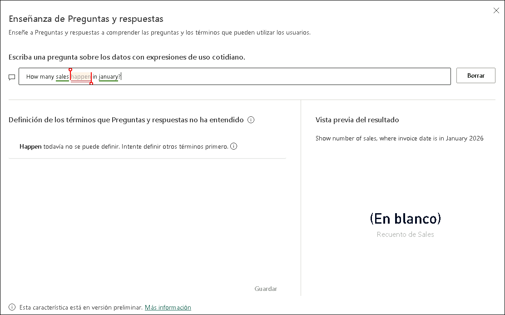

14. Puede volver a intentarlo con otra solicitud, como "What is the total sales for january 2022?" y recibir los resultados. Esto se convierte en una gran área de prueba.

    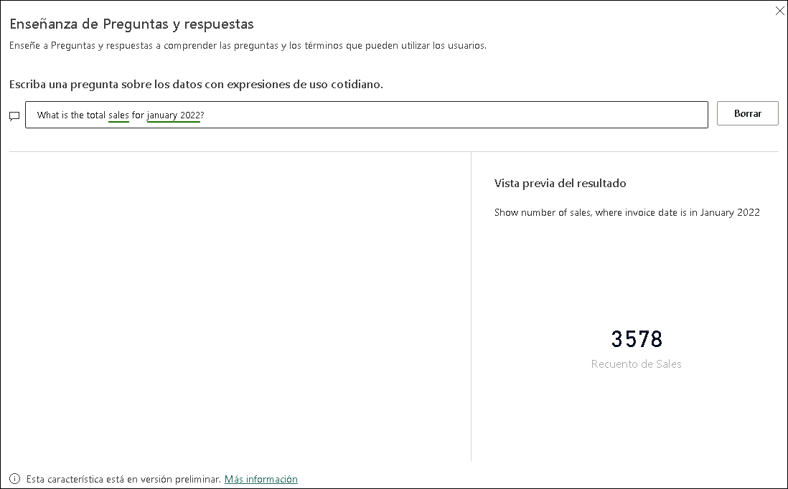

15. También puede ver el efecto de los sinónimos y las relaciones en el trabajo preguntando: **What is sales by Fabrikam Friends?**

    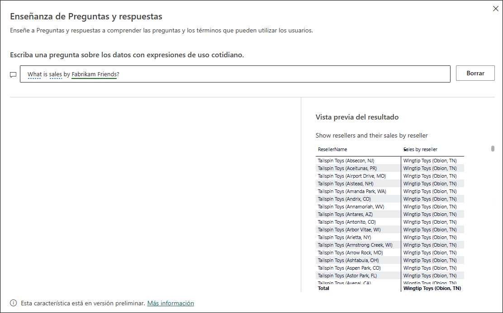

16. A continuación, vaya a **Revisión de las preguntas**. Aquí, las preguntas que las personas han realizado dentro del inquilino se pueden ajustar para corregirlas en el futuro.

    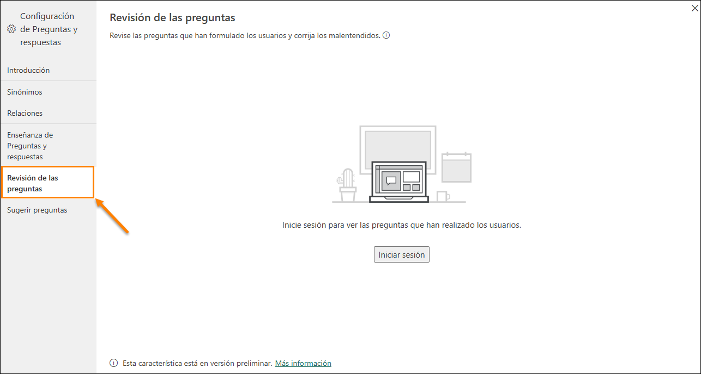

17. Por último, vaya a **Sugerir preguntas**. Aquí puede ayudar a las personas a explorar los datos agregando la opción de sugerir preguntas.

    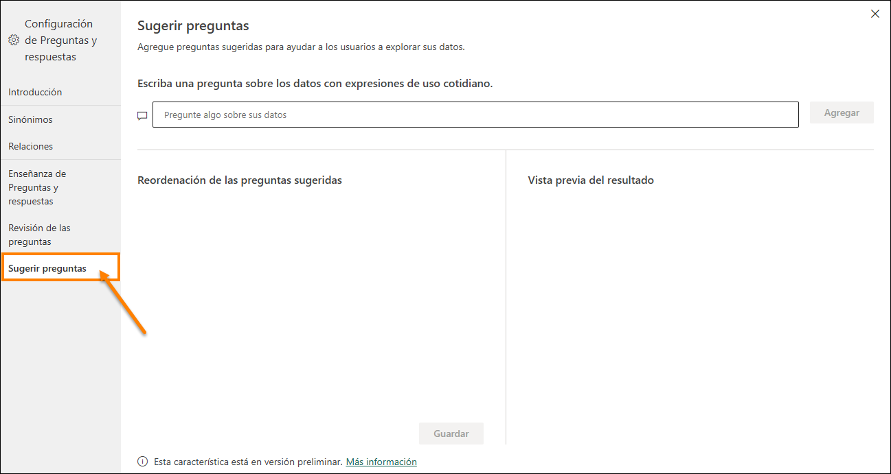

18. Queremos ayudar a los usuarios con esto, así que seleccionemos el cuadro Pregunte algo sobre sus datos y agreguemos una sugerencia: **What is total sales by State?** A continuación, puede pulsar la opción de enviar para ver una vista previa.

    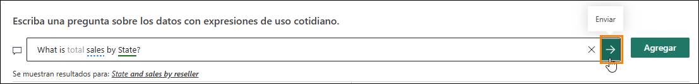

    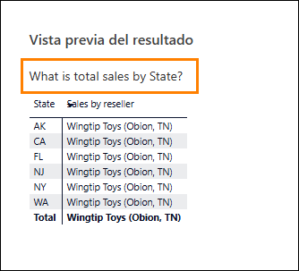

19. Guarde la sugerencia haciendo clic en **Agregar**.

    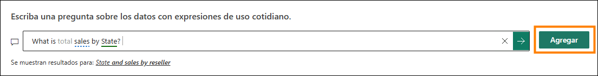

20. **Guarde** sus resultados y podrá completar el laboratorio 2.

    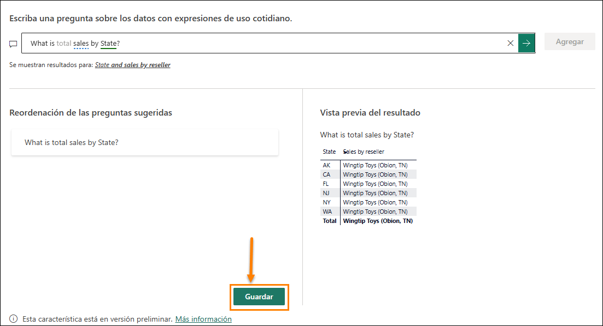

    En este laboratorio, hemos aprendido sobre las prácticas recomendadas para el modelado de datos con el fin de mejorar el rendimiento y la precisión de las respuestas de lenguaje natural de Copilot para modelos semánticos de Power BI.

    Estos son algunos recursos más que podrán ayudarle a seguir avanzando con Microsoft Fabric.

    - Obtenga acceso a toda la información en la [Documentación de Microsoft Fabric](https://learn.microsoft.com/en-us/fabric/).

    - Explore Fabric a través de la [Visita guiada](https://aka.ms/Fabric-GuidedTour).

    - Regístrese en la [prueba gratuita de Microsoft Fabric](https://aka.ms/try-fabric).

    - Visite el [sitio web de Microsoft Fabric](https://aka.ms/microsoft-fabric).

    - Adquiera nuevas capacidades mediante la exploración de los [módulos de aprendizaje de Fabric](https://aka.ms/learn-fabric).

    - Lea el [libro electrónico gratuito sobre cómo empezar a usar Fabric](https://aka.ms/fabric-get-started-ebook).

    - Únase a la [comunidad de Fabric](https://aka.ms/fabric-community) para publicar sus preguntas, compartir sus comentarios y aprender de otros.

    Lea de manera más detallada la documentación técnica relevante sobre Copilot:

    - [Información general de Copilot para Power BI: Power BI | Microsoft Learn](https://learn.microsoft.com/en-us/power-bi/create-reports/copilot-introduction)

    - [Experiencia de Copilot independiente en Power BI (versión preliminar): Power BI | Microsoft Learn](https://learn.microsoft.com/en-us/power-bi/create-reports/copilot-chat-with-data-standalone)

    - [Configuración de administrador de Copilot de Microsoft Fabric | Microsoft Learn](https://learn.microsoft.com/en-us/fabric/admin/service-admin-portal-copilot)

    - [Creación de agentes de datos de Fabric (versión preliminar): aprenda a crear un agente de datos de Fabric | Microsoft Learn](https://learn.microsoft.com/en-us/fabric/data-science/concept-data-agent)

    - [Procedimientos recomendados para la configuración del agente de datos: Microsoft Fabric | Microsoft Learn](https://learn.microsoft.com/en-us/fabric/data-science/data-agent-configuration-best-practices)

    - [Copilot para Microsoft Fabric y Power BI: P+F: Microsoft Fabric | Microsoft Learn](https://learn.microsoft.com/en-us/fabric/fundamentals/copilot-faq-fabric)

    © 2026 Microsoft Corporation. Todos los derechos reservados.

    Al participar en esta demostración o laboratorio práctico, acepta las siguientes condiciones:

    Microsoft Corporation pone a su disposición la tecnología o funcionalidad descrita en esta demostración/laboratorio práctico con el fin de obtener comentarios por su parte y de facilitarle una experiencia de aprendizaje. Esta demostración/laboratorio práctico solo se puede usar para evaluar las características de tal tecnología o funcionalidad y para proporcionar comentarios a Microsoft. No se puede usar para ningún otro propósito. Ninguna parte de esta demostración/laboratorio práctico se puede modificar, copiar, distribuir, transmitir, mostrar, realizar, reproducir, publicar, licenciar, transferir ni vender, ni tampoco crear trabajos derivados de ella.

    LA COPIA O REPRODUCCIÓN DE ESTA DEMOSTRACIÓN/LABORATORIO PRÁCTICO (O PARTE DE ELLA) EN CUALQUIER OTRO SERVIDOR O UBICACIÓN PARA SU REPRODUCCIÓN O DISTRIBUCIÓN POSTERIOR QUEDA EXPRESAMENTE PROHIBIDA.

    ESTA DEMOSTRACIÓN/LABORATORIO PRÁCTICO PROPORCIONA CIERTAS FUNCIONES Y CARACTERÍSTICAS DE PRODUCTOS O TECNOLOGÍAS DE SOFTWARE (INCLUIDOS POSIBLES NUEVOS CONCEPTOS Y CARACTERÍSTICAS) EN UN ENTORNO SIMULADO SIN INSTALACIÓN O CONFIGURACIÓN COMPLEJA PARA EL PROPÓSITO ARRIBA DESCRITO. LA TECNOLOGÍA/CONCEPTOS DESCRITOS EN ESTA DEMOSTRACIÓN/LABORATORIO PRÁCTICO NO REPRESENTAN LA FUNCIONALIDAD COMPLETA DE LAS CARACTERÍSTICAS Y, EN ESTE SENTIDO, ES POSIBLE QUE NO FUNCIONEN DEL MODO EN QUE LO HARÁN EN UNA VERSIÓN FINAL. ASIMISMO, PUEDE QUE NO SE PUBLIQUE UNA VERSIÓN FINAL DE TALES CARACTERÍSTICAS O CONCEPTOS. DE IGUAL MODO, SU EXPERIENCIA CON EL USO DE ESTAS CARACTERÍSTICAS Y FUNCIONALIDADES EN UN ENTORNO FÍSICO PUEDE SER DIFERENTE.

    **COMENTARIOS.** Si envía comentarios a Microsoft sobre las características, funcionalidades o conceptos de tecnología descritos en esta demostración/laboratorio práctico, acepta otorgar a Microsoft, sin cargo alguno, el derecho a usar, compartir y comercializar sus comentarios de cualquier modo y para cualquier fin. También concederá a terceros, sin cargo alguno, los derechos de patente necesarios para que sus productos, tecnologías y servicios usen o interactúen con cualquier parte específica de un software o servicio de Microsoft que incluya los comentarios. No enviará comentarios que estén sujetos a una licencia que obligue a Microsoft a conceder su software o documentación bajo licencia a terceras partes porque incluyamos sus comentarios en ellos. Estos derechos seguirán vigentes después del vencimiento de este acuerdo.

    MICROSOFT CORPORATION RENUNCIA POR LA PRESENTE A TODAS LAS GARANTÍAS Y CONDICIONES RELATIVAS A LA DEMOSTRACIÓN/LABORATORIO PRÁCTICO, INCLUIDA CUALQUIER GARANTÍA Y CONDICIÓN DE COMERCIABILIDAD (YA SEA EXPRESA, IMPLÍCITA O ESTATUTARIA), DE IDONEIDAD PARA UN FIN DETERMINADO, DE TITULARIDAD Y DE AUSENCIA DE INFRACCIÓN. MICROSOFT NO DECLARA NI GARANTIZA LA EXACTITUD DE LOS RESULTADOS, EL RESULTADO DERIVADO DE LA REALIZACIÓN DE LA DEMOSTRACIÓN/LABORATORIO PRÁCTICO NI LA IDONEIDAD DE LA INFORMACIÓN CONTENIDA EN ELLA CON NINGÚN PROPÓSITO.

    **DECLINACIÓN DE RESPONSABILIDADES**
    
    Esta demostración/laboratorio práctico contiene solo una parte de las nuevas características y mejoras realizadas en Microsoft Power BI. Puede que algunas de las características cambien en versiones futuras del producto. En esta demostración/laboratorio práctico, conocerá algunas de estas nuevas características, pero no todas.
