# Microsoft Fabric Chat with your Data in a Day - Laboratorio 3

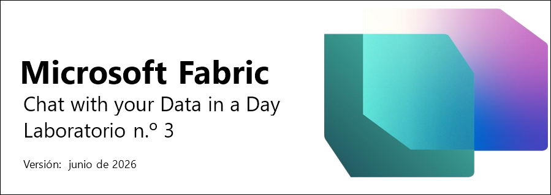

## Contenido

- Estructura del documento
- Escenario/planteamiento del problema
- Introducción
- Preparar datos para Copilot
  - Tarea 1: Simplificar el esquema de datos
  - Tarea 2: Agregar instrucciones de IA
  - Tarea 3: Crear respuestas verificadas
  - Tarea 4: Pruébelo usted mismo
- Conclusión
- Referencias

# Estructura del documento

El laboratorio incluye pasos que el usuario debe seguir junto con capturas de pantalla asociadas que sirven de ayuda visual. En cada captura de pantalla, las secciones se resaltan con cuadros de color naranja para indicar en qué áreas debe centrarse el usuario.

# Escenario/planteamiento del problema

Recientemente ha habilitado Copilot en Microsoft Fabric para ayudar a los usuarios a interactuar con los datos de manera más intuitiva. Sin embargo, el uso temprano ha revelado que Copilot a veces devuelve respuestas imprecisas o confusas. Estos problemas se derivan de modelos de datos demasiado complejos, terminología ambigua y definiciones poco claras dentro de la capa semántica.

Para mejorar la comprensión y los resultados de Copilot, ha aprendido que puede preparar su modelo de datos con la característica Preparar datos para IA en Power BI. Esto incluye simplificar el esquema, agregar instrucciones de IA y crear respuestas verificadas para guiar a Copilot hacia respuestas más precisas y contextualizadas.

**Desafíos actuales**

- Reducir la ambigüedad en las respuestas de Copilot causada por medidas y terminología poco claras.

- Garantizar que Copilot comprenda las definiciones específicas del negocio (por ejemplo, los más vendidos frente a los de mayor venta).

- Proporcionar respuestas verificadas a preguntas comunes para mejorar la coherencia y la confiabilidad.

- Limitar el acceso de Copilot a elementos de datos innecesarios o engañosos.

# Introducción

Hasta ahora, ha aprendido a evaluar un modelo semántico para determinar la preparación de Copilot, así como los procedimientos recomendados para el modelo semántico. Ahora, llevará a cabo el siguiente paso preparando esos modelos para usarlos con Copilot. En este laboratorio, utilizará la característica Preparar datos para IA para simplificar su esquema, agregar instrucciones de IA y crear respuestas verificadas, todo lo cual ayuda a Copilot a proporcionar información más precisa y relevante para el negocio.

Al final de este laboratorio, habrá aprendido:

- Cómo simplificar un esquema de datos para guiar el comportamiento de Copilot

- Cómo agregar instrucciones de IA para aclarar la terminología empresarial

- Cómo crear respuestas verificadas para mejorar la precisión de Copilot

# Preparar datos para Copilot

En esta sección, preparará un modelo de datos para usarlo con Copilot. Esto es necesario porque Copilot a veces da respuestas incorrectas o confusas porque el modelo de datos contiene medidas adicionales, definiciones poco claras o terminología ambigua. Por lo tanto, tenemos el botón **Preparación de datos para IA** en la cinta de opciones de Inicio en Power BI.

## Tarea 1: Simplificar el esquema de datos

1. Desde sus archivos de clase, abra el archivo PBIX llamado **CDIAD – Lab 03 - Start**.

    

2. Haga clic en el botón Copilot en la cinta de opciones **Inicio**.

    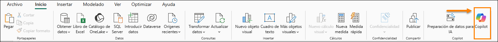

3. Pregúntele a Copilot **What reseller has the highest sales?** Presione **Entrar** o haga clic en la** flecha.**

    

4. Puede ver los resultados en la siguiente captura de pantalla. Estos no son los resultados que esperábamos. Copilot utilizó la medida [Reseller Sales]. Sin embargo, queremos que Copilot utilice [Sales by Reseller].

    **Posibles opciones:**

    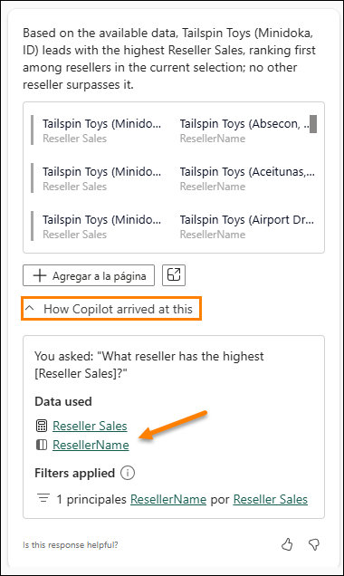

    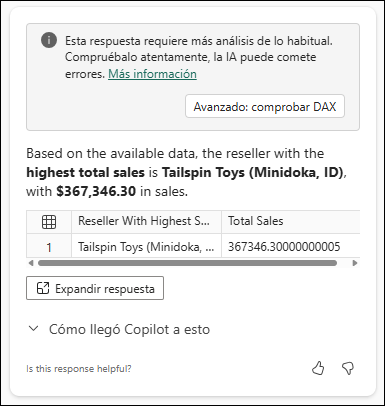

    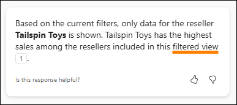

    ¡Esto también resalta más filtros ocultos! Los ajustaremos más adelante.

5. Aprovecharemos la característica Preparación de datos para IA en Power BI Desktop para ocultar la medida [Reseller Sales] a Copilot. En la cinta Inicio, seleccione **Preparación de datos para IA**.

    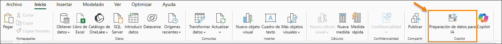

6. Se abre la nueva ventana a la página **Comenzar**.

    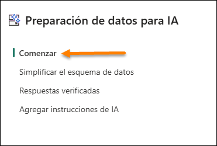

7. Haga clic en **Simplificar el esquema de datos**.

    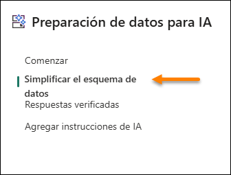

8. Expanda la tabla **Resellers** haciendo clic en el icono **>**. La medida Reseller Sales puede crear resultados ambiguos con Copilot, así que la eliminará del esquema para que Copilot no la incluya durante el análisis. Haga clic en la casilla para anular la selección de la medida Reseller Sales y, a continuación, haga clic en Aplicar. *Vea la captura de pantalla a continuación.*

    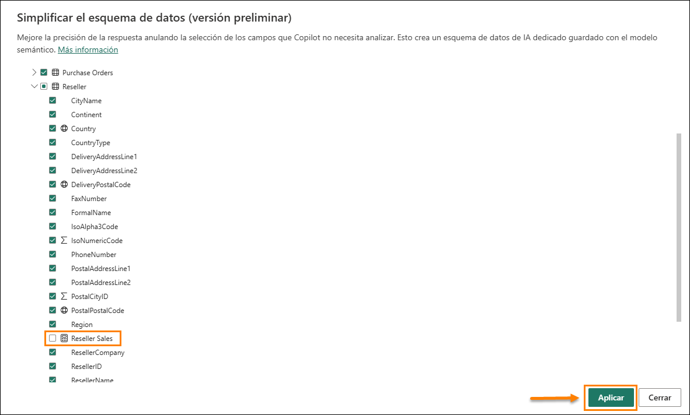

9. Haga clic en **Cerrar**.

    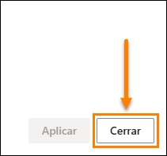

    **ℹ️ Importante**

    Como procedimiento recomendado, cree nombres muy descriptivos para sus tablas, columnas y medidas. Esto ayudará a Copilot a crear resultados más coherentes y precisos al responder preguntas. Por ejemplo, en este modelo tenemos una medida llamada [Reseller Sales] y otra medida llamada [Sales by Reseller]. Esto es confuso para Copilot y dará lugar a respuestas incoherentes. En este laboratorio, hemos eliminado esta medida del esquema. En otros escenarios, es posible que desee cambiar su nombre.

10. Haga clic en el botón Copilot en la cinta **Inicio** para cerrar y volver a abrir Copilot.

    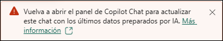

    

11. Pregúntele a Copilot **What reseller has the highest sales?** Presione **Entrar** o haga clic en la** flecha.**

    

12. Después de recibir una respuesta de Copilot, haga clic en la sección **Cómo llegó Copilot a esto**.

    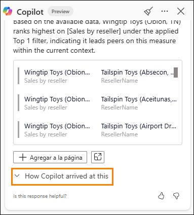

13. Esta vez deberías ver que la medida utilizada para encontrar esta respuesta fue **Sales by reseller or even SalesNet**. Eso es perfecto, Copilot ha sido entrenado para evitar esa medida probable, pero no deseada. Es posible que vea un resultado diferente aquí debido a la naturaleza no determinista de Copilot. Aquí es donde puede seguir preparando sus datos para que la IA cree una experiencia más coherente.

    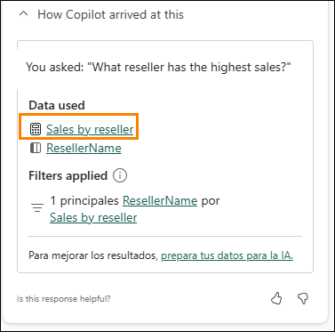

    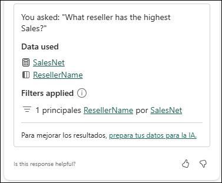

14. Como procedimiento recomendado, es una buena idea ocultar tablas, columnas y medidas, ya que pueden confundir a Copilot.

    **ℹ️ Importante**

    Es habitual en Power BI crear medidas auxiliares o medidas únicas que se utilizan con fines muy específicos dentro de un contexto de filtro muy concreto. Si sabe que tiene muchas medidas que querrá ocultar a Copilot, podría valer la pena crear una tabla específicamente para almacenar las medidas que desea ocultar. Esto hará que el proceso de actualización del esquema resulte mucho más sencillo. En este momento, no se admite ocultar una carpeta de medidas.

15. También nos hemos encontrado con casos en los que se ha devuelto el estado de la tabla Customer en lugar del estado de la tabla Reseller. La tabla Customer no debe usarse en este contexto y solo está ahí para escenarios muy específicos. Dado que esta tabla puede confundir a Copilot, la vamos a ocultar.

16. Haga clic en **Preparación de datos para IA** en la cinta de opciones de inicio.

17. Seleccione **Simplificar el esquema de datos** en la barra de navegación izquierda.

18. Anule la selección de Customer. Si desactiva la tabla Customer, la tabla seguirá existiendo en el modelo semántico para los informes, objetos visuales o cálculos DAX que necesite crear. Sin embargo, Copilot la ignorará durante el análisis. Asegúrese de seleccionar **Aplicar** y **Cerrar**.

    

    

## Tarea 2: Agregar instrucciones de IA

La adición de instrucciones de IA es un paso muy importante en la preparación de sus datos para la IA. Al agregar instrucciones de IA bien definidas, ayuda a Copilot a comprender mejor su modelo semántico integrando el contexto empresarial, la terminología y las prioridades analíticas directamente en el modelo. Esto hace que Copilot sea más inteligente y rápido, y esté más ajustado con su intención al generar información, responder preguntas o crear objetos visuales.

En este laboratorio, utilizará instrucciones de IA para ayudar a definir qué se devuelve cuando se le pregunta a Copilot sobre los artículos más vendidos.

1. Abra Copilot y haga la siguiente pregunta: **What are the top 5 best-selling products**.

    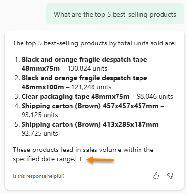

2. Si ha obtenido el mismo resultado que con la pregunta anterior, haga clic en la referencia para abrir el objeto visual del que proceden estos resultados.

    

3. Este resultado parece correcto, y es muy probable que así sea. Sin embargo, ¿qué determina un producto "*más vendido*" frente a un producto con mayores ventas? ¿Es la cantidad, el importe vendido, el margen de beneficio más alto o algún otro criterio?

4. Por ahora, queremos que Copilot pida claridad para que se devuelvan los resultados correctos y esperados a nuestros usuarios finales. Vuelva a hacer clic en el botón **Preparación de datos para IA**.

    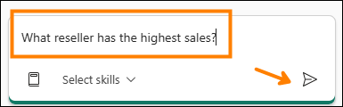

5. Vaya a **Agregar instrucciones de IA**.

    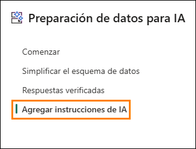

6. Agregue una instrucción para que Copilot aclare al usuario qué definición quiere cada vez que le pida **el producto con más ventas, el más vendido o el de mayores ventas totales**.

7. Escriba:

    ***If asked about "highest" or ”most” or "best-selling" product, first clarify if the user wants product by unit sold or product by total sales value.*** A continuación, haga clic en **Aplicar** y en **Cerrar**.

    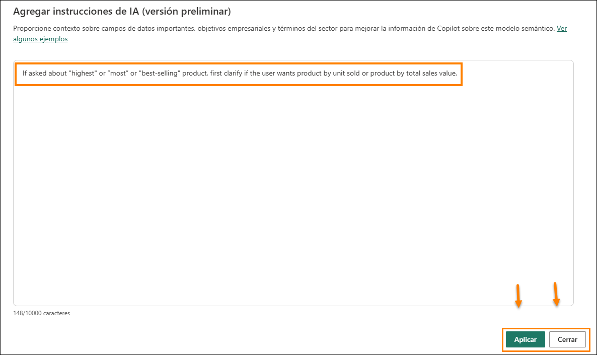

8. Abra el panel de Copilot. Si ya estaba abierto, cierre Copilot y vuelva a abrirlo. Esto asegurará que se han aplicado los cambios que ha realizado.

    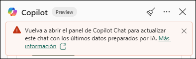

9. Pregúntele a Copilot **What’s our best-selling product**?

    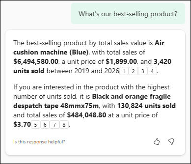

10. Dado que le dimos instrucciones a Copilot para aclararle al usuario final qué quiere decir con *best-selling*, veremos dos opciones aquí. También se le puede hacer una pregunta para aclaración o información adicional.

11. Escriba **units sold** en la solicitud y pulse Entrar. Ahora, Copilot le proporcionará una respuesta más específica.

    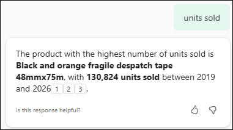

12. Imaginemos que estamos seguros de que todos los usuarios de la organización conocen la distinción entre *best-selling* y *highest selling*. En ese caso, simplemente podemos proporcionar definiciones a Copilot utilizando instrucciones de IA.

13. Vuelva a abrir el cuadro de diálogo **Preparación de datos para IA**, vaya a Agregar instrucciones de IA y reemplace las instrucciones actuales por lo siguiente:

    - **Best-selling = most units sold**

    - **Highest selling = total sales value**

        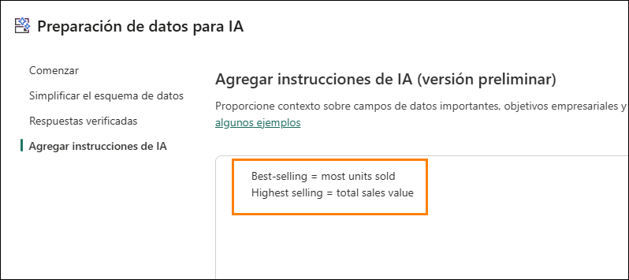

14. Haga clic en Aplicar y, a continuación, en Cerrar.

15. Cierre y vuelva a abrir Copilot. Escriba **What’s our best-selling product**? en la solicitud y pulse Entrar.

    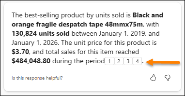

    Copilot llega ahora a la respuesta que esperamos y puede distinguir entre **el producto con más unidades vendidas** y **el producto con mayor valor total de ventas**. Como hemos mencionado al principio de esta sección, cuantas más instrucciones de IA bien definidas proporcione, mejor será Copilot.

    **ℹ️ Importante**

    **Las pruebas de instrucciones de IA serán más rápidas en Power BI Desktop porque no hay retraso en la publicación.** Por este motivo, se recomienda probar y refinar sus instrucciones localmente antes de publicarlas en el servicio. La publicación introduce un retraso y, a veces, puede causar confusión si los cambios no se reflejan de inmediato. Desktop ofrece un entorno más dinámico para iteración y depuración.

16. Si ha recibido la misma respuesta que en el caso anterior, haga clic en la referencia para ver de dónde provienen los resultados.

    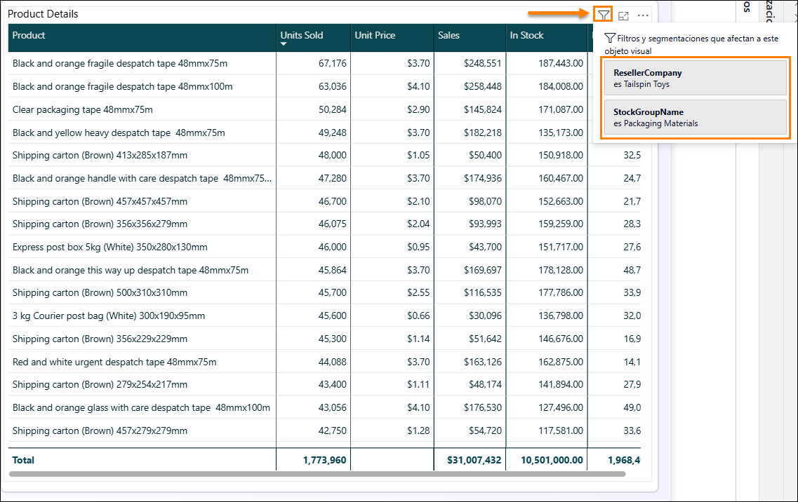

17. Sus resultados pueden variar, pero observe cómo los resultados devueltos provienen de un objeto visual existente. Tras una inspección más minuciosa, observará que este objeto visual está realmente filtrado. Esto significa que hemos recibido una respuesta engañosa de Copilot. En concreto, nunca solicitamos ningún filtro en nuestra solicitud y Copilot no ha especificado que nuestro resultado estaba filtrado.

18. Vuelva a Preparación de datos para IA y vaya a **Instrucciones de IA**. Agregue la siguiente instrucción:

    **If you use an existing report visual to answer a user request, always let the user know about any existing filters on the visual.**

    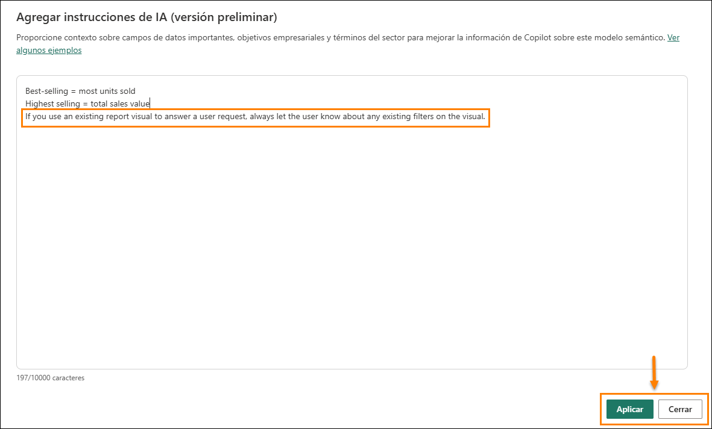

19. Vuelva a preguntarle a Copilot: **What’s our best-selling product?**

    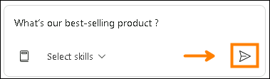

20. Como puede ver, esta vez devolvimos 1 objeto visual al que se hace referencia y Copilot identificó correctamente que los objetos visuales tenían un filtro en ResellerCompany para Tailspin Toys.

    

    **ℹ️ Importante**

    Es importante recordar que las instrucciones de IA son una característica que todavía se encuentra en versión preliminar y que cambia rápidamente. Continúe explorando diferentes instrucciones y vea qué funciona y qué no.

21. A medida que implementamos la experiencia de Copilot independiente para nuestros usuarios finales, queremos generar confianza, y una manera de hacerlo es garantizar que Copilot no haga conjeturas. Una instrucción que podemos agregar es indicarle a Copilot que nunca adivine si no entiende lo que se le pregunta.

22. Abra los datos de **Preparación de datos para IA** y agregue la siguiente instrucción. A continuación, seleccione Aplicar y Cerrar.

    - **Best-selling = most units sold**

    - **Highest selling = total sales value**

    **If you use an existing report visual to answer a user request, always let the user know about any existing filters on the visual.**

    ***If you do not understand what is being asked, do NOT guess, instead ask for clarification.***

    - Ahora es más probable que Copilot haga preguntas aclaratorias.

    - Esta es la instrucción de IA en acción cuando Copilot no está seguro.

    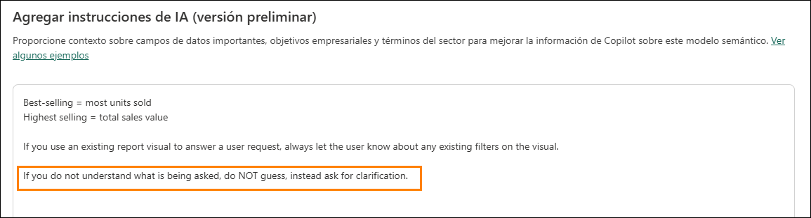

23. Vuelva a abrir Copilot y haga la siguiente pregunta confusa: **Total sales by something what is that?**

    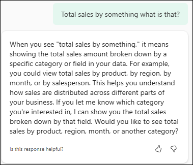

24. En este ejemplo, tal y como se muestra en la captura de pantalla anterior, Copilot no está seguro de cómo desea ver las ventas totales, por lo que le pide que aclare lo que está buscando.

25. Otro tipo de instrucción que podemos agregar es un informe de orientación visual. Por ejemplo, si desea ver la fecha siempre en un gráfico de líneas o que Copilot siempre devuelva una matriz al consultar las ventas por país, puede agregar estas instrucciones.

26. Si no se agregan instrucciones de IA, no hay garantía de qué objeto visual devolverá Copilot. Por ejemplo, si preguntamos: **Show total sales measure by year**. Ahora recibo un gráfico de líneas:

    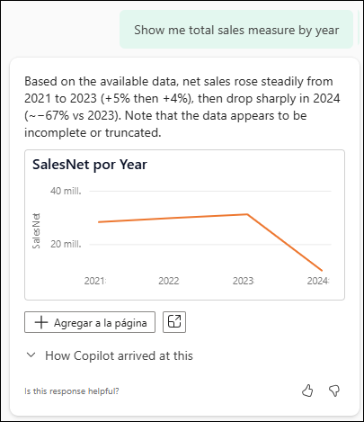

27. Agreguemos una instrucción de IA y veamos qué pasa. Abra **Preparación de datos para IA** y agregue la siguiente instrucción:

    **## Visual Guidance**

    ***When showing the total sales measure by year always use a column chart.***

    **ℹ️ Importante**

    Al escribir instrucciones de IA, "##" es un formato de lenguaje Markdown que no es necesario, pero es una buena práctica tanto para Copilot como para la organización del agente de datos de Fabric.

    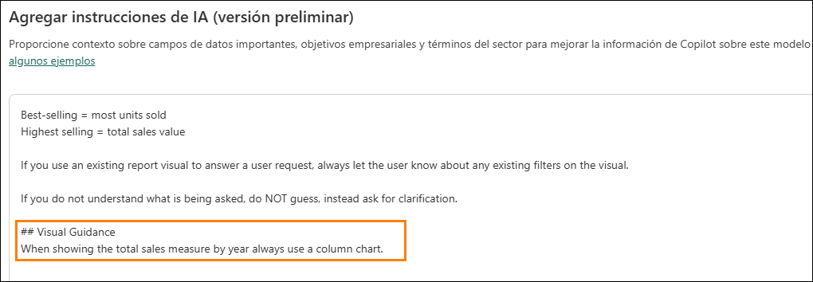

28. Vuelva a abrir Copilot y haga la siguiente pregunta: **Show total sales measure by year**.

    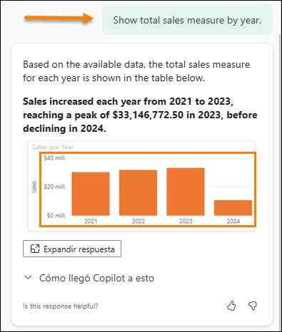**\**

    Copilot puede escribir DAX para llegar a la respuesta y mostrarla como tabla. Recuerde que siempre puede preguntar: **Can you make this into a column chart?** O reformule las **instrucciones de IA**.

    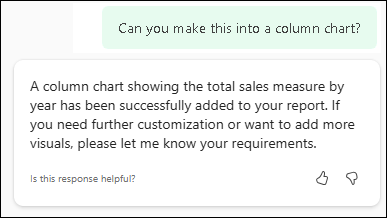

29. Echemos un vistazo a otro ejemplo, esta definición de medida de tiempo. Vuelva a la ventana de chat de Copilot y haga la siguiente pregunta: **How many purchase orders do we have?**

    

30. Observe que los resultados son correctos y, si expandimos el área **Cómo llegó Copilot a esto**, vemos que incluso está usando la medida explícita. Si lo recuerda, hemos creado una descripción asistida por Copilot para esta medida exacta. Pero pidamos una aclaración sobre cómo se calcula la biblioteca DAX.

    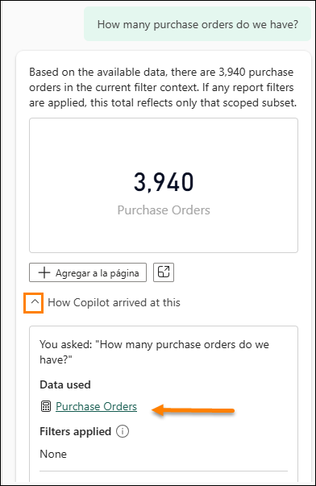

31. Formule la pregunta: **Can you explain the DAX used?**

    

32. Nuestra respuesta es extremadamente interesante, ya que señala la limitación de Copilot para acceder directamente a nuestras fórmulas DAX exactas. La respuesta en sí es de naturaleza altamente *generativa* y utiliza palabras como "probablemente", "si", "normalmente" y "potencialmente". Esto a veces ***se puede*** resolver con la ayuda de nuestra vista TMDL e instrucciones de IA.

    

33. En el panel de navegación de la izquierda, seleccione la vista **TMDL** .

34. En la parte inferior de la pantalla, cree un script presionando el botón "+".

    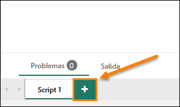

35. Vamos a retirar una única medida para ayudar a los usuarios a obtener aclaraciones sobre DAX en nuestro modelo de datos. Arrastre la medida **Purchase Orders** al script..

    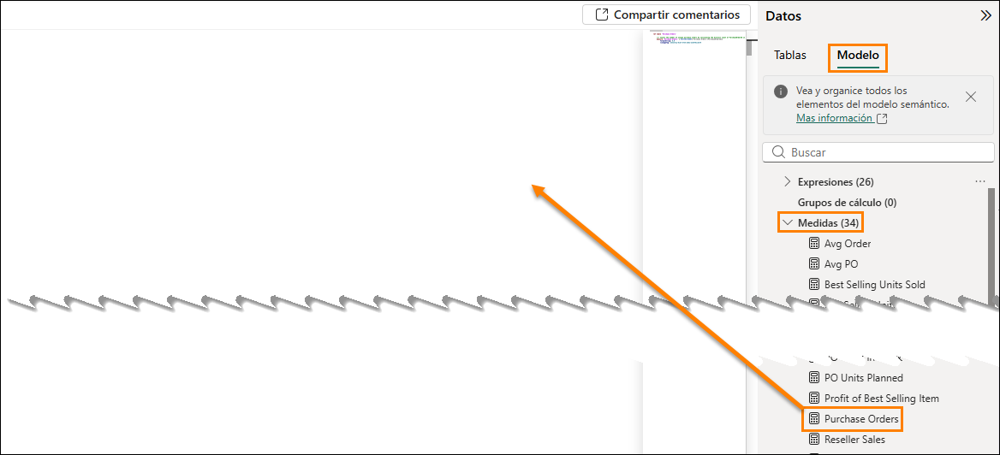

36. El script TMDL resultante es un gran recurso para agregar a nuestras instrucciones de IA. También podemos ver representada nuestra descripción en esta vista. Ahora queremos copiar la descripción de la medida y la medida en sí, como se muestra a continuación:

    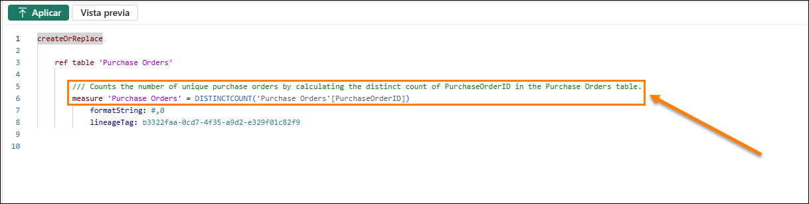

37. Ahora vuelva a **Preparación de datos para IA** en la vista de informe y agregue la descripción de TMDL y los detalles de la medida en la vista **Agregar instrucciones IA** como se muestra a continuación. A continuación, presione **Aplicar**.

    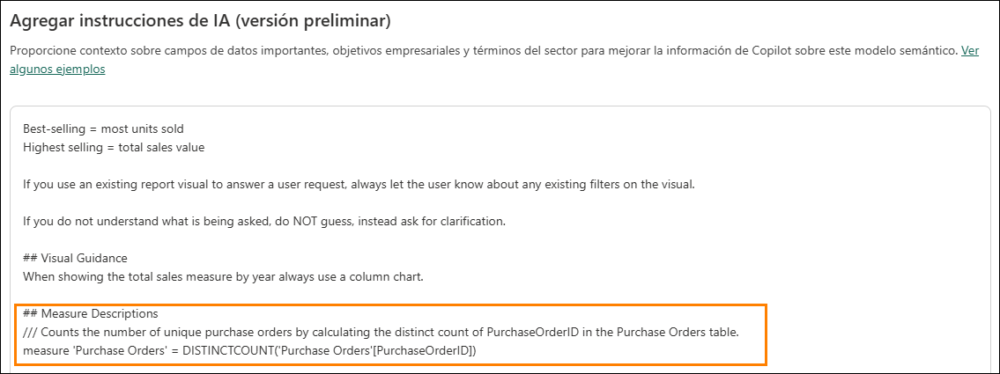

38. Vuelva a abrir el panel de Copilot para actualizar las instrucciones y haga la misma pregunta que antes: **How many purchase orders do we have?**

    

39. Por ahora va todo bien. Este es el comportamiento que esperaríamos, pero el momento que hemos estado esperando es nuestra siguiente pregunta.

    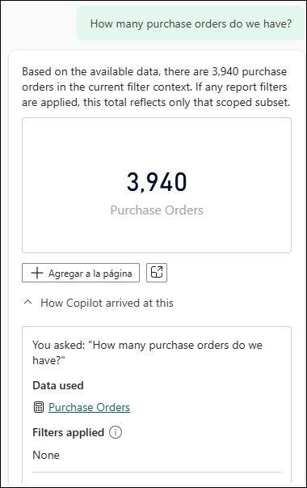

40. Ahora pida una aclaración: **Can you explain the DAX used in the Purchase Orders measure?**

    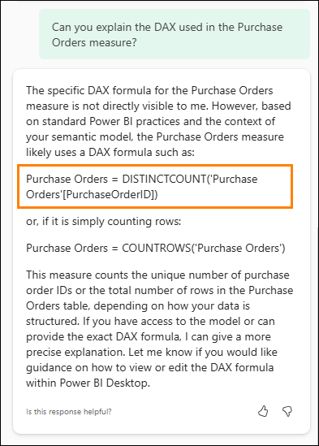

41. Lamentablemente, Copilot todavía está adivinando, aunque correctamente, cuál es el código DAX real. La adición del código DAX a las instrucciones de la IA puede funcionar en ocasiones, pero en este momento, aunque todavía en la versión preliminar, es incoherente.

42. Al principio de los laboratorios, hemos solicitado las ventas totales para el sudeste. Copilot no ha utilizado la columna Sales Territory en nuestra tabla Reseller, sino que asumió qué estados representaban el territorio del sudeste. En esta sección, agregaremos una instrucción de IA para asegurarnos de que Copilot use Sales Territory, cuando se le pregunte por regiones.

43. Abra **Preparación de datos para IA** y agregue la siguiente instrucción:

    **If a user asks about region or territory related data, for example Southeast, use the Sales Territory column from the Reseller table.**

    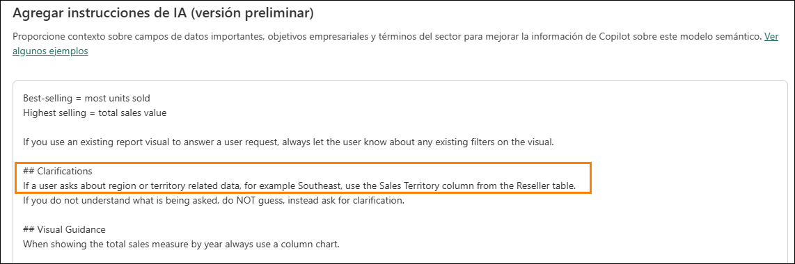

44. Abra Copilot y escriba la siguiente solicitud: **Show total sales for the Southeast**.

    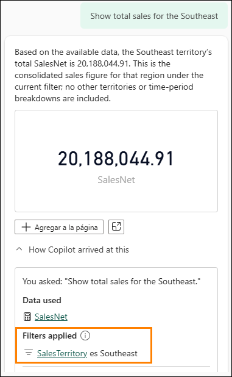

45. En la sección anterior, hemos eliminado la tabla Customer del esquema de datos.

    Dentro de esta organización, los clientes se definen específicamente como revendedores que compran y luego distribuyen nuestros productos. Los consumidores finales que compran a esos revendedores no se clasifican como clientes. Debemos distinguir esto para que Copilot devuelva a los revendedores cuando se les pregunte por los clientes.

46. Abra Preparar datos para IA y escriba lo siguiente:

    **Customers = Resellers**

    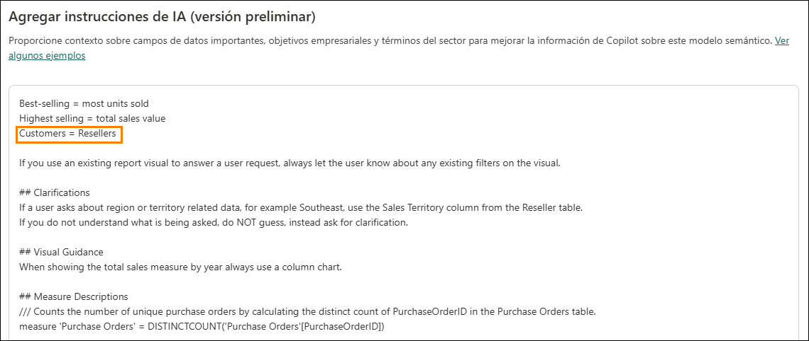

47. En la solicitud de Copilot, pregunte: **What customer sold the most products in 2021?**

    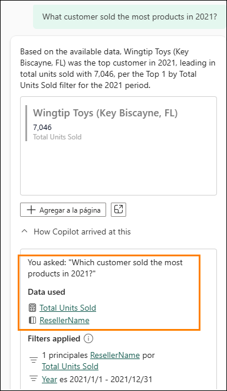

    Esto también se muestra en el cálculo DAX creado.

    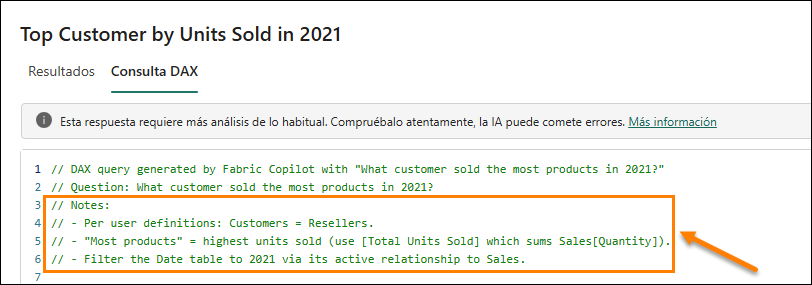

    Tenga en cuenta que Copilot ha recibido instrucciones correctamente y está utilizando Reseller para representar al cliente.

## Tarea 3: Crear respuestas verificadas

Llevemos nuestra preparación de datos al siguiente nivel agregando respuestas verificadas. Las respuestas verificadas permiten al autor del modelo seleccionar un objeto visual y elegir frases que, cuando un usuario pregunte, mostrarán ese objeto visual como una respuesta verificada. Las respuestas verificadas también ayudan a Copilot a conocer el contexto de su modelo y a dar respuestas más precisas, incluso si la solicitud no devuelve una respuesta verificada exacta.

**ℹ️ Importante**

Las respuestas verificadas coincidirán con la frase que establezca en cualquier cosa identificada como semánticamente similar. Por este motivo, no necesita establecer todas las variaciones posibles de la frase que un usuario podría preguntar. En su lugar, establezca frases desencadenadoras claras y distintivas que algo similar podría desencadenar para el usuario.

1. Para su primer ejemplo, creará una respuesta verificada para **Estado principal para ventas**.

2. Actualmente, si le pregunta a Copilot: **What state has the most sales?** No siempre interpreta la pregunta de la manera que se pretende. Esto se debe a que se hace referencia a la palabra "ventas" de varias maneras en el modelo y en el informe.

3. En este ejemplo, se asegurará de que Copilot siempre devuelva la respuesta esperada.

4. Esta vez no **comenzaremos** en el cuadro de diálogo de datos de preparación para IA. Si abre la pestaña de respuestas verificadas en el cuadro de diálogo Preparación de datos para IA, verá que no hay nada disponible.

    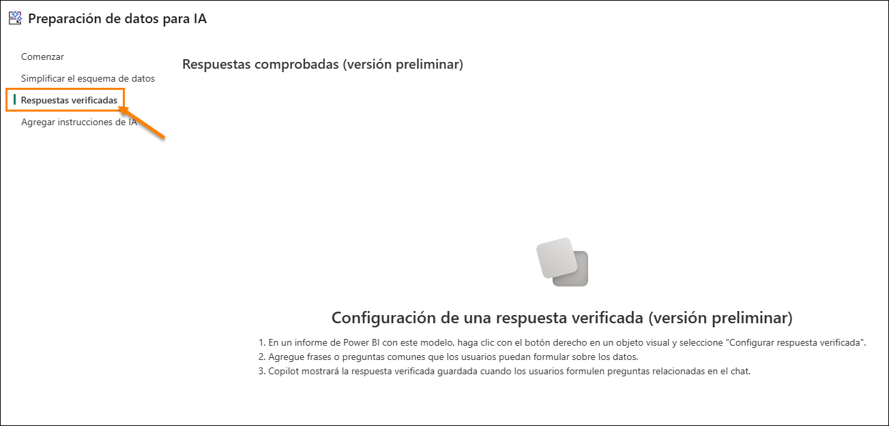

5. En su lugar, comenzará con los objetos visuales de su informe.

6. Cierre la ventana Preparar datos para IA y vaya a la página **Product detail**.

    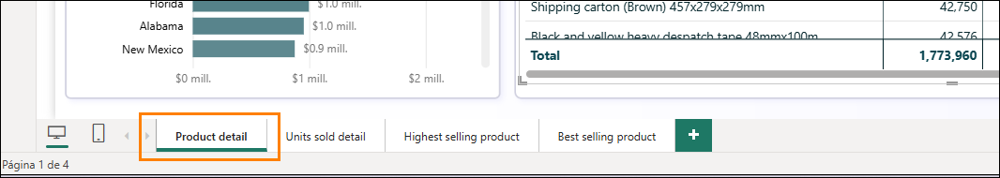

7. Haga clic en el gráfico de barras de ventas por estado y haga clic en los puntos suspensivos (**...)** que se encuentran en la esquina superior derecha.

    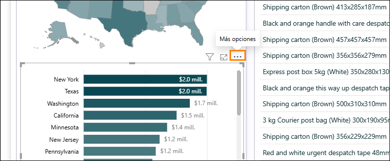

8. Elija **Configurar una respuesta verificada** en el menú desplegable.

    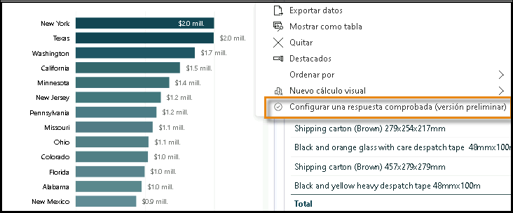

9. Puede establecer una frase seleccionando una sugerencia de Copilot o escribiendo su propia frase personalizada.

10. En el cuadro Escriba una frase, escriba: **State with the highest sales** y **haga clic en Agregar.** *Vea la captura de pantalla a continuación.*

    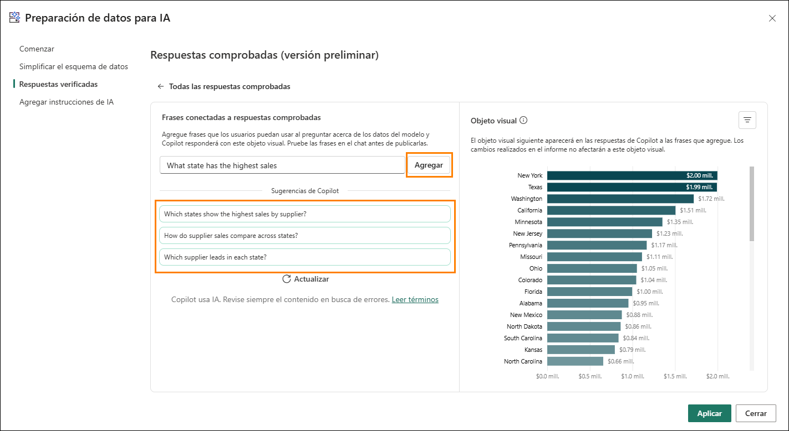

11. Haga clic en Aplicar y, a continuación, en Cerrar.

    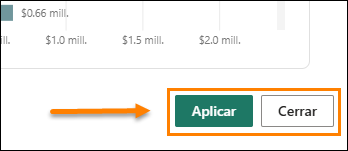

    12\. Cierre el panel de Copilot y vuélvalo a abrir.

    13\. Pregúntele a Copilot: **¿Qué estado tiene las ventas más altas?**

    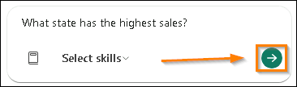

    14\. Obtenga una respuesta correcta y verificada para la pregunta.

    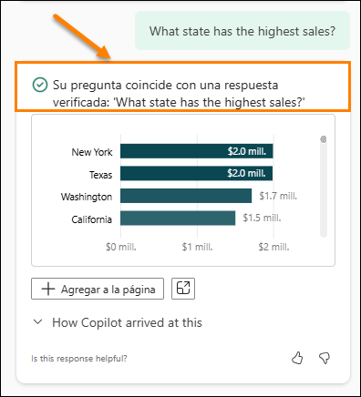

    15 ¿Qué pasa con los falsos positivos? Probemos una pregunta que NO debería usar nuestra respuesta verificada y veamos qué ocurre. En Copilot, escriba la siguiente solicitud: **What state is selling the most of the highest selling product?**

    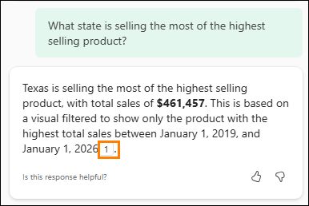

16. ¡Esto es perfecto! La respuesta apunta a un objeto visual diferente en nuestro informe. De manera más específica, apunta a un objeto visual que se filtra por el producto de mayores ventas. Observe también que la respuesta respeta nuestras instrucciones de IA anteriores y nos informa de los filtros que se aplican en el objeto visual devuelto.

17. Vamos a agregar otra respuesta verificada. En esta ocasión queremos mostrar **El producto más vendido**.

18. Haga clic en la página de informe del producto más vendido.

    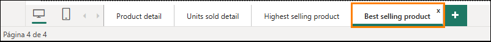

19. A continuación, busque el objeto visual de tarjeta en la parte superior y haga clic en los puntos suspensivos **(...)**. Seleccione **Configurar una respuesta verificada**.

    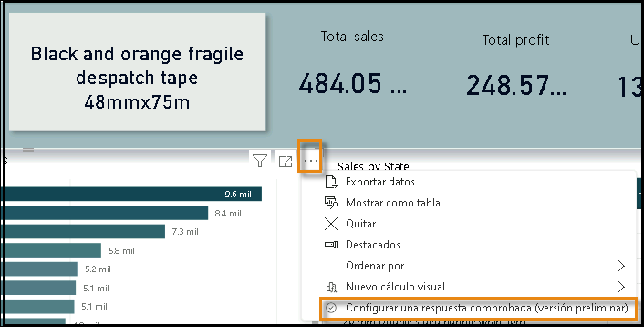

20. Anteriormente en el laboratorio, hemos agregado instrucciones de IA para que la IA sepa que los más vendidos son el total de unidades y los de mayor ventas es el valor total de las ventas. Queremos asegurarnos de que nuestras frases de respuesta verificadas estén correctamente ajustadas a nuestras instrucciones de IA.

21. Esta vez agregará dos frases, que pueden aparecer o no en las sugerencias de Copilot. En primer lugar, agregue una frase para **Which product has sold the most units?** A continuación, haga clic en Aceptar.

    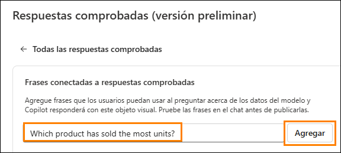

22. Haga clic en Aplicar.

    

23. Haga clic en el icono + junto a **Sugerencias de Copilot** para agregar una frase adicional. Agregue la frase **What is the top-selling product name?** o similar y, a continuación, haga clic en Agregar.

    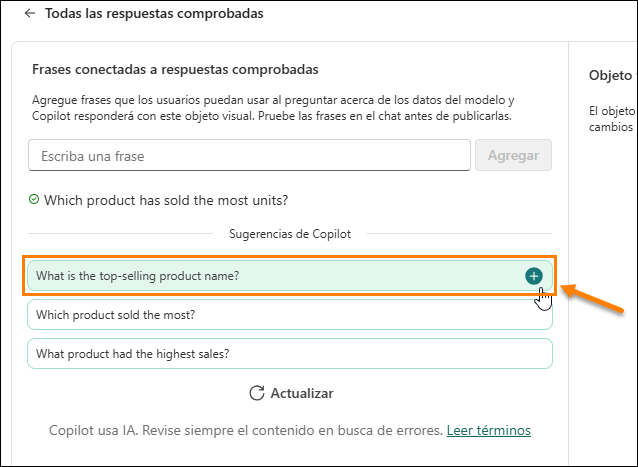

24. Ahora tiene ambas frases conectadas al objeto visual de su informe, tal y como se muestra en la captura de pantalla siguiente.

    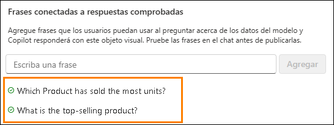

25. Haga clic en Aplicar y Cerrar.

26. Enhorabuena. En esta sección, ha aprendido a agregar respuestas verificadas a los objetos visuales de su informe. También ha aprendido que podría agregar más de una frase para conectar las preguntas del usuario con un objeto visual de informe individual.

## Tarea 4: Pruébelo usted mismo

Si el tiempo de laboratorio lo permite, continúe explorando las características de **Preparación de datos para IA** que aprendió en este laboratorio.

1. Empiece haciéndole una pregunta acerca de Copilot que le gustaría saber. Si los resultados no son los que deseaba o esperaba, piense en cómo puede garantizar el resultado que desea utilizando simplemente el esquema de datos, las respuestas verificadas o las instrucciones de IA.

## Conclusión

Enhorabuena. Ha completado la sección Preparar datos para IA del laboratorio.

# Referencias

Chat With Your Data in a Day (CDIAD) le presenta algunas de las características clave al usar Copilot independiente en un espacio de trabajo de Fabric.

En el menú del servicio, la sección Ayuda (?) tiene vínculos a algunos recursos excelentes. Tenga en cuenta que la vista que ve depende de la experiencia en la que se encuentre actualmente y, por lo tanto, sus opciones pueden verse diferentes a la captura de pantalla que aparece a continuación.

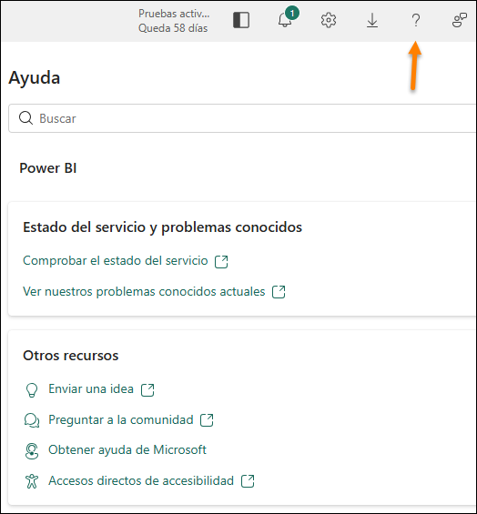

Estos son algunos recursos más que podrán ayudarle a seguir avanzando con Microsoft Fabric.

- Obtenga acceso a toda la información en la [Documentación de Microsoft Fabric](https://learn.microsoft.com/en-us/fabric/).

- Explore Fabric a través de la [Visita guiada](https://aka.ms/Fabric-GuidedTour).

- Regístrese en la [prueba gratuita de Microsoft Fabric](https://aka.ms/try-fabric).

- Visite el [sitio web de Microsoft Fabric](https://aka.ms/microsoft-fabric).

- Adquiera nuevas capacidades mediante la exploración de los [módulos de aprendizaje de Fabric](https://aka.ms/learn-fabric).

- Lea el [libro electrónico gratuito sobre cómo empezar a usar Fabric](https://aka.ms/fabric-get-started-ebook).

- Únase a la [comunidad de Fabric](https://aka.ms/fabric-community) para publicar sus preguntas, compartir sus comentarios y aprender de otros.

Lea de manera más detallada la documentación técnica relevante sobre Copilot:

- [Información general de Copilot para Power BI: Power BI | Microsoft Learn](https://learn.microsoft.com/en-us/power-bi/create-reports/copilot-introduction)

- [Experiencia de Copilot independiente en Power BI (versión preliminar): Power BI | Microsoft Learn](https://learn.microsoft.com/en-us/power-bi/create-reports/copilot-chat-with-data-standalone)

- [Configuración de administrador de Copilot de Microsoft Fabric | Microsoft Learn](https://learn.microsoft.com/en-us/fabric/admin/service-admin-portal-copilot)

- [Creación de agentes de datos de Fabric (versión preliminar): aprenda a crear un agente de datos de Fabric | Microsoft Learn](https://learn.microsoft.com/en-us/fabric/data-science/concept-data-agent)

- [Procedimientos recomendados para la configuración del agente de datos: Microsoft Fabric | Microsoft Learn](https://learn.microsoft.com/en-us/fabric/data-science/data-agent-configuration-best-practices)

- [Copilot para Microsoft Fabric y Power BI: P+F: Microsoft Fabric | Microsoft Learn](https://learn.microsoft.com/en-us/fabric/fundamentals/copilot-faq-fabric)

© 2026 Microsoft Corporation. Todos los derechos reservados.

Al participar en esta demostración o laboratorio práctico, acepta las siguientes condiciones:

Microsoft Corporation pone a su disposición la tecnología o funcionalidad descrita en esta demostración/laboratorio práctico con el fin de obtener comentarios por su parte y de facilitarle una experiencia de aprendizaje. Esta demostración/laboratorio práctico solo se puede usar para evaluar las características de tal tecnología o funcionalidad y para proporcionar comentarios a Microsoft. No se puede usar para ningún otro propósito. Ninguna parte de esta demostración/ laboratorio práctico se puede modificar, copiar, distribuir, transmitir, mostrar, realizar, reproducir, publicar, licenciar, transferir ni vender, ni tampoco crear trabajos derivados de ella.

LA COPIA O REPRODUCCIÓN DE ESTA DEMOSTRACIÓN/LABORATORIO PRÁCTICO (O PARTE DE ELLA) EN CUALQUIER OTRO SERVIDOR O UBICACIÓN PARA SU REPRODUCCIÓN O DISTRIBUCIÓN POSTERIOR QUEDA EXPRESAMENTE PROHIBIDA.

ESTA DEMOSTRACIÓN/LABORATORIO PRÁCTICO PROPORCIONA CIERTAS FUNCIONES Y CARACTERÍSTICAS DE PRODUCTOS O TECNOLOGÍAS DE SOFTWARE (INCLUIDOS POSIBLES NUEVOS CONCEPTOS Y CARACTERÍSTICAS) EN UN ENTORNO SIMULADO SIN INSTALACIÓN O CONFIGURACIÓN COMPLEJA PARA EL PROPÓSITO ARRIBA DESCRITO. LA TECNOLOGÍA/ CONCEPTOS DESCRITOS EN ESTA DEMOSTRACIÓN/LABORATORIO PRÁCTICO NO REPRESENTAN LA FUNCIONALIDAD COMPLETA DE LAS CARACTERÍSTICAS Y, EN ESTE SENTIDO, ES POSIBLE QUE NO FUNCIONEN DEL MODO EN QUE LO HARÁN EN UNA VERSIÓN FINAL. ASIMISMO, PUEDE QUE NO SE PUBLIQUE UNA VERSIÓN FINAL DE TALES CARACTERÍSTICAS O CONCEPTOS. DE IGUAL MODO, SU EXPERIENCIA CON EL USO DE ESTAS CARACTERÍSTICAS Y FUNCIONALIDADES EN UN ENTORNO FÍSICO PUEDE SER DIFERENTE.

**COMENTARIOS.** Si envía comentarios a Microsoft sobre las características, funcionalidades o conceptos de tecnología descritos en esta demostración/laboratorio práctico, acepta otorgar a Microsoft, sin cargo alguno, el derecho a usar, compartir y comercializar sus comentarios de cualquier modo y para cualquier fin. También concederá a terceros, sin cargo alguno, los derechos de patente necesarios para que sus productos, tecnologías y servicios usen o interactúen con cualquier parte específica de un software o servicio de Microsoft que incluya los comentarios. No enviará comentarios que estén sujetos a una licencia que obligue a Microsoft a conceder su software o documentación bajo licencia a terceras partes porque incluyamos sus comentarios en ellos. Estos derechos seguirán vigentes después del vencimiento de este acuerdo.

MICROSOFT CORPORATION RENUNCIA POR LA PRESENTE A TODAS LAS GARANTÍAS Y CONDICIONES RELATIVAS A LA DEMOSTRACIÓN/LABORATORIO PRÁCTICO, INCLUIDA CUALQUIER GARANTÍA Y CONDICIÓN DE COMERCIABILIDAD (YA SEA EXPRESA, IMPLÍCITA O ESTATUTARIA), DE IDONEIDAD PARA UN FIN DETERMINADO, DE TITULARIDAD Y DE AUSENCIA DE INFRACCIÓN. MICROSOFT NO DECLARA NI GARANTIZA LA EXACTITUD DE LOS RESULTADOS, EL RESULTADO DERIVADO DE LA REALIZACIÓN DE LA DEMOSTRACIÓN/LABORATORIO PRÁCTICO NI LA IDONEIDAD DE LA INFORMACIÓN CONTENIDA EN ELLA CON NINGÚN PROPÓSITO.

**DECLINACIÓN DE RESPONSABILIDADES**

Esta demostración/laboratorio práctico contiene solo una parte de las nuevas características y mejoras realizadas en Microsoft Power BI. Puede que algunas de las características cambien en versiones futuras del producto. En esta demostración/laboratorio práctico, conocerá algunas de estas nuevas características, pero no todas.
