# Microsoft Fabric Chat with your Data in a Day - Laboratorio 4

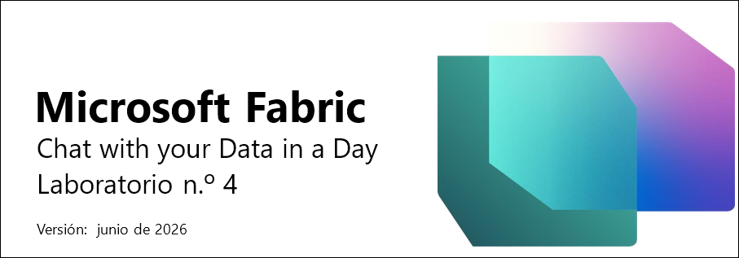

## Contenido

- Estructura del documento
- Escenario/planteamiento del problema
- Introducción
- Experiencia de Copilot independiente
- Configuración: configuración del espacio de trabajo para laboratorios posteriores
  - Tarea 1: Explorar la experiencia de Copilot independiente
  - Tarea 2: Escribir una solicitud en Copilot independiente
  - Tarea 3: Explorar la vista en la capacidad de informe
  - Tarea 4: Exploraciones
  - Tarea 5: Respuestas verificadas
  - Tarea 6: Cómo llegó Copilot a esto (HCAAT)
  - Tarea 7: Una respuesta de datos de una consulta DAX generada por Copilot
  - Tarea 8: Cambio de contexto en Copilot
  - Tarea 9: Construcción con Copilot de un objeto visual desde el modelo semántico
  - Tarea 10: Experiencia general de Copilot
- Referencias

# Estructura del documento

El laboratorio incluye pasos que el usuario debe seguir junto con capturas de pantalla asociadas que sirven de ayuda visual. En cada captura de pantalla, las secciones se resaltan con cuadros de color naranja para indicar en qué áreas debe centrarse el usuario.

# Escenario/planteamiento del problema

Enhorabuena por llegar hasta aquí. Ahora ya sabe cómo implementar procedimientos recomendados generalmente aceptados en su modelo de datos y cómo usar la funcionalidad de Preparar sus datos para IA. Es el momento de explorar la experiencia de Copilot independiente dentro de Microsoft Fabric.

Su organización, como muchas otras, cuenta con cientos de informes y modelos semánticos en docenas de áreas de trabajo. Encontrar el informe o los datos adecuados ha sido un desafío para los usuarios finales. Desea aprovechar la experiencia de Copilot independiente para aumentar la adopción de los usuarios y obtener información más rápidamente en toda la organización.

**Desafíos actuales**

- **Experiencia de detección de fragmentos:** los usuarios tienen dificultades para encontrar los datos, informes, aplicaciones y agentes de datos correctos en el entorno de Fabric.

- **Baja adopción:** el volumen de informes y la formación necesaria crean fricción, lo que dificulta impulsar el impulso de la aceptación y la adopción de los usuarios.

- **Retraso en la toma de decisiones:** el tiempo de obtención de información sigue siendo lento debido a los obstáculos de navegación y las capacidades de autoservicio limitadas.

# Introducción

En laboratorios anteriores ha aprendido a preparar su modelo semántico para optimizar la experiencia de IA. En este laboratorio, aprovechará todo ese arduo trabajo y explorará cómo Copilot en Microsoft Fabric puede ayudar a acelerar la obtención de información valiosa dentro de su organización.

# Experiencia de Copilot independiente

En esta sección, explorará la experiencia de Copilot independiente en Fabric y detectará todas las magníficas maneras en las que puede chatear con sus datos. Al final de este laboratorio, comprenderá mucho mejor cómo puede aprovechar la experiencia de Copilot independiente para obtener la información en menos tiempo y, de manera más específica, aprenderá:

- Cómo aprovechar al máximo la experiencia de Copilot independiente

- Cómo comprender los informes, los objetos visuales y las respuestas de datos devueltas

- Cómo validar "cómo llegó Copilot a esto"

- Cómo crear y modificar exploraciones, que se puedan compartir

- Cómo aprovechar las características de Preparación de datos para IA, como respuestas verificadas

- Cómo identificar las respuestas de fricción

- Cómo aprovechar la experiencia general de Copilot

**ℹ️ Importante**

La experiencia de Copilot independiente destacada en estos laboratorios NO mantiene un historial de chat. Si hace clic para salir de la experiencia de Copilot, perderá la conversación. Esto difiere de la experiencia de chat de M365 Copilot.

## Configuración: configuración del espacio de trabajo para laboratorios posteriores

En este laboratorio y en otros posteriores, necesitará su propio espacio de trabajo para editar y guardar elementos en Fabric. En esta sección de configuración, creará un espacio de trabajo y asignará una capacidad de Fabric a ese espacio de trabajo para que pueda realizar tareas específicas sin afectar a otros asistentes al laboratorio.

1. Abra un navegador web en la máquina virtual y vaya a https://fabric.microsoft.com/

2. Inicie sesión en Fabric con las credenciales proporcionadas en el taller.

3. Seleccione **Áreas de trabajo** en el panel de navegación de la izquierda.

    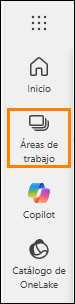

4. En el panel Espacios de trabajo, haga clic en su espacio de trabajo **Fabrikam_Lab_<inject key="DeploymentID" enableCopy="false"/>**.

    

    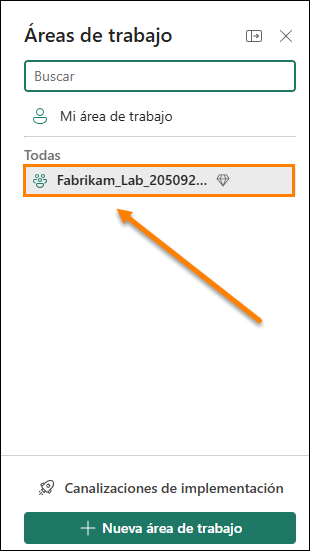

5. Ahora necesitamos asegurarnos de que su licencia individual pueda publicar en el espacio de trabajo habilitado para Fabric. Seleccione el icono de persona en la esquina superior derecha y haga clic en **Prueba gratuita**.

    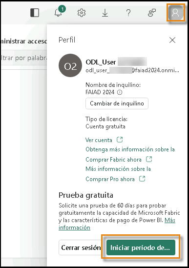

6. Basta con hacer clic en **Activar** para habilitar la publicación en el espacio de trabajo.

    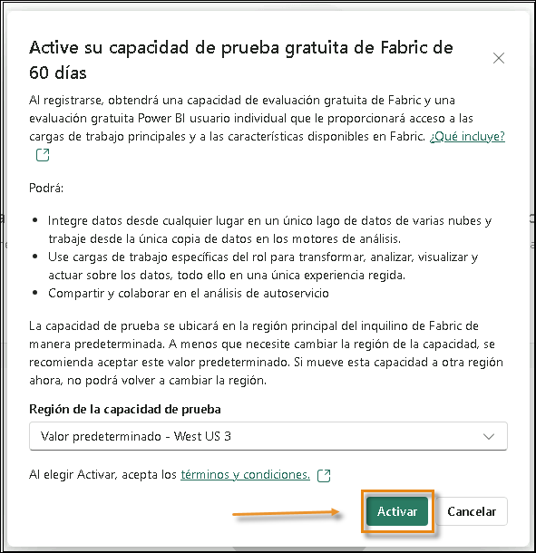

    Haga clic en **Aceptar**.

    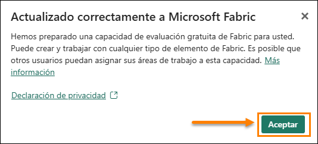

7. A continuación, deberá **publicar** el archivo PBIX completado de sus archivos de clase.

8. Desde los archivos de clase, abra el archivo llamado **Fabrikam Company Sales Report.pbix**.

    

9. Una vez abierto, asegúrese de haber iniciado sesión en su cuenta de usuario asignada para el taller de CDIAD.

10. Haga clic en Publicar y busque el área de trabajo que acaba de crear **Fabrikam_lab_<inject key="DeploymentID" enableCopy="false"/>**

    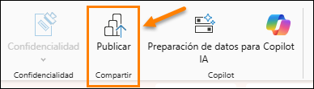

    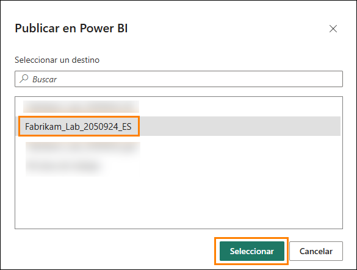

## Tarea 1: Explorar la experiencia de Copilot independiente

1. Seleccione Copilot en el panel de navegación de la izquierda.

    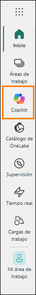

2. Si recibe un mensaje en la siguiente pantalla, haga clic en **Comenzar**. Copilot seleccionará un espacio de trabajo basado en una **capacidad de Copilot** a la que el usuario tenga acceso. Esta selección dependerá de si el espacio de trabajo tiene **unidades de capacidad (CU)** disponibles. Si al usuario se le asigna una **configuración de capacidad de Fabric (FCC),** se utilizará esa capacidad en su lugar.

3. Le damos la bienvenida a la experiencia de Copilot independiente. En esta pantalla de inicio, verá una sección en la parte inferior donde puede escribir su solicitud **(1)** y recibir algunas ideas de solicitudes en la parte inferior **(2).**

    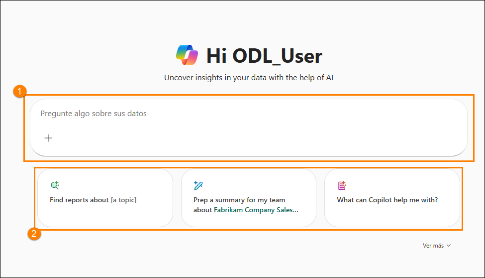

## Tarea 2: Escribir una solicitud en Copilot independiente

En esta sección, escribirá varias solicitudes y explorará los resultados devueltos por la experiencia de Copilot.

1. Haga clic en la solicitud y escriba lo siguiente: **Find reports about Fabrikam’s sales trends for the year**. A continuación, haga clic en **Entrar**.

    

    **ℹ️ Importante**

    La IA devuelve resultados no deterministas debido a múltiples factores. Como se ha explicado anteriormente en esta clase, sus resultados pueden variar y no ser idénticos a los de los laboratorios. Continúe y explore las capacidades y características que se muestran lo mejor que pueda.

    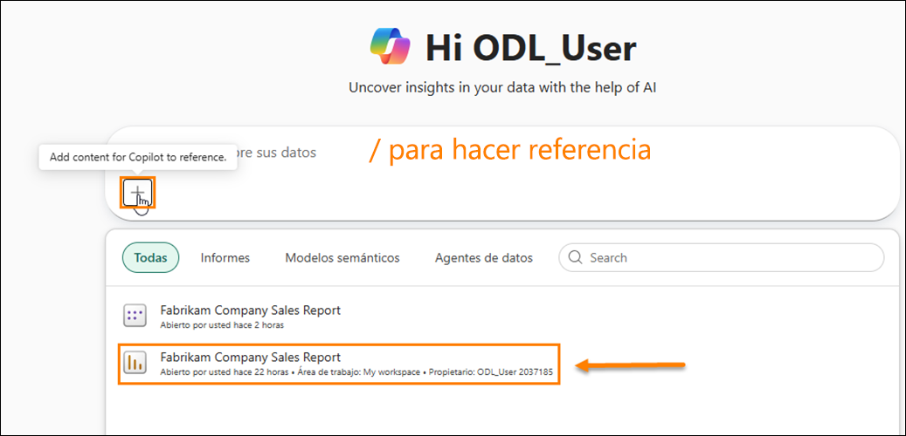

    Puede usar fácilmente / para hacer referencia al archivo o **+**. Esto puede ser útil, ya que Copilot tardará algún tiempo en internalizar por completo el contenido publicado.

    **Si no obtiene el** informe correcto para mostrar, esto se debe a que, por lo general, necesitamos verificar algunas cosas:

    1) En la configuración del servicio Power BI, seleccione Portal de administración de Fabric. Queremos asegurarnos de haber comprobado nuestra configuración relacionada con Copilot. Uno de estos ajustes es **Mostrar solo elementos aprobados en el Copilot independiente en la experiencia de Power BI.** Al seleccionar esta característica, solo se mostrarán los elementos aprobados para Copilot, a menos que se adjunten o se haga referencia a ellos manualmente. Esto ya está habilitado de manera predeterminada en nuestro inquilino.

        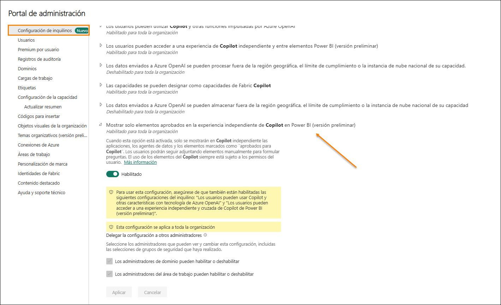

    2) Opcionalmente, podemos aprobar el modelo semántico para Copilot seleccionando el modelo en nuestro espacio de trabajo.

        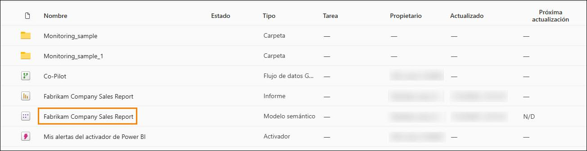

    3) Al seleccionar **Preparar datos para IA**, se abrirá la ventana Preparar datos para IA.

        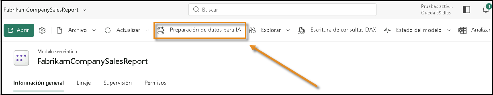

        Para que se pueda buscar sin una referencia manual, tendremos que activar el almacenamiento de modelo grande.

        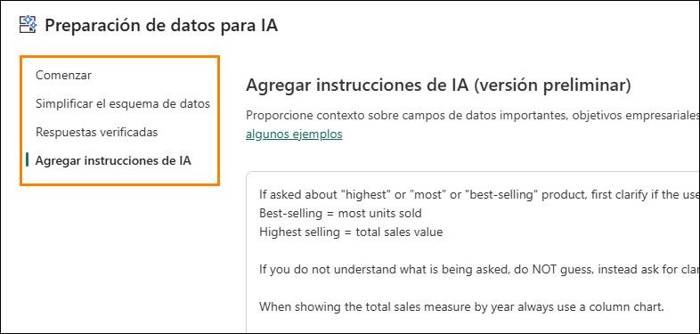

        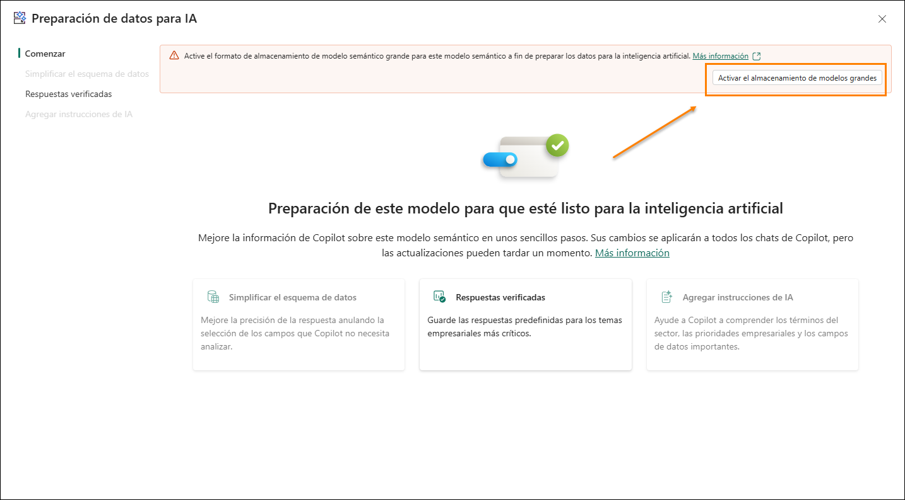

        Desde aquí puede ver y ajustar su trabajo de Preparación de datos para IA.

2. Haga clic en el informe que aparece en los resultados de búsqueda, **Fabrikam Company Sales Report**. Esto abrirá una nueva pestaña en su navegador web, que lo llevará directamente a ese informe.

    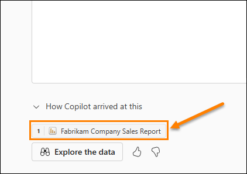

3. Dedique un momento a **explorar** este informe y a familiarizarse con él.

    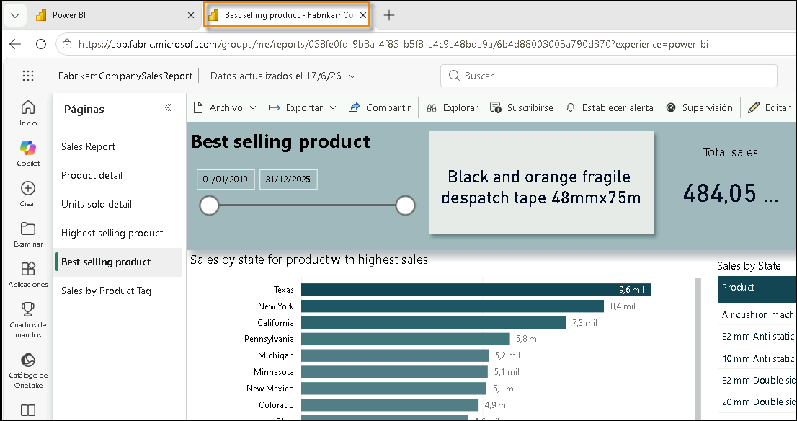

4. Una vez que haya terminado de explorar el informe, Haga clic en la (x) de la pestaña del navegador para cerrarla y volver a su experiencia de Copilot.

5. Haga clic en el mensaje generado previamente en la parte inferior de la página o escriba la solicitud: **Give me an overview of 1. Fabrikam Company Sales**:

    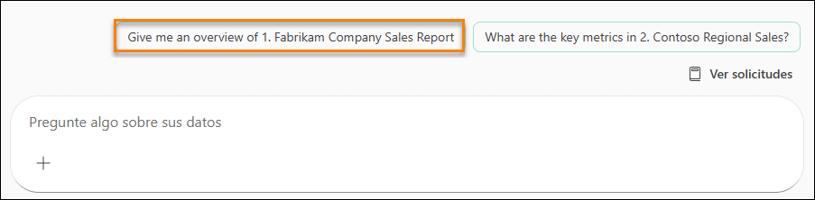

6. Si le pide a Copilot que le dé una descripción general del informe, obtendrá la siguiente información, como se ve en la siguiente captura de pantalla. **Recordatorio: Su pantalla y resultados se verán algo diferentes.**

    1. Copilot devolverá objetos visuales de informes del informe existente que proporciona información general.

    2. Copilot proporcionará una descripción narrativa de cada objeto visual devuelto.

        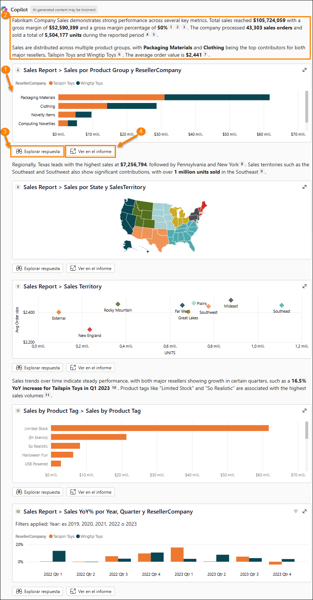

## Tarea 3: Explorar la vista en la capacidad de informe

Copilot puede devolver diversos tipos de respuestas según las preguntas formuladas y la preparación de los datos subyacentes. En esta sección, explorará la característica **Ver en el informe**. Esta característica se devuelve cada vez que Copilot utiliza un objeto visual existente de un informe para responder a su pregunta.

1. A continuación, va a echar un vistazo a la opción **Ver en el informe**. Esta opción abrirá el informe actual con el objeto visual especificado resaltado.

2. Desde cualquiera de las visualizaciones presentadas, haga clic en **Ver en el informe**. Esto abrirá una nueva pestaña en su navegador web. *Vea la captura de pantalla a continuación*.

    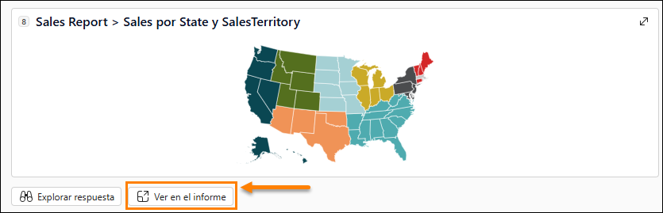

3. En la nueva página de informe, verá el objeto visual seleccionado de Copilot dentro del informe original.También observará que los demás objetos visuales aparecen temporalmente atenuados, debido a que se ha **resaltado** el objeto visual que ha seleccionado. Haga clic en cualquier parte del informe para activar el informe y explorarlo. Una vez que haya terminado de explorarlo, cierre esta pestaña en su navegador web y vuelva a la experiencia de Copilot independiente.

    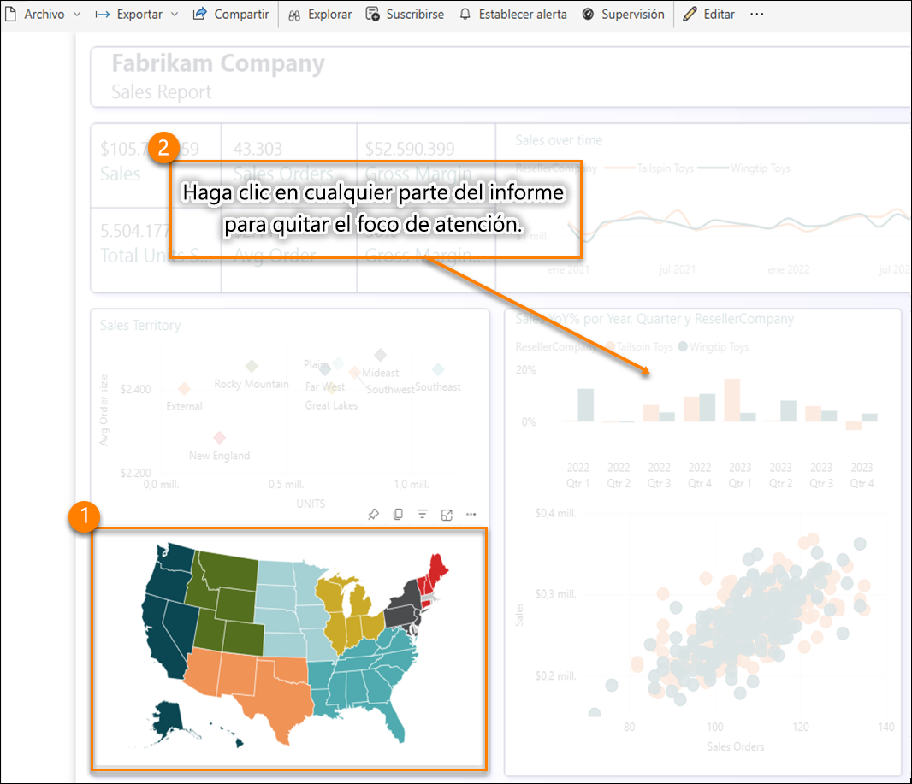

## Tarea 4: Exploraciones

Otra característica que presenta la experiencia de Copilot es la capacidad **Explorar respuesta**. Esta capacidad de explorar una respuesta es una manera fantástica de seguir perfeccionando la experiencia de Copilot. En esta sección, aprenderá a usar exploraciones, y a editarlas, guardarlas y compartirlas.

**ℹ️ Nota**

Las exploraciones se utilizan principalmente como herramientas para el análisis ad hoc de los datos existentes y los objetos visuales en los informes. Aunque se pueden guardar exploraciones, a menudo simplemente se cerrarán después de que se haya completado el análisis ad hoc.

1. Ahora debería volver a su experiencia de Copilot independiente. Haga clic en **Explorar respuesta** debajo de cualquiera de las visualizaciones en Copilot; la que elija no importa para este ejemplo.

    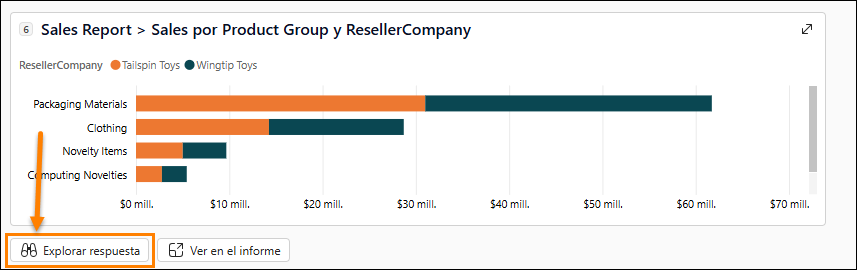

2. Al hacer clic en este botón, se abre una nueva pantalla. Veamos las **exploraciones**.

    - (1) Guarde la exploración como un informe o como una exploración.

    - (2) Ábrala en una nueva pestaña del explorador.

    - (3) Comparta.

    - (4) Véala en formato matricial.

    - (5) Cambie el tipo de visualización.

    - (6) Cambie las columnas o medidas del objeto visual.

    - (7) Expanda o contraiga la vista.

        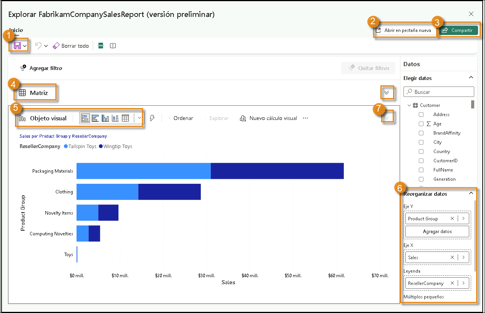

3. Haga clic en el icono desplegable que se encuentra junto al botón Guardar. Esto proporcionará algunas opciones:

    - En primer lugar, puede guardarlo como una exploración. Este es un tipo de objeto en su espacio de trabajo.

    - A continuación, puede guardar una copia. Esta opción aparece si la exploración se ha guardado anteriormente.

    - Por último, puede guardarlo como informe.

        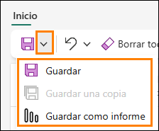

4. Si ha completado la configuración anteriormente en este laboratorio, ahora puede guardar esta exploración. Seleccione Guardar en el menú desplegable. Ahora recibirá una ventana emergente para **Guardar esta exploración**, elija el espacio de trabajo que ha creado durante la configuración y presione **Guardar**.

    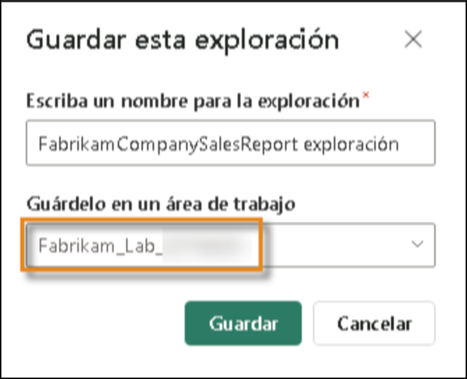

5. En la siguiente captura de pantalla, puede ver un **ejemplo** de cómo aparecerán exploraciones en su espacio de trabajo después de guardarla:

    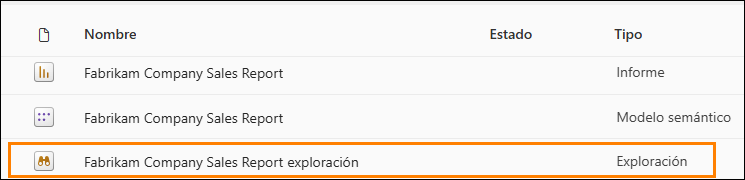

6. También puede compartir su exploración con otros. Solo podrá hacerlo si primero la guarda en un espacio de trabajo.

7. De vuelta en el espacio de trabajo, busque la exploración y haga clic en el icono de compartir. Recibirá una ventana emergente que le permite compartir esta exploración por vínculo, correo electrónico o equipos. Nota. **No vamos a compartir exploraciones en este taller. Cierre este cuadro y continúe con el siguiente paso.**

    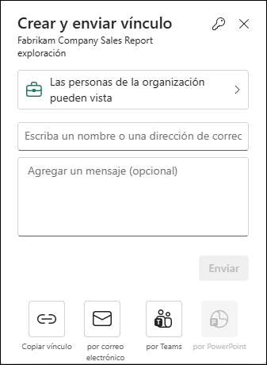

8. Dedique tiempo a abrir la exploración y explorar otras características.

    - Cambiar el tipo de objeto visual

    - Cambiar las columnas y medidas que se muestran

9. Una vez que haya terminado de explorar, haga clic en la **X** de la esquina superior derecha para cerrar su exploración.

    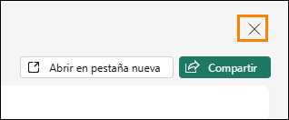

## Tarea 5: Respuestas verificadas

Al principio de la clase, ha dedicado tiempo a preparar su modelo de datos para IA. Parte de la preparación de sus datos para la IA es crear respuestas verificadas. Las respuestas verificadas garantizan que se devuelvan determinadas visualizaciones cuando se hagan preguntas en Copilot. Esto ofrece una experiencia más seleccionada y coherente para el usuario final, a la vez que garantiza la precisión, la coherencia y la confianza en todos los informes.

1. Para esta próxima sesión, también aprenderá cómo puede mejorar aún más la experiencia de las solicitudes agregando elementos para obtener mejores conclusiones. Al adjuntar explícitamente un elemento, Copilot puede reducir el alcance del trabajo, lo que proporciona resultados mucho más claros y concisos. Actualmente puede adjuntar tres elementos a la solicitud, y próximamente podrá adjuntar cuatro:

    - Informes

    - Modelos semánticos

    - Agentes de datos

    - Aplicaciones (próximamente)

2. Haga clic en **+ Agregar contenido para que Copilot haga referencia a él**, que se encuentra en la esquina inferior izquierda de la solicitud.

    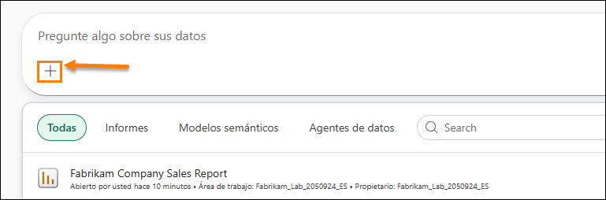

3. Seleccione **Informes** en las opciones mostradas. A continuación, seleccione **Fabrikam Company Sales Report**. Haga clic en **Confirmar**.

    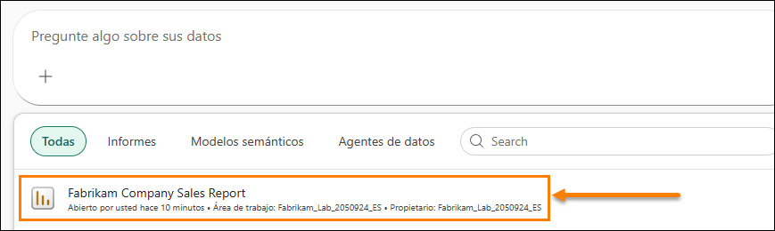

4. Este informe aparece ahora vinculado en la solicitud de Copilot. A continuación, complete la solicitud escribiendo **What is our best selling product?**

    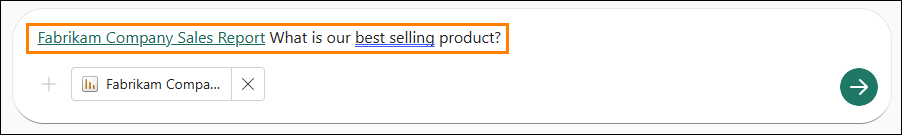

5. Debería recibir lo siguiente de esta solicitud. Si se usó una respuesta verificada en la respuesta, aparecerá una notificación encima de la respuesta. *Vea la captura de pantalla a continuación*.

6. También se le proporcionará una opción para ver el informe y explorar los datos.

    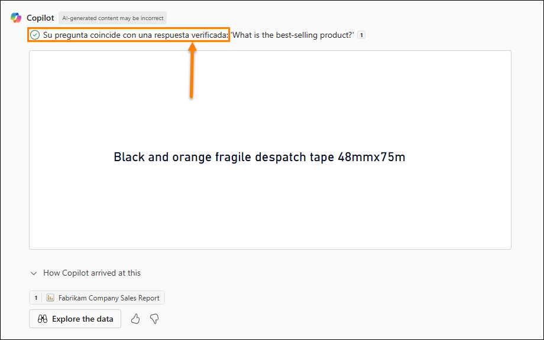

## Tarea 6: Cómo llegó Copilot a esto (HCAAT)

A veces, Copilot no solo da una respuesta, sino que explica cómo ha llegado hasta allí. Esto proporciona una visión en segundo plano de la lógica, los filtros, las medidas y más que dieron forma a la respuesta. Más en concreto, esto se conoce como HCAAT o Cómo llegó Copilot a esto. Esta información es más que simplemente de utilidad, le permite validar resultados, generar confianza en el resultado y profundizar su comprensión del modelo subyacente. Cuando esto ocurre, puede ser muy revelador y ofrecer una manera de validar los resultados.

1. Debajo de la respuesta verificada, haga clic en **Cómo llegó Copilot a esto**.

2. Podrá ver la pregunta que ha formulado, los datos utilizados para responder la pregunta y los filtros que se aplicaron.

    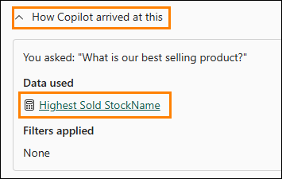

3. HCAAT puede devolver diferentes resultados en función de cómo llegó a los resultados. Echemos un vistazo a otro ejemplo.

4. En el mensaje de solicitud de Copilot, adjunte el **Fabrikam Company Sales Report** y, a continuación, escriba lo siguiente: **return all customers that make up the top 1% of total sales**.

    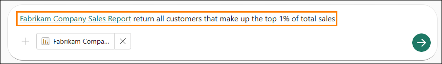

5. Repasemos los resultados.

    - (1) En primer lugar, obtenemos un resultado de que la respuesta requirió más análisis de lo habitual. Este es un resultado generado por DAX de Copilot. Asegúrese de comprobar el código. También puede mostrar que los datos no están aprobados por completo, ya que se generan por DAX002E

        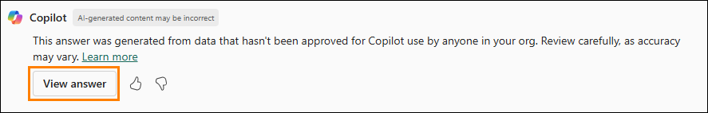

    - (2) La tabla que muestra los resultados. El aspecto de los resultados es excelente. Observe que, a pesar de que preguntamos por clientes, obtenemos revendedores. Esto se debe a que, cuando preparamos nuestros datos para IA, eliminamos la tabla Customer y utilizamos un sinónimo de Reseller.

    - (3) Cómo llegó Copilot a esto

    - (4) El informe de ventas de Fabrikam

    - (5) La consulta DAX generada por Copilot para llegar a los resultados

        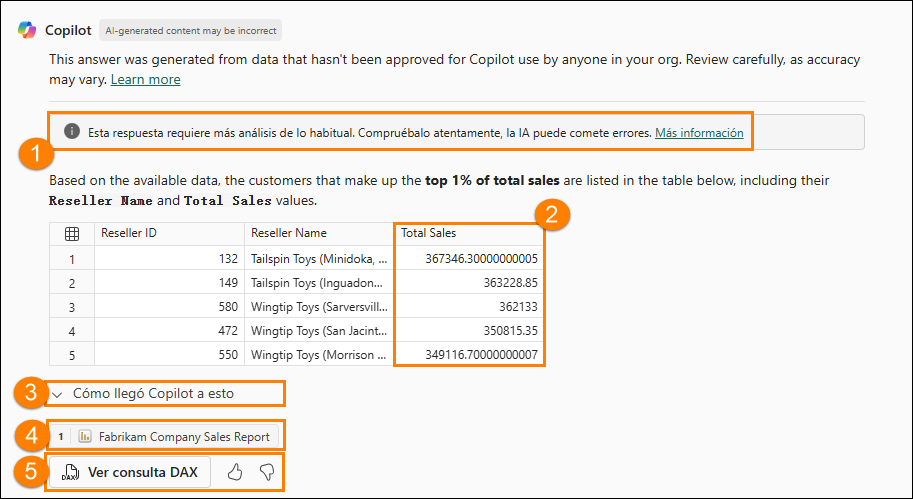

6. En primer lugar, exploremos HCAAT. Haga clic en **Cómo llegó Copilot a esto** para ampliar la descripción.

7. Esta vez el resultado que obtenemos es muy diferente al de antes. Recibirá una descripción narrativa que explicará cómo Copilot llegó a esta respuesta.

    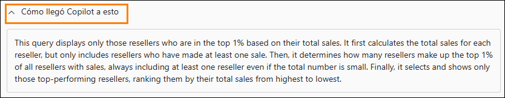

    En esta sección, ha aprendido que, en ocasiones, Copilot comparte cómo ha llegado a una determinada respuesta. La forma en que Copilot comparte o muestra esta información puede variar según el proceso que Copilot haya utilizado para devolver la respuesta.

## Tarea 7: Una respuesta de datos de una consulta DAX generada por Copilot

En el ejemplo anterior, Copilot generó una consulta DAX observando los datos subyacentes en el modelo semántico. Además, Copilot le ha advertido que compruebe la precisión de los resultados. Profundicemos en la respuesta.

1. Al observar los resultados de la captura de pantalla anterior, puede ver que las ventas totales se repiten para cada cliente (recuerde que hemos creado un sinónimo por el que Resellername = Customers). Esto suele ser una indicación de que no existe una relación válida entre las tablas que forman parte de la respuesta que estamos recibiendo.

2. Haga clic en **Ver consulta DAX**.

    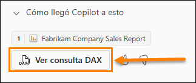

3. Esto proporcionará un cuadro de diálogo emergente que muestra la consulta DAX generada junto con comentarios en línea de cómo la solución llegó a esta respuesta. Cerca de la parte inferior, verá la descripción de cómo Copilot ha llegado a este resultado. Por último, en la parte inferior de la ventana emergente tiene dos opciones que puede llevar a cabo.

    - Ejecutar consulta: tomará la DAX actual y la abrirá en la vista de consultas de DAX.

    - Copiar consulta: esta opción copiará la DAX en el portapapeles

        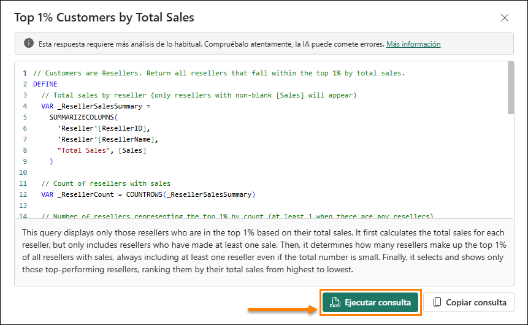

4. Haga clic en **Ejecutar consulta**. Se abrirá una nueva pestaña en su navegador web en la vista de consulta DAX en el modelo semántico de Fabrikam Company.

    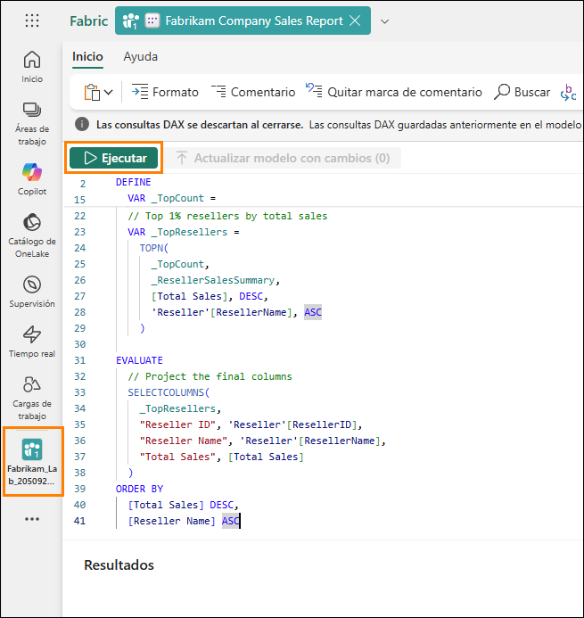

5. Haga clic en **Ejecutar** para ver los resultados aquí, en la vista de consulta DAX. Los resultados aquí son los mismos que los que recibimos de Copilot. Si está familiarizado con el lenguaje DAX, puede modificar la expresión DAX para refinar aún más sus resultados.

    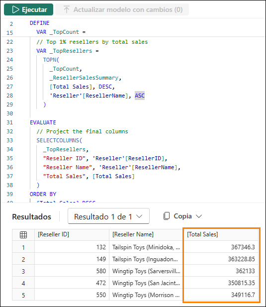

6. Esta parece ser una gran respuesta por parte de Copilot y toda nuestra preparación ha valido la pena. Si abro Power BI Desktop y creo un objeto visual rápido, puedo comprobar rápidamente que la respuesta de Copilot es correcta.

    

7. La otra cosa que hay que señalar aquí es que también tiene acceso para ver la vista del modelo. Desde aquí puede validar las tablas y las relaciones en el modelo semántico.

    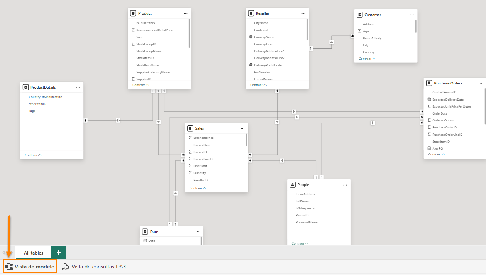

    **ℹ️ Importante**

    La experiencia de Chat with your Data es una herramienta extremadamente útil que mejorará considerablemente el tiempo de obtención de información para las corporaciones de todo el mundo. Sin embargo, estos resultados también pueden ser incorrectos o engañosos, por lo que es muy importante detenerse y validar los resultados, como hemos visto en este laboratorio.

    En este laboratorio, ha aprendido que podría ver la DAX generada por Copilot, puede iniciar la vista de consultas DAX y modificar el código existente, e incluso entrar en la vista de modelo y comprobar las relaciones.

## Tarea 8: Cambio de contexto en Copilot

Hasta ahora en este taller, su atención se ha centrado exclusivamente en los datos de ventas de Fabrikam Company. Sin embargo, nuestra organización tiene muchos informes diferentes en múltiples espacios de trabajo, y la experiencia de Copilot independiente hará referencia a todos los informes a los que tiene acceso.

1. Vaya a los archivos de su clase y abra el **State of Nevada COVID-19 Dashboard.\**

    

2. Publique este informe completamente terminado en su **Fabrikam_lab_0000000.**

    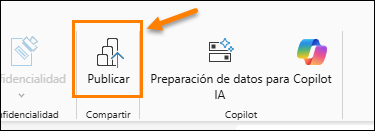

    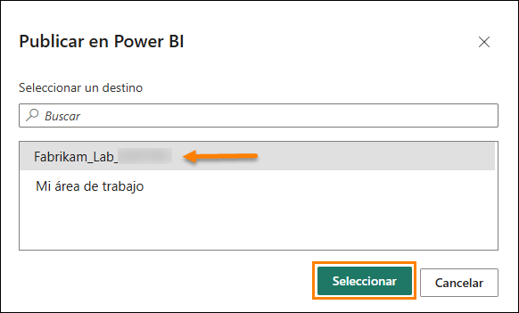

3. Ahora podrá consultar este modelo semántico e informar en la experiencia de Copilot independiente. En la solicitud de Copilot, escriba lo siguiente: **How many confirmed cases have there been?** Asegúrese de utilizar el **botón (1), el modelo semántico (2) y StateofNevadaCOVID-19Dashboard (3)** si no se incluye inmediatamente. Proporcionamos un mensaje muy genérico y Copilot pudo averiguar lo que usted quería en función del contenido del informe. Recuerde que, debajo del informe proporcionado, Copilot le indica los criterios con los que coincide.

    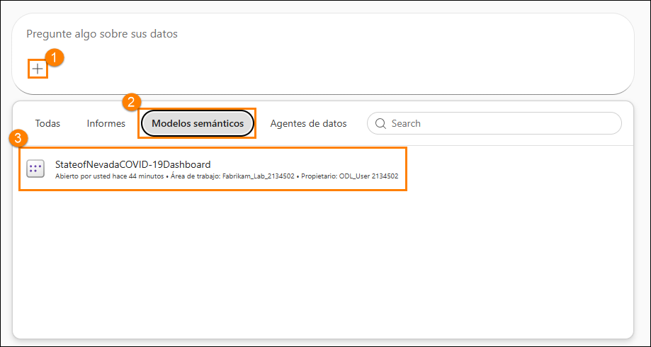

4. ¡Perfecto! Ahora, Copilot responde a nuestras preguntas devolviendo un objeto visual desde el informe subyacente. Recuerde que puede obtener varias salidas de visualización diferentes de Copilot.

    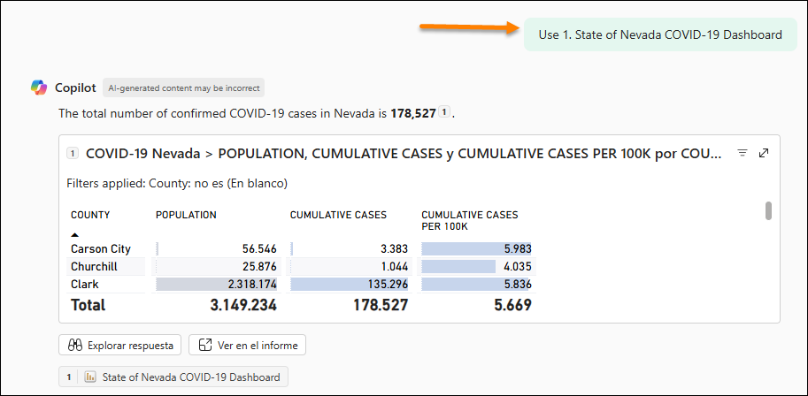

    OR

    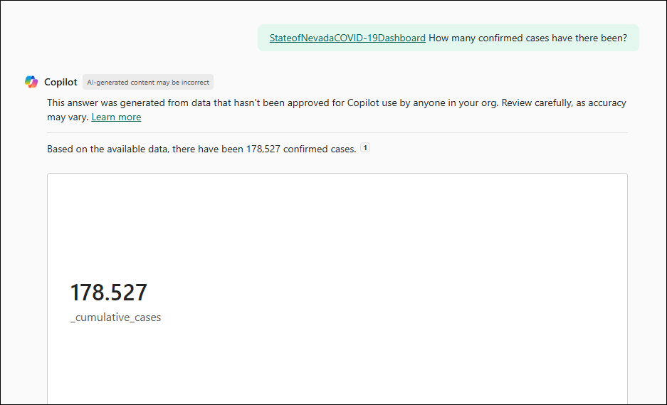

5. Haga otra pregunta sobre los datos, en el tipo de solicitud: **How many deaths were there in Carson City in 2019?**

    

6. Esta vez, Copilot no ha encontrado un objeto visual existente que pudiera devolver y, como resultado, ha generado una respuesta a partir de los datos subyacentes del informe. Cuando esto sucede, en un modelo que no está marcado como Preparado para IA, recibe una **respuesta de fricción**.

    **ℹ️ Importante**

    Una respuesta de fricción es una advertencia o limitación generada por el sistema que aparece cuando Copilot encuentra un modelo de datos sin preparar o mal descrito. Básicamente, Copilot está afirmando que puede intentar ayudar con la información disponible. Sin embargo, los resultados deben validarse.

    Para reducir las respuestas de fricción de Copilot, asegúrese de preparar sus modelos semánticos para la IA y, a continuación, marcar el modelo semántico como preparado para la IA después de publicarlo. Consulte el documento de orientación de la configuración del inquilino que se proporciona en los archivos de laboratorio.

## Tarea 9: Construcción con Copilot de un objeto visual desde el modelo semántico

En laboratorios anteriores, hemos visto que Copilot devuelve visualizaciones para responder a preguntas específicas. Estas visualizaciones eran objetos visuales que ya existían en nuestros informes. En esta sección, verá cómo Copilot también puede construir visualizaciones a partir del modelo semántico para responder a solicitudes.

1. Si aún no está en Copilot, vuelva a Copilot en Fabric.

2. En la solicitud, adjunte **Fabrikam Company Sales Report** y escriba lo siguiente: **Show me units sold over time**.

    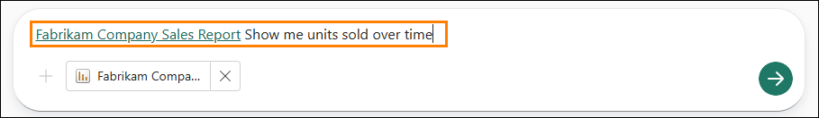

3. La visualización devuelta no es un objeto visual que existiera anteriormente en el informe. Esta es una visualización creada por Copilot basada en el modelo semántico. De hecho, a diferencia de los objetos visuales que provienen directamente de un informe, esta respuesta generada por Copilot viene con una explicación HCAAT: *Cómo llegó Copilot a esto*.

    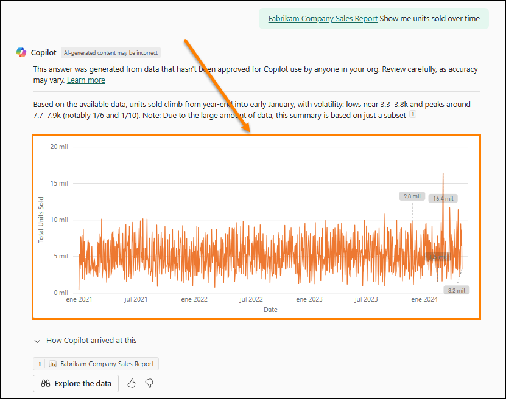

4. Exploremos los resultados y haga clic en **Cómo llegó Copilot a esto**.

    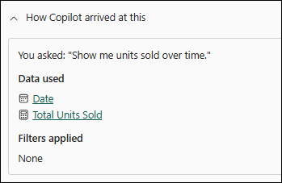

## Tarea 10: Experiencia general de Copilot

En este laboratorio, ha aprendido a aprovechar la experiencia de Copilot independiente en Microsoft Fabric para explorar sus informes y modelos semánticos existentes. Sin embargo, también puede aprovechar la experiencia general de Copilot. En este laboratorio, aprovecharemos Copilot para crear un correo electrónico con nuestras conclusiones.

1. En la solicitud de Copilot, escriba **Take the conversation so far and turn it into an email to share with the team**.

    

2. Los resultados son geniales. Le recordamos que su respuesta será muy diferente a la de la captura de pantalla. También es importante recordar que la respuesta se basa en su chat abierto actual con Copilot. Si ha borrado el chat o tiene muy poco historial de conversaciones, eso afectará a los resultados finales.

    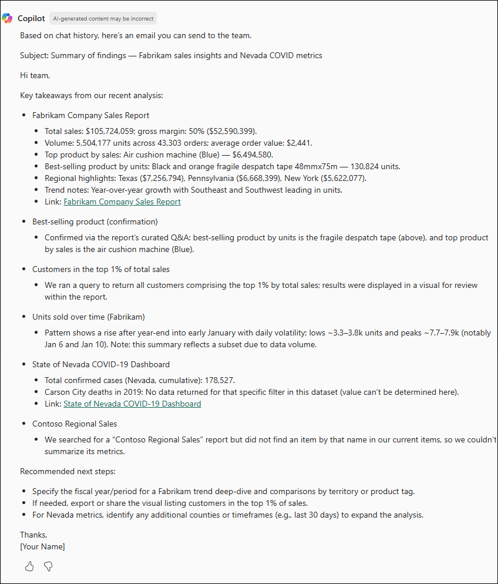

3. Esto es bueno, pero sería mucho mejor si tuviéramos algunas visualizaciones y vínculos en el correo electrónico. En la solicitud de Copilot, pida a Copilot que **Add visuals and links to the email.**

    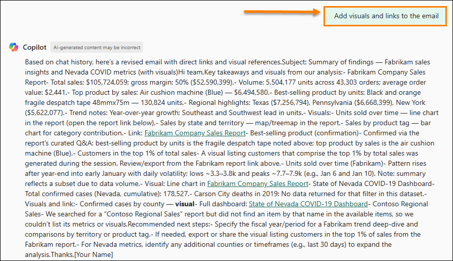

# Referencias

Chat With Your Data in a Day (CDIAD) le presenta algunas de las características clave al usar Copilot independiente en un espacio de trabajo de Fabric.

En el menú del servicio, la sección Ayuda (?) tiene vínculos a algunos recursos excelentes. Tenga en cuenta que la vista que ve depende de la experiencia en la que se encuentre actualmente y, por lo tanto, sus opciones pueden verse diferentes a la captura de pantalla que aparece a continuación.

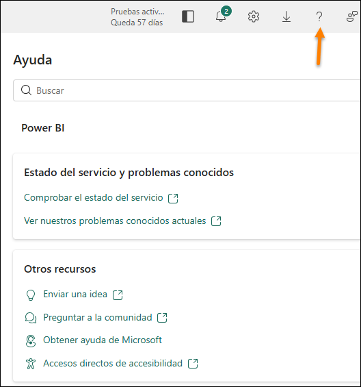

Estos son algunos recursos más que podrán ayudarle a seguir avanzando con Microsoft Fabric.

- Obtenga acceso a toda la información en la [Documentación de Microsoft Fabric](https://learn.microsoft.com/en-us/fabric/).

- Explore Fabric a través de la [Visita guiada](https://aka.ms/Fabric-GuidedTour).

- Regístrese en la [prueba gratuita de Microsoft Fabric](https://aka.ms/try-fabric).

- Visite el [sitio web de Microsoft Fabric](https://aka.ms/microsoft-fabric).

- Adquiera nuevas capacidades mediante la exploración de los [módulos de aprendizaje de Fabric](https://aka.ms/learn-fabric).

- Lea el [libro electrónico gratuito sobre cómo empezar a usar Fabric](https://aka.ms/fabric-get-started-ebook).

- Únase a la [comunidad de Fabric](https://aka.ms/fabric-community) para publicar sus preguntas, compartir sus comentarios y aprender de otros.

Lea de manera más detallada la documentación técnica relevante sobre Copilot:

- [Información general de Copilot para Power BI: Power BI | Microsoft Learn](https://learn.microsoft.com/en-us/power-bi/create-reports/copilot-introduction)

- [Experiencia de Copilot independiente en Power BI (versión preliminar): Power BI | Microsoft Learn](https://learn.microsoft.com/en-us/power-bi/create-reports/copilot-chat-with-data-standalone)

- [Configuración de administrador de Copilot de Microsoft Fabric | Microsoft Learn](https://learn.microsoft.com/en-us/fabric/admin/service-admin-portal-copilot)

- [Creación de agentes de datos de Fabric (versión preliminar): aprenda a crear un agente de datos de Fabric | Microsoft Learn](https://learn.microsoft.com/en-us/fabric/data-science/concept-data-agent)

- [Procedimientos recomendados para la configuración del agente de datos: Microsoft Fabric | Microsoft Learn](https://learn.microsoft.com/en-us/fabric/data-science/data-agent-configuration-best-practices)

- [Copilot para Microsoft Fabric y Power BI: P+F: Microsoft Fabric | Microsoft Learn](https://learn.microsoft.com/en-us/fabric/fundamentals/copilot-faq-fabric)

© 2026 Microsoft Corporation. Todos los derechos reservados.

Al participar en esta demostración o laboratorio práctico, acepta las siguientes condiciones:

Microsoft Corporation pone a su disposición la tecnología o funcionalidad descrita en esta demostración/laboratorio práctico con el fin de obtener comentarios por su parte y de facilitarle una experiencia de aprendizaje. Esta demostración/laboratorio práctico solo se puede usar para evaluar las características de tal tecnología o funcionalidad y para proporcionar comentarios a Microsoft. No se puede usar para ningún otro propósito. Ninguna parte de esta demostración/laboratorio práctico se puede modificar, copiar, distribuir, transmitir, mostrar, realizar, reproducir, publicar, licenciar, transferir ni vender, ni tampoco crear trabajos derivados de ella.

LA COPIA O REPRODUCCIÓN DE ESTA DEMOSTRACIÓN/LABORATORIO PRÁCTICO (O PARTE DE ELLA) EN CUALQUIER OTRO SERVIDOR O UBICACIÓN PARA SU REPRODUCCIÓN O DISTRIBUCIÓN POSTERIOR QUEDA EXPRESAMENTE PROHIBIDA.

ESTA DEMOSTRACIÓN/LABORATORIO PRÁCTICO PROPORCIONA CIERTAS FUNCIONES Y CARACTERÍSTICAS DE PRODUCTOS O TECNOLOGÍAS DE SOFTWARE (INCLUIDOS POSIBLES NUEVOS CONCEPTOS Y CARACTERÍSTICAS) EN UN ENTORNO SIMULADO SIN INSTALACIÓN O CONFIGURACIÓN COMPLEJA PARA EL PROPÓSITO ARRIBA DESCRITO. LA TECNOLOGÍA/CONCEPTOS DESCRITOS EN ESTA DEMOSTRACIÓN/LABORATORIO PRÁCTICO NO REPRESENTAN LA FUNCIONALIDAD COMPLETA DE LAS CARACTERÍSTICAS Y, EN ESTE SENTIDO, ES POSIBLE QUE NO FUNCIONEN DEL MODO EN QUE LO HARÁN EN UNA VERSIÓN FINAL. ASIMISMO, PUEDE QUE NO SE PUBLIQUE UNA VERSIÓN FINAL DE TALES CARACTERÍSTICAS O CONCEPTOS. DE IGUAL MODO, SU EXPERIENCIA CON EL USO DE ESTAS CARACTERÍSTICAS Y FUNCIONALIDADES EN UN ENTORNO FÍSICO PUEDE SER DIFERENTE.

**COMENTARIOS.** Si envía comentarios a Microsoft sobre las características, funcionalidades o conceptos de tecnología descritos en esta demostración/laboratorio práctico, acepta otorgar a Microsoft, sin cargo alguno, el derecho a usar, compartir y comercializar sus comentarios de cualquier modo y para cualquier fin. También concederá a terceros, sin cargo alguno, los derechos de patente necesarios para que sus productos, tecnologías y servicios usen o interactúen con cualquier parte específica de un software o servicio de Microsoft que incluya los comentarios. No enviará comentarios que estén sujetos a una licencia que obligue a Microsoft a conceder su software o documentación bajo licencia a terceras partes porque incluyamos sus comentarios en ellos. Estos derechos seguirán vigentes después del vencimiento de este acuerdo.

MICROSOFT CORPORATION RENUNCIA POR LA PRESENTE A TODAS LAS GARANTÍAS Y CONDICIONES RELATIVAS A LA DEMOSTRACIÓN/LABORATORIO PRÁCTICO, INCLUIDA CUALQUIER GARANTÍA Y CONDICIÓN DE COMERCIABILIDAD (YA SEA EXPRESA, IMPLÍCITA O ESTATUTARIA), DE IDONEIDAD PARA UN FIN DETERMINADO, DE TITULARIDAD Y DE AUSENCIA DE INFRACCIÓN. MICROSOFT NO DECLARA NI GARANTIZA LA EXACTITUD DE LOS RESULTADOS, EL RESULTADO DERIVADO DE LA REALIZACIÓN DE LA DEMOSTRACIÓN/LABORATORIO PRÁCTICO NI LA IDONEIDAD DE LA INFORMACIÓN CONTENIDA EN ELLA CON NINGÚN PROPÓSITO.

**DECLINACIÓN DE RESPONSABILIDADES**

Esta demostración/laboratorio práctico contiene solo una parte de las nuevas características y mejoras realizadas en Microsoft Power BI. Puede que algunas de las características cambien en versiones futuras del producto. En esta demostración/laboratorio práctico, conocerá algunas de estas nuevas características, pero no todas.
