# Microsoft Fabric Chat with your Data in a Day - Laboratorio 5

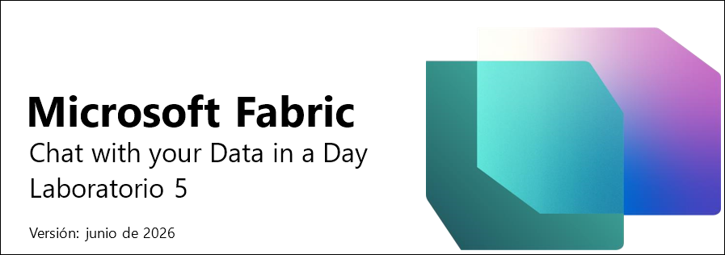

## Contenido

- Estructura del documento
- Escenario/planteamiento del problema
- Introducción
- Implementar agente de datos de Fabric
- Requisitos previos
  - Tarea 1: Crear el agente de datos
  - Tarea 2: Agregar orígenes de datos
  - Tarea 3: Hacer preguntas al agente de datos
  - Tarea 4: Agregar instrucciones de IA
  - Contenido destacado: Reemplazar un origen de datos
  - Tarea 5: Agregar orígenes de datos adicionales
  - Contenido destacado: Instrucciones de origen de datos
  - Tarea 6: Crear ejemplos de preguntas
  - Tarea 7: Publicar y compartir su agente de datos
  - Tarea 8: Consumir un agente de datos desde Copilot
- Referencias

# Estructura del documento

El laboratorio incluye pasos que el usuario debe seguir junto con capturas de pantalla asociadas que sirven de ayuda visual. En cada captura de pantalla, las secciones se resaltan con cuadros de color naranja para indicar en qué áreas debe centrarse el usuario.

# Escenario/planteamiento del problema

La experiencia de Copilot independiente ha sido un gran éxito, ya que ha reducido el tiempo para obtener información en toda su organización y ha aumentado la adopción general.

Sin embargo, la experiencia de Copilot no es muy personalizable, por lo que ahora hay usuarios finales que desean experiencias más seleccionadas en las que puedan centrar sus preguntas en áreas muy específicas del negocio, sin necesidad de descifrar a través de informes y modelos semánticos no relacionados. Se le ha asignado la tarea de crear un agente de datos que esté conectado solo a los datos relacionados con los datos del Fabrikam Company Sales report. También debe agregar algunos datos adicionales al agente de datos que no están disponibles para la experiencia de Copilot independiente para responder a preguntas más específicas que su equipo quiera hacer sobre el plazo de entrega del producto.

# Introducción

Ha aprendido sobre la experiencia independiente de Copilot, que es excelente para explorar todos sus datos en todas sus áreas de trabajo. Sin embargo, el uso de agentes de datos puede proporcionar una experiencia más cuidada para chatear con datos específicos. Los agentes de datos pueden conectarse a orígenes de datos específicos o incluso a tablas específicas dentro de orígenes de datos. Si bien Copilot es un asistente de IA dentro de Fabric que fomenta la productividad y la inteligencia, los agentes de datos permiten la conectividad de datos.

Al final de este laboratorio, habrá aprendido cómo:

- Crear un agente de datos

- Agregar orígenes de datos a su agente

- Formular preguntas sobre su agente

- Agregar instrucciones de IA para que las use su agente

- Reemplazar un origen de datos

- Agregar orígenes de datos adicionales

- Crear ejemplos de preguntas

- Publicar y compartir su agente

- Consumir agente de datos desde un Copilot independiente

# Implementar agente de datos de Fabric

En esta sección, aprenderá a crear un agente de datos. El agente puede recuperar datos generando consultas estructuradas (SQL, DAX, KQL) para responder a preguntas relacionadas con datos, totales, clasificaciones o filtros. En el momento de escribir este artículo, los agentes de datos de Fabric tienen actualmente una característica en vista previa (GB) en Microsoft Fabric y no se recomiendan para cargas de trabajo de producción. Puede leer más sobre cómo funciona el agente de datos de Fabric aquí:

[Creación de agentes de datos de Fabric (versión preliminar): aprenda a crear un agente de datos de Fabric | Microsoft Learn](https://learn.microsoft.com/en-us/fabric/data-science/concept-data-agent)

Los agentes de datos de Microsoft Fabric permiten a los usuarios interactuar con los datos empresariales en un inglés sencillo, lo que elimina la necesidad de SQL, DAX o KQL. Proporcionan una interfaz de chat con herramientas de depuración, se conectan a orígenes como modelos semánticos de Power BI, bases de datos KQL, almacenes de lago de datos y almacenes. Se puede acceder a los agentes de datos dentro y fuera de Microsoft Fabric; además, se pueden integrar en Microsoft Teams, Copilot Studio, Fundición de IA de Azure y aplicaciones personalizadas. Los agentes de datos también se pueden detectar en la experiencia de Copilot independiente en Fabric.

## Requisitos previos

Para usar agentes de datos de Fabric, hay muchas configuraciones de inquilino que deben habilitarse o configurarse. Consulte el **documento de orientación de configuración de inquilinos** que se encuentra en los laboratorios de su clase:

- Se requiere acceso de administrador

- Habilitar la configuración de Azure OpenAI y Copilot

- Habilitar la creación y el uso compartido de agentes de datos de Fabric

- Habilitar puntos de conexión XMLA para modelos semánticos de Power BI

## Tarea 1: Crear el agente de datos

1. Abra un explorador web en su máquina virtual vaya a https://fabric.microsoft.com y navegue hasta el espacio de trabajo denominado **Fabrikam_Lab_<inject key="DeploymentID" enableCopy="false"/>**

    *(**Importante**: Utilice el área de trabajo que creó anteriormente en esta clase.)*

    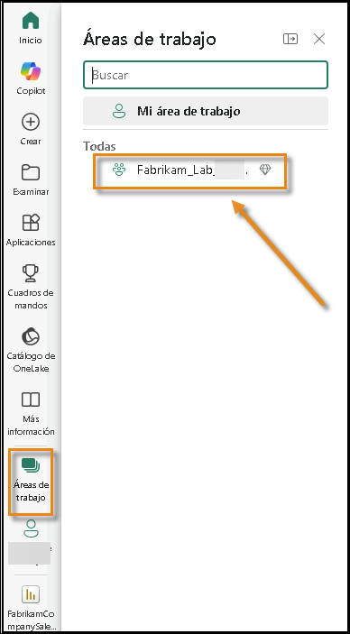

2. Haga clic en **Nuevo elemento**.

    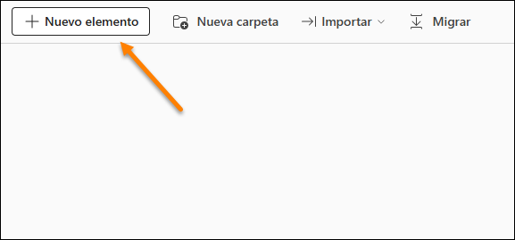

3. En la barra de búsqueda que se abre, escriba **Agent** y seleccione **Agente de datos (versión preliminar)**.

    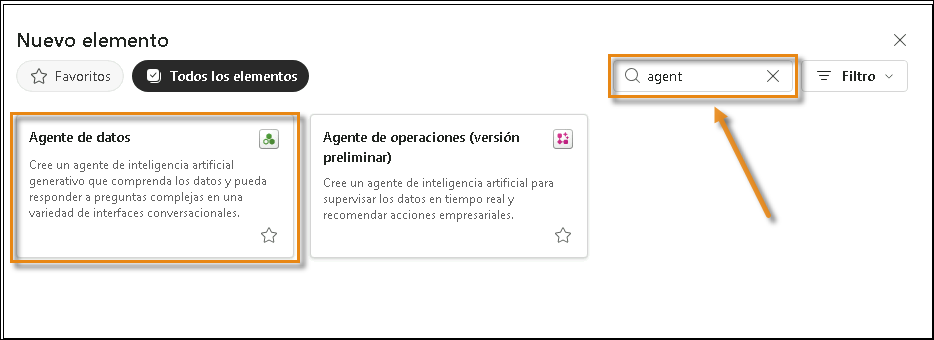

4. Asigne un nombre a su agente, **FabrikamSales_agent_<inject key="DeploymentID" enableCopy="false"/>**

5. Recuerde, su código de usuario se encuentra en su nombre de usuario como se ve a continuación:

    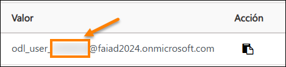

6. Haga clic en **Crear.**

    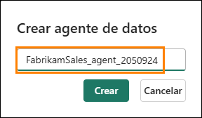

## Tarea 2: Agregar orígenes de datos

1. Una vez que haya creado un agente de datos, el siguiente paso es agregar sus orígenes de datos.

2. En el panel del explorador, haga clic en el botón **+ Agregar datos**. También puede hacer clic en el botón **Agregar un origen de datos** que se muestra en el medio de la pantalla.

    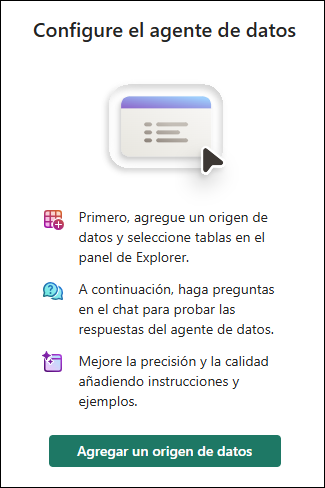

3. Elija el modelo semántico de **Fabrikam Company Sales Report** en la lista y, a continuación, haga clic en **Agregar**.

    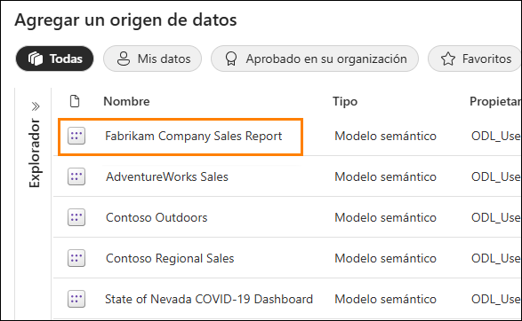

4. Tenga en cuenta que aún no se han seleccionado tablas y que el agente de datos no podrá responder preguntas hasta que se seleccione al menos un origen de datos. Haga clic en **>** junto a **Fabrikam Company Sales Report** en el panel **Explorador**. Seleccione las tablas que se muestran en la captura de pantalla siguiente.

    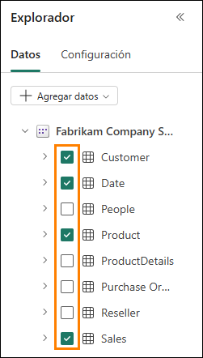

## Tarea 3: Hacer preguntas al agente de datos

1. Ahora que su agente está conectado a un origen de datos, comencemos a escribir algunas solicitudes para el agente de datos.

2. Escriba el siguiente comando: **Show me sales by country.**

    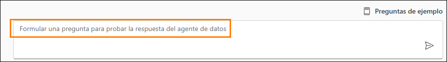

3. El agente puede tardar varios segundos en responder con una respuesta. Observe lo que el agente ha devuelto:

    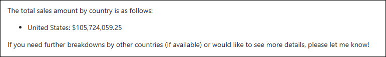

4. Haga clic en el menú desplegable para el paso completado para mostrar lo que hizo el agente y, a continuación, en el siguiente menú desplegable para revelar los detalles.

    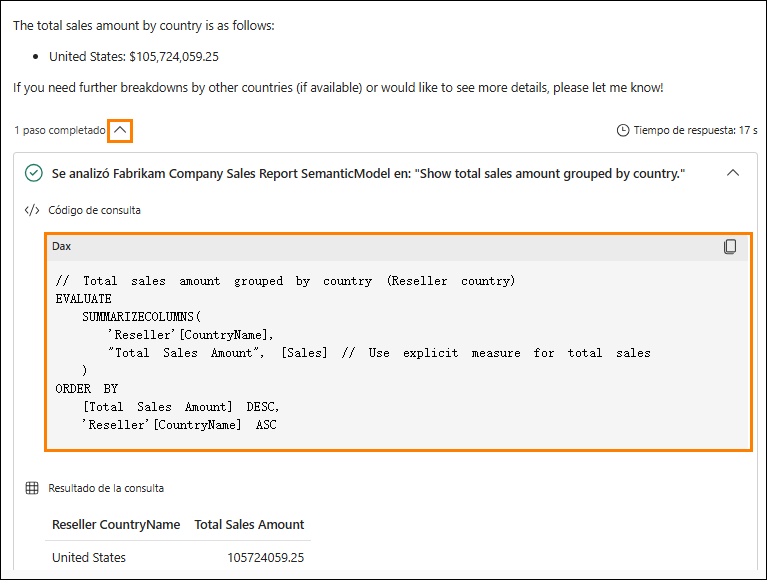

    **ℹ️ Importante**

    Al desarrollar un agente de datos de Fabric, es importante dedicar tiempo a validar los resultados para garantizar la precisión y la coherencia. Ahora que tiene resultados, volveremos al modelo semántico y validaremos allí los resultados.

5. Vaya a sus archivos de clase descargados y abra el archivo **Fabrikam Company Sales Report.pbix**.

    

6. Haga clic en la parte inferior del informe para abrir una nueva página de informe.

    

7. A continuación, creará un objeto visual básico para validar los resultados devueltos por el agente de datos.

8. Agregue un objeto visual de tabla en esta nueva página del informe.

    

    

9. La tabla resultante debería tener el siguiente aspecto:

    

10. Observe que el importe total de las ventas es el mismo que el resultado de la consulta del agente de datos anterior. Esto valida que la consulta del agente ha devuelto el resultado correcto.

## Tarea 4: Agregar instrucciones de IA

Se pueden agregar instrucciones de IA al agente de datos de Fabric para mejorar la precisión y la coherencia. Las instrucciones de IA se pueden agregar en dos ubicaciones independientes dentro del agente de datos.

En primer lugar, se pueden agregar instrucciones de IA al propio agente. Estas se conocen específicamente como **instrucciones de agente** y ayudan al agente a identificar qué orígenes de datos usar para determinadas preguntas, qué tono usar, qué tipo de datos priorizar y otras preferencias contextuales o de comportamiento similares que dan forma a la manera en que el agente responde a los usuarios.

El segundo tipo de instrucción de IA son las **instrucciones del origen de datos**. Con las instrucciones del origen de datos puede agregar instrucciones para ayudar al agente de datos a comprender los datos del origen de datos y cómo usarlos de la manera más eficaz. Actualmente, las **instrucciones del origen de datos** no son compatibles con los modelos semánticos. Veremos esta característica más adelante.

1. Comencemos con las **instrucciones del agente** en la interfaz del explorador de Fabric. Por lo tanto, podemos indicarle al agente que queremos agregar un resumen conciso para cada respuesta.

2. Seleccione las instrucciones de IA en la pestaña Inicio.

    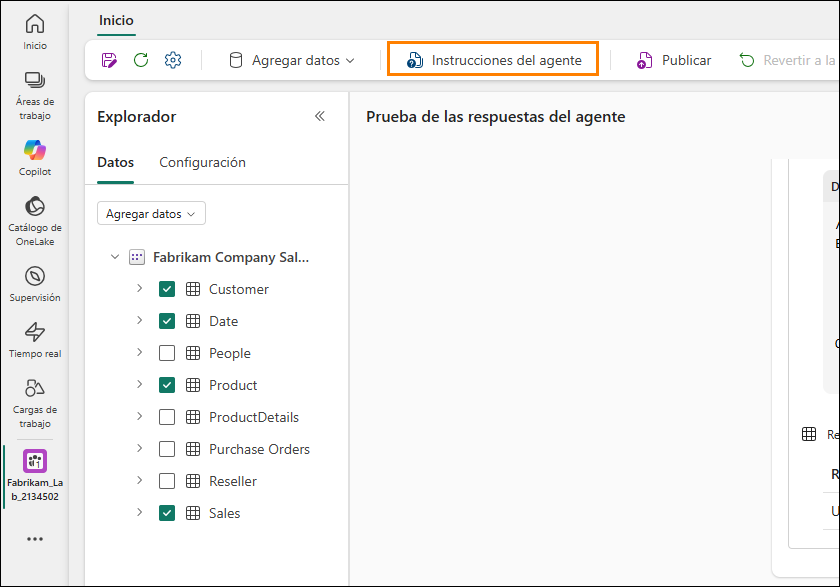

3. En el cuadro **Instrucciones del agente** de la ventana de instrucciones de IA, encima o debajo de las instrucciones genéricas existentes, escriba las siguientes indicaciones:

    **## Set Response Guidelines**

    **Always include a concise summary before the detailed breakdown.**

    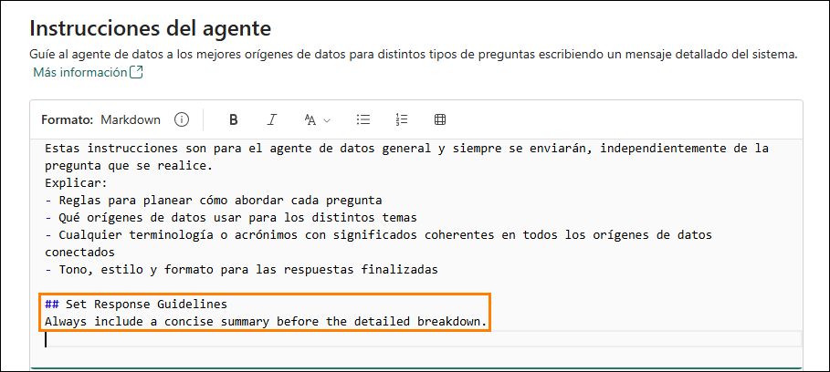

    **ℹ️ Importante**

    En ocasiones, las instrucciones de IA pueden tardar en surtir efecto. Si no obtiene los resultados deseados, haga clic en el botón para borrar el chat de la parte superior de la ventana del agente e inténtelo de nuevo.

4. Haga clic en la **X** de la esquina superior derecha de la pestaña “Instrucciones del agente” para cerrar las instrucciones de IA y guardar los cambios.

    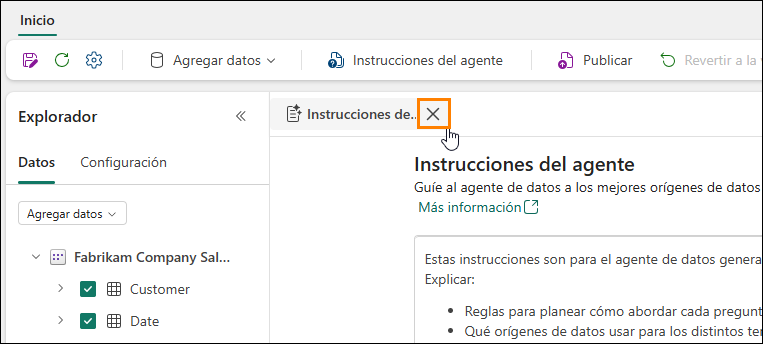

    **ℹ️ Importante**

    En ocasiones, las instrucciones de IA pueden tardar en surtir efecto. Si no obtiene los resultados deseados, haga clic en el botón para borrar el chat de la parte superior de la ventana del agente e inténtelo de nuevo.

5. Proporcione al agente la misma solicitud que se ha proporcionado anteriormente: **Show me sales by country** y presione Entrar.

    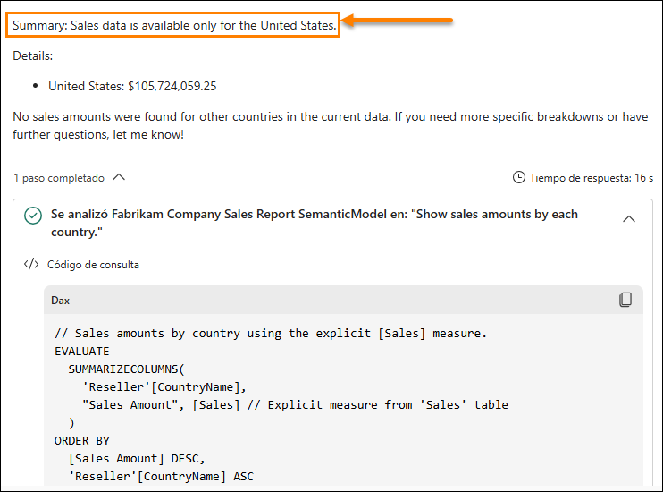

6. Agreguemos otra instrucción de IA para refinar aún más la respuesta de IA. En este ejemplo, agregará un comando en el símbolo del sistema para devolver siempre una tabla en lugar de una lista con viñetas. Abra las instrucciones de IA y, en las instrucciones del agente, agregue la siguiente línea de código:

    **Always return a table instead of bullet points**

    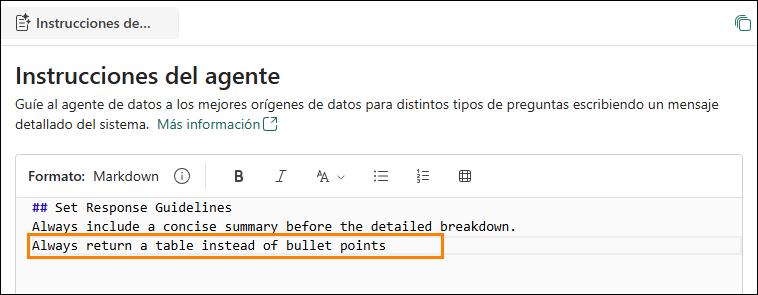

7. Cierre la ventana de instrucciones de IA y escriba lo siguiente en la solicitud del agente de datos: **Return sales by country**

    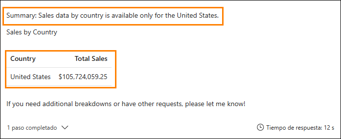

8. Ahora recibe los resultados en formato tabular con un resumen. Hasta ahora esto es fantástico. Agreguemos algunas instrucciones más.

9. En su solicitud del agente de datos, escriba lo siguiente: **Return sales by State**.

    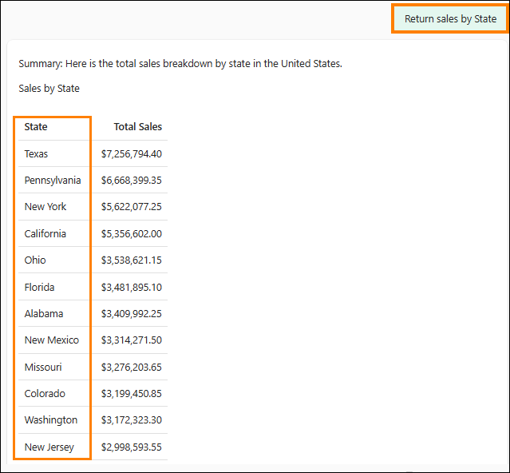

10. Estos resultados son exactamente lo que debería esperar, pero ¿tal vez sea demasiado? Indiquemos a la solicitud de IA que siempre devuelva solo 5 filas de datos, a menos que se especifique lo contrario.

11. En las **instrucciones de IA** del agente de datos, escriba lo siguiente:

    **Always provide the top 5 results unless a different number is specified**

    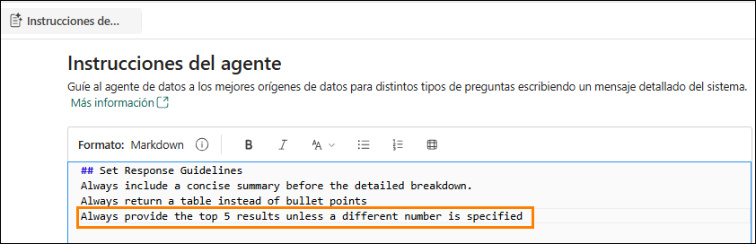

12. Los resultados son perfectos. Nuestro resumen ahora aclara que estamos obteniendo los 5 estados principales por ventas. Y Copilot nos pide que pidamos datos de ventas de todos los estados si eso es lo que queremos.

    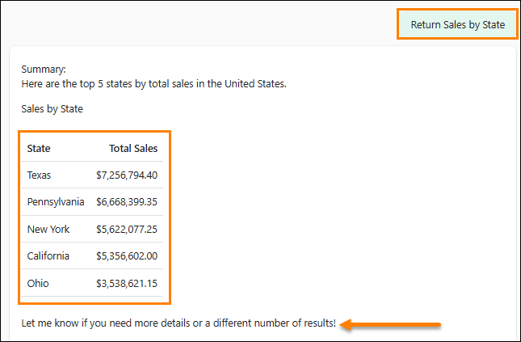

## Contenido destacado: Reemplazar un origen de datos

Cuando trabaje con agentes de datos, puede decidir que desea usar otro origen de datos. En nuestro ejemplo, utilizamos el modelo semántico de Fabrikam Company Sales Report. Pero, ¿y si quisiéramos utilizar un modelo semántico diferente? Actualmente no existe una manera de reemplazar simplemente un origen de datos. Sin embargo, puede quitar y agregar orígenes de datos a su agente de datos en cualquier momento.

1. Para eliminar un origen de datos, vaya al explorador dentro de su agente de datos y haga clic en los puntos suspensivos (**...)** a la derecha del origen de datos. En el menú desplegable, tiene tres opciones: Abrir, Actualizar o Quitar.

    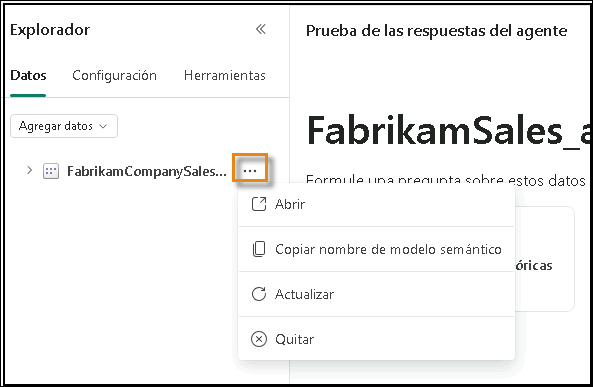

2. **NO** reemplazará el origen de datos en este laboratorio.

## Tarea 5: Agregar orígenes de datos adicionales

Hemos creado nuestro agente de datos sobre un modelo semántico bien definido y pensado. Este modelo semántico se ha diseñado para responder a la mayoría de las solicitudes de los usuarios, si no a todas. Sin embargo, ¿qué sucede si hay información de ventas que su modelo semántico no puede responder? Puede encontrar al creador de ese modelo semántico y pedirle que agregue tablas e información adicionales, pero eso podría llevar tiempo o podría denegarse su solicitud.

Tiene un usuario que desea ver las ventas por plazo de entrega del producto. Nuestro modelo semántico de Fabrikam Company Sales no incluye esta información. Sin embargo, esta información existe en los datos de origen originales almacenados en su almacén de lago de datos de Fabric.

En este laboratorio, agregará un origen de datos adicional para que la información sobre el plazo de entrega del producto se pueda incluir en las respuestas de su agente de datos.

1. Comencemos creando un almacén de lago de datos y agregando algunos datos de muestra. Vuelva a su espacio de trabajo y seleccione **Nuevo elemento** una vez más:

    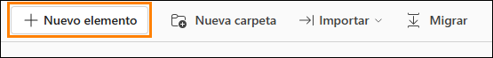

2. Desplácese hacia abajo y seleccionar el **Almacén de lago de datos** desde el área Otros elementos que puede crear con Microsoft Fabric.

    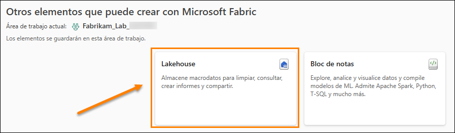

3. Asigne a su nuevo almacén de lago de datos el nombre de **lh_Fabrikam** y luego presione **Crear**.

    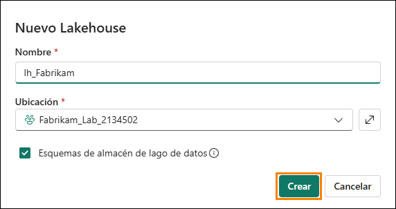

4. En nuestro almacén de lago de datos usaremos un **Acceso directo** para conectarnos a una versión preparada previamente de los datos de Fabrikam. Abra **Obtener datos** y seleccione **Nuevo acceso directo**.

    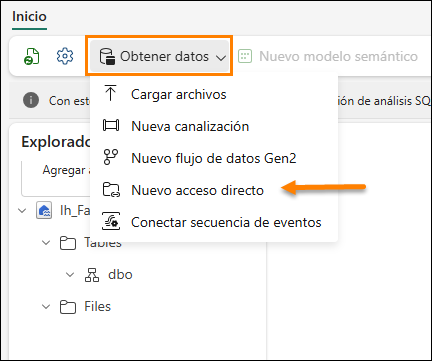

5. Seleccione **Azure Data Lake Storage Gen2**.

    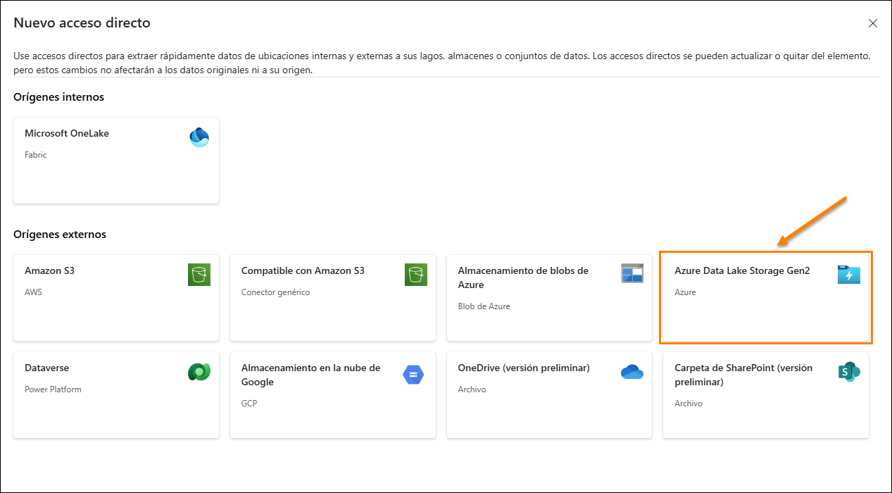

6. Seleccione **Nueva conexión** y escriba la dirección URL de Fabrikam:

    ***https://stvnextblobstorage.dfs.core.windows.net/fabrikam-sales***

    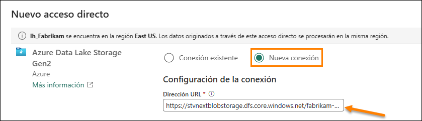

7. Proporcione un nombre de conexión, como **Fabrikam Connector o similar** y, en Tipo de autenticación, haga clic en el menú desplegable y seleccione Firma de acceso compartido (SAS).

    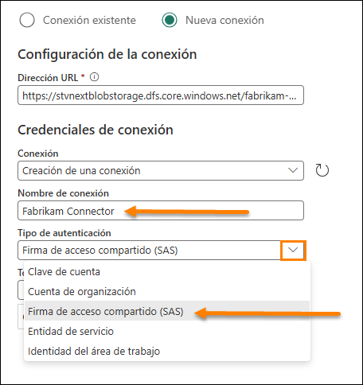

8. Copie el token de SAS de la pestaña Entorno del lado derecho y péguelo en el área **Token de SAS**.

    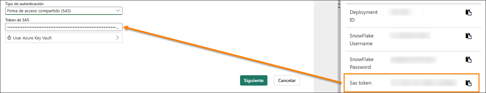

9. Seleccione **Siguiente**.

    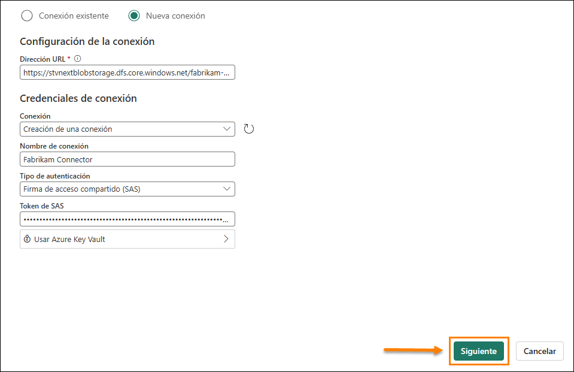

10. Abra **Delta-Parquet-Format-FY25** y seleccione todos los artículos excepto **Sales.Invoices.May** y, a continuación, seleccione **Siguiente**.

    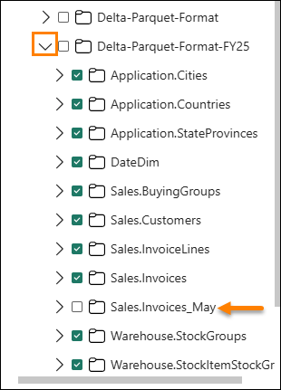

11. Cambie el **Nombre de acceso directo** para cada una de las nuevas tablas. Esto es importante para usar con facilidad el almacén de lago de datos como origen de datos. Siga el siguiente formato:

    Application.Cities a **Cities**

    Application.Countries a **Countries**

    Application.StateProvinces a **StateProvinces**

    DateDim a **Date**

    Sales.BuyingGroups a **BuyingGroups**

    Sales.Customers a **Customers**

    Sales.InvoiceLines a **InvoiceLines**

    Sales.Invoices a **Invoices**

    Warehouse.StockGroups a **StockGroups**

    Warehouse.StockItemStockGroups a **StockItemStockGroups**

    Warehouse.StockItems a **StockItems**

    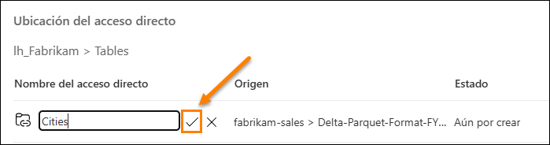

12. Seleccione **Crear** para agregar los datos a través de un acceso directo a su almacén de lago de datos.

    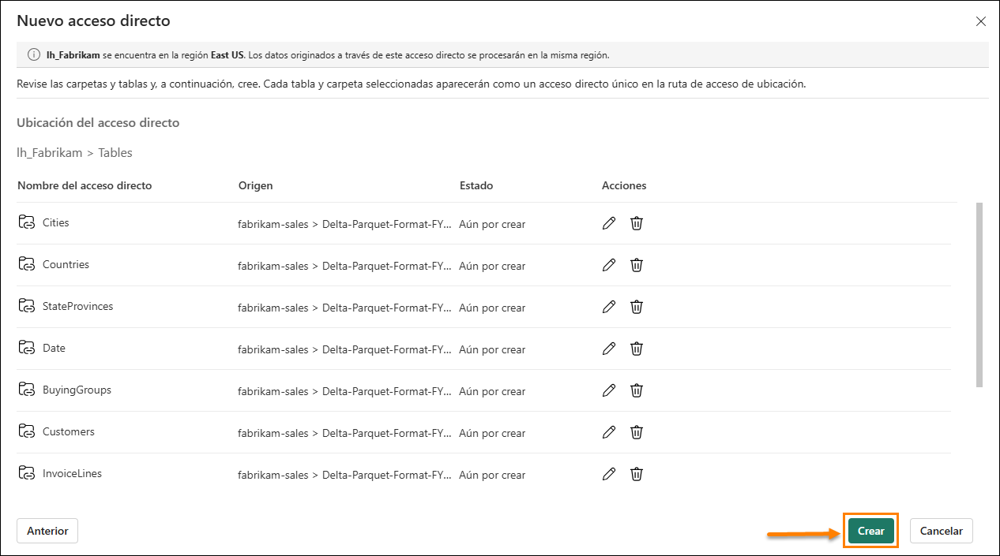

13. Cuando finalice la carga, debería ver que los objetos se han movido al área de la Table.

    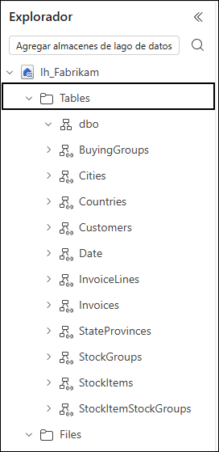

14. Puede volver al **Agente de datos** desde el lado izquierdo o desde la vista Espacio de trabajo.

    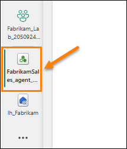

    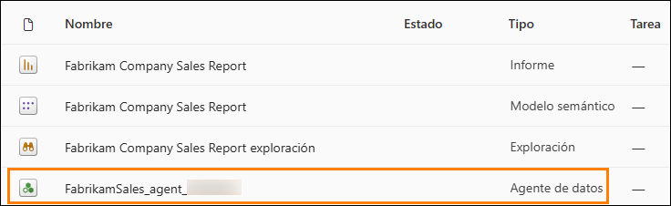

15. En el agente de datos, haga clic en el desplegable **Agregar datos** y seleccione **Origen de datos** en el panel del explorador.

    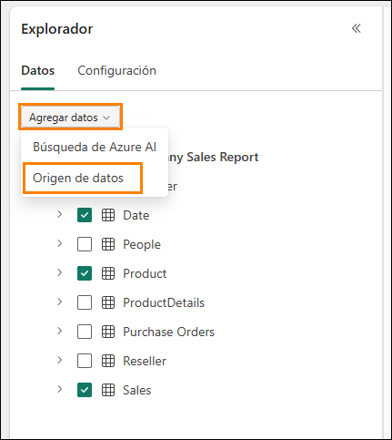

16. Seleccione **lh_Fabrikam** y, a continuación, haga clic en **Agregar**.

    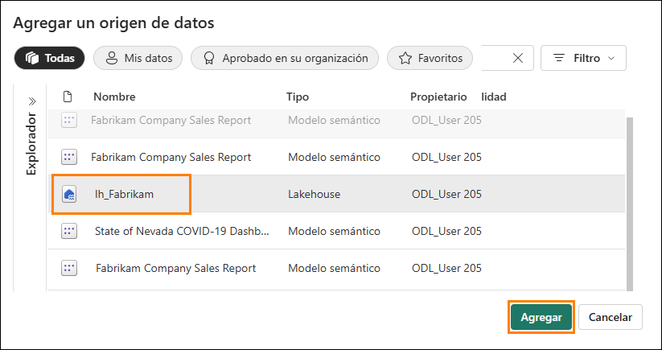

17. Ahora tendrá dos orígenes de datos en el panel del **Explorador**.

    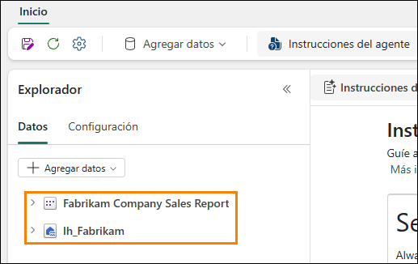

18. Abra el almacén de lago de datos y agregue todos los posibles orígenes de datos de lh_Fabrikam. Cada elemento del almacén de lago de datos puede tardar unos minutos en mostrarse. No dude en darle la oportunidad de cargar y actualizar según sea necesario.

    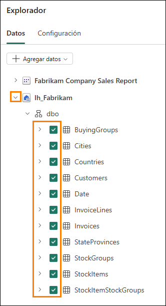

19. En la solicitud del agente de datos, escriba lo siguiente: **What are total sales by product lead time?**

    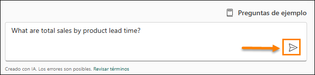

20. Los agentes de datos de Fabric respondieron perfectamente a esta solicitud y obtuvieron los resultados deseados de nuestro almacén de lago de datos. Siempre puede anular la selección de los datos de Fabrikam Company Sales Report para forzar el uso del almacén de lago de datos por parte de Copilot. Sin embargo, pronto utilizaremos instrucciones para solucionar mejor este problema.

21. Expanda la sección de pasos completados para revisar el SQL generado por los agentes de datos para llegar a este resultado.

    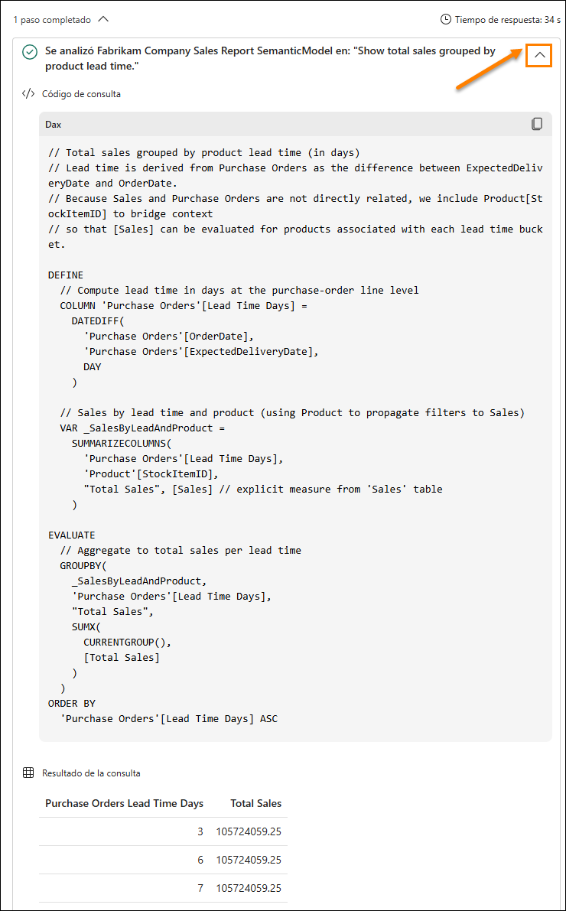

22. Recuerde que es importante validar los resultados del agente de datos. Como los agentes de datos exponen el código SQL que se utilizó, puede revisarlo e incluso ejecutarlo en el almacén de lago de datos para comprobar que los resultados sean correctos.

    Es posible que ciertas solicitudes de usuario al agente de datos devuelvan resultados del origen de datos incorrecto. Por ejemplo, las ventas totales por producto podrían responderse mediante el origen de datos de almacén de lago de datos o el modelo semántico. Para asegurarse de que el agente de datos responda a la solicitud utilizando el origen de datos deseado, puede agregar instrucciones de IA adicionales para devolver los resultados deseados.

23. Abra las instrucciones de IA en su agente de datos y, en la sección Instrucciones del agente, agregue la siguiente instrucción:

    **## Data Source Priority**

    **Always use the Fabrikam Company Sales Report to answer questions unless the user explicitly ask about lead time.**

    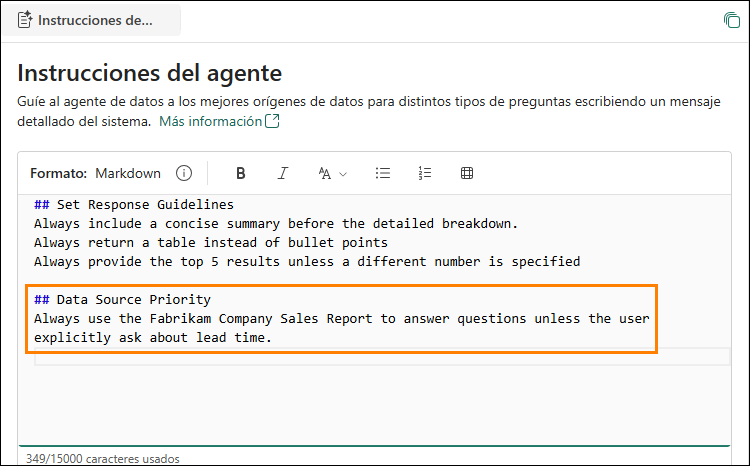

## Contenido destacado: Instrucciones de origen de datos

1. A continuación, veamos las instrucciones del origen de datos.

2. En el panel de instrucciones de IA, seleccione los puntos suspensivos junto al almacén de lago y, a continuación, **Instrucciones de origen de datos** y expanda el almacén de lago de datos. Observará que, a diferencia de los modelos semánticos, las instrucciones de IA son compatibles en el nivel de origen de datos para los almacenes de lago de datos.

    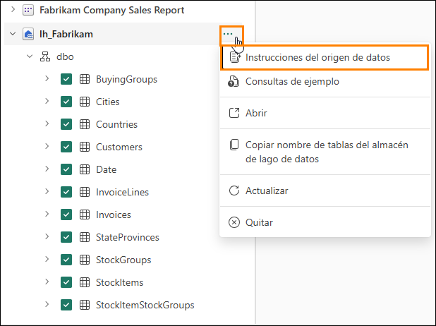

    La adición de instrucciones de origen de datos aquí puede ayudar a la IA a comprender mejor los datos de su almacén de lago de datos. Las instrucciones de IA bien definidas ayudarán a la IA a comprender el contexto empresarial, la terminología y las prioridades analíticas.

    Ha aprendido todo sobre las instrucciones de IA anteriormente en esta clase, cuando preparaba su modelo semántico para IA. No revisaremos toda esa información aquí. Tenga en cuenta que si cree que el agente de datos necesita más aclaraciones, aquí es donde debe agregarlas.

## Tarea 6: Crear ejemplos de preguntas

El ajuste de un agente de datos no es una configuración única, es un proceso continuo e iterativo que implica experimentación, observación y refinamiento. Parte del proceso de refinamiento es proporcionar consultas de ejemplo que pueden ayudar a la IA a comprender cómo responder preguntas complejas que pueden requerir mucho SQL o KQL en el origen de datos.

Los agentes de datos pueden aprovechar consultas de ejemplo, también conocidas como ejemplos de pocos intentos, para mejorar la precisión y la relevancia de sus respuestas al convertir las preguntas de lenguaje natural en SQL o KQL (NL2SQL, NL2KQL).

**ℹ️ Importante**

La característica de consultas de ejemplo no es compatible actualmente con los modelos semánticos.

Las consultas de ejemplo son un proceso de dos partes.

1) En primer lugar, proporcione una pregunta de ejemplo, la IA hará coincidir preguntas semánticamente similares a la pregunta que proporcione.

2) En segundo lugar, proporcione una consulta de ejemplo. Esta consulta gestionaría las combinaciones complejas, los predicados complejos y otros escenarios avanzados para ayudar al agente a formar una respuesta.

    Un laboratorio sobre ejemplos de preguntas **está fuera del ámbito de esta clase**. Sin embargo, si desea crear una consulta de ejemplo, puede hacerlo llevando a cabo los siguientes pasos:

3) Seleccione los puntos suspensivos junto al almacén de lago de datos y, a continuación, **Consultas de ejemplo** para abrir el panel.

    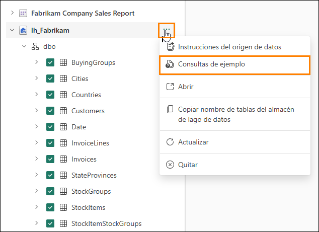

4) En el panel de consultas de ejemplo, haga clic en el botón **Agregar ejemplo**.

    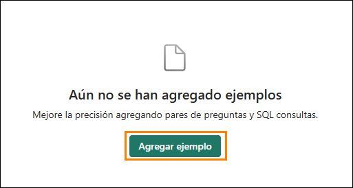

5) Agregue una pregunta de ejemplo y luego presione Entrar. Ejemplo: **Show sales by country that the product was manufactured in.**

    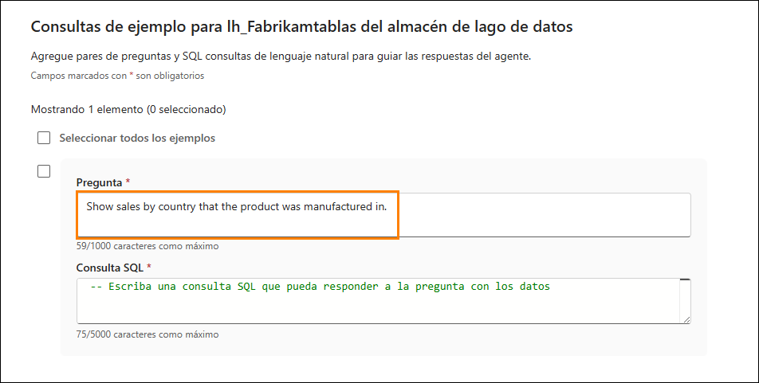

6) En el cuadro de diálogo Consulta SQL, introduzca el SQL que el agente debe usar para responder a este tipo de preguntas. Una vez completado, haga clic en la (X) en la esquina superior derecha y pruebe su agente.

    **ℹ️ Importante**

    El código aquí no se proporciona en el laboratorio, ya que está fuera del alcance de esta clase. Sin embargo, no dude en generar su propio código y explorarlo si el tiempo lo permite.

    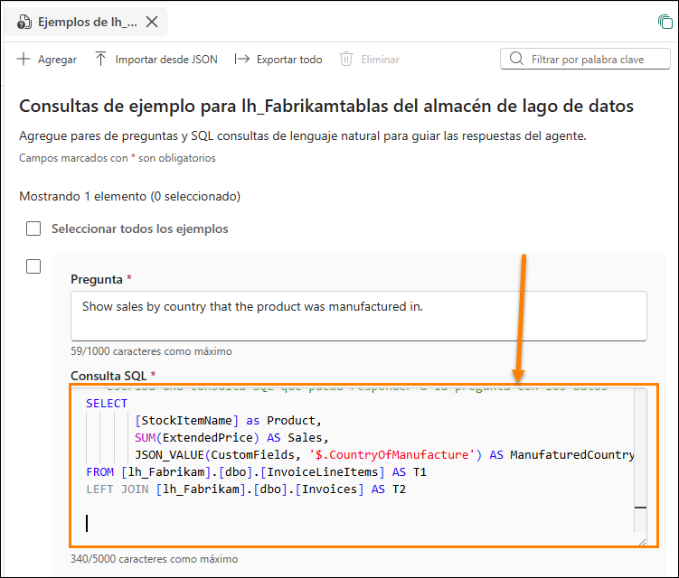

    **Sugerencia de PRO**: cada una de estas preguntas se dirige a diferentes escenarios analíticos: análisis geográfico, agregaciones filtradas, cálculos de ingresos y análisis jerárquico de tiempo. Experimente con variaciones para ver cómo se adapta el agente de datos a los diferentes estilos de pregunta.

    **Siga experimentando**: intente hacer preguntas más complejas en el agente y luego cree pares de preguntas/SQL que ayuden al agente de datos a responder a las solicitudes de los usuarios.

## Tarea 7: Publicar y compartir su agente de datos

1. Es hora de publicar su agente de datos. Haga clic en el botón **Publicar** en el menú Inicio.

    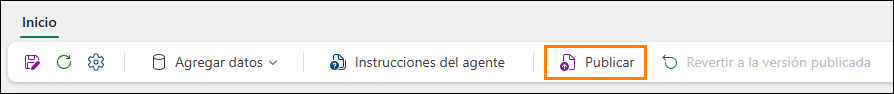

2. A continuación, proporcione una descripción a su agente. Incluya la finalidad y las capacidades del agente. Haga clic en **Publicar**.

    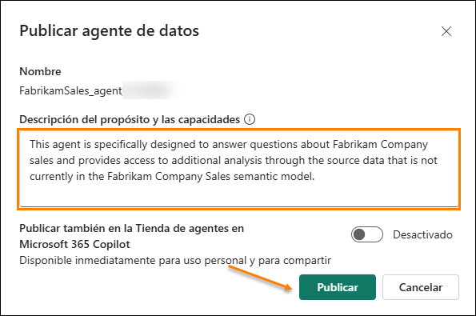

3. Después de publicar su agente, debe compartirlo. Haga clic en el botón **Compartir** en la esquina superior derecha de la pantalla.

    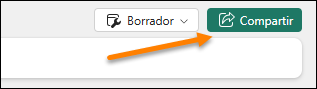

4. En el cuadro **Crear y enviar vínculo** que se abre, haga clic en el botón **Las personas de la organización pueden ver**.

    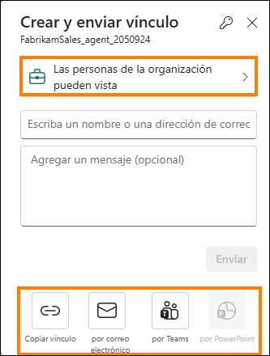

5. Seleccione su configuración de permisos aquí y, a continuación, haga clic en **Aplicar**.

    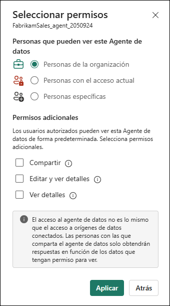

    **ℹ️ Importante**

    El acceso al agente de datos no es lo mismo que el acceso a los orígenes de datos conectados. Las personas con las que comparta el agente de datos solo obtendrán respuestas basadas en los datos que tengan permiso para ver.

6. El agente de datos de Fabric publicado se puede usar en varias plataformas, entre las que se incluyen:

    - Microsoft Fabric

    - Copilot Studio

    - Microsoft Teams

    - Notebooks

    - Copilot de Power BI

    - Fundición de IA de Azure

    - Aplicaciones personalizadas mediante API

7. En su espacio de trabajo, desplace el puntero sobre su agente de datos para revelar los puntos suspensivos **(…)**.

    

8. Haga clic en los puntos suspensivos y seleccione **Administrar permisos**.

    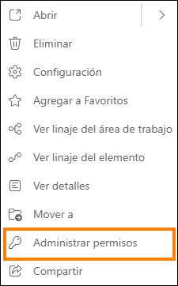

9. También puede compartir desde aquí o administrar quién tiene acceso directo al agente a través de su acceso al espacio de trabajo. Puede elegir entre **+ Agregar vínculo** en el menú Vínculos o **+ Agregar usuario** en el menú Acceso directo. La adición de usuarios al espacio de trabajo les dará acceso al agente.

    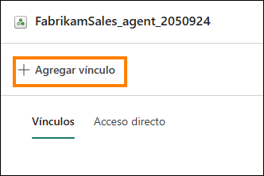

    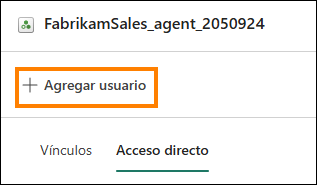

## Tarea 8: Consumir un agente de datos desde Copilot

1. Aunque el agente se puede utilizar de muchas maneras (consulte el paso 6 anterior), intentemos aprovechar nuestro agente de datos a través de la experiencia de Copilot independiente. En el espacio de trabajo, haga clic en el botón Copilot. (NOTA: Es posible que deba hacer clic en los puntos suspensivos de la barra lateral para mostrar el botón de Copilot).

    (Recordatorio: Asegúrese de apuntar a su agente de datos en el ejemplo).

    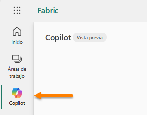

2. Seleccione el signo más: observe que su agente se ofrece como una opción para que Copilot la utilice. Esto pone de manifiesto la diferencia entre la experiencia independiente de Copilot y la del agente de datos.

    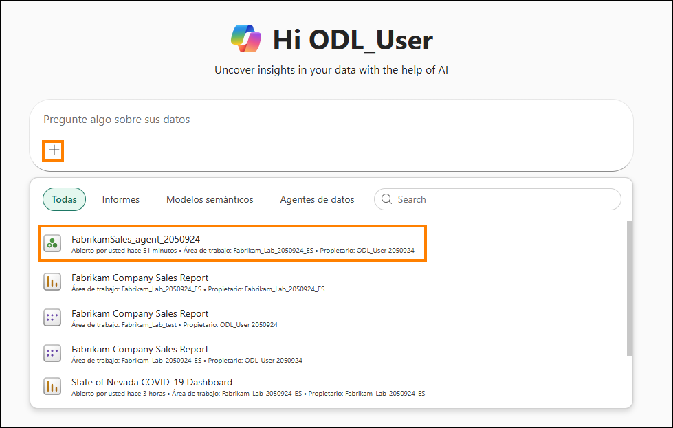

3. En su espacio de trabajo, desplace el puntero sobre su agente y haga clic en los puntos suspensivos (…) de nuevo.

    

4. Elija **Configuración** en el menú.

    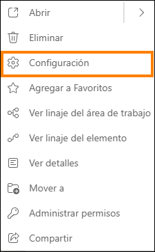

5. Elija **Aprobación** en la nueva ventana.

    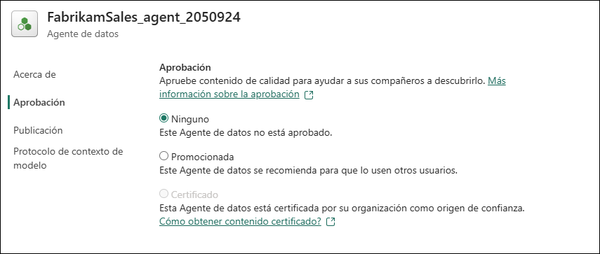

6. En el contexto de **Copilot** —especialmente cuando se trabaja con **agentes de datos** en Power BI o Microsoft Fabric— **para "aprobar un agente de datos"** significa otorgar una aprobación o certificación formal para ese agente dentro del entorno de una organización. Por lo general, esto implica hacer que el agente sea fácilmente detectable y confiable para los usuarios marcándolo como promocionado o certificado.

# Referencias

Chat With Your Data in a Day (CDIAD) le presenta algunas de las características clave al usar Copilot independiente en un espacio de trabajo de Fabric.

En el menú del servicio, la sección Ayuda (?) tiene vínculos a algunos recursos excelentes. Tenga en cuenta que la vista que ve depende de la experiencia en la que se encuentre actualmente y, por lo tanto, sus opciones pueden verse diferentes a la captura de pantalla que aparece a continuación.

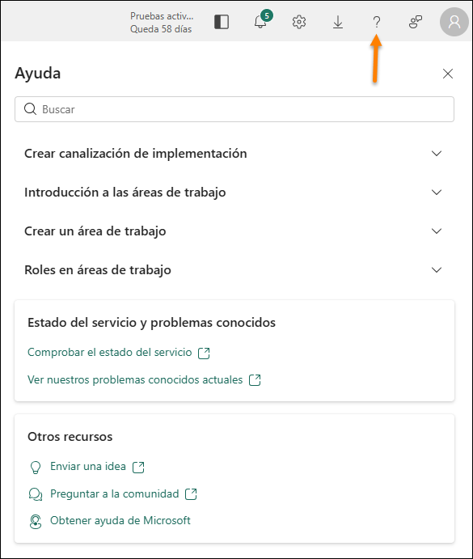

Estos son algunos recursos más que podrán ayudarle a seguir avanzando con Microsoft Fabric.

- Obtenga acceso a toda la información en la [Documentación de Microsoft Fabric](https://learn.microsoft.com/en-us/fabric/).

- Explore Fabric a través de la [Visita guiada](https://aka.ms/Fabric-GuidedTour).

- Regístrese en la [prueba gratuita de Microsoft Fabric](https://aka.ms/try-fabric).

- Visite el [sitio web de Microsoft Fabric](https://aka.ms/microsoft-fabric).

- Adquiera nuevas capacidades mediante la exploración de los [módulos de aprendizaje de Fabric](https://aka.ms/learn-fabric).

- Lea el [libro electrónico gratuito sobre cómo empezar a usar Fabric](https://aka.ms/fabric-get-started-ebook).

- Únase a la [comunidad de Fabric](https://aka.ms/fabric-community) para publicar sus preguntas, compartir sus comentarios y aprender de otros.

Lea de manera más detallada la documentación técnica relevante sobre Copilot:

- [Información general de Copilot para Power BI: Power BI | Microsoft Learn](https://learn.microsoft.com/en-us/power-bi/create-reports/copilot-introduction)

- [Experiencia de Copilot independiente en Power BI (versión preliminar): Power BI | Microsoft Learn](https://learn.microsoft.com/en-us/power-bi/create-reports/copilot-chat-with-data-standalone)

- [Configuración de administrador de Copilot de Microsoft Fabric | Microsoft Learn](https://learn.microsoft.com/en-us/fabric/admin/service-admin-portal-copilot)

- [Creación de agentes de datos de Fabric (versión preliminar): aprenda a crear un agente de datos de Fabric | Microsoft Learn](https://learn.microsoft.com/en-us/fabric/data-science/concept-data-agent)

- [Procedimientos recomendados para la configuración del agente de datos: Microsoft Fabric | Microsoft Learn](https://learn.microsoft.com/en-us/fabric/data-science/data-agent-configuration-best-practices)

- [Copilot para Microsoft Fabric y Power BI: P+F: Microsoft Fabric | Microsoft Learn](https://learn.microsoft.com/en-us/fabric/fundamentals/copilot-faq-fabric)

© 2026 Microsoft Corporation. Todos los derechos reservados.

Al participar en esta demostración o laboratorio práctico, acepta las siguientes condiciones:

Microsoft Corporation pone a su disposición la tecnología o funcionalidad descrita en esta demostración/laboratorio práctico con el fin de obtener comentarios por su parte y de facilitarle una experiencia de aprendizaje. Esta demostración/laboratorio práctico solo se puede usar para evaluar las características de tal tecnología o funcionalidad y para proporcionar comentarios a Microsoft. No se puede usar para ningún otro propósito. Ninguna parte de esta demostración/ laboratorio práctico se puede modificar, copiar, distribuir, transmitir, mostrar, realizar, reproducir, publicar, licenciar, transferir ni vender, ni tampoco crear trabajos derivados de ella.

LA COPIA O REPRODUCCIÓN DE ESTA DEMOSTRACIÓN/LABORATORIO PRÁCTICO (O PARTE DE ELLA) EN CUALQUIER OTRO SERVIDOR O UBICACIÓN PARA SU REPRODUCCIÓN O DISTRIBUCIÓN POSTERIOR QUEDA EXPRESAMENTE PROHIBIDA.

ESTA DEMOSTRACIÓN/LABORATORIO PRÁCTICO PROPORCIONA CIERTAS FUNCIONES Y CARACTERÍSTICAS DE PRODUCTOS O TECNOLOGÍAS DE SOFTWARE (INCLUIDOS POSIBLES NUEVOS CONCEPTOS Y CARACTERÍSTICAS) EN UN ENTORNO SIMULADO SIN INSTALACIÓN O CONFIGURACIÓN COMPLEJA PARA EL PROPÓSITO ARRIBA DESCRITO. LA TECNOLOGÍA/ CONCEPTOS DESCRITOS EN ESTA DEMOSTRACIÓN/LABORATORIO PRÁCTICO NO REPRESENTAN LA FUNCIONALIDAD COMPLETA DE LAS CARACTERÍSTICAS Y, EN ESTE SENTIDO, ES POSIBLE QUE NO FUNCIONEN DEL MODO EN QUE LO HARÁN EN UNA VERSIÓN FINAL. ASIMISMO, PUEDE QUE NO SE PUBLIQUE UNA VERSIÓN FINAL DE TALES CARACTERÍSTICAS O CONCEPTOS. DE IGUAL MODO, SU EXPERIENCIA CON EL USO DE ESTAS CARACTERÍSTICAS Y FUNCIONALIDADES EN UN ENTORNO FÍSICO PUEDE SER DIFERENTE.

**COMENTARIOS.** Si envía comentarios a Microsoft sobre las características, funcionalidades o conceptos de tecnología descritos en esta demostración/laboratorio práctico, acepta otorgar a Microsoft, sin cargo alguno, el derecho a usar, compartir y comercializar sus comentarios de cualquier modo y para cualquier fin. También concederá a terceros, sin cargo alguno, los derechos de patente necesarios para que sus productos, tecnologías y servicios usen o interactúen con cualquier parte específica de un software o servicio de Microsoft que incluya los comentarios. No enviará comentarios que estén sujetos a una licencia que obligue a Microsoft a conceder su software o documentación bajo licencia a terceras partes porque incluyamos sus comentarios en ellos. Estos derechos seguirán vigentes después del vencimiento de este acuerdo.

MICROSOFT CORPORATION RENUNCIA POR LA PRESENTE A TODAS LAS GARANTÍAS Y CONDICIONES RELATIVAS A LA DEMOSTRACIÓN/LABORATORIO PRÁCTICO, INCLUIDA CUALQUIER GARANTÍA Y CONDICIÓN DE COMERCIABILIDAD (YA SEA EXPRESA, IMPLÍCITA O ESTATUTARIA), DE IDONEIDAD PARA UN FIN DETERMINADO, DE TITULARIDAD Y DE AUSENCIA DE INFRACCIÓN. MICROSOFT NO DECLARA NI GARANTIZA LA EXACTITUD DE LOS RESULTADOS, EL RESULTADO DERIVADO DE LA REALIZACIÓN DE LA DEMOSTRACIÓN/LABORATORIO PRÁCTICO NI LA IDONEIDAD DE LA INFORMACIÓN CONTENIDA EN ELLA CON NINGÚN PROPÓSITO.

**DECLINACIÓN DE RESPONSABILIDADES**

Esta demostración/laboratorio práctico contiene solo una parte de las nuevas características y mejoras realizadas en Microsoft Power BI. Puede que algunas de las características cambien en versiones futuras del producto. En esta demostración/laboratorio práctico, conocerá algunas de estas nuevas características, pero no todas.
